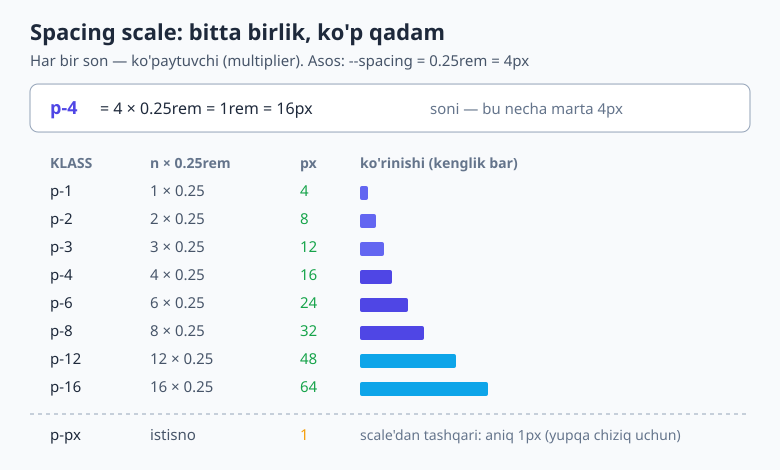
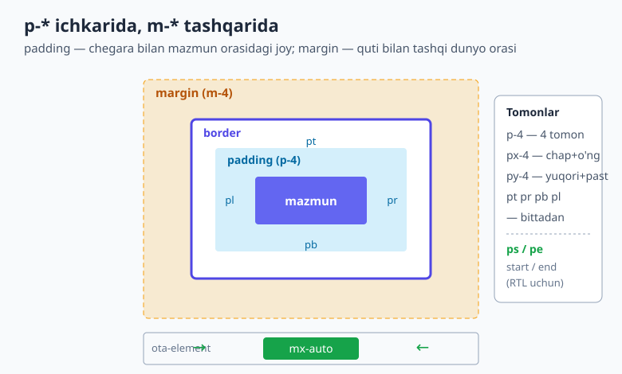
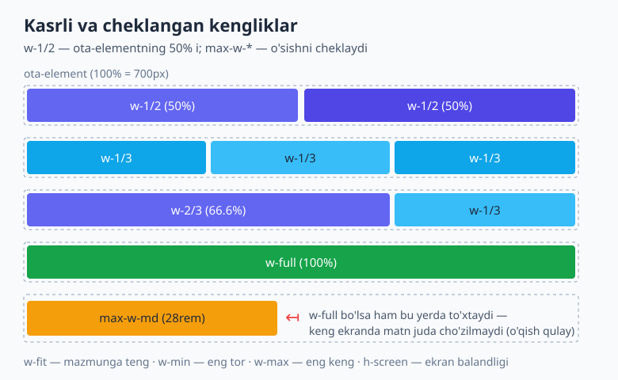

# 04 — Spacing, sizing va o'lcham tizimi

[⬅️ Oldingi: 03 — Utility-first ish jarayoni](./03-utility-first-ish-jarayoni.md) · [🏠 README](./README.md) · [Keyingi: 05 — Display va box model utility'lari ➡️](./05-box-model-display.md)

> **Bu bobda:** Tailwind'ning yuragi bo'lgan **spacing scale**'ini — nega ixtiyoriy `13px`, `7px` o'rniga bir xil qadamli tizim kerakligini — tushunasiz. `--spacing` o'zgaruvchisining sirini ochasiz (`p-4` dagi `4` aslida nima?), `p-*`/`m-*`/`w-*`/`h-*`/`gap-*` utility'larini, mantiqiy tomonlarni (`ps-*`/`pe-*`), markazlash (`mx-auto`), manfiy qiymatlar (`-mt-4`), kasrli kengliklar (`w-1/2`), `size-*` qulayligini, v4 ning dinamik qiymatlarini (`mt-17`, `w-29`) va arbitrary (`w-[37rem]`) ni o'rganasiz.

---

## 04.1 Nega "scale" kerak? — dizayn tizimining yuragi

Tasavvur qiling, ikki dasturchi bitta saytni yozyapti. Biri tugmaga `padding: 12px` beradi, ikkinchisi boshqa tugmaga `padding: 11px`. Karta orasidagi masofa bir joyda `18px`, boshqa joyda `20px`. Ko'z buni darrov sezmaydi, lekin sahifa **biroz "iflos"**, tartibsiz ko'rinadi — go'yo har bir element o'zicha yashayotgandek.

Muammoning ildizi shu: **ixtiyoriy sonlar bir-biriga "tutash" emas.** `7px`, `13px`, `22px` — bularning orasida hech qanday matematik bog'liqlik yo'q.

Yechim — **scale (shkala)**: hamma masofalar bitta asosiy birlikning **karralari** (multiples) bo'lsin. Masalan, asosiy birlik `4px` bo'lsa, ruxsat etilgan masofalar — `4, 8, 12, 16, 24, 32...` Endi nima qo'ysangiz ham, u boshqa hamma narsa bilan **ohangdosh** (rhythmic) bo'ladi. Bu — har qanday jiddiy dizayn tizimining (Material, Apple HIG, Tailwind) asosi.

> 💡 **Analogiya:** Musiqada notalar ixtiyoriy emas — ular gamma (scale) ichidan tanlanadi, shuning uchun birga chalinganda **uyg'un** jaranglaydi. Spacing scale ham xuddi shunday: `4`ning karralarini "tortgan"da UI uyg'un, bir maromda ko'rinadi. `13px` esa — gammadan tashqaridagi "yolg'on nota".

Tailwind bu falsafani o'z ichiga olib kelgan. Siz `13px` deb **yozolmaysiz ham** (maxsus harakatsiz) — buning o'rniga `p-3` (12px) yoki `p-4` (16px) ni tanlaysiz. Ana shu cheklov — aslida sovg'a: u sizni har safar tizim ichida qolishga majbur qiladi.

---

## 04.2 `--spacing` o'zgaruvchisi: `p-4` dagi `4` nima?

Mana eng muhim "nega" — buni bir marta tushunsangiz, butun bob ochiladi.

Tailwind v4 da bitta CSS o'zgaruvchisi bor: **`--spacing`**, va uning standart qiymati **`0.25rem`** (ya'ni 16px asosli ildizda `4px`).

`p-4` yozganingizda, `4` — bu piksel **emas**. Bu **ko'paytuvchi** (multiplier). Tailwind shunday hisoblaydi:

```
p-4  →  padding: calc(var(--spacing) * 4)
     →  padding: calc(0.25rem * 4)
     →  padding: 1rem
     →  16px
```

Buni o'z ko'zingiz bilan ko'rasiz: agar `@import "tailwindcss";` qilingan loyihada `p-4` ishlatsangiz, kompilyatsiya qilingan CSS aynan shunday chiqadi:

```css
.p-4 {
  padding: calc(var(--spacing) * 4);
}
```

Demak qoida oddiy: **klassdagi son × `0.25rem` (4px)**. Mana eng ko'p ishlatiladigan qadamlar:

| Klass | Hisob | rem | px |
|---|---|---|---|
| `p-px` | maxsus istisno | — | **1px** |
| `p-0.5` | 0.5 × 0.25rem | 0.125rem | 2px |
| `p-1` | 1 × 0.25rem | 0.25rem | 4px |
| `p-2` | 2 × 0.25rem | 0.5rem | 8px |
| `p-3` | 3 × 0.25rem | 0.75rem | 12px |
| `p-4` | 4 × 0.25rem | 1rem | **16px** |
| `p-6` | 6 × 0.25rem | 1.5rem | 24px |
| `p-8` | 8 × 0.25rem | 2rem | 32px |
| `p-12` | 12 × 0.25rem | 3rem | 48px |



> 📌 **`p-px` — yagona istisno.** Scale'dagi hamma narsa `4px` ning karrasi, lekin ba'zan sizga aynan **1 piksel** kerak bo'ladi (masalan, ingichka ajratuvchi chiziq). Shuning uchun Tailwind `p-px` (`padding: 1px`) ni alohida beradi. Xuddi shu — `m-px`, `mt-px` va h.k.

> 💡 **Nega `rem`, `px` emas?** `--spacing` ni `rem`da berish — ataylab. `rem` foydalanuvchining brauzerdagi shrift o'lchamiga bog'liq. Agar kimdir ko'rish qulayligi uchun brauzer shriftini kattalashtirsa, **butun spacing tizimi ham u bilan birga o'sadi** — UI proportsional kattaroq bo'ladi, sinmaydi. Bu — hammaboplik (accessibility) uchun katta yutuq. `rem` va `em` haqida [HTML & CSS kitobining o'lchovlar bobida](../html-css/12-oolchovlar-tipografiya-ranglar.md) batafsil o'qishingiz mumkin.

---

## 04.3 Padding: ichki bo'shliq

**padding** — element chegarasi bilan uning mazmuni orasidagi ichki masofa (box model'ni eslang: [HTML & CSS — box model](../html-css/11-box-model.md)). Tailwind'da uni boshqarishning bir nechta darajasi bor:

```html
<!-- 4 tomon ham -->
<div class="p-4">...</div>

<!-- o'qlar bo'yicha -->
<div class="px-4">...</div>   <!-- chap + o'ng (x o'qi) -->
<div class="py-2">...</div>   <!-- yuqori + past (y o'qi) -->

<!-- bittadan tomon -->
<div class="pt-4">...</div>   <!-- top    (yuqori) -->
<div class="pr-4">...</div>   <!-- right  (o'ng) -->
<div class="pb-4">...</div>   <!-- bottom (past) -->
<div class="pl-4">...</div>   <!-- left   (chap) -->
```

Ko'pincha ularni **birlashtirib** ishlatasiz. Tipik tugma:

```html
<button class="px-4 py-2 ...">Saqlash</button>
```

Bu yerda yon padding (`px-4` = 16px) tepa-pastdagidan (`py-2` = 8px) kattaroq — tugmaning klassik, ko'rkam ko'rinishi shunday chiqadi.

### Mantiqiy tomonlar: `ps-*` va `pe-*` (RTL uchun)

`pl` (left) va `pr` (right) — bu **fizik** tomonlar: doim chap va o'ng. Lekin matn yo'nalishi har xil bo'lishi mumkin: o'zbek/ingliz tili chapdan-o'ngga (LTR), arab/fors tili o'ngdan-chapga (RTL).

Shuning uchun **mantiqiy (logical)** variant bor:

- `ps-*` — **start** (matn boshlanadigan tomon): LTR da chap, RTL da o'ng.
- `pe-*` — **end** (matn tugaydigan tomon): LTR da o'ng, RTL da chap.

```html
<!-- piktogramma matndan oldin; RTL da avtomatik o'ng tomonga o'tadi -->
<button class="ps-3 pe-4">
  <svg>...</svg> Yuborish
</button>
```

```css
/* Tailwind buni shunday chiqaradi: */
.ps-3 { padding-inline-start: calc(var(--spacing) * 3); }
.pe-4 { padding-inline-end:   calc(var(--spacing) * 4); }
```

> 💡 Agar saytingiz faqat bitta yo'nalishda bo'lsa, `pl`/`pr` yetarli. Lekin ko'p tilli (jumladan arab tilini ham qo'llab-quvvatlovchi) ilova qilsangiz, boshidanoq `ps`/`pe` ga o'rganib qoling — RTL ni yoqqaningizda hech narsani qayta yozmaysiz.

---

## 04.4 Margin: tashqi bo'shliq va markazlash

**margin** — element bilan uning atrofidagi qo'shnilar orasidagi tashqi masofa. Sintaksis padding bilan **bir xil**, faqat `p` o'rniga `m`:

```html
<div class="m-4">...</div>     <!-- 4 tomon -->
<div class="mx-4 my-2">...</div><!-- o'qlar -->
<div class="mt-4">...</div>     <!-- top, right, bottom, left: mt/mr/mb/ml -->
<div class="ms-4 me-2">...</div><!-- mantiqiy: start / end -->
```



### `mx-auto` — gorizontal markazlash

CSS dagi klassik `margin: 0 auto` hiylasi Tailwind'da `mx-auto`:

```html
<div class="mx-auto max-w-md">
  Men sahifa o'rtasida turaman.
</div>
```

`auto` — "qolgan bo'sh joyni teng bo'lib ol" degani. Shuning uchun chap va o'ng margin teng bo'lib, element markazga keladi. **Muhim shart:** elementning eni cheklangan bo'lishi kerak (`max-w-md`, `w-1/2` va h.k.) — aks holda u butun enni egallaydi va markazlashga joy qolmaydi.

```css
.mx-auto { margin-inline: auto; }
```

### Manfiy margin: `-mt-4`, `-mx-2`

Ba'zan elementni **ichkariga tortish** yoki ustma-ust qo'yish kerak. Buning uchun klass oldiga **minus** qo'yasiz:

```html
<!-- avatar kartaning yuqori chegarasidan tashqariga "chiqib" turadi -->
<div class="rounded-xl bg-white p-6">
  
  ...
</div>
```

```css
.-mt-4 { margin-top: calc(var(--spacing) * -4); }
```

> ⚠️ **Manfiy margin'ni ehtiyot bilan ishlating.** U kuchli vosita, lekin tartibni "buzishi" mumkin: elementlar bir-birining ustiga chiqib, sichqoncha bilan bosish joyini to'sib qo'yishi mumkin. Eng tipik to'g'ri ishlatilishi — yuqoridagidek qisman ustma-ust ("overlap") effektlari: kartadan chiqib turuvchi avatar, bo'limni biroz tepaga tortish.

---

## 04.5 Width va height: o'lchamlar

Kenglik (`w-*`) va balandlik (`h-*`) ham **xuddi shu spacing scale**'ni ishlatadi — son × 0.25rem:

```html
<div class="w-64 h-32">...</div>  <!-- 256px × 128px -->
<div class="size-10">...</div>    <!-- 40px × 40px (pastda batafsil) -->
```

Lekin o'lchamlarda scale'dan tashqari yana bir nechta juda foydali **maxsus** qiymatlar bor.

### Kasrli (foizli) kengliklar

Layout'da eng ko'p kerak bo'ladigani — ota-elementning **ulushi** (foiz):

```html
<div class="flex">
  <div class="w-1/2">Chap yarim</div>
  <div class="w-1/2">O'ng yarim</div>
</div>
```

| Klass | Natija |
|---|---|
| `w-1/2` | 50% |
| `w-1/3` | 33.33% |
| `w-2/3` | 66.66% |
| `w-1/4` | 25% |
| `w-3/4` | 75% |
| `w-full` | 100% |

```css
.w-1\/2 { width: calc(1 / 2 * 100%); }
.w-1\/3 { width: calc(1 / 3 * 100%); }
```



### Ekran va to'liq o'lchamlar

```html
<div class="w-full">...</div>   <!-- ota-elementning 100% i -->
<div class="h-screen">...</div> <!-- ekran balandligi: 100vh -->
<div class="w-screen">...</div> <!-- ekran kengligi: 100vw -->
```

```css
.h-screen { height: 100vh; }
```

### Mazmunga moslashuvchi: `w-fit`, `w-min`, `w-max`

Ba'zan kenglik aniq son emas, **mazmunga qarab** bo'lishi kerak:

| Klass | Ma'nosi | CSS |
|---|---|---|
| `w-fit` | mazmunga teng (lekin ota-elementdan oshmaydi) | `fit-content` |
| `w-min` | iloji boricha **tor** (so'zlar ko'chadi) | `min-content` |
| `w-max` | iloji boricha **keng** (matn ko'chmaydi) | `max-content` |

```html
<!-- tugma matni qancha bo'lsa, shuncha keng -->
<button class="w-fit px-4 py-2">OK</button>
```

### `min-w-*`, `max-w-*` — chegaralar

Eng muhim amaliy holat — **`max-w-*`** bilan o'qish kengligini cheklash. Juda keng ekranda matn satrlari cho'zilib ketsa, o'qish charchatadi. Yechim:

```html
<article class="mx-auto max-w-prose">
  Uzun maqola matni...
</article>
```

`max-w-prose` — Tailwind'ning tayyor "o'qish uchun qulay kenglik" qiymati: **65ch** (taxminan 65 ta belgi). Boshqa nomli konteyner o'lchamlari:

| Klass | Qiymat |
|---|---|
| `max-w-md` | 28rem (≈448px) |
| `max-w-lg` | 32rem |
| `max-w-3xl` | 48rem |
| `max-w-prose` | 65ch (o'qish uchun) |

```css
.max-w-md   { max-width: var(--container-md); }   /* --container-md: 28rem */
.max-w-prose{ max-width: 65ch; }
```

`min-w-*`, `min-h-*`, `max-h-*` ham bor va xuddi shunday ishlaydi. Eng ko'p uchraydigani: `min-h-screen` — "sahifa kamida butun ekran balandligida bo'lsin" (footer pastga yopishib qolmasligi uchun).

---

## 04.6 `size-*` — v4 ning qulayligi (eni = bo'yi)

Juda tez-tez kvadrat element kerak bo'ladi: ikonka, avatar, status nuqtasi. Eski uslubda `w-10 h-10` deb **ikkita** klass yozardingiz. Tailwind v4 da bitta klass yetadi:

```html
  <!-- 40×40 -->
<span class="size-2 rounded-full bg-green-500"></span><!-- 8×8 nuqta -->
```

```css
.size-10 {
  width:  calc(var(--spacing) * 10);
  height: calc(var(--spacing) * 10);
}
```

`size-*` ham xuddi spacing scale'ni ishlatadi va kasrlarni qo'llab-quvvatlaydi (`size-full`, `size-1/2`). Ikonka va avatarlar uchun buni odatga aylantiring — kod tozaroq bo'ladi.

---

## 04.7 Dinamik qiymatlar (v4) va arbitrary `[...]`

Bu — v4 ning eng yoqimli yangiliklaridan biri. Avval (v3 da) faqat oldindan belgilangan qadamlar bor edi: `mt-16` bor, lekin `mt-17` **yo'q** edi — sozlamaga qo'shish kerak edi.

v4 da esa, son × `--spacing` formulasi tufayli, **istalgan butun son** to'g'ridan-to'g'ri ishlaydi — hech narsa sozlamasdan:

```html
<div class="mt-17 w-29 p-13">...</div>  <!-- 68px, 116px, 52px -->
```

```css
.mt-17 { margin-top: calc(var(--spacing) * 17); }
.w-29  { width:      calc(var(--spacing) * 29); }
.p-13  { padding:    calc(var(--spacing) * 13); }
```

Bular hali ham **scale ichida** — `4px` ning karralari (17×4=68, 29×4=116). Ya'ni "dinamik" bo'lsa ham, uyg'unlik buzilmaydi.

### Arbitrary qiymatlar: `w-[37rem]`, `p-[3px]`

Agar sizga scale'ga **umuman tushmaydigan** aniq qiymat kerak bo'lsa (masalan tashqi dizayndagi `37rem` yoki `3px`), kvadrat qavs ichida to'g'ridan-to'g'ri yozasiz:

```html
<div class="w-[37rem] p-[3px] h-[calc(100vh-4rem)]">...</div>
```

```css
.w-\[37rem\] { width: 37rem; }
.p-\[3px\]   { padding: 3px; }
```

> 💡 **Qaysisini qachon?** Tartib quyidagicha bo'lsin:
> 1. **Avval scale qadami** — `p-4`, `w-64`. 95% holatda shu yetadi.
> 2. **Keyin dinamik son** — `mt-17`, `w-29`. Scale ichida, lekin g'alати qadam kerak bo'lsa.
> 3. **Eng oxirida arbitrary `[...]`** — faqat scale'ga sig'maydigan tashqi talab bo'lsa. Buni ko'p ishlatsangiz, demak dizayn tizimingiz "qochib" ketyapti — `--spacing` ni yoki nomli qiymatni sozlash haqida o'ylang ([18-bob](./18-theme-dizayn-tizimi.md)).

---

## 04.8 Gap: zamonaviy "orasidagi masofa" (qisqa kirish)

Hozirgacha biz **bitta** elementning ichi (padding) va tashqarisi (margin) haqida gapirdik. Ammo eng ko'p uchraydigan ehtiyoj — **bir nechta element orasidagi** bir xil masofa (ro'yxat, tugmalar qatori, karta to'plami).

Eski usul har bir bolaga margin berish edi — lekin oxirgi elementning ortiqcha margin'i muammo tug'dirardi. Zamonaviy yechim — ota-elementga bitta **`gap`**:

```html
<div class="flex gap-4">      <!-- har bola orasida 16px -->
  <button>Bekor</button>
  <button>Saqlash</button>
</div>
```

```css
.gap-4   { gap: calc(var(--spacing) * 4); }
.gap-x-2 { column-gap: calc(var(--spacing) * 2); }  /* faqat gorizontal */
.gap-y-6 { row-gap:    calc(var(--spacing) * 6); }  /* faqat vertikal  */
```

`gap` **faqat flex va grid** konteynerlarda ishlaydi — shuning uchun uni keyingi layout boblarida (Flexbox va Grid) to'liq o'rganamiz. Hozircha shuni biling: bola elementlar orasiga masofa kerak bo'lsa, birinchi o'ylaydiganingiz — `gap`.

> 📌 Yana bir "katta aka" bor: `space-x-*` / `space-y-*` (eski usul, flex bo'lmagan joyda ham ishlaydi). U haqda [05-bobда](./05-box-model-display.md) gaplashamiz. Hozircha: zamonaviy flex/grid layout'da deyarli har doim `gap` afzal.

---

## 04.9 Amaliyot: bir maromli vertikal ritm

Endi nazariyani amalga ulaymiz. Yaxshi UI ning siri — **kam sonli, takrorlanuvchi masofalar**. Butun sayt davomida 20 xil emas, 4-5 xil "qadam" ishlatsangiz, ko'z buni **tartib** sifatida his qiladi.

Tipik karta:

```html
<div class="max-w-md rounded-xl bg-white p-6 shadow">
  <h3 class="text-lg font-semibold">Sarlavha</h3>
  <p class="mt-2 text-gray-600">
    Sarlavhadan keyin kichik masofa (mt-2 = 8px).
  </p>
  <button class="mt-4 px-4 py-2 ...">Batafsil</button>
</div>
```

E'tibor bering: `p-6` (karta ichki nafasi), `mt-2` (zич bog'liq elementlar), `mt-4` (kattaroq mantiqiy bo'linish) — hammasi bitta scale'dan. Bu — **vertikal ritm** (vertical rhythm).

Bo'limlar orasidagi masofa esa kattaroq, lekin baribir scale'dan:

```html
<section class="py-16">...</section>   <!-- bo'lim: 64px tepa-past -->
<section class="py-16">...</section>
```

> 💡 **Maslahat:** loyiha boshida "ruxsat etilgan masofalar" ni o'zingiz uchun belgilab oling — masalan: elementlar ichida `2, 4, 6`, bo'limlar orasida `12, 16, 24`. Keyin shu ro'yxatdan chiqmaslikka harakat qiling. Bu — professional natijaning eng arzon siri.

### Scale'ni sozlash (qisqa preview)

Va nihoyat — agar `0.25rem` (4px) sizga to'g'ri kelmasa-chi? v4 da **bitta o'zgaruvchini** o'zgartirib, butun tizimni qayta o'lchashingiz mumkin:

```css
@import "tailwindcss";

@theme {
  --spacing: 0.2rem;   /* endi p-4 = 0.8rem = ~13px, hamma narsa zичroq */
}
```

Yoki **nomli** maxsus o'lcham qo'shasiz:

```css
@theme {
  --spacing-card: 1.75rem;   /* p-card, m-card, gap-card ishlaydi */
}
```

Buning to'liq mexanikasini — namespace'lar, token tizimi va `@theme` — [18-bobda (dizayn tizimi)](./18-theme-dizayn-tizimi.md) o'rganamiz. Hozircha shuni biling: butun spacing tizimi **bitta CSS o'zgaruvchisidan** o'sib chiqadi, va u sizning qo'lingizda.

---

## Mashqlar

> Har bir mashq uchun `@import "tailwindcss";` qilingan loyihada (02-bobdagi) HTML yozib, brauzerda DevTools bilan tekshiring. Hisoblashlarni qog'ozda ham qiling — son × 0.25rem formulasi qo'lingizga o'tirsin.

### Mashq 1 — `p-*` ni piksega aylantiring

Quyidagilarning har biri necha piksel (16px ildiz shrifti)? `p-3`, `p-5`, `p-10`, `p-px`.

<details markdown="1"><summary>Yechim</summary>

Formula: son × 0.25rem = son × 4px.

- `p-3` → 3 × 4 = **12px**
- `p-5` → 5 × 4 = **20px**
- `p-10` → 10 × 4 = **40px**
- `p-px` → maxsus istisno, son emas → **1px**

</details>

### Mashq 2 — Tugmani yasang

Yon padding tepa-pastdan ikki barobar katta bo'lgan tugma yozing: gorizontal 16px, vertikal 8px.

<details markdown="1"><summary>Yechim</summary>

```html
<button class="px-4 py-2">Bosing</button>
```

`px-4` = 16px (chap+o'ng), `py-2` = 8px (yuqori+past). Bu — eng klassik tugma kombinatsiyasi. To'rt alohida klass (`pl-4 pr-4 pt-2 pb-2`) yozish ham mumkin, lekin `px`/`py` ancha toza.

</details>

### Mashq 3 — Blokni markazga qo'ying

Eni eng ko'pi 32rem bo'lgan kartani sahifa o'rtasiga joylashtiring.

<details markdown="1"><summary>Yechim</summary>

```html
<div class="mx-auto max-w-lg">...</div>
```

`max-w-lg` = 32rem (kenglikni cheklaydi), `mx-auto` esa chap/o'ng margin'ni `auto` qilib markazlaydi. **Eslatma:** kenglik cheklanmasa (`max-w-*` yoki `w-*` bo'lmasa), `mx-auto` ishlamaydi — element butun enni egallaydi.

</details>

### Mashq 4 — Ikonkani bitta klass bilan

Yashil rangli (`bg-green-500`) 12×12px doira "online" nuqtasini yozing — eni va bo'yini **bitta** klass bilan bering.

<details markdown="1"><summary>Yechim</summary>

```html
<span class="size-3 rounded-full bg-green-500"></span>
```

`size-3` = `w-3 h-3` = 12×12px. `rounded-full` uni to'liq doira qiladi. `size-*` aynan shunday holatlar — ikonka, avatar, nuqta — uchun yaratilgan.

</details>

### Mashq 5 — Dinamik vs arbitrary

Sizga (a) `68px` margin-top va (b) tashqi dizayndan kelgan aniq `37rem` kenglik kerak. Qaysi biri uchun dinamik scale qiymati, qaysi biri uchun arbitrary `[...]` to'g'ri keladi?

<details markdown="1"><summary>Yechim</summary>

- (a) `68px` = 17 × 4px → scale ichida! Dinamik qiymat: **`mt-17`**.
- (b) `37rem` scale'ga (4px karralariga) tushmaydi → arbitrary: **`w-[37rem]`**.

```html
<div class="mt-17 w-[37rem]">...</div>
```

Qoida: avval scale (`mt-17` kabi dinamik son ham scale!), faqat scale'ga sig'maydigan qiymat uchun arbitrary.

</details>

### Mashq 6 — Manfiy margin bilan overlap

Oq kartaning yuqori chegarasidan tashqariga 24px "chiqib" turuvchi 64×64px dumaloq avatar qo'ying.

<details markdown="1"><summary>Yechim</summary>

```html
<div class="rounded-xl bg-white p-6 shadow">
  
  <h3 class="mt-2">Foydalanuvchi</h3>
</div>
```

`size-16` = 64×64px. `-mt-12` = -48px... ehtiyot bo'ling, savol 24px so'radi — to'g'risi **`-mt-6`** (-24px). Manfiy margin elementni yuqoriga tortib, kartadan chiqarib turadi. Bu — eng tipik to'g'ri "overlap" namunasi.

</details>

### Mashq 7 — O'qish kengligini cheklang

Uzun maqola matni keng ekranda satrma-satr cho'zilib ketmasligi (o'qish qulay bo'lishi) uchun nima qilasiz?

<details markdown="1"><summary>Yechim</summary>

```html
<article class="mx-auto max-w-prose">...</article>
```

`max-w-prose` = 65ch — taxminan 65 ta belgi kengligi, ko'z uchun ideal o'qish satri. `mx-auto` esa uni keng ekranda markazda ushlab turadi. Bu — har qanday blog/maqola sahifasining birinchi qadami.

</details>

---

Endi siz spacing tizimining "nega" va "qanday" tomonlarini bilasiz: bitta `--spacing` o'zgaruvchisi, son × 0.25rem formulasi, padding/margin/width/height/gap utility'lari, `size-*` qulayligi va dinamik/arbitrary qiymatlar orasidagi farq. Bu — barcha keyingi layout boblarining poydevori. Keyingi bobda bu o'lchamlarni elementlar **qanday joylashishini** belgilovchi `display` va box model utility'lari bilan birlashtiramiz.

[⬅️ Oldingi: 03 — Utility-first ish jarayoni](./03-utility-first-ish-jarayoni.md) · [🏠 README](./README.md) · [Keyingi: 05 — Display va box model utility'lari ➡️](./05-box-model-display.md)
