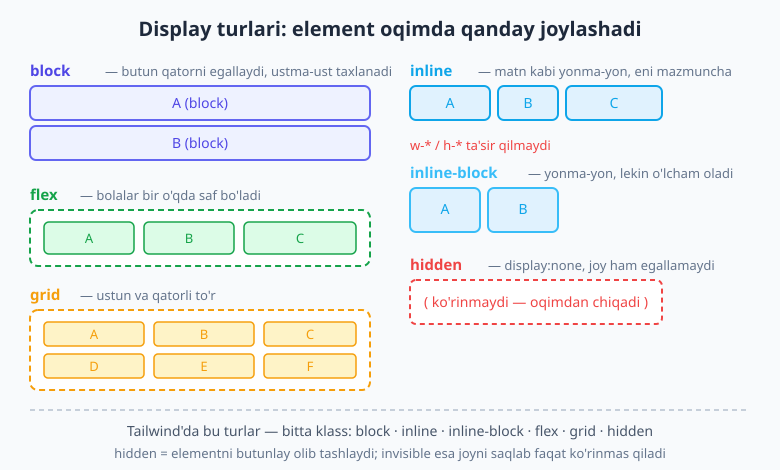
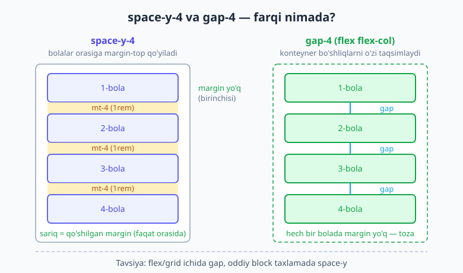
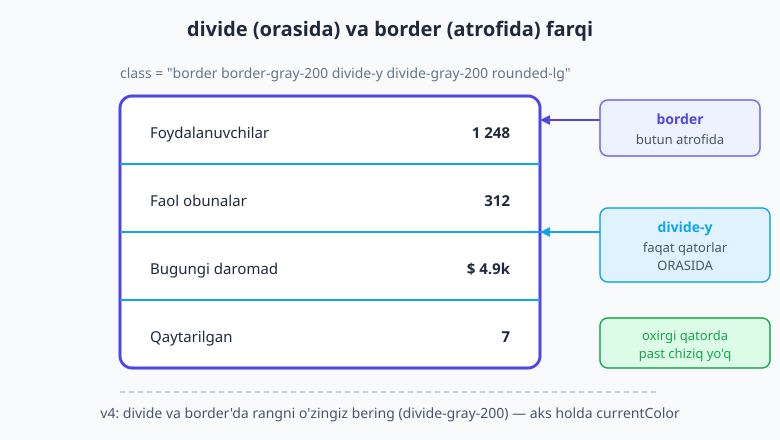

# 05 — Display va box model utility'lari

[⬅️ Oldingi: 04 — Spacing, sizing va o'lcham tizimi](./04-spacing-sizing.md) · [🏠 README](./README.md) · [Keyingi: 06 — Flexbox ➡️](./06-flexbox.md)

> **Bu bobda:** har bir element bir quti ekanini eslab, Tailwind'da uning **display** turini (`block`, `inline`, `flex`, `grid`, `hidden` …) bitta klass bilan qanday almashtirishni, `box-border` nega aqlli standart ekanini, chegara kengligi va tomonlarini (`border`, `border-2`, `border-x`, `border-t` …), v4'dagi muhim "chegara rangi endi `currentColor`" nuancesini, bolalar orasiga masofa qo'shuvchi `space-x-*`/`space-y-*` va ular orasiga ingichka chiziq tortuvchi `divide-x-*`/`divide-y-*` ni o'rganasiz. Oxirida shularni birlashtirib toza statistika ro'yxatini quramiz.

---

## 05.1 Avval kichik eslatma: har element — bir quti

Tailwind'ga kirishdan oldin bitta tushunchani yodga olaylik, chunki bu bobning hammasi shunga tayanadi: **brauzer sahifadagi har bir elementni to'rtburchak quti deb ko'radi**. Har bir quti ichdan tashqariga qarab to'rt qatlamdan iborat — `content` (mazmun), `padding` (ichki masofa), `border` (chegara) va `margin` (tashqi masofa).

Agar bu qatlamlar va `box-sizing` qanday ishlashini hali ko'rmagan bo'lsangiz, [HTML & CSS kitobining box model bobini](../html-css/11-box-model.md) ko'rib chiqing — Tailwind bu tushunchalarning **o'rnini bosmaydi**, faqat ularni qisqa klasslar tilida qayta ifodalaydi.

Bu bobda biz qutining ikki tomonini ko'ramiz:

1. **Element qanday turdagi quti** — bu uning `display` xususiyati. Block quti butun qatorni egallaydi, inline quti matn ichida oqadi.
2. **Quti chegarasi qanchalik qalin va qaysi tomonlarda** — bu `border` utility'lari.

Keling, birinchisidan boshlaymiz.

---

## 05.2 Display: element qanday "oqadi"

CSS'dagi `display` xususiyati elementning sahifada qanday joylashishini belgilaydi. Tailwind har bir keng tarqalgan qiymat uchun bitta qisqa utility beradi — qo'shimcha sintaksis yo'q, klass nomi to'g'ridan-to'g'ri CSS qiymatiga teng.



| Utility | CSS | Ma'nosi |
|---|---|---|
| `block` | `display: block` | Butun qatorni egallaydi, ustma-ust taxlanadi. `w-*`/`h-*` oladi. |
| `inline` | `display: inline` | Matn kabi yonma-yon oqadi. `w-*`/`h-*` **e'tiborsiz** qoldiriladi. |
| `inline-block` | `display: inline-block` | Yonma-yon, lekin o'lcham va vertikal padding oladi. |
| `flex` | `display: flex` | Bolalarni bir o'qda saf qiladi (06-bob). |
| `inline-flex` | `display: inline-flex` | Flex konteyner, lekin o'zi inline kabi oqadi. |
| `grid` | `display: grid` | Ustun/qatorli to'r yaratadi (07-bob). |
| `inline-grid` | `display: inline-grid` | Grid konteyner, o'zi inline oqadi. |
| `hidden` | `display: none` | Elementni butunlay olib tashlaydi — joy ham egallamaydi. |
| `contents` | `display: contents` | Quti yo'qoladi, bolalar to'g'ridan-to'g'ri ota oqimiga chiqadi. |
| `table`, `table-cell`, `table-row` | `display: table*` | Eski jadval modeli; bugun kamdan-kam kerak. |

Eng ko'p ishlatadiganlaringiz — `block`, `inline-block`, `flex`, `grid` va `hidden`. Qolganlari (`contents`, `table-*`) maxsus holatlar uchun; ularni shunchaki "bor ekan" deb bilib qo'ying.

```html
<a href="#" class="block">Butun qatorni egallaydigan havola</a>
<span class="inline-block w-24 h-8">O'lcham oladigan inline element</span>
<div class="flex">…flex konteyner…</div>
<div class="grid">…grid konteyner…</div>
```

> 💡 **Nega `inline-block` foydali?** Oddiy `inline` element (masalan `<span>` yoki `<a>`) `w-*`, `h-*` va yuqori/pastki padding'ni **inkor qiladi** — matn qanday oqsa, shunday turadi. Agar havolaga aniq o'lcham yoki ustki padding bermoqchi bo'lsangiz, `inline-block` aynan shu muammoni hal qiladi: u matn kabi yonma-yon turadi, lekin block kabi o'lchovga bo'ysunadi.

### `hidden` — display:none, ko'rinmaslikning eng "qattiq" turi

`hidden` klassi `display: none` beradi. Bu element nafaqat ko'rinmaydi, balki **layoutda joy ham egallamaydi** — uning o'rnida bo'shliq qolmaydi, qo'shni elementlar yopiladi.

Buni `invisible` (`visibility: hidden`) bilan adashtirmang:

| Klass | CSS | Element ko'rinadimi? | Joy egallaydimi? |
|---|---|---|---|
| `hidden` | `display: none` | Yo'q | **Yo'q** |
| `invisible` | `visibility: hidden` | Yo'q | **Ha** (bo'sh joy qoladi) |

```html
<!-- Bu element butunlay yo'qoladi, o'rni ham yopiladi -->
<div class="hidden">Ko'rinmaydi va joy ham egallamaydi</div>

<!-- Bu element ko'rinmaydi, lekin o'rni saqlanib qoladi -->
<div class="invisible">Ko'rinmas, lekin joyi turadi</div>
```

> 📌 Qoida: agar elementni butunlay olib tashlamoqchi bo'lsangiz — `hidden`. Agar uni vaqtincha berkitib, lekin "skeleton" yoki tekislash uchun o'rni saqlansin desangiz — `invisible`.

### Responsive ko'rsatish/yashirish (qisqacha tatib ko'rish)

`display` utility'larining eng kuchli tomoni — ular **variant**lar bilan birlashganda ochiladi. Eng tipik naqsh: elementni mobil ekranda yashirib, kattaroq ekranda ko'rsatish.

```html
<!-- Mobilda yashiringan, md (≈768px) va kattaroqda ko'rinadi -->
<nav class="hidden md:block">Desktop menyu</nav>

<!-- Aksincha: faqat mobilda ko'rinadigan tugma -->
<button class="block md:hidden">☰ Menyu</button>
```

Bu yerda `md:block` "o'rta ekranda `display: block` bo'l" degani; `hidden` esa undan kichik hamma ekranda kuchda qoladi (Tailwind mobile-first). Variantlar zanjiri va breakpoint'lar — alohida katta mavzu; ularni to'liq **09-bob (responsive dizayn)**da ochamiz. Hozircha shuni bilib qo'ying: har bir `display` utility'siga `sm:`, `md:`, `lg:` prefiksini qo'shib, uni ekran o'lchamiga bog'lash mumkin.

---

## 05.3 `box-sizing`: nega `border-box` aqlli standart

Endi qutining o'lchami qanday hisoblanishiga o'tamiz. Bu yerda CSS tarixidagi mashhur bir og'riq bor.

Sof CSS standarti bo'yicha `width: 300px` faqat **content** qatlamini o'lchaydi. Ya'ni siz `width: 300px` va `padding: 20px`, `border: 2px` bersangiz, elementning ekrandagi haqiqiy eni `300 + 20·2 + 2·2 = 344px` chiqadi. Bu juda chalkash: "300 dedim-ku, nega 344 bo'ldi?"

Yechim — `box-sizing: border-box`: bunda `width` content emas, **butun ko'rinadigan quti**ni (content + padding + border) o'lchaydi. `width: 300px` desangiz, ekranda aynan 300px — padding va border shu 300 ichiga sig'adi.

**Yaxshi xabar:** Tailwind buni siz uchun avvaldan hal qilgan. Tailwind'ning **Preflight** (asosiy reset) qatlami butun sahifaga `box-sizing: border-box` o'rnatadi. Demak siz hech narsa yozmasangiz ham, barcha elementlar allaqachon `border-box` rejimida.

```css
/* Preflight ichida (Tailwind o'zi qo'shadi): */
*, ::before, ::after {
  box-sizing: border-box;
}
```

Shuning uchun mos utility'lar ham bor, garchi ularga kamdan-kam tegasiz:

| Utility | CSS | Qachon |
|---|---|---|
| `box-border` | `box-sizing: border-box` | **Standart** — odatda yozmaysiz, allaqachon shunday. |
| `box-content` | `box-sizing: content-box` | Faqat eski uslubdagi hisob-kitob kerak bo'lganda. |

> 💡 **Aksariyat o'quvchi `box-content`ga umuman tegmaydi.** Uni faqat shu uchun ko'rsatyapmiz: kunlardan bir kun begona kodda `box-content`ni uchratsangiz, "demak bu element o'lchami eski qoida bilan, ya'ni padding/border `width` ustiga qo'shilib hisoblanadi" deb tushuning. `box-sizing` haqida chuqurroq — [HTML & CSS box model bobida](../html-css/11-box-model.md).

---

## 05.4 Chegara: kenglik va tomonlar (`border`, `border-2`, `border-x` …)

Chegara (`border`) ham qutining bir qatlami, shuning uchun uni box model bobida ko'ramiz. Bu yerda biz faqat **kenglik** va **qaysi tomon**ga e'tibor beramiz — rang, uslub (`dashed`/`dotted`) va burchak yumaloqligi (`rounded-*`) batafsil [13-bobda](./13-fon-gradient-border.md).

**Butun chegara kengligi:**

| Utility | Kenglik |
|---|---|
| `border` | 1px (standart) |
| `border-0` | 0 |
| `border-2` | 2px |
| `border-4` | 4px |
| `border-8` | 8px |

**Faqat ayrim tomonlar (eng / o'q bo'yicha):**

| Utility | Qaysi tomon |
|---|---|
| `border-t` | yuqori (top) |
| `border-r` | o'ng (right) |
| `border-b` | past (bottom) |
| `border-l` | chap (left) |
| `border-x` | chap **va** o'ng |
| `border-y` | yuqori **va** past |

Tomon va kenglikni birlashtirish mumkin: `border-t-2` (yuqorida 2px), `border-x-4` (yon tomonlarda 4px).

```html
<div class="border border-gray-200">Har tomondan 1px chegara</div>
<div class="border-2 border-indigo-500">Har tomondan 2px</div>
<div class="border-b border-gray-300">Faqat pastki chiziq (ajratuvchi)</div>
<div class="border-t-4 border-x border-y-0">Murakkab: ust 4px, yon 1px, past/ust 0</div>
```

### ⚠️ v4'dagi MUHIM o'zgarish: chegara rangi endi `currentColor`

Bu bobdagi eng muhim "ayyorlik". Tailwind **v3**'da `border` qo'shsangiz, chegara avtomatik **och kulrang** (`gray-200`) bo'lardi. Tailwind **v4**'da bu o'zgardi: agar siz rang bermasangiz, chegara rangi `currentColor` — ya'ni **matn rangiga teng** bo'ladi.

```html
<!-- v3'da: och kulrang chegara. v4'da: matn rangidagi (odatda qora) chegara! -->
<div class="border p-4">Mana bu chegara v4'da KUTILMAGANDA qora chiqadi</div>

<!-- To'g'ri yo'l: v4'da rangni doim o'zingiz bering -->
<div class="border border-gray-200 p-4">Mana bu — kutilgan och kulrang chegara</div>
```

> ⚠️ **Eng ko'p uchraydigan v4 xatosi shu.** Eski darslar yoki v3 odatiga ko'ra `border` yozasiz, lekin chegara siz kutgan nozik kulrang emas, qora (yoki matn rangidagi) qalin chiziq bo'lib chiqadi. **Yechim:** v4'da `border` har doim rang utility'si bilan birga yuradi — `border border-gray-200`, `border-2 border-indigo-500` va hokazo. Buni odat qiling.

> 📌 **Nega Tailwind buni o'zgartirdi?** v3'dagi yashirin `gray-200` standarti — "sehrli" qiymat edi: tema rangiga bog'lanmagan, kutilmagan. `currentColor`ga o'tish — bu CSS'ning o'z standartiga qaytish (CSS'da `border-color` standarti aynan `currentColor`). Shuning uchun v4 sof platforma bilan mosroq. Buning evaziga — bizdan rangni aniq berishni talab qiladi.

---

## 05.5 Padding va margin — box model kontekstida (qisqa eslatma)

`padding` va `margin` scale'ini ([04-bobda](./04-spacing-sizing.md) batafsil ko'rib chiqdik) bu yerda takrorlamaymiz, lekin **quti nuqtai nazaridan** ikki jumla:

- `p-*` (padding) qutini **ichdan** kengaytiradi — mazmun bilan chegara orasiga bo'shliq qo'shadi va elementning fon rangini oladi. `border-box` tufayli u elementning umumiy o'lchamini oshirmaydi, content joyini qisadi.
- `m-*` (margin) qutini **tashqaridan** boshqa qutilardan uzoqlashtiradi. Margin har doim shaffof — fon olmaydi.

```html
<div class="bg-indigo-50 p-6 m-4 border border-indigo-200">
  Ichida 1.5rem padding (fon shu yergacha cho'ziladi),
  tashqarida 1rem margin (qo'shnilardan ajraladi).
</div>
```

Bu sodda holatlar uchun yetarli. Lekin **bir nechta elementni bir tekisda ajratish** kerak bo'lsa — masalan ro'yxatdagi har bir qatorni — har biriga qo'lda margin yozish zerikarli. Aynan shu yerda `space-*` va `divide-*` yordamga keladi.

---

## 05.6 `space-x-*` / `space-y-*` — bolalar ORASIGA masofa

`space-y-4` kabi klass ota-elementga qo'yiladi va uning **bolalari orasiga** vertikal masofa qo'shadi. Asosiy g'oya: birinchi boladan tashqari har bir bolaga `margin-top` beriladi.



```html
<div class="space-y-4">
  <div>Birinchi bola — margin yo'q</div>
  <div>Ikkinchi bola — yuqorisida 1rem margin</div>
  <div>Uchinchi bola — yuqorisida 1rem margin</div>
</div>
```

Tailwind buni shunga o'xshash selektor bilan amalga oshiradi (soddalashtirilgan ko'rinishi):

```css
.space-y-4 > :not(:last-child) {
  margin-bottom: 1rem; /* aslida v4 :not(:last-child) variantida margin qo'yadi */
}
```

Muhimi shu: **masofa faqat elementlar orasida paydo bo'ladi**, to'plamning yuqori va past qirralarida emas. Bu xuddi "qatorlar orasiga ip qo'ygandek" — chetlarda ortiqcha bo'shliq qolmaydi.

`space-x-*` esa yonma-yon (gorizontal) elementlar orasiga ishlaydi — ko'pincha `flex` qator bilan:

```html
<div class="flex space-x-3">
  <button>Saqlash</button>
  <button>Bekor qilish</button>
</div>
```

### `space-*`ning ikki tuzog'i

`space-*` qulay, lekin uning ikkita mashhur tuzog'i bor — ularni bilib qo'ying:

1. **`flex-row-reverse` / `flex-wrap` bilan chalkashlik.** `space-x-*` "qaysi bola oxirgi" degan tartibga tayanadi. Agar siz `flex-row-reverse` (tartibni teskari) yoki `flex-wrap` (ikkinchi qatorga o'tish) ishlatsangiz, margin "noto'g'ri" tomonda yoki o'ralgan qatorda kutilmagan joyda paydo bo'lishi mumkin.

2. **Inline elementlar bilan ishonchsiz.** `space-x-*` margin'ga tayanadi, inline elementlarda esa gorizontal margin har doim ham kutilganidek ishlamaydi.

```html
<!-- ⚠️ Bunda masofa o'ralgan qatorlarda chalkash chiqishi mumkin -->
<div class="flex flex-wrap space-x-4">…ko'p element…</div>
```

> 💡 **Zamonaviy maslahat:** flex va grid ichida `space-*` o'rniga **`gap-*`** ishlating. `gap-*` to'g'ridan-to'g'ri CSS Gap xususiyatiga tayanadi — u barcha bolalar orasiga (jumladan o'ralgan qatorlarda ham) bir tekis bo'shliq beradi, hech qaysi bolaga margin qo'shmaydi va `reverse`/`wrap` bilan to'liq mos ishlaydi. `space-*` ni esa **oddiy block taxlamalar** (flex/grid bo'lmagan, masalan oddiy `<div>`lar to'plami) uchun saqlang.

```html
<!-- ✅ Flex/grid ichida toza yo'l: gap -->
<div class="flex gap-4">…</div>
<div class="grid grid-cols-3 gap-6">…</div>
```

`gap-*` ning to'liq qo'llanishini [flexbox bobida](./06-flexbox.md) ko'ramiz.

---

## 05.7 `divide-x-*` / `divide-y-*` — bolalar ORASIGA chiziq

`space-*` bolalar orasiga **bo'shliq** qo'ysa, `divide-*` ular orasiga **ko'rinadigan ingichka chiziq** (chegara) qo'yadi. Bu ro'yxat, jadvalsimon qatorlar yoki sozlamalar paneli uchun ideal — har bir qatorga qo'lda `border-b` yozmasdan, butun to'plamga bitta klass yetadi.

`divide-y` har bir bolaning yuqorisiga (birinchisidan tashqari) chegara qo'yadi; `divide-x` esa chap tomoniga. Va — xuddi `border` kabi — **v4'da rangni o'zingiz berishingiz kerak** (`divide-gray-200`), aks holda chiziq `currentColor` (matn rangi) bo'ladi.

```html
<ul class="divide-y divide-gray-200">
  <li class="py-3">Birinchi qator</li>
  <li class="py-3">Ikkinchi qator — ustida ingichka chiziq</li>
  <li class="py-3">Uchinchi qator — ustida ingichka chiziq</li>
</ul>
```

Chiziq qalinligini ham boshqarish mumkin: `divide-y-2`, `divide-x-4`. Standart `divide-y` — 1px.

> 📌 `divide-*` ham `space-*` kabi `:not(:last-child)` uslubidagi selektorga tayanadi va xuddi shu tuzoqlarga ega (`flex-wrap`, `reverse` bilan ehtiyot bo'ling). Lekin oddiy vertikal ro'yxat uchun u eng toza yechim.

---

## 05.8 Hammasini birlashtiramiz: chegarali statistika ro'yxati

Endi bu bobdagi utility'larni bitta amaliy komponentda birlashtiramiz. Quramiz: atrofida chegarasi, ichida padding'i va qatorlari orasida ingichka ajratuvchi chiziqlari bo'lgan **statistika kartasi**.



```html
<div class="max-w-sm border border-gray-200 rounded-lg divide-y divide-gray-200">
  <div class="flex justify-between px-5 py-4">
    <span class="text-gray-600">Foydalanuvchilar</span>
    <span class="font-semibold text-gray-900">1 248</span>
  </div>
  <div class="flex justify-between px-5 py-4">
    <span class="text-gray-600">Faol obunalar</span>
    <span class="font-semibold text-gray-900">312</span>
  </div>
  <div class="flex justify-between px-5 py-4">
    <span class="text-gray-600">Bugungi daromad</span>
    <span class="font-semibold text-gray-900">$4 900</span>
  </div>
  <div class="flex justify-between px-5 py-4">
    <span class="text-gray-600">Qaytarilgan</span>
    <span class="font-semibold text-gray-900">7</span>
  </div>
</div>
```

Bu yerda har bir utility o'z vazifasini bajaryapti:

- `border border-gray-200` — **butun karta atrofida** nozik kulrang chegara (rang berildi, chunki v4!).
- `rounded-lg` — burchaklar yumaloq ([13-bob](./13-fon-gradient-border.md)).
- `divide-y divide-gray-200` — **faqat qatorlar orasida** ingichka chiziq; eng yuqori va eng pastki qatorda qo'sh chiziq paydo bo'lmaydi.
- `flex justify-between` — har qatorda yorliq chapda, qiymat o'ngda.
- `px-5 py-4` — har qatorga ichki bo'shliq.

Diqqat qiling: chegara **atrofda** (border), ajratuvchilar **orasida** (divide). Agar buning o'rniga har bir qatorga `border-b` yozsangiz, oxirgi qatorda ortiqcha chiziq qolardi yoki chetlar bilan ikki marta to'qnashardi. `divide-*` ayni shu muammoni hal qiladi.

> 💡 **Agar chiziq emas, faqat bo'shliq kerak bo'lsa**, `divide-y` o'rniga `space-y-2` yozing — qatorlar orasi ochiladi, lekin chiziq chizilmaydi. Ikkalasi bir maqsadning ikki ko'rinishi: biri ko'zga ko'rinadigan ajratuvchi, biri ko'rinmas bo'shliq.

---

## 05.9 Overflow — hozircha bir og'iz

Quti haqida gapirganda `overflow` (mazmun qutiga sig'masa nima bo'ladi) tabiiy savol. Tailwind'da `overflow-hidden`, `overflow-auto`, `overflow-scroll`, `overflow-x-auto` kabi utility'lar bor.

Lekin overflow asosan **joylashuv (layout) va aylantirish (scroll)** bilan bog'liq, shuning uchun uni to'liq **08-bob (positioning, z-index va overflow)**da ochamiz. Hozircha shuni bilib qo'ying: agar mazmun qutidan oshib chiqsa, `overflow-hidden` ortiqcha qismini kesadi, `overflow-auto` esa kerak bo'lsa scrollbar chiqaradi.

```html
<!-- Uzun matnni qutiga "qamab", ortig'ini scroll bilan ko'rsatish -->
<div class="h-32 overflow-auto border border-gray-200 p-4">
  …juda uzun mazmun…
</div>
```

---

## 05.10 Tez-tez uchraydigan xatolar

> ⚠️ **1. v4'da chegara rangini unutish.** `border` yozdingiz, lekin chiziq siz kutgan nozik kulrang emas, qora chiqdi. Sababi — v4'da rang `currentColor`. **Yechim:** har doim `border border-gray-200` kabi rangni qo'shing. Bu `divide-*` uchun ham amal qiladi (`divide-gray-200`).

> ⚠️ **2. `space-x` ni `flex-wrap` bilan ishlatish.** O'ralgan qatorlarda margin kutilmagan joyda paydo bo'ladi. **Yechim:** flex/grid ichida `gap-*` ishlating — u wrap bilan to'liq mos.

> ⚠️ **3. `gap` o'rniga margin "to'plash".** Flex/grid bolalariga bittalab `mr-4`/`mb-4` yozish — eski va xato yo'l (oxirgi elementda ortiqcha margin qoladi, wrap buziladi). **Yechim:** flex/grid bo'lsa `gap`, oddiy block taxlama bo'lsa `space-*`.

> ⚠️ **4. `inline` elementga `w-*`/`h-*` berib, "ishlamadi" deyish.** Sof `inline` element o'lchamni inkor qiladi. **Yechim:** `inline-block` yoki `block` ishlating.

> ⚠️ **5. `hidden` va `invisible` ni adashtirish.** `hidden` joyni ham yo'q qiladi, `invisible` joyni saqlaydi. Layout "sakrab ketmasin" desangiz — `invisible`; butunlay olib tashlash kerak bo'lsa — `hidden`.

---

## Mashqlar

**1-mashq.** Quyidagi havola sof `inline` element. Unga balandlik (`h-12`) va ustki padding (`pt-3`) berib, ular **ishlashi** uchun nima qilish kerak? Klassni to'g'rilang.

```html
<a href="#" class="h-12 pt-3 bg-indigo-500 text-white">Tugma havola</a>
```

<details>
<summary>Yechim</summary>

Sof `inline` element `h-*` va vertikal padding'ni inkor qiladi. `inline-block` (yoki `block`/`flex`) qo'shish kerak:

```html
<a href="#" class="inline-block h-12 pt-3 bg-indigo-500 text-white">Tugma havola</a>
```

Amalda tugma havolalarda ko'pincha `inline-flex items-center` ishlatiladi — matnni vertikal markazga qo'yadi. Lekin bu mashq doirasida `inline-block` yetarli: endi balandlik va padding kuchga kiradi.
</details>

---

**2-mashq.** Mobil ekranda ko'rinadigan "☰ Menyu" tugmasi va faqat `md` (≈768px) va kattaroq ekranda ko'rinadigan gorizontal navigatsiya yozing. Ikkalasi bir vaqtda ko'rinmasin.

<details>
<summary>Yechim</summary>

```html
<!-- Faqat mobilda ko'rinadi, md va kattaroqda yashiriladi -->
<button class="block md:hidden">☰ Menyu</button>

<!-- Mobilda yashiringan, md va kattaroqda ko'rinadi -->
<nav class="hidden md:flex gap-6">
  <a href="#">Bosh sahifa</a>
  <a href="#">Mahsulotlar</a>
  <a href="#">Aloqa</a>
</nav>
```

Mantiq: `block md:hidden` — kichik ekranda `block`, `md`dan boshlab `hidden`. `hidden md:flex` — aksincha: kichik ekranda `hidden`, `md`dan boshlab `flex`. Tailwind mobile-first, shuning uchun prefiks*siz* klass kichik ekran uchun "asos" bo'ladi.
</details>

---

**3-mashq.** Quyidagi karta `border` ishlatgan, lekin chegara kulrang emas, qora chiqyapti. Nega? To'g'rilang.

```html
<div class="border p-4 rounded-lg">Mahsulot kartasi</div>
```

<details>
<summary>Yechim</summary>

Tailwind **v4**'da chegara rangi standart `currentColor` (matn rangi) — matn qora bo'lgani uchun chegara ham qora chiqdi (v3'da bu `gray-200` edi). Rangni aniq berish kerak:

```html
<div class="border border-gray-200 p-4 rounded-lg">Mahsulot kartasi</div>
```

Endi chegara kutilgan nozik och kulrang bo'ladi. Eslatma: bu v4'dagi eng ko'p uchraydigan "ko'rinmas/qora chegara" xatosi.
</details>

---

**4-mashq.** Uchta `<div>` dan iborat oddiy vertikal taxlama bor. Ular orasida 1rem bo'shliq kerak, **lekin** chetlarda (yuqori/past) ortiqcha bo'shliq bo'lmasin. Bu konteyner flex ham, grid ham emas. Qaysi utility'ni ishlatasiz?

<details>
<summary>Yechim</summary>

Oddiy block taxlamasi (flex/grid emas) uchun `space-y-*` aynan shu maqsad uchun: u faqat bolalar **orasiga** margin qo'yadi, chetlarga tegmaydi.

```html
<div class="space-y-4">
  <div>Birinchi</div>
  <div>Ikkinchi</div>
  <div>Uchinchi</div>
</div>
```

`space-y-4` = orasida 1rem. Birinchi bolada yuqori margin yo'q, oxirgi bolada past margin yo'q — chetlar toza. (Agar konteyner flex/grid bo'lsa, bu yerda `gap-4` afzalroq bo'lardi.)
</details>

---

**5-mashq.** Quyidagi ro'yxat qatorlari orasiga **ko'rinadigan ingichka kulrang chiziq** qo'shing (oxirgi qatordan keyin chiziq bo'lmasin). Atrofida ham nozik chegara va `rounded-lg` bo'lsin.

```html
<ul>
  <li class="px-4 py-3">Profilni tahrirlash</li>
  <li class="px-4 py-3">Xavfsizlik</li>
  <li class="px-4 py-3">Bildirishnomalar</li>
</ul>
```

<details>
<summary>Yechim</summary>

```html
<ul class="border border-gray-200 rounded-lg divide-y divide-gray-200">
  <li class="px-4 py-3">Profilni tahrirlash</li>
  <li class="px-4 py-3">Xavfsizlik</li>
  <li class="px-4 py-3">Bildirishnomalar</li>
</ul>
```

- `border border-gray-200` — atrofida chegara (v4'da rang shart!).
- `rounded-lg` — burchaklar yumaloq.
- `divide-y divide-gray-200` — qatorlar **orasida** chiziq; oxirgi qatordan keyin avtomatik chiziq qo'yilmaydi (`:not(:last-child)` mantiqi). Rangni unutmang, aks holda chiziq `currentColor` bo'ladi.
</details>

---

**6-mashq (qiyinroq).** Bitta "narx kartasi" yarating: atrofida `border-2 border-indigo-500`, ustki qismi (sarlavha) bilan pastki qismi (xususiyatlar ro'yxati) o'rtasida ajratuvchi chiziq, ro'yxat ichida esa har bir xususiyat orasida bo'shliq (chiziq emas). Qaysi qayerda `divide`, qayerda `space` kerakligini o'ylab ko'ring.

<details>
<summary>Yechim</summary>

Kalit g'oya: karta darajasida **divide** (ko'rinadigan chiziq sarlavha bilan tana orasida), tana ichida esa **space** (chiziqsiz bo'shliq xususiyatlar orasida).

```html
<div class="max-w-xs border-2 border-indigo-500 rounded-xl divide-y divide-indigo-100">
  <!-- Yuqori bo'lim: sarlavha va narx -->
  <div class="px-6 py-5">
    <h3 class="text-lg font-semibold text-gray-900">Pro reja</h3>
    <p class="text-3xl font-bold text-indigo-600">$29<span class="text-base font-normal text-gray-500">/oy</span></p>
  </div>

  <!-- Pastki bo'lim: xususiyatlar (orasida bo'shliq, chiziq yo'q) -->
  <ul class="px-6 py-5 space-y-2 text-gray-700">
    <li>Cheksiz loyihalar</li>
    <li>Prioritet qo'llab-quvvatlash</li>
    <li>10GB saqlash</li>
  </ul>
</div>
```

- `border-2 border-indigo-500` — qalin indigo chegara butun atrofda.
- `divide-y divide-indigo-100` — **karta** ichidagi ikki bo'lim (sarlavha / ro'yxat) orasida bitta ko'rinadigan chiziq.
- `space-y-2` — **ro'yxat** ichidagi xususiyatlar orasida chiziqsiz bo'shliq.

Mana shu — `divide` (ko'rinadigan ajratuvchi) va `space` (ko'rinmas bo'shliq) ni ongli ravishda joyiga ishlatishning amaliy namunasi.
</details>

---

[⬅️ Oldingi: 04 — Spacing, sizing va o'lcham tizimi](./04-spacing-sizing.md) · [🏠 README](./README.md) · [Keyingi: 06 — Flexbox ➡️](./06-flexbox.md)
