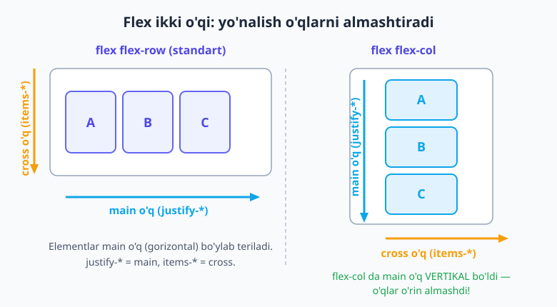
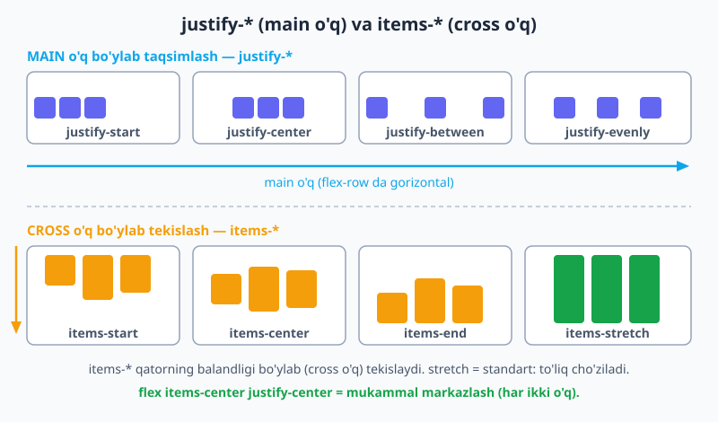
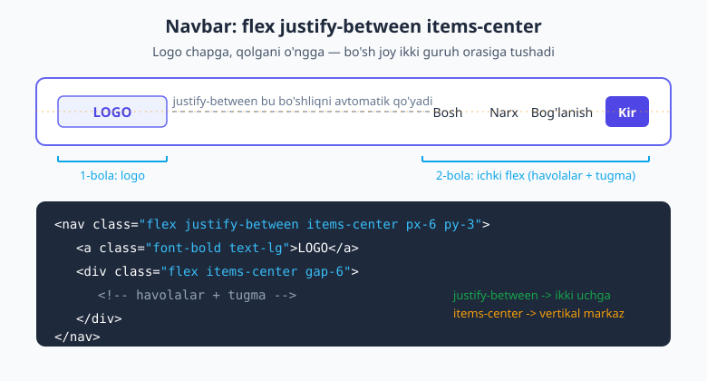

# 06 — Flexbox

[⬅️ Oldingi: 05 — Display va box model utility'lari](./05-box-model-display.md) · [🏠 README](./README.md) · [Keyingi: 07 — CSS Grid ➡️](./07-grid.md)

> **Bu bobda:** CSS Flexbox'ni Tailwind utility'lari tilida 0 dan ekspertgacha o'rganamiz — `flex` bilan konteynerni yoqish, ikki o'q (main va cross), `justify-*` va `items-*` bilan tekislash, `flex-wrap`, `grow`/`shrink`/`basis` va sehrli `flex-1`, `gap-*`, `order-*` hamda navbar, markazlangan hero, media object, sticky-footer kabi real layout'larni qurish. Oxirida — eng muhim responsive naqsh `flex-col md:flex-row` va ekspert tuzog'i `min-w-0`.

---

## 06.1 Nega Flexbox va nega aynan utility'lar?

Siz CSS Flexbox tushunchalarini allaqachon bilasiz degan farazdan boshlaymiz. Agar `display: flex`, main o'q, cross o'q, `justify-content` yoki `flex-grow` nima ekani hali tumanli bo'lsa — bir to'xtang va avval [HTML & CSS kitobining Flexbox bobini](../html-css/15-flexbox.md) o'qing. Bu bob esa **o'sha bilimni Tailwind klasslariga ko'chiradi**: har bir CSS xususiyatini qaysi utility chiqarishini ko'rsatadi.

Nega Tailwind'da Flexbox shunchalik yoqimli? Chunki klassik CSS'da siz alohida faylga o'tib, selektor o'ylab topib, `display: flex; justify-content: space-between; align-items: center;` deb yozasiz. Tailwind'da esa to'g'ridan-to'g'ri HTML'da `class="flex justify-between items-center"` deb yozasiz — uchta so'z, uchta CSS qoidasi. Layout'ni **ko'rgan joyingizda** sozlaysiz va brauzerda darhol natijani ko'rasiz.

💡 **Analogiya:** Flexbox — bu javondagi kitoblarni tartibga soluvchi mehribon kutubxonachi. Siz "chapga tort", "teng yoy" yoki "o'rtaga to'pla" deb buyruq berasiz; u qolganini o'zi bajaradi. Tailwind esa shu buyruqlarni qisqa, standart so'zlarga aylantirib beradi.

📌 **Eslatma — Flexbox bir o'lchovli:** Flexbox elementlarni **bir vaqtning o'zida bitta yo'nalishda** (yo qator, yo ustun) tartibga soladi. Navbar, tugmalar qatori, media object — bularning hammasi bir o'lchovli, demak Flexbox ishi. Butun sahifa tarmog'i (ustunlar VA qatorlar bir vaqtda) — bu [keyingi bobdagi CSS Grid](./07-grid.md) ishi.

---

## 06.2 `flex` — konteynerni yoqish

Flexbox'ni yoqish uchun ota elementga bitta klass kerak: `flex`. Shu zahoti uning **bevosita farzandlari** flex item'larga aylanadi.

```html
<div class="flex">
  <div class="bg-indigo-100 p-4">A</div>
  <div class="bg-indigo-100 p-4">B</div>
  <div class="bg-indigo-100 p-4">C</div>
</div>
```

`flex` klassi shunchaki `display: flex` chiqaradi. Natijada A, B, C ustma-ust emas, **yonma-yon** bitta qatorga teriladi — chunki `<div>` odatda block element bo'lib har biri butun qatorni egallardi; `flex` esa ota'ni flex konteynerga aylantirib, farzandlarini gorizontal qatorga teradi.

| Utility | CSS | Qachon |
|---|---|---|
| `flex` | `display: flex` | Konteyner alohida blok bo'lib (butun enni egallab) tursin. Eng ko'p ishlatiladi. |
| `inline-flex` | `display: inline-flex` | Konteyner atrofidagi matn bilan **bir qatorda** (inline kabi) tursin, lekin ichida flex qoidalari ishlasin. |

⚠️ Faqat **bevosita** farzandlar flex item bo'ladi. Agar item ichida yana element bo'lsa, u **nabira** — flexga bo'ysunmaydi (toki o'zi ham flex konteyner bo'lmaguncha).

---

## 06.3 Ikki o'q va yo'nalish: `flex-row`, `flex-col`

Flexbox'ning yuragi — **ikki o'q** tushunchasi:

- **Main o'q** (asosiy o'q) — elementlar shu o'q bo'ylab teriladi. Uni `justify-*` boshqaradi.
- **Cross o'q** (ko'ndalang o'q) — main o'qqa perpendikulyar. Uni `items-*` boshqaradi.

Eng muhim nuqta: **yo'nalish o'qlarni almashtiradi.** `flex-row`'da main o'q gorizontal, `flex-col`'da esa main o'q vertikal bo'lib qoladi.



| Utility | CSS | Main o'q yo'nalishi |
|---|---|---|
| `flex-row` | `flex-direction: row` | Chapdan o'ngga (gorizontal) — **standart**, yozmasangiz ham shu. |
| `flex-row-reverse` | `flex-direction: row-reverse` | O'ngdan chapga. |
| `flex-col` | `flex-direction: column` | Yuqoridan pastga (vertikal). |
| `flex-col-reverse` | `flex-direction: column-reverse` | Pastdan yuqoriga. |

📌 **Yodda tuting:** `justify-*` har doim **main** o'qni, `items-*` har doim **cross** o'qni boshqaradi. `flex-col`'ga o'tsangiz, `justify-center` endi elementlarni **vertikal** markazlaydi, `items-center` esa **gorizontal**. Bu chalkashlikning eng katta manbai — o'q nomi yo'nalishga bog'liq emas, lekin uning fizik yo'nalishi `flex-direction`'ga bog'liq.

---

## 06.4 Main o'q bo'ylab tekislash: `justify-*`

`justify-*` utility'lari elementlarni **main o'q** bo'ylab taqsimlaydi — qolgan bo'sh joyni qayerga qo'yishni hal qiladi.

```html
<div class="flex justify-between">
  <div>A</div>
  <div>B</div>
  <div>C</div>
</div>
```

| Utility | CSS (`justify-content`) | Ma'nosi |
|---|---|---|
| `justify-start` | `flex-start` | Boshiga (chapga) yig'adi — standart. |
| `justify-end` | `flex-end` | Oxiriga (o'ngga) yig'adi. |
| `justify-center` | `center` | O'rtaga yig'adi. |
| `justify-between` | `space-between` | Birinchi va oxirgi chetga, qolgan bo'shliq teng tarqaladi. |
| `justify-around` | `space-around` | Har element atrofiga teng bo'shliq (chetlarda yarmi). |
| `justify-evenly` | `space-evenly` | Hamma bo'shliq (chetlar ham) **tamomila teng**. |
| `justify-stretch` | `stretch` | Avtomatik o'lchamli elementlarni main o'q bo'ylab cho'zadi. |



💡 `between`, `around`, `evenly` farqi: `between`'da chetlarda bo'shliq **yo'q** (elementlar devorga tegadi), `around`'da chetlarda **yarim** bo'shliq, `evenly`'da hamma joyda **bir xil** bo'shliq.

---

## 06.5 Cross o'q bo'ylab tekislash: `items-*`

`items-*` utility'lari elementlarni **cross o'q** bo'ylab tekislaydi — `flex-row`'da bu qatorning balandligi bo'ylab vertikal tekislash demakdir.

| Utility | CSS (`align-items`) | Ma'nosi |
|---|---|---|
| `items-stretch` | `stretch` | Konteyner balandligi bo'ylab to'liq cho'zadi — **standart**. |
| `items-start` | `flex-start` | Yuqoriga tekislaydi. |
| `items-center` | `center` | Vertikal markazga oladi. |
| `items-end` | `flex-end` | Pastga tekislaydi. |
| `items-baseline` | `baseline` | Elementlardagi matnning **bazaviy chizig'i** bo'ylab tekislaydi (har xil shrift o'lchamlarida foydali). |

📌 **Eng mashhur kombinatsiya — mukammal markazlash:**

```html
<div class="flex items-center justify-center h-64">
  <p>Aynan o'rtada!</p>
</div>
```

`flex items-center justify-center` — bu element konteynerning **ham gorizontal, ham vertikal** markazida turishini ta'minlaydi. Eski CSS'dagi vertikal markazlash azobiga abadiy yechim. Diqqat: vertikal markazlash ko'rinishi uchun konteynerda **balandlik** (`h-64` kabi) bo'lishi kerak.

⚠️ **Tuzoq:** agar konteynerda faqat **bitta qator** element bo'lsa va konteyner balandligi shunchaki shu qator balandligiga teng bo'lsa, `items-center` ko'zga ko'rinarli hech narsa qilmaydi — markazlash uchun "ortiqcha" cross o'q joyi yo'q. Effekti ko'rish uchun konteynerga balandlik bering yoki itemlarning balandligi har xil bo'lsin.

---

## 06.6 Qatorlash (wrapping): `flex-wrap`

Standart holatda flex itemlar **bitta qatorga** sig'maguncha siqiladi — yangi qatorga tushmaydi. Buni `flex-wrap` o'zgartiradi.

| Utility | CSS (`flex-wrap`) | Ma'nosi |
|---|---|---|
| `flex-nowrap` | `nowrap` | Hammasi bitta qatorda (siqilib) — standart. |
| `flex-wrap` | `wrap` | Sig'masa, keyingi qatorga o'tadi. |
| `flex-wrap-reverse` | `wrap-reverse` | Sig'masa, qator teskari yo'nalishda o'tadi. |

```html
<div class="flex flex-wrap gap-4">
  <div class="basis-48 grow">Karta 1</div>
  <div class="basis-48 grow">Karta 2</div>
  <div class="basis-48 grow">Karta 3</div>
</div>
```

Bu — moslashuvchan karta tarmog'ining oddiy usuli: kartalar sig'mas darajaga yetganda o'zi yangi qatorga tushadi.

📌 **Ko'p qatorli cross tekislash — `content-*`:** wrapping tufayli **bir nechta qator** paydo bo'lganda, o'sha qatorlar guruhini cross o'q bo'ylab tekislash uchun `content-start` / `content-center` / `content-between` / `content-evenly` (CSS `align-content`) ishlatiladi. Bu faqat `flex-wrap` **va** konteynerda ortiqcha balandlik bo'lganda ko'rinadi — bitta qatorda hech qanday ta'siri yo'q.

---

## 06.7 Item'ning o'sishi va siqilishi: `grow`, `shrink`, `basis`

Hozirgacha biz **konteyner**ni boshqardik. Endi **alohida item**larning bo'sh joyni qanday taqsimlashini boshqaramiz. Uchta tushuncha:

- **`basis`** — itemning **boshlang'ich o'lchami** (main o'q bo'ylab; `flex-basis`).
- **`grow`** — ortiqcha bo'sh joyni **olib o'sish** mayli (`flex-grow`).
- **`shrink`** — joy yetmaganda **siqilish** mayli (`flex-shrink`).

| Utility | CSS | Ma'nosi |
|---|---|---|
| `grow` | `flex-grow: 1` | Ortiqcha joyni egallab o'sadi. |
| `grow-0` | `flex-grow: 0` | O'smaydi — standart. |
| `shrink` | `flex-shrink: 1` | Joy yetmasa siqiladi — standart. |
| `shrink-0` | `flex-shrink: 0` | **Hech qachon siqilmaydi** (sidebar/avatar uchun muhim). |
| `basis-1/2` | `flex-basis: 50%` | Boshlang'ich en — yarmi. |
| `basis-64` | `flex-basis: 16rem` | Boshlang'ich en — spacing scale'idan. |
| `basis-full` | `flex-basis: 100%` | Boshlang'ich en — to'liq. |

### Qisqartma: `flex-*`

Amalda yuqoridagilarni alohida yozish kam — Tailwind tayyor qisqartmalar beradi (bular `flex-grow flex-shrink flex-basis` ni bir vaqtda o'rnatadi):

| Utility | CSS (`flex`) | Ma'nosi |
|---|---|---|
| `flex-1` | `1 1 0%` | Teng ulush oladi, **boshlang'ich o'lchamini e'tiborga olmay** bo'sh joyni egallaydi. Eng ko'p ishlatiladigan. |
| `flex-auto` | `1 1 auto` | O'sadi va siqiladi, lekin **kontent o'lchamidan** boshlaydi. |
| `flex-initial` | `0 1 auto` | O'smaydi, lekin kerak bo'lsa siqiladi — standart xulq. |
| `flex-none` | `none` (`0 0 auto`) | Na o'sadi, na siqiladi — o'lchami qotib qoladi. |

💡 **"Muqaddas kosa" (holy grail) naqshi — qotgan sidebar + cho'ziladigan kontent:**

```html
<div class="flex">
  <aside class="w-64 shrink-0">Sidebar (qat'iy 16rem)</aside>
  <main class="flex-1">Kontent — qolgan hamma joyni egallaydi</main>
</div>
```

`flex-1` o'rtadagi (yoki o'ngdagi) ustunga berilsa, u **qolgan butun bo'sh joyni** egallaydi; `shrink-0` esa sidebarning siqilib ketishiga yo'l qo'ymaydi. Ko'p ustunli layout'ning eng toza usuli.

---

## 06.8 Bitta itemni alohida tekislash: `self-*`

`items-*` butun konteynerdagi hamma itemni cross o'q bo'ylab tekislaydi. Agar **faqat bitta** itemni boshqacha tekislamoqchi bo'lsangiz — `self-*` ishlatasiz (CSS `align-self`).

| Utility | CSS | Ma'nosi |
|---|---|---|
| `self-auto` | `align-self: auto` | Konteynerning `items-*` qiymatiga ergashadi. |
| `self-start` | `align-self: flex-start` | Faqat shu item — boshiga. |
| `self-center` | `align-self: center` | Faqat shu item — markazga. |
| `self-end` | `align-self: flex-end` | Faqat shu item — oxiriga. |
| `self-stretch` | `align-self: stretch` | Faqat shu item — cho'zilsin. |

```html
<div class="flex items-start">
  <div>Yuqorida</div>
  <div class="self-end">Men pastda turaman</div>
  <div>Yuqorida</div>
</div>
```

---

## 06.9 Tartibni o'zgartirish: `order-*`

`order-*` (CSS `order`) HTML'dagi joylashishni o'zgartirmasdan **vizual tartibni** o'zgartiradi. Kichik `order` qiymati oldinroq chiqadi.

| Utility | CSS (`order`) | Ma'nosi |
|---|---|---|
| `order-1` ... `order-12` | `order: 1` ... `12` | Aniq tartib raqami. |
| `order-first` | `order: -9999` | Hammadan oldin. |
| `order-last` | `order: 9999` | Hammadan keyin. |
| `order-none` | `order: 0` | Standart (HTML tartibi). |

💡 `order`'ning eng kuchli tomoni — **responsive qayta tartiblash**: mobil ekranda kontent yuqorida, keng ekranda sidebar oldinda tursin desangiz, `order-first md:order-none` kabi yozasiz. Ammo accessibility uchun ehtiyot bo'ling: `order` faqat **vizual** tartibni o'zgartiradi, ekran o'quvchisi va Tab tartibi HTML'dagicha qoladi.

---

## 06.10 Itemlar orasini bo'shliq: `gap-*`

Flex itemlar orasiga bo'shliq qo'yishning **to'g'ri** yo'li — `gap-*` (CSS `gap`), `margin` emas.

| Utility | CSS | Ma'nosi |
|---|---|---|
| `gap-4` | `gap: 1rem` | Har ikki o'q bo'ylab bir xil bo'shliq. |
| `gap-x-6` | `column-gap: 1.5rem` | Faqat main (gorizontal) o'q bo'ylab. |
| `gap-y-2` | `row-gap: 0.5rem` | Faqat cross (vertikal/qatorlar) o'q bo'ylab. |

```html
<div class="flex gap-4">
  <button>Saqlash</button>
  <button>Bekor qilish</button>
</div>
```

📌 **Nega `gap`, `margin` emas?** Klassik usulda har itemga `mr-4` (o'ng margin) qo'yib, oxirgisini `last:mr-0` bilan tozalardingiz — chalkash va mo'rt. `gap` esa **faqat itemlar orasiga** bo'shliq qo'yadi, chetlarda ortiqcha bo'shliq qoldirmaydi va `flex-wrap`'da yangi qatorlar orasida ham to'g'ri ishlaydi. `gap` — zamonaviy, standart tanlov.

---

## 06.11 Real naqshlar: bularning hammasini qurib ko'ramiz

Endi o'rganganlarimizni **haqiqiy komponentlar**ga birlashtiramiz.

### 1) Navbar — logo chapda, havolalar o'ngda



```html
<nav class="flex justify-between items-center px-6 py-3">
  <a href="/" class="font-bold text-lg">LOGO</a>
  <div class="flex items-center gap-6">
    <a href="/bosh">Bosh</a>
    <a href="/narx">Narx</a>
    <a href="/aloqa">Bog'lanish</a>
    <button class="bg-indigo-600 text-white px-4 py-2 rounded-lg">Kirish</button>
  </div>
</nav>
```

`justify-between` logo bilan o'ng guruhni ikki uchga itaradi; `items-center` esa hammasini vertikal markazlaydi. O'ng guruhning o'zi yana bir kichik flex konteyner (`flex items-center gap-6`).

### 2) Markazlangan hero

```html
<section class="flex flex-col items-center justify-center text-center min-h-screen gap-4">
  <h1 class="text-4xl font-bold">Sarlavha</h1>
  <p class="text-slate-600">Qisqa tavsif matni.</p>
  <button class="bg-indigo-600 text-white px-6 py-3 rounded-lg">Boshlash</button>
</section>
```

`flex-col` bilan elementlar ustun bo'lib teriladi; `items-center` ularni gorizontal markazga oladi, `justify-center` esa ekran balandligi bo'ylab vertikal markazga.

### 3) Media object — avatar + matn

```html
<div class="flex gap-4">
  
  <div class="flex-1">
    <p class="font-semibold">Oqil Imomnazarov</p>
    <p class="text-slate-600">Tailwind v4 bilan flexbox o'rganmoqda.</p>
  </div>
</div>
```

Klassik media object: avatar `shrink-0` bilan o'lchamini saqlaydi, matn bloki `flex-1` bilan qolgan enni egallaydi.

### 4) Sticky-footer (footer doimo pastda)

```html
<body class="flex flex-col min-h-screen">
  <header>Sarlavha</header>
  <main class="flex-1">Asosiy kontent (kam bo'lsa ham, footer pastda qoladi)</main>
  <footer>Footer</footer>
</body>
```

`flex flex-col min-h-screen` butun sahifani vertikal flex qiladi; `flex-1` `<main>`'ga berilib, kontent kam bo'lsa ham bo'sh joyni to'ldiradi va footer'ni pastga itaradi.

### 5) O'ngga tekislangan tugmalar qatori

```html
<div class="flex justify-end gap-2">
  <button class="px-4 py-2 rounded-lg border">Bekor</button>
  <button class="px-4 py-2 rounded-lg bg-indigo-600 text-white">Saqlash</button>
</div>
```

Modal yoki forma pastidagi klassik amal: `justify-end` tugmalarni o'ngga, `gap-2` ular orasiga ozgina bo'shliq.

---

## 06.12 Responsive flex: `flex-col md:flex-row`

Eng ko'p ishlatiladigan responsive naqsh — **mobil ekranda ustun, keng ekranda qator**:

```html
<div class="flex flex-col md:flex-row gap-4">
  <aside class="md:w-64">Sidebar</aside>
  <main class="flex-1">Kontent</main>
</div>
```

`flex-col` standart (mobil) holatda elementlarni vertikal ustunga teradi; `md:flex-row` esa `md` breakpoint'dan (≈768px) boshlab ularni gorizontal qatorga aylantiradi. Bu — mobile-first yondashuvning toza namunasi.

➡️ Breakpoint variantlari (`sm:` / `md:` / `lg:` ...) va mobile-first falsafasini [09 — Responsive dizayn](./09-responsive-dizayn.md) bobida to'liq o'rganamiz. Hozircha shuni bilib qo'ying: `md:flex-row` "md va undan keng ekranlarda qator bo'lsin" degani.

---

## 06.13 Ekspert tuzog'i: `min-w-0` va matn qisqartirish

Bu — ko'pchilikni hayron qoldiradigan nozik nuqta. Flex itemining standart `min-width` qiymati `auto` — ya'ni item **o'z kontentidan kichikroq siqila olmaydi**. Shu sabab uzun matnli yoki `truncate` ishlatadigan flex itemi konteynerdan **toshib ketadi**.

```html
<!-- MUAMMO: uzun matn toshib ketadi, truncate ishlamaydi -->
<div class="flex gap-3">
  
  <p class="flex-1 truncate">Juda-juda uzun matn ... konteynerdan toshib ketadi</p>
</div>

<!-- YECHIM: min-w-0 itemga siqilishga ruxsat beradi -->
<div class="flex gap-3">
  
  <p class="flex-1 min-w-0 truncate">Endi truncate to'g'ri ishlaydi va matn "..." bilan kesiladi</p>
</div>
```

📌 **Qoida:** `truncate` (yoki `overflow-hidden`) ishlatadigan flex itemiga deyarli har doim `min-w-0` ham kerak. `min-w-0` standart `min-width: auto`ni bekor qilib, itemga konteynerga sig'adigan darajada siqilishga ruxsat beradi.

---

## Mashqlar

Quyidagi mashqlarni avval o'zingiz yeching, keyin yechimga qarang. Tailwind v4 loyihangizda yozib, brauzerda natijani ko'ring.

**1.** Bitta `<div>` ichidagi `<p>` matnini konteynerning **aynan o'rtasiga** (ham gorizontal, ham vertikal) joylashtiring. Konteyner balandligi `h-48` bo'lsin.

<details>
<summary>Yechim</summary>

```html
<div class="flex items-center justify-center h-48">
  <p>Markazda!</p>
</div>
```

`items-center` — cross (vertikal) o'q, `justify-center` — main (gorizontal) o'q. Vertikal markaz ko'rinishi uchun balandlik (`h-48`) shart.
</details>

**2.** Navbar yasang: chapda `LOGO`, o'ngda ikkita havola va bitta tugma. Hammasi vertikal markazlangan bo'lsin, logo va o'ng guruh ikki uchga tortilsin.

<details>
<summary>Yechim</summary>

```html
<nav class="flex justify-between items-center px-6 py-3">
  <span class="font-bold">LOGO</span>
  <div class="flex items-center gap-4">
    <a href="#">Bosh</a>
    <a href="#">Aloqa</a>
    <button class="bg-indigo-600 text-white px-4 py-2 rounded">Kirish</button>
  </div>
</nav>
```

`justify-between` ikki guruhni cheklarga itaradi; ichki `flex items-center gap-4` o'ng guruhni tartibga soladi.
</details>

**3.** Ikki ustunli layout quring: chapda **qat'iy 16rem** kenglikdagi sidebar (hech qachon siqilmasin), o'ngda **qolgan butun enni** egallaydigan kontent.

<details>
<summary>Yechim</summary>

```html
<div class="flex">
  <aside class="w-64 shrink-0">Sidebar</aside>
  <main class="flex-1">Kontent</main>
</div>
```

`shrink-0` sidebarning siqilishiga yo'l qo'ymaydi; `flex-1` kontentga qolgan hamma joyni beradi. Bu — "muqaddas kosa" naqshi.
</details>

**4.** Avatar (`w-12 h-12`) va yonida ism + uzun bio bo'lgan media object yasang. Bio uzun bo'lsa **bir qatorda kesilsin** (`truncate`), konteynerdan toshmasin.

<details>
<summary>Yechim</summary>

```html
<div class="flex gap-4">
  
  <div class="flex-1 min-w-0">
    <p class="font-semibold">Ism Familiya</p>
    <p class="truncate text-slate-600">Juda uzun bio matni shu yerda...</p>
  </div>
</div>
```

Eng muhimi — matn bloki `<div>`ga `min-w-0`. Usiz `truncate` ishlamaydi, chunki flex item o'z kontentidan kichikroq siqila olmaydi.
</details>

**5.** Bir blok yasang: mobil ekranda elementlar **ustun** bo'lib tursin, `md` breakpoint'dan boshlab **qator** bo'lsin. Orasida `gap-4` bo'lsin.

<details>
<summary>Yechim</summary>

```html
<div class="flex flex-col md:flex-row gap-4">
  <div>Birinchi</div>
  <div>Ikkinchi</div>
</div>
```

`flex-col` — mobil (standart) holat; `md:flex-row` — `md` va undan keng ekranlarda qator. Eng ko'p uchraydigan responsive flex naqshi.
</details>

**6.** Modal pastidagi tugmalar qatorini yasang: ikki tugma **o'ngga** tekislangan, orasida kichik bo'shliq bo'lsin. Bonus: `flex-col` konteyner ichida bo'lsa ham ishlasin (ya'ni faqat shu qatorni o'ngga tortish).

<details>
<summary>Yechim</summary>

```html
<div class="flex justify-end gap-2">
  <button class="px-4 py-2 rounded border">Bekor</button>
  <button class="px-4 py-2 rounded bg-indigo-600 text-white">Tasdiqlash</button>
</div>
```

`justify-end` — main o'q bo'ylab oxiriga (o'ngga); `gap-2` — tugmalar orasiga bo'shliq. Agar bu qator vertikal `flex-col` ota ichida bo'lsa, uni `self-end` bilan ham o'ngga tortish mumkin — lekin alohida `flex justify-end` qatori toza yechim.
</details>

---

## Xulosa

- `flex` konteynerni yoqadi; `inline-flex` uni inline qiladi. Faqat **bevosita** farzandlar item bo'ladi.
- Ikki o'q: **main** (`justify-*`) va **cross** (`items-*`). `flex-row`/`flex-col` qaysi o'q gorizontal ekanini almashtiradi.
- Main o'q taqsimlash: `justify-start/end/center/between/around/evenly`. Cross o'q tekislash: `items-start/center/end/baseline/stretch`. `flex items-center justify-center` = mukammal markazlash.
- Wrapping: `flex-wrap`; ko'p qatorli tekislash `content-*`.
- Item boshqaruvi: `grow`/`shrink`/`basis` va qisqartmalar `flex-1` (eng ko'p), `flex-auto`, `flex-none`. `shrink-0` + `flex-1` = sidebar/kontent naqshi.
- `self-*` bitta itemni alohida tekislaydi; `order-*` vizual tartibni o'zgartiradi.
- Itemlar orasi uchun **`gap-*`** ishlating, `margin` emas.
- Eng muhim responsive naqsh: `flex-col md:flex-row`. Eng nozik ekspert tuzog'i: `truncate` bilan `min-w-0`.

Keyingi bobda **CSS Grid** bilan ikki o'lchovli (ustun VA qator) layout'larni quramiz — Flexbox bitta o'qni boshqarsa, Grid butun tarmoqni boshqaradi.

---

[⬅️ Oldingi: 05 — Display va box model utility'lari](./05-box-model-display.md) · [🏠 README](./README.md) · [Keyingi: 07 — CSS Grid ➡️](./07-grid.md)
