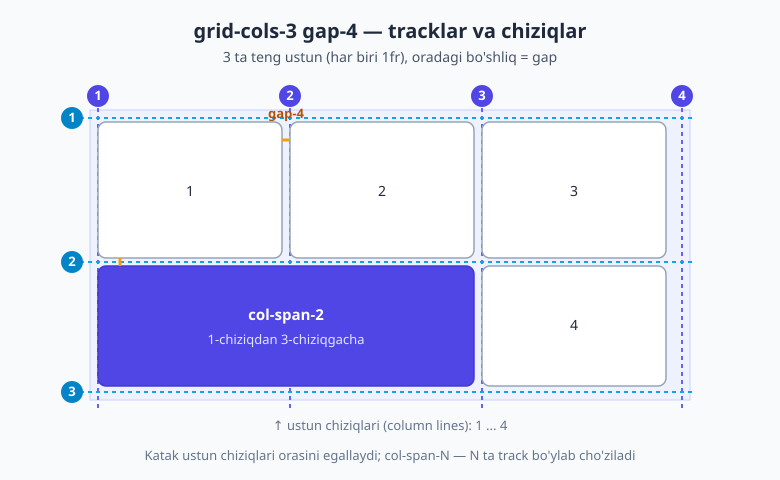
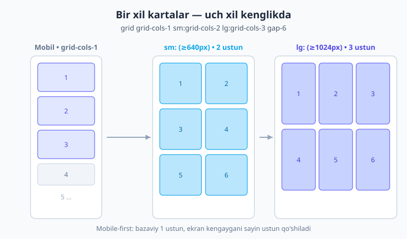
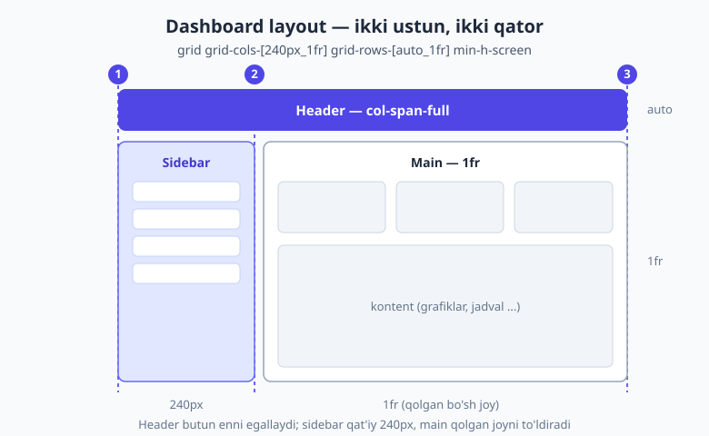

# 07 — CSS Grid Tailwind bilan

[⬅️ Oldingi: 06 — Flexbox](./06-flexbox.md) · [🏠 README](./README.md) · [Keyingi: 08 — Positioning, z-index va overflow ➡️](./08-positioning-overflow.md)

> **Bu bobda:** `grid` ni yoqishdan boshlab, `grid-cols-*` va `grid-rows-*` bilan track tuzish, `col-span-*` / `col-start-*` bilan kataklarni joylash, `grid-cols-[...]` arbitrary shablonlar, mashhur responsive karta to'ri, breakpointsiz `auto-fill`/`auto-fit` to'r, implicit grid, grid ichida tekislash, v4 ning `subgrid` xususiyati — va eng asosiysi, **qachon Flexbox, qachon Grid** ishlatishni o'rganamiz. Yakunida real dashboard va "bento" layoutlarni quramiz.

---

## Nega Grid? (Flexbox bizda bor edi-ku)

Oldingi bobda Flexbox ni o'rgandik. U **bir o'qda** (bir qator yoki bir ustun) elementlarni chiroyli taqsimlaydi. Lekin haqiqiy sahifa layouti ko'pincha **ikki o'lchovli**: ham gorizontal, ham vertikal — qatorlar *va* ustunlar bir vaqtda hizalanishi kerak.

Tasavvur qiling: 9 ta kartani 3×3 to'rga joylamoqchisiz, har bir karta bir xil kenglikda va balandlikda, oraliqlar teng. Flexbox bilan buni `flex-wrap` orqali qilsa bo'ladi, lekin kartalar o'ralganda ustunlar bir-biriga to'g'ri kelmaydi — chunki Flexbox ustunlarni "bilmaydi", u faqat elementlarni ketma-ket joylaydi. **CSS Grid** esa avval to'rni (panjarani) chizadi, keyin elementlarni shu panjara kataklariga o'rnatadi. Bu — devorga avval g'isht qatorlarini belgilab, keyin har bir g'ishtni o'z joyiga qo'yishga o'xshaydi.

Tailwind'da CSS Grid'ning butun kuchi qisqa utility klasslarda jamlangan. Agar CSS Grid'ning asosiy tushunchalari (track, line, fr birligi, `grid-template-columns`) hali tanish bo'lmasa, avval [HTML & CSS kitobining Grid bobini](../html-css/16-grid.md) o'qing — bu bob siz o'sha tushunchalarni bilasiz deb hisoblaydi va ularni Tailwind tilida qayta ifodalaydi.

---

## `grid` ni yoqish va ustunlar

Hamma narsa bitta klassdan boshlanadi:

```html
<div class="grid">
  <!-- bolalar -->
</div>
```

`grid` — bu CSS'dagi `display: grid`. O'zi yolg'iz holda hech narsani o'zgartirmaydi (hamma bolalar bitta ustunda turaveradi). Sehr ustunlar sonini belgilaganimizda boshlanadi:

```html
<div class="grid grid-cols-3 gap-4">
  <div>1</div>
  <div>2</div>
  <div>3</div>
  <div>4</div>
  <div>5</div>
  <div>6</div>
</div>
```

`grid-cols-3` — `grid-template-columns: repeat(3, minmax(0, 1fr))` ni anglatadi. Ya'ni **3 ta teng kenglikdagi ustun**, har biri qolgan bo'sh joyni teng bo'lib oladi (`1fr`). Bolalar avtomatik ravishda chapdan o'ngga, qator to'lgach pastga tushib joylanadi: 1·2·3 birinchi qatorda, 4·5·6 ikkinchi qatorda.

> 💡 **Nega `minmax(0, 1fr)`, oddiy `1fr` emas?** `1fr` ba'zan katak ichidagi katta kontent (masalan, uzun matn yoki o'ralmaydigan element) tufayli ustunni kerakidan kengaytirib yuboradi. `minmax(0, 1fr)` esa ustunga "0 gacha qisqarishga ruxsat bor" deb aytadi, shuning uchun ustunlar haqiqatan teng qoladi. Tailwind buni siz uchun avtomatik qo'shadi — bu juda foydali default.

`grid-cols-*` 1 dan 12 gacha tayyor turadi (`grid-cols-1` ... `grid-cols-12`), bu eng ko'p ishlatiladigan diapazon. Lekin v4'da scale **dinamik**: kerak bo'lsa `grid-cols-15` yoki `grid-cols-20` ham to'g'ridan-to'g'ri ishlaydi — Tailwind ularni avtomatik generatsiya qiladi.

### `gap` — kataklar orasidagi bo'shliq

`gap-4` — barcha kataklar orasiga `1rem` (16px) bo'shliq qo'yadi: ham ustunlar orasiga, ham qatorlar orasiga. Bu eski usuldagi `margin` o'yinlaridan ancha toza, chunki **chetlarga bo'shliq qo'shilmaydi** — faqat ichki oraliqlarga. Agar gorizontal va vertikal oraliqni alohida boshqarmoqchi bo'lsangiz:

- `gap-x-6` — faqat ustunlar orasidagi (gorizontal) bo'shliq;
- `gap-y-2` — faqat qatorlar orasidagi (vertikal) bo'shliq.

Quyidagi diagrammada `grid-cols-3 gap-4` to'ri qanday tracklar va chiziqlardan iborat ekanini ko'ring — ustun chiziqlari (column lines) 1 dan 4 gacha raqamlangan, va bitta katak `col-span-2` bilan ikki ustunni egallaydi:



> 📐 Muhim tushuncha: **chiziqlar** (lines) — track'larni ajratuvchi xayoliy chiziqlar. 3 ustunda 4 ta ustun chizig'i bo'ladi (1 — eng chap, 4 — eng o'ng). `col-start`/`col-end` aynan shu raqamlarga murojaat qiladi. Buni esda tuting — keyin joylashtirishda kerak bo'ladi.

### Qatorlar: `grid-rows-*`

Ustunlar singari, qator sonini ham aniq belgilash mumkin:

```html
<div class="grid grid-rows-3 grid-flow-col gap-4">
  ...
</div>
```

`grid-rows-3` — 3 ta teng balandlikdagi qator yaratadi. Amalda qator sonini kamdan-kam aniq belgilaymiz, chunki kontent balandligi ko'pincha o'zgaruvchan — qatorlar **avtomatik** (implicit) tarzda kerakicha qo'shilib boraveradi (buni pastda ko'ramiz). Lekin balandlikni qat'iy nazorat qilish kerak bo'lganda (masalan, teng balandlikdagi 3 qatorli galereya) `grid-rows-*` ayni muddao.

---

## Kataklarni joylashtirish: span va start/end

Hozirgacha har bir bola bitta katakni egalladi. Endi bitta katakni **bir nechta ustun yoki qatorga cho'zamiz** — bu Grid'ning eng kuchli imkoniyatlaridan biri.

### `col-span-*` va `row-span-*`

```html
<div class="grid grid-cols-3 gap-4">
  <div class="col-span-2">Keng karta (2 ustun)</div>
  <div>Tor karta</div>
  <div>3</div>
  <div>4</div>
  <div>5</div>
</div>
```

`col-span-2` — katak **2 ta ustunni** egallaydi (`grid-column: span 2 / span 2`). Birinchi karta endi 1- va 2-ustunni qoplaydi, "Tor karta" esa 3-ustunda qoladi. Xuddi shunday `row-span-2` katakni **2 qatorga** vertikal cho'zadi — masalan, balandroq "asosiy" karta uchun.

Butun qatorni egallash kerak bo'lsa — `col-span-full`. Bu `grid-column: 1 / -1` ga teng, ya'ni "birinchi chiziqdan oxirgisigacha", ustunlar soni qancha bo'lishidan qat'i nazar. Dashboard sarlavhasi (header) uchun ideal.

### Aniq joylashtirish: `col-start-*` / `col-end-*`

Ba'zan katakni faqat cho'zish emas, balki **aniq qaysi chiziqdan boshlanishini** belgilash kerak:

```html
<div class="grid grid-cols-4 gap-4">
  <div class="col-start-2 col-end-4">2-chiziqdan 4-chiziqgacha</div>
</div>
```

`col-start-2 col-end-4` — katak 2-ustun chizig'idan boshlanib, 4-chiziqda tugaydi (ya'ni 2- va 3-ustunlarni egallaydi). `row-start-*` / `row-end-*` esa qatorlar uchun xuddi shunday ishlaydi. Bu yondashuv "bento" turidagi murakkab, nosimmetrik layoutlarda zo'r keladi — har bir katakni panjarada aniq joyga "mixlab" qo'yasiz.

> 💡 `col-start-1`, `col-end-5` kabi raqamlar — diagrammadagi **chiziq raqamlari**. Manfiy raqam ham bor: `col-end-[-1]` "oxirgi chiziq" degani. Tailwind'da `-col-start-1` kabi manfiy variant ham mavjud — orqadan sanash uchun.

---

## Arbitrary track shablonlari — bu yerda Grid kuchayadi

Tayyor `grid-cols-3` teng ustunlar uchun yaxshi. Lekin real layoutda ustunlar ko'pincha **teng emas**: chap panel tor, o'rta keng, o'ng panel o'rtacha. Mana shu yerda v4 ning *arbitrary value* sintaksisi haqiqiy kuchni ochadi:

```html
<div class="grid grid-cols-[1fr_500px_2fr] gap-4">
  <div>chap (1fr)</div>
  <div>o'rta (qat'iy 500px)</div>
  <div>o'ng (2fr)</div>
</div>
```

`grid-cols-[1fr_500px_2fr]` to'g'ridan-to'g'ri `grid-template-columns: 1fr 500px 2fr` ni beradi. Bu yerda **muhim qoida**: kvadrat qavs ichida bo'shliq o'rniga **pastki chiziq (`_`)** ishlatiladi, chunki HTML klass atributida bo'shliq klasslarni ajratadi. Tailwind `_` ni avtomatik bo'shliqqa aylantiradi.

Yana foydali shablonlar:

```html
<!-- 3 ta teng ustun, lekin minmax bilan toza -->
<div class="grid grid-cols-[repeat(3,minmax(0,1fr))] gap-6">...</div>

<!-- Klassik sahifa: sarlavha, cho'ziluvchi o'rta, footer -->
<div class="grid grid-rows-[auto_1fr_auto] min-h-screen">
  <header>...</header>
  <main>...</main>   <!-- 1fr: qolgan bo'sh balandlikni to'liq egallaydi -->
  <footer>...</footer>
</div>
```

Bu oxirgi naqsh — `grid-rows-[auto_1fr_auto]` — har bir sahifada uchraydigan klassik "yopishqoq footer" muammosini bir qatorda hal qiladi: header va footer kontentiga qarab (`auto`) o'lchanadi, `main` esa o'rtada qolgan butun bo'sh joyni (`1fr`) egallaydi, shuning uchun footer doim pastga "yopishadi" — kontent kam bo'lsa ham.

---

## Eng mashhur naqsh: responsive karta to'ri

Agar Tailwind Grid'dan faqat bitta narsani eslab qolsangiz, **bu** bo'lsin. Internetdagi karta galereyalarining aksariyati ayni shu bitta qatorga tayanadi:

```html
<div class="grid grid-cols-1 sm:grid-cols-2 lg:grid-cols-3 gap-6">
  <article class="rounded-xl bg-white p-6 shadow">Karta 1</article>
  <article class="rounded-xl bg-white p-6 shadow">Karta 2</article>
  <article class="rounded-xl bg-white p-6 shadow">Karta 3</article>
  <!-- ... yana kartalar ... -->
</div>
```

Buni o'qishni o'rganing, chunki u **mobile-first**:

- `grid-cols-1` — bazaviy holat (telefon): har bir karta to'liq enni egallab, ustma-ust turadi;
- `sm:grid-cols-2` — ekran `640px` dan kengaysa, **2 ustun**;
- `lg:grid-cols-3` — ekran `1024px` dan kengaysa, **3 ustun**.

`gap-6` esa barcha o'lchamlarda kartalar orasini bir xil ushlab turadi. Quyidagi diagrammada bir xil kartalar to'plami uch xil kenglikda qanday ko'rinishini ko'ring:



> 🧭 `sm:`, `lg:` kabi breakpoint variantlarini bu yerda amaliy ko'rinishda ishlatdik. Ularning to'liq tizimi — mobile-first falsafa, barcha breakpointlar, `max-*` va custom nuqtalar — [09 — Responsive dizayn](./09-responsive-dizayn.md) bobida batafsil. Hozircha "kichik ekran → kam ustun, katta ekran → ko'p ustun" g'oyasini ushlab qoling.

---

## Breakpointsiz responsive to'r: `auto-fill` va `auto-fit`

Yuqoridagi naqsh ajoyib, lekin bir kamchiligi bor: ustunlar sonini siz qo'lda (`sm:`, `lg:`) belgilaysiz. Agar kartalar soni oldindan noma'lum bo'lsa-chi? CSS bunga ham yechim beradi — to'r **o'zi** mavjud joyga qancha karta sig'sa, shuncha ustun ochsin:

```html
<div class="grid grid-cols-[repeat(auto-fill,minmax(16rem,1fr))] gap-6">
  <!-- nechta karta bo'lsa ham, har biri kamida 16rem, joy bo'lsa kengayadi -->
</div>
```

Buni o'qiymiz: "har bir ustun kamida `16rem` (256px) bo'lsin, lekin ortiqcha joy bo'lsa `1fr` bo'lib kengaysin; konteynerga qancha sig'sa — shuncha ustun yarat". Bitta breakpoint yozmasdan to'liq responsive to'r! Ekran kengaysa ustunlar soni o'zi ortadi, torayganda kamayadi.

**`auto-fill` va `auto-fit` farqi** — bu ko'pchilikni chalg'itadi:

| | `auto-fill` | `auto-fit` |
|---|---|---|
| Element kam bo'lsa | **Bo'sh** (ko'rinmas) ustunlar saqlanadi | Bo'sh ustunlar **yig'iladi** (qulaydi) |
| Natija | Elementlar chapda to'planib qoladi, o'ngda bo'sh joy | Mavjud elementlar butun enga **cho'ziladi** |

Ya'ni konteyner keng, lekin atigi 2 ta karta bor desak: `auto-fill` ikkala kartani `16rem` qoldirib chapga to'playdi; `auto-fit` esa o'sha 2 kartani butun enga cho'zib yuboradi. Galereyalar uchun ko'pincha `auto-fit` tabiiyroq ko'rinadi, lekin tanlov dizayningizga bog'liq.

```html
<!-- Kam element bo'lganda butun enga cho'zilsin: -->
<div class="grid grid-cols-[repeat(auto-fit,minmax(16rem,1fr))] gap-6">...</div>
```

---

## Implicit grid: avtomatik qatorlar va `grid-flow`

Yuqorida aytdik: agar ustun sonini belgilab, qatorni belgilamasangiz, Grid kerak bo'lgancha **yangi qatorlarni avtomatik** yaratadi. Bu "implicit" (yashirin) grid. Bir nechta utility uni boshqaradi:

- `grid-flow-row` (default) — bolalar avval qator bo'ylab to'ladi, qator tugagach pastga tushadi;
- `grid-flow-col` — bolalar avval ustun bo'ylab pastga to'ladi, ustun tugagach o'ngga o'tadi;
- `grid-flow-dense` — algoritm bo'sh kataklarni "to'ldirishga" urinadi (span'lar tufayli kelib chiqqan teshiklarni keyingi kichik kataklar bilan tiqishtiradi).

Avtomatik yaratilgan track'larning o'lchamini esa quyidagilar belgilaydi:

- `auto-rows-min` — avtomatik qator balandligi kontentdagi eng kichik o'lchamga teng;
- `auto-rows-fr` — avtomatik qatorlar `1fr` bo'lib teng cho'ziladi;
- `auto-cols-fr` / `auto-cols-min` — xuddi shunday, lekin `grid-flow-col` holatidagi avtomatik ustunlar uchun.

```html
<div class="grid grid-flow-col auto-cols-fr gap-4">
  <!-- har bir bola yangi teng kenglikdagi ustun ochadi -->
</div>
```

Bu naqsh — masalan, soni o'zgaruvchan teng kenglikdagi statistika "chip"lari uchun qulay: nechta element qo'shsangiz, shuncha teng ustun paydo bo'ladi.

---

## Grid ichida tekislash

Flexbox'dagidek, Grid'da ham kataklar ichidagi kontentni va butun to'rni hizalash mumkin. Faqat bu yerda **ikki o'q** bor, shuning uchun nomlar biroz boshqacha.

**Har bir katak ichidagi element uchun** (to'rdagi barcha elementlarga birdaniga):

- `justify-items-*` — gorizontal (inline) o'q bo'yicha: `start` / `center` / `end` / `stretch` (default);
- `items-*` — vertikal (block) o'q bo'yicha: `items-start` / `items-center` / `items-end` / `items-stretch`;
- `place-items-center` — ikkalasini bir vaqtda markazga (qisqartma).

**Butun to'rni** konteyner ichida (agar to'r konteynerdan kichik bo'lsa):

- `justify-center` / `justify-between` ... — to'r ustunlarini gorizontal joylash;
- `content-center` / `content-between` ... — to'r qatorlarini vertikal joylash;
- `place-content-center` — ikkalasi birga.

**Bitta katakni alohida** (faqat o'sha element uchun, umumiy qoidani bekor qilib):

- `justify-self-end` — bitta katakni o'z ustunida o'ngga;
- `self-center` — bitta katakni o'z qatorida vertikal markazga;
- `place-self-center` — ikkalasi birga.

Eng ko'p ishlatiladigan "sehrli" kombinatsiya — **biror narsani aniq markazga** qo'yish:

```html
<div class="grid place-items-center min-h-screen">
  <div>Men aniq markazda turaman</div>
</div>
```

`grid place-items-center min-h-screen` — bu CSS'da biror narsani vertikal va gorizontal markazga qo'yishning eng qisqa va ishonchli yo'li. `min-h-screen` (`min-height: 100vh`) konteynerni butun ekran balandligiga cho'zadi, `place-items-center` esa yagona bolani ikkala o'q bo'yicha markazga joylaydi. Login formasi yoki "yuklanmoqda" spinnerini sahifa o'rtasiga qo'yish uchun ideal.

---

## `subgrid` — bola to'r ota tracklarini meros oladi (v4)

Tasavvur qiling: karta galereyangiz bor, har karta ichida sarlavha, matn va tugma bor. Kartalar har xil uzunlikdagi matnga ega — natijada tugmalar turli balandlikda "sakraydi", chunki har karta o'z ichki balandligini mustaqil hisoblaydi. Tugmalar barcha kartalarda **bir chiziqda** turishi uchun, ichki elementlar **ota to'rning qatorlariga** bo'ysunishi kerak. Aynan shu — `subgrid`:

```html
<ul class="grid grid-cols-3 gap-6">
  <li class="grid grid-rows-subgrid row-span-3">
    <h3>Sarlavha</h3>
    <p>Har xil uzunlikdagi matn...</p>
    <button>Tugma</button>
  </li>
  <!-- boshqa <li> lar ham xuddi shunday -->
</ul>
```

Bu yerda ota `<ul>` 3 ta qatorli to'r emas, balki har bir `<li>` o'zi ichida `grid-rows-subgrid` bilan **ota panjarasining qator chiziqlarini meros oladi** (`row-span-3` orqali 3 qatorni egallashini bildiradi). Natijada barcha kartalardagi sarlavhalar bir qatorga, matnlar bir qatorga, tugmalar bir qatorga tekislanadi — hatto kontent uzunligi har xil bo'lsa ham. `grid-cols-subgrid` esa xuddi shu g'oyani ustunlar uchun beradi.

> 💡 `subgrid` — nisbatan yangi, lekin barcha zamonaviy brauzerlar qo'llab-quvvatlaydi. U "ichki to'r ota to'r bilan hizalansin" degan klassik muammoning toza yechimi. Murakkab ko'rinsa, hozircha shuni eslab qoling: oddiy karta to'rlarida kerak bo'lmaydi, lekin kartalar ichi qatorlab tekislanishi shart bo'lganda bebaho.

---

## Flexbox yoki Grid — qaysi birini tanlash?

Bu — eng ko'p beriladigan savol. Qisqa qoida:

| Holat | Tanlov |
|---|---|
| **Bir o'lchov** — bir qator yoki bir ustun (navbar, tugmalar guruhi, teglar) | **Flexbox** |
| **Ikki o'lchov** — qatorlar *va* ustunlar birga hizalanishi kerak (galereya, sahifa layouti, dashboard) | **Grid** |
| Element **kontentga qarab** o'z o'lchamini "topsin" (oqimga moslashuvchan) | **Flexbox** (content-driven) |
| Avval **panjara/karkas** belgilab, keyin elementlarni joylash | **Grid** (layout-driven) |

> 🧭 Ular **raqib emas**, hamkor. Ko'p real layoutlarda: tashqi karkas — **Grid** (sahifani hududlarga bo'lish), har hudud ichidagi mayda joylashtirish — **Flexbox** (masalan, header ichidagi logo va menyu). Ikkalasini birga ishlatishdan qo'rqmang. Flexbox'ni [oldingi bobda](./06-flexbox.md) ko'rib chiqdik.

---

## Real layoutlarni quramiz

### Dashboard: sidebar + header + main

Eng klassik ilova layouti — tepada to'liq enli header, chapda qat'iy kenglikdagi sidebar, o'ngda qolgan joyni egallovchi asosiy maydon:

```html
<div class="grid grid-cols-[240px_1fr] grid-rows-[auto_1fr] min-h-screen">
  <header class="col-span-full bg-indigo-600 text-white p-4">Logotip va menyu</header>
  <aside class="bg-slate-100 p-4">Yon panel (240px)</aside>
  <main class="p-6">Asosiy kontent (1fr)</main>
</div>
```

Buni bo'laklab tushunamiz:

- `grid-cols-[240px_1fr]` — chap ustun qat'iy **240px**, o'ng ustun qolgan bo'sh joyni (`1fr`) egallaydi;
- `grid-rows-[auto_1fr]` — birinchi qator kontentga qarab (`auto`, header balandligi), ikkinchisi qolgan balandlikni (`1fr`);
- `header` da `col-span-full` — header **ikkala ustunni** ham qoplab, tepada to'liq enni egallaydi;
- `min-h-screen` — butun layout kamida ekran balandligida bo'lsin.



### "Bento" to'r: span'lar bilan jonli galereya

Apple uslubidagi "bento" to'rda kartalar har xil o'lchamda — ba'zilari kengroq, ba'zilari balandroq:

```html
<div class="grid grid-cols-4 auto-rows-[160px] gap-4">
  <div class="col-span-2 row-span-2 ...">Katta (2×2)</div>
  <div class="col-span-2 ...">Keng (2×1)</div>
  <div class="...">Kichik</div>
  <div class="...">Kichik</div>
  <div class="col-span-2 ...">Keng (2×1)</div>
</div>
```

`auto-rows-[160px]` — har bir avtomatik qator balandligini 160px qiladi, `col-span-*` va `row-span-*` esa kataklarga turli "vazn" beradi. Agar span'lar tufayli teshiklar qolsa, `grid-flow-dense` qo'shib ularni keyingi kichik kartalar bilan to'ldirishga urinib ko'ring.

### Markazlash: bitta qatorda

```html
<div class="grid place-items-center min-h-screen bg-slate-50">
  <form class="rounded-xl bg-white p-8 shadow">Login formasi</form>
</div>
```

Eslatib o'tamiz — bu CSS tarixidagi eng ko'p qidirilgan masala ("how to center a div") ning eng toza yechimi.

---

## Tez-tez uchraydigan xatolar

- **`grid` ni unutish.** `grid-cols-3` o'zi yetarli emas — ota elementda `grid` ham bo'lishi shart. `grid-cols-3` faqat `display: grid` yoqilganda ishlaydi.
- **Arbitrary qiymatda bo'shliq qoldirish.** `grid-cols-[240px 1fr]` ishlamaydi — bo'shliq o'rniga `_` kerak: `grid-cols-[240px_1fr]`.
- **`gap` o'rniga `margin` ishlatish.** Kataklar orasiga `m-2` qo'ymang — chetlarda ortiqcha bo'shliq paydo bo'ladi. `gap-*` aynan ichki oraliqlar uchun yaratilgan.
- **`auto-fit` va `auto-fill` ni almashtirib yuborish.** Kam elementli galereya kutilmaganda chapga to'planib qolsa — siz `auto-fill` ishlatgansiz, lekin `auto-fit` xohlagansiz (yoki aksincha).
- **`grid-cols-*` ni karta soniga qattiq bog'lash.** "6 ta karta bor, demak `grid-cols-6`" — bu mobil ekranni buzadi. Responsive variantlar (`sm:`/`lg:`) yoki `auto-fit` ishlating.

---

## Mashqlar

> Yechishdan oldin o'zingiz urinib ko'ring, keyin yechimga qarang. Hammasini [02-bobdagi](./02-ornatish-birinchi-qadam.md) loyihangizda sinab ko'ring.

**1.** 6 ta kartani quyidagicha joylashtiring: mobil ekranda 1 ustun, planshet (`sm:`) da 2 ustun, desktop (`lg:`) da 4 ustun. Kataklar orasi `1.5rem` bo'lsin.

**2.** Sahifa layoutini quring: tepada `auto` balandlikdagi header, o'rtada cho'ziluvchi `main`, pastda `auto` balandlikdagi footer. Kontent kam bo'lsa ham footer ekran pastiga "yopishsin".

**3.** `grid-cols-4` to'rida birinchi karta 2 ustun va 2 qatorni egallasin (katta "asosiy" karta), qolganlari oddiy 1×1 bo'lsin.

**4.** Breakpointlardan **foydalanmasdan** responsive galereya quring: har bir karta kamida `14rem` bo'lsin, joy bo'lsa cho'zilsin, konteynerga qancha sig'sa shuncha ustun bo'lsin.

**5.** Bir element (`<div>Markazda</div>`)ni butun ekranning aniq markaziga (vertikal va gorizontal) faqat Grid utility'lari bilan joylang.

**6.** (Qiyinroq) Dashboard layoutini quring: chapda 260px sidebar, o'ngda asosiy maydon; tepada to'liq enli header. Header ikkala ustunni qoplasin.

<details>
<summary>Yechimlar</summary>

**1.**

```html
<div class="grid grid-cols-1 sm:grid-cols-2 lg:grid-cols-4 gap-6">
  <article>...</article>
  <!-- ... 6 ta karta ... -->
</div>
```

`gap-6` = `1.5rem`. Bazaviy 1 ustun, `sm:` da 2, `lg:` da 4 — mobile-first o'sib boradi.

**2.**

```html
<div class="grid grid-rows-[auto_1fr_auto] min-h-screen">
  <header class="p-4 bg-slate-100">Header</header>
  <main class="p-6">Asosiy kontent</main>
  <footer class="p-4 bg-slate-100">Footer</footer>
</div>
```

`auto_1fr_auto` — `main` o'rtadagi butun bo'sh joyni egallaydi, shuning uchun footer doim pastga yopishadi. `min-h-screen` butun balandlikni kafolatlaydi.

**3.**

```html
<div class="grid grid-cols-4 auto-rows-[140px] gap-4">
  <div class="col-span-2 row-span-2 bg-indigo-600 ...">Asosiy</div>
  <div>...</div>
  <div>...</div>
  <div>...</div>
  <div>...</div>
  <!-- ... -->
</div>
```

`col-span-2 row-span-2` — birinchi katak 2×2 maydonni egallaydi; qolganlar avtomatik o'z joylariga oqib boradi.

**4.**

```html
<div class="grid grid-cols-[repeat(auto-fit,minmax(14rem,1fr))] gap-6">
  <!-- nechta karta bo'lsa ham -->
</div>
```

`auto-fit` — kam element bo'lsa ham mavjud kartalar butun enga cho'ziladi. Agar kam bo'lganda chapga to'planib qolishini xohlasangiz, `auto-fit` o'rniga `auto-fill` qo'ying.

**5.**

```html
<div class="grid place-items-center min-h-screen">
  <div>Markazda</div>
</div>
```

`place-items-center` — `justify-items-center` + `items-center`. `min-h-screen` konteynerni butun ekran balandligiga cho'zadi, shuning uchun markaz ham vertikal, ham gorizontal.

**6.**

```html
<div class="grid grid-cols-[260px_1fr] grid-rows-[auto_1fr] min-h-screen">
  <header class="col-span-full bg-indigo-600 text-white p-4">Header</header>
  <aside class="bg-slate-100 p-4">Sidebar</aside>
  <main class="p-6">Asosiy maydon</main>
</div>
```

`grid-cols-[260px_1fr]` — qat'iy sidebar + cho'ziluvchi main; `col-span-full` header'ni ikkala ustun ustiga yoyadi; `grid-rows-[auto_1fr]` header'ni kontentiga, mainni qolgan balandlikka moslaydi.

</details>

---

## Xulosa

- `grid` + `grid-cols-N` — eng tez yo'l: teng ustunli to'r. `gap-*` (yoki `gap-x`/`gap-y`) kataklar orasini boshqaradi.
- `col-span-*` / `row-span-*` kataklarni cho'zadi; `col-start`/`col-end` chiziq raqamlari bo'yicha aniq joylaydi; `col-span-full` butun enga.
- `grid-cols-[...]` arbitrary shablon — Grid'ning haqiqiy kuchi: `[240px_1fr]`, `[repeat(auto-fit,minmax(16rem,1fr))]`, qatorlarda `[auto_1fr_auto]`. Bo'shliq o'rniga `_`.
- `grid grid-cols-1 sm:grid-cols-2 lg:grid-cols-3 gap-6` — eng mashhur responsive karta naqshi. `auto-fit`/`auto-fill` esa breakpointsiz to'r beradi.
- `place-items-center min-h-screen` — markazlashning eng toza yechimi. `subgrid` — bola to'r ota tracklarini meros oladi.
- **Bir o'lchov → Flexbox, ikki o'lchov → Grid.** Ko'pincha tashqi karkas Grid, ichi Flexbox.

Keyingi bobda elementlarni oddiy oqimdan **chiqarib** joylashtirishni — `relative`/`absolute`/`fixed`/`sticky`, `z-index` qatlamlanishi va `overflow` ni — o'rganamiz.

---

[⬅️ Oldingi: 06 — Flexbox](./06-flexbox.md) · [🏠 README](./README.md) · [Keyingi: 08 — Positioning, z-index va overflow ➡️](./08-positioning-overflow.md)
