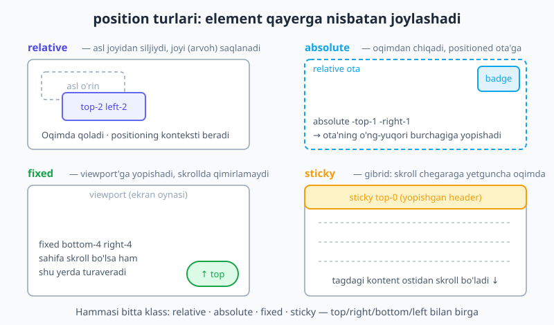
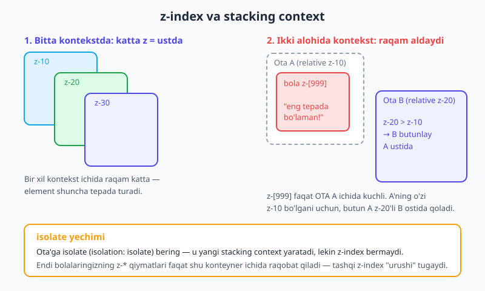
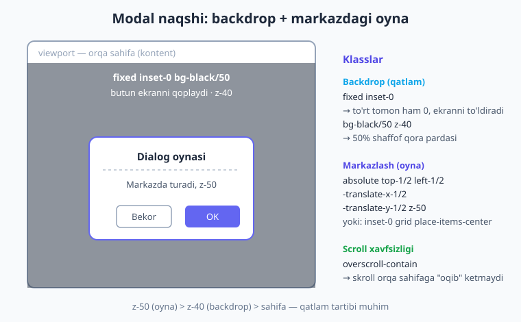

# 08 — Positioning, z-index va overflow

[⬅️ Oldingi: 07 — CSS Grid](./07-grid.md) · [🏠 README](./README.md) · [Keyingi: 09 — Responsive dizayn ➡️](./09-responsive-dizayn.md)

> **Bu bobda:** elementni oqimdan "olib chiqib" aniq nuqtaga qo'yish — `relative`/`absolute`/`fixed`/`sticky` va `inset-*` siljishlar; qatlamlarni boshqaruvchi `z-*` hamda uni buzadigan **stacking context** muammosi (va `isolate` yechimi); va kontent quti chegarasidan toshganda nima bo'lishini boshqaruvchi `overflow-*`. Yo'l davomida badge, yopishgan header, modal va "tepaga qaytish" tugmasini noldan quramiz.

---

Flexbox va Grid bilan biz sahifaning **asosiy karkasini** quramiz — elementlar bir-birining yoniga yoki to'r ichiga tartib bilan tushadi. Lekin haqiqiy interfeyslarda ko'pincha bundan ko'prog'i kerak: avatar ustiga yopishtirilgan "3" xabar yorlig'i, skroll qilganda tepada qotib turadigan menyu, ekran o'rtasida paydo bo'ladigan modal oyna, pastki burchakdagi "tepaga qaytish" tugmasi.

Bularning hammasi **positioning** bilan qilinadi — element normal oqimdan chiqib, siz xohlagan nuqtaga, yoki boshqa element ustiga qo'yiladi. Bu bob sizni eng sodda joylashtirishdan to expert darajadagi `z-index` nozikliklarigacha bosqichma-bosqich olib boradi.

> 💡 Bu bob siz CSS positioning asoslarini (normal flow, `position` qiymatlari, stacking context) bilasiz deb hisoblaydi. Agar bu tushunchalar xira bo'lsa, avval [HTML & CSS kitobining "Positioning va z-index" bobini](../html-css/14-positioning.md) o'qing. Bu yerda biz xuddi shu CSS xossalarini **Tailwind klasslari** tilida qayta ifodalaymiz.

---

## 08.1 Position utility'lari — beshta klass

CSS'da siz `position: absolute;` deb yozasiz. Tailwind'da bu — bitta klass: `absolute`. Beshta `position` qiymati to'g'ridan-to'g'ri beshta utility'ga moslashadi:

| CSS | Tailwind | Oqimda qoladimi? | Nimaga nisbatan siljiydi? |
|---|---|---|---|
| `position: static` | `static` | Ha (default) | Hech nimaga — `top/left` ishlamaydi |
| `position: relative` | `relative` | Ha (joyi saqlanadi) | O'zining asl o'rniga |
| `position: absolute` | `absolute` | **Yo'q** (oqimdan chiqadi) | Eng yaqin positioned ota'ga |
| `position: fixed` | `fixed` | **Yo'q** (oqimdan chiqadi) | Viewport'ga (ekran oynasiga) |
| `position: sticky` | `sticky` | Ha, keyin yopishadi | Skroll konteyneriga |

Quyidagi diagramma to'rttasi (`relative`, `absolute`, `fixed`, `sticky`) qanday farq qilishini ko'rsatadi:



Endi har birini alohida, amaliy misol bilan ochamiz.

### static — standart holat

`static` — har bir elementning **default** qiymati. Siz `position` ni umuman yozmasangiz, element `static` bo'ladi. Static elementda `top`/`right`/`bottom`/`left` va `z-*` **ishlamaydi**. Demak `static` klassini deyarli hech qachon qo'lda yozmaysiz — u faqat boshqa joyda qo'yilgan positioning'ni qaytarib olib tashlash uchun kerak bo'ladi (masalan responsive: `absolute md:static`).

### relative — asl joyidan ozgina siljitish va kontekst berish

`relative` element **o'z asl o'rnida qoladi** (joyi saqlanadi), lekin `top-*`/`left-*` bilan u joyidan biroz siljishi mumkin:

```html
<div class="relative top-2 left-4">Men asl joyimdan 0.5rem past, 1rem o'ngga siljidim</div>
```

Lekin `relative` ning **asosiy roli** boshqa narsa: u o'zidan ichkaridagi `absolute` bolalar uchun **lanqar** (positioning konteksti) bo'ladi. Buni keyingi bo'limda quramiz — bu Tailwind'da eng tez-tez ishlatiladigan naqsh.

### absolute — oqimdan chiqib, positioned ota'ga yopishish

`absolute` element **normal oqimdan butunlay chiqadi** (boshqa elementlar uni "ko'rmaydi", uning joyi bo'sh qoladi) va eng yaqin **positioned ota'ga** (ya'ni `relative`/`absolute`/`fixed`/`sticky` bo'lgan ota) nisbatan joylashadi.

```html
<div class="relative ...">
  <span class="absolute top-0 right-0">men ota'ning o'ng-yuqorisida</span>
</div>
```

> ⚠️ **Eng ko'p uchraydigan xato:** ota'ga `relative` qo'yishni unutish. Agar hech bir ota positioned bo'lmasa, `absolute` element eng tepaga — `<body>` ga (viewport'ga) yopishib, sahifaning burchagiga "sakrab" ketadi. Qoidani yodda tuting: **`absolute` bola → `relative` ota.**

### fixed — ekranga (viewport'ga) yopishish

`fixed` ham oqimdan chiqadi, lekin u **viewport'ga** (brauzer oynasiga) nisbatan turadi va sahifa skroll bo'lganda **qimirlamaydi**. "Tepaga qaytish" tugmasi, chat oynasi, cookie banneri — hammasi `fixed`:

```html
<button class="fixed bottom-4 right-4 z-50 rounded-full bg-indigo-600 p-3 text-white shadow-lg">
  ↑
</button>
```

### sticky — gibrid: oqimda turadi, keyin yopishadi

`sticky` — `relative` va `fixed` ning duragayi. Element odatdagidek oqimda skroll bo'ladi, lekin belgilangan chegaraga (masalan `top-0`) yetganda **o'sha yerda qotib qoladi** va ota-konteyneri tugaguncha shunday turadi. Yopishgan sarlavhalar uchun ideal:

```html
<header class="sticky top-0 z-50 bg-white shadow">...</header>
```

> 📌 `sticky` da `top-*` (yoki `bottom-*`) **shart** — qaysi chegaraga yopishishni aytib berasiz. `top-0` siz `sticky` hech narsa qilmaydi.

---

## 08.2 Offsetlar: top/right/bottom/left, inset va arbitrary

Siljish masofasini `top-*`, `right-*`, `bottom-*`, `left-*` belgilaydi. Ularning qiymati — o'sha tanish `--spacing` scale (`top-4` = `1rem`), foiz (`top-1/2` = `50%`), yoki `top-0`/`top-full`.

`inset-*` esa **to'rttasini birato'la** beradi. Bu juda foydali qisqartma:

| Klass | Ma'nosi |
|---|---|
| `inset-0` | `top: 0; right: 0; bottom: 0; left: 0` — ota'ni to'liq qoplaydi |
| `inset-x-0` | `left: 0; right: 0` — gorizontal cho'ziladi |
| `inset-y-0` | `top: 0; bottom: 0` — vertikal cho'ziladi |
| `inset-4` | to'rttasiga ham `1rem` |

**Eng muhim naqsh:** `absolute inset-0` — element ota'ni **to'liq qoplaydi**. Buni rasm ustidagi qoplama (overlay), yuklanish ekrani (skeleton), karta linki uchun ishlatasiz:

```html
<div class="relative">
  
  <!-- inset-0 → rasmni to'liq qoplaydigan qoramtir qatlam -->
  <div class="absolute inset-0 rounded-lg bg-black/40"></div>
  <h3 class="absolute bottom-3 left-3 text-white">Sarlavha</h3>
</div>
```

**Manfiy offsetlar** — element ota chegarasidan **tashqariga** chiqishi uchun: `-top-2`, `-right-1`. Avatar burchagidagi badge shunday qilinadi (pastda quramiz).

**Arbitrary qiymatlar** — scale'da yo'q aniq piksel kerak bo'lsa: `top-[117px]`, `left-[3px]`, `inset-[12px]`. Lekin avval scale'dan foydalanishga harakat qiling — dizayn izchilligi shundan.

---

## 08.3 Markazlashtirish hiylasi

Elementni ota'ning **aniq markaziga** qo'yishning klassik usuli — yarmiga siljitib, keyin o'z o'lchamining yarmicha orqaga tortish:

```html
<div class="relative h-64">
  <div class="absolute top-1/2 left-1/2 -translate-x-1/2 -translate-y-1/2">
    Men aynan markazda
  </div>
</div>
```

Nega `-translate-x-1/2` kerak? Chunki `left-1/2` elementning **chap chetini** markazga qo'yadi, markazini emas. `-translate-x-1/2` esa elementni o'z **kengligining yarmicha** chapga tortib, haqiqiy markazga keltiradi. `transform` haqida [17-bobda](./17-transition-transform-animatsiya.md) batafsil — hozircha shu naqshni eslab qoling.

> 💡 **Zamonaviy, soddaroq muqobil:** agar element ota'ni to'liq qoplay olsa, `absolute inset-0 grid place-items-center` yozing — grid markazlashtirishni o'zi bajaradi, `translate` hisoblashlarisiz. Ikkala usul ham to'g'ri; markazlashtirish maqsadingiz bo'lsa, ikkinchisi ko'pincha tozaroq.

---

## 08.4 Amaliy naqshlar — noldan quramiz

Endi positioning'ning eng ko'p uchraydigan beshta naqshini yig'amiz. Bularni yodlab qo'ying — interfeys ishida ular qayta-qayta kerak bo'ladi.

### 1. Avatar ustidagi badge

`relative` ota + `absolute` burchakdagi bola. Manfiy offset badge'ni chetga "chiqarib" qo'yadi:

```html
<div class="relative inline-block">
  
  <span class="absolute -top-1 -right-1 grid size-5 place-items-center
               rounded-full bg-red-500 text-xs text-white">3</span>
</div>
```

### 2. Yopishgan header

```html
<header class="sticky top-0 z-50 flex items-center gap-4 bg-white/90 px-6 py-3
               shadow backdrop-blur">
  <span class="font-bold">Logo</span>
  <nav class="ml-auto flex gap-4">...</nav>
</header>
```

`z-50` muhim — header skrolldagi kontent ustida turishi uchun. `backdrop-blur` esa orqadan o'tayotgan kontentni xiralashtiradi (14-bobda).

### 3. To'liq qoplama / modal backdrop

```html
<div class="fixed inset-0 z-40 bg-black/50"></div>
```

`fixed inset-0` butun ekranni egallaydi, `bg-black/50` esa 50% shaffof qora parda beradi. Diagrammada (pastda) modal'ning to'liq tuzilishini ko'rasiz.

### 4. "Tepaga qaytish" tugmasi

```html
<button class="fixed bottom-4 right-4 z-50 rounded-full bg-indigo-600 p-3
               text-white shadow-lg hover:bg-indigo-700">↑</button>
```

### 5. Rasm + izoh qoplamasi

```html
<figure class="relative overflow-hidden rounded-xl">
  
  <figcaption class="absolute inset-x-0 bottom-0 bg-linear-to-t from-black/70
                     to-transparent p-4 text-white">
    Tyan-Shan, 2026
  </figcaption>
</figure>
```

`inset-x-0 bottom-0` — izohni butun kenglik bo'ylab, pastga yopishtiradi. `overflow-hidden` esa rasm yumaloq burchaklardan (`rounded-xl`) toshib chiqmasligini ta'minlaydi — bu haqda 08.6 da.

---

## 08.5 z-index va stacking context — expert darajadagi og'riq

Elementlar bir-biri ustiga tushganda, qaysi biri **tepada** ko'rinishini `z-*` boshqaradi. Tailwind'da:

| Klass | `z-index` |
|---|---|
| `z-0` | `0` |
| `z-10` `z-20` `z-30` `z-40` `z-50` | mos qiymatlar (qadam 10) |
| `z-auto` | `auto` (default) |
| `-z-10` | `-10` (manfiy — orqaga) |
| `z-[100]` | arbitrary aniq qiymat |

```html
<div class="relative z-10">orqada</div>
<div class="relative z-20">oldinda</div>
```

> ⚠️ `z-*` faqat **positioned** elementlarda (`relative`/`absolute`/`fixed`/`sticky`) ishlaydi. `static` elementga `z-50` qo'ysangiz, hech narsa o'zgarmaydi — bu yana bir tez-tez uchraydigan xato.

### Nega ba'zan z-[9999] ham ishlamaydi?

Bu — har bir dasturchini bir marta sarsongarchilikka soladigan muammo. Siz elementga `z-[9999]` berasiz, lekin u baribir boshqa narsa ostida qoladi. Sababi — **stacking context** (qatlam konteksti).

`z-index` raqamlari **faqat bir xil stacking context ichida** bir-biri bilan solishtiriladi. Agar element boshqa kontekst ichida bo'lsa, uning `z-9999` qiymati o'sha **kontekstning o'zining** tashqi qiymatidan oshib keta olmaydi.



Diagrammadagi misol: Ota A `z-10`, ichidagi bola `z-[999]`. Ota B esa `z-20`. Bola "men 999 man, eng tepada bo'laman!" desa ham, u faqat **Ota A ichida** kuchli. Ota A butunligicha `z-10` bo'lgani uchun, B (`z-20`) butun A ni — va undagi `z-[999]` bolani ham — bosib o'tadi.

**Stacking context nima yaratadi?** Quyidagilar yangi kontekst ochadi (ya'ni ichidagi `z-*` "qamab" qo'yiladi):

- `position` (relative/absolute/fixed/sticky) **+ `z-*` qiymati**
- `fixed` va `sticky` (z-siz ham)
- `opacity` 1 dan kichik bo'lsa (`opacity-90` ham!)
- `transform`, `filter`, `backdrop-filter` (ya'ni `scale-95`, `blur-sm`, `backdrop-blur` ham!)
- `isolation: isolate` (`isolate` klassi)

> 📌 Bu ro'yxatdagi `opacity` va `transform` — eng yashirin "sabablar". `transition` yoki `hover:scale-105` qo'shganingizdan keyin to'satdan tooltip yo'qolib qolsa, ehtimol siz bilmagan holda yangi stacking context yaratgansiz. Stacking context CSS qoidalari [HTML & CSS kitobida](../html-css/14-positioning.md) chuqurroq ochilgan.

### isolate — kontekst urushini tinchitish

`isolate` (`isolation: isolate`) — `z-index` bermasdan, **ataylab** yangi stacking context yaratadi. Bu nega foydali? Tasavvur qiling, sizda komponent bor va uning ichidagi `z-10`/`z-20` qatlamlari tashqaridagi boshqa komponentlar bilan "urushib" qoladi. Konteynerga `isolate` bersangiz, ichkaridagi barcha `z-*` qiymatlari **faqat shu konteyner ichida** raqobat qiladi va tashqariga sizib chiqmaydi:

```html
<div class="isolate">
  <div class="relative z-10">...</div>
  <div class="relative z-20">...</div>
  <!-- bu z-* qiymatlar tashqaridagi elementlarga ta'sir qilmaydi -->
</div>
```

Bu — `z-[99999]` poygasiga tushib ketmaslikning toza, professional yo'li.

---

## 08.6 overflow — chegaradan toshgan kontent

Element ichidagi kontent uning quti chegarasidan **tashqariga toshib** chiqsa nima bo'ladi? Buni `overflow-*` boshqaradi:

| Klass | Xulq-atvori |
|---|---|
| `overflow-visible` | default — toshgan kontent ko'rinaveradi |
| `overflow-hidden` | toshgan qism **kesib tashlanadi** (ko'rinmaydi) |
| `overflow-auto` | kerak bo'lsagina skroll-bar chiqadi |
| `overflow-scroll` | har doim skroll-bar (kerak bo'lmasa ham) |
| `overflow-clip` | `hidden` kabi, lekin dasturiy skroll'ga ham yo'l qo'ymaydi |
| `overflow-x-auto` / `overflow-y-scroll` | faqat bitta o'q bo'yicha |

### overflow-hidden — eng ko'p ishlatiladigan

`overflow-hidden` ning ikkita asosiy vazifasi bor:

1. **Yumaloq burchakni "kesish".** `rounded-xl` qo'ygan konteyneringiz ichidagi rasm to'rtburchak bo'lib, burchaklardan toshib chiqsa — `overflow-hidden` rasmni konteyner shakliga "qirqib" qo'yadi. (08.4 dagi rasm+izoh misolida shuni ishlatdik.)
2. **Kontentni qamab turish** — toshib chiqishi mumkin bo'lgan har qanday narsani konteyner ichida ushlab turish.

### Skrollanadigan konteyner

Eng amaliy misol — gorizontal kartalar qatori. Konteyner kenglikka sig'masa, `overflow-x-auto` uni yon tomonga skrollanadigan qiladi:

```html
<div class="flex gap-4 overflow-x-auto pb-4">
  <div class="w-64 shrink-0 rounded-xl bg-white p-4 shadow">Karta 1</div>
  <div class="w-64 shrink-0 rounded-xl bg-white p-4 shadow">Karta 2</div>
  <div class="w-64 shrink-0 rounded-xl bg-white p-4 shadow">Karta 3</div>
  <!-- ... ko'p kartalar — yon tomonga skroll bo'ladi -->
</div>
```

`shrink-0` muhim — bo'lmasa flex kartalarni siqib, hammasini sig'dirib qo'yadi va skroll yo'qoladi.

### truncate va overflow

Matn bir qatorga sig'masa, uni `…` bilan kesib ko'rsatish kerak bo'ladi. Tailwind buning uchun qisqartma beradi: `truncate` = `overflow-hidden` + `text-ellipsis` + `whitespace-nowrap` birgalikda:

```html
<p class="truncate">Juda uzun sarlavha bir qatorga sig'maydi va uchta nuqta bilan...</p>
```

Demak `truncate` ortida ham `overflow-hidden` yotadi — shuning uchun u shu yerda.

### overscroll-contain — modal uchun zarur

Modal yoki yon panel ichida skrollanadigan ro'yxat bo'lsa, foydalanuvchi ro'yxat oxiriga yetganda skroll **orqadagi sahifaga "oqib"** o'tib ketadi (scroll chaining). `overscroll-contain` shuni to'xtatadi:

```html
<div class="max-h-96 overflow-y-auto overscroll-contain">
  <!-- uzun ro'yxat — skroll bu yerda tugaydi, orqa sahifaga o'tmaydi -->
</div>
```

---

## 08.7 To'liq modal naqshi

Endi o'rgangan hamma narsani — `fixed`, `inset-0`, markazlashtirish, `z-*`, `overscroll-contain` — bitta modal'ga yig'amiz. Quyidagi diagramma uning qatlamlarini ko'rsatadi:



```html
<!-- 1) Backdrop: butun ekranni qoplaydi, orqani xiralashtiradi -->
<div class="fixed inset-0 z-40 bg-black/50"></div>

<!-- 2) Dialog: markazda, backdrop ustida (z-50 > z-40) -->
<div class="fixed top-1/2 left-1/2 z-50 w-full max-w-md -translate-x-1/2 -translate-y-1/2
            rounded-2xl bg-white p-6 shadow-xl">
  <h2 class="text-lg font-bold">Tasdiqlaysizmi?</h2>
  <div class="mt-3 max-h-60 overflow-y-auto overscroll-contain text-slate-600">
    <p>Bu amalni qaytarib bo'lmaydi...</p>
  </div>
  <div class="mt-6 flex justify-end gap-3">
    <button class="rounded-lg px-4 py-2 text-slate-600 hover:bg-slate-100">Bekor</button>
    <button class="rounded-lg bg-indigo-600 px-4 py-2 text-white hover:bg-indigo-700">OK</button>
  </div>
</div>
```

E'tibor bering: backdrop `z-40`, dialog `z-50` — shu tartib oyna pardadan ustun turishini kafolatlaydi. Dialog ichidagi uzun matn `max-h-60 overflow-y-auto overscroll-contain` bilan o'z ichida skrollanadi, orqa sahifaga ta'sir qilmaydi.

> 💡 Bu — modal'ning faqat **joylashuv** qatlami. Uni ko'rsatish/yashirish (`hover`/`focus`/`group`/holat) va animatsiya keyingi boblarda: holat variantlari (`group`, ochiluvchi menyular) [15-bobda](./15-holat-variantlari.md), responsive moslashuv esa [09-bobda](./09-responsive-dizayn.md).

---

## Xulosa

- **Beshta position klass:** `static` (default), `relative` (joyida qoladi + lanqar bo'ladi), `absolute` (oqimdan chiqib positioned ota'ga), `fixed` (viewport'ga, skrollda qotadi), `sticky` (chegaraga yetib yopishadi — `top-*` shart).
- **Offset:** `top/right/bottom/left-*`, `inset-0` (to'rttasi), `inset-x/y-0`, manfiy `-top-2`, arbitrary `top-[117px]`. Markaz: `top-1/2 left-1/2 -translate-x-1/2 -translate-y-1/2` yoki `inset-0 grid place-items-center`.
- **Oltin qoida:** `absolute` bola → albatta `relative` ota.
- **z-index** faqat positioned elementda ishlaydi va faqat **bir xil stacking context ichida** solishtiriladi. `opacity<1`, `transform`, `fixed` yangi kontekst yaratadi — yashirin `z-index` muammolarining sababi. `isolate` bilan kontekstni ataylab yarating va urushni tinchiting.
- **overflow:** `overflow-hidden` (kesish — yumaloq rasm, qamab turish), `overflow-x-auto` (skrollanadigan qator), `truncate` (matn `…`), `overscroll-contain` (modal skrollni qamab turish).

Keyingi bobda esa bularning hammasini **ekran o'lchamiga moslab** — `sm:`/`md:`/`lg:` breakpoint variantlari bilan responsive qilamiz.

---

## Mashqlar

**1.** Avatar (yumaloq rasm) yarating va uning **o'ng-yuqori burchagiga** yashil "online" nuqtasi (kichik doira) joylashtiring — nuqta avatar chetidan biroz tashqarida tursin. Qaysi klasslar kerak?

<details><summary>Yechim</summary>

Ota'ga `relative`, nuqtaga `absolute` + manfiy offset. Manfiy offset nuqtani chetga "chiqaradi":

```html
<div class="relative inline-block">
  
  <span class="absolute top-0 right-0 size-4 rounded-full bg-green-500 ring-2 ring-white"></span>
</div>
```

`ring-2 ring-white` nuqta atrofiga oq halqa qo'yib, uni avatardan ajratib turadi — bu professional detal. Nuqtani yana ham chetga chiqarmoqchi bo'lsangiz `-top-0.5 -right-0.5` ishlating.
</details>

**2.** Skroll qilganda **tepada qotib turadigan** sarlavha (`<header>`) yarating, u doim kontent ustida ko'rinsin. Sticky ishlashi uchun nima shart, va u nima uchun kontent ustida turishi kerak?

<details><summary>Yechim</summary>

```html
<header class="sticky top-0 z-30 bg-white px-6 py-3 shadow">
  Sayt sarlavhasi
</header>
```

- `sticky` + `top-0` — `top-*` siz `sticky` umuman yopishmaydi (qaysi chegaraga yopishishni bilmaydi).
- `z-30` (yoki yuqoriroq) — skroll qilganda tagidan o'tayotgan kontent header **ustiga** chiqib ketmasligi uchun.
- `bg-white` — agar fon shaffof bo'lsa, header orqasidagi kontent unga "ko'rinib" turadi.

> Diqqat: agar `sticky` header'ning biror ota-elementida `overflow-hidden` bo'lsa, sticky **ishlamay qoladi** — bu eng ko'p uchraydigan sticky "buzilishi".
</details>

**3.** Element ota'ning **aniq markazida** turishi uchun ikkita usulni yozing va `left-1/2` ga nega `-translate-x-1/2` qo'shilishini tushuntiring.

<details><summary>Yechim</summary>

**Usul 1 — translate hiylasi:**

```html
<div class="relative h-48">
  <span class="absolute top-1/2 left-1/2 -translate-x-1/2 -translate-y-1/2">Markaz</span>
</div>
```

**Usul 2 — grid (soddaroq):**

```html
<div class="relative h-48">
  <span class="absolute inset-0 grid place-items-center">Markaz</span>
</div>
```

`left-1/2` elementning **chap chetini** ota markaziga qo'yadi — shuning uchun element o'ng tomonga "og'ib" ketadi. `-translate-x-1/2` elementni o'z **kengligining yarmicha** chapga tortib, haqiqiy markazga keltiradi. Element o'lchamini oldindan bilmaganimiz uchun foiz emas, `translate` ishlatamiz (translate o'zining o'lchamiga nisbatan hisoblaydi).
</details>

**4.** Quyidagi kodda `z-[9999]` li tooltip baribir modal ostida qolyapti. Nega va qanday tuzatasiz?

```html
<div class="opacity-95">
  <span class="absolute z-[9999]">Tooltip</span>
</div>
<div class="fixed inset-0 z-50">Modal</div>
```

<details><summary>Yechim</summary>

Sabab: tashqi `<div>` da `opacity-95` (1 dan kichik) bor — bu **yangi stacking context** yaratadi. Demak tooltip'ning `z-[9999]` qiymati faqat **shu div ichida** kuchli. Tashqi div'ning o'zi default `z-auto` bo'lgani uchun, `z-50` li modal butun div'ni — va undagi tooltip'ni ham — bosib o'tadi.

Tuzatishlar (biri yetarli):

- Tooltip'ni opacity'li div'dan **tashqariga** ko'chiring, modal bilan bir kontekstga qo'ying va kerakli `z-*` bering.
- Tashqi div'dan `opacity-95` ni olib tashlang (yoki uni boshqa joyga qo'ying).
- Agar tooltip modaldan ustun turishi shart bo'lsa, uni modal bilan bir darajada — masalan to'g'ridan-to'g'ri `<body>` ostida `fixed z-[60]` bilan rendering qiling (real ilovada "portal" naqshi).

Saboq: katta `z-index` raqami muammoni hal qilmaydi — avval **qaysi stacking context** ichida ekaningizni aniqlang.
</details>

**5.** Gorizontal skrollanadigan kartalar qatori yarating (kartalar siqilib qolmasin). Keyin tushuntiring: nega oddiy `flex` yetarli emas, `overflow-x-auto` va `shrink-0` nima qiladi?

<details><summary>Yechim</summary>

```html
<div class="flex gap-4 overflow-x-auto pb-2">
  <article class="w-72 shrink-0 rounded-xl bg-white p-4 shadow">Karta 1</article>
  <article class="w-72 shrink-0 rounded-xl bg-white p-4 shadow">Karta 2</article>
  <article class="w-72 shrink-0 rounded-xl bg-white p-4 shadow">Karta 3</article>
  <article class="w-72 shrink-0 rounded-xl bg-white p-4 shadow">Karta 4</article>
</div>
```

- Faqat `flex` bo'lsa, flex bolalarni **siqib**, hammasini bitta qatorga sig'dirishga harakat qiladi — natijada kartalar ensiz bo'lib, skroll bo'lmaydi.
- `shrink-0` — har bir kartaga "siqilma, `w-72` o'lchamingni saqla" deydi. Endi yig'indi kenglik konteynerdan oshadi.
- `overflow-x-auto` — kenglik oshganda yon tomonga skroll-bar beradi. Shu uchlik birgalikda "carousel"ga o'xshash qatorni hosil qiladi.
</details>

**6.** (Qiyin) Modal'da uzun ro'yxat bor. Foydalanuvchi ro'yxat oxiriga yetganda skroll orqadagi sahifaga "o'tib ketyapti". Bitta klass bilan tuzating va nega bu klass kerakligini ayting.

<details><summary>Yechim</summary>

```html
<div class="max-h-80 overflow-y-auto overscroll-contain">
  <!-- uzun ro'yxat -->
</div>
```

`overscroll-contain` — **scroll chaining** (skroll zanjiri) ni to'xtatadi. Skrollanadigan konteyner o'z chegarasiga (eng yuqori yoki eng past) yetganda, brauzer default holatda skrollni **ota-elementga uzatadi** — natijada orqa sahifa qimirlaydi. `overscroll-contain` skrollni shu konteyner ichida "qamab" qo'yadi: chegaraga yetgach, ortiqcha skroll boshqa joyga o'tmaydi. Modal, yon panel (drawer), chat oynasi kabi qoplama UI'lar uchun deyarli har doim kerak.
</details>

---

[⬅️ Oldingi: 07 — CSS Grid](./07-grid.md) · [🏠 README](./README.md) · [Keyingi: 09 — Responsive dizayn ➡️](./09-responsive-dizayn.md)
