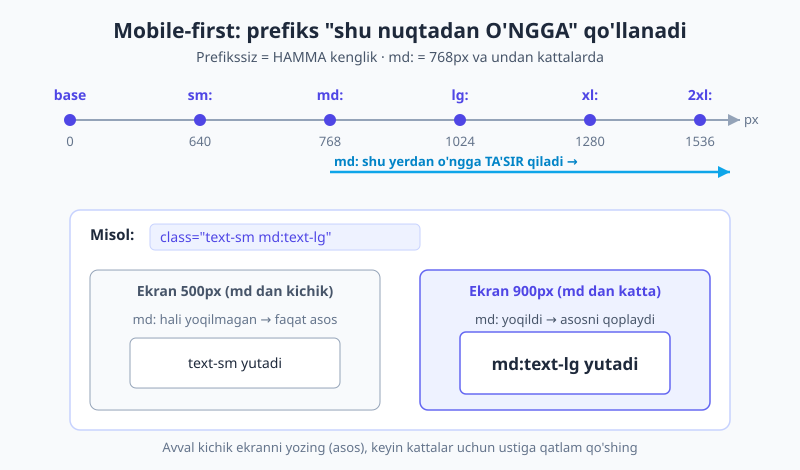
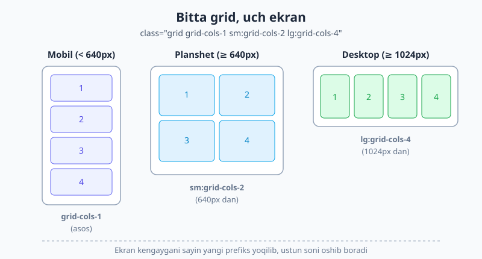
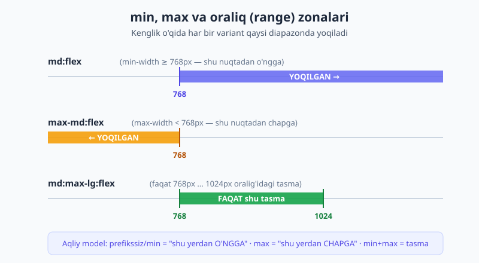

# 09 — Responsive dizayn

[⬅️ Oldingi: 08 — Positioning, z-index va overflow](./08-positioning-overflow.md) · [🏠 README](./README.md) · [Keyingi: 10 — Container queries ➡️](./10-container-queries.md)

> **Bu bobda:** Tailwind'da bitta sahifani har qanday ekranga moslashtirishni o'rganamiz: **mobile-first** falsafa (kitobning eng muhim g'oyalaridan biri), `sm:`/`md:`/`lg:`/... breakpoint variantlari, `max-*` variantlari, oraliqlarni nishonga olish (`md:max-lg:`), ixtiyoriy va custom breakpointlar, hamda `container` utility'si.

---

## 09.1 Avval nega? — bir sahifa, har xil ekran

Tasavvur qiling: chiroyli karta gridi yasadingiz, u 27 dyumli monitorda zo'r ko'rinadi. Keyin do'stingiz uni telefonida ochadi — to'rt ustun bir-biriga siqilib, matn o'qib bo'lmas darajada mayda. Tanish holat, to'g'rimi?

**Responsive dizayn** — bu bitta sahifaning ekran o'lchamiga qarab o'zini qayta tartibga solishi. Telefonda bir ustun, planshetda ikki, desktopda to'rt — lekin HTML bitta, sahifa bitta.

Toza CSS'da buni `@media (min-width: 768px) { ... }` media query'lari bilan yozardingiz (buni [HTML & CSS kitobining responsive bobida](../html-css/17-responsive.md) ko'rgansiz). Tailwind hech narsani o'ylab topmaydi — u xuddi shu media query'larni **klass darajasida** beradi: utility oldiga `md:` kabi prefiks qo'ysangiz, "shu utility faqat shu breakpointdan boshlab ishlasin" degani.

```html
<!-- Toza CSS'dagi g'oya... -->
<style>
  .menu { display: block; }
  @media (min-width: 768px) { .menu { display: flex; } }
</style>

<!-- ...Tailwind'da bitta qatorda -->
<nav class="block md:flex">...</nav>
```

`block` — barcha ekranlarga (asos). `md:flex` — 768px va undan kattalarda ustiga yoziladi. Mana shu **prefiks = breakpoint** g'oyasi butun bobning yuragi.

> 📌 **Atamalar.** **viewport** — brauzer oynasining sahifa ko'rinadigan eni. **breakpoint** — layout o'zgaradigan ekran eni (sindirish nuqtasi). **variant** — utility xulq-atvorini o'zgartiruvchi prefiks; `md:` ham, [03-bobda ko'rganimizdek](./03-utility-first-ish-jarayoni.md), `hover:` kabi variant.

---

## 09.2 Mobile-first — kitobning eng muhim g'oyasi

Tailwind'da (va zamonaviy CSS'da umuman) yondashuv **mobile-first**: avval eng kichik ekranni yozasiz, keyin kattalar uchun ustiga qatlam qo'shasiz. Buni bir marta to'g'ri tushunsangiz, qolgan hamma narsa joyiga tushadi.

Ikki muhim qoida:

1. **Prefikssiz utility — barcha o'lchamlarga qo'llanadi.** `text-center` har qanday ekranda markazlaydi.
2. **Prefiksli utility — o'sha breakpointdan boshlab YUQORIGA qo'llanadi.** `md:text-left` — 768px va undan kattalarda chapga; undan kichigida o'sha asos (`text-center`) qoladi.

```html
<p class="text-center md:text-left">Telefonda markaz, desktopda chap</p>
```

Mana shu rasm prefiksning "shu nuqtadan o'ngga" tabiatini va `text-sm md:text-lg` ikki ekranda qanday hal bo'lishini ko'rsatadi:



> ⚠️ **Eng katta yangi boshlovchi xatosi.** `sm:` ni "faqat kichik ekranlar" deb tushunmang! `sm:text-center` — bu **640px va undan KATTA** ekranlar uchun degani, kichik emas. `sm` so'zi "kichik breakpoint nuqtasi"ni bildiradi, "kichik ekranlar"ni emas. Eng kichik ekranni nishonga olish uchun prefikssiz asos utility'si ishlatiladi. Telefon = asos, prefikslar = undan kattalar.

### Nega aynan mobile-first?

Chunki "asosni kichikka, ustini kattaga" yozish tabiiyroq. Telefon ekrani tor — kontentni vertikal terib, oddiy qilib boshlaysiz. Keyin joy ko'paygani sayin `md:`, `lg:` bilan ustun qo'shasiz, shriftni kattalaytirasiz. Teskarisi (avval desktop, keyin `max-*` bilan kichraytirish) ko'proq qarama-qarshilik va ko'proq kod talab qiladi.

---

## 09.3 Standart breakpointlar jadvali

Tailwind'da besh ta standart breakpoint bor. **v4 ularni `rem`da belgilaydi** (oldingi `px` emas) — bu foydalanuvchining brauzer shrift sozlamasiga hurmat uchun. 1rem = 16px deb hisoblaganda px ekvivalenti ham mos keladi:

| Prefiks | min-width (rem) | px ekvivalenti | Odatda |
|---|---|---|---|
| `sm:` | 40rem | 640px | katta telefon / kichik planshet |
| `md:` | 48rem | 768px | planshet |
| `lg:` | 64rem | 1024px | kichik noutbuk |
| `xl:` | 80rem | 1280px | desktop |
| `2xl:` | 96rem | 1536px | katta monitor |

Esda tuting: bularning hammasi **`min-width`** — ya'ni "shu eni va undan katta". Asos (prefikssiz) esa 0px dan boshlanadi.

```html
<!-- Bitta utility'ni bir nechta breakpointda o'zgartirish -->
<h1 class="text-2xl md:text-4xl lg:text-5xl">Moslashuvchan sarlavha</h1>
```

Bu sarlavha telefonda `text-2xl`, planshetda `text-4xl`, desktopda `text-5xl`. Har bir prefiks faqat o'z nuqtasidan yuqorida oldingisini qoplaydi.

---

## 09.4 Klassik responsive naqshlar

Amalda 90% holatlarni quyidagi bir nechta naqsh qoplaydi. Ularni yodlab oling — kundalik ish shulardan iborat.

### 1) Stack → row navigatsiya

Telefonda elementlar ustma-ust (vertikal), desktopda yonma-yon (gorizontal):

```html
<nav class="flex flex-col md:flex-row gap-4">
  <a href="#">Bosh sahifa</a>
  <a href="#">Mahsulotlar</a>
  <a href="#">Aloqa</a>
</nav>
```

`flex flex-col` — asos (vertikal ustun). `md:flex-row` — 768px dan boshlab qatorga aylanadi.

### 2) Moslashuvchan karta gridi

Telefonda 1 ustun, planshetda 2, desktopda 4:

```html
<div class="grid grid-cols-1 sm:grid-cols-2 lg:grid-cols-4 gap-6">
  <div class="rounded-xl bg-white p-4 shadow">Karta 1</div>
  <div class="rounded-xl bg-white p-4 shadow">Karta 2</div>
  <div class="rounded-xl bg-white p-4 shadow">Karta 3</div>
  <div class="rounded-xl bg-white p-4 shadow">Karta 4</div>
</div>
```

Quyidagi rasm aynan shu gridni uch kenglikda ko'rsatadi:



### 3) Moslashuvchan padding va bo'shliq

Tor ekranda kichik padding (joy qadrli), keng ekranda kattaroq:

```html
<section class="p-4 md:p-8 lg:p-12">...</section>
```

### 4) Ko'rsatish / yashirish — mobil menyu tugmasi

Bu juda ko'p ishlatiladi. Telefonda "hamburger" tugmasi ko'rinadi, desktopda yo'qoladi; to'liq menyu esa aksincha:

```html
<!-- Faqat telefonda ko'rinadigan hamburger tugmasi -->
<button class="md:hidden">☰</button>

<!-- Telefonda yashirin, desktopda ko'rinadigan menyu -->
<ul class="hidden md:flex gap-6">
  <li>Bosh sahifa</li>
  <li>Aloqa</li>
</ul>
```

`hidden md:flex` — asosda yashirin (`display: none`), 768px dan boshlab `flex`. `md:hidden` — asosda ko'rinadi, 768px dan boshlab yashiriladi. Ikkalasi birga ishlatilsa, telefon va desktopda turli elementlar chiqadi. (Tugma bosilganda menyuni ochish — bu JavaScript ishi, hozir faqat klasslar bilan tuzilmani quryapmiz.)

---

## 09.5 `max-*` variantlari — chapga qarab (faqat kerak bo'lganda)

Standart prefikslar `min-width` — "shu nuqtadan o'ngga". Lekin ba'zan teskarisi kerak: faqat kichik ekranda biror narsani qilish. Buning uchun v4 da **`max-*`** variantlari bor:

| Variant | Ma'nosi |
|---|---|
| `max-sm:` | eni **640px dan kichik** bo'lsa |
| `max-md:` | eni **768px dan kichik** bo'lsa |
| `max-lg:` | eni **1024px dan kichik** bo'lsa |

```html
<!-- Faqat telefonda (768px dan kichik) qizil fon -->
<div class="bg-white max-md:bg-red-100">...</div>
```

Aqliy model oddiy: **min (prefikssiz/standart) = "shu yerdan o'ngga", max = "shu yerdan chapga"**.



> 💡 **Maslahat.** Mobile-first uslubda `max-*` ni kamroq ishlatasiz — chunki "kichik ekran" allaqachon sizning asosingiz. `max-*` ni faqat asosni buzmasdan bitta tor diapazonga maxsus tuzatish kerak bo'lganda oling. Agar `max-*` ko'payib ketsa, ehtimol layoutni teskari (desktop-first) qurib qo'ygansiz.

---

## 09.6 Oraliqlarni stacking bilan nishonga olish

Variantlarni **bir-birining ustiga qo'yish** (stacking) mumkin. `min` va `max` ni birga qo'ysangiz — aniq bir tasma (band) hosil bo'ladi:

```html
<!-- FAQAT 768px ... 1024px oralig'ida flex -->
<div class="md:max-lg:flex">...</div>
```

`md:` (768px dan) va `max-lg:` (1024px gacha) birga — natijada faqat planshet diapazonida ishlaydi, undan kichik yoki kattada yo'q. Yuqoridagi rasmdagi yashil tasma aynan shuni ko'rsatadi.

Bu kuchli vosita: masalan, faqat planshetda boshqacha grid yoki faqat bitta o'lcham oralig'ida banner ko'rsatish kerak bo'lsa, juda qo'l keladi.

---

## 09.7 Ixtiyoriy (arbitrary) breakpointlar

Ba'zan dizayn standart breakpointlarga tushmaydigan bir martalik nuqtani talab qiladi. Klass nomi o'ylab topish shart emas — kvadrat qavs ichida to'g'ridan-to'g'ri qiymat berasiz:

```html
<!-- 900px va undan katta: 5 ustun -->
<div class="grid grid-cols-3 min-[900px]:grid-cols-5">...</div>

<!-- 480px dan kichik: yashir -->
<aside class="block max-[480px]:hidden">...</aside>
```

- `min-[900px]:` — `min-width: 900px` media query'si.
- `max-[480px]:` — `max-width: 479.98px` media query'si.

> ⚠️ Ixtiyoriy breakpointlar — qulay, lekin ularni juda ko'p turli qiymatlar bilan sochib tashlamang. Agar bitta o'lcham loyihada qayta-qayta uchrasa, uni custom breakpoint qilib nomlash toza (keyingi bo'limga qarang).

---

## 09.8 Custom breakpoint — to'g'ri yo'l (v4 CSS-first)

Loyihangizga doimiy yangi breakpoint kerakmi? v4 da buni **CSS'da** `@theme` ichida belgilaysiz — `--breakpoint-*` o'zgaruvchisi orqali. Tailwind avtomatik mos variant yaratadi:

```css
@import "tailwindcss";

@theme {
  --breakpoint-3xl: 120rem;   /* yangi 3xl: variantini beradi (1920px) */
  --breakpoint-tablet: 50rem; /* yangi tablet: variantini beradi (800px) */
}
```

Endi HTML'da bemalol ishlatasiz:

```html
<div class="grid-cols-4 3xl:grid-cols-8 tablet:gap-8">...</div>
```

Standart breakpointlardan birini **o'chirib tashlash** kerak bo'lsa, uni `initial` ga tenglang:

```css
@theme {
  --breakpoint-2xl: initial;  /* 2xl: endi mavjud emas */
  --breakpoint-*: initial;    /* HAMMASINI o'chirib, noldan boshlash */
}
```

> 📝 **v3 dan farq.** v3 da breakpointlarni `tailwind.config.js` ichidagi `theme.screens` obyektida JavaScript bilan sozlardingiz. v4 da JS config yo'q — hamma narsa CSS'dagi `@theme` ichida. Custom token tizimi to'liq [18-bobda](./18-theme-dizayn-tizimi.md) ko'riladi; hozir shuni bilsangiz kifoya: breakpoint = `--breakpoint-<nom>` o'zgaruvchisi.

---

## 09.9 `container` utility'si

`container` — sahifa kengligini har bir breakpointda cheklab turuvchi utility. U eni shu paytdagi breakpointning qiymatiga "qotirib" qo'yadi: ekran kengaysa, konteyner ham keyingi breakpointga sakraydi, lekin o'rtada o'sib ketmaydi.

```html
<div class="container mx-auto px-4">
  <!-- kontent markazlangan va eni cheklangan -->
</div>
```

E'tibor bering: `container` o'zi markazlamaydi va padding bermaydi — shuning uchun deyarli har doim `mx-auto` (markazlash) va `px-4` (yon padding) bilan birga ishlatiladi.

**`container` va `max-w-*` farqi.** `container` eni bosqichma-bosqich (breakpointlarda sakrab) o'zgaradi. `max-w-7xl` esa eni bitta qattiq chegara bilan cheklaydi va undan kichik ekranda toza ravon (fluid) qoladi. Ko'p jamoalar amalda quyidagi sodda naqshni `container` dan ko'ra ko'proq afzal ko'radi, chunki uning xulqi oson bashorat qilinadi:

```html
<div class="mx-auto max-w-7xl px-4">...</div>
```

Ikkovi ham to'g'ri — `max-w-*` naqshi "ravon, lekin bir chegaragacha" istasangiz, `container` esa "breakpointlarga qotirilgan kenglik" istasangiz.

---

## 09.10 Variantlarni birga ishlatish

Breakpoint variantlari holat va dark variantlari bilan **stacking** qilinadi — ulardan murakkab, lekin o'qiladigan shartlar tuzasiz:

```html
<!-- Faqat desktopda, ustiga sichqoncha kelganda rang o'zgaradi -->
<button class="bg-indigo-500 md:hover:bg-indigo-700">Tugma</button>

<!-- Dark rejim VA desktopda boshqa fon -->
<div class="bg-white dark:md:bg-slate-800">...</div>
```

Breakpoint va boshqa variantlarni qaysi tartibda yozish natijaga ta'sir qilmaydi (`md:hover:` ham, `hover:md:` ham bir xil ishlaydi), lekin jamoa ichida **bitta tartibni tanlab, izchil** qo'llang — odatda breakpointni oldinga qo'yish (`md:hover:`) o'qishni osonlashtiradi. Holat variantlari to'liq 15-bobda, dark mode 16-bobda ko'riladi.

---

## 09.11 Tekshirish — qanday sinaymiz?

Responsive ishlayotganini ko'z bilan ko'rmasdan ishonib bo'lmaydi:

- Brauzer DevTools'ni oching (F12) va **responsive (device) rejimini** yoqing — ekran enini sudrab o'zgartirib, breakpointlar qaysi nuqtada ishga tushishini kuzating.
- Faqat "telefon" va "desktop"da emas, **breakpointlarning aynan chetida** ham sinab ko'ring: 767px va 768px da nima bo'lishini ko'ring. Xatolar ko'pincha shu chegaralarda yashiringan.
- Asos (prefikssiz) holatni alohida sinang: prefikslarni vaqtincha o'chirib, telefon ko'rinishi o'zicha toza ekanini tekshiring.

---

## 09.12 Amaliy misol — moslashuvchan header

Endi o'rgangan naqshlarni birlashtirib, telefonda hamburger + vertikal menyu, desktopda gorizontal panel bo'ladigan header quramiz (faqat klasslar bilan; tugma bosilganda ochish JavaScript ishi):

```html
<header class="flex items-center justify-between px-4 py-3 md:px-8">
  <!-- Logo: har doim ko'rinadi -->
  <a href="#" class="text-xl font-bold">Logotip</a>

  <!-- Hamburger: faqat telefonda -->
  <button class="md:hidden" aria-label="Menyu">☰</button>

  <!-- Menyu: telefonda yashirin, desktopda gorizontal qator -->
  <nav class="hidden md:flex md:items-center md:gap-6">
    <a href="#">Bosh sahifa</a>
    <a href="#">Mahsulotlar</a>
    <a href="#">Narxlar</a>
    <a href="#">Aloqa</a>
  </nav>
</header>
```

Tahlil qilamiz:

- `flex items-center justify-between` — logo chapda, o'ng tomonda tugma/menyu (asos, har joyda).
- `px-4 py-3 md:px-8` — telefonda kichikroq yon padding, desktopda kengroq.
- `md:hidden` tugmada — desktopda hamburger yo'qoladi.
- `hidden md:flex` menyuda — telefonda yo'q, desktopda gorizontal qator bo'lib chiqadi.

Bitta HTML — ikki butunlay boshqa ko'rinish, hech qanday alohida "mobil sahifa"siz.

---

## 09.13 Tez-tez uchraydigan xatolar

- **`sm:` ni "faqat kichik" deb o'qish.** Eng ko'p uchraydigan xato. `sm:` = 640px va undan KATTA. Kichik ekran = prefikssiz asos.
- **Asos stilini unutish.** `md:flex` yozib, asosga hech narsa qo'ymasangiz, telefonda element standart `display` bilan qoladi — ko'pincha bu siz xohlamagan ko'rinish. Avval asosni yozing, keyin prefikslarni.
- **Qarama-qarshi qoplamalar.** `md:text-left lg:text-left` — `lg:` ortiqcha, chunki `md:` allaqachon undan yuqorigacha amal qiladi. Faqat o'zgargan nuqtada yangi prefiks yozing.
- **`max-*` bilan ortiqcha ovora bo'lish.** Layoutni desktop-first qurib, keyin `max-*` bilan tuzatishga urinish — mobile-first'ga o'tsangiz kod kamayadi.
- **Viewport meta tegini unutish.** Bu Tailwind emas, HTML masalasi, lekin usiz hech qaysi breakpoint telefonda ishlamaydi: `<meta name="viewport" content="width=device-width, initial-scale=1.0">` `<head>` da bo'lishi shart.

> 🔭 **Oldinga qarash.** Breakpointlar **viewport** (butun oyna) eniga qaraydi. Lekin ba'zan komponent o'z **ota-konteyneri** eniga moslashishi kerak — masalan, bir karta yon paneldami yoki keng asosiy maydondami, turlicha ko'rinishi. Buni breakpointlar hal qila olmaydi; buning uchun **container queries** bor — [keyingi bob](./10-container-queries.md) shu haqida.

---

## Mashqlar

**1-mashq.** Quyidagi `class="sm:text-center"` ni o'qiyotgan boshlovchi "matn faqat kichik ekranlarda markazlanadi" dedi. U xato qildimi? To'g'ri ma'nosi nima?

<details markdown="1"><summary>Yechim</summary>

Ha, xato qildi. `sm:` — "kichik ekranlar" emas, "kichik breakpoint **nuqtasidan** boshlab" degani. `sm:text-center` matnni **640px va undan KATTA** ekranlarda markazlaydi; undan kichigida esa standart (chap) holatda qoladi.

Agar haqiqatan "faqat kichik ekranda markaz" kerak bo'lsa, asosga markazni qo'yib, kattalarda qoplash kerak edi:

```html
<p class="text-center sm:text-left">...</p>
```

</details>

**2-mashq.** Telefonda bir ustun, planshetdan boshlab (≥768px) uch ustun bo'ladigan grid uchun klasslarni yozing. Bo'shliq `1.5rem` bo'lsin.

<details markdown="1"><summary>Yechim</summary>

```html
<div class="grid grid-cols-1 md:grid-cols-3 gap-6">...</div>
```

`grid-cols-1` — asos (telefon). `md:grid-cols-3` — 768px dan boshlab uch ustun. `gap-6` = `1.5rem` (spacing scale'da 6 × 0.25rem = 1.5rem).

</details>

**3-mashq.** Bitta tugma telefonda ko'rinib, desktopdan (≥1024px) yashirinsin. Boshqa bir element esa aksincha — telefonda yashirin, desktopda ko'rinsin. Klasslarni yozing.

<details markdown="1"><summary>Yechim</summary>

```html
<!-- Telefonda ko'rinadi, 1024px dan yashirinadi -->
<button class="block lg:hidden">Menyu</button>

<!-- Telefonda yashirin, 1024px dan ko'rinadi -->
<nav class="hidden lg:block">...</nav>
```

`block lg:hidden` — asosda ko'rinadi, `lg:` da `display: none`. `hidden lg:block` — teskarisi.

</details>

**4-mashq.** Faqat planshet diapazonida (768px dan 1024px gacha, ya'ni `lg` ga yetmaguncha) sariq fon kerak. Boshqa o'lchamlarda oq qolsin. Klasslarni yozing.

<details markdown="1"><summary>Yechim</summary>

```html
<div class="bg-white md:max-lg:bg-yellow-200">...</div>
```

`md:` (≥768px) va `max-lg:` (&lt;1024px) ni stacking qilamiz — natijada faqat 768–1024 oralig'idagi tasmada `bg-yellow-200` ishlaydi; undan tashqarida asos `bg-white` qoladi.

</details>

**5-mashq (qiyinroq).** Loyihada `1440px` breakpointi qayta-qayta kerak bo'lyapti. Bir martalik ixtiyoriy qiymat (`min-[1440px]:`) sochish o'rniga, uni `wide:` deb nomlangan doimiy breakpoint qilib qo'shing (v4 usuli). Keyin shu breakpointdan boshlab gridni 6 ustun qiling.

<details markdown="1"><summary>Yechim</summary>

CSS faylda `@theme` ichida breakpointni belgilaymiz:

```css
@import "tailwindcss";

@theme {
  --breakpoint-wide: 90rem;   /* 1440px = 90 × 16px */
}
```

So'ng HTML'da yangi `wide:` varianti tayyor:

```html
<div class="grid grid-cols-2 lg:grid-cols-4 wide:grid-cols-6">...</div>
```

`--breakpoint-wide` o'zgaruvchisi avtomatik `wide:` variantini yaratadi. v3 da bu `tailwind.config.js` dagi `theme.screens` orqali qilinardi — v4 da esa hammasi CSS'da.

</details>

**6-mashq (debugging).** Quyidagi sarlavha telefonda **juda katta** chiqyapti, garchi muallif "telefonda kichik bo'lsin" deb mo'ljallagan. Xatoni toping va tuzating.

```html
<h1 class="text-5xl md:text-2xl">Sarlavha</h1>
```

<details markdown="1"><summary>Yechim</summary>

Muallif mantiqni **teskari** yozgan: bu desktop-first fikrlash. `text-5xl` — bu **asos**, ya'ni eng kichik ekrandan boshlab hamma joyga qo'llanadi, shuning uchun telefonda katta chiqadi. `md:text-2xl` esa 768px dan boshlab kichraytiradi — natija mo'ljalga teskari.

Mobile-first tuzatish: asosga kichik o'lchamni, kattalarga prefiks bilan kattaroqni:

```html
<h1 class="text-2xl md:text-5xl">Sarlavha</h1>
```

Endi telefonda `text-2xl` (kichik), desktopda `text-5xl` (katta). **Qoida:** asos = eng kichik ekran, prefikslar — undan kattalar uchun ustiga qatlam.

</details>

---

[⬅️ Oldingi: 08 — Positioning, z-index va overflow](./08-positioning-overflow.md) · [🏠 README](./README.md) · [Keyingi: 10 — Container queries ➡️](./10-container-queries.md)
