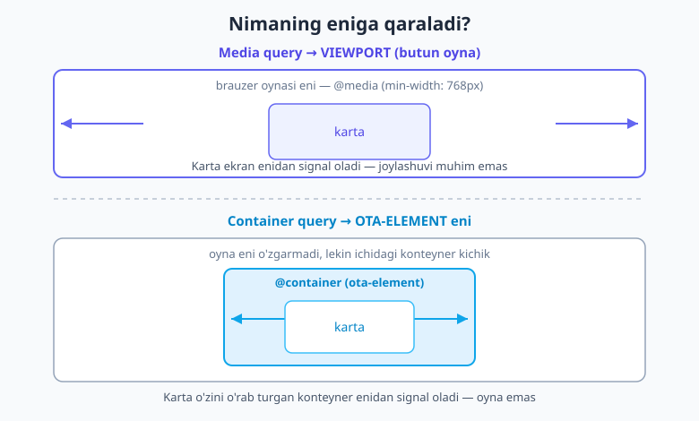
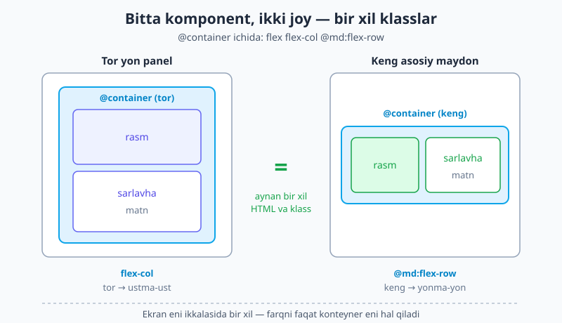
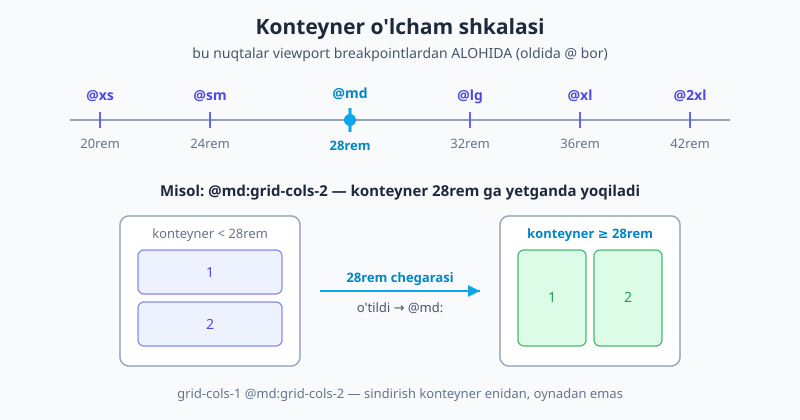

# 10 — Container queries

[⬅️ Oldingi: 09 — Responsive dizayn](./09-responsive-dizayn.md) · [🏠 README](./README.md) · [Keyingi: 11 — Ranglar va rang tizimi ➡️](./11-ranglar.md)

> **Bu bobda:** komponentlarni nafaqat ekranga, balki **o'z ota-elementiga** moslashtirishni o'rganamiz. `@container` bilan konteyner belgilash, `@sm:`/`@md:`/`@lg:` container variantlari, o'lcham shkalasi (`@3xs`..`@7xl`), `@max-*` va oraliqlar, **nomli konteynerlar** (`@container/sidebar` + `@lg/sidebar:`), ixtiyoriy qiymatlar (`@min-[475px]:`) va eng muhim "aha": bir xil komponent turli joyda turlicha ko'rinishi. Bularning hammasi v4 yadrosida — hech qanday plagin shart emas.

---

## 10.1 Avval nega? — komponent o'z joyiga moslashishi kerak

[Oldingi bobda](./09-responsive-dizayn.md) breakpointlarni o'rgandik: `md:flex-row` — "768px va undan katta **ekranlarda** qatorga aylan". Bu sahifa darajasidagi tartib uchun zo'r. Lekin bitta muammoni hal qila olmaydi.

Tasavvur qiling: chiroyli mahsulot kartasini yasadingiz. Endi shu **bir xil** kartani ikki joyga qo'yasiz:

- **Keng asosiy maydonga** — bu yerda joy bor, karta rasm bilan matnni **yonma-yon** ko'rsatsa go'zal.
- **Tor yon panelga** — bu yerda joy kam, karta hamma narsani **ustma-ust** terishi kerak, aks holda hammasi qisilib ketadi.

Breakpoint bilan buni qila olasizmi? Yo'q. Chunki `md:flex-row` **butun oyna** kengligiga qaraydi. Katta monitorda oyna keng — demak ham asosiy maydondagi, ham yon paneldagi karta `md:flex-row` ga "ha" deydi. Natijada tor yon paneldagi karta ham yonma-yon bo'lishga urinib, ichidagi hamma narsa siqilib qoladi. Komponent o'zini o'rab turgan **haqiqiy joy**ni emas, butun oynani "ko'radi".

Mana shu yerda **container query** kiradi. Uning g'oyasi oddiy va kuchli:

> **Media query — viewport (butun oyna) eniga reaksiya qiladi. Container query — ota-element eniga reaksiya qiladi.**



Demak komponent endi "men qanaqa ekrandaman?" deb emas, **"men qanaqa joyni egallabman?"** deb so'raydi. Bu — **komponent darajasidagi responsivlik**. Komponent endi haqiqatan ham **qayta ishlatiladigan** bo'ladi: uni keng joyga ham, tor joyga ham tashlaysiz — o'zi mosini tanlaydi.

> 📌 **Atamalar.** **viewport** — brauzer oynasining ko'rinadigan eni (butun ekran). **konteyner (container)** — siz `@container` deb belgilagan ota-element; uning farzandlari shu konteyner eniga moslashadi. **container variant** — oldida `@` bo'lgan prefiks (`@md:`), viewport breakpointidan (`md:`) farqi shunda.

---

## 10.2 Yoqish — `@container` + container variantlari

Container query'ni ishlatish ikki qadamdan iborat:

1. **Ota-elementga `@container` qo'shing** — "men kuzatiladigan konteyner bo'laman" degani.
2. **Farzandlarda `@sm:`/`@md:`/`@lg:` variantlarini ishlating** — bular endi **konteyner eniga** qarab ishga tushadi, oyna eniga emas.

E'tibor bering: bu prefikslar oldida `@` bor. `md:` (oldingi bob) = viewport; `@md:` (bu bob) = konteyner. Faqat bitta belgi — lekin butunlay boshqa narsaga qaraydi.

```html
<!-- Ota-element konteyner bo'ladi -->
<div class="@container">
  <!-- Farzand: konteyner tor bo'lsa ustma-ust, keng bo'lsa yonma-yon -->
  <div class="flex flex-col @md:flex-row">
    
    <div class="p-4">
      <h3 class="font-bold">Sarlavha</h3>
      <p>Tavsif matni...</p>
    </div>
  </div>
</div>
```

Bu kartani o'qiymiz:

- `flex flex-col` — **asos**: konteyner tor bo'lganda rasm va matn ustma-ust (vertikal). Xuddi mobile-firstdagi kabi, asos = eng tor holat.
- `@md:flex-row` — konteyner eni `@md` (28rem ≈ 448px) ga yetganda qatorga aylanadi, rasm va matn yonma-yon.

Eng muhimi: bu yerda **hech qanday ekran o'lchami yo'q**. Bu karta katta monitorda ham, telefonda ham, faqat o'zini o'rab turgan `@container` eniga qarab tartiblanadi.

> 💡 **`@container` qayerga qo'yiladi?** Variantni (`@md:`) o'lchamga moslashtirmoqchi bo'lgan elementning **ota-elementiga** `@container` qo'yiladi — element o'ziga emas. Element o'zining ENG YAQIN `@container` ajdodi eniga qaraydi.

---

## 10.3 Eng katta "aha" — bir xil komponent, ikki joy

Bu bobning asosiy g'oyasi mana shu, va uni bir marta ko'rsangiz, container query'lar nima uchun mavjudligini tushunasiz.

Yuqoridagi kartani olamiz va uni **ikki butunlay boshqa joyga** qo'yamiz — klasslarni **bitta harf ham o'zgartirmasdan**:

```html
<div class="grid grid-cols-12 gap-6">

  <!-- Keng asosiy maydon (8 ustun) -->
  <main class="col-span-8">
    <div class="@container">
      <article class="flex flex-col @md:flex-row gap-4 rounded-xl bg-white p-4 shadow">
        
        <div>
          <h3 class="font-bold">Mahsulot nomi</h3>
          <p class="text-slate-600">Tavsif matni...</p>
        </div>
      </article>
    </div>
  </main>

  <!-- Tor yon panel (4 ustun) -->
  <aside class="col-span-4">
    <div class="@container">
      <article class="flex flex-col @md:flex-row gap-4 rounded-xl bg-white p-4 shadow">
        
        <div>
          <h3 class="font-bold">Mahsulot nomi</h3>
          <p class="text-slate-600">Tavsif matni...</p>
        </div>
      </article>
    </div>
  </aside>

</div>
```

`<article>` ning klasslari **ikkala joyda aynan bir xil**. Lekin natija boshqa:

- **Keng asosiy maydonda** konteyner `@md` dan keng — `@md:flex-row` ishlaydi, karta **yonma-yon**.
- **Tor yon panelda** konteyner `@md` ga yetmaydi — asos (`flex-col`) qoladi, karta **ustma-ust**.



Bu media query bilan **mumkin emas edi**: oyna eni ikkala kartada bir xil, shuning uchun `md:flex-row` ikkalasiga ham bir xil javob berardi. Container query esa har bir kartaga "sen qanaqa joydasan?" deb alohida-alohida savol beradi. Hech qanday `if/else`, hech qanday breakpoint mantig'i — faqat `@container` + container variant.

> 💡 Mana shuning uchun container query'lardan **eng ko'p foyda ko'radigan** narsa — bir nechta joyda qayta ishlatiladigan komponentlar (karta, media-obyekt, statistika kataki). Komponent o'z ichki tartibini o'zi hal qiladi, uni qaysi sahifaga, qaysi ustunga qo'yishingizdan qat'i nazar. Buni [22-bobda](./22-komponentlar-framework.md) komponent abstraktsiyalari bilan birga ishlatamiz.

---

## 10.4 Konteyner o'lcham shkalasi

Viewport breakpointlari kabi, konteyner variantlarining ham nomli o'lchamlari bor. Lekin diqqat: **bu shkala viewport breakpointlardan butunlay alohida** va boshqa qiymatlardan iborat. Konteyner o'lchamlari `rem`da belgilangan:

| Variant | eni (rem) | px ekvivalenti (1rem=16px) |
|---|---|---|
| `@3xs:` | 16rem | 256px |
| `@2xs:` | 18rem | 288px |
| `@xs:` | 20rem | 320px |
| `@sm:` | 24rem | 384px |
| `@md:` | 28rem | 448px |
| `@lg:` | 32rem | 512px |
| `@xl:` | 36rem | 576px |
| `@2xl:` | 42rem | 672px |
| `@3xl:` | 48rem | 768px |
| `@4xl:` | 56rem | 896px |
| `@5xl:` | 64rem | 1024px |
| `@6xl:` | 72rem | 1152px |
| `@7xl:` | 80rem | 1280px |

Hammasi `min-width` mantig'ida ishlaydi: `@md:` — "konteyner **28rem va undan keng** bo'lsa". Asos (prefikssiz) esa har qanday konteyner enida amal qiladi.



```html
<!-- Konteyner kengaygani sayin ustun soni oshadi -->
<div class="@container">
  <div class="grid grid-cols-1 @sm:grid-cols-2 @lg:grid-cols-3">
    ...
  </div>
</div>
```

> ⚠️ **Adashtirib yubormang.** `md:` = viewport 48rem (768px). `@md:` = konteyner 28rem (448px). Bir xil "md" so'zi, lekin har xil qiymat va har xil narsaga (oyna vs ota-element) qaraydi. Doim `@` bor-yo'qligiga e'tibor bering — bu butun farqni belgilaydi.

---

## 10.5 `@max-*` va oraliqlar

Viewport `max-*` variantlari kabi, konteyner uchun ham teskari yo'nalish bor: **`@max-*`** — "konteyner shu o'lchamdan **kichik** bo'lsa".

```html
<div class="@container">
  <!-- Konteyner @md dan KICHIK bo'lsa, ortiqcha tavsifni yashir -->
  <p class="@max-md:hidden">Faqat keng konteynerda ko'rinadigan qo'shimcha matn</p>
</div>
```

Va xuddi breakpointlardagidek, `@min` va `@max` ni **stacking** qilib aniq bir oraliqni nishonga olasiz:

```html
<!-- FAQAT konteyner @sm ... @lg oralig'ida bo'lsa -->
<div class="@sm:@max-lg:flex">...</div>
```

`@sm:` (24rem dan) va `@max-lg:` (32rem gacha) birga — natijada faqat shu tasmada ishlaydi.

Aqliy model oldingi bob bilan bir xil: **`@min` (oddiy `@sm:`) = "shu yerdan kengga", `@max` = "shu yerdan torga"**. Faqat o'lchov endi oyna emas, konteyner.

---

## 10.6 Nomli konteynerlar — `@container/nom`

Endi murakkabroq holat: konteynerlar **ichma-ich** joylashgan. Tashqarida `@container`, uning ichida yana bir `@container`. Farzanddagi `@lg:` qaysisiga qaraydi? Standartda — **eng yaqin** ajdodga. Lekin ba'zan siz aniq **uzoqroq** konteynerni nishonga olmoqchisiz.

Buning yechimi — **nomli konteynerlar**. Konteyner belgilashda unga nom berasiz (`@container/sidebar`), so'ng variantda shu nomni ko'rsatasiz (`@lg/sidebar:`):

```html
<!-- Tashqi konteyner: "sidebar" deb nomladik -->
<aside class="@container/sidebar">

  <!-- Ichki konteyner: "card" deb nomladik -->
  <div class="@container/card">

    <!-- Bu element "sidebar" konteyneri @lg bo'lganda yashirinadi,
         "card" konteyneri o'lchamiga BOG'LIQ EMAS -->
    <button class="@lg/sidebar:hidden">Yopish</button>

    <!-- Bu element esa "card" konteyneri @md bo'lganda qator bo'ladi -->
    <div class="flex flex-col @md/card:flex-row">...</div>

  </div>
</aside>
```

Nom berish nima uchun kerak:

- **Aniqlik** — `@lg/sidebar:` aynan `sidebar` konteyneriga ishora qiladi, ichki `card` ga emas. Ichma-ich konteynerlarda chalkashlik bo'lmaydi.
- **Uzoqroq ajdodni nishonga olish** — nomsiz `@lg:` doim eng yaqin konteynerni oladi; nom bilan istalgan ajdod-konteynerni tanlash mumkin.

> 💡 **Maslahat.** Oddiy hollarda nomsiz `@container` yetarli. Nomni faqat ichma-ich konteynerlar bo'lib, qaysi biriga qarashni aniq aytish kerak bo'lganda qo'shing. Keraksiz nom — keraksiz murakkablik.

---

## 10.7 Ixtiyoriy (arbitrary) container query'lar

Nomli o'lchamlar (`@md` va h.k.) sizga to'g'ri kelmasa, oldingi boblarda ko'rgan kvadrat qavs (arbitrary) sintaksisi bu yerda ham ishlaydi — konteyner uchun aniq qiymat berasiz:

```html
<div class="@container">
  <!-- Konteyner 475px va undan keng bo'lsa flex -->
  <nav class="block @min-[475px]:flex">...</nav>

  <!-- Konteyner 300px dan kichik bo'lsa yashir -->
  <span class="@max-[300px]:hidden">Yorliq</span>
</div>
```

- `@min-[475px]:` — konteyner `min-width: 475px`.
- `@max-[300px]:` — konteyner `max-width: 300px`.

Ixtiyoriy qiymatlarda konteyner uzunlik birliklari, masalan `cqw` (container query width — konteyner enining 1%) ham ishlaydi, bu juda nozik moslashuvlar uchun foydali.

> ⚠️ Ixtiyoriy qiymatlar qulay, lekin bir martalik. Agar bir o'lcham loyihada qayta-qayta uchrasa, uni doimiy nomli token qilib belgilash toza — dizayn tizimi va custom tokenlar kitobning keyingi (V) qismida batafsil ko'riladi.

---

## 10.8 `@container` ni boshqarish — turi va reset

Standartda `@container` konteynerning **eni** (inline-size) ni kuzatadi — bu deyarli har doim sizga kerak bo'lgani. Lekin yana ikki variant bor:

| Klass | Ma'nosi |
|---|---|
| `@container` | eni bo'yicha (eng keng tarqalgan, standart) |
| `@container-inline-size` | aniq eni bo'yicha (yuqoridagining ochiq shakli) |
| `@container-size` | **ham eni, ham bo'yi** bo'yicha (kamdan-kam kerak) |
| `@container-normal` | konteyner xususiyatini **o'chiradi** (reset) |

`@container-normal` — agar ota-elementdan meros qolgan yoki noto'g'ri qo'yilgan konteynerni bekor qilish kerak bo'lsa ishlatiladi. Amalda 95% holatda oddiy `@container` yetarli.

> 📝 **`@container-size` haqida ogohlantirish.** Bo'yini kuzatish (`@container-size`) konteynerga aniq balandlik talab qiladi va layout muammolarini keltirib chiqarishi mumkin. Shubhalansangiz — `@container` (faqat eni) ni ishlating.

---

## 10.9 Container query yoki media query? — qaysi biri qachon

Bu eng muhim amaliy savol. Ikkalasi bir-birini **almashtirmaydi — to'ldiradi**. Oddiy qoida:

- **Sahifa darajasidagi tartib → media query (`md:`).** Butun sahifa tuzilishi: yon panel chiqsinmi, asosiy grid nechta ustun, header gorizontalmi — bular butun oynaga bog'liq. Bu yerda viewport breakpointlari to'g'ri vosita.
- **Qayta ishlatiladigan komponentning ichki tartibi → container query (`@md:`).** Karta ichida rasm matn bilan yonma-yonmi yo ustma-ust, statistika kataki vertikalmi yo gorizontal — bu komponent egallagan joyga bog'liq, oynaga emas.

Amalda ikkalasi **birga** ishlaydi: media query sahifani ustunlarga bo'ladi, har bir komponent esa container query bilan o'ziga ajratilgan ustun ichida o'zini moslaydi.

```html
<!-- Sahifa tartibi: media query bilan -->
<div class="grid grid-cols-1 lg:grid-cols-3 gap-6">
  <!-- Komponent ichi: container query bilan -->
  <div class="@container">
    <article class="flex flex-col @md:flex-row">...</article>
  </div>
  ...
</div>
```

> 💭 **Soddacha eslatma:** "Bu o'zgarish butun **sahifa**ga tegishlimi yoki faqat shu **komponent**ning ichigami?" Sahifa bo'lsa — `md:`. Komponent bo'lsa — `@md:`.

---

## 10.10 Brauzer qo'llab-quvvatlashi

Container query'lar bir paytlar "kelajak texnologiyasi" edi, lekin **2026-yilga kelib barcha zamonaviy brauzerlarda** (Chrome, Edge, Firefox, Safari) to'liq qo'llab-quvvatlanadi — 2023-yildan beri turg'un. Demak bugun ularni xotirjam ishlatsangiz bo'ladi.

Faqat juda eski brauzerlar (masalan, 2022-dan oldingi versiyalar) uchun himoya kerak bo'lsa, asosni (prefikssiz holatni) doim ishlaydigan, ko'rinishi maqbul tartib qilib qo'ying — eski brauzer container variantlarini e'tiborsiz qoldirib, asos tartibida ko'rsatadi. Bu **progressive enhancement**: zamonaviy brauzer ko'proq oladi, eskisi hech bo'lmasa ishlaydigan asosni oladi.

> 💡 v3 da container query'lar uchun alohida `@tailwindcss/container-queries` plagini o'rnatish kerak edi. **v4 da bu yadroga kiritilgan** — hech narsa o'rnatmaysiz, `@container` to'g'ridan-to'g'ri ishlaydi.

---

## 10.11 Amaliy misol — moslashuvchan media-obyekt

Klassik "media object" (rasm + matn) — container query'lar uchun namunaviy holat. Uni shunday quramizki, tor joyda ixcham, keng joyda kengaygan ko'rinsin:

```html
<div class="@container">
  <article class="flex flex-col @sm:flex-row gap-4 rounded-xl bg-white p-4 shadow">

    <!-- Rasm: tor bo'lsa to'liq enga, keng bo'lsa qat'iy 12rem -->
    

    <div class="flex-1">
      <h3 class="text-lg font-bold @lg:text-xl">Maqola sarlavhasi</h3>
      <p class="text-slate-600">Qisqa tavsif matni shu yerda turadi...</p>

      <!-- Qo'shimcha meta: faqat konteyner @md dan keng bo'lsa -->
      <p class="@max-md:hidden mt-2 text-sm text-slate-400">
        Muallif · 5 daqiqalik o'qish · 2026
      </p>
    </div>

  </article>
</div>
```

Tahlil:

- `flex flex-col @sm:flex-row` — tor konteynerda ustma-ust, 24rem dan keng konteynerda yonma-yon.
- `w-full @sm:w-48` — rasm tor holatda butun enni egallaydi, keng holatda 12rem ga qotadi.
- `text-lg @lg:text-xl` — konteyner juda kengaysa (32rem+) sarlavha ham kattalashadi.
- `@max-md:hidden` meta qatorida — joy tor (28rem dan kichik) bo'lsa, ortiqcha meta yashiriladi.

Bitta komponent — qaysi joyga tashlasangiz, o'zi mosini tanlaydi. Aynan shu qayta ishlatish quvvati container query'larni qimmatli qiladi.

---

## 10.12 Tez-tez uchraydigan xatolar

- **`@` ni unutish.** `md:flex-row` (viewport) va `@md:flex-row` (konteyner) — butunlay boshqa narsa. Container query istasangiz, prefiks oldida `@` bo'lishi **shart**.
- **`@container` ni element o'ziga qo'yish.** `@container` **ota-elementga** qo'yiladi; variantlar (`@md:`) esa o'sha konteyner *ichidagi* farzandlarda yoziladi. Konteyner o'zini o'lchamaydi.
- **`@container` umuman qo'ymaslik.** Agar hech qaysi ajdodda `@container` bo'lmasa, `@md:` kabi variantlar **hech qachon ishga tushmaydi** — element jimgina asos holatida qoladi. Variant ishlamayotgan bo'lsa, birinchi navbatda ota-elementda `@container` borligini tekshiring.
- **Viewport o'lchamlarini konteyner deb o'ylash.** `@md` = 28rem (448px), `md` esa 48rem (768px). Shkalalar boshqa — jadvalga qarab tekshiring.
- **Hamma narsani container query qilish.** Sahifa darajasidagi tartib uchun media query soddaroq va to'g'riroq. Container query — komponent ichki tartibi uchun. Ikkalasini joyiga qo'ying.

> 🔭 **Oldinga qarash.** Container query'lar komponentni **mustaqil** qiladi — uni har joyga qo'yib bo'ladi. Lekin shu komponentni qayta-qayta yozmaslik uchun uni **abstraktsiya** qilish kerak: React/Vue komponenti yoki `@apply` bilan. Buni va `clsx`/`cva` kabi vositalarni [22-bobda](./22-komponentlar-framework.md) ko'ramiz — container query bilan birga ular haqiqiy qayta ishlatiladigan UI beradi.

---

## Mashqlar

**1-mashq.** Boshlovchi `@md:flex-row` yozdi, lekin karta hech qachon qatorga aylanmayapti — joy keng bo'lsa ham ustma-ust qolyapti. Eng ehtimoliy sabab nima?

<details markdown="1"><summary>Yechim</summary>

Eng ehtimoliy sabab — **ota-elementda `@container` yo'q**. Container variantlari (`@md:`) faqat konteyner kuzatilayotgan bo'lsagina ishga tushadi. Hech qaysi ajdodda `@container` bo'lmasa, `@md:flex-row` umuman faollashmaydi va element asos (`flex-col`) holatida qoladi.

Tuzatish — kuzatilishi kerak bo'lgan ota-elementga `@container` qo'shish:

```html
<div class="@container">
  <article class="flex flex-col @md:flex-row">...</article>
</div>
```

(Ehtimol ikkinchi sabab: `@` ni unutib, `md:flex-row` deb yozgan — bu esa viewport variant bo'lib qoladi.)

</details>

**2-mashq.** `md:flex-row` va `@md:flex-row` o'rtasidagi farqni o'z so'zingiz bilan tushuntiring. Har biri qaysi o'lchamga qaraydi va ular qaysi rem qiymatida ishga tushadi?

<details markdown="1"><summary>Yechim</summary>

- `md:flex-row` — **viewport** (butun brauzer oynasi) eniga qaraydi va oyna **48rem (768px)** va undan keng bo'lganda ishga tushadi.
- `@md:flex-row` — eng yaqin **`@container` ota-element** eniga qaraydi va konteyner **28rem (448px)** va undan keng bo'lganda ishga tushadi.

Asosiy farq: `md:` butun oynaga bog'liq (komponent qayerda turishidan qat'i nazar), `@md:` esa komponent egallagan haqiqiy joyga bog'liq. Va shkala qiymatlari ham boshqa (48rem vs 28rem).

</details>

**3-mashq.** Konteyner ichidagi grid `@sm` (24rem) gacha 1 ustun, `@sm` dan `@lg` (32rem) gacha 2 ustun, `@lg` dan keng bo'lsa 3 ustun bo'lsin. Klasslarni yozing.

<details markdown="1"><summary>Yechim</summary>

```html
<div class="@container">
  <div class="grid grid-cols-1 @sm:grid-cols-2 @lg:grid-cols-3 gap-4">
    ...
  </div>
</div>
```

`grid-cols-1` — asos (24rem dan torgacha). `@sm:grid-cols-2` — 24rem dan boshlab 2 ustun. `@lg:grid-cols-3` — 32rem dan boshlab 3 ustun. Har bir container variant faqat o'z nuqtasidan keng holatda oldingisini qoplaydi — xuddi mobile-first kabi, lekin oyna emas, konteyner bo'yicha.

</details>

**4-mashq.** Sahifada `aside` yon panel bor, ichida yana karta konteyneri bor (ikkala konteyner ichma-ich). Bir tugma **yon panel** `@lg` ga yetganda yashirinishi kerak — ichki karta konteyneri o'lchamiga bog'liq bo'lmasin. Klasslarni yozing.

<details markdown="1"><summary>Yechim</summary>

Konteynerlarni nomlash kerak, so'ng tugmada aniq nomni nishonga olish:

```html
<aside class="@container/sidebar">
  <div class="@container/card">
    <button class="@lg/sidebar:hidden">Yopish</button>
  </div>
</aside>
```

`@container/sidebar` yon panelga nom beradi; `@lg/sidebar:hidden` aynan shu `sidebar` konteyneri 32rem ga yetganda tugmani yashiradi. Nomsiz `@lg:hidden` yozsangiz, u **eng yaqin** (`card`) konteynerga qarardi — bu mo'ljalga teskari bo'lardi.

</details>

**5-mashq.** Konteyner aniq **475px** va undan keng bo'lganda element `flex` bo'lishi kerak — bu o'lcham nomli shkalada yo'q. Klassni yozing.

<details markdown="1"><summary>Yechim</summary>

```html
<div class="@container">
  <div class="block @min-[475px]:flex">...</div>
</div>
```

Nomli o'lchamga tushmaydigan qiymat uchun ixtiyoriy (arbitrary) sintaksis: `@min-[475px]:` — konteyner `min-width: 475px`. Asos `block`, konteyner 475px ga yetganda `flex` ga o'tadi. (Albatta ota-elementda `@container` borligini ham unutmang.)

</details>

**6-mashq (qaror qabul qilish).** Quyidagi ikki vazifa uchun container query yoki media query — qaysisi to'g'ri? Sababini ayting.
(a) Butun sahifa: desktopda chap yon panel chiqsin, telefonda yo'qolsin.
(b) Mahsulot kartasi: u keng grid katagidami yo tor sidebar'dami, ichki tartibi shunga moslashsin.

<details markdown="1"><summary>Yechim</summary>

- **(a) — media query (`lg:`).** Bu **sahifa darajasidagi** tartib: yon panel chiqishi butun oyna kengligiga bog'liq, biror komponentning ichki joyiga emas. `lg:block` / `hidden lg:block` kabi viewport variantlari to'g'ri.
- **(b) — container query (`@md:`).** Bu **komponent ichki tartibi**: karta o'zi egallagan joyga (grid katagi yoki sidebar eni) qarab o'zgarishi kerak, oynaga emas. `@container` + `@md:flex-row` to'g'ri.

Umumiy qoida: o'zgarish butun **sahifa**ga tegishli bo'lsa → media query; faqat shu **komponent**ning ichiga tegishli bo'lsa → container query. Ko'pincha ikkalasi birga ishlatiladi.

</details>

---

[⬅️ Oldingi: 09 — Responsive dizayn](./09-responsive-dizayn.md) · [🏠 README](./README.md) · [Keyingi: 11 — Ranglar va rang tizimi ➡️](./11-ranglar.md)
