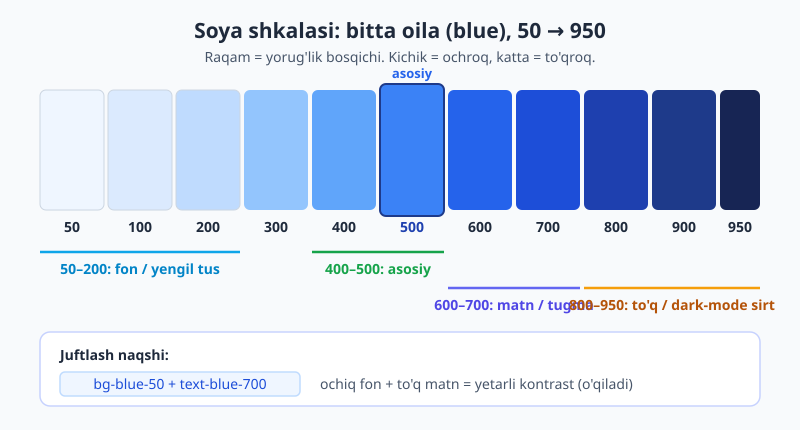
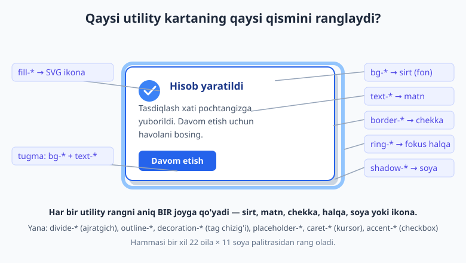

# 11 — Ranglar va rang tizimi

[⬅️ Oldingi: 10 — Container queries](./10-container-queries.md) · [🏠 README](./README.md) · [Keyingi: 12 — Tipografiya ➡️](./12-tipografiya.md)

> **Bu bobda:** Tailwind'ning rang tizimini ostin-ustun o'rganamiz: **22 ta rang oilasi** va har birining **50→950 soyalari** (nima uchun raqamlar shunday?), v4 nega ranglarni **OKLCH**'da saqlaydi, barcha rang utility'lari (`text-*`, `bg-*`, `border-*`, `ring-*`, `divide-*`, `fill-*`, rangli `shadow-*` va boshqalar), **opacity modifikatori** (`bg-black/50`) va u qanday `color-mix`'ga aylanishi, maxsus kalit so'zlar (`transparent`, `current`), ixtiyoriy ranglar (`bg-[#1da1f2]`), o'z brend rangingizni `@theme` bilan qo'shish, hamda kontrast/hammaboplik (accessibility) qoidalari.

---

## 11.1 Avval nega? — tartiblangan palitra

Tasavvur qiling, har bir tugma, har bir matn, har bir fonni `#3b82f6`, `#2a6df4`, `#1f5fe0` kabi qo'lda terilgan hex kodlar bilan yozyapsiz. Ikki muammo darrov chiqadi: birinchidan, qaysi ko'k qaysisiga mos kelishini eslab bo'lmaydi; ikkinchidan, "biroz to'qroq ko'k" kerak bo'lsa, kalkulyatorsiz qiymat o'ylab topa olmaysiz. Natija — sayt ranglari "balchiq"day chiqadi, izchillik yo'q.

Tailwind buni hal qilish uchun **tayyor, tartiblangan palitra** beradi. Siz rang o'ylab topmaysiz — tanlaysiz. Palitra ikki o'qdan iborat:

- **Oila (rang nomi):** `red`, `orange`, `amber`, `yellow`, `lime`, `green`, `emerald`, `teal`, `cyan`, `sky`, `blue`, `indigo`, `violet`, `purple`, `fuchsia`, `pink`, `rose` — bular rangli oilalar. Ularga **neytral** (kulrang) oilalar qo'shiladi: `slate`, `gray`, `zinc`, `neutral`, `stone`. Jami **22 ta oila**.
- **Soya (raqam):** har bir oilada **11 ta soya** — `50`, `100`, `200`, `300`, `400`, `500`, `600`, `700`, `800`, `900`, `950`.

Klass shunday tuziladi: **`<utility>-<oila>-<soya>`**. Masalan `bg-blue-500` — "ko'k oilasining 500-soyasini fon qil". Oddiy va bashorat qilinadigan.

> 📌 **Atamalar.** **palitra** (palette) — loyihada ishlatish uchun oldindan tanlangan ranglar to'plami. **oila** (family) — bir rangning barcha soyalari (masalan, butun "blue"). **soya** (shade) — bir oila ichidagi muayyan yorug'lik darajasi (masalan, `blue-700`).

---

## 11.2 Soya raqamlari nimani anglatadi?

Eng muhim aqliy model shu: **raqam = yorug'lik (lightness) bosqichi.** Kichik raqam = ochroq (oqqa yaqin), katta raqam = to'qroq (qoraga yaqin). `500` esa har bir oilaning "asosiy", to'yingan o'rtasi.

| Soya diapazoni | Odatda nima uchun |
|---|---|
| `50`, `100`, `200` | engil fonlar, tuslar (tint), yumshoq belgilash |
| `300`, `400` | chegaralar, ajratgichlar, o'chirilgan (disabled) holatlar |
| `500` | oilaning "asosiy" rangi — brend aksenti, ikonalar |
| `600`, `700` | tugma fonlari, havola va asosiy matn ranglari |
| `800`, `900`, `950` | juda to'q matn, dark-mode sirtlari va fonlari |



Bu shkalani bir marta his qilsangiz, ranglarni **juftlash** o'z-o'zidan tushunarli bo'ladi. Eng keng tarqalgan naqsh — bitta oiladan ochiq fon + to'q matn + o'rta chegara olish:

```html
<!-- "Info" ko'rinishidagi karta: bitta oila (blue) ichida juftlangan -->
<div class="bg-blue-50 text-blue-700 border border-blue-200 rounded-lg p-4">
  Bu ma'lumot xabari.
</div>
```

- `bg-blue-50` — juda ochiq ko'k fon (ko'zga yumshoq).
- `text-blue-700` — to'q ko'k matn (ochiq fonda yaxshi o'qiladi).
- `border-blue-200` — o'rtacha ochiq chegara (fonni nozik ajratadi).

E'tibor bering: uchchalasi ham **bir oiladan**, faqat soyasi har xil. Mana shu — izchil rang ishlatishning siri.

> 💡 **Maslahat.** Boshlovchilar tez-tez har joyga `500` ni qo'yib chiqadi. Lekin matn uchun `500` ko'pincha ochiq fonda yetarli to'q emas. Qoida: **fon — kichik raqam, matn — katta raqam.** Ular orasida masofa qancha katta bo'lsa, kontrast shuncha yaxshi.

---

## 11.3 Nega OKLCH? (v4)

Endi "qanday"dan "nega"ga o'tamiz. v4 da palitraning barcha ranglari **OKLCH** rang modelida belgilangan. Buni qo'lda yozishingiz shart emas — Tailwind hammasini o'zi qiladi — lekin nima uchun shunday qilingani palitraning sifatini tushuntiradi.

Rang modellari (hex, `rgb()`, `hsl()`, `oklch()`) bilan to'liq [HTML & CSS kitobining ranglar bobida](../html-css/12-oolchovlar-tipografiya-ranglar.md) tanishgansiz. Mana qisqacha sababi, nega aynan OKLCH:

1. **Idrok bir xilligi (perceptual uniformity).** OKLCH'da yorug'lik bosqichlari ko'zga **teng** ko'rinadi. `blue-100`→`blue-200` o'tishi `blue-800`→`blue-900` o'tishi bilan bir xil "masofada" his qilinadi. Eski `hsl` da bunday emas edi — ba'zi sakrashlar keskin, ba'zilari sezilmas chiqardi.
2. **Kengroq gamma (P3).** OKLCH zamonaviy ekranlarning keng rang doirasidan (wide gamut) foydalana oladi — shuning uchun v4 ranglari yangi monitorlarda **yorqinroq va to'yinganroq** ko'rinadi, eski sRGB chegarasiga qisilib qolmaydi.
3. **Bashorat qilinadigan yorug'lik.** `L` (lightness) komponenti to'g'ridan-to'g'ri "qanchalik ochiq" degani. Shuning uchun palitrani kengaytirish yoki o'z rangingizni qo'shish oson va izchil.

```css
/* v4 palitrasi ichkarida shunday ko'rinadi (siz buni yozmaysiz) */
--color-blue-500: oklch(0.623 0.214 259.815);
--color-indigo-600: oklch(0.511 0.262 276.966);
```

Siz esa shunchaki `bg-blue-500` yozasiz. Brauzer OKLCH'ni qo'llab-quvvatlamasa, Tailwind avtomatik zaxira (fallback) beradi. Demak: **OKLCH — dvigatel ostidagi sifat; siz uni ko'rmaysiz, faqat natijasidan zavq olasiz.**

---

## 11.4 Rang utility'lari sayohati

Rang faqat fon va matn emas. Tailwind elementning deyarli har bir "rangli" qismi uchun alohida utility beradi. Hammasi bir xil `-<oila>-<soya>` shaklida ishlaydi.

| Utility | Nimani ranglaydi | Misol |
|---|---|---|
| `text-*` | matn (oldingi plan) rangi | `text-slate-800` |
| `bg-*` | fon (sirt) rangi | `bg-white`, `bg-indigo-600` |
| `border-*` | chegara rangi | `border-gray-300` |
| `ring-*` | fokus halqasi (outline o'rnida) | `ring-blue-500` |
| `divide-*` | bola elementlar orasidagi ajratgich | `divide-gray-200` |
| `outline-*` | haqiqiy `outline` rangi | `outline-indigo-500` |
| `decoration-*` | tag chizig'i (underline) rangi | `decoration-rose-500` |
| `placeholder-*` | input placeholder matni | `placeholder-gray-400` |
| `caret-*` | matn kursori (caret) rangi | `caret-blue-600` |
| `accent-*` | checkbox/radio aksenti | `accent-emerald-600` |
| `fill-*` / `stroke-*` | SVG ikona to'ldirish / chiziq | `fill-current` |
| `shadow-*` | rangli soya | `shadow-blue-500/50` |
| `from-*` / `via-*` / `to-*` | gradient to'xtash nuqtalari | `from-cyan-400 to-blue-600` |

Quyidagi rasm bitta kichik karta ustida ko'rsatadi — qaysi utility kartaning qaysi qismiga rang beradi:



Bir nechta utility'ni harakatda ko'raylik:

```html
<!-- Input: placeholder, kursor va fokus halqasi ranglangan -->
<input
  class="border border-gray-300 placeholder-gray-400 caret-blue-600
         focus:ring-2 focus:ring-blue-500 focus:border-blue-500
         rounded-lg px-3 py-2"
  placeholder="Email manzilingiz"
/>

<!-- Checkbox aksenti brend rangida -->
<input type="checkbox" class="accent-emerald-600" />

<!-- Tag chizig'i (underline) boshqa rangda -->
<a href="#" class="underline decoration-rose-500 decoration-2">muhim havola</a>
```

> 💡 **`ring` vs `border`.** `ring-*` element o'lchamiga ta'sir qilmaydigan, soya orqali chiziladigan halqa — shuning uchun fokus holati uchun ideal (`focus:ring-2 focus:ring-blue-500`), kontent "sakramaydi". `border-*` esa haqiqiy chegara va layoutda joy egallaydi. Chegara, `ring` va `outline` to'liq [13-bobda](./13-fon-gradient-border.md) ko'riladi.

### Rangli soyalar

v4 da soyaga ham rang berish mumkin — bu mahsulot kartochkalari va tugmalarga "yorug'lik" effektini beradi:

```html
<button class="bg-blue-600 text-white shadow-lg shadow-blue-500/50 rounded-lg px-4 py-2">
  Yaltiroq tugma
</button>
```

`shadow-blue-500/50` — ko'k tusli, yarim shaffof soya. Bu yerda allaqachon `/50` ni — **opacity modifikatorini** ko'rdingiz. Endi shu kuchli vositaga alohida to'xtalamiz.

---

## 11.5 Opacity modifikatori — `/` belgisi

Rangni yarim shaffof qilmoqchimisiz? Hech qanday alohida klass kerak emas. Rang klassidan keyin **slesh va raqam** qo'ying — bu rangning **alfa kanali** (shaffofligi):

```html
<div class="bg-black/50">50% shaffof qora fon</div>
<p class="text-white/80">80% qattiq oq matn</p>
<div class="border border-gray-300/40">juda yengil chegara</div>
```

Raqamlar `0` dan `100` gacha, odatda `5` qadam bilan: `/5`, `/10`, `/20`, `/25`, ... `/90`, `/95`, `/100`. Kerak bo'lsa kvadrat qavsda ixtiyoriy aniq qiymat ham beriladi: `bg-black/[0.43]`.



### Bu nimaga aylanadi?

`bg-blue-500/50` kompilyatsiyada **`color-mix`** funksiyasiga aylanadi — ya'ni rangni "transparent" (shaffof) bilan aralashtiradi:

```css
.bg-blue-500\/50 {
  background-color: color-mix(in oklab, var(--color-blue-500) 50%, transparent);
}
```

"50% blue-500, qolgani shaffof" degani. Aralashtirish ham OKLCH oilasidagi `oklab` fazosida boradi — shuning uchun shaffoflashtirilgan rang ham toza, "loyqa" emas.

### Nega bu alohida `opacity` dan yaxshi?

Bir vasvasa bor: "shaffoflik kerakmi? `opacity-50` qo'yaman" deyish. Lekin farq katta:

- **`opacity-50`** — butun elementni, **shu jumladan uning ichidagi barcha matn va bolalarini** ham yarim shaffof qiladi. Ko'pincha bu xohlamagan natija: fon yengillashishi kerak edi, lekin matn ham xiralashib o'qilmay qoldi.
- **`bg-black/50`** — **faqat fon rangiga** ta'sir qiladi. Ichidagi matn to'liq qattiq (opaque) qoladi.

```html
<!-- ❌ Matn ham xiralashadi -->
<div class="bg-black opacity-50"><span class="text-white">O'qish qiyin</span></div>

<!-- ✅ Faqat fon shaffof, matn aniq -->
<div class="bg-black/50"><span class="text-white">O'qish oson</span></div>
```

> 📌 **Qoida.** Rangni shaffof qilish kerak bo'lsa — deyarli har doim **opacity modifikatori** (`/NN`) ishlating, butun element uchun `opacity-*` ni emas. `opacity-*` ni faqat butun blokni (matni bilan birga) so'ndirmoqchi bo'lganingizda qo'llang.

---

## 11.6 Maxsus kalit so'zlar

Palitradan tashqari bir nechta maxsus rang qiymati bor — ular oila-soya tizimiga kirmaydi, lekin kundalik kerak bo'ladi:

| Kalit so'z | Ma'nosi |
|---|---|
| `transparent` | to'liq shaffof (`transparent`) |
| `current` | `currentColor` — elementning matn rangini meros qiladi |
| `inherit` | otasidan rangni meros qiladi |
| `black` / `white` | sof qora / oq |

```html
<!-- Shaffof chegara: layoutni buzmasdan, hover'da rang paydo bo'lishi uchun joy ushlab turish -->
<button class="border-2 border-transparent hover:border-blue-500">Tugma</button>

<!-- bg-white va text-black to'g'ridan-to'g'ri -->
<div class="bg-white text-black p-4">Klassik oq fon, qora matn</div>
```

`current` (ya'ni `text-*` rangini meros qilish) ayniqsa **SVG ikonalar** uchun juda qulay. Ikonaga aniq rang bermaysiz — uni matn bilan birga ranglaysiz:

```html
<!-- Ikona avtomatik matn rangini oladi: bu yerda blue-700 -->
<span class="text-blue-700">
  <svg class="fill-current size-5 inline" viewBox="0 0 20 20">
    <path d="M10 2 ..." />
  </svg>
  Sozlamalar
</span>
```

`fill-current` — "ikonani matnning hozirgi rangiga bo'ya". `text-blue-700` o'zgarsa, ikona ham avtomatik o'zgaradi. Bitta joyda rangni boshqarasiz — ham matn, ham ikona ergashadi.

---

## 11.7 Ixtiyoriy (arbitrary) ranglar

Palitrada yo'q aniq bir rang kerakmi — masalan, brendingizning rasmiy hex kodi yoki tashqi xizmatning rangi? Kvadrat qavs ichida to'g'ridan-to'g'ri qiymat berasiz:

```html
<!-- Twitter/X ko'ki -->
<button class="bg-[#1da1f2] text-white">Ulashish</button>

<!-- rgb va oklch ham bo'ladi -->
<div class="text-[rgb(34,197,94)]">Yashil matn</div>
<div class="bg-[oklch(0.7_0.2_200)]">OKLCH bilan to'g'ridan-to'g'ri</div>

<!-- CSS o'zgaruvchisiga ulanish -->
<div class="bg-[var(--brand)]">O'zgaruvchidan</div>
```

> ⚠️ **Bu "qochish luki" (escape hatch).** Ixtiyoriy ranglar qulay, lekin ularni sochib tashlasangiz, palitraning izchilligini yo'qotasiz — yana har joyda turli hex'lar paydo bo'ladi. Agar bitta rang loyihada qayta-qayta kerak bo'lsa, uni **ixtiyoriy qiymat sifatida emas, balki nomli token sifatida** qo'shing (keyingi bo'lim). Ixtiyoriy ranglar — faqat bir martalik, palitraga kirmaydigan holatlar uchun.

---

## 11.8 O'z brend rangingiz — `@theme` (oldindan ko'rish)

Mana, eng muhim ko'prik. v4 da o'z rangingizni palitraga **qo'shish** — CSS'da `@theme` ichida bitta o'zgaruvchi belgilash. Tailwind shu zahoti unga mos barcha utility'larni yaratadi:

```css
@import "tailwindcss";

@theme {
  --color-brand-500: oklch(0.62 0.19 250);
  --color-brand-600: oklch(0.54 0.20 250);
}
```

Endi `brand` — to'la huquqli rang oilasi. HTML'da darrov ishlatasiz:

```html
<button class="bg-brand-500 hover:bg-brand-600 text-white rounded-lg px-4 py-2">
  Brend tugmasi
</button>
<p class="text-brand-600">Brend rangidagi matn</p>
```

`--color-brand-500` o'zgaruvchisi avtomatik `bg-brand-500`, `text-brand-500`, `border-brand-500`, `ring-brand-500` va hokazo barcha rang utility'larini beradi. Bir joyda rang ta'rifi — butun loyihada izchil ishlatish.

> 📝 **v3 dan farq.** v3 da bu `tailwind.config.js` ichidagi `theme.extend.colors` obyektida JavaScript bilan qilinardi. v4 da JS config yo'q — hamma narsa CSS'dagi `@theme` ichida, oddiy CSS o'zgaruvchisi sifatida. To'liq token tizimi — semantik nomlash, ranglar, font, spacing va boshqalar — [18-bobda (Theme va dizayn tizimi)](./18-theme-dizayn-tizimi.md) chuqur ko'riladi. Hozir shuni bilsangiz kifoya: `--color-<nom>-<soya>` = yangi rang.

---

## 11.9 Kontrast va hammaboplik (accessibility)

Rang faqat chiroyli emas, **o'qiladigan** bo'lishi kerak. Ikki amaliy qoida butun farqni qiladi:

**1) Yetarli kontrast tanlang.** Ochiq fonga ochiq matn qo'ymang. Klassik xato — oq fonga `text-gray-400`: u "nafis" ko'rinadi, lekin ko'pchilik uchun o'qib bo'lmaydi.

```html
<!-- ❌ Past kontrast: oq fonda ochiq kulrang -->
<p class="bg-white text-gray-400">Bu matnni o'qish qiyin.</p>

<!-- ✅ Yetarli kontrast: oq fonda to'q kulrang -->
<p class="bg-white text-gray-700">Bu matn aniq o'qiladi.</p>
```

Amaliy mo'ljal: ochiq fon (`50`–`100`) + to'q matn (`700`–`900`). **WCAG** standarti oddiy matn uchun kamida `4.5:1` kontrast nisbatini talab qiladi. Brauzer DevTools yoki onlayn kontrast tekshiruvchilari aniq nisbatni ko'rsatadi — shubhada bo'lsangiz, tekshiring.

**2) Faqat rangga tayanmang.** Ranjli odam (rang ko'rligi — dunyo aholisining ~8% erkagi) qizil va yashilni ajrata olmasligi mumkin. Shuning uchun "qizil = xato, yashil = muvaffaqiyat" yetarli emas — rangga **belgi, matn yoki ikona** qo'shing:

```html
<!-- ❌ Faqat rang: ranjli foydalanuvchi farqni ko'rmaydi -->
<span class="text-red-600">Xato</span>
<span class="text-green-600">OK</span>

<!-- ✅ Rang + ikona + matn -->
<span class="text-red-600">✕ Xato yuz berdi</span>
<span class="text-green-600">✓ Saqlandi</span>
```

> 📌 **Atama.** **kontrast nisbati** (contrast ratio) — matn va fon yorug'ligi orasidagi farq o'lchovi. `1:1` (farqsiz) dan `21:1` (qora–oq) gacha. WCAG AA oddiy matn uchun `4.5:1`, yirik matn uchun `3:1` so'raydi.

---

## 11.10 Amaliy misol — izchil rang naqshlari

Endi o'rgangan hamma narsani birlashtirib, **semantik** (ma'noga asoslangan) rang ishlatishni quramiz. G'oya: rangni "ko'k" deb emas, **vazifasiga** ko'ra o'ylash — `primary` (asosiy), `danger` (xavf), `success` (muvaffaqiyat). Bu yondashuv sizni izchil saqlaydi.

### Tugmalar to'plami

```html
<!-- Primary: asosiy harakat -->
<button class="bg-indigo-600 hover:bg-indigo-700 text-white rounded-lg px-4 py-2">
  Saqlash
</button>

<!-- Secondary: ikkilamchi harakat (yengil) -->
<button class="bg-gray-100 hover:bg-gray-200 text-gray-800 rounded-lg px-4 py-2">
  Bekor qilish
</button>

<!-- Danger: xavfli harakat -->
<button class="bg-red-600 hover:bg-red-700 text-white rounded-lg px-4 py-2">
  O'chirish
</button>
```

Naqshni sezing: har bir tugma **bitta oila** ichida — asos `600`, `hover` da bir bosqich to'qroq `700`. Bu izchil "bosilgan" his beradi.

### Ogohlantirish (alert) qutilari

To'rt xil holat — har biri o'z oilasidan ochiq fon + to'q matn + o'rta chegara juftligi bilan:

```html
<!-- Info (blue) -->
<div class="bg-blue-50 text-blue-800 border border-blue-200 rounded-lg p-4">
  ℹ️ Yangi versiya mavjud.
</div>

<!-- Success (green) -->
<div class="bg-green-50 text-green-800 border border-green-200 rounded-lg p-4">
  ✓ O'zgarishlar saqlandi.
</div>

<!-- Warning (amber) -->
<div class="bg-amber-50 text-amber-800 border border-amber-200 rounded-lg p-4">
  ⚠️ Diskda joy kamaymoqda.
</div>

<!-- Error (red) -->
<div class="bg-red-50 text-red-800 border border-red-200 rounded-lg p-4">
  ✕ Ulanishda xatolik.
</div>
```

Bitta naqsh, to'rt oila. `info`→`blue`, `success`→`green`, `warning`→`amber`, `error`→`red` — bu sanoatda keng tarqalgan **semantik rang xaritasi**. Foydalanuvchi rangni ko'rib, xabar turini darrov tushunadi (lekin yodingizda: rang yonida ikona/matn ham bor — 11.9 qoidasi).

---

## 11.11 Tez-tez uchraydigan xatolar

- **Hamma joyga `500`.** `500` — aksent uchun, matn uchun emas. Ochiq fonda matn ko'pincha `700`–`900` bo'lishi kerak.
- **`opacity-50` bilan fon shaffoflashtirish.** Bu butun elementni, matni bilan birga so'ndiradi. Faqat fon kerak bo'lsa `bg-*/50` ishlating.
- **Ixtiyoriy hex'larni sochib tashlash.** `bg-[#3b82f6]` o'rniga `bg-blue-500` bor. Qayta ishlatiladigan rangni `@theme` ga token qiling.
- **Past kontrast "estetika" deb.** `text-gray-400` oq fonda chiroyli ko'rinadi-yu, lekin o'qilmaydi. Hammaboplik — bezak emas, talab.
- **Faqat rang bilan ma'no berish.** "Qizil = xato" yetarli emas; ikona yoki matn qo'shing.
- **Oilalarni aralashtirish.** Bitta komponentda `blue-50` fon + `indigo-700` matn — biroz "uzilgan" ko'rinadi. Bitta oilada qoling yoki ataylab tanlangan juftlikni ishlating.

> 🔭 **Oldinga qarash.** Bu bobda **bir tekis** ranglarni ko'rdik. Lekin fon **gradient** ham bo'lishi mumkin: ikki-uch rang orasida silliq o'tish (`bg-linear-to-r from-cyan-500 to-blue-600`). Gradientlar, fon rasmlari va chegaralar to'liq [13-bobda](./13-fon-gradient-border.md) ko'riladi. Ranglar **dark rejimda** qanday qayta xaritalanishi (oq fon → to'q sirt) esa [16-bobning](./16-dark-mode.md) mavzusi — u yerda nega `800`–`950` soyalari dark-mode sirtlari uchun ekanini ko'rasiz.

---

## Mashqlar

**1-mashq.** Boshlovchi `class="bg-blue-50 text-blue-100"` deb info-karta yozdi va matn deyarli ko'rinmayotganidan hayron. Xato nimada? Tuzating.

<details markdown="1"><summary>Yechim</summary>

Ikkala soya ham **ochiq** diapazondan: `50` (juda ochiq fon) va `100` (yana ochiq matn). Kontrast deyarli yo'q — shuning uchun matn fonga "yo'qoladi".

Qoida: ochiq fonga to'q matn. Matnni to'q diapazonga ko'taring:

```html
<div class="bg-blue-50 text-blue-800">Endi aniq o'qiladi.</div>
```

`bg-blue-50` (ochiq) + `text-blue-800` (to'q) = yetarli kontrast.

</details>

**2-mashq.** Modal oynaning orqasidagi "overlay" (qoraytiruvchi parda) kerak: 60% shaffof qora fon, lekin uning ustidagi modal kartochka va matn **to'liq aniq** qolsin. To'g'ri yondashuvni yozing va nega `opacity-60` xato ekanini ayting.

<details markdown="1"><summary>Yechim</summary>

Overlay'ga **opacity modifikatorini** ishlating, butun elementga `opacity-*` ni emas:

```html
<!-- Overlay: faqat fon shaffof -->
<div class="fixed inset-0 bg-black/60">
  <!-- Modal: to'liq qattiq, aniq -->
  <div class="bg-white text-gray-900 rounded-xl p-6">Modal kontenti</div>
</div>
```

`bg-black/60` faqat **fon rangini** 60% shaffof qiladi (`color-mix(... transparent)` ga aylanadi). Agar `opacity-60` ishlatsangiz, u butun `div` ni — ichidagi modal va matnni ham — yarim shaffof qilib, hammasini xiralashtirardi.

</details>

**3-mashq.** `bg-emerald-500/25` klassi qanday CSS ga kompilyatsiya bo'ladi? `color-mix` ko'rinishida yozing.

<details markdown="1"><summary>Yechim</summary>

```css
background-color: color-mix(in oklab, var(--color-emerald-500) 25%, transparent);
```

"25% emerald-500, qolgan 75% shaffof" — ya'ni rang ancha yengil/shaffof chiqadi. Slesh `/25` doimo `color-mix(... transparent)` ga aylanadi va aralashtirish `oklab` fazosida boradi.

</details>

**4-mashq.** SVG ikonangiz ota-elementning matn rangiga avtomatik ergashsin — ya'ni `text-rose-600` qo'ysangiz, ikona ham rose-600 bo'lsin. Klasslarni yozing va nega aniq `fill-rose-600` yozmaslik afzal ekanini tushuntiring.

<details markdown="1"><summary>Yechim</summary>

```html
<span class="text-rose-600">
  <svg class="fill-current size-5"><!-- ikona yo'li --></svg>
  Yoqtirish
</span>
```

`fill-current` — ikonaga `currentColor` ni beradi, ya'ni `text-*` rangini meros qiladi. Afzalligi: rangni **bitta joyda** (`text-rose-600`) boshqarasiz; matn va ikona birga o'zgaradi. Agar `fill-rose-600` yozsangiz, rangni o'zgartirganda **ikki joyni** tahrirlash kerak bo'lardi va ular osongina bir-biriga mos kelmay qolishi mumkin.

</details>

**5-mashq.** Loyihangizda brend ko'ki `oklch(0.55 0.2 255)` qayta-qayta kerak. Uni har joyda `bg-[oklch(...)]` ixtiyoriy qiymat sifatida sochish o'rniga, `brand` nomli rang oilasi qilib qo'shing (v4 usuli), so'ng undan tugma fonini yasang.

<details markdown="1"><summary>Yechim</summary>

CSS faylda `@theme` ichida rangni belgilaymiz:

```css
@import "tailwindcss";

@theme {
  --color-brand-600: oklch(0.55 0.2 255);
}
```

So'ng HTML'da to'la huquqli `brand` utility'lari tayyor:

```html
<button class="bg-brand-600 text-white rounded-lg px-4 py-2">Boshlash</button>
```

`--color-brand-600` avtomatik `bg-brand-600`, `text-brand-600`, `border-brand-600` va hokazolarni beradi. Bu izchil va o'qiladigan — ixtiyoriy hex'larni butun loyiha bo'ylab sochishdan ancha yaxshi.

</details>

**6-mashq (debugging).** Quyidagi "xato" xabari ranjli (rang ko'rligi) foydalanuvchi uchun "muvaffaqiyat" xabaridan farq qilmaydi. Muammoni aniqlang va hammabop qilib tuzating.

```html
<p class="text-red-600">Fayl yuklanmadi</p>
<p class="text-green-600">Fayl yuklandi</p>
```

<details markdown="1"><summary>Yechim</summary>

Muammo: holat **faqat rang** bilan ifodalangan. Qizil-yashil rang ko'rligi bo'lgan odam ikkala qatorni bir xil (kulrang/jigarrang tusda) ko'rishi mumkin — natijada xato va muvaffaqiyatni ajrata olmaydi.

Yechim: rangdan tashqari **ikona va aniq matn** qo'shing, shunda ma'no rangsiz ham yetkaziladi:

```html
<p class="text-red-600">✕ Xato: fayl yuklanmadi</p>
<p class="text-green-600">✓ Muvaffaqiyat: fayl yuklandi</p>
```

**Qoida:** rang — qo'shimcha signal bo'lsin, yagona signal emas. Ma'no har doim ikona, matn yoki shakl orqali ham takrorlansin.

</details>

---

[⬅️ Oldingi: 10 — Container queries](./10-container-queries.md) · [🏠 README](./README.md) · [Keyingi: 12 — Tipografiya ➡️](./12-tipografiya.md)
