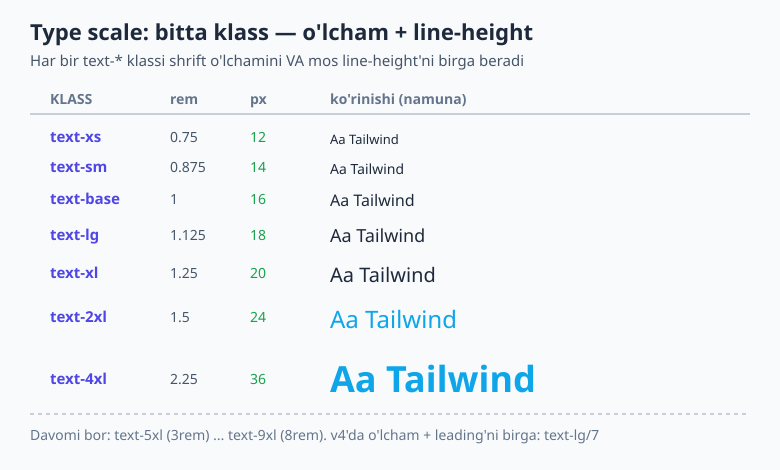
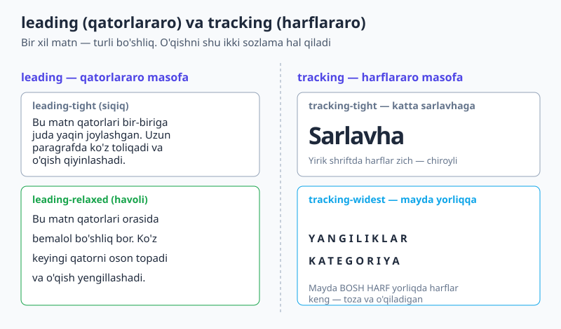
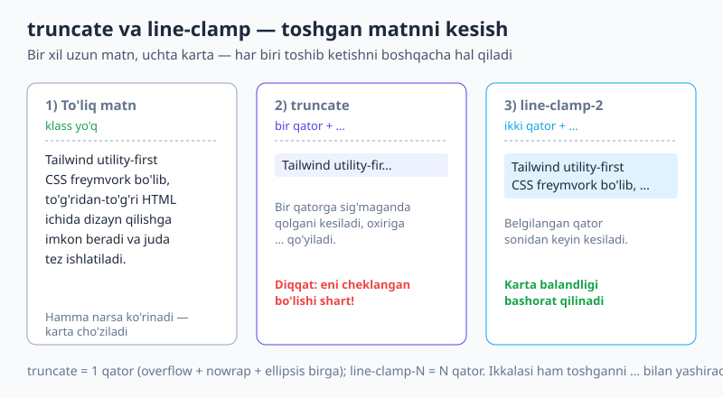

# 12 — Tipografiya

[⬅️ Oldingi: 11 — Ranglar va rang tizimi](./11-ranglar.md) · [🏠 README](./README.md) · [Keyingi: 13 — Fon, gradient va chegara ➡️](./13-fon-gradient-border.md)

> **Bu bobda:** Matnni utility'lar bilan to'liq boshqaramiz: shrift oilasi (`font-sans`/`font-serif`/`font-mono`) va custom shrift qo'shish, **type scale** (`text-xs`..`text-9xl` va v4'da har bir o'lcham bilan kelgan line-height), shrift og'irligi va kursiv, `leading-*` (qatorlararo), `tracking-*` (harflararo), tekislash, matnni kesish/o'rash (`truncate`, `line-clamp`, `text-balance`, `text-pretty`), bezak (`underline`/`decoration-*`), transform va ro'yxatlar, hamda blog/maqola kontenti uchun "qotil funksiya" — `@tailwindcss/typography` (`prose`).

---

## 12.1 Avval nega? — tipografiya dizaynning 90%i

Bir tajriba qiling: chiroyli rangli, soyali, yumaloq burchakli karta yasang, lekin matnini standart, sozlanmagan holatda qoldiring. Keyin xuddi shu kartani sodda oq fonda, lekin matnini puxta — to'g'ri o'lcham, to'g'ri qatorlararo masofa, to'g'ri og'irlik bilan — tering. Ikkinchisi deyarli har doim professionalroq ko'rinadi.

Sababi oddiy: foydalanuvchi sahifaning 90%ini **o'qiydi**. Matn — bu interfeysning asosiy "go'shti". Shuning uchun tipografiyani egallash — Tailwind'da eng katta foyda beradigan bo'limlardan biri.

Toza CSS'da bu `font-size`, `line-height`, `font-weight`, `letter-spacing` kabi xossalar bilan qilinadi (buni [HTML & CSS kitobining tipografiya bobida](../html-css/12-oolchovlar-tipografiya-ranglar.md) batafsil ko'rgansiz). Tailwind hech narsani o'zgartirmaydi — u faqat shu xossalarning eng ko'p kerak bo'ladigan qiymatlarini **tayyor, izchil utility'lar** qilib beradi. Sizning ishingiz qaysi utility'ni qachon olishni bilish.

> 📌 **Atamalar.** **type scale** — bir-biriga uyg'un shrift o'lchamlari to'plami (xaotik emas, qadamli). **line-height (leading)** — qatorlar markazlari orasidagi vertikal masofa. **letter-spacing (tracking)** — harflar orasidagi gorizontal masofa. **font-weight** — harfning qalinligi (100–900). Bu atamalar bobning ustunlari — har birini alohida ko'ramiz.

---

## 12.2 Shrift oilasi — `font-sans`, `font-serif`, `font-mono`

Tailwind uchta tayyor shrift oilasini beradi:

| Klass | Turi | Qachon |
|---|---|---|
| `font-sans` | sans-serif (zasrifsiz) | **standart** — interfeys, asosiy matn |
| `font-serif` | serif (zasrifli) | maqola, kitobiy, rasmiy ohang |
| `font-mono` | monospace (teng kenglik) | kod, terminal, raqamli jadval |

```html
<p class="font-sans">Bu zamonaviy, toza interfeys shrifti (standart).</p>
<p class="font-serif">Bu kitobiy, rasmiy ohangdagi serif shrift.</p>
<code class="font-mono">const x = 42;  // har bir harf bir xil kenglik</code>
```

`font-sans` allaqachon `<body>` ga standart o'rnatilgan, shuning uchun uni alohida yozish kerak emas — faqat bir qism uchun `serif` yoki `mono` kerak bo'lganda variantni qo'llaysiz.

### Custom shrift qo'shish (v4 CSS-first)

Loyihangizga o'z brendingiz shriftini (masalan, "Inter" yoki "Satoshi") qo'shmoqchimisiz? v4 da buni ikki qadamda qilasiz.

**1-qadam:** shriftni yuklang — Google Fonts havolasi orqali (eng oson) yoki o'z faylingizdan `@font-face` bilan:

```html
<!-- HTML <head> ichida -->
<link rel="preconnect" href="https://fonts.googleapis.com">
<link href="https://fonts.googleapis.com/css2?family=Inter:wght@400;600;700&display=swap" rel="stylesheet">
```

**2-qadam:** CSS faylda `@theme` ichida shrift o'zgaruvchisini belgilang — Tailwind avtomatik mos `font-*` utility'sini yaratadi:

```css
@import "tailwindcss";

@theme {
  --font-display: "Inter", sans-serif;
}
```

Endi HTML'da `font-display` tayyor:

```html
<h1 class="font-display text-4xl font-bold">Brend sarlavhasi</h1>
```

`--font-display` o'zgaruvchisi `font-display` utility'sini, `--font-body` esa `font-body` ni yaratadi — siz nom qo'yasiz, Tailwind utility'ni beradi.

> 📝 **v3 dan farq.** v3 da shrift oilalarini `tailwind.config.js` dagi `theme.fontFamily` obyektida sozlardingiz. v4 da JS config yo'q — hamma narsa CSS'dagi `@theme` ichida. Dizayn tizimi sifatida shriftlarni boshqarish to'liq [18-bobda](./18-theme-dizayn-tizimi.md) ko'riladi.

---

## 12.3 Type scale — `text-xs` dan `text-9xl` gacha

Mana bobning eng muhim jadvali. Tailwind shrift o'lchamlarini xaotik raqamlar bilan emas, **nomli qadamlar** (scale) bilan beradi. Har bir qadam oldingisidan uyg'un nisbatda kattaroq:

| Klass | rem | px | Odatda |
|---|---|---|---|
| `text-xs` | 0.75rem | 12px | mayda yorliq, footnote |
| `text-sm` | 0.875rem | 14px | ikkilamchi matn, izoh |
| `text-base` | 1rem | 16px | **asosiy matn (standart)** |
| `text-lg` | 1.125rem | 18px | kattaroq paragraf, lead |
| `text-xl` | 1.25rem | 20px | kichik sarlavha |
| `text-2xl` | 1.5rem | 24px | bo'lim sarlavhasi |
| `text-3xl` | 1.875rem | 30px | sahifa sarlavhasi |
| `text-4xl` | 2.25rem | 36px | yirik sarlavha |
| `text-5xl` ... `text-9xl` | 3rem ... 8rem | 48px ... 128px | hero, banner |

```html
<p class="text-sm">Mayda izoh matni.</p>
<p class="text-base">Oddiy o'qiladigan asosiy matn.</p>
<h2 class="text-2xl">Bo'lim sarlavhasi</h2>
<h1 class="text-5xl">Katta hero sarlavha</h1>
```

Quyidagi rasm scale'ni namuna matnlar bilan ko'rsatadi — har bir qadam klassi, rem va px qiymati bilan birga:



### v4'ning muhim detali: o'lcham bilan line-height ham keladi

Bu juda muhim, lekin ko'pchilik bilmaydi. **Har bir `text-*` klassi nafaqat `font-size`ni, balki o'sha o'lchamga mos `line-height`ni ham birga beradi.** Ya'ni `text-lg` yozsangiz, qatorlararo masofa avtomatik mos keladi — alohida `leading-*` qo'shish shart emas.

VERIFY: `text-lg` aslida shunday:

```css
.text-lg {
  font-size: var(--text-lg);                 /* 1.125rem */
  line-height: var(--text-lg--line-height);  /* mos default */
}
```

Agar o'sha defaultni o'zgartirmoqchi bo'lsangiz, v4 da o'lcham va leading'ni **bitta klassda** birlashtirish mumkin — `text-<o'lcham>/<leading>` ko'rinishida:

```html
<!-- text-lg o'lchami, lekin line-height: 1.75rem (leading-7) -->
<p class="text-lg/7">O'lcham va qatorlararo masofani bir klassda berdim.</p>

<!-- Yoki alohida leading klassi bilan -->
<p class="text-lg leading-7">Xuddi shu natija, ikki klass bilan.</p>
```

> 💡 **Maslahat.** Aksariyat hollarda standart line-height aynan to'g'ri — shuning uchun `text-base` deyish kifoya. `text-lg/7` kabi override'ni faqat dizayn maxsus zichroq yoki havoliroq qatorlarni talab qilganda oling.

---

## 12.4 Shrift og'irligi va kursiv

**Font weight** — harfning qalinligi. Tailwind 100 dan 900 gacha nomli og'irliklarni beradi:

| Klass | Qiymat | Klass | Qiymat |
|---|---|---|---|
| `font-thin` | 100 | `font-medium` | 500 |
| `font-extralight` | 200 | `font-semibold` | 600 |
| `font-light` | 300 | `font-bold` | **700** |
| `font-normal` | **400** | `font-extrabold` | 800 |
| | | `font-black` | 900 |

```html
<p class="font-normal">Oddiy matn (400).</p>
<p class="font-semibold">Yarim qalin — sarlavha osti uchun yaxshi (600).</p>
<h1 class="font-bold">Qalin sarlavha (700).</h1>
```

VERIFY: `font-bold` → `font-weight: var(--font-weight-bold)` (700).

Kursiv uchun `italic`, uni bekor qilish (masalan, kursiv ota element ichida) uchun `not-italic`:

```html
<em class="italic">Bu qiya (kursiv) matn.</em>
<span class="not-italic">Bu to'g'ri, kursiv emas.</span>
```

> ⚠️ **Diqqat.** Shrift faqat siz **yuklagan** og'irliklarda ishlaydi. Agar Google Fonts havolasida `wght@400;700` bersangiz, `font-thin` (100) yo'q — brauzer eng yaqinini "soxta qalinlashtirib" beradi, natija xunuk bo'ladi. Kerakli og'irliklarni shrift yuklashda ko'rsating.

---

## 12.5 Line-height (`leading-*`) — o'qishning yashirin qahramoni

Qatorlararo masofa matnning o'qilishiga rang yoki o'lchamdan kam ta'sir qilmaydi. Qatorlar juda zich bo'lsa — ko'z keyingi qatorni topishga qiynaladi; juda siyrak bo'lsa — paragraf "tarqab" ketadi.

Tailwind nomli va sonli leading'larni beradi:

| Klass | Qiymat | Qachon |
|---|---|---|
| `leading-none` | 1 | yirik sarlavhalar (zich) |
| `leading-tight` | 1.25 | sarlavhalar |
| `leading-snug` | 1.375 | qisqa matn |
| `leading-normal` | 1.5 | standart |
| `leading-relaxed` | 1.625 | uzun o'qiladigan paragraf |
| `leading-loose` | 2 | juda havoli |

Bulardan tashqari **sonli** leading bor — `leading-6` kabi, bu spacing scale birligiga ko'paytma (`leading-6` = 6 × 0.25rem = 1.5rem):

```html
<!-- Katta sarlavha — zич qatorlar chiroyli ko'rinadi -->
<h1 class="text-5xl leading-tight">Ikki qatorli<br>katta sarlavha</h1>

<!-- Uzun maqola paragrafi — havoli qatorlar o'qishni yengillashtiradi -->
<p class="text-lg leading-relaxed">Uzun matn... ko'p qatorlar...</p>

<!-- Aniq qiymat kerak bo'lsa -->
<p class="leading-6">Qatorlararo masofa aniq 1.5rem.</p>
```

Quyidagi rasmning chap tomoni `leading-tight` (siqiq) va `leading-relaxed` (havoli) bir xil paragrafni qanday boshqacha ko'rsatishini taqqoslaydi:



> 💡 **Qoida.** O'lcham qanchalik **katta** bo'lsa, leading shunchalik **kichik** kerak (yirik sarlavhada `leading-tight` yoki `leading-none`). O'lcham qanchalik **kichik** va matn uzun bo'lsa, leading shunchalik **kattaroq** kerak (asosiy paragrafda `leading-relaxed`).

---

## 12.6 Letter-spacing (`tracking-*`) — harflararo masofa

Tracking harflar orasidagi bo'shliqni boshqaradi. U ozgina, lekin ikki holatda sezilarli farq qiladi.

| Klass | Effekt |
|---|---|
| `tracking-tighter` | eng zich |
| `tracking-tight` | zich |
| `tracking-normal` | standart |
| `tracking-wide` | keng |
| `tracking-wider` | kengroq |
| `tracking-widest` | eng keng |

Ikki amaliy qoida:

- **Katta sarlavhada `tracking-tight`** — yirik shriftda harflar tabiiy ravishda uzoqlashadi; ularni biroz yaqinlashtirish zichroq, chiroyliroq ko'rinish beradi.
- **Mayda, bosh harfli yorliqda `tracking-wide`/`tracking-widest`** — masalan `KATEGORIYA` kabi `uppercase` yorliqda harflarni kengaytirish o'qishni osonlashtiradi va premium ohang beradi.

```html
<h1 class="text-5xl font-bold tracking-tight">Zich katta sarlavha</h1>

<span class="text-xs font-semibold uppercase tracking-widest text-slate-500">
  Yangiliklar
</span>
```

Yuqoridagi rasmning o'ng tomoni aynan shu ikki holatni ko'rsatadi: katta sarlavhada zich harflar va mayda yorliqda keng harflar.

---

## 12.7 Matn tekislash

| Klass | Effekt |
|---|---|
| `text-left` | chapga (LTR'da standart) |
| `text-center` | markazga |
| `text-right` | o'ngga |
| `text-justify` | ikki chetga tekis (gazeta uslubi) |
| `text-start` / `text-end` | yo'nalishga bog'liq (RTL uchun) |

```html
<h1 class="text-center">Markazlangan sarlavha</h1>
<p class="text-justify">Ikki chetga tekislangan uzun paragraf...</p>
```

> 📌 **`text-start` nima uchun?** `text-left` har doim chapga tekislaydi. `text-start` esa **matn yo'nalishiga** moslashadi — chapdan-o'ngga (LTR) tilda chapga, o'ngdan-chapga (RTL, masalan arab/ibroniy) tilda esa o'ngga. Ko'p tilli loyihada `text-start`/`text-end` xavfsizroq tanlov.

---

## 12.8 Matnni kesish va o'rash — eng amaliy bo'lim

Real interfeysda matn ko'pincha o'zi turgan joydan **kattaroq** bo'ladi: mahsulot nomi karta kengligiga sig'maydi, maqola tavsifi uch qatordan oshadi. Buni boshqarmasangiz, layout buziladi. Tailwind buning uchun aniq vositalar beradi.

### `truncate` — bir qator + uchta nuqta

`truncate` matn bir qatorga sig'masa, qolgan qismini kesib, oxiriga `…` qo'yadi. U aslida uchta xossani birga qo'llaydi: `overflow: hidden` + `white-space: nowrap` + `text-overflow: ellipsis`.

```html
<p class="truncate w-64">
  Bu juda uzun mahsulot nomi bir qatorga sig'maydi va kesiladi
</p>
```

### `line-clamp-*` — bir nechta qator + nuqta

`line-clamp-3` matnni aniq 3 qatorda kesadi va `…` qo'yadi. Karta tavsiflari uchun ideal — balandlik bashorat qilinadi:

```html
<p class="line-clamp-2">
  Uzun tavsif... ikki qatordan keyin kesiladi va uchta nuqta qo'yiladi,
  qancha matn bo'lishidan qat'i nazar karta bir xil balandlikda qoladi.
</p>
```

Quyidagi rasm uchta kartani taqqoslaydi: to'liq matn, `truncate` (bir qator) va `line-clamp-2` (ikki qator):



> ⚠️ **Eng ko'p uchraydigan xato.** `truncate` **eni cheklangan** bo'lmasa ishlamaydi! Agar element o'zi cho'zilaveradigan bo'lsa (`width` yo'q, ota ham cheklamagan), kesiladigan narsa qolmaydi. Shuning uchun `truncate` ni odatda `w-64`, `max-w-xs` yoki flex bola sifatida `min-w-0` bilan birga ishlatasiz.

### `text-balance` va `text-pretty` — v4'ning oqilona o'rashi

Bu ikki klass — kichik, lekin sarlavhalarni sezilarli chiroyli qiladi:

- **`text-balance`** — sarlavha qatorlarini **balanslaydi**: oxirgi qatorda yolg'iz bir so'z qolib ketmaydi, qatorlar teng uzunlikda taqsimlanadi. Qisqa sarlavhalar uchun.
- **`text-pretty`** — paragrafda **yetim** (orphan) so'zni — oxirgi qatorda yolg'iz qolgan so'zni — oldini oladi. Uzunroq matn uchun.

```html
<h1 class="text-3xl text-balance">Bu sarlavha qatorlari teng balanslanadi va chiroyli ko'rinadi</h1>
<p class="text-pretty">Bu paragraf oxirida yolg'iz so'z qolib ketmaydi.</p>
```

### So'zlarni o'rash va bo'shliq

Uzun so'z (URL kabi) qutidan toshib chiqsa, uni sindirish kerak:

| Klass | Effekt |
|---|---|
| `break-words` | uzun so'zni kerak bo'lsa keyingi qatorga uzadi |
| `break-all` | har qanday belgida uzadi (agressiv) |
| `wrap-break-word` | so'zni faqat to'shib ketishi muqarrar bo'lganda uzadi (v4.1) |
| `whitespace-nowrap` | matnni umuman o'ramaydi (bir qatorda saqlaydi) |
| `whitespace-pre` | bo'shliq va qator uzilishlarini matndagidek saqlaydi |

```html
<p class="break-words">https://juda-uzun-domen.example.com/yo'l/qism</p>
<span class="whitespace-nowrap">Sig'masa ham sindirilmaydi</span>
```

---

## 12.9 Matn bezagi — havolalar uchun

Chizish va undan ostidagi masofani boshqarish — ayniqsa havolalar uchun foydali:

| Klass | Effekt |
|---|---|
| `underline` / `no-underline` | tagiga chizish / olib tashlash |
| `line-through` | ustidan chizish (eski narx uchun) |
| `decoration-2` | chiziq qalinligi (2px) |
| `decoration-wavy` | to'lqinli chiziq |
| `decoration-sky-500` | chiziq rangi (matndan farqli) |
| `underline-offset-4` | chiziqning matndan masofasi |

```html
<a href="#" class="underline decoration-2 decoration-sky-500 underline-offset-4
                   hover:decoration-wavy">
  Chiroyli bezatilgan havola
</a>

<span class="line-through text-slate-400">120 000 so'm</span>
<span class="font-bold text-red-600">90 000 so'm</span>
```

> 💡 Havolalarda `underline-offset-2` yoki `underline-offset-4` qo'shsangiz, chiziq matnga yopishib qolmaydi — kichik detal, katta farq.

---

## 12.10 Transform va ro'yxatlar

**Harf registri** (matnni o'zgartirmasdan, faqat ko'rinishini):

```html
<span class="uppercase">katta harf bo'lib chiqadi</span>   <!-- KATTA HARF... -->
<span class="lowercase">KICHIK</span>                       <!-- kichik -->
<span class="capitalize">har so'z bosh harf</span>          <!-- Har So'z... -->
<span class="normal-case">o'zgarmaydi</span>
```

**Ro'yxatlar:**

| Klass | Effekt |
|---|---|
| `list-disc` | nuqtali (•) belgi |
| `list-decimal` | raqamli (1. 2. 3.) |
| `list-none` | belgisiz |
| `list-inside` / `list-outside` | belgi matn ichida / chetida |

```html
<ul class="list-disc list-inside space-y-1">
  <li>Birinchi band</li>
  <li>Ikkinchi band</li>
</ul>
```

**Birinchi qatorga chekinish (indent):** `indent-8` — paragrafning faqat birinchi qatoriga `2rem` chekinish beradi.

---

## 12.11 `@tailwindcss/typography` (`prose`) — maqola kontenti uchun qotil funksiya

Mana eng kuchli vosita. Tasavvur qiling: blog posti yoki Markdown'dan kelgan kontent bor — uning ichida `<h1>`, `<h2>`, `<p>`, `<ul>`, `<blockquote>`, `<code>` teglari bor, lekin siz ularning har biriga alohida utility qo'sha olmaysiz (chunki HTML CMS'dan yoki Markdown'dan avtomatik keladi).

Rasmiy `@tailwindcss/typography` plagini shu muammoni hal qiladi: bitta `prose` klassini ota elementga qo'ysangiz, u **ichkaridagi barcha tipografik teglarni** chiroyli, o'qiladigan, izchil ko'rinishga keltiradi — siz har bir tegga tegmasdan.

```html
<article class="prose prose-lg prose-slate dark:prose-invert">
  <h1>Maqola sarlavhasi</h1>
  <p>Bu paragraf avtomatik to'g'ri o'lcham, leading va margin oladi.</p>
  <ul>
    <li>Ro'yxat ham chiroyli bo'ladi</li>
    <li>Hech qanday qo'shimcha klasssiz</li>
  </ul>
  <blockquote>Iqtibos ham puxta uslublanadi.</blockquote>
</article>
```

Tahlil:

- `prose` — asosiy uslublarni yoqadi.
- `prose-lg` — o'lchamni kattalashtiradi (`prose-sm`/`prose-xl` ham bor).
- `prose-slate` — rang temasi (slate kulrang ohangda).
- `dark:prose-invert` — dark rejimda ranglarni teskari qiladi (oq matn, qora fon).

> ⚠️ **Qachon `prose` ishlatish — qachon YO'Q.** `prose` ni faqat **uzun, oqimli kontent** uchun ishlating: blog, hujjat, Markdown render, maqola tanasi. Ilova **interfeysida** (tugmalar, kartalar, formalar, navbar) `prose` ishlatmang — u sizning utility'laringizni qoplab, kutilmagan margin va o'lchamlar qo'shadi. Qoida: "matn maqola bo'lsa — `prose`; interfeys bo'lsa — utility".
>
> Plaginni o'rnatish va to'liq sozlash [21-bobda](./21-plaginlar.md) ko'riladi; hozir uning **maqsadini** tushunish kifoya.

---

## 12.12 Amaliy misol — maqola sarlavhasi va karta iyerarxiyasi

Endi o'rgangan klasslarni birlashtiramiz. Avval maqola boshi — sarlavha + lead paragraf:

```html
<header class="max-w-2xl">
  <p class="text-sm font-semibold uppercase tracking-widest text-indigo-600">
    Qo'llanma
  </p>
  <h1 class="mt-2 text-4xl font-bold tracking-tight text-balance text-slate-900">
    Tailwind bilan tipografiyani egallash
  </h1>
  <p class="mt-4 text-lg leading-relaxed text-pretty text-slate-600">
    Matn — interfeysning go'shti. Bu yetakchi paragraf kattaroq o'lcham va
    havoli qatorlar bilan o'qishga taklif qiladi.
  </p>
</header>
```

Endi karta iyerarxiyasi — sarlavha, ostki sarlavha, tana va `line-clamp`:

```html
<article class="max-w-sm rounded-xl bg-white p-5 shadow">
  <h3 class="text-lg font-semibold text-slate-900">Mahsulot nomi</h3>
  <p class="text-sm text-slate-500">Kategoriya · 4.8 ★</p>
  <p class="mt-2 text-sm leading-relaxed text-slate-600 line-clamp-2">
    Bu tavsif qancha uzun bo'lishidan qat'i nazar, ikki qatordan keyin
    kesiladi va karta bir xil balandlikda qoladi, layout buzilmaydi.
  </p>
  <a href="#" class="mt-3 inline-block text-sm font-medium text-indigo-600
                     underline underline-offset-4 hover:decoration-2">
    Batafsil
  </a>
</article>
```

E'tibor bering: bu yerda **iyerarxiya** ko'z bilan ko'rinadi — sarlavha eng yirik va qalin (`text-lg font-semibold`), meta-ma'lumot mayda va och rang (`text-sm text-slate-500`), tana o'rta (`text-sm ... text-slate-600`). Bu farqlar foydalanuvchiga nimaga avval qarashni aytadi.

---

## 12.13 Tez-tez uchraydigan xatolar

- **Juda ko'p o'lcham ishlatish.** Bitta sahifada 8 xil `text-*` o'lchami — xaos. Scale'dan 3–4 ta tanlang (masalan `text-sm`, `text-base`, `text-lg`, `text-3xl`) va ularga sodiq qoling. Izchillik chiroylilikning asosi.
- **Yirik sarlavhada leading'ni unutish.** `text-5xl` da standart leading ko'pincha biroz baland. Ikki qatorli katta sarlavhaga `leading-tight` qo'shing — darhol professionalroq ko'rinadi.
- **`truncate` eni cheklamasdan.** Eng ko'p uchraydigan tuzoq — `truncate` ishlamayotgandek tuyuladi, chunki elementning eni cheklanmagan. `w-*`, `max-w-*` yoki flex ichida `min-w-0` qo'shing.
- **Interfeysga `prose` qo'yish.** `prose` faqat maqola/Markdown uchun. Tugma yoki kartaga qo'ysangiz, u kutilmagan margin va o'lchamlar bilan layoutni buzadi.
- **Yuklanmagan og'irlikni ishlatish.** `font-thin` yozasiz, lekin shrift faqat 400/700'da yuklangan — brauzer "soxta" og'irlik beradi, natija xunuk. Kerakli og'irliklarni shrift yuklashda ko'rsating.

> 🔭 **Oldinga qarash.** Tipografiyani egalladik — endi matn ortidagi **sirt**: fon ranglari, gradientlar, chegaralar va soyalar. Bular matn iyerarxiyasini yanada kuchaytiradi — [keyingi bob](./13-fon-gradient-border.md) shu haqida. Ranglarni esa [11-bobda](./11-ranglar.md) ko'rgan edingiz.

---

## Mashqlar

**1-mashq.** Boshlovchi `text-lg` yozdi va qatorlararo masofa to'g'ri kelishi uchun alohida `leading-7` qo'shdi, lekin "bu shartmi?" deb so'rayapti. v4 kontekstida javob bering.

<details markdown="1"><summary>Yechim</summary>

Shart emas. v4'da har bir `text-*` klassi **o'lcham bilan birga mos line-height'ni ham** beradi. Ya'ni `text-lg` o'zi allaqachon `font-size: 1.125rem` VA mos `line-height`ni qo'llaydi. Alohida `leading-7` faqat **standart leading'ni o'zgartirmoqchi** bo'lsangiz kerak.

Agar haqiqatan o'zgartirish kerak bo'lsa, v4'da uni bir klassda ham yozish mumkin:

```html
<p class="text-lg/7">...</p>   <!-- o'lcham + leading birga -->
```

</details>

**2-mashq.** Karta ichida mahsulot nomi bir qatorga sig'masa, oxiriga `…` qo'yib kesilsin. Karta eni `16rem`. Klasslarni yozing va nega `truncate` yolg'iz yetarli emasligini tushuntiring.

<details markdown="1"><summary>Yechim</summary>

```html
<p class="truncate w-64">Juda uzun mahsulot nomi shu yerda</p>
```

`truncate` `overflow: hidden` + `nowrap` + ellipsis beradi, lekin u faqat element **eni cheklangan** bo'lsa ishlaydi. Eni belgilanmasa, element matnga qarab cho'ziladi va kesiladigan narsa qolmaydi. `w-64` (= 16rem) eni cheklaydi — endi `truncate` ishlaydi. (Flex bola bo'lsa, `min-w-0` ham kerak bo'lishi mumkin.)

</details>

**3-mashq.** Mayda, bosh harfli "YANGILIK" yorlig'ini chiroyli qiling: o'lcham mayda, harflar qalin va keng joylashgan, hammasi bosh harf, rangi indigo. Klasslarni yozing.

<details markdown="1"><summary>Yechim</summary>

```html
<span class="text-xs font-semibold uppercase tracking-widest text-indigo-600">
  Yangilik
</span>
```

`text-xs` — mayda; `font-semibold` — qalinroq; `uppercase` — bosh harf; `tracking-widest` — keng harflar (mayda bosh harfli yorliqda o'qishni osonlashtiradi); `text-indigo-600` — rang. Bu naqsh "kicker" yoki "eyebrow" yorliq deb ataladi.

</details>

**4-mashq.** Blog maqolasi kontenti Markdown'dan keladi — uning ichida `<h2>`, `<p>`, `<ul>`, `<code>` teglari bor, lekin siz ularga alohida klass qo'sha olmaysiz. Hammasini chiroyli qilishning eng oson yo'li nima? Kontent katta o'lchamda va dark rejimni ham qo'llab-quvvatlasin.

<details markdown="1"><summary>Yechim</summary>

`@tailwindcss/typography` plaginining `prose` klassini ota elementga qo'yamiz:

```html
<article class="prose prose-lg prose-slate dark:prose-invert">
  <!-- Markdown'dan kelgan h2, p, ul, code... -->
</article>
```

`prose` — asosiy uslub; `prose-lg` — katta o'lcham; `prose-slate` — rang temasi; `dark:prose-invert` — dark rejimda ranglarni teskari qiladi. Bitta klass bilan barcha ichki teglar avtomatik uslublanadi — bu aynan CMS/Markdown kontenti uchun mo'ljallangan. (Lekin ilova interfeysida `prose` ishlatmang.)

</details>

**5-mashq.** Eski narx ustidan chizilgan (eski) bo'lib, och kulrang ko'rinsin; yangi narx esa qalin va qizil. Klasslarni yozing.

<details markdown="1"><summary>Yechim</summary>

```html
<span class="line-through text-slate-400">120 000 so'm</span>
<span class="font-bold text-red-600">90 000 so'm</span>
```

`line-through` — ustidan chiziq (chegirma uchun standart belgi); `text-slate-400` — eski narxni e'tibordan chetlatadi; yangi narx `font-bold text-red-600` bilan e'tiborni tortadi. Vizual iyerarxiya foydalanuvchiga "qaysi narx muhim"ni aytadi.

</details>

**6-mashq (debugging).** Quyidagi katta sarlavha "juda baland" va qatorlari bir-biridan uzoq ko'rinyapti, muallif esa zich istardi. Bundan tashqari, oxirgi qatorda yolg'iz bitta so'z qolyapti. Ikkala muammoni tuzating.

```html
<h1 class="text-5xl font-bold">Tailwind bilan zamonaviy interfeys quramiz</h1>
```

<details markdown="1"><summary>Yechim</summary>

Ikki tuzatish kerak:

1. **Leading.** `text-5xl` da standart line-height yirik sarlavha uchun baland ko'rinadi — `leading-tight` (yoki `leading-none`) qo'shamiz: yirik o'lcham = kichik leading qoidasi.
2. **Yolg'iz so'z (orphan).** Qatorlarni balanslab, oxirgi qatorda bitta so'z qolishining oldini olish uchun `text-balance` qo'shamiz.

```html
<h1 class="text-5xl font-bold leading-tight text-balance">
  Tailwind bilan zamonaviy interfeys quramiz
</h1>
```

Endi qatorlar zich va teng taqsimlangan. (`tracking-tight` ham qo'shsangiz, yirik sarlavha yanada puxta ko'rinadi.)

</details>

---

[⬅️ Oldingi: 11 — Ranglar va rang tizimi](./11-ranglar.md) · [🏠 README](./README.md) · [Keyingi: 13 — Fon, gradient va chegara ➡️](./13-fon-gradient-border.md)
