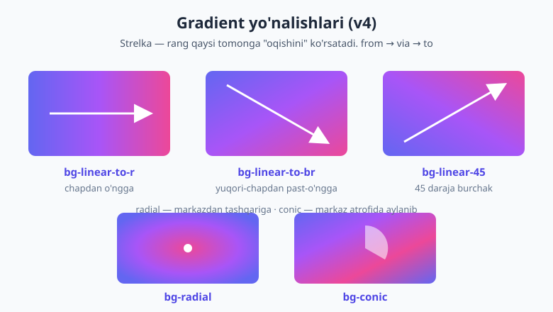
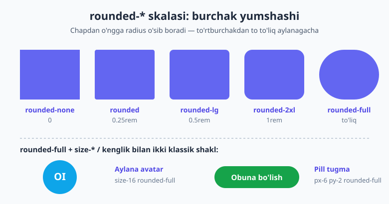
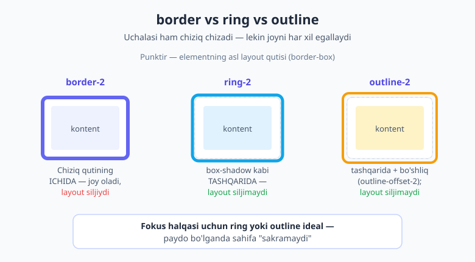

# 13 — Fon, gradient va chegara

[⬅️ Oldingi: 12 — Tipografiya](./12-tipografiya.md) · [🏠 README](./README.md) · [Keyingi: 14 — Soya, filter va mask ➡️](./14-soya-filter-mask.md)

> **Bu bobda:** elementga "yuz" beradigan uch katta vositani o'rganamiz — **fon** (`bg-*` rang, rasm, `bg-cover`/`bg-center`, gradient matn), **gradient** (v4'da muhim **`bg-linear-to-r`** sintaksisi — v3'dagi eski `bg-gradient-to-r` emas!), va **chegara** oilasi: `border` (v4'da chegara rangi standart `currentColor` — bu juda muhim nuance), `rounded-*` (burchak yumaloqlash), `ring-*` (layoutni siljitmaydigan halqa) va `outline-*` (accessibility uchun). Oxirida gradientli hero, kartochka, fokus-ringli input va pill badge quramiz.

---

## 13.1 Avval nega? — element "yuzi" uch qatlamdan

Bir tugmani tasavvur qiling. Uni ko'zga tashlanadigan qiladigan narsa nima? Uchta narsa: **ichi** qanday bo'yalgan (fon), **chetlari** qanaqa (chegara va uning yumaloqligi), va u **diqqatni tortganida** atrofida nima paydo bo'ladi (ring/outline). Mana shu uch qatlam — bu bobning butun mavzusi.

Toza CSS'da bularni `background`, `border`, `border-radius`, `outline` xususiyatlari bilan yozardingiz (buni [HTML & CSS kitobining fon va chegara bobida](../html-css/13-fon-chegara-soyalar.md) ko'rgansiz). Tailwind hech narsani o'ylab topmaydi — u xuddi shu CSS xususiyatlarini qisqa utility klasslarga o'raydi. Lekin v4'da bir nechta **muhim o'zgarish va tuzoq** bor (gradient nomi o'zgargan, chegara rangi standartlari boshqacha) — shularga alohida e'tibor beramiz, chunki internetdagi eski darslar sizni adashtirishi mumkin.

Rangning o'zi haqida [11-bobda](./11-ranglar.md) gaplashdik (OKLCH palette, `/50` opacity). Bu bobda rangni **fon, gradient va chegara** sifatida qanday qo'llashni ko'ramiz.

---

## 13.2 Fon ranglari — qisqa eslatma

Eng oddiy fon — yaxlit rang. `bg-{rang}-{daraja}` shaklida:

```html
<div class="bg-indigo-500">To'q binafsha fon</div>
<div class="bg-white">Oq fon</div>
<div class="bg-slate-100">Juda och kulrang fon</div>
```

Opacity modifikatori ham fonda ishlaydi (11-bobdan): `bg-black/50` — yarim shaffof qora qoplama. Bu modal orqa fonida juda ko'p ishlatiladi.

```html
<!-- Modal ortidagi qoraytirilgan qoplama -->
<div class="bg-black/50">...</div>
```

---

## 13.3 Fon rasmi — hero naqshi

Fon faqat rang emas — rasm ham bo'lishi mumkin. URL'ni ixtiyoriy (arbitrary) qiymat sifatida beramiz:

```html
<div class="bg-[url('/rasmlar/hero.jpg')]">...</div>
```

Lekin rasmni qo'yishning o'zi yetarli emas — u qanday joylashishini ham aytishingiz kerak. Mana eng muhim sherik utility'lar:

| Utility | CSS | Ma'nosi |
|---|---|---|
| `bg-cover` | `background-size: cover` | Rasm konteynerni to'liq qoplaydi (kerak bo'lsa cheti kesiladi). |
| `bg-contain` | `background-size: contain` | Rasm to'liq sig'adi (bo'sh joy qolishi mumkin). |
| `bg-center` | `background-position: center` | Rasm markazga tekislanadi. |
| `bg-top` / `bg-bottom` | `background-position: top` | Yuqori / past chetga. |
| `bg-no-repeat` | `background-repeat: no-repeat` | Rasm takrorlanmaydi. |
| `bg-repeat` | `background-repeat: repeat` | Naqsh bo'lib takrorlanadi (kichik teksturalar uchun). |
| `bg-fixed` | `background-attachment: fixed` | Rasm "qotirilgan" — scroll qilinganda parallaks effekti. |
| `bg-local` | `background-attachment: local` | Rasm kontent bilan birga scroll qiladi. |

Klassik **hero** (sahifa yuqorisidagi katta rasm + matn) naqshi shunday ko'rinadi:

```html
<section class="bg-[url('/rasmlar/hero.jpg')] bg-cover bg-center bg-no-repeat h-96">
  <div class="bg-black/40 h-full flex items-center justify-center">
    <h1 class="text-4xl font-bold text-white">Bizning mahsulot</h1>
  </div>
</section>
```

Bu yerda nima bo'lyapti: tashqi `<section>` rasmni `bg-cover bg-center bg-no-repeat` bilan to'liq, markazlangan va takrorlanmaydigan qilib qo'yadi. Ichidagi `bg-black/40` — yarim shaffof qora qoplama, matnni o'qiladigan qiladi (rasm yorqin bo'lsa, oq matn yo'qolib ketmasligi uchun).

> 💡 **Maslahat — parallaks.** `bg-fixed` ni katta hero rasmida ishlatsangiz, foydalanuvchi pastga scroll qilganda rasm "joyida turgandek" tuyuladi, kontent esa ustidan suriladi. Bu chiroyli, lekin mobil brauzerlarning bir qismida `bg-fixed` ishlamaydi — muhim dizaynni faqat unga tayanib qurmang.

---

## 13.4 Gradient matn — `bg-clip-text`

Eng ko'zga tashlanadigan effektlardan biri — **gradientli matn** (sarlavha harflarining o'zi gradientga bo'yalgan). Buning siri uch klassda:

```html
<h1 class="bg-linear-to-r from-indigo-500 to-pink-500 bg-clip-text text-transparent text-5xl font-bold">
  Gradientli sarlavha
</h1>
```

Mantiq shunday:

1. `bg-linear-to-r from-indigo-500 to-pink-500` — elementga gradient fon beradi.
2. `bg-clip-text` — fonni **matn shakliga "qirqadi"** (`background-clip: text`) — fon endi faqat harflar ichida ko'rinadi.
3. `text-transparent` — matnning o'z rangini shaffof qiladi, shunda ostidagi gradient fon ko'rinadi.

Uchchalasi birga bo'lmasa effekt ishlamaydi — bu eng ko'p unutiladigan kombinatsiya. (Gradient sintaksisining o'zini hozir keyingi bo'limda batafsil ko'ramiz.)

> 📌 **Atama.** `bg-clip-*` — fon qaysi sohada ko'rinishini belgilaydi: `bg-clip-border` (standart, butun border-box), `bg-clip-padding`, `bg-clip-text` (faqat matn). `bg-blend-multiply`, `bg-blend-overlay` esa fon bilan rangni aralashtirish (blend) rejimlarini beradi — maxsus holatlar uchun.

---

## 13.5 Gradient — v4 sintaksisi (ENG MUHIM o'zgarish)

Endi bobning eng muhim qismiga keldik. Tailwind v4 gradient utility'larini **qayta nomladi**. Bu sizni adashtirishi mumkin bo'lgan birinchi narsa:

> ⚠️ **v3 dan v4 ga: gradient nomi o'zgardi!** v3'da yo'nalishli gradient `bg-gradient-to-r` edi. **v4'da bu `bg-linear-to-r`** ga aylandi. Internetdagi eski misollarda `bg-gradient-to-r` ni ko'rsangiz — bu v3. v4'da u **ishlamaydi**. Doim `bg-linear-*` yozing.

Sababi: v4'ga `bg-radial` va `bg-conic` ham qo'shildi, shuning uchun "linear/radial/conic" deb aniq nomlash mantiqliroq bo'ldi.

### Yo'nalishli (linear) gradient

Gradient ikki qismdan iborat: **yo'nalish** (qaysi tomonga) va **rang nuqtalari** (qaysi ranglardan qaysiga). Yo'nalish:

| Utility | Yo'nalish |
|---|---|
| `bg-linear-to-r` | chapdan o'ngga → |
| `bg-linear-to-l` | o'ngdan chapga ← |
| `bg-linear-to-t` | pastdan tepaga ↑ |
| `bg-linear-to-b` | tepadan pastga ↓ |
| `bg-linear-to-br` | yuqori-chapdan past-o'ngga ↘ |
| `bg-linear-to-tr` | past-chapdan yuqori-o'ngga ↗ |
| `bg-linear-45` | aniq burchak — 45 daraja |
| `bg-linear-[30deg]` | ixtiyoriy burchak — 30 daraja |

Bu rasm beshta asosiy yo'nalishni va har birining "oqish" tomonini ko'rsatadi:



### Rang nuqtalari — from / via / to

Yo'nalishdan keyin ranglarni belgilaysiz:

- `from-{rang}` — boshlang'ich rang (**shart**).
- `to-{rang}` — yakuniy rang.
- `via-{rang}` — o'rtadagi rang (ixtiyoriy — uch rangli gradient uchun).

```html
<!-- Ikki rangli -->
<div class="bg-linear-to-r from-indigo-500 to-pink-500 h-24"></div>

<!-- Uch rangli (via bilan) -->
<div class="bg-linear-to-r from-indigo-500 via-purple-500 to-pink-500 h-24"></div>
```

`from-indigo-500` o'zi orqada `--tw-gradient-stops` o'zgaruvchisini sozlaydi, `bg-linear-to-r` esa `background-image: linear-gradient(to right, ...)` ni chiqaradi — ikkalasi birgalikda gradientni hosil qiladi.

### Nuqta pozitsiyalari — qayerda boshlanib, qayerda tugashi

Rang qayerdan boshlanib qayerda to'liq bo'lishini ham boshqarsa bo'ladi — foiz bilan:

```html
<div class="bg-linear-to-r from-indigo-500 from-10% via-purple-500 via-30% to-pink-500 to-90%">
</div>
```

`from-10%` — indigo rangi 10% gacha to'liq qoladi, `to-90%` — pushti rang 90% da to'liq bo'ladi. Bu gradient "qayerga jamlangani"ni nozik sozlash imkonini beradi.

### Interpolatsiya rang fazosi — silliqroq o'tish

v4'da gradient ranglari **qaysi rang fazosida** aralashishini ham tanlash mumkin. Bu ranglar o'rtasidagi o'tish qanchalik silliq ko'rinishiga ta'sir qiladi:

```html
<!-- OKLCH fazosida — odatda eng silliq, eng jonli o'tish -->
<div class="bg-linear-to-r/oklch from-indigo-500 to-pink-500"></div>

<!-- sRGB fazosida — an'anaviy CSS xulqi -->
<div class="bg-linear-to-r/srgb from-indigo-500 to-pink-500"></div>

<!-- Uzun yo'l bilan rang doirasini aylanib o'tish -->
<div class="bg-linear-to-r/longer from-indigo-500 to-pink-500"></div>
```

Slesh (`/oklch`, `/srgb`, `/longer`) — interpolatsiya rejimini bildiradi. Ko'pincha `/oklch` ko'zga eng yoqimli natija beradi, ayniqsa qarama-qarshi ranglar orasida (sariqdan ko'kkacha kabi) "loyqa kulrang" o'rta hosil bo'lmaydi.

### Radial va conic gradient

Linear — to'g'ri chiziq bo'ylab. v4'da ikkita boshqa shakl ham bor:

```html
<!-- Radial: markazdan tashqariga doira bo'lib tarqaladi -->
<div class="bg-radial from-indigo-500 to-pink-500 h-40"></div>

<!-- Radial, markazni belgilash bilan -->
<div class="bg-radial-[at_top_left] from-indigo-500 to-pink-500 h-40"></div>

<!-- Conic: markaz atrofida aylanib (rang g'ildiragi kabi) -->
<div class="bg-conic from-indigo-500 via-purple-500 to-pink-500 h-40"></div>

<!-- Conic, 180 darajadan boshlab -->
<div class="bg-conic-180 from-indigo-500 to-pink-500 h-40"></div>
```

`bg-radial` — markazdan tashqariga; `bg-radial-[at_top_left]` — markazni yuqori-chapga ko'chiradi. `bg-conic` — burchak bo'ylab aylanadi (pie-chart yoki rang doirasi effekti uchun).

### Gradient tugma

Amaliy misol — gradientli tugma (juda mashhur naqsh):

```html
<button class="bg-linear-to-r from-indigo-500 to-purple-600 text-white font-semibold px-6 py-3 rounded-lg">
  Boshlash
</button>
```

> 💡 **Hover'da gradientni o'zgartirish.** `hover:from-indigo-600 hover:to-purple-700` qo'shsangiz, sichqoncha kelganda gradient biroz to'qlashadi. Holat variantlari (`hover:`/`focus:`) to'liq [15-bobda](./15-holat-variantlari.md) ko'riladi.

---

## 13.6 Chegara — `border` va v4'ning eng katta tuzog'i

Endi chegaraga o'tamiz. Chegara kengligi oddiy:

| Utility | Ma'nosi |
|---|---|
| `border` | har tomondan 1px |
| `border-2` / `border-4` / `border-8` | qalinroq chegara |
| `border-x` / `border-y` | faqat yon / faqat tepa-past |
| `border-t` / `border-r` / `border-b` / `border-l` | bitta tomon |
| `border-t-4` | bitta tomon + qalinlik |
| `border-0` | chegarani olib tashlash |

Lekin mana shu yerda v4'ning **eng ko'p adashtiradigan o'zgarishi** bor:

> ⚠️ **v4'da chegara rangi standart `currentColor`!** v3'da `border` yozsangiz, chegara avtomatik och kulrang (`gray-200`) bo'lardi. **v4'da bunday emas** — chegara rangi standart bo'yicha `currentColor`, ya'ni elementning matn rangiga teng. Demak faqat `border` yozsangiz, chegara siz kutmagan rangda (ko'pincha qora yoki to'q rangda) chiqishi mumkin. **Doim rangni birga bering:** `border border-gray-200`.

```html
<!-- ❌ v3 odati: faqat border — v4'da rang currentColor bo'ladi -->
<div class="border">...</div>

<!-- ✅ v4 to'g'ri: chegara rangini aniq belgilang -->
<div class="border border-gray-200">...</div>
```

### Chegara uslubi va tomon-rang

Uslub — chiziqning turi:

```html
<div class="border-2 border-dashed border-indigo-500">Punktir chegara</div>
<div class="border-2 border-dotted border-sky-500">Nuqtali chegara</div>
<div class="border-4 border-double border-gray-400">Ikki chiziqli</div>
```

Har tomonga alohida rang ham berish mumkin:

```html
<div class="border-2 border-t-indigo-500 border-b-pink-500">
  Yuqorisi indigo, pasti pushti
</div>
```

---

## 13.7 Burchak yumaloqlash — `rounded-*`

`rounded-*` — burchaklarni yumshatadi (`border-radius`). Skala kichikdan to to'liq aylanagacha:

| Utility | qiymat |
|---|---|
| `rounded-none` | 0 (o'tkir burchak) |
| `rounded-sm` | 0.125rem |
| `rounded` | 0.25rem |
| `rounded-md` | 0.375rem |
| `rounded-lg` | 0.5rem |
| `rounded-xl` | 0.75rem |
| `rounded-2xl` | 1rem |
| `rounded-3xl` | 1.5rem |
| `rounded-full` | to'liq (aylana / pill) |



`rounded-lg` orqada `border-radius: var(--radius-lg)` (ya'ni `0.5rem`) ni chiqaradi.

Faqat ayrim burchaklarni yumaloqlash uchun yo'nalish qo'shasiz:

```html
<div class="rounded-t-lg">faqat yuqori ikki burchak</div>
<div class="rounded-tl-xl">faqat yuqori-chap burchak</div>
<div class="rounded-l-lg">faqat chap tomon</div>
```

### Ikki klassik shakl

`rounded-full` ikki juda mashhur naqshni beradi:

```html
<!-- Aylana avatar: kvadrat + rounded-full = doira -->


<!-- Pill tugma: balandlikdan kattaroq radius = tabletka shakli -->
<button class="px-6 py-2 rounded-full bg-indigo-500 text-white">Obuna</button>
```

`size-12` (eni = bo'yi) + `rounded-full` = mukammal doira. Pill tugmada esa balandlik kichik, radius katta — chetlari to'liq yarim doira bo'ladi.

---

## 13.8 Ring — layoutni siljitmaydigan halqa

Endi **ring**. Ring tashqi ko'rinishidan chegaraga o'xshaydi — element atrofida chiziq. Lekin ichki mexanizmi butunlay boshqacha va aynan shu farq uni qimmatli qiladi.

> 📌 **Atama.** **ring** — element atrofidagi halqa, lekin u `border` emas, balki **`box-shadow` asosida** chiziladi. Soya layoutga ta'sir qilmaydi — element kattalashmaydi, qo'shnilari siljimaydi. Border esa qutining o'lchamiga qo'shiladi (yoki ichidan joy oladi).

Mana ring, border va outline o'rtasidagi farq — bu bobning eng muhim diagrammasi:



```html
<div class="ring-2 ring-indigo-500">2px indigo halqa</div>
<div class="ring-4 ring-sky-500 ring-offset-2 ring-offset-white">
  Qalinroq halqa, oq bo'shliq bilan
</div>
```

| Utility | Ma'nosi |
|---|---|
| `ring` / `ring-2` / `ring-4` | halqa qalinligi |
| `ring-{rang}` | halqa rangi (masalan `ring-indigo-500`) |
| `ring-offset-2` | halqa bilan element orasida bo'shliq |
| `ring-offset-{rang}` | o'sha bo'shliq rangi (odatda fon rangi) |
| `ring-inset` | halqa tashqariga emas, ichkariga chiziladi |

### Nega ring fokus uchun ideal?

Tugma yoki inputga sichqoncha yoki klaviatura bilan **fokus** kelganda atrofida halqa chiqishi kerak — bu foydalanuvchiga "hozir shu element faol" deb bildiradi. Agar buni `border` bilan qilsangiz, fokus kelganda chegara paydo bo'lib element **bir-ikki piksel kattalashadi** va butun layout sakraydi. Ring esa box-shadow bo'lgani uchun joy olmaydi — hech narsa siljimaydi:

```html
<input class="border border-gray-300 rounded-lg px-3 py-2
              focus:ring-2 focus:ring-indigo-500 focus:border-indigo-500"
       placeholder="Email">
```

Bu yerda asosda yengil kulrang chegara, fokusda esa indigo ring qo'shiladi — toza, sakramaydigan fokus holati. (`focus:` varianti haqida to'liq [15-bobda](./15-holat-variantlari.md).)

---

## 13.9 Outline — ring ham, border ham emas

Uchinchi "chiziq" turi — **outline**. U brauzerning o'z `outline` xususiyatiga mos keladi va, ring kabi, **layoutni siljitmaydi**:

| Utility | Ma'nosi |
|---|---|
| `outline` / `outline-2` | outline qalinligi |
| `outline-{rang}` | outline rangi |
| `outline-offset-2` | outline bilan element orasida bo'shliq |
| `outline-dashed` / `outline-dotted` | outline uslubi |
| `outline-none` | outline'ni butunlay olib tashlash |
| `outline-hidden` | outline'ni vizual yashiradi, lekin a11y'ni saqlaydi |

```html
<button class="outline-2 outline-offset-2 outline-indigo-500">Tugma</button>
```

**Ring vs outline:** ikkalasi ham layoutni siljitmaydi. Asosiy farq — outline brauzerning native fokus mexanizmiga yaqinroq va ba'zan burchaklarda `rounded-*` ni to'liq kuzatmaydi (brauzerga bog'liq), ring esa `border-radius` ni doim aniq kuzatadi. Amalda Tailwind jamoasi **ko'rinadigan, dizaynli fokus uchun ring** ni, brauzer-darajadagi standart fokus uchun esa outline'ni afzal ko'radi.

> ⚠️ **Accessibility — fokusni HECH QACHON shunchaki o'chirmang.** Eng keng tarqalgan a11y xatosi: dizayner `outline-none` yozib, fokus ko'rsatkichini butunlay yo'qotadi. Klaviatura bilan harakatlanadigan foydalanuvchi endi qayerdaligini bilmaydi. Agar standart outline'ni olib tashlasangiz, **o'rniga albatta ring yoki o'z outline'ingizni bering**: `focus:outline-none focus:ring-2 focus:ring-indigo-500`. Faqat vizual tozalik kerak bo'lsa, `outline-none` o'rniga `outline-hidden` ishlating — u outline'ni yashiradi, lekin yuqori-kontrast rejimida foydalanuvchilar uchun saqlab qoladi.

---

## 13.10 Hammasini birlashtirib — to'rt komponent

O'rgangan hammamizni bir joyga yig'amiz.

**1) Gradientli hero, gradient sarlavha bilan:**

```html
<section class="bg-linear-to-br from-slate-900 to-indigo-900 px-6 py-20 text-center">
  <h1 class="bg-linear-to-r from-sky-400 to-pink-400 bg-clip-text text-transparent
             text-5xl font-bold">
    Kelajakni quring
  </h1>
  <p class="mt-4 text-slate-300">Tailwind v4 bilan tez va chiroyli interfeys</p>
</section>
```

**2) Kartochka — `rounded-xl border border-gray-200`:**

```html
<div class="rounded-xl border border-gray-200 bg-white p-6">
  <h3 class="text-lg font-semibold">Karta sarlavhasi</h3>
  <p class="mt-2 text-gray-600">Yumaloq burchak + yengil chegara = toza karta.</p>
</div>
```

E'tibor bering — `border` bilan birga `border-gray-200` yozdik (v4 tuzog'ini eslang!).

**3) Fokus-ringli input:**

```html
<input class="w-full rounded-lg border border-gray-300 px-3 py-2
              focus:border-indigo-500 focus:ring-2 focus:ring-indigo-500 focus:outline-none"
       placeholder="Ismingiz">
```

**4) Pill badge:**

```html
<span class="rounded-full bg-green-100 px-3 py-1 text-sm font-medium text-green-700">
  Faol
</span>
```

`rounded-full` + kichik padding = chiroyli, yumaloq belgi (badge). Och fon + to'q matn — tinch, o'qiladigan kombinatsiya.

---

## 13.11 Tez-tez uchraydigan xatolar

- **`bg-gradient-to-r` yozish (v3 sintaksisi).** v4'da bu ishlamaydi. To'g'risi — **`bg-linear-to-r`**. Internetdagi eski misollar sizni bu xatoga undaydi.
- **`from-*` ni unutish.** Faqat `bg-linear-to-r to-pink-500` yozsangiz, boshlang'ich rang yo'q — gradient ko'rinmaydi. `from-*` deyarli doim shart.
- **Chegara rangini berishni unutish (v4 currentColor).** `border` yolg'iz yozilsa, chegara matn rangida chiqadi. Doim `border border-gray-200` kabi rangni qo'shing.
- **Gradient matnda uchta klassdan birini tushirib qoldirish.** `bg-clip-text` bor, lekin `text-transparent` yo'q — matn o'z rangida ko'rinaveradi, gradient yo'qoladi. Uchchalasi shart: gradient + `bg-clip-text` + `text-transparent`.
- **Ring va outline'ni adashtirish.** Ikkalasi ham layoutni siljitmaydi, lekin ring `box-shadow`, outline esa brauzer `outline`'i. Dizaynli fokus halqasi uchun odatda ring tanlanadi.
- **Fokus outline'ini almashtirmasdan o'chirish.** `outline-none` yozib, o'rniga ring/outline bermaslik — jiddiy accessibility xatosi. Doim ko'rinadigan fokus ko'rsatkichini qoldiring.

> 🔭 **Oldinga qarash.** Element "yuzi"ning yana bir qatlami bor — **soya** (`shadow-*`), filterlar (`blur`, `brightness`) va `mask`. Ring `box-shadow` asosida ishlashini ko'rdik; haqiqiy soyalar va ulardan yasaladigan chuqurlik effektlari — [keyingi bob](./14-soya-filter-mask.md) shu haqida.

---

## Mashqlar

**1-mashq.** Bir do'st internetdan topib, `class="bg-gradient-to-r from-blue-500 to-purple-500"` yozdi, lekin gradient chiqmadi. Sabab nima va to'g'risi qanday?

<details markdown="1"><summary>Yechim</summary>

Sabab — `bg-gradient-to-r` bu **Tailwind v3** sintaksisi. v4'da bu utility qayta nomlangan va `bg-gradient-to-r` endi mavjud emas, shuning uchun hech qanday gradient hosil bo'lmaydi.

To'g'risi — `linear` so'zi bilan:

```html
<div class="bg-linear-to-r from-blue-500 to-purple-500"></div>
```

**Qoida:** v4'da yo'nalishli gradient = `bg-linear-*`, eski `bg-gradient-*` emas.

</details>

**2-mashq.** Pastdan tepaga (`↑`) ketadigan, indigo'dan boshlanib, o'rtada binafsha bo'lib, pushtiga tugaydigan gradient fon uchun klasslarni yozing.

<details markdown="1"><summary>Yechim</summary>

```html
<div class="bg-linear-to-t from-indigo-500 via-purple-500 to-pink-500"></div>
```

`bg-linear-to-t` — pastdan tepaga yo'nalish. `from`/`via`/`to` — uch rang nuqtasi (o'rtadagi rang uchun `via` ishlatiladi).

</details>

**3-mashq.** Sarlavha matnini (`<h1>`) chapdan o'ngga ketadigan indigo→pushti gradientga bo'yang — ya'ni harflarning o'zi gradientli bo'lsin. Qaysi uchta klass shart va nega?

<details markdown="1"><summary>Yechim</summary>

```html
<h1 class="bg-linear-to-r from-indigo-500 to-pink-500 bg-clip-text text-transparent">
  Sarlavha
</h1>
```

Uchta klass shart:

1. `bg-linear-to-r from-indigo-500 to-pink-500` — gradient fonni yaratadi.
2. `bg-clip-text` — fonni matn shakliga qirqadi (`background-clip: text`).
3. `text-transparent` — matnning o'z rangini shaffof qiladi, shunda ostidagi gradient ko'rinadi.

Agar `text-transparent` bo'lmasa, matn o'z rangida ko'rinib, gradientni to'sib qo'yadi.

</details>

**4-mashq.** Bir dasturchi `<div class="border">` yozdi va chegara kutilmaganda to'q rangda chiqdi (och kulrang emas). Nima bo'ldi va qanday tuzatasiz?

<details markdown="1"><summary>Yechim</summary>

v4'da chegara rangi standart bo'yicha **`currentColor`** — ya'ni elementning matn rangi. v3'da bu avtomatik `gray-200` edi, lekin v4 bu xulqni o'zgartirdi. Shuning uchun `border` yolg'iz yozilsa, chegara matn rangida (ko'pincha to'q) chiqadi.

Tuzatish — rangni aniq belgilash:

```html
<div class="border border-gray-200">...</div>
```

**Qoida:** v4'da `border` doim rang bilan birga — `border border-{rang}`.

</details>

**5-mashq.** Inputga fokus kelganda atrofida 2px indigo halqa chiqsin, lekin **element kattalashmasin va layout sakramasin**. Border emas, qaysi utility'ni ishlatasiz va nega?

<details markdown="1"><summary>Yechim</summary>

`ring` ishlatamiz, chunki u `box-shadow` asosida chiziladi — layoutga ta'sir qilmaydi (element kattalashmaydi, qo'shnilari siljimaydi). Border esa qutining o'lchamiga qo'shilib, fokus kelganda layoutni sakratadi.

```html
<input class="border border-gray-300 rounded-lg px-3 py-2
              focus:ring-2 focus:ring-indigo-500"
       placeholder="Email">
```

`focus:ring-2 focus:ring-indigo-500` — faqat fokus holatida 2px indigo halqa qo'shadi, joy egallamasdan.

</details>

**6-mashq (accessibility).** Quyidagi tugma "tozaroq ko'rinishi uchun" fokus konturidan xalos qilingan. Nima xato va qanday tuzatasiz?

```html
<button class="bg-indigo-500 text-white px-4 py-2 rounded-lg focus:outline-none">
  Yuborish
</button>
```

<details markdown="1"><summary>Yechim</summary>

Xato — `focus:outline-none` fokus ko'rsatkichini butunlay o'chiradi, o'rniga hech narsa bermaydi. Klaviatura (Tab) bilan harakatlanadigan foydalanuvchi endi qaysi element faol ekanini ko'rmaydi — bu jiddiy accessibility muammosi.

Tuzatish — outline'ni o'chirsak ham, o'rniga ko'rinadigan ring beramiz:

```html
<button class="bg-indigo-500 text-white px-4 py-2 rounded-lg
               focus:outline-none focus:ring-2 focus:ring-indigo-400 focus:ring-offset-2">
  Yuborish
</button>
```

**Qoida:** fokus ko'rsatkichini hech qachon shunchaki o'chirmang — almashtiring. Yoki vizual tozalik kerak bo'lsa, `outline-none` o'rniga `outline-hidden` ishlating (u yuqori-kontrast rejimida ko'rsatkichni saqlaydi).

</details>

---

[⬅️ Oldingi: 12 — Tipografiya](./12-tipografiya.md) · [🏠 README](./README.md) · [Keyingi: 14 — Soya, filter va mask ➡️](./14-soya-filter-mask.md)
