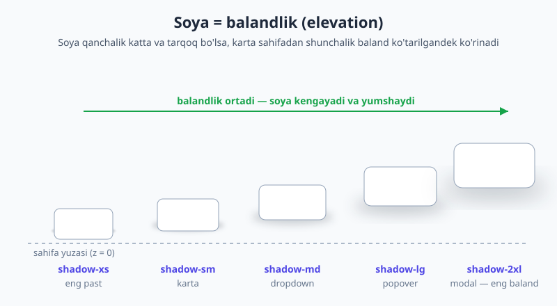
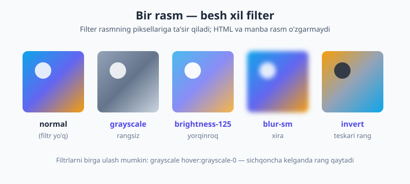
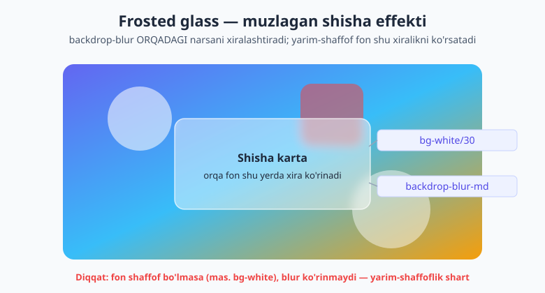

# 14 — Soya, filter va mask

[⬅️ Oldingi: 13 — Fon, gradient va chegara](./13-fon-gradient-border.md) · [🏠 README](./README.md) · [Keyingi: 15 — Holat variantlari ➡️](./15-holat-variantlari.md)

> **Bu bobda:** Interfeysga **chuqurlik va hayot** beruvchi effektlarni o'rganamiz: `shadow-*` bilan balandlik (elevation), `inset-shadow`/`ring`, `opacity`, `blur`/`brightness`/`grayscale` kabi **filtrlar**, `backdrop-blur` bilan **muzlagan shisha** (frosted glass), `mix-blend-*` aralashtirish rejimlari, hamda v4.1 da kelgan yangiliklar — `mask-*` (rasm chetini erish) va `text-shadow-*` (matn soyasi). Yo'l-yo'lakay v4 da soya shkalasi nomlari **o'zgargani** (v3 dan farq) haqida ham ogohlantiramiz.

---

## 14.1 Avval nega? — tekis ekranga chuqurlik berish

Ekran tekis. Lekin yaxshi interfeys tekis ko'rinmaydi: tugma bosilishga tayyordek "ko'tarilib" turadi, modal sahifa ustida "suzadi", dropdown menyu kontentdan "balandda" ochiladi. Bu his-tuyg'uni beradigan asosiy vosita — **soya**.

Asl g'oya juda sodda: real dunyoda biror narsa yuzadan qancha baland bo'lsa, uning soyasi shuncha **katta, tarqoq va yumshoq** bo'ladi. Stol ustidagi qog'ozning soyasi ingichka; tepada osilgan lampaning soyasi keng. Tailwind aynan shu **balandlik (elevation)** tilini `shadow-xs` dan `shadow-2xl` gacha bo'lgan shkala bilan beradi.

Bu tushunchalar yangi emas — toza CSS'da bularni `box-shadow`, `filter: blur()`, `backdrop-filter` bilan yozgansiz (buni [HTML & CSS kitobining fon va soyalar bobida](../html-css/13-fon-chegara-soyalar.md) ko'rgansiz). Tailwind hech narsani o'ylab topmaydi — u shu xususiyatlarni **utility klasslar** ko'rinishida, tayyor, izchil shkala bilan beradi.

> 📌 **Atamalar.** **Elevation** — element sahifa yuzasidan qanchalik "baland" ko'tarilgani; soya o'lchami bilan ifodalanadi. **Box-shadow** — elementning to'rtburchak kuti atrofidagi soya. **Drop-shadow** — elementning haqiqiy shakli (alfa kanali) bo'ylab tushuvchi soya. **Backdrop filter** — elementning **orqasidagi** narsalarga (foniga) qo'llanadigan filter.

---

## 14.2 Box-shadow shkalasi — balandlik tili

Tailwind'da balandlik shkalasi ettita pog'onadan iborat, eng pastdan eng balandgacha:

| Klass | Balandlik | Odatda qayerda |
|---|---|---|
| `shadow-2xs` | juda nozik | ramka o'rnida, ingichka ajratish |
| `shadow-xs` | nozik | kichik kartalar, inputlar |
| `shadow-sm` | past | oddiy karta |
| `shadow-md` | o'rta | dropdown, hover holati |
| `shadow-lg` | baland | popover, suzuvchi panel |
| `shadow-xl` | balandroq | katta panel |
| `shadow-2xl` | eng baland | modal, dialog |
| `shadow-none` | soya yo'q | soyani o'chirish (mas. hover'da) |

Aqliy model: **kichik soya = subtle karta, katta soya = modal/popover/dropdown.** Quyidagi rasm shu balandlik tuyg'usini ko'rsatadi — soya kattalashgan sayin karta sahifadan ko'tariladi:



```html
<div class="rounded-xl bg-white p-6 shadow-sm">Oddiy karta</div>
<div class="rounded-xl bg-white p-6 shadow-md">Dropdown</div>
<div class="rounded-xl bg-white p-6 shadow-2xl">Modal — eng baland</div>
```

> ⚠️ **v4 da shkala nomlari o'zgargan — eng ko'p adashtiruvchi joy!** v3 da eng kichik soya `shadow-sm`, oddiy soya esa shunchaki `shadow` edi. v4 da shkala bir pog'ona **siljidi**: eski `shadow` endi `shadow-sm`, eski `shadow-sm` esa endi `shadow-xs`. Ya'ni v3 dan kelgan kodda yoki internetdagi eski darsdan ko'chirgan `shadow` ni ko'rsangiz — u **prefikssiz `shadow`** sifatida v4 da **ishlamaydi**; uni `shadow-sm` ga, eski `shadow-sm` ni esa `shadow-xs` ga aylantiring. Yangi kodda doim **nomlangan** o'lchamni (`-xs`, `-sm`, `-md`, ...) yozing, prefikssiz `shadow` ni emas.

---

## 14.3 Rangli soya va yorqinlik (glow)

Soya doim kulrang bo'lishi shart emas. v4 da soyaga **rang** berish mumkin — bu brend rangidagi yumshoq nur (glow) effektini beradi:

```html
<!-- Indigo rangli, yarim-shaffof yorqin soya -->
<button class="rounded-lg bg-indigo-500 px-5 py-2 text-white shadow-lg shadow-indigo-500/40">
  Yorqin tugma
</button>
```

Bu yerda `shadow-lg` — soyaning **o'lchami/tarqoqligi**, `shadow-indigo-500/40` esa uning **rangi** (40% shaffoflik bilan). Ikkalasini birga yozasiz. Rangli soyalar ayniqsa asosiy harakat tugmalari (CTA) va "promo" kartalarda chiroyli chiqadi, lekin me'yorida ishlating.

---

## 14.4 Inset soya, ring va qatlamlash

Ba'zan soya ichkariga kerak — element "bosilgan" yoki "chuqurchaga botgan"dek ko'rinishi uchun. Buning uchun v4 da **`inset-shadow-*`** bor:

```html
<!-- Bosilgan/chuqur ko'rinish -->
<div class="rounded-lg bg-slate-100 p-4 inset-shadow-sm">Botiq panel</div>
```

Yana ikki dost — **`ring`** (tashqi halqa, soya o'rnida ko'pincha fokus uchun) va **`inset-ring`** (ichki halqa). Eng kuchli tomoni shundaki, ularning hammasini **bir-birining ustiga qatlamlash** mumkin — har biri alohida qatlam:

```html
<!-- Tashqi soya + indigo halqa + ichki nozik soya — uchchalasi birga -->
<div class="rounded-xl bg-white p-6 shadow-lg ring-1 ring-slate-200 inset-shadow-sm">
  Uch qatlamli effekt
</div>
```

> 📝 **v4 dan eslatma.** v3 da `ring` standart 3px ko'k halqa edi; v4 da `ring` endi **1px** (joriy `currentColor` ga yaqin) va rangni `ring-<rang>` bilan alohida berasiz. `inset-shadow` va `inset-ring` esa v4 da **yangi** — ilgari buni faqat ixtiyoriy (arbitrary) qiymat bilan yozish kerak edi.

---

## 14.5 `opacity` — butun elementning shaffofligi

`opacity-*` — elementni **butunlay** (matni, foni, bolalari bilan) shaffof qiladi. Shkala 0 dan 100 gacha:

```html
<div class="opacity-100">to'liq ko'rinadi</div>
<div class="opacity-50">yarim shaffof</div>
<div class="opacity-0">ko'rinmas (lekin joyni egallaydi)</div>

<!-- Ixtiyoriy qiymat -->
<div class="opacity-[0.67]">67%</div>
```

Eng tez-tez ishlatiladigan joyi — **o'chirilgan (disabled) holat**:

```html
<button class="bg-indigo-500 text-white disabled:opacity-50 disabled:cursor-not-allowed">
  Yuborish
</button>
```

> 💡 **`opacity-50` va rang `/50` o'rtasidagi muhim farq.** `opacity-50` — **butun elementni** (matn, fon, ramka, bolalar — hammasini) yarim shaffof qiladi. `bg-indigo-500/50` esa **faqat fon rangini** yarim shaffof qiladi; matn va bolalar to'liq ko'rinaveradi. Karta foni biroz ko'rinib turishini istasangiz — `bg-white/70` ishlating, `opacity` emas; aks holda ichidagi matn ham xiralashadi. ([Rang `/NN` modifikatori](./13-fon-gradient-border.md) ni 13-bobda batafsil ko'rgansiz.)

---

## 14.6 Filtrlar — rasm va elementni qayta ishlash

Filtrlar elementning **piksellariga** ta'sir qiladi: xiralashtirish, yorqinlik, ranglarni o'zgartirish. Eng ko'p ishlatiladiganlari:

| Klass | Ta'siri |
|---|---|
| `blur-sm` / `blur` / `blur-lg` | xiralashtirish (gauss blur) |
| `brightness-50` / `brightness-125` | qoraytirish / yorqinlashtirish |
| `contrast-*` | kontrast |
| `grayscale` / `grayscale-0` | rangsiz / rangli |
| `sepia` | jigarrang nostalgik tus |
| `invert` | ranglarni teskari |
| `saturate-*` | rang to'yinganligi |
| `hue-rotate-*` | rang tusini aylantirish |

Bitta rasmga turli filtrlar shunday ko'rinadi:



Filtrlarni **bir-biriga ulash** mumkin va holat variantlari bilan birlashtirish ayniqsa kuchli. Klassik naqsh — **galereya**: rasmlar rangsiz turadi, sichqoncha kelganda rang qaytadi:

```html
<!-- Rangsiz; hover'da rang qaytadi va biroz yorqinlashadi -->

```

### `drop-shadow` va `box-shadow` farqi

Ikkalasi ham soya, lekin tabiati boshqa:

- **`shadow-*`** (box-shadow) — elementning **to'rtburchak kuti** atrofiga soya tushiradi.
- **`drop-shadow-*`** (filter) — elementning **haqiqiy shakli** (alfa kanali) bo'ylab soya tushiradi.

Shuning uchun fonsiz PNG logo, ikonka yoki notog'ri shaklli (mas. uchburchak, gradient mask qilingan) element uchun **`drop-shadow-*`** kerak — soya shaklning konturini kuzatadi. To'rtburchak kartaga esa oddiy `shadow-*` yetarli (va u arzonroq):

```html
<!-- Shaffof PNG logo: soya logoning konturini kuzatadi -->


<!-- Oddiy to'rtburchak karta -->
<div class="rounded-xl bg-white p-6 shadow-md">...</div>
```

---

## 14.7 Backdrop filtrlar — muzlagan shisha (frosted glass)

Eng zo'r effektlardan biri. `blur-*` elementning **o'zini** xiralashtiradi; `backdrop-blur-*` esa elementning **orqasidagi** (foni) narsalarni xiralashtiradi. Element o'zi tiniq qoladi, lekin u orqali ko'rinayotgan fon muzlagan shishadagidek erib ketadi.

Bitta shart bor: effekt ko'rinishi uchun element foni **yarim-shaffof** bo'lishi kerak. To'liq oq fon (`bg-white`) orqasini ko'rsatmaydi — shuning uchun blur ham ko'rinmaydi. Sehrli juftlik:

```html
<!-- Frosted glass: yarim-shaffof oq fon + orqani xiralashtirish -->
<header class="sticky top-0 bg-white/30 backdrop-blur-md
               border-b border-white/20 px-6 py-3">
  <nav>...</nav>
</header>
```

`bg-white/30` — 30% oq (shisha o'zi). `backdrop-blur-md` — orqadagi kontent xira. Birga — sahifa skroll qilinganda kontent shisha header ostidan eriб o'tadigan zamonaviy "glassmorphism" effekti. Mana shu ikkita klass qanday ishlashi:



Yana foydali backdrop variantlar: `backdrop-brightness-*` (orqa fonni qoraytirish/yorqinlashtirish — masalan modal ortidagi fonni xira qilish), `backdrop-saturate-*` (rang to'yinganligi).

> ⚠️ **Ikkita tez-tez uchraydigan tuzoq.** (1) `backdrop-blur` ni shaffof bo'lmagan fon (`bg-white`, `bg-slate-900`) bilan qo'ysangiz — hech narsa ko'rinmaydi, chunki orqa ko'rinmaydi. Doim `/30`, `/50` kabi yarim-shaffof fon bilan qo'shing. (2) Katta `backdrop-blur` keng maydonda **sekin** ishlashi mumkin (ayniqsa eski qurilmalarda) — uni butun ekranga emas, kerakli kichik panelga qo'llang.

---

## 14.8 Blend rejimlari — orqa bilan aralashtirish

Blend rejimlari element rangini **orqasidagi** narsa bilan qanday aralashtirishni belgilaydi (xuddi Photoshop qatlamlaridek):

- **`mix-blend-*`** — butun elementni orqasidagi narsa bilan aralashtiradi: `mix-blend-multiply` (qoraytiradi), `mix-blend-screen` (yorqinlashtiradi), `mix-blend-overlay`.
- **`bg-blend-*`** — elementning **fon rasmi** bilan **fon rangi**ni o'zaro aralashtiradi.

Klassik qo'llanish — rasm ustidagi rangli qoplama (duotone / overlay):

```html
<!-- Rasm ustida indigo qoplama, multiply bilan aralashadi -->
<div class="relative">
  
  <div class="absolute inset-0 rounded-xl bg-indigo-600 mix-blend-multiply"></div>
</div>
```

`mix-blend-multiply` indigo qoplamani rasm bilan ko'paytiradi — natijada rasm indigo tusga botadi, ammo detallari saqlanadi. Bu hero bannerlarda matnni o'qiladigan qilish uchun ham qo'l keladi.

---

## 14.9 Mask — rasm chetini erish (v4.1 yangiligi)

Mask — elementning ba'zi qismlarini **ko'rinmas** qiladi, lekin "kesib tashlamasdan", silliq o'tish bilan. v4.1 da mask utility'lari to'plami keldi. Eng amaliy ikkitasi:

**1) Chetni erish (edge fade).** Rasmning pastki chetini fonga sekin "erib" ketishini istasangiz:

```html
<!-- Pastki 90% dan boshlab asta-sekin shaffoflanadi -->


<!-- Yuqori chet 50% dan erib boshlaydi -->

```

`mask-b-to-90%` — pastdan (bottom) yuqoriga qarab, 90% nuqtaga yetganda to'liq shaffoflashadi; tepasi to'liq ko'rinadi. Bu rasm tagidagi matn bilan silliq qo'shilishni beradi — qattiq kesilgan chet emas.

**2) Radial spotlight.** `mask-radial-*` — markazda yorug', chetlarda erigan "projektor" effekti:

```html

```

Murakkabroq shakl uchun esa rasmni mask sifatida berish mumkin: `mask-[url(shape.svg)]`. Buning ostida CSS `mask-image` turadi; `mask-clip-*`, `mask-origin-*`, `mask-mode-*` kabi sozlamalar ham bor.

---

## 14.10 Matn soyasi (v4.1 yangiligi)

Uzoq yillar Tailwind'da matn soyasi utility'si yo'q edi (ixtiyoriy qiymat bilan yozish kerak edi). v4.1 da **`text-shadow-*`** keldi:

```html
<!-- O'lcham shkalasi -->
<p class="text-shadow-2xs">juda nozik</p>
<p class="text-shadow-sm">nozik</p>
<p class="text-shadow-md">o'rta</p>
<p class="text-shadow-lg">kuchli</p>

<!-- Rangli matn soyasi -->
<h2 class="text-shadow-lg text-shadow-blue-500/50">Rangli soya</h2>
```

Eng foydali joyi — **rasm ustidagi matn**. Hero rasmlarida och rangli sarlavha och fonga yo'qolib ketmasligi uchun qora soya o'qishni keskin yaxshilaydi:

```html
<div class="relative">
  
  <h1 class="absolute bottom-6 left-6 text-4xl font-bold text-white
             text-shadow-lg text-shadow-black/50">
    Sarlavha rasm ustida
  </h1>
</div>
```

---

## 14.11 Amaliy misol — ko'tarilgan profil kartasi

Endi o'rganganlarni birlashtiramiz. Asosiy holatda nozik soya, sichqoncha kelganda karta "ko'tariladi" (kattaroq soya) — bu real interfeyslarda eng tez-tez uchraydigan naqsh:

```html
<article class="group rounded-2xl bg-white p-6
                shadow-sm ring-1 ring-slate-200
                transition hover:shadow-xl hover:ring-indigo-200">
  
  <h3 class="mt-4 text-lg font-semibold text-slate-800">Oqil Imomnazarov</h3>
  <p class="text-sm text-slate-500">Frontend dasturchi</p>
</article>
```

Tahlil qilamiz:

- `shadow-sm ring-1 ring-slate-200` — tinch holatda past balandlik + nozik ramka.
- `transition hover:shadow-xl hover:ring-indigo-200` — hover'da karta yuqoriga **ko'tariladi** (soya kattalashadi) va ramka indigoga aylanadi. `transition` o'tishni silliq qiladi.
- `drop-shadow-md` avatarda — yumaloq rasm konturini kuzatadigan soya (box-shadow emas).
- `grayscale group-hover:grayscale-0` — kartaga kursor kelsa, **avatar** rangli bo'ladi (`group` orqali — buni [15-bobda](./15-holat-variantlari.md) batafsil ko'rasiz).

Bir nechta atomik effekt birga — natijada jonli, "his qilinadigan" komponent.

---

## 14.12 Tez-tez uchraydigan xatolar

- **v3 soya nomlarini ishlatish.** v4 da prefikssiz `shadow` yo'q; eski `shadow` → `shadow-sm`, eski `shadow-sm` → `shadow-xs`. Yangi kodda doim nomlangan o'lcham yozing.
- **Og'ir soyalardan haddan oshib ketish.** Hamma kartaga `shadow-2xl` qo'ysangiz — hech narsa "baland" ko'rinmaydi, sahifa kir bo'ladi. Balandlik **nisbiy**: faqat haqiqatan ko'tarilishi kerak bo'lgan element (modal, hover'dagi karta) katta soya olsin.
- **`backdrop-blur` shaffof fonsiz.** Yarim-shaffof fon (`bg-white/30`) bo'lmasa, backdrop blur ko'rinmaydi — eng ko'p uchraydigan "nega ishlamayapti" sababi.
- **`opacity` ni rang `/50` o'rniga ishlatish.** Faqat fonni shaffof qilmoqchi bo'lsangiz `bg-white/70` ishlating; `opacity-70` butun element bilan birga matnni ham xiralashtiradi.
- **Katta blur'ning narxi (performance).** Keng maydonga katta `blur` yoki `backdrop-blur` — qimmat operatsiya; uni kerakli kichik joyga cheklang, butun ekranga emas.
- **`drop-shadow` o'rniga `shadow` (yoki aksincha).** Fonsiz PNG/ikonka — `drop-shadow-*`; to'rtburchak quti — `shadow-*`.

> 🔭 **Oldinga qarash.** Bu bobdagi effektlar — soya, ring, opacity — dark rejimda boshqacha sozlanadi: qora fonda kulrang soya ko'rinmaydi, shuning uchun `dark:` da ko'pincha soyani ramka/ring bilan almashtirasiz yoki rangini o'zgartirasiz. Buni [16-bob — Dark mode](./16-dark-mode.md) da ko'ramiz. Hover'dagi `hover:shadow-xl` o'tishini esa silliq qiluvchi `transition` 17-bobning mavzusi.

---

## Mashqlar

**1-mashq.** Internetdagi eski (v3) darsdan ko'chirgan kodda `<div class="shadow">` bor, lekin v4 loyihangizda bu karta tekis chiqyapti. Nima bo'lgan va qanday tuzatasiz?

<details markdown="1"><summary>Yechim</summary>

v4 da soya shkalasi nomlari siljigan — prefikssiz `shadow` endi **mavjud emas**. v3 dagi `shadow` v4 da `shadow-sm` ga to'g'ri keladi:

```html
<div class="shadow-sm">...</div>
```

(Va v3 dagi `shadow-sm` esa v4 da `shadow-xs` bo'ladi.) Umumiy qoida: v3 dan kelgan kodda soyalarni bir pog'ona "kattaroq nom"ga ko'taring va doim nomlangan o'lchamni yozing.

</details>

**2-mashq.** Bir tugma yarim shaffof bo'lishi kerak — uning **foni** ham, **matni** ham 60% ko'rinishda. Yana boshqa karta esa **faqat foni** 60% shaffof, matni esa to'liq ko'rinishi kerak. Ikkalasi uchun klasslarni yozing va farqini tushuntiring.

<details markdown="1"><summary>Yechim</summary>

```html
<!-- Hamma narsa (fon + matn) 60% — opacity -->
<button class="bg-indigo-500 text-white opacity-60">Butun element xira</button>

<!-- Faqat fon 60%, matn to'liq — rang /NN -->
<div class="bg-indigo-500/60 text-white">Faqat fon xira</div>
```

`opacity-60` butun elementni (bolalari, matni bilan) shaffof qiladi. `bg-indigo-500/60` esa **faqat fon rangini** shaffof qiladi — matn to'liq qoraygan/oq bo'lib qolaveradi. Karta foni biroz ko'rinishini istasangiz, deyarli har doim rang `/NN` to'g'ri tanlov.

</details>

**3-mashq.** Skroll qilinganda tepada qotib turadigan (sticky) "muzlagan shisha" header yasang: orqasidagi kontent xira ko'rinsin. Klasslarni yozing va `bg-white` bilan qilsa nega ishlamasligini ayting.

<details markdown="1"><summary>Yechim</summary>

```html
<header class="sticky top-0 bg-white/30 backdrop-blur-md border-b border-white/20 px-6 py-3">
  ...
</header>
```

`sticky top-0` — tepaga yopishadi. `backdrop-blur-md` — orqadagi kontentni xiralashtiradi. **Lekin** `bg-white` (to'liq oq) bilan qilsangiz, fon butunlay oq bo'lib, orqasini umuman ko'rsatmaydi — demak blur ham ko'rinmaydi. Shuning uchun **yarim-shaffof** `bg-white/30` shart: shisha o'zi biroz oq, lekin orqasi ham ko'rinib turadi va aynan shu ko'rinayotgan qismni blur xiralashtiradi.

</details>

**4-mashq.** Rasm galereyasida har bir rasm avval **rangsiz** tursin, sichqoncha kelganda **rangli** bo'lib jonlansin. Bir `` uchun klasslarni yozing.

<details markdown="1"><summary>Yechim</summary>

```html

```

`grayscale` — asosiy (tinch) holat: rangsiz. `hover:grayscale-0` — sichqoncha kelganda filtr olib tashlanadi, rang qaytadi. `transition` — bu o'zgarishni silliq (sakramasdan) qiladi. Xohlasangiz `hover:scale-105` yoki `hover:brightness-110` qo'shib jonliroq qilishingiz mumkin.

</details>

**5-mashq.** Hero bo'limida katta rasm ustida oq sarlavha bor, lekin rasmning och joylarida matn yo'qolib ketyapti. Ikki xil yo'l bilan o'qishni yaxshilang: (a) matnga soya berib, (b) rasm ustiga qoraytiruvchi qatlam qo'yib.

<details markdown="1"><summary>Yechim</summary>

**(a) Matn soyasi (v4.1):**

```html
<h1 class="text-white text-shadow-lg text-shadow-black/50">Sarlavha</h1>
```

`text-shadow-black/50` oq matn ostiga yarim-shaffof qora soya qo'yadi — och fonda ham kontur ajralib turadi.

**(b) Qoraytiruvchi qoplama:**

```html
<div class="relative">
  
  <div class="absolute inset-0 bg-black/40"></div>
  <h1 class="absolute bottom-6 left-6 text-white">Sarlavha</h1>
</div>
```

`bg-black/40` qatlami butun rasmni biroz qoraytiradi, oq matn esa undan ajralib chiqadi. Ko'pincha ikkalasini birga ham ishlatishadi.

</details>

**6-mashq (drop-shadow vs shadow).** Sizda ikki element bor: (1) fonsiz PNG kompaniya logosi, (2) oddiy to'rtburchak oq karta. Har biriga soyani qaysi utility bilan berasiz va nega?

<details markdown="1"><summary>Yechim</summary>

```html
<!-- (1) Fonsiz PNG logo: drop-shadow — soya logo SHAKLINI kuzatadi -->


<!-- (2) To'rtburchak karta: shadow — quti atrofiga soya yetarli -->
<div class="rounded-xl bg-white p-6 shadow-md">...</div>
```

`drop-shadow-*` filter bo'lib, elementning **alfa kanali** (haqiqiy shakli) bo'ylab soya tushiradi — shuning uchun fonsiz PNG yoki notog'ri shakl uchun ideal. `shadow-*` (box-shadow) esa har doim **to'rtburchak** quti atrofiga tushadi va to'rtburchak kartaga aynan mos hamda hisoblash jihatidan arzonroq. Logoga `shadow-*` qo'ysangiz — soya logo atrofidagi ko'rinmas to'rtburchakka tushadi, g'alati ko'rinadi.

</details>

---

[⬅️ Oldingi: 13 — Fon, gradient va chegara](./13-fon-gradient-border.md) · [🏠 README](./README.md) · [Keyingi: 15 — Holat variantlari ➡️](./15-holat-variantlari.md)
