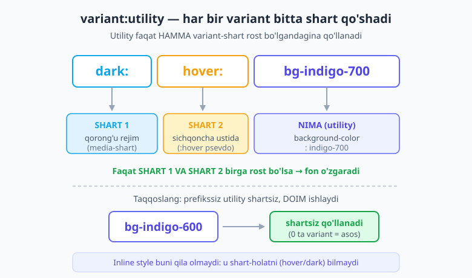
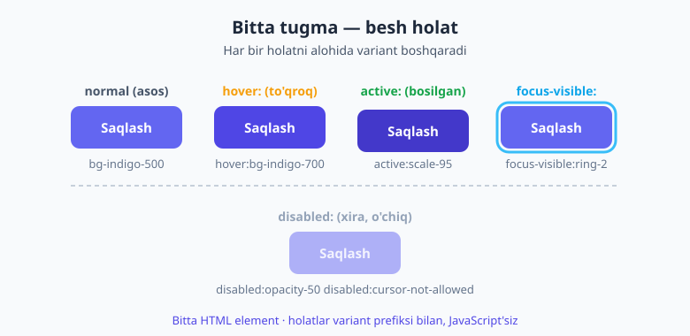
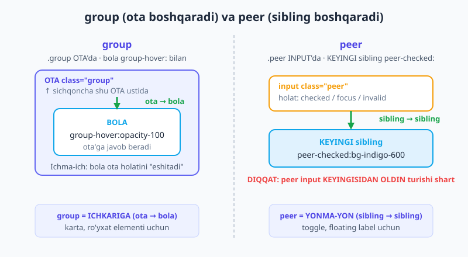

# 15 — Holat variantlari

[⬅️ Oldingi: 14 — Soya, filter va mask](./14-soya-filter-mask.md) · [🏠 README](./README.md) · [Keyingi: 16 — Dark mode ➡️](./16-dark-mode.md)

> **Bu bobda:** Tailwind'ning eng kuchli imkoniyatlaridan birini — **holat variantlari**ni o'rganamiz. Bu — sahifani JavaScript yozmasdan **interaktiv** qilish san'ati. `variant:utility` modelini chuqurlashtiramiz; interaksiya holatlari (`hover:`, `active:`, `focus-visible:`, `focus-within:`); forma holatlari (`disabled:`, `checked:`, `user-invalid:`, `placeholder-shown:`); strukturaviy variantlar (`first:`/`odd:`/`empty:`); psevdo-elementlar (`before:`/`after:`/`placeholder:`/`marker:`/`file:`); va asosiy ikki naqsh — **`group`** (ota boshqaradi) va **`peer`** (sibling boshqaradi); v4'ning **`has-*`** kombinatori; hamda atribut variantlari (`data-*`/`aria-*`). Bobning oxirida siz CSS-only toggle, ochiluvchi karta va o'zini tekshiradigan forma quryapsiz — bitta ham `onclick`siz.

---

## 15.1 Avval nega? — JavaScript'siz interaktivlik

Eslang, [03-bobda](./03-utility-first-ish-jarayoni.md) variant tushunchasi bilan tanishgandik: `hover:bg-indigo-700` — "ustiga sichqoncha kelganda foni o'zgarsin". O'shanda biz buni shunchaki bir misol sifatida ko'rgandik. Endi esa shu g'oyani **to'liq quvvati** bilan ochamiz.

Savol shunday: tugma bosilganda rangi o'zgarsin, input noto'g'ri to'ldirilganda qizarsin, kartaning ustiga kelinganda yashirin tugma chiqsin — bularning hammasini odatda JavaScript bilan qilardingiz, to'g'rimi? `element.addEventListener('mouseover', ...)`, holat (state), DOM o'zgartirish... Ko'p kod, ko'p xato manbai.

Lekin bu interaktivlikning **katta qismi** aslida sof CSS bilan — psevdo-klasslar (`:hover`, `:checked`, `:focus`) orqali — hal bo'ladi. Brauzer bu holatlarni o'zi kuzatib turadi. Tailwind sizga shu psevdo-klasslarni **klass darajasida** beradi: utility oldiga variant prefiksi qo'ysangiz, "shu utility faqat shu holatda ishlasin" degani.

```html
<!-- Toza CSS'dagi g'oya... -->
<style>
  .btn { background: #6366f1; }
  .btn:hover { background: #4f46e5; }
</style>

<!-- ...Tailwind'da bitta qatorda -->
<button class="bg-indigo-500 hover:bg-indigo-700">Saqlash</button>
```

Mana shu **prefiks = holat-shart** g'oyasi butun bobning yuragi. Va bu — aynan inline `style=""` atributi **hech qachon qila olmaydigan** narsa: inline style `hover`ni, `focus`ni, `dark`ni bilmaydi. Variantlar — utility-first'ning shu kamchilikni yopadigan ustunligi.

> 📌 **Atamalar.** **Psevdo-klass** — element holatini bildiruvchi CSS shart (`:hover`, `:checked`, `:focus`). **Psevdo-element** — elementning bir qismi yoki "soxta" qo'shimcha bo'lagi (`::before`, `::placeholder`, `::marker`). **Variant** — utility'ni shartga bog'lovchi prefiks (`hover:`, `first:`, `data-[state=open]:`).

---

## 15.2 Modelni chuqurlashtirish — shartlar qatlami

Variant — bu utility'ga **shart qo'shadi**. Bir nechta variant qo'ysangiz, ular **zanjirlanadi** (stacking), va utility faqat **hamma shart** bir vaqtda rost bo'lgandagina qo'llanadi:

```html
<button class="dark:hover:bg-indigo-700">...</button>
```

Buni o'qib chiqamiz: utility — `bg-indigo-700` (eng oxirida, "nima"). Oldidagi ikki prefiks ikki shart: `dark:` (qorong'u rejim **VA**) `hover:` (ustiga sichqoncha kelgan). Demak — "qorong'u rejimda **va** sichqoncha ustida bo'lganda foni indigo-700". Faqat ikkalasi birga.



Diqqat qiling: prefikssiz `bg-indigo-600` esa **shartsiz** — u doim, asos sifatida ishlaydi. Variantlarning butun mohiyati shu: ular utility'ni **muayyan vaziyatga** qamab qo'yadi.

> 💡 **Tartib.** Prefikslar zanjirida tartib odatda muhim emas (`dark:hover:` va `hover:dark:` bir xil ishlaydi), lekin jamoa ichida **bitta tartibni izchil** tuting. Faqat bir-ikki maxsus holatda (masalan `group-hover:focus:`) tartib mantiqiy ahamiyat kasb etadi — buni quyiroqda ko'ramiz.

---

## 15.3 Interaksiya holatlari — `hover`, `active`, `focus`

Eng tez-tez ishlatiladigan to'rt holat. Ularni tugma misolida ko'raylik:

- **`hover:`** — sichqoncha element ustida turganda. Tugmalar, havolalar uchun klassik.
- **`active:`** — element **bosilib turilgan** payt (sichqoncha tugmasi qo'yib yuborilgunicha). "Bosildi" hissini beradi.
- **`focus:`** — element fokusda (Tab bilan yoki bosilganda).
- **`focus-visible:`** — fokus, **lekin faqat klaviatura orqali** kelganda. Bu — eng muhim noziklik (quyida).

```html
<button class="rounded-lg bg-indigo-500 px-4 py-2 font-medium text-white
               hover:bg-indigo-700
               active:scale-95
               focus-visible:ring-2 focus-visible:ring-indigo-400 focus-visible:outline-none">
  Saqlash
</button>
```

Bu bitta tugma — to'rt-besh holatda turlicha ko'rinadi:



### `focus:` emas, `focus-visible:` — a11y nozikligi

Bu — boshlovchilar deyarli har doim adashadigan joy. Agar siz `focus:ring` ishlatsangiz, **sichqoncha bilan bosganda ham** atrofda halqa chiqadi — bu ko'pchilikka "xato"dek, xunuk tuyuladi. Shuning uchun ko'pchilik developerlar fokus halqasini umuman o'chirib tashlaydi (`outline-none`) — bu esa **klaviatura foydalanuvchilari** uchun katta muammo: ular endi qaerda turganini ko'rmaydi.

To'g'ri yechim — **`focus-visible:`**. Brauzer aqlli: u "fokus klaviaturadanmi yoki sichqonchadanmi" ni ajratadi. `focus-visible:` halqani faqat klaviatura bilan kelganda ko'rsatadi. Sichqoncha bilan bosgan odam halqani ko'rmaydi, Tab bilan kelgan odam esa ko'radi. Hamma xursand.

> 💡 **Qoida.** Fokus ko'rinishi uchun deyarli har doim `focus-visible:` ni tanlang, `focus:` emas. (Halqa — `ring` — haqida [13-bobda](./13-fon-gradient-border.md) gaplashgandik; u aynan fokus indikatori uchun ideal, chunki layoutni surmasdan element atrofida chiziladi.)

### `focus-within:` — ota bola fokusiga javob beradi

`focus-within:` — input guruhlari uchun ajoyib. U "ichimdagi **biror** element fokusda bo'lsa" degani. Masalan, qidiruv maydoni: ichidagi `input` fokuslanganda butun o'rab turgan quti chetini yoritamiz:

```html
<div class="flex items-center gap-2 rounded-lg border border-slate-300 px-3 py-2
            focus-within:border-indigo-500 focus-within:ring-2 focus-within:ring-indigo-200">
  <span>🔍</span>
  <input class="flex-1 outline-none" placeholder="Qidirish...">
</div>
```

Foydalanuvchi input'ga bosganda, butun quti "jonlanadi" — garchi fokus aslida input'da bo'lsa ham. Bu sof CSS — JavaScript yo'q.

---

## 15.4 Forma holatlari

Formalar — holat variantlarining eng katta iste'molchisi. Mana asosiylari.

### `disabled:` — o'chirilgan element

```html
<button class="bg-indigo-600 text-white
               disabled:opacity-50 disabled:cursor-not-allowed" disabled>
  Yuborish
</button>
```

`disabled:opacity-50` — o'chiq element xiralashadi; `disabled:cursor-not-allowed` — sichqoncha "taqiqlangan" belgisini ko'rsatadi. Foydalanuvchi darrov "bu hozir bosilmaydi" deb tushunadi.

### `checked:` — custom checkbox, radio, toggle

Brauzerning standart checkbox'i xunuk va stillanmaydi. Yechim: uni yashirib (`appearance-none`), o'zimiz chizamiz va `checked:` bilan belgilangan holatni boshqaramiz:

```html
<input type="checkbox"
       class="size-5 appearance-none rounded border border-slate-300
              checked:border-indigo-600 checked:bg-indigo-600">
```

Belgilanganida — `bg-indigo-600` bilan ko'k bo'ladi, aks holda oq qoladi. (To'liq, ichida "tasdiq belgisi" bo'lgan custom checkbox'ni quyida `peer` bilan ham quramiz.)

### `required:`, `valid:`/`invalid:` va v4'ning `user-valid:`/`user-invalid:`

Bu — juda muhim UX nozikligi. `invalid:` psevdo-klassi input **bo'sh yoki noto'g'ri** bo'lishi bilanoq ishga tushadi — ya'ni foydalanuvchi hali bitta harf ham yozmasdan turib forma "qizarib" turadi. Bu yoqimsiz.

v4 yechim beradi: **`user-invalid:`** va **`user-valid:`**. Bular faqat foydalanuvchi maydon bilan **ishlaganidan keyin** (yozib, keyin chiqib ketganda) ishlaydi. Natija ancha tabiiy:

```html
<input type="email" required placeholder="email@misol.uz"
       class="rounded-lg border border-slate-300 px-3 py-2
              user-valid:border-green-500
              user-invalid:border-red-500 user-invalid:bg-red-50">
```

Foydalanuvchi email'ni noto'g'ri kiritib, maydondan chiqsa — chet qizaradi va fon engil qizg'ish bo'ladi. To'g'ri kiritsa — yashil. Lekin **sahifa endigina ochilganda** hech narsa qizarmaydi.

> 💡 **`invalid:` vs `user-invalid:`.** "Darrov tekshiruv" kerak bo'lmasa (deyarli hech qachon kerak emas), `user-invalid:` ni tanlang — u xatoni faqat o'rinli paytda ko'rsatadi.

### `placeholder-shown:` va `read-only:`

`placeholder-shown:` — input **bo'sh** (placeholder ko'rinib turganda) ishlaydi. Floating label naqshida juda foydali (quyida `peer` bilan ko'ramiz). `read-only:` — faqat o'qish uchun maydonni boshqacha ko'rsatadi:

```html
<input readonly value="O'zgartirib bo'lmaydi"
       class="read-only:bg-slate-100 read-only:text-slate-500">
```

---

## 15.5 Strukturaviy variantlar — element ro'yxatdagi o'rni

Bu variantlar elementning **boshqalar orasidagi o'rni**ga qaraydi. Jadval va ro'yxatlar uchun ajoyib.

- **`first:` / `last:`** — birinchi / oxirgi bola.
- **`odd:` / `even:`** — toq / juft (zebra-chiziqli jadval).
- **`only:`** — yagona bola (boshqa siblingi yo'q).
- **`empty:`** — ichi **bo'sh** element (matn ham, bola ham yo'q) — bo'sh konteynerni yashirish uchun.
- **`nth-3:` / `nth-[3n+1]:`** — aniq tartib raqami yoki formulasi bo'yicha.

```html
<!-- Zebra-chiziqli ro'yxat -->
<ul>
  <li class="px-4 py-2 odd:bg-white even:bg-slate-50">Qator 1</li>
  <li class="px-4 py-2 odd:bg-white even:bg-slate-50">Qator 2</li>
  <li class="px-4 py-2 odd:bg-white even:bg-slate-50">Qator 3</li>
</ul>

<!-- Birinchi/oxirgi elementdan ortiqcha chegarani olib tashlash -->
<li class="border-b last:border-b-0">...</li>

<!-- Bo'sh bo'lsa, butunlay yashir -->
<p class="empty:hidden">{{ xabar }}</p>
```

`empty:hidden` — agar `{{ xabar }}` bo'sh bo'lsa, paragraf umuman ko'rinmaydi (ortiqcha bo'sh joy qolmaydi). Strukturaviy variantlar takrorlanuvchi elementlarda — siklda yaratilgan ro'yxatlarda — eng qadrli, chunki bitta klass to'plami har bir elementga o'z o'rniga qarab turlicha ta'sir qiladi.

---

## 15.6 Psevdo-elementlar — `before`, `after`, `placeholder`, `marker`, `file`

Bu variantlar elementning psevdo-elementlarini stillaydi. Diqqat: `before:`/`after:` uchun **`content-['']`** majburiy — usiz psevdo-element umuman yaratilmaydi.

```html
<!-- "Majburiy" yulduzchasi (after bilan) -->
<label class="after:ml-0.5 after:text-red-500 after:content-['*']">Ism</label>

<!-- Dekorativ chiziq (before bilan, bo'sh content kerak) -->
<span class="relative before:absolute before:-bottom-1 before:left-0 before:h-0.5
             before:w-full before:bg-indigo-500 before:content-['']">Sarlavha</span>
```

Yana bir nechta foydali psevdo-element varianti:

- **`placeholder:`** — placeholder matnini stillaydi: `placeholder:text-slate-400 placeholder:italic`.
- **`selection:`** — foydalanuvchi belgilab (ajratib) olgan matn rangini boshqaradi: `selection:bg-indigo-200`.
- **`marker:`** — ro'yxat belgilarini (`•`, raqamlar): `marker:text-indigo-500`.
- **`first-letter:` / `first-line:`** — birinchi harf (yirik bosh harf — drop cap) yoki birinchi qator.
- **`file:`** — `<input type="file">` ichidagi tugma. Standart fayl tugmasi xunuk; uni shunday stillaymiz:

```html
<input type="file"
       class="file:mr-4 file:rounded-lg file:border-0 file:bg-indigo-50
              file:px-4 file:py-2 file:text-indigo-700 hover:file:bg-indigo-100">
```

---

## 15.7 `group` — ota boshqaradigan naqsh

Endi eng kuchli ikki naqshga keldik. Birinchisi — **`group`**.

Muammo: kartaning **ustiga** sichqoncha kelganda, uning **ichidagi** tugma yoki matn o'zgarsin. Lekin `hover:` faqat **o'sha** elementning o'z holatini biladi — bola ota'ning hoveriga "qarayolmaydi". Yechim:

1. **Ota**ga `class="group"` qo'yasiz.
2. Bola **`group-hover:`** (yoki `group-focus:`) ishlatadi — u endi ota holatiga javob beradi.

```html
<div class="group rounded-xl border border-slate-200 p-5 hover:border-indigo-400">
  <h3 class="font-semibold text-slate-900 group-hover:text-indigo-600">Mahsulot nomi</h3>
  <p class="text-sm text-slate-500">Qisqa tavsif</p>

  <!-- Odatda yashirin; karta hover'da chiqadi -->
  <button class="mt-3 opacity-0 transition group-hover:opacity-100">
    Batafsil →
  </button>
</div>
```

Kartaning **istalgan joyiga** sichqoncha kelsa: sarlavha rangi o'zgaradi va "Batafsil" tugmasi paydo bo'ladi. Bu — karta/ro'yxat elementlari uchun **eng asosiy** naqsh.

### Nomli guruhlar — ichma-ich joylashganda

Agar guruhlar bir-birining ichida bo'lsa, `group-hover:` chalkashadi: qaysi guruh? Yechim — guruhga **nom** berasiz (`group/menu`) va bolada shu nomni ishlatasiz (`group-hover/menu:`):

```html
<div class="group/card ...">
  <div class="group/menu ...">
    <span class="group-hover/card:text-indigo-600">Karta hover'iga</span>
    <span class="group-hover/menu:text-amber-600">Menyu hover'iga</span>
  </div>
</div>
```

Endi har bir bola **aynan qaysi** guruhga javob berishini aniq bilasiz.

---

## 15.8 `peer` — sibling boshqaradigan naqsh

Ikkinchi naqsh — **`peer`**. Bu `group`ga o'xshaydi, lekin **ota–bola** emas, **sibling–sibling** munosabati uchun. Eng ko'p: input holatiga **keyingi** element javob beradi.

1. Input'ga `class="peer"` qo'yasiz.
2. **Undan keyin keladigan** sibling **`peer-checked:`** / `peer-focus:` / `peer-invalid:` / `peer-placeholder-shown:` ishlatadi.



> ⚠️ **Eng katta peer xatosi — tartib.** CSS sibling selektori faqat **oldinga** qaray oladi. Demak `peer` input HTML'da stillanadigan sibling'dan **OLDIN** turishi shart. Teskari tartib hech narsa qilmaydi.

### CSS-only toggle switch

Klassik misol — checkbox'ni yashirib, label ichida chiroyli "toggle" chizamiz; holatni `peer-checked:` boshqaradi:

```html
<label class="inline-flex cursor-pointer items-center gap-3">
  <input type="checkbox" class="peer sr-only">

  <!-- Yo'lak: peer belgilanganda ko'k bo'ladi -->
  <span class="relative h-6 w-11 rounded-full bg-slate-300 transition
               peer-checked:bg-indigo-600
               after:absolute after:left-0.5 after:top-0.5 after:size-5
               after:rounded-full after:bg-white after:transition after:content-['']
               peer-checked:after:translate-x-5"></span>

  <span class="text-sm text-slate-700">Bildirishnomalar</span>
</label>
```

`sr-only` — checkbox'ni ko'zdan yashiradi (lekin ekran o'quvchi uchun qoldiradi). Bosganda: yo'lak ko'karadi (`peer-checked:bg-indigo-600`), oq doira o'ngga suriladi (`peer-checked:after:translate-x-5`). Bitta ham JavaScript qatori yo'q.

### Floating label va xato xabari

`peer-placeholder-shown:` bilan input bo'sh bo'lganda label katta va pastda, yozila boshlanganda kichrayib yuqoriga "suzib chiqadi". `peer-invalid:` bilan esa xato xabarini faqat kerak bo'lganda ko'rsatamiz:

```html
<input type="email" required placeholder="Email"
       class="peer rounded-lg border border-slate-300 px-3 py-2">

<!-- Xato xabari: input noto'g'ri bo'lsagina ko'rinadi -->
<p class="mt-1 hidden text-sm text-red-600 peer-[&.user-invalid]:block">
  To'g'ri email kiriting
</p>
```

---

## 15.9 `has-*` — bola asosida otani stillash (v4)

`group` ota holatini bolaga uzatadi. **`has-*`** esa teskari: **bola** asosida **otani** stillaydi. Bu — v4'ning kuchli yangiligi (CSS `:has()` selektori ustiga qurilgan).

```html
<!-- Ichida belgilangan checkbox bo'lsa, butun karta yoritiladi -->
<label class="block rounded-xl border-2 border-slate-200 p-4
              has-[:checked]:border-indigo-600 has-[:checked]:bg-indigo-50">
  <input type="radio" name="reja" class="mr-2">
  Pro reja — $20/oy
</label>

<!-- Ichida rasm bo'lsa, boshqacha fon -->
<div class="p-4 has-[img]:bg-slate-100">...</div>
```

Birinchi misol — **tanlanadigan karta** naqshi: foydalanuvchi radio'ni tanlasa, butun karta atrofida ko'k chegara va engil fon paydo bo'ladi. Bir nechta shunday karta qo'ysangiz — chiroyli "reja tanlash" UI'si, JavaScript'siz.

`has-*` ni `group` bilan ham qo'shsa bo'ladi (`group-has-[...]:`) — masalan, ota ichida biror element bo'lsa, butun guruhga ta'sir qilish uchun.

---

## 15.10 Atribut variantlari — JS holatiga ko'prik

Ba'zan holat HTML atributida saqlanadi — ayniqsa **headless** UI kutubxonalar (Radix, Headless UI), Alpine.js yoki sizning JS kodingiz `data-*` / `aria-*` atributlarini o'zgartirganda. Tailwind shu atributlarga to'g'ridan-to'g'ri javob bera oladi:

```html
<!-- JS yoki kutubxona data-state="open" qo'yganda -->
<div data-state="closed"
     class="h-0 overflow-hidden transition-all data-[state=open]:h-auto">
  Akkordeon mazmuni
</div>

<!-- aria-expanded ga qarab strelkani aylantirish -->
<button aria-expanded="false" class="aria-expanded:rotate-180">▼</button>

<!-- Jadval sarlavhasi — saralash yo'nalishi -->
<th aria-sort="ascending" class="aria-[sort=ascending]:text-indigo-600">Sana</th>
```

Bu — sof-CSS variantlar bilan JS-boshqariladigan holat o'rtasidagi **ko'prik**. JS faqat atributni almashtiradi (`data-state="open"`), butun ko'rinish o'zgarishini esa Tailwind variantlari ko'taradi. Logika va stil ajralgan — toza.

---

## 15.11 Boshqa foydali variantlar (qisqacha)

Tez-tez kerak bo'ladigan yana bir nechta variant:

- **`motion-reduce:`** — foydalanuvchi "harakatni kamaytirish" sozlamasini yoqsa, animatsiyani so'ndiring: `motion-reduce:transition-none`. Hurmat va a11y belgisi.
- **`print:`** — bosib chiqarishda boshqacha ko'rinish: `print:hidden` (navbar'ni chop etmaslik).
- **`supports-[...]:`** — brauzer biror CSS xususiyatni qo'llasagina: `supports-[backdrop-filter]:bg-white/60`.
- **`not-*:`** — negatsiya: `not-hover:opacity-70` (hover'da **bo'lmaganda**).
- **`*:` va `**:`** — to'g'ridan-to'g'ri bolalar (`*:`) yoki barcha avlodlar (`**:`) uchun: `*:rounded-lg` — har bir bevosita bola dumaloq bo'ladi.
- **`in-*:`** — `group`ga o'xshaydi, lekin ota'ga `group` klassi shart emas: `in-focus:opacity-100` — istalgan ota fokusda bo'lsa.

---

## 15.12 Amaliy misol — interaktiv "reja tanlash" paneli

O'rgangan naqshlarni birlashtiramiz: uchta tanlanadigan karta (`has-[:checked]:`), har biri fokus-ringli, hammasi JavaScript'siz:

```html
<form class="grid gap-3 sm:grid-cols-3">
  <label class="cursor-pointer rounded-xl border-2 border-slate-200 p-4 transition
                hover:border-slate-300
                has-[:checked]:border-indigo-600 has-[:checked]:bg-indigo-50
                has-[:focus-visible]:ring-2 has-[:focus-visible]:ring-indigo-300">
    <input type="radio" name="reja" class="sr-only">
    <span class="block font-semibold text-slate-900">Boshlang'ich</span>
    <span class="block text-sm text-slate-500">Bepul</span>
  </label>

  <label class="cursor-pointer rounded-xl border-2 border-slate-200 p-4 transition
                hover:border-slate-300
                has-[:checked]:border-indigo-600 has-[:checked]:bg-indigo-50
                has-[:focus-visible]:ring-2 has-[:focus-visible]:ring-indigo-300">
    <input type="radio" name="reja" class="sr-only">
    <span class="block font-semibold text-slate-900">Pro</span>
    <span class="block text-sm text-slate-500">$20/oy</span>
  </label>

  <label class="cursor-pointer rounded-xl border-2 border-slate-200 p-4 transition
                hover:border-slate-300
                has-[:checked]:border-indigo-600 has-[:checked]:bg-indigo-50
                has-[:focus-visible]:ring-2 has-[:focus-visible]:ring-indigo-300">
    <input type="radio" name="reja" class="sr-only">
    <span class="block font-semibold text-slate-900">Jamoa</span>
    <span class="block text-sm text-slate-500">$50/oy</span>
  </label>
</form>
```

Tahlil:

- `sr-only` — haqiqiy radio yashirin, lekin klaviatura/ekran-o'quvchi uchun ishlaydi.
- `has-[:checked]:` — tanlangan karta ko'k chegara + engil fon oladi.
- `has-[:focus-visible]:` — Tab bilan kelganda butun karta atrofida halqa (a11y).
- `hover:` — ustiga kelganda yengil ishora.

Uch xulq-atvor — bitta ham `addEventListener`siz.

---

## 15.13 Tez-tez uchraydigan xatolar

- **`focus:` ni `focus-visible:` o'rniga ishlatish.** Sichqoncha bilan bosganda ham xunuk halqa chiqadi. Fokus ko'rinishi uchun `focus-visible:` tanlang.
- **`peer` ni keyin qo'yish.** `peer` input stillanadigan sibling'dan **oldin** turishi shart — CSS oldinga qaray oladi, orqaga emas.
- **`before:`/`after:` da `content-['']` ni unutish.** Psevdo-element `content` bersagina paydo bo'ladi. Bo'sh bo'lsa ham `content-['']` shart.
- **`group` klassini ota'ga qo'ymaslik.** `group-hover:` ishlashi uchun ota'da albatta `class="group"` (yoki nomli `group/x`) bo'lishi kerak. Bola o'zicha "qaysi ota" ekanini bilmaydi.
- **`invalid:` bilan darrov qizartirish.** Sahifa ochilishi bilan bo'sh forma qizaradi. `user-invalid:` ishlating — u faqat foydalanuvchi maydon bilan ishlagandan keyin yonadi.
- **Hammasiga JavaScript yozish.** Toggle, akkordeon, tanlanadigan karta, hover-reveal — bularning ko'pi sof CSS bilan (`peer`/`group`/`has-*`/`checked:`) hal bo'ladi. Avval variantlarni o'ylang.

> 🔭 **Oldinga qarash.** Bu variantlardan eng ko'p **formalar** foyda ko'radi — input, checkbox, toggle, validatsiya. To'liq forma UI komponentlarini [23-bobda](./23-forma-ui-komponentlar.md) shu variantlardan keng foydalanib quramiz. Sof CSS darajasidagi UI holatlari haqida [HTML & CSS kitobining shu bobida](../html-css/21-amaliy-forma-ui-states.md) ham ko'rishingiz mumkin. Keyingi bob esa — eng ko'p so'raladigan variant: **dark mode**.

---

## Mashqlar

**1-mashq.** Quyidagi klassni shartlarga ajrating va bitta jumlada ma'nosini ayting: `dark:focus-visible:ring-indigo-400`. Qaysi qism(lar) variant, qaysi biri utility?

<details markdown="1"><summary>Yechim</summary>

- `dark:` — **variant** (shart: qorong'u rejim).
- `focus-visible:` — **variant** (shart: klaviatura orqali fokus).
- `ring-indigo-400` — **utility** (halqa rangi).

**Ma'nosi:** "Qorong'u rejimda **va** element klaviatura bilan fokuslanganda atrofida indigo-400 rangli halqa chizilsin." Ikkala shart ham bir vaqtda rost bo'lishi kerak. Prefikssiz bo'lsa, `ring-indigo-400` doim ishlardi.

</details>

**2-mashq.** Bir dasturchi tugmaga `focus:ring-2` yozdi va sichqoncha bilan bosganda atrofida halqa chiqib qolganidan shikoyat qilyapti. Muammo nimada va qanday tuzatasiz?

<details markdown="1"><summary>Yechim</summary>

`focus:` **har qanday** fokusda — sichqoncha bilan bosilganda ham — halqani ko'rsatadi, shu sababli xunuk tuyuladi. To'g'ri yechim — `focus-visible:` ishlatish:

```html
<button class="focus-visible:ring-2 focus-visible:ring-indigo-400 focus-visible:outline-none">
  ...
</button>
```

`focus-visible:` halqani **faqat klaviatura** (Tab) orqali fokuslangandagina ko'rsatadi. Sichqoncha bilan bosganda halqa chiqmaydi, lekin klaviatura foydalanuvchilari uchun ko'rinish saqlanadi — a11y buzilmaydi. (Halqani umuman `outline-none` bilan o'chirib tashlamang!)

</details>

**3-mashq.** Karta ustiga sichqoncha kelganda ichidagi "Ko'rish" tugmasi paydo bo'lsin (asosan yashirin). Kerakli klasslarni yozing.

<details markdown="1"><summary>Yechim</summary>

`group` naqshi: ota'ga `group`, tugmaga `group-hover:`:

```html
<div class="group rounded-xl border p-4">
  <h3>Karta sarlavhasi</h3>
  <button class="opacity-0 transition group-hover:opacity-100">Ko'rish</button>
</div>
```

`group` ota'da — kartaning **istalgan joyiga** sichqoncha kelishini "eshitadi". `opacity-0` — tugma asosan ko'rinmas. `group-hover:opacity-100` — karta hover'ida ko'rinadi. `transition` — silliq paydo bo'lish. Diqqat: `group` klassini **ota'ga** qo'yish shart, aks holda `group-hover:` ishlamaydi.

</details>

**4-mashq.** CSS-only toggle switch'da yo'lak (track) belgilanganda ko'k bo'lib, ichidagi oq doira o'ngga sursin — hammasi JavaScript'siz. Asosiy klasslarni yozing (to'liq emas, faqat `peer` mantig'i).

<details markdown="1"><summary>Yechim</summary>

`peer` naqshi: checkbox'ga `peer`, **undan keyingi** yo'lak `peer-checked:` bilan:

```html
<label class="inline-flex items-center gap-2">
  <input type="checkbox" class="peer sr-only">
  <span class="relative h-6 w-11 rounded-full bg-slate-300
               peer-checked:bg-indigo-600
               after:absolute after:left-0.5 after:top-0.5 after:size-5
               after:rounded-full after:bg-white after:transition after:content-['']
               peer-checked:after:translate-x-5"></span>
</label>
```

Asosiy g'oyalar: (1) `peer` checkbox **oldin** turadi, yo'lak keyin — CSS faqat oldinga qaray oladi. (2) `peer-checked:bg-indigo-600` — belgilanganda yo'lak ko'karadi. (3) Doira `after:` psevdo-elementi (shuning uchun `after:content-['']` shart), `peer-checked:after:translate-x-5` bilan o'ngga suriladi.

</details>

**5-mashq.** Uchta "reja" kartasidan birini tanlaganda, **faqat tanlangani** ko'k chegara va engil fon olsin. Har bir karta `<label>` ichida radio bilan. v4'ning qaysi variantidan foydalanasiz va nega `group`/`peer` emas?

<details markdown="1"><summary>Yechim</summary>

**`has-*`** variantidan — aniqrog'i `has-[:checked]:`. Sabab: bu yerda **ota** (label) **ichidagi bola** (radio) holatiga qarab stillanishi kerak. `group` — teskari yo'nalish (ota → bola), `peer` — sibling → sibling; ikkalasi ham "bola → ota" munosabatini ifodalay olmaydi. `has-*` aynan shu uchun:

```html
<label class="rounded-xl border-2 border-slate-200 p-4
              has-[:checked]:border-indigo-600 has-[:checked]:bg-indigo-50">
  <input type="radio" name="reja" class="sr-only">
  Pro reja
</label>
```

Radio belgilanganda `:has(:checked)` rost bo'ladi va butun label ko'k chegara + engil fon oladi. Faqat tanlangani o'zgaradi, chunki har bir label faqat o'z ichidagi radio'ni "ko'radi".

</details>

**6-mashq (debugging).** Quyidagi `peer` kodi ishlamayapti — input fokuslanganda label rangi o'zgarmayapti. Xatoni toping va tuzating.

```html
<label class="peer-focus:text-indigo-600">Email</label>
<input type="email" class="peer">
```

<details markdown="1"><summary>Yechim</summary>

Muammo — **tartib**. CSS sibling selektori (`~`) faqat **oldinga** qaray oladi: `peer` element stillanadigan element'dan **oldin** turishi shart. Bu yerda `input.peer` label'dan **keyin** kelyapti, shuning uchun label uni "ko'rmaydi".

Tuzatish — `peer` input'ni label'dan **oldinga** qo'yish:

```html
<input type="email" class="peer" placeholder="Email">
<label class="peer-focus:text-indigo-600">Email</label>
```

Endi input fokuslanganda label indigo bo'ladi. **Qoida:** `peer` har doim o'ziga javob beradigan sibling'dan oldin yozilishi kerak. (Agar vizual tartib teskari kerak bo'lsa, `flex-col-reverse` bilan ko'rinishni almashtiring — DOM tartibi esa peer uchun to'g'ri qoladi.)

</details>

**7-mashq (qiyinroq).** Forma input'i email noto'g'ri kiritilganda qizarsin, lekin **sahifa endigina ochilganda** (foydalanuvchi hali hech narsa yozmaganda) qizarmasin. Qaysi variantni ishlatasiz va nega oddiy `invalid:` mos kelmaydi?

<details markdown="1"><summary>Yechim</summary>

**`user-invalid:`** (v4) variantini ishlatamiz:

```html
<input type="email" required placeholder="email@misol.uz"
       class="border border-slate-300
              user-invalid:border-red-500 user-invalid:bg-red-50">
```

Nega `invalid:` emas: `invalid:` psevdo-klassi input qiymati noto'g'ri **bo'lishi bilanoq** — ya'ni bo'sh `required` maydon uchun **sahifa ochilishi bilan** — ishga tushadi. Natijada foydalanuvchi hali bir harf ham yozmasdan turib forma "qizarib" turadi, bu yomon UX.

`user-invalid:` esa faqat foydalanuvchi maydon bilan **ishlaganidan keyin** (yozib, undan chiqib ketganda) qizartiradi. Bu — tabiiy, "men sizni xato qildingiz deb ayblashga shoshmayman" his-tuyg'usi. Shu sababli validatsiya stillarida deyarli har doim `user-invalid:`/`user-valid:` afzal.

</details>

---

[⬅️ Oldingi: 14 — Soya, filter va mask](./14-soya-filter-mask.md) · [🏠 README](./README.md) · [Keyingi: 16 — Dark mode ➡️](./16-dark-mode.md)
