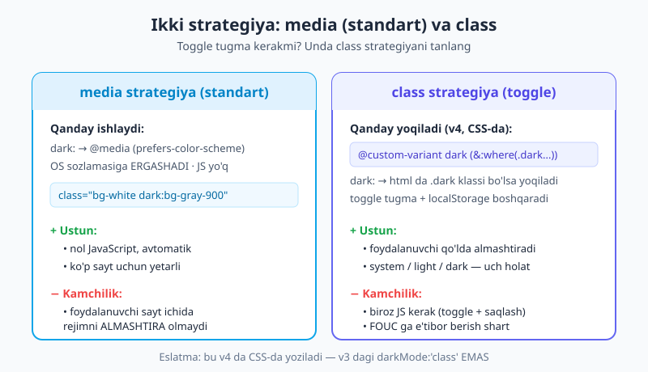
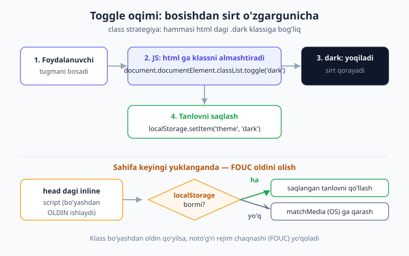
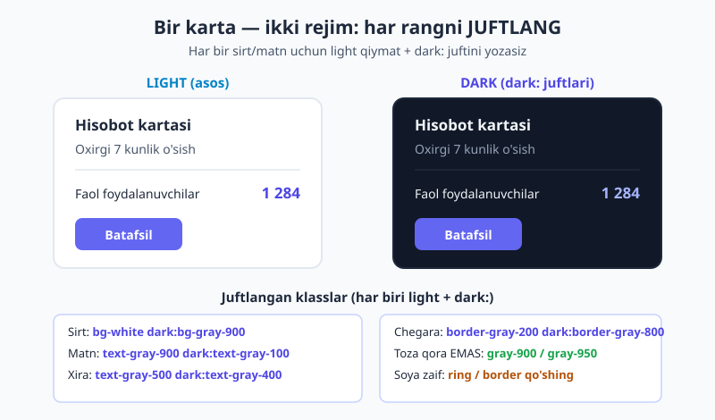

# 16 — Dark mode

[⬅️ Oldingi: 15 — Holat variantlari](./15-holat-variantlari.md) · [🏠 README](./README.md) · [Keyingi: 17 — Transition, transform va animatsiya ➡️](./17-transition-transform-animatsiya.md)

> **Bu bobda:** Saytga dark (qorong'i) rejim qo'shishni boshdan oxir o'rganamiz: ikki strategiya — **media** (OS sozlamasiga ergashadigan standart) va **class** (qo'lda toggle tugmasi) — va ularning farqi; v4 ning kalit jihati — class strategiyani **CSS'da** `@custom-variant dark` bilan yoqish (v3 dagi `darkMode: 'class'` emas); ishlaydigan **toggle tugma** + `localStorage`; **FOUC** (noto'g'ri rejim chaqnashi) muammosi va uning yechimi; dark rejim uchun ranglarni to'g'ri juftlash; oxirida to'liq ishlaydigan navbar + karta.

---

## 16.1 Avval nega? — dark mode shunchaki "ranglarni teskari qilish" emas

Kechqurun telefoningizni ochasiz, ekran ko'zni qamashtiradi. Endi ko'p ilova va sayt **dark rejim** taklif qiladi — oq fon o'rniga to'q kulrang, qora matn o'rniga och kulrang. Ko'zga yengil, batareyaga tejamkor (OLED ekranlarda), va ko'plab foydalanuvchilar buni **kutadi**.

Lekin muhim haqiqat: dark mode — bu shunchaki "oqni qora, qorani oq qilish" emas. Soof qora (`#000`) fon va sof oq matn ko'zni charchatadi, kontrast haddan tashqari keskin bo'ladi. Yaxshi dark dizayn — **kamaytirilgan kontrast, pasaytirilgan to'yinganlik (saturation), va har bir rang juftiga alohida e'tibor**. Tailwind bu ishni juda osonlashtiradi: har bir utility'ga `dark:` variantini qo'shasiz, va u faqat dark rejim faolligida ishlaydi.

```html
<div class="bg-white dark:bg-gray-900 text-gray-900 dark:text-gray-100">
  Salom! Men ikki rejimda ham chiroyli ko'rinaman.
</div>
```

`bg-white` — bu **asos** (light rejim). `dark:bg-gray-900` — dark rejim faol bo'lganda ustiga yoziladi. Aynan shu naqsh — har bir rang uchun light qiymat + `dark:` jufti — butun bobning yuragi.

> 📌 **Atamalar.** **dark rejim (dark mode)** — to'q rangli mavzu. **strategiya** — dark rejim qachon yoqilishini hal qiluvchi mexanizm (OS ga ergashish yoki qo'lda toggle). **FOUC** (Flash Of Unstyled / wrong theme Content) — sahifa ochilganda bir lahza noto'g'ri rejim ko'rinib, keyin to'g'risiga "sakrab" o'tishi.

---

## 16.2 Ikki strategiya va ularning farqi

Tailwind'da `dark:` ni qachon "yoqilgan" deb hisoblashning ikki yo'li bor. Avval ularni tushuning — qaysi birini tanlash butun yondashuvni belgilaydi.



**1) media strategiya — standart (hech narsa sozlamasangiz).** Bu holatda `dark:` to'g'ridan-to'g'ri `@media (prefers-color-scheme: dark)` media query'siga aylanadi. Ya'ni dark rejim foydalanuvchining **operatsion tizimi** sozlamasiga ergashadi: agar telefon/kompyuter dark rejimda bo'lsa — sayt ham dark, light bo'lsa — sayt ham light.

- ✅ **Nol JavaScript.** Hech qanday tugma, hech qanday kod yozmaysiz. Avtomatik ishlaydi.
- ✅ Ko'p oddiy sayt (blog, landing) uchun bu yetarli.
- ❌ Foydalanuvchi **sayt ichida** rejimni almashtira olmaydi. "Men tizimda dark ishlataman, lekin shu saytni light ko'rmoqchiman" — buni qila olmaydi.

**2) class strategiya — qo'lda toggle.** Bu holatda `dark:` foydalanuvchi tomonidan boshqariladigan **`.dark` klassi** `<html>` da bo'lganda yoqiladi. Siz toggle tugma yasaysiz, JS bilan klassni qo'shasiz/olib tashlaysiz.

- ✅ Foydalanuvchi xohlagan paytda almashtiradi (ko'pincha eng yaxshi tajriba — **system / light / dark** uch holatli tanlov).
- ❌ Biroz JS kerak (toggle + `localStorage` ga saqlash) va FOUC ga e'tibor berish shart.

Ko'pchilik real ilovalar **toggle** xohlaydi — shuning uchun class strategiya amalda eng keng tarqalgan. Lekin avval oson media strategiyani ko'rib chiqamiz.

---

## 16.3 media strategiya — eng oson yo'l

Bu uchun **hech narsa sozlamaysiz**. `@import "tailwindcss";` dan keyin to'g'ridan-to'g'ri `dark:` yozaversangiz, u OS sozlamasiga ergashadi.

```html
<div class="rounded-xl border border-gray-200 dark:border-gray-800
            bg-white dark:bg-gray-900 p-6
            text-gray-900 dark:text-gray-100">
  <h3 class="text-lg font-bold">Avtomatik karta</h3>
  <p class="text-gray-500 dark:text-gray-400">
    Bu karta operatsion tizim sozlamangizga qarab o'zini almashtiradi.
  </p>
</div>
```

Sinab ko'rish: operatsion tizimingiz sozlamalaridan "Dark mode" ni yoqing/o'chiring (Windows: Settings → Personalization → Colors; macOS: System Settings → Appearance). Sahifani yangilamasdan ham karta o'zini almashtiradi.

> 💡 **Maslahat.** Agar saytingizga toggle tugma kerak bo'lmasa va siz shunchaki "tizim dark bo'lsa, men ham dark" desangiz — to'xtang, ishingiz tugadi. media strategiya aynan shu. Toggle qo'shishdan oldin u haqiqatan kerakmi, o'ylab ko'ring.

---

## 16.4 class strategiyaga o'tish — v4 ning kalit farqi

Endi toggle tugma kerak bo'lsa, `dark:` ni `.dark` klassiga bog'lashimiz kerak. **Mana shu yerda v4 v3 dan tubdan farq qiladi.**

v3 da buni JavaScript config faylida yozardingiz:

```js
// ❌ Bu — ESKI v3 usuli. v4 da ISHLAMAYDI (tailwind.config.js yo'q).
module.exports = {
  darkMode: 'class',
}
```

v4 da JS config yo'q — hamma narsa CSS'da. `dark` variantini **CSS'da qayta belgilaysiz** (override qilasiz) `@custom-variant` direktivasi bilan:

```css
@import "tailwindcss";

/* dark: endi .dark klassi (yoki uning ichidagi element) bo'lganda yoqiladi */
@custom-variant dark (&:where(.dark, .dark *));
```

Bu bir qator nimani aytadi: "`dark:` variantini shunday qayta belgila — u `.dark` klassi yoki `.dark` ning **ichidagi** istalgan element uchun yoqilsin". `:where(...)` ishlatiladi, chunki u **specificity'ni nolga tenglashtiradi** — ya'ni bu selektor sizning boshqa stillaringiz ustuvorligini buzmaydi.

Endi `dark:bg-gray-900` faqat shunday holatda ishlaydi:

```html
<html class="dark">  <!-- .dark bu yerda → ichdagi hamma dark: yoqiladi -->
  <body>
    <div class="bg-white dark:bg-gray-900">...</div>
  </body>
</html>
```

`<html>` dan `class="dark"` ni olib tashlasangiz — barcha `dark:` o'chadi, sayt yana light bo'ladi. Mana shu klassni JS bilan almashtirib, toggle yasaymiz.

### `data-*` atribut varianti

Ba'zilar klass o'rniga `data-theme="dark"` atributini afzal ko'radi (masalan, bir nechta mavzu bo'lsa). v4 da buni ham bemalol belgilaysiz:

```css
@custom-variant dark (&:where([data-theme=dark], [data-theme=dark] *));
```

Endi `<html data-theme="dark">` dark rejimni yoqadi. Mexanizm bir xil — faqat klass o'rniga atribut.

> 📝 **`@custom-variant` haqida.** Bu direktiva nafaqat `dark` ni qayta belgilash, balki butunlay yangi variantlar yaratish uchun ishlatiladi. To'liq imkoniyatlari [19-bobda](./19-custom-utility-variant.md) ko'riladi; hozir shuni bilsangiz kifoya: class strategiya = CSS'da bitta `@custom-variant dark (...)` qatori.

---

## 16.5 Toggle tugma — ishlaydigan JS

`.dark` klassini almashtiruvchi tugma juda sodda. Mana minimal, to'liq vanilla JS:

```html
<button id="theme-toggle" class="rounded-lg p-2
        bg-gray-200 dark:bg-gray-700
        text-gray-900 dark:text-gray-100">
  🌙 / ☀️
</button>

<script>
  const btn = document.getElementById('theme-toggle');
  btn.addEventListener('click', () => {
    // html elementiga .dark klassini qo'shadi yoki olib tashlaydi
    const isDark = document.documentElement.classList.toggle('dark');
    // tanlovni eslab qolish — keyingi tashrifda ham saqlanadi
    localStorage.setItem('theme', isDark ? 'dark' : 'light');
  });
</script>
```

Bu nima qiladi, qadamma-qadam:



`classList.toggle('dark')` — agar `.dark` bo'lsa olib tashlaydi, bo'lmasa qo'shadi; va natijada klass **bormi yo'qmi** degan `true/false` qaytaradi. Shuni `localStorage` ga yozamiz, toki foydalanuvchi keyingi tashrifda yana tanlashga majbur bo'lmasin.

### Uch holatli toggle: system / light / dark

Eng yaxshi tajriba — uch tanlov: "tizimga ergash", "doim light", "doim dark". Mantiq biroz boyiydi:

```html
<select id="theme-select">
  <option value="system">Tizim</option>
  <option value="light">Light</option>
  <option value="dark">Dark</option>
</select>

<script>
  const select = document.getElementById('theme-select');

  // Joriy tanlovni qo'llaydigan funksiya
  function applyTheme(choice) {
    const systemDark = window.matchMedia('(prefers-color-scheme: dark)').matches;
    const isDark = choice === 'dark' || (choice === 'system' && systemDark);
    document.documentElement.classList.toggle('dark', isDark);
  }

  // Saqlangan tanlov (bo'lmasa 'system')
  const saved = localStorage.getItem('theme') || 'system';
  select.value = saved;
  applyTheme(saved);

  select.addEventListener('change', () => {
    localStorage.setItem('theme', select.value);
    applyTheme(select.value);
  });

  // "system" tanlangan bo'lsa, OS o'zgarsa real vaqtda kuzatib boramiz
  window.matchMedia('(prefers-color-scheme: dark)').addEventListener('change', () => {
    if ((localStorage.getItem('theme') || 'system') === 'system') {
      applyTheme('system');
    }
  });
</script>
```

`classList.toggle('dark', isDark)` — ikkinchi argument `true` bo'lsa klassni **qo'shadi**, `false` bo'lsa **olib tashlaydi** (oddiy toggle emas, majburiy holat). `window.matchMedia('(prefers-color-scheme: dark)')` — OS sozlamasini JS'dan o'qish usuli; `.matches` `true/false` qaytaradi.

---

## 16.6 FOUC — noto'g'ri rejim chaqnashi (ekspert darajadagi muhim mavzu)

Yuqoridagi kod ishlaydi, lekin bir nozik muammosi bor. Tasavvur qiling: foydalanuvchi dark rejimni tanlagan. Sahifani yangilaydi. Bir lahzaga **oq (light) sahifa chaqnaydi**, keyin dark rejimga "sakraydi". Bu — **FOUC**, va u juda bilinadi hamda professional bo'lmagan ko'rinish beradi.

**Nega bunday bo'ladi?** Brauzer HTML'ni yuqoridan pastga o'qiydi. `<body>` ni bo'yab (render qilib) bo'lgandan **keyin**gina pastdagi `<script>` ga yetadi va `.dark` klassini qo'shadi. Ya'ni: avval light fon chiziladi, **keyin** klass qo'shilib dark bo'ladi → chaqnash.

**Yechim:** `.dark` klassini sahifa bo'yalishidan **OLDIN** qo'yish kerak. Buning uchun `<head>` ichiga, hamma narsadan oldin, kichkina **inline** (tashqi fayl emas, to'g'ridan-to'g'ri shu yerda) skript qo'yamiz:

```html
<head>
  <!-- Bu skript <body> bo'yalishidan OLDIN ishlaydi → FOUC yo'q -->
  <script>
    (function () {
      const saved = localStorage.getItem('theme') || 'system';
      const systemDark = window.matchMedia('(prefers-color-scheme: dark)').matches;
      if (saved === 'dark' || (saved === 'system' && systemDark)) {
        document.documentElement.classList.add('dark');
      }
    })();
  </script>

  <link rel="stylesheet" href="/styles.css">
  <!-- ... qolgan head ... -->
</head>
```

Muhim nuqtalar:

- Skript **inline** bo'lishi shart — tashqi `<script src>` yuklanishi kechikadi va chaqnashni qaytaradi.
- U `<head>` da, CSS'dan ham oldin (yoki yonida) turishi kerak, toki `.dark` klassi birinchi bo'yashdan oldin allaqachon `<html>` da bo'lsin.
- Bu skript **faqat** boshlang'ich rejimni o'rnatadi. Tugma/select bilan keyingi almashtirish 16.5 dagi kod ishi.


> ⚠️ **Bu ekspert must-know.** Toggle yasagan ko'p yangi dasturchi bu skriptni unutadi va sayti har yuklanganda chaqnaydi. Toggle bo'lgan joyda no-FOUC inline skripti **deyarli har doim kerak**.

---

## 16.7 Dark rejim uchun dizayn — har rangni juftlang

Endi eng amaliy qism: ranglarni qanday tanlash. Asosiy qoida — **har bir rangli utility uchun `dark:` jufti yozing**. Bittasini unutsangiz (masalan, oq fonda matnga dark rang berdingiz, lekin fonni dark qilmadingiz) — dark rejimda oq matn oq fonda yo'qoladi.



Tavsiya etilgan juftliklar:

| Element | Light (asos) | Dark jufti |
|---|---|---|
| Asosiy sirt (sahifa foni) | `bg-white` | `dark:bg-gray-900` |
| Ko'tarilgan sirt (karta/modal) | `bg-gray-50` / `bg-white` | `dark:bg-gray-800` |
| Asosiy matn | `text-gray-900` | `dark:text-gray-100` |
| Xira (ikkilamchi) matn | `text-gray-500` | `dark:text-gray-400` |
| Chegara | `border-gray-200` | `dark:border-gray-800` |

`gray` o'rniga `slate`, `zinc`, `neutral` kabi boshqa kulrang oilalarni ham ishlatish mumkin — har birining "harorati" (ozgina ko'k/iliq tusi) farq qiladi. Bu shkalalar va soya raqamlari (50→950) [11-bobda](./11-ranglar.md) batafsil ko'rilgan.

### Dark dizaynning oltin qoidalari

- **Sof qora (`#000`) ishlatmang.** `bg-gray-900` yoki `bg-gray-950` ni oling. Sof qora juda keskin va "chuqur teshik" effekti beradi; biroz kulrang tabiiyroq va matnni o'qishni osonlashtiradi.
- **Faqat teskari qilmang.** Light dizaynni shunchaki aylantirish (oq↔qora) yomon natija beradi. Dark rejimda **kontrastni va to'yinganlikni kamaytiring** — yorqin ranglar to'q fonda ko'zni qamashtiradi. Masalan, tugma uchun `bg-indigo-600` o'rniga dark'da `dark:bg-indigo-500` biroz yumshoqroq tushishi mumkin.
- **Soyalar dark'da deyarli ko'rinmaydi.** Light dizaynda chuqurlikni `shadow-*` beradi; to'q fonda soya yo'qoladi. Dark rejimda chuqurlikni **chegara yoki ring** orqali bering: `shadow-lg dark:shadow-none dark:ring-1 dark:ring-gray-700`.
- **Rasmlar ba'zan juda yorqin chiqadi.** To'q fonda oq fonli rasm ko'zni uradi. `dark:brightness-90` bilan biroz pasaytiring: ``.

```html
<!-- Soyani dark'da ring bilan almashtirish -->
<div class="bg-white dark:bg-gray-800
            shadow-lg dark:shadow-none
            dark:ring-1 dark:ring-gray-700
            rounded-xl p-6">
  Chuqurlik: light'da soya, dark'da nozik ring.
</div>
```

---

## 16.8 `dark:` ni boshqa variantlar bilan stacking qilish

`dark:` boshqa variantlar — `hover:`, `focus:`, breakpointlar — bilan **birga qo'yilishi** (stacking) mumkin. Bu [15-bobdagi](./15-holat-variantlari.md) holat variantlari va [responsive bobdagi](./09-responsive-dizayn.md) breakpointlar bilan to'liq mos ishlaydi:

```html
<!-- Dark rejimda, ustiga sichqoncha kelganda boshqa fon -->
<button class="bg-indigo-600 hover:bg-indigo-700
               dark:bg-indigo-500 dark:hover:bg-indigo-400">
  Tugma
</button>

<!-- Dark + focus halqasi -->
<input class="border border-gray-300 dark:border-gray-700
              focus:ring-2 focus:ring-indigo-500
              dark:focus:ring-indigo-400">

<!-- Dark VA faqat desktopda -->
<div class="bg-white dark:md:bg-gray-800">...</div>
```

`dark:hover:bg-indigo-400` ni "dark rejimda VA hover holatida" deb o'qing. Tartib natijaga ta'sir qilmaydi (`dark:hover:` ham, `hover:dark:` ham bir xil), lekin izchillik uchun jamoada bitta tartibni tanlang — odatda `dark:` ni oldinga qo'yish o'qishni osonlashtiradi.

> 💡 **Tipografiya plugini.** Agar `prose` (`@tailwindcss/typography`) ishlatsangiz, dark rejim uchun maxsus `dark:prose-invert` bor — u butun matn blokining ranglarini bir zarbda dark'ga moslaydi: `<article class="prose dark:prose-invert">...</article>`. Buni har bir `<p>`, `<h2>` ga alohida `dark:` yozishdan ko'ra qulay.

---

## 16.9 Theme tokenlari bilan dark mode (18-bobga ko'prik)

Yuqoridagi naqshda kamchilik bor: har bir elementga `bg-white dark:bg-gray-900` deb **ikki marta** yozasiz. Katta loyihada bu zerikarli va xatoga moyil. Yetukroq yondashuv — **semantik CSS o'zgaruvchilari** belgilash, ular `.dark` da o'zgaradi, va siz utility'ni **bir marta** yozasiz:

```css
@import "tailwindcss";
@custom-variant dark (&:where(.dark, .dark *));

@theme {
  --color-surface: #ffffff;          /* light qiymat */
  --color-content: #111827;
}

/* dark rejimda shu o'zgaruvchilar boshqa qiymat oladi */
.dark {
  --color-surface: #111827;
  --color-content: #f1f5f9;
}
```

Endi HTML'da `dark:` yozmasdan, faqat semantik nomni ishlatasiz:

```html
<div class="bg-surface text-content">
  Men har ikki rejimda to'g'ri rang olaman — dark: yozilmagan!
</div>
```

`--color-surface` `@theme` ichida belgilangani uchun Tailwind avtomatik `bg-surface` utility'sini yaratadi. `.dark` ichida o'zgaruvchi qiymatini almashtirsangiz, `bg-surface` o'z-o'zidan dark rangga o'tadi.

> 📝 Bu — **dizayn tizimi** (design token) yondashuvi; uning to'liq quvvati — namespace'lar, `@theme inline`, custom ranglar — [18-bobda](./18-theme-dizayn-tizimi.md) ochiladi. Hozir shuni eslang: katta loyihada `dark:` ni har joyga sochish o'rniga, tokenlarni `.dark` da almashtirish toza va boshqaruvchan.

---

## 16.10 To'liq misol — toggle'li navbar + karta

Endi hammasini birlashtiramiz: class strategiya, no-FOUC skript, toggle tugma, va to'g'ri juftlangan ranglar bilan kichik to'liq sahifa.

```css
/* styles.css */
@import "tailwindcss";
@custom-variant dark (&:where(.dark, .dark *));
```

```html
<!doctype html>
<html lang="uz">
<head>
  <meta charset="utf-8">
  <meta name="viewport" content="width=device-width, initial-scale=1.0">

  <!-- 1) No-FOUC: bo'yashdan oldin rejimni o'rnatadi -->
  <script>
    (function () {
      const saved = localStorage.getItem('theme') || 'system';
      const sysDark = window.matchMedia('(prefers-color-scheme: dark)').matches;
      if (saved === 'dark' || (saved === 'system' && sysDark)) {
        document.documentElement.classList.add('dark');
      }
    })();
  </script>
  <link rel="stylesheet" href="/styles.css">
</head>

<body class="bg-gray-50 dark:bg-gray-900 text-gray-900 dark:text-gray-100">

  <!-- 2) Navbar -->
  <nav class="flex items-center justify-between border-b
              border-gray-200 dark:border-gray-800
              bg-white dark:bg-gray-800 px-6 py-3">
    <span class="text-lg font-bold">Mening saytim</span>
    <button id="theme-toggle"
            class="rounded-lg p-2 text-sm
                   bg-gray-100 dark:bg-gray-700
                   hover:bg-gray-200 dark:hover:bg-gray-600">
      🌙 / ☀️
    </button>
  </nav>

  <!-- 3) Karta -->
  <main class="mx-auto max-w-md p-6">
    <div class="rounded-xl border border-gray-200 dark:border-gray-700
                bg-white dark:bg-gray-800 p-6
                shadow-sm dark:shadow-none">
      <h2 class="text-xl font-bold">Dark rejimga tayyor karta</h2>
      <p class="mt-2 text-gray-500 dark:text-gray-400">
        Har bir rang juftlangan: sirt, matn, xira matn va chegara.
      </p>
      <button class="mt-4 rounded-lg px-4 py-2 font-semibold text-white
                     bg-indigo-600 hover:bg-indigo-700
                     dark:bg-indigo-500 dark:hover:bg-indigo-400">
        Harakatga chaqirish
      </button>
    </div>
  </main>

  <!-- 4) Toggle mantiqi -->
  <script>
    document.getElementById('theme-toggle').addEventListener('click', () => {
      const isDark = document.documentElement.classList.toggle('dark');
      localStorage.setItem('theme', isDark ? 'dark' : 'light');
    });
  </script>
</body>
</html>
```

Bu sahifa: ochilganda chaqnashsiz (no-FOUC), tugma bilan almashadigan, tanlovni eslab qoladigan (localStorage), va har bir rangi juftlangan to'liq ishlaydigan dark-mode'li sahifa. Mana shu naqshni har qanday loyihangizga ko'chiring.

---

## 16.11 Tez-tez uchraydigan xatolar

- **FOUC skriptini unutish.** Toggle bor, lekin har yuklanganda oq chaqnash. Yechim: `<head>` da inline no-FOUC skript (16.6).
- **Bir rangni juftlashni unutish.** `text-gray-900 dark:text-gray-100` yozdingiz, lekin fonni `bg-white` qoldirdingiz — dark'da oq matn oq fonda yo'qoladi. **Har** rangli utility'ga `dark:` jufti kerak.
- **v3 usulini ishlatish.** `tailwind.config.js` da `darkMode: 'class'` yozish — v4 da bu ishlamaydi. To'g'risi: CSS'da `@custom-variant dark (...)`.
- **Sof qora fon.** `dark:bg-black` ko'zni charchatadi. `dark:bg-gray-900` yoki `gray-950` ni oling.
- **Shunchaki teskari qilish.** Light ranglarni aylantirib qo'yish — yorqin va keskin chiqadi. Dark'da kontrast va to'yinganlikni kamaytiring.
- **Faqat bitta rejimda sinash.** Light'da chiroyli, lekin dark'da matn yo'qolgan — chunki dark'ni ko'rmagansiz. DevTools'da yoki tugma bilan **har ikki rejimni** ham sinang.
- **Dark'da kuchli soya.** To'q fonda `shadow-2xl` ko'rinmaydi. Chuqurlikni `dark:ring-1 dark:ring-gray-700` bilan bering.

> 🔭 **Oldinga qarash.** Dark rejimda tugma yoki sirt rangini **silliq** o'tkazish (sakrab emas, animatsiya bilan) saytni yanada professional qiladi — `transition-colors`. Bu o'tishlar va animatsiya [keyingi bobda](./17-transition-transform-animatsiya.md). Ranglarni har joyga `dark:` bilan sochish o'rniga tokenlar bilan markazlashtirish esa [18-bobda](./18-theme-dizayn-tizimi.md).

---

## Mashqlar

**1-mashq.** Bir yangi dasturchi `class="text-gray-900 dark:text-gray-100"` yozdi, lekin dark rejimda matn ko'rinmay qoldi (oq fonda och kulrang). Sababini toping va tuzating.

<details markdown="1"><summary>Yechim</summary>

U **fonni juftlashni unutgan**. `dark:text-gray-100` matnni och qiladi, lekin fon o'zgarmagani uchun (`bg-white` yoki umuman fonsiz) och matn oq/yorug' fonda yo'qoladi. Har rangli utility'ning `dark:` jufti bo'lishi kerak:

```html
<div class="bg-white dark:bg-gray-900 text-gray-900 dark:text-gray-100">...</div>
```

Endi dark rejimda fon ham `gray-900` ga o'tadi, matn esa `gray-100` — kontrast yetarli.

</details>

**2-mashq.** Loyihangizda toggle tugma kerak. v4 da class strategiyani yoqish uchun CSS faylga qanday qator qo'shasiz? Va nega bu v3 dan farq qiladi?

<details markdown="1"><summary>Yechim</summary>

CSS faylda, `@import "tailwindcss";` dan keyin:

```css
@custom-variant dark (&:where(.dark, .dark *));
```

Bu `dark:` ni `<html class="dark">` (yoki uning ichidagi element) bo'lganda yoqadi. v3 dan farqi: v3 da bu `tailwind.config.js` faylida `darkMode: 'class'` deb JavaScript bilan yozilardi. v4 da JS config yo'q — hamma sozlash CSS'da, shuning uchun `@custom-variant` direktivasi orqali.

</details>

**3-mashq.** Quyidagi tugmaga dark rejimda, ustiga sichqoncha kelganda `indigo-400` fon kerak. Klasslarni stacking bilan yozing.

```html
<button class="bg-indigo-600 hover:bg-indigo-700">Saqlash</button>
```

<details markdown="1"><summary>Yechim</summary>

`dark:` va `hover:` ni birga (stacking) yozamiz:

```html
<button class="bg-indigo-600 hover:bg-indigo-700
               dark:bg-indigo-500 dark:hover:bg-indigo-400">
  Saqlash
</button>
```

`dark:hover:bg-indigo-400` — "dark rejimda VA hover holatida". `dark:bg-indigo-500` esa dark rejimdagi oddiy (hover'siz) holat — uni ham qo'shdik, aks holda dark'da hover'siz holatda hamon light'ning `indigo-600` si qolardi.

</details>

**4-mashq (debugging).** Foydalanuvchi dark rejimni tanlagan. Lekin sahifani har yangilaganda bir lahza oq fon chaqnab, keyin dark'ga sakraydi. Bu nima muammosi, nega bo'lyapti va qanday tuzatiladi?

<details markdown="1"><summary>Yechim</summary>

Bu — **FOUC** (noto'g'ri rejim chaqnashi). Sababi: `.dark` klassini qo'yadigan skript sahifa pastida (yoki tashqi faylda), shuning uchun brauzer avval light fonni bo'yab bo'ladi, **keyin** klass qo'shilib dark bo'ladi → chaqnash.

Yechim: `<head>` ichiga, CSS'dan oldin, kichik **inline** skript qo'yib, klassni bo'yashdan **oldin** o'rnatish:

```html
<head>
  <script>
    (function () {
      const saved = localStorage.getItem('theme') || 'system';
      const sysDark = window.matchMedia('(prefers-color-scheme: dark)').matches;
      if (saved === 'dark' || (saved === 'system' && sysDark)) {
        document.documentElement.classList.add('dark');
      }
    })();
  </script>
  <link rel="stylesheet" href="/styles.css">
</head>
```

Skript inline bo'lishi shart (tashqi fayl kechikadi) va `<head>` da, render'dan oldin turishi kerak.

</details>

**5-mashq.** Uch holatli toggle (system / light / dark) yasayapsiz. "system" tanlanganda dark rejimni qachon yoqish kerakligini qanday aniqlaysiz? Mos JS shartini yozing.

<details markdown="1"><summary>Yechim</summary>

"system" tanlanganda OS sozlamasiga ergashish kerak — buni `window.matchMedia` bilan o'qiymiz:

```js
const systemDark = window.matchMedia('(prefers-color-scheme: dark)').matches;
const isDark = choice === 'dark' || (choice === 'system' && systemDark);
document.documentElement.classList.toggle('dark', isDark);
```

Ya'ni dark yoqiladi, agar: tanlov to'g'ridan-to'g'ri `'dark'` bo'lsa, **yoki** tanlov `'system'` bo'lib, OS dark rejimda bo'lsa. `classList.toggle('dark', isDark)` ning ikkinchi argumenti klassni majburiy qo'shadi (`true`) yoki olib tashlaydi (`false`).

</details>

**6-mashq (qiyinroq).** Kartangizda light rejimda `shadow-lg` bilan chuqurlik bor. Lekin dark rejimda soya umuman ko'rinmayapti — karta "yassi". Dark rejimda chuqurlikni qanday qaytarasiz?

<details markdown="1"><summary>Yechim</summary>

To'q fonda soya yo'qoladi — bu normal. Dark rejimda chuqurlikni **soya o'rniga nozik chegara/ring** bilan beramiz. Soyani dark'da o'chirib, ring qo'shamiz:

```html
<div class="rounded-xl bg-white dark:bg-gray-800
            shadow-lg dark:shadow-none
            dark:ring-1 dark:ring-gray-700 p-6">
  ...
</div>
```

`dark:shadow-none` — dark'da ko'rinmaydigan soyani o'chiradi (ortiqcha yuk bo'lmasin). `dark:ring-1 dark:ring-gray-700` — uning o'rniga nozik chegara beradi, bu karta sirtini fondan ajratib turadi va chuqurlik hissi yaratadi.

</details>

---

[⬅️ Oldingi: 15 — Holat variantlari](./15-holat-variantlari.md) · [🏠 README](./README.md) · [Keyingi: 17 — Transition, transform va animatsiya ➡️](./17-transition-transform-animatsiya.md)
