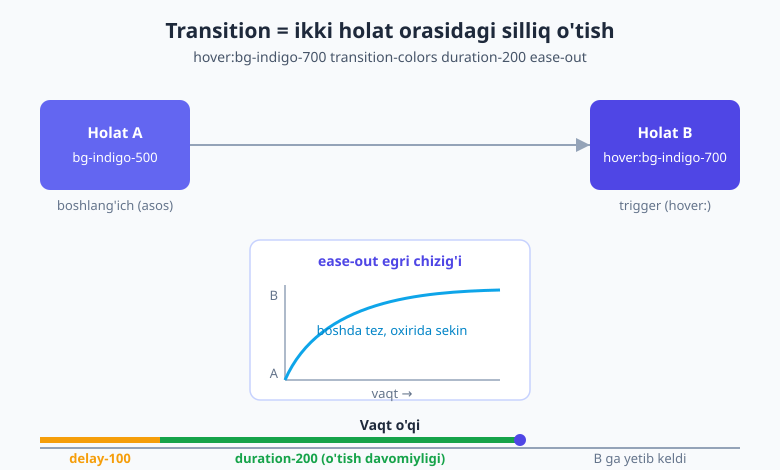
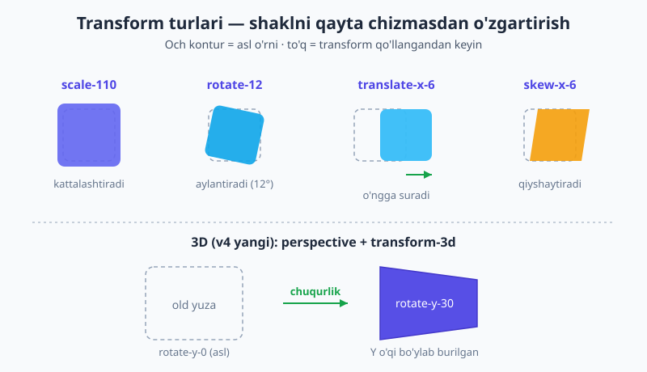
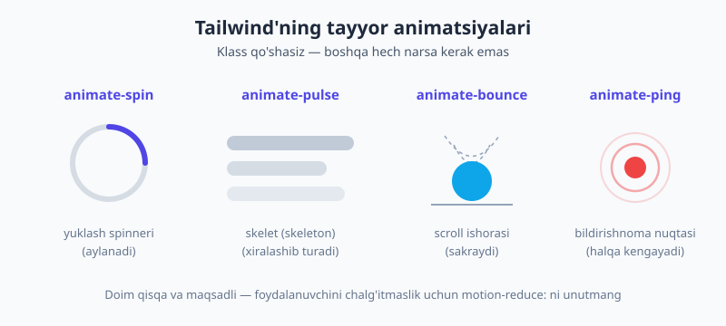

# 17 — Transition, transform va animatsiya

[⬅️ Oldingi: 16 — Dark mode](./16-dark-mode.md) · [🏠 README](./README.md) · [Keyingi: 18 — @theme bilan dizayn tizimi ➡️](./18-theme-dizayn-tizimi.md)

> **Bu bobda:** Sahifaga jonni harakat bilan beramiz. **Transition** (ikki holat orasidagi silliq o'tish: `transition`, `duration-*`, `ease-*`, `delay-*`), **transform** (2D — `scale`/`rotate`/`translate`/`skew`/`origin`, hamda v4'da yangi **3D** — `rotate-x/y/z`, `translate-z`, `perspective-*`, `backface-hidden`), **tayyor animatsiyalar** (`animate-spin`/`pulse`/`bounce`/`ping`), **custom animatsiya** (`@theme` + `@keyframes`), elementlar paydo bo'lishi uchun **`@starting-style`** (`starting:` varianti), va eng muhimi — **accessibility** (`motion-reduce:`) bilan unumdorlik (GPU). Hover-lift karta, animatsiyali tugma, spinner, skeleton, flip-karta va xato bildiruvchi "wiggle" — barchasini quramiz.

---

## 17.1 Avval nega? — harakat ma'no tashiydi

Tugmaga sichqonchani olib borasiz, rang **birdan** sakrab o'zgaradi — biroz qo'pol, to'g'rimi? Endi xuddi shu rang yarim soniyada **silliq** o'zgarsin: ko'z uni "tugma menga javob berdi" deb o'qiydi. Mana shu farq — interfeysni qimmat va ishonchli his qildiradigan narsa.

Harakat bezak emas. U **maydon e'tiborini boshqaradi** ("bu yerga qara"), **sababiy bog'liqlikni** ko'rsatadi ("siz bosgani uchun bu ochildi"), va **kutishni yumshatadi** (spinner: "tizim ishlayapti, qotmadi"). Lekin haddan oshsa — sahifa o'yinchoqqa aylanadi va foydalanuvchini charchatadi. Shuning uchun butun bob davomida ikki o'lchovni yodda tutamiz: **qisqa** (UI uchun 150–300ms) va **hurmatli** (kim harakatni o'chirgan bo'lsa, unga tinch sahifa).

Toza CSS'da bularning hammasini `transition`, `transform` xossalari va `@keyframes` bilan yozardingiz — buni [HTML & CSS kitobining transitions/transforms bobida](../html-css/18-transitions-transforms-animations.md) ko'rgansiz. Tailwind hech narsani o'ylab topmaydi: u xuddi shu CSS xossalarini **utility klasslarga** o'rab beradi.

> 📌 **Atamalar.** **transition** — element bir holatdan ikkinchisiga o'tganda o'zgarishni **vaqt ichida** interpolatsiya qilish. **transform** — elementni qayta chizmasdan vizual o'zgartirish (kattalashtirish, burish, surish). **animation** — `@keyframes` orqali belgilangan, o'zidan-o'zi (trigger kutmasdan) takrorlanadigan harakat. **easing** — o'tish tezligining vaqt bo'yicha "egri chizig'i" (tekismi, sekin boshlanadimi va h.k.).

---

## 17.2 Transition — silliq o'tishning retsepti

Transition o'zicha hech narsa qilmaydi. U faqat: "**agar** shu element biror xossasi o'zgarsa, uni birdan emas, vaqt ichida o'zgartir" deydi. Demak har doim uchta bo'lak kerak:

1. **Asos holat** — element odatdagi ko'rinishi.
2. **O'zgargan holat** — odatda bir variant: `hover:`, `focus:`, `group-hover:`, `data-[state=open]:` ([15-bobdagi holat variantlari](./15-holat-variantlari.md)).
3. **`transition`** — o'zgarishni animatsiyaga aylantiruvchi "kalit".

```html
<button class="bg-indigo-500 text-white px-4 py-2 rounded-lg
               transition-colors duration-200 ease-out
               hover:bg-indigo-700">
  Bos meni
</button>
```

`bg-indigo-500` — asos. `hover:bg-indigo-700` — o'zgargan holat. `transition-colors duration-200 ease-out` — orani 200ms da, ease-out egri chizig'i bilan to'ldiradi. Agar `transition-colors` ni olib tashlasangiz, rang baribir o'zgaradi — lekin **birdan**, silliqliksiz.

Quyidagi rasm shu retseptni vaqt o'qida ko'rsatadi — A holat, B holat va orani to'ldiruvchi `duration`/`delay`/`easing`:



### Qaysi xossani animatsiya qilamiz?

| Utility | Nimani o'tkazadi |
|---|---|
| `transition` | eng keng tarqalganlar: rang, fon, border, opacity, shadow, transform, filter (asosiy to'plam) |
| `transition-colors` | faqat rang xossalari (text/bg/border) |
| `transition-opacity` | faqat shaffoflik |
| `transition-transform` | faqat `transform` (scale/rotate/translate...) |
| `transition-shadow` | faqat soya |
| `transition-all` | **hamma** o'zgaruvchi xossa — ehtiyot bo'ling (pastga qarang) |
| `transition-none` | o'tishni butunlay o'chiradi |

> ⚠️ **`transition-all` — tuzoq.** U *hamma* xossani kuzatadi, shu jumladan siz xohlamaganlarini (masalan, layout o'zgargani sababli kelib chiqqan kenglik). Bu kutilmagan, sakrab-sakrab harakatlarga (jank) va keraksiz hisob-kitobga olib keladi. **Faqat kerakli xossani** tanlang: rang o'zgaryaptimi — `transition-colors`, transform o'zgaryaptimi — `transition-transform`. `transition-all` ni faqat haqiqatan ko'p narsa birga o'zgarganda, ataylab oling.

### Davomiylik, easing, kechikish

```html
<div class="transition-transform duration-300 ease-in-out delay-100 hover:scale-105">...</div>
```

- **`duration-*`** — o'tish necha millisekund: `duration-150`, `duration-200`, `duration-300`, `duration-500`...
- **`ease-*`** — tezlik egri chizig'i: `ease-linear` (bir tekis), `ease-in` (sekin boshlanadi), `ease-out` (sekin tugaydi — UI uchun eng tabiiy), `ease-in-out` (ikki uchi sekin).
- **`delay-*`** — boshlashdan oldingi pauza: `delay-100`, `delay-300`...

> 💡 **Amaliy qoida.** Interfeys o'tishlari uchun **`duration-150`–`duration-300`** va **`ease-out`** deyarli har doim to'g'ri tanlov. Element foydalanuvchiga *javob* berayotgani uchun tez tugashi (ease-out) tabiiy his qilinadi. 500ms+ o'tishlar UI'ni "og'ir" qiladi — ularni faqat katta, ataylab effektlar uchun saqlang.

---

## 17.3 Transform 2D — surish, burish, kattalashtirish

Transform elementni **qayta hisoblamasdan** (layoutga tegmasdan) vizual o'zgartiradi — shuning uchun u arzon va silliq (buni 17.8'da ko'ramiz). Asosiy 2D utility'lar:

| Guruh | Misollar | Ma'nosi |
|---|---|---|
| `scale-*` | `scale-95`, `scale-105`, `scale-110`, `scale-x-50` | kattalashtirish/kichraytirish |
| `rotate-*` | `rotate-3`, `rotate-45`, `-rotate-12` | burish (daraja) |
| `translate-*` | `translate-x-4`, `-translate-y-2`, `translate-x-1/2` | surish |
| `skew-*` | `skew-x-6`, `skew-y-3` | qiyshaytirish |
| `origin-*` | `origin-center`, `origin-top-left` | transform tayanch nuqtasi |

Quyidagi rasm bitta kvadratni va uning to'rt xil transform qilingan ko'rinishini (asl o'rni soya bilan) yonma-yon qo'yadi:



### Eng mashhur naqsh: hover-lift karta

Kartani ustiga sichqoncha kelganda biroz **ko'tarish** + soyani kuchaytirish — bu deyarli har bir zamonaviy saytda bor:

```html
<article class="rounded-xl bg-white p-6 shadow
                transition hover:-translate-y-1 hover:shadow-lg">
  <h3 class="font-bold">Karta sarlavhasi</h3>
  <p class="text-slate-600">Ustiga keling — yengilgina ko'tariladi.</p>
</article>
```

`hover:-translate-y-1` — 0.25rem yuqoriga suradi (manfiy Y = yuqori). `hover:shadow-lg` — balandlik hissi uchun soyani kattalashtiradi ([14-bobdagi elevation](./14-soya-filter-mask.md) g'oyasi). `transition` ikkalasini ham silliq qiladi.

### Markazlash eslatmasi

Transform'ning eng ko'p ishlatiladigan amaliy holatlaridan biri — markazlash. `left-1/2` elementni chap chetidan markazga suradi, keyin `-translate-x-1/2` uni o'z eni yarmiga teskari surib, aniq markazga qo'yadi:

```html
<div class="absolute left-1/2 top-1/2 -translate-x-1/2 -translate-y-1/2">Markazda</div>
```

### Bosilganda kichrayuvchi tugma

`active:` varianti bilan tugma bosilganda biroz "ezilsa", tugma jismoniy his qilinadi:

```html
<button class="rounded-lg bg-sky-500 px-4 py-2 text-white
               transition active:scale-95 hover:bg-sky-600">
  Bos
</button>
```

---

## 17.4 Transform 3D — v4'dagi yangi imkoniyat

v4 transformlarning uchinchi o'lchamini ham klasslarga olib chiqdi. 3D ishlashi uchun **ota-element**da ikki narsa kerak:

1. **`perspective-*`** — chuqurlik kuchini beradi (`perspective-near`, `perspective-distant`, yoki `perspective-[800px]`). Usiz 3D burilish "yassi" ko'rinadi.
2. Bola elementda **`transform-3d`** — 3D transformlarni yoqadi.

So'ng bola elementda 3D utility'lar:

| Utility | Ma'nosi |
|---|---|
| `rotate-x-*`, `rotate-y-*`, `rotate-z-*` | mos o'q bo'ylab burish |
| `translate-z-*` | chuqurlik bo'ylab surish (yaqin/uzoq) |
| `scale-z-*` | chuqurlik bo'yicha masshtab |
| `perspective-origin-*` | qarash nuqtasi |
| `backface-hidden` / `backface-visible` | element teskari aylanganda orqa yuzasini yashirish/ko'rsatish |

Rasmdagi pastki qism aynan `rotate-y` bilan Y o'qi bo'ylab burilgan kartani ko'rsatadi.

### Flip-karta (konseptual)

Klassik effekt: karta hover'da ag'darilib, orqa tomonini ko'rsatadi. G'oya — old va orqa yuzlarni bir-birining ustiga qo'yib, biri `rotate-y-180` qilingan, ikkalasi ham `backface-hidden`. Ota-elementda perspective, hover'da butun ichki o'ramani ag'daramiz:

```html
<!-- Ota: perspective beradi -->
<div class="group [perspective:1000px] h-56 w-44">
  <!-- O'ram: hover'da 180° ag'dariladi -->
  <div class="relative h-full w-full transition-transform duration-500 transform-3d
              group-hover:rotate-y-180">
    <!-- Old yuza -->
    <div class="absolute inset-0 backface-hidden rounded-xl bg-indigo-500 grid place-items-center text-white">
      Old
    </div>
    <!-- Orqa yuza: boshidanoq 180° aylantirilgan -->
    <div class="absolute inset-0 backface-hidden rotate-y-180 rounded-xl bg-slate-800 grid place-items-center text-white">
      Orqa
    </div>
  </div>
</div>
```

`backface-hidden` bo'lmasa, har ikki yuza bir vaqtda ko'rinib, effekt buziladi. `group-hover:` — [15-bobdagi `group`](./15-holat-variantlari.md) naqshi: ota ustiga kelinganda ichki element o'zgaradi.

> 📌 Bu yerda `[perspective:1000px]` — arbitrary xossa. Tailwind'ning tayyor `perspective-distant`/`perspective-near` shkalasini ham ishlatsangiz bo'ladi; aniq qiymat kerak bo'lsa, kvadrat qavs ([03-bobda](./03-utility-first-ish-jarayoni.md) ko'rgan) qulay.

---

## 17.5 Tayyor animatsiyalar — bitta klass, tayyor harakat

Ba'zi harakatlar shunchalik ko'p kerakki, Tailwind ularni tayyor beradi. Trigger ham, `@keyframes` ham kerak emas — klassni qo'shasiz, element o'zi harakatlanadi:

| Klass | Nima qiladi | Qachon |
|---|---|---|
| `animate-spin` | doimiy aylanadi | yuklash spinneri |
| `animate-pulse` | xiralashib-yorishadi | skeleton (yuklanayotgan kontent o'rni) |
| `animate-bounce` | yuqoriga-pastga sakraydi | "pastga aylantir" ishorasi |
| `animate-ping` | halqa kengayib o'chadi | bildirishnoma nuqtasi |
| `animate-none` | animatsiyani o'chiradi | shartli holatda to'xtatish |



### Spinner

```html
<svg class="animate-spin h-6 w-6 text-indigo-600" viewBox="0 0 24 24" fill="none">
  <circle class="opacity-25" cx="12" cy="12" r="10" stroke="currentColor" stroke-width="4"/>
  <path class="opacity-75" fill="currentColor" d="M4 12a8 8 0 018-8v4a4 4 0 00-4 4H4z"/>
</svg>
```

Aylananing bir qismini xira (`opacity-25`), boshqasini to'q (`opacity-75`) qilib, `animate-spin` butunini aylantiradi — natijada "yuklash" doirasi.

### Skeleton (skelet) yuklagich

Kontent kelguncha uning **o'rnini** xira to'rtburchaklar bilan to'ldirish — bo'sh ekrandan ko'ra ko'p hurmatli:

```html
<div class="space-y-3">
  <div class="h-4 w-3/4 rounded bg-slate-200 animate-pulse"></div>
  <div class="h-4 w-1/2 rounded bg-slate-200 animate-pulse"></div>
  <div class="h-32 w-full rounded-lg bg-slate-200 animate-pulse"></div>
</div>
```

### Bildirishnoma nuqtasi

`animate-ping` ni bitta nuqta ustida joylab, "yangi narsa bor" hissi beriladi:

```html
<span class="relative inline-flex h-3 w-3">
  <span class="absolute inline-flex h-full w-full rounded-full bg-red-400 opacity-75 animate-ping"></span>
  <span class="relative inline-flex h-3 w-3 rounded-full bg-red-500"></span>
</span>
```

---

## 17.6 Custom animatsiya — o'zingizning harakatingiz (v4 CSS-first)

Tayyorlari yetmasa? v4'da custom animatsiyani **CSS'da** belgilaysiz: `@theme` ichida `--animate-*` o'zgaruvchisi + `@keyframes`. Tailwind avtomatik mos `animate-*` utility yaratadi.

```css
@import "tailwindcss";

@theme {
  --animate-wiggle: wiggle 0.4s ease-in-out infinite;
}

@keyframes wiggle {
  0%, 100% { transform: rotate(-3deg); }
  50%      { transform: rotate(3deg); }
}
```

Endi HTML'da tayyor:

```html
<!-- Xato bo'lganda input chayqaladi -->
<input class="border rounded px-3 py-2 animate-wiggle" />
```

Xuddi shunday, **custom easing** ham qo'shasiz:

```css
@theme {
  --ease-fluid: cubic-bezier(0.3, 0, 0, 1);
}
```

```html
<div class="transition-transform duration-300 ease-fluid hover:scale-105">...</div>
```

> 📝 **v3 dan farq.** v3 da custom animatsiya/easing'ni `tailwind.config.js` dagi `theme.extend.animation` va `keyframes` obyektlarida JavaScript bilan yozardingiz. v4 da JS config yo'q — hammasi CSS'dagi `@theme` + `@keyframes`. Bu tizim to'liq [18-bobda](./18-theme-dizayn-tizimi.md) ochiladi; hozir shuni bilsangiz kifoya: `--animate-<nom>` o'zgaruvchisi `animate-<nom>` utility'sini yaratadi.

---

## 17.7 Paydo bo'lish va `@starting-style` — ochilayotgan elementlar

Hover'da rangni o'tkazish oson, chunki element **allaqachon sahifada**. Ammo menyu, dropdown yoki dialog **yangi paydo bo'lganda** silliq kirishi qiyinroq: brauzerda boshlang'ich holat yo'q edi — qaysi "A"dan "B"ga o'tamiz?

Buni zamonaviy CSS `@starting-style` bilan hal qiladi, va v4 unga **`starting:`** variantini beradi: "element birinchi marta render bo'layotganda mana shu boshlang'ich holatdan boshla". Display o'zgarishlari uchun esa **`transition-discrete`** kerak (chunki `display` odatda animatsiya qilinmaydi).

```html
<!-- popover/dialog ochilganda silliq kirishi -->
<div popover class="opacity-100 transition-discrete transition
                    starting:open:opacity-0">
  Men silliq paydo bo'laman
</div>
```

G'oya: oddiy holatda element `opacity-100`; `starting:` varianti esa "birinchi ko'rinish onida `opacity-0`dan boshla" deydi — natijada element yo'qdan emas, **xiralikdan** silliq chiqadi. `transition-discrete` `display`/`overlay` kabi diskret o'zgarishlarni ham o'tishga qo'shadi.

> 💡 Bu juda yangi platforma imkoniyati va asosan native `popover`/`<dialog>` bilan birga porlaydi. Hozircha shu konseptni bilib qo'ying: **hover = mavjud element**, **`starting:` = paydo bo'layotgan element**.

---

## 17.8 Accessibility va unumdorlik — buni hech qachon unutmang

### `prefers-reduced-motion` — foydalanuvchiga hurmat

Ba'zi odamlar harakatdan bosh og'rishi, ko'ngil aynishi yoki vestibulyar buzilish his qiladi. Ular operatsion tizimda "harakatni kamaytir" sozlamasini yoqadi. Sizning vazifangiz — buni hurmat qilish. Tailwind ikki variant beradi:

- **`motion-reduce:`** — foydalanuvchi harakatni kamaytirishni so'raganda qo'llanadi.
- **`motion-safe:`** — faqat harakat **ruxsat etilgan** bo'lsa qo'llanadi.

```html
<!-- Harakat o'chirilgan bo'lsa, transition yo'q -->
<button class="transition hover:scale-105 motion-reduce:transition-none motion-reduce:hover:scale-100">
  Hurmatli tugma
</button>

<!-- Yoki: animatsiyani faqat ruxsat berilganda yoq -->
<div class="motion-safe:animate-bounce">⬇️</div>
```

> ⚠️ **Bu ixtiyoriy emas.** Hammabop (accessible) interfeys — professional ish belgisi. Diqqatni tortuvchi har bir doimiy animatsiya (`animate-bounce`, `animate-pulse`, parallax) uchun `motion-reduce:` bilan tinch muqobilni o'ylang. Eng oddiy qoida: harakatni `motion-safe:` ostiga qo'yib, asosiy holatni harakatsiz qoldiring.

### Unumdorlik — arzon va qimmat xossalar

Hamma xossa bir xil arzon emas. Brauzer uchun eng arzoni — **`transform` va `opacity`**: ular GPU'da, layoutni qayta hisoblamasdan ishlaydi. **`width`, `height`, `top`, `margin`** kabi layout xossalarini animatsiya qilish esa qimmat — har kadrda butun sahifa qayta o'lchanadi (jank sababi).

> 💡 **Oltin qoida.** Harakatni iloji boricha **`transform` va `opacity`** orqali qiling. "Kichraytirmoqchimisiz" — `width` emas, `scale`. "Surmoqchimisiz" — `margin`/`top` emas, `translate`. Kerak bo'lsa `transform-gpu` bilan GPU'ga majburlash yoki `will-change-transform` bilan brauzerni ogohlantirish mumkin — lekin **kam ishlating**: `will-change` ni hamma joyga sochsangiz, foydadan ko'ra zarari ko'p.

---

## 17.9 Hammasini birga — "wiggle" bilan xato beruvchi forma

O'rgangan bo'laklarni bitta amaliy misolga jamlaymiz: input noto'g'ri to'ldirilganda chayqaladi, tugma bosilganda ezilsa va yuborilayotganda spinner ko'rsatsa — barchasi harakatni hurmat qilgan holda:

```html
<form class="space-y-4">
  <!-- data-[invalid] holatda chayqaladi (custom wiggle, 17.6) -->
  <input
    data-invalid
    class="w-full rounded-lg border px-3 py-2
           transition-colors focus:border-indigo-500
           data-[invalid]:border-red-500
           data-[invalid]:motion-safe:animate-wiggle"
    placeholder="Email"
  />

  <!-- bosilganda ezilib, hover'da to'qlashadi -->
  <button class="flex items-center gap-2 rounded-lg bg-indigo-600 px-4 py-2 text-white
                 transition active:scale-95 hover:bg-indigo-700
                 motion-reduce:active:scale-100">
    <svg class="animate-spin h-4 w-4" viewBox="0 0 24 24" fill="none">
      <circle class="opacity-25" cx="12" cy="12" r="10" stroke="currentColor" stroke-width="4"/>
      <path class="opacity-75" fill="currentColor" d="M4 12a8 8 0 018-8v4a4 4 0 00-4 4H4z"/>
    </svg>
    Yuborilmoqda...
  </button>
</form>
```

E'tibor bering:

- `transition-colors` — input border rangi silliq o'zgaradi (faqat rang, `transition-all` emas).
- `data-[invalid]:motion-safe:animate-wiggle` — xato bo'lsa **va** harakat ruxsat etilgan bo'lsa chayqaladi.
- `active:scale-95` — tugma bosilganda jismoniy javob; `motion-reduce:active:scale-100` uni harakatsiz holatda bekor qiladi.
- `animate-spin` — yuklash hissi.

---

## 17.10 Tez-tez uchraydigan xatolar

- **`transition` ni unutish.** Faqat `hover:scale-105` yozsangiz, o'zgarish **birdan** bo'ladi. Silliqlik uchun `transition` (yoki `transition-transform`) shart.
- **`transition-all` ni ko'r-ko'rona ishlatish.** Jank va keraksiz hisob sababi. Kerakli xossani tanlang.
- **Qimmat xossalarni animatsiya qilish.** `width`/`height`/`top` o'rniga `scale`/`translate` ishlating — ular GPU'da arzon.
- **`prefers-reduced-motion` ni unutish.** Doimiy harakat (`animate-bounce`/`pulse`) qo'yib, `motion-reduce:` muqobilini bermaslik — accessibility xatosi.
- **Juda uzun davomiylik.** 500ms+ UI o'tishlari "og'ir" his qilinadi. UI uchun 150–300ms saqlang.
- **3D'da perspective'ni unutish.** `rotate-y-*` "yassi" ko'rinsa, ehtimol ota-elementda `perspective-*` (va bolada `transform-3d`) yo'q.

> 🔭 **Oldinga qarash.** Bu bobda `--animate-wiggle` va `--ease-fluid` kabi custom token'larni ishlatdik, lekin ularning ortidagi to'liq tizimga to'xtalmadik. Custom rang, spacing, shrift, breakpoint — barcha **dizayn token'larini** `@theme` ichida boshqarish keyingi bobning mavzusi: [18 — `@theme` bilan dizayn tizimi](./18-theme-dizayn-tizimi.md).

---

## Mashqlar

**1-mashq.** Quyidagi tugmada rang o'zgaradi, lekin **birdan**, silliqliksiz. Sababini toping va tuzating:

```html
<button class="bg-emerald-500 hover:bg-emerald-700 px-4 py-2 text-white rounded">Saqlash</button>
```

<details markdown="1"><summary>Yechim</summary>

`transition` (yoki aniqrog'i `transition-colors`) yo'q — shuning uchun brauzer rangni interpolatsiya qilmaydi, balki birdan almashtiradi. Trigger (`hover:`) va asos bor, lekin "kalit" yetishmaydi:

```html
<button class="bg-emerald-500 hover:bg-emerald-700 px-4 py-2 text-white rounded
               transition-colors duration-200 ease-out">Saqlash</button>
```

Endi rang 200ms da silliq o'tadi. **Qoida:** asos + variant + `transition` — uchtasi ham bo'lishi shart.

</details>

**2-mashq.** Hover-lift karta yozing: ustiga kelinganda karta `0.25rem` yuqoriga ko'tarilsin va soyasi `shadow` dan `shadow-xl` ga o'tsin, hammasi silliq.

<details markdown="1"><summary>Yechim</summary>

```html
<article class="rounded-xl bg-white p-6 shadow
                transition hover:-translate-y-1 hover:shadow-xl">
  ...
</article>
```

`hover:-translate-y-1` — manfiy Y = yuqoriga `0.25rem`. `hover:shadow-xl` — soyani kuchaytiradi. `transition` ikkalasini ham o'tkazadi. (Faqat transform o'tsa kifoya bo'lsa, `transition-transform` aniqroq, lekin bu yerda soya ham o'zgarayotgani uchun umumiy `transition` mos.)

</details>

**3-mashq.** Tugma bosilganda biroz "ezilsin" (kichraysin), hover'da to'qroq rangga o'tsin — silliq holatda. Klasslarni yozing.

<details markdown="1"><summary>Yechim</summary>

```html
<button class="rounded-lg bg-sky-500 px-4 py-2 text-white
               transition active:scale-95 hover:bg-sky-600">
  Bos
</button>
```

`active:scale-95` — bosilgan paytda 95% gacha kichrayadi (jismoniy "bosildi" hissi). `hover:bg-sky-600` — to'qroq fon. `transition` ham rangni, ham masshtabni silliq qiladi.

</details>

**4-mashq.** `animate-bounce` bilan "pastga aylantir" strelkasi qo'ymoqchisiz, lekin u harakatni o'chirgan foydalanuvchilarni bezovta qilmasin. To'g'ri klasslarni yozing.

<details markdown="1"><summary>Yechim</summary>

```html
<div class="motion-safe:animate-bounce">⬇️</div>
```

`motion-safe:` — animatsiya faqat foydalanuvchi harakatga *ruxsat bergan* bo'lsa qo'llanadi. Harakat kamaytirilgan bo'lsa, strelka qimirlamaydi, lekin baribir ko'rinadi. (Muqobil: `animate-bounce motion-reduce:animate-none` — bu ham to'g'ri, lekin `motion-safe:` toza, chunki standartni harakatsiz qoldiradi.)

</details>

**5-mashq (custom).** Xato bo'lganda input chayqaladigan `wiggle` animatsiyasini v4 usulida yarating: 0.4 soniya, `ease-in-out`, cheksiz, `-3deg` dan `3deg` gacha. So'ng uni inputga ulang.

<details markdown="1"><summary>Yechim</summary>

CSS faylda `@theme` + `@keyframes`:

```css
@import "tailwindcss";

@theme {
  --animate-wiggle: wiggle 0.4s ease-in-out infinite;
}

@keyframes wiggle {
  0%, 100% { transform: rotate(-3deg); }
  50%      { transform: rotate(3deg); }
}
```

HTML'da yangi `animate-wiggle` utility tayyor:

```html
<input class="border rounded px-3 py-2 animate-wiggle" />
```

`--animate-wiggle` o'zgaruvchisi avtomatik `animate-wiggle` utility'sini yaratadi. v3 da bu `tailwind.config.js` dagi `keyframes` + `animation` orqali qilinardi.

</details>

**6-mashq (debugging).** Quyidagi 3D flip-karta "yassi" ko'rinmoqda — orqa tomon hech qachon chiroyli aylanmaydi, ikkala yuza birga ko'rinadi. Ikki xatoni toping.

```html
<div class="group h-56 w-44">
  <div class="relative h-full w-full transition-transform duration-500 group-hover:rotate-y-180">
    <div class="absolute inset-0 rounded-xl bg-indigo-500">Old</div>
    <div class="absolute inset-0 rotate-y-180 rounded-xl bg-slate-800">Orqa</div>
  </div>
</div>
```

<details markdown="1"><summary>Yechim</summary>

Ikki narsa yetishmaydi:

1. **Perspective + `transform-3d` yo'q.** 3D burilish chuqurliksiz "yassi" ko'rinadi. Ota-elementga perspective (`[perspective:1000px]` yoki `perspective-distant`), aylanuvchi o'ramga `transform-3d` kerak.
2. **`backface-hidden` yo'q.** Usiz har ikki yuza bir vaqtda ko'rinib, effekt buziladi. Har bir yuzaga `backface-hidden` qo'shish kerak.

Tuzatilgan:

```html
<div class="group h-56 w-44 [perspective:1000px]">
  <div class="relative h-full w-full transition-transform duration-500 transform-3d group-hover:rotate-y-180">
    <div class="absolute inset-0 backface-hidden rounded-xl bg-indigo-500">Old</div>
    <div class="absolute inset-0 backface-hidden rotate-y-180 rounded-xl bg-slate-800">Orqa</div>
  </div>
</div>
```

</details>

---

[⬅️ Oldingi: 16 — Dark mode](./16-dark-mode.md) · [🏠 README](./README.md) · [Keyingi: 18 — @theme bilan dizayn tizimi ➡️](./18-theme-dizayn-tizimi.md)
