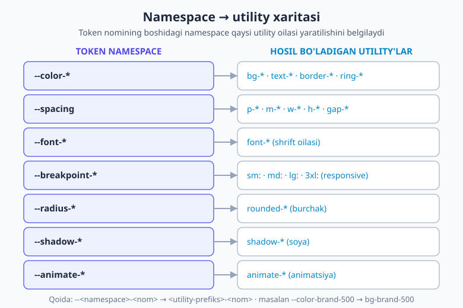
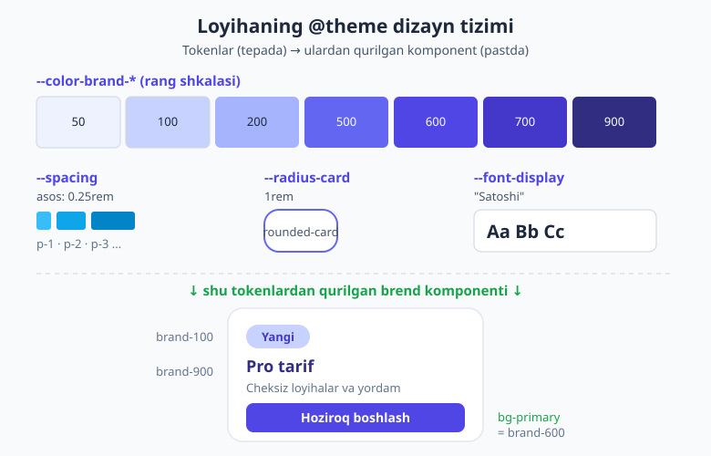

# 18 — @theme bilan dizayn tizimi

[⬅️ Oldingi: 17 — Transition, transform va animatsiya](./17-transition-transform-animatsiya.md) · [🏠 README](./README.md) · [Keyingi: 19 — Custom utility va variant yaratish ➡️](./19-custom-utility-variant.md)

> **Bu bobda:** Tailwind'ni "tayyor utility'lar to'plami"dan **o'zingiz boshqaradigan dizayn tizimi**ga aylantiramiz. v4 ning yuragi bo'lgan `@theme` blokini ochamiz: dizayn **tokenlari** (ranglar, spacing, shrift, radius, soya, breakpoint) qanday qilib bir vaqtning o'zida ham utility klass, ham haqiqiy CSS o'zgaruvchisi yaratishini, **namespace** (nom maydoni) tizimini, token **qo'shish / ustiga yozish / o'chirish** usullarini, `@theme inline` ning qachon kerakligini, **semantik tokenlar** bilan dark-mode'ga moslashuvchi `bg-surface`/`bg-primary` naqshini va to'liq bir brend temasini noldan qurishni o'rganasiz.

---

## 18.1 Avval nega? — utility'lar qayerdan keladi?

To'xtab, bir savol bering: `bg-blue-500` klassi qayerdan paydo bo'ldi? `p-4` dagi `4`, `rounded-lg` dagi `lg`, `text-2xl` dagi `2xl` — bularni kim belgilab qo'ygan?

Javob: **dizayn tokenlari**. Tailwind'ning butun utility to'plami bitta **token jadvalidan** generatsiya qilinadi. `blue-500` degan rang token bo'lgani uchun `bg-blue-500`, `text-blue-500`, `border-blue-500` mavjud. Agar token bo'lmasa — klass ham bo'lmaydi.

Mana shu yerda eng kuchli g'oya yashiringan: **tokenlarni o'zgartirsangiz, butun dizayn tilingiz o'zgaradi.** Brend rangingizni token qilib qo'shsangiz — `bg-brand-500` darrov ishlaydi. Standart `blue-500` ni o'zgartirsangiz — saytdagi har bir ko'k joy bir vaqtda yangilanadi. Spacing asosini o'zgartirsangiz — barcha masofalar mutanosib qayta o'lchanadi.

> 💡 **Analogiya.** Token jadvali — bu rassomning **palitrasi**. Tailwind utility'lari — palitradagi har bir rangga tegishli mo'yqalamlar. Palitrani almashtirsangiz, hamma mo'yqalam yangi rangda chizadi. Siz har safar yangi rang aralashtirmaysiz — palitradan tanlaysiz. Dizayn tizimi aynan shu: **cheklangan, ohangdosh tanlovlar to'plami.**

Bu falsafa yangi emas — [spacing scale bobida](./04-spacing-sizing.md) `4` ning karralari, [ranglar bobida](./11-ranglar.md) rang shkalasi bilan allaqachon uchratgansiz. Bu bob esa shu tizimni **o'zingizniki** qilishni o'rgatadi.

> 📝 **v3 dan farq (bir martalik eslatma, keyin unutamiz).** Tailwind v3 da tokenlarni `tailwind.config.js` fayldagi `theme.extend` obyektida JavaScript bilan sozlardingiz. **v4 da JS config yo'q** — hamma tokenlar **CSS** ichida, `@theme` blokida yashaydi. Agar internetdan `theme: { extend: { colors: ... } }` ko'rsangiz — bu eski v3 yo'li. Bu kitobning yo'li — `@theme`.

---

## 18.2 `@theme` qanday ishlaydi? — bitta blok, ikkita natija

`@theme` — CSS'ning maxsus bloki. Uning ichiga **CSS custom property** (o'zgaruvchi) yozasiz, Tailwind esa har bittasidan **ikki narsa** chiqaradi:

```css
@import "tailwindcss";

@theme {
  --color-brand-500: oklch(0.62 0.19 250);
}
```

Bu bitta qatordan Tailwind quyidagilarni yaratadi:

1. **Utility klasslar** — `bg-brand-500`, `text-brand-500`, `border-brand-500`, `ring-brand-500` va hokazo.
2. **Haqiqiy `:root` o'zgaruvchisi** — `var(--color-brand-500)` ni o'z CSS'ingizda istalgan joyda ishlatishingiz mumkin.

Kompilyatsiyadan keyin chiqqan CSS aynan shunday ko'rinadi:

```css
:root {
  --color-brand-500: oklch(0.62 0.19 250);
}
.bg-brand-500 {
  background-color: var(--color-brand-500);
}
```

E'tibor bering — utility **qiymatni emas, o'zgaruvchini** ishlatadi (`var(--color-brand-500)`, `oklch(...)` emas). Bu juda muhim: token bir joyda yashaydi, undan ham klasslar, ham o'zgaruvchilar oziqlanadi. Ana shu **ikki tomonlama chiqish** — `@theme` ning butun siri.



> 📌 **Atamalar.** **Token (dizayn tokeni)** — dizayn tizimidagi nomlangan qiymat (masalan, "brand-500" = falon ko'k). **Namespace (nom maydoni)** — token nomining boshidagi qism (`--color-`, `--spacing`, `--font-`...) — u tokenning qaysi utility oilasiga tegishli ekanini belgilaydi. **`@theme`** — shu tokenlar yashaydigan CSS bloki.

> 🔭 **OKLCH nega?** Misollarda ko'p uchraydigan `oklch(...)` — bu zamonaviy, idrok jihatdan bir tekis rang formati. U haqida [ranglar bobida](./11-ranglar.md) batafsil gaplashganmiz; hozir shuni bilsangiz kifoya: `oklch(yorqinlik to'yinganlik ottenok)`.

---

## 18.3 Namespace'lar — tokenni utility'ga bog'lovchi kalit

Token nomining boshidagi namespace Tailwind'ga "bu qaysi utility oilasini boshqaradi" deb aytadi. Buni bilsangiz — istalgan utility'ni o'zingiz nomlay olasiz. Mana asosiy namespace'lar va ular kuchaytiradigan utility'lar:

| Namespace | Qaysi utility'larni beradi | Misol token | Hosil bo'ladigan klass |
|---|---|---|---|
| `--color-*` | `bg-*`, `text-*`, `border-*`, `ring-*`, `fill-*` | `--color-brand-500` | `bg-brand-500` |
| `--font-*` | `font-*` (shrift oilasi) | `--font-display` | `font-display` |
| `--text-*` | `text-*` (shrift o'lchami) | `--text-tiny` | `text-tiny` |
| `--font-weight-*` | `font-*` (qalinlik) | `--font-weight-heavy` | `font-heavy` |
| `--tracking-*` | `tracking-*` (harf oralig'i) | `--tracking-tight` | `tracking-tight` |
| `--leading-*` | `leading-*` (qator balandligi) | `--leading-snug` | `leading-snug` |
| `--spacing` | `p-*`, `m-*`, `w-*`, `h-*`, `gap-*` | `--spacing` | hamma masofa |
| `--breakpoint-*` | responsive variantlar | `--breakpoint-3xl` | `3xl:` |
| `--container-*` | `max-w-*` va container query'lar | `--container-prose` | `max-w-prose` |
| `--radius-*` | `rounded-*` | `--radius-card` | `rounded-card` |
| `--shadow-*` | `shadow-*` | `--shadow-glow` | `shadow-glow` |
| `--ease-*` | `ease-*` | `--ease-bounce` | `ease-bounce` |
| `--animate-*` | `animate-*` | `--animate-wiggle` | `animate-wiggle` |
| `--aspect-*` | `aspect-*` | `--aspect-card` | `aspect-card` |
| `--blur-*` | `blur-*` | `--blur-xs` | `blur-xs` |

Qoida sodda: **`--<namespace>-<nom>` → `<utility-prefiks>-<nom>`**. Token nomidagi `<nom>` o'zgarmaydi — `--color-brand-500` da `brand-500` qoladi, faqat namespace utility prefiksiga aylanadi.



> 💡 Aynan shu sabab `--breakpoint-3xl: 120rem` yozsangiz, [responsive bobida](./09-responsive-dizayn.md) ko'rganimizdek, `3xl:` varianti o'z-o'zidan paydo bo'ladi — bu alohida sehr emas, oddiy namespace qoidasi.

---

## 18.4 Token qo'shish — yangi brend tokenlari

Eng ko'p qiladigan ishingiz — **yangi tokenlar qo'shish**. Standart temaning ustiga o'zingizning brend qiymatlaringizni qo'shasiz. Mana to'liq bir mini brend temasi:

```css
@import "tailwindcss";

@theme {
  /* Brend rang shkalasi — bir nechta ottenok SHART */
  --color-brand-50:  oklch(0.97 0.02 250);
  --color-brand-100: oklch(0.93 0.04 250);
  --color-brand-500: oklch(0.62 0.19 250);
  --color-brand-600: oklch(0.55 0.19 250);
  --color-brand-900: oklch(0.32 0.10 250);

  /* Yangi shrift oilasi */
  --font-display: "Satoshi", "Segoe UI", sans-serif;

  /* Yangi breakpoint */
  --breakpoint-3xl: 120rem;   /* → 3xl: varianti, 1920px */

  /* Yangi radius va soya */
  --radius-card: 1.25rem;     /* → rounded-card */
  --shadow-glow: 0 0 24px oklch(0.62 0.19 250 / 0.45);  /* → shadow-glow */
}
```

Endi HTML'da bularning hammasi tayyor:

```html
<div class="rounded-card bg-brand-50 p-6 shadow-glow font-display">
  <h2 class="text-brand-900">Brend kartasi</h2>
  <button class="bg-brand-500 text-white hover:bg-brand-600">Davom etish</button>
</div>
```

> ⚠️ **Eng ko'p uchraydigan xato — rangni bitta ottenok bilan qo'shish.** Faqat `--color-brand-500` yozsangiz, `bg-brand-50` yoki `text-brand-900` **ishlamaydi** — chunki ular alohida tokenlar. Brend rangini har doim **shkala** sifatida (kamida 50, 100, 500, 600, 900 — ideal holda 50→950 to'liq) qo'shing. Faqat shunda hover, fon, matn, chegara variantlari uyg'un bo'ladi.

---

## 18.5 Standart tokenni ustiga yozish (override)

Yangi token qo'shish o'rniga, **mavjud standartni** o'zgartirmoqchimisiz? Xuddi shu nom bilan tokenni qayta belgilang — Tailwind sizning qiymatingizni ishlatadi:

```css
@theme {
  /* Standart blue-500 ni brend ko'kiga almashtirish */
  --color-blue-500: oklch(0.58 0.20 255);

  /* Spacing asosini kattalashtirish — BUTUN sayt masofalari o'sadi */
  --spacing: 0.3rem;        /* default 0.25rem edi; p-4 endi 1.2rem */

  /* Standart sans shriftini almashtirish */
  --font-sans: "Inter", "Segoe UI", sans-serif;
}
```

Bu yerda kuch ham, xavf ham bor. `--spacing` ni o'zgartirsangiz, `p-4`, `gap-6`, `w-12` — **hammasi** bir vaqtda qayta o'lchanadi (chunki [spacing bobida](./04-spacing-sizing.md) ko'rganimizdek, ularning bari shu bitta asosning karralari). Bu juda qulay — bitta qator bilan butun saytning "zichligi"ni sozlaysiz. Lekin shuning uchun ham ehtiyot bo'ling: kichik o'zgarish ham hamma joyga tarqaydi.

---

## 18.6 Tokenni o'chirish — palitrani cheklash

Ba'zan tokenlarni **olib tashlash** kerak bo'ladi. Eng keng tarqalgan sabab — jamoaga **faqat brend ranglarini** ishlatishni majburlash. Standart 22 ta rang oilasi ochiq tursa, kimdir `bg-rose-400` yoki `text-lime-600` ishlatib, brenddan chiqib ketishi mumkin. Yechim — standart ranglarni o'chirib, faqat o'zingiznikini qoldirish.

Bitta namespace'ni butunlay o'chirish uchun uni `initial` ga tenglang:

```css
@theme {
  /* Barcha standart ranglarni o'chirish */
  --color-*: initial;

  /* Endi FAQAT shu ranglar mavjud */
  --color-brand-500: oklch(0.62 0.19 250);
  --color-brand-600: oklch(0.55 0.19 250);
  --color-white: #ffffff;
  --color-black: #000000;
}
```

Endi `bg-red-500` deb yozsangiz — klass **umuman yaratilmaydi**, ya'ni dizaynchining xatosi darrov ko'rinadi. Bu — qattiq, lekin samarali tartib-intizom.

Boshqa namespace'larni ham xuddi shunday o'chirasiz:

```css
@theme {
  --breakpoint-*: initial;   /* barcha standart breakpointlarni o'chirish */
  --breakpoint-sm: 40rem;    /* faqat kerakli ikkitasini qoldirish */
  --breakpoint-lg: 64rem;
}
```

Eng radikal variant — **butun standart temani** tashlab, noldan boshlash:

```css
@theme {
  --*: initial;   /* HAMMA standart token o'chiriladi */
  /* ...endi har bir tokenni o'zingiz belgilaysiz */
}
```

> ⚠️ `--*: initial;` — kuchli, lekin og'ir vosita. Undan keyin spacing, ranglar, shriftlar — hech narsa qolmaydi, hammasini qo'lda qurishingiz kerak. Buni faqat to'liq maxsus dizayn tizimi quryotgan bo'lsangiz tanlang; aksariyat loyihalarda standart temaning ustiga qo'shish kifoya.

---

## 18.7 Tokenlarni bir-biriga bog'lash

Token qiymati **boshqa tokenga** ishora qilishi mumkin — `var()` orqali:

```css
@theme {
  --color-primary: var(--color-indigo-600);
  --color-danger:  var(--color-red-500);
}
```

Bu "primary rang — bu indigo-600" degan **semantik** bog'lanish yaratadi. Endi `bg-primary` ishlaydi, va agar keyinchalik brend rangini boshqa indigo ottenokiga ko'chirsangiz, bitta qatorni o'zgartirib qo'yasiz.

Tokenni **o'z CSS'ingizda** ham bemalol ishlatasiz — u oddiy `:root` o'zgaruvchisi:

```css
/* Tailwind utility bo'lmagan maxsus stil */
.fokus-halqa {
  box-shadow: 0 0 0 3px var(--color-brand-500);
}
```

Mana shu — tokenlarning ikki tomonlama tabiati amalda: bitta `--color-brand-500` ham `bg-brand-500` klassini, ham yuqoridagi qo'lda yozilgan CSS'ni oziqlantiradi. Manba bitta.

---

## 18.8 `@theme inline` — qachon va nega?

Odatda Tailwind utility ichiga **o'zgaruvchini** qo'yadi (`var(--color-brand-500)`). Lekin ba'zan utility ichiga **hal qilingan qiymatning o'zi** kerak bo'ladi — o'zgaruvchi emas. Aynan shu holatda `@theme inline` ishlatiladi.

Eng muhim foydasi — **semantik token boshqa joyda (masalan, `.dark` da) qayta belgilanadigan** holatlar. Odatdagi `@theme` bilan semantik token qiymati utility'ga "qotirilib" qoladi va keyin `.dark` ostida o'zgarsa, utility uni sezmaydi. `inline` esa utility'ga to'g'ridan-to'g'ri o'zgaruvchiga ishora qo'yadi, shuning uchun kontekst o'zgarganda (dark rejim) utility yangi qiymatga ergashadi:

```css
@import "tailwindcss";

/* Asos (yorug') va dark uchun semantik o'zgaruvchilar */
:root {
  --surface: oklch(0.99 0 0);     /* deyarli oq */
  --ink:     oklch(0.20 0 0);     /* deyarli qora */
}
.dark {
  --surface: oklch(0.21 0.01 260);
  --ink:     oklch(0.95 0 0);
}

/* inline — utility o'zgaruvchiga ishora qiladi, qiymatni QOTIRMAYDI */
@theme inline {
  --color-surface: var(--surface);
  --color-ink:     var(--ink);
}
```

Endi `bg-surface text-ink` **avtomatik temalanadi**: yorug' rejimda oq fon + qora matn, `.dark` ostida esa qorong'i fon + oq matn — bitta klass, qo'shimcha `dark:` variant **yozmasdan**:

```html
<div class="bg-surface text-ink p-6 rounded-xl">
  Bu blok ikkala rejimda ham o'zini to'g'ri bo'yaydi.
</div>
```

> 💡 **Soddacha qoida.** `@theme inline` ni token qiymati **boshqa o'zgaruvchiga ishora qilganda** yoki **kontekstga qarab o'zgarganda** (dark mode, tema almashtirish) ishlating. Oddiy, qat'iy qiymatlar (`--color-brand-500: oklch(...)`) uchun esa oddiy `@theme` kifoya. Dark mode strategiyasini to'liq 16-bobda ko'rgansiz; bu yerda uni token darajasida qanday bog'lashni qo'shdik.

---

## 18.9 Semantik tokenlar — professional naqsh

`bg-brand-500` — to'g'ri, lekin **semantik** nom undan ham kuchli. `bg-surface`, `text-muted`, `bg-primary`, `border-subtle` kabi nomlar **maqsadni** bildiradi, aniq rangni emas. Ertaga brendni qayta ranglaganingizda, HTML'dagi yuzlab `bg-indigo-600` ni qidirib o'zgartirmaysiz — bitta token qiymatini almashtirib qo'yasiz.

Amaliy naqsh: semantik tokenlarni shkala qiymatlariga bog'lang.

```css
@theme inline {
  --color-surface:   var(--color-white);
  --color-surface-2: var(--color-slate-100);
  --color-primary:   var(--color-indigo-600);
  --color-primary-hover: var(--color-indigo-700);
  --color-muted:     var(--color-slate-500);
  --color-border-subtle: var(--color-slate-200);
}
```

Natijada HTML "rang nomi"da emas, "**rol**"da gapiradi — bu o'qishni osonlashtiradi va dizaynni markazdan boshqarishga imkon beradi:

```html
<article class="bg-surface border border-border-subtle rounded-xl p-6">
  <h3 class="text-primary text-xl">Sarlavha</h3>
  <p class="text-muted">Yordamchi matn.</p>
  <button class="bg-primary text-white hover:bg-primary-hover">Tugma</button>
</article>
```

Bu naqsh — dark mode (16-bob), tema almashtirish va katta jamoa ishini ulanish nuqtasi. [Keyingi bobda](./19-custom-utility-variant.md) shu tokenlardan **custom utility** va **variant** yasashni ko'rasiz.

---

## 18.10 Amaliy misol — to'liq brend dizayn tizimi

Endi hammasini birlashtirib, kichik, lekin to'liq dizayn tizimi quramiz: brend rang shkalasi, spacing, radius va shrift — keyin shulardan brendga mos tugma va karta yasaymiz.

```css
@import "tailwindcss";

@theme {
  /* 1. Brend rang shkalasi (50 → 900) */
  --color-brand-50:  oklch(0.97 0.02 265);
  --color-brand-100: oklch(0.93 0.05 265);
  --color-brand-200: oklch(0.86 0.09 265);
  --color-brand-500: oklch(0.60 0.20 265);
  --color-brand-600: oklch(0.53 0.20 265);
  --color-brand-700: oklch(0.46 0.18 265);
  --color-brand-900: oklch(0.30 0.10 265);

  /* 2. Shrift */
  --font-display: "Satoshi", "Segoe UI", sans-serif;

  /* 3. Radius va soya */
  --radius-card: 1rem;
  --shadow-card: 0 8px 24px oklch(0.30 0.10 265 / 0.15);
}

/* 4. Semantik qatlam — inline, kelajakda dark uchun ham tayyor */
@theme inline {
  --color-surface: var(--color-white);
  --color-primary: var(--color-brand-600);
  --color-primary-hover: var(--color-brand-700);
}
```

Mana shu tema'dan qurilgan markup — hech qanday "sehrli son" yo'q, hammasi tokendan:

```html
<div class="bg-surface rounded-card shadow-card p-6 font-display max-w-sm">
  <span class="inline-block bg-brand-100 text-brand-700 text-sm px-3 py-1 rounded-full">
    Yangi
  </span>
  <h2 class="mt-4 text-brand-900 text-2xl">Pro tarif</h2>
  <p class="mt-2 text-slate-600">Cheksiz loyihalar va birinchi darajali yordam.</p>
  <button class="mt-5 w-full bg-primary text-white rounded-lg py-2.5
                 hover:bg-primary-hover transition-colors">
    Hoziroq boshlash
  </button>
</div>
```

Quyidagi rasm aynan shu tema'ni — rang shkalasi, spacing asosi, radius, shrift namunasi va ulardan yasalgan tugmani — bir "dizayn tizimi paneli" sifatida ko'rsatadi:



E'tibor bering — tugmaning rangi `bg-primary`, u esa `--color-brand-600` ga ishora qiladi. Ertaga ottenok 270 ga ko'chsangiz, faqat shkalani yangilaysiz; tugma, badge, sarlavha — hammasi birga o'zgaradi. Mana bu — **dizayn tizimi** degani.

---

## 18.11 `@theme` ga nima YOZMASLIK kerak

`@theme` — faqat **token e'lonlari** uchun. Unga oddiy CSS qoidalarini (selektorlar, `.class { ... }`) yozib bo'lmaydi. Bu — eng ko'p uchraydigan tushunmovchilik:

```css
/* ❌ NOTO'G'RI — @theme ga selektor/qoidalar yozilmaydi */
@theme {
  --color-brand-500: oklch(0.62 0.19 250);
  .karta { padding: 2rem; }            /* bu yerga to'g'ri kelmaydi */
  body { background: var(--color-surface); }
}
```

Token bo'lmagan CSS uchun oddiy CSS yoki `@layer` dan foydalaning:

```css
/* ✅ TO'G'RI — tokenlar @theme'da, qoidalar tashqarida */
@theme {
  --color-brand-500: oklch(0.62 0.19 250);
}

@layer components {
  .karta { padding: 2rem; background: var(--color-brand-50); }
}
```

> 💡 Eslab qoling: `@theme` ichida faqat `--namespace-nom: qiymat;` ko'rinishidagi qatorlar bo'ladi. Boshqa hamma narsa — undan tashqarida.

---

## 18.12 Tez-tez uchraydigan xatolar

- **Rangni bitta ottenok bilan qo'shish.** Faqat `--color-brand-500` yozib, keyin `bg-brand-50` kutish. Rang har doim shkala (50→950) bo'lsin.
- **`theme.extend` (JS) izlash.** Bu v3 yo'li. v4 da JS config yo'q — `@theme` CSS'da. (Eski loyihani ko'chirayotgan bo'lsangiz, vaqtincha `@config "../tailwind.config.js";` orqali ulash mumkin — buni [migratsiya bobida](./25-best-practices-migratsiya.md) ko'rasiz.)
- **`@theme` ga oddiy CSS yozish.** Selektor va qoidalar `@layer`/oddiy CSS'da; `@theme` faqat tokenlar uchun.
- **`@theme inline` ni doim ishlatish.** Inline faqat o'zgaruvchiga ishora qiluvchi yoki kontekstda (dark) o'zgaradigan tokenlar uchun; qat'iy qiymatlar uchun oddiy `@theme` kifoya.
- **Namespace nomini chalkashtirish.** Yangi rang `--brand-500` emas, `--color-brand-500` bo'lishi shart — namespace bo'lmasa, Tailwind uni qaysi utility oilasiga qo'shishni bilmaydi.
- **`--*: initial;` ni keraksiz joyda ishlatish.** U butun standart temani o'chiradi; aksariyat loyihada ustiga qo'shish to'g'riroq.

> 🔭 **Oldinga qarash.** Tokenlar bilan tema'ni shakllantirishni o'rgandingiz. Lekin ba'zan token yetmaydi — sizga butunlay yangi **utility** (masalan, `tab-4`) yoki yangi **variant** (`group-hover` kabi maxsus holat) kerak bo'ladi. Buning uchun `@utility` va `@variant` bor — [keyingi bob](./19-custom-utility-variant.md) shu haqida, va u aynan shu bobdagi tokenlarning ustiga quriladi. Eslatma: bu yerda ishlatgan CSS o'zgaruvchilari g'oyasining ildizi — [zamonaviy CSS bobidagi](../html-css/19-zamonaviy-css.md) custom property'lar.

---

## Mashqlar

**1-mashq.** Bir hamkasbingiz `@theme` ichiga `--brand-500: #4f46e5;` yozdi va keyin HTML'da `bg-brand-500` ishlamasligidan hayron. Xato nimada? Tuzating.

<details markdown="1"><summary>Yechim</summary>

Token nomida **namespace** yo'q. Tailwind `--brand-500` ni qaysi utility oilasiga qo'shishni bilmaydi (rangmi? spacingmi?). Rang utility'lari (`bg-*`/`text-*`/...) `--color-*` namespace'idan keladi, shuning uchun:

```css
@theme {
  --color-brand-500: #4f46e5;   /* endi bg-brand-500 ishlaydi */
}
```

**Qoida:** `--<namespace>-<nom>`. Rang uchun namespace — `--color-`.

</details>

**2-mashq.** Loyihangizga `--font-display` deb nomlangan yangi sarlavha shrifti ("Clash Display") kerak. Uni `@theme`'da belgilang va bitta `<h1>` da ishlating.

<details markdown="1"><summary>Yechim</summary>

```css
@theme {
  --font-display: "Clash Display", "Segoe UI", sans-serif;
}
```

```html
<h1 class="font-display text-4xl">Sarlavha</h1>
```

`--font-*` namespace'i `font-*` utility'sini yaratadi — shuning uchun token `--font-display` → klass `font-display`.

</details>

**3-mashq.** Dizayn direktori "saytda faqat brend ranglari ishlatilsin, hech kim tasodifan `bg-pink-300` yozmasin" dedi. v4 da buni qanday majburlaysiz? Kod yozing.

<details markdown="1"><summary>Yechim</summary>

Barcha standart rang tokenlarini `initial` bilan o'chirib, faqat brend shkalasini qoldiramiz:

```css
@theme {
  --color-*: initial;          /* hamma standart rang o'chadi */

  --color-brand-50:  oklch(0.97 0.02 250);
  --color-brand-500: oklch(0.62 0.19 250);
  --color-brand-600: oklch(0.55 0.19 250);
  --color-brand-900: oklch(0.32 0.10 250);
  --color-white: #ffffff;
  --color-black: #000000;
}
```

Endi `bg-pink-300` klassi **umuman generatsiya qilinmaydi** — dasturchi xatosi darrov ko'rinadi. Aniq cheklov = tartib-intizom.

</details>

**4-mashq.** `bg-surface` va `text-ink` klasslari yorug' rejimda oq fon/qora matn, `.dark` rejimda esa qorong'i fon/oq matn bo'lsin — qo'shimcha `dark:` variant **yozmasdan**. Tokenlarni qanday tuzasiz?

<details markdown="1"><summary>Yechim</summary>

Semantik o'zgaruvchilarni `:root`/`.dark` da belgilab, ularni `@theme inline` orqali tokenга bog'laymiz:

```css
:root {
  --surface: oklch(0.99 0 0);
  --ink:     oklch(0.20 0 0);
}
.dark {
  --surface: oklch(0.21 0.01 260);
  --ink:     oklch(0.95 0 0);
}

@theme inline {
  --color-surface: var(--surface);
  --color-ink:     var(--ink);
}
```

```html
<div class="bg-surface text-ink">...</div>
```

`inline` muhim: u utility'ga o'zgaruvchiga ishorani qo'yadi, shuning uchun `.dark` qiymatni almashtirganda `bg-surface` avtomatik ergashadi. Oddiy `@theme` bo'lsa, qiymat qotib qolardi.

</details>

**5-mashq.** Butun saytning "zichligi"ni biroz oshirmoqchisiz — barcha padding, margin, gap, width 20% kattaroq bo'lsin, lekin har bir klassni qo'lda o'zgartirmasdan. Eng oddiy yo'l qaysi?

<details markdown="1"><summary>Yechim</summary>

Bitta token — `--spacing` asosini o'zgartirish kifoya. Standart `0.25rem`; uni 20% kattalashtiramiz:

```css
@theme {
  --spacing: 0.3rem;   /* 0.25rem × 1.2 */
}
```

Endi `p-4` = `1.2rem` (avval `1rem` edi), `gap-6`, `w-12` — **hammasi** mutanosib o'sadi, chunki bu utility'larning bari shu bitta asosning karralari ([04-bob](./04-spacing-sizing.md)). Bitta qator — butun sayt qayta o'lchanadi.

</details>

**6-mashq (debugging).** Quyidagi CSS xato beradi — `@theme`'dagi tugma stili qo'llanmayapti. Sababini toping va to'g'rilang.

```css
@theme {
  --color-brand-500: oklch(0.62 0.19 250);
  .btn { background: var(--color-brand-500); color: white; }
}
```

<details markdown="1"><summary>Yechim</summary>

`@theme` ichiga **selektor/qoida** (`.btn { ... }`) yozib bo'lmaydi — u faqat token e'lonlari (`--namespace-nom: qiymat;`) uchun. Qoidani tashqariga, oddiy CSS yoki `@layer`'ga chiqaramiz:

```css
@theme {
  --color-brand-500: oklch(0.62 0.19 250);
}

@layer components {
  .btn { background: var(--color-brand-500); color: white; }
}
```

Token `@theme`'da, qoida tashqarida — ikkisi har xil ish bajaradi.

</details>

---

[⬅️ Oldingi: 17 — Transition, transform va animatsiya](./17-transition-transform-animatsiya.md) · [🏠 README](./README.md) · [Keyingi: 19 — Custom utility va variant yaratish ➡️](./19-custom-utility-variant.md)
