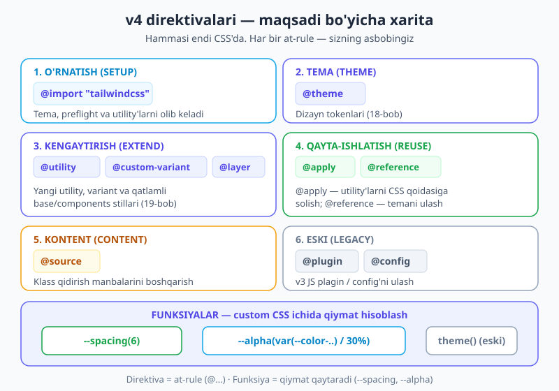
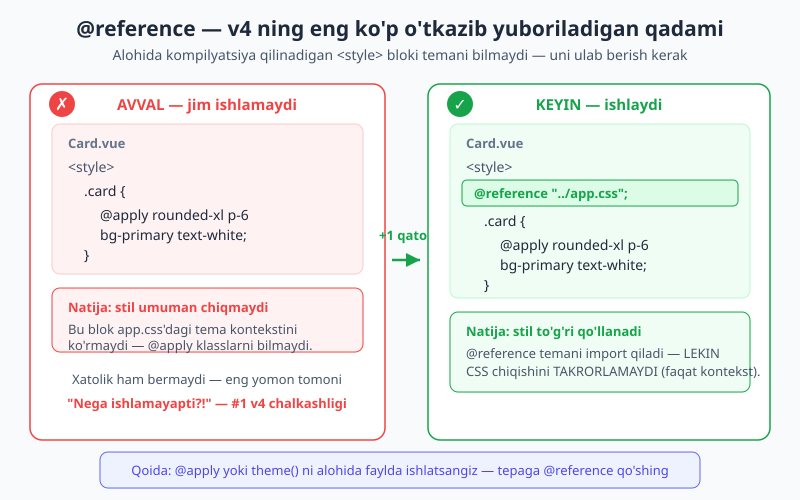
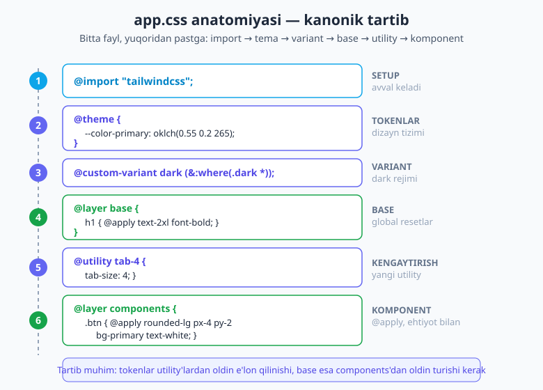

# 20 — Direktiva va funksiyalar

[⬅️ Oldingi: 19 — Custom utility va variant yaratish](./19-custom-utility-variant.md) · [🏠 README](./README.md) · [Keyingi: 21 — Plaginlar ekotizimi ➡️](./21-plaginlar.md)

> **Bu bobda:** Tailwind v4 ning butun **CSS asboblar to'plamini** bir joyga yig'amiz. Avvalgi boblarda `@import`, `@theme`, `@utility`, `@custom-variant` bilan tanishdingiz — endi qolgan direktivalarni (`@apply`, `@reference`, `@layer base`/`components`, `@source`, `@plugin`, `@config`) va funksiyalarni (`--spacing()`, `--alpha()`, eski `theme()`) bir **sayohat** sifatida ko'rib chiqamiz. Bu bobning yuragi — `@reference` (Vue/Svelte `<style>` blokida `@apply` jim ishlamasligining sababi va yechimi) va `@apply` ni **qachon** ishlatish to'g'ri, qachon esa tuzoq ekani. Oxirida hammasini bitta kanonik `app.css` faylda birlashtiramiz.

---

## 20.1 Avval nega? — v4 da hammasi CSS'da

Bir lahza orqaga qayting. v3 da Tailwind'ni sozlash uchun ikkita "olam" bor edi: HTML/CSS olami va alohida `tailwind.config.js` (JavaScript) olami. Tokenlar JS'da, utility'lar CSS'da, ikkalasi orasida ko'rinmas ko'prik turardi.

**v4 bu devorni buzdi.** Endi tokenlar (`@theme`), yangi utility'lar (`@utility`), variantlar (`@custom-variant`), global stillar (`@layer`), qayta-ishlatish (`@apply`) — **hammasi bitta CSS faylda** yashaydi. JavaScript config kerak emas.

Demak, bu direktivalar — sizning **asboblar qutingiz**. Har biri aniq bir vazifa uchun: biri Tailwind'ni ulaydi, biri token e'lon qiladi, biri utility yaratadi, biri klasslarni qoidaga soladi. Bu bobni shu asboblarni **maqsadi bo'yicha** tartiblab ko'rib chiqamiz — qaysi biri qachon ishlatilishini bilib olasiz.



> 📌 **Atamalar.** **Direktiva** — CSS'dagi `@` bilan boshlanadigan "at-rule" (masalan `@import`, `@apply`). U Tailwind'ga *nima qilishni* aytadi. **Funksiya** — qavs ichida qiymat olib, qiymat *qaytaradigan* ifoda (`--spacing(4)`, `--alpha(...)`). Direktiva — buyruq, funksiya — hisoblagich.

---

## 20.2 `@import "tailwindcss"` — hamma narsaning boshlanishi

Har bir Tailwind v4 loyihasi shu bitta qatordan boshlanadi:

```css
@import "tailwindcss";
```

Bu bitta import ortida aslida **uchta qism** keladi:

| Qism | Nima qiladi |
|---|---|
| **theme** | standart dizayn tokenlari (ranglar, spacing, shrift, breakpoint...) — `@theme` ning poydevori |
| **preflight** | brauzerlararo "reset" — `margin`, `border` larni nolga keltiradi, izchil asos beradi |
| **utilities** | siz ishlatadigan barcha utility klasslar generatsiya qilinadigan qatlam |

Ba'zan bularning **faqat bir qismini** xohlaysiz — masalan, preflight saytdagi mavjud stillarni buzayotgani uchun uni o'chirib qo'ymoqchisiz. v4 buni qismlab import qilishga ruxsat beradi:

```css
/* Preflight'siz: faqat tema + utility'lar */
@import "tailwindcss/theme";
@import "tailwindcss/utilities";
/* preflight'ni ataylab qoldirib ketdik */
```

Tailwind native **CSS cascade layer**'laridan foydalanadi. To'liq import aslida shu tartibni o'rnatadi:

```css
@layer theme, base, components, utilities;
```

Bu tartib muhim: `utilities` eng oxirida turgani uchun utility klasslar `base` (preflight) va `components` ustidan g'olib chiqadi. Aynan shuning uchun HTML'da `p-0` yozsangiz, u komponent stilini bemalol bekor qiladi — qatlam tartibi shuni kafolatlaydi.

> 💡 Qatlamlar haqida o'rnatish bobida ham gaplashganmiz ([02-bob](./02-ornatish-birinchi-qadam.md)). Bu yerda muhim xulosa: **import tartibni o'rnatadi**, shuning uchun `@import "tailwindcss";` odatda faylning eng tepasida turadi.

---

## 20.3 `@apply` — utility'larni CSS qoidasiga solish

`@apply` — mavjud utility klasslarni o'z CSS qoidangiz ichiga **"yopishtirish"** imkonini beradi:

```css
.btn {
  @apply rounded-lg bg-indigo-600 px-4 py-2 text-white hover:bg-indigo-700;
}
```

Endi HTML'da uzun klass qatori o'rniga shunchaki `<button class="btn">` yozasiz. Vasvasa katta: "har bir tugmaga 6 ta klass yozish o'rniga, bitta `.btn` yasayman!"

**To'xtang.** `@apply` — Tailwind'dagi eng ko'p suiiste'mol qilinadigan direktiva. U ba'zan to'g'ri, ko'pincha esa tuzoq.

### `@apply` qachon **haqiqatan** foydali

- **Chinakam global primitivlar** — butun sayt bo'ylab aynan bir xil ko'rinadigan, juda kichik takrorlanuvchi naqsh (masalan, bir xil fokus halqasi).
- **O'zgartira olmaydigan uchinchi-tomon HTML** — masalan, markdown'dan generatsiya qilingan yoki CMS chiqargan HTML'ga klass qo'sha olmaysiz; o'sha tegga CSS orqali stil bermoqchisiz.
- **Markup'ni boshqarmaydigan joylar** — masalan, `prose` ichidagi `<a>` teglariga umumiy stil.

### `@apply` qachon **tuzoq**

- HTML'dagi har bir komponent uchun `.card`, `.btn`, `.badge` yasab, utility'larni shularga ko'chirib tashlash. Bu — Tailwind'ni qaytadan oddiy CSS'ga aylantirish. Utility-first'ning butun foydasi (HTML'ga qarab darrov nima bo'layotganini ko'rish, nom o'ylab topmaslik) yo'qoladi.

Mashhur maslahat sodda: **takrorlanishni `@apply` bilan emas, komponent (React/Vue/Svelte komponenti yoki shablon partial'i) bilan boshqaring.** Komponent ham markup'ni, ham mantiqni bir joyga yig'adi; `@apply` esa faqat stilni ajratib, qolganini sochilgan qoldiradi.

```html
<!-- ✅ Tavsiya: komponent — markup + stil bir joyda, qayta ishlatiladi -->
<Button variant="primary">Saqlash</Button>
```

```css
/* ⚠️ Ehtiyot bo'ling: har bir element uchun @apply komponenti yasash */
.btn  { @apply rounded-lg bg-indigo-600 px-4 py-2 text-white; }
.card { @apply rounded-xl bg-white p-6 shadow; }
.badge{ @apply rounded-full bg-slate-100 px-3 py-1 text-sm; }
/* ...bu yo'ldan ketsangiz, oxir-oqibat oddiy CSS faylga qaytasiz */
```

> 💬 **Bu bahsni to'liq [22-bobda](./22-komponentlar-framework.md) ochamiz** — u yerda "komponent vs `@apply`" ni jiddiy taqqoslab, `clsx` + `tailwind-merge` va `cva` kabi zamonaviy yondashuvlarni ko'rasiz. Hozircha shuni eslab qoling: `@apply` — kuchli, lekin uni **kam** ishlating.

> 📝 **`@apply` ichida nimani ishlatish mumkin?** Faqat **mavjud utility klasslar** (standart yoki siz `@utility` bilan yaratganlar) va variantlar (`hover:`, `md:`). Oddiy CSS xossalarini (`@apply background: red;`) yoza olmaysiz — buning uchun shunchaki oddiy CSS qatorini yozing.

---

## 20.4 `@reference` — v4 ning eng ko'p o'tkazib yuboriladigan qadami

Mana bu bo'limni **diqqat bilan** o'qing — bu har bir v4 boshlovchisi duch keladigan tuzoq.

Vue, Svelte yoki CSS modullarida stilni **alohida `<style>` blokida** yozasiz. Tabiiy ravishda `@apply` ishlatmoqchi bo'lasiz:

```vue
<!-- Card.vue -->
<template>
  <div class="card">...</div>
</template>

<style>
.card {
  @apply rounded-xl bg-primary p-6 text-white;
}
</style>
```

Loyihani ishga tushirasiz va... **hech narsa bo'lmaydi.** Stil qo'llanmaydi. Xatolik ham chiqmaydi. Karta bo'yalmagan holda qoladi. "Nega ishlamayapti?!" — bu v4 dagi **eng keng tarqalgan chalkashlik**.

### Nega bunday bo'ladi?

Sabab: **har bir `<style>` blok / CSS modul / alohida fayl mustaqil kompilyatsiya qilinadi.** Vue'dagi `<style>` bloki sizning asosiy `app.css` faylingizdan **xabarsiz** — u `--color-primary` tokeni borligini, `rounded-xl` qanday qiymat ekanini bilmaydi. Tailwind o'sha blokni alohida ko'radi, tema kontekstisiz, shuning uchun `@apply` qaysi klasslar haqida gapirayotganingizni tushunmaydi va jimgina o'tkazib yuboradi.

### Yechim: `@reference`

Blokning tepasiga `@reference` qo'shasiz — bu Tailwind'ga "mening tema kontekstim ana o'sha faylda" deb aytadi:

```vue
<style>
@reference "../app.css";

.card {
  @apply rounded-xl bg-primary p-6 text-white;  /* endi ishlaydi ✓ */
}
</style>
```



Agar maxsus tema sozlamalaringiz bo'lmasa (yoki tokenlarga murojaat qilmaydigan oddiy holat bo'lsa), to'g'ridan-to'g'ri Tailwind'ni ham ko'rsatishingiz mumkin:

```css
@reference "tailwindcss";
```

### Eng muhim nozik nuqta

`@reference` temani **import qiladi, lekin CSS chiqishini TAKRORLAMAYDI.** Ya'ni u faqat Tailwind'ga "qanday tokenlar va klasslar bor" deb kontekst beradi — `:root` o'zgaruvchilarini yoki utility'larni qaytadan o'sha faylga nusxalamaydi. Agar `@reference` o'rniga yana bir marta `@import "tailwindcss";` yozsangiz, butun Tailwind chiqishini takrorlab, build hajmini bir necha barobar shishirib yuborasiz. **`@reference` — aynan shu takrorlanishning oldini olish uchun bor.**

> ⚠️ **Qachon `@reference` kerak?** `@apply` yoki `theme()` ni asosiy CSS faylingizdan **tashqarida** — Vue/Svelte `<style>`, CSS modul (`.module.css`), yoki alohida kompilyatsiya qilinadigan har qanday faylda — ishlatsangiz. Asosiy `app.css` ichida (`@import "tailwindcss";` bor joyda) `@reference` **shart emas**, chunki kontekst allaqachon mavjud.

---

## 20.5 `@layer base` va `@layer components`

Ba'zan utility'lar yetmaydi — saytga **global asos stillari** kerak: har bir `<h1>` ning standart o'lchami, `<body>` ning fon rangi, barcha `<a>` linklarining rangi. Bularni qayerga yozish kerak? `@layer` ga.

Tailwind ikkita asosiy maxsus qatlamni taklif qiladi:

**`@layer base`** — element darajasidagi standart stillar (selektor sifatida teg nomi). Bular utility'lardan *pastroq* turadi, shuning uchun HTML'da utility yozib ularni bemalol bekor qila olasiz.

```css
@layer base {
  body {
    @apply bg-surface text-ink;     /* sayt fonining standarti */
  }
  h1 {
    @apply text-2xl font-bold;      /* sarlavhalarning standart o'lchami */
  }
  a {
    @apply text-primary underline;
  }
}
```

**`@layer components`** — qayta ishlatiladigan komponent klasslari (`.btn`, `.card`). Bular ham `utilities` qatlamidan past turadi:

```css
@layer components {
  .card {
    @apply rounded-xl bg-white p-6 shadow;
  }
}
```

### Nega aynan `@layer`?

Sababi — **kaskad tartibi**. `@layer base` ichidagi `h1 { text-2xl }` standart o'lcham beradi, lekin biror sarlavhaga `<h1 class="text-4xl">` yozsangiz, `utilities` qatlami `base`'dan yuqori bo'lgani uchun `text-4xl` g'olib chiqadi. Agar bu stillarni qatlamsiz, oddiy CSS sifatida yozsangiz, specificity janglariga tushib qolardingiz. `@layer` shu janglarni butunlay yo'qotadi.

```html
<h1>Standart sarlavha</h1>                 <!-- base: text-2xl -->
<h1 class="text-4xl">Kattaroq sarlavha</h1> <!-- utility g'olib: text-4xl ✓ -->
```

> 💡 **Qoida.** Teg darajasidagi standartlar → `@layer base`. Qayta ishlatiladigan klass naqshlar → `@layer components`. Bir martalik, o'ziga xos stillar → to'g'ridan-to'g'ri HTML'da utility. Eng oxirgisi — eng ko'p ishlatadiganingiz.

---

## 20.6 `@source` — Tailwind klasslarni qayerdan qidiradi

Tailwind ishlash uchun **qaysi klasslar ishlatilganini** bilishi kerak — keraksizlarini generatsiya qilmaslik uchun. U buni loyihangizdagi fayllarni **skanerlash** orqali aniqlaydi. Odatda bu avtomatik, lekin ba'zan qo'lga olish kerak.

**Qo'shimcha manba ro'yxatga olish** — masalan, `node_modules` ichidagi UI kutubxonasi Tailwind klasslarini ishlatadi, lekin standart skanerlash uni o'tkazib yuboradi:

```css
@source "../node_modules/sezgir-ui";
```

**Manbani chiqarib tashlash** — katta avtomatik-generatsiya papkasini skanerlashni xohlamasangiz:

```css
@source not "../public/legacy";
```

### Dinamik klass nomi muammosi (va `@source inline`)

Mana klassik tuzoq. Tailwind manba faylni **matn sifatida** o'qiydi — u JavaScript'ni *bajarmaydi*. Demak, klass nomini ish vaqtida birlashtirsangiz, skaner uni topa olmaydi:

```jsx
// ❌ Tailwind buni KO'RMAYDI — "bg-red-500" hech qayerda yaxlit yozilmagan
function Badge({ color }) {
  return <span className={`bg-${color}-500`}>...</span>;
}
```

Skaner faqat `bg-` qismini ko'radi, `bg-red-500` ni emas — chunki `red` o'zgaruvchidan keladi. Natijada o'sha klass generatsiya qilinmaydi va badge bo'yalmaydi.

**To'g'ri yechim** — klassning to'liq nomini statik yozish (masalan, `color` ga qarab tayyor map'dan to'liq klass tanlash). Ammo iloji bo'lmasa, `@source inline(...)` bilan o'sha klasslarni **majburan generatsiya qildirish** (safelist) mumkin:

```css
@source inline("bg-red-500 bg-green-500 bg-blue-500");
```

```css
/* Brace kengaytirishi bilan ko'p variant: */
@source inline("{bg,text,border}-red-500");
```

> 🔭 **To'liq [24-bobda](./24-production-optimizatsiya.md).** Content scanning, build hajmini optimallashtirish va `@source` ning barcha shakllarini production bobida batafsil ko'ramiz. Hozircha eng muhim saboq: **dinamik klass nomlaridan qoching; iloji bo'lmasa `@source inline` bilan safelist qiling.**

---

## 20.7 `@plugin` va `@config` — eski dunyo bilan ko'prik

Ikkita direktiva v3 ning JavaScript dunyosiga ko'prik tashlaydi — qisqacha eslatib o'tamiz:

**`@plugin`** — eski JS plaginini yuklaydi (masalan, rasmiy `@tailwindcss/forms` yoki `@tailwindcss/typography` kabilar):

```css
@plugin "@tailwindcss/typography";
```

**`@config`** — eski v3 `tailwind.config.js` faylini ulaydi (asosan migratsiya paytida, eski sozlamalarni darrov CSS'ga ko'chira olmasangiz):

```css
@config "../tailwind.config.js";
```

> 🔭 **`@plugin` — to'liq [21-bobda](./21-plaginlar.md)** (plaginlar ekotizimi: `typography`, `forms`, daisyUI...). **`@config` — to'liq [25-bobda](./25-best-practices-migratsiya.md)** (v3 → v4 migratsiyasi). Hozir faqat ular borligini va nima uchun ekanini bilsangiz kifoya.

---

## 20.8 Funksiyalar — custom CSS'da qiymat hisoblash

Direktivalar buyruq berardi; **funksiyalar** esa qiymat qaytaradi. Ularni o'z CSS qoidalaringiz ichida, token tizimidan foydalanib qiymat hisoblash uchun ishlatasiz.

### `--spacing()` — spacing shkalasidan qiymat

`--spacing(n)` — `--spacing` asosining `n` karralisini qaytaradi (`calc(var(--spacing) * n)`). Ya'ni `p-6` qanday qiymat ishlatsa, `--spacing(6)` ham aynan o'shani beradi:

```css
.maxsus-blok {
  margin-block: --spacing(6);   /* p-6/m-6 bilan bir xil masofa */
  scroll-padding-top: --spacing(20);
}
```

Foydasi: o'z CSS'ingizda ham "sehrli son" (`1.5rem`) yozmaysiz — shu bitta spacing tizimiga sodiq qolasiz ([04-bob](./04-spacing-sizing.md)).

### `--alpha()` — rangning shaffofligini sozlash

`--alpha(rang / foiz)` — berilgan rangning shaffofligini o'zgartiradi. Bu, ayniqsa, token rangidan yarim-shaffof variant yasashda qulay:

```css
.overlay {
  background: --alpha(var(--color-indigo-500) / 30%);  /* indigo, 30% shaffoflik */
}
.glow {
  box-shadow: 0 0 24px --alpha(var(--color-sky-400) / 45%);
}
```

> 💡 HTML'da utility orqali shaffoflikni `bg-indigo-500/30` deb yozasiz ([11-bobdagi](./11-ranglar.md) opacity modifikatori). `--alpha()` — xuddi shuning **custom CSS'dagi** ko'rinishi.

### `theme()` — eski funksiya (lekin endi kerak emas)

v3 da token qiymatlarini olish uchun `theme()` funksiyasi ishlatilardi: `theme(colors.red.500)`. v4 da u **moslik uchun hali ishlaydi**, lekin endi yaxshiroq yo'l bor — tokenlar oddiy CSS o'zgaruvchilari bo'lgani uchun ularni to'g'ridan-to'g'ri `var()` bilan olasiz:

```css
/* ⚠️ Eski (ishlaydi, lekin tavsiya etilmaydi) */
.eski { color: theme(colors.red.500); }

/* ✅ v4 yo'li — to'g'ridan-to'g'ri o'zgaruvchi */
.yangi { color: var(--color-red-500); }
```

> 📝 Qoida sodda: **yangi kodda `var(--color-*)` ishlating.** `theme()` ni faqat eski kodda uchratsangiz tanib oling — uni `var()` ga ko'chirish mumkin.

---

## 20.9 Hammasini birlashtirish — kanonik `app.css`

Endi o'rgangan asboblarni bitta **tipik loyiha faylida** birlashtiramiz. Mana professional v4 loyihasining `app.css` faylining "skeleti" — tartib ataylab shunday:

```css
/* 1. SETUP — Tailwind'ni olib kelish (eng tepada) */
@import "tailwindcss";

/* 2. TOKENLAR — dizayn tizimi (18-bob) */
@theme {
  --color-primary:       oklch(0.55 0.20 265);
  --color-primary-hover: oklch(0.48 0.20 265);
  --font-display: "Satoshi", "Segoe UI", sans-serif;
  --radius-card: 1rem;
}

/* 3. VARIANT — dark rejimi (16-bob) */
@custom-variant dark (&:where(.dark, .dark *));

/* 4. SEMANTIK / KONTEKSTGA BOG'LIQ TOKENLAR */
:root      { --surface: oklch(0.99 0 0);     --ink: oklch(0.20 0 0); }
.dark      { --surface: oklch(0.21 0.01 260); --ink: oklch(0.95 0 0); }
@theme inline {
  --color-surface: var(--surface);
  --color-ink:     var(--ink);
}

/* 5. BASE — global element standartlari */
@layer base {
  body { @apply bg-surface text-ink font-display; }
  h1   { @apply text-3xl font-bold; }
}

/* 6. KENGAYTIRISH — yangi utility (19-bob) */
@utility tab-4 {
  tab-size: 4;
}

/* 7. KOMPONENT — @apply'ni juda kam, faqat chinakam primitiv uchun */
@layer components {
  .focus-halqa {
    box-shadow: 0 0 0 3px --alpha(var(--color-primary) / 40%);
  }
}
```



**Tartib nega muhim?** Tokenlar (`@theme`) utility'lar generatsiya qilinishidan *oldin* e'lon qilinishi kerak — aks holda Tailwind ulardan klass yasay olmaydi. `@layer base` esa `components`'dan oldin turishi mantiqan to'g'ri (asos avval, komponent keyin). Import esa har doim tepada, chunki u qatlam tartibini o'rnatadi.

> 💡 Bu fayl — kelajakdagi har bir loyihangiz uchun "shablon". Uni yodda saqlang: import → tokenlar → variant → semantik tokenlar → base → utility → komponent.

---

## 20.10 Tez-tez uchraydigan xatolar

- **`@reference` ni unutish (eng katta #1 chalkashlik).** Vue/Svelte `<style>` yoki CSS modulda `@apply`/`theme()` jim ishlamaydi. Blok tepasiga `@reference "../app.css";` qo'shing.
- **`@reference` o'rniga `@import "tailwindcss"` ni takrorlash.** Bu butun Tailwind chiqishini nusxalab, build'ni shishiradi. Alohida fayllarda — `@reference`, bir marta `@import` emas.
- **`@apply` ni haddan tashqari ishlatish.** Har bir komponent uchun `.btn`/`.card`/`.badge` yasash — Tailwind'ni qaytadan oddiy CSS'ga aylantirish. Takrorlanishni shablon/komponent bilan boshqaring ([22-bob](./22-komponentlar-framework.md)).
- **`@theme` ga oddiy CSS yozish.** `@theme` faqat token e'lonlari uchun; selektorlar va qoidalar `@layer`/oddiy CSS'da ([18-bob](./18-theme-dizayn-tizimi.md)).
- **Dinamik klass nomlari.** `` `bg-${color}-500` `` skaner tomonidan topilmaydi. To'liq statik klass yozing yoki `@source inline(...)` bilan safelist qiling ([24-bob](./24-production-optimizatsiya.md)).
- **Yangi kodda `theme()` ishlatish.** U eski (v3) funksiya — moslik uchun ishlaydi, lekin `var(--color-*)` ni afzal ko'ring.
- **`@apply` ichiga oddiy CSS xossasi yozish.** `@apply` faqat utility klasslarni qabul qiladi (`@apply bg-red-500`), `@apply background: red;` emas.

> 🔭 **Oldinga qarash.** Endi v4 ning butun CSS asboblar qutisini bilasiz: ulash (`@import`), tokenlar (`@theme`), kengaytirish (`@utility`/`@custom-variant`/`@layer`), qayta-ishlatish (`@apply`/`@reference`) va funksiyalar. [Keyingi bob](./21-plaginlar.md) shu asboblarning ustiga **tayyor ekotizimni** qo'shadi — rasmiy plaginlar (`typography`, `forms`) va `@plugin` orqali butun komponent kutubxonalarini ulashni o'rganasiz.

---

## Mashqlar

**1-mashq.** Hamkasbingiz `Modal.vue` faylida `<style>` blok ichida shunday yozdi va modal umuman bo'yalmayapti, xatolik ham yo'q. Sababini toping va tuzating.

```vue
<style>
.modal {
  @apply rounded-2xl bg-white p-8 shadow-xl;
}
</style>
```

<details markdown="1"><summary>Yechim</summary>

`<style>` bloki asosiy `app.css` dan alohida kompilyatsiya qilinadi, shuning uchun u tema kontekstini bilmaydi — `@apply` qaysi klasslar haqida gapirayotganini tushunmaydi va jimgina o'tkazib yuboradi. Yechim — blok tepasiga `@reference` qo'shish:

```vue
<style>
@reference "../app.css";

.modal {
  @apply rounded-2xl bg-white p-8 shadow-xl;   /* endi ishlaydi */
}
</style>
```

(Maxsus tema kerak bo'lmasa, `@reference "tailwindcss";` ham bo'ladi.) Eslatma: bu CSS chiqishini takrorlamaydi — faqat kontekst beradi.

</details>

**2-mashq.** Saytdagi **har bir** `<h2>` standart ravishda `text-xl` va `font-semibold` bo'lsin, lekin kerak bo'lganda HTML'da `<h2 class="text-3xl">` yozib uni bemalol kattalashtira olaylik. Buni qaysi direktiva bilan, qayerga yozasiz va nega u bekor qilinadigan bo'ladi?

<details markdown="1"><summary>Yechim</summary>

`@layer base` ga yozamiz:

```css
@layer base {
  h2 { @apply text-xl font-semibold; }
}
```

Bu `base` qatlamida turadi, `utilities` qatlami esa undan **yuqori**. Shuning uchun HTML'da `text-3xl` yozsangiz, utility g'olib chiqadi:

```html
<h2>Standart sarlavha</h2>             <!-- text-xl -->
<h2 class="text-3xl">Katta sarlavha</h2> <!-- text-3xl g'olib -->
```

Agar bu stilni qatlamsiz oddiy CSS sifatida yozganingizda, specificity tufayli utility uni bekor qila olmasligi mumkin edi.

</details>

**3-mashq.** React komponentingiz rangni prop'dan oladi va shunday yozadi: `` className={`text-${tone}-600`} ``. Production build'da matn rangi qo'llanmayapti. Sababi nima? Ikkita yechim ayting (biri to'g'riroq).

<details markdown="1"><summary>Yechim</summary>

Sabab: Tailwind manba fayllarni **matn sifatida** skanerlaydi, JS'ni bajarmaydi. `` `text-${tone}-600` `` da `text-...-600` hech qayerda yaxlit yozilmagani uchun skaner `text-blue-600` ni topa olmaydi va o'sha klassni generatsiya qilmaydi.

**To'g'riroq yechim** — to'liq klass nomlarini statik yozish, masalan map orqali:

```jsx
const toneClass = { blue: "text-blue-600", green: "text-green-600" };
<span className={toneClass[tone]} />   // to'liq klasslar manbada ko'rinadi
```

**Muqobil yechim** — agar dinamiklik shart bo'lsa, `@source inline(...)` bilan safelist qilish:

```css
@source inline("text-blue-600 text-green-600 text-red-600");
```

Birinchisi afzal, chunki u keraksiz klasslarni generatsiya qilmaydi va kod tushunarliroq.

</details>

**4-mashq.** Custom CSS qoidasida overlay foni — `indigo-500` rangining 25% shaffof varianti bo'lsin, va uning padding'i `p-8` bilan bir xil masofada bo'lsin. Funksiyalardan foydalanib yozing.

<details markdown="1"><summary>Yechim</summary>

```css
.overlay {
  background: --alpha(var(--color-indigo-500) / 25%);
  padding: --spacing(8);   /* p-8 bilan bir xil */
}
```

`--alpha(rang / foiz)` rangning shaffofligini sozlaydi; `--spacing(8)` esa `calc(var(--spacing) * 8)` ni qaytaradi — ya'ni `p-8`/`m-8` bilan aynan bir xil masofa. Ikkalasi ham "sehrli son" yozmasdan, token tizimiga sodiq qoladi.

</details>

**5-mashq.** Bir loyihada saytdagi mavjud (eski) stillar Tailwind'ning preflight reset'i bilan to'qnashayapti. Tema va utility'lar kerak, lekin preflight'ni **o'chirmoqchisiz**. v4 da buni qanday qilasiz?

<details markdown="1"><summary>Yechim</summary>

To'liq `@import "tailwindcss";` o'rniga faqat kerakli qismlarni import qilamiz va preflight'ni ataylab qoldirib ketamiz:

```css
@import "tailwindcss/theme";
@import "tailwindcss/utilities";
/* preflight import qilinmadi — reset yo'q */
```

Endi tema (tokenlar) va utility'lar ishlaydi, lekin Tailwind brauzer standart stillarini nolga keltirmaydi, shuning uchun eski stillaringiz buzilmaydi.

</details>

**6-mashq (debugging).** Quyidagi `app.css` xato beradi — `bg-primary` klassi HTML'da umuman ishlamayapti. Sababini toping va to'g'rilang.

```css
@theme {
  --color-primary: oklch(0.55 0.20 265);
}
@import "tailwindcss";
```

<details markdown="1"><summary>Yechim</summary>

**Tartib xato.** `@theme` `@import "tailwindcss";` dan *oldin* turibdi. Tailwind importi tema poydevorini va utility generatsiyasini o'rnatadi, shuning uchun u eng tepada bo'lishi kerak — aks holda `@theme` tokenlari "joyini topmaydi" va ulardan utility yasalmaydi. To'g'risi:

```css
@import "tailwindcss";

@theme {
  --color-primary: oklch(0.55 0.20 265);   /* endi bg-primary ishlaydi */
}
```

**Qoida:** `@import "tailwindcss";` — har doim faylning eng tepasida.

</details>

---

[⬅️ Oldingi: 19 — Custom utility va variant yaratish](./19-custom-utility-variant.md) · [🏠 README](./README.md) · [Keyingi: 21 — Plaginlar ekotizimi ➡️](./21-plaginlar.md)
