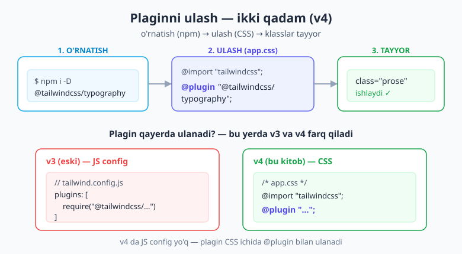
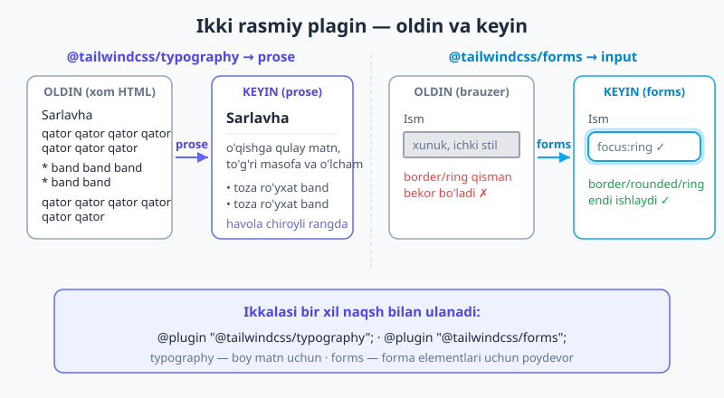
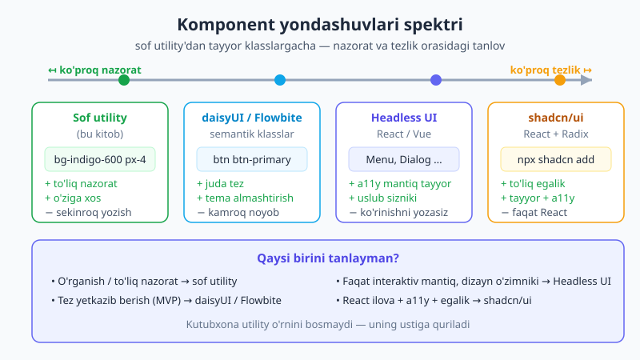

# 21 — Plaginlar ekotizimi

[⬅️ Oldingi: 20 — Direktiva va funksiyalar](./20-direktiva-funksiyalar.md) · [🏠 README](./README.md) · [Keyingi: 22 — Komponentlar va framework integratsiyasi ➡️](./22-komponentlar-framework.md)

> **Bu bobda:** Tailwind'ni **plaginlar** bilan kengaytirishni o'rganamiz. v4 da plagin CSS ichida `@plugin "..."` direktivasi bilan ulanadi (v3 dagi `plugins: []` massivi emas). Ikki rasmiy plaginni amalda ishlatamiz: **`@tailwindcss/typography`** (maqola/blog/markdown matni uchun `prose` tizimi) va **`@tailwindcss/forms`** (forma elementlarini uslublasa bo'ladigan holatga keltiruvchi asos). So'ng eng ko'p so'raladigan savolga javob beramiz: **komponent kutubxonalari spektri** — sof utility'dan boshlab **daisyUI** (semantik klasslar), **Headless UI** (a11y mantiq + sizning uslubingiz) va **shadcn/ui** ("o'rnatma, nusxa ol") gacha. Qaysi birini qachon tanlashni ham aniq ko'rsatamiz.

---

## 21.1 Avval nega? — plagin nima va u qanday muammoni yechadi?

Tailwind o'zi katta — minglab utility klass. Lekin u atayin **ba'zi narsalarni o'z ichiga olmaydi**. Masalan, blogdagi uzun maqola matnini chiroyli qilish uchun siz har bir `<h2>`, `<p>`, `<ul>`, `<blockquote>` ga qo'lda klass yozishingiz kerak — bu mehnattalab. Yoki standart `<input>` brauzerda xunuk ko'rinadi va uni uslublash og'riqli.

Aynan shu kabi **takrorlanuvchi, paketlangan ehtiyojlar** uchun **plaginlar** bor. Plagin — bu Tailwind'ga qo'shimcha funksiya olib keladigan paket. U:

- **qo'shimcha utility'lar** (masalan, yangi klasslar),
- **asos (base) stillari** (forma elementlarini boshqatdan tartiblash kabi),
- yoki **tayyor komponent klasslari va temalar** (`btn`, `card` kabi)

bera oladi. Boshqacha aytganda: agar bir necha loyihada bir xil kengaytmani qayta-qayta yozayotgan bo'lsangiz, kimdir uni allaqachon plagin qilib paketlagan bo'lishi mumkin.

> 💡 **Analogiya.** Tailwind — yaxshi jihozlangan oshxona: pichoq, taxta, gaz. Plagin esa — bir maxsus asbob: masalan, makaron mashinasi. Har kuni kerak emas, lekin makaron qilmoqchi bo'lsangiz, uni noldan qo'lda yoyishdan ko'ra mashinani ulagan afzal. Plagin ham — aniq bir ish uchun tayyorlangan, ixtiyoriy qo'shimcha.

> 📝 **v3 dan eng muhim farq (bir martalik eslatma).** Tailwind v3 da plaginlar `tailwind.config.js` fayldagi `plugins: [require("...")]` **massivida** ulanardi. **v4 da JS config yo'q** — plagin to'g'ridan-to'g'ri **CSS ichida** `@plugin "..."` direktivasi bilan ulanadi. Internetda `plugins: [require(...)]` ko'rsangiz — bu eski v3 yo'li. Bu kitobning yo'li — `@plugin`.

---

## 21.2 v4 da hamma plagin kerakmi? — yo'q, ba'zilari endi yadroda

Bobning boshida bitta tuzoqdan ogohlantirib qo'yamiz. v3 da mashhur bo'lgan **bir nechta plagin v4 da yadroga (core) ko'chirilgan** — ya'ni ularni endi o'rnatish **shart emas va xato**:

| v3 plagin | v4 dagi holati |
|---|---|
| `@tailwindcss/aspect-ratio` | Yadroda — `aspect-video`, `aspect-square`, `aspect-[4/3]` to'g'ridan-to'g'ri ishlaydi |
| `@tailwindcss/container-queries` | Yadroda — `@container` va `@sm:`/`@lg:` variantlari [10-bobda](./10-container-queries.md) ko'rganimizdek o'rnatishsiz ishlaydi |
| `@tailwindcss/line-clamp` | Yadroda — `line-clamp-3` bevosita mavjud |

Agar eski qo'llanmada bularni `npm i -D @tailwindcss/aspect-ratio` qilishni ko'rsangiz — **e'tibor bermang**. v4 da ular allaqachon ichingizda.

Demak, amalda v4 da eng ko'p ishlatadigan **ikki rasmiy plagin** qoladi: `@tailwindcss/typography` va `@tailwindcss/forms`. Ularning ikkalasini ham birma-bir ko'rib chiqamiz.

---

## 21.3 Plaginni o'rnatish va ulash — umumiy oqim

Har qanday plaginni ishlatish ikki qadamdan iborat: **o'rnatish** (npm) va **ulash** (CSS).

```bash
# 1-qadam: paketni dev-bog'liqlik sifatida o'rnatish
npm i -D @tailwindcss/typography
```

```css
/* 2-qadam: app.css ichida ulash — config'da emas, CSS'da! */
@import "tailwindcss";
@plugin "@tailwindcss/typography";
```

Shu ikki qadamdan keyin plagin bergan hamma narsa (bu holda `prose` klasslari) loyihangizda tayyor. Ba'zi plaginlar **sozlamalarni** ham qabul qiladi — buni `@plugin` dan keyin **blok** ko'rinishida beriladi:

```css
@plugin "@tailwindcss/forms" {
  strategy: base;   /* yoki: class */
}
```



> 📌 **Atamalar.** **Plagin** — Tailwind'ga qo'shimcha funksiya olib keladigan npm paketi. **`@plugin`** — uni CSS ichida ulaydigan v4 direktivasi. **`-D` (`--save-dev`)** — paketni faqat ishlab chiqish (build) uchun o'rnatadi, chunki plagin tayyor saytga emas, build jarayoniga kerak.

---

## 21.4 `@tailwindcss/typography` — `prose` tizimi

**Muammo.** Bloging, hujjat sayti, CMS yoki markdown'dan kelgan matnni o'ylab ko'ring. Bu matnda o'nlab `<h2>`, `<p>`, `<ul>`, `<a>`, `<blockquote>`, `<code>` bor — va siz ularning **klasslarini boshqarmaysiz** (ko'pincha matn HTML'ga avtomatik aylantiriladi). Har biriga qo'lda `text-xl mt-6 mb-3 ...` yozish imkonsiz.

**Yechim.** `@tailwindcss/typography` plagini bitta `prose` klassi orqali ana shu butun ichki matnni **avtomatik chiroyli** uslublaydi:

```html
<article class="prose lg:prose-lg">
  <h1>Tailwind bilan tipografiya</h1>
  <p>Bu paragraf, sarlavhalar, ro'yxatlar va iqtiboslar —
     hammasi <code>prose</code> klassi bilan o'z-o'zidan uslublanadi.</p>
  <ul>
    <li>Birinchi band</li>
    <li>Ikkinchi band</li>
  </ul>
  <blockquote>Yaxshi tipografiya — ko'rinmas tipografiya.</blockquote>
</article>
```

`prose` ning ichidagi har bir element o'qishga qulay o'lcham, masofa va rang oladi — siz ichki teglarga **bitta ham klass yozmaysiz**.

### O'lcham va rang modifikatorlari

`prose` ni o'zgartirish uchun maxsus modifikatorlar bor:

```html
<!-- Kattaroq matn -->
<article class="prose prose-lg">...</article>

<!-- Rang sxemasi (slate, gray, zinc, neutral, stone) -->
<article class="prose prose-slate">...</article>

<!-- Dark mode uchun teskari rang -->
<article class="prose dark:prose-invert">...</article>
```

### Element modifikatorlari — aniq nuqtani sozlash

`prose` ning ichidagi **bitta turdagi elementni** o'zgartirmoqchimisiz? `prose-<element>:` modifikatori bor:

```html
<article class="prose
                prose-headings:text-indigo-900
                prose-a:text-sky-600 prose-a:no-underline
                prose-code:text-rose-600">
  ...
</article>
```

Bu — "prose ichidagi barcha sarlavhalar indigo bo'lsin, barcha havolalar sky-600 va chiziqsiz" degani. Aniq nazorat, lekin baribir bitta `<article>` da.

### `not-prose` — bir qismni chetga chiqarish

Maqola ichida bir blok (masalan, interaktiv kalkulyator yoki maxsus karta) `prose` uslubiga bo'ysunmasligi kerak bo'lsa, uni `not-prose` bilan o'rab qo'yasiz:

```html
<article class="prose">
  <p>Oddiy matn — prose uslubida.</p>

  <div class="not-prose">
    <!-- bu yerda prose tegmaydi; o'zingiz uslublaysiz -->
    <button class="bg-indigo-600 text-white px-4 py-2 rounded-lg">Ariza</button>
  </div>

  <p>Yana oddiy matn — yana prose.</p>
</article>
```

> 💡 **Qachon `prose`, qachon yo'q?** `prose` — siz **klassma-klass boshqarmaydigan boy matn** uchun (blog posti, hujjat, markdown render, CMS chiqishi). Ilova **interfeysi** (tugmalar, navbar, kartalar, formalar) uchun esa **`prose` ishlatmang** — u sizning UI'ngiz bilan urishadi (sarlavhalarga masofa qo'shadi, havolalarni bo'yaydi). UI uchun oddiy utility'lar to'g'ri yo'l.

> 🔭 `prose` — bu [12-bobdagi](./12-tipografiya.md) qo'lda tipografiya bilimingizning **paketlangan, avtomatik** ko'rinishi. 12-bobda har bir `text-*`, `leading-*`, `tracking-*` ni o'zingiz qo'ygansiz; `prose` esa shu qarorlarni siz uchun, butun matn blokiga bir vaqtda qabul qiladi.

---

## 21.5 `@tailwindcss/forms` — forma elementlarini uslublasa bo'ladigan qilish

**Muammo — nega kerak?** Brauzerlarning standart forma elementlari (`<input>`, `<select>`, `<textarea>`, checkbox, radio) **bir-biriga o'xshamaydi** va ularni uslublash qiyin. Siz `border rounded focus:ring-2` yozasiz, lekin natija kutilganidek chiqmaydi — chunki brauzer o'zining ichki, qarshilik ko'rsatuvchi standart stilini qo'yib turadi.

**Yechim.** `@tailwindcss/forms` plagini barcha forma elementlariga **toza, betaraf asos** beradi — shundan keyin sizning `border`, `rounded`, `focus:ring` utility'laringiz **haqiqatan ishlaydi**:

```css
@import "tailwindcss";
@plugin "@tailwindcss/forms";
```

Endi oddiy input ham odamga o'xshaydi:

```html
<!-- forms plaginisiz: bu utility'lar to'liq ishlamasdi -->
<input type="text"
       class="border border-slate-300 rounded-lg px-3 py-2
              focus:border-indigo-500 focus:ring-2 focus:ring-indigo-200" />
```



### `base` va `class` strategiyalari

Plagin ikki rejimda ishlay oladi, buni `@plugin` blokida belgilaysiz:

```css
/* base (standart): barcha forma elementlariga global asos qo'yiladi */
@plugin "@tailwindcss/forms";

/* class: faqat maxsus klass qo'yilgan elementlarga (form-input, form-select...) */
@plugin "@tailwindcss/forms" {
  strategy: class;
}
```

- **`base`** (standart) — eng qulay: hamma input avtomatik uslublasa bo'ladigan holatga keladi. Yangi loyiha uchun to'g'ri tanlov.
- **`class`** — ehtiyotkor: faqat siz `form-input`, `form-select`, `form-checkbox` kabi klass qo'ygan elementlar o'zgaradi. Mavjud loyihaga plaginni qo'shayotganda, eski stillarni buzmaslik uchun foydali.

> 🔭 **Oldinga qarash.** Bu plagin yordamida forma elementlarini **amalda** to'liq uslublash — chiroyli input, checkbox, select, validatsiya holatlari — [23-bobda](./23-forma-ui-komponentlar.md). Hozir shuni bilsangiz kifoya: `@tailwindcss/forms` — bu formalarni uslublashning **poydevori**.

---

## 21.6 Uchinchi tomon (community) plaginini ulash

Rasmiy plaginlardan tashqari, jamoa tomonidan yaratilgan ko'plab plaginlar bor (qo'shimcha animatsiya, gradient, fluid tipografiya va h.k.). Ularning hammasi bir xil naqsh bilan ishlaydi — o'rnatasiz, keyin ulanasiz:

```bash
npm i -D <plagin-nomi>
```

```css
@import "tailwindcss";

@plugin "<plagin-nomi>";

/* sozlamali bo'lsa: */
@plugin "<plagin-nomi>" {
  /* plagin hujjatida ko'rsatilgan opsiyalar */
}
```

> ⚠️ Uchinchi tomon plaginini qo'shishdan oldin uning **v4 ni qo'llab-quvvatlashini** tekshiring. Faqat v3 uchun yozilgan eski plagin (`plugins: []` orqali ishlaydigan) v4 da ishlamasligi mumkin. Plagin README'sida "Tailwind v4" yoki `@plugin` ko'rsatilgan bo'lsa — bexavotir.

---

## 21.7 CSS-first vs JS plagin — qaysi birini tanlash?

Endi muhim qaror. Sizga "Tailwind'ni kengaytirish" kerak bo'lsa, **ikki yo'l** bor:

1. **CSS-first** — [19-bobda](./19-custom-utility-variant.md) ko'rgan `@utility`, `@custom-variant`, [18-bobdagi](./18-theme-dizayn-tizimi.md) `@theme`. Bu — sof CSS, hech qanday paket, hech qanday JavaScript.
2. **JS plagin** — `@plugin` orqali ulanadigan npm paketi.

Qoida sodda:

| Ehtiyoj | To'g'ri vosita |
|---|---|
| Bir nechta o'z utility'ngiz (`tab-4`, `content-auto`) | **CSS-first** — `@utility` (19-bob) |
| O'z variantingiz (`group-hover` kabi) | **CSS-first** — `@custom-variant` (19-bob) |
| Brend tokenlari, rang/spacing | **CSS-first** — `@theme` (18-bob) |
| **Programmatik** generatsiya (yuzlab klassni sikl bilan yasash) | **JS plagin** |
| Mavjud ekotizim paketidan foydalanish (`typography`, `forms`, daisyUI) | **JS plagin** — `@plugin` |

> 💡 **Soddacha qoida.** Avval CSS-first'ni sinab ko'ring — aksariyat "kengaytirish" ehtiyojlari endi `@utility`/`@theme` bilan yopiladi va hech narsa o'rnatish kerak emas. JS `@plugin` ga faqat ikki holatda murojaat qiling: (1) klasslarni **dasturiy** (sikl/funksiya bilan) generatsiya qilish kerak bo'lsa, (2) tayyor **ekotizim paketini** (typography, forms, daisyUI) ishlatmoqchi bo'lsangiz.

---

## 21.8 Komponent kutubxonalari — to'liq spektr

Endi o'quvchilar eng ko'p beradigan savolga keldik: "Tailwind bilan **tayyor komponentlarni** qayerdan olaman? `btn`, `modal`, `dropdown` ni har safar noldan yozmaslik kerakmi?"

Javob — bitta emas. Tailwind atrofida **butun bir spektr** bor: bir tomonda **to'liq nazorat** (sof utility), boshqa tomonda **maksimal tezlik** (tayyor klasslar). Mana shu spektrni tartib bilan ko'rib chiqamiz.



### daisyUI — semantik komponent klasslari

**daisyUI** (v5) — Tailwind ustiga **semantik komponent klasslari** qo'shadigan plagin: `btn`, `btn-primary`, `card`, `badge`, `modal`, `alert` va boshqalar, hamda tayyor **temalar**. U ham oddiy `@plugin` bilan ulanadi:

```bash
npm i -D daisyui
```

```css
@import "tailwindcss";
@plugin "daisyui";
```

```html
<!-- Endi semantik klasslar bilan: -->
<button class="btn btn-primary">Saqlash</button>
<div class="card bg-base-100 shadow-xl">
  <div class="card-body">
    <h2 class="card-title">Karta sarlavhasi</h2>
    <p>daisyUI komponenti — bir necha klass bilan.</p>
  </div>
</div>
```

- **Yutug'i:** juda tez — `btn btn-primary` yozdingiz, tayyor tugma. Temalar bilan butun saytni bir qatorda qayta ranglash mumkin.
- **Kamchiligi:** dizayn **kamroq noyob** bo'ladi (boshqa daisyUI saytlariga o'xshaydi), va bu — yana bitta qatlam (abstraksiya). Chuqur o'ziga xos dizayn kerak bo'lsa, baribir utility'ga qaytasiz.

### Headless UI — a11y mantiq, uslub sizdan

**Headless UI** — React va Vue uchun **uslubsiz, lekin to'liq qulay (accessible)** interaktiv komponentlar: `Menu` (dropdown), `Dialog` (modal), `Combobox`, `Listbox`, `Tabs`. "Headless" (boshsiz) degani — u **ko'rinish bermaydi**, faqat **murakkab mantiqni** beradi: klaviatura navigatsiyasi, fokus boshqaruvi, ARIA atributlari, ochilish/yopilish holati.

Siz esa **Tailwind utility'lari bilan ko'rinishini** o'zingiz berasiz. Komponent holatini `data-*` atributlari orqali bildiradi, ularni [15-bobdagi](./15-holat-variantlari.md) `data-*` variantlari bilan uslublaysiz:

```jsx
import { Menu } from '@headlessui/react'

<Menu>
  <Menu.Button className="btn">Menyu</Menu.Button>
  <Menu.Items className="rounded-lg bg-white shadow-lg p-1">
    <Menu.Item>
      {/* Headless UI holatni data-* bilan beradi, siz uslublaysiz */}
      <a className="block px-3 py-2 rounded data-focus:bg-indigo-50">Tahrirlash</a>
    </Menu.Item>
  </Menu.Items>
</Menu>
```

- **Yutug'i:** a11y va klaviatura mantig'i (yozish juda qiyin va xatoga moyil qism) tayyor, dizayn esa **to'liq sizniki**.
- **Kamchiligi:** ko'rinishni baribir o'zingiz yozasiz — daisyUI'dan sekinroq, lekin noyobroq.

### shadcn/ui — "o'rnatma, nusxa ol"

**shadcn/ui** — eng noodatdagi, lekin hozir eng mashhur yondashuv. U **bog'liqlik (dependency) emas** — siz uni `npm install` qilmaysiz. O'rniga, kerakli komponentning **kodini (React + Tailwind + Radix)** to'g'ridan-to'g'ri loyihangizga **nusxa olasiz**. Shundan keyin u sizning faylingiz — istalgancha tahrirlaysiz.

```bash
# komponent kodi loyihangizga ko'chiriladi (paket sifatida QO'SHILMAYDI)
npx shadcn@latest add button
```

Falsafa: **"copy, don't install"** (o'rnatma — nusxa ol). Nega? Chunki shunda komponent ustidan **to'liq egalik** sizda qoladi — versiya yangilanishi sizning dizayningizni buzmaydi, har bir piksel sizniki. (Ostida a11y uchun Radix UI primitivlari ishlaydi — Headless UI ga o'xshash g'oya.)

- **Yutug'i:** to'liq egalik + tayyor, chiroyli boshlang'ich + a11y. React loyihalari uchun juda kuchli.
- **Kamchiligi:** faqat React; va kod sizniki bo'lgani uchun uni boqish ham sizning zimmangizda.

### Flowbite, Preline, Tailwind Plus

Bulardan tashqari **tayyor HTML komponent to'plamlari** bor:

- **Flowbite**, **Preline** — Tailwind utility'lari bilan yozilgan tayyor HTML komponentlar/bloklar (nusxa-joylash uslubida; ba'zilari JS bilan).
- **Tailwind Plus** (avvalgi Tailwind UI) — Tailwind'ning **rasmiy, pullik** komponent va shablon to'plami.

---

## 21.9 Qaysi birini tanlayman? — qisqa yo'riqnoma

| Maqsadingiz | Tavsiya |
|---|---|
| **O'rganish / to'liq nazorat** kerak | Sof utility'lar (bu kitobning asosiy yo'li) |
| **Tez yetkazib berish** (MVP, ichki panel) | daisyUI yoki Flowbite — semantik klasslar |
| **React ilova + a11y + egalik** | shadcn/ui + Headless UI |
| **Faqat interaktiv mantiq** (dropdown/modal), dizayn o'zimniki | Headless UI |
| **O'z dizayn tizimingiz**, hech kimga o'xshamasin | Sof utility + `@theme` (18-bob) + `@utility` (19-bob) |

> 💡 Eng keng tarqalgan amaliy yo'l: **utility'ni puxta o'rganing** (shunda har qanday kutubxona kodini tushunasiz va sozlay olasiz), keyin loyiha tezligi kerak bo'lganda daisyUI yoki shadcn/ui ni **utility ustiga** qo'shing. Kutubxona — utility o'rnini bosmaydi, uning **ustiga quriladi**.

---

## 21.10 Amaliy misol — typography + forms + daisyUI bir loyihada

Endi hammasini bitta `app.css` da birlashtiramiz: ikki rasmiy plagin va daisyUI:

```css
@import "tailwindcss";

/* Rasmiy plaginlar */
@plugin "@tailwindcss/typography";
@plugin "@tailwindcss/forms";

/* Komponent kutubxonasi */
@plugin "daisyui";

/* O'z brend tokenlaringiz baribir @theme'da (18-bob) */
@theme {
  --color-brand-600: oklch(0.53 0.20 265);
}
```

Endi uch xil ehtiyoj — boy matn, forma, tayyor tugma — bir sahifada yonma-yon:

```html
<!-- 1. Boy matn — typography plagini -->
<article class="prose lg:prose-lg dark:prose-invert">
  <h1>Maqola sarlavhasi</h1>
  <p>Bu matn prose bilan o'z-o'zidan uslublanadi.</p>
</article>

<!-- 2. Forma — forms plagini -->
<input type="email" placeholder="Email"
       class="border border-slate-300 rounded-lg px-3 py-2
              focus:ring-2 focus:ring-brand-600" />

<!-- 3. Tayyor tugma — daisyUI -->
<button class="btn btn-primary">Yuborish</button>
```

E'tibor bering — uchchala plagin ham **bitta `@plugin` qatori** bilan ulandi, va ularning hammasi sizning `@theme` tokenlaringiz bilan birga yashaydi. Plagin — Tailwind'ning o'rnini bosmaydi, uni **boyitadi**.

---

## 21.11 Tez-tez uchraydigan xatolar

- **v3-da-yadroga-ko'chgan plaginni o'rnatish.** `@tailwindcss/aspect-ratio`, `@tailwindcss/container-queries`, `@tailwindcss/line-clamp` — bular v4 da allaqachon yadroda. O'rnatish ortiqcha va chalkash.
- **Plaginni config'da izlash.** v4 da `plugins: []` massivi yo'q — plagin **CSS ichida** `@plugin` bilan ulanadi. JS config'ga yozsangiz, hech narsa bo'lmaydi.
- **`prose` ni ilova UI'siga qo'yish.** `prose` boy matn uchun; tugma, navbar, kartaga qo'ysangiz, u dizayningiz bilan urishadi. Kerakli qismni `not-prose` bilan ajrating yoki umuman `prose` ishlatmang.
- **`forms` plaginisiz inputni uslublashga urinish.** Plaginsiz brauzerning ichki stili `border`/`focus:ring` ni qisman bekor qiladi. Avval `@plugin "@tailwindcss/forms";`.
- **Komponent kutubxonasiga haddan ortiq tayanish.** daisyUI tez, lekin hamma narsani `btn`/`card` bilan qilsangiz, dizayn nazorati va o'ziga xoslik yo'qoladi. Kutubxona — utility ustiga, uning o'rniga emas.
- **`@plugin` ni `@import` dan oldin yozish.** Avval `@import "tailwindcss";`, keyin `@plugin "...";`. Tartibni teskari qilsangiz, plagin ulanmasligi mumkin.

> 🔭 **Oldinga qarash.** Plaginlar ekotizimini va komponent kutubxonalari spektrini ko'rdingiz. [Keyingi bobda](./22-komponentlar-framework.md) bu g'oyalarni amalga — komponentlarni **qayta ishlatish naqshlari** va React/Vue/Svelte kabi frameworklar bilan **integratsiya** — qo'llaymiz. Forma plaginini esa to'liq amalda [23-bobda](./23-forma-ui-komponentlar.md) ko'rasiz.

---

## Mashqlar

**1-mashq.** Bir hamkasbingiz loyihaga `@tailwindcss/aspect-ratio` ni o'rnatib, `aspect-video` ishlamayotganidan shikoyat qilmoqda (xato yo'q, lekin "ortiqcha bog'liqlik" ogohlantirishi bor). Muammo va to'g'ri yo'l nima?

<details markdown="1"><summary>Yechim</summary>

`@tailwindcss/aspect-ratio` — **v3 plagini**. v4 da aspect-ratio funksiyasi **yadroga** ko'chirilgan, shuning uchun `aspect-video`, `aspect-square`, `aspect-[4/3]` o'rnatishsiz ishlaydi. To'g'ri yo'l — plaginni **o'chirib tashlash**:

```bash
npm uninstall @tailwindcss/aspect-ratio
```

va CSS'dagi `@plugin` (yoki v3 config'dagi `require`) qatorini olib tashlash. `aspect-video` baribir ishlayveradi.

</details>

**2-mashq.** Blog sahifangizda markdown'dan kelgan maqola HTML'i bor (`<h2>`, `<p>`, `<ul>` ... — siz klasslarini boshqarmaysiz). Uni chiroyli, kattaroq matnli va dark-mode'ga mos qiling. Qaysi plagin va qanday klasslar?

<details markdown="1"><summary>Yechim</summary>

`@tailwindcss/typography` plagini:

```css
@import "tailwindcss";
@plugin "@tailwindcss/typography";
```

```html
<article class="prose prose-lg dark:prose-invert">
  <!-- markdown'dan kelgan h2/p/ul ... avtomatik uslublanadi -->
</article>
```

`prose` — asosiy uslub, `prose-lg` — kattaroq, `dark:prose-invert` — dark rejimda teskari rang. Ichki teglarga bitta ham klass yozmaysiz.

</details>

**3-mashq.** `<input>` ga `border border-slate-300 rounded-lg focus:ring-2` yozdingiz, lekin natija xunuk va `focus:ring` ko'rinmayapti. Sababi nima, qanday tuzatasiz?

<details markdown="1"><summary>Yechim</summary>

Brauzerning **standart forma stili** sizning utility'laringizni qisman bekor qilmoqda. Yechim — `@tailwindcss/forms` plaginini ulash, u inputlarga toza, uslublasa bo'ladigan asos beradi:

```css
@import "tailwindcss";
@plugin "@tailwindcss/forms";
```

Shundan keyin `border`, `rounded-lg`, `focus:ring-2` to'liq ishlaydi. Mavjud loyihada eski stillarni buzmaslik uchun `@plugin "@tailwindcss/forms" { strategy: class; }` bilan faqat `form-input` klassli elementlarga ham qo'llash mumkin.

</details>

**4-mashq.** `prose` bilan uslublangan maqola ichida bitta interaktiv "narx kalkulyatori" bloki bor — u prose uslubiga bo'ysunmasligi, o'z dizaynida qolishi kerak. Qanday qilasiz?

<details markdown="1"><summary>Yechim</summary>

Shu blokni `not-prose` bilan o'rab qo'yasiz — prose uslubi u yerga tegmaydi:

```html
<article class="prose">
  <p>Maqola matni — prose uslubida.</p>

  <div class="not-prose">
    <!-- kalkulyator: o'z utility'laringiz bilan, prose aralashmaydi -->
    <div class="rounded-xl bg-slate-900 text-white p-6">...</div>
  </div>

  <p>Yana maqola matni.</p>
</article>
```

</details>

**5-mashq.** Sizga "o'z utility'm kerak: `content-auto` deb `content-visibility: auto;` qo'yadigan klass". Buning uchun JS plagin yozasizmi yoki boshqa yo'l bormi? Qaysi vosita to'g'ri va nega?

<details markdown="1"><summary>Yechim</summary>

JS plagin **kerak emas** — bu oddiy, bitta utility, shuning uchun [19-bobdagi](./19-custom-utility-variant.md) **CSS-first** `@utility` to'g'ri vosita:

```css
@import "tailwindcss";

@utility content-auto {
  content-visibility: auto;
}
```

**Qoida:** o'z utility/variant kerak bo'lsa — avval `@utility`/`@custom-variant` (sof CSS, hech narsa o'rnatmaysiz). JS `@plugin` ga faqat **dasturiy generatsiya** yoki **tayyor ekotizim paketi** kerak bo'lganda murojaat qilasiz.

</details>

**6-mashq (qaror).** Bir React loyihada accessible dropdown menyu kerak — klaviatura navigatsiyasi va ARIA to'g'ri bo'lsin, lekin **dizayn to'liq sizniki**, hech kimga o'xshamasin. Spektrning qaysi yechimini tanlaysiz va nega aynan uni emas, daisyUI'ni emas?

<details markdown="1"><summary>Yechim</summary>

**Headless UI** (yoki shadcn/ui, u ostida Radix ishlatadi). Sabab:

- **Headless UI** murakkab a11y/klaviatura mantig'ini beradi, lekin **uslub bermaydi** — demak dizayn to'liq sizniki, Tailwind utility bilan `data-focus:`/`data-open:` ([15-bob](./15-holat-variantlari.md)) orqali yozasiz.
- **daisyUI'ni emas**, chunki uning `dropdown` klassi tayyor ko'rinish (dizayn) ham olib keladi — "hech kimga o'xshamasin" talabiga ziyon, va u a11y/klaviatura mantig'ining bir qismini bermaydi.

Ya'ni: a11y mantiq tayyor + ko'rinish sizniki kerak bo'lsa → Headless UI. Tezlik va tayyor ko'rinish kerak bo'lsa → daisyUI.

</details>

---

[⬅️ Oldingi: 20 — Direktiva va funksiyalar](./20-direktiva-funksiyalar.md) · [🏠 README](./README.md) · [Keyingi: 22 — Komponentlar va framework integratsiyasi ➡️](./22-komponentlar-framework.md)
