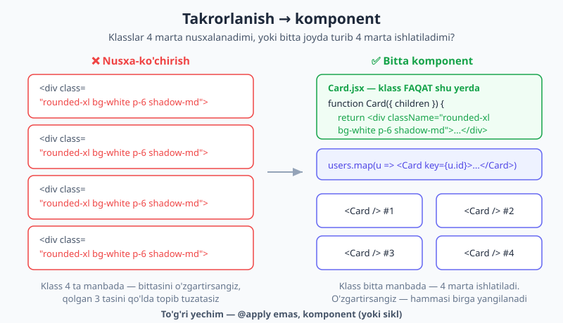
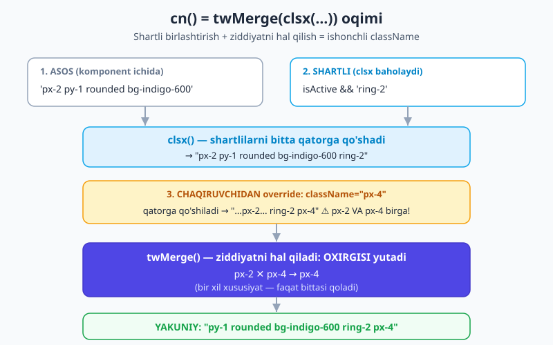
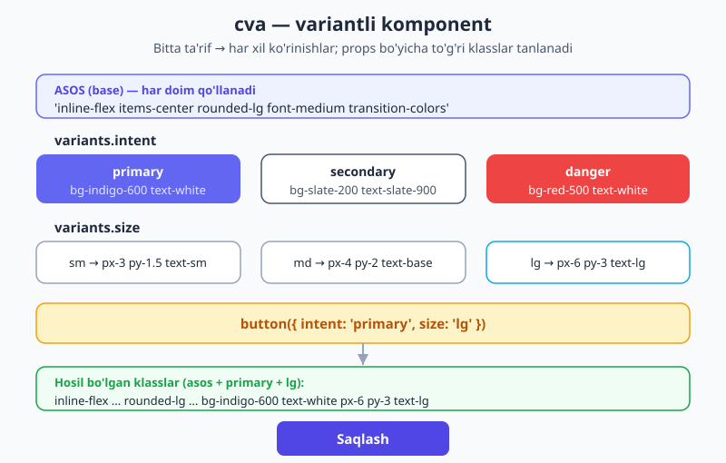

# 22 — Komponentlar va framework integratsiyasi

[⬅️ Oldingi: 21 — Plaginlar ekotizimi](./21-plaginlar.md) · [🏠 README](./README.md) · [Keyingi: 23 — Forma va UI komponentlari amaliy ➡️](./23-forma-ui-komponentlar.md)

> **Bu bobda:** [03-bobda](./03-utility-first-ish-jarayoni.md) ko'tarilgan eng katta savolga — *"shu 8 ta klassni har joyda takrorlaymanmi?!"* — nihoyat to'liq, professional javob beramiz. Takrorlanishni **CSS darajasida** (`@apply`) emas, **komponent darajasida** hal qilishni o'rganamiz; `@apply` qachon o'rinli-yu qachon tuzoq ekanini ajratamiz; React/Vue/Svelte'da klass yozish naqshlarini va eng xavfli **dinamik klass tuzog'i**ni ko'ramiz; so'ng zamonaviy asboblar — `clsx`, `tailwind-merge` (`twMerge`), `cn` yordamchisi va `class-variance-authority` (`cva`) — bilan **production darajasidagi qayta ishlatiladigan `<Button>`** quramiz. Bob oxirida siz "klass takrorlanishi" muammosidan butunlay qutulgan bo'lasiz.

---

## 22.1 Avval nega? — takrorlanish muammosi, to'g'ri javob bilan

[03-bobda](./03-utility-first-ish-jarayoni.md) sizni bir va'da bilan qoldirgandik: utility klasslar takrorlanadi, lekin yechim siz o'ylagandek `@apply` emas — keyinroq batafsil ko'ramiz, degandik. Mana o'sha "keyinroq" yetib keldi.

Muammoni yana bir bor aniq qo'yaylik. Sizda foydalanuvchilar ro'yxati bor, har biri karta ko'rinishida. Karta klasslari — `rounded-xl bg-white p-6 shadow-md`. Savol: 20 ta foydalanuvchi uchun shu 4 ta klassni **20 marta** yozasizmi?

Birinchi instinkt — "CSS faylda `.card` deb klass yasayman, `@apply` bilan utility'larni unga yig'aman". **To'xtang.** Bu deyarli har doim noto'g'ri javob. Sababini chuqur tushunish — bu bobning yuragi.

**To'g'ri javob:** takrorlanishni siz allaqachon kun bo'yi qiladigan vosita bilan hal qiling — **abstraksiya komponent darajasida**. Ya'ni siklda (`.map()`) yoki haqiqiy komponentda (React/Vue/Svelte) klasslar **bitta joyda** yashaydi, ko'p marta ishlatiladi.

> 💡 **Analogiya.** Tasavvur qiling, bir xil xatni 20 kishiga yuborasiz. Xatni 20 marta qo'lda ko'chirib yozasizmi? Yo'q — bitta **shablon** yozasiz, pochta dasturi uni 20 marta yuboradi. Komponent ham xuddi shu: klass qatori — shablon, sikl yoki render uni takrorlaydi. Siz takrorlamaysiz — kompyuter takrorlaydi.

Mana React'da to'g'ri va noto'g'ri yondashuv yonma-yon:

```jsx
// ❌ Nusxa-ko'chirish — klass 4 ta manbada
<div className="rounded-xl bg-white p-6 shadow-md">{users[0].name}</div>
<div className="rounded-xl bg-white p-6 shadow-md">{users[1].name}</div>
<div className="rounded-xl bg-white p-6 shadow-md">{users[2].name}</div>
<div className="rounded-xl bg-white p-6 shadow-md">{users[3].name}</div>

// ✅ Komponent + sikl — klass BITTA manbada
function Card({ children }) {
  return <div className="rounded-xl bg-white p-6 shadow-md">{children}</div>;
}

{users.map((u) => <Card key={u.id}>{u.name}</Card>)}
```

Pastki variantda `rounded-xl bg-white p-6 shadow-md` faqat **bir joyda** turibdi — `Card` ichida. Soyani `shadow-md` dan `shadow-lg` ga o'zgartirmoqchimisiz? Bitta qatorni tahrirlaysiz, hamma kartalar birga yangilanadi. Yuqoridagi noto'g'ri variantda esa 4 (yoki 20) joyni qo'lda topib tuzatasiz.



E'tibor bering — bu yerda **hech qanday yangi CSS fayl, hech qanday `@apply`, hech qanday nom o'ylab topish yo'q.** Klasslar HTML/JSX bilan bir joyda qoldi (ko-lokatsiya saqlandi), lekin takrorlanish yo'qoldi. Mana shu — utility-first'ning markaziy va'dasi.

> 📌 **Asosiy saboq, bir jumlada.** Tailwind'da takrorlanishni **shablon darajasida** (komponent/sikl) hal qiling, **CSS darajasida** (`@apply`) emas.

---

## 22.2 `@apply` — qachon ha, qachon yo'q

`@apply` ni [20-bobda](./20-direktiva-funksiyalar.md) ko'rgansiz: u utility'larni oddiy CSS qoidasiga "yig'ib" beradi. Demak savol "u nima qiladi" emas — savol **"qachon ishlataman"**.

Avval **nega ko'pincha yo'q** ekanini tushunaylik. Har bir komponentni `@apply` bilan CSS'da qayta qurish degani:

- **Ko-lokatsiyani yo'qotasiz.** Yana HTML'dan CSS faylga sakrash, yana nom o'ylab topish — utility-first nimadan qutqargan bo'lsa, hammasi qaytadi.
- **Ikkinchi haqiqat manbai paydo bo'ladi.** Stil endi ikki joyda: utility'lar va sizning `.card` qoidangiz. Ular vaqt o'tib bir-biridan uzoqlashadi.
- **Spetsifiklik va tartib muammolari.** `@apply` bilan yasalган klass variantlar (`hover:`, `md:`) bilan kutilmagan tarzda kurashadi; CSS tartibi (ordering) sizdan tashqarida hal bo'ladi.

Endi **qachon ha**. `@apply` uchta tor holatda haqiqatan o'rinli:

1. **Framework'lardan mustaqil global "primitiv"lar.** Loyihada React komponenti, oddiy HTML va Markdown bir vaqtda bor — hammasiga umumiy `.btn` kerak bo'lsa.
2. **Uchinchi tomon (third-party) markup'ini stillash.** Siz HTML'ini o'zgartira olmaydigan kutubxona (masalan, kalendar yoki tahrirlagich) chiqargan elementlarga klass qo'sha olmaysiz — selektor orqali yetib borasiz.
3. **Chinakam global, kichik naqshlar.** Masalan, blog matni ichidagi barcha havolalar.

Mana 3-holat — `@apply` haqiqatan to'g'ri keladigan tipik misol. Markdown'dan kelgan `.prose a` markup'iga siz klass qo'sha olmaysiz, lekin barcha havolalar bir xil ko'rinishi kerak:

```css
/* app.css */
@layer components {
  .prose a {
    @apply text-indigo-600 underline underline-offset-2 hover:text-indigo-800;
  }
}
```

> ⚠️ **v4 nozikligi — `@reference`.** Yuqoridagi misol asosiy CSS faylida (`@import "tailwindcss";` bor joyda) ishlaydi. Lekin Vue/Svelte/Astro komponentining **scoped `<style>` bloki** ichida `@apply` yoki `theme()` ishlatsangiz, u blok Tailwind kontekstini ko'rmaydi — shuning uchun blok boshida `@reference "../app.css";` yozishingiz **shart**. Buni [20-bobda](./20-direktiva-funksiyalar.md) batafsil ko'rgansiz; bu yerda eslatib o'tamiz, chunki framework komponentlarida bu eng ko'p uchraydigan "nega ishlamayapti" sababi.

> 💡 **Soddacha qoida.** `@apply` ni o'zingiz markup'ini boshqaradigan komponent uchun ishlatmang — u yerda komponent abstraksiyasi (22.1) deyarli har doim yaxshiroq. `@apply` ni faqat siz klass qo'sha olmaydigan yoki framework chegarasidan o'tadigan joyda saqlang.

---

## 22.3 Framework asoslari — `className` va `class`

Endi klasslarni framework'larda qanday yozishni ko'raylik. Asosiy farq sodda: **React/JSX** `className` ishlatadi (chunki `class` JavaScript'da band so'z), qolganlar — **Vue, Svelte, Astro, oddiy HTML** — `class` ishlatadi.

```jsx
// React / JSX
<button className="px-4 py-2 bg-indigo-600 text-white rounded-lg">Tugma</button>
```

```html
<!-- Vue / Svelte / Astro / HTML -->
<button class="px-4 py-2 bg-indigo-600 text-white rounded-lg">Tugma</button>
```

Klass — bu shunchaki **string**, demak uni dinamik qura olasiz: shablon literali (`` `...` ``), Vue'ning `:class` bog'lamasi, Svelte'ning `class:` direktivasi orqali. Aynan shu yerda eng katta tuzoq yashiringan.

---

## 22.4 ENG MUHIM TUZOQ — dinamik klass nomini "yig'ish"

Bu — Tailwind'da yangi kelgan har bir kishini kamida bir marta chalg'itadigan xato. Diqqat bilan o'qing.

Tailwind klasslarni qayerdan biladi? U sizning **manba fayllaringizni o'qib (scan qilib)**, ichidagi **to'liq klass nomlarini** topadi va faqat o'shalar uchun CSS yaratadi. Demak skaner faqat **matn sifatida ko'rgan** klassni biladi.

Endi quyidagi "aqlli" kodga qarang:

```jsx
// ❌ ISHLAMAYDI — skaner bu klassni hech qachon ko'rmaydi
function Badge({ color }) {
  return <span className={`text-${color}-500 bg-${color}-100`}>...</span>;
}

<Badge color="red" />   // text-red-500 kutasiz...
```

Mantiqan `color="red"` bo'lsa `text-red-500` chiqishi kerakdek. Lekin **chiqmaydi**. Sabab: skaner faylda `text-${color}-500` degan parchani ko'radi — bu to'liq klass emas, u `text-red-500` degan satrni hech qachon topmaydi (u faqat **ishlash vaqtida** birikadi). Tailwind esa ishlash vaqtini ko'rmaydi — u faqat statik matnni ko'radi. Natijada `text-red-500` CSS'i **umuman generatsiya qilinmaydi**, va badge rangsiz chiqadi.

> 📌 **Oltin qoida.** Klass nomini **hech qachon string birikmasidan yig'mang**. Skaner to'liq klass nomini matn sifatida ko'ra olishi shart.

**To'g'ri yechim — qidiruv obyekti (lookup map).** To'liq klass nomlarini oldindan, statik holda yozib qo'yasiz, prop esa shulardan birini **tanlaydi**:

```jsx
// ✅ TO'G'RI — to'liq klasslar statik matnda turibdi
const COLORS = {
  red:   "text-red-500 bg-red-100",
  green: "text-green-500 bg-green-100",
  blue:  "text-blue-500 bg-blue-100",
};

function Badge({ color = "blue" }) {
  return <span className={COLORS[color]}>...</span>;
}
```

Endi skaner faylda `text-red-500`, `text-green-500`, `text-blue-500` ni **to'liq matn** sifatida ko'radi — hammasi generatsiya qilinadi. `color` propi esa shu tayyor variantlardan birini tanlaydi, klass **yasamaydi**.

> 💡 Ag klass nomlari haqiqatan tashqi/dinamik manbadan kelsa (masalan CMS'dan) va ularni statik yoza olmasangiz, oxirgi chora — `@source inline(...)` bilan kerakli klasslarni qo'lda "ro'yxatdan o'tkazish". Buni [20-bobda](./20-direktiva-funksiyalar.md) ko'rgansiz. Lekin 99% holatda lookup obyekti to'g'ri va yetarli yechim.

---

## 22.5 `clsx` — klasslarni shartli birlashtirish

Komponentlar ko'pincha klasslarni **shartga qarab** qo'shadi: tugma faol bo'lsa boshqa rang, o'chiq bo'lsa xira. Sof JavaScript'da bu tez "ternar botqog'i"ga aylanadi:

```jsx
// 😩 O'qish qiyin — ternar va string yopishtirish aralashmasi
className={"px-4 py-2 " + (isActive ? "bg-indigo-600 text-white " : "") + (isDisabled ? "opacity-50 " : "")}
```

`clsx` (kichik, mashhur kutubxona) aynan shuni tozalaydi. U argumentlarni qabul qiladi va **faqat "rost" bo'lganlarini** bo'sh joy bilan birlashtiradi:

```jsx
import clsx from "clsx";

className={clsx(
  "px-4 py-2",                       // har doim
  isActive && "bg-indigo-600 text-white",   // faqat faol bo'lsa
  isDisabled && "opacity-50",        // faqat o'chiq bo'lsa
  { "ring-2 ring-indigo-400": isFocused }    // obyekt ko'rinishi ham mumkin
)}
```

`false`, `undefined`, `null` — hammasi e'tiborsiz tashlanadi. Natija — toza, o'qiladigan, shartli klass qatori. `clsx` **ziddiyatni hal qilmaydi** — u shunchaki rost bo'lganlarni qo'shadi. Ziddiyat — keyingi asbobning vazifasi.

---

## 22.6 `tailwind-merge` (`twMerge`) — ziddiyatni hal qilish

Mana nozik, lekin juda muhim muammo. Komponentingizda asosiy `px-2` bor, lekin chaqiruvchi `px-4` bilan ustiga yozmoqchi. Ikkalasini birlashtirsangiz, satrda **ikkalasi ham** qoladi:

```html
<button class="px-2 py-1 px-4">...</button>
```

Endi qaysi biri yutadi? CSS'da bir xil spetsifiklikdagi qoidalar uchun **manba tartibi** hal qiladi — lekin bu Tailwind'ning generatsiya qilingan CSS faylidagi tartib, sizning satringizdagi tartib emas. Ya'ni natija **aniqlanmagan (undefined)** — `px-2` ham, `px-4` ham yutishi mumkin. Bu "override ishlamayapti" degan jumboqning eng keng tarqalgan sababi.

`tailwind-merge` (qisqacha `twMerge`) shu muammoni hal qiladi: u **ziddiyatli** Tailwind klasslarini taniydi va har bir xususiyat uchun faqat **oxirgisini** qoldiradi:

```js
import { twMerge } from "tailwind-merge";

twMerge("px-2 px-4");               // → "px-4"   (oxirgisi yutadi)
twMerge("px-2 py-1 bg-red-500 bg-blue-500");  // → "px-2 py-1 bg-blue-500"
twMerge("text-sm text-lg");         // → "text-lg"
```

Diqqat — `twMerge` faqat **ziddiyatli** (bir xil CSS xususiyatini boshqaradigan) klasslarni o'chiradi. `px-2` va `py-1` ziddiyatli emas (biri gorizontal, biri vertikal padding), shuning uchun ikkalasi ham qoladi. Bu — oddiy string yopishtirishdan tubdan farqi.

> 📌 `twMerge` aynan **`className` propini qabul qiladigan** komponentlar uchun zarur. Propsiz oddiy komponentda ziddiyat bo'lmaydi, demak u kerak emas.

---

## 22.7 `cn` yordamchisi — `clsx` va `twMerge` ni birlashtirish

`clsx` shartlilarni birlashtiradi, `twMerge` ziddiyatni hal qiladi — ikkalasi ham kerak. Shuning uchun jamoalar ularni bitta kichik yordamchiga o'raydi. Bu naqshni `shadcn/ui` ommalashtirdi va u amalda standartga aylandi — odatda `cn` (yoki `clsx`) deb nomlanadi:

```js
// lib/utils.js
import clsx from "clsx";
import { twMerge } from "tailwind-merge";

export function cn(...inputs) {
  return twMerge(clsx(inputs));
}
```

Ichkarida: avval `clsx` shartli argumentlarni bitta qatorga yig'adi, so'ng `twMerge` o'sha qatordagi ziddiyatlarni hal qiladi. Endi `cn` — bitta universal vosita: ham shartli, ham ziddiyatga chidamli.

Mana u `className` propini qabul qiladigan tugmada qanday ishlaydi:

```jsx
import { cn } from "@/lib/utils";

function Button({ className, ...props }) {
  return (
    <button
      className={cn(
        "px-4 py-2 rounded-lg bg-indigo-600 text-white",  // asos
        className                                          // chaqiruvchining override'i
      )}
      {...props}
    />
  );
}

// Chaqiruvchi paddingni o'zgartiradi:
<Button className="px-8">Keng tugma</Button>
```

Bu yerda asos `px-4`, chaqiruvchi `px-8` berdi. `cn` ichidagi `twMerge` ziddiyatni hal qiladi — natija `px-8` (oxirgisi yutadi), `px-4` esa tushib qoladi. Agar oddiy string yopishtirish ishlatganingizda, `px-4 px-8` ikkalasi ham qolib, natija aniqlanmagan bo'lardi.



> 💡 **Eslab qoling.** `className` prop + `cn` = chaqiruvchi komponentni ishonchli sozlay oladi. `className` ni shunchaki yopishtirish (`"asos " + className`) esa override'ni **jimgina** ishlamay qoldiradi — bu eng ko'p uchraydigan "men override berdim, lekin o'zgarmadi" xatosi.

---

## 22.8 `cva` — variantli komponentlar

Tugmaning bir nechta **ko'rinishi** bo'ladi: asosiy (primary), ikkilamchi (secondary), xavfli (danger); kichik, o'rta, katta. Buni `cn` bilan qo'lda boshqarish (har bir kombinatsiya uchun `if`) tez chalkashadi. `class-variance-authority` (qisqacha **`cva`**) aynan shu uchun: siz **variantlar jadvalini** e'lon qilasiz, u esa props bo'yicha to'g'ri klasslarni qaytaradi.

```js
import { cva } from "class-variance-authority";

const button = cva(
  // 1. ASOS — har doim qo'llanadigan klasslar
  "inline-flex items-center justify-center rounded-lg font-medium transition-colors",
  {
    // 2. VARIANTLAR
    variants: {
      intent: {
        primary:   "bg-indigo-600 text-white hover:bg-indigo-700",
        secondary: "bg-slate-200 text-slate-900 hover:bg-slate-300",
        danger:    "bg-red-500 text-white hover:bg-red-600",
      },
      size: {
        sm: "px-3 py-1.5 text-sm",
        md: "px-4 py-2 text-base",
        lg: "px-6 py-3 text-lg",
      },
    },
    // 3. STANDART — prop berilmasa shu ishlatiladi
    defaultVariants: {
      intent: "primary",
      size: "md",
    },
  }
);
```

Endi chaqirish — kerakli variantni nom bilan tanlaysiz, `cva` to'g'ri klasslarni yig'ib beradi:

```js
button({ intent: "primary", size: "lg" });
// → "inline-flex ... rounded-lg ... bg-indigo-600 text-white hover:bg-indigo-700 px-6 py-3 text-lg"

button({ intent: "danger" });          // size standart "md" bo'ladi
button();                               // ikkalasi ham standart: primary + md
```



`cva` ning yana bir ustunligi — **tiplangan (typed)**. TypeScript'da `intent`/`size` propslari avtomatik tiplanadi, noto'g'ri qiymat (`intent: "purple"`) kompilyatsiya xatosini beradi. Variantlar ham [18-bobdagi](./18-theme-dizayn-tizimi.md) dizayn tokenlariga tabiiy bog'lanadi: `intent` qiymatlari semantik tokenlarni (`bg-primary`, `bg-danger`) ishlatsa, tema o'zgarganda variantlar avtomatik moslashadi.

> 💡 **Muqobil — `tailwind-variants` (`tv`).** `cva` ga juda o'xshash yana bir kutubxona bor: `tailwind-variants`. Uning ikkita qo'shimcha qulayligi: **slotlar** (bitta komponentning bir nechta qismini — masalan tugmaning ikonkasi va matni — alohida stillash) va **ichiga qurilgan `twMerge`** (ziddiyat avtomatik hal bo'ladi). Agar komponentlaringiz ko'p qismli bo'lsa, `tv` ni ko'rib chiqing; oddiy holatlar uchun `cva` yetarli.

---

## 22.9 Hammasini birlashtirish — production darajasidagi `<Button>`

Endi `cva` (variantlar) va `cn` (`className` override + ziddiyat) ni birlashtiramiz. Mana Tailwind ekotizimidagi **kanonik, qayta ishlatiladigan tugma** — `shadcn/ui` aynan shu naqshda qurilgan:

```jsx
import { cva } from "class-variance-authority";
import { cn } from "@/lib/utils";

const buttonVariants = cva(
  "inline-flex items-center justify-center rounded-lg font-medium transition-colors " +
    "focus-visible:outline-none focus-visible:ring-2 focus-visible:ring-indigo-400 " +
    "disabled:opacity-50 disabled:pointer-events-none",
  {
    variants: {
      intent: {
        primary:   "bg-indigo-600 text-white hover:bg-indigo-700",
        secondary: "bg-slate-200 text-slate-900 hover:bg-slate-300",
        danger:    "bg-red-500 text-white hover:bg-red-600",
      },
      size: {
        sm: "px-3 py-1.5 text-sm",
        md: "px-4 py-2 text-base",
        lg: "px-6 py-3 text-lg",
      },
    },
    defaultVariants: { intent: "primary", size: "md" },
  }
);

export function Button({ intent, size, className, ...props }) {
  return (
    <button
      className={cn(buttonVariants({ intent, size }), className)}
      {...props}
    />
  );
}
```

`className={cn(buttonVariants({ intent, size }), className)}` — bu qatorda butun bobning mohiyati jamlangan:

1. `buttonVariants({ intent, size })` — `cva` props bo'yicha to'g'ri variant klasslarini beradi.
2. `cn(..., className)` — `twMerge` orqali chaqiruvchining `className` override'i variant klasslari bilan **ziddiyatsiz** birlashadi (oxirgisi yutadi).

Foydalanish — toza va kuchli:

```jsx
<Button>Saqlash</Button>                                  {/* primary + md */}
<Button intent="danger" size="sm">O'chirish</Button>
<Button intent="secondary" className="w-full">Bekor qilish</Button>  {/* to'liq kenglik override */}
```

Oxirgi misolda `secondary` variant `w-full` bilan kengaytirildi — `className` orqali, ziddiyatsiz. Bitta `<Button>` ta'rifi — cheksiz ko'rinish.

---

## 22.10 Qisqacha Vue misoli

Tushuncha framework'dan mustaqil. Vue'da `cn`/`cva` xuddi shunday ishlaydi, faqat `:class` bog'lamasi orqali ulaysiz:

```vue
<script setup>
import { computed } from "vue";
import { cva } from "class-variance-authority";
import { cn } from "@/lib/utils";

const props = defineProps({ intent: String, size: String, class: String });

const button = cva("inline-flex items-center rounded-lg font-medium transition-colors", {
  variants: {
    intent: { primary: "bg-indigo-600 text-white", secondary: "bg-slate-200 text-slate-900" },
    size: { sm: "px-3 py-1.5 text-sm", md: "px-4 py-2 text-base" },
  },
  defaultVariants: { intent: "primary", size: "md" },
});

const classes = computed(() =>
  cn(button({ intent: props.intent, size: props.size }), props.class)
);
</script>

<template>
  <button :class="classes"><slot /></button>
</template>
```

> ⚠️ Agar shu Vue komponentining `<style scoped>` blokida `@apply` yoki `theme()` ishlatsangiz, blok boshida `@reference "../app.css";` yozishni unutmang — [20-bobda](./20-direktiva-funksiyalar.md) ko'rganimizdek, scoped blok Tailwind kontekstini avtomatik ko'rmaydi. Yuqoridagi misol esa faqat utility klasslar bilan ishlagani uchun bunga muhtoj emas.

---

## 22.11 Tez-tez uchraydigan xatolar

- **Dinamik klass nomini yig'ish** — `` `text-${color}-500` ``. Skaner uni ko'rmaydi, klass generatsiya qilinmaydi. Lookup obyekti yoki `@source inline(...)` ishlating (22.4).
- **`@apply` ni ortiqcha ishlatish** — o'z markup'ingizni boshqaradigan har bir komponentni CSS'da qayta qurish. Buning o'rniga komponent abstraksiyasi (22.1). `@apply` faqat global/uchinchi-tomon holatlari uchun.
- **`twMerge` siz `className` qabul qilish** — `"asos " + className` yopishtirish override'ni jimgina ishlamay qoldiradi (`px-4 px-8` ikkalasi qoladi, qaysi biri yutishi noaniq). Doim `cn` orqali birlashtiring (22.7).
- **`@reference` ni unutish** — Vue/Svelte/Astro scoped `<style>` da `@apply` ishlatib, "nega ishlamayapti" deb hayron bo'lish. v4 da scoped blok `@reference "../app.css";` talab qiladi (22.10, [20-bob](./20-direktiva-funksiyalar.md)).
- **`clsx` va `twMerge` ni adashtirish** — `clsx` shartlilarni qo'shadi, ziddiyatni **hal qilmaydi**; `twMerge` ziddiyatni hal qiladi. Komponentga ikkalasi ham kerak — shuning uchun `cn` ularni birlashtiradi.
- **Variant uchun `if`/ternar botqog'i** — har bir intent/size kombinatsiyasini qo'lda yozish. `cva` (yoki `tv`) buni jadvalga aylantiradi (22.8).

> 🔭 **Oldinga qarash.** Endi sizda qayta ishlatiladigan komponent qurishning to'liq asboblar to'plami bor: komponent abstraksiyasi, `clsx`, `twMerge`, `cn` va `cva`. [Keyingi bobda](./23-forma-ui-komponentlar.md) shu asboblarni ishga solib, haqiqiy UI komponentlari — formalar, inputlar, modallar va kartalar — quramiz. Bu bobning `<Button>`'i — o'sha amaliyotning birinchi g'ishti.

---

## Mashqlar

**1-mashq.** Bir hamkasbingiz 12 ta mahsulot kartasini ko'rsatish uchun `class="rounded-xl bg-white p-6 shadow-md"` ni JSX'da 12 marta nusxalagan. Endi soyani `shadow-lg` ga o'zgartirish kerak. Nima uchun bu yondashuv muammoli, va to'g'ri yechim qanday? Qisqa kod bilan ko'rsating.

<details markdown="1"><summary>Yechim</summary>

Muammo: klass 12 ta manbada — bittasini o'zgartirsangiz, qolgan 11 tasini qo'lda topib tuzatishingiz kerak (xato kiritish ehtimoli yuqori, kod shishadi). To'g'ri yechim — **komponent abstraksiyasi**: klassni bir joyda saqlash.

```jsx
function ProductCard({ children }) {
  return <div className="rounded-xl bg-white p-6 shadow-md">{children}</div>;
}

{products.map((p) => <ProductCard key={p.id}>{p.name}</ProductCard>)}
```

Endi `shadow-md` → `shadow-lg` o'zgarishi **bitta joyda** qilinadi, 12 ta karta birga yangilanadi. `@apply` shart emas — klass JSX'da, ko-lokatsiya saqlanadi.

</details>

**2-mashq.** Quyidagi React kodi `bg-green-100` ni hech qachon chiqarmaydi. Sababini ayting va tuzating.

```jsx
function Tag({ tone }) {
  return <span className={`bg-${tone}-100 text-${tone}-700`}>{tone}</span>;
}
<Tag tone="green" />
```

<details markdown="1"><summary>Yechim</summary>

**Sabab:** klass nomi string birikmasidan **ishlash vaqtida** yig'iladi. Tailwind skaneri faylda faqat `bg-${tone}-100` parchasini ko'radi — `bg-green-100` degan **to'liq matn** hech qachon faylda yo'q, shuning uchun u CSS generatsiya qilmaydi.

**Tuzatish — lookup obyekti** (to'liq klasslar statik matnda):

```jsx
const TONES = {
  green: "bg-green-100 text-green-700",
  red:   "bg-red-100 text-red-700",
  blue:  "bg-blue-100 text-blue-700",
};

function Tag({ tone = "blue" }) {
  return <span className={TONES[tone]}>{tone}</span>;
}
```

Endi skaner `bg-green-100`, `bg-red-100`, `bg-blue-100` ni to'liq ko'radi va generatsiya qiladi. (Agar tonlar tashqi/dinamik manbadan kelsa — `@source inline(...)`, [20-bob](./20-direktiva-funksiyalar.md).)

</details>

**3-mashq.** `clsx` va `twMerge` orasidagi farqni bitta jumlada tushuntiring. Quyidagi har bir chaqiruv nima qaytaradi?

```js
clsx("px-2", false && "hidden", "px-4")
twMerge("px-2 px-4")
```

<details markdown="1"><summary>Yechim</summary>

**Farq:** `clsx` faqat **"rost" argumentlarni birlashtiradi** (ziddiyatga qaramaydi); `twMerge` esa **ziddiyatli Tailwind klasslarini hal qiladi** (bir xil xususiyat uchun oxirgisini qoldiradi).

- `clsx("px-2", false && "hidden", "px-4")` → `"px-2 px-4"` — `false` tashlanadi, qolgan ikkalasi qoladi (ziddiyat hal **qilinmaydi**).
- `twMerge("px-2 px-4")` → `"px-4"` — ikkalasi ham horizontal paddingni boshqaradi, oxirgisi yutadi.

Shuning uchun komponentga ikkalasi ham kerak: `cn = (...x) => twMerge(clsx(x))`.

</details>

**4-mashq.** Quyidagi tugma komponentida chaqiruvchi `className="bg-red-500"` bersa ham, fon ko'k (`bg-indigo-600`) bo'lib qolyapti — yoki natija oldindan aytib bo'lmaydigan. Sababini toping va tuzating.

```jsx
function Button({ className, ...props }) {
  return <button className={"bg-indigo-600 text-white px-4 py-2 " + className} {...props} />;
}
<Button className="bg-red-500">O'chirish</Button>
```

<details markdown="1"><summary>Yechim</summary>

**Sabab:** klasslar oddiy string yopishtirish bilan birlashtirilgan, shuning uchun natija `"bg-indigo-600 ... bg-red-500"` — **ikkala** fon klassi ham satrda qoladi. Qaysi biri yutishi sizning satringizdagi tartibga emas, Tailwind generatsiya qilgan CSS faylidagi tartibga bog'liq, ya'ni override **ishonchsiz**.

**Tuzatish — `cn` (`twMerge` ichida) ishlatish:**

```jsx
import { cn } from "@/lib/utils";

function Button({ className, ...props }) {
  return <button className={cn("bg-indigo-600 text-white px-4 py-2", className)} {...props} />;
}
```

Endi `twMerge` `bg-indigo-600` va `bg-red-500` ziddiyatini taniydi, oxirgisini (`bg-red-500`) qoldiradi — override ishonchli ishlaydi.

</details>

**5-mashq.** `cva` bilan **uchta intent** (primary/secondary/ghost) va **ikkita size** (sm/lg) ga ega `badge` ta'rifini yozing; standart — primary + sm. So'ng `badge({ intent: "ghost", size: "lg" })` chaqiruvini va `badge()` (standart) ni ko'rsating.

<details markdown="1"><summary>Yechim</summary>

```js
import { cva } from "class-variance-authority";

const badge = cva("inline-flex items-center rounded-full font-medium", {
  variants: {
    intent: {
      primary:   "bg-indigo-600 text-white",
      secondary: "bg-slate-200 text-slate-800",
      ghost:     "bg-transparent text-slate-600 border border-slate-300",
    },
    size: {
      sm: "px-2.5 py-0.5 text-xs",
      lg: "px-4 py-1.5 text-sm",
    },
  },
  defaultVariants: { intent: "primary", size: "sm" },
});

badge({ intent: "ghost", size: "lg" });
// → "inline-flex items-center rounded-full font-medium bg-transparent text-slate-600 border border-slate-300 px-4 py-1.5 text-sm"

badge();
// → "inline-flex items-center rounded-full font-medium bg-indigo-600 text-white px-2.5 py-0.5 text-xs"  (standart: primary + sm)
```

</details>

**6-mashq.** Loyihangizda Markdown'dan render bo'ladigan blog matni bor. Ichidagi barcha `<blockquote>` larga chap chegara va xira matn berishingiz kerak — lekin Markdown generatsiya qilgan HTML'ga klass qo'sha olmaysiz. `@apply` bu yerda **o'rinli** holatga misolmi? Kod yozing va nega komponent abstraksiyasi bu yerda ishlamasligini ayting.

<details markdown="1"><summary>Yechim</summary>

Ha — bu `@apply` o'rinli bo'lgan tipik holat: siz markup'ni **boshqarmaysiz** (u Markdown'dan keladi), shuning uchun komponent abstraksiyasi yoki `className` qo'shish **mumkin emas**. Yagona yo'l — selektor orqali yetib borish:

```css
@layer components {
  .prose blockquote {
    @apply border-l-4 border-slate-300 pl-4 text-slate-600 italic;
  }
}
```

Nega komponent ishlamaydi: komponent abstraksiyasi siz `<Quote>` yozib, unga `className` qo'ya olganingda ishlaydi. Bu yerda HTML'ni Markdown protsessori chiqaradi — sizning qo'lingizda `<blockquote>` ga klass yozish imkoni yo'q. Demak `@apply` + selektor — to'g'ri tanlov.

> Eslatma: agar bu CSS Vue/Svelte scoped `<style>` blokida bo'lsa, boshida `@reference "../app.css";` kerak bo'ladi ([20-bob](./20-direktiva-funksiyalar.md)).

</details>

---

[⬅️ Oldingi: 21 — Plaginlar ekotizimi](./21-plaginlar.md) · [🏠 README](./README.md) · [Keyingi: 23 — Forma va UI komponentlari amaliy ➡️](./23-forma-ui-komponentlar.md)
