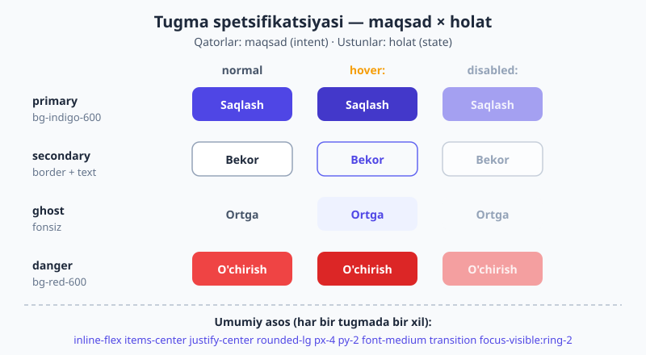
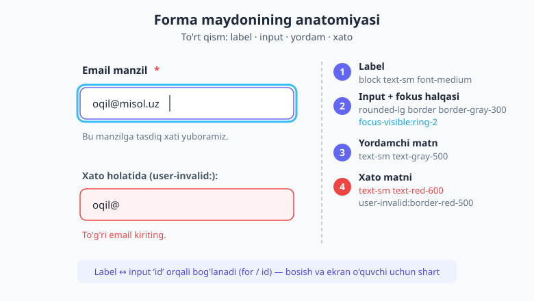
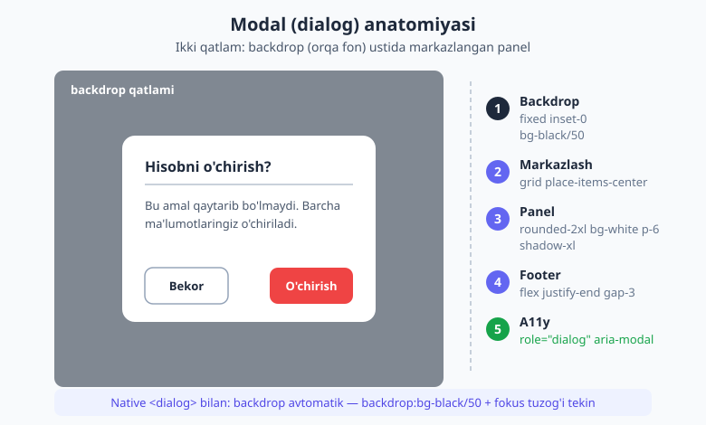

# 23 — Forma va UI komponentlari amaliy

[⬅️ Oldingi: 22 — Komponentlar va framework integratsiyasi](./22-komponentlar-framework.md) · [🏠 README](./README.md) · [Keyingi: 24 — Production: optimizatsiya va asboblar ➡️](./24-production-optimizatsiya.md)

> **Bu bobda:** Nazariyani yig'ishtirib, har bir ilovaga kerak bo'ladigan **haqiqiy UI komponentlar**ini noldan quramiz — to'liq, nusxa-ko'chir-yopishtir HTML bilan. **Tugmalar** (primary/secondary/ghost/danger, o'lcham, ikonka, yuklanish, o'chiq); **forma maydonlari** (`@tailwindcss/forms` bilan: input + label + yordam + xato, select, textarea, checkbox/radio, toggle, fayl, ikonkali input); qayta ishlatiladigan **maydon naqshi**; **kartalar** (oddiy, rasmli, hover, narx, `@container`-responsiv); **belgilar/teglar/chiplar/ogohlantirishlar**; **navbar** (mobil hamburger bilan); **modal/dialog** (backdrop + panel, yoki native `<dialog>`); **dropdown** menyu; **tooltip**; va boshidan oxirigacha — **erishimlilik (a11y)**. Bu bob — 4–17-boblarda o'rgangan hamma narsani bitta joyga jamlaydi.

---

## 23.1 Avval nega? — komponent degani aslida "klass to'plami"

To'xtang va bir savol bering: nima uchun alohida "komponent boby" kerak? Axir biz allaqachon spacing, rang, flexbox, holat variantlarini bilamiz-ku?

Sabab shundaki, **haqiqiy ilova alohida utility'lardan emas, balki takrorlanuvchi `klass to'plamlari`dan tuziladi.** Har bir ilovada tugma bor. Har birida input bor. Har birida karta, modal, navbar bor. Bularning har biri — o'nlab utility'ning **ataylab tanlangan kombinatsiyasi**. Bir marta to'g'ri yig'ib qo'ysangiz, butun loyihada qayta ishlatasiz.

Shu sababli bu bob — "yangi sintaksis" emas. Bu — **resept kitobi**. Har bir komponent uchun biz uchta narsani ko'rsatamiz:

1. **To'liq HTML** — copy-paste qilib darrov ishlatasiz.
2. **Klass tanlovi izohi** — nega aynan shu utility, nega boshqasi emas.
3. **Holatlar va a11y** — fokus, hover, disabled; label bog'lanishi, `aria-*`.

> 📌 **Atama eslatmasi.** **Komponent** — bu yerda React/Vue komponenti emas (u haqida [22-bobda](./22-komponentlar-framework.md) gaplashamiz). Bu yerda komponent — **takrorlanuvchi HTML + klass naqshi**: tugma, karta, modal kabi mustaqil UI bo'lagi. Uni framework'ga o'rashdan oldin, avval HTML darajasida to'g'ri qurish kerak.

---

## 23.2 Tugmalar — eng asosiy komponent

Tugma — eng ko'p ishlatiladigan, shu sababli eng **standartlashtirilishi kerak** bo'lgan element. Maqsadimiz — bitta **umumiy asos** (base) klass to'plami, ustiga esa **maqsad** (intent) ranglari.

### Kanonik asos to'plami

Har bir tugmada, maqsadidan qat'i nazar, bir xil bo'ladigan klasslar:

```html
<button class="inline-flex items-center justify-center gap-2 rounded-lg
               px-4 py-2 text-sm font-medium transition
               focus-visible:outline-none focus-visible:ring-2 focus-visible:ring-offset-2
               disabled:pointer-events-none disabled:opacity-50">
  Tugma
</button>
```

Har bir bo'lakni o'qib chiqamiz:

- `inline-flex items-center justify-center gap-2` — ichidagi matn va ikonka **markazda** turadi, orasida bo'shliq (`gap-2`). Bu — ikonka qo'shganda ham hech narsa "sakramaydigan" tekislash.
- `rounded-lg px-4 py-2` — burchaklar va ichki bo'shliq. `px` (gorizontal) `py` (vertikal)dan kattaroq — tugma kvadrat emas, **kengroq** ko'rinadi.
- `text-sm font-medium` — o'qiladigan, biroz qalin yozuv.
- `transition` — rang/o'lcham o'zgarishi **silliq** bo'ladi (hover'da sakramaydi).
- `focus-visible:ring-2 focus-visible:ring-offset-2` — **klaviatura bilan** kelganda atrofida halqa. `focus:` emas, `focus-visible:` (15-bobdagi nozik farq). `ring-offset-2` — halqa tugmadan biroz uzoqlashib, fonida nafas oladi.
- `disabled:opacity-50 disabled:pointer-events-none` — o'chiq tugma xiralashadi va bosilmaydi.

> 💡 **Nega border-color'ni har doim aytamiz?** v4'da chegaraning **standart rangi** `currentColor` — ya'ni matn rangi. Agar `border` yozib, rangini aytmasangiz, chegara matn rangida chiqadi va kutilmagan ko'rinadi. Shu sababli **doim** `border-gray-300` kabi rangni qo'shing. (Halqa, chegara va radius haqida [13-bobda](./13-fon-gradient-border.md) batafsil.)

### To'rt maqsad (intent)

Endi asosga rang qo'shamiz. Mana to'rtta klassik variant:

```html
<!-- primary: asosiy harakat -->
<button class="inline-flex items-center justify-center gap-2 rounded-lg px-4 py-2 text-sm font-medium transition
               bg-indigo-600 text-white hover:bg-indigo-700
               focus-visible:outline-none focus-visible:ring-2 focus-visible:ring-indigo-500 focus-visible:ring-offset-2">
  Saqlash
</button>

<!-- secondary: ikkilamchi (chizilgan, outline) -->
<button class="inline-flex items-center justify-center gap-2 rounded-lg px-4 py-2 text-sm font-medium transition
               border border-gray-300 bg-white text-gray-700 hover:bg-gray-50
               focus-visible:outline-none focus-visible:ring-2 focus-visible:ring-indigo-500 focus-visible:ring-offset-2">
  Bekor qilish
</button>

<!-- ghost: fonsiz, eng yengil -->
<button class="inline-flex items-center justify-center gap-2 rounded-lg px-4 py-2 text-sm font-medium transition
               text-gray-700 hover:bg-gray-100
               focus-visible:outline-none focus-visible:ring-2 focus-visible:ring-indigo-500 focus-visible:ring-offset-2">
  Ortga
</button>

<!-- danger: xavfli amal -->
<button class="inline-flex items-center justify-center gap-2 rounded-lg px-4 py-2 text-sm font-medium transition
               bg-red-600 text-white hover:bg-red-700
               focus-visible:outline-none focus-visible:ring-2 focus-visible:ring-red-500 focus-visible:ring-offset-2">
  O'chirish
</button>
```

To'rt maqsad uchun **vizual ierarxiya** muhim: primary — to'la fon (eng ko'zga tashlanadigan), secondary — chiziq, ghost — fonsiz (eng kam diqqat tortadi), danger — qizil (ogohlantiruvchi). Bir ekranda bittadan ortiq primary tugma bo'lmasin — aks holda foydalanuvchi "qaysi biri asosiy?" deb adashadi.



### O'lchamlar, ikonka, yuklanish, o'chiq

```html
<!-- O'lchamlar: faqat padding + matn o'lchami o'zgaradi -->
<button class="... px-3 py-1.5 text-xs">Kichik</button>
<button class="... px-4 py-2 text-sm">O'rta</button>
<button class="... px-6 py-3 text-base">Katta</button>

<!-- Ikonka bilan (SVG ichkarida; gap-2 ularni ajratadi) -->
<button class="inline-flex items-center gap-2 rounded-lg bg-indigo-600 px-4 py-2 text-sm font-medium text-white hover:bg-indigo-700">
  <svg class="size-4" viewBox="0 0 20 20" fill="currentColor"><path d="M10 3v14M3 10h14" stroke="currentColor" stroke-width="2"/></svg>
  Qo'shish
</button>

<!-- Yuklanish holati: aylanuvchi spinner + o'chiq -->
<button class="inline-flex items-center gap-2 rounded-lg bg-indigo-600 px-4 py-2 text-sm font-medium text-white disabled:opacity-70" disabled>
  <svg class="size-4 animate-spin" viewBox="0 0 24 24" fill="none">
    <circle cx="12" cy="12" r="10" stroke="currentColor" stroke-width="3" class="opacity-25"/>
    <path d="M12 2a10 10 0 0 1 10 10" stroke="currentColor" stroke-width="3" class="opacity-90"/>
  </svg>
  Saqlanmoqda...
</button>
```

`animate-spin` — Tailwind'ning tayyor aylanish animatsiyasi (17-bob). `size-4` — `w-4 h-4`ning qisqasi: ikonka 16px. Diqqat: ikonka `currentColor` ishlatgani uchun u **matn rangini** oladi — alohida rang berish shart emas.

### Tugma guruhi (toolbar)

Bir nechta bog'liq tugmani bitta segmentlangan guruh qilish:

```html
<div class="inline-flex rounded-lg border border-gray-300 bg-white p-0.5" role="group" aria-label="Ko'rinish">
  <button class="rounded-md px-3 py-1.5 text-sm font-medium bg-indigo-600 text-white" aria-pressed="true">Ro'yxat</button>
  <button class="rounded-md px-3 py-1.5 text-sm font-medium text-gray-700 hover:bg-gray-100">Panjara</button>
  <button class="rounded-md px-3 py-1.5 text-sm font-medium text-gray-700 hover:bg-gray-100">Jadval</button>
</div>
```

`role="group"` + `aria-label` — ekran o'quvchiga "bu bog'liq tugmalar to'plami" deydi. `aria-pressed="true"` — qaysi biri faol ekanini bildiradi. Faol tugma to'la indigo, qolganlari ghost — vizual farq aniq.

---

## 23.3 Forma maydonlari — `@tailwindcss/forms` bilan

Brauzerning standart input/select/checkbox ko'rinishi har brauzerda har xil va xunuk. **`@tailwindcss/forms`** plagini ([21-bob](./21-plaginlar.md)) ularni **bir xil, neytral** asosga keltiradi — shundan keyin Tailwind utility'lari bilan bemalol stillaysiz.

```css
/* app.css */
@import "tailwindcss";
@plugin "@tailwindcss/forms";
```

Plaginsiz `border` yoki `rounded` ko'pincha input'ga ta'sir qilmaydi (brauzer standart stili ustun keladi). Plagin bilan — to'liq nazorat sizda.

### Qayta ishlatiladigan maydon naqshi

Mana butun kitob bo'ylab tayanadigan **to'rt qismli maydon**: label, input, yordamchi matn, xato matni. Buni bir marta o'rganing — qolgan hamma forma shunga quriladi.

```html
<div class="space-y-1.5">
  <label for="email" class="block text-sm font-medium text-gray-700">
    Email manzil <span class="text-red-500">*</span>
  </label>

  <input id="email" name="email" type="email" required placeholder="oqil@misol.uz"
         aria-describedby="email-hint"
         class="block w-full rounded-lg border border-gray-300 px-3 py-2 text-sm shadow-sm
                placeholder:text-gray-400
                focus:border-indigo-500 focus:ring-2 focus:ring-indigo-500 focus:outline-none
                user-invalid:border-red-500 user-invalid:ring-red-500">

  <p id="email-hint" class="text-sm text-gray-500">Bu manzilga tasdiq xati yuboramiz.</p>
</div>
```

Tahlil — har bir qism o'z vazifasiga ega:

- `<label for="email">` ↔ `<input id="email">` — bu **bog'lanish shart**. Label'ni bosish input'ni fokuslaydi, ekran o'quvchi esa "Email manzil maydoni" deb o'qiydi. Bu — eng ko'p e'tibordan chetda qoladigan a11y qoidasi.
- `block w-full` — maydon to'liq kenglikni egallaydi (formada odatiy).
- `user-invalid:border-red-500` — input **noto'g'ri to'ldirilib, undan chiqilganda** qizaradi. `invalid:` emas — chunki `invalid:` sahifa ochilishi bilanoq bo'sh `required` maydonni qizartirib yuboradi (15-bobdagi muhim nozik farq).
- `aria-describedby="email-hint"` — yordamchi matnni input bilan bog'laydi; ekran o'quvchi input'dan keyin bu izohni ham o'qiydi.



### Select va textarea

```html
<!-- Select -->
<label for="shahar" class="block text-sm font-medium text-gray-700">Shahar</label>
<select id="shahar" class="mt-1.5 block w-full rounded-lg border border-gray-300 px-3 py-2 text-sm
                           focus:border-indigo-500 focus:ring-2 focus:ring-indigo-500 focus:outline-none">
  <option>Toshkent</option>
  <option>Samarqand</option>
  <option>Buxoro</option>
</select>

<!-- Textarea: field-sizing-content bilan matn yozilgan sari o'sadi -->
<label for="izoh" class="block text-sm font-medium text-gray-700">Izoh</label>
<textarea id="izoh" rows="3" placeholder="Fikringizni yozing..."
          class="mt-1.5 block w-full resize-none field-sizing-content rounded-lg border border-gray-300 px-3 py-2 text-sm
                 focus:border-indigo-500 focus:ring-2 focus:ring-indigo-500 focus:outline-none"></textarea>
```

`field-sizing-content` — v4'dagi zamonaviy imkoniyat: textarea **mazmuniga qarab** o'zi balandlashadi, scrollbar chiqmaydi. `resize-none` — foydalanuvchi qo'lda cho'zishini o'chiradi (avtomatik o'sish bilan birga kerak emas).

### Checkbox va radio — `accent-*` bilan tez yo'l

Eng oddiy va ishonchli usul — `accent-*` utility'si. U brauzerning o'z checkbox/radio'sini bo'yaydi, hech narsa yashirish kerak emas:

```html
<label class="flex items-center gap-2 text-sm text-gray-700">
  <input type="checkbox" class="size-4 rounded accent-indigo-600">
  Shartlarga roziman
</label>

<label class="flex items-center gap-2 text-sm text-gray-700">
  <input type="radio" name="reja" class="size-4 accent-indigo-600">
  Oylik to'lov
</label>
```

`accent-indigo-600` — belgilangan checkbox/radio indigo bo'ladi. Tez, a11y-xavfsiz, klaviatura bilan ishlaydi. (To'liq custom ko'rinish kerak bo'lsa — `appearance-none` + `checked:` bilan o'zingiz chizasiz, 15-bobda ko'rdik.)

### Toggle switch — `peer-checked:` bilan

Checkbox'ni yashirib, chiroyli "kalit" chizamiz. Holatni 15-bobdagi `peer` naqshi boshqaradi:

```html
<label class="inline-flex cursor-pointer items-center gap-3">
  <input type="checkbox" class="peer sr-only">
  <span class="relative h-6 w-11 rounded-full bg-gray-300 transition
               peer-checked:bg-indigo-600
               peer-focus-visible:ring-2 peer-focus-visible:ring-indigo-500 peer-focus-visible:ring-offset-2
               after:absolute after:left-0.5 after:top-0.5 after:size-5 after:rounded-full after:bg-white after:transition after:content-['']
               peer-checked:after:translate-x-5"></span>
  <span class="text-sm font-medium text-gray-700">Bildirishnomalar</span>
</label>
```

`sr-only` — haqiqiy checkbox ko'rinmaydi, lekin klaviatura/ekran o'quvchi uchun ishlaydi. `peer-focus-visible:ring-2` — Tab bilan kelganda kalit atrofida halqa (a11y uchun **muhim**: yashirin input'ning fokusini ko'rsatadigan boshqa yo'l yo'q).

### Fayl input — `file:` varianti

```html
<label for="rasm" class="block text-sm font-medium text-gray-700">Profil rasmi</label>
<input id="rasm" type="file"
       class="mt-1.5 block w-full text-sm text-gray-500
              file:mr-4 file:rounded-lg file:border-0 file:bg-indigo-50 file:px-4 file:py-2
              file:text-sm file:font-medium file:text-indigo-700 hover:file:bg-indigo-100">
```

`file:` varianti — input ichidagi **"Faylni tanlash" tugmasini** stillaydi (15-bob). Standart tugma har brauzerda xunuk; bu yerda uni indigo "chip" qildik.

### Ikonkali / affiksli input va qidiruv

```html
<!-- Boshida ikonka bilan -->
<div class="relative">
  <span class="pointer-events-none absolute inset-y-0 left-0 flex items-center pl-3 text-gray-400">
    <svg class="size-4" viewBox="0 0 20 20" fill="currentColor"><circle cx="9" cy="9" r="6" fill="none" stroke="currentColor" stroke-width="2"/><path d="M14 14l4 4" stroke="currentColor" stroke-width="2"/></svg>
  </span>
  <input type="search" placeholder="Qidirish..."
         class="block w-full rounded-lg border border-gray-300 py-2 pl-10 pr-3 text-sm
                focus:border-indigo-500 focus:ring-2 focus:ring-indigo-500 focus:outline-none">
</div>
```

Naqsh: o'rab turuvchi `relative` quti, ikonka `absolute` bilan input ustiga joylashtiriladi, input'ga `pl-10` (chap padding) berib ikonkaga joy ochamiz. `pointer-events-none` — ikonka bosishni input'ga o'tkazib yuboradi (foydalanuvchi ikonkani bossa ham input fokuslanadi).

---

## 23.4 Kartalar

Karta — mazmunni guruhlab, fondan ajratuvchi quti. Eng asosiy naqsh:

```html
<div class="rounded-xl border border-gray-200 bg-white p-6 shadow-sm
            dark:border-gray-700 dark:bg-gray-800">
  <h3 class="text-lg font-semibold text-gray-900 dark:text-white">Karta sarlavhasi</h3>
  <p class="mt-2 text-sm text-gray-600 dark:text-gray-300">Qisqa tavsif matni shu yerda turadi.</p>
</div>
```

`rounded-xl border border-gray-200 bg-white p-6 shadow-sm` — bu beshlik kartaning "DNK"si: dumaloq burchak, nozik chegara, oq fon, ichki bo'shliq, yengil soya. `dark:` variantlari (16-bob) qorong'u rejimda fonni va matnni almashtiradi.

### Rasmli karta (header / body / footer)

```html
<div class="overflow-hidden rounded-xl border border-gray-200 bg-white shadow-sm">
  
  <div class="p-5">
    <h3 class="font-semibold text-gray-900">Simsiz quloqchin</h3>
    <p class="mt-1 text-sm text-gray-600">Faol shovqin bostirish, 30 soat ishlash.</p>
  </div>
  <div class="flex items-center justify-between border-t border-gray-200 px-5 py-3">
    <span class="font-bold text-gray-900">450 000 so'm</span>
    <button class="rounded-lg bg-indigo-600 px-3 py-1.5 text-sm font-medium text-white hover:bg-indigo-700">Savatga</button>
  </div>
</div>
```

`overflow-hidden` — kartada **shart**: rasm yuqori burchaklardan tashqariga chiqib ketmaydi (rasmning o'z burchagi to'g'ri, karta esa dumaloq). `object-cover` — rasm cho'zilmasdan, qutiga to'liq sig'adi. Footer'da `border-t` bilan ajratuvchi chiziq.

### Hover'ga javob beradigan karta (`group`)

```html
<a href="#" class="group block rounded-xl border border-gray-200 bg-white p-5 shadow-sm transition
                   hover:border-indigo-300 hover:shadow-md">
  <h3 class="font-semibold text-gray-900 group-hover:text-indigo-600">Maqola sarlavhasi</h3>
  <p class="mt-1 text-sm text-gray-600">Qisqa anons...</p>
  <span class="mt-3 inline-block text-sm font-medium text-indigo-600 opacity-0 transition group-hover:opacity-100">
    O'qish →
  </span>
</a>
```

`group` (15-bob) — kartaning **istalgan joyiga** sichqoncha kelsa, ichidagi sarlavha rangi o'zgaradi va "O'qish →" yozuvi paydo bo'ladi. Butun karta — bitta katta bosiladigan `<a>`.

### `@container` bilan responsiv karta

Karta o'zi **joylashgan joyga** moslashsin — ekranga emas. Bu — konteyner so'rovlari (10-bob):

```html
<div class="@container rounded-xl border border-gray-200 bg-white p-5 shadow-sm">
  <div class="flex flex-col gap-4 @md:flex-row @md:items-center">
    
    <div>
      <h3 class="font-semibold text-gray-900">Moslashuvchan karta</h3>
      <p class="mt-1 text-sm text-gray-600">Tor joyda — ustun, keng joyda — qator.</p>
    </div>
  </div>
</div>
```

`@container` — ota "o'lchov manbai" bo'ladi. `@md:flex-row` — **karta** (ekran emas) yetarli kengaysa, ichi gorizontal qator bo'ladi. Bu — bir xil kartani sidebar'da ham, asosiy ustunda ham qo'yganda har joyda to'g'ri ko'rinishini ta'minlaydi.

### Narx kartasi

```html
<div class="rounded-2xl border-2 border-indigo-600 bg-white p-6 shadow-sm">
  <span class="inline-block rounded-full bg-indigo-100 px-3 py-1 text-xs font-medium text-indigo-700">Mashhur</span>
  <h3 class="mt-4 text-lg font-semibold text-gray-900">Pro</h3>
  <p class="mt-2"><span class="text-4xl font-bold text-gray-900">$20</span><span class="text-gray-500">/oy</span></p>
  <ul class="mt-4 space-y-2 text-sm text-gray-600">
    <li class="flex items-center gap-2"><span class="text-green-600">✓</span> Cheksiz loyiha</li>
    <li class="flex items-center gap-2"><span class="text-green-600">✓</span> Ustuvor yordam</li>
  </ul>
  <button class="mt-6 w-full rounded-lg bg-indigo-600 px-4 py-2 text-sm font-medium text-white hover:bg-indigo-700">Tanlash</button>
</div>
```

`border-2 border-indigo-600` — tanlangan ("Mashhur") rejani ajratish uchun qalinroq, rangli chegara. `w-full` tugma — kartaning butun enini egallaydi.

---

## 23.5 Belgilar, teglar, chiplar va ogohlantirishlar

### Status belgilari (badge)

Holatni bildiruvchi kichik yorliqlar. Har biri **bitta rang oilasi**dan: fon `-100`, matn `-700` — bu juftlik har doim yetarli kontrast beradi:

```html
<span class="inline-flex items-center rounded-full bg-green-100 px-2.5 py-0.5 text-xs font-medium text-green-700">Faol</span>
<span class="inline-flex items-center rounded-full bg-amber-100 px-2.5 py-0.5 text-xs font-medium text-amber-700">Kutilmoqda</span>
<span class="inline-flex items-center rounded-full bg-red-100 px-2.5 py-0.5 text-xs font-medium text-red-700">Xato</span>
<span class="inline-flex items-center rounded-full bg-sky-100 px-2.5 py-0.5 text-xs font-medium text-sky-700">Ma'lumot</span>
```

`rounded-full` — to'liq dumaloq burchak (tabletka shakli). Rang semantikasi: yashil = muvaffaqiyat, amber = ogohlantirish, qizil = xato, ko'k = ma'lumot. Bu — sanoat standarti, foydalanuvchilar darrov tushunadi.

### Yopiladigan chip (tag)

```html
<span class="inline-flex items-center gap-1 rounded-full bg-gray-100 px-3 py-1 text-sm text-gray-700">
  Toshkent
  <button class="rounded-full p-0.5 text-gray-400 hover:bg-gray-200 hover:text-gray-700" aria-label="O'chirish">
    <svg class="size-3" viewBox="0 0 12 12" fill="none"><path d="M3 3l6 6M9 3l-6 6" stroke="currentColor" stroke-width="2"/></svg>
  </button>
</span>
```

`aria-label="O'chirish"` — yopish tugmasida **matn yo'q** (faqat ✕ ikonkasi), shuning uchun ekran o'quvchi uchun nom shart. Ikonka-faqat tugmalarda buni hech qachon unutmang.

### Ogohlantirish (alert / banner)

```html
<div class="flex gap-3 rounded-lg border border-amber-200 bg-amber-50 p-4" role="alert">
  <svg class="size-5 shrink-0 text-amber-500" viewBox="0 0 20 20" fill="currentColor"><path d="M10 2l8 14H2L10 2zm0 6v4m0 2v.5" stroke="currentColor" stroke-width="1.5"/></svg>
  <div>
    <h4 class="text-sm font-semibold text-amber-800">Diqqat</h4>
    <p class="mt-1 text-sm text-amber-700">Hisobingiz 3 kundan keyin muddati tugaydi.</p>
  </div>
</div>
```

`role="alert"` — ekran o'quvchiga "bu muhim, darrov o'qi" deydi. `shrink-0` — ikonka matn uzun bo'lsa ham siqilmaydi. Butun blok bir rang oilasidan (amber): chegara `-200`, fon `-50`, sarlavha `-800`, matn `-700` — yumshoq, ammo aniq.

---

## 23.6 Navbar — responsiv yuqori menyu

Logotip + havolalar + amallar, mobilda hamburger menyu bilan:

```html
<nav class="border-b border-gray-200 bg-white">
  <div class="mx-auto flex max-w-6xl items-center justify-between px-4 py-3">
    <!-- Logotip -->
    <a href="#" class="text-lg font-bold text-indigo-600">Brend</a>

    <!-- Desktop havolalar: mobilda yashirin -->
    <div class="hidden items-center gap-6 md:flex">
      <a href="#" class="text-sm font-medium text-gray-700 hover:text-indigo-600">Bosh sahifa</a>
      <a href="#" class="text-sm font-medium text-gray-700 hover:text-indigo-600">Mahsulotlar</a>
      <a href="#" class="text-sm font-medium text-gray-700 hover:text-indigo-600">Aloqa</a>
    </div>

    <!-- Desktop amallar -->
    <div class="hidden items-center gap-3 md:flex">
      <button class="text-sm font-medium text-gray-700 hover:text-indigo-600">Kirish</button>
      <button class="rounded-lg bg-indigo-600 px-4 py-2 text-sm font-medium text-white hover:bg-indigo-700">Ro'yxatdan o'tish</button>
    </div>

    <!-- Mobil hamburger: faqat mobilda ko'rinadi -->
    <button class="md:hidden rounded-lg p-2 text-gray-700 hover:bg-gray-100" aria-label="Menyu" aria-expanded="false">
      <svg class="size-6" viewBox="0 0 24 24" fill="none"><path d="M4 6h16M4 12h16M4 18h16" stroke="currentColor" stroke-width="2"/></svg>
    </button>
  </div>

  <!-- Mobil ochiluvchi panel (JS yoki <details> bilan boshqariladi) -->
  <div class="hidden border-t border-gray-200 px-4 py-3 md:hidden" id="mobil-menyu">
    <a href="#" class="block py-2 text-sm font-medium text-gray-700">Bosh sahifa</a>
    <a href="#" class="block py-2 text-sm font-medium text-gray-700">Mahsulotlar</a>
    <a href="#" class="block py-2 text-sm font-medium text-gray-700">Aloqa</a>
  </div>
</nav>
```

Eng muhim naqsh — **`hidden md:flex` / `md:hidden` jufti** (9-bob, responsiv):

- Desktop havolalar `hidden md:flex` — mobilda yashirin, `md` (≥768px) dan ko'rinadi.
- Hamburger tugma `md:hidden` — teskari: faqat mobilda ko'rinadi.

`aria-expanded="false"` — hamburger menyusining ochiq/yopiqligini bildiradi; JS uni `true`ga o'zgartirib, `#mobil-menyu`dagi `hidden`ni olib tashlaydi. (Yoki sof CSS yo'li: hamburgerni `<details><summary>` qilib, JS'siz ochish — 15-bobdagi naqshlar.)

> 💡 **Konseptual JS toggle.** Mobil menyu ochilishi uchun atigi bir-ikki qator JS kerak: tugma bosilganda `#mobil-menyu`dan `hidden`ni `classList.toggle('hidden')` bilan olib tashlash va `aria-expanded`ni almashtirish. Tailwind faqat **ko'rinish**ni beradi, "ochish/yopish" mantig'ini JS (yoki `<details>`) boshqaradi.

---

## 23.7 Modal / dialog

Modal — ekranni qoplab, foydalanuvchi e'tiborini bitta vazifaga qaratuvchi oyna. Ikki qatlamdan iborat: **backdrop** (orqa fonni qoraytirish) va **panel** (markazdagi quti).

### Klassik (utility) yondashuv

```html
<div class="fixed inset-0 z-50 grid place-items-center bg-black/50 p-4" role="dialog" aria-modal="true" aria-labelledby="modal-sarlavha">
  <div class="w-full max-w-md rounded-2xl bg-white p-6 shadow-xl">
    <h2 id="modal-sarlavha" class="text-lg font-semibold text-gray-900">Hisobni o'chirish?</h2>
    <p class="mt-2 text-sm text-gray-600">Bu amal qaytarib bo'lmaydi. Barcha ma'lumotlaringiz o'chiriladi.</p>
    <div class="mt-6 flex justify-end gap-3">
      <button class="rounded-lg border border-gray-300 px-4 py-2 text-sm font-medium text-gray-700 hover:bg-gray-50">Bekor</button>
      <button class="rounded-lg bg-red-600 px-4 py-2 text-sm font-medium text-white hover:bg-red-700">O'chirish</button>
    </div>
  </div>
</div>
```

Klasslar tahlili:

- `fixed inset-0` — backdrop **butun ekranni** qoplaydi (8-bob, positioning). `z-50` — hamma narsa ustida turadi.
- `bg-black/50` — qora, 50% shaffof fon. `/50` — opaslik (alfa) sintaksisi.
- `grid place-items-center` — panelni **markazga** qo'yishning eng qisqa yo'li.
- `max-w-md` — panel juda kengayib ketmaydi; `w-full` bilan birga mobilda to'liq, desktop'da cheklangan.
- `role="dialog" aria-modal="true" aria-labelledby` — ekran o'quvchi buni "modal oyna, sarlavhasi shu" deb tushunadi.



### Native `<dialog>` — zamonaviy va a11y'li yo'l

HTML'ning o'z `<dialog>` elementi backdrop'ni, fokus tuzog'ini va Esc bilan yopishni **tekinga** beradi:

```html
<dialog id="modal" class="rounded-2xl p-0 shadow-xl backdrop:bg-black/50
                          open:flex starting:open:opacity-0 transition-opacity">
  <div class="max-w-md p-6">
    <h2 class="text-lg font-semibold text-gray-900">Tasdiqlash</h2>
    <p class="mt-2 text-sm text-gray-600">Davom etishni xohlaysizmi?</p>
    <div class="mt-6 flex justify-end gap-3">
      <button class="rounded-lg border border-gray-300 px-4 py-2 text-sm font-medium" onclick="modal.close()">Yo'q</button>
      <button class="rounded-lg bg-indigo-600 px-4 py-2 text-sm font-medium text-white">Ha</button>
    </div>
  </div>
</dialog>
<!-- Ochish: <button onclick="modal.showModal()">Ochish</button> -->
```

Bu yerda uchta maxsus variant:

- **`backdrop:bg-black/50`** — `<dialog>`ning o'z `::backdrop` psevdo-elementini stillaydi (orqa fon).
- **`open:`** — dialog ochiq bo'lganda (`showModal()` chaqirilganda) qo'llanadi.
- **`starting:`** — v4'ning yangiligi (`@starting-style`): ochilish **animatsiyasi**ning boshlang'ich holati. `starting:open:opacity-0` — dialog 0 opaslikdan boshlab silliq paydo bo'ladi.

`showModal()` chaqirilganda brauzer **fokusni** avtomatik dialog ichiga oladi, Tab dialogdan chiqmaydi (fokus tuzog'i), Esc esa yopadi. Utility yondashuvda bularning hammasini qo'lda JS bilan yozish kerak — `<dialog>` bilan tekin.

> 💡 **Qaysi birini tanlash?** Yangi loyihada `<dialog>`ni afzal ko'ring: a11y'ning eng og'ir qismi (fokus tuzog'i) tayyor keladi. Eski brauzer qo'llab-quvvatlashi yoki murakkab animatsiya kerak bo'lsagina utility yondashuviga o'ting.

---

## 23.8 Dropdown menyu

JS'siz, sof CSS dropdown — `<details>` / `<summary>` bilan:

```html
<details class="group relative inline-block">
  <summary class="flex cursor-pointer list-none items-center gap-1 rounded-lg border border-gray-300 px-4 py-2 text-sm font-medium text-gray-700 hover:bg-gray-50">
    Sozlamalar
    <svg class="size-4 transition group-open:rotate-180" viewBox="0 0 20 20" fill="currentColor"><path d="M5 8l5 5 5-5" stroke="currentColor" stroke-width="2" fill="none"/></svg>
  </summary>

  <div class="absolute right-0 z-10 mt-2 w-48 rounded-lg border border-gray-200 bg-white py-1 shadow-lg">
    <a href="#" class="block px-4 py-2 text-sm text-gray-700 hover:bg-gray-100">Profil</a>
    <a href="#" class="block px-4 py-2 text-sm text-gray-700 hover:bg-gray-100">Sozlamalar</a>
    <hr class="my-1 border-gray-200">
    <a href="#" class="block px-4 py-2 text-sm text-red-600 hover:bg-red-50">Chiqish</a>
  </div>
</details>
```

Naqsh:

- `<details>` — ochiq/yopiq holatni **brauzer o'zi** boshqaradi (JS shart emas).
- `group-open:rotate-180` — menyu ochilganda strelka aylanadi (15-bobdagi `group` + `open:`).
- Menyu paneli `absolute right-0 mt-2` — tugmaga nisbatan pastda, o'ngga tekislangan. `relative` ota (`<details>`) bunga "yakkor" bo'ladi.
- `z-10` — menyu pastdagi mazmun ustida chiqadi.

> 💡 **JS-boshqariladigan dropdown.** Murakkab menyu (klaviatura navigatsiyasi, tashqariga bosganda yopilish) kerak bo'lsa, holatni `data-[state=open]:` bilan boshqaring: JS `data-state="open"` qo'yadi, Tailwind `data-[state=open]:block`/`data-[state=open]:opacity-100` bilan ko'rinishni beradi (15-bob). Logika JS'da, stil Tailwind'da.

---

## 23.9 Tooltip

Element ustiga sichqoncha kelganda chiqadigan kichik izoh — `group-hover:` bilan:

```html
<span class="group relative inline-flex">
  <button class="rounded-lg bg-gray-100 p-2 text-gray-600" aria-describedby="tip">?</button>
  <span id="tip" role="tooltip"
        class="pointer-events-none absolute -top-9 left-1/2 -translate-x-1/2 whitespace-nowrap
               rounded-md bg-gray-900 px-2 py-1 text-xs text-white opacity-0 transition
               group-hover:opacity-100 group-focus-within:opacity-100">
    Yordam matni
  </span>
</span>
```

- `group` ota + `group-hover:opacity-100` — ustiga kelganda tooltip paydo bo'ladi (15-bob).
- `group-focus-within:opacity-100` — **klaviatura** bilan tugmaga fokuslanganda ham chiqadi (a11y: faqat hover'ga bog'lab qo'ymang).
- `absolute -top-9 left-1/2 -translate-x-1/2` — tugma ustida, gorizontal markazda joylashtirish.
- `whitespace-nowrap` — matn qatorlarga bo'linmaydi. `pointer-events-none` — tooltip sichqoncha tutmaydi (titramaslik uchun).

---

## 23.10 Erishimlilik (a11y) — bob bo'ylab takrorlanadigan qoidalar

Komponentlar chiroyli bo'lishi yetarli emas — ular **hamma** uchun ishlashi kerak. Bu bobda doim qaytarilgan qoidalarni bir joyga yig'amiz:

- **Label har doim input bilan bog'lansin** — `<label for="x">` ↔ `<input id="x">`. Bu bosish va ekran o'quvchi uchun shart.
- **`focus-visible:ring` ni hech qachon olib tashlamang** — agar `outline-none` qilsangiz, o'rniga **albatta** `ring` qo'ying. Klaviatura foydalanuvchisi qaerda turganini ko'rishi kerak.
- **Ikonka-faqat tugmalarga `aria-label`** — matnsiz tugma (✕, ☰, ?) ekran o'quvchi uchun "tugma" deb o'qiladi, vazifasi noma'lum qoladi. Nom bering.
- **Yetarli kontrast** — `text-gray-400` oq fonda chegaraviy; asosiy matn uchun kamida `text-gray-600`/`-700` ishlating.
- **Semantik `role` va `aria-*`** — modal'ga `role="dialog" aria-modal`, ogohlantirishga `role="alert"`, tugma guruhiga `role="group"`. Bular ko'rinishga ta'sir qilmaydi, lekin ma'noni yetkazadi.
- **Klaviatura bilan ishlash** — `<button>`, `<a>`, `<input>`, `<details>`, `<dialog>` kabi **haqiqiy** HTML elementlarini ishlating. `<div onclick>` klaviatura bilan ishlamaydi; haqiqiy element esa tekinga ishlaydi.

> 🔭 **Oldinga qarash.** Endi sizda butun komponent kutubxonasi bor: tugma, forma, karta, modal, navbar, dropdown, tooltip. Bularni har safar qo'lda yozish o'rniga — keyingi qadam ularni **takrorlanadigan komponentga** o'rash: [22-bobdagi](./22-komponentlar-framework.md) framework integratsiyasi (React/Vue) yoki `@apply` bilan klass to'plamlari. So'ng [24-bobda](./24-production-optimizatsiya.md) bularni production uchun optimallashtiramiz. Sof CSS darajasidagi forma/UI holatlarini [HTML & CSS kitobining shu bobida](../html-css/21-amaliy-forma-ui-states.md) ham ko'rishingiz mumkin.

---

## Mashqlar

**1-mashq.** Primary tugma uchun kanonik "asos" (base) klass to'plamini eslab yozing — maqsadga oid ranglardan tashqari, har bir tugmada bir xil bo'ladigan utility'lar. Kamida besh xil narsani sanab bering va har birining vazifasini ayting.

<details markdown="1"><summary>Yechim</summary>

```html
<button class="inline-flex items-center justify-center gap-2 rounded-lg px-4 py-2 text-sm font-medium transition
               focus-visible:outline-none focus-visible:ring-2 focus-visible:ring-offset-2
               disabled:pointer-events-none disabled:opacity-50">
```

Vazifalar:

- `inline-flex items-center justify-center gap-2` — matn/ikonkani markazlash va orasiga bo'shliq.
- `rounded-lg px-4 py-2` — burchak va ichki bo'shliq.
- `text-sm font-medium` — o'qiladigan, biroz qalin yozuv.
- `transition` — holat o'zgarishi silliq.
- `focus-visible:ring-2 focus-visible:ring-offset-2` — klaviatura fokusi halqasi (a11y).
- `disabled:opacity-50 disabled:pointer-events-none` — o'chiq holat: xira va bosilmaydi.

Maqsad ranglari (`bg-indigo-600 text-white hover:bg-indigo-700` va h.k.) shu asos ustiga qo'shiladi.

</details>

**2-mashq.** Quyidagi input qatorida ikkita a11y muammosi bor. Ularni toping va tuzating.

```html
<label>Parol</label>
<input type="password" class="rounded-lg border px-3 py-2 focus:outline-none">
```

<details markdown="1"><summary>Yechim</summary>

Ikki muammo:

1. **Label input bilan bog'lanmagan** — `for`/`id` yo'q. Label'ni bosish input'ni fokuslamaydi, ekran o'quvchi ularni bog'lay olmaydi.
2. **`focus:outline-none` o'rniga halqa qo'yilmagan** — fokus indikatori butunlay yo'qoldi. Klaviatura foydalanuvchisi qaerda turganini ko'rmaydi. (Plus: `border` rangi yo'q — v4'da `currentColor` bo'lib qoladi.)

Tuzatilgan:

```html
<label for="parol" class="block text-sm font-medium text-gray-700">Parol</label>
<input id="parol" type="password"
       class="block w-full rounded-lg border border-gray-300 px-3 py-2
              focus:border-indigo-500 focus:ring-2 focus:ring-indigo-500 focus:outline-none">
```

`focus:outline-none` ni qoldirsangiz ham bo'ladi — lekin **faqat** o'rniga `focus:ring-2` qo'ygan bo'lsangiz. Indikatorni hech qachon almashtiruvchisiz olib tashlamang.

</details>

**3-mashq.** Modal'ni markazlashtirishning eng qisqa Tailwind yo'lini va backdrop'ni butun ekranga yoyishning klassini yozing. Nega `z-50` kerak?

<details markdown="1"><summary>Yechim</summary>

```html
<div class="fixed inset-0 z-50 grid place-items-center bg-black/50">
  <div class="rounded-2xl bg-white p-6 shadow-xl">...</div>
</div>
```

- `fixed inset-0` — backdrop butun ekranni qoplaydi (`inset-0` = `top/right/bottom/left: 0`).
- `bg-black/50` — qora, 50% shaffof fon (orqa mazmunni xiralashtiradi).
- `grid place-items-center` — panelni ham gorizontal, ham vertikal markazga qo'yishning eng qisqa yo'li (bitta juft utility).
- `z-50` — modal sahifadagi **hamma narsa ustida** turishi kerak; baland `z-index`siz u boshqa elementlar ortida qolib ketishi mumkin.

</details>

**4-mashq.** Responsiv navbar'da desktop havolalar mobilda yashirinib, hamburger tugma faqat mobilda ko'rinishi kerak. Qaysi ikki klass jufti buni hal qiladi?

<details markdown="1"><summary>Yechim</summary>

```html
<!-- Desktop havolalar: mobilda yashirin, md dan ko'rinadi -->
<div class="hidden md:flex ...">...</div>

<!-- Hamburger: mobilda ko'rinadi, md dan yashirin -->
<button class="md:hidden ...">☰</button>
```

- `hidden md:flex` — kichik ekranda `display: none`, `md` (≥768px) dan boshlab `flex`.
- `md:hidden` — teskari: kichik ekranda ko'rinadi, `md` dan yashirinadi.

Bu juft — butun responsiv navigatsiyaning yuragi. Bir xil havolalar mobilda alohida ochiluvchi panelda takrorlanadi (`hidden`, JS yoki `<details>` ochadi).

</details>

**5-mashq.** Status belgisi (badge) uchun yashil "Faol" yorlig'ini yozing. Nega fon `-100`, matn `-700` darajasi tanlanadi?

<details markdown="1"><summary>Yechim</summary>

```html
<span class="inline-flex items-center rounded-full bg-green-100 px-2.5 py-0.5 text-xs font-medium text-green-700">Faol</span>
```

`-100` fon (juda och) va `-700` matn (to'q) — bu juftlik bir rang oilasi ichida **yetarli kontrast** beradi: matn yengil fonda aniq o'qiladi, lekin yorliq ko'zni qamashtirmaydi. Agar fonni `-500` qilsangiz, oq matn kerak bo'lardi va yorliq juda "qichqirib" turardi — status belgisi yengil, ikkilamchi bo'lishi kerak. `rounded-full` tabletka shaklini, `text-xs` esa kichik o'lchamni beradi.

</details>

**6-mashq (debugging).** Quyidagi yopiladigan chipdagi ✕ tugmasini ekran o'quvchi "tugma" deb o'qiydi, lekin nima qilishini aytmaydi. Muammo nimada va qanday tuzatasiz?

```html
<button class="rounded-full p-0.5 text-gray-400 hover:bg-gray-200">
  <svg class="size-3" viewBox="0 0 12 12"><path d="M3 3l6 6M9 3l-6 6" stroke="currentColor" stroke-width="2"/></svg>
</button>
```

<details markdown="1"><summary>Yechim</summary>

Muammo — tugmaning ichida **matn yo'q**, faqat SVG ikonka. Ekran o'quvchi o'qiy oladigan **matn yorlig'i** yo'q, shuning uchun "tugma" deb o'qiydi, lekin vazifasi noma'lum qoladi.

Tuzatish — `aria-label` qo'shish:

```html
<button class="rounded-full p-0.5 text-gray-400 hover:bg-gray-200" aria-label="Teglarni o'chirish">
  <svg class="size-3" viewBox="0 0 12 12"><path d="M3 3l6 6M9 3l-6 6" stroke="currentColor" stroke-width="2"/></svg>
</button>
```

**Qoida:** har qanday ikonka-faqat tugmaga (✕, ☰, ?, qidiruv ikonkasi) `aria-label` bering. Bu ko'rinishga ta'sir qilmaydi, lekin tugmaning vazifasini yordamchi texnologiyalarga yetkazadi.

</details>

**7-mashq (qiyinroq).** Native `<dialog>` ning `backdrop:`, `open:` va `starting:` variantlari nima ish qiladi va `<dialog>` ni utility-asosli `fixed inset-0` modal o'rniga tanlashning bitta katta a11y afzalligi nimada?

<details markdown="1"><summary>Yechim</summary>

Variantlar:

- **`backdrop:bg-black/50`** — `<dialog>`ning `::backdrop` psevdo-elementini stillaydi (orqa fonni qoraytirish). Bu fonni qo'lda chizish shart emas.
- **`open:flex`** — dialog ochiq (`showModal()` chaqirilgan) bo'lgandagina qo'llanadi.
- **`starting:open:opacity-0`** — v4'ning `@starting-style` ustiga qurilgan: ochilish animatsiyasining **boshlang'ich** holati. Dialog 0 opaslikdan silliq paydo bo'ladi.

**Asosiy a11y afzalligi — fokus tuzog'i tekinga keladi.** `showModal()` chaqirilganda brauzer fokusni avtomatik dialog ichiga oladi, Tab dialogdan **tashqariga chiqmaydi**, va Esc tugmasi modalni yopadi. Utility-asosli `fixed inset-0` modalda bularning hammasini qo'lda JavaScript bilan yozish kerak (va ko'pchilik buni noto'g'ri qiladi yoki umuman unutadi). `<dialog>` — a11y'ning eng og'ir qismini hal qilib beradi.

</details>

---

[⬅️ Oldingi: 22 — Komponentlar va framework integratsiyasi](./22-komponentlar-framework.md) · [🏠 README](./README.md) · [Keyingi: 24 — Production: optimizatsiya va asboblar ➡️](./24-production-optimizatsiya.md)
