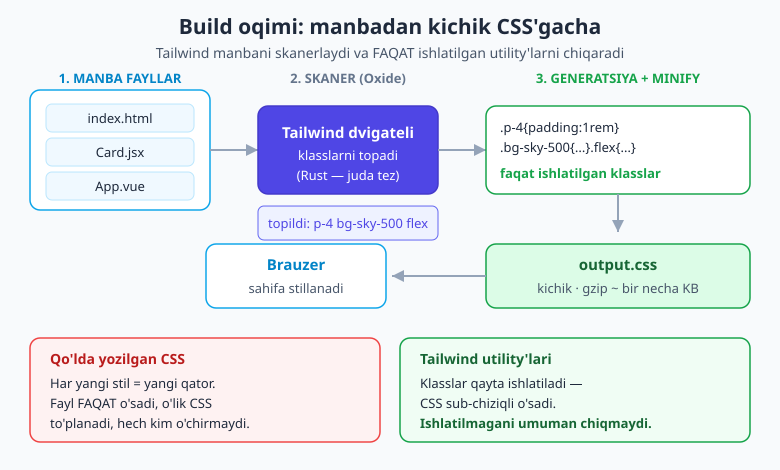
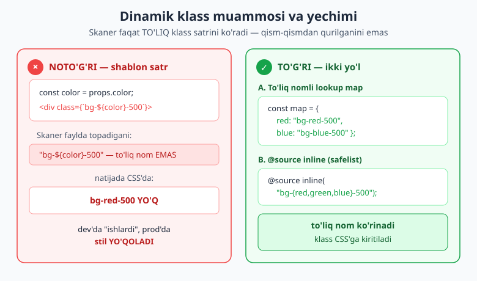
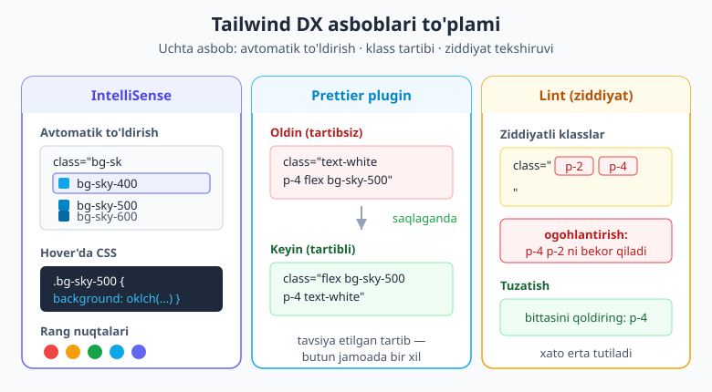

# 24 — Production: optimizatsiya va asboblar

[⬅️ Oldingi: 23 — Forma va UI komponentlari amaliy](./23-forma-ui-komponentlar.md) · [🏠 README](./README.md) · [Keyingi: 25 — Best practices, arxitektura va migratsiya ➡️](./25-best-practices-migratsiya.md)

> **Bu bobda:** loyihani **dev'dan production'ga** olib chiqamiz. Build qanday ishlashini — Tailwind manbani skanerlab, **faqat ishlatilgan** utility'larni generatsiya qilib, minifikatsiya qilishini — ko'ramiz; chiqgan CSS **nega kichik qolishini** tushunamiz. Keyin v4 ning avtomatik **content-detection**ini chuqurlashtiramiz (`@source`, `@source not`, `@source inline`), production'dagi **№1 tuzoq — dinamik klass muammosi**ni va uning ikkita yechimini ko'ramiz. Va nihoyat kundalik ishni tezlashtiradigan asboblar: **VS Code IntelliSense**, **Prettier klass-tartiblovchi plugin**, **ESLint/lint**, brauzer DevTools'da debug, **CI/CD** eslatmasi va "production'ga tayyormi?" **tekshiruv ro'yxati**.

---

## 24.1 Avval nega? — dev va production farqi

Loyihani ishlab chiqayotganda hammasi yaxshi ko'rinadi: tugma ko'k, karta yumaloq, hammasi joyida. Lekin saytni internetga chiqarishdan oldin bir savol tug'iladi: foydalanuvchining brauzeri **qanaqa CSS** yuklab oladi? Agar siz Tailwind'ning butun, ulkan utility to'plamini (yuz minglab klass) yuborsangiz — bu bir necha megabayt bo'lardi va sayt sekin ochilardi.

Bu hech qachon sodir bo'lmaydi. Va sababi — Tailwind'ning eng aqlli qismi: u **siz haqiqatan ishlatgan** klasslarnigina CSS'ga chiqaradi. `p-4` ni yozsangiz — `.p-4` qoidasi chiqadi; `bg-lime-300` ni hech qayerda yozmasangiz — u qoida **umuman yaratilmaydi**.

> 💡 **Analogiya.** Tasavvur qiling, sizda 50 000 so'zli lug'at bor, lekin maqolangizda atigi 800 ta so'z ishlatdingiz. Tailwind — bu lug'atdan faqat o'sha 800 so'zni ko'chirib, ixcham varaqa qiladigan yordamchi. Foydalanuvchiga butun lug'atni emas, faqat kerakli so'zlarni jo'natasiz.

Bu "ishlatilganinigina chiqarish" jarayonini **content-detection** (kontent aniqlash) yoki tarixiy nom bilan "tree-shaking" deyiladi. Bu bobning yarmi shu jarayonni to'g'ri sozlash haqida — chunki agar u sizning klassingizni "ko'rmasa", stil production'da yo'qoladi.

---

## 24.2 Build qanday ishlaydi — skaner, generatsiya, minify

Production build uch bosqichdan iborat:

1. **Skanerlash.** Tailwind loyihangizdagi fayllarni o'qib, ulardagi klass nomlarini topadi.
2. **Generatsiya.** Topilgan har bir klass uchun mos CSS qoidasini yaratadi — boshqasini emas.
3. **Minifikatsiya.** Bo'sh joylar, izohlar olib tashlanadi, CSS imkon qadar siqiladi.

Bu uch bosqichni v4 ning **Oxide** dvigateli (Rust'da yozilgan) bajaradi — shuning uchun build juda tez, incremental (o'zgargandagina qayta) build'lar deyarli bir lahzada o'tadi.



**Bundler bilan (Vite, PostCSS)** — bu bosqichlar avtomatik. Production build buyrug'i (`npm run build`) o'z-o'zidan minify ham qiladi:

```bash
npm run build      # Vite: output.css avtomatik minify bo'ladi
```

**Standalone CLI bilan** — minify'ni o'zingiz so'rashingiz kerak, `--minify` (yoki `-m`) bayrog'i bilan:

```bash
# Bir martalik production build
npx @tailwindcss/cli -i input.css -o output.css --minify

# Ishlab chiqishda — o'zgarishlarni kuzatib turish (minify YO'Q)
npx @tailwindcss/cli -i input.css -o output.css --watch
```

> 📌 **Atamalar.** **Build** — manba fayllaringizdan brauzer tushunadigan yakuniy CSS chiqarish jarayoni. **Minifikatsiya** — CSS'dan keraksiz belgilarni (bo'shliq, qator, izoh) olib tashlab, hajmni kichraytirish. **Content-detection** — Tailwind qaysi klasslar ishlatilganini fayllarni o'qib aniqlashi.

Ikkala holatda ham natija bitta: `output.css` ichida **faqat siz ishlatgan utility'lar** bo'ladi, siqilgan holatda. O'rnatish bosqichini eslatib o'tsak — bu yo'llarning to'liq sozlamasini [02-bobda](./02-ornatish-birinchi-qadam.md) ko'rgansiz.

---

## 24.3 Nega output kichik qoladi?

Eng ko'p beriladigan savol: "Tailwind'da klass juda ko'p, CSS ulkan bo'lib ketmaydimi?" Javob — **yo'q**, va sababi ikki narsada.

**Birinchi sabab — ishlatilmagani umuman chiqmaydi.** Yuqorida ko'rdik: `bg-lime-300` ni yozmasangiz, u CSS'da yo'q. Sayt qanchalik katta bo'lmasin, faqat amalda ishlatilgan klasslar to'plami chiqadi.

**Ikkinchi sabab — utility'lar qayta ishlatiladi.** `p-4` klassini saytda 500 marta yozsangiz ham, CSS'da `.p-4 { padding: 1rem }` **bitta marta** yoziladi. Qo'lda yozilgan CSS'da esa har bir yangi komponent uchun yangi qoidalar qo'shiladi — fayl faqat o'sadi. Tailwind'da CSS **sub-chiziqli** (loyiha kattaligiga nisbatan sekin) o'sadi: yangi sahifalar ko'pincha allaqachon mavjud utility'larni qayta ishlatadi, yangi CSS deyarli qo'shilmaydi.

```text
Qo'lda CSS:   sahifa ko'paygani sayin CSS chiziqli o'sadi  ↗↗↗
Tailwind:     birinchi sahifadan keyin o'sish deyarli to'xtaydi  ↗‾‾‾
```

Amalda bu shuni anglatadiki, hatto yirik ilovada ham yakuniy CSS gzip'dan keyin odatda **bir necha o'n KB** atrofida qoladi — bu rasm yoki shrift fayllaridan ancha kichik. Real raqam loyihaga bog'liq, lekin tartib shu: kichik va barqaror.

> ⚠️ **Bu barakani buzadigan narsa — haddan tashqari ko'p arbitrary (ixtiyoriy) qiymat.** `p-[13px]`, `top-[37%]`, `bg-[#a1b2c3]` kabi har bir noyob ixtiyoriy qiymat alohida qoida yaratadi va qayta ishlatilmaydi. Bittasi muammo emas, lekin yuzlab noyob arbitrary qiymat output'ni shishiradi. Imkon bo'lsa tokendan ([18-bob](./18-theme-dizayn-tizimi.md)) foydalaning — u qayta ishlatiladi.

---

## 24.4 Content-detection chuqurroq — `@source`

v4 da content-detection **avtomatik**. v3 dagidek `tailwind.config.js` ichida `content: [...]` massivini qo'lda yozish **kerak emas** — Tailwind:

- loyiha papkasini o'zi skanerlaydi,
- `.gitignore` dagi yo'llarni hurmat qiladi (ya'ni `node_modules`, `dist`, `.git` ni o'tkazib yuboradi),
- binar va juda katta fayllarni (rasm, video) chetlab o'tadi.

Aksariyat loyihada bu **shunchaki ishlaydi** — hech narsa sozlamaysiz. Lekin uchta holatda Tailwind'ga "bu yerni ham qara" deb aytishingiz kerak. Buning uchun CSS'da `@source` direktivasi bor (uni [20-bobda](./20-direktiva-funksiyalar.md) batafsil ko'rgansiz; bu yerda production nuqtai nazaridan takrorlaymiz).

**1. `node_modules` ichidagi komponent kutubxonasi.** `.gitignore` `node_modules` ni o'tkazib yuborgani uchun, klasslar shu kutubxona ichida bo'lsa, ularni qo'lda qo'shasiz:

```css
@import "tailwindcss";

/* node_modules ichidagi kutubxona klasslarini ham skanerla */
@source "../node_modules/some-ui-kit/dist";
```

**2. Loyiha tashqarisidagi yoki yondosh paketdagi shablonlar.** Monorepo'da boshqa paketdagi fayllarni qo'shing:

```css
@source "../../packages/shared-ui/src";
```

**3. Biror papkani chetlab o'tish** — `@source not`:

```css
/* legacy papkasini skanerlama (eski v3 klasslari bor, kerak emas) */
@source not "../src/legacy";
```

**4. Skaner ko'ra olmaydigan klassni majburan qo'shish** — `@source inline(...)`. Bu v3 dagi `safelist` ning o'rnini bosadi:

```css
/* skaner topa olmasa ham, bu klasslar har doim CSS'ga kiritilsin */
@source inline("bg-red-500 bg-green-500 bg-blue-500");
```

> 💡 `@source inline(...)` qavs ichida **brace expansion** (qavsli kengaytirish) ham ishlaydi: `@source inline("bg-{red,green,blue}-500")` bir vaqtning o'zida `bg-red-500`, `bg-green-500`, `bg-blue-500` ni kiritadi. Bu — keyingi bo'limdagi dinamik klass muammosining bir yechimi.

---

## 24.5 Dinamik klass muammosi — production'ning №1 tuzog'i

Endi eng muhim, eng ko'p kuydiradigan mavzuga keldik. Quyidagi naqsh **dev'da go'yo ishlaydi, lekin production'da stilni yo'qotadi**:

```jsx
// ❌ NOTO'G'RI — skaner buni KO'RMAYDI
function Badge({ color }) {
  return <span className={`bg-${color}-500 text-white px-2`}>Yangi</span>;
}
```

Nega? Chunki skaner faylni **matn** sifatida o'qiydi va **to'liq, tugallangan klass satrlarini** qidiradi. U JavaScript'ni ishga tushirmaydi — `bg-${color}-500` uning ko'zida shunchaki `"bg-${color}-500"` degan matn, va bunaqa klass yo'q. Natijada `bg-red-500` CSS'ga **kirmaydi** va badge rangsiz chiqadi.

"Lekin dev'da ishladi-ku?" — ba'zan dev rejimida ko'proq klass kiritilib qolishi mumkin (yoki avval boshqa joyda `bg-red-500` ni to'liq yozgan bo'lasiz), shuning uchun muammo faqat production build'da fosh bo'ladi. Bu uni ayniqsa xavfli qiladi.



### Yechim A — to'liq klass nomlarini lookup map/switch'da saqlash

Eng ishonchli yo'l: hech qachon klass nomini qism-qismdan qurmang. Har bir to'liq nomni manba kodda yozib qo'ying, shunda skaner ularni ko'radi:

```jsx
// ✅ TO'G'RI — to'liq nomlar manba kodda, skaner ularni ko'radi
const COLOR = {
  red:   "bg-red-500",
  green: "bg-green-500",
  blue:  "bg-blue-500",
};

function Badge({ color }) {
  return <span className={`${COLOR[color]} text-white px-2`}>Yangi</span>;
}
```

Bu naqsh — [22-bobda](./22-komponentlar-framework.md) ko'rgan "variantni xaritaga bog'lash" usulining aynan o'zi. Skaner faylda `"bg-red-500"`, `"bg-green-500"`, `"bg-blue-500"` to'liq satrlarini topadi va uchchalasini CSS'ga kiritadi.

### Yechim B — `@source inline(...)` bilan safelist

Agar klasslar haqiqatan dinamik bo'lib, ularni map'da sanab chiqib bo'lmasa (masalan, API'dan kelgan rang nomi), CSS'da safelist qiling:

```css
@import "tailwindcss";

/* Brace expansion bilan — barcha rang/ottenok kombinatsiyasi */
@source inline("bg-{red,green,blue,amber}-{500,700}");
```

> 💡 **Qaysi yechim?** Iloji bo'lsa — **A (map)**. U output'ni toza saqlaydi (faqat haqiqatan kerakli klasslar) va kod o'qilishini oshiradi. **B (`@source inline`)** ni faqat klasslar build vaqtida ma'lum bo'lmaganda ishlating; brace expansion'ni kengaytirib yuborsangiz, kerak bo'lmagan klasslarni ham CSS'ga kiritib, hajmni oshirib qo'yishingiz mumkin.

---

## 24.6 VS Code Tailwind CSS IntelliSense — majburiy asbob

Tailwind bilan ishlashda **bitta** kengaytma hayotingizni o'zgartiradi: rasmiy **Tailwind CSS IntelliSense** (VS Code Marketplace'dan o'rnatiladi). U quyidagilarni beradi:

- **Avtomatik to'ldirish** — `bg-sk` deb yozsangiz, `bg-sky-400`, `bg-sky-500`... ro'yxati chiqadi. Klass nomini yodlash shart emas.
- **Hover'da CSS** — klass ustiga sichqonchani olib borsangiz, u **aynan qaysi CSS** ni yaratishini ko'rsatadi (`.bg-sky-500 { background-color: oklch(...) }`). Bu o'rganish uchun bebaho.
- **Rang nuqtalari (swatch)** — rang klasslari yonida kichik rangli kvadrat ko'rinadi, shunda ko'k yoki yashilligini darrov bilasiz.
- **Lint** — ziddiyatli yoki noto'g'ri klasslarni ostiga chizib ogohlantiradi (buni 24.8 da ko'ramiz).



### IntelliSense'ni helper funksiyalar ichida ishlatish

Standart holda IntelliSense `class`/`className` atributi ichida ishlaydi. Lekin siz klasslarni `clsx`, `cva` yoki `tv` kabi funksiyalar ichida yozsangiz ([22-bobda](./22-komponentlar-framework.md) ko'rgan), IntelliSense'ga ularni ham tanish qilib qo'yish kerak. `settings.json` ga qo'shing:

```json
{
  "tailwindCSS.classFunctions": ["clsx", "cva", "tv", "cn"]
}
```

Murakkabroq holatlar uchun (string argument ichidagi klasslar) `tailwindCSS.experimental.classRegex` bor — u regex orqali "shu yerda ham klass bor" deb belgilashga imkon beradi. Aksariyat loyihaga `classFunctions` kifoya.

---

## 24.7 Prettier bilan klasslarni avtomatik tartiblash

Jamoada doim chiqadigan savol: "klasslarni qaysi tartibda yozamiz?" Kimdir `text-white p-4 flex` deb yozadi, boshqasi `flex p-4 text-white`. Bu funksional jihatdan farq qilmaydi, lekin diff'larni iflos qiladi va ko'z charchatadi.

Yechim — rasmiy **`prettier-plugin-tailwindcss`**. U saqlash paytida klasslarni **tavsiya etilgan tartibga** (asosiy → layout → ... → variantlar) avtomatik joylaydi. Munozara tugaydi: tartibni odam emas, plugin hal qiladi.

O'rnatish:

```bash
npm install -D prettier prettier-plugin-tailwindcss
```

`.prettierrc`:

```json
{
  "plugins": ["prettier-plugin-tailwindcss"]
}
```

Endi `flex` va `text-white` qaysi tartibda yozsangiz ham, saqlaganda Prettier ularni bir xil, izchil tartibga keltiradi — butun jamoa bo'ylab.

### Helper funksiyalar ichini ham tartiblash

`clsx`/`cva`/`tv` ichidagi klasslar ham tartiblanishini istasangiz, `tailwindFunctions` ni belgilang:

```json
{
  "plugins": ["prettier-plugin-tailwindcss"],
  "tailwindFunctions": ["clsx", "cva", "tv", "cn"]
}
```

> 💡 IntelliSense **autocomplete** beradi, Prettier esa **tartiblaydi** — ikkalasi bir-birini to'ldiradi. Ikkala konfiguratsiyada ham bir xil funksiya ro'yxatini (`clsx`, `cva`...) ko'rsatib qo'yganingiz ma'qul.

---

## 24.8 Linting — ziddiyatli va noto'g'ri klasslarni tutish

Eng ko'p uchraydigan jimgina xato — bir elementda **bir-biriga zid** klasslar: `class="p-2 p-4"`. CSS'da oxirgisi g'olib chiqadi (`p-4`), `p-2` esa bekorga turibdi va kimningdir e'tiborini chalg'itadi. Yoki `flex grid` — ikkala `display` ni bir vaqtda bergansiz.

Bunday holatlarni ikki yo'l bilan tutasiz:

**1. IntelliSense'ning ichki lint'i.** Yuqorida o'rnatgan kengaytma bunday ziddiyatlarni o'zi ostiga chizib, ogohlantiradi — qo'shimcha sozlash shart emas. Kunlik ishda eng tez signal shu.

**2. ESLint bilan — `eslint-plugin-tailwindcss`.** CI'da yoki jamoaviy qoidalar uchun ESLint plagin'i ziddiyatli klass, noto'g'ri nom kabi narsalarni xato sifatida chiqaradi.

```bash
npm install -D eslint-plugin-tailwindcss
```

> ⚠️ **v4 qo'llab-quvvatlash hozircha rivojlanmoqda.** `eslint-plugin-tailwindcss` ning to'liq v4 mosligi yangilanish jarayonida. Shu sababli ko'p jamoalar amalda **IntelliSense lint + Prettier**ga tayanadi — bu ikkisi v4 da to'liq ishonchli ishlaydi. ESLint'ni qo'shsangiz, plagin versiyasi v4 ni qo'llab-quvvatlashini tekshiring.

---

## 24.9 Editor va debug maslahatlari (DX)

Uzun klass qatorlari bilan ishlashni yengillashtiradigan amaliy hiyla-nayranglar:

- **Multi-cursor** — bir nechta joyda bir xil klassni o'zgartirsangiz, `Alt`+klik (yoki `Ctrl`+`D`) bilan barcha nusxalarni birato'la tahrirlang.
- **Klass folding / "inline fold"** — uzun `class="..."` ni vizual yig'ib (`class="bg-… +12"` ko'rinishida) markup'ni o'qishni osonlashtiradigan kengaytmalar bor; HTML strukturasiga e'tibor qaratganda foydali.
- **Brauzer DevTools** — bu eng kuchli debug vositasi. Elementni tanlab, "Styles" panelida **qaysi utility qaysi xususiyatni o'rnatganini** ko'rasiz. "Nega bu div'ning padding'i noto'g'ri?" degan savolga DevTools darrov javob beradi — qaysi klass qaysi qoidani qo'llayotgani ko'rinib turadi. `Computed` tab esa yakuniy qiymatni ko'rsatadi.

> 💡 Stil "yo'qolgan"dek tuyulsa, avval DevTools'da o'sha klass umuman CSS'da bormi tekshiring. Agar yo'q bo'lsa — bu deyarli har doim dinamik klass muammosi (24.5) yoki `@source` yetishmasligi (24.4).

---

## 24.10 CI/CD eslatmasi

Tailwind CI quvuriga osongina sig'adi — unda **mo'rt** yoki Tailwind'ga xos murakkab narsa yo'q:

```yaml
# Misol bosqichlar (umumlashtirilgan)
- npm ci                 # bog'liqliklarni o'rnatish
- npm run build          # output.css generatsiya bo'ladi (avtomatik minify)
- # output.css mavjudligini va bo'sh emasligini tekshiring
```

Amaliy maslahatlar:

- **`node_modules` ni keshlang** — build'ni tezlashtiradi (Oxide allaqachon tez, lekin o'rnatish vaqtini tejaysiz).
- **Build natijasini tekshiring** — `output.css` generatsiya bo'lganini va bo'sh emasligini CI'da tasdiqlang.
- Yakuniy CSS'ni **artefakt** sifatida deploy bosqichiga uzating; uni qo'lda repozitoriyga qo'shib yurish shart emas.

---

## 24.11 Production'ga tayyormi? — tekshiruv ro'yxati

Saytni chiqarishdan oldin shu ro'yxatdan o'ting:

- [ ] **Minify qilingan build.** Bundler bilan `npm run build`; CLI bilan `--minify` bayrog'i.
- [ ] **Dinamik klass teshiklari yo'q.** `bg-${...}` kabi naqshlar yo'q — to'liq nomli map yoki `@source inline` ishlatilgan (24.5).
- [ ] **Tashqi shablonlar `@source` bilan qo'shilgan.** `node_modules` komponent kutubxonasi yoki yondosh paket klasslari skanerlanadi (24.4).
- [ ] **IntelliSense + Prettier sozlangan.** Avtomatik to'ldirish ishlaydi, klasslar avtomatik tartiblanadi (24.6, 24.7).
- [ ] **Arbitrary qiymatlar me'yorida.** Yuzlab noyob `[...]` qiymat yo'q; takrorlanuvchilar tokenga ko'chirilgan (24.3).
- [ ] **Ziddiyatli klasslar yo'q.** `p-2 p-4` kabi lint ogohlantirishlari tozalangan (24.8).
- [ ] **CI build'ni tekshiradi.** `output.css` generatsiya bo'lib, bo'sh emasligi tasdiqlanadi (24.10).

---

## 24.12 Tez-tez uchraydigan xatolar

- **Dinamik klass production'da yo'qolishi.** `bg-${color}-500` ni skaner ko'rmaydi — to'liq nomli map yoki `@source inline` ishlating (24.5). Bu — №1 sabab.
- **Minify qilinmagan CSS'ni deploy qilish.** CLI ishlatib `--minify` ni unutish; foydalanuvchi keraksiz katta fayl yuklaydi. Bundler buni avtomatik qiladi, CLI esa yo'q.
- **Tashqi shablonlar uchun `@source` ni unutish.** `node_modules` ichidagi yoki yondosh paketdagi klasslar `.gitignore` tufayli skanerlanmaydi — `@source` bilan qo'shing.
- **v3 dagidek `content` massivini izlash.** v4 da content-detection avtomatik — `content: [...]` yo'q. Eski darslar buni so'rashi mumkin; v4 da `@source` (faqat kerak bo'lganda) ishlatiladi.
- **Haddan tashqari arbitrary qiymat.** Yuzlab noyob `[...]` qiymat output'ni shishiradi va qayta ishlatilmaydi. Takrorlanuvchilarni tokenga ([18-bob](./18-theme-dizayn-tizimi.md)) ko'chiring.
- **Faqat dev'da test qilish.** Dinamik klass muammosi ko'pincha faqat production build'da fosh bo'ladi — chiqarishdan oldin `npm run build` qilib, natijani sinab ko'ring.

> 🔭 **Oldinga qarash.** Endi loyihangiz tez, kichik va asboblari sozlangan holda production'ga tayyor. [Keyingi bobda](./25-best-practices-migratsiya.md) bu asboblar atrofidagi **arxitektura va konventsiyalar** — qachon Tailwind ishlatish (qachon yo'q), jamoa qoidalari va eski v3 loyihasini v4 ga **migratsiya** qilishni ko'ramiz.

---

## Mashqlar

**1-mashq.** Hamkasbingiz standalone CLI bilan saytni chiqardi-yu, lekin foydalanuvchilar "CSS fayli juda katta" deb shikoyat qilishyapti. `npx @tailwindcss/cli -i input.css -o output.css` buyrug'ida nima yetishmaydi? Tuzating.

<details markdown="1"><summary>Yechim</summary>

Production build'da **minifikatsiya** yetishmayapti. CLI Vite'dan farqli o'laroq buni avtomatik qilmaydi — `--minify` (yoki `-m`) bayrog'ini qo'shish kerak:

```bash
npx @tailwindcss/cli -i input.css -o output.css --minify
```

Bu bo'shliq, izoh va keraksiz belgilarni olib tashlab, fayl hajmini sezilarli kichraytiradi. (Vite/PostCSS bilan `npm run build` buni o'zi qiladi.)

</details>

**2-mashq.** Quyidagi komponent dev'da yashil va qizil badge'larni to'g'ri ko'rsatadi, lekin production build'dan keyin ular **rangsiz** chiqadi. Sababini ayting va tuzating.

```jsx
function Badge({ tone }) {  // tone = "green" yoki "red"
  return <span className={`bg-${tone}-100 text-${tone}-700 px-2`}>{tone}</span>;
}
```

<details markdown="1"><summary>Yechim</summary>

Bu — **dinamik klass muammosi**. Skaner faylni matn sifatida o'qiydi va `bg-${tone}-100` ni to'liq klass deb tanimaydi, shuning uchun `bg-green-100`, `bg-red-100`, `text-green-700`, `text-red-700` CSS'ga **kirmaydi**. Yechim — to'liq nomlarni map'da saqlash:

```jsx
const TONE = {
  green: "bg-green-100 text-green-700",
  red:   "bg-red-100 text-red-700",
};

function Badge({ tone }) {
  return <span className={`${TONE[tone]} px-2`}>{tone}</span>;
}
```

Endi skaner to'liq klass nomlarini ko'radi. (Muqobil — `@source inline("{bg,text}-{green,red}-{100,700}")`, lekin map tozaroq.)

</details>

**3-mashq.** Loyihangiz `node_modules/fancy-modal/dist` ichidagi tayyor komponentdan foydalanadi. Uning tugmalari Tailwind klasslari bilan stillangan, lekin sizning build'ingizda ular **stilsiz** chiqyapti. Nega va qanday tuzatasiz?

<details markdown="1"><summary>Yechim</summary>

`.gitignore` `node_modules` ni o'tkazib yuborgani uchun, Tailwind o'sha kutubxona ichidagi klasslarni skanerlamaydi — demak ular CSS'ga kirmaydi. Yechim — CSS'da o'sha papkani `@source` bilan aniq ko'rsatish:

```css
@import "tailwindcss";

@source "../node_modules/fancy-modal/dist";
```

Endi Tailwind o'sha papkadagi fayllarni ham skanerlaydi va kutubxona ishlatgan klasslar CSS'ga kiritiladi.

</details>

**4-mashq.** Jamoangizda har kim klasslarni har xil tartibda yozadi va PR'lardagi diff'lar shu sabab iflos. Kod funksiyasiga tegmasdan, bitta sozlama bilan barcha klasslarni izchil tartibga keltirishni qanday qilasiz?

<details markdown="1"><summary>Yechim</summary>

Rasmiy `prettier-plugin-tailwindcss` ni o'rnatib, Prettier'ga ulang:

```bash
npm install -D prettier prettier-plugin-tailwindcss
```

`.prettierrc`:

```json
{
  "plugins": ["prettier-plugin-tailwindcss"]
}
```

Endi har kim saqlaganda klasslar avtomatik tavsiya etilgan tartibga keladi — kim qanday yozganidan qat'i nazar, butun jamoada bir xil. Agar klasslar `clsx`/`cva` ichida bo'lsa, `"tailwindFunctions": ["clsx", "cva"]` ni ham qo'shing.

</details>

**5-mashq.** Bir elementda `class="px-4 px-6 flex"` deb yozilgan. Bu xatomi? Brauzerda nima bo'ladi va uni qanday avtomatik tutasiz?

<details markdown="1"><summary>Yechim</summary>

Bu **ziddiyatli klass** — `px-4` va `px-6` ikkalasi ham gorizontal padding'ni o'rnatadi. CSS'da oxirgi qoida g'olib bo'ladi (bu yerda `px-6`), `px-4` esa bekorga turibdi va o'qiyotgan odamni chalg'itadi.

Tutish yo'llari:
- **VS Code IntelliSense** bunday ziddiyatni o'zi ostiga chizib ogohlantiradi (qo'shimcha sozlash shart emas).
- CI'da — `eslint-plugin-tailwindcss` (v4 mosligini tekshiring).

Tuzatish — keraksizini o'chirish: `class="px-6 flex"`.

</details>

**6-mashq.** Loyiha rangini API'dan keladigan dinamik qiymat asosida o'rnatishingiz kerak (masalan, foydalanuvchi tanlagan tema rangi: `red`, `amber`, `sky` — `500` yoki `700` ottenokda). Klasslar build vaqtida ma'lum emas. CSS'da qaysi direktiva bilan ularni majburan kiritasiz?

<details markdown="1"><summary>Yechim</summary>

Klasslar build vaqtida ma'lum bo'lmagani uchun `@source inline(...)` bilan brace expansion ishlatib safelist qilamiz:

```css
@import "tailwindcss";

@source inline("bg-{red,amber,sky}-{500,700}");
```

Bu `bg-red-500`, `bg-red-700`, `bg-amber-500`, `bg-amber-700`, `bg-sky-500`, `bg-sky-700` — oltita klassni skaner topmasa ham CSS'ga kiritadi. (Eslatma: faqat haqiqatan kerakli kombinatsiyalarni sanang — qavslarni keng yozsangiz, ortiqcha klasslar CSS'ni shishiradi.)

</details>

---

[⬅️ Oldingi: 23 — Forma va UI komponentlari amaliy](./23-forma-ui-komponentlar.md) · [🏠 README](./README.md) · [Keyingi: 25 — Best practices, arxitektura va migratsiya ➡️](./25-best-practices-migratsiya.md)
