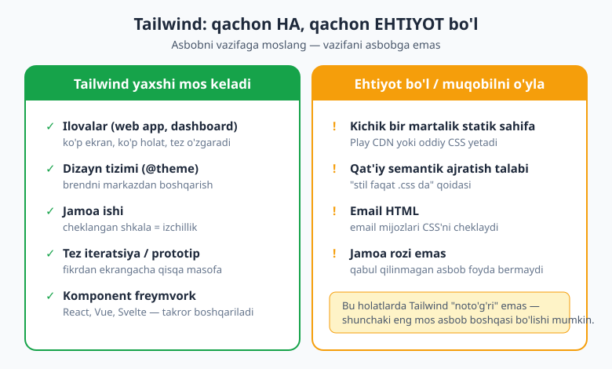

# 25 — Best practices, arxitektura va migratsiya

[⬅️ Oldingi: 24 — Production: optimizatsiya va asboblar](./24-production-optimizatsiya.md) · [🏠 README](./README.md) · [Keyingi: 26 — Yakuniy loyiha ➡️](./26-capstone-loyiha.md)

> **Bu bobda:** bu — "donolik" bobi. Endi Tailwind'ning **qaysi klassi nima qilishini** emas, balki **uni qachon va qanday tartibda ishlatishni** o'rganasiz. **Tailwind qachon to'g'ri tanlov, qachon yo'q** (1-bobga chuqurroq qaytamiz); klass tartibi va **o'qishbop kod**; `@theme` bilan **dizayn-tizim intizomi** va palitra cheklash; **jamoa konventsiyalari** (umumiy `app.css`, komponent kutubxonasi, `@apply` qachon ruxsat); **hammaboplik (accessibility) odat** sifatida (`focus-visible:`, `motion-reduce:`, semantik HTML); eng ko'p uchraydigan **anti-naqshlar** ro'yxati; va eng amaliysi — **v3 → v4 migratsiya** to'liq qo'llanmasi (`npx @tailwindcss/upgrade`, sinadigan o'zgarishlar jadvali, brauzer qo'llab-quvvatlash chegarasi va qo'lda tekshirish ro'yxati).

---

## 25.1 Avval nega? — siz endi tilni emas, uslubni o'rganasiz

Bu paytgacha 24 bob davomida Tailwind'ning **lug'atini** o'rgandingiz: `p-4`, `flex`, `@theme`, `dark:`, `cva` — har bir klass va direktivaning ma'nosini bilasiz. Lekin lug'atni bilish — yaxshi yozuvchi bo'lish degani emas. So'zlarni **qachon, qanday tartibda, qaysi vaziyatda** ishlatish — mana bu mahorat.

Shu sababli bu bob hech qanday yangi klass o'rgatmaydi. U **qaror qabul qilish** haqida: qachon Tailwind'ni tanlash, qachon undan voz kechish, jamoada qanday tartib o'rnatish, qanday xatolardan qochish va eski loyihani yangi versiyaga qanday ko'chirish.

> 💡 **Analogiya.** Tailwind'ni o'rganish — pianino klavishlarini o'rganishga o'xshaydi. Har bir klavish qanday tovush chiqarishini bilasiz. Lekin **musiqa** — bu klavishlarni qaysi tartibda, qachon va qancha kuch bilan bosish. Bu bob — sizning gammalardan kuyga o'tishingiz.

---

## 25.2 Tailwind qachon to'g'ri tanlov — va qachon yo'q

[Birinchi bobda](./01-tailwind-nima.md) "Tailwind nima va nega kerak?" degan savolga javob bergan edik. Endi 24 bob tajribadan keyin shu savolga **halol va chuqur** qaytamiz. Chunki professional dasturchi — har bir asbobni har bir loyihaga tiqishtirmaydi; u **vaziyatga mos** asbob tanlaydi.

**Tailwind ajoyib mos keladigan holatlar:**

- **Ilovalar (web app, dashboard, SaaS).** Ko'p ekran, ko'p holat, tez o'zgarish — Tailwind'ning utility-first oqimi shu yerda eng porlaydi.
- **Dizayn tizimlari.** [`@theme` tokenlari](./18-theme-dizayn-tizimi.md) bilan brendingizni markazdan boshqarasiz — bu dizayn tizimini **majburlash** uchun ideal.
- **Jamoalar.** Hamma bir xil cheklangan shkaladan tanlaydi; "bu ko'k qaysi ko'k?" degan cheksiz bahslar tugaydi.
- **Tez iteratsiya / prototip.** HTML'dan chiqmasdan dizaynni o'zgartirasiz — fikrdan ekrangacha bo'lgan masofa juda qisqa.
- **Komponentga asoslangan freymvorklar** (React, Vue, Svelte). Komponent — takrorni boshqaradigan tabiiy birlik; Tailwind klasslari komponent ichida yashaydi ([22-bob](./22-komponentlar-framework.md)).

**Ehtiyot bo'ling / muqobilni o'ylang:**

- **Kichik, bir martalik statik sahifa.** Bitta "kelyapmiz tez orada" sahifasi uchun butun build quvuri o'rnatish — ortiqcha. Bunday holatda **Play CDN** (`<script src="https://cdn.tailwindcss.com">`) yoki oddiy CSS yetarli.
- **Qat'iy semantik ajratish talab qiladigan loyiha.** Agar tashkilot qoidasi "stil faqat `.css` faylda, HTML toza semantik bo'lsin" desa — Tailwind falsafasi bunga qarshi. Bunday joyda urinmang.
- **Email HTML.** Email mijozlari (Gmail, Outlook) zamonaviy CSS'ni juda cheklangan qo'llab-quvvatlaydi; Tailwind generatsiya qiladigan ko'p narsa email'da ishlamaydi. Email uchun maxsus inline-stil asboblari (MJML va shu kabilar) to'g'riroq.
- **Jamoa rozi emas.** Agar jamoa "biz HTML'da uzun klass qatorini yomon ko'ramiz" desa va ko'nmasa — Tailwind'ni majburan o'rnatish ish jarayonini buzadi. Asbob faqat jamoa uni qabul qilganda foyda beradi.

> 📌 **Asosiy qoida.** Tailwind — komponentga asoslangan, jamoaviy, ko'p iteratsiyali ishlar uchun ajoyib. "Stilni HTML'dan qat'iy ajratish" yoki "minimal, build'siz statik sahifa" kerak bo'lsa — boshqa yo'lni ham hisobga oling. Asbobni vazifaga moslang, vazifani asbobga emas.



---

## 25.3 Klass tartibi va o'qishbop kod

Uzun klass qatori — Tailwind'ning eng ko'p tanqid qilinadigan tomoni. Lekin uni **boshqarish mumkin**. Sir — tartibda.

**1. Klass tartibini avtomatlashtiring.** Hech qachon klasslarni qo'lda "to'g'ri tartibga" solishga urinmang — buni **Prettier plugin** qiladi. [24-bobda](./24-production-optimizatsiya.md) o'rnatgan `prettier-plugin-tailwindcss` har safar saqlaganingizda klasslarni rasmiy, izchil tartibga soladi (layout → spacing → tipografiya → rang → holat). Butun jamoa bir xil tartibda yozadi, hech kim bahslashmaydi.

```html
<!-- Siz qanday yozsangiz ham... -->
<div class="text-white p-4 flex bg-indigo-600 rounded-lg items-center">

<!-- ...Prettier plugin avtomatik shunga keltiradi -->
<div class="flex items-center rounded-lg bg-indigo-600 p-4 text-white">
```

**2. Komponentlarni kichik tuting.** Agar bitta elementda 25 ta klass yig'ilib qolsa — bu element juda ko'p ish qilyapti. Uni mayda komponentlarga bo'ling. Uzun klass qatori — ko'pincha "bu bo'lakni ajratish vaqti keldi" degan signal.

**3. Takrorni komponent bilan boshqaring, `@apply` bilan emas.** Bu — eng muhim qoida. Bir xil tugma 10 joyda kerakmi? Uni `<Button>` komponentiga aylantiring ([22-bob](./22-komponentlar-framework.md)), `.btn { @apply ... }` yozmang. `@apply` Tailwind'ning butun afzalligini (HTML'da ko'rinadigan, izlanadigan stil) yo'qotadi va sizni eski CSS dunyosiga qaytaradi.

**4. Komponentlarni semantik nomlang.** `<Card>`, `<Alert>`, `<PriceTag>` — element nima ekanini bildiradi. Klasslar `nima ko'rinishini`, komponent nomi esa `nima ekanini` aytadi.

**5. Arbitrary qiymatlar sochilib ketmasin.** `top-[37px]`, `text-[#3b7a2e]`, `w-[823px]` — vaqti-vaqti bilan zarur, lekin ular **ko'paysa**, dizayn tizimi yemiriladi. Iloji boricha [theme tokeni](./18-theme-dizayn-tizimi.md)dan tanlang. Agar bir xil arbitrary qiymatni qayta-qayta yozayotgan bo'lsangiz — uni token qiling.

---

## 25.4 Dizayn-tizim intizomi — Tailwind majburlash qatlami sifatida

Tokenlarni [18-bobda](./18-theme-dizayn-tizimi.md) o'rgandingiz. Endi ularni **intizom** vositasi sifatida ishlatamiz. Professional jamoada Tailwind shunchaki "stil yozish" emas — u **dizayn qoidalarini majburlash** qatlami.

**1. Avval temani belgilang.** Loyiha boshida `@theme`'da rang, spacing, radius, shrift tokenlarini aniqlang. Bu — sizning "ruxsat etilgan tanlovlar" ro'yxatingiz.

**2. Shkalaga sodiq qoling.** Token mavjud bo'lsa — undan tanlang, arbitrary qiymat yozmang. Bu o'z-o'zini intizomga soladi: dizayningiz cheklangan, demak ohangdosh bo'lib qoladi.

**3. Semantik tokenlardan foydalaning.** `bg-surface`, `text-primary`, `border-subtle` — rang nomini emas, **rolini** bildiradi. Brendni qayta ranglaganingizda bitta token qiymatini o'zgartirasiz, yuzlab klassni emas.

**4. Keraksiz standartlarni o'chiring.** Eng kuchli intizom usuli — jamoaga **faqat brend palitrasini** ruxsat berish. Standart 22 rang oilasini o'chirib, faqat o'zingiznikini qoldiring:

```css
@import "tailwindcss";

@theme {
  /* Standart palitrani o'chirish — endi faqat brend ranglari ishlaydi */
  --color-*: initial;

  --color-primary:   oklch(0.55 0.20 265);
  --color-surface:   oklch(0.99 0 0);
  --color-ink:       oklch(0.21 0 0);
  --color-muted:     oklch(0.55 0.02 265);
  --color-white:     #ffffff;
  --color-black:     #000000;
}
```

Endi kimdir `bg-rose-400` deb yozsa — klass **umuman generatsiya bo'lmaydi**, xato darrov ko'rinadi. Bu — Tailwind'ning eng kam ishlatiladigan, lekin eng kuchli xususiyati: u dizayn tizimingizning **chegarachisi** bo'la oladi.

> 💡 Oddiy CSS'da "faqat brend ranglarini ishlat" degan qoidani **majburlash** deyarli imkonsiz — uni faqat code-review'da ushlaysiz. Tailwind'da esa token bo'lmagan klass **mavjud emas**. Qoida kodning o'zida yashaydi.

---

## 25.5 Jamoa konventsiyalari

Bitta dasturchi uchun "best practice" tavsiya; jamoa uchun esa **kelishuv** — yozma, hamma rioya qiladigan. Mana professional jamoaning Tailwind kelishuvlari:

- **Bitta kanonik `app.css`.** Loyihada bitta markaziy stil fayli: `@import "tailwindcss"`, `@theme` tokenlari, `@custom-variant`, `@utility`'lar — hammasi shu yerda ([20-bobdagi](./20-direktiva-funksiyalar.md) tartibli `app.css` namunasi). Tokenlar sochilib ketmasin.
- **Komponent kutubxonasi.** `Button`, `Card`, `Input`, `Badge` — bir marta yozilib, [`cva` bilan variantlangan](./22-komponentlar-framework.md) komponentlar. Yangi a'zo "tugma qanday bo'ladi?" deb so'ramaydi — `<Button variant="primary">` bor.
- **`@apply` qachon ruxsat — kelishib oling.** Ko'pchilik jamoa `@apply` ni faqat ikki holatda ruxsat etadi: (a) o'zingiz nazorat qilmaydigan markup (masalan, Markdown'dan kelgan HTML yoki uchinchi tomon vidjeti), (b) `::before`/`::placeholder` kabi pseudo-elementlar. Qolgan hamma joyda — komponent. Buni yozib qo'ying.
- **Prettier + IntelliSense — majburiy.** Klass tartibi plugin'i va VS Code IntelliSense butun jamoada o'rnatilgan bo'lsin ([24-bob](./24-production-optimizatsiya.md)). Bu — muhokama emas, asbob sozlamasi.
- **Custom utility va variantlarni hujjatlashtiring.** Agar `@utility tab-4` yoki `@custom-variant pointer-fine` yaratgan bo'lsangiz, ularni `README` yoki `app.css` izohida tushuntiring — yangi a'zo qayerdan kelganini bilsin.

> 📌 Eslang: konventsiya — bu "to'g'ri yo'l" emas, "**bitta** yo'l". Jamoada izchillik ko'pincha mukammallikdan muhimroq. Ikkita o'rtacha lekin bir xil yondashuv — bitta ajoyib lekin har kim har xil ishlatadiganidan yaxshi.

---

## 25.6 Hammaboplik (accessibility) — odat sifatida

Hammaboplikni (a11y) loyiha oxirida "qo'shadigan" narsa emas, har kuni yozadigan **odat** deb qarang. Tailwind buni osonlashtiradi, lekin **kafolatlamaydi** — bu sizning mas'uliyatingiz.

- **`focus-visible:` halqasi — har doim.** Klaviatura bilan yuradigan foydalanuvchi qaerdaligini ko'rishi shart. Har bir interaktiv element (tugma, link, input)da `focus-visible:ring-2 focus-visible:ring-primary` bo'lsin. `outline-hidden` bilan fokusni **butunlay** o'chirib qo'yish — eng keng tarqalgan a11y xatosi.
- **Kontrast — palitradan keladi.** Tokenlaringizni belgilashda matn va fon orasidagi kontrast yetarli bo'lsin (WCAG bo'yicha normal matn uchun kamida 4.5:1). Bu tekshiruvni temaga "qotirib" qo'ysangiz, har bir komponent avtomatik mos keladi.
- **`motion-reduce:` ni hurmat qiling.** Animatsiya yoqimli, lekin ba'zi foydalanuvchilarda bosh aylanishi keltiradi. `motion-reduce:transition-none` yoki `motion-safe:animate-bounce` bilan tizim sozlamasiga bo'ysuning.
- **Semantik HTML — Tailwind uning o'rnini bosmaydi.** Tailwind **stil beradi**, lekin `<div onclick>` ni tugma qilmaydi. `<button>`, `<nav>`, `<label>`, `<main>` — to'g'ri teglardan foydalaning. Yaxshi HTML ustiga Tailwind stil qo'yadi, yomon HTML'ni tuzatmaydi.
- **`sr-only` / `not-sr-only`.** Faqat ekran o'qigichga ko'rinadigan matn (`sr-only`) — ikona-tugmalarga nom berishning standart usuli:

```html
<button class="rounded-full p-2 hover:bg-slate-100
               focus-visible:ring-2 focus-visible:ring-primary">
  <svg aria-hidden="true"><!-- ikona --></svg>
  <span class="sr-only">Menyuni yopish</span>
</button>
```

> 💡 Bu yerda `aria-hidden="true"` (ikona o'qilmaydi) + `sr-only` matn (haqiqiy nom) birgalikda ishlaydi: ko'z bilan ikona, ekran o'qigich uchun "Menyuni yopish". Ko'rinishni Tailwind, ma'noni HTML beradi.

---

## 25.7 Eng ko'p uchraydigan xatolar va anti-naqshlar

Mana — tajriba bilan kelgan "shunday qilmang" ro'yxati. Har bir anti-naqsh yonida to'g'ri yo'l.

| ❌ Anti-naqsh | ✅ To'g'ri yo'l |
|---|---|
| Hamma joyda `@apply` (`.btn { @apply ... }`) | Komponent ekstraksiyasi (`<Button>`) — [22-bob](./22-komponentlar-framework.md) |
| Arbitrary qiymatlar sochilgan (`p-[13px]`, `text-[#3b7a2e]`) | [Theme tokenlari](./18-theme-dizayn-tizimi.md)dan tanlang |
| Dinamik klass qatori (`text-${color}-500`) | To'liq klass nomlari + xaritalash (pastda) |
| `focus:` o'rniga hech narsa / `outline-hidden` | `focus-visible:ring-2 ...` har doim |
| Dark mode'da sof qora (`bg-black`) | `bg-slate-900` / `bg-gray-900` — yumshoqroq |
| `gap` o'rniga elementlarga `margin` | Flex/Grid'da `gap-*` ishlating |
| Komponentni CSS'da qayta yaratish | Tailwind komponenti yoki [`cva`](./22-komponentlar-framework.md) |
| Shkala bilan kurashish (`mt-[7px]` hamma joyda) | Shkalaga sodiq qoling; kerak bo'lsa token qo'shing |
| Bitta elementda 30+ klass | Mayda komponentlarga bo'ling |
| Scoped stilda `@reference`'siz `@apply` | `@reference "../app.css";` qo'shing — [20-bob](./20-direktiva-funksiyalar.md) |

**Dinamik klass tuzog'i — alohida diqqat.** Tailwind kodingizni **matn sifatida** skanerlaydi (24-bob). Shuning uchun bu **ishlamaydi**:

```jsx
// ❌ Tailwind bu klassni "ko'rmaydi" — matnda `text-red-500` to'liq yo'q
<p className={`text-${color}-500`}>...</p>
```

To'g'ri yo'l — **to'liq klass nomlarini** xaritada saqlash:

```jsx
// ✅ To'liq klasslar matnda ko'rinadi, demak Tailwind ularni generatsiya qiladi
const RANG = {
  xato:    "text-red-500",
  ogohlik: "text-amber-500",
  muvaffaq:"text-green-600",
};
<p className={RANG[color]}>...</p>
```


---

## 25.8 v3 → v4 migratsiya — amaliy qo'llanma

Eski loyihangiz Tailwind v3 da. Uni v4 ga ko'chirish kerak. Bu — bu bobning eng amaliy qismi. Yaxshi xabar: ko'p ishni **avtomatik asbob** bajaradi.

### Avtomatik upgrade asbobi

Tailwind rasmiy migratsiya asbobi bilan keladi:

```bash
# 1. ALBATTA toza git branch'da boshlang (orqaga qaytarish uchun)
git checkout -b tailwind-v4

# 2. Asbobni ishga tushiring (Node.js 20+ kerak)
npx @tailwindcss/upgrade
```

Asbob quyidagilarni **avtomatik** qiladi:

- `@tailwind base; @tailwind components; @tailwind utilities;` direktivalarini bitta `@import "tailwindcss";` ga aylantiradi.
- `tailwind.config.js` dagi `theme` sozlamalarini CSS ichidagi [`@theme`](./18-theme-dizayn-tizimi.md) blokiga ko'chiradi.
- Nomi o'zgargan / eskirgan utility'larni yangi nomlarga almashtiradi.
- PostCSS / Vite sozlamasini v4 ga yangilaydi (`@tailwindcss/vite` yoki `@tailwindcss/postcss`).

> ⚠️ **Asbob sehrli emas.** U ishni 90% bajaradi, lekin **hamma narsani** emas. Ishlatgandan keyin **albatta** vizual diff qiling: har bir muhim sahifani v3 va v4 da yonma-yon solishtiring. Pastdagi qo'lda tekshirish ro'yxatiga rioya qiling.


### Bilishingiz shart bo'lgan sinadigan o'zgarishlar

Asbob ko'pini hal qiladi, lekin **nima o'zgarganini tushunish** muhim — chunki ba'zi o'zgarishlar vizual, ularni faqat ko'z bilan ushlaysiz:

| O'zgarish | v3 | v4 |
|---|---|---|
| Import | `@tailwind base;` ... | `@import "tailwindcss";` |
| Konfiguratsiya | `tailwind.config.js` (avtomatik) | `@theme` CSS'da (yoki `@config` bilan ulang) |
| Gradient | `bg-gradient-to-r` | `bg-linear-to-r` |
| Soya shkalasi | `shadow-sm`, `shadow` | `shadow-xs`, `shadow-sm` (nomlar siljidi) |
| Radius / blur | `rounded`, `rounded-sm` | `rounded-sm`, `rounded-xs` (nomlar siljidi) |
| Outline | `outline-none` (eski xulq) | `outline-hidden` |
| Opacity | `bg-opacity-50` | `bg-black/50` (modifikator) |
| Flex | `flex-shrink-0`, `flex-grow` | `shrink-0`, `grow` |
| Ring kengligi | `ring` = 3px | `ring` = 1px (v3 xulqi uchun `ring-3`) |
| Standart `border` rangi | `gray-200` | `currentColor` (aniq rang bering) |
| Standart `ring` rangi | ko'k | `currentColor` |

**Ikkita "jim" tuzoq — alohida diqqat:**

1. **Standart chegara rangi `currentColor` bo'ldi.** v3 da `border` qo'ysangiz, avtomatik och-kulrang chegara chiqardi. v4 da esa u **matn rangini** oladi. Shuning uchun migratsiyadan keyin chegaralaringiz kutilmaganda qoraygan bo'lishi mumkin — aniq rang bering: `border border-slate-200`.

2. **`ring` kengligi 3px dan 1px ga tushdi.** Agar v3 da `ring` ishlatib, qalin fokus halqasiga o'rganib qolgan bo'lsangiz, v4 da u ingichka chiqadi — eski ko'rinish uchun `ring-3` yozing.

### Eski config'ni vaqtincha saqlash

v4 da `tailwind.config.js` **avtomatik yuklanmaydi**. Agar migratsiyani bosqichma-bosqich qilmoqchi bo'lsangiz (hamma narsani birdan `@theme` ga ko'chirishga vaqt yo'q), eski config'ni vaqtincha CSS orqali ulashingiz mumkin:

```css
@import "tailwindcss";

/* Vaqtinchalik ko'prik — eski JS config'ni hali ham o'qiydi */
@config "../tailwind.config.js";
```

> 💡 `@config` — **ko'chish davri** uchun. Pirovardida tokenlaringizni `@theme` ga ko'chiring va `@config` ni o'chiring; aks holda v4 ning CSS-first afzalliklaridan (`var()` o'zgaruvchilari, IntelliSense) to'liq foydalana olmaysiz. [20-bobda](./20-direktiva-funksiyalar.md) `@config` haqida ko'rgansiz.

### Brauzer qo'llab-quvvatlash — eng muhim qaror

Buni **migratsiyadan oldin** hal qiling, chunki orqaga yo'l yo'q. Tailwind v4 zamonaviy CSS xususiyatlariga tayanadi: `@property`, `color-mix()` va cascade qatlamlari. Shuning uchun u **faqat zamonaviy brauzerlarda** ishlaydi:

| Brauzer | Minimal versiya |
|---|---|
| Safari | 16.4+ |
| Chrome | 111+ |
| Firefox | 128+ |

> ⚠️ **Halol gap.** Agar loyihangiz **eski brauzerlarni** (eski iOS Safari, korporativ muhitdagi eski Chrome, IE — yo'q albatta) qo'llab-quvvatlashi **shart** bo'lsa — **v4 ga ko'chmang.** v3.4 da qoling; u hali ham qo'llab-quvvatlanadi va keng brauzer mosligini beradi. Bu — uyat emas, **to'g'ri muhandislik qarori**. Asbob versiyasini auditoriyangizga moslang.

### Qo'lda tekshirish ro'yxati (asbob o'tkazib yuboradigan narsalar)

Asbob ishlagandan keyin shu ro'yxat bo'yicha o'zingiz tekshiring:

1. **Vizual diff** — har bir asosiy sahifani v3 va v4 da yonma-yon solishtiring (screenshot olib).
2. **Chegaralar** — `currentColor` o'zgarishi tufayli kutilmagan rangda chiqqanlarini toping.
3. **Fokus halqalari** — `ring` 1px ga tushgani uchun ingichka qolganlarini tekshiring.
4. **Soya / radius** — nom siljishi tufayli noto'g'ri o'lchamga tushganlarini ko'ring.
5. **Custom JS plaginlar** — eski plaginlaringiz v4 bilan mos kelishini sinab ko'ring.
6. **Arbitrary qiymatlar** — sintaksis o'zgargan ba'zilari (`bg-[--my-var]` → `bg-(--my-var)`) borligini tekshiring.
7. **Dark mode** — strategiyangiz (`media`/`class`) hali ishlayotganini tasdiqlang.
8. **To'liq build** — production build'ni ishga tushiring, ogohlantirishlarni o'qing.

---

## 25.9 Kasbingizni rivojlantirish — manbalar

Tailwind tez rivojlanadi. Ortda qolmaslik uchun:

- **Rasmiy hujjatlar** (`tailwindcss.com/docs`) — yagona ishonchli manba. Versiya o'zgarsa, avval shu yer yangilanadi.
- **Upgrade qo'llanmasi** (`tailwindcss.com/docs/upgrade-guide`) — har bir katta versiya uchun batafsil migratsiya qadamlari.
- **Play CDN / Tailwind Play** (`play.tailwindcss.com`) — o'rnatishsiz tajriba qilish maydoni. Yangi xususiyatni sinab ko'rmoqchimisiz, yoki kichik bir g'oyani tekshirmoqchimisiz — bu yerda darrov yozasiz, build kerak emas.

> 💡 Maslahat: yangi xususiyatni production'ga qo'shishdan oldin, avval Tailwind Play'da kichik namuna yasab ko'ring. Bu — eng tez "ishlaydimi?" tekshiruvi.

---

## 25.10 Yakun — siz endi Tailwind'ni boshqarasiz

Bobning boshida aytgandik: lug'atni bilish — yozuvchi bo'lish emas. Endi sizda ikkalasi ham bor. Siz Tailwind'ni:

- **qachon tanlash, qachon yo'q** — bilasiz;
- **o'qishbop, tartibli, jamoaviy** yozasiz;
- **dizayn tizimini majburlash** uchun ishlatasiz;
- **hammabop** odatlar bilan yozasiz;
- anti-naqshlardan **qochasiz** va eski loyihani **ishonch bilan ko'chirasiz**.

Bu — "klasslarni bilish"dan "**Tailwind'ni dizayn tizimi sifatida boshqarish**"gacha bo'lgan sakrash. Mana shu — ekspert farqi.

> 🔭 **Oldinga qarash.** Nazariya tugadi. [Keyingi, yakuniy bobda](./26-capstone-loyiha.md) o'rgangan hamma narsani — `@theme` dizayn tizimi, responsive + container queries, dark mode, animatsiya, `cva` bilan hammabop komponentlar va shu bobdagi best-practice'larni — birlashtirib, **to'liq ilovani noldan** quramiz. Bilim amalga aylanadigan joy.

---

## Mashqlar

**1-mashq.** Sizdan uchta loyiha uchun maslahat so'rashdi: (a) 200 ekranli ichki SaaS dashboard, jamoa 6 kishi; (b) bitta "tez orada ochiladi" statik sahifa; (c) korporativ marketing email kampaniyasi. Har biri uchun Tailwind to'g'ri tanlovmi? Nega?

<details markdown="1"><summary>Yechim</summary>

- **(a) SaaS dashboard — HA, ideal.** Ko'p ekran, ko'p holat, jamoa, tez iteratsiya, komponentga asoslangan — Tailwind aynan shu uchun yaratilgan. `@theme` dizayn tizimi + `cva` komponent kutubxonasi.
- **(b) Bitta statik sahifa — SHART EMAS.** Build quvuri o'rnatish ortiqcha. **Play CDN** (`<script src="https://cdn.tailwindcss.com">`) yoki oddiy CSS yetadi.
- **(c) Email kampaniyasi — YO'Q.** Email mijozlari zamonaviy CSS'ni juda cheklangan qo'llaydi; Tailwind generatsiya qiladigan ko'p narsa ishlamaydi. Email uchun maxsus inline-stil asboblari to'g'riroq.

Xulosa: asbobni vazifaga moslang. Tailwind hamma joyda emas, **mos joyda** porlaydi.

</details>

**2-mashq.** Hamkasbingiz quyidagi React kodini yozdi va `text-red-500` umuman qo'llanmayotganidan hayron. Xato nimada? Tuzating.

```jsx
const holat = "red";
<span className={`text-${holat}-500`}>Xato</span>
```

<details markdown="1"><summary>Yechim</summary>

Tailwind kodni **matn sifatida** skanerlaydi (24-bob). `text-${holat}-500` qatorida `text-red-500` **to'liq** ko'rinmaydi — faqat `text-` va `-500` bo'laklari bor. Demak Tailwind bu klassni generatsiya qilmaydi.

To'g'ri yo'l — **to'liq klass nomlarini** xaritada saqlash:

```jsx
const RANG = {
  red:   "text-red-500",
  amber: "text-amber-500",
  green: "text-green-600",
};
<span className={RANG[holat]}>Xato</span>
```

Endi to'liq klasslar manba kodida ko'rinadi — Tailwind ularni topadi va generatsiya qiladi.

</details>

**3-mashq.** Dizayn direktori: "Jamoamiz tasodifan `bg-pink-300` yoki `text-lime-600` yozib brenddan chiqib ketmasin. Buni majburlang." v4 da buni qanday qilasiz? Kod yozing va nega ishlashini tushuntiring.

<details markdown="1"><summary>Yechim</summary>

Standart rang tokenlarini `initial` bilan o'chirib, faqat brend palitrasini qoldiramiz:

```css
@import "tailwindcss";

@theme {
  --color-*: initial;            /* hamma standart rang o'chadi */

  --color-primary: oklch(0.55 0.20 265);
  --color-surface: oklch(0.99 0 0);
  --color-ink:     oklch(0.21 0 0);
  --color-white:   #ffffff;
  --color-black:   #000000;
}
```

**Nega ishlaydi:** Tailwind utility'lari tokenlardan generatsiya qilinadi. Token o'chsa — utility ham yo'q. Endi `bg-pink-300` deb yozsa, klass **umuman mavjud bo'lmaydi**, ya'ni dasturchining xatosi darrov ko'rinadi. Dizayn tizimi qoidasi kodning o'zida yashaydi — uni faqat code-review'da emas, kompilyatsiyada ushlaymiz.

</details>

**4-mashq.** Eski v3 loyihangizni v4 ga ko'chirmoqchisiz. Birinchi uchta xavfsiz qadamni yozing (asbobni ishga tushirishgacha bo'lgan tayyorgarlik bilan).

<details markdown="1"><summary>Yechim</summary>

```bash
# 1. Toza, yangi branch yarating — orqaga qaytarish kafolati
git checkout -b tailwind-v4
git status   # ishchi katalog toza ekanini tasdiqlang

# 2. Node.js versiyasini tekshiring (20+ kerak)
node --version

# 3. Rasmiy upgrade asbobini ishga tushiring
npx @tailwindcss/upgrade
```

Asbobdan keyin **albatta** vizual diff qiling (har bir muhim sahifani v3 va v4 da solishtiring). Asbob ishni 90% qiladi, qolganini siz qo'lda tekshirasiz — ayniqsa chegara rangi (`currentColor`) va `ring` kengligi (1px) o'zgarishlarini.

</details>

**5-mashq.** Migratsiyadan keyin saytingizdagi barcha chegaralar (`border`) kutilmaganda qoraygan. Sababi nima va qanday tuzatasiz?

<details markdown="1"><summary>Yechim</summary>

**Sabab:** v4 da standart chegara rangi `gray-200` dan **`currentColor`** ga o'zgardi. Demak `border` qo'ygan elementlar endi avtomatik **matn rangini** (ko'pincha qora) oladi — och-kulrang emas.

**Yechim:** chegara rangini **aniq** bering:

```html
<!-- ❌ Endi matn rangini oladi (qora) -->
<div class="border p-4">...</div>

<!-- ✅ Aniq rang -->
<div class="border border-slate-200 p-4">...</div>
```

Yoki butun loyiha uchun bir martalik standart chegara rangini `@layer base` da tiklashingiz mumkin — lekin to'g'ri yo'l har joyda aniq rang ko'rsatishdir.

</details>

**6-mashq (debugging).** Komponentingizdagi scoped `<style>` blokida `@apply rounded-lg bg-primary;` yozdingiz, lekin build "Cannot apply unknown utility class" xatosini beryapti. Token to'g'ri belgilangan. Sabab nima?

<details markdown="1"><summary>Yechim</summary>

Scoped / alohida CSS faylida `@apply` ishlatish uchun Tailwind o'sha faylda **tokenlaringiz qaerdaligini** bilishi kerak. Buni `@reference` bilan ko'rsatasiz:

```css
@reference "../app.css";

.karta {
  @apply rounded-lg bg-primary;
}
```

`@reference` Tailwind'ga "tokenlar va utility'lar mana shu fayldan keladi" deb aytadi, lekin uning CSS'ini ikki marta chiqarmaydi ([20-bob](./20-direktiva-funksiyalar.md)). Usiz `@apply` qaysi `bg-primary` ekanini bilmaydi — shu sabab "unknown utility" xatosi.

**Eslatma:** aslida bu yerda eng yaxshi yechim — `@apply`'dan butunlay voz kechib, [komponent ekstraksiyasi](./22-komponentlar-framework.md) qilish. `@reference` — `@apply` zarur bo'lgan kam holatlar uchun.

</details>

---

[⬅️ Oldingi: 24 — Production: optimizatsiya va asboblar](./24-production-optimizatsiya.md) · [🏠 README](./README.md) · [Keyingi: 26 — Yakuniy loyiha ➡️](./26-capstone-loyiha.md)
