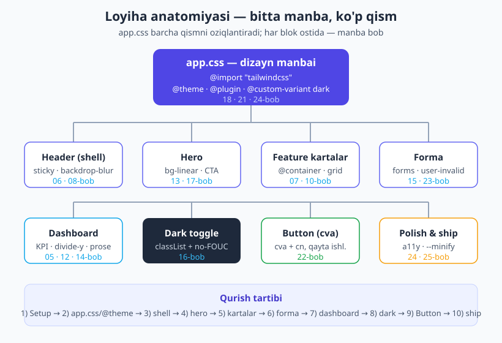
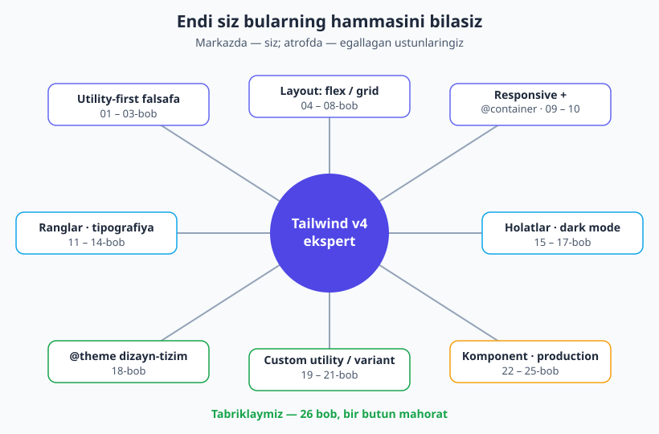

# 26 — Yakuniy loyiha: to'liq dashboard/landing

[⬅️ Oldingi: 25 — Best practices, arxitektura va migratsiya](./25-best-practices-migratsiya.md) · [🏠 README](./README.md) · [🎉 Kitob yakuni: README](./README.md)

> **Bu bobda:** O'rgangan **hamma narsani** bitta, haqiqiy loyihada birlashtiramiz — **SaaS landing + dashboard** ilovasini noldan quramiz. Setupdan boshlab (`@tailwindcss/vite`), `@theme` dizayn tizimini ([18-bob](./18-theme-dizayn-tizimi.md)), responsive app shellni, gradientli hero'ni, `@container`'li feature kartalarni ([10-bob](./10-container-queries.md)), `@tailwindcss/forms` bilan validatsiyali formani ([23-bob](./23-forma-ui-komponentlar.md)), dashboard widgetlarini, ishlaydigan dark-mode toggle'ni ([16-bob](./16-dark-mode.md)), `cva`+`cn` bilan qayta ishlatiluvchi `<Button>` komponentini ([22-bob](./22-komponentlar-framework.md)) va production'ga jo'natishgacha ([24-bob](./24-production-optimizatsiya.md)). Har bir qarorni qaysi bob bergani aytib boriladi. Oxirida — **tabriklash** va keyingi qadamlar.

---

## 26.1 Avval nega? — nega bitta katta loyiha?

Yigirma besh bob davomida har bir tushunchani **alohida** o'rgandingiz: spacing, flex, grid, ranglar, holatlar, `@theme`, komponentlar... Bu — to'g'ri yo'l, chunki bir vaqtning o'zida hammasini o'rganib bo'lmaydi.

Lekin haqiqiy ish bunday bo'lmaydi. Real loyihada bu tushunchalarning **hammasi bir vaqtda**, bir-biriga bog'lanib ishlaydi: hero'dagi tugma `@theme`'dagi brend rangini ishlatadi, u dark rejimda o'zgaradi, feature kartasi konteyner so'rovi bilan moslashadi, forma esa fokus halqasini brend rangidan oladi. Mana shu **bog'lanish** — ekspertlikning asl belgisi.

Shuning uchun bu kapston bob — yangi tushuncha o'rgatmaydi. U **o'rganganlaringizni bir butunga ulaydi**. Biz "DashKit" deb nomlaymiz — kichik SaaS mahsuloti uchun bitta sahifali landing + himoyalangan dashboard. Bitta brend, bitta dizayn tizimi, boshdan oxir.

> 💡 **Analogiya.** Avvalgi boblar — gammalar va akkordlar mashqi. Bu bob — birinchi marta to'liq kuy chalish. Notalar o'zgarmaydi; faqat endi ular birga yangraydi.



Yuqoridagi xarita butun loyihaning skeletini ko'rsatadi: tepada **`app.css`** — bitta dizayn manbai, undan har bir qism oziqlanadi. Pastda — qurish tartibi. Shu tartibda boramiz.

---

## 26.2 1-qadam: Setup (02 va 24-bob)

Loyihani Vite bilan boshlaymiz — bu [02-bobda](./02-ornatish-birinchi-qadam.md) ko'rgan to'rt yo'ldan eng tavsiya etilgani, va [24-bobda](./24-production-optimizatsiya.md) bilganimizdek, eng tez build beradi.

```bash
npm create vite@latest dashkit -- --template react
cd dashkit
npm install tailwindcss @tailwindcss/vite
npm install @tailwindcss/forms @tailwindcss/typography
npm install class-variance-authority clsx tailwind-merge
```

`vite.config.js`'da Tailwind plaginini ulaymiz — bu PostCSS sozlamasini ham, content scanningni ham o'zi qiladi:

```js
// vite.config.js
import { defineConfig } from "vite";
import react from "@vitejs/plugin-react";
import tailwindcss from "@tailwindcss/vite";

export default defineConfig({
  plugins: [react(), tailwindcss()],
});
```

Endi `src/app.css` faylini yaratamiz va uni `main.jsx`'da import qilamiz:

```js
// src/main.jsx
import "./app.css";
```

> 📌 **Atamalar.** **Vite** — zamonaviy build asbobi (dev-server + bundler). **`@tailwindcss/vite`** — Tailwind'ni Vite'ga ulaydigan rasmiy plugin; PostCSS yoki CLI'siz, eng tez yo'l ([02-bob](./02-ornatish-birinchi-qadam.md)). **plugin** (`@plugin`) — Tailwind funksionalligini kengaytiruvchi paket; biz `forms` va `typography`'ni qo'shamiz ([21-bob](./21-plaginlar.md)).

---

## 26.3 2-qadam: Dizayn tizimi — to'liq `app.css` (18-bob)

Mana loyihaning **yuragi**. [18-bobda](./18-theme-dizayn-tizimi.md) o'rgangan har bir g'oya shu yerda: brend rang shkalasi (OKLCH), display shrifti, custom radius/breakpoint, `@custom-variant dark` ([16-bob](./16-dark-mode.md)), va dark rejimda avtomatik temalanuvchi **semantik tokenlar** (`@theme inline`).

Bu — loyihaning kanonik `app.css`'i. Uni to'liq beraman, chunki qolgan hammasi shundan oziqlanadi:

```css
/* src/app.css */
@import "tailwindcss";

/* Rasmiy plaginlar (21-bob) — forma elementlari va prose tipografiyasi */
@plugin "@tailwindcss/forms";
@plugin "@tailwindcss/typography";

/* Dark mode = class strategiya (16-bob). v4 da bu CSS'da, JS config'da emas. */
@custom-variant dark (&:where(.dark, .dark *));

@theme {
  /* 1. Brend rang shkalasi — shkala SHART, bitta ottenok emas (18-bob) */
  --color-brand-50:  oklch(0.97 0.02 264);
  --color-brand-100: oklch(0.93 0.05 264);
  --color-brand-200: oklch(0.86 0.10 264);
  --color-brand-300: oklch(0.78 0.14 264);
  --color-brand-400: oklch(0.69 0.18 264);
  --color-brand-500: oklch(0.60 0.20 264);
  --color-brand-600: oklch(0.53 0.20 264);
  --color-brand-700: oklch(0.46 0.18 264);
  --color-brand-800: oklch(0.39 0.15 264);
  --color-brand-900: oklch(0.31 0.11 264);

  /* 2. Display shrifti (12-bob) */
  --font-display: "Satoshi", "Segoe UI", system-ui, sans-serif;

  /* 3. Custom radius, soya va breakpoint (13, 14, 09-bob) */
  --radius-card: 1rem;
  --shadow-card: 0 8px 30px oklch(0.31 0.11 264 / 0.12);
  --breakpoint-3xl: 120rem;   /* → 3xl: varianti */
}

/* 4. Semantik qatlam — @theme inline, chunki dark'da qiymat o'zgaradi (18-bob) */
:root {
  --surface:        oklch(1 0 0);          /* oq */
  --surface-2:      oklch(0.98 0.005 264); /* biroz to'qroq fon */
  --ink:            oklch(0.22 0.02 264);  /* matn */
  --ink-muted:      oklch(0.50 0.02 264);  /* yordamchi matn */
  --line:           oklch(0.92 0.01 264);  /* chegara */
}
.dark {
  --surface:        oklch(0.21 0.02 264);
  --surface-2:      oklch(0.26 0.02 264);
  --ink:            oklch(0.96 0.01 264);
  --ink-muted:      oklch(0.72 0.02 264);
  --line:           oklch(0.34 0.02 264);
}
@theme inline {
  --color-surface:   var(--surface);
  --color-surface-2: var(--surface-2);
  --color-ink:       var(--ink);
  --color-muted:     var(--ink-muted);
  --color-line:      var(--line);
}

/* 5. Asos resetlar (@layer base) */
@layer base {
  body {
    background-color: var(--color-surface);
    color: var(--color-ink);
    font-family: var(--font-display);
  }
  a {
    color: var(--color-brand-600);
  }
}
```

Diqqat qiling — bu `app.css`'da loyihaning **butun dizayn tili** bor. Endi markup'da `bg-surface text-ink` yozsangiz, u **ikkala rejimda ham** o'zini to'g'ri bo'yaydi, hech qanday qo'shimcha `dark:` yozmasdan. `bg-brand-500`, `rounded-card`, `shadow-card`, `font-display` — hammasi tayyor.

> 💡 **Nega `@theme inline`?** Semantik token (`--color-surface`) qiymati boshqa o'zgaruvchiga (`--surface`) ishora qiladi, u esa `.dark`'da o'zgaradi. `inline` bo'lmasa, utility qiymatni "qotirib" olardi va dark rejimni sezmasdi. Buni [18.8-bobda](./18-theme-dizayn-tizimi.md) batafsil ko'rgansiz.

---

## 26.4 3-qadam: App shell — responsive skelet (06, 07, 08-bob)

Endi ilova "ramkasi" — sticky header + sidebar + main maydon. Bu yerda [06-bob](./06-flexbox.md) (flex header ichida), [07-bob](./07-grid.md) (`grid-cols-[260px_1fr]`) va [08-bob](./08-positioning-overflow.md) (`sticky`, `z-50`) birga ishlaydi.

![Responsive app shell: desktopda sticky header + grid-cols-[260px_1fr] sidebar/main; mobilda sidebar yashirilib qism stacked bo'ladi](rasmlar/tw26-app-shell.svg)

Asosiy g'oya: desktopda ikki ustun (`260px` sidebar + `1fr` main), mobilda esa bir ustun — sidebar yashirinadi. Mobile-first bo'lgani uchun ([09-bob](./09-responsive-dizayn.md)), asos = bir ustun, `lg:`'da ikkiga bo'linadi.

```html
<body class="min-h-screen bg-surface text-ink">
  <!-- Sticky header — butun en bo'ylab (08-bob: sticky, z-50) -->
  <header class="sticky top-0 z-50 border-b border-line
                 bg-surface/80 backdrop-blur
                 supports-[backdrop-filter]:bg-surface/60">
    <div class="mx-auto flex max-w-7xl items-center justify-between gap-4 px-4 py-3">
      <a href="#" class="flex items-center gap-2 text-lg font-bold">
        <span class="grid size-8 place-items-center rounded-lg
                     bg-brand-600 text-white">D</span>
        DashKit
      </a>

      <nav class="hidden items-center gap-6 text-sm md:flex">
        <a href="#features" class="text-muted hover:text-ink transition-colors">Imkoniyatlar</a>
        <a href="#newsletter" class="text-muted hover:text-ink transition-colors">Aloqa</a>
      </nav>

      <div class="flex items-center gap-2">
        <button id="theme-toggle" type="button"
                aria-label="Mavzuni almashtirish"
                class="grid size-9 place-items-center rounded-lg
                       text-muted hover:bg-surface-2 hover:text-ink
                       focus-visible:outline-2 focus-visible:outline-brand-500 transition-colors">
          🌙
        </button>
      </div>
    </div>
  </header>

  <!-- Dashboard layout: mobilda 1 ustun, lg da 260px + 1fr (07-bob) -->
  <div class="mx-auto grid max-w-7xl grid-cols-1 lg:grid-cols-[260px_1fr]">
    <aside class="hidden border-r border-line p-4 lg:block">
      <!-- sidebar navigatsiyasi -->
    </aside>
    <main class="p-4 sm:p-6 lg:p-8">
      <!-- hero, kartalar, dashboard shu yerda -->
    </main>
  </div>
</body>
```

> 💡 `bg-surface/80 backdrop-blur` — bu yarim shaffof, orqasini xiralashtiradigan header (frosted glass), [14-bobda](./14-soya-filter-mask.md) ko'rgan `backdrop-*` filteridan. `supports-[backdrop-filter]:` — eski brauzerlarni hisobga olib, blur ishlamasa to'qroq fon beradi (progressive enhancement). `size-8`/`size-9` — bir vaqtda `w` va `h` ([04-bob](./04-spacing-sizing.md)).

> 📝 **Mobil sidebar.** Bu yerda sidebar mobilda `hidden`. Real ilovada uni `☰` tugmasi bosilganda chiqadigan drawer qilasiz (`peer-checked:` yoki ozgina JS bilan). Mashqlarda shuni kengaytirasiz.

---

## 26.5 4-qadam: Hero seksiyasi (11, 13, 17-bob)

Landing'ning birinchi ekrani — diqqatni tortuvchi gradientli hero. Bu yerda [13-bob](./13-fon-gradient-border.md) (`bg-linear-to-br`), [11-bob](./11-ranglar.md) (rang shkalasi) va [17-bob](./17-transition-transform-animatsiya.md) (hover-lift, `active:scale`) birga ishlaydi.

```html
<section class="relative overflow-hidden rounded-card
                bg-linear-to-br from-brand-600 via-brand-500 to-brand-400
                px-6 py-16 text-center text-white sm:py-24">
  <!-- yengil radial yorug'lik bezagi -->
  <div class="pointer-events-none absolute inset-0
              bg-radial from-white/15 to-transparent"></div>

  <div class="relative mx-auto max-w-2xl">
    <span class="inline-block rounded-full bg-white/15 px-4 py-1 text-sm font-medium
                 ring-1 ring-white/30 ring-inset">
      v4 bilan qurilgan
    </span>

    <h1 class="mt-6 text-4xl font-bold tracking-tight
               text-shadow-lg sm:text-6xl">
      Mahsulotingizni tezroq oshiring
    </h1>

    <p class="mt-5 text-lg text-white/85 sm:text-xl">
      DashKit — jamoangiz uchun tahlil va boshqaruv paneli. Bir necha daqiqada ishga tushadi.
    </p>

    <div class="mt-8 flex flex-col items-center justify-center gap-3 sm:flex-row">
      <a href="#newsletter"
         class="rounded-lg bg-white px-6 py-3 font-semibold text-brand-700 shadow-lg
                transition hover:-translate-y-1 hover:shadow-xl
                active:scale-95
                focus-visible:outline-2 focus-visible:outline-white
                motion-reduce:transform-none motion-reduce:transition-none">
        Bepul boshlash
      </a>
      <a href="#features"
         class="rounded-lg px-6 py-3 font-semibold text-white
                ring-1 ring-white/40 ring-inset
                transition hover:bg-white/10 active:scale-95">
        Batafsil
      </a>
    </div>
  </div>
</section>
```

Diqqat qiling:

- `bg-linear-to-br from-... via-... to-...` — bu **v4 sintaksisi**. Eski `bg-gradient-to-br` (v3) **emas** ([13-bob](./13-fon-gradient-border.md)).
- `text-shadow-lg` — sarlavhaga yengil soya (v4.1+ imkoniyati, [14-bob](./14-soya-filter-mask.md)) gradient fonda o'qishni yaxshilaydi.
- `hover:-translate-y-1` + `active:scale-95` — tugma "tirik" bo'ladi ([17-bob](./17-transition-transform-animatsiya.md)).
- `motion-reduce:transform-none` — harakatni kamaytirishni so'ragan foydalanuvchiga animatsiyani o'chiramiz (accessibility, [17-bob](./17-transition-transform-animatsiya.md)).
- `ring-1 ring-white/30 ring-inset` — chegara `ring` orqali; rang `currentColor` emas, aniq `white/30` ([13-bob](./13-fon-gradient-border.md)).

---

## 26.6 5-qadam: Feature kartalar — `@container` bilan (07, 10-bob)

Endi imkoniyat kartalari. Ikki darajali responsivlik: tashqi **grid** ekran kengligiga qarab ustun sonini o'zgartiradi ([07-bob](./07-grid.md)), ichkarida esa har bir karta **o'z ustuni kengligiga** qarab moslashadi — bu [10-bobning](./10-container-queries.md) yuragi: `@container`.

```html
<section id="features" class="mt-12">
  <h2 class="text-2xl font-bold tracking-tight sm:text-3xl">Nega DashKit?</h2>

  <div class="mt-6 grid gap-4 sm:grid-cols-2 xl:grid-cols-3">
    <!-- Har karta = konteyner; @container bilan ichki layout o'zgaradi -->
    <article class="@container group rounded-card border border-line bg-surface-2 p-5
                    shadow-card transition hover:-translate-y-1 hover:border-brand-300">
      <!-- Ensiz ustunda ustma-ust, keng ustunda yonma-yon (@md: = konteyner so'rovi) -->
      <div class="flex flex-col gap-3 @md:flex-row @md:items-start">
        <span class="grid size-11 shrink-0 place-items-center rounded-xl
                     bg-brand-100 text-brand-700
                     transition group-hover:bg-brand-600 group-hover:text-white
                     dark:bg-brand-900/40">
          ⚡
        </span>
        <div>
          <h3 class="font-semibold">Tezkor tahlil</h3>
          <p class="mt-1 text-sm text-muted">
            Real vaqtda ko'rsatkichlar — sahifani yangilamasdan.
          </p>
        </div>
      </div>
    </article>
    <!-- ...yana kartalar (bir xil naqsh) -->
  </div>
</section>
```

Bu yerdagi nozik joy: `@md:flex-row` — bu **ekran** kengligini emas, **kartaning o'z** kengligini tekshiradi. Demak xuddi shu karta keng ustunda (xl grid) yonma-yon, ensiz ustunda (mobil) ustma-ust joylashadi — **bir komponent, ikki kontekst**, hech qanday media query'siz. `group-hover:` esa karta ustiga kelganda ichkarisidagi ikonni bo'yaydi ([15-bob](./15-holat-variantlari.md)).

> 💡 `@container` ishlashi uchun ota element `@container` klassiga ega bo'lishi shart — biz uni `<article>`'ga qo'ydik. Tafsilotlar [10-bobda](./10-container-queries.md).

---

## 26.7 6-qadam: Forma — validatsiya bilan (15, 23-bob)

Newsletter/aloqa formasi. `@tailwindcss/forms` ([21-bob](./21-plaginlar.md)) maydonlarga toza asos beradi, biz esa ustiga brend stilini qo'yamiz. Validatsiya uchun [15-bobdagi](./15-holat-variantlari.md) `user-invalid:` holatini va `focus-visible:` halqasini ishlatamiz — bu [23-bobning](./23-forma-ui-komponentlar.md) amaliy formasi.

```html
<section id="newsletter" class="mt-12">
  <div class="mx-auto max-w-md rounded-card border border-line bg-surface-2 p-6 shadow-card">
    <h2 class="text-xl font-bold">Yangiliklardan xabardor bo'ling</h2>
    <p class="mt-1 text-sm text-muted">Haftada bir marta. Spam yo'q.</p>

    <form id="newsletter-form" class="mt-5 space-y-4" novalidate>
      <div>
        <label for="email" class="block text-sm font-medium">Email</label>
        <input id="email" name="email" type="email" required
               placeholder="siz@example.com"
               class="mt-1 block w-full rounded-lg border-line bg-surface
                      text-ink placeholder:text-muted
                      focus:border-brand-500 focus:ring-2 focus:ring-brand-500/40
                      user-invalid:border-red-500 user-invalid:ring-red-500/30" />
        <!-- Faqat noto'g'ri va tegingandan keyin ko'rinadigan xato matni -->
        <p class="mt-1 hidden text-sm text-red-600 peer-user-invalid:block">
          To'g'ri email kiriting.
        </p>
      </div>

      <button type="submit" data-loading="false"
              class="group inline-flex w-full items-center justify-center gap-2
                     rounded-lg bg-brand-600 px-4 py-2.5 font-semibold text-white
                     transition hover:bg-brand-700 active:scale-95
                     focus-visible:outline-2 focus-visible:outline-offset-2 focus-visible:outline-brand-500
                     disabled:opacity-60 data-[loading=true]:cursor-wait">
        <!-- Yuklanish spinneri — faqat data-loading=true bo'lganda (15-bob: data-*) -->
        <span class="hidden size-4 animate-spin rounded-full border-2 border-white/40
                     border-t-white group-data-[loading=true]:inline-block"></span>
        <span>Obuna bo'lish</span>
      </button>
    </form>
  </div>
</section>
```

`user-invalid:` — bu **muhim** detal: oddiy `:invalid` bo'sh maydonni ham darrov qizartiradi (foydalanuvchi hali yozmasdan). `user-invalid:` esa faqat foydalanuvchi **teginib, noto'g'ri qoldirganda** ishlaydi — bu ancha xushmuomala UX ([15-bob](./15-holat-variantlari.md)). `focus:ring-brand-500/40` — fokus halqasi brend rangidan, `/40` shaffoflik bilan ([11-bob](./11-ranglar.md)).

Yuklanish holatini JS bilan boshqaramiz (`data-loading`'ni almashtiramiz):

```html
<script>
  document.getElementById('newsletter-form').addEventListener('submit', (e) => {
    e.preventDefault();
    const btn = e.target.querySelector('button[type=submit]');
    btn.dataset.loading = 'true';   // spinner ko'rinadi (data-[loading=true]:)
    btn.disabled = true;
    // ...so'rov yuborish (fetch) — keyin data-loading='false' qaytariladi
  });
</script>
```

---

## 26.8 7-qadam: Dashboard widgetlari (04, 05, 12, 14-bob)

Endi himoyalangan tomon — dashboard. KPI stat kartalari, oddiy ro'yxat (`divide-y`, [05-bob](./05-box-model-display.md)), badge'lar va `prose` kontent paneli ([12-bob](./12-tipografiya.md)).

```html
<!-- KPI stat kartalari -->
<div class="grid gap-4 sm:grid-cols-2 lg:grid-cols-4">
  <div class="rounded-card border border-line bg-surface-2 p-5 shadow-card">
    <p class="text-sm text-muted">Foydalanuvchilar</p>
    <p class="mt-2 text-3xl font-bold tracking-tight">12,480</p>
    <p class="mt-1 inline-flex items-center gap-1 rounded-full
              bg-green-100 px-2 py-0.5 text-xs font-medium text-green-700
              dark:bg-green-900/40 dark:text-green-300">
      ↑ 12%
    </p>
  </div>
  <!-- ...yana 3 ta KPI -->
</div>

<!-- Ro'yxat — divide-y bilan qatorlar ajratiladi (05-bob) -->
<div class="mt-6 rounded-card border border-line bg-surface-2 shadow-card">
  <div class="border-b border-line px-5 py-3 font-semibold">So'nggi buyurtmalar</div>
  <ul class="divide-y divide-line">
    <li class="flex items-center justify-between px-5 py-3">
      <span>Pro tarif × 1</span>
      <span class="rounded-full bg-brand-100 px-2.5 py-0.5 text-xs font-medium
                   text-brand-700 dark:bg-brand-900/40 dark:text-brand-200">
        To'langan
      </span>
    </li>
    <li class="flex items-center justify-between px-5 py-3">
      <span>Team tarif × 3</span>
      <span class="rounded-full bg-amber-100 px-2.5 py-0.5 text-xs font-medium
                   text-amber-700 dark:bg-amber-900/40 dark:text-amber-200">
        Kutilmoqda
      </span>
    </li>
  </ul>
</div>

<!-- prose kontent paneli (12-bob: @tailwindcss/typography) -->
<article class="prose prose-slate mt-6 max-w-none dark:prose-invert
                rounded-card border border-line bg-surface-2 p-6 shadow-card">
  <h3>Hisobot</h3>
  <p>Bu oy daromad <strong>22% ga oshdi</strong>. Asosiy o'sish Pro tarifdan.</p>
  <ul>
    <li>Yangi obunalar: 1,240</li>
    <li>Bekor qilishlar: 86</li>
  </ul>
</article>
```

`divide-y divide-line` — qatorlar orasiga **avtomatik** chegara qo'yadi, har bir `<li>`'ga alohida border yozmaysiz ([05-bob](./05-box-model-display.md)). `prose dark:prose-invert` — uzun matnga tayyor tipografiya, dark rejimda esa avtomatik teskari ([12-bob](./12-tipografiya.md)).

---

## 26.9 8-qadam: Dark mode — ishlaydigan toggle (16-bob)

Hozirgacha hamma sirtni `bg-surface`, `text-ink`, `border-line` bilan yozdik — bu semantik tokenlar `app.css`'da `.dark`'da o'zgaradi, demak **dark mode allaqachon tayyor**. Endi faqat `.dark` klassini almashtirish kerak.

Eng avval — **FOUC** (noto'g'ri rejim chaqnashi)ni oldini olish. `<head>`'ga, CSS'dan oldin, inline skript ([16.6-bob](./16-dark-mode.md)):

```html
<head>
  <!-- Sahifa bo'yalishidan OLDIN ishlaydi → chaqnash yo'q -->
  <script>
    (function () {
      const saved = localStorage.getItem('theme') || 'system';
      const systemDark = window.matchMedia('(prefers-color-scheme: dark)').matches;
      if (saved === 'dark' || (saved === 'system' && systemDark)) {
        document.documentElement.classList.add('dark');
      }
    })();
  </script>
  <link rel="stylesheet" href="/src/app.css" />
</head>
```

Endi header'dagi toggle tugmasiga mantiq:

```html
<script>
  const btn = document.getElementById('theme-toggle');
  btn.addEventListener('click', () => {
    const isDark = document.documentElement.classList.toggle('dark');
    localStorage.setItem('theme', isDark ? 'dark' : 'light');
    btn.textContent = isDark ? '☀️' : '🌙';
  });
</script>
```

`classList.toggle('dark')` `<html>`'ga `.dark`'ni qo'shadi/oladi va `true/false` qaytaradi; uni `localStorage`'ga saqlaymiz ([16-bob](./16-dark-mode.md)). Inline skript bo'lgani uchun keyingi yuklanishda chaqnash bo'lmaydi.

> ⚠️ **Eslatma.** Biz har sirtni `dark:bg-...` bilan **emas**, semantik token bilan yozdik. Shuning uchun dark rejim deyarli "tekin" keldi — `app.css`'da `.dark { --surface: ... }` yetarli edi. Faqat badge'lar kabi maxsus ranglarda (`dark:bg-green-900/40`) qo'shimcha `dark:` ishlatdik. Bu — [18-bobdagi](./18-theme-dizayn-tizimi.md) semantik token naqshining kuchi.

---

## 26.10 9-qadam: Qayta ishlatiluvchi `<Button>` — `cva` + `cn` (22-bob)

Loyiha bo'ylab tugma bir necha xil ko'rinishda kerak: asosiy (primary), ikkilamchi (secondary), kichik/katta. Har joyga uzun klass qatorini nusxa qilish o'rniga — bitta **komponent**. Bu [22-bobning](./22-komponentlar-framework.md) asosiy naqshi: `cva` (variantlar) + `cn` (klasslarni xavfsiz birlashtirish).

Avval `cn` yordamchisi (`clsx` + `tailwind-merge`):

```js
// src/lib/cn.js
import { clsx } from "clsx";
import { twMerge } from "tailwind-merge";

export function cn(...inputs) {
  return twMerge(clsx(inputs));
}
```

Endi `Button` komponenti `cva` bilan:

```jsx
// src/components/Button.jsx
import { cva } from "class-variance-authority";
import { cn } from "../lib/cn";

const button = cva(
  // har variant uchun umumiy asos
  "inline-flex items-center justify-center gap-2 rounded-lg font-semibold " +
    "transition active:scale-95 " +
    "focus-visible:outline-2 focus-visible:outline-offset-2 focus-visible:outline-brand-500 " +
    "disabled:opacity-60 disabled:pointer-events-none " +
    "motion-reduce:transition-none motion-reduce:active:scale-100",
  {
    variants: {
      variant: {
        primary: "bg-brand-600 text-white hover:bg-brand-700",
        secondary:
          "bg-surface-2 text-ink ring-1 ring-line ring-inset hover:bg-surface",
        ghost: "text-brand-700 hover:bg-brand-50 dark:text-brand-300 dark:hover:bg-brand-900/30",
      },
      size: {
        sm: "px-3 py-1.5 text-sm",
        md: "px-4 py-2.5",
        lg: "px-6 py-3 text-lg",
      },
    },
    defaultVariants: { variant: "primary", size: "md" },
  }
);

export function Button({ variant, size, className, ...props }) {
  return <button className={cn(button({ variant, size }), className)} {...props} />;
}
```

Ishlatish — butun loyihada bir xil:

```jsx
<Button>Bepul boshlash</Button>
<Button variant="secondary">Batafsil</Button>
<Button variant="ghost" size="sm">Bekor qilish</Button>
```

`cva` har variantga to'g'ri klasslarni tanlaydi; `cn` esa `className` orqali kelgan ustdagi klasslarni xavfsiz qo'shadi (`tailwind-merge` ziddiyatlarni yechadi — masalan, tashqaridan `bg-red-600` bersangiz, asosdagi `bg-brand-600`'ni to'g'ri ustiga yozadi). Bu naqsh [22-bobda](./22-komponentlar-framework.md) batafsil — bu yerda loyihaga ulab ko'rsatdik.

> 💡 Endi hero'dagi va dashboard'dagi har bir tugma shu bitta `<Button>`'dan. Brendni o'zgartirsangiz — `app.css`'dagi `--color-brand-*` — barcha tugma birga yangilanadi. **Bitta manba, ko'p joy.**

---

## 26.11 10-qadam: Polish va ship (24, 25-bob)

Loyiha tayyor — endi uni **production**ga jo'natishdan oldin sayqal. Bu [24-bob](./24-production-optimizatsiya.md) va [25-bob](./25-best-practices-migratsiya.md) bo'limi.

**1) Accessibility o'tishi.**

- Har bir interaktiv element `focus-visible:` halqasiga ega bo'lsin (klaviatura foydalanuvchilari uchun) — biz buni tugma va inputlarga qo'shdik.
- Ikon-tugmalarga `aria-label` (masalan toggle: `aria-label="Mavzuni almashtirish"`).
- Faqat ko'z uchun yashirin matn — `sr-only`:

```html
<button aria-label="Menyuni ochish" class="lg:hidden ...">
  <span class="sr-only">Menyu</span>
  ☰
</button>
```

- Kontrast: matn/fon juftliklari yetarli kontrastga ega bo'lsin — `text-muted`'ni juda och qilmang ([11-bob](./11-ranglar.md)).
- Harakat: animatsiyalarda `motion-reduce:` jufti ([17-bob](./17-transition-transform-animatsiya.md)).

**2) Dinamik klass tekshiruvi (24-bob).** Eng ko'p uchraydigan production xatosi — **JS'da string yopishtirilgan klass** generatsiya qilinmaydi, chunki Tailwind faylni matn sifatida skanerlaydi:

```jsx
// ❌ NOTO'G'RI — `bg-brand-${shade}` Tailwind tomonidan TOPILMAYDI, build'da yo'qoladi
<div className={`bg-brand-${shade}`} />

// ✅ TO'G'RI — to'liq klass nomlari ko'rinib tursin
const tone = { green: "bg-green-100 text-green-700", amber: "bg-amber-100 text-amber-700" };
<div className={tone[status]} />
```

Buni [24-bobda](./24-production-optimizatsiya.md) batafsil ko'rgansiz — har bir klass to'liq, statik string bo'lsin.

**3) Production build.** Vite avtomatik minify qiladi:

```bash
npm run build      # dist/ — minifikatsiyalangan, faqat ishlatilgan klasslar
npm run preview    # natijani lokal ko'rib chiqish
```

Faqat Tailwind CLI ishlatsangiz, `--minify` qo'lda:

```bash
npx @tailwindcss/cli -i src/app.css -o dist/app.css --minify
```

Natijada CSS faqat siz **haqiqatan ishlatgan** klasslarni o'z ichiga oladi (Oxide dvigateli avtomatik content-detection bilan) — odatda bir necha o'n kilobayt, gzip'dan keyin yana kichik ([24-bob](./24-production-optimizatsiya.md)).

> ✅ **Yakuniy tekshiruv (25-bob).** Build toza o'tdimi? Klaviatura bilan butun sahifani aylanib chiqa olasizmi? Dark rejim chaqnamasdan ishlaydimi? Mobilda layout buzilmaydimi? Hammasi "ha" bo'lsa — **tayyor**.

---

## 26.12 Recap — qaysi bob qayerda ishladi

Bitta loyihada butun kitob qatnashdi. Mana xarita:

| Loyiha qismi | Manba bob(lar) |
|---|---|
| Setup, Vite plugin, build/`--minify` | [02](./02-ornatish-birinchi-qadam.md), [24](./24-production-optimizatsiya.md) |
| `app.css`, `@theme`, semantik tokenlar | [18](./18-theme-dizayn-tizimi.md) |
| Plaginlar (`forms`, `typography`) | [21](./21-plaginlar.md) |
| App shell (flex / grid / sticky / z-index) | [06](./06-flexbox.md), [07](./07-grid.md), [08](./08-positioning-overflow.md) |
| Responsive (mobile-first, `lg:`) | [09](./09-responsive-dizayn.md) |
| Hero gradienti, ring/border, soya | [11](./11-ranglar.md), [13](./13-fon-gradient-border.md), [14](./14-soya-filter-mask.md) |
| Hover-lift, `active:scale`, `motion-reduce:` | [17](./17-transition-transform-animatsiya.md) |
| Feature kartalar, `@container` | [07](./07-grid.md), [10](./10-container-queries.md) |
| Forma, `user-invalid:`, `focus-visible:` | [15](./15-holat-variantlari.md), [23](./23-forma-ui-komponentlar.md) |
| Dashboard: spacing, `divide-y`, `prose` | [04](./04-spacing-sizing.md), [05](./05-box-model-display.md), [12](./12-tipografiya.md) |
| Dark mode toggle + no-FOUC | [16](./16-dark-mode.md) |
| `<Button>` (`cva` + `cn`) | [22](./22-komponentlar-framework.md) |
| Accessibility, dinamik klass, ship | [24](./24-production-optimizatsiya.md), [25](./25-best-practices-migratsiya.md) |



---

## 26.13 Tabriklaymiz! 🎉

Mana, yetib keldingiz. "Utility-first nima?" degan savoldan boshlab — endi to'liq responsive, dark-mode'li, hammabop (accessible), production'ga tayyor SaaS ilovani **noldan** qura olasiz.

Eng muhimi — siz Tailwind'ni "sehrli klasslar to'plami" sifatida emas, **o'zingiz boshqaradigan dizayn tizimi** sifatida o'rgandingiz. Har bir klass ortida qaysi CSS turishini bilasiz; `@theme`'da bitta token o'zgartirib butun ilova ko'rinishini boshqara olasiz; v3 va v4 farqini ajrata olasiz. Bu — yuzaki "klass yodlash" emas, chuqur tushunish.

### Keyingi qadamlar

- **O'zingizning loyihangizni quring.** Eng yaxshi mustahkamlash — yangi narsa qurish. Bu DashKit'ni kengaytiring (mashqlarga qarang) yoki butunlay yangi g'oyani amalga oshiring.
- **React yoki Vue'ga chuqurroq kiring.** Komponent naqshini ([22-bob](./22-komponentlar-framework.md)) butun ilovaga tatbiq qiling — `cva` bilan dizayn tizimi komponent kutubxonasini yarating.
- **Komponent kutubxonalarini ko'ring.** shadcn/ui (React) va daisyUI ([21-bob](./21-plaginlar.md)) — Tailwind ustiga qurilgan tayyor naqshlar; ularning kodini o'qish ko'p narsa o'rgatadi.
- **Rasmiy hujjat — eng yaxshi do'st.** [tailwindcss.com](https://tailwindcss.com) doim eng so'nggi v4 manbasi. Yangi utility chiqsa, avval shu yerdan tekshiring.

Yo'l shu yerda tugamaydi — bu boshlanish. Endi sizda mustahkam poydevor bor; ustiga nima qurish — sizning qo'lingizda. Omad! 🚀

---

## Mashqlar

Bu safar mashqlar — **loyihani kengaytirish** chaqiruvlari. To'liq kod o'rniga yechim eskizini beramiz; qolganini siz qurasiz.

**1-mashq.** App shelldagi sidebar hozir mobilda butunlay `hidden`. Uni `☰` tugmasi bosilganda chiqadigan **drawer** qiling — iloji bo'lsa JS'siz, faqat `peer` bilan ([15-bob](./15-holat-variantlari.md)).

<details markdown="1"><summary>Yechim eskizi</summary>

Yashirin checkbox + `peer` naqshi: checkbox holatiga qarab sidebar `translate-x`'ini almashtiramiz.

```html
<input type="checkbox" id="menu" class="peer hidden" />
<label for="menu" class="lg:hidden cursor-pointer" aria-label="Menyu">☰</label>

<aside class="fixed inset-y-0 left-0 w-64 -translate-x-full
              border-r border-line bg-surface p-4 transition-transform
              peer-checked:translate-x-0
              lg:static lg:translate-x-0 lg:block">
  <!-- nav -->
</aside>
```

`peer-checked:translate-x-0` — checkbox belgilanganda sidebar sirpanib chiqadi; `lg:`'da u doim ko'rinadi va `peer` mantiqi e'tiborga olinmaydi. Yaxshilab qilsangiz, orqaga `peer-checked:` bilan qorong'i overlay ham qo'shing.

</details>

**2-mashq.** Hero'dagi ikkita CTA tugmasini 26.10-dagi `<Button>` komponenti bilan almashtiring. Oq fonli tugma uchun yangi variant kerakmi?

<details markdown="1"><summary>Yechim eskizi</summary>

Hero foni gradient, shuning uchun oq tugma kerak — `cva` variantlariga `onBrand` qo'shamiz:

```jsx
variant: {
  // ...mavjudlar...
  onBrand: "bg-white text-brand-700 shadow-lg hover:-translate-y-1 hover:shadow-xl",
}
```

```jsx
<Button variant="onBrand" size="lg">Bepul boshlash</Button>
<Button variant="ghost" size="lg" className="text-white ring-1 ring-white/40">Batafsil</Button>
```

`className` orqali maxsus stilni qo'shdik — `cn` (`tailwind-merge`) ziddiyatni to'g'ri yechadi. Bu — komponentni **moslashuvchan** qilishning naqshi ([22-bob](./22-komponentlar-framework.md)).

</details>

**3-mashq.** KPI kartalariga `@container` qo'shing — keng ustunda raqam va o'sish foizi **yonma-yon**, ensiz ustunda **ustma-ust** bo'lsin ([10-bob](./10-container-queries.md)).

<details markdown="1"><summary>Yechim eskizi</summary>

Kartaning o'ziga `@container`, ichidagi joylashuvga konteyner so'rovi:

```html
<div class="@container rounded-card border border-line bg-surface-2 p-5 shadow-card">
  <p class="text-sm text-muted">Foydalanuvchilar</p>
  <div class="mt-2 flex flex-col gap-1 @xs:flex-row @xs:items-baseline @xs:gap-3">
    <p class="text-3xl font-bold tracking-tight">12,480</p>
    <p class="text-xs font-medium text-green-700">↑ 12%</p>
  </div>
</div>
```

`@xs:flex-row` — **karta** kengaygach yonma-yon. E'tibor bering: bu ekran emas, kartaning o'lchamiga qarab — shuning uchun bir karta keng ustunda, boshqasi ensiz ustunda turli ko'rinadi.

</details>

**4-mashq.** Loyihada uchinchi tema — **"sepia"** (issiq, qog'ozsimon) qo'shing. Foydalanuvchi system / light / dark / sepia orasidan tanlay olsin.

<details markdown="1"><summary>Yechim eskizi</summary>

`.dark` kabi `.sepia` uchun ham semantik o'zgaruvchilarni belgilaymiz ([18-bob](./18-theme-dizayn-tizimi.md)):

```css
.sepia {
  --surface:   oklch(0.96 0.03 85);
  --surface-2: oklch(0.92 0.04 85);
  --ink:       oklch(0.30 0.04 60);
  --ink-muted: oklch(0.50 0.04 60);
  --line:      oklch(0.85 0.04 85);
}
```

JS toggle'ni klass o'rniga `data-theme` ga o'tkazib, har temada bitta klassni qo'shasiz (avval barchasini olib tashlab): `document.documentElement.className = choice`. `bg-surface text-ink` hamma temada avtomatik ishlaydi — chunki ular semantik token. Faqat `@custom-variant`'ni atribut variantiga moslashtiring agar `dark:` ham kerak bo'lsa.

</details>

**5-mashq.** Newsletter formasini haqiqiy **muvaffaqiyat holatiga** ulang: yuborilgach, forma o'rniga "Rahmat!" xabari ko'rinsin — `data-*` holat bilan ([15-bob](./15-holat-variantlari.md)).

<details markdown="1"><summary>Yechim eskizi</summary>

Konteynerga `data-sent` holatini berib, ikki blokni `data-[sent=...]` bilan almashtiramiz:

```html
<div id="nl" data-sent="false">
  <form class="space-y-4 data-[sent=true]:hidden ...">...</form>
  <p class="hidden text-center font-semibold text-green-600
            group-data-[sent=true]:block">Rahmat! Obuna tasdiqlandi. 🎉</p>
</div>
```

```js
btn.closest('#nl').dataset.sent = 'true';
```

`data-[sent=true]:hidden` — yuborilgach formani yashiradi, xabarni ko'rsatadi. Hech qanday `if/else` DOM manipulyatsiyasi yo'q — holat atributda, ko'rinish Tailwind variantida.

</details>

**6-mashq (debugging).** Dasturchi dashboard badge rangini dinamik qildi va production'da rang yo'qoldi:

```jsx
<span className={`bg-${color}-100 text-${color}-700`}>{label}</span>
```

Sababini toping va to'g'rilang ([24-bob](./24-production-optimizatsiya.md)).

<details markdown="1"><summary>Yechim</summary>

Tailwind kodni **matn sifatida** skanerlaydi — `bg-${color}-100` kabi yopishtirilgan string'ni topa olmaydi, shuning uchun u klass build'ga **umuman kirmaydi**. Yechim — to'liq, statik klass nomlarini xaritaga yozish:

```jsx
const tone = {
  green: "bg-green-100 text-green-700 dark:bg-green-900/40 dark:text-green-300",
  amber: "bg-amber-100 text-amber-700 dark:bg-amber-900/40 dark:text-amber-200",
  brand: "bg-brand-100 text-brand-700 dark:bg-brand-900/40 dark:text-brand-200",
};
<span className={tone[color]}>{label}</span>
```

Endi har bir to'liq klass nomi kodda ko'rinib turadi → Tailwind ularni topadi va build'ga qo'shadi. **Qoida:** Tailwind klasslari har doim to'liq, uzilmagan string bo'lsin ([24-bob](./24-production-optimizatsiya.md)).

</details>

---

[⬅️ Oldingi: 25 — Best practices, arxitektura va migratsiya](./25-best-practices-migratsiya.md) · [🏠 README](./README.md)
