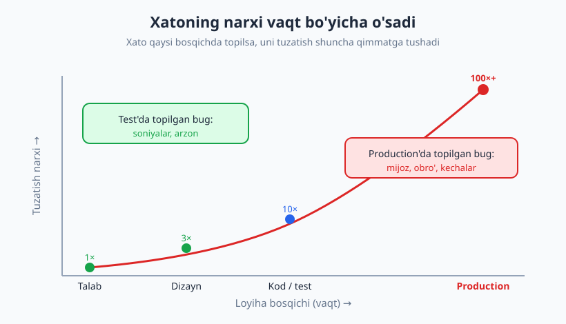
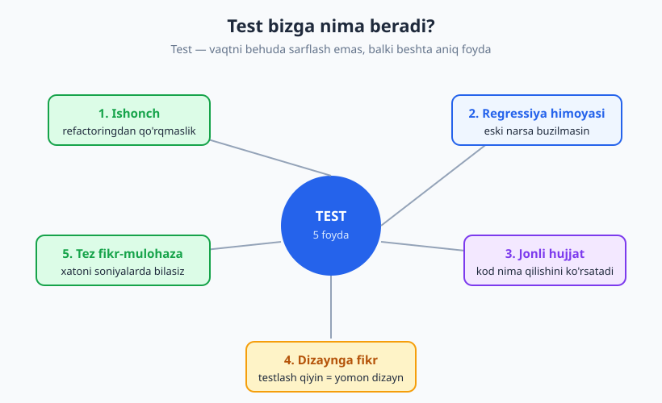
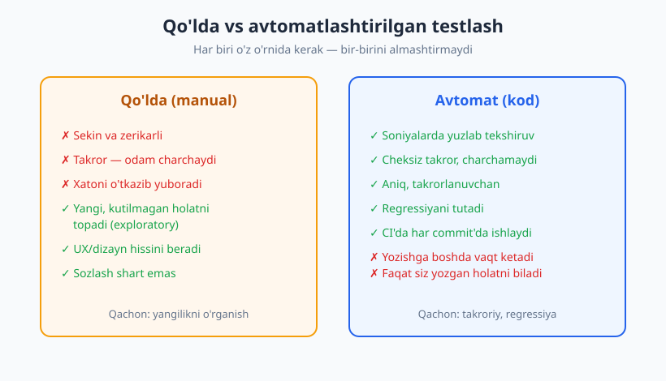

# 01 — Nega test yozamiz?

[🏠 README](./README.md) · [Keyingi: 02 — Birinchi testingiz: AAA va test anatomiyasi ➡️](./02-birinchi-test-aaa.md)

---

> **Bu bobda:** Nega umuman test yozamiz? Bir kichik o'zgartirish butunlay boshqa joyni qanday buzishi (regressiya), xatoning vaqt o'tgani sari qanchalik qimmatlashishi, test bizga beradigan **beshta** asosiy foyda, qo'lda va avtomatlashtirilgan testlash farqi, va eng muhimi — test **nima emas**ligini o'rganamiz. Kichik Python + `pytest` "ta'm berish" namunasi bilan yakunlaymiz.
>
> **Halollik / Eslatma:** Bu kirish bob — bu yerda hali test *yozishni* o'rgatmaymiz (u 02-bobda). Maqsad — **nega** kerakligini chuqur his qilish. Atayin soddalashtirilgan misollardan foydalanamiz. Eng muhim halol gap shu: **test xatosizlikni isbotlamaydi** — buni bobning oxirida ochib beramiz. Bobdagi barcha Python namunalari haqiqatan ishga tushirib, chiqishi tekshirilgan.

---

## Bir tanish hikoya: "men ko'zdan kechirdim, ishlayapti"

Tasavvur qiling, siz onlayn do'kon uchun savat narxini hisoblovchi funksiya yozdingiz. U ikki qoidani biladi: VIP mijozga **10%** chegirma, va 100 so'mdan katta xaridga **5%** chegirma. Kod ishlaydi, hammasi joyida.

Bir oydan keyin boshliq aytadi: "VIP mijoz katta xarid qilsa, 15% beraylik." Siz funksiyani ochasiz, yangi shartni qo'shasiz, bir-ikki misolni qo'lda tekshirasiz — VIP + katta summa endi 15% chiqyapti. "Ishlayapti!" deysiz va deploy qilasiz.

Lekin siz e'tibor bermagan narsa: yangi shartni qo'shayotganda standart chegirma qiymatini tasodifan o'zgartirib yubordingiz. Endi **chegirmasiz, oddiy 50 so'mlik xarid** ham 5% kamayib ketyapti. Hech kim buni payqamaydi — to mijozlardan "narx noto'g'ri" degan shikoyat kelguniga qadar.

Bu — **regressiya** (regression): ilgari to'g'ri ishlab turgan narsaning yangi o'zgartirish tufayli buzilishi. Eng yomoni — siz uni *o'zgartirgan* joydan emas, butunlay boshqa, "tegmagan" joydan paydo bo'ladi.

> **Diqqat:** "Men kodimni ko'zdan kechirdim, ishlayapti" — eng xavfli jumlalardan biri. Ko'z bilan ko'rish faqat siz **o'ylab topgan** holatlarni tekshiradi. Aynan o'ylamagan holatingiz sizni production'da kutib turadi. Inson miyasi bir vaqtda hamma shartni bir xil sinchkovlik bilan ushlab tura olmaydi — ayniqsa yarim tunda, deadline oldidan.

Bu hikoyani keyinroq haqiqiy kod bilan ko'rsatamiz va bitta avtomat test bu xatoni qanday bir zumda tutib qolishini ko'rasiz.

---

## Xatoning narxi: qanchalik kech, shunchalik qimmat

Dasturlashda eng qadimiy va eng mustahkam kuzatuvlardan biri shu: **xato qancha kech topilsa, uni tuzatish shuncha qimmatga tushadi.** Bu yangi gap emas — uni dasturiy injiniring asoschilaridan biri Barri Bem (Barry Boehm) hali 1980-yillarda o'lchagan va sanab bergan.



Mantiqan bu juda tabiiy. Talab bosqichida topilgan xato — bu shunchaki bir jumlani qayta yozish. Dizaynda topilsa — bir diagrammani tuzatish. Kod yozayotganda topilsa — bir necha qator. Lekin u **production**ga (ishlab turgan real tizimga) yetib borsa, narx portlaydi:

| Xato qayerda topildi | Taxminiy nisbiy narx | Nega |
|---|---|---|
| Talab / dizayn | 1× | Hali kod yozilmagan, faqat fikr o'zgaradi |
| Kod yozayotganda | ~5–10× | Tuzatish bor, lekin lokal va arzon |
| Test bosqichida | ~10× | Topildi, lekin reliz oldidan — hali muddat bor |
| **Production'da** | **~100×+** | Mijoz zarari, obro', shoshilinch tuzatish, ma'lumot buzilishi |

Bu raqamlar aniq emas — har loyihada har xil. Lekin **yo'nalish** har doim bir xil: yuqoriga, tez. Production'dagi bug faqat tuzatish vaqti emas — u mijoz ishonchini, jamoaning yarim tunini, ba'zan esa pulni ham yeydi.

Test yozishning birinchi sababi shu yerda yashiringan: **test xatoni egri chiziqning chap, arzon tomonida ushlab qoladi.** Test'da topilgan bug — bir necha soniya va bir necha qator. Production'da topilgan bug — kechalar, shoshilinch reliz va asabiy mijozlar.

> **Trade-off:** Test yozishga *boshda* vaqt ketadi — bu rost. Lekin bu vaqt keyinroq production'dagi bug'larni ushlash, qo'rqmasdan refactoring qilish va har o'zgartirishdan keyin qo'lda qayta-qayta tekshirmaslik orqali ko'p barobar qaytadi. Savol "vaqt ketadimi?" emas, "qaysi vaqt arzonroq — hozir yozish, yoki keyin tuzatish?".

---

## Test bizga aslida nima beradi?

Ko'pchilik o'ylaydiki, testning yagona vazifasi — "xatoni topish". Bu to'g'ri, lekin juda kichik qism. Test beradigan haqiqiy qiymat ancha keng. Beshta asosiy foydani ko'rib chiqamiz.



### 1. Ishonch — qo'rqmasdan o'zgartirish

Testlari yo'q kodga tegish — qorong'i xonada mebellar orasida yurishdek. Har qadamda "biror narsani buzdimmi?" degan qo'rquv bor. Natijada dasturchilar ishlab turgan kodga **tegmaslikka** harakat qiladi, kod esa asta-asta toshga aylanadi.

Yaxshi testlar to'plami esa — yorug'lik. Refactoring qilasiz, yangi feature qo'shasiz, testlarni ishga tushirasiz — yashil bo'lsa, davom etasiz. **Test ishonch beradi**, ishonch esa kodni rivojlantirishga imkon yaratadi.

### 2. Regressiyadan himoya

Yuqoridagi savat hikoyasini eslang. Avtomat test — bu kodning **eski, to'g'ri xulq-atvorini muzlatib qo'yadigan** mexanizm. Kimdir (siz ham bo'lishingiz mumkin) keyinroq biror joyni buzsa, test darrov qizil bo'ladi: "to'xta, sen 50 so'mlik xaridni buzding". Bu — testning eng kunlik, eng amaliy foydasi.

### 3. Jonli hujjat (living documentation)

Yaxshi yozilgan test kodning **nima qilishini** misol orqali ko'rsatadi. Yangi dasturchi loyihaga kelganda, `test_vip_mijoz()` deb nomlangan testni o'qib, VIP mijozga nima bo'lishini darhol tushunadi. Oddiy hujjat (README, izoh) eskirib qoladi, lekin test eskirsa — u **yiqiladi** va sizni ogohlantiradi. Shuning uchun test — "yolg'on gapirmaydigan hujjat".

### 4. Dizaynga fikr-mulohaza

Bu eng kutilmagan foyda. Agar bir funksiyaga test yozish juda qiyin bo'lsa — masalan, uni sinash uchun butun bir ma'lumotlar bazasi, tarmoq va vaqtni sozlash kerak bo'lsa — bu odatda kodning o'zi yomon dizaynda degani: u juda ko'p narsaga bog'langan. **Testlash qiyinligi — yomon dizaynning erta ogohlantirish signali.** Bu g'oyani [10-bob](./10-testlanadigan-dizayn.md)da chuqur ochamiz.

### 5. Tezroq fikr-mulohaza sikli

Xatoni qancha tez bilsangiz, uni shuncha oson tuzatasiz — chunki kontekst hali xotirangizda. Funksiyani yozib, bir soniyada test ishga tushirib, "ishladi/ishlamadi" javobini olish — qo'lda ilovani ochib, bir necha ekran bosib, holatni tayyorlab tekshirishdan o'n barobar tez. Test — eng tez fikr-mulohaza halqasi.

---

## Qo'lda vs avtomatlashtirilgan testlash

Ehtimol o'ylayotgandirsiz: "Men allaqachon test qilaman-ku — ilovani ochib, tugmani bosib ko'raman." Bu — **qo'lda (manual) testlash**, va u haqiqatan ham testlashning bir turi. Lekin u avtomatlashtirilgan testdan tubdan farq qiladi.



| Xususiyat | Qo'lda (manual) | Avtomatlashtirilgan (kod) |
|---|---|---|
| Tezlik | Sekin (har safar daqiqalar) | Soniyalarda yuzlab tekshiruv |
| Takrorlanuvchanlik | Odam charchaydi, qadam o'tkazib yuboradi | Har safar aynan bir xil |
| Regressiyani tutish | Faqat tekshirgan joyingizda | Har commit'da butun to'plam |
| Boshlang'ich xarajat | Yo'q (shunchaki bosasiz) | Test yozishga vaqt ketadi |
| Kutilmagan holatni topish | **Kuchli** (inson sezgisi) | Yo'q — faqat siz yozgan holat |
| UX / dizayn hissi | **Kuchli** | Yo'q |

Diqqat qiling: bu jadval "qaysi biri yaxshi" degan musobaqa **emas**. Ular har xil ish uchun. Avtomat test takroriy, aniq, regressiyaga moyil narsani qoplaydi. Qo'lda testlash esa — odam aqli kerak bo'lgan joyda kuchli:

- **Exploratory testing** (kashfiyot testlash) — tizimni "buzishga urinib", hech kim o'ylamagan holatlarni topish.
- Yangi feature'ning ko'rinishi, his-tuyg'usi, qulayligini baholash.
- Bir martalik, tezda tekshirish kerak bo'lgan narsalar.

> **Eslatma:** "Avtomatlashtirdim, endi qo'lda test kerak emas" — afsona. Avtomat test faqat **siz oldindan o'ylab, yozib qo'ygan** holatlarni biladi. Inson o'ylamagan holatni topadi. Kuchli jamoa ikkalasini ham ishlatadi: takroriy narsalarni avtomatlashtirib, miyani exploratory testing uchun bo'shatadi.

---

## "Ta'm berish": birinchi avtomat testimiz

Endi nazariyani bir zumda amaliyotga aylantiramiz. Hali sintaksisni chuqur o'rgatmaymiz (u 02-bob) — shunchaki **test qanday ko'rinishini va nima qilishini** his qiling.

Bizda kichik funksiya bor — narxga soliq qo'shadi. **Sinaladigan kod** (`soliq.py`):

```python
# soliq.py  — sinaladigan kod
def narx_qoshilgan_soliq(narx, stavka=0.12):
    """Narxga soliq qo'shib, yakuniy summani qaytaradi."""
    soliq = narx * stavka
    return narx + soliq
```

Endi **test kodi** (`test_soliq.py`). Har bir `test_` bilan boshlanadigan funksiya bitta holatni tekshiradi:

```python
# test_soliq.py  — test kodi
from soliq import narx_qoshilgan_soliq


def test_oddiy_narx():
    natija = narx_qoshilgan_soliq(100, 0.12)
    assert natija == 112        # 100 + 12

def test_nol_narx():
    assert narx_qoshilgan_soliq(0, 0.12) == 0

def test_standart_stavka():
    assert narx_qoshilgan_soliq(50) == 56   # 50 + 6
```

Bu yerdagi sehrli so'z — `assert` ("tasdiqla"). U "men shu natijani kutyapman" deydi. Agar haqiqiy natija mos kelsa — test o'tadi (PASS); kelmasa — yiqiladi (FAIL). Terminalda `python -m pytest` deb ishga tushiramiz:

```text
...                                                  [100%]
3 passed in 1.10s
```

Uchta nuqta — uchta o'tgan test. `3 passed` — hammasi yashil. Bu sizning birinchi avtomat himoyangiz.

### Endi test xatoni qanday tutishini ko'ramiz

Tasavvur qiling, kimdir funksiyani buzdi — soliqni hisoblab, lekin uni **qo'shishni unutib**, narxning o'zini qaytarib yubordi:

```python
# soliq.py  — buzilgan versiya (anti-misol)
def narx_qoshilgan_soliq(narx, stavka=0.12):
    soliq = narx * stavka
    return narx          # ❌ XATO: 'narx + soliq' o'rniga shunchaki 'narx'
```

Endi xuddi o'sha testlarni ishga tushiramiz:

```text
F.F                                                  [100%]
=================================== FAILURES ===================================
________________________________ test_oddiy_narx _______________________________
        natija = narx_qoshilgan_soliq(100, 0.12)
>       assert natija == 112
E       assert 100 == 112
=========================== short test summary info ============================
FAILED test_soliq.py::test_oddiy_narx
FAILED test_soliq.py::test_standart_stavka
2 failed, 1 passed in 2.13s
```

`pytest` bir zumda aniq aytib beradi: `assert 100 == 112` — kutilgani 112 edi, kelgani 100. Ikki test yiqildi. Diqqat qiling — `test_nol_narx` **o'tib qoldi**, chunki 0 + 0 baribir 0. Bu muhim saboq: testlar to'g'ri tanlangan bo'lishi kerak, aks holda bug yashirinib qolishi mumkin (buni [05-bob](./05-assertionlar-test-holatlari.md)da o'rganamiz).

Mana shu — testning kuchi: siz kodga tegmasingizdan oldin ham xato sizga **o'zini ko'rsatdi**, soniyalarda, aniq joyini ko'rsatib.

### Hikoyamizdagi regressiya — endi avtomat tutib qoladi

Bob boshidagi savat hikoyasini eslang. Boshlang'ich funksiya va uning testlari:

```python
# savat.py
def yakuniy_narx(summa, vip=False):
    chegirma = 0.0
    if vip:
        chegirma = 0.10
    elif summa >= 100:
        chegirma = 0.05
    return summa * (1 - chegirma)
```

```python
# test_savat.py
from savat import yakuniy_narx

def test_oddiy_kichik_summa():
    assert yakuniy_narx(50) == 50.0       # chegirmasiz

def test_katta_summa_chegirma():
    assert yakuniy_narx(200) == 190.0     # 5%

def test_vip_mijoz():
    assert yakuniy_narx(50, vip=True) == 45.0   # 10%
```

`3 passed` — hammasi yashil. Endi "VIP + katta summaga 15%" feature'ini qo'shamiz, lekin standart qiymatni `0.0` o'rniga `0.05` qilib xato qilamiz:

```python
def yakuniy_narx(summa, vip=False):
    chegirma = 0.05                       # ❌ regressiya shu yerda tug'iladi
    if vip and summa >= 100:
        chegirma = 0.15
    elif vip:
        chegirma = 0.10
    elif summa >= 100:
        chegirma = 0.05
    return summa * (1 - chegirma)
```

Yangi feature **ishlaydi** — qo'lda VIP+katta summani tekshirsangiz, 15% chiqadi, xursand bo'lasiz. Lekin testlarni ishga tushiring:

```text
F..                                                  [100%]
=================================== FAILURES ===================================
___________________________ test_oddiy_kichik_summa ____________________________
>       assert yakuniy_narx(50) == 50.0
E       assert 47.5 == 50.0
=========================== short test summary info ============================
FAILED test_savat.py::test_oddiy_kichik_summa
1 failed, 2 passed in 1.22s
```

Test darrov baqiradi: 50 so'mlik oddiy xarid endi 47.5 chiqyapti — siz uni buzding! Qo'lda testlashda buni payqamasligingiz mumkin edi (kim har feature'dan keyin *barcha* eski holatni qayta bosib chiqadi?). Avtomat test esa charchamaydi va hech narsani unutmaydi. **Mana regressiyadan himoya — amalda.**

> **Eslatma:** Til-mustaqillik. Bu yerda Python va `pytest` ishlatdik, lekin g'oya har qanday tilda bir xil. JavaScript'da bu `Jest`/`Vitest` (`expect(natija).toBe(112)`), PHP'da `PHPUnit`/`Pest` (`assertSame(112, $natija)`), Java'da `JUnit`, Go'da standart `testing` paketi. `assert`/`expect` so'zi o'zgaradi, tafakkur — bir xil.

---

## Test NIMA EMAS: eng halol gap

Endi eng muhim, eng halol qismga keldik. Yangi boshlovchilar ko'pincha o'ylaydi: "testlarim yashil — demak kodimda xato yo'q". Bu **noto'g'ri**, va buni ochiq aytish shart.

Informatika klassiklaridan Edsger Deykstra (Edsger Dijkstra) mashhur jumla qoldirgan:

> "Testing shows the presence, not the absence, of bugs."
> ("Test xatoning **bor**ligini ko'rsatadi, **yo'q**ligini emas.")

Bu nimani anglatadi? Test faqat siz **yozgan** holatlarni tekshiradi. Siz o'ylamagan holat — masalan, manfiy narx, juda katta son, bo'sh ro'yxat, ikki amal bir vaqtda — testda yo'q bo'lsa, u yashirinib qolaveradi. Yuqoridagi soliq misolida `test_nol_narx` bug bor bo'lsa ham o'tib ketdi — chunki 0 maxsus son edi.

Shuning uchun:

- ✅ Test = **xavfni kamaytirish** quroli. Ko'p va yaxshi testlar bug ehtimolini keskin kamaytiradi.
- ❌ Test ≠ **xatosizlik kafolati**. Hech qancha test "bu kodda umuman xato yo'q" deb **isbotlay olmaydi**.

> **Diqqat — afsonalarni buzamiz:**
> - *"100% coverage = xatosiz kod."* Yo'q. Coverage faqat kod **ishga tushdimi**ni o'lchaydi, **to'g'ri**ligini emas ([20-bob](./20-code-coverage.md)).
> - *"Hamma narsani test bilan qoplash mumkin."* Yo'q — holatlar soni ko'pincha cheksiz. Maqsad — eng muhim va eng xavfli holatlarni qoplash.
> - *"Testlar bor, demak qo'rqmasa bo'ladi."* Testlar ishonch beradi, lekin tanqidiy fikrlashni almashtirmaydi.

To'g'rilikni **isbotlash** (matematik) — alohida, ancha qiyin soha; u test bilan bir-birini to'ldiradi (qarang: [Algoritmlar kitobi](../algoritmlar/README.md)). Bu kitobda biz amaliy, real dunyo quroli — testlash bilan shug'ullanamiz. Test mukammallik bermaydi, lekin u sizga *arzon, tez va ishonchli* xavf-himoyasini beradi.

---

## Testlash madaniyati: test — birinchi darajali kod

Oxirgi, lekin muhim mavzu — munosabat. Ko'p jamoalarda test "qo'shimcha", "vaqt bo'lsa yozamiz", "ikkinchi darajali" narsa sifatida qaraladi. Bu — eng keng tarqalgan tuzoq.

- **"Test keyin yozaman" tuzog'i.** "Keyin" deyilgan test deyarli hech qachon yozilmaydi — deadline kelaveradi, va kod testsiz ketadi. Test kodga **yaqin** turishi kerak: feature bilan birga, ideal holatda undan oldin ([11-bob, TDD](./11-tdd-red-green-refactor.md)).
- **Test = birinchi darajali kod.** Test kodi ham sizning loyihangizning bir qismi. U ham toza, o'qiladigan, parvarish qilinadigan bo'lishi kerak. "Loyqa test" — keyin og'riq bo'ladi (buni [13-bob](./13-refactoring-va-testlar.md)da ko'ramiz).
- **Test — sarmoya, xarajat emas.** Bugun yozilgan test ertaga sizni regressiyadan, qo'lda qayta tekshirishdan va yarim tundagi production yong'inlaridan saqlaydi.

Yaxshi jamoada test yozish — "qachondir, kuch bo'lsa" qiladigan ish emas, balki ishning **ajralmas qismi**, xuddi kodning o'zidek. Bu kitob aynan shu madaniyatni — fikrlash tarzini — sizda shakllantirishga qaratilgan.

---

## Asosiy g'oyalar (bobni qisqacha)

- **Regressiya — asosiy dushman.** Bir o'zgartirish "tegmagan" joyni buzishi mumkin; "ko'zdan kechirdim, ishlayapti" buni tutmaydi.
- **Xato qancha kech topilsa, shuncha qimmat.** Talab → kod → test → production bo'ylab narx eksponensial o'sadi. Test xatoni arzon tomonda ushlaydi.
- **Test beshta foyda beradi:** ishonch, regressiyadan himoya, jonli hujjat, dizaynga fikr-mulohaza, tez fikr-mulohaza sikli.
- **Qo'lda va avtomat testlash — raqib emas, sherik.** Avtomat: takroriy/regressiya. Qo'lda: exploratory, UX, sezgi.
- **`assert` — testning yuragi.** "Men shu natijani kutyapman" — mos kelsa PASS, kelmasa FAIL.
- **Test xatosizlikni ISBOTLAMAYDI** (Deykstra). Test = xavfni kamaytirish, kafolat emas. "100% coverage = xatosiz" — afsona.
- **Test — birinchi darajali kod.** "Keyin yozaman" tuzog'iga tushmang; test — sarmoya, madaniyatning bir qismi.

---

## Mashqlar

### Oson

**1-mashq.** O'z so'zlaringiz bilan "regressiya" nima ekanini va nega u xavfli ekanini 2–3 jumlada tushuntiring. Hayotdan (kod bo'lmagan) bitta misol keltiring.

**2-mashq.** Quyidagi `assert`lardan qaysilari PASS, qaysilari FAIL bo'ladi? Sababini ayting.
```python
assert 2 + 2 == 4
assert "salom".upper() == "SALOM"
assert len([1, 2, 3]) == 2
assert max(5, 9) == 9
```

**3-mashq.** Quyidagi vaziyatlarning har biri uchun — qo'lda yoki avtomatlashtirilgan testlash mosroqligini ayting:
(a) har relizdan oldin 200 ta hisob-kitob qoidasini tekshirish; (b) yangi mobil ilova ekranining ko'rinishi qulay-noqulayligini baholash; (c) har commit'da login funksiyasi ishlashini tekshirish; (d) tizimni "buzishga urinib" kutilmagan xatolarni qidirish.

### O'rta

**4-mashq.** Quyidagi funksiyaga 3 ta `test_` funksiyasi yozing (faqat `assert`lar — `pytest` sintaksisida). Kamida bittasi chegara holatini (masalan, aniq 60) qoplasin.
```python
def harf_baho(ball):
    if ball >= 90: return "A"
    elif ball >= 75: return "B"
    elif ball >= 60: return "C"
    else: return "F"
```

**5-mashq.** Bobdagi buzilgan `narx_qoshilgan_soliq` misolida `test_nol_narx` testi bug bo'lishiga qaramay nega PASS bo'lib qoldi? Bu bizga test holatlarini tanlash haqida qanday saboq beradi?

**6-mashq.** Bir hamkasbingiz: "Bizda 100% code coverage bor, demak kodimizda xato yo'q" deydi. Unga halol, lekin xushmuomala javob yozing (2–4 jumla), Deykstra fikriga tayanib.

### Qiyin

**7-mashq.** Xatoning narxi haqidagi g'oyani biror real (yoki ishonarli o'ylab topilgan) loyihaga tatbiq qiling: bitta xato talab bosqichida topilsa nima bo'lardi, va xuddi shu xato production'da topilsa nima bo'lardi? Har bosqich uchun narx (vaqt, pul, obro') bo'yicha qisqa baho bering.

**8-mashq.** "Test keyin yozaman" tuzog'i nega deyarli har doim "test umuman yozilmaydi"ga aylanadi? Jamoada bu odatni buzish uchun 3 ta amaliy taklif bering (jarayon yoki madaniyat darajasida).

<details markdown="1">
<summary>Yechimlar</summary>

### 1-mashq yechimi
**Regressiya** — ilgari to'g'ri ishlab turgan funksionallikning yangi o'zgartirish (yangi feature, tuzatish, refactoring) tufayli buzilishi. Xavfli, chunki u odatda siz *o'zgartirgan* joydan emas, "tegmagan" joydan paydo bo'ladi va ko'z bilan ko'rishda payqalmasligi mumkin. Hayotiy misol: mashinada radio antennasini almashtirayotganda, montajchi tasodifan signal simini uzib qo'yadi — antenna ishlaydi, lekin endi orqa signal chiroqlari yonmaydi.

### 2-mashq yechimi
- `assert 2 + 2 == 4` → **PASS** (4 == 4).
- `assert "salom".upper() == "SALOM"` → **PASS** (`.upper()` katta harfga aylantiradi).
- `assert len([1, 2, 3]) == 2` → **FAIL** (uzunlik 3, 2 emas → `assert 3 == 2`).
- `assert max(5, 9) == 9` → **PASS** (kattasi 9).

### 3-mashq yechimi
- (a) **Avtomat** — takroriy, ko'p, aniq; odam charchaydi va xato qiladi.
- (b) **Qo'lda** — inson sezgisi, qulaylik hissi kerak; mashina "chiroyli/qulay"ni o'lchamaydi.
- (c) **Avtomat** — har commit'da takrorlanadi, regressiyadan himoya qiladi (CI uchun ideal).
- (d) **Qo'lda (exploratory)** — oldindan yozilmagan, kutilmagan holatlarni topish aynan inson ishi.

### 4-mashq yechimi
Ishga tushirib tasdiqlangan (3 passed):
```python
def test_a_baho():
    assert harf_baho(95) == "A"

def test_chegara_60():
    # aniq chegara: 60 -> 'C' (>= shart tufayli)
    assert harf_baho(60) == "C"

def test_past_ball():
    assert harf_baho(40) == "F"
```
Chegara qiymati (60) — eng xatoga moyil joy: dasturchi `>=` o'rniga `>` yozsa, aynan shu test buni tutadi.

### 5-mashq yechimi
Buzilgan kod `narx`ni qaytaradi (soliq qo'shmaydi). Lekin `narx = 0` bo'lganda: to'g'ri javob ham `0 + 0 = 0`, buzilgan javob ham `0`. Ikkalasi tasodifan **mos keladi**, shuning uchun test PASS bo'ldi. Saboq: **maxsus/nol qiymatlar ko'pincha bug'ni yashiradi.** Test holatlarini tanlashda "tasodifan to'g'ri chiqadigan" qiymatlardan qochib, har xil, ma'noli holatlarni (ayniqsa chegara va odatiy qiymatlarni) tanlash kerak. Buni [05-bob](./05-assertionlar-test-holatlari.md) chuqur ochadi.

### 6-mashq yechimi
"100% coverage juda yaxshi — demak deyarli har qator kodimiz hech bo'lmasa bir marta ishga tushgan. Lekin coverage faqat kod **bajarildimi**ni o'lchaydi, natija **to'g'rimi**ni emas. Deykstra aytganidek, test xatoning *bor*ligini ko'rsatadi, *yo'q*ligini isbotlamaydi — biz hali ham o'ylab topmagan holatda bug bo'lishi mumkin. Shuning uchun coverage'ni ishonch belgisi sifatida qabul qilaylik, lekin 'xatosiz' degan kafolat sifatida emas."

### 7-mashq yechimi
Misol — to'lov tizimida "soliq stavkasi noto'g'ri talqin qilingan" xatosi.
- **Talab bosqichida topilsa (1×):** Tahlilchi bilan bir suhbat, bitta jumlani tuzatish. Narx: yarim soat, deyarli nol.
- **Kod yozayotganda (~10×):** Bir necha funksiya yozilgan, ularni qayta ko'rish kerak. Narx: yarim kun.
- **Production'da topilsa (~100×+):** Minglab mijoz noto'g'ri summa to'lagan; shoshilinch tuzatish + reliz, pulni qaytarish, moliyaviy hisobotlarni to'g'rilash, mijoz ishonchi va ehtimol jarima. Narx: kunlar/haftalar mehnat, to'g'ridan-to'g'ri pul yo'qotish va obro' zarari. Bu — egri chiziqning "portlash" qismi.

### 8-mashq yechimi
"Keyin" — bu hech qachon kelmaydigan vaqt: yangi vazifa, yangi deadline doim ustivor bo'lib chiqadi, test esa "majburiy emas" bo'lib qolgani uchun birinchi bo'lib tashlab ketiladi. Buzish uchun:
1. **Testni feature bilan bir xil "tugatilgan" mezoniga kiriting** (Definition of Done): test yo'q kod = tugatilmagan kod. Pull request testsiz qabul qilinmasin.
2. **CI'ni majburiy qiling:** testlar yiqilsa yoki yo'q bo'lsa, kodni asosiy tarmoqqa qo'shib bo'lmaydi ([27-bob](./27-ci-cd-avtomatlashtirish.md)).
3. **TDD ni odatga aylantiring:** testni *oldin* yozsangiz, "keyin" degan tuzoq umuman paydo bo'lmaydi ([11-bob](./11-tdd-red-green-refactor.md)).

</details>

---

[🏠 README](./README.md) · [Keyingi: 02 — Birinchi testingiz: AAA va test anatomiyasi ➡️](./02-birinchi-test-aaa.md)
