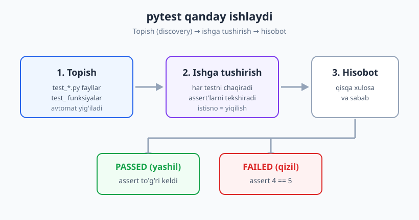
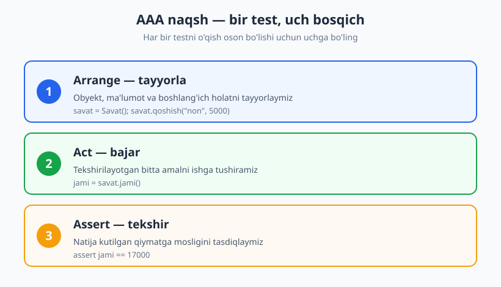
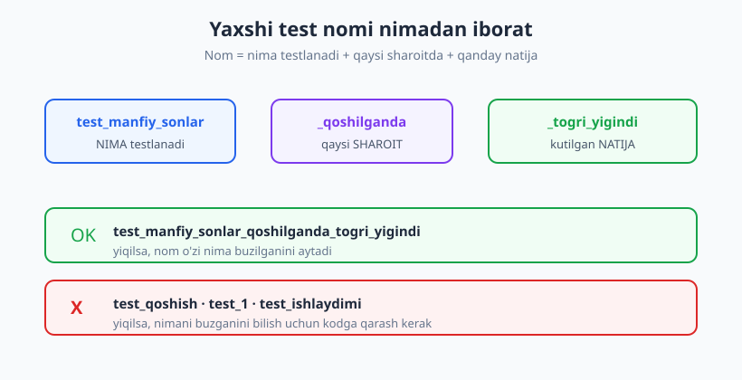

# 02 — Birinchi testingiz: AAA va test anatomiyasi

[🏠 README](./README.md) · [⬅️ Oldingi: 01 — Nega test yozamiz?](./01-nega-test-yozamiz.md) · [Keyingi: 03 — Test turlari va test piramidasi ➡️](./03-test-turlari-piramida.md)

---

> **Bu bobda:** terminalingizda birinchi avtomat testni yozasiz va ishga tushirasiz. Test runner
> (pytest) nima ekanini, `assert` qanday ishlashini, va har bir testni o'qishga oson qiladigan
> **AAA naqshi** (Arrange-Act-Assert) bilan tanishasiz. Yaxshi test **nomi** qanday bo'lishini
> ko'rasiz va pytest test fayllaringizni qanday avtomat topishini bilib olasiz.
>
> **Halollik / Eslatma:** misollar Python + `pytest` ustida, lekin AAA, test nomlash va
> "bitta test = bitta xulq" tamoyillari **har qanday tilda** bir xil. Bu bobda eng oddiy
> testlardan boshlaymiz; fixture, parametrize va mock kabi kuchli vositalar keyingi boblarga
> qoldiriladi. Bu bobdagi barcha kod va pytest chiqishlari **haqiqatan ishga tushirib tekshirilgan**.

---

## Test runner nima va nega kerak

Tasavvur qiling, siz oshxonada ovqat pishirdingiz va har gal mehmon kelganda uni qo'lda
tatib ko'rasiz: tuz yetarlimi, issiqmi. Bu — **qo'lda testlash**. Endi tasavvur qiling, sizning
o'rningizga bir yordamchi bor: u har gal ovqat tayyor bo'lishi bilan o'zi tatib, "tuz joyida,
harorat joyida" deb hisobot beradi — bir soniyada, charchamasdan, har safar aynan bir xil.
Mana shu yordamchi — **test runner**.

Test runner — bu sizning testlaringizni **topib, ishga tushirib, natijani hisobot qiladigan**
dastur. Python dunyosida eng mashhuri — **pytest**. Siz faqat "nimani tekshirish kerak"ni
yozasiz; topish, chaqirish, natijani yashil yoki qizil qilib ko'rsatish — runner'ning ishi.

Nega runner kerak? Chunki bitta funksiyani bir marta qo'lda tekshirish oson, ammo loyiha o'sgani
sayin yuzlab tekshiruv paydo bo'ladi. Ularning hammasini har o'zgarishdan keyin qo'lda qaytarish
mumkin emas. Runner buni bir buyruq bilan, soniyalarda bajaradi.

> **Til-ko'prik:** JavaScript'da runner — `Jest` yoki `Vitest`; PHP'da — `PHPUnit` yoki `Pest`;
> Java'da — `JUnit`; Go'da — o'rnatilgan `testing` paketi. Nomi boshqacha, vazifasi bir xil:
> testlarni topadi, ishga tushiradi, hisobot beradi.

### pytest'ni o'rnatish va ishga tushirish

pytest oddiy paket. Terminalda:

```text
pip install pytest
```

O'rnatilganini tekshirish:

```text
pytest --version
# -> pytest 9.0.3
```

Testlarni ishga tushirish — joriy papkada shunchaki:

```text
pytest
```

Batafsilroq, har test nomini ko'rsatib ishga tushirish:

```text
pytest -v
```

`-v` (verbose, ya'ni "gapdor") har bir testni alohida qatorda PASSED yoki FAILED bilan ko'rsatadi.
Tezda ko'rasiz, bu farqning ahamiyati katta.

---

## Eng birinchi testingiz

Kichik bir funksiyadan boshlaylik: ikki sonni qo'shadigan `qoshish`. Avval **sinaladigan kod**ni
alohida faylga yozamiz.

**Fayl: `kalkulyator.py`** (bu — biz testlayotgan haqiqiy kod):

```python
def qoshish(a, b):
    return a + b
```

Endi **test kod**ini alohida faylga yozamiz. Bu yerda eng muhim konvensiya bor: pytest test
fayllarini nomidan tanib oladi — fayl nomi **`test_`** bilan boshlanishi (yoki `_test`
bilan tugashi) kerak, va ichidagi test funksiyalari ham **`test_`** bilan boshlanishi kerak.

**Fayl: `test_kalkulyator.py`** (bu — testlar):

```python
from kalkulyator import qoshish


def test_ikki_musbat_son_qoshilganda_yigindi_qaytadi():
    natija = qoshish(2, 3)
    assert natija == 5
```

Ikki fayl bir papkada yonma-yon turadi:

```text
proj/
├── kalkulyator.py          # sinaladigan kod
└── test_kalkulyator.py     # test kod
```

Endi terminalda papkada turib `pytest` deymiz:

```text
pytest
# ->
# ======================== test session starts ========================
# collected 1 item
#
# test_kalkulyator.py .                                          [100%]
#
# ========================= 1 passed in 0.53s =========================
```

Tabriklaymiz — siz birinchi avtomat testingizni yozib, ishga tushirdingiz. O'sha `.` (nuqta)
"bitta test o'tdi" degani. `1 passed` — hammasi yashil.

`pytest -v` bilan ko'rsa, test nomi to'liq ko'rinadi:

```text
pytest -v
# ->
# test_kalkulyator.py::test_ikki_musbat_son_qoshilganda_yigindi_qaytadi PASSED [100%]
# ========================= 1 passed in 0.52s =========================
```

> **Eslatma:** kodni va testni nega ikki faylga ajratamiz? Chunki `kalkulyator.py` —
> ishlab chiqarishga (production) ketadigan haqiqiy kod, `test_kalkulyator.py` esa faqat
> tekshirish uchun. Ularni ajratish kodingizni toza saqlaydi va testlarni alohida ishga
> tushirish, alohida tashlab yuborishni osonlashtiradi.

---

## `assert` qanday ishlaydi

`assert` — Python'ning o'rnatilgan kalit so'zi. U juda oddiy: `assert SHART` deyilsa, agar
`SHART` **rost** bo'lsa — hech narsa bo'lmaydi, kod davom etadi. Agar **yolg'on** bo'lsa —
`AssertionError` istisnosi (exception) tashlanadi va test **yiqiladi**.

```python
assert 5 == 5     # rost -> hech narsa bo'lmaydi
assert 4 == 5     # yolg'on -> AssertionError, test yiqiladi
```

Test runner mana shu mexanizmga tayanadi: test funksiyasi oxirigacha istisno tashlamasdan
yetib borsa — **PASSED**; biror `assert` yiqilsa (yoki kutilmagan istisno chiqsa) — **FAILED**.

### pytest'ning aqlli xabari (assertion introspection)

Oddiy `assert` yiqilganda Python faqat "AssertionError" deydi — qaysi qiymatlar mos kelmaganini
aytmaydi. pytest esa **assertion introspection** (tekshiruvni o'rganib chiqish) qiladi: yiqilgan
`assert`ning ikki tomonidagi haqiqiy qiymatlarni o'zi hisoblab, sizga ko'rsatadi. Bu —
xatoni topishni tezlashtiradigan eng yoqimli xususiyatlardan biri.

Ataylab yiqiladigan test yozamiz: `qoshish(2, 2)` natijasini xato qilib `5` deb kutamiz.

```python
from kalkulyator import qoshish


def test_qoshish_xato_kutilsa_yiqiladi():
    natija = qoshish(2, 2)
    assert natija == 5
```

Ishga tushiramiz:

```text
pytest test_yiqiladi.py
# ->
# =============================== FAILURES ===============================
# ___________________ test_qoshish_xato_kutilsa_yiqiladi _________________
#
#     def test_qoshish_xato_kutilsa_yiqiladi():
#         natija = qoshish(2, 2)
# >       assert natija == 5
# E       assert 4 == 5
#
# test_yiqiladi.py:6: AssertionError
# ========================== 1 failed in 0.68s ==========================
```

Diqqat qiling: pytest aynan `assert 4 == 5` deb yozdi. Ya'ni `natija` aslida `4` bo'lgan, biz
esa `5` kutgan ekanmiz — bu yiqilishning **sababi** darrov ko'rinib turibdi. Kodga kirib
qidirishga hojat yo'q.

Endi tuzatamiz — kutilgan qiymatni to'g'rilaymiz (`2 + 2 = 4`):

```python
def test_qoshish_tuzatildi():
    natija = qoshish(2, 2)
    assert natija == 4
# ->
# ========================== 1 passed in 0.53s ==========================
```

Yashil. Mana shu sikl — yozish, ishga tushirish, qizilni ko'rish, tuzatish, yashilni ko'rish —
testlash bilan ishlashning kundalik ritmi.



---

## AAA naqsh: Arrange — Act — Assert

Eng yaxshi testlar bir xil shaklga ega bo'ladi. Bu shakl — **AAA naqsh**: har test **uchta**
aniq bosqichdan iborat:

1. **Arrange (tayyorla)** — testga kerakli obyekt, ma'lumot va boshlang'ich holatni tayyorlaymiz.
2. **Act (bajar)** — tekshirilayotgan **bitta** amalni ishga tushiramiz.
3. **Assert (tekshir)** — natija kutilgan qiymatga mosligini tasdiqlaymiz.



Buni real misolda ko'raylik. Bizda kichik **savat** (shopping cart) klassi bor.

**Fayl: `savat.py`** (sinaladigan kod):

```python
class Savat:
    def __init__(self):
        self.mahsulotlar = []

    def qoshish(self, nom, narx):
        self.mahsulotlar.append((nom, narx))

    def jami(self):
        return sum(narx for _, narx in self.mahsulotlar)
```

**Fayl: `test_savat.py`** — har bosqichni izoh bilan ajratamiz:

```python
from savat import Savat


def test_ikki_mahsulot_qoshilganda_jami_narxlar_yigindisi_boladi():
    # Arrange — savatni tayyorlaymiz
    savat = Savat()
    savat.qoshish("non", 5000)
    savat.qoshish("sut", 12000)

    # Act — tekshirilayotgan amalni bajaramiz
    jami = savat.jami()

    # Assert — natijani kutilgan qiymat bilan solishtiramiz
    assert jami == 17000
```

Ishga tushiramiz:

```text
pytest test_savat.py -v
# ->
# test_savat.py::test_ikki_mahsulot_qoshilganda_jami_narxlar_yigindisi_boladi PASSED [ 50%]
# test_savat.py::test_bosh_savatning_jamisi_nol PASSED                              [100%]
# ========================== 2 passed in 0.55s ==========================
```

### Nega AAA o'qishni osonlashtiradi

Ko'zingiz testni yuqoridan pastga o'qiganda darrov javob topadi: "**Nima** holatda? (Arrange)
**Nima** qildik? (Act) **Nimani** kutamiz? (Assert)". Uch bosqich bir-biriga aralashmasa,
test bir nigohda tushunarli bo'ladi.

Quyidagi anti-misolga qarang — bu test ham **ishlaydi**, lekin bosqichlar aralashib ketgan,
o'qish qiyin:

```python
# ❌ Yomon: tayyorlash, amal va tekshiruv aralash
def test_savat():
    savat = Savat()
    savat.qoshish("non", 5000)
    assert savat.jami() == 5000   # tekshiruv o'rtada
    savat.qoshish("sut", 12000)
    assert savat.jami() == 17000  # yana tekshiruv
```

```python
# ✅ Yaxshi: bir holat, bir amal, bir tekshiruv (AAA aniq)
def test_ikki_mahsulot_qoshilganda_jami_narxlar_yigindisi_boladi():
    savat = Savat()                  # Arrange
    savat.qoshish("non", 5000)
    savat.qoshish("sut", 12000)
    jami = savat.jami()              # Act
    assert jami == 17000             # Assert
```

> **Trade-off:** har testga `# Arrange / # Act / # Assert` izohini yozish shartmi? Yo'q — kichik
> testlarda bo'sh qator bilan ajratish ham yetadi. Muhimi — **shakl**, izoh emas. Lekin
> boshlang'ich paytda izohlar fikrni tartibga solishga juda yordam beradi.

> **Eslatma:** ba'zan to'rtinchi bosqich qo'shiladi — **Cleanup (tozalash)**, masalan ochilgan
> fayl yoki ulanishni yopish. pytest'da buni odatda **fixture** bajaradi (06-bobda). Hozircha
> uch bosqich yetarli.

---

## Test nomlash: nom o'zi hikoya aytsin

Test yiqilganda siz birinchi ko'radigan narsa — uning **nomi**. Yaxshi nom shu zahoti
"nima buzilgani"ni aytib beradi; yomon nom esa sizni kodga qarashga majbur qiladi.

Yaxshi nom uch qismdan iborat: **nima** testlanadi + qaysi **sharoit**da + qanday **natija**
kutiladi.



Misollar:

| ❌ Yomon nom | ✅ Yaxshi nom |
|---|---|
| `test_qoshish` | `test_manfiy_sonlar_qoshilganda_togri_yigindi` |
| `test_1` | `test_bosh_savatning_jamisi_nol` |
| `test_ishlaydimi` | `test_mavjud_bolmagan_mahsulot_ochirilsa_xato_chiqadi` |
| `test_savat` | `test_ikki_mahsulot_qoshilganda_jami_yigindi_boladi` |

`test_qoshish` yiqilsa, siz "qo'shishning qaysi holatida?" deb so'raysiz — manfiy sonlarmi,
nolmi, juda katta sonmi? Nom buni aytmaydi. `test_manfiy_sonlar_qoshilganda_togri_yigindi`
esa darrov aytadi: muammo manfiy sonlarni qo'shishda.

> **Diqqat:** uzun nomdan qo'rqmang. Test nomini siz qo'lda yozmaysiz — runner uni faqat
> hisobotda ko'rsatadi. "Uzun, lekin aniq" har doim "qisqa, lekin sirli"dan afzal.

---

## Bitta test = bitta xulq

Yaxshi testning yana bir xossasi: u **bitta xulqni** (one logical assertion / bitta yiqilish
sababi) tekshiradi. Ya'ni test yiqilsa, faqat **bitta** sabab bo'lishi kerak.

```python
# ❌ Bir testda uch xil xulq aralash — yiqilsa, qaysi biri buzildi?
def test_savat_hammasi():
    savat = Savat()
    savat.qoshish("non", 5000)
    assert savat.jami() == 5000
    assert len(savat.mahsulotlar) == 1
    assert savat.mahsulotlar[0][0] == "non"
```

Bu testda uchta turli da'vo bor. Birinchisi yiqilsa, pytest qolganlarini tekshirmaydi ham —
demak siz to'liq manzarani ko'rmaysiz. Har xulqni alohida testga ajratish yaxshiroq:

```python
# ✅ Har test bitta xulq — yiqilsa, sabab aniq
def test_mahsulot_qoshilganda_jami_oshadi():
    savat = Savat()
    savat.qoshish("non", 5000)
    assert savat.jami() == 5000


def test_mahsulot_qoshilganda_soni_birga_oshadi():
    savat = Savat()
    savat.qoshish("non", 5000)
    assert len(savat.mahsulotlar) == 1
```

> **Eslatma:** "bitta xulq" "bitta `assert` qatori" degani **emas**. Ba'zan bitta xulqni
> tasdiqlash uchun bir nechta `assert` kerak bo'ladi (masalan, bir obyektning bir nechta
> maydoni). Muhimi — barcha `assert`lar **bitta** g'oyani tekshirsin. Bunga 04-bobda
> chuqurroq qaytamiz.

---

## Test fayllari tashkili va pytest qanday topadi (discovery)

pytest testlarni **avtomat topadi** — buni "discovery" (kashf qilish) deyiladi. U qat'iy, oddiy
qoidalarga amal qiladi:

| Element | Konvensiya | Misol |
|---|---|---|
| Test fayli | `test_*.py` yoki `*_test.py` | `test_savat.py` |
| Test funksiyasi | `test_` bilan boshlanadi | `def test_jami_togri(): ...` |
| Test klassi (ixtiyoriy) | `Test` bilan boshlanadi, `__init__` siz | `class TestSavat: ...` |
| Test papkasi (odatda) | `tests/` | `tests/test_savat.py` |

Mana shu nomlash konvensiyasiga rioya qilsangiz — pytest fayllaringizni avtomat topadi,
ro'yxatdan o'tkazadi va ishga tushiradi. Hech qaysi faylni qo'lda ro'yxatga olish kerak emas.

Kichik loyihada kod va testlar bir papkada yonma-yon tursa bo'ladi. Loyiha o'sganda esa testlarni
alohida **`tests/`** papkasiga ajratish odatga aylangan:

```text
proj/
├── kalkulyator.py
├── savat.py
└── tests/
    ├── test_kalkulyator.py
    └── test_savat.py
```

Endi loyiha ildizida shunchaki `pytest` desangiz, u butun daraxtni aylanib chiqib, barcha
`test_*.py` fayllarni topadi. Bizning sinov loyihamizda uchta test fayli bor edi, va bir
`pytest` buyrug'i hammasini topib ishga tushirdi:

```text
pytest
# ->
# collected 5 items
#
# test_kalkulyator.py ..                                         [ 40%]
# test_savat.py ..                                               [ 80%]
# test_yiqiladi.py F                                             [100%]
#
# ===================== 1 failed, 4 passed in 0.68s =====================
```

`.` — o'tgan test, `F` — yiqilgan test. Bir nigohda: 4 ta yashil, 1 ta qizil.

> **Eslatma:** `test_` prefiksi shunchaki kelishuv emas — pytest aynan shunga qarab qaror qiladi.
> Agar test funksiyangizni `tekshir_jami` deb nomlasangiz, pytest uni **umuman ko'rmaydi** va
> jimgina o'tkazib yuboradi. "Testim ishlamayapti" muammosining eng keng tarqalgan sababi —
> noto'g'ri nom.

---

## Til-ko'prik: AAA universaldir

AAA naqshi Python'ga xos emas — u barcha tillarda bir xil. JavaScript'da (Jest/Vitest) xuddi
shu test shunday ko'rinadi:

```javascript
// JavaScript — Jest/Vitest
test('ikki mahsulot qoshilganda jami yigindi boladi', () => {
  const savat = new Savat();          // Arrange
  savat.qoshish('non', 5000);
  savat.qoshish('sut', 12000);

  const jami = savat.jami();          // Act

  expect(jami).toBe(17000);           // Assert
});
```

Farq faqat sintaksisda: Python'da `assert jami == 17000`, JS'da `expect(jami).toBe(17000)`,
PHP'da (PHPUnit) `$this->assertEquals(17000, $jami)`. **Fikr** — tayyorla, bajar, tekshir —
bir xil. Bir tilda AAA'ni o'rgansangiz, boshqasiga o'tish — faqat sintaksisni almashtirish.

---

## Asosiy g'oyalar (bobni qisqacha)

- **Test runner** (pytest) testlarni topadi, ishga tushiradi va hisobot beradi — qo'lda
  tekshirishni avtomatlashtiradi.
- **`assert SHART`** rost bo'lsa o'tadi, yolg'on bo'lsa testni yiqitadi. Test runner shu
  mexanizmga tayanadi: istisnosiz tugasa PASSED, yiqilsa FAILED.
- **pytest assertion introspection** yiqilgan tekshiruvning haqiqiy qiymatlarini ko'rsatadi
  (`assert 4 == 5`) — xatoni topishni tezlashtiradi.
- **AAA naqsh** — Arrange (tayyorla) → Act (bajar) → Assert (tekshir). Har testni bir nigohda
  o'qishga oson qiladi.
- **Yaxshi test nomi** = nima + sharoit + kutilgan natija. Yiqilganda nomning o'zi sababni aytadi.
- **Bitta test = bitta xulq.** Yiqilsa, sabab bitta bo'lsin; bir testga ko'p xil g'oyani tiqmang.
- **Discovery:** pytest `test_*.py` fayllar va `test_` funksiyalarni avtomat topadi. Noto'g'ri
  nom = test ko'rinmaydi.
- **AAA va nomlash til-mustaqil** — JS, PHP, Java'da ham aynan shu tamoyillar.

---

## Mashqlar

### Oson

**1-mashq.** `kopaytir(a, b)` funksiyasini yozing va unga bitta `test_` funksiyasi yarating.
Test nomi "nima + sharoit + natija" qoidasiga mos bo'lsin. `pytest` bilan ishga tushiring.

**2-mashq.** Quyidagi testning AAA bosqichlarini izoh bilan ajrating:
```python
def test_xx():
    savat = Savat()
    savat.qoshish("olma", 3000)
    jami = savat.jami()
    assert jami == 3000
```

**3-mashq.** Ataylab yiqiladigan test yozing (`assert qoshish(2, 3) == 6`). pytest chiqishida
`assert ... == ...` qatorini toping va u nimani ko'rsatishini tushuntiring.

### O'rta

**4-mashq.** Quyidagi nomlarni "yaxshi"ga aylantiring: `test_login`, `test_2`, `test_narx`.
Har biri uchun nima testlanayotgani + sharoit + kutilgan natijani o'ylab toping.

**5-mashq.** `Savat`ga `ochirish(nom)` metodini qo'shing (mahsulotni nomi bo'yicha o'chiradi).
Keyin AAA bo'yicha test yozing: "mavjud mahsulot o'chirilsa, jami kamayadi".

**6-mashq.** Quyidagi "hammasini birga" testni uchta alohida, "bitta xulq" testiga bo'ling:
```python
def test_savat():
    s = Savat()
    s.qoshish("non", 5000)
    assert s.jami() == 5000
    assert len(s.mahsulotlar) == 1
```

### Qiyin

**7-mashq.** Bitta test fayl yozing, lekin bitta test funksiyasini **`test_` siz** nomlang
(masalan `tekshir_jami`). `pytest -v` ishga tushiring va u necha testni topganini kuzating.
Nima uchun u funksiya hisobotda yo'qligini tushuntiring.

**8-mashq.** `tests/` papka tuzilmasini yarating: ildizda `savat.py`, ichida `tests/test_savat.py`.
Ildizdan `pytest` ishga tushiring. Agar `ModuleNotFoundError: savat` chiqsa, nega yuzaga
kelishini va uni qanday hal qilish mumkinligini (masalan, ildizdan ishga tushirish yoki
`__init__.py` / `conftest.py`) muhokama qiling.

<details markdown="1">
<summary>Yechimlar</summary>

### 1-mashq yechimi

**`amallar.py`:**
```python
def kopaytir(a, b):
    return a * b
```
**`test_amallar.py`:**
```python
from amallar import kopaytir


def test_ikki_son_kopaytirilganda_kopaytma_qaytadi():
    natija = kopaytir(4, 5)
    assert natija == 20
# -> 1 passed in 0.5s
```

### 2-mashq yechimi

```python
def test_xx():
    # Arrange
    savat = Savat()
    savat.qoshish("olma", 3000)
    # Act
    jami = savat.jami()
    # Assert
    assert jami == 3000
```
Tayyorlash (savat va mahsulot), amal (`jami()` chaqiruvi) va tekshiruv (`assert`) aniq ajraldi.

### 3-mashq yechimi

```python
def test_qoshish_xato_yiqiladi():
    assert qoshish(2, 3) == 6
# ->
# >       assert qoshish(2, 3) == 6
# E       assert 5 == 6
```
pytest `assert 5 == 6` deb ko'rsatadi: `qoshish(2, 3)` aslida `5` qaytargan, biz `6` kutgan
edik. Introspection ikki tomonning haqiqiy qiymatini hisoblab beradi, shuning uchun sababni
darrov ko'ramiz.

### 4-mashq yechimi

| Yomon | Yaxshi |
|---|---|
| `test_login` | `test_togri_parol_bilan_kirilganda_sessiya_ochiladi` |
| `test_2` | `test_bosh_royxatda_element_topilmaganda_none_qaytadi` |
| `test_narx` | `test_chegirma_qollanilganda_narx_kamayadi` |

Har nom: nima (login/qidiruv/narx) + sharoit (to'g'ri parol / bo'sh ro'yxat / chegirma) +
natija (sessiya ochiladi / None / narx kamayadi).

### 5-mashq yechimi

**`savat.py`ga qo'shish:**
```python
    def ochirish(self, nom):
        self.mahsulotlar = [m for m in self.mahsulotlar if m[0] != nom]
```
**Test:**
```python
def test_mavjud_mahsulot_ochirilganda_jami_kamayadi():
    # Arrange
    savat = Savat()
    savat.qoshish("non", 5000)
    savat.qoshish("sut", 12000)
    # Act
    savat.ochirish("sut")
    # Assert
    assert savat.jami() == 5000
# -> 1 passed
```

### 6-mashq yechimi

```python
def test_mahsulot_qoshilganda_jami_narxga_teng():
    s = Savat()
    s.qoshish("non", 5000)
    assert s.jami() == 5000


def test_mahsulot_qoshilganda_soni_bittaga_oshadi():
    s = Savat()
    s.qoshish("non", 5000)
    assert len(s.mahsulotlar) == 1
```
(Uchinchi xulq sifatida mahsulot nomini tekshiruvchi alohida test ham qo'shsa bo'ladi.)
Endi har test yiqilsa, qaysi xulq buzilgani aniq.

### 7-mashq yechimi

```python
def tekshir_jami():       # 'test_' siz nom
    assert Savat().jami() == 0
```
`pytest -v` chiqishi: `collected 0 items` — pytest bu funksiyani **umuman ko'rmaydi**, chunki
nomi `test_` bilan boshlanmaydi. Discovery qoidasi qat'iy: faqat `test_` prefiksli funksiyalar
test deb hisoblanadi. Bu — "testim ishlamayapti, lekin xato ham yo'q" muammosining eng tez-tez
uchraydigan sababi.

### 8-mashq yechimi

Tuzilma:
```text
proj/
├── savat.py
└── tests/
    └── test_savat.py
```
`test_savat.py` ichida `from savat import Savat` deyilsa, `pytest`ni **`proj/` ildizidan**
ishga tushirsangiz odatda ishlaydi, chunki pytest ildiz papkasini import yo'liga qo'shadi
(rootdir mexanizmi). Agar `ModuleNotFoundError: savat` chiqsa, sababi — Python `savat.py`ni
qidirayotgan yo'lda topa olmayapti. Yechimlar: (1) `pytest`ni aynan loyiha ildizidan ishga
tushirish; (2) ildizga bo'sh `conftest.py` qo'yish (pytest uni ildiz sifatida tan oladi va
yo'lga qo'shadi); (3) loyihani paket sifatida o'rnatish (`pip install -e .`). Eng oddiy
boshlang'ich yechim — ildizdan ishga tushirish yoki ildizga `conftest.py` qo'yish.

</details>

---

[🏠 README](./README.md) · [⬅️ Oldingi: 01 — Nega test yozamiz?](./01-nega-test-yozamiz.md) · [Keyingi: 03 — Test turlari va test piramidasi ➡️](./03-test-turlari-piramida.md)
