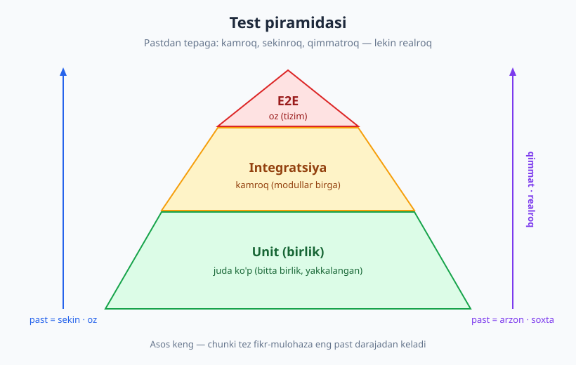
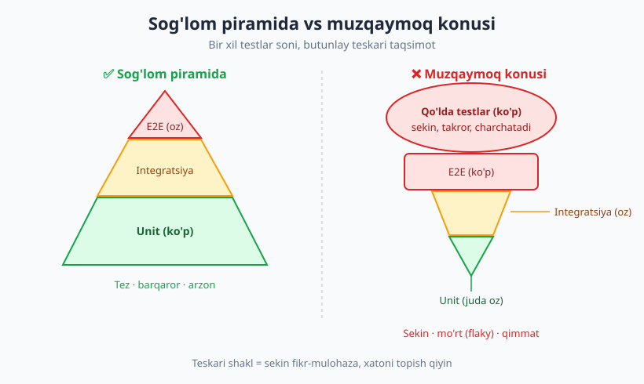
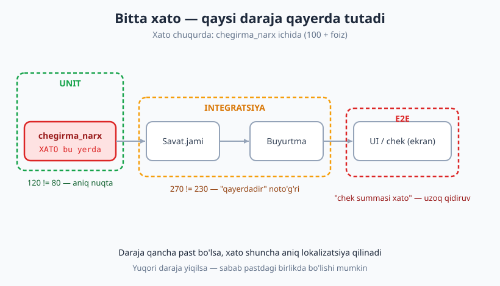

# 03 — Test turlari va test piramidasi

[🏠 README](./README.md) · [⬅️ Oldingi: 02 — Birinchi testingiz: AAA va test anatomiyasi](./02-birinchi-test-aaa.md) · [Keyingi: 04 — Yaxshi test xossalari: FIRST va izolyatsiya ➡️](./04-yaxshi-test-xossalari.md)

---

> **Bu bobda:** Testlarni **darajalarga** ajratamiz — unit (birlik), integratsiya va end-to-end (E2E). Har darajaning kuchli va zaif tomonlarini (tezlik, ishonch, barqarorlik, narx, xatoni topish qulayligi) ochiq solishtiramiz, **test piramidasi**ning nega aynan o'sha shaklda ekanini tushunamiz, eng keng tarqalgan anti-pattern — **muzqaymoq konusi** (ice-cream cone) bilan tanishamiz va piramidaga muqobil — **test "trophy"** modelini ko'rib chiqamiz.
>
> **Halollik / Eslatma:** "Unit" so'zining o'zi bir ma'noli emas — bu bobda buni ataylab ochib beramiz. Test piramidasi — **qonun emas, evristika**: kontekstga qarab shakl o'zgaradi. Bu tasnif **til-mustaqil**: Python, JavaScript, PHP, Java, Go — hammasida bir xil ishlaydi. Barcha Python namunalari haqiqatan `pytest` bilan ishga tushirib, chiqishi tekshirilgan (Python 3.14, pytest 9.0.3).

---

## Avtomobil zavodidan analogiya

Yangi avtomobil yo'lga chiqishidan oldin uch xil tekshiruvdan o'tadi. **Birinchidan**, har bir alohida qism — porshen, tormoz kolodkasi, lampochka — zavodda yakka holda sinaladi. Bu arzon, tez va xato topilsa, aynan qaysi qismda ekani darrov ma'lum. **Ikkinchidan**, qismlar yig'ilgach, dvigatel + uzatma + tormoz tizimi **birga** ishlashi tekshiriladi: ular bir-biriga to'g'ri ulanganmi? **Uchinchidan**, tayyor mashina poligonga chiqarilib, **haydovchi o'tirib** to'liq aylanib chiqadi — bu eng realistik, lekin eng qimmat va sekin sinov.

Dasturiy ta'minotni testlash ham xuddi shunday uch darajaga bo'linadi:

| Zavod | Dasturda |
|---|---|
| Bitta qismni sinash | **Unit** (birlik) test |
| Qismlarning ulanishini sinash | **Integratsiya** testi |
| Tayyor mashinani haydash | **End-to-end (E2E)** test |

Bu uch daraja bir-birini **almashtirmaydi** — to'ldiradi. Faqat E2E ga tayanib bo'lmaydi (har sinov uchun butun mashinani yig'ish kerak), faqat unit ham yetmaydi (qismlar alohida ishlasa-da, ulanmasligi mumkin).

## Uchta test darajasi

### Unit (birlik) test

**Unit test** — bu dasturning eng kichik **mustaqil bo'lagini** (odatda bitta funksiya yoki metod) tashqi dunyodan ajratib, yakka holda sinaydigan test. Bunda baza, tarmoq, fayl, vaqt — hech qaysisi qatnashmaydi. Shuning uchun u **millisekundlarda** ishlaydi va yiqilsa, xato aynan o'sha bo'lakdadigini deyarli aniq ko'rsatadi.

Mana sof unit testlash uchun ideal modul — chegirmali narxni hisoblaydigan funksiya. Unda **hech qanday** tashqi bog'liqlik yo'q: kirsa son, chiqsa son.

```python
# narx.py — sof, tashqi bog'liqliksiz hisob-kitob (unit testlash uchun ideal).

def chegirma_narx(narx, foiz):
    """narx ga foiz chegirma qo'llab, yakuniy narxni qaytaradi."""
    if narx < 0:
        raise ValueError("narx manfiy bo'lmasligi kerak")
    if not (0 <= foiz <= 100):
        raise ValueError("foiz 0..100 oraligida bo'lsin")
    return round(narx * (100 - foiz) / 100, 2)
```

Uning unit testi (AAA — Arrange-Act-Assert tuzilishida, 02-bobdan):

```python
# test_narx.py — UNIT test: faqat bitta funksiyani, yakkalangan holda sinaymiz.
import pytest
from narx import chegirma_narx


def test_yigirma_foiz_chegirma():
    # Arrange + Act + Assert
    assert chegirma_narx(100, 20) == 80.0


def test_chegirmasiz_narx_ozgarmaydi():
    assert chegirma_narx(50, 0) == 50.0


def test_manfiy_narx_xatolik():
    with pytest.raises(ValueError):
        chegirma_narx(-10, 5)
```

Ishga tushiramiz:

```text
$ python -m pytest test_narx.py -v
test_narx.py::test_yigirma_foiz_chegirma PASSED                          [ 33%]
test_narx.py::test_chegirmasiz_narx_ozgarmaydi PASSED                    [ 66%]
test_narx.py::test_manfiy_narx_xatolik PASSED                            [100%]

============================== 3 passed in 0.52s ==============================
```

Uchala test ham o'tdi. Diqqat qiling: bu test hech narsa o'rnatishni talab qilmaydi — baza yo'q, server yo'q. Aynan shu sababdan unit testlarni **mingtalab** yozish va har bir o'zgarishdan keyin **bir necha soniyada** ishga tushirish mumkin.

> **"Unit" nima o'zi?** Bu eng ko'p bahsli savol. Kimdir "bitta **funksiya**" deydi, kimdir "bitta **klass**", kimdir "bitta **modul**". Aniq ta'rif yo'q — **unit** = "siz mustaqil deb hisoblagan eng kichik, mantiqan butun bo'lak". Muhimi son emas, **izolyatsiya**: test boshqa hech narsaga bog'liq bo'lmasdan ishlasin.

#### Solitary (yakkalangan) vs sociable (ijtimoiy) unit

"Birlikni ajratish" ikki xil talqin qilinadi va bu farqni bilish muhim:

- **Solitary (yakkalangan) unit test** — sinaladigan birlikning **barcha** qo'shnilarini soxta dublyor (mock/stub — 07-bobda) bilan almashtiradi. Faqat o'sha birlikning o'zi haqiqiy ishlaydi.
- **Sociable (ijtimoiy) unit test** — birlikni o'zining **haqiqiy** (lekin ham tez, ham tashqi dunyosiz) qo'shnilari bilan birga ishga tushiradi. Tashqi dunyo (baza, tarmoq) baribir chetlatiladi, ammo ichki sof bog'liqliklar haqiqiy qoladi.

Yuqoridagi `test_narx.py` — **solitary**, chunki funksiyaning bog'liqligi yo'q. Quyida ko'radigan `test_savat.py` esa `Savat` ni `narx` moduli bilan **birga** sinaydi — bu ko'pchilik uchun "sociable unit", ba'zilar uchun esa allaqachon "integratsiya". Chegara xiralashgan — bu normal.

> **Trade-off:** Solitary testlar xatoni **aniqroq** lokalizatsiya qiladi, lekin mock'lar real xulqdan uzoqlashishi mumkin (qo'shni o'zgarsa, mock eskirib qoladi). Sociable testlar **realroq**, lekin yiqilganda sabab qaysi bo'lakda ekani noaniqroq. Ikkalasi ham to'g'ri — qaysi biri "to'g'ri" emas, **qachon qaysi biri** muhim (07/08-boblarda chuqurlashamiz).

### Integratsiya testi

**Integratsiya testi** — bu ikki yoki undan ko'p bo'lakning **birgalikda** to'g'ri ishlashini tekshiradi. Bu yerda diqqat alohida mantiq emas, balki **ulanish nuqtasi**: modullar bir-biriga to'g'ri ma'lumot uzatadimi, baza so'rovi haqiqatan kutilgan qatorni qaytaradimi, HTTP javobi to'g'ri o'qiladimi.

Bizning `Savat` klassi `narx` modulidan **foydalanadi** — demak ularning birga ishlashi alohida tekshirilishi kerak:

```python
# savat.py — narx modulidan FOYDALANADI (ikki modul birga ishlaydi).
from narx import chegirma_narx


class Savat:
    def __init__(self):
        self.qatorlar = []  # (narx, miqdor, foiz)

    def qosh(self, narx, miqdor, foiz=0):
        self.qatorlar.append((narx, miqdor, foiz))

    def jami(self):
        natija = 0
        for narx, miqdor, foiz in self.qatorlar:
            natija += chegirma_narx(narx, foiz) * miqdor
        return round(natija, 2)
```

```python
# test_savat.py — INTEGRATSIYA testi: Savat + narx moduli BIRGA ishlaydi.
from savat import Savat


def test_savat_chegirma_bilan_jami():
    # Arrange
    savat = Savat()
    savat.qosh(narx=100, miqdor=2, foiz=10)   # 90 * 2 = 180
    savat.qosh(narx=50, miqdor=1, foiz=0)     # 50 * 1 = 50
    # Act
    jami = savat.jami()
    # Assert
    assert jami == 230.0
```

```text
$ python -m pytest test_savat.py -q
.                                                                        [100%]
1 passed in 0.52s
```

Bu test `chegirma_narx` ni **soxtalashtirmaydi** — uni haqiqiy ishlatadi. Shuning uchun u `Savat` ning siklini *ham*, `chegirma_narx` chaqiruvini *ham*, ikkalasining ulanishini *ham* bir vaqtda sinaydi. Bu — integratsiyaning mohiyati.

> **Eslatma:** "Integratsiya" so'zi keng. Ba'zan u faqat ikki ichki modulning ulanishini (yuqoridagidek), ba'zan esa kodingiz **haqiqiy baza** yoki **haqiqiy tashqi servis** bilan ishlashini bildiradi. Ikkinchisi sekinroq va o'rnatish talab qiladi — bu kitobda baza testlash (16-bob) va API testlash (17-bob) alohida ko'riladi.

### End-to-end (E2E) test

**End-to-end test** (boshidan-oxiriga, ba'zan **tizim testi** deyiladi) — butun ilovani **foydalanuvchi qanday ishlatsa, xuddi shunday** tekshiradi. Internet-do'kon misolida: brauzer ochiladi, mahsulot savatga qo'shiladi, "Buyurtma berish" bosiladi, to'lov sahifasi ko'rinadi va chek summasi tekshiriladi. Hech narsa soxtalashtirilmaydi — haqiqiy baza, haqiqiy server, haqiqiy UI.

E2E eng **realistik** ishonch beradi ("foydalanuvchi haqiqatan xarid qila oladi"), lekin eng **sekin** (sekundlar yoki daqiqalar), eng **mo'rt** (tarmoq sekinligi, animatsiya, tasodifiy kechikish testni "goh o'tadi, goh yiqiladi" qiladi — buni **flaky** deymiz, 24-bob) va eng **qimmat** (brauzer avtomatizatsiyasi, butun muhitni ko'tarish). E2E uchun Python'da odatda alohida vositalar (Playwright, Selenium — 19-bobda) ishlatiladi, shuning uchun bu yerda sodda kod o'rniga **g'oyani** ta'kidlaymiz.

> **Diqqat:** E2E test yiqilsa, u sizga **"nimadir buzildi"** deydi, lekin **qayerda** ekanini deyarli aytmaydi — chunki o'nlab bo'lak zanjirdan o'tadi. Aynan shu sabab E2E testlar oz bo'lishi kerak (pastdagi anti-patternga qarang).

## Uch darajani solishtirish

Endi har darajaning xossalarini bitta jadvalda yonma-yon ko'rib chiqamiz. Bu jadval — bu bobning yuragi.

| O'lcham | Unit (birlik) | Integratsiya | E2E (tizim) |
|---|---|---|---|
| **Qamrov** | Bitta bo'lak | Bir nechta bo'lak ulanishi | Butun tizim |
| **Tezlik** | Juda tez (ms) | O'rta | Sekin (s/daqiqa) |
| **Ishonch (realistiklik)** | Past — soxta sharoit | O'rta | Yuqori — haqiqiy oqim |
| **Barqarorlik** | Yuqori (kam flaky) | O'rta | Past (ko'p flaky) |
| **Narx (yozish + ishlatish)** | Arzon | O'rta | Qimmat |
| **Xatoni lokalizatsiya** | Aniq (qaysi funksiya) | O'rta (qaysi ulanish) | Noaniq ("qayerdadir") |
| **Soni (sog'lom loyihada)** | Juda ko'p | Kamroq | Oz |

Asosiy naqsh ko'rinib turibdi: pastdan tepaga qarab **realistiklik o'sadi**, lekin **tezlik, barqarorlik va lokalizatsiya yomonlashadi**. Mana shu muvozanat keyingi bo'limdagi piramidani belgilaydi.

## Test piramidasi

**Mike Cohn** taklif qilgan **test piramidasi** — bu testlarni darajalar bo'yicha taqsimlashning vizual qoidasi: pastda **ko'p** unit test, o'rtada **kamroq** integratsiya, tepada **oz** E2E.



**Nega aynan shunday shakl?** Yuqoridagi jadvaldan to'g'ridan-to'g'ri kelib chiqadi:

1. **Tezlik.** Unit testlar millisekundlarda ishlaydi — minglabini har bir saqlashda ishga tushirsangiz ham bir necha soniya. E2E esa daqiqalar oladi — minglabini ishga tushirib bo'lmaydi. Tez fikr-mulohaza (feedback) eng past darajadan keladi.
2. **Narx va barqarorlik.** Yuqoriga chiqqan sari testlar qimmatlashadi va mo'rtlashadi. Agar 1000 ta E2E test bo'lsa, ularning ba'zilari har gal sababsiz yiqiladi — jamoa testlarga **ishonmay** qo'yadi.
3. **Lokalizatsiya.** Xato bo'lganda, ko'p unit test uni aniq ko'rsatadi; oz E2E faqat "tizim buzuq" deydi.

> **Eslatma:** Sonlar nisbiy — "70% unit, 20% integratsiya, 10% E2E" kabi raqamlar **qoida emas**, faqat his-tuyg'u. Muhimi **shakl**: asos keng, tepa tor. Aniq nisbat loyihaning xususiyatiga bog'liq.

## Anti-pattern: muzqaymoq konusi

Agar piramidani **ag'darib qo'ysangiz** — tepada ko'p qo'lda va E2E test, pastda esa ozgina unit — bu **muzqaymoq konusi** (ice-cream cone) anti-patterni bo'ladi. U ko'pincha "avval kod, keyin test" madaniyatida o'z-o'zidan paydo bo'ladi: kod yozilgan, endi uni "tashqaridan", butun ilova orqali tekshirishadi.



Nega bu yomon? Tepada to'plangan E2E va qo'lda testlar **sekin** (har release uzoq kutiladi), **mo'rt** (doim flaky) va **qimmat** (qo'lda test charchatadi, avtomat E2E saqlash og'ir). Natijada jamoa testlarga ishonchini yo'qotadi va ularni o'tkazib yubora boshlaydi.

Yana bir nosog'lom shakl — **soat shishasi (hourglass)**: ko'p unit (past) va ko'p E2E (tepa), lekin **o'rtada deyarli integratsiya yo'q**. Bunda alohida bo'laklar ishlaydi, butun tizim ham qandaydir tekshiriladi, ammo **modullar ulanishidagi** xatolar (eng ko'p uchraydigani!) yetarli sinalmay qoladi.

> **Trade-off:** Ba'zan E2E ni ko'paytirish vasvasasi kuchli — chunki bitta E2E test "ko'p narsani qoplagandek" tuyuladi. Lekin u qoplaganini **sekin va ishonchsiz** qoplaydi. Bir muammoni o'nlab tez unit test bilan qoplash deyarli har doim afzal.

## Muqobil model: test "trophy"

Piramida — yagona haqiqat emas. **Kent C. Dodds** ommalashtirgan **test trophy** (test kubogi) modeli markazga **integratsiya** testlarini qo'yadi: ozroq statik tahlil (linter/tiplar) → ozroq unit → **ko'p integratsiya** → oz E2E. G'oya: zamonaviy ilovalarda (ayniqsa frontend, ko'p kichik modulli kod) xatolar ko'pincha **bo'laklar orasidagi ulanishda** yuzaga keladi, shuning uchun integratsiya darajasi eng yaxshi "ishonch / xarajat" nisbatini beradi.

Bu Cohn piramidasiga **zid emas** — boshqa kontekst uchun moslashtirilgan urg'u. Ikkalasi ham bitta haqiqatga ishora qiladi: tez, arzon, ko'p test pastda; sekin, qimmat, oz test tepada.

> **Halollik:** Piramida ham, trophy ham — **qoida emas, evristika** (foydali yo'l-yo'riq, lekin majburiy emas). Sizning kontekstingiz hal qiladi: ko'p sof biznes-mantiqli backend → unit og'irroq; ko'p tashqi integratsiyali, yupqa mantiqli servis → integratsiya og'irroq. **Birovning nisbatini ko'r-ko'rona ko'chirmang.** Maqsad — son emas, **eng arzon narxga eng ko'p ishonch**.

## Bitta xato — qaysi daraja qayerda tutadi

Endi eng amaliy savol: bu darajalar **amalda** qanday farq qiladi? Buni jonli ko'rsatamiz. `chegirma_narx` ichiga xato kiritamiz — `(100 - foiz)` o'rniga `(100 + foiz)` (chegirma o'rniga ustama qo'shilib qoladi) — va qaysi daraja qanday reaksiya berishini ko'ramiz.

**Unit test** xatoni **to'g'ridan-to'g'ri** funksiyada ko'rsatadi:

```text
>       assert chegirma_narx(100, 20) == 80.0
E       assert 120.0 == 80.0
E        +  where 120.0 = chegirma_narx(100, 20)

test_narx.py:8: AssertionError
```

Xabar aniq: `chegirma_narx(100, 20)` 80 emas, 120 qaytardi. Tuzatish kerak bo'lgan joy — **shu funksiya**.

**Integratsiya testi** ham yiqiladi, lekin sabab **uzoqroq**:

```text
>       assert jami == 230.0
E       assert 270.0 == 230.0

test_savat.py:13: AssertionError
```

U faqat "savat jami 230 emas, 270" deydi. Xato `chegirma_narx` da ekanini bilish uchun siz `Savat.jami` ichiga kirib, qadamlab izlashingiz kerak. **E2E** bo'lganda esa bu yanada yomon — "chek summasi noto'g'ri" deyiladi, xolos.



Mana shu — pastki darajalar nega qadrli ekanining isboti: ular xatoni **aniq joyda** tutadi. Yuqori daraja yiqilsa, sabab odatda pastdagi birlikda bo'ladi — agar o'sha birlik uchun unit test bo'lganda, xato birinchi o'sha yerda ko'rinardi.

> **Eslatma:** Bu "E2E keraksiz" degani emas. Aksincha — faqat unit testlar barchasi o'tib turib, ilova baribir ishlamasligi mumkin (modullar to'g'ri ulanmagan, konfiguratsiya xato). Har daraja **boshqa turdagi** xatoni tutadi. Shuning uchun ham piramida — bitta daraja emas, **balansli** to'plam.

## Boshqa foydali o'lchamlar

Test darajasi — yagona tasnif emas. Amalda yana bir nechta o'lcham bo'yicha testlar ajratiladi:

- **Tez vs sekin.** Ba'zan darajadan ko'ra **tezlik** muhimroq: tez testlar har saqlashda, sekinlari faqat CI'da (27-bob) ishlaydi.
- **Solitary vs sociable.** Yuqorida ko'rdik — birlikni yakka yoki qo'shnilari bilan sinash.
- **White-box vs black-box.** **White-box** (oq quti) — testni yozayotganda kodning **ichki** tuzilishini bilasiz va undan foydalanasiz. **Black-box** (qora quti) — faqat **tashqi** xulqni tekshirasiz, ichini bilmaysiz. Unit testlar ko'pincha white-box, E2E esa black-box bo'ladi.
- **Funksional vs nofunksional.** Hozirgacha hammasi **funksional** edi — "to'g'ri natija chiqdimi?". **Nofunksional** testlar esa boshqa sifatlarni o'lchaydi: **tezmi?** (performance — 25-bob), **xavfsizmi?** (security — 26-bob). Ular alohida fikrlash talab qiladi.

Bu o'lchamlar bir-birini kesib o'tadi: bitta test ham "unit", ham "white-box", ham "tez", ham "funksional" bo'lishi mumkin. Tasnif — yorliq emas, **fikrlash vositasi**.

## Til-mustaqillik

Bu butun tasnif **hech qaysi tilga bog'liq emas**. Unit / integratsiya / E2E, piramida, anti-patternlar — JavaScript'da (`Jest`/`Vitest`), PHP'da (`PHPUnit`/`Pest`), Java'da (`JUnit`), Go'da (`testing`) **aynan** shunday qo'llaniladi. O'zgaradigani — sintaksis va vosita nomi; o'zgarmaydigani — **g'oya**: bo'lakni yakka sinab eng ko'p, butun tizimni sinab eng oz test yoz. Pyramid shaklini barcha jamoa, til va platforma baham ko'radi.

---

## Asosiy g'oyalar (bobni qisqacha)

- **Uch daraja** — unit (bitta bo'lakni yakkalab), integratsiya (bo'laklar ulanishini), E2E (butun tizimni foydalanuvchidek). Ular bir-birini almashtirmaydi, to'ldiradi.
- **"Unit" ta'rifi sub'ektiv** — funksiya, klass yoki modul bo'lishi mumkin; muhimi son emas, **izolyatsiya**.
- **Solitary vs sociable** — birlikni mock'langan qo'shnilar bilan yoki haqiqiy ichki qo'shnilar bilan sinash; biri aniqroq lokalizatsiya, ikkinchisi realroq.
- **Pastdan tepaga** realistiklik o'sadi, lekin tezlik, barqarorlik va lokalizatsiya yomonlashadi — bu asosiy trade-off.
- **Test piramidasi** (Cohn) — ko'p unit (past), oz E2E (tepa). Sababi: tez fikr-mulohaza, arzonlik, aniq lokalizatsiya.
- **Muzqaymoq konusi** (teskari piramida) va **soat shishasi** — yomon shakllar: sekin, flaky, qimmat, ulanish xatolarini o'tkazib yuboradi.
- **Test trophy** (Dodds) — integratsiyani markazga qo'yadi; ba'zi kontekstda mosroq. Piramida — **qoida emas, evristika**.
- **Bir xato pastda aniq, tepada noaniq lokalizatsiya qilinadi** — shuning uchun pastki darajalar qadrli.

---

## Mashqlar

### Oson

**1-mashq.** Quyidagi uch testni daraja bo'yicha tasniflang (unit / integratsiya / E2E): (a) `kvadrat(5) == 25` ni tekshiruvchi test; (b) brauzerda login sahifasini ochib, parol kiritib, panelga o'tishni tekshiruvchi test; (c) `Hisobot` klassi `Baza` moduldan ma'lumot olib, jamini to'g'ri chiqarishini tekshiruvchi test.

**2-mashq.** Test piramidasida qaysi daraja eng pastda (eng ko'p), qaysi biri eng tepada (eng oz) bo'lishi kerak? Bir jumla bilan **nega** shunday ekanini ayting.

**3-mashq.** "Muzqaymoq konusi" anti-patterni nima va u nega zararli? Ikki sababini keltiring.

### O'rta

**4-mashq.** Bizning `narx.py` va `savat.py` modullarini oling. `narx.py` ga yangi funksiya qo'shing: `qoshilgan_qiymat_soligi(narx, stavka=12)` — narxga foizli QQS qo'shadi (`round(...)` bilan). Unga **unit** test yozing (3 holat: oddiy, nol stavka, manfiy narxda `ValueError`). Kodingizni `pytest` bilan ishga tushiring.

**5-mashq.** `Savat` klassiga `qatorlar_soni()` metodi qo'shing (savatdagi qatorlar sonini qaytaradi). Buning uchun unit testmi yoki integratsiya testi yozasiz? Tanlovingizni asoslang va testni yozing.

**6-mashq.** Bitta loyihada 5 ta unit, 40 ta integratsiya va 200 ta E2E test bor. Bu qaysi shaklga (piramida / muzqaymoq konusi / soat shishasi) mos keladi? Jamoaga qanday muammolar yuzaga kelishi mumkin va birinchi qadamda nimani o'zgartirishni tavsiya qilasiz?

### Qiyin

**7-mashq.** `savat.py` da ataylab xato kiriting: `jami()` ichida `chegirma_narx(narx, foiz) * miqdor` o'rniga `chegirma_narx(narx, foiz) + miqdor` deb yozing. (a) `test_narx.py` (unit) bu xatoni tutadimi? Nega? (b) `test_savat.py` (integratsiya) tutadimi? Bu qaysi daraja ushbu xatoni **lokalizatsiya qila olishini** ko'rsatadi? Javobingizni `pytest` chiqishi bilan tasdiqlang.

**8-mashq.** Sizdan "barcha testlarni E2E qilaylik, chunki ular eng realistik" deb iltimos qilishdi. Bu fikrga **uch** texnik e'tiroz keltiring (jadvaldagi o'lchamlardan foydalaning) va qachon E2E **haqiqatan** zarur bo'lishini ham ayting (halol bo'ling — E2E keraksiz emas).

<details markdown="1">
<summary>Yechimlar</summary>

### 1-mashq yechimi

(a) **Unit** — bitta sof funksiya, tashqi bog'liqliksiz. (b) **E2E** — brauzer orqali butun oqim, foydalanuvchidek. (c) **Integratsiya** — `Hisobot` va `Baza` ikki modulning birga ishlashini sinaydi.

### 2-mashq yechimi

Eng pastda (eng ko'p) — **unit**, eng tepada (eng oz) — **E2E**. Sababi: unit testlar tez, arzon va barqaror — minglabini har o'zgarishda ishga tushirish mumkin; E2E sekin, qimmat va mo'rt — ozini ham qiyin saqlash. Tez fikr-mulohaza past darajadan keladi.

### 3-mashq yechimi

**Muzqaymoq konusi** — piramidaning teskarisi: tepada ko'p qo'lda va E2E test, pastda ozgina unit. Zararli, chunki: (1) test to'plami **sekin** ishlaydi, fikr-mulohaza kechikadi; (2) E2E testlar **mo'rt** (flaky) — tez-tez sababsiz yiqiladi, jamoa ularga ishonmay qo'yadi (qo'shimcha: qo'lda test qimmat va charchatadi).

### 4-mashq yechimi

```python
# narx.py ga qo'shamiz:
def qoshilgan_qiymat_soligi(narx, stavka=12):
    if narx < 0:
        raise ValueError("narx manfiy bo'lmasligi kerak")
    return round(narx * (100 + stavka) / 100, 2)
```

```python
# test_narx.py ga qo'shamiz:
def test_qqs_oddiy():
    assert qoshilgan_qiymat_soligi(100, 12) == 112.0

def test_qqs_nol_stavka():
    assert qoshilgan_qiymat_soligi(100, 0) == 100.0

def test_qqs_manfiy_narx():
    with pytest.raises(ValueError):
        qoshilgan_qiymat_soligi(-5)
```

`python -m pytest test_narx.py` ishga tushirilganda uchala yangi test ham `PASSED` bo'ladi. Bu — sof **unit** test: tashqi bog'liqlik yo'q.

### 5-mashq yechimi

**Unit** test yetarli — `qatorlar_soni()` boshqa modulga bog'liq emas, faqat ichki ro'yxat uzunligini qaytaradi:

```python
# savat.py ga:
def qatorlar_soni(self):
    return len(self.qatorlar)
```

```python
# test_savat.py ga:
def test_qatorlar_soni():
    savat = Savat()
    savat.qosh(100, 1)
    savat.qosh(50, 2)
    assert savat.qatorlar_soni() == 2
```

`narx` moduli bu metodda qatnashmagani uchun integratsiya keraksiz — eng arzon (unit) darajani tanlaymiz.

### 6-mashq yechimi

Bu **muzqaymoq konusi** (5 unit < 40 integratsiya < 200 E2E — piramida teskari ag'darilgan). Muammolar: test to'plami juda sekin (har release uzoq kutiladi), E2E'lar flaky bo'lib jamoa ishonchi tushadi, xato yuzaga kelganda lokalizatsiya qiyin. Birinchi qadam: eng tez-tez yiqiladigan va biznes-mantiqqa boy oqimlarni topib, ularning mantig'ini **unit** testlar bilan pastdan qoplash; bir nechta muhim E2E ni qoldirib, qolganini quyi darajaga "tushirish".

### 7-mashq yechimi

(a) **Yo'q** — `test_narx.py` faqat `chegirma_narx` ni sinaydi, `Savat.jami` ga umuman tegmaydi. Xato `jami()` ichida bo'lgani uchun unit test buni **ko'rmaydi** (har test faqat o'zi qamragan kodni tekshiradi). (b) **Ha** — `test_savat.py` yiqiladi, masalan:

```text
>       assert jami == 230.0
E       assert ... == 230.0
```

Bu **integratsiya** darajasi ushbu xatoni tutishini ko'rsatadi, chunki xato aynan modullar **ulanishida** (`Savat` `chegirma_narx` natijasini noto'g'ri ishlatmoqda). Saboq: xato qaysi darajada bo'lsa, o'sha daraja (yoki undan yuqorisi) uni tutadi; pastki daraja yuqori koddagi xatoni ko'rmaydi.

### 8-mashq yechimi

Uch e'tiroz (jadvaldan): (1) **Tezlik** — minglab E2E daqiqalab ishlaydi, fikr-mulohaza juda sekinlashadi, ishlab chiqish to'xtaydi. (2) **Barqarorlik** — E2E mo'rt (flaky), tez-tez sababsiz yiqiladi; ko'p bo'lsa, jamoa "yana flaky" deb haqiqiy xatoni ham e'tiborsiz qoldiradi. (3) **Lokalizatsiya** — E2E yiqilsa "tizim buzuq" deydi, xato qayerda ekanini topish soatlab vaqt oladi.

Halol tomon: E2E **haqiqatan** zarur — u boshqa daraja qo'lidan kelmaydigan narsani tutadi: modullar, konfiguratsiya, infratuzilma va UI **birga** real foydalanuvchi oqimida ishlashini tasdiqlaydi. Shuning uchun E2E ni **yo'q qilmaymiz**, faqat eng muhim oqimlar bilan **cheklaymiz** (piramida tepasi tor bo'lsin).

</details>

---

[🏠 README](./README.md) · [⬅️ Oldingi: 02 — Birinchi testingiz: AAA va test anatomiyasi](./02-birinchi-test-aaa.md) · [Keyingi: 04 — Yaxshi test xossalari: FIRST va izolyatsiya ➡️](./04-yaxshi-test-xossalari.md)
