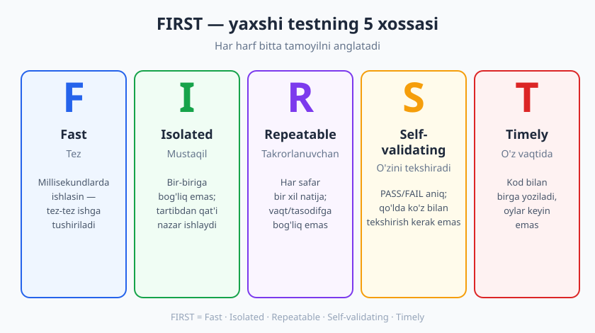
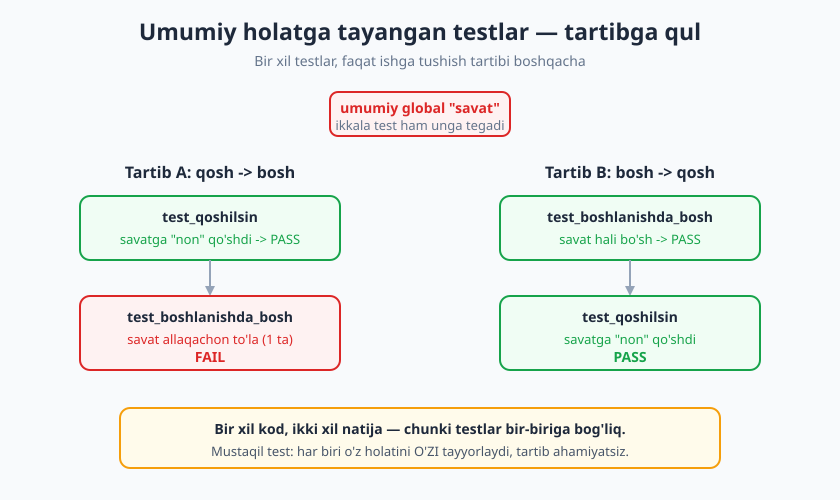
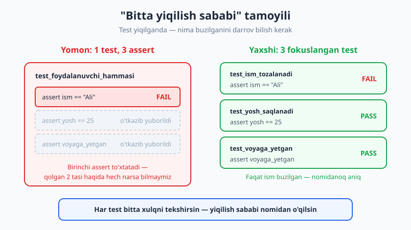

# 04 — Yaxshi test xossalari: FIRST va izolyatsiya

[🏠 README](./README.md) · [⬅️ Oldingi: 03 — Test turlari va test piramidasi](./03-test-turlari-piramida.md) · [Keyingi: 05 — Assertion'lar va test holatlarini tanlash ➡️](./05-assertionlar-test-holatlari.md)

---

> **Bu bobda:** Test yozish oson — *yaxshi* test yozish san'at. Bu bobda **FIRST** tamoyillarini (Fast, Isolated, Repeatable, Self-validating, Timely) misol **va** anti-misol bilan o'rganamiz. Nega test har safar bir xil natija berishi shartligini (determinizm), umumiy holat (shared state) qanday qilib testlarni bir-biriga bog'lab qo'yishini, "bitta yiqilish sababi" qoidasini va eng tez-tez uchraydigan **test smell**'larini ko'ramiz.
>
> **Halollik / Eslatma:** Bu bob — yaxshi testning *xossalarini* tasvirlaydi; ularni qanday **amalga oshirish** (fixture, mock, vaqtni boshqarish) keyingi boblarda chuqurroq ([06-bob](./06-fixture-parametrize.md), [07-bob](./07-test-dublyorlari-nazariya.md), [09-bob](./09-bogliqliklarni-izolyatsiya.md)). "100% determinizm" har doim oson emas (vaqt, konkurensiya, tashqi tarmoq) — buni ham keyin hal qilamiz; hozir maqsad — *qanday bo'lishi kerakligini* ko'rish. Barcha Python namunalari haqiqatan ishga tushirib, chiqishi tekshirilgan (Python 3.14, pytest 9.0.3).

---

## Yaxshi test — yaxshi asbob kabi

Tasavvur qiling, sizda ikkita tutqun (datchik) bor. Birinchisi xonada harorat 21 daraja bo'lsa ham, gohida 21, gohida 19, gohida "xato" deb ko'rsatadi. Ikkinchisi har safar aniq 21 deydi. Qaysi biriga ishonasiz? Albatta ikkinchisiga — chunki uning ko'rsatkichi **bir ma'noli** va **takrorlanuvchan**.

Testlar ham xuddi shunday asbob: ular kodingiz sog'lom-yo'qligini o'lchaydi. Agar test goh o'tib, goh yiqilsa yoki uning natijasi qaysi tartibda ishlatilganiga bog'liq bo'lsa — bu sinmagan asbob. Unga ishonib bo'lmaydi, jamoa esa tez orada uni e'tiborsiz qoldira boshlaydi ("yana o'sha qizil test, e'tibor berma").

Demak savol shu: **qanday testni yaxshi deb ataymiz?** Eng mashhur, eslab qolish oson javob — **FIRST** akronimi (uni Robert Martin ommalashtirgan).



---

## FIRST tamoyillari

FIRST — beshta xossaning bosh harflari: **F**ast, **I**solated, **R**epeatable, **S**elf-validating, **T**imely. Har birini ko'rib chiqamiz — har doim misol **va** anti-misol bilan.

### F — Fast (tez)

Test millisekundlarda ishlashi kerak. Nega? Chunki testlardan asosiy foyda — **tez fikr-mulohaza** (feedback). Kodni o'zgartirib, bir necha soniyada "buzdimmi?" degan javobni olsangiz — testlarni tez-tez ishga tushirasiz. Agar test to'plami 10 daqiqa ishlasa, uni kuniga ikki marta ishga tushirasiz, xolos — va xatolarni kech topasiz.

Sekinlikning eng keng tarqalgan sababi — haqiqiy kutish (tarmoq, disk, `sleep`):

```python
import time

def hisobla(a, b):
    return a + b

# SEKIN: haqiqiy kutish (real tarmoq/uyqu taqlidi)
def test_sekin():
    time.sleep(0.5)
    assert hisobla(2, 3) == 5

# TEZ: faqat sof mantiqni tekshiradi
def test_tez():
    assert hisobla(2, 3) == 5
```

`pytest --durations=5` har testning vaqtini ko'rsatadi:

```text
============================= slowest 5 durations =============================
0.50s call     tezlik.py::test_sekin
(3 durations < 0.005s hidden.  Use -vv to show these durations.)
============================== 2 passed in 1.02s ==============================
```

`test_sekin` 0.50s, `test_tez` esa shunchalik tezki, `pytest` uni "yashirin" deb belgilaydi (< 0.005s). Bitta `sleep` zarar qilmaydi — lekin minglab shunday test soatlab ishlaydi.

> **Eslatma:** "Tez" nisbiy. Unit test mikrosoniyalarda, integratsiya testi sekundlarda bo'lishi mumkin ([03-bob](./03-test-turlari-piramida.md)dagi piramida). Maqsad — *keraksiz* sekinlikni yo'qotish: real `sleep`, real tarmoq, real DB unit testda kerak emas — ularni izolyatsiya qilamiz ([09-bob](./09-bogliqliklarni-izolyatsiya.md)).

### I — Isolated / Independent (mustaqil)

Har bir test **boshqa testlardan mustaqil** ishlashi kerak: bitta test ikkinchisi avval ishlaganiga tayanmasin, va ularni **istalgan tartibda** ishga tushirganda natija o'zgarmasin. Bu — bobning eng muhim g'oyasi, shuning uchun uni quyida alohida bo'limda chuqur ochamiz.

### R — Repeatable (takrorlanuvchan)

Test har safar, har joyda (sizning noutbukingizda, hamkasbingizda, CI serverda) **bir xil natija** berishi shart. Agar test goh o'tib goh yiqilsa — bu **flaky** (beqaror) test. Eng keng tarqalgan sabab — boshqariladi deb hisoblanmagan tasodifiy manba. Mana, `random` ishlatadigan test:

```python
import random

def tanga_tashla():
    return "boshi" if random.random() < 0.5 else "yozuvi"

# YOMON: tasodifga tayanadi -> goh o'tadi, goh yiqiladi
def test_tanga_boshi():
    assert tanga_tashla() == "boshi"
```

Buni ketma-ket olti marta ishga tushirdik:

```text
1 passed   1 failed   1 failed   1 passed   1 failed   1 passed
```

Bir xil kod — uchtasi o'tdi, uchtasi yiqildi. Bunday testga ishonib bo'lmaydi: u sizga kod haqida emas, tanga haqida xabar bermoqda. Determinizm haqida quyida batafsil.

### S — Self-validating (o'zini tekshiradi)

Test **o'zi** o'tgan yoki yiqilganini aytishi kerak — PASS yoki FAIL, hech qanday qo'lda ko'z bilan tekshirishsiz. Anti-misol — natijani `print` qilib, "o'zingiz qarang to'g'rimi" deydigan "test":

```python
# YOMON: o'zini tekshirmaydi — odam ko'z bilan tekshirishi kerak
def test_yomon():
    natija = 2 + 2
    print(natija)   # 4 chiqadi... lekin to'g'rimi? Kim qaror qiladi?

# YAXSHI: assert -> mashina qaror qiladi, PASS/FAIL aniq
def test_yaxshi():
    assert 2 + 2 == 4
```

`test_yomon` har doim "o'tadi" (chunki yiqiladigan `assert` yo'q) — u aslida hech narsani tekshirmaydi. Faqat `assert` (yoki ekvivalenti) testni *o'zini tekshiradigan* qiladi. Shuning uchun bir test ichidagi `print` — deyarli har doim smell.

### T — Timely (o'z vaqtida)

Test **o'z vaqtida** — ideal holatda kod bilan birga (yoki TDD'da koddan oldin, [11-bob](./11-tdd-red-green-refactor.md)) yoziladi. "Keyin yozaman" degan testlar odatda hech qachon yozilmaydi yoki shoshilinch, sayoz bo'ladi. Kod yozilganidan oylar keyin yozilgan test ko'pincha shunchaki mavjud xulqni "muhrlaydi" — hatto u xulq xato bo'lsa ham (bu xavf [29-bob](./29-legacy-kodni-testlash.md)da, legacy kod kontekstida).

> **Trade-off:** FIRST — qattiq qonun emas, balki ideal. Ba'zan integratsiya testi sekinroq bo'ladi (Fast'ga to'liq mos kelmaydi) yoki vaqtni 100% boshqarib bo'lmaydi (Repeatable qiyin). Maqsad — har og'ishni *bilib*, *atayin* qilish, tasodifan emas.

---

## Determinizm: nega bir xil natija shart

**Deterministik** test — kirishi o'zgarmasa, chiqishi ham o'zgarmaydigan test. Bu Repeatable tamoyilning yuragida yotadi. Nodeterministik (beqaror) testning to'rtta klassik manbasi bor:

| Manba | Misol | Nega muammo |
|---|---|---|
| **Vaqt** | `datetime.now()`, `time.time()` | Natija qaysi soat/kun/yilga bog'liq bo'ladi |
| **Tasodif** | `random`, `uuid4()` | Har ishga tushishda boshqa qiymat |
| **Tartib** | umumiy holat, test ketma-ketligi | Boshqa test natijaga ta'sir qiladi |
| **Tashqi muhit** | tarmoq, vaqt zonasi, fayl tizimi | Sizdan tashqarida o'zgaradi |

Eng ayyor — **vaqt**. Quyidagi kod bexavotir ko'rinadi, lekin testi vaqt bombasi:

```python
from datetime import datetime

def salomlashish():
    soat = datetime.now().hour
    if soat < 12:
        return "Xayrli tong"
    return "Xayrli kun"

# YOMON: natija kunning vaqtiga bog'liq
def test_salomlashish_tong():
    assert salomlashish() == "Xayrli tong"
```

Bu testni soat 20:00 da ishga tushirdik:

```text
>       assert salomlashish() == "Xayrli tong"
E       AssertionError: assert 'Xayrli kun' == 'Xayrli tong'
E         - Xayrli tong
E         + Xayrli kun
============================== 1 failed in 0.68s ==============================
```

Test yiqildi — lekin kodda hech qanday xato yo'q! U ertalab o'tar edi, kechqurun yiqildi. Bunday testni sabab-natija bilan tushuntirib bo'lmaydi, jamoa esa unga ishonchni yo'qotadi.

**Yechim — vaqtni tashqaridan berish** (dependency injection, [09-bob](./09-bogliqliklarni-izolyatsiya.md) va [10-bob](./10-testlanadigan-dizayn.md)da chuqur). Funksiya vaqtni *o'zi olmasin* — bizdan *qabul qilsin*:

```python
def salomlashish(soat):
    if soat < 12:
        return "Xayrli tong"
    return "Xayrli kun"

# YAXSHI: vaqtni biz beramiz -> har safar bir xil natija
def test_salomlashish_tong():
    assert salomlashish(soat=9) == "Xayrli tong"

def test_salomlashish_kun():
    assert salomlashish(soat=15) == "Xayrli kun"
```

```text
determinizm.py::test_salomlashish_tong PASSED                            [ 50%]
determinizm.py::test_salomlashish_kun PASSED                             [100%]
============================== 2 passed in 0.57s ==============================
```

Endi test har soatda, har yili bir xil natija beradi. Bonus sifatida — biz endi *ikkala* shoxni ham (tong va kun) sinashimiz mumkin, avval esa faqat hozirgi vaqtga tushganini sinardik.

> **Eslatma:** Vaqtni "muzlatish"ning boshqa yo'li ham bor — `freezegun` kabi kutubxona (`pip install freezegun`) yoki mock (`unittest.mock`). Lekin eng toza yechim — funksiyani vaqtga bog'liq bo'lmaydigan qilib *dizayn qilish*. Bu [09-bob](./09-bogliqliklarni-izolyatsiya.md)ning markaziy mavzusi.

---

## Test mustaqilligi va umumiy holat tuzog'i

Endi FIRST'ning "I"siga — eng ko'p xato qilinadigan tamoyilga — qaytamiz. Muammoning ildizi ko'pincha **umumiy (shared/global) holat**: bir nechta test bir xil o'zgaruvchiga, ro'yxatga yoki bazaga tegadi va biri ikkinchisini "ifloslantiradi".

Mana klassik tuzoq — global ro'yxatga tayangan ikkita test:

```python
savat = []  # umumiy (global) holat

def qosh(mahsulot):
    savat.append(mahsulot)

def jami():
    return len(savat)

# YOMON: ikkala test bitta global "savat"ga tayanadi
def test_bitta_mahsulot_qoshilsin():
    qosh("non")
    assert jami() == 1

def test_savat_boshlanishda_bosh():
    assert jami() == 0
```

Tabiiy tartibda (yuqoridan pastga) ishga tushiramiz:

```text
________________________ test_savat_boshlanishda_bosh _________________________
>       assert jami() == 0
E       assert 1 == 0
E        +  where 1 = jami()
========================= 1 failed, 1 passed in 0.69s =========================
```

Ikkinchi test yiqildi — chunki birinchi test `savat`ga "non" qo'shib ketdi, u esa hech qachon tozalanmadi. Endi eng muhim qismi: testlarni **teskari tartibda** ishga tushiramiz:

```text
shared_yomon.py::test_savat_boshlanishda_bosh PASSED                     [ 50%]
shared_yomon.py::test_bitta_mahsulot_qoshilsin PASSED                    [100%]
============================== 2 passed in 0.52s ==============================
```

Endi **ikkalasi ham o'tdi!** Bir xil kod, bir xil testlar — faqat tartib boshqacha — natija butunlay boshqa. Bu dahshatli, chunki test natijasi endi kod haqida emas, *tartib* haqida xabar beradi.



> **Diqqat:** Aksariyat test runner'lar testlarni faylda yozilgan tartibda ishga tushiradi — shuning uchun bu xato uzoq vaqt "yashirin" qolishi mumkin. Keyin kimdir test qo'shadi, fayllarni qayta tartiblaydi yoki `pytest-randomly` (`pip install pytest-randomly`) o'rnatadi — va to'satdan "hech narsa o'zgartirmagan" testlar yiqila boshlaydi. Tartibga bog'liqlik — vaqt bombasi.

### Yechim: har test o'z holatini O'ZI tayyorlaydi

Tuzatish g'oyasi oddiy: **umumiy holat bo'lmasin**. Har test o'ziga toza, yangi obyekt yaratadi (bu — AAA'dagi *Arrange* qadami, [02-bob](./02-birinchi-test-aaa.md)):

```python
class Savat:
    def __init__(self):
        self._mahsulotlar = []

    def qosh(self, mahsulot):
        self._mahsulotlar.append(mahsulot)

    def jami(self):
        return len(self._mahsulotlar)

# YAXSHI: har test o'z holatini O'ZI tayyorlaydi (Arrange)
def test_bitta_mahsulot_qoshilsin():
    savat = Savat()          # toza holat
    savat.qosh("non")
    assert savat.jami() == 1

def test_savat_boshlanishda_bosh():
    savat = Savat()          # toza holat
    assert savat.jami() == 0
```

Endi har ikki tartibda ham — tabiiy va teskari — natija bir xil:

```text
shared_yaxshi.py::test_bitta_mahsulot_qoshilsin PASSED
shared_yaxshi.py::test_savat_boshlanishda_bosh PASSED
============================== 2 passed in 0.53s ==============================
```

Har test o'z dunyosini quradi va boshqalarga aralashmaydi. Bu — to'la izolyatsiya.

> **Eslatma:** Bu yerda toza holatni qo'lda yaratdik (`savat = Savat()`). Agar ko'p test bir xil tayyorgarlikni talab qilsa, takrorlanmaslik uchun `pytest` **fixture**'idan foydalanasiz — u har test uchun yangi nusxa beradi. Bu [06-bob](./06-fixture-parametrize.md)ning asosiy mavzusi. Umumiy holatning boshqa shakllari (DB, fayl, modul darajasidagi keş) ham xuddi shu kasallikka chalinadi — ularni [16-bob](./16-malumotlar-bazasi-testlash.md)da ko'ramiz.

---

## "Bitta yiqilish sababi"

Yaxshi test yiqilganda darrov **nima buzilganini** aytishi kerak. Agar bitta test juda ko'p narsani bir vaqtning o'zida tekshirsa — yiqilganda qaysi xulq buzilganini aniqlash uchun qazish kerak bo'ladi. Ideal: **har test bitta xulqni** (bir "yiqilish sababini") tekshirsin.

Mana ko'p narsani tekshiradigan test:

```python
def foydalanuvchi_yarat(ism, yosh):
    return {
        "ism": ism.strip().title(),
        "yosh": yosh,
        "voyaga_yetgan": yosh >= 18,
    }

# Bitta testda 3 assert
def test_foydalanuvchi_yarat_hammasi():
    f = foydalanuvchi_yarat("  ali  ", 25)
    assert f["ism"] == "Ali"
    assert f["yosh"] == 25
    assert f["voyaga_yetgan"] is True
```

Hozircha u o'tadi. Endi kodda kichik xato bo'lsin — `.title()` tushib qolsin (ism bosh harfga o'tmaydi). Test natijasi:

```text
>       assert f["ism"] == "Ali"
E       AssertionError: assert 'ali' == 'Ali'
E         - Ali
E         + ali
============================== 1 failed in 1.01s ==============================
```

E'tibor bering: `pytest` **birinchi** yiqilgan `assert`da to'xtaydi. Yosh va `voyaga_yetgan` to'g'rimi — bilmaymiz; ular tekshirilmasdan qoldi. Buni **assertion roulette** deyishadi: bir nechta assert orasidan qaysi biri o'q tekkanini ko'rasiz, qolganlari yashirin. Agar shu paytda *uchala* maydon ham buzilgan bo'lsa, siz faqat bittasini ko'rib, "faqat shu muammo" deb o'ylab tuzatasiz — keyin yana yiqiladi.

Yaxshi yondashuv — har xulqni alohida testga ajratish:

```python
def test_ism_tozalanadi_va_bosh_harf():
    assert foydalanuvchi_yarat("  ali  ", 25)["ism"] == "Ali"

def test_18_dan_katta_voyaga_yetgan():
    assert foydalanuvchi_yarat("ali", 25)["voyaga_yetgan"] is True

def test_18_dan_kichik_voyaga_yetmagan():
    assert foydalanuvchi_yarat("ali", 17)["voyaga_yetgan"] is False
```

Endi bir nechtasi birdan buzilsa, `pytest` **hammasini** alohida-alohida qizil qilib ko'rsatadi va har birining nomi muammoni aytib turadi: `test_ism_tozalanadi` yiqildi — demak ism mantig'ida xato. Diagnoz qidirib o'tirmaysiz.



> **Eslatma — "bitta assert" emas, "bitta xulq".** Qoida — har testda *aniq bitta `assert`* bo'lsin degani emas. Ba'zan bitta xulqni tasdiqlash uchun bir nechta `assert` kerak (masalan, obyektning ikki maydoni bitta "yaratish" amalining qismi). Asosiy mezon — test **bitta tushunchani** tekshirsin va **bitta sababga ko'ra** yiqilsin. Buni "concept per test" deb ham atashadi.

---

## Test = hujjat: o'qilishi va DAMP

Test yana bir muhim ish qiladi: u kodning **qanday ishlatilishini hujjatlaydi**. Yangi dasturchi loyihaga kelganda, ko'pincha testlarni o'qib, "bu funksiya nima qiladi?" degan savolga javob topadi. Shuning uchun test **o'qilishi** muhim — ba'zan ishchi koddan ham muhimroq.

Bu yerda ishlab chiqarish (production) kodi qoidasi — **DRY** (Don't Repeat Yourself, takrorlama) — testlarda har doim ham to'g'ri kelmaydi. Testlarda ko'pincha **DAMP** (Descriptive And Meaningful Phrases — tavsiflovchi, ma'noli iboralar) afzal: ozgina takror bo'lsa ham, har test o'zini *o'zicha* o'qib tushunarli bo'lsin.

```python
# ❌ "Juda DRY" — Arrange yashiringan, test nimani sinayotgani noaniq
def test_chegirma(buyurtma=None):
    buyurtma = buyurtma or _yordamchi_buyurtma_yasash()
    assert _murakkab_hisoblagich(buyurtma) == _kutilgan(buyurtma)

# ✅ DAMP — Arrange ko'rinib turibdi, test o'zini hujjatlaydi
def test_1000_so'mga_10_foiz_chegirma_900_qiladi():
    narx = 1000
    chegirma_foiz = 10
    yakuniy = narx - narx * chegirma_foiz // 100
    assert yakuniy == 900
```

Birinchi test "o'qish uchun" boshqa funksiyalarni ochishni talab qiladi; ikkinchisini — nomi va uchta qatori bilan — bir qarashda tushunasiz. Aniq **Arrange** (tayyorgarlik ko'rinib tursin), so'zlovchi **nom** — testni jonli hujjatga aylantiradi.

> **Trade-off:** DAMP cheksiz takror degani emas. Agar yuzlab test bir xil murakkab tayyorgarlikni takrorlasa, bu ham yomon (o'zgartirsangiz — yuz joyni tahrirlaysiz). Muvozanat: takrorlanuvchi *tayyorgarlik mexanikasini* fixture/builder'ga oling, lekin har testning *o'ziga xos qiymatlari va niyati* ko'rinib tursin. DRY vs DAMP nozikligi [13-bob](./13-refactoring-va-testlar.md)da.

---

## Test smell'lari — qisqacha ro'yxat

**Test smell** — testdagi shubhali naqsh; har doim ham xato emas, lekin "bu yerga qarab ko'r" degan signal. Eng tez-tez uchraydiganlari:

| Smell | Nima | Nega yomon |
|---|---|---|
| **Mantiqsiz / og'ir Arrange** | testdan oldin o'nlab qator tayyorgarlik | test nimani sinayotgani ko'rinmaydi; mo'rt bo'ladi |
| **Conditional test** | test ichida `if`/`for`/`while` | shox tekshirilmay qolishi mumkin; test "yashil" bo'lib turaversa ham hech narsa sinamaydi |
| **Magic raqamlar** | `assert x == 86400` (izohsiz) | `86400` nima? Kun ichidagi soniyalar — lekin o'quvchi taxmin qiladi |
| **Assertion roulette** | bitta testda izohsiz ko'p assert | yiqilganda qaysi biri buzilgani noaniq |
| **Bir-biriga bog'liq testlar** | umumiy holat, tartibga bog'liqlik | tartib o'zgarsa yiqiladi (yuqorida ko'rdik) |
| **`print` bilan "tekshirish"** | `assert` o'rniga `print` | o'zini tekshirmaydi (Self-validating buziladi) |

**Conditional test** ayniqsa xavfli — ko'rinishidan o'tadi, aslida bo'sh. Misol:

```python
def chegirma(narx, vip):
    if vip:
        return narx * 0.8
    return narx

# YOMON: test ichida if -> "vip emas" shoxida assert HECH QACHON ishlamaydi,
# lekin test baribir YASHIL bo'ladi (yolg'on xotirjamlik)
def test_chegirma_shartli():
    vip = False
    natija = chegirma(100, vip)
    if vip:
        assert natija == 80
```

Bu test "o'tadi" — lekin `vip` `False` bo'lgani uchun `assert`ga hech qachon yetib bormaydi. Ya'ni u **hech narsani** sinamaydi, faqat yashil chiroq beradi. Yechim — shartni olib tashlab, har holatni alohida, shartsiz testga ajratish:

```python
def test_vip_chegirma_oladi():
    assert chegirma(100, vip=True) == 80

def test_oddiy_chegirma_olmaydi():
    assert chegirma(100, vip=False) == 100
```

```text
shartli.py::test_vip_chegirma_oladi PASSED
shartli.py::test_oddiy_chegirma_olmaydi PASSED
============================== ... passed ==============================
```

> **Diqqat:** Test ichidagi `if`/`for` ko'rganingizda hushyor bo'ling. Ko'pincha u "bir testda ko'p holatni siqib joylash" istagidan tug'iladi — buning to'g'ri yo'li **parametrize** (bitta test, ko'p kirish to'plami), [06-bob](./06-fixture-parametrize.md). Magic raqamlar uchun esa — qiymatga so'zlovchi nom bering: `KUN_SONIYALARI = 86400`.

### Til-mustaqil eslatma

Bu tamoyillarning hammasi tilga bog'liq emas. JavaScript'da xuddi shu fikrlar `Jest`/`Vitest`da qo'llaniladi (`beforeEach` bilan toza holat, `jest.useFakeTimers()` bilan vaqt), PHP'da `PHPUnit`/`Pest`da (`setUp()`, `Carbon::setTestNow()`), Java'da `JUnit`da (`@BeforeEach`, `Clock` injeksiyasi). Atamalar — FIRST, smell, izolyatsiya, determinizm — barcha jamoalarda bir xil ishlatiladi.

---

## Asosiy g'oyalar (bobni qisqacha)

- **FIRST** — yaxshi testning beshta xossasi: **Fast** (tez), **Isolated** (mustaqil), **Repeatable** (takrorlanuvchan), **Self-validating** (o'zini tekshiradi), **Timely** (o'z vaqtida).
- **Determinizm shart.** Test kirishi o'zgarmasa, natijasi ham o'zgarmasligi kerak. Beqarorlikning manbalari: vaqt, tasodif, tartib, tashqi muhit.
- **Vaqt/tasodifni tashqaridan bering.** `datetime.now()`ni funksiya ichida emas, parametr orqali uzating — shunda test har soatda bir xil natija beradi.
- **Umumiy holat — izolyatsiyaning dushmani.** Global ro'yxat/o'zgaruvchiga tayangan testlar tartib o'zgarganda yiqiladi. Har test o'z holatini O'ZI tayyorlasin (Arrange).
- **Bitta yiqilish sababi.** Har test bitta xulqni tekshirsin; yiqilganda nomidanoq nima buzilgani ma'lum bo'lsin. Aks holda — assertion roulette.
- **Test = hujjat.** Testlarda DAMP (o'qilishi) ko'pincha DRY'dan afzal: aniq Arrange, so'zlovchi nom.
- **Smell'larni taniing:** og'ir Arrange, conditional test (test ichida `if`), magic raqam, assertion roulette, bir-biriga bog'liq testlar, `print` bilan "tekshirish".
- **Halol bo'ling:** 100% determinizm har doim oson emas (vaqt, konkurensiya) — buni keyingi boblar hal qiladi ([09-bob](./09-bogliqliklarni-izolyatsiya.md), [24-bob](./24-flaky-testlar.md)).

---

## Mashqlar

### Oson

**1-mashq.** FIRST akronimidagi beshta harfni va har birining ma'nosini (o'zbekcha) yozing. Qaysi tamoyil "test goh o'tadi, goh yiqiladi" muammosiga to'g'ridan-to'g'ri qarshi turadi?

**2-mashq.** Quyidagi test qaysi FIRST tamoyilini buzadi va nega?
```python
def test_yomon():
    natija = 5 * 5
    print(natija)
```

**3-mashq.** Quyidagi funksiya determinizmni buzadi. Sababini ayting va nodeterministik manbasini nomlang.
```python
import random
def parol_yarat():
    return "P" + str(random.randint(1000, 9999))
def test_parol():
    assert parol_yarat() == "P5000"
```

### O'rta

**4-mashq.** Quyidagi ikkita test umumiy holatga tayanadi va tartibga bog'liq. Muammoni tushuntiring va `class Hisoblagich` (ichida `qiymat` 0 dan boshlanadi, `oshir()` metodi bor) yordamida izolyatsiya qiling.
```python
 jami = 0
def oshir():
    global jami
    jami += 1
def test_bir_marta():
    oshir()
    assert jami == 1
def test_boshlanishda_nol():
    assert jami == 0
```

**5-mashq.** Quyidagi test "assertion roulette" smell'iga ega va ko'p xulqni tekshiradi. Uni uchta fokuslangan testga bo'ling.
```python
def vaqtni_format(soniya):
    return {"soat": soniya // 3600, "daqiqa": (soniya % 3600) // 60, "soniya": soniya % 60}
def test_format():
    n = vaqtni_format(3661)
    assert n["soat"] == 1
    assert n["daqiqa"] == 1
    assert n["soniya"] == 1
```

**6-mashq.** Quyidagi conditional test smell'iga ega — u har doim "o'tadi", lekin aslida hech narsani sinamaydi. Nega? Uni ikkita to'g'ri, shartsiz testga aylantiring.
```python
def juftmi(n):
    return n % 2 == 0
def test_juftmi():
    son = 7
    if son % 2 == 0:
        assert juftmi(son) is True
```

### Qiyin

**7-mashq.** `salomlashish` funksiyasi vaqtga bog'liq, shuning uchun testi flaky. Funksiyani **o'zgartirmasdan** (signaturasi `salomlashish()` bo'lib qolsin) uni deterministik qilib testlashning ikkita usulini ayting va birini Python kodida (mock yoki `freezegun` g'oyasi) eskizini chizing. Qaysi yondashuv [09-bobga](./09-bogliqliklarni-izolyatsiya.md) ko'ra "tozaroq" deb hisoblanadi?
```python
from datetime import datetime
def salomlashish():
    return "Xayrli tong" if datetime.now().hour < 12 else "Xayrli kun"
```

**8-mashq.** Sizga "barcha testlar o'tyapti" deyilgan loyiha berildi, lekin CI'da `pytest-randomly` o'rnatilgach, ba'zilari tasodifan yiqila boshladi. Buning eng ehtimoliy sababi qaysi FIRST tamoyilining buzilishi? Kodni ko'rmasdan, bunday muammoni topish va tuzatish uchun amaliy 3 qadamli reja yozing.

<details markdown="1">
<summary>Yechimlar</summary>

### 1-mashq yechimi

**F**ast — tez (millisekundlarda ishlasin), **I**solated — mustaqil (testlar bir-biriga bog'liq emas), **R**epeatable — takrorlanuvchan (har safar bir xil natija), **S**elf-validating — o'zini tekshiradi (PASS/FAIL aniq, qo'lda tekshirish kerak emas), **T**imely — o'z vaqtida (kod bilan birga yoziladi).

"Goh o'tadi, goh yiqiladi" muammosiga to'g'ridan-to'g'ri **Repeatable** (takrorlanuvchan) tamoyili qarshi turadi — bunday test "flaky" deyiladi.

### 2-mashq yechimi

Test **Self-validating** tamoyilini buzadi: unda `assert` yo'q, faqat `print`. Natijani odam ko'z bilan tekshirishi kerak — test o'zi "o'tdi/yiqildi" deb ayta olmaydi. Aslida u har doim "o'tadi", chunki yiqiladigan hech narsa yo'q — ya'ni hech narsani tekshirmaydi. To'g'ri shakl: `assert 5 * 5 == 25`.

### 3-mashq yechimi

`parol_yarat()` ichida `random.randint(...)` ishlatiladi — bu **tasodif** (randomness) manbasi. Har chaqiruvda boshqa son qaytadi, shuning uchun `== "P5000"` deb tasdiqlash deyarli har doim yiqiladi (faqat tasodifan 5000 chiqsa o'tadi) — bu Repeatable'ni buzadi. Bu yerda aniq qiymatni tekshirib bo'lmaydi; o'rniga *xossani* sinash kerak: parol "P" bilan boshlanadi va undan keyin 4 xonali son keladi (bu — property-based testing g'oyasi, [21-bob](./21-property-based-testing.md)).

### 4-mashq yechimi

Muammo: `jami` — global o'zgaruvchi (umumiy holat). `test_bir_marta` uni 1 ga oshiradi va tozalamaydi. Tabiiy tartibda `test_boshlanishda_nol` yiqiladi (`jami` allaqachon 1), teskari tartibda esa ikkalasi o'tadi — natija tartibga bog'liq (Isolated buziladi).

```python
class Hisoblagich:
    def __init__(self):
        self.qiymat = 0

    def oshir(self):
        self.qiymat += 1

def test_bir_marta():
    h = Hisoblagich()      # toza holat
    h.oshir()
    assert h.qiymat == 1

def test_boshlanishda_nol():
    h = Hisoblagich()      # toza holat
    assert h.qiymat == 0
```

Har test o'z `Hisoblagich`ini yaratadi — endi tartib ahamiyatsiz.

### 5-mashq yechimi

Bitta test uchta xulqni tekshiradi (soat, daqiqa, soniya); birinchi assert yiqilsa, qolgan ikkitasi haqida bilmaymiz (assertion roulette). Fokuslangan bo'lsin:

```python
def test_3661_soniya_1_soat():
    assert vaqtni_format(3661)["soat"] == 1

def test_3661_soniya_1_daqiqa():
    assert vaqtni_format(3661)["daqiqa"] == 1

def test_3661_soniya_1_soniya():
    assert vaqtni_format(3661)["soniya"] == 1
```

(Eslatma: agar maydonlarni *bir o'lchov* deb hisoblasangiz, bitta `assert vaqtni_format(3661) == {"soat": 1, "daqiqa": 1, "soniya": 1}` ham qabul qilinarli — bu "bitta xulq, bitta assert" yondashuvi. Tanlov — siz har maydonni alohida xulq deb ko'rasizmi yoki bittasini.)

### 6-mashq yechimi

`son = 7`, shuning uchun `if son % 2 == 0` har doim `False` — `assert`ga hech qachon yetib borilmaydi. Test "yashil" bo'ladi, lekin `juftmi` funksiyasini umuman sinamaydi (hatto u har doim `True` qaytarsa ham o'tadi). Shartni olib tashlab, ikkala holatni alohida tekshiramiz:

```python
def test_juft_son_uchun_true():
    assert juftmi(8) is True

def test_toq_son_uchun_false():
    assert juftmi(7) is False
```

### 7-mashq yechimi

Ikkita usul:

1. **Mock / fake clock** (`unittest.mock` bilan `datetime`ni vaqtincha almashtirish):
```python
from unittest.mock import patch
from datetime import datetime

def test_tong():
    soxta = datetime(2026, 1, 1, 9, 0)   # soat 09:00
    with patch("modul.datetime") as m:
        m.now.return_value = soxta
        assert salomlashish() == "Xayrli tong"
```

2. **`freezegun`** kutubxonasi (`pip install freezegun`):
```python
from freezegun import freeze_time

@freeze_time("2026-01-01 09:00:00")
def test_tong():
    assert salomlashish() == "Xayrli tong"
```

Ikkalasi ham ishlaydi, lekin [09-bobga](./09-bogliqliklarni-izolyatsiya.md) ko'ra **eng toza** yo'l — funksiyani vaqtga bog'liq bo'lmaydigan qilib *dizayn qilish* (vaqtni parametr/bog'liqlik sifatida uzatish). Mock/`freezegun` — tashqaridan tuzatish; ular ishlaydi, lekin kod dizayni "vaqtni o'zi oladi" bo'lib qolaversa, kelajakda yana shu muammo qaytadi. Bobda ko'rganimizdek, `salomlashish(soat)` shakli — eng sodda va eng barqaror.

### 8-mashq yechimi

Eng ehtimoliy sabab — **Isolated/Independent** tamoyilining buzilishi: testlar umumiy holatga tayanadi va bir tartibda o'tib, boshqa tartibda yiqiladi. `pytest-randomly` har ishga tushishda tartibni aralashtiradi, shuning uchun yashirin bog'liqlik fosh bo'ladi.

Amaliy 3 qadam:
1. **Takrorlang va aybdorni izolyatsiya qiling.** Yiqilgan testni *yolg'iz* ishga tushiring (`pytest path::test_nom`). Agar yolg'iz o'tib, to'plam ichida yiqilsa — bu boshqa testga bog'liqlik belgisi. `pytest-randomly` chiqaradigan seed'ni qayd qiling, uni qayta ishlatib (`-p randomly --randomly-seed=...`) yiqilishni qayta ishlab chiqaring.
2. **Umumiy holatni toping.** Global o'zgaruvchilar, modul darajasidagi keş, tozalanmagan fayl/baza, sinflarda `class`-darajadagi maydonlar — shularni qidiring. "Bir test yozadi, ikkinchisi o'qiydi" naqshini izlang.
3. **Izolyatsiya qiling va tasdiqlang.** Har testga toza holat bering (lokal obyekt yoki fixture, [06-bob](./06-fixture-parametrize.md)); kerak bo'lsa fixture'da tozalash (teardown) qo'shing. Keyin `pytest-randomly`ni bir necha seed bilan qayta ishlatib, barqaror yashil ekanini tasdiqlang.

(Flaky testlarni topish va tuzatishning to'liq metodikasi — [24-bob](./24-flaky-testlar.md).)

</details>

---

[🏠 README](./README.md) · [⬅️ Oldingi: 03 — Test turlari va test piramidasi](./03-test-turlari-piramida.md) · [Keyingi: 05 — Assertion'lar va test holatlarini tanlash ➡️](./05-assertionlar-test-holatlari.md)
