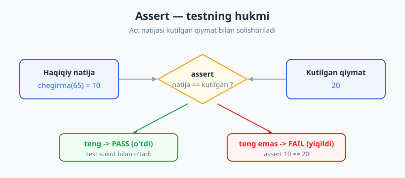
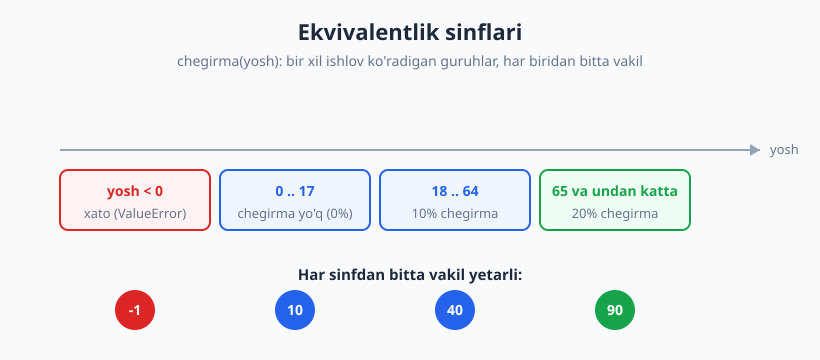
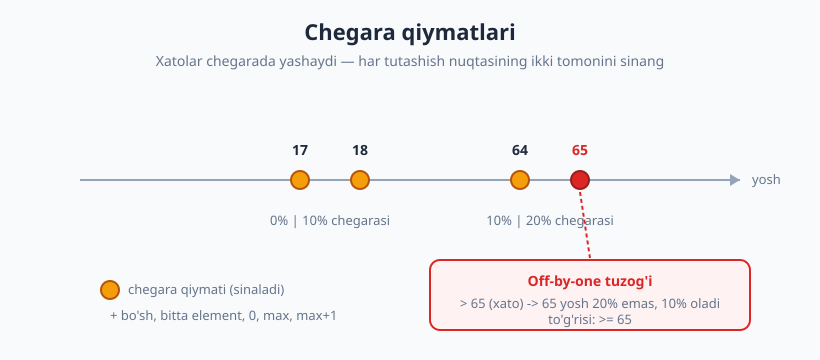

# 05 — Assertion'lar va test holatlarini tanlash

[🏠 README](./README.md) · [⬅️ Oldingi: 04 — Yaxshi test xossalari](./04-yaxshi-test-xossalari.md) · [Keyingi: 06 — Fixture va parametrize ➡️](./06-fixture-parametrize.md)

---

> **Bu bobda:** ikki katta savolga javob beramiz — **nimani** tekshirish va **qaysi** holatlarni
> sinash. Avval `assert`ning turlarini (tenglik, taxminiy tenglik, tarkib, istisno) ko'rib chiqamiz,
> keyin esa boshlovchini eng ko'p qiynaydigan savolni yechamiz: "qancha test yozsam yetadi va aynan
> qaysi qiymatlarni tanlayman?" Buning uchun ikkita kuchli texnika — **ekvivalentlik sinflari** va
> **chegara qiymatlari** — bilan tanishamiz.
>
> **Halollik / Eslatma:** bu bob bitta funksiya darajasidagi (unit) testlarga qaratilgan. Mock va
> xulq-tekshirishga faqat **ko'prik** tashlaymiz — to'liq mavzu [07](./07-test-dublyorlari-nazariya.md)
> va [08-bobda](./08-test-dublyorlari-amaliyot.md). "Qancha test yetarli?" savoliga aniq raqamli javob
> yo'q; coverage ([20-bob](./20-code-coverage.md)) va mutation ([22-bob](./22-mutation-testing.md))
> bunga signal beradi, lekin ularni keyin ko'ramiz. Barcha Python namunalari `pytest` bilan haqiqatan
> ishga tushirilib, chiqishi tekshirilgan (Python 3.14, pytest 9.0).

---

## Assertion — testning yuragi

Eslang, [02-bobda](./02-birinchi-test-aaa.md) test uch qadamdan iborat edi: **Arrange** (tayyorla),
**Act** (bajar), **Assert** (tasdiqla). Mana shu oxirgi qadam — **assertion** — testning haqiqiy
"hukmi". Agar Act bosqichi kodni ishga tushirsa, Assert bosqichi *"natija aynan men kutgan narsami?"*
degan savolga **ha** yoki **yo'q** deb javob beradi. Yo'q bo'lsa — test yiqiladi.

Bu xuddi mashinani sotib olishdan oldin uni tekshirishga o'xshaydi: dvigatel ishladi (Act), endi
*moy darajasi to'g'rimi, tormoz ushlaydimi, signal chalindimi* — bularning har biri alohida
**tasdiq**. Bitta tekshirib ko'rmagan narsangiz keyin muammoga aylanishi mumkin.

pytest'da assertion oddiy Python `assert` so'zi bilan yoziladi — alohida `assertEqual` kabi metodlar
shart emas. Buning sehri shundaki, test yiqilganda pytest `assert` ifodasini **ichidan ochib**
(introspection) sizga aniq nima nimaga teng emasligini ko'rsatadi.

```python
def test_yiqiladigan():
    natija = 2 + 2
    assert natija == 5
```

Ishga tushiramiz — pytest faqat "yiqildi" demaydi, balki **qiymatlarni ham** ko'rsatadi:

```text
>       assert natija == 5
E       assert 4 == 5
```

`assert 4 == 5` — mana shu introspection. Boshqa tillarda buni `assertEquals(5, natija)` kabi maxsus
funksiya beradi (JS'da `expect(natija).toBe(5)`, PHP'da `$this->assertEquals(5, $natija)`); pytest esa
oddiy `assert`ni "aqlli" qiladi.



---

## Assertion turlari

Bitta `==` bilan hamma narsani tekshirib bo'lmaydi. Quyida eng ko'p kerak bo'ladigan tasdiq turlari.

### Tenglik va xabar qo'shish

Eng oddiy va eng ko'p ishlatiladigani — `==`. Unga **izoh** (xabar) qo'shsangiz, test yiqilganda
sabab tezroq tushunarli bo'ladi:

```python
def test_xabar_bilan():
    yosh = 20
    assert yosh >= 18, f"yosh kamida 18 bo'lishi kerak, lekin {yosh}"
```

Vergulndan keyingi matn faqat **yiqilganda** ko'rsatiladi. Murakkab shartlarda bu juda foydali:
"`assert False`" o'rniga "`assert balans >= 0, 'balans manfiy bo'lib qoldi'`" ni o'qish osonroq.

> **Maslahat:** introspection allaqachon qiymatlarni ko'rsatadi, shuning uchun oddiy `==` ga izoh
> shart emas. Izohni **mantiqiy** (`and`/`or`/`>`) yoki noaniq shartlarda qo'shing — u yerda pytest
> faqat `assert False` deb ko'rsatib, *nega* yiqilganini aytmaydi.

### Taxminiy tenglik — float tuzog'i

Mana eng mashhur tuzoq. Kompyuter kasr (float) sonlarni **aniq** saqlamaydi:

```python
print(0.1 + 0.2)        # -> 0.30000000000000004
print(0.1 + 0.2 == 0.3) # -> False
```

Ha, `0.1 + 0.2` **aniq** `0.3` emas! Agar shunchaki `assert narx == 0.3` yozsangiz, test
tushunarsiz sababga ko'ra yiqiladi. Yechim — **taxminiy tenglik**: `pytest.approx`.

```python
import pytest

def test_taxminiy_tenglik():
    assert 0.1 + 0.2 == pytest.approx(0.3)  # -> PASS
```

`pytest.approx` kichik bardoshlilik (tolerance) bilan solishtiradi. Pul, o'lchov, foiz — har qanday
kasr hisob-kitobda **doimo** `approx` ishlating. Boshqa tillarda ekvivalenti bor: JS'da
`expect(x).toBeCloseTo(0.3)`, Java'da `assertEquals(0.3, x, 1e-9)`.

> **Diqqat:** butun sonlar (`int`) bilan bunday muammo yo'q — `2 + 3 == 5` har doim aniq. `approx`
> faqat **float** uchun.

### Tarkib: ro'yxat, to'plam, `in`

Ko'pincha "natijada falon element bormi?" yoki "ikki to'plam bir xilmi?" deb tekshiramiz:

```python
def test_royxat_va_in():
    savat = ["non", "sut", "tuxum"]
    assert "sut" in savat        # element bormi?
    assert len(savat) == 3       # uzunlik to'g'rimi?

def test_toplam_tarkibi():
    natija = {"a", "b", "c"}
    assert natija == {"c", "b", "a"}  # tartib muhim emas -> PASS
```

`set` (to'plam) bilan solishtirish **tartibni e'tiborsiz** qoldiradi — bu juda foydali, chunki
ko'pincha "shu uchta element bo'lsin, tartibi muhim emas" demoqchi bo'lamiz. Ro'yxat (`list`) esa
tartibni hisobga oladi.

### Mantiqiy shartlar

Bir nechta shartni birlashtirib ham tekshirsa bo'ladi:

```python
def test_mantiqiy():
    parol = "abc12345"
    assert parol.isalnum() and len(parol) >= 8  # -> PASS
```

> **Trade-off:** bitta `assert`ga juda ko'p shart tiqishtirmang. Yiqilganda qaysi shart buzilganini
> bilish qiyinlashadi (bu [04-bobdagi](./04-yaxshi-test-xossalari.md) "bitta yiqilish sababi"
> tamoyiliga zid). Ko'p shart bo'lsa, ularni alohida `assert`larga bo'ling yoki aniq izoh qo'shing.

Yuqoridagi olti testni bitta faylda yig'ib ishlatganda:

```text
......                                                                   [100%]
6 passed in 1.12s
```

---

## Istisnolarni (exception) testlash

Yaxshi kod nafaqat **to'g'ri ishlaganda** to'g'ri natija berishi, balki **noto'g'ri kirishda**
to'g'ri **xato** ko'tarishi ham kerak. "Funksiya nol bo'lganda `ValueError` chiqaradimi?" — buni ham
testlash shart. Buning uchun `pytest.raises` ishlatamiz.

```python
def bol(a, b):
    if b == 0:
        raise ValueError("nolga bo'lib bo'lmaydi")
    return a / b
```

Test:

```python
import pytest

def test_oddiy_bolish():
    assert bol(10, 2) == 5

def test_nolga_bolish_istisno():
    with pytest.raises(ValueError):
        bol(10, 0)   # bu yerda ValueError chiqishi SHART
```

`with pytest.raises(ValueError):` bloki *"ichidagi kod aynan shu istisnoni ko'tarsin"* deydi. Agar
istisno **chiqmasa** — test yiqiladi (kod buzilgan!). Agar **boshqa** istisno chiqsa — u ham yiqiladi.

### Xato matnini tekshirish (`match=`)

Ba'zan `ValueError` chiqishining o'zi kam — uning **xabari** ham to'g'ri bo'lsin. `match=` parametri
xabarni (regular ifoda bilan) tekshiradi:

```python
def test_nolga_bolish_xabar_matni():
    with pytest.raises(ValueError, match="nolga"):
        bol(1, 0)

def test_istisno_obyekti():
    with pytest.raises(ValueError) as xato:
        bol(1, 0)
    assert "bo'lib bo'lmaydi" in str(xato.value)
```

`as xato` orqali istisno obyektining o'ziga yetib, undagi ma'lumotni batafsil tekshirsa bo'ladi.

```text
....                                                                     [100%]
4 passed in 1.06s
```

> **Eslatma:** xato matnini juda **qattiq** tekshirmang. Agar `match="nolga bo'lib bo'lmaydi"` deb
> butun jumlani yozsangiz, kelajakda xabarni biroz tahrir qilganingizda test ham yiqiladi — bu
> "mo'rt test" (fragile test, [04-bob](./04-yaxshi-test-xossalari.md)). Xabardagi **kalit so'z**ni
> tekshiring, butun jumlani emas.

---

## Holat (state) vs xulq (behavior) tekshirish

Tekshirishning ikki uslubi bor:

| Uslub | Nimani tekshiramiz | Qachon |
|---|---|---|
| **Holat (state)** | Funksiya **qaytargan qiymat** yoki obyekt o'zgargan **holati** | Funksiya natija qaytarsa |
| **Xulq (behavior)** | Funksiya **boshqa narsani chaqirgani** (effekt) | Funksiya tashqi narsaga ta'sir qilsa |

Misol bilan ko'raylik:

```python
from unittest.mock import Mock

def qoshish(a, b):
    return a + b                       # holat: qiymat qaytaradi

def xush_kelibsiz(foydalanuvchi, xabarchi):
    xabarchi.yubor(foydalanuvchi, "Xush kelibsiz!")  # xulq: tashqi xizmatni chaqiradi
```

```python
def test_holat_tekshirish():
    # Holat: faqat qaytgan qiymatga qaraymiz
    assert qoshish(2, 3) == 5

def test_xulq_tekshirish():
    # Xulq: chaqiruv sodir bo'lganini tekshiramiz
    soxta_xabarchi = Mock()
    xush_kelibsiz("Olim", soxta_xabarchi)
    soxta_xabarchi.yubor.assert_called_once_with("Olim", "Xush kelibsiz!")
```

Birinchi test — sof **holat**: kirish berdik, chiqishni solishtirdik. Ikkinchi test esa xizmat (email
yuboruvchi) **chaqirilganini** tekshiradi — bu **xulq**. Bu yerda `Mock` — soxta dublyor; uni
to'liq [07](./07-test-dublyorlari-nazariya.md)–[08-bobda](./08-test-dublyorlari-amaliyot.md) ochamiz.

> **Maslahat:** imkon bo'lsa, **holatni** tekshirishni afzal ko'ring — u soddaroq va mustahkamroq.
> Xulq-tekshirish kodning ichki tuzilishiga bog'lanib qoladi (qaysi metodni chaqirgani). Faqat
> natijani holat orqali ko'rib bo'lmaganda (masalan, email yuborildi) xulqqa o'ting.

```text
..                                                                       [100%]
2 passed in 1.14s
```

---

## Test holatlarini tanlash: nimani sinaymiz?

Endi eng muhim savol. Funksiyani yozdingiz — *qaysi* kirishlar bilan test yozasiz? Boshlovchilar
odatda bitta "ishlaydigan" misol yozib qo'yib, "test bor" deb o'ylaydi. Lekin bitta misol kodning
**chetlaridagi** xatolarni tutmaydi.

Yaxshi xabar: **cheksiz** kirish bo'lsa-da, ularning hammasini test qilish shart emas. Ikkita
texnika kirishlar okeanidan eng "foydali" bir nechtasini ajratib beradi.

### 1. Ekvivalentlik sinflari (equivalence partitioning)

G'oya: kirishlarni **"bir xil ishlov ko'radigan"** guruhlarga bo'ling. Agar funksiya 18 va 40
yoshni bir xil ishlasa (ikkalasi ham 10% chegirma), unda 18, 25, 40, 63 ni alohida-alohida
test qilish **ortiqcha** — ularning bittasi guruh vakili bo'la oladi.

Har guruhdan **bitta vakil** tanlaysiz. Bu test sonini keskin kamaytiradi, lekin qamrovni saqlaydi.



### 2. Chegara qiymatlari (boundary value analysis)

Mana hayotiy haqiqat: **xatolar chegarada yashaydi.** Dasturchi `<` o'rniga `<=` yozadi, `65` o'rniga
`64` deb adashadi — bunday xatolar deyarli doim sinflar **chegarasida** sodir bo'ladi, ularning
o'rtasida emas.

Shuning uchun har sinf **chegarasini** va uning ikki tomonidagi qiymatlarni sinang:

- `0`, `-1`, `1` (nol atrofida)
- `max`, `max + 1` (yuqori chegara)
- bo'sh ro'yxat, bitta elementli ro'yxat
- sinflar tutashgan nuqtalar: `17` va `18`, `64` va `65`

Bu "**off-by-one**" (bir-birga adashish) xatolarni tutadigan eng kuchli texnika.



### 3. Maxsus va ekstremal holatlar

Chegaralardan tashqari, "g'alati" kirishlarni ham unutmang:

- **bo'sh** (`""`, `[]`, `{}`) va **`None`**
- **manfiy** sonlar, **nol**
- **juda katta** qiymat (uzun satr, ulkan ro'yxat)
- **Unicode**, bo'sh joy, takrorlanuvchi elementlar

### 4. Ijobiy (happy path) + salbiy (error path)

Har funksiyada kamida ikki yo'l bor: **to'g'ri ishlaydigan** holat (happy path) va **xato**
holat (error path). Ko'p boshlovchilar faqat happy path'ni yozadi — natijada kod noto'g'ri
kirishda jim-jit buziladi. Ikkalasini ham yozing.

---

## To'liq misol: yosh bo'yicha chegirma

Endi bu texnikalarni birlashtiramiz. Talab quyidagicha:

- `yosh < 0` → **xato** (`ValueError`)
- `0–17` yosh → chegirma **yo'q** (0%)
- `18–64` yosh → **10%** chegirma
- `65` va undan katta → **20%** chegirma

```python
# chegirma.py — sinaladigan kod
def chegirma(yosh):
    """Yosh bo'yicha chegirma foizini qaytaradi."""
    if yosh < 0:
        raise ValueError("yosh manfiy bo'lishi mumkin emas")
    if yosh <= 17:
        return 0
    if yosh <= 64:
        return 10
    return 20
```

Endi **ekvivalentlik + chegara** bilan test holatlarini tuzamiz. To'rt sinf bor (xato, 0%, 10%, 20%),
ularning chegaralari `0`, `17/18`, `64/65`. Mana to'liq to'plam (`parametrize` haqida batafsil
[06-bobda](./06-fixture-parametrize.md), hozir uni "bitta testni ko'p kirish bilan" deb tushuning):

```python
# test_chegirma.py
import pytest
from chegirma import chegirma

@pytest.mark.parametrize("yosh, kutilgan", [
    (0, 0),     # chegara: eng kichik amaldagi yosh
    (17, 0),    # chegara: "yo'q" sinfining yuqori cheti
    (18, 10),   # chegara: "10%" sinfining quyi cheti
    (40, 10),   # vakil: o'rta yosh
    (64, 10),   # chegara: "10%" sinfining yuqori cheti
    (65, 20),   # chegara: "20%" sinfining quyi cheti
    (90, 20),   # vakil: keksa yosh
])
def test_chegirma_ijobiy(yosh, kutilgan):
    assert chegirma(yosh) == kutilgan

def test_manfiy_yosh_xato():
    with pytest.raises(ValueError, match="manfiy"):
        chegirma(-1)
```

Diqqat qiling: har sinfdan **vakil** (40, 90) va har **chegara** (0, 17, 18, 64, 65) bor, plus
**error path** (manfiy yosh). Atigi 8 ta test — lekin ular butun mantiqni qoplaydi. Ishga tushiramiz:

```text
test_chegirma.py::test_chegirma_ijobiy[0-0] PASSED                       [ 12%]
test_chegirma.py::test_chegirma_ijobiy[17-0] PASSED                      [ 25%]
test_chegirma.py::test_chegirma_ijobiy[18-10] PASSED                     [ 37%]
test_chegirma.py::test_chegirma_ijobiy[40-10] PASSED                     [ 50%]
test_chegirma.py::test_chegirma_ijobiy[64-10] PASSED                     [ 62%]
test_chegirma.py::test_chegirma_ijobiy[65-20] PASSED                     [ 75%]
test_chegirma.py::test_chegirma_ijobiy[90-20] PASSED                     [ 87%]
test_chegirma.py::test_manfiy_yosh_xato PASSED                           [100%]

============================== 8 passed in 1.01s ==============================
```

### Chegara xatosini jonli tutamiz

Endi eng qiziq qismi. Tasavvur qiling, dasturchi keksalik chegarasini **noto'g'ri** yozdi — `>= 65`
o'rniga `> 65` deb (juda keng tarqalgan off-by-one xato):

```python
# chegirma_xato.py — ICHIDA XATO bor
def chegirma(yosh):
    if yosh < 0:
        raise ValueError("yosh manfiy bo'lishi mumkin emas")
    if yosh <= 17:
        return 0
    if yosh > 65:        # XATO: aynan 65 yoshli ham 20% olishi kerak edi
        return 20
    return 10
```

Bu kod 64, 70, 90 yosh bilan **to'g'ri** ishlaydi — agar siz chegarani test qilmagan bo'lsangiz,
xato yashirin qoladi! Lekin bizning to'plamda `(65, 20)` chegara holati bor. Ishlatamiz:

```text
.....F.                                                                  [100%]
_________________________ test_chegirma_ijobiy[65-20] _________________________

    def test_chegirma_ijobiy(yosh, kutilgan):
>       assert chegirma(yosh) == kutilgan
E       assert 10 == 20
E        +  where 10 = chegirma(65)

FAILED test_chegirma_xato.py::test_chegirma_ijobiy[65-20] - assert 10 == 20
1 failed, 6 passed in 1.15s
```

Mana! `assert 10 == 20 where 10 = chegirma(65)` — test **aniq** 65 yoshda xatoni topdi va introspection
bizga `chegirma(65)` noto'g'ri `10` qaytarganini ko'rsatdi. **Chegara qiymati** bo'lmasa, bu xato
ishlab chiqarishga (production) sirg'alib o'tib ketardi. Tuzatish — `> 65` ni `<= 64` mantiqiga
qaytarish (asl to'g'ri versiyadagidek), shunda 65 yosh `return 20` ga tushadi.

> **Saboq:** test soni emas, **holat sifati** muhim. 100 ta tasodifiy yosh bilan test yozsangiz ham,
> agar ularning birortasi aynan 65 bo'lmasa, bu xatoni topa olmaysiz. 8 ta **o'ylab tanlangan**
> chegara holati esa topadi.

---

## Qancha test yetarli?

Eng ko'p beriladigan savol — va eng nozik javob. Aniq raqam yo'q, lekin yo'riq bor:

- **Har ekvivalentlik sinfidan kamida bitta** vakil.
- **Har chegarani** (ikki tomonidan) sinang.
- **Happy path + har error path.**
- Maxsus holatlar (bo'sh, `None`, juda katta) qaerda mantiqan mumkin bo'lsa.

Bu yetarli yoki yo'qligini ikkita kuchli vosita o'lchaydi: **code coverage** ([20-bob](./20-code-coverage.md))
qaysi qatorlar umuman ishlatilmaganini ko'rsatadi, **mutation testing** ([22-bob](./22-mutation-testing.md))
esa testlaringiz xatoni *haqiqatan tuta oladimi* (masalan, `>` ni `>=` ga aylantirsa, test yiqiladimi)
deb tekshiradi. Lekin esda tuting: **100 ta sayoz test 8 ta o'ylangan testdan yomonroq.** Soni emas,
**sifati** — to'g'ri chegara va sinflarni qoplagani — muhim.

---

## Asosiy g'oyalar (bobni qisqacha)

- **Assert — testning hukmi.** pytest oddiy `assert`ni introspection bilan kuchaytiradi: yiqilganda
  `assert 4 == 5` kabi aniq qiymatlarni ko'rsatadi.
- **Float'ni hech qachon `==` bilan solishtirmang.** `0.1 + 0.2 != 0.3`. `pytest.approx` ishlating.
- **Istisnolarni `pytest.raises` bilan testlang.** Xato matnini `match=` orqali, lekin kalit so'z
  darajasida (butun jumlani emas — mo'rtlik).
- **Xabar qo'shing** (`assert x, "izoh"`) murakkab/mantiqiy shartlarda; oddiy `==` ga shart emas.
- **Holat vs xulq.** Imkon bo'lsa qaytgan qiymatni (holat) tekshiring; effektni (email yuborildi)
  xulq orqali — bu mock'ga olib boradi ([07–08-bob](./07-test-dublyorlari-nazariya.md)).
- **Ekvivalentlik sinflari** kirishlarni guruhlaydi — har guruhdan bitta vakil yetarli.
- **Chegara qiymatlari** xatolarni eng samarali tutadi: xatolar chetda (`0`, `17/18`, `64/65`, `max`)
  yashaydi. Off-by-one — eng keng tarqalgan xato.
- **Happy path + error path** — har ikkalasini yozing.
- **Test soni emas, sifati.** O'ylab tanlangan bir nechta holat tasodifiy yuzta holatdan kuchliroq.

---

## Mashqlar

### Oson

**1-mashq.** `0.1 + 0.2 == 0.3` nega `False` qaytaradi? Buni testda to'g'ri tekshirish uchun qaysi
vositadan foydalanasiz va nega?

**2-mashq.** Quyidagi funksiya manfiy songa `ValueError` ko'taradi. Uni `pytest.raises` bilan
tekshiradigan test yozing (xato matnida "manfiy" so'zi borligini ham tekshiring):

```python
def kvadrat_ildiz(x):
    if x < 0:
        raise ValueError("manfiy sondan ildiz chiqarib bo'lmaydi")
    return x ** 0.5
```

**3-mashq.** `baho(ball)` funksiyasi: `ball < 0` yoki `ball > 100` → xato; `0–59` → "yiqildi";
`60–100` → "o'tdi". Ekvivalentlik sinflarini sanang. Har sinf uchun bitta vakil va har chegara uchun
qiymat tanlang (test yozmang, faqat qiymatlar ro'yxatini tuzing).

### O'rta

**4-mashq.** `bosh_harf(matn)` funksiyasi satrning birinchi harfini katta qiladi; bo'sh satrga
`ValueError` ko'taradi. Maxsus va chegara holatlarini tanlang (bo'sh, bitta belgi, juda uzun satr) va
to'liq `parametrize` test yozing.

**5-mashq.** 3-mashqdagi `baho(ball)` funksiyasini yozing, so'ng `parametrize` bilan to'liq test
to'plamini tuzing (chegaralar: `-1`, `0`, `59`, `60`, `100`, `101`). Hammasi o'tishini tasdiqlang.

**6-mashq.** `xush_kelibsiz(foydalanuvchi, xabarchi)` funksiyasi `xabarchi.yubor(...)` ni chaqiradi.
`Mock` ishlatib, **xulq** testini yozing: `yubor` aynan to'g'ri argumentlar bilan **bir marta**
chaqirilganini tasdiqlang.

### Qiyin

**7-mashq.** 5-mashqdagi `baho` funksiyasiga **off-by-one xato** kiriting (masalan, `ball >= 60`
o'rniga `ball > 60`). Sizning test to'plamingiz buni tutadimi? Qaysi chegara holati uni tutadi?
Tutmasa — qaysi holatni qo'shish kerak edi?

**8-mashq.** `pul_qaytim(narx, berilgan)` funksiyasi `berilgan - narx` ni qaytaradi; `berilgan < narx`
bo'lsa `ValueError`. Funksiyani yozing va test to'plamini tuzing. Diqqat: kasr pul bilan (`narx=0.1`,
`berilgan=0.3`) ishlaganda qaytim qanday tekshiriladi? Float tuzog'ini hisobga oling.

<details markdown="1">
<summary>Yechimlar</summary>

### 1-mashq yechimi

Kompyuter float sonlarni ikkilik (binary) shaklda saqlaydi va `0.1`, `0.2` ni **aniq** ifodalay
olmaydi — kichik xato to'planadi, natijada `0.1 + 0.2` aslida `0.30000000000000004` bo'ladi. Shuning
uchun `== 0.3` `False` qaytaradi. Yechim — **`pytest.approx`**, u kichik bardoshlilik bilan
solishtiradi: `assert 0.1 + 0.2 == pytest.approx(0.3)`. Sababi: float arifmetikasida aniq tenglik
deyarli hech qachon mos kelmaydi.

### 2-mashq yechimi

```python
import pytest

def kvadrat_ildiz(x):
    if x < 0:
        raise ValueError("manfiy sondan ildiz chiqarib bo'lmaydi")
    return x ** 0.5

def test_musbat_son():
    assert kvadrat_ildiz(9) == 3

def test_manfiy_son_xato():
    with pytest.raises(ValueError, match="manfiy"):
        kvadrat_ildiz(-4)
# -> 2 passed
```

### 3-mashq yechimi

Ekvivalentlik sinflari:
1. **Past xato:** `ball < 0`
2. **Yiqildi:** `0–59`
3. **O'tdi:** `60–100`
4. **Yuqori xato:** `ball > 100`

Tanlangan qiymatlar (vakil + chegaralar):
`-1` (past xato chegarasi), `0` (yiqildi quyi cheti), `30` (yiqildi vakili), `59` (yiqildi yuqori cheti),
`60` (o'tdi quyi cheti), `100` (o'tdi yuqori cheti), `101` (yuqori xato chegarasi).

### 4-mashq yechimi

```python
import pytest

def bosh_harf(matn):
    if not matn:
        raise ValueError("bo'sh satr berib bo'lmaydi")
    return matn[0].upper() + matn[1:]

@pytest.mark.parametrize("kirish, kutilgan", [
    ("olim", "Olim"),           # happy path
    ("a", "A"),                 # chegara: bitta belgi
    ("olma daraxti", "Olma daraxti"),  # bo'sh joy bilan
])
def test_bosh_harf(kirish, kutilgan):
    assert bosh_harf(kirish) == kutilgan

def test_bosh_satr_xato():
    with pytest.raises(ValueError):
        bosh_harf("")

def test_juda_uzun_satr():
    natija = bosh_harf("x" * 100000)
    assert natija[0] == "X"
    assert len(natija) == 100000
# -> 5 passed
```

### 5-mashq yechimi

```python
import pytest

def baho(ball):
    if ball < 0 or ball > 100:
        raise ValueError("ball 0..100 oralig'ida bo'lishi kerak")
    if ball <= 59:
        return "yiqildi"
    return "o'tdi"

@pytest.mark.parametrize("ball, kutilgan", [
    (0, "yiqildi"),
    (59, "yiqildi"),
    (60, "o'tdi"),
    (100, "o'tdi"),
])
def test_baho_ijobiy(ball, kutilgan):
    assert baho(ball) == kutilgan

@pytest.mark.parametrize("ball", [-1, 101])
def test_baho_xato(ball):
    with pytest.raises(ValueError):
        baho(ball)
# -> 6 passed
```

### 6-mashq yechimi

```python
from unittest.mock import Mock

def xush_kelibsiz(foydalanuvchi, xabarchi):
    xabarchi.yubor(foydalanuvchi, "Xush kelibsiz!")

def test_xush_kelibsiz_yuboradi():
    soxta = Mock()
    xush_kelibsiz("Olim", soxta)
    soxta.yubor.assert_called_once_with("Olim", "Xush kelibsiz!")
# -> 1 passed
```

`assert_called_once_with` ikki narsani birga tekshiradi: chaqiruv **bir marta** bo'lgani va
argumentlar **aynan** mos kelgani. Bu — xulq (behavior) tekshirish.

### 7-mashq yechimi

Mantiqni `if ball > 60: return "o'tdi"` deb yozsak, `baho(60)` `"o'tdi"` o'rniga `"yiqildi"`
qaytaradi — chunki `60 > 60` `False`. Bizning to'plamdagi **`(60, "o'tdi")`** chegara holati aynan
shu xatoni tutadi:

```text
E       assert 'yiqildi' == "o'tdi"
FAILED ...test_baho_ijobiy[60-o'tdi]
```

Agar to'plamda `60` chegara holati bo'lmaganida (masalan, faqat `30` va `90` ni sinaganimizda), bu
off-by-one xato yashirin qolardi. **Saboq:** sinflar tutashgan aniq nuqtani (`59`/`60`) test qilish
shart.

### 8-mashq yechimi

```python
import pytest

def pul_qaytim(narx, berilgan):
    if berilgan < narx:
        raise ValueError("berilgan pul narxdan kam")
    return berilgan - narx

def test_oddiy_qaytim():
    assert pul_qaytim(70, 100) == 30

def test_aniq_pul():
    assert pul_qaytim(100, 100) == 0   # chegara: teng

def test_kam_pul_xato():
    with pytest.raises(ValueError, match="kam"):
        pul_qaytim(100, 70)

def test_kasr_pul_approx():
    # Float tuzog'i: 0.3 - 0.1 aniq 0.2 emas!
    assert pul_qaytim(0.1, 0.3) == pytest.approx(0.2)
# -> 4 passed
```

Kasr pul bilan `0.3 - 0.1` aslida `0.19999999999999998` bo'ladi, shuning uchun `== 0.2` yiqiladi —
`pytest.approx` shart. Chegara holati `berilgan == narx` (qaytim `0`) ni ham qo'shdik.

</details>

---

[🏠 README](./README.md) · [⬅️ Oldingi: 04 — Yaxshi test xossalari](./04-yaxshi-test-xossalari.md) · [Keyingi: 06 — Fixture va parametrize ➡️](./06-fixture-parametrize.md)
