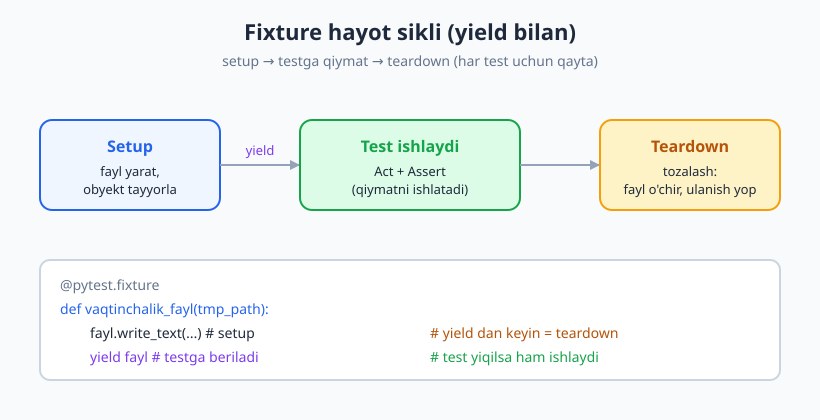
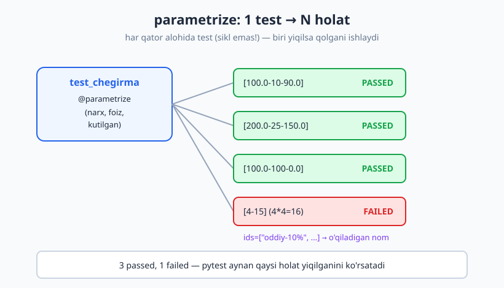
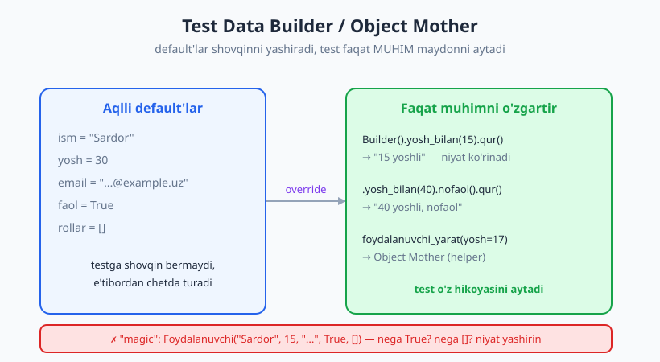

# 06 — Test ma'lumotlari: fixture, parametrize, builder

[🏠 README](./README.md) · [⬅️ Oldingi: 05 — Assertion'lar va test holatlarini tanlash](./05-assertionlar-test-holatlari.md) · [Keyingi: 07 — Test dublyorlari I: taksonomiya ➡️](./07-test-dublyorlari-nazariya.md)

---

> **Bu bobda:** Testlarning eng zerikarli, lekin eng ko'p takrorlanadigan qismi — **tayyorlov (Arrange)** bilan kurashamiz. `pytest` **fixture**'lari bilan tayyorlovni bir joyga yig'amiz, **scope** orqali uni qachon qayta ishlatishni boshqaramiz, `conftest.py` orqali fixture'larni butun loyihaga ulashamiz. So'ng bitta test bilan o'nlab holatni qoplaydigan **`@pytest.mark.parametrize`**ni o'rganamiz va murakkab test obyektlarini ozoda quradigan **Test Data Builder** / **Object Mother** naqshlarini ko'ramiz.
>
> **Halollik / Eslatma:** Fixture va parametrize — `pytest`ning sintaksisi, lekin ular ortidagi g'oya (tayyorlovni ajratish, bir testni ko'p ma'lumotda yuritish) **har bir test freymvorkida bor** — JS'da `beforeEach` va `test.each`, PHP'da `setUp` va data provider. Til o'zgaradi, fikr o'zgarmaydi. Bobdagi barcha Python namunalari `python -m pytest` bilan **haqiqatan ishga tushirilib**, `-v` chiqishi va PASS/FAIL holatlari shu yerdan olingan — to'qib chiqarilmagan. Fixture'larni mock/stub bilan to'ldirish (test dublyorlari) keyingi [07-bob](./07-test-dublyorlari-nazariya.md) mavzusi.

---

## Muammo: har test bir xil tayyorlovni takrorlaydi

Eslang, har bir test uch qismdan iborat (02-bobdagi **AAA**): **Arrange** (tayyorla) → **Act** (bajar) → **Assert** (tekshir). Amalda Act va Assert ko'pincha bir-ikki qator, ammo Arrange — eng katta va eng zerikarli qism: ma'lumotni yarat, obyektni qur, ulanishni och, faylni to'ldir...

[05-bobdagi](./05-assertionlar-test-holatlari.md) chegirma funksiyasini ko'p holatda tekshirmoqchimiz. Sinaladigan kod:

```python
# narx.py
def chegirma_narxi(narx, foiz):
    if narx < 0:
        raise ValueError("narx manfiy bo'lishi mumkin emas")
    if not (0 <= foiz <= 100):
        raise ValueError("foiz 0..100 oralig'ida bo'lishi kerak")
    return round(narx * (1 - foiz / 100), 2)
```

Endi "tabiiy" (lekin yomon) yo'l — har holatga alohida test, ko'r-ko'rona nusxa-joylash:

```python
# test_takror.py  — ❌ DRY buzilgan
from narx import chegirma_narxi


def test_chegirma_10_foiz():
    narx = 100.0          # Arrange
    foiz = 10             # Arrange
    natija = chegirma_narxi(narx, foiz)   # Act
    assert natija == 90.0                 # Assert


def test_chegirma_25_foiz():
    narx = 200.0
    foiz = 25
    natija = chegirma_narxi(narx, foiz)
    assert natija == 150.0


def test_chegirma_0_foiz():
    narx = 50.0
    foiz = 0
    natija = chegirma_narxi(narx, foiz)
    assert natija == 50.0
```

```text
$ python -m pytest test_takror.py -v
test_takror.py::test_chegirma_10_foiz PASSED
test_takror.py::test_chegirma_25_foiz PASSED
test_takror.py::test_chegirma_0_foiz PASSED
# -> 3 passed in 0.x s
```

Testlar o'tadi, lekin uchta funksiyaning faqat **raqamlar** farq qiladi. Tuzilma uch marta nusxalangan. Bu **DRY** (*Don't Repeat Yourself*) tamoyilining buzilishi: ertaga `chegirma_narxi` imzosi o'zgarsa, uch joyni tahrirlash kerak. Bobning qolgan qismi shu takrorni ikki xil qurol bilan yo'qotadi:

- **Bir xil tayyorlov, har xil testlar** → **fixture** (tayyorlovni bitta joyga ko'chir).
- **Bir xil test, har xil ma'lumot** → **parametrize** (ma'lumotni jadvalga ajrat).

> **Eslatma:** Test kodida DRY'ga *fanatik* yopishmang. Test ba'zan ataylab "yassi va aniq" (**DAMP** — *Descriptive And Meaningful Phrases*) bo'lishi yaxshiroq, chunki test buzilganda darrov tushunilishi kerak. DRY vs DAMP muvozanati — [13-bob](./13-refactoring-va-testlar.md) mavzusi. Bu yerda biz *foydali*, *o'qishni osonlashtiradigan* takrorni yo'qotamiz.

## pytest fixture: tayyorlovni bir joyga yig'ish

**Fixture** (o'zbekcha taxminan "tayyor sahna jihozi") — bu testga **tayyor holat yoki obyekt** beruvchi maxsus funksiya. Uni `@pytest.fixture` bilan belgilaymiz, so'ng testga **argument** sifatida nomini yozsak yetarli — `pytest` o'zi topadi va chaqiradi. Bu mexanizm **dependency injection** (bog'liqlikni testga "qadab berish") deb ataladi.

```python
import pytest


@pytest.fixture
def bosh_savat():
    # Bu — Arrange. Bir marta yozildi, ko'p testda ishlatiladi.
    return {"mahsulotlar": [], "jami": 0.0}


def test_savat_bosh(bosh_savat):          # argumentdagi nom = fixture nomi
    assert bosh_savat["mahsulotlar"] == []
    assert bosh_savat["jami"] == 0.0
```

`test_savat_bosh` funksiyasining `bosh_savat` argumenti — bu sehr emas: `pytest` test parametrining nomini ko'radi, shu nomli fixture'ni topadi, uni chaqiradi va qaytgan qiymatni argumentga uzatadi. Siz hech qaerda `bosh_savat()`ni o'zingiz chaqirmaysiz.

> **Til-ko'prik:** Bu g'oya universal. JavaScript (Jest/Vitest)'da `beforeEach(() => { ... })` har testdan oldin tayyorlov bajaradi; PHP (PHPUnit)'da `setUp()` metodi shu vazifani o'taydi. `pytest` fixture'lari kuchliroq, chunki ular *nomli* va *talab bo'yicha* (faqat so'ragan testga) beriladi — global `beforeEach` esa hamma testga ta'sir qiladi.

### Setup va teardown: `yield` bilan tozalash

Ko'p tayyorlov **tozalashni** ham talab qiladi: ochilgan faylni yopish, vaqtinchalik papkani o'chirish, ulanishni uzish. `pytest`da buni `return` o'rniga `yield` bilan qilamiz: `yield`gacha — **setup**, `yield`dan keyin — **teardown** (test tugagach avtomatik ishlaydi, hatto test yiqilsa ham).

```python
import pytest


@pytest.fixture
def vaqtinchalik_fayl(tmp_path):       # tmp_path — pytest'ning tayyor fixture'i
    # --- Setup (Arrange) ---
    fayl = tmp_path / "malumot.txt"
    fayl.write_text("salom\ndunyo\n", encoding="utf-8")
    print(f"\n[setup] yaratildi: {fayl.name}")
    yield fayl                          # <-- testga shu qiymat beriladi
    # --- Teardown (yield dan keyin) ---
    print(f"[teardown] tozalandi: {fayl.name}")


def hisobla_qatorlar(yol):
    return len(yol.read_text(encoding="utf-8").splitlines())


def test_ikki_qator(vaqtinchalik_fayl):
    assert hisobla_qatorlar(vaqtinchalik_fayl) == 2


def test_bosh_emas(vaqtinchalik_fayl):
    assert vaqtinchalik_fayl.read_text(encoding="utf-8") != ""
```

`-s` bayrog'i `print`larni ko'rsatadi (odatda pytest ularni yutadi):

```text
$ python -m pytest test_fixture.py -v -s
test_ikki_qator
[setup] yaratildi: malumot.txt
PASSED[teardown] tozalandi: malumot.txt

test_bosh_emas
[setup] yaratildi: malumot.txt
PASSED[teardown] tozalandi: malumot.txt
# -> 2 passed
```

E'tibor bering: setup va teardown **har bir test uchun** ishladi — bu izolyatsiyani kafolatlaydi (har test toza fayldan boshlaydi). `tmp_path` — `pytest`ning o'rnatilgan fixture'i: u test uchun yangi vaqtinchalik papka beradi va o'zi tozalaydi (real loyihada `tmp_path`ni afzal ko'ring, qo'lda fayl o'chirmang).



## Fixture scope: bir marta yoki har safar?

Standart holda fixture **har test uchun qaytadan** ishlaydi (`scope="function"`). Lekin ba'zi tayyorlov qimmat: ma'lumotlar bazasiga ulanish, katta faylni o'qish, server ko'tarish. Buni har testda qaytarish — sekin. **Scope** aynan shuni boshqaradi: fixture qiymati qancha "yashaydi".

| Scope | Qachon qayta ishlaydi | Tipik foydalanish |
|---|---|---|
| `function` (standart) | **Har** test funksiyasi uchun | Toza ma'lumot, eng yuqori izolyatsiya |
| `class` | Har test klassi uchun bir marta | Klassdagi testlar umumiy holatni baham ko'rsa |
| `module` | Har fayl (modul) uchun bir marta | Fayl ichidagi testlarga umumiy qimmat resurs |
| `session` | Butun test yugurishi uchun bir marta | DB ulanish, Docker konteyner, server |

Quyidagi misol `function` va `module` scope farqini **ko'rsatadi**:

```python
import pytest

hisoblagich = {"qiymat": 0}


@pytest.fixture(scope="function")
def har_testda():
    hisoblagich["qiymat"] += 1
    print(f"\n[function-fixture chaqirildi: {hisoblagich['qiymat']}-marta]")
    return hisoblagich["qiymat"]


@pytest.fixture(scope="module")
def bir_marta():
    print("\n[module-fixture: faqat BIR marta]")
    return "ulanish"


def test_a(har_testda, bir_marta):
    assert har_testda == 1


def test_b(har_testda, bir_marta):
    assert har_testda == 2
```

```text
$ python -m pytest test_scope.py -v -s
test_a
[module-fixture: faqat BIR marta]
[function-fixture chaqirildi: 1-marta]
PASSED
test_b
[function-fixture chaqirildi: 2-marta]
PASSED
# -> 2 passed
```

`module`-fixture **bitta** marta ("faqat BIR marta"), `function`-fixture esa **ikki** marta chaqirildi. Bu — to'g'ridan-to'g'ri muvozanat:

> **Trade-off:** Keng scope (`session`/`module`) = **tezroq** (qimmat tayyorlov bir marta), lekin **xavfli** — testlar bir resursni baham ko'radi, biri ikkinchisining holatini buzishi mumkin (umumiy holat = [24-bobdagi](./24-flaky-testlar.md) flaky testlarning asosiy sababi). Tor scope (`function`) = **sekinroq**, lekin **toza izolyatsiya**. Qoida: **`function`dan boshlang**, faqat tezlik haqiqiy muammo bo'lsa va resurs o'zgarmas (read-only) bo'lsa keng scope'ga o'ting.

## `conftest.py`: fixture'larni baham ko'rish

Bir fixture'ni ko'p test faylida ishlatmoqchimisiz? Uni har faylga nusxalamang — `conftest.py` nomli maxsus faylga qo'ying. `pytest` bu faylni **avtomatik topadi** (import qilish shart emas): shu papkadagi va undan pastdagi barcha testlar uning fixture'laridan foydalana oladi.

```python
# conftest.py  — papkadagi barcha testlar ko'radi
import pytest


@pytest.fixture
def bosh_savat():
    return {"mahsulotlar": [], "jami": 0.0}
```

```python
# test_conftest_use.py  — hech narsa import qilinmadi!
def test_savat_bosh(bosh_savat):
    assert bosh_savat["mahsulotlar"] == []
    assert bosh_savat["jami"] == 0.0
```

```text
$ python -m pytest test_conftest_use.py -v
test_conftest_use.py::test_savat_bosh PASSED
# -> 1 passed
```

`conftest.py` — fixture'lar uchun "umumiy ombor". Loyihaning ildizida ham, har bir test-papkada ham bo'lishi mumkin (eng yaqin `conftest.py` ustun keladi). Bu — fixture'larni sekin-asta umumiylashtirishning toza yo'li.

## Parametrlangan testlar: bitta test, ko'p holat

Endi muammoning ikkinchi yarmiga qaytamiz: **bir xil test mantig'i, faqat ma'lumot har xil**. Boshidagi uchta `test_chegirma_*` funksiyasini eslang. Ularni bittaga yig'amiz — **`@pytest.mark.parametrize`** bilan. Siz `(kirish, kutilgan-natija)` juftlari **jadvalini** berasiz, `pytest` har bir qator uchun testni **alohida** yuritadi.

```python
import pytest
from narx import chegirma_narxi


@pytest.mark.parametrize("narx, foiz, kutilgan", [
    (100.0, 10, 90.0),     # oddiy holat
    (200.0, 25, 150.0),    # chorak chegirma
    (50.0, 0, 50.0),       # chegirma yo'q
    (100.0, 100, 0.0),     # to'liq bepul (chegara)
    (99.99, 10, 89.99),    # kasr yaxlitlash
])
def test_chegirma(narx, foiz, kutilgan):
    assert chegirma_narxi(narx, foiz) == kutilgan
```

Diqqat — bu **5 ta alohida test**, bitta emas. `pytest -v` har birini mustaqil ko'rsatadi (ID ichida ma'lumot bor):

```text
$ python -m pytest test_param.py -v
test_param.py::test_chegirma[100.0-10-90.0] PASSED              [ 20%]
test_param.py::test_chegirma[200.0-25-150.0] PASSED             [ 40%]
test_param.py::test_chegirma[50.0-0-50.0] PASSED                [ 60%]
test_param.py::test_chegirma[100.0-100-0.0] PASSED              [ 80%]
test_param.py::test_chegirma[99.99-10-89.99] PASSED             [100%]
# -> 5 passed in 0.x s
```

Bitta funksiyaga 4 qator qo'shildi, lekin 5 ta to'liq test holatini oldik. Yangi holat qo'shish — jadvalga bitta qator. Bu DRY'ni saqlaydi **va** har holatni alohida hisobotda ko'rsatadi.



### Nega alohida testlar — bitta sikl emas?

Vasvasaga tushmang: "bitta testda `for` siklida hammasini tekshiraman" deb. Bu **anti-pattern**:

```python
# ❌ Yomon: bitta test, ichida sikl
def test_chegirma_sikl():
    holatlar = [(100.0, 10, 90.0), (200.0, 25, 150.0), (50.0, 0, 50.0)]
    for narx, foiz, kutilgan in holatlar:
        assert chegirma_narxi(narx, foiz) == kutilgan
```

Bu yomon, chunki: (1) **birinchi** yiqilgan holat siklni to'xtatadi — qolganlar tekshirilmaydi; (2) yiqilganda *qaysi* holat aybdor ekani noaniq; (3) hisobotda bitta test ko'rinadi. `parametrize`da esa har holat mustaqil — biri yiqilsa qolganlari baribir ishlaydi.

Mana yiqilishni ataylab ko'rsatamiz (`(4, 15)` noto'g'ri — `4*4=16`):

```text
$ python -m pytest test_fail_demo.py -v
test_fail_demo.py::test_kvadrat[2-4] PASSED                     [ 33%]
test_fail_demo.py::test_kvadrat[3-9] PASSED                     [ 66%]
test_fail_demo.py::test_kvadrat[4-15] FAILED                    [100%]

================================= FAILURES =================================
___________________________ test_kvadrat[4-15] ____________________________
>       assert kvadrat(kirish) == kutilgan
E       assert 16 == 15
E        +  where 16 = kvadrat(4)
# -> 1 failed, 2 passed
```

`pytest` aynan **`[4-15]`** holatini ko'rsatdi, qolgan ikkitasi PASSED bo'lib qoldi, va assertion introspeksiyasi `16 == 15` (`where 16 = kvadrat(4)`) bilan sababni aytdi. Sikl bunday qila olmaydi.

### `ids=` bilan o'qiladigan nom

Standart ID raqamlardan tuziladi (`[100.0-10-90.0]`) — murakkab ma'lumotda o'qish qiyin. `ids=` bilan har holatga insoniy nom bering:

```python
@pytest.mark.parametrize("narx, foiz, kutilgan", [
    (100.0, 10, 90.0),
    (200.0, 25, 150.0),
    (100.0, 100, 0.0),
], ids=["oddiy-10%", "chorak-chegirma", "bepul-100%"])
def test_chegirma_nomli(narx, foiz, kutilgan):
    assert chegirma_narxi(narx, foiz) == kutilgan
```

```text
$ python -m pytest test_ids.py -v
test_ids.py::test_chegirma_nomli[oddiy-10%] PASSED              [ 33%]
test_ids.py::test_chegirma_nomli[chorak-chegirma] PASSED        [ 66%]
test_ids.py::test_chegirma_nomli[bepul-100%] PASSED             [100%]
# -> 3 passed
```

Endi hisobot o'z-o'zidan hujjat: har test holati nima sinayotganini **so'z bilan** aytadi.

> **Til-ko'prik:** JavaScript'da bu `test.each([...])` (Jest) yoki `it.each` (Vitest), PHP (PHPUnit)'da **data provider** metodi (`@dataProvider`), Java (JUnit 5)'da `@ParameterizedTest` + `@MethodSource`. Atama har xil — "data-driven test" g'oyasi bitta.

### parametrize + fixture birga

`parametrize` va fixture bir-biriga xalaqit bermaydi: bitta testda ham parametrlar, ham fixture'lar bo'lishi mumkin. `pytest` ularni birlashtiradi:

```python
import pytest


@pytest.fixture
def soliq_foizi():
    return 12


@pytest.mark.parametrize("summa, kutilgan", [
    (100, 112),
    (0, 0),
    (50, 56),
])
def test_soliq(summa, kutilgan, soliq_foizi):
    natija = summa + summa * soliq_foizi // 100
    assert natija == kutilgan
```

`summa`, `kutilgan` — parametrize'dan; `soliq_foizi` — fixture'dan. Uchala holatda fixture bir xil 12 qiymat berdi, parametrlar esa har holatda o'zgardi.

```text
$ python -m pytest test_aralash.py -v
test_aralash.py::test_soliq[100-112] PASSED
test_aralash.py::test_soliq[0-0] PASSED
test_aralash.py::test_soliq[50-56] PASSED
# -> 3 passed
```

### Fixture'ni parametrlash (`params=`)

Teskari yo'nalish ham bor: **fixture'ning o'zini** parametrlash. `@pytest.fixture(params=[...])` bersangiz, fixture'ni ishlatadigan **har bir test** har bir parametr uchun qaytadan yuritiladi. Bu, ayniqsa, "bir xil testni bir nechta muhitda tekshirish" uchun qulay:

```python
import pytest


@pytest.fixture(params=["sqlite", "postgres", "mysql"])
def db_turi(request):              # request — pytest'ning maxsus obyekti
    return request.param           # joriy parametr


def test_har_db_uchun(db_turi):
    assert db_turi in {"sqlite", "postgres", "mysql"}
```

```text
$ python -m pytest test_fixparam.py -v
test_fixparam.py::test_har_db_uchun[sqlite] PASSED
test_fixparam.py::test_har_db_uchun[postgres] PASSED
test_fixparam.py::test_har_db_uchun[mysql] PASSED
# -> 3 passed
```

Bitta test yozdik — uch xil "DB turi" uchun uch marta ishladi. Real loyihada `params` joyiga uch xil real ulanish qo'yilsa, butun test to'plamingiz uch muhitda avtomatik yuriydi.

## Test Data Builder va Object Mother naqshlari

Endi eng nozik mavzuga o'tamiz: **murakkab obyektni** test uchun qurish. Aytaylik, `Foydalanuvchi` 5 maydonli:

```python
from dataclasses import dataclass, field


@dataclass
class Foydalanuvchi:
    ism: str
    yosh: int
    email: str
    faol: bool = True
    rollar: list = field(default_factory=list)
```

Faqat `yosh` muhim bo'lgan testda ham, "tabiiy" yo'l butun obyektni qo'lda quradi:

```python
# ❌ "Magic" obyekt: niyat ko'rinmaydi, shovqin ko'p
f = Foydalanuvchi("Sardor", 15, "sardor@example.uz", True, [])
assert voyaga_yetgan(f) is False
```

Bu testni o'qigan odam: "nega `True`? nega bo'sh ro'yxat? `15` muhimmi yoki tasodifiymi?" deb hayron bo'ladi. **Niyat** (faqat `yosh=15` muhim) shovqin ostida ko'rinmay qoladi.

### Object Mother (helper funksiya)

Eng sodda yechim — **default qiymatli** yaratuvchi funksiya. Faqat muhim maydonni o'zgartirasiz, qolgani aqlli default:

```python
def foydalanuvchi_yarat(yosh=30, faol=True, rollar=None):
    return Foydalanuvchi(
        ism="Sardor", yosh=yosh, email="sardor@example.uz",
        faol=faol, rollar=rollar or [],
    )


def voyaga_yetgan(f):
    return f.yosh >= 18 and f.faol
```

```python
def test_object_mother():
    foydalanuvchi = foydalanuvchi_yarat(yosh=17)   # faqat yosh muhim — niyat aniq!
    assert voyaga_yetgan(foydalanuvchi) is False
```

### Test Data Builder (zanjir uslubi)

Murakkabroq holatlarda **builder** o'qishni yanada yaxshilaydi: har metod obyektning bir qismini o'rnatadi va `self`ni qaytaradi (zanjirlash uchun), oxirida `qur()` yakuniy obyektni beradi:

```python
class FoydalanuvchiBuilder:
    def __init__(self):
        self._ism = "Sardor"          # aqlli default'lar
        self._yosh = 30
        self._email = "sardor@example.uz"
        self._faol = True
        self._rollar = []

    def yosh_bilan(self, yosh):
        self._yosh = yosh
        return self                    # zanjirlash uchun

    def nofaol(self):
        self._faol = False
        return self

    def rol_bilan(self, rol):
        self._rollar.append(rol)
        return self

    def qur(self):
        return Foydalanuvchi(self._ism, self._yosh, self._email,
                             self._faol, list(self._rollar))
```

Endi testlar deyarli **jumla kabi** o'qiladi — har test faqat o'zi uchun muhim narsani aytadi:

```python
from domen import FoydalanuvchiBuilder, foydalanuvchi_yarat, voyaga_yetgan


def test_voyaga_yetgan_builder():
    foydalanuvchi = FoydalanuvchiBuilder().yosh_bilan(25).qur()
    assert voyaga_yetgan(foydalanuvchi) is True


def test_yosh_bola_voyaga_yetmagan():
    foydalanuvchi = FoydalanuvchiBuilder().yosh_bilan(15).qur()
    assert voyaga_yetgan(foydalanuvchi) is False


def test_nofaol_voyaga_yetmagan():
    foydalanuvchi = FoydalanuvchiBuilder().yosh_bilan(40).nofaol().qur()
    assert voyaga_yetgan(foydalanuvchi) is False
```

```text
$ python -m pytest test_builder.py -v
test_builder.py::test_voyaga_yetgan_builder PASSED
test_builder.py::test_yosh_bola_voyaga_yetmagan PASSED
test_builder.py::test_nofaol_voyaga_yetmagan PASSED
test_builder.py::test_object_mother PASSED
# -> 4 passed
```

`FoydalanuvchiBuilder().yosh_bilan(40).nofaol().qur()` — bu kod **o'zini o'zi tushuntiradi**: "40 yoshli, nofaol foydalanuvchi". Aynan shu **niyatning ko'rinishi** — builder/object mother naqshining bosh foydasi. Default qiymatlar shovqinni yashiradi, test esa faqat o'z hikoyasini aytadi.



> **Til-ko'prik:** Bu naqshlar tildan mustaqil. JavaScript'da odatda **factory funksiya** (`yaratFoydalanuvchi({ yosh: 15 })` — default'lar + override obyekti) ishlatiladi; PHP'da builder klass yoki kutubxonalar (masalan, paket factory'lari). Murakkab loyihada `factory_boy` (Python) yoki Faker kabi vositalar bu ishni avtomatlashtiradi.

## Anti-pattern'lar: qachon to'xtash kerak

Fixture va builder kuchli, lekin haddan oshirish — yangi muammo:

- **Mystery Guest (sirli mehmon):** Test o'zi ishlatadigan ma'lumot *qayerdan* kelganini ko'rsatmaydi — uzoq bir `conftest.py`dagi katta umumiy fixture. Testni o'qib, nima bilan ishlayotganini tushunib bo'lmaydi. **Yechim:** ma'lumotni test yaqinida saqlang yoki nomi orqali aniq qiling.
- **Haddan tashqari umumiy fixture:** Bitta "hammasi uchun" fixture o'nlab maydon o'rnatadi, lekin har test faqat ikkitasini ishlatadi. Test nima muhimligini ajrata olmaydi. **Yechim:** kichik, maqsadli fixture'lar yoki builder (faqat kerakli maydonni override qil).
- **Uzoq fixture zanjiri:** Fixture A → B → C → D'ga bog'liq. Bittasi buzilsa, qaysi bo'g'in aybdorligini topish azob. **Yechim:** zanjirni qisqartiring, bog'liqlikni yassi tuting.
- **Keng scope + o'zgaruvchan holat:** `session` scope'li fixture'ni testlar **o'zgartirsa** — bir test ikkinchisini buzadi, natija test tartibiga bog'liq bo'lib qoladi (flaky). **Yechim:** umumiy resursni read-only tuting yoki `function` scope'ga qayting.

> **Diqqat:** Fixture — test *bog'liqligi*. Har fixture testni biroz "sehrli" qiladi (argument qayerdandir to'ldiriladi). Shuning uchun fixture'ni faqat **haqiqiy takror** bo'lsa joriy qiling, "balki keyin kerak bo'lar" deb emas. Ikki marta takror — ko'pincha hali fixture sababi emas.

---

## Asosiy g'oyalar (bobni qisqacha)

- **Tayyorlov (Arrange) eng ko'p takrorlanadi** — uni fixture (umumiy holat) va parametrize (umumiy mantiq) bilan yo'qotamiz.
- **`@pytest.fixture` + argument** — testga tayyor holat/obyekt "qadab beriladi" (dependency injection); `pytest` nom orqali o'zi topadi.
- **`yield` = setup/teardown** — `yield`gacha tayyorlov, keyin tozalash; test yiqilsa ham tozalash ishlaydi.
- **Scope = tezlik ↔ izolyatsiya muvozanati** — `function`dan boshlang; keng scope (`module`/`session`) faqat qimmat, o'zgarmas resurs uchun.
- **`conftest.py`** — fixture'larni import'siz, avtomatik baham ko'rish joyi.
- **`@pytest.mark.parametrize`** — bitta test, ko'p `(kirish, kutilgan)` jufti; har holat **alohida** test (sikl emas!); `ids=` bilan o'qiladigan nom.
- **parametrize + fixture** birga ishlaydi; **`params=`** bilan fixture'ning o'zini ham parametrlash mumkin.
- **Test Data Builder / Object Mother** — default qiymatlar + faqat muhim maydon; test **niyatini** ko'rsatadi, "magic" obyektlar shovqinini yo'qotadi.
- **Haddan oshirmang:** mystery guest, ulkan umumiy fixture, uzoq zanjir — bularning o'zi smell. Fixture = testning bog'liqligi.

---

## Mashqlar

### Oson

**1-mashq.** Boshidagi uchta takroriy `test_chegirma_*` funksiyasini bitta `@pytest.mark.parametrize`li testga aylantiring. Kamida 4 ta holat bo'lsin (shu jumladan `foiz=100` chegarasi).

**2-mashq.** `yield` ishlatadigan fixture yozing: u bir `dict` (`{"loglar": []}`) qaytarsin, teardown qismida esa `dict["loglar"]` bo'sh emasligini `assert` bilan tekshirsin. Ikki test yozing — biri logga element qo'shadi, biri yo'q. Qaysi test teardown'da yiqiladi va nega?

**3-mashq.** Yuqoridagi parametrize testiga `ids=` qo'shing, har holatga o'qiladigan nom bering (masalan `"toliq-chegirma"`). `pytest -v` chiqishi qanday o'zgaradi?

### O'rta

**4-mashq.** Ikki fayl yozing: `conftest.py`da `bosh_savat` fixture'i (bo'sh savat `dict`), va `test_savat.py`da uni ishlatib ikki test (savatga mahsulot qo'shilgach `jami` to'g'ri hisoblanadi). `conftest.py`ni *import qilmang*.

**5-mashq.** `function` va `session` scope farqini ko'rsatadigan kichik tajriba yozing: ikkala scope'da global hisoblagichni oshiruvchi ikki fixture, va ularni ishlatadigan ikki test. `-s` bilan chiqishni kuzating. Qaysi biri bir marta, qaysi biri ikki marta chaqirildi?

**6-mashq.** `FoydalanuvchiBuilder`ga `email_bilan(email)` metodi qo'shing (zanjirlash uchun `self` qaytarsin). So'ng `email`da `@` yo'qligini xato deb hisoblaydigan `email_yaroqli(f)` funksiyasini test bilan tekshiring — builder yordamida yaroqsiz emailli foydalanuvchi quring.

### Qiyin

**7-mashq.** `@pytest.fixture(params=["sqlite", "postgres"])` bilan parametrlangan fixture yozing. Uni ishlatadigan **bitta** test yozing-u, **`parametrize` ham** qo'shing (masalan, 2 ta so'rov turi). `pytest -v` chiqishida nechta test ko'rinadi va nega? (Ko'paytma effektini tushuntiring.)

**8-mashq.** "Mystery guest" anti-pattern'ini ataylab yarating: `conftest.py`da 6 maydonli ulkan umumiy fixture, va undan faqat 1 maydonni ishlatadigan test. So'ng uni Object Mother (helper funksiya, faqat kerakli maydon override) bilan **qayta yozing**. Ikkalasini yonma-yon qo'yib, qaysi biri niyatni aniqroq ko'rsatishini izohlang.

<details markdown="1">
<summary>Yechimlar</summary>

### 1-mashq yechimi

```python
import pytest
from narx import chegirma_narxi


@pytest.mark.parametrize("narx, foiz, kutilgan", [
    (100.0, 10, 90.0),
    (200.0, 25, 150.0),
    (50.0, 0, 50.0),
    (100.0, 100, 0.0),    # chegara: to'liq chegirma
])
def test_chegirma(narx, foiz, kutilgan):
    assert chegirma_narxi(narx, foiz) == kutilgan
# -> 4 passed (har holat alohida test sifatida -v da ko'rinadi)
```

### 2-mashq yechimi

```python
import pytest


@pytest.fixture
def log_quti():
    quti = {"loglar": []}
    yield quti
    # teardown: log bo'sh qolmasligini talab qilamiz
    assert quti["loglar"], "loglar bo'sh qoldi!"


def test_log_qoshildi(log_quti):
    log_quti["loglar"].append("hodisa")
    assert len(log_quti["loglar"]) == 1


def test_log_qoshilmadi(log_quti):
    pass   # hech narsa qo'shmadik
```

`test_log_qoshilmadi` teardown'da yiqiladi: test tanasi o'tadi, lekin `yield`dan keyingi `assert` bo'sh ro'yxatda yiqiladi. Bu — teardown'da ham tekshiruv bo'lishi mumkinligini ko'rsatadi (lekin bunday "yashirin assert"ni ehtiyot bo'lib ishlating: yiqilish sababi test funksiyasida emas, fixture'da bo'lib, chalkashtirishi mumkin).

### 3-mashq yechimi

```python
@pytest.mark.parametrize("narx, foiz, kutilgan", [
    (100.0, 10, 90.0),
    (100.0, 100, 0.0),
], ids=["oddiy-chegirma", "toliq-chegirma"])
def test_chegirma_nomli(narx, foiz, kutilgan):
    assert chegirma_narxi(narx, foiz) == kutilgan
```

`-v` chiqishida ID raqamlar (`[100.0-10-90.0]`) o'rniga insoniy nom ko'rinadi:
`test_chegirma_nomli[oddiy-chegirma]`, `test_chegirma_nomli[toliq-chegirma]`.

### 4-mashq yechimi

```python
# conftest.py
import pytest


@pytest.fixture
def bosh_savat():
    return {"mahsulotlar": [], "jami": 0.0}
```

```python
# test_savat.py  — bosh_savat import qilinmagan!
def qoshish(savat, nom, narx):
    savat["mahsulotlar"].append(nom)
    savat["jami"] += narx
    return savat


def test_bitta_mahsulot(bosh_savat):
    qoshish(bosh_savat, "non", 5.0)
    assert bosh_savat["jami"] == 5.0


def test_ikki_mahsulot(bosh_savat):
    qoshish(bosh_savat, "non", 5.0)
    qoshish(bosh_savat, "sut", 8.0)
    assert bosh_savat["jami"] == 13.0
    assert len(bosh_savat["mahsulotlar"]) == 2
# -> 2 passed. Har test toza savatdan boshlaydi (function scope izolyatsiyasi).
```

### 5-mashq yechimi

```python
import pytest

sanagich = {"f": 0, "s": 0}


@pytest.fixture(scope="function")
def funk_fix():
    sanagich["f"] += 1
    print(f"\n[function: {sanagich['f']}]")


@pytest.fixture(scope="session")
def sessiya_fix():
    sanagich["s"] += 1
    print(f"\n[session: {sanagich['s']}]")


def test_birinchi(funk_fix, sessiya_fix):
    assert True


def test_ikkinchi(funk_fix, sessiya_fix):
    assert True
```

`python -m pytest -s` da: `[session: 1]` **bir** marta, `[function: 1]` va `[function: 2]` — **ikki** marta chiqadi. Session fixture butun yugurish uchun bir marta, function fixture har test uchun.

### 6-mashq yechimi

```python
class FoydalanuvchiBuilder:
    def __init__(self):
        self._ism = "Sardor"
        self._yosh = 30
        self._email = "sardor@example.uz"
        self._faol = True
        self._rollar = []

    def yosh_bilan(self, yosh):
        self._yosh = yosh
        return self

    def email_bilan(self, email):
        self._email = email
        return self

    def qur(self):
        return Foydalanuvchi(self._ism, self._yosh, self._email,
                             self._faol, list(self._rollar))


def email_yaroqli(f):
    return "@" in f.email


def test_yaroqsiz_email():
    foydalanuvchi = FoydalanuvchiBuilder().email_bilan("notogri-email").qur()
    assert email_yaroqli(foydalanuvchi) is False


def test_yaroqli_email():
    foydalanuvchi = FoydalanuvchiBuilder().email_bilan("ali@example.uz").qur()
    assert email_yaroqli(foydalanuvchi) is True
# -> 2 passed
```

### 7-mashq yechimi

```python
import pytest


@pytest.fixture(params=["sqlite", "postgres"])
def db(request):
    return request.param


@pytest.mark.parametrize("sorov", ["select", "insert"])
def test_kombinatsiya(db, sorov):
    assert db in {"sqlite", "postgres"}
    assert sorov in {"select", "insert"}
```

`-v` da **4 ta** test ko'rinadi: `[select-sqlite]`, `[select-postgres]`, `[insert-sqlite]`, `[insert-postgres]`. Sabab — fixture parametrlari (2) va parametrize qiymatlari (2) **ko'paytiriladi**: 2 × 2 = 4. Bu kuchli, lekin ehtiyot bo'ling: parametrlar ko'paysa, testlar soni **portlaydi** (3 ta 5-elementli o'lcham = 125 test).

### 8-mashq yechimi

```python
# conftest.py — mystery guest manbai
import pytest


@pytest.fixture
def ulkan_buyurtma():
    return {
        "id": 42, "mijoz": "Sardor", "manzil": "Toshkent",
        "tolov": "karta", "yetkazish": "tez", "holat": "yangi",
    }
```

```python
# ❌ Mystery guest: holat "yangi" ekani QAYERDAN keldi? Faylda ko'rinmaydi.
def test_yangi_buyurtma_mystery(ulkan_buyurtma):
    assert ulkan_buyurtma["holat"] == "yangi"


# ✅ Object Mother: niyat aniq — faqat holat muhim
def buyurtma_yarat(holat="yangi"):
    return {
        "id": 1, "mijoz": "X", "manzil": "X", "tolov": "karta",
        "yetkazish": "oddiy", "holat": holat,
    }


def test_yangi_buyurtma_aniq():
    buyurtma = buyurtma_yarat(holat="yangi")   # nega "yangi" — ko'rinib turibdi
    assert buyurtma["holat"] == "yangi"
```

Birinchi testda `"yangi"` qiymati boshqa faylda (`conftest.py`) yashiringan — testni o'qib, nima sinalayotgani tushunarsiz, "sirli mehmon". Ikkinchisida `buyurtma_yarat(holat="yangi")` to'g'ridan-to'g'ri *shu testda* nima muhimligini aytadi; qolgan maydonlar default va e'tibordan chetda. Object Mother niyatni testning o'ziga qaytaradi.

</details>

---

[🏠 README](./README.md) · [⬅️ Oldingi: 05 — Assertion'lar va test holatlarini tanlash](./05-assertionlar-test-holatlari.md) · [Keyingi: 07 — Test dublyorlari I: taksonomiya ➡️](./07-test-dublyorlari-nazariya.md)
