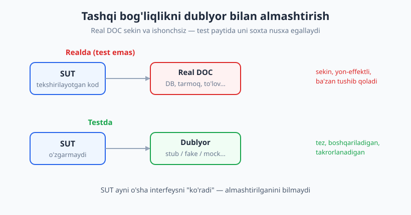
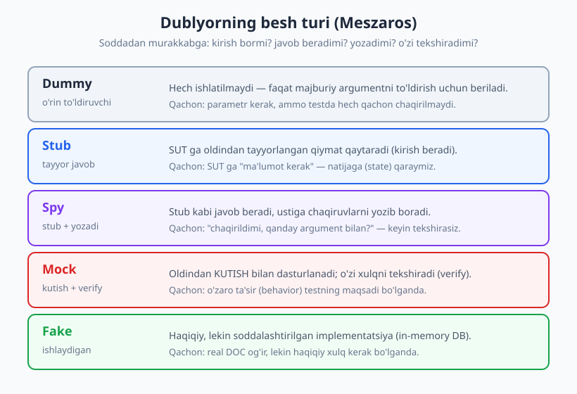
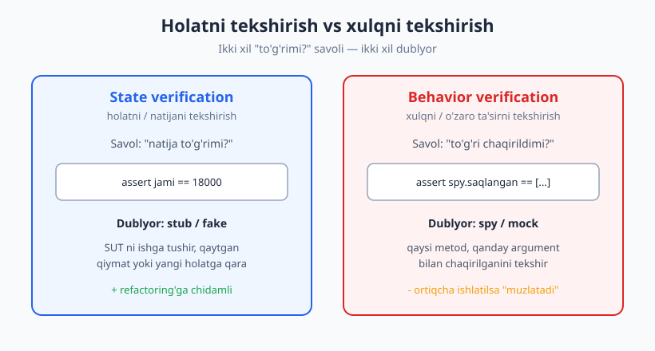

# 07 — Test dublyorlari I: taksonomiya

[🏠 README](./README.md) · [⬅️ Oldingi: 06 — Test ma'lumotlari: fixture, parametrize, builder](./06-fixture-parametrize.md) · [Keyingi: 08 — Test dublyorlari II: amaliyot va tuzoqlar ➡️](./08-test-dublyorlari-amaliyot.md)

---

> **Bu bobda:** kod tashqi dunyoga (ma'lumotlar bazasi, tarmoq, to'lov tizimi, vaqt) bog'langanda
> uni qanday qilib tez va ishonchli test qilish mumkin — uni **dublyor** (test double) bilan
> almashtirib. Gerard Meszaros'ning **besh turi** — dummy, stub, spy, mock, fake — ni aniq
> ajratamiz (ko'pchilik bularni chalkashtiradi). Hammasini sof Python klasslar bilan ko'rsatamiz.
>
> **Halollik / Eslatma:** bu bob — **nazariya va taksonomiya**. Bu yerda atamalarni va "qachon
> qaysi turni ishlatish" tushunchasini o'rnatamiz. `unittest.mock`, `patch`, side effect va
> ortiqcha mock tuzoqlari — keyingi **08-bobda** amaliyotda. "Don't mock what you don't own"
> tamoyilini ham bu yerda boshlaymiz, 08-bobda chuqurlashtiramiz. Barcha Python namunalari
> haqiqatan `pytest` bilan ishga tushirib, chiqishi tekshirilgan.

---

## Muammo: kod yolg'iz emas

Tasavvur qiling, `buyurtmani_yakunla()` funksiyasini yozdingiz. U mahsulot narxlarini
**ma'lumotlar bazasidan** oladi, jamini hisoblaydi, so'ng buyurtmani yana **bazaga saqlaydi**,
va xaridorga **email yuboradi**. Endi unga test yozmoqchisiz. Lekin:

- **Sekin** — har test real bazaga ulanadi, email serveriga so'rov yuboradi (sekundlar, minutlar).
- **Ishonchsiz** — tarmoq tushib qolsa, baza band bo'lsa, test "yiqiladi" — kodingiz aybsiz bo'lsa ham.
- **Yon-effektli** — har test ishga tushganda haqiqiy email ketadi, baza o'zgaradi. Buni xohlamaysiz.
- **Boshqarib bo'lmaydi** — "agar to'lov rad etilsa nima bo'ladi?" holatini real tizimda yuzaga keltirish qiyin.

Yechim — kino dublyori (caskadyor) kabi. Xavfli sahnada aktyor o'rniga dublyor tushadi: u xuddi
aktyorga o'xshaydi, kameraga o'sha rolni o'ynaydi, lekin haqiqiy emas. Testda ham real
ma'lumotlar bazasi o'rniga **dublyor** qo'yamiz: u o'sha interfeysni taqlid qiladi, lekin tez,
boshqariladigan va xavfsiz.



### SUT va DOC: ikkita asosiy atama

Dublyorlar haqida gaplashish uchun ikkita atama kerak:

- **SUT** (*System Under Test* — sinaladigan tizim): hozir test qilayotgan kodingiz. Bizning
  misolda — `buyurtma_jami()` funksiyasi.
- **DOC** (*Depended-On Component* — bog'liq komponent): SUT tayanadigan tashqi narsa. Bizning
  misolda — `Ombor` (baza). Aynan **DOC** ni dublyor bilan almashtiramiz, SUT ni emas.

> **Diqqat:** SUT hech qachon o'zgarmaydi. Biz uni **atrofini** o'zgartiramiz. Agar testni o'tkazish
> uchun SUT kodini o'zgartirishingizga to'g'ri kelsa — bu dizayn muammosi (10-bobda "testlanadigan
> dizayn"). Yaxshi loyihalashtirilgan kod DOC ni tashqaridan qabul qiladi (dependency injection),
> shuning uchun uni almashtirish oson bo'ladi.

---

## Besh tur: Meszaros taksonomiyasi

"Mock" so'zi kundalik tilda hamma soxta obyekt uchun ishlatiladi. Lekin Gerard Meszaros (*"xUnit
Test Patterns"* kitobi muallifi) ularni **beshta** aniq turga ajratdi. Bu farqni bilish muhim:
har turning o'z maqsadi bor, va noto'g'ri turni tanlash mo'rt yoki ma'nosiz testga olib keladi.

Umumiy atama — **Test Double** (test dublyori). Besh turi:

| Tur | Nima qiladi | Kirish beradimi? | Yozadimi? | O'zi tekshiradimi? |
|---|---|---|---|---|
| **Dummy** | hech narsa — o'rin to'ldiradi | yo'q | yo'q | yo'q |
| **Stub** | tayyor javob qaytaradi | ✅ ha | yo'q | yo'q |
| **Spy** | stub + chaqiruvlarni yozadi | ✅ ha | ✅ ha | yo'q (siz tekshirasiz) |
| **Mock** | kutish bilan dasturlanadi | ba'zan | ✅ ha | ✅ ha (o'zi verify) |
| **Fake** | ishlaydigan soddalashtirilgan nusxa | ✅ ha | ✅ ha | yo'q |



Endi har birini sof Python bilan ko'rsatamiz. Avval bizga umumiy bir interfeys kerak — `Ombor`.
Bu — bizning **DOC**:

```python
# Sinaladigan kod (production)
class Ombor:
    """Real ombor interfeysi. Test paytida bunga bog'lanmaymiz."""
    def narx(self, mahsulot_id):
        raise NotImplementedError
    def saqla(self, buyurtma):
        raise NotImplementedError

# SUT: savatchadagi har mahsulot narxini ombordan olib jamlaydi
def buyurtma_jami(ombor, savatcha):
    jami = 0
    for mahsulot_id, dona in savatcha.items():
        jami += ombor.narx(mahsulot_id) * dona
    return jami
```

### Dummy — faqat o'rin to'ldiruvchi

Dummy hech qachon ishlatilmaydi. U faqat bir funksiya/konstruktor **majburiy argument** talab
qilgani uchun beriladi, lekin shu test yo'lida hech qachon chaqirilmaydi.

```python
class DummyLogger:
    pass  # hech qachon chaqirilmaydi — faqat argumentni to'ldiradi

# Misol: funksiya logger talab qiladi, lekin bu testda log yo'li tegmaydi
hisobchi = Hisobchi(logger=DummyLogger())   # logger shunchaki "bor bo'lishi" kerak
```

> Agar dummy chaqirilsa (`NotImplementedError` yoki `AttributeError` bilan yiqilsa) — bu yaxshi
> signal: demak u aslida dummy emas edi, sizga stub kerak ekan.

### Stub — tayyor javob qaytaradi

Stub SUT ga **oldindan tayyorlangan** qiymat beradi. U "kirish" manbai: SUT ga ma'lumot uzatadi,
lekin hech narsa yozmaydi va tekshirmaydi.

```python
class OmborStub(Ombor):
    def __init__(self, narxlar):
        self._narxlar = narxlar
    def narx(self, mahsulot_id):
        return self._narxlar[mahsulot_id]   # tayyor javob
    def saqla(self, buyurtma):
        pass                                # stub uchun ahamiyatsiz
```

### Spy — stub ustiga yozuv

Spy stub kabi javob beradi, **lekin** qaysi chaqiruvlar bo'lganini yozib boradi. Keyin **siz**
testda o'sha yozuvni tekshirasiz.

```python
class OmborSpy(Ombor):
    def __init__(self, narxlar):
        self._narxlar = narxlar
        self.saqlangan = []                 # yozuv jurnali
    def narx(self, mahsulot_id):
        return self._narxlar[mahsulot_id]
    def saqla(self, buyurtma):
        self.saqlangan.append(buyurtma)     # chaqiruvni yozib boramiz
```

### Mock — kutish bilan dasturlangan, o'zi verify qiladi

Mock — eng "qattiq" tur. U **oldindan kutish** (expectation) bilan dasturlanadi: "`saqla()` aynan
shu argument bilan chaqirilishi kerak". Keyin **o'zi** tekshiradi (`verify`).

```python
class OmborMock(Ombor):
    def __init__(self, kutilgan_saqlash):
        self._kutilgan = kutilgan_saqlash
        self._haqiqiy = None
    def narx(self, mahsulot_id):
        return 0
    def saqla(self, buyurtma):
        self._haqiqiy = buyurtma
    def verify(self):                       # o'zi tekshiradi
        assert self._haqiqiy == self._kutilgan, \
            f"kutilgan {self._kutilgan}, lekin {self._haqiqiy}"
```

> **Stub va mock farqi (eng muhim nuqta):** ikkalasi ham soxta obyekt, lekin **maqsadi** boshqa.
> Stub test uchun **kirish** beradi (natijaga qaraysiz). Mock test uchun **tekshirilayotgan narsa**:
> uning chaqirilishi testning o'zi shart bo'lgan natija. "Bu obyekt qanday javob beradi" — stub.
> "Bu obyekt to'g'ri chaqirildimi" — mock.

### Fake — ishlaydigan, soddalashtirilgan nusxa

Fake — haqiqiy ishlovchi implementatsiya, lekin production'ga yaroqsiz darajada soddalashtirilgan.
Klassik misol — real ma'lumotlar bazasi o'rniga **xotiradagi lug'at** (in-memory).

```python
class FakeOmbor(Ombor):
    def __init__(self):
        self._narxlar = {}
        self._buyurtmalar = []
    def narx_ornat(self, mahsulot_id, qiymat):
        self._narxlar[mahsulot_id] = qiymat
    def narx(self, mahsulot_id):
        return self._narxlar[mahsulot_id]
    def saqla(self, buyurtma):
        self._buyurtmalar.append(buyurtma)  # haqiqatan saqlaydi (xotirada)
```

> **Eslatma:** fake'ning xulqi haqiqiy — yozsangiz keyin o'qiy olasiz. Stub'da bunday "yodda
> saqlash" mantig'i yo'q. Shuning uchun fake murakkab ssenariylar uchun (ko'p chaqiruv, holat
> o'zgarishi) eng realistik, lekin yozish ham qimmatroq.

---

## State verification vs behavior verification

Dublyor tanlash aslida bitta savolga bog'liq: **nimani tasdiqlamoqchisiz?**

- **State verification** (holatni tekshirish): SUT ni ishga tushiring va **qaytgan qiymat** yoki
  **yangi holat** to'g'rimi — shunga qarang. Bunga **stub** yoki **fake** mos.
- **Behavior verification** (xulqni tekshirish): SUT DOC bilan **qanday muloqot qildi** —
  qaysi metod, qanday argument bilan, necha marta chaqirildi — shunga qarang. Bunga **spy**
  yoki **mock** mos.



Bitta savatchada ikkalasini ham ko'raylik. Avval **state** (stub bilan):

```python
def test_jami_stub_bilan_natijani_tekshiradi():
    # Arrange
    ombor = OmborStub({"non": 5000, "sut": 8000})
    # Act
    jami = buyurtma_jami(ombor, {"non": 2, "sut": 1})
    # Assert — natijaga (holatga) qaraymiz
    assert jami == 18000
# -> PASSED
```

Endi **behavior** (spy bilan). Buning uchun yon-effektli SUT kerak — buyurtmani saqlaydigan:

```python
def buyurtmani_yakunla(ombor, savatcha):
    jami = buyurtma_jami(ombor, savatcha)
    ombor.saqla({"savatcha": savatcha, "jami": jami})   # yon-effekt
    return jami

def test_yakunlash_saqlashni_chaqiradi_spy_bilan():
    # Arrange
    spy = OmborSpy({"non": 5000})
    # Act
    buyurtmani_yakunla(spy, {"non": 3})
    # Assert — xulqqa qaraymiz: saqla() bir marta, to'g'ri jami bilan chaqirildi
    assert len(spy.saqlangan) == 1
    assert spy.saqlangan[0]["jami"] == 15000
# -> PASSED
```

Va **fake** ikkalasini ham qila oladi — natijani ham, saqlangan holatni ham:

```python
def test_yakunlash_fake_bilan_holat_va_yon_effekt():
    # Arrange
    ombor = FakeOmbor()
    ombor.narx_ornat("non", 5000)
    # Act
    jami = buyurtmani_yakunla(ombor, {"non": 2})
    # Assert — natija + saqlangan holat
    assert jami == 10000
    assert ombor._buyurtmalar[0]["jami"] == 10000
# -> PASSED
```

Uchchala test ham haqiqatan o'tdi:

```text
test_07.py::test_jami_stub_bilan_natijani_tekshiradi PASSED        [ 33%]
test_07.py::test_yakunlash_saqlashni_chaqiradi_spy_bilan PASSED    [ 66%]
test_07.py::test_yakunlash_fake_bilan_holat_va_yon_effekt PASSED   [100%]
======================== 3 passed in 0.97s ========================
```

> **Trade-off:** state verification odatda afzal — u **nima qilinganini** emas, **natijani**
> tasdiqlaydi, shuning uchun kod ichi o'zgarsa (refactoring) test buzilmaydi. Behavior verification
> esa ba'zida yagona yo'l: agar SUT faqat yon-effekt qilsa (email yuboradi, log yozadi) va qaytaradigan
> qiymati bo'lmasa, "to'g'ri chaqirildimi?" dan boshqa tekshiriladigan narsa yo'q. Lekin uni
> ortiqcha ishlatish testni implementatsiyaga "yopishtiradi" (pastda).

---

## Klassik vs London: ikki maktab

Qachon real obyekt, qachon dublyor ishlatish kerak? Bu savolda ikki "maktab" bor:

| | **Klassik** (Chicago / Detroit) | **London** (mockist) |
|---|---|---|
| Standart yondashuv | real obyektlardan foydalan | har bog'liqlikni mock qil |
| Dublyor qachon | faqat "noqulay" DOC uchun (DB, tarmoq) | deyarli har joyda |
| Asosiy verifikatsiya | state (natija) | behavior (o'zaro ta'sir) |
| Test izolyatsiyasi | unit = bir nechta klass birga | unit = bitta klass, qolgani mock |
| Afzalligi | refactoring'ga chidamli, realistik | aniq izolyatsiya, dizaynni "tashqaridan" haydaydi |
| Xavfi | yiqilish sababini topish qiyinroq | mo'rt testlar, dizaynni "muzlatadi" |

Klassik maktab: ichki obyektlarni **real** ishlat, faqat tashqi/sekin chegaralarni almashtir.
Natijaga qara. London maktab: har bir hamkorni mock qil, obyektlar bir-biri bilan **qanday
gaplashishini** test qil.

> **Trade-off — over-specification:** behavior verification (ayniqsa London uslubida) testni
> kodning **ichki tafsilotlariga** bog'lab qo'yadi. Misol: agar test "`saqla()` aniq shu tartibda,
> aniq shu argument bilan chaqirildi" deb tekshirsa, ertaga siz kodni xuddi o'sha natija bilan,
> lekin boshqacha yo'l bilan refactor qilsangiz — **test yiqiladi**, garchi xulq tashqaridan
> bir xil bo'lsa ham. Mock'lar shu ma'noda dizaynni "muzlatadi". Shuning uchun: **avval state'ni
> sina**, behavior'ni faqat zarur bo'lganda (sof yon-effekt) ishlat.

> **Eslatma:** bular "to'g'ri/noto'g'ri" emas — uslublar. Ko'p tajribali muhandislar aralash ishlatadi:
> domen mantig'i uchun klassik (real obyekt + state), tashqi chegaralar (to'lov, email) uchun
> behavior. Til-mustaqil: bu munozara JavaScript, Java, C# jamoalarida ham aynan shu nom bilan boradi.

---

## "Don't mock what you don't own" (kirish)

Bitta amaliy tamoyil bilan yakunlaymiz (08-bobda chuqurlashadi): **o'zingizniki bo'lmagan narsani
mock qilmang**. Ya'ni: tashqi kutubxona yoki uchinchi tomon API'sini to'g'ridan-to'g'ri mock
qilmang. Buning o'rniga uni o'zingizning yupqa **adapter** (o'rab oluvchi) interfeysingiz orqasiga
yashiring, va o'sha **sizniki** bo'lgan interfeysni dublyor bilan almashtiring.

Sababi oddiy: tashqi kutubxona ertaga API'sini o'zgartirsa, sizning mock hali ham eski shaklni
taqlid qiladi — test yashil bo'ladi, lekin production sinadi (mock realdan ajralib ketadi). O'z
interfeysingizni esa siz nazorat qilasiz. Bu yerda `Ombor` aynan shunday — bizning interfeysimiz,
SQLAlchemy yoki `psycopg`ning xom obyekti emas.

> Bu tamoyil va `unittest.mock` bilan amaliyot — to'liq 08-bobda. Hozircha shuni yodda tuting:
> dublyor o'rnatadigan chegara **sizning** kodingiz nazoratidagi interfeys bo'lsin.

---

## Asosiy g'oyalar (bobni qisqacha)

- **Tashqi bog'liqlik test uchun muammo** — sekin, ishonchsiz, yon-effektli. Yechim: DOC ni dublyor bilan almashtirish.
- **SUT o'zgarmaydi, DOC almashtiriladi.** Almashtirish oson bo'lishi uchun DOC ni tashqaridan uzating (DI).
- **Besh tur (Meszaros):** dummy (o'rin to'ldiruvchi), stub (tayyor javob), spy (stub + yozuv), mock (kutish + o'zi verify), fake (ishlaydigan soddalashtirilgan).
- **Stub ≠ mock.** Stub kirish beradi (natijaga qara). Mock — testning o'zi tekshiradigan narsa (chaqiruv).
- **State vs behavior:** stub/fake = holatni tekshir (natijaga qara); spy/mock = xulqni tekshir (chaqiruvga qara). State'ni afzal ko'r.
- **Klassik vs London:** real obyekt + state vs har joyda mock + behavior. Aralash ishlatish odatiy.
- **Over-specification xavfi:** behavior verification kodni implementatsiyaga bog'laydi va dizaynni "muzlatadi".
- **Don't mock what you don't own:** o'z adapter interfeysingizni dublyorla, xom tashqi kutubxonani emas.

---

## Mashqlar

### Oson

**1-mashq.** Quyidagi dublyorlar qaysi turga kiradi? (a) konstruktorga beriladigan, lekin hech
chaqirilmaydigan obyekt; (b) har doim `42` qaytaradigan obyekt; (c) yuborilgan emaillar ro'yxatini
to'playdigan obyekt.

**2-mashq.** "State verification" va "behavior verification" o'rtasidagi farqni bir jumlada ayting,
va har biriga qaysi dublyor turlari mos kelishini yozing.

**3-mashq.** `OmborStub` ni shunday yozingki, u faqat `"non"` uchun `5000` qaytarsin. `buyurtma_jami`
ni `{"non": 4}` savatcha bilan chaqirib, natija `20000` ekanini tasdiqlovchi test yozing.

### O'rta

**4-mashq.** `EmailSpy` klassi yozing: `yubor(kimga, matn)` metodi bo'lsin va u barcha yuborilgan
xatlarni `yuborilganlar` ro'yxatiga yozsin. Keyin bir foydalanuvchiga **ikkita** xat yuboradigan
SUT ni test qiling: spy'da aniq 2 ta xat borligini va birinchisi to'g'ri manzilga ketganini tekshiring.

**5-mashq.** Bitta `TolovStub` yozing, u `tasdiqla()` chaqirilganda `True` qaytarsin (muvaffaqiyatli
to'lov), va ikkinchi `TolovStub` yozing, u `False` qaytarsin (rad etilgan to'lov). Har biri bilan
SUT (`buyurtmani_jonat`) ning to'g'ri tarmoqlanishini ko'rsating.

**6-mashq.** `FakeOmbor` ga `o'chir(buyurtma_id)` metodini qo'shing. Saqlab, keyin o'chirib, so'ng
o'qishga urinilganda xato bo'lishini tasdiqlovchi test yozing (fake = ishlaydigan, holatli implementatsiya).

### Qiyin

**7-mashq.** Bir vaziyat: SUT `narx()` ni chaqiradi, natijani qaytaradi, **va** `saqla()` ni ham
chaqiradi. Buni (a) faqat **state** tekshiradigan test bilan, (b) faqat **behavior** tekshiradigan
test bilan yozing. Ikkala testni ham yozgach, qaysi biri kodni keyinchalik refactor qilganda
osonroq buzilishini va nima uchun ekanini tushuntiring (over-specification).

**8-mashq.** "Don't mock what you don't own" buzilgan stsenariyni keltirib chiqaring: tasavvur qiling,
tashqi `tolov_api.charge(...)` funksiyasini to'g'ridan-to'g'ri mock qildingiz, test yashil. Ertaga
kutubxona metodni `charge` dan `create_charge` ga o'zgartirdi. Nima bo'ladi? Endi bu xatoni
oldini oladigan adapter dizaynini (interfeys + ishlaydigan tekshiruv) yozing.

<details markdown="1">
<summary>Yechimlar</summary>

### 1-mashq yechimi

(a) **Dummy** — beriladi, lekin chaqirilmaydi. (b) **Stub** — tayyor (hardcode) javob qaytaradi.
(c) **Spy** — chaqiruvlarni (yuborilgan xatlarni) keyin tekshirish uchun yozib boradi.

### 2-mashq yechimi

State verification — SUT ishga tushgach **natija/holat** to'g'rimi (qaytgan qiymatga qaraysiz);
behavior verification — SUT DOC bilan **qanday muloqot qildi** (qaysi metod, qanday argument bilan
chaqirildi). State'ga **stub** va **fake**, behavior'ga **spy** va **mock** mos keladi.

### 3-mashq yechimi

```python
class OmborStub:
    def narx(self, mahsulot_id):
        return 5000   # faqat "non" uchun ishlatamiz

def buyurtma_jami(ombor, savatcha):
    return sum(ombor.narx(m) * d for m, d in savatcha.items())

def test_non_jami():
    jami = buyurtma_jami(OmborStub(), {"non": 4})
    assert jami == 20000
# -> PASSED
```

### 4-mashq yechimi

```python
class EmailSpy:
    def __init__(self):
        self.yuborilganlar = []
    def yubor(self, kimga, matn):
        self.yuborilganlar.append((kimga, matn))

def ikki_xat_yubor(email, manzil):
    email.yubor(manzil, "Salom")
    email.yubor(manzil, "Buyurtmangiz qabul qilindi")

def test_ikkita_xat_yuborildi():
    spy = EmailSpy()
    ikki_xat_yubor(spy, "ali@example.com")
    assert len(spy.yuborilganlar) == 2          # behavior: necha marta
    assert spy.yuborilganlar[0][0] == "ali@example.com"   # birinchisi to'g'ri manzilga
# -> PASSED
```

### 5-mashq yechimi

```python
class TolovTasdiq:
    def tasdiqla(self): return True
class TolovRad:
    def tasdiqla(self): return False

def buyurtmani_jonat(tolov):
    if tolov.tasdiqla():
        return "jonatildi"
    return "rad etildi"

def test_tolov_tasdiqlansa_jonatiladi():
    assert buyurtmani_jonat(TolovTasdiq()) == "jonatildi"

def test_tolov_rad_etilsa_jonatilmaydi():
    assert buyurtmani_jonat(TolovRad()) == "rad etildi"
# -> 2 passed
```

Ikki stub — ikki holat (state-based): har biri SUT ga turli kirish berib, tarmoqlanishni sinaydi.

### 6-mashq yechimi

```python
class FakeOmbor:
    def __init__(self):
        self._buyurtmalar = {}
        self._id = 1
    def saqla(self, buyurtma):
        bid = self._id
        self._buyurtmalar[bid] = buyurtma
        self._id += 1
        return bid
    def ochir(self, buyurtma_id):
        del self._buyurtmalar[buyurtma_id]
    def oqi(self, buyurtma_id):
        return self._buyurtmalar[buyurtma_id]

def test_ochirilgach_oqib_bolmaydi():
    ombor = FakeOmbor()
    bid = ombor.saqla({"mahsulot": "non"})
    ombor.ochir(bid)
    import pytest
    with pytest.raises(KeyError):
        ombor.oqi(bid)
# -> PASSED
```

Fake holatni haqiqatan boshqaradi — saqlash, o'chirish, o'qish ketma-ketligi real ishlaydi.

### 7-mashq yechimi

```python
class OmborSpy:
    def __init__(self):
        self.saqlangan = []
    def narx(self, m): return 5000
    def saqla(self, b): self.saqlangan.append(b)

def yakunla(ombor, savatcha):
    jami = sum(ombor.narx(m) * d for m, d in savatcha.items())
    ombor.saqla({"jami": jami})
    return jami

# (a) STATE — faqat natija
def test_state():
    spy = OmborSpy()
    jami = yakunla(spy, {"non": 2})
    assert jami == 10000

# (b) BEHAVIOR — chaqiruv
def test_behavior():
    spy = OmborSpy()
    yakunla(spy, {"non": 2})
    assert spy.saqlangan == [{"jami": 10000}]
# -> 2 passed
```

**Behavior testi (b) osonroq buziladi.** Agar ertaga `saqla()` ga uzatiladigan lug'atga yangi
maydon qo'shsangiz (masalan `{"jami": 10000, "sana": ...}`), `test_behavior` darhol yiqiladi —
chunki u **aniq shaklni** kutadi. `test_state` esa o'zgarmaydi: natija hali ham `10000`. Bu —
over-specification: behavior test kodning ichki tafsilotiga "yopishib" qoladi.

### 8-mashq yechimi

To'g'ridan-to'g'ri `tolov_api.charge` ni mock qilsangiz: kutubxona uni `create_charge` ga
o'zgartirgach, **mock hali ham eski `charge` ni taqlid qiladi**, test yashil — lekin production'da
`AttributeError`. Test sizni himoya qilmadi, chunki mock real bilan ajralib ketdi.

Yechim — o'zingizning adapter interfeysingiz (sizniki = mock qilishga ruxsat):

```python
# Sizning interfeysingiz (port) — buni nazorat qilasiz
class Tolov:
    def tasdiqla(self, summa):
        raise NotImplementedError

# Real adapter (production): tashqi API'ni o'rab oladi.
# Kutubxona charge -> create_charge bo'lsa, FAQAT shu yer o'zgaradi.
class RealTolov(Tolov):
    def __init__(self, api):
        self._api = api
    def tasdiqla(self, summa):
        return self._api.create_charge(summa)   # yangi nom — bitta joyda

# Test: SIZNING interfeysingizni dublyorlaymiz, xom kutubxonani emas
class TolovStub(Tolov):
    def tasdiqla(self, summa):
        return True

def buyurtmani_jonat(tolov, summa):
    return "jonatildi" if tolov.tasdiqla(summa) else "rad etildi"

def test_adapter_orqali():
    assert buyurtmani_jonat(TolovStub(), 10000) == "jonatildi"
# -> PASSED
```

Endi kutubxona API'si o'zgarsa — `RealTolov` ichida bitta qator tuzatiladi, testlaringizga
tegmaydi. Adapter "sizniki" bo'lgani uchun uni dublyorlash xavfsiz.

</details>

---

[🏠 README](./README.md) · [⬅️ Oldingi: 06 — Test ma'lumotlari: fixture, parametrize, builder](./06-fixture-parametrize.md) · [Keyingi: 08 — Test dublyorlari II: amaliyot va tuzoqlar ➡️](./08-test-dublyorlari-amaliyot.md)
