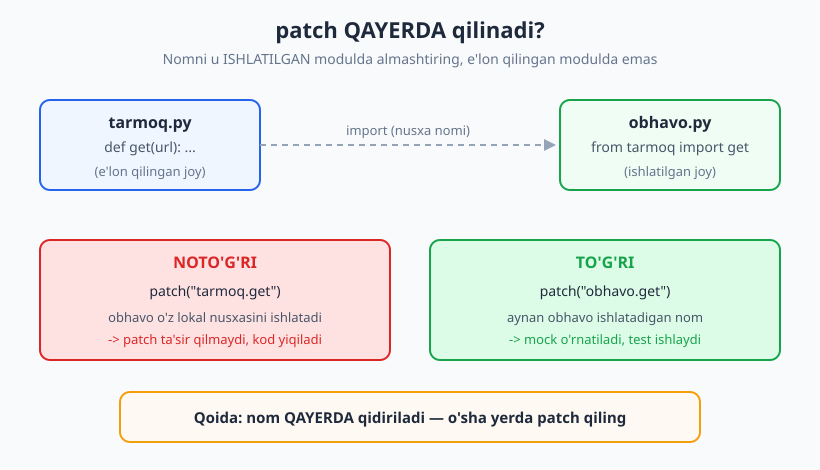
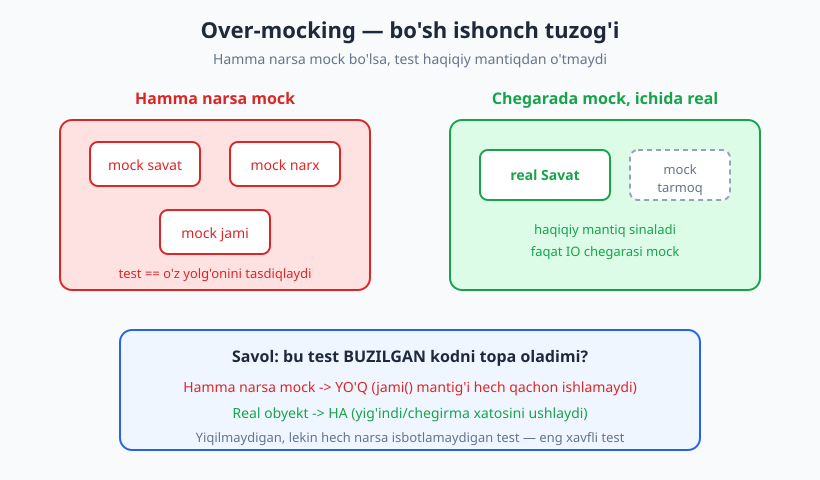
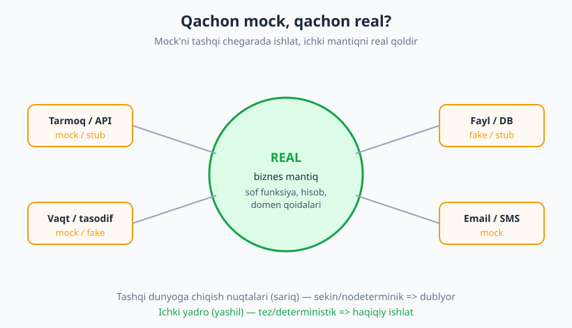

# 08 — Test dublyorlari II: amaliyot va tuzoqlar

[🏠 README](./README.md) · [⬅️ Oldingi: 07 — Test dublyorlari I: taksonomiya](./07-test-dublyorlari-nazariya.md) · [Keyingi: 09 — Bog'liqliklarni izolyatsiya ➡️](./09-bogliqliklarni-izolyatsiya.md)

---

> **Bu bobda:** [07-bobda](./07-test-dublyorlari-nazariya.md) nazariyani — dummy, stub, fake, spy, mock
> nima ekanini — ko'rdik. Endi ularni **amalda** quramiz: Python'ning standart `unittest.mock`
> kutubxonasi (`Mock`, `MagicMock`, `patch`) va pytest'ning `monkeypatch` fixture'i bilan. Eng
> muhimi — bu bobning yuragi — **tuzoqlar**: hammaga mock qo'yib qo'yib testni bo'sh ishonchga
> aylantirish (over-mocking), implementatsiyaga bog'lanib mo'rt test yozish, va "qaysi paytda
> umuman mock qilmaslik" kerakligini halol o'rganamiz.
>
> **Halollik / Eslatma:** mock — kuchli, lekin xavfli asbob. Bu bob sizni mock yozishga
> *o'rgatmaydi* xolos; balki **qachon mock yomon g'oya** ekanini ham aytadi. "PATCH QAYERDA"
> qoidasi (eng ko'p uchraydigan xato) ataylab batafsil. Til-mustaqil g'oyalar Python vositalari
> orqali ko'rsatilgan; oxirida JS/PHP/Java ko'priklari bor. **Barcha Python namunalari Python 3.14
> + pytest 9.0.3 da haqiqatan ishga tushirilib, chiqishi tekshirilgan.**

---

## Nazariyadan amaliyotga

[07-bobda](./07-test-dublyorlari-nazariya.md) test dublyorlarining besh turini ko'rib chiqdik.
Tilga tushadigan savol — *"buni qanday qilaman?"*. Python'da javob bitta standart kutubxonada:
**`unittest.mock`** (o'rnatish shart emas, standart kutubxonada). U bir nechta narsa qiladi:

| Vosita | Vazifa | Bob ichida |
|---|---|---|
| `Mock` / `MagicMock` | har qanday obyektni o'rnida ko'rinadigan dublyor yaratish | hozir |
| `return_value` | dublyor metodi nima qaytarishini belgilash (stub) | hozir |
| `side_effect` | istisno tashlash, ketma-ket qiymat, funksiya | hozir |
| `assert_called_*` | dublyor qanday chaqirilganini tekshirish (spy/mock) | hozir |
| `patch` | modul ichidagi nomni vaqtincha almashtirish | hozir |
| pytest `monkeypatch` | atribut/muhit/elementni almashtirish (fixture) | hozir |

> **Eslatma:** Python ekotizimida `pytest-mock` plagini ham mashhur (`mocker` fixture). Bu kitobda
> uni **ishlatmaymiz** — `pytest-mock` standart emas, o'rnatish kerak. Hammasi standart
> `unittest.mock` va pytest'ning ichki `monkeypatch`'i bilan. G'oyalar bir xil.

---

## `Mock` va `MagicMock`: hammaga "ha" deydigan obyekt

`Mock()` — bu shunday obyektki, undan **istalgan atribut yoki metodni so'rasangiz**, u shikoyat
qilmay yana bitta `Mock` qaytaradi. Ya'ni u sizning kodingiz nima qilmoqchi bo'lsa, shunga
"moslashadi". Bu stub yasashni juda osonlashtiradi.

```python
from unittest.mock import Mock, MagicMock


def test_mock_avtomatik_atribut():
    m = Mock()
    # Mock har qanday atribut/metodni avtomatik yaratadi
    natija = m.istalgan_metod(1, 2)
    assert isinstance(natija, Mock)
    # return_value bilan qaytish qiymatini belgilash
    m.hisobla.return_value = 42
    assert m.hisobla() == 42
    assert m.hisobla(99) == 42  # argumentdan qat'i nazar
# -> PASS
```

`return_value` — bu stub'ning yuragi: "qanday chaqirilishidan qat'i nazar, mana shu qiymatni
qaytar". Argumentlarga bog'liq emas.

### `Mock` vs `MagicMock`

`MagicMock` — `Mock`ning kuchaytirilgan ukasi: u **dunder (magic) metodlarni** ham qo'llab-quvvatlaydi
(`__len__`, `__getitem__`, `__iter__`, `__enter__`...). Oddiy `Mock` ularni qo'llab-quvvatlamaydi.

```python
from unittest.mock import MagicMock


def test_magicmock_dunder():
    mm = MagicMock()
    mm.__len__.return_value = 3
    assert len(mm) == 3        # Mock'da bu xato berardi
    mm.__getitem__.return_value = "x"
    assert mm[0] == "x"
# -> PASS
```

> **Amaliy qoida:** shubhalansangiz `MagicMock` ishlating (xavfsizroq, ko'proq narsani qo'llaydi).
> `patch` esa avtomatik `MagicMock` yaratadi, shuning uchun ko'p hollarda farqini o'ylab ham
> o'tirmaysiz.

---

## Chaqiruvni tekshirish: spy/mock tomoni

Stub kodga *kirish*ni boshqaradi (nima qaytarish). Mock/spy esa *chiqish*ni — kodingiz dublyorni
**qanday chaqirgani**ni — tekshiradi. Bu, ayniqsa, "yon ta'sir" (email yuborildimi, log yozildimi)
muhim bo'lganda kerak.

```python
from unittest.mock import Mock


# Sinaladigan kod
def xabar_yubor(yuboruvchi, foydalanuvchi, matn):
    yuboruvchi.send(foydalanuvchi.email, matn)


# Test kod
def test_chaqiruvni_tekshirish():
    yuboruvchi = Mock()
    foydalanuvchi = Mock(email="a@b.uz")

    xabar_yubor(yuboruvchi, foydalanuvchi, "Salom")          # Act

    yuboruvchi.send.assert_called_once_with("a@b.uz", "Salom")  # Assert
    assert yuboruvchi.send.call_count == 1
    args, kwargs = yuboruvchi.send.call_args     # call_args orqali argumentlarni o'qish
    assert args == ("a@b.uz", "Salom")
# -> PASS
```

Eng foydali tekshiruvlar:

| Metod / atribut | Ma'nosi |
|---|---|
| `assert_called_once_with(...)` | aynan bir marta, aynan shu argumentlar bilan chaqirilgan |
| `assert_called_with(...)` | oxirgi marta shu argumentlar bilan chaqirilgan |
| `assert_not_called()` | umuman chaqirilmagan |
| `call_count` | necha marta chaqirilgan (son) |
| `call_args` | oxirgi chaqiruv argumentlari `(args, kwargs)` |
| `call_args_list` | barcha chaqiruvlar ro'yxati |

`assert_not_called` — "bu yo'l bosilmasligi kerak edi" holatini tasdiqlash uchun zo'r:

```python
def test_assert_not_called():
    yuboruvchi = Mock()
    yuboruvchi.send.assert_not_called()   # hech narsa chaqirmadik
# -> PASS
```

> **Diqqat (oson xato):** `assert_called_once_with` o'rniga xato yozsangiz — masalan
> `assert_called_once` (with'siz) yoki hatto mavjud bo'lmagan `assert_called_onse` — `Mock`
> **shikoyat qilmaydi**, chunki u har qanday atributni avtomatik qabul qiladi! Test "yashil"
> bo'lib qoladi, lekin hech narsa tekshirmaydi. Yechim: nomni diqqat bilan yozing yoki
> `Mock(spec=...)` ishlating (pastda) — `spec` mavjud bo'lmagan metodga xato beradi.

---

## `side_effect`: stub'dan ko'proq

`return_value` doim bitta qiymat qaytaradi. `side_effect` esa uchta kuchli rejim beradi:

1. **Ketma-ket qiymatlar** (ro'yxat) — har chaqiruvda navbatdagi element.
2. **Istisno** — chaqirilganda exception tashlash (xato holatlarini sinash).
3. **Funksiya** — argumentga qarab dinamik javob.

```python
from unittest.mock import Mock


def test_ketma_ket_qiymatlar():
    klient = Mock()
    klient.get.side_effect = [10, 20, 30]
    assert klient.get() == 10
    assert klient.get() == 20
    assert klient.get() == 30
# -> PASS
```

Eng amaliy holat — **tarmoq xatosini simulyatsiya qilish**. Faraz qiling, kodingiz tarmoq uzilsa
3 marta qayta uringan bo'lsin. Buni real tarmoqsiz qanday sinaymiz? `side_effect` bilan:

```python
from unittest.mock import Mock


# Sinaladigan kod: tarmoq xatosida 3 marta qayta urinadi
def malumot_ol(klient):
    for urinish in range(3):
        try:
            return klient.get("/narx")
        except ConnectionError:
            continue
    raise RuntimeError("3 urinishdan keyin ham bog'lanib bo'lmadi")


# Test: birinchi 2 urinishda xato, 3-da muvaffaqiyat
def test_qayta_urinish_tarmoq_xatosi():
    klient = Mock()
    klient.get.side_effect = [ConnectionError, ConnectionError, 5000]
    natija = malumot_ol(klient)
    assert natija == 5000
    assert klient.get.call_count == 3
# -> PASS
```

`side_effect` ro'yxatidagi istisno **klassi** (yoki nusxasi) chaqirilganda `raise` qilinadi, oddiy
qiymat esa qaytariladi. Funksiya bersangiz, u real argumentlar bilan ishga tushadi:

```python
def test_funksiya_side_effect():
    klient = Mock()

    def soxta(url):
        return f"javob:{url}"

    klient.get.side_effect = soxta
    assert klient.get("/x") == "javob:/x"
# -> PASS
```

> **Trade-off:** `side_effect` bilan murakkab mantiq yozish vasvasasi bor. Lekin agar dublyoringiz
> ichida `if/else` va holat paydo bo'lsa — bu allaqachon **fake** (07-bob), va ehtimol uni
> alohida sodda klass sifatida yozgan ma'qul. Mock'ni murakkablashtirgani sari test o'qilishi
> tushadi.

---

## `patch`: nomni vaqtincha almashtirish

Yuqoridagi misollarda biz dublyorni **qo'lda** uzatdik (`malumot_ol(klient)`). Bu eng yaxshi yo'l —
[10-bobda](./10-testlanadigan-dizayn.md) buni dependency injection deb ataymiz. Lekin ba'zan kod
bog'liqlikni o'zi ichidan oladi (`requests.get(...)` to'g'ridan-to'g'ri chaqiriladi). Ana shunda
`patch` kerak: u modul ichidagi nomni test davomida vaqtincha almashtiradi va keyin tiklaydi.

`patch`ni dekorator yoki kontekst-menejer sifatida ishlatish mumkin:

```python
from unittest.mock import patch

# kontekst-menejer shakli
with patch("modul.funksiya") as soxta:
    soxta.return_value = ...
    ...
# blokdan chiqqach asl funksiya tiklanadi
```

### PATCH QAYERDA? (eng ko'p uchraydigan xato)

Bu — Python'da mock bilan ishlovchilar **eng tez-tez** qoqiladigan joy. Qoida:

> **Obyekt ISHLATILGAN joyda patch qilinadi, E'LON QILINGAN joyda emas.**



Buni jonli misolda ko'raylik. Ikki fayl bor. Past darajadagi `tarmoq` moduli (uni "uchinchi tomon"
deb tasavvur qiling):

```python
# tarmoq.py
def get(url):
    # haqiqatda tarmoqqa chiqadi — testda buni xohlamaymiz
    raise RuntimeError("haqiqiy tarmoq chaqiruvi: " + url)
```

Va uni ishlatadigan `obhavo` moduli — **`from tarmoq import get`** bilan, ya'ni `get` nomining
nusxasi `obhavo` ichiga ko'chirildi:

```python
# obhavo.py
from tarmoq import get


def harorat(shahar):
    javob = get(f"https://api.obhavo.uz/{shahar}")
    return javob["harorat"]
```

Endi diqqat. Quyidagi test `tarmoq.get`ni patch qiladi — bu **noto'g'ri joy**, chunki `obhavo`
allaqachon o'zining lokal `get` nusxasiga ega. Natijada haqiqiy kod ishlaydi va `RuntimeError`
tashlanadi:

```python
from unittest.mock import patch
import obhavo


# NOTO'G'RI: nom e'lon qilingan modulda (tarmoq) patch qilinadi
def test_notogri_joy_yiqiladi():
    with patch("tarmoq.get", return_value={"harorat": 25}):
        try:
            obhavo.harorat("toshkent")
            assert False, "RuntimeError kutilgan edi (patch ishlamadi)"
        except RuntimeError:
            pass  # patch noto'g'ri joyda -> haqiqiy get chaqirildi


# TO'G'RI: nom ISHLATILGAN modulda (obhavo) patch qilinadi
def test_togri_joy_ishlaydi():
    with patch("obhavo.get", return_value={"harorat": 25}):
        assert obhavo.harorat("toshkent") == 25
# -> ikkala test ham PASS
```

Mana shu — sabab. `from X import Y` qilganingizda `Y` endi **sizning modulingizdagi alohida nom**.
`X.Y`ni almashtirsangiz, sizning nusxangiz o'zgarmaydi. Shuning uchun doim **"kim ishlatyapti?"**
deb so'rang va o'sha modulning yo'lini patch qiling: `patch("obhavo.get")`.

> **Diqqat:** agar `obhavo` o'rniga `import tarmoq` qilib, `tarmoq.get(...)` deb chaqirsa, unda
> `patch("obhavo.tarmoq.get")` (yoki bevosita `patch("tarmoq.get")`) ishlaydi, chunki `obhavo`
> butun modulga havola saqlaydi. Tafsilot muhim emas — qoida bir xil: **ishlatilgan yo'lni** patch
> qiling.

---

## pytest `monkeypatch` fixture

`patch` — `unittest.mock`dan. pytest esa o'zining yengil muqobilini beradi: **`monkeypatch`**
fixture. U atribut, muhit o'zgaruvchisi yoki lug'at elementini almashtiradi va test tugagach
**avtomatik tiklaydi** (qo'lda `with` blokisiz). Test funksiyasiga `monkeypatch` parametrini
qo'shsangiz, pytest uni o'zi uzatadi.

```python
import os
import obhavo


# setattr — atributni almashtirish
def test_setattr(monkeypatch):
    def soxta_get(url):
        return {"harorat": 30}
    monkeypatch.setattr(obhavo, "get", soxta_get)
    assert obhavo.harorat("buxoro") == 30


# setenv — muhit o'zgaruvchisi
def kerakli_kalit():
    return os.environ["API_KALIT"]


def test_setenv(monkeypatch):
    monkeypatch.setenv("API_KALIT", "test-123")
    assert kerakli_kalit() == "test-123"
    # test tugagach monkeypatch hamma narsani avtomatik tiklaydi
# -> ikkala test ham PASS
```

| `monkeypatch` metodi | Vazifa |
|---|---|
| `setattr(obyekt, "nom", qiymat)` | atribut/metodni almashtirish |
| `delattr(obyekt, "nom")` | atributni vaqtincha o'chirish |
| `setenv("NOM", "qiymat")` / `delenv` | muhit o'zgaruvchisi |
| `setitem(lugat, kalit, qiymat)` | lug'at elementi |
| `chdir(yol)` | joriy katalogni vaqtincha o'zgartirish |

> **Trade-off — `patch` vs `monkeypatch`:** `monkeypatch` o'qishga sodda va tiklanish avtomatik,
> lekin u **spy/mock emas** — chaqiruvni tekshirib bermaydi (`assert_called_*` yo'q). Agar
> "qanday chaqirildi"ni tekshirmoqchi bo'lsangiz, `monkeypatch.setattr` ichiga `Mock` qo'ying
> yoki `patch` ishlating. Atribut/muhitni shunchaki almashtirish kerak bo'lsa — `monkeypatch`
> qulayroq.

---

## Tuzoqlar — bu bobning yuragi

Mock — o'tkir pichoq. To'g'ri ishlatsangiz, sekin/nodeterministik chegaralarni kesib tashlaysiz.
Noto'g'ri ishlatsangiz, o'zingizni kesasiz: testlar yashil bo'lib turadi, lekin **hech narsani
himoya qilmaydi**. Quyidagi to'rt tuzoqni halol ko'rib chiqamiz.

### Tuzoq 1: Over-mocking (hamma narsani mock qilish)

Eng katta tuzoq. Hamma narsani mock qilsangiz, oxir-oqibat **faqat o'z mock'laringizni**
tekshirib qolasiz — test hech qanday haqiqiy mantiqdan o'tmaydi.



```python
from unittest.mock import Mock


# Sinaladigan kod: savat narxini chegirma bilan yig'adi
class Savat:
    def __init__(self):
        self.mahsulotlar = []

    def qoshish(self, narx, soni):
        self.mahsulotlar.append((narx, soni))

    def jami(self, chegirma=0.0):
        s = sum(narx * soni for narx, soni in self.mahsulotlar)
        return s * (1 - chegirma)


# ❌ YOMON: hamma narsa mock. Bu test Savat mantig'i haqida HECH NARSA isbotlamaydi.
def test_yomon_over_mock():
    savat = Mock()
    savat.jami.return_value = 17000   # biz o'zimiz "javob"ni yozdik
    assert savat.jami() == 17000      # faqat o'z yolg'onimizni tasdiqladik
# -> PASS (lekin foydasiz!)


# ✅ YAXSHI: real obyekt — haqiqiy mantiqni tekshiramiz
def test_yaxshi_real():
    savat = Savat()
    savat.qoshish(5000, 2)            # 10000
    savat.qoshish(7000, 1)            # 7000
    assert savat.jami() == 17000
    assert savat.jami(chegirma=0.1) == 15300.0
# -> PASS (va haqiqatan himoya qiladi)
```

Sinov savoli har doim bitta: **"bu test kodimni buzsam, yiqiladimi?"** `jami()` ichidagi `+`ni `-`
bilan almashtiring. `test_yomon_over_mock` baribir yashil qoladi (chunki `jami` mock). 
`test_yaxshi_real` esa darrov yiqiladi. Ikkinchisi — haqiqiy test. (Bu g'oyani
[22-bobdagi mutation testing](./22-mutation-testing.md) rasmiylashtiradi: testlaringizni testlash.)

### Tuzoq 2: Mock implementatsiyaga bog'lanadi (fragile/mo'rt test)

Yaxshi test **xulqni** tekshiradi ("natija to'g'ri"), implementatsiyani emas ("falon metod 2 marta
chaqirildi"). Chaqiruv sonini qattiq tekshirsangiz, kodni **refactoring** qilganingizda —
tashqi xulq o'zgarmasa ham — test yiqiladi. Bu mo'rt (fragile) test.

```python
from unittest.mock import Mock


class Hisobchi:
    def __init__(self, ombor):
        self.ombor = ombor

    def umumiy_qiymat(self):
        # ESKI implementatsiya: har mahsulot uchun alohida so'rov
        jami = 0
        for idy in self.ombor.idlar():
            jami += self.ombor.narx(idy)
        return jami


# ❌ FRAGILE: narx() aynan 2 marta chaqirilganini tekshiradi (implementatsiya tafsiloti)
def test_fragile():
    ombor = Mock()
    ombor.idlar.return_value = [1, 2]
    ombor.narx.side_effect = [100, 200]
    h = Hisobchi(ombor)
    assert h.umumiy_qiymat() == 300     # xulq
    assert ombor.narx.call_count == 2   # <- mana shu qator testni mo'rt qiladi
# -> PASS (hozircha)
```

Endi `Hisobchi`ni tezlik uchun **refactoring** qilamiz — bitta to'plamli so'rovga o'tamiz. Tashqi
xulq **aynan o'sha** (`umumiy_qiymat() == 300`), lekin `narx()` boshqa usulda chaqiriladi:

```python
class Hisobchi:
    def umumiy_qiymat(self):
        return sum(self.ombor.narxlar())   # endi narx() umuman chaqirilmaydi
```

Xuddi shu fragile test endi **yiqiladi**, garchi dastur to'g'ri ishlasa ham:

```text
>       assert ombor.narx.call_count == 2     # lekin bu yiqiladi -> 0 != 2
E       AssertionError: assert 0 == 2
E        +  where 0 = <Mock name='mock.narx'>.call_count
1 failed in 0.65s
```

`assert h.umumiy_qiymat() == 300` bizga kerakli ishonchni beradi. `assert ...call_count == 2`
esa shunchaki **shovqin** — refactoring vaqtida ovqat to'lab beradi. Mockning chaqiruvini faqat
chaqiruvning **o'zi xulqning bir qismi** bo'lganda tekshiring (masalan "email aynan bir marta
yuborilganmi" — takror yuborish foydalanuvchiga ko'rinadigan xulq).

> **Qoida:** chiqishni (qaytgan qiymat, holat o'zgarishi) tekshiring; ichki chaqiruv ketma-ketligini
> emas. [13-bobda](./13-refactoring-va-testlar.md) "refactoring vaqtida testlar o'zgarmasligi
> kerak" tamoyilini chuqurroq ko'ramiz.

### Tuzoq 3: "Don't mock what you don't own"

Uchinchi tomon kutubxonasini (`requests`, to'lov SDK, bulut klienti) **to'g'ridan-to'g'ri** mock
qilmang. Sabablar: (1) ularning API'si versiyada o'zgaradi — mockingiz eskiradi, lekin test yashil
qoladi (yolg'on ishonch); (2) siz ularning *haqiqiy* xulqini bilmaysiz, faqat *taxminingizni* mock
qilasiz. Yechim — **o'z adapteringizni** (port/interfeys) yozing va **uni** mock qiling.

```python
from unittest.mock import Mock


# O'z adapteringiz: tashqi tarmoq tafsilotlarini yashiradi (port/interfeys)
class ObhavoManbasi:
    def harorat(self, shahar):    # bizning sodda interfeysimiz
        raise NotImplementedError


# Biznes mantiq adapter interfeysiga bog'lanadi, requests'ga emas
def kiyim_tavsiyasi(manba, shahar):
    t = manba.harorat(shahar)
    return "issiq" if t < 10 else "yengil"


# Test: O'Z interfeysimizni mock qilamiz (uchinchi tomonni emas)
def test_o_z_adapterini_mock():
    manba = Mock(spec=ObhavoManbasi)   # spec=... -> faqat mavjud metodlarga ruxsat
    manba.harorat.return_value = 5
    assert kiyim_tavsiyasi(manba, "toshkent") == "issiq"
    manba.harorat.return_value = 22
    assert kiyim_tavsiyasi(manba, "toshkent") == "yengil"
# -> PASS
```

E'tibor bering: `Mock(spec=ObhavoManbasi)` — `spec` mockni real interfeys "qolipi"ga moslaydi.
Endi `manba.mavjud_emas_metod()` chaqirsangiz, mock xato beradi (oddiy `Mock` jimgina yutib
yuborardi). Bu Tuzoq 1'dagi "harf xatosi yashil qoladi" muammosini ham yopadi.

> **Ko'prik:** o'z adapteringiz uchun yana **bitta** integratsiya testi yozasiz — u haqiqiy
> kutubxona bilan ishlaydi va versiya o'zgarsa yiqiladi. Bu naqsh —
> [10-bobdagi portlar/adapterlar](./10-testlanadigan-dizayn.md) va
> [15-bobdagi integratsiya testlari](./15-integratsiya-testlari.md) mavzusi. Shu sababli sizning
> kod yadrongiz tez unit testlar bilan, chegara esa kam sonli integratsiya testi bilan qoplanadi.

### Tuzoq 4: Qachon mock QILMASLIK

Mock — chegaralar (tarmoq, vaqt, fayl, tasodif) uchun. **Sof funksiya** yoki **oddiy ma'lumot**
uchun mock — ortiqcha murakkablik va yolg'on ishonch. Ularni shunchaki real ishlating.

```python
from unittest.mock import Mock


# Sof funksiya — bog'liqlik yo'q, mock kerak emas
def soliq(summa):
    return round(summa * 0.12, 2)


# ❌ YOMON: sof funksiya uchun mock — ma'nosiz, hech narsa testlanmadi
def test_yomon_sof_funksiya_mock():
    m = Mock()
    m.soliq.return_value = 12.0
    assert m.soliq(100) == 12.0


# ✅ YAXSHI: sof funksiyani real chaqiramiz
def test_yaxshi_real_sof_funksiya():
    assert soliq(100) == 12.0
    assert soliq(0) == 0.0
    assert soliq(99.99) == 12.0    # round() chegara tekshiruvi
# -> PASS
```

Sof funksiya — tez, deterministik, yon ta'sirsiz. Uni mock qilish faqat zarar: kodni o'zgartirsangiz
ham mock eski javobni qaytaraveradi.

---

## Umumiy tamoyil: chegarada mock, ichida real

Hamma tuzoqlardan bitta yo'riq chiqadi: **dublyorni dasturning tashqi chegaralarida ishlat,
ichki mantiqni esa real qoldir.** Tarmoq, vaqt, tasodif, fayl, ma'lumotlar bazasi — bularni
sekin/nodeterministik bo'lgani uchun mock qiling. Biznes qoidalari, hisob-kitob, sof funksiyalar —
ularni haqiqiy ishlating, chunki aynan ular xato qiladi.



> **Eslatma (til-mustaqil ko'prik):** bularning hammasi til-mustaqil g'oya.
> JS'da `jest.fn()` / `vi.fn()` = `Mock`, `jest.mock("modul")` = `patch`, `mockReturnValue` =
> `return_value`, `mockImplementation` = `side_effect`(funksiya). PHP'da `Mockery` yoki PHPUnit
> `createMock()` / `$mock->method(...)->willReturn(...)`. Java'da `Mockito`: `mock()`,
> `when(...).thenReturn(...)`, `verify(...)`. "PATCH QAYERDA" muammosi har bir tilda — modul/import
> mexanikasiga qarab — boshqacha ko'rinadi, lekin mohiyat bir xil: **dublyor real obyekt o'rniga
> o'tishi kerak.**

---

## Asosiy g'oyalar (bobni qisqacha)

- **`unittest.mock` standart** — `Mock`/`MagicMock`, `return_value` (stub), `side_effect` (ketma-ket
  qiymat / istisno / funksiya). `MagicMock` dunder metodlarni ham qo'llaydi.
- **Chaqiruvni tekshirish** — `assert_called_once_with`, `call_count`, `call_args`,
  `assert_not_called` mock/spy tomonini beradi. Lekin faqat chaqiruv xulqning bir qismi bo'lsa.
- **PATCH QAYERDA** — nomni **ishlatilgan** modulda patch qiling, **e'lon qilingan**da emas.
  `from x import y` nom nusxasini ko'chiradi — `patch("sizning_modul.y")`. Bu eng ko'p uchraydigan xato.
- **`monkeypatch`** — pytest fixture'i atribut/muhit/elementni almashtiradi va avtomatik tiklaydi;
  lekin `assert_called_*` bermaydi.
- **Over-mocking** — hamma narsani mock qilsangiz, faqat o'z mock'laringizni testlaysiz. Sinov:
  "kodimni buzsam test yiqiladimi?".
- **Mock implementatsiyaga bog'lanmasin** — chiqishni tekshiring, ichki chaqiruv ketma-ketligini
  emas; aks holda refactoringda mo'rt testlar yiqiladi.
- **Don't mock what you don't own** — uchinchi tomonni emas, **o'z adapteringiz**ni mock qiling
  (`spec=...` bilan); chegara uchun alohida integratsiya testi.
- **Sof funksiya / oddiy ma'lumotni mock qilmang** — real ishlating. Umumiy yo'riq:
  **chegarada mock, ichida real.**

---

## Mashqlar

### Oson

**1-mashq.** `Mock` yarating va `hisobla` metodi har doim `100` qaytarsin. Keyin `hisobla(1, 2, 3)`
ham `100` qaytarishini tasdiqlang. Nega argumentga bog'liq emasligini bir jumlada tushuntiring.

**2-mashq.** Bitta `Mock` (`logger`) bering. `logger.info("boshlandi")`ni chaqiruvchi kod yozing va
`assert_called_once_with("boshlandi")` bilan tekshiring. Keyin `logger.error`
`assert_not_called()` ekanini tasdiqlang.

**3-mashq.** `side_effect`'ga `[1, 2, ValueError]` bering. Birinchi ikki chaqiruv `1` va `2`
qaytarishini, uchinchi chaqiruv `ValueError` tashlashini tasdiqlang.

### O'rta

**4-mashq.** `bildirishnoma.py` moduli `from soat import hozir` qiladi va `hozir()`ni chaqiradi.
Test yozing: `hozir`ni patch qilib "soat 09:00" qaytarsin. **Qaysi yo'lni** patch qilasiz —
`patch("soat.hozir")` yoki `patch("bildirishnoma.hozir")`? Nega? (shu bobdagi "PATCH QAYERDA"
qoidasiga tayaning.)

**5-mashq.** `monkeypatch` bilan `TIL` muhit o'zgaruvchisini `"uz"`ga o'rnating va uni o'qiydigan
funksiyani sinang. Test tugagach o'zgaruvchi avtomatik tiklanishini (boshqa test ko'rmasligini)
bir jumlada izohlang.

**6-mashq.** Quyidagi test over-mocking tuzog'iga tushgan. Uni real obyekt ishlatadigan, haqiqiy
mantiqni tekshiradigan testga qayta yozing:

```python
def test_yomon():
    foiz = Mock()
    foiz.hisobla.return_value = 20
    assert foiz.hisobla(100) == 20
```

(Faraz: `foizni_hisobla(summa)` = `summa * 0.2`.)

### Qiyin

**7-mashq.** Sizga `xizmat.py` berilgan:

```python
class Xizmat:
    def __init__(self, klient):
        self.klient = klient

    def jami_xarid(self, foydalanuvchi_id):
        buyurtmalar = self.klient.buyurtmalar(foydalanuvchi_id)
        return sum(b["narx"] for b in buyurtmalar)
```

(a) `klient`ni mock qilib, ikki buyurtma uchun yig'indi to'g'ri ekanini tekshiring. (b) Endi
implementatsiyaga bog'langan (fragile) **bitta assertion** yozing, keyin uni nega olib tashlash
kerakligini tushuntiring.

**8-mashq.** Loyihangizda to'lov SDK'si (`stripe.Charge.create(...)`) bor. "Don't mock what you
don't own" tamoyiliga ko'ra qanday qayta tashkil qilasiz? Qaysi narsani mock qilasiz, qaysi narsa
uchun integratsiya testi qoldirasiz? Sxema (matn) chizing va qaror sababini yozing.

<details markdown="1">
<summary>Yechimlar</summary>

### 1-mashq yechimi

```python
from unittest.mock import Mock


def test_yechim_1():
    m = Mock()
    m.hisobla.return_value = 100
    assert m.hisobla() == 100
    assert m.hisobla(1, 2, 3) == 100
# -> PASS
```

`return_value` argumentlarga e'tibor bermaydi — u "qanday chaqirilishidan qat'i nazar, shu qiymatni
qaytar" degani. Argumentga bog'liq javob kerak bo'lsa, `side_effect`'ga funksiya bering.

### 2-mashq yechimi

```python
from unittest.mock import Mock


def jarayon(logger):
    logger.info("boshlandi")


def test_yechim_2():
    logger = Mock()
    jarayon(logger)
    logger.info.assert_called_once_with("boshlandi")
    logger.error.assert_not_called()
# -> PASS
```

### 3-mashq yechimi

```python
from unittest.mock import Mock


def test_yechim_3():
    m = Mock()
    m.olish.side_effect = [1, 2, ValueError]
    assert m.olish() == 1
    assert m.olish() == 2
    try:
        m.olish()
        assert False, "ValueError kutilgan edi"
    except ValueError:
        pass
# -> PASS
```

`side_effect` ro'yxatidagi oddiy qiymat qaytariladi, istisno klassi esa `raise` qilinadi.

### 4-mashq yechimi

`patch("bildirishnoma.hozir")` to'g'ri. Sabab: `bildirishnoma` moduli `from soat import hozir`
qilgani uchun `hozir` nomining **alohida nusxasi** `bildirishnoma` ichida yashaydi. `soat.hozir`ni
almashtirsangiz, bu nusxa o'zgarmaydi — kod baribir asl `hozir`ni chaqiradi. Nomni doim
**u ishlatilgan** modulda patch qiling.

```python
from unittest.mock import patch
import bildirishnoma

def test_yechim_4():
    with patch("bildirishnoma.hozir", return_value="09:00"):
        ...   # bildirishnoma endi soxta "09:00"ni ko'radi
```

(Agar modul `import soat` qilib `soat.hozir()` deb chaqirsa, u holda `patch("soat.hozir")` ham
ishlardi — chunki modulga havola saqlanadi.)

### 5-mashq yechimi

```python
import os


def joriy_til():
    return os.environ.get("TIL", "en")


def test_yechim_5(monkeypatch):
    monkeypatch.setenv("TIL", "uz")
    assert joriy_til() == "uz"
# -> PASS
```

`monkeypatch` o'rnatgan har bir o'zgarishni test tugagach **avtomatik tiklaydi**. Shu sababli
keyingi test `TIL`ning eski (yoki yo'q) holatini ko'radi — testlar bir-biriga ta'sir qilmaydi
(test izolyatsiyasi, 04-bob).

### 6-mashq yechimi

```python
def foizni_hisobla(summa):
    return summa * 0.2


def test_yechim_6():
    assert foizni_hisobla(100) == 20
    assert foizni_hisobla(0) == 0
# -> PASS
```

Real funksiyani chaqiramiz. Endi `* 0.2`ni `* 0.3`ga o'zgartirsangiz, test darrov yiqiladi —
ya'ni test haqiqatan himoya qiladi. Mock variantida bu o'zgarishni hech kim sezmasdi.

### 7-mashq yechimi

```python
from unittest.mock import Mock
from xizmat import Xizmat


# (a) xulqni tekshiramiz
def test_jami_xarid():
    klient = Mock()
    klient.buyurtmalar.return_value = [{"narx": 100}, {"narx": 250}]
    x = Xizmat(klient)
    assert x.jami_xarid(7) == 350
# -> PASS


# (b) fragile assertion (qo'shmang):
#     assert klient.buyurtmalar.call_count == 1
```

`call_count == 1` — implementatsiya tafsiloti. Agar `jami_xarid` keyinchalik keshlash yoki
sahifalash (bir nechta chaqiruv) qilsa, tashqi natija `350` o'zgarmasa ham bu assertion yiqiladi.
Faqat **qaytgan summa**ni tekshiring — u xulq, qolgani shovqin.

### 8-mashq yechimi

`stripe.Charge.create`ni to'g'ridan-to'g'ri mock **qilmaymiz** (don't mock what you don't own).
O'rniga o'z adapterimizni kiritamiz:

```text
Biznes mantiq ──> TolovPorti (bizning interfeys: tola(summa) -> Kvitansiya)
                       │
              ┌────────┴────────┐
   StripeTolov (real adapter)   SoxtaTolov (test fake)
   stripe.Charge.create()       xotirada kvitansiya qaytaradi
```

- **Unit testlar:** biznes mantiqni `SoxtaTolov` (yoki `Mock(spec=TolovPorti)`) bilan sinaymiz —
  tez, tarmoqsiz, Stripe API'siga bog'liq emas.
- **Integratsiya testi (1–2 ta):** `StripeTolov`ni Stripe'ning test rejimida real chaqiramiz —
  versiya yoki API o'zgarsa shu yerda yiqiladi.

Sabab: biz "o'zimiznikini" (`TolovPorti`) mock qilamiz — uning kontraktini biz boshqaramiz.
Stripe'ning haqiqiy xulqini esa taxmin qilmay, real integratsiya testida tekshiramiz. Natijada
testlar barqaror, lekin chegara baribir qoplangan. ([10](./10-testlanadigan-dizayn.md) va
[15-bob](./15-integratsiya-testlari.md).)

</details>

---

[🏠 README](./README.md) · [⬅️ Oldingi: 07 — Test dublyorlari I: taksonomiya](./07-test-dublyorlari-nazariya.md) · [Keyingi: 09 — Bog'liqliklarni izolyatsiya ➡️](./09-bogliqliklarni-izolyatsiya.md)
