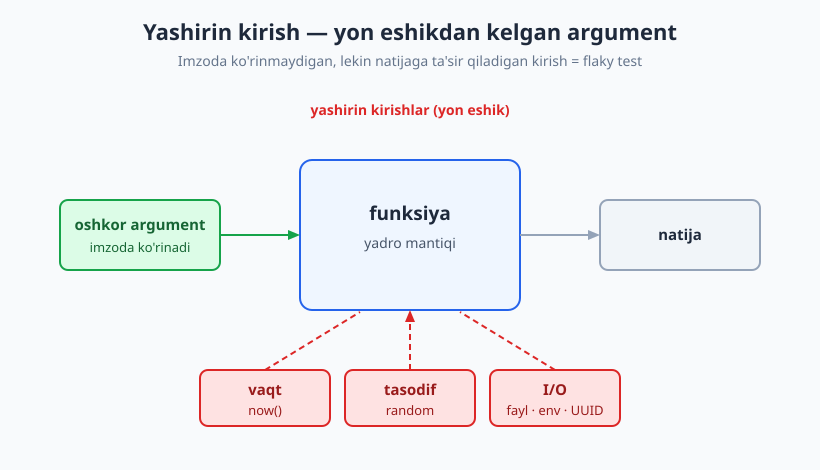
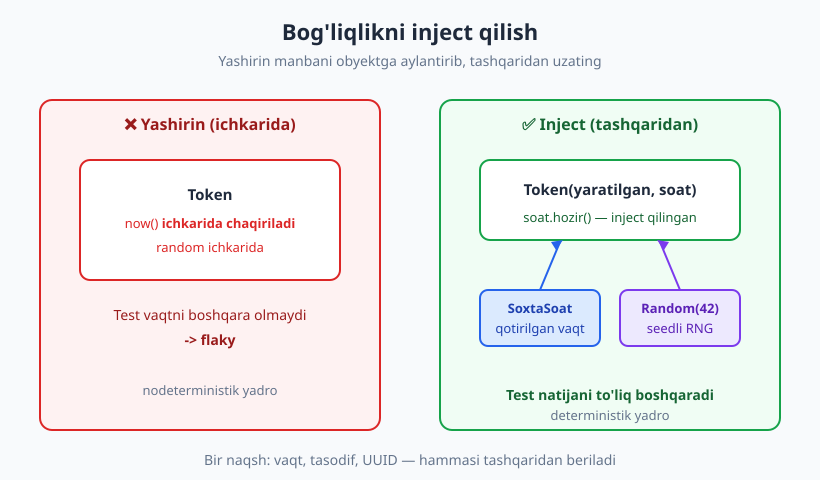
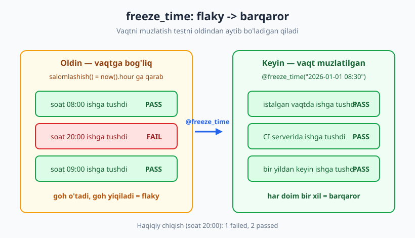

# 09 — Vaqt, tasodif, I/O: bog'liqliklarni izolyatsiya qilish

[🏠 README](./README.md) · [⬅️ Oldingi: 08 — Test dublyorlari II: amaliyot](./08-test-dublyorlari-amaliyot.md) · [Keyingi: 10 — Testlanadigan dizayn ➡️](./10-testlanadigan-dizayn.md)

---

> **Bu bobda:** kod nima uchun "goh o'tadigan, goh yiqiladigan" (flaky) testlarga olib keladi va buning ildizini — **nodeterminizm**ni — qanday tartibga solishni o'rganamiz. Vaqt (`datetime.now()`), tasodif (`random`), fayl tizimi, muhit o'zgaruvchilari va UUID kabi "dasturning chekkasidagi" bog'liqliklarni testlash uchun **izolyatsiya** qilamiz: ularni argument sifatida uzatamiz, abstraksiya orqali inject qilamiz yoki `freezegun` bilan muzlatamiz.
>
> **Halollik / Eslatma:** bu bob [04-bob](./04-yaxshi-test-xossalari.md)dagi **determinizm** tamoyilini amalda ko'rsatadi. Tarmoq va HTTP'ni chuqur ([17-bob](./17-api-http-testlash.md)), flaky testlarning boshqa sabablarini ([24-bob](./24-flaky-testlar.md)) keyinroq ko'ramiz; bu yerda asosiy e'tibor — vaqt, tasodif va lokal I/O. Hamma Python namunalari haqiqatan ishga tushirib, chiqishi tekshirilgan (Python 3.14, `pytest` 9.0.3, `freezegun` 1.5.5).

---

## Yashirin kirish: testni buzadigan ko'rinmas argument

Tasavvur qiling: ofisga kelganingizda devordagi soat har safar boshqa vaqtni ko'rsatadi, lekin siz uni boshqara olmaysiz. Reja tuzish mumkinmi? Yo'q — chunki bir "kirish" (vaqt) sizning nazoratingizdan tashqarida. Testlar ham aynan shunday: agar funksiyaning natijasi siz **bermagan** narsaga bog'liq bo'lsa, uni ishonchli tekshira olmaysiz.

Quyidagi funksiyaga qarang. U bitta argument oladi (`yaratilgan`), lekin natijasi **ikkita** narsaga bog'liq:

```python
import datetime as dt

def muddati_otdimi_yomon(yaratilgan):
    return (dt.datetime.now() - yaratilgan).days > 7   # <- now() qayerdan keldi?
```

`dt.datetime.now()` — funksiya imzosida ko'rinmaydigan, lekin natijaga ta'sir qiladigan ikkinchi kirish. Buni **yashirin kirish** (hidden input) deyiladi. Funksiya "sof" emas: bir xil argument bilan chaqirsangiz, ertaga boshqacha javob beradi. Test yozsangiz, u **bugun** o'tadi, lekin 8 kundan keyin yiqiladi — kod o'zgarmagan bo'lsa ham. Bu **flaky** testning klassik sababi.



Yashirin kirishlarning eng keng tarqalgan uchta manbasi:

| Manba | Misol | Nega xavfli |
|---|---|---|
| **Vaqt** | `datetime.now()`, `time.time()` | Har soniyada o'zgaradi; "muddat o'tdimi" testi vaqtga bog'lanadi |
| **Tasodif** | `random.choice()`, `random.random()` | Har chaqiruvda boshqa natija; assertion'ni qila olmaysiz |
| **I/O** | fayl, tarmoq, muhit, soat, UUID | Tashqi dunyo holatiga bog'liq; sekin va beqaror |

> **Asosiy g'oya:** yashirin kirishni **oshkor** qiling. Funksiya nazorat qila olmaydigan narsani tashqaridan **bersangiz** (inject qilsangiz), test uni boshqaradi. Bu — butun bobning yagona fikri uch xil kiyimda.

---

## Vaqtni boshqarish

Vaqt — eng tez-tez uchraydigan yashirin kirish. Uni izolyatsiya qilishning uch usuli bor; eng tozasidan boshlaymiz.

### Usul 1 — vaqtni argument sifatida uzatish (eng toza)

Funksiyaga "hozir qaysi vaqt" ekanini **siz** ayting. Shunda u sof funksiyaga aylanadi:

```python
import datetime as dt

# ✅ Sof: ikkala kirish ham imzoda ko'rinadi.
def muddati_otdimi(yaratilgan, hozir):
    return (hozir - yaratilgan).days > 7
```

Test endi vaqtni to'liq nazorat qiladi (AAA tuzilishida):

```python
def test_muddati_otdi():
    yaratilgan = dt.datetime(2026, 1, 1, 12, 0)        # Arrange
    hozir = dt.datetime(2026, 1, 10, 12, 0)            # 9 kun keyin
    assert muddati_otdimi(yaratilgan, hozir) is True   # Act + Assert
    # -> PASS

def test_muddati_otmadi():
    yaratilgan = dt.datetime(2026, 1, 1, 12, 0)
    hozir = dt.datetime(2026, 1, 5, 12, 0)             # 4 kun keyin
    assert muddati_otdimi(yaratilgan, hozir) is False
    # -> PASS
```

Haqiqiy ishga tushganda `hozir`ni chaqiruvchi beradi: `muddati_otdimi(token.yaratilgan, dt.datetime.now())`. Diqqat qiling — `now()` endi dasturning **chekkasida** (chaqiruvchi joyda), yadroda emas. Bu naqsh keyingi [10-bob](./10-testlanadigan-dizayn.md)ning asosi.

### Usul 2 — "Clock" abstraksiyasini inject qilish

Agar vaqt obyektning ichida bir necha joyda kerak bo'lsa, har metodga argument uzatish noqulay. Buning o'rniga **soat obyektini** (Clock) bir marta inject qiling:

```python
class TizimSoati:
    def hozir(self):
        return dt.datetime.now()      # haqiqiy soat (ishlab chiqarishda)

class SoxtaSoat:                       # test dublyori (07-bobdagi "fake")
    def __init__(self, qiymat):
        self._qiymat = qiymat
    def hozir(self):
        return self._qiymat

class Token:
    def __init__(self, yaratilgan, soat):
        self._yaratilgan = yaratilgan
        self._soat = soat               # bog'liqlik inject qilindi
    def yaroqsiz(self):
        return (self._soat.hozir() - self._yaratilgan).days > 7
```

Test soxta soatni beradi va vaqtni xohlaganicha "qotirib qo'yadi":

```python
def test_token_eskirgan():
    yaratilgan = dt.datetime(2026, 1, 1, 12, 0)
    soat = SoxtaSoat(dt.datetime(2026, 1, 20, 12, 0))   # 19 kun "keyin"
    token = Token(yaratilgan, soat)
    assert token.yaroqsiz() is True
    # -> PASS
```



> **Til-mustaqil:** bu naqsh hamma joyda bir xil. JS'da soat obyektini konstruktorga uzatasiz yoki `jest.useFakeTimers()` ishlatasiz; PHP'da `Clock` interfeysi (PSR-20 `ClockInterface`) inject qilinadi; Java'da `java.time.Clock` aynan shu maqsad uchun mavjud. Atama bir xil: **dependency injection**.

### Usul 3 — `freezegun` bilan vaqtni muzlatish

Ba'zan kod allaqachon yozilgan va `datetime.now()` ichida chuqur joylashgan — refactoring qilishga vaqt yo'q. Shunda `freezegun` kutubxonasi `now()`ni global tarzda "muzlatib" qo'yadi (`pip install freezegun`):

```python
from freezegun import freeze_time

def muddati_otdimi_yomon(yaratilgan):
    return (dt.datetime.now() - yaratilgan).days > 7   # now() ichkarida

@freeze_time("2026-01-20 12:00:00")
def test_freeze_muddat():
    yaratilgan = dt.datetime(2026, 1, 1, 12, 0)
    assert muddati_otdimi_yomon(yaratilgan) is True     # 19 kun -> True
    assert dt.datetime.now() == dt.datetime(2026, 1, 20, 12, 0)
    # -> PASS
```

`freeze_time`ni kontekst menejer sifatida ham ishlatib, bitta testda turli vaqtlarni sinash mumkin:

```python
def test_freeze_kontekst():
    yaratilgan = dt.datetime(2026, 1, 1, 12, 0)
    with freeze_time("2026-01-05"):
        assert muddati_otdimi_yomon(yaratilgan) is False   # 4 kun
    with freeze_time("2026-01-15"):
        assert muddati_otdimi_yomon(yaratilgan) is True    # 14 kun
    # -> PASS
```

> **Trade-off:** `freezegun` mavjud kodni o'zgartirmasdan testlash imkonini beradi (legacy uchun zo'r — [29-bob](./29-legacy-kodni-testlash.md)). Ammo u global holatni patch qiladi (sehrli), biroz sekin va dizayn muammosini — yashirin kirishni — yashiradi, hal qilmaydi. **Yangi kod** uchun 1- yoki 2-usul (inject) afzal: u kodni ham testlanadigan, ham toza qiladi. `freezegun` — "oxirgi chora", kafolat emas.

### Flaky → barqaror: jonli isbot

Quyidagi funksiya vaqtga (yashirin kirish) bog'liq. Birinchi test uni `now()` bilan tekshiradi — natija **ishga tushgan soatga** qarab o'zgaradi:

```python
def salomlashish(soat=None):
    hozir = (soat or dt.datetime.now()).hour
    return "Xayrli tong" if 5 <= hozir < 12 else "Xayrli kun"

# ❌ FLAKY: ish vaqtiga bog'liq.
def test_salom_flaky():
    assert salomlashish() == "Xayrli tong"

# ✅ BARQAROR: vaqtni muzlatamiz.
@freeze_time("2026-01-01 08:30:00")
def test_salom_tong():
    assert salomlashish() == "Xayrli tong"

@freeze_time("2026-01-01 15:00:00")
def test_salom_kun():
    assert salomlashish() == "Xayrli kun"
```

Soat 20:00 da ishga tushirilganda haqiqiy `pytest` chiqishi:

```text
F..                                                          [100%]
======================== FAILURES ========================
_____________________ test_salom_flaky ___________________
>       assert salomlashish() == "Xayrli tong"
E       AssertionError: assert 'Xayrli kun' == 'Xayrli tong'
=================== short test summary info ===============
FAILED test_flaky.py::test_salom_flaky - AssertionError
1 failed, 2 passed in 0.77s
```

Flaky test yiqildi, ikki muzlatilgan test o'tdi. Aynan shu — vaqtni izolyatsiya qilishning butun mohiyati.



---

## Tasodifni boshqarish

Tasodif (`random`) — ikkinchi yashirin kirish. Parol generatori, lotereya tanlovi, "tasodifiy maslahat" — bularning natijasini oldindan bila olmaysiz, demak `assert` ham qila olmaysiz. Yechim: tasodif manbasini **deterministik** qiling.

`random` modulida bu juda oson — bir xil **seed** bir xil ketma-ketlikni beradi. Eng toza yo'l: RNG obyektini inject qiling.

```python
import random

# ✅ rng — inject qilingan tasodif manbasi (yashirin emas, oshkor).
def parol_yarat(rng, uzunlik=8):
    belgilar = "abcdefghijklmnopqrstuvwxyz0123456789"
    return "".join(rng.choice(belgilar) for _ in range(uzunlik))
```

Test ma'lum seedli RNG beradi, shuning uchun natija har doim bir xil:

```python
def test_parol_takrorlanadi():
    # Bir xil seed -> bir xil parol (determinizm).
    a = parol_yarat(random.Random(42))
    b = parol_yarat(random.Random(42))
    assert a == b
    # -> PASS

def test_parol_aniq_qiymat():
    natija = parol_yarat(random.Random(42))
    assert natija == "hbrpoig8"      # seed=42 da aynan shu (jonli tekshirilgan)
    assert len(natija) == 8
    # -> PASS
```

Solishtirish uchun: `random.Random(1)` seed'i `"ieqh524y"` parolini beradi — boshqa seed, boshqa (lekin baribir aniq va takrorlanadigan) natija.

> **Diqqat:** ishlab chiqarishda parol uchun `random` emas, `secrets` modulini ishlating (xavfsiz). Bu yerda biz **testlash texnikasini** ko'rsatyapmiz; xavfsizlik nuancelari [26-bob](./26-xavfsizlik-testlash.md)da. Muhimi: `secrets` ham, `random` ham — inject qilinishi mumkin bo'lgan bog'liqlik.

Agar inject qilishni xohlamasangiz, testning Arrange bosqichida global seed'ni qotiring: `random.seed(42)`. Ammo bu global holatni o'zgartiradi (boshqa testlarga ta'sir qilishi mumkin), shuning uchun obyekt inject qilish — xavfsizroq.

> **Til-mustaqil:** JS'da `Math.random()`ni `jest.spyOn`'lab qaytariladigan qiymatini belgilaysiz yoki seedli generator inject qilasiz; PHP'da `mt_srand($seed)` yoki `Randomizer` (PHP 8.2+) inject qilinadi. G'oya bir xil: tasodifni boshqarib bo'ladigan qiling.

---

## Fayl tizimini boshqarish: `tmp_path`

Faylga yozadigan kodni testlash uchun haqiqiy diskka yozish kerakmi? Ha — lekin **vaqtinchalik, izolyatsiyalangan** papkaga, shunda testlar bir-biriga va sizning loyihangizga aralashmaydi. `pytest` buning uchun tayyor **fixture** beradi: `tmp_path` (har test uchun yangi, bo'sh, `pathlib.Path` papka, test tugagach avtomatik o'chadi).

```python
def hisobotni_saqla(papka, nom, matn):
    fayl = papka / nom
    fayl.write_text(matn, encoding="utf-8")
    return fayl

def test_fayl_yozish_oqish(tmp_path):       # tmp_path — pytest fixture
    fayl = hisobotni_saqla(tmp_path, "hisobot.txt", "salom")
    assert fayl.exists()
    assert fayl.read_text(encoding="utf-8") == "salom"
    # -> PASS
```

`tmp_path` har bir test uchun **alohida** papka beradi — testlar mustaqil ([04-bobdagi](./04-yaxshi-test-xossalari.md) "Independent"). Bir test fayl qoldirsa ham, keyingi testga ta'sir qilmaydi. Agar butun test sessiyasi uchun bitta papka kerak bo'lsa, `tmp_path_factory` fixture'i bor.

> **In-memory muqobil:** ko'p hollarda haqiqiy faylga umuman yozmaslik tezroq. Funksiya `Path` emas, **fayl-obyekt** (yoki oqim) qabul qilsa, testda `io.StringIO()` berib, diskka tegmasdan testlashingiz mumkin. Bu — soatni inject qilishning faylga mos varianti: I/O'ni chekkaga suring, yadroni sof saqlang.

---

## Muhit (env) va konfiguratsiya: `monkeypatch.setenv`

Kod ko'pincha muhit o'zgaruvchilaridan (`os.environ`) konfiguratsiya oladi — bu ham yashirin kirish, chunki test mashinasi va sizning mashinangizda farq qilishi mumkin. `pytest`ning `monkeypatch` fixture'i muhitni test davomida **vaqtincha** o'zgartiradi va test tugagach avtomatik tiklaydi.

```python
import os

def baza_url():
    return os.environ.get("BAZA_URL", "sqlite:///xotira")

def test_env_default(monkeypatch):
    monkeypatch.delenv("BAZA_URL", raising=False)    # o'zgaruvchini olib tashla
    assert baza_url() == "sqlite:///xotira"
    # -> PASS

def test_env_ozgartirilgan(monkeypatch):
    monkeypatch.setenv("BAZA_URL", "postgres://test")  # vaqtincha o'rnat
    assert baza_url() == "postgres://test"
    # -> PASS
```

`monkeypatch`ning ulug'vorligi — **avtomatik tozalash**da. Birinchi test o'zgartirgan muhit ikkinchi testga sizib o'tmaydi; sessiya oxirida hamma narsa asl holiga qaytadi. Buni qo'lda qilsangiz (`os.environ[...] = ...`), tozalashni unutib, boshqa testlarni buzasiz.

---

## Tarmoq va UUID: qisqacha

**Tarmoq** — eng katta yashirin kirish: tashqi server sekin, ishonchsiz va sizning nazoratingizdan tashqarida. Uni test ichida chaqirmaslik kerak; o'rniga HTTP javobini soxtalashtirasiz (mock server / `responses` / `respx`). Bu mavzu o'zining chuqurligi tufayli [17-bob](./17-api-http-testlash.md)ga qoldirilgan. Hozircha qoidani eslang: **test ishlab chiqarish tarmog'iga chiqmasin.**

**UUID** ham yashirin kirish — har chaqiruvda yangi, oldindan bilib bo'lmaydigan qiymat. Uni ham vaqt va tasodif kabi inject qiling:

```python
import uuid

class Buyurtma:
    def __init__(self, id_yaratuvchi=uuid.uuid4):   # default — haqiqiy
        self.id = id_yaratuvchi()

def test_buyurtma_id():
    sobit = uuid.UUID("00000000-0000-0000-0000-000000000001")
    b = Buyurtma(id_yaratuvchi=lambda: sobit)        # test — sobit ID beradi
    assert b.id == sobit
    # -> PASS
```

Naqshni payqadingizmi? Vaqt, tasodif, UUID — barchasi bir xil yo'l bilan hal qilinadi: **funksiyaga "qiymat ishlab chiqaruvchi"ni argument sifatida bering, default'da haqiqiysini qo'ying.**

---

## Ko'prik: chekkani inject qil, yadroni sof saqla

Bu bobdagi hamma texnika bitta g'oyaning ko'rinishlari edi: **vaqt, tasodif va I/O — dasturning "chekkasi"** (tashqi dunyo bilan aloqa nuqtalari). Agar bu chekkalarni mantiq ichiga aralashtirsangiz, yadro nodeterministik bo'lib qoladi — testlash qiyin va flaky.

Yechim: chekkani **tashqariga suring** (inject qiling), yadroni esa **sof** (deterministik, faqat oshkor kirishlarga bog'liq) saqlang. Sof yadroni test qilish — bolalar o'yini: kirish bering, chiqishni tekshiring, hech qanday sehr yo'q. Chekkani esa bir marta, oddiy adapter sifatida tekshirasiz.

Aynan shu fikr — chekka vs yadro, inject vs sof funksiya — keyingi [10-bob: Testlanadigan dizayn](./10-testlanadigan-dizayn.md)ning asosiy mavzusi. Bu bobda biz uni "majburiyat" sifatida ko'rdik (testlash uchun kerak); keyingi bobda uni "yaxshi dizayn" sifatida ko'ramiz.

> **Trade-off:** har bir bog'liqlikni inject qilish — qo'shimcha kod (boilerplate): ko'proq parametr, ko'proq konstruktor argumenti. Hamma narsani inject qilish kodni murakkablashtiradi. **Muvozanat:** nodeterministik va sekin bog'liqliklarni (vaqt, tasodif, tarmoq, DB) inject qiling; toza va arzon narsalarni (matematik funksiya, string formatlash) inject qilmang. Maqsad — testlash, sof "injection san'ati" emas.

---

## Asosiy g'oyalar (bobni qisqacha)

- **Yashirin kirish (hidden input)** — funksiya imzosida ko'rinmaydigan, lekin natijaga ta'sir qiladigan narsa (`now()`, `random`, env). U flaky testning asosiy sababi.
- **Vaqtni** uch yo'l bilan boshqaring: argument sifatida uzat (eng toza), Clock obyektini inject qil, yoki `freezegun` bilan muzlat (legacy uchun).
- **`@freeze_time(...)`** mavjud kodni o'zgartirmay `now()`ni qotiradi — lekin global holatni patch qiladi va dizayn muammosini yashiradi; yangi kodda inject afzal.
- **Tasodifni** seedli RNG inject qilib deterministik qiling; bir xil seed → bir xil natija → `assert` qilish mumkin.
- **`tmp_path`** fixture'i har testga alohida vaqtinchalik papka beradi (avtomatik o'chadi); in-memory (`StringIO`) — tezroq muqobil.
- **`monkeypatch.setenv`/`delenv`** muhitni vaqtincha o'zgartiradi va avtomatik tiklaydi — testlar bir-biriga sizib o'tmaydi.
- **Vaqt, tasodif, UUID — bir xil naqsh:** "qiymat ishlab chiqaruvchi"ni argument qilib bering, default'da haqiqiysi tursin.
- **Chekkani inject qil, yadroni sof saqla** — bu testlash zaruratidan tug'ilgan, lekin yaxshi dizaynga olib boradigan tamoyil (10-bobga ko'prik).

---

## Mashqlar

### Oson

**1-mashq.** `chegirma_amal_qiladimi(boshlanish, tugash)` funksiyasi `datetime.now()` orqali "hozir aksiya davridami?"ni hisoblaydi. Undagi yashirin kirishni aniqlang va uni sof funksiyaga aylantirib qayta yozing.

**2-mashq.** `tanga_tashla()` funksiyasi `random` orqali "boshmi yoki yozmi" qaytaradi. Uni testlanadigan qiling (RNG inject qiling) va `random.Random(42)` bilan natijani aniq tekshiradigan test yozing.

**3-mashq.** `tmp_path` fixture'idan foydalanib, ro'yxatni faylga qatorma-qator yozadigan va qayta o'qiydigan funksiyaning testini yozing.

### O'rta

**4-mashq.** `monkeypatch` bilan `LOG_DARAJASI` muhit o'zgaruvchisi yo'q bo'lganda default `"INFO"`, mavjud bo'lganda o'sha qiymatni qaytaradigan `log_darajasi()` funksiyasini testlang (ikkala holat uchun ikki test).

**5-mashq.** Bitta `Hisob` klassi `datetime.now()`ni ichida ishlatib "hisob necha kunlik" ekanini hisoblaydi. Uni (a) `freezegun` bilan, (b) Clock inject qilish bilan testlang. Ikki yondashuvni solishtiring: qaysi biri kodni o'zgartirdi?

**6-mashq.** `parol_yarat(rng)` funksiyasiga **xossa-asosli** (property) tekshiruv qo'shing: seed nima bo'lishidan qat'i nazar, natija doim 8 ta belgidan iborat va faqat ruxsat etilgan belgilarni o'z ichiga oladi. (Maslahat: bir necha seed'da sinab ko'ring; chuqur property-based testing [21-bob](./21-property-based-testing.md)da.)

### Qiyin

**7-mashq.** Quyidagi funksiya **uchta** yashirin kirishga ega: vaqt, tasodif va UUID.
```python
import datetime as dt, random, uuid
def buyurtma_yarat(mahsulot):
    return {
        "id": str(uuid.uuid4()),
        "mahsulot": mahsulot,
        "vaqt": dt.datetime.now().isoformat(),
        "kupon": random.choice(["A", "B", "C"]),
    }
```
Uni shunday refactoring qilingki, qaytgan `dict`ni to'liq (har uch maydonni) deterministik tekshirish mumkin bo'lsin. Keyin shu testni yozing.

**8-mashq.** Bir jamoadosh "har bir testda `freezegun` ishlataylik, shunda vaqt muammosi butunlay yo'qoladi" deydi. Bu fikrning **trade-off**larini yozing: qachon to'g'ri, qachon noto'g'ri? `freezegun`ga to'liq tayanish qaysi dizayn muammosini yashiradi va u "chekkani inject qil, yadroni sof saqla" tamoyiliga qanday zid keladi?

<details markdown="1">
<summary>Yechimlar</summary>

### 1-mashq yechimi

Yashirin kirish — `datetime.now()`. Yechim: `hozir`ni argument qiling.

```python
import datetime as dt

def chegirma_amal_qiladimi(boshlanish, tugash, hozir):
    return boshlanish <= hozir <= tugash

def test_aksiya_davrida():
    b = dt.datetime(2026, 1, 1)
    t = dt.datetime(2026, 1, 31)
    assert chegirma_amal_qiladimi(b, t, dt.datetime(2026, 1, 15)) is True
    # -> PASS

def test_aksiyadan_keyin():
    b = dt.datetime(2026, 1, 1)
    t = dt.datetime(2026, 1, 31)
    assert chegirma_amal_qiladimi(b, t, dt.datetime(2026, 2, 1)) is False
    # -> PASS
```

### 2-mashq yechimi

```python
import random

def tanga_tashla(rng):
    return "bosh" if rng.random() < 0.5 else "yoz"

def test_tanga_deterministik():
    rng = random.Random(42)
    # Bir xil seed -> har doim bir xil natija.
    assert tanga_tashla(rng) == tanga_tashla(random.Random(42))
    # -> PASS
```

### 3-mashq yechimi

```python
def qatorlarni_saqla(papka, qatorlar):
    fayl = papka / "royxat.txt"
    fayl.write_text("\n".join(qatorlar), encoding="utf-8")
    return fayl

def test_qatorlarni_saqla(tmp_path):
    fayl = qatorlarni_saqla(tmp_path, ["non", "sut", "tuz"])
    o_qildi = fayl.read_text(encoding="utf-8").splitlines()
    assert o_qildi == ["non", "sut", "tuz"]
    # -> PASS
```

### 4-mashq yechimi

```python
import os

def log_darajasi():
    return os.environ.get("LOG_DARAJASI", "INFO")

def test_log_default(monkeypatch):
    monkeypatch.delenv("LOG_DARAJASI", raising=False)
    assert log_darajasi() == "INFO"
    # -> PASS

def test_log_ozgartirilgan(monkeypatch):
    monkeypatch.setenv("LOG_DARAJASI", "DEBUG")
    assert log_darajasi() == "DEBUG"
    # -> PASS
```

### 5-mashq yechimi

```python
import datetime as dt
from freezegun import freeze_time

# (a) freezegun: KODNI o'zgartirmaymiz.
class Hisob:
    def __init__(self, ochilgan):
        self.ochilgan = ochilgan
    def yoshi_kun(self):
        return (dt.datetime.now() - self.ochilgan).days

@freeze_time("2026-01-11")
def test_yoshi_freeze():
    h = Hisob(dt.datetime(2026, 1, 1))
    assert h.yoshi_kun() == 10
    # -> PASS

# (b) Clock inject: KODNI o'zgartiramiz (toza, dizaynni yaxshilaydi).
class HisobV2:
    def __init__(self, ochilgan, soat):
        self.ochilgan = ochilgan
        self.soat = soat
    def yoshi_kun(self):
        return (self.soat.hozir() - self.ochilgan).days

class SoxtaSoat:
    def __init__(self, q): self.q = q
    def hozir(self): return self.q

def test_yoshi_inject():
    soat = SoxtaSoat(dt.datetime(2026, 1, 11))
    h = HisobV2(dt.datetime(2026, 1, 1), soat)
    assert h.yoshi_kun() == 10
    # -> PASS
```

Solishtirish: (a) kodni o'zgartirmadi (legacy uchun qulay), lekin global patch'ga tayandi. (b) kodni o'zgartirdi, lekin natijada yashirin kirishni yo'qotdi va dizaynni tozaladi. Yangi kodda (b) afzal.

### 6-mashq yechimi

```python
import random

def parol_yarat(rng, uzunlik=8):
    belgilar = "abcdefghijklmnopqrstuvwxyz0123456789"
    return "".join(rng.choice(belgilar) for _ in range(uzunlik))

def test_parol_xossalari():
    belgilar = set("abcdefghijklmnopqrstuvwxyz0123456789")
    # Xossa: seed nima bo'lishidan qat'i nazar invariant saqlanadi.
    for seed in range(50):
        p = parol_yarat(random.Random(seed))
        assert len(p) == 8                       # uzunlik invariant
        assert set(p) <= belgilar                # faqat ruxsat etilgan belgilar
    # -> PASS
```

### 7-mashq yechimi

Uch yashirin kirishni uch argumentga aylantiramiz; default'da haqiqiysi turadi:

```python
import datetime as dt, random, uuid

def buyurtma_yarat(mahsulot, hozir, rng, id_yaratuvchi):
    return {
        "id": str(id_yaratuvchi()),
        "mahsulot": mahsulot,
        "vaqt": hozir.isoformat(),
        "kupon": rng.choice(["A", "B", "C"]),
    }

def test_buyurtma_deterministik():
    sobit_id = uuid.UUID("00000000-0000-0000-0000-000000000009")
    natija = buyurtma_yarat(
        "non",
        hozir=dt.datetime(2026, 1, 1, 9, 0),
        rng=random.Random(42),
        id_yaratuvchi=lambda: sobit_id,
    )
    assert natija == {
        "id": "00000000-0000-0000-0000-000000000009",
        "mahsulot": "non",
        "vaqt": "2026-01-01T09:00:00",
        "kupon": "C",        # seed=42 da choice(["A","B","C"]) -> aniq qiymat
    }
    # -> PASS
```
(`kupon` qiymati seed'ga bog'liq va takrorlanadigan — uni bir marta jonli ishlatib aniqlab, testga yozasiz.)

### 8-mashq yechimi

**Qachon to'g'ri:** legacy kodda `datetime.now()` chuqur joylashgan va refactoring xavfli bo'lsa, `freezegun` tezda, kodga tegmasdan determinizm beradi ([29-bob](./29-legacy-kodni-testlash.md)). Bir martalik, tor holatlar uchun ham qulay.

**Qachon noto'g'ri:** uni **default strategiya** qilish.
- `freezegun` global holatni patch qiladi — bu sehrli, sekin va bir vaqtda bir necha vaqt zonasi/manba kerak bo'lsa chalkash.
- Asosiysi: u **dizayn muammosini yashiradi**. Kod hali ham `now()`ga to'g'ridan-to'g'ri bog'liq — ya'ni yashirin kirish bartaraf etilmagan, faqat test paytida niqoblangan.
- Bu "chekkani inject qil, yadroni sof saqla" tamoyiliga **zid**: `freezegun` chekkani inject qilmaydi, balki butun dunyoning soatini muzlatadi. Yadro hali ham nopok (nondeterministik) — biz uni faqat tashqaridan majburlab to'xtatib turibmiz.

**Xulosa:** `freezegun` — qutqaruvchi (legacy), kafolat emas. Yangi kodda vaqtni inject qiling; `freezegun`ni faqat o'zingiz o'zgartira olmaydigan kod uchun saqlang.

</details>

---

[🏠 README](./README.md) · [⬅️ Oldingi: 08 — Test dublyorlari II: amaliyot](./08-test-dublyorlari-amaliyot.md) · [Keyingi: 10 — Testlanadigan dizayn ➡️](./10-testlanadigan-dizayn.md)
