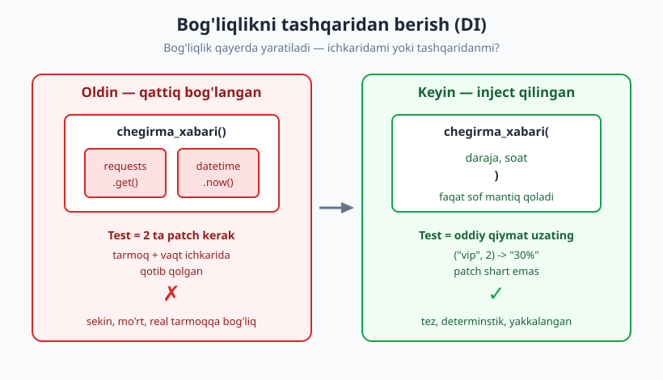
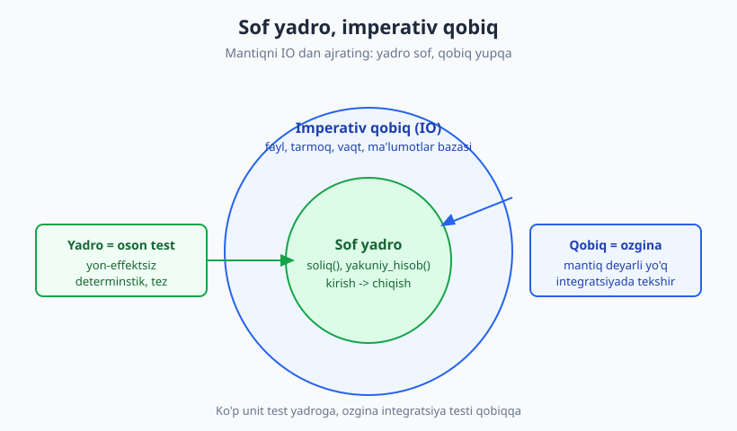
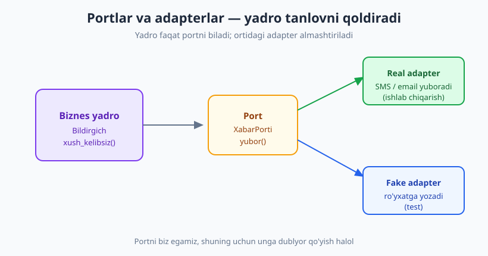

# 10 — Testlanadigan dizayn

[🏠 README](./README.md) · [⬅️ Oldingi: 09 — Vaqt, tasodif, I/O](./09-bogliqliklarni-izolyatsiya.md) · [Keyingi: 11 — TDD: Red-Green-Refactor ➡️](./11-tdd-red-green-refactor.md)

---

> **Bu bobda:** test yozish qiyin bo'lganda — bu kod sizga dizayn haqida xabar bermoqda. Test
> "og'rig'ini" qanday tinglashni; dependency injection, sof funksiya, "functional core / imperative
> shell", humble object va portlar/adapterlar naqshlari testlanadigan kodni qanday tug'dirishini
> ko'ramiz. Bu — II qism (unit testing)ning yakuni va arxitektura kitobiga ko'prik.
>
> **Halollik / Eslatma:** bu bob naqshlarning *g'oyasini* beradi, har birini chuqur arxitektura
> darsiga aylantirmaydi (ports/adapters uchun [arxitektura kitobi](../arxitektura/README.md)).
> Oxirida ochiq aytamiz: testability ko'pincha yaxshi dizayn, lekin "har narsaga interfeys" —
> soddalikni o'ldiradigan ortiqcha abstraksiya. Barcha Python namunalari `python -m pytest`
> (Python 3.14, pytest 9.0.3) bilan haqiqatan ishga tushirib tekshirilgan.

---

## Test og'rig'i — yashir emas, tingla

Tasavvur qiling, mashinaga yog' quymoqchisiz, lekin yog' qopqog'iga yetish uchun dvigatelni
yarmini ajratish kerak. Bu — yomon dizayn signali. Yaxshi mashinada xizmat nuqtalari **oson**
yetib boriladigan joyda bo'ladi.

Kod ham xuddi shunday. Agar bitta funksiyani test qilish uchun butun ma'lumotlar bazasini
ko'tarib, tarmoqni soxtalashtirib, vaqtni muzlatib, beshta `patch` yozishingiz kerak bo'lsa —
bu **testning emas, dizaynning** muammosi. Test sizga "men bu kodni yakkalab ololmayapman"
deb baqirmoqda.

> **Markaziy g'oya:** Testlash qiyin kod = dizayn signali. Test og'rig'i — chidaydigan azob emas,
> **tinglaydigan ma'lumot**. "Testability" (testlanuvchanlik) — yaxshi dizaynning eng ishonchli
> o'lchagichlaridan biri. Past coupling, aniq chegaralar, kichik mas'uliyat — bularning hammasi
> testni osonlashtiradi, chunki ularning hammasi yaxshi dizayn.

Bu bobning butun mavzusi shu bir jumlada: **test yozolmasangiz, kodni qayta o'ylang** — testni
emas. Endi shu og'riqni kamaytiradigan aniq naqshlarni ko'ramiz.

---

## Dependency Injection — bog'liqlikni tashqaridan ber

09-bobda vaqt, tasodif va I/O ni qanday boshqarganimizni ko'rdik. Uning ortidagi umumiy tamoyil
nomi bor: **Dependency Injection** (DI, "bog'liqlikni in'ektsiya qilish") — funksiya yoki klass
o'ziga kerakli bog'liqlikni **ichkarida yaratish** o'rniga, uni **tashqaridan argument sifatida
qabul qiladi**.

Mana testlash qiyin "oldin" versiya — bog'liqliklar (`requests`, `datetime`) funksiya ichida
qotib qolgan:

```python
# chegirma_oldin.py  (❌ testlash qiyin)
import requests
from datetime import datetime

def chegirma_xabari(foydalanuvchi_id):
    javob = requests.get(f"https://api.misol.uz/foydalanuvchi/{foydalanuvchi_id}")
    daraja = javob.json()["daraja"]
    soat = datetime.now().hour
    foiz = 20 if daraja == "vip" else 5
    if 0 <= soat < 6:
        foiz += 10  # tungi bonus
    return f"Sizning chegirmangiz: {foiz}%"
```

Buni test qilish uchun **ikkita** narsani patch qilishga majbursiz — real tarmoqqa chiqmaslik
va vaqtni boshqarish uchun:

```python
# test_chegirma_oldin.py  (og'riq: 2 ta patch)
from unittest.mock import patch, MagicMock
from datetime import datetime
import chegirma_oldin

def test_oldin_patch_kerak():
    soxta_javob = MagicMock()
    soxta_javob.json.return_value = {"daraja": "vip"}
    with patch("chegirma_oldin.requests.get", return_value=soxta_javob), \
         patch("chegirma_oldin.datetime") as soxta_vaqt:
        soxta_vaqt.now.return_value = datetime(2026, 1, 1, 2)  # tun
        assert chegirma_oldin.chegirma_xabari(1) == "Sizning chegirmangiz: 30%"
# -> 1 passed (lekin patch ko'p, mo'rt, sekin)
```

Bu test **o'tadi**, lekin u "kodning ichki tuzilishiga" yopishib qolgan: `chegirma_oldin` modulida
`requests` qayerdan import qilinganini, `datetime` qanday chaqirilganini bilishi shart. Implementatsiyani
ozgina o'zgartirsangiz — test yiqiladi (mo'rt test).

Endi **DI bilan "keyin" versiya**: tarmoq va vaqtni tashqarida hal qilamiz, funksiyaga faqat tayyor
qiymatlarni beramiz. Funksiya endi sof mantiqdan iborat:

```python
# chegirma_keyin.py  (✅ testlash oson)
def chegirma_xabari(daraja, soat):
    foiz = 20 if daraja == "vip" else 5
    if 0 <= soat < 6:
        foiz += 10  # tungi bonus
    return f"Sizning chegirmangiz: {foiz}%"
```

```python
# test_chegirma_keyin.py  (patch yo'q!)
from chegirma_keyin import chegirma_xabari

def test_vip_kunduzi():
    assert chegirma_xabari("vip", 14) == "Sizning chegirmangiz: 20%"

def test_oddiy_tunda():
    assert chegirma_xabari("oddiy", 3) == "Sizning chegirmangiz: 15%"

def test_vip_tunda():
    assert chegirma_xabari("vip", 2) == "Sizning chegirmangiz: 30%"
# -> 3 passed in 0.01s
```



Farqni sezdingizmi? "Keyin" versiyada **bironta `patch`, `mock` yoki `with` bloki yo'q** — shunchaki
qiymat uzatasiz. Test qisqa, tez, determinstik va implementatsiyaga bog'lanmagan.

> **Trade-off:** DI bepul emas. Bog'liqlikni "kim yaratadi va ulaydi" degan savol yuqoriroq qatlamga
> ko'chadi (kompozitsiya ildizi — composition root). Kichik skript uchun bu ortiqcha murakkablik
> bo'lishi mumkin; katta tizimda esa bu — najot. 09-bobdagi "argument sifatida `now` funksiyasini
> uzatish" ham aynan DI edi.

DI'ni qanday "kiritish" mumkin: (1) funksiya argumenti orqali (yuqoridagidek, eng oddiy),
(2) konstruktor orqali (`__init__(self, port)` — klasslar uchun), (3) setter/atribut orqali (kamroq
afzal). Til-mustaqil: JavaScript'da bu xuddi shunday argument/konstruktor, Java/C#'da ko'pincha
DI-konteyner (Spring, .NET DI) ishlatiladi — lekin g'oya bir xil.

---

## Sof funksiya — testlashning eng oson turi

**Sof funksiya** (pure function) — ikki shartni qanoatlantiradigan funksiya:

1. **Determinstik:** bir xil kirish → har doim bir xil chiqish (yashirin holatga bog'liq emas).
2. **Yon-effektsiz:** tashqi dunyoni o'zgartirmaydi (fayl yozmaydi, global o'zgaruvchiga tegmaydi,
   tarmoqqa chiqmaydi, ekranga chop etmaydi).

Sof funksiyani test qilish — eng oson narsa: kirishni ber, chiqishni tekshir. Tayyorlash (Arrange)
deyarli yo'q, mock yo'q, tozalash (teardown) yo'q.

```python
def soliq(summa, foiz):
    return round(summa * foiz / 100, 2)

# Test: bir xil kirish, bir xil chiqish — har safar.
assert soliq(1000, 12) == 120.0
assert soliq(1000, 12) == 120.0
# -> 120.0  (ikkala marta ham)
```

Aynan tasodif (`random`), vaqt (`datetime.now`) yoki I/O — funksiyani **nopok** qiladi va testni
qiyinlashtiradi. Yechim — bu "nopoklikni" funksiyadan **siqib chiqarish**.

### Functional core, imperative shell

Bu naqshning nomi bor: **functional core, imperative shell** (sof yadro, imperativ qobiq). G'oya:

- **Yadro (core):** barcha qaror va mantiq — **sof funksiyalar**. Ko'p, kichik, oson testlanadigan.
- **Qobiq (shell):** barcha IO (fayl, tarmoq, ma'lumotlar bazasi, vaqt) — **imkon qadar yupqa**,
  mantiqsiz. Faqat ma'lumotni yadroga uzatadi va natijani tashqariga chiqaradi.

```python
# hisob.py
# --- Functional core: sof, determinstik ---
def soliq(summa, foiz):
    return round(summa * foiz / 100, 2)

def yakuniy_hisob(summa, foiz):
    return summa + soliq(summa, foiz)

# --- Imperative shell: IO yupqa qobiq ---
def hisob_chiqar(faylga_yoz, summa, foiz):
    natija = yakuniy_hisob(summa, foiz)   # sof yadro qaror qiladi
    faylga_yoz(f"Yakuniy: {natija}")      # qobiq faqat IO ni bajaradi
    return natija
```

```python
# test_hisob.py
from hisob import soliq, yakuniy_hisob, hisob_chiqar

def test_soliq_sof():
    assert soliq(1000, 12) == 120.0      # mock yo'q

def test_yakuniy_hisob():
    assert yakuniy_hisob(1000, 12) == 1120.0

def test_qobiq_yadroga_tayanadi():
    yozilganlar = []                      # faylga_yoz o'rniga oddiy ro'yxat
    natija = hisob_chiqar(yozilganlar.append, 1000, 12)
    assert natija == 1120.0
    assert yozilganlar == ["Yakuniy: 1120.0"]
# -> 3 passed
```



E'tibor bering: `hisob_chiqar` ham `faylga_yoz`ni **inject** qiladi (DI!) — test paytida real fayl
o'rniga `yozilganlar.append` uzatamiz. Mantiqning 99% sof yadroda bo'lgani uchun, deyarli hamma
narsa mock'siz testlanadi; qobiq esa shunchalik ozki, uni ko'pi bilan bitta integratsiya testi
qoplaydi.

> **Eslatma:** "sof yadro" hech qachon 100% bo'lmaydi — har dasturda IO kerak. Maqsad — IO ni
> *butun kodga sepib yubormaslik*, balki uni chetga, yupqa qatlamga to'plash. Property-based
> testing (21-bob) aynan sof funksiyalarda eng kuchli.

---

## Humble Object — testlash qiyin qismni "ahmoq" qil

Ba'zan IO yoki UI ni butunlay siqib chiqara olmaysiz: GUI vidjet, controller, framework callback.
Bunday joylar tabiatan testlash qiyin. **Humble Object** naqshi shuni aytadi: bu qiyin qismni
**iloji boricha "ahmoq" va yupqa** qil — mantiqni undan tortib olib, alohida **testlanadigan
obyektga** ko'chir.

```python
# humble.py
# Butun mantiq shu yerda — yakka, sof, oson testlanadi:
class HavoMantigi:
    def tavsiya(self, harorat):
        if harorat <= 0:
            return "Issiq kiyining"
        if harorat >= 30:
            return "Suv iching"
        return "Yaxshi kun"

# Humble object: ahmoq qobiq — qaror qilmaydi, faqat ko'rsatadi.
class HavoWidget:
    def __init__(self, mantiq, chizuvchi):
        self.mantiq = mantiq
        self.chizuvchi = chizuvchi

    def yangila(self, harorat):
        self.chizuvchi(self.mantiq.tavsiya(harorat))
```

```python
# test_humble.py
from humble import HavoMantigi, HavoWidget

def test_mantiq_yakka_testlanadi():           # GUI'siz, to'g'ridan-to'g'ri
    m = HavoMantigi()
    assert m.tavsiya(-5) == "Issiq kiyining"
    assert m.tavsiya(35) == "Suv iching"
    assert m.tavsiya(20) == "Yaxshi kun"

def test_widget_mantiqqa_tayanadi():
    chizilgan = []                            # real ekran o'rniga ro'yxat
    HavoWidget(HavoMantigi(), chizilgan.append).yangila(35)
    assert chizilgan == ["Suv iching"]
# -> 2 passed
```

`HavoWidget`da test qilinadigan deyarli hech narsa qolmadi — u shunchaki mantiqdan natija olib,
chizuvchiga uzatadi. Butun "miya" `HavoMantigi`da, va u GUI'siz, framework'siz, oddiy assert bilan
testlanadi. Bu naqsh ayniqsa UI, view va legacy framework kodida qimmatli (29-bob legacy'da yana
uchratamiz).

---

## Portlar va adapterlar — yadro tashqi dunyoni "bilmaydi"

DI va humble object'ni arxitektura darajasiga ko'tarsak — **portlar va adapterlar** (hexagonal
arxitektura) ga yetamiz. G'oya: biznes yadro tashqi dunyo bilan to'g'ridan-to'g'ri emas, balki
**port** (interfeys/protokol) orqali gaplashadi. Ishlab chiqarishda portga **real adapter**
ulanadi; testda esa shu portga **fake/stub** qo'yiladi.

```python
# ports.py
from typing import Protocol

# Port: BIZ egamiz bo'lgan interfeys (tashqi dunyo bilan shartnoma).
class XabarPorti(Protocol):
    def yubor(self, kimga, matn): ...

# Biznes yadro: faqat PORT bilan ishlaydi, real kanalni bilmaydi.
class Bildirgich:
    def __init__(self, port: XabarPorti):
        self.port = port
    def xush_kelibsiz(self, foydalanuvchi):
        self.port.yubor(foydalanuvchi, "Xush kelibsiz!")

# Test uchun fake adapter — biz egamiz, shuning uchun dublyor qo'yish halol.
class FakeXabar:
    def __init__(self):
        self.yuborilgan = []
    def yubor(self, kimga, matn):
        self.yuborilgan.append((kimga, matn))
```

```python
# test_ports.py
from ports import Bildirgich, FakeXabar

def test_fake_adapter_orqali():
    fake = FakeXabar()
    Bildirgich(fake).xush_kelibsiz("ali")
    assert fake.yuborilgan == [("ali", "Xush kelibsiz!")]   # real SMS YO'Q
# -> 1 passed
```



Bu yerda **"o'zing egang bo'lmagan narsani mock qilma"** (don't mock what you don't own — 07/08-bob)
qoidasi tabiiy hal bo'ladi: biz tashqi SMS kutubxonasini emas, **o'zimiz aniqlagan `XabarPorti`ni**
fake qilamiz. Port — bizning kodimiz, uning xulqi barqaror; tashqi kutubxona esa istalgan paytda
o'zgarishi mumkin.

> **Til-mustaqil:** Python'da `Protocol` (yoki abstrakt baza klass) ko'pincha kifoya. Java/C#'da
> bu `interface`, TypeScript'da `interface`/`type`. Atama va sintaksis turlicha, naqsh bir xil.
> Chuqurroq: [arxitektura kitobi](../arxitektura/12-hexagonal-portlar-adapterlar.md).

---

## Seam — xulqni o'zgartira oladigan "chok"

Michael Feathers kiritgan tushuncha: **seam** (chok) — dasturdagi shunday joyki, u yerda kodni
**tahrir qilmasdan** xulqni o'zgartira olasiz. Tikuvchi matoni chok bo'ylab ajratganidek, biz
testda kodni chok bo'ylab ochib, ichiga dublyor kiritamiz.

Yuqoridagi misollarning **hammasi** seam yaratadi:

- `chegirma_xabari(daraja, soat)` — argument o'rni seam (boshqa qiymat berasiz).
- `Bildirgich(port)` — konstruktor seam (boshqa adapter berasiz).
- `hisob_chiqar(faylga_yoz, ...)` — funksiyani argument qilish seam.

| Seam turi | Qayerda | Misol |
|---|---|---|
| **Argument seam** | Funksiya/metod parametri | `chegirma_xabari("vip", 2)` |
| **Konstruktor seam** | `__init__` orqali bog'liqlik | `Bildirgich(FakeXabar())` |
| **Obyekt/port seam** | Interfeys ortidagi adapter | `XabarPorti` -> fake yoki real |

Yaxshi dizayn = **rejalashtirilgan seam'lar**. Yangi kodda biz ularni ataylab qo'yamiz (DI orqali).
Eski (legacy) kodda esa ko'pincha seam **yo'q** — shuning uchun avval seam yaratish kerak bo'ladi.
Bu — 29-bobning markaziy mavzusi.

---

## Boshqa testga dushman belgilar (va ularning davosi)

Yuqoridagi naqshlar — "test-do'st" tomon. Endi qarama-qarshi tomon: kodingizni testlash qiyin
qiladigan tez-tez uchraydigan belgilar.

**1. Global holat va singleton.** Yashirin, umumiy o'zgaruvchan holat — testlarni bir-biriga
bog'laydi va tartibga sezgir qiladi (24-bob, flaky):

```python
# global_holat.py  (❌ global holat)
_hisoblagich = {"soni": 0}
def royxatga_ol():
    _hisoblagich["soni"] += 1
    return _hisoblagich["soni"]
```

```python
# Muammo: chaqiruvlar bir-biriga ta'sir qiladi.
from global_holat import royxatga_ol
print(royxatga_ol(), royxatga_ol(), royxatga_ol())
# -> 1 2 3   (holat saqlanib qoladi; test tartibi natijani o'zgartiradi)
```

**Davosi** — holatni argument qilib uzatish (yana sof funksiya):

```python
def royxatga_ol2(holat):
    return holat + 1

print(royxatga_ol2(0), royxatga_ol2(0))
# -> 1 1   (har chaqiruv mustaqil; tartibga befarq)
```

**2. Statik/qattiq bog'lanish** (`import` qilingan modulni to'g'ridan chaqirish, `new`/konstruktorni
funksiya ichida yaratish) — DI bilan davolanadi.

**3. Yashirin bog'liqlik** — funksiya imzosida ko'rinmaydigan, ichida "yashiringan" bog'liqlik
(global, environment, vaqt). Davosi: bog'liqlikni **ko'rinadigan** qil — argument yoki konstruktorga
chiqar.

| Belgi | Nega testga yomon | Test-do'st muqobil |
|---|---|---|
| Global/singleton holat | Testlar bog'lanadi, tartibga sezgir | Holatni uzatish / DI |
| Bog'liqlikni ichida `new` qilish | Dublyor qo'yib bo'lmaydi | Konstruktor/argument DI |
| Yashirin bog'liqlik (vaqt, env) | Determinizm yo'qoladi | Imzoga chiqar (09-bob) |
| "Xudo" obyekt (hammasi bir joyda) | Yakkalab test imkonsiz | Mas'uliyatni ajrat |
| Statik metod / global funksiya | Seam yo'q | Interfeys ortiga olish |

---

## Trade-off: testability obsessiyaga aylanmasin

Halol gap: testability — **maqsad emas, ko'rsatkich**. Asosiy maqsad — yaxshi dizayn; testlanuvchanlik
ko'pincha uning yon mahsuli. Lekin uni ko'r-ko'rona ta'qib qilsangiz, teskari xatoga tushasiz.

> **Trade-off / Diqqat:** "Har narsaga interfeys" — soddalikni o'ldiradigan ortiqcha abstraksiya.
> Ikki qatorli sof funksiyani test qilish uchun `Protocol`, factory va DI-konteyner yozish — bu
> dizayn emas, marosim. Abstraksiya **narx**: ko'proq fayl, ko'proq sakrash, o'qish qiyinroq.

Amaliy muvozanat:

- **Beton (concrete) bog'liqlik yetarli bo'lsa — uni qoldiring.** Sof funksiyani argument bilan
  test qila olsangiz, interfeys o'ylab topmang.
- **Interfeysni og'riq talab qilganda qo'shing** — bog'liqlik tashqi (tarmoq, ma'lumotlar bazasi,
  vaqt), beqaror yoki sekin bo'lsa.
- **Bitta real implementatsiya bo'lsa**, interfeys ko'pincha shoshilinch (YAGNI). Ikkinchi
  implementatsiya (yoki test fake) paydo bo'lganda kiritish oson.

Eng yaxshi qoida: **testni sodda qilishga harakat qil, dizaynni emas.** Agar test sodda bo'lib
qolsa va dizayn ham soddalashsa — naqshni qo'lla. Agar test sodda bo'ldi-yu dizayn murakkablashdi —
to'xtab o'yla.

---

## Asosiy g'oyalar (bobni qisqacha)

- **Testlash qiyin kod = dizayn signali.** Test og'rig'ini yashirma — uni tinglab, dizaynni qayta o'yla.
- **Testability — yaxshi dizaynning o'lchagichi**, mustaqil maqsad emas. Past coupling oson testdan ko'rinadi.
- **Dependency Injection:** bog'liqlikni ichida yaratma — argument yoki konstruktor orqali tashqaridan ber. Patch'lar yo'qoladi.
- **Sof funksiya** (determinstik + yon-effektsiz) — testlashning eng oson turi: kirish ber, chiqishni tekshir.
- **Functional core, imperative shell:** mantiqni sof yadroga, IO ni yupqa qobiqqa ajrat. Yadroni mock'siz, ko'p test bilan qopla.
- **Humble Object:** testlash qiyin qismni (UI/framework) ahmoq qil, mantiqni testlanadigan obyektga ko'chir.
- **Portlar/adapterlar:** yadro port orqali gaplashadi; testda fake adapter. "O'zing egang bo'lmaganni mock qilma" tabiiy bajariladi.
- **Seam — xulqni kod tahrirsiz o'zgartirish nuqtasi.** DI har bir misolda seam yaratadi; legacy'da seam'ni avval yaratish kerak (29-bob).
- **Trade-off:** har narsaga interfeys = ortiqcha abstraksiya. Testni soddalashtir, dizaynni murakkablashtirma.

---

## Mashqlar

### Oson

**1-mashq.** Sof funksiyaning ikki shartini ayting va har biriga buzadigan misol keltiring (ya'ni
nopok qiladigan amal).

**2-mashq.** Quyidagi funksiya nega testlash qiyin? Bog'liqlikni inject qilib, uni testlash oson
qiling:

```python
import random
def sovga():
    return "Yutdingiz!" if random.random() < 0.1 else "Keyingi safar"
```

**3-mashq.** "Testability — maqsad emas, ko'rsatkich" jumlasini o'z so'zingiz bilan tushuntiring.
Nega "har narsaga interfeys" yomon bo'lishi mumkin?

### O'rta

**4-mashq.** Quyidagi `Hisobot` klassini "functional core / imperative shell" ga ajrating: sof
formatlash mantiqini ajrat, faylga yozishni yupqa qobiqqa qoldir va sof qismni test qiling.

```python
class Hisobot:
    def saqla(self, summalar, fayl_nomi):
        jami = sum(summalar)
        with open(fayl_nomi, "w") as f:
            f.write(f"Jami: {jami}, o'rtacha: {jami / len(summalar)}")
```

**5-mashq.** `XabarPorti` (matndagi misol)ga yangi metod `xabarlar_soni()` qo'shing va `Bildirgich`ga
"agar 3 dan ko'p xabar yuborilgan bo'lsa, yubormaslik" mantiqini qo'shing. Fake adapter bilan
test yozing.

**6-mashq.** Quyidagi global holatli funksiyani sof funksiyaga aylantiring va nega yangi versiya
test tartibiga befarq ekanini tushuntiring:

```python
_jami = 0
def qoshib_bor(x):
    global _jami
    _jami += x
    return _jami
```

### Qiyin

**7-mashq.** "Humble Object" naqshini bir nechta `print` va `input` chaqiradigan kichik konsol
o'yiniga qo'llang (masalan, "sonni top"). Mantiqni (taxminni baholash) sof funksiyaga ajrat,
konsol bilan ishlashni ahmoq qobiqqa qoldir. Sof mantiqni I/O'siz test qiling.

**8-mashq.** "Seam" tushunchasini ishlatib, quyidagi funksiyada nechta seam borligini sanang va
har birida qanday dublyor kiritish mumkinligini ayting. Keyin DI orqali kamida bitta yangi seam
qo'shing:

```python
import smtplib
def hisobot_yubor(foydalanuvchilar):
    server = smtplib.SMTP("localhost")
    for u in foydalanuvchilar:
        server.sendmail("bot@x.uz", u, "Salom")
    server.quit()
```

<details markdown="1">
<summary>Yechimlar</summary>

### 1-mashq yechimi

(1) **Determinstik:** bir xil kirish → bir xil chiqish. Buzadigan misol: `datetime.now()` yoki
`random.random()` ishlatish — chiqish vaqtga/tasodifga bog'liq.
(2) **Yon-effektsiz:** tashqi holatni o'zgartirmaslik. Buzadigan misol: `print(...)`, faylga yozish,
global o'zgaruvchini o'zgartirish, tarmoqqa so'rov yuborish.

### 2-mashq yechimi

Funksiya `random` ni ichida chaqirgani uchun determinstik emas — chiqish tasodifiy, testda nimani
tekshirishni bilmaysiz. Tasodifni inject qiling:

```python
def sovga(tasodif):
    return "Yutdingiz!" if tasodif < 0.1 else "Keyingi safar"

assert sovga(0.05) == "Yutdingiz!"
assert sovga(0.5) == "Keyingi safar"
# -> 2 passed   (real chaqiruvda: sovga(random.random()))
```

Endi funksiya sof; `random.random()` ni faqat tashqi qobiqda chaqirasiz.

### 3-mashq yechimi

Testability — kodning yakkalab sinalishi qulayligi. U **maqsad emas**, chunki asl maqsad —
ishlaydigan, tushunarli, o'zgartirsa bo'ladigan kod. Testlanuvchanlik shuning *belgisi*: agar test
oson bo'lsa, odatda dizayn ham yaxshi (past coupling, aniq mas'uliyat). "Har narsaga interfeys"
yomon, chunki abstraksiya narx oladi: ko'proq fayl, ko'proq bilvosita sakrash, o'qish qiyinroq.
Bitta beton implementatsiya yetarli joyda interfeys — ortiqcha marosim (YAGNI).

### 4-mashq yechimi

```python
# Functional core: sof formatlash
def hisobot_matni(summalar):
    jami = sum(summalar)
    return f"Jami: {jami}, o'rtacha: {jami / len(summalar)}"

# Imperative shell: yupqa IO qobiq (faylga_yoz inject qilingan)
def hisobot_saqla(faylga_yoz, summalar):
    faylga_yoz(hisobot_matni(summalar))

# Test: sof qism mock'siz, qobiq oddiy ro'yxat bilan
assert hisobot_matni([10, 20, 30]) == "Jami: 60, o'rtacha: 20.0"

yozilgan = []
hisobot_saqla(yozilgan.append, [10, 20, 30])
assert yozilgan == ["Jami: 60, o'rtacha: 20.0"]
# -> hammasi o'tadi   (real chaqiruvda faylga_yoz = open(...).write)
```

### 5-mashq yechimi

```python
class Bildirgich:
    def __init__(self, port):
        self.port = port
    def xush_kelibsiz(self, foydalanuvchi):
        if self.port.xabarlar_soni() >= 3:
            return
        self.port.yubor(foydalanuvchi, "Xush kelibsiz!")

class FakeXabar:
    def __init__(self):
        self.yuborilgan = []
    def yubor(self, kimga, matn):
        self.yuborilgan.append((kimga, matn))
    def xabarlar_soni(self):
        return len(self.yuborilgan)

def test_limit():
    fake = FakeXabar()
    b = Bildirgich(fake)
    for i in range(5):
        b.xush_kelibsiz(f"u{i}")
    assert fake.xabarlar_soni() == 3   # 3 dan keyin to'xtaydi
# -> 1 passed
```

Fake adapter (haqiqiy ishlaydigan, sodda implementatsiya) bu yerda mock'dan qulayroq, chunki holatni
o'zi saqlaydi.

### 6-mashq yechimi

```python
def qoshib_bor(jami, x):
    return jami + x

assert qoshib_bor(0, 5) == 5
assert qoshib_bor(5, 3) == 8
# -> 2 passed
```

Eski versiya `global _jami` ga tayanardi: test A ishga tushgach `_jami` o'zgaradi, test B esa
"ifloslangan" holatdan boshlanadi — natija **test tartibiga bog'liq** (flaky, 24-bob). Yangi
versiyada holat har chaqiruvda argument orqali keladi va qaytariladi; hech qanday umumiy holat
yo'q, shuning uchun testlar mustaqil va tartibga befarq.

### 7-mashq yechimi

```python
# Sof yadro: taxminni baholaydi
def baho(yashirin, taxmin):
    if taxmin == yashirin:
        return "Topdingiz!"
    return "Kichik" if taxmin < yashirin else "Katta"

# Humble qobiq: I/O ahmoq, mantiqsiz
def oyin(yashirin, kirit=input, chiqar=print):
    while True:
        t = int(kirit("Taxmin: "))
        natija = baho(yashirin, t)
        chiqar(natija)
        if natija == "Topdingiz!":
            return

# Test: sof yadroni I/O'siz tekshiramiz
assert baho(50, 50) == "Topdingiz!"
assert baho(50, 30) == "Kichik"
assert baho(50, 70) == "Katta"
# -> 3 passed
```

`oyin` deyarli testlanmaydigan I/O qoldi, lekin u "ahmoq". Butun mantiq `baho` sof funksiyasida —
u to'liq, tez va I/O'siz testlanadi. (`kirit`/`chiqar` ham inject qilingani uchun, xohlasangiz
butun siklni ham fake bilan testlash mumkin.)

### 8-mashq yechimi

Asl funksiyada seam **deyarli yo'q**: `smtplib.SMTP` ichida yaratiladi, manzil va matn qotib qolgan.
Mavjud (zaif) seam'lar — faqat `smtplib.SMTP` ni patch qilish (modul darajasida, mo'rt). DI bilan
aniq seam qo'shamiz:

```python
def hisobot_yubor(foydalanuvchilar, server, kimdan="bot@x.uz", matn="Salom"):
    for u in foydalanuvchilar:
        server.sendmail(kimdan, u, matn)

# Test: fake server (sendmail ni yozib boradi)
class FakeServer:
    def __init__(self): self.xatlar = []
    def sendmail(self, kimdan, kimga, matn): self.xatlar.append((kimga, matn))

f = FakeServer()
hisobot_yubor(["a@x.uz", "b@x.uz"], f)
assert f.xatlar == [("a@x.uz", "Salom"), ("b@x.uz", "Salom")]
# -> o'tadi
```

Endi 3 ta seam bor: `server` (fake/real adapter), `kimdan` va `matn` (argument seam) —
hammasi kod tahrirsiz almashtiriladi. Real chaqiruvda `server = smtplib.SMTP("localhost")`.

</details>

---

[🏠 README](./README.md) · [⬅️ Oldingi: 09 — Vaqt, tasodif, I/O](./09-bogliqliklarni-izolyatsiya.md) · [Keyingi: 11 — TDD: Red-Green-Refactor ➡️](./11-tdd-red-green-refactor.md)
