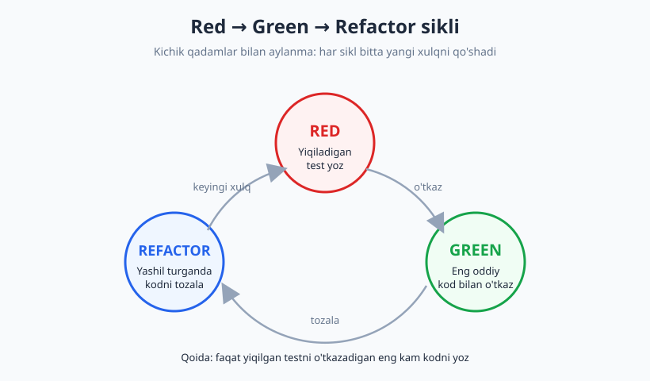
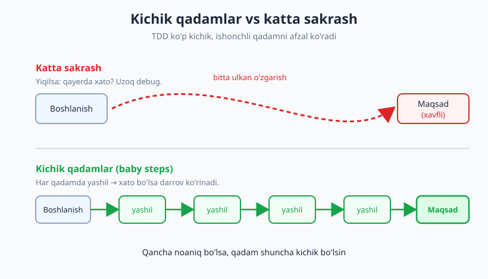
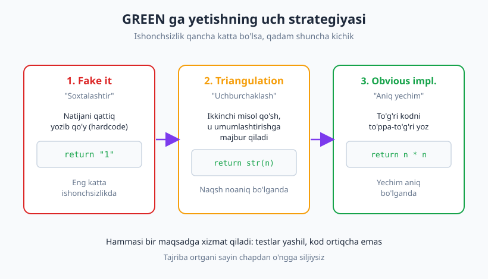

# 11 — TDD: Red-Green-Refactor

[🏠 README](./README.md) · [⬅️ Oldingi: 10 — Testlanadigan dizayn](./10-testlanadigan-dizayn.md) · [Keyingi: 12 — TDD amaliyotda (kata) ➡️](./12-tdd-amaliyot-kata.md)

---

> **Bu bobda:** test-driven development (TDD) — avval test, keyin kod yozish intizomi bilan
> tanishasiz. Red-Green-Refactor siklini har bosqichi bilan; "fake it", "triangulation" va
> "obvious implementation" strategiyalarini; kichik qadamlar falsafasini va kichik jonli demoni
> ko'ramiz. Oxirida TDD foydasini va — halol — uning chegaralarini ("TDD har joyda mos emas")
> muhokama qilamiz.
>
> **Halollik / Eslatma:** bu bob TDD ning *mexanikasi va falsafasi* haqida. To'liq, boshidan
> oxirigacha haydaladigan **kata** (mashq) — keyingi [12-bobda](./12-tdd-amaliyot-kata.md).
> Bu yerdagi demolar qisqa: maqsad — siklni *his qilish*. TDD — din emas, **asbob**; oxirida
> qachon mos kelmasligini ham ochiq aytamiz. Barcha Python namunalari `python -m pytest`
> (Python 3.14, pytest 9.0.3) bilan haqiqatan ishga tushirib tekshirilgan, chiqishlar nusxa.

---

## TDD nima: avval test, keyin kod

Tasavvur qiling, uy quryapsiz. Ikki yo'l bor. **Birinchi yo'l:** devorlarni ko'tarib, tomni
yopib, keyin "shu uy chizmaga to'g'ri keldimi?" deb tekshirasiz. **Ikkinchi yo'l:** avval aniq
chizma chizasiz — "bu yerda eshik, bu yerda deraza bo'lsin" — keyin shu chizmaga qarab quryapsiz.
Chizma sizga har g'ishtdan keyin "to'g'ri ketyapmanmi?" degan savolga javob beradi.

**Test-driven development** (TDD, "test haydaydigan ishlab chiqish") — ikkinchi yo'l. Siz kodni
yozishdan **oldin** uning qanday ishlashi kerakligini **test** shaklida yozasiz. Test — sizning
chizmangiz. Kent Beck buni 1990-yillarda mashhur qildi (aslida g'oya undan ham qadimiy):

| | Test-after ("keyin") | Test-first / TDD ("avval") |
|---|---|---|
| Tartib | Kod &#8594; keyin test | Test &#8594; keyin kod |
| Test nimani aks ettiradi | Yozilgan kodni (tasdiqlash) | Kerakli xulqni (spetsifikatsiya) |
| "Test yozdimmi?" xavfi | Oson unutiladi / qoldiriladi | Test bo'lmasa kod ham yo'q |
| Dizaynga ta'sir | Kechikkan | Darrov: test og'rig'i = dizayn signali (10-bob) |
| Tipik xato | Kodga moslab test yozish | — (test avval, kod hali yo'q) |

E'tibor bering: TDD — **test metodi emas, dizayn metodi**. Siz test yozayotganda aslida kodning
**interfeysini** loyihalaysiz: "bu funksiya nima qabul qiladi, nima qaytaradi?" Test yiqilsa,
demak interfeys hali yo'q yoki noto'g'ri. Bu — 10-bobdagi "testability = dizayn signali" g'oyasining
amaliy davomi.

> **Eslatma:** "avval test" so'zma-so'z "birinchi qatorgacha hech narsa qilmaslik" degani emas.
> Siz baribir o'ylaysiz, qoralama qilasiz. TDD shuni aytadi: **ishonchli, qoladigan kod yozishni**
> test bilan boshlang — test sizning birinchi "mijozingiz" bo'lsin.

---

## Red-Green-Refactor sikli

TDD ning yuragi — uch bosqichli **mantra**: **Red &#8594; Green &#8594; Refactor**. Bu sikl
aylanib turadi: har aylanish bitta kichik yangi xulqni qo'shadi.



### 🔴 RED — yiqiladigan test yoz

Hali kod yo'q (yoki yetarli emas) yangi xulq uchun **test yozasiz**. Bu test **yiqilishi shart** —
chunki uni o'tkazadigan kod hali mavjud emas.

- **Maqsad:** kerakli xulqni aniq, ishlaydigan spetsifikatsiya sifatida belgilash.
- **Qoida:** testni ishga tushir va **haqiqatan yiqilganini ko'r**. Agar yangi test darrov o'tib
  ketsa — bu xavf signali: yo test hech narsa tekshirmayapti, yo xulq allaqachon bor.

### 🟢 GREEN — eng oddiy kod bilan o'tkaz

Endi testni yashil qiladigan **eng kam, eng oddiy** kodni yozasiz — hatto u "uyat" darajada
sodda bo'lsa ham (masalan, natijani qattiq yozib qo'yish — "fake it").

- **Maqsad:** imkon qadar tez yashilga yetish. Hozir chiroyli kod yozish vaqti emas.
- **Qoida:** **faqat yiqilgan testni o'tkazadigan kodni yoz** — bir qator ham ortiq emas.
  "Bu kelajakda kerak bo'ladi" deb qo'shimcha mantiq yozmang (bu — YAGNI buzilishi).

### 🔵 REFACTOR — kodni tozala (testlar yashil turganda)

Testlar yashil. Endi — va faqat endi — kodni **tozalaysiz**: takrorni olib tashlash, nomlarni
yaxshilash, tuzilishni soddalashtirish. Xulq **o'zgarmaydi**, faqat shakl yaxshilanadi.

- **Maqsad:** dizaynni sog'lom saqlash, qarzni darrov to'lash.
- **Qoida:** har refactor qadamidan keyin testlarni qayta ishga tush — **yashil turishi shart**.
  Yashil "to'r" sizni xato qilishdan saqlaydi (13-bob — refactoring chuqurroq).

> **Diqqat:** uchala bosqich ham **muhim**. Eng ko'p tashlab ketiladigan — REFACTOR.
> "Yashil bo'ldi-ku" deb keyingi RED ga shoshilsangiz, kod asta-sekin botqoqqa botadi.
> Yashil — refactoring uchun **eng xavfsiz** payt; uni o'tkazib yubormang.

---

## "Faqat yiqilgan testni o'tkazish uchun kod yoz" — intizom

Bu — TDD ning eng qiyin, eng muhim qoidasi. Tabiiy istak: "shu yerda-ku, butun funksiyani
yozib tashlayman". TDD bunga **yo'q** deydi. Sabab:

1. **Har qator kodning o'z testi bo'lsin.** Test yiqilmasdan yozilgan kod — testlanmagan kod.
2. **Kichik qadamlar = kichik xato maydoni.** Bir qatorlik o'zgarishdan keyin test yiqilsa,
   xato qayerdaligi aniq. Yuz qator yozib, keyin "qayerda buzildi?" deb soatlab debug qilmaysiz.
3. **YAGNI** (You Aren't Gonna Need It — "kerak bo'lmaydi"): kelajak uchun "ehtimol" kerak
   bo'ladigan kod — ko'pincha hech qachon kerak bo'lmaydi, lekin baribir bug va og'irlik keltiradi.



**Baby steps** (kichik qadamlar) — TDD madaniyatining shiori. Qadamning kattaligi sizning
**ishonchingizga** bog'liq: yechim aniq bo'lsa — kattaroq qadam; chigal, yangi bo'lsa — eng
kichik qadam. Tajribali TDD-chi qadam o'lchamini holatga qarab moslaydi.

---

## GREEN ga yetishning uch strategiyasi

RED dan GREEN ga o'tishning uch yo'li bor (Kent Beck "Test-Driven Development by Example"
kitobida). Tanlov sizning **ishonchsizligingizga** bog'liq.



| Strategiya | Nima qilasiz | Qachon |
|---|---|---|
| **Fake it** | Natijani qattiq yozib qo'yasiz (`return "1"`) | Eng katta ishonchsizlikda; yashilni "tezda" ko'rish uchun |
| **Triangulation** | 2-misol qo'shib, umumlashtirishga majbur qilasiz | Naqsh hali noaniq; misollar yo'l ko'rsatsin |
| **Obvious implementation** | To'g'ri kodni to'ppa-to'g'ri yozasiz | Yechim aniq va kichik bo'lganda |

**Fake it ("fake it till you make it"):** "uddalaguningcha soxtalashtir". Bitta misolni
qattiq qaytarib, yashilga yetasiz. Bu ahmoqona ko'rinadi, lekin g'oyasi bor: yashil holatga
o'tish va keyin **soxtalikni asta haqiqatga aylantirish**.

**Triangulation (uchburchaklash):** geometriyada ikki nuqtadan uchinchisini topganday — ikki
test misolidan umumiy yechim "kelib chiqadi". Bitta misolni `return "1"` bilan soxtalashtirsangiz,
ikkinchi misol (`fizzbuzz(2) == "2"`) sizni umumlashtirishga (`return str(n)`) **majbur** qiladi.

**Obvious implementation:** yechim shundoq ko'rinib turibdi — `return n * n` — uni to'g'ridan
yozasiz. Tajribali dasturchi ko'p joyda shundan boshlaydi. Lekin **ehtiyot bo'ling:** "aniq"
deb o'ylagan kodingiz yiqilsa, darrov fake it/triangulationga **qayting** (kichikroq qadam).

> **Trade-off:** doim fake it bilan boshlash — sekin va zerikarli; doim "obvious" — xatarli
> (katta sakrash). Mohirlik — qadam o'lchamini holatga qarab tanlash. Charchagansiz yoki masala
> chigalmi — qadamni kichraytiring; ravonsiz va aniqmi — kattalashtiring.

### Transformation Priority Premise (qisqa kirish)

Robert Martin (Uncle Bob) bir kuzatuv qildi: kodni soxtadan umumiyga aylantirishning **tartibi**
bor. Sodda transformatsiyalar (masalan, `konstanta &#8594; o'zgaruvchi`, `qiymat &#8594; massiv`,
`shart &#8594; sikl`) "arzonroq" va ularni **avval** qo'llash kerak. Bu — **Transformation
Priority Premise** (TPP, "transformatsiya ustuvorligi farazi"). Amaliy xulosa: GREEN bosqichida
**eng sodda** transformatsiyani tanlang — shunda algoritm tabiiy, bosqichma-bosqich "o'sib" chiqadi.
Bu yerda nomini biling yetadi; chuqurroq qo'llashni keyingi katada ko'ramiz.

---

## Kichik jonli demo: FizzBuzz

Endi siklni **haqiqiy pytest chiqishi** bilan ko'ramiz. Klassik mashq — **FizzBuzz**: 3 ga
bo'linsa "Fizz", 5 ga "Buzz", ikkalasiga ham "FizzBuzz", aks holda sonning o'zi. To'liq kata
emas — faqat siklning mexanikasini his qilish uchun 2-3 aylanma.

### 🔴 1-sikl, RED: birinchi test

`fizzbuzz` funksiyasi hali yo'q. Eng oddiy holatdan boshlaymiz:

```python
# test_fizzbuzz.py
from fizzbuzz import fizzbuzz

def test_oddiy_son():
    assert fizzbuzz(1) == "1"
```

Funksiya stub'i (hali "noto'g'ri", ataylab):

```python
# fizzbuzz.py
def fizzbuzz(n):
    return None
```

Ishga tushiramiz — **yiqilishi shart**:

```text
    def test_oddiy_son():
>       assert fizzbuzz(1) == "1"
E       AssertionError: assert None == '1'
E        +  where None = fizzbuzz(1)
1 failed in 0.68s
```

Mana 🔴 **RED** — haqiqiy yiqilish. Test bizning chizmamizni belgiladi: `fizzbuzz(1)` "1" qaytarsin.

### 🟢 1-sikl, GREEN: fake it

Eng oddiy kod bilan o'tkazamiz — qattiq yozib qo'yamiz ("fake it"):

```python
# fizzbuzz.py
def fizzbuzz(n):
    return "1"
```

```text
.                                                                        [100%]
1 passed in 0.60s
```

🟢 **GREEN.** Ha, bu "aldash". Lekin endi yashilmiz — keyingi test uni haqiqatga majbur qiladi.

### 🔴 2-sikl, RED: triangulation

Ikkinchi misol qo'shamiz — bu `return "1"` ni umumlashtirishga **majbur** qiladi:

```python
# test_fizzbuzz.py
def test_ikkinchi_oddiy_son():
    assert fizzbuzz(2) == "2"
```

```text
    def test_ikkinchi_oddiy_son():
>       assert fizzbuzz(2) == "2"
E       AssertionError: assert '1' == '2'
1 failed, 1 passed in 0.67s
```

🔴 **RED.** Bitta soxta qiymat endi yetmaydi.

### 🟢 2-sikl, GREEN: umumlashtir

```python
# fizzbuzz.py
def fizzbuzz(n):
    return str(n)
```

```text
..                                                                       [100%]
2 passed in 0.53s
```

🟢 Soxtalik haqiqatga aylandi. Triangulation ishladi: ikki misol bizni `str(n)` ga yetkazdi.

### 🔴🟢 3-sikl: Fizz qoidasi

Yangi xulq — 3 ga bo'linish:

```python
# test_fizzbuzz.py
def test_uchga_bolinsa_fizz():
    assert fizzbuzz(3) == "Fizz"
```

RED (kutilganidek `'3'` qaytadi):

```text
>       assert fizzbuzz(3) == "Fizz"
E       AssertionError: assert '3' == 'Fizz'
1 failed, 2 passed in 0.67s
```

GREEN — eng kam shart:

```python
# fizzbuzz.py
def fizzbuzz(n):
    if n % 3 == 0:
        return "Fizz"
    return str(n)
```

```text
...                                                                      [100%]
3 passed in 0.54s
```

Shu tarzda Buzz (`% 5`) va FizzBuzz (`% 15`) ni ham qo'shamiz. To'liq test to'plamini
parametrlangan ([06-bob](./06-fixture-parametrize.md)) shaklda yig'amiz:

```python
# test_fizzbuzz.py
import pytest
from fizzbuzz import fizzbuzz

@pytest.mark.parametrize("son, kutilgan", [
    (1, "1"), (2, "2"), (3, "Fizz"), (5, "Buzz"),
    (6, "Fizz"), (10, "Buzz"), (15, "FizzBuzz"), (30, "FizzBuzz"),
])
def test_fizzbuzz(son, kutilgan):
    assert fizzbuzz(son) == kutilgan
```

Buzz/FizzBuzz hali yo'q — 🔴 **RED**:

```text
FAILED test_fizzbuzz.py::test_fizzbuzz[10-Buzz] - AssertionError: assert '10'...
FAILED test_fizzbuzz.py::test_fizzbuzz[15-FizzBuzz] - AssertionError: assert ...
FAILED test_fizzbuzz.py::test_fizzbuzz[30-FizzBuzz] - AssertionError: assert ...
4 failed, 4 passed in 0.69s
```

GREEN — to'liq mantiq:

```python
# fizzbuzz.py
def fizzbuzz(n):
    if n % 15 == 0:
        return "FizzBuzz"
    if n % 3 == 0:
        return "Fizz"
    if n % 5 == 0:
        return "Buzz"
    return str(n)
```

```text
........                                                                 [100%]
8 passed in 0.53s
```

### 🔵 REFACTOR: kodni tozala (yashil turgancha)

Hammasi yashil. Endi `% 15` takrorini olib tashlaymiz — `"Fizz" + "Buzz"` bir-biriga qo'shilsin:

```python
# fizzbuzz.py
def fizzbuzz(n):
    natija = ""
    if n % 3 == 0:
        natija += "Fizz"
    if n % 5 == 0:
        natija += "Buzz"
    return natija or str(n)
```

Refactordan keyin testlarni **qayta** ishga tushiramiz — yashil turishi shart:

```text
........                                                                 [100%]
8 passed in 0.53s
```

🔵 **REFACTOR muvaffaqiyatli:** xulq o'zgarmadi (8 passed), kod soddalashdi. Test to'ri bizni
xato qilishdan saqladi — agar refactor xulqni buzganida, biron test darrov qizarardi.

> **Eslatma:** to'liq, bosqichma-bosqich haydaladigan kata — masalan rim raqamlari yoki
> qavslar balansi — [12-bobda](./12-tdd-amaliyot-kata.md). U yerda har qadamni real vaqtda,
> hech narsa o'tkazib yubormay ko'rsatamiz.

---

## TDD foydasi

- **Yaxshi dizayn.** Test avval yozilgani uchun kod **testlanadigan** bo'lib tug'iladi: kichik
  birliklar, aniq interfeys, past coupling ([10-bob](./10-testlanadigan-dizayn.md)). Test og'rig'i
  darrov sezilib, dizaynni to'g'irlaydi.
- **Kam debug.** Kichik qadamlar tufayli xato har doim "oxirgi qatorda". Soatlab debugger
  ushlab o'tirish o'rniga, darrov qaytib tuzatasiz.
- **Yashash hujjat.** Testlar — kodning qanday ishlashini ko'rsatadigan, **doim yangilanadigan**
  spetsifikatsiya. Hujjat eskirmaydi, chunki yiqilsa CI darrov ogohlantiradi.
- **Ishonch va tezlik.** Yashil to'r borligi uchun kodga botinib tegasiz, refactoring qilasiz,
  qo'shasiz — qo'rqmasdan. Uzoq muddatda bu **tezroq**.
- **Tugaganini bilish.** "Qachon tugadi?" degan savolga aniq javob: barcha testlar yashil va
  yangi test qo'shadigan xulq qolmadi.

---

## Halol gap: TDD tanqidi va chegaralari

TDD — kuchli, lekin **din emas**. Uni har joyga, har holatda majburlash — xatolik. Halol bo'laylik:

**1. Har joyda mos emas.**

- **Tadqiqot / prototip ("spike"):** yechim hali noaniq, siz tajriba qilyapsiz. Avval test
  yozish — bilmagan narsangizni spetsifikatsiya qilishga urinish. Bunda avval o'ynab ko'ring,
  yechim aniq bo'lgach test bilan **qayta** yozing.
- **UI / vizual / o'yin grafikasi:** "to'g'ri ko'rinish" ni assert qilish qiyin. Bu yerda
  ko'z bilan ko'rish, snapshot ([23-bob](./23-snapshot-approval-testing.md)) yoki E2E
  ([19-bob](./19-e2e-ui-testlar.md)) ko'proq mos.
- **Tez o'zgaradigan, bir martalik skript:** TDD overhead'i foydadan ko'p bo'lishi mumkin.

**2. O'rganish egri chizig'i bor.** Boshida TDD **sekinroq** tuyuladi va g'ashga tegadi. Ravonlik
amaliyot bilan keladi (12-bob kata aynan shuning uchun). Boshlovchi ko'pincha juda katta qadam
tashlaydi yoki implementatsiyaga yopishgan mo'rt test yozadi.

**3. "TDD = dizayn metodi" munozarasi.** Ko'pchilik (jumladan Beck) TDD ni avvalo **dizayn**
quroli deydi, "test yozish texnikasi" emas. Bu farq muhim: TDD sizga test **bermaydi**, balki
test orqali yaxshi **dizayn**ni haydab chiqaradi. Test — yon mahsulot (juda qimmatli yon mahsulot).

**4. "TDD is dead" bahsi.** 2014-da David Heinemeier Hansson (DHH, Rails muallifi) "TDD is dead"
deb yozdi va katta munozara ko'tarildi (u, Beck va Martin Fowler suhbatlari). Asosiy tanqid:
**mock-og'ir TDD** — har bog'liqlikni mock qilib, "izolyatsiya" deb atalmish testlar yozish —
implementatsiyaga yopishib qoladi, refactoringni qiyinlashtiradi va dizaynni mock'lar shakliga
buzadi (08-bobdagi **over-mocking** tuzog'i). Xolis xulosa: TDD o'lmagan, lekin **ko'r-ko'rona
mock-og'ir TDD** zararli. Ko'p joyda real obyekt yoki fake ([10-bob](./10-testlanadigan-dizayn.md))
mock'dan yaxshiroq.

> **Trade-off / Diqqat:** TDD ni "100% har joyda" yoki "umuman kerak emas" deb qarama-qarshi
> qo'yish — soxta tanlov. Pragmatik yondashuv: mantiq murakkab, xulq aniq belgilanadigan,
> regressiya xavfi yuqori joyda TDD — ajoyib. Tadqiqot, UI, throwaway skriptda — moslashtiring
> yoki tashlang. Asbobni vazifaga moslang, vazifani asbobga emas.

**Til-mustaqillik.** Red-Green-Refactor sikli **har tilda bir xil**: JavaScript'da Jest/Vitest
"watch mode" da test qizaradi-yashillanadi, PHP'da PHPUnit/Pest, Java'da JUnit, Go'da `testing`.
Sintaksis o'zgaradi, **mantra o'zgarmaydi**: yiqiladigan test &#8594; o'tkaz &#8594; tozala.

---

## Asosiy g'oyalar (bobni qisqacha)

- **TDD = avval test, keyin kod.** Test — kerakli xulqning ishlaydigan spetsifikatsiyasi (chizma), kodning tasdig'i emas.
- **Red-Green-Refactor:** 🔴 yiqiladigan test yoz &#8594; 🟢 eng oddiy kod bilan o'tkaz &#8594; 🔵 yashil turganda kodni tozala. Sikl aylanadi.
- **Faqat yiqilgan testni o'tkazadigan kodni yoz** — bir qator ham ortiq emas (YAGNI). Kichik qadamlar = kichik xato maydoni.
- **Fake it:** natijani qattiq yozib yashilga yet (eng katta ishonchsizlikda). **Triangulation:** 2-misol umumlashtirishga majbur qiladi. **Obvious:** yechim aniq bo'lsa to'g'ridan yoz.
- **Transformation Priority Premise:** sodda transformatsiyani avval qo'lla — algoritm bosqichma-bosqich o'sib chiqsin.
- **REFACTOR ni tashlab ketma** — yashil eng xavfsiz tozalash payti. Har qadamdan keyin testlarni qayta ishga tush.
- **TDD foydasi:** testlanadigan dizayn, kam debug, yashash hujjat, ishonch, "tugadi"ni bilish.
- **Halol chegara:** tadqiqot/prototip/UI da mos emas; o'rganish egri chizig'i bor; mock-og'ir TDD ("TDD is dead" bahsi) — over-mocking tuzog'i. Asbobni vazifaga moslang.

---

## Mashqlar

### Oson

**1-mashq.** Red-Green-Refactor siklining uch bosqichini tartibi bilan ayting va har biriga
bitta **qoida** keltiring (har bosqichda nima qilish *taqiqlangan* yoki *shart*).

**2-mashq.** "Test-after" va "test-first" o'rtasidagi asosiy farqni ayting. Nega "avval test"
test yozishni *unutib* qoldirishdan saqlaydi?

**3-mashq.** Quyidagi uch holatning har biri uchun qaysi GREEN strategiyasi (fake it /
triangulation / obvious) eng mosligini ayting va sababini yozing:
(a) `kvadrat(n)` — sonni kvadratga oshiradi (yechim aniq).
(b) Murakkab, hali tushunmagan formatlash funksiyasi.
(c) Hozircha bitta test bor, naqsh hali ko'rinmayapti.

### O'rta

**4-mashq.** Quyidagi `rim(n)` funksiyasini TDD bilan 1 dan 3 gacha "haydang". Birinchi testdan
boshlab, **fake it &#8594; triangulation** yo'li bilan kamida 3 qadam yozing (test &#8594; kod
&#8594; test &#8594; kod). Har qadamda RED/GREEN ni belgilang.

**5-mashq.** Quyidagi kod TDD intizomini buzadi: bitta test uchun **ortiqcha** mantiq yozilgan.
Qaysi qatorlar "kerak emas" (YAGNI buzilishi) ekanini ko'rsating va faqat testni o'tkazadigan
minimal versiyani yozing.

```python
# test
def test_salom():
    assert salom("Ali") == "Salom, Ali!"

# kod
def salom(ism, til="uz", katta_harf=False, qichqiriq=False):
    natija = f"Salom, {ism}!"
    if til == "en":
        natija = f"Hello, {ism}!"
    if katta_harf:
        natija = natija.upper()
    if qichqiriq:
        natija += "!!!"
    return natija
```

**6-mashq.** REFACTOR bosqichi nega faqat testlar **yashil** bo'lganda bajariladi? Agar siz
qizil holatda (test yiqilgan) refactoring qilsangiz, qanday xavf bor? Ikki jumla bilan tushuntiring.

### Qiyin

**7-mashq.** "Kabisa yili" (leap year) funksiyasini TDD bilan yozing: yil 4 ga bo'linsa kabisa,
lekin 100 ga bo'linsa kabisa emas, ammo 400 ga bo'linsa yana kabisa. **Triangulation** yordamida
qoidani qadam-baqadam ochib boring (2024 &#8594; 2023 &#8594; 1900 &#8594; 2000). Har test
qaysi yangi qoidani "majburlashini" yozing.

**8-mashq.** "TDD is dead" bahsidagi asosiy tanqid — **mock-og'ir TDD** edi. O'z so'zingiz bilan:
(a) over-mocking nega testni implementatsiyaga "yopishtiradi" va refactoringni qiyinlashtiradi?
(b) [10-bobdagi](./10-testlanadigan-dizayn.md) qaysi yondashuv (fake/port) ko'p joyda mock'dan
yaxshiroq va nega? (c) "TDD o'ldimi?" — o'z xulosangizni bering (xolis, ikki tomonni ko'rib).

<details markdown="1">
<summary>Yechimlar</summary>

### 1-mashq yechimi

🔴 **RED** — yiqiladigan test yoz. *Qoida:* testni ishga tushir va **haqiqatan yiqilganini ko'r**
(darrov o'tib ketsa — test bo'sh yoki xulq allaqachon bor).
🟢 **GREEN** — eng oddiy kod bilan o'tkaz. *Qoida:* **faqat** yiqilgan testni o'tkazadigan kod
yoz, bir qator ortiq emas (YAGNI). "Fake it" ham ruxsat.
🔵 **REFACTOR** — kodni tozala. *Qoida:* xulqni o'zgartirmasdan tozala; har qadamdan keyin
testlar **yashil** turishi shart.

### 2-mashq yechimi

**Test-after:** avval kod, keyin test — test yozilgan kodni *tasdiqlaydi*. **Test-first (TDD):**
avval test, keyin kod — test kerakli xulqning *spetsifikatsiyasi*. "Avval test" unutishdan
saqlaydi, chunki TDD da **test bo'lmasa, kod ham yo'q** — yiqiladigan test yozmaguningizcha kod
yozishni boshlamaysiz. Test-after da esa kod ishlab turibdi, deadline yaqin, va test "keyinroq"
ga qoldiriladi (ko'pincha — hech qachon).

### 3-mashq yechimi

(a) **Obvious implementation** — `return n * n`. Yechim aniq, kichik; soxtalashtirish ortiqcha.
(b) **Fake it** — eng katta ishonchsizlikda. Bitta misolni qattiq qaytarib yashilga yet, keyin
asta haqiqatga aylantir (yangi misollar bilan).
(c) **Triangulation** — ikkinchi misol qo'shib, umumiy naqshni "uchburchaklab" toping. Bitta
misol soxta qiymat bilan ham o'tadi; ikkinchisi umumlashtirishga majbur qiladi.

### 4-mashq yechimi

```python
# 1-qadam RED: test_rim.py
from rim import rim
def test_bir():
    assert rim(1) == "I"
# rim.py yo'q / "I" qaytarmaydi -> RED

# 1-qadam GREEN (fake it):
def rim(n):
    return "I"
# -> 1 passed

# 2-qadam RED: ikkinchi misol (triangulation)
def test_ikki():
    assert rim(2) == "II"
# "I" qaytadi -> assert 'I' == 'II' -> RED

# 2-qadam GREEN (umumlashtirishga majbur):
def rim(n):
    return "I" * n
# -> 2 passed

# 3-qadam: uchinchi misol naqshni tasdiqlaydi
def test_uch():
    assert rim(3) == "III"
# "I" * 3 == "III" -> darrov GREEN (naqsh to'g'ri edi)
```

Haqiqiy ishga tushirishda parametrlangan to'plam `[(1,"I"),(2,"II"),(3,"III")]` — `3 passed`.
(Eslatma: bu faqat 1..3; to'liq rim raqami algoritmi 12-bobdagi katada haydaladi.)

### 5-mashq yechimi

`til`, `katta_harf`, `qichqiriq` parametrlari va ularning `if` bloklari — **hammasi "kerak emas"**
(YAGNI buzilishi). Bitta test faqat `salom("Ali") == "Salom, Ali!"` ni talab qiladi. Minimal,
TDD-mos versiya:

```python
def salom(ism):
    return f"Salom, {ism}!"

# test: assert salom("Ali") == "Salom, Ali!"  -> 1 passed
```

Til, katta harf yoki qichqiriq **kerak bo'lsa**, har biriga avval yiqiladigan test yozib, keyin
qo'shasiz. Test bo'lmagan kod = testlanmagan, ehtimol kerak bo'lmaydigan kod.

### 6-mashq yechimi

REFACTOR faqat yashilda bajariladi, chunki yashil to'plam — sizning **xavfsizlik to'ringiz**:
refactoring kodning *shaklini* o'zgartiradi, agar xulqni tasodifan buzsangiz, biron test darrov
qizaradi va sizni ogohlantiradi. Agar **qizil** holatda refactoring qilsangiz, allaqachon yiqilgan
test bormi — yo yangi xato kiritdingizmi, ajratib bo'lmaydi: signal "shovqin"ga aralashadi va
ikki muammoni bir vaqtda quvib, chalkashasiz.

### 7-mashq yechimi

```python
# kabisa.py
def kabisa_yilmi(yil):
    if yil % 400 == 0:
        return True
    if yil % 100 == 0:
        return False
    return yil % 4 == 0
```

```python
# test_kabisa.py
import pytest
from kabisa import kabisa_yilmi

@pytest.mark.parametrize("yil, kutilgan", [
    (2024, True),   # 4 ga bo'linadi -> kabisa
    (2023, False),  # 4 ga bo'linmaydi -> kabisa emas
    (1900, False),  # 100 ga bo'linadi (400 ga emas) -> kabisa emas
    (2000, True),   # 400 ga bo'linadi -> kabisa
])
def test_kabisa(yil, kutilgan):
    assert kabisa_yilmi(yil) == kutilgan
# -> 4 passed
```

Har test yangi qoidani majburlaydi: **2024** "4 ga bo'linsa kabisa" (eng oddiy, `return yil % 4
== 0` yetadi). **2023** uni mustahkamlaydi. **1900** "100 ga bo'linsa emas" istisnosini qo'shtiradi
(`if yil % 100 == 0: return False`). **2000** "400 ga bo'linsa yana kabisa" eng tashqi istisnosini
qo'shtiradi — shuning uchun `% 400` tekshiruvi `% 100` dan **oldin** turishi shart. Bu —
triangulation: misollar bizni to'g'ri tartibga "itarib" boradi.

### 8-mashq yechimi

(a) **Over-mocking** testni implementatsiyaga yopishtiradi, chunki har mock "shu metod, shu
tartibda, shu argument bilan chaqirilsin" deb kutadi. Bu — kodning *qanday* ishlashini
(implementatsiya), *nima* qilishini (xulq) emas, tekshiradi. Refactoring qilsangiz (ichki
chaqiruvlar o'zgaradi, lekin xulq bir xil), mock'lar yiqiladi — garchi kod hamon to'g'ri ishlasa
ham. Natijada testlar refactoringga to'sqinlik qiladi.
(b) Ko'p joyda **fake** (haqiqiy ishlaydigan sodda implementatsiya) yoki **o'zing egang bo'lgan
port** ortidagi stub yaxshiroq (10-bob). Sabab: fake xulqni tekshiradi (natija to'g'rimi),
implementatsiya tafsilotini emas — shuning uchun refactoringga chidamli. "O'zing egang bo'lmaganni
mock qilma".
(c) Xolis xulosa: **TDD o'lmagan.** O'lgani — har bog'liqlikni ko'r-ko'rona mock qiladigan, dizaynni
mock shakliga buzadigan **mock-og'ir** uslub. Mantiq murakkab, regressiya xavfi yuqori joyda
RED-GREEN-REFACTOR ajoyib ishlaydi; real obyekt/fake'ni afzal ko'ring, mock'ni faqat zarur
chegarada ishlat. TDD — asbob: vazifaga mosligiga qarab qo'llang.

</details>

---

[🏠 README](./README.md) · [⬅️ Oldingi: 10 — Testlanadigan dizayn](./10-testlanadigan-dizayn.md) · [Keyingi: 12 — TDD amaliyotda (kata) ➡️](./12-tdd-amaliyot-kata.md)
