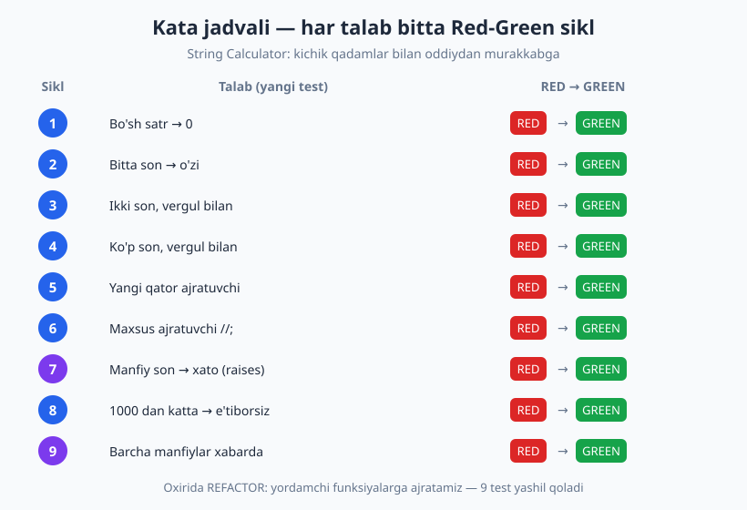
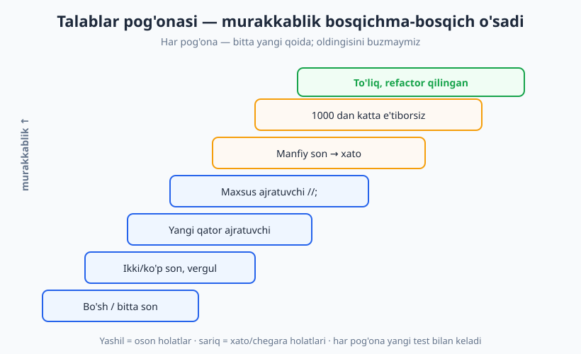
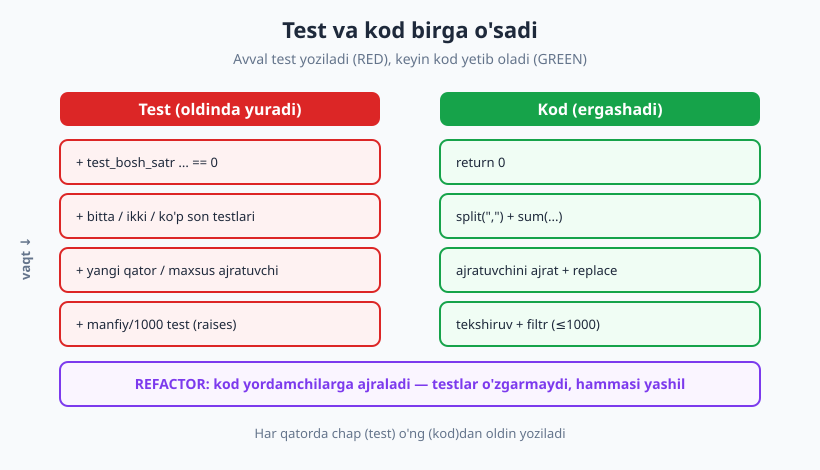

# 12 — TDD amaliyotda: to'liq misol (kata)

[🏠 README](./README.md) · [⬅️ Oldingi: 11 — TDD: Red-Green-Refactor](./11-tdd-red-green-refactor.md) · [Keyingi: 13 — Refactoring va testlar ➡️](./13-refactoring-va-testlar.md)

---

> **Bu bobda:** 11-bobda Red-Green-Refactor *nazariyasini* ko'rdik. Endi uni **ish boshida**
> ko'ramiz: bitta masalani boshidan oxirigacha, faqat testlar yetaklab borib yechamiz. Tanlangan
> masala — klassik **String Calculator** ("satrli kalkulyator") kata. To'qqizta kichik Red-Green
> sikldan o'tib, oddiy `qoshuvchi("")` dan boshlab, maxsus ajratuvchilar va xato holatlarini
> qo'llaydigan to'liq funksiyaga yetamiz. Har bir sikl haqiqiy `pytest` chiqishi bilan ko'rsatilgan.
>
> **Halollik / Eslatma:** "kata" — bu mashq, demak maqsad faqat tayyor kod emas, balki **jarayon**
> his-tuyg'usi: qadam qancha kichik, dizayn qanday tabiiy o'sadi, testlar qancha ishonch beradi.
> Bu yerda biz kodni *bilib turib* sodda boshlaymiz — bu ataylab. Real loyihada ham TDD shunday
> ketadi. Barcha kod namunalari `python -m pytest` (Python 3.14, pytest 9.0.3) bilan haqiqatan
> ishga tushirib, chiqishi tekshirilgan.

---

## Kata nima va nega kerak

Yapon jang san'atlarida **kata** — aniq, takrorlanadigan harakatlar to'plami. Usta uni minglab
marta takrorlaydi, toki harakat o'ylamasdan, refleks darajasida chiqadigan bo'lguncha. Maqsad —
yangi harakat o'ylab topish emas, balki ma'lum harakatni **mukammal va avtomatik** qilish.

Dasturlashda **kod kata** ham xuddi shu: ma'lum bir kichik masalani **TDD bilan qayta-qayta**
yechib, Red-Green-Refactor ritmini "muscle memory" (mushak xotirasi) darajasiga olib chiqasiz.
Birinchi marta sekin va noqulay bo'ladi; o'ninchi marta esa qadamlar o'z-o'zidan keladi.

> **Markaziy g'oya:** Kata — bu *natija* emas, *mashq*. Siz allaqachon bilgan masalani qayta yechasiz,
> chunki maqsad — javobni topish emas, balki **TDD ritmini singdirish**. Pianinochi gammalarni
> har kuni chalgani kabi.

Bu bobda biz bitta katani **bir marta**, lekin juda batafsil bajaramiz — har sikl-ni mikroskop
ostida ko'rsatamiz. Keyin o'zingiz uni qayta, qayta bajarasiz (mashqlarda yana katalar beramiz).



---

## Masala: String Calculator

Kata talablari — qadam-baqadam o'sib boradi. Mana to'liq spetsifikatsiya:

| # | Talab | Misol |
|---|---|---|
| 1 | Bo'sh satr → `0` | `""` → `0` |
| 2 | Bitta son → o'sha sonning o'zi | `"7"` → `7` |
| 3 | Ikki son, vergul bilan → yig'indi | `"3,4"` → `7` |
| 4 | Ixtiyoriy sondagi sonlar | `"1,2,3,4,5"` → `15` |
| 5 | Yangi qator (`\n`) ham ajratuvchi | `"1\n2,3"` → `6` |
| 6 | Maxsus ajratuvchi: `//;\n1;2` | `"//;\n1;2"` → `3` |
| 7 | Manfiy son → xato (`ValueError`) | `"1,-2,3"` → xato |
| 8 | 1000 dan katta son e'tiborsiz | `"2,1001"` → `2` |
| 9 | Barcha manfiylar xato xabarida | `"1,-2,3,-4"` → "... -2, -4" |

Eng muhimi: bularning hammasini **birdaniga** o'qib, "katta yechim" yozishga shoshilmaymiz.
Aksincha, **bittadan** olamiz. Har talab — bitta Red-Green sikl. Murakkablik pog'ona kabi o'sadi:



> **Eslatma — nega aynan String Calculator?** Bu kata boshlovchi uchun ideal: birinchi qadam
> ahmoqona darajada sodda (`return 0`), oxirgi qadam esa parsing, xato boshqaruvi va filtrlashni
> talab qiladi. Ya'ni kichik qadamning kuchini ham, dizayn evolyutsiyasini ham bitta misolda
> ko'rsatadi. Bowling (kegli) o'yini hisobi ham mashhur kata — uni mashqlarga qoldiramiz.

Endi boshladik. **Bitta qoida:** har siklda avval yiqiladigan test, keyin uni o'tkazadigan eng
**minimal** kod. Murakkablashtirmaymiz — kelajak talab uchun bugun kod yozmaymiz.

---

## Sikl 1 — bo'sh satr → 0

**RED.** Avval test. Hali `qoshuvchi.py` da haqiqiy mantiq yo'q — bo'sh "skelet":

```python
# qoshuvchi.py
def qoshuvchi(satr):
    pass
```

```python
# test_qoshuvchi.py
from qoshuvchi import qoshuvchi

def test_bosh_satr_nol_qaytaradi():
    assert qoshuvchi("") == 0
```

`python -m pytest -q` ishlatamiz — haqiqiy chiqish:

```text
F
________________________ test_bosh_satr_nol_qaytaradi _________________________
    def test_bosh_satr_nol_qaytaradi():
>       assert qoshuvchi("") == 0
E       AssertionError: assert None == 0
E        +  where None = qoshuvchi('')
1 failed in 0.75s
```

Test **RED** (yiqildi) — funksiya `None` qaytaryapti. Bu yaxshi: test ishlayotganini ko'rdik
(11-bobdagi qoida — RED ni **haqiqatan ko'r**, taxmin qilma).

**GREEN.** Eng minimal kod — shartni o'ylamasdan, faqat testni yashil qilamiz:

```python
# qoshuvchi.py
def qoshuvchi(satr):
    return 0
```

```text
.
1 passed in 0.52s
```

GREEN. "Lekin bu hammasini 0 qaytaradi-ku!" — to'g'ri. Bu **ataylab**. Hali boshqa testimiz
yo'q, demak hozircha bu yetarli. Keyingi test bizni majburlaydi.

> **Diqqat:** "Fake it till you make it" (soxtalashtir, toki haqiqiy qilguncha). `return 0` —
> ataylab soxta. Bu TDD da yiqilishni boshqaradigan eng kichik qadam. Keyingi test uni buzadi.

---

## Sikl 2 — bitta son → o'zi

**RED.** Yangi test qo'shamiz (oldingisi qoladi):

```python
def test_bitta_son_ozini_qaytaradi():
    assert qoshuvchi("7") == 7
```

```text
.F
_______________________ test_bitta_son_ozini_qaytaradi ________________________
    def test_bitta_son_ozini_qaytaradi():
>       assert qoshuvchi("7") == 7
E       AssertionError: assert 0 == 7
E        +  where 0 = qoshuvchi('7')
1 failed, 1 passed in 0.65s
```

`1 failed, 1 passed` — birinchi test hali yashil, yangisi RED. Soxta `return 0` endi yetmaydi.

**GREEN.** Endi haqiqiy parsing kerak, lekin faqat shu ikki testni yashil qiladigancha:

```python
# qoshuvchi.py
def qoshuvchi(satr):
    if satr == "":
        return 0
    return int(satr)
```

```text
..
2 passed in 0.53s
```

GREEN. Hali vergulni qo'llamaymiz — keyingi test buni so'ramaguncha kerakmas.

---

## Sikl 3 — ikki son, vergul bilan

**RED.**

```python
def test_ikki_son_vergul_bilan():
    assert qoshuvchi("3,4") == 7
```

```text
satr = '3,4'
    def qoshuvchi(satr):
        if satr == "":
            return 0
>       return int(satr)
E       ValueError: invalid literal for int() with base 10: '3,4'
1 failed, 2 passed in 0.68s
```

Bu safar `AssertionError` emas, balki `ValueError` — `int("3,4")` ishlamaydi. Bu ham haqiqiy
RED: test bizga "vergulni qo'llashing kerak" deb aytmoqda.

**GREEN.** Eng minimal — vergul bo'yicha bo'lib, ikki qismni qo'shamiz:

```python
# qoshuvchi.py
def qoshuvchi(satr):
    if satr == "":
        return 0
    if "," in satr:
        chap, ong = satr.split(",")
        return int(chap) + int(ong)
    return int(satr)
```

```text
...
3 passed in 0.53s
```

GREEN. Diqqat: biz **faqat ikki** son uchun yozdik (`chap, ong = ...`). "Ko'p son" talabi bor,
lekin uni testlamaganmiz — demak hozircha shart emas. Keyingi sikl bizni majburlaydi.

> **Trade-off:** "Bilaman, keyin ko'p son kerak bo'ladi — hozir umumiy qilib qo'ysam-chi?" Bu
> vasvasa. TDD aytadi: **bugungi test uchun yet, ortig'iga emas**. Ortiqcha umumlashtirish (over-engineering)
> ko'pincha noto'g'ri taxminga asoslanadi. Keyingi test kelganda umumlashtirgan tabiiyroq.

---

## Sikl 4 — ixtiyoriy sondagi sonlar

**RED.** Endi to'rt-besh sonli testimiz oldingi "ikki son" kodini buzadi:

```python
def test_kop_son_vergul_bilan():
    assert qoshuvchi("1,2,3,4,5") == 15
```

```text
satr = '1,2,3,4,5'
    def qoshuvchi(satr):
        ...
        if "," in satr:
>           chap, ong = satr.split(",")
E           ValueError: too many values to unpack (expected 2, got 5)
1 failed, 3 passed in 0.70s
```

`too many values to unpack` — beshta qiymatni ikkita o'zgaruvchiga sig'dirib bo'lmaydi.
**Mana endi** umumlashtirish vaqti keldi — chunki test buni so'rayapti.

**GREEN.** "Ikki son" maxsus holatini olib tashlab, hammasini bir tekis qilamiz:

```python
# qoshuvchi.py
def qoshuvchi(satr):
    if satr == "":
        return 0
    qismlar = satr.split(",")
    return sum(int(q) for q in qismlar)
```

```text
....
4 passed in 0.53s
```

GREEN. E'tibor bering: kod aslida **soddalashdi** (maxsus `if "," in satr` ketdi). Yangi test
bizni umumiyroq, lekin toza yechimga yetakladi. Bu — testlar yetaklaydigan dizaynning go'zalligi.



---

## Sikl 5 — yangi qator ham ajratuvchi

**RED.** Endi `\n` (yangi qator) ham vergul kabi ajratuvchi bo'lishi kerak:

```python
def test_yangi_qator_ajratuvchi():
    assert qoshuvchi("1\n2,3") == 6
```

```text
    return sum(int(q) for q in qismlar)
E   ValueError: invalid literal for int() with base 10: '1\n2'
1 failed, 4 passed in 0.69s
```

`"1\n2"` ni `int()` qabul qilmaydi — chunki biz faqat vergul bo'yicha bo'ldik. RED.

**GREEN.** Eng minimal yo'l — yangi qatorni vergulga aylantirib, keyin bir xil bo'lamiz:

```python
# qoshuvchi.py
def qoshuvchi(satr):
    if satr == "":
        return 0
    normal = satr.replace("\n", ",")
    qismlar = normal.split(",")
    return sum(int(q) for q in qismlar)
```

```text
.....
5 passed in 0.60s
```

GREEN. Trik sodda: bir necha ajratuvchini bittasiga **normallashtirib** (bu yerda vergulga),
keyin yagona ajratuvchi bo'yicha bo'lamiz. Bu naqsh keyingi siklda ham asqotadi.

---

## Sikl 6 — maxsus ajratuvchi `//;\n...`

**RED.** Endi murakkabroq talab: agar satr `//` bilan boshlansa, undan keyingi belgi —
maxsus ajratuvchi. Masalan `"//;\n1;2"` da ajratuvchi `;`, sonlar esa `1` va `2`:

```python
def test_maxsus_ajratuvchi():
    assert qoshuvchi("//;\n1;2") == 3
```

```text
    return sum(int(q) for q in qismlar)
E   ValueError: invalid literal for int() with base 10: '//;'
1 failed, 5 passed in 0.69s
```

`"//;"` ni `int()` tushunmaydi — sarlavhani ajratmadik. RED.

**GREEN.** Agar `//` bilan boshlansa, ikkinchi belgini ajratuvchi sifatida olamiz, qolgan
tanani yangi qatordan keyin olamiz:

```python
# qoshuvchi.py
def qoshuvchi(satr):
    if satr == "":
        return 0
    ajratuvchi = ","
    if satr.startswith("//"):
        ajratuvchi = satr[2]
        satr = satr.split("\n", 1)[1]
    normal = satr.replace("\n", ajratuvchi)
    qismlar = normal.split(ajratuvchi)
    return sum(int(q) for q in qismlar)
```

```text
......
6 passed in 0.53s
```

GREEN. `satr.split("\n", 1)[1]` — birinchi `\n` bo'yicha ikkiga bo'lib, **tana** qismini olamiz
(`maxsplit=1` bilan, chunki tanada ham `\n` bo'lishi mumkin). Ajratuvchi endi `,` o'rniga `;`.

---

## Sikl 7 — manfiy son xato beradi (`pytest.raises`)

**RED.** Endi xato holati: manfiy son `ValueError` ko'tarishi, xabarda manfiy son ko'rinishi
kerak. Bu yerda **`pytest.raises`** ishlatamiz (05-bobda ko'rgan istisno testlash):

```python
import pytest

def test_manfiy_son_xato_beradi():
    with pytest.raises(ValueError, match="manfiy son ruxsat etilmaydi: -2"):
        qoshuvchi("1,-2,3")
```

`match=` — istisno xabari shu regularga mos kelishini ham tekshiradi (faqat tur emas, **xabar**
ham muhim). Chiqish:

```text
......F
_________________________ test_manfiy_son_xato_beradi _________________________
    def test_manfiy_son_xato_beradi():
>       with pytest.raises(ValueError, match="manfiy son ruxsat etilmaydi: -2"):
E       Failed: DID NOT RAISE <class 'ValueError'>
1 failed, 6 passed in 0.66s
```

`DID NOT RAISE` — kod hech qanday xato ko'tarmadi (manfiyni jim qo'shib yubordi). RED.

**GREEN.** Sonlarni ro'yxatga olib, manfiy bo'lsa xato ko'taramiz:

```python
# qoshuvchi.py
def qoshuvchi(satr):
    if satr == "":
        return 0
    ajratuvchi = ","
    if satr.startswith("//"):
        ajratuvchi = satr[2]
        satr = satr.split("\n", 1)[1]
    normal = satr.replace("\n", ajratuvchi)
    sonlar = [int(q) for q in normal.split(ajratuvchi)]
    manfiylar = [s for s in sonlar if s < 0]
    if manfiylar:
        manfiy = manfiylar[0]
        raise ValueError(f"manfiy son ruxsat etilmaydi: {manfiy}")
    return sum(sonlar)
```

```text
.......
7 passed in 0.57s
```

GREEN. Hozircha **birinchi** manfiyni ko'rsatamiz — chunki test faqat shuni so'radi. 9-siklda
buni "barcha manfiylar" ga kengaytiramiz (test bizni majburlaganda).

---

## Sikl 8 — 1000 dan katta son e'tiborsiz

**RED.**

```python
def test_mingdan_katta_etiborsiz():
    assert qoshuvchi("2,1001") == 2
```

```text
.......F
________________________ test_mingdan_katta_etiborsiz _________________________
    def test_mingdan_katta_etiborsiz():
>       assert qoshuvchi("2,1001") == 2
E       AssertionError: assert 1003 == 2
E        +  where 1003 = qoshuvchi('2,1001')
1 failed, 7 passed in 0.70s
```

`1003` chiqdi — `1001` ham qo'shildi. RED.

**GREEN.** Yig'indida `> 1000` larni tashlab yuboramiz:

```python
    # ... oldingidek ...
    return sum(s for s in sonlar if s <= 1000)
```

To'liq holat:

```python
# qoshuvchi.py
def qoshuvchi(satr):
    if satr == "":
        return 0
    ajratuvchi = ","
    if satr.startswith("//"):
        ajratuvchi = satr[2]
        satr = satr.split("\n", 1)[1]
    normal = satr.replace("\n", ajratuvchi)
    sonlar = [int(q) for q in normal.split(ajratuvchi)]
    manfiylar = [s for s in sonlar if s < 0]
    if manfiylar:
        manfiy = manfiylar[0]
        raise ValueError(f"manfiy son ruxsat etilmaydi: {manfiy}")
    return sum(s for s in sonlar if s <= 1000)
```

```text
........
8 passed in 0.56s
```

GREEN.

---

## Sikl 9 — barcha manfiylar xabarda

**RED.** Oxirgi talab: agar bir nechta manfiy bo'lsa, **hammasi** xabarda ko'rinishi kerak:

```python
def test_barcha_manfiylar_xabarda():
    with pytest.raises(ValueError, match=r"manfiy son ruxsat etilmaydi: -2, -4"):
        qoshuvchi("1,-2,3,-4")
```

```text
_______________________ test_barcha_manfiylar_xabarda _________________________
    def test_barcha_manfiylar_xabarda():
>       with pytest.raises(ValueError, match=r"manfiy son ruxsat etilmaydi: -2, -4"):
E       AssertionError: Regex pattern did not match.
E         Expected regex: 'manfiy son ruxsat etilmaydi: -2, -4'
E         Actual message: 'manfiy son ruxsat etilmaydi: -2'
1 failed, 8 passed in 0.71s
```

Diqqat — istisno **ko'tarildi**, lekin **xabar** noto'g'ri: faqat `-2` bor, `-4` yo'q. `match=`
shuni tutdi. Bu — xabar mazmunini testlashning kuchi.

**GREEN.** Birinchi manfiy o'rniga hammasini ro'yxat qilamiz:

```python
    manfiylar = [s for s in sonlar if s < 0]
    if manfiylar:
        royxat = ", ".join(str(m) for m in manfiylar)
        raise ValueError(f"manfiy son ruxsat etilmaydi: {royxat}")
```

```text
.........
9 passed in 0.52s
```

GREEN. To'qqizinchi sikl tugadi — barcha talablar qoplangan.

---

## Refactor — kod yaxshilanadi, testlar guvoh bo'ladi

Endi barcha testlar yashil. **Mana shu — refactoring uchun eng xavfsiz payt** (11-bob): testlar
to'r vazifasini bajaradi. `qoshuvchi` funksiyasi biroz uzunlashdi va uchta ish qilyapti:
sarlavhani ajratish, sonlarni olib chiqish, manfiyni tekshirish. Ularni **yordamchi funksiyalarga**
ajratamiz (har biri bitta ishni qiladi):

```python
# qoshuvchi.py  (refactor qilingan — testlar o'zgarmaydi)
def _ajratuvchini_ajrat(satr):
    """Maxsus '//x\n...' sarlavhasidan ajratuvchi va tana qismini ajratadi."""
    if satr.startswith("//"):
        ajratuvchi = satr[2]
        tana = satr.split("\n", 1)[1]
        return ajratuvchi, tana
    return ",", satr


def _sonlarni_olib_chiq(tana, ajratuvchi):
    """Tanadagi barcha sonlarni ro'yxat sifatida qaytaradi."""
    normal = tana.replace("\n", ajratuvchi)
    return [int(q) for q in normal.split(ajratuvchi)]


def _manfiylarni_tekshir(sonlar):
    """Manfiy son bo'lsa, hammasini ko'rsatib ValueError ko'taradi."""
    manfiylar = [s for s in sonlar if s < 0]
    if manfiylar:
        royxat = ", ".join(str(m) for m in manfiylar)
        raise ValueError(f"manfiy son ruxsat etilmaydi: {royxat}")


def qoshuvchi(satr):
    if satr == "":
        return 0
    ajratuvchi, tana = _ajratuvchini_ajrat(satr)
    sonlar = _sonlarni_olib_chiq(tana, ajratuvchi)
    _manfiylarni_tekshir(sonlar)
    return sum(s for s in sonlar if s <= 1000)
```

Endi `qoshuvchi` o'qilganda **mantiqni hikoya kabi** o'qiysiz: ajratuvchini ajrat → sonlarni
olib chiq → manfiyni tekshir → 1000 dan kichiklarni qo'sh. Testlarni o'zgartirmaganimizga e'tibor
bering — refactoring **xulq-atvorni** o'zgartirmaydi. `python -m pytest -v` to'liq chiqishi:

```text
============================= test session starts =============================
platform win32 -- Python 3.14.2, pytest-9.0.3, pluggy-1.6.0
collected 9 items

test_qoshuvchi.py::test_bosh_satr_nol_qaytaradi PASSED                   [ 11%]
test_qoshuvchi.py::test_bitta_son_ozini_qaytaradi PASSED                 [ 22%]
test_qoshuvchi.py::test_ikki_son_vergul_bilan PASSED                     [ 33%]
test_qoshuvchi.py::test_kop_son_vergul_bilan PASSED                      [ 44%]
test_qoshuvchi.py::test_yangi_qator_ajratuvchi PASSED                    [ 55%]
test_qoshuvchi.py::test_maxsus_ajratuvchi PASSED                         [ 66%]
test_qoshuvchi.py::test_manfiy_son_xato_beradi PASSED                    [ 77%]
test_qoshuvchi.py::test_mingdan_katta_etiborsiz PASSED                   [ 88%]
test_qoshuvchi.py::test_barcha_manfiylar_xabarda PASSED                  [100%]

============================== 9 passed in 0.57s ==============================
```

To'qqizta test ham yashil — refactoring xavfsiz o'tdi.

> **Eslatma:** Refactor bosqichini **GREEN paytida** qilamiz, RED paytida emas. Agar testlar
> qizil bo'lsa, avval ularni yashil qiling; faqat keyin tozalang. Aralashtirmang — bir vaqtning
> o'zida ham xulqni o'zgartirish, ham tozalash xatoning manbai.

---

## To'liq test to'plami

Mana yakuniy `test_qoshuvchi.py` — to'qqizta test, AAA (Arrange-Act-Assert) tuzilishida:

```python
# test_qoshuvchi.py
import pytest
from qoshuvchi import qoshuvchi

def test_bosh_satr_nol_qaytaradi():
    assert qoshuvchi("") == 0

def test_bitta_son_ozini_qaytaradi():
    assert qoshuvchi("7") == 7

def test_ikki_son_vergul_bilan():
    assert qoshuvchi("3,4") == 7

def test_kop_son_vergul_bilan():
    assert qoshuvchi("1,2,3,4,5") == 15

def test_yangi_qator_ajratuvchi():
    assert qoshuvchi("1\n2,3") == 6

def test_maxsus_ajratuvchi():
    assert qoshuvchi("//;\n1;2") == 3

def test_manfiy_son_xato_beradi():
    with pytest.raises(ValueError, match="manfiy son ruxsat etilmaydi: -2"):
        qoshuvchi("1,-2,3")

def test_mingdan_katta_etiborsiz():
    assert qoshuvchi("2,1001") == 2

def test_barcha_manfiylar_xabarda():
    with pytest.raises(ValueError, match=r"manfiy son ruxsat etilmaydi: -2, -4"):
        qoshuvchi("1,-2,3,-4")
```

> **Til-mustaqillik:** Bu kata har qanday tilda bir xil. JavaScript'da `test("...", () => expect(qoshuvchi("3,4")).toBe(7))`
> (Jest/Vitest); PHP'da `$this->assertSame(7, qoshuvchi("3,4"))` (PHPUnit); manfiy uchun
> `expect(() => ...).toThrow(...)` yoki `$this->expectException(...)`. Ritm — Red-Green-Refactor —
> tildan mustaqil.

---

## Refleksiya — kata davomida nimani o'rgandik

To'qqizta sikldan o'tib, quyidagilarni **his qildik** (bilibgina qolmay):

- **Kichik qadam = ishonch.** Har sikl bir-ikki qator o'zgartirish edi. Biror narsa buzilsa,
  sabab oxirgi kichik o'zgarishda — qidirish oson. Katta sakrash = uzoq disk-disk debug.
- **Dizayn evolyutsiyasi.** Biz boshda "to'liq arxitektura" o'ylamadik. `return 0` dan boshlab,
  har test kodni bir qadam oldinga itardi. Oxirida toza, yordamchilarga ajralgan dizaynga
  **tabiiy ravishda** yetdik — oldindan rejalashtirib emas.
- **Ortiqcha qilmaslik intizomi.** "Ikki son" da to'xtab, ko'p sonni keyin qildik. Har qadamda
  faqat bugungi test uchun yetarli kod yozdik — bu kelajakdagi noto'g'ri taxminlardan asraydi.
- **RED ni ko'rishning qadri.** Har RED — test haqiqatan ishlayotganining isboti. `DID NOT RAISE`
  va `Regex did not match` bizga "bu test biror narsani ushlaydi" deb kafolat berdi.
- **Refactor xavfsizligi.** Yashil testlar bizga to'r berdi: kodni jiddiy qayta tuzdik, lekin
  bironta test ham buzilmadi — demak xulq saqlandi.

> **Markaziy g'oya:** Kata — bir martalik mashq emas. Uni **takror-takror** bajaring (kechqurun
> 15 daqiqa, har xil tilda, har xil tartibda). Maqsad — javobni eslab qolish emas, balki TDD
> ritmini refleks darajasiga olib chiqish. Pianinochi gammani har kuni chalgani kabi.

### Mashq uchun boshqa katalar

- **FizzBuzz** — 1..n, 3 ga bo'linsa "Fizz", 5 ga "Buzz", ikkalasiga "FizzBuzz". (Eng oddiy; ritmni o'rganishga ideal.)
- **Roman Numerals** — butun sonni rim raqamiga (`4` → `"IV"`, `1994` → `"MCMXCIV"`).
- **Prime Factors** — sonni tub ko'paytuvchilarga (`12` → `[2, 2, 3]`).
- **Bowling (kegli)** — o'yin hisobini hisoblash (strike/spare bilan). String Calculator'dan murakkabroq, ajoyib keyingi qadam.

---

## Asosiy g'oyalar (bobni qisqacha)

- **Kata = mashq, natija emas.** Maqsad javobni topish emas, TDD ritmini "muscle memory" ga aylantirish — shuning uchun takrorlanadi.
- **Bitta talab = bitta Red-Green sikl.** Spetsifikatsiyani bittadan oling; hammasini birdaniga yechishga urinmang.
- **Faqat bugungi test uchun kod yozing.** "Ikki son" da to'xtab, ko'p sonni keyingi test so'raganda qiling — ortiqcha umumlashtirish noto'g'ri taxminga olib keladi.
- **RED ni haqiqatan ko'ring.** `AssertionError`, `ValueError`, `DID NOT RAISE`, `Regex did not match` — har biri test ishlayotganini isbotlaydi.
- **Yangi test kodni soddalashtirishi mumkin.** "Ko'p son" testi maxsus "ikki son" mantiqini olib tashlab, umumiyroq, toza yechimga yetakladi.
- **Refactor — GREEN paytida.** Barcha test yashil bo'lganda kodni tozalang; testlar to'r bo'lib, xulqni saqlaydi.
- **Xabarni ham testlang.** `pytest.raises(..., match=...)` faqat istisno turini emas, mazmunini ham tekshiradi.
- **Til-mustaqil ritm.** Red-Green-Refactor JS, PHP, Java, Go — barchasida bir xil; faqat sintaksis o'zgaradi.

---

## Mashqlar

### Oson

**1-mashq.** String Calculator katasini **toza varaqdan** o'zingiz qaytaring. Birinchi uch siklni
(bo'sh satr, bitta son, ikki son) yozing — har siklda avval RED ni ko'ring, keyin GREEN qiling.

**2-mashq.** **FizzBuzz** katasini TDD bilan boshlang: birinchi test `fizzbuzz(1) == "1"`, ikkinchi
`fizzbuzz(3) == "Fizz"`. Faqat shu ikki test uchun minimal kod yozing.

**3-mashq.** Sikl 7 dagi `test_manfiy_son_xato_beradi` testida `match=` ni o'chiring (faqat
`pytest.raises(ValueError)` qoldiring). Endi xato xabari noto'g'ri bo'lsa ham test o'tadimi?
Nega `match=` muhim?

### O'rta

**4-mashq.** String Calculator'ga **yangi talab** qo'shing: `"//[***]\n1***2***3"` kabi
**ko'p belgili** maxsus ajratuvchi (qavs ichida). Avval yiqiladigan test yozing, keyin GREEN qiling.

**5-mashq.** FizzBuzz'ni oxirigacha olib boring (3, 5, 15 holatlari). Har talab uchun alohida
Red-Green sikl bo'lsin. So'ng natijani refactor qiling (masalan `(3, "Fizz"), (5, "Buzz")` jadvali bilan).

**6-mashq.** **Prime Factors** katasini boshlang: `tub_kopaytuvchilar(1) == []`, keyin
`tub_kopaytuvchilar(2) == [2]`, keyin `tub_kopaytuvchilar(4) == [2, 2]`. Uch siklni yozing.

### Qiyin

**7-mashq.** String Calculator katasini **butunlay boshqa tartibda** bajaring: avval manfiy son
holatini (sikl 7) ishlang, keyin oddiy qo'shishni. Tartib o'zgarishi dizaynni o'zgartiradimi?
Nimani o'rgandingiz?

**8-mashq.** **Bowling** katasini boshlang: `Oyin` klassi, `otish(kegli)` metodi, `hisob()` metodi.
Birinchi testlar: "hammasi 0" (`hisob() == 0`), "hammasi 1" (20 ta otish, `hisob() == 20`). Spare/strike'ni
keyingi sikllarga qoldiring. Kamida 4 siklni Red-Green bilan yozing.

<details markdown="1">
<summary>Yechimlar</summary>

### 1-mashq yechimi

Bobning 1–3 sikllaridagi aynan shu jarayon. Asosiy nuqtalar: (1) `def qoshuvchi(satr): pass` skelet
bilan boshlab, bo'sh satr testi RED bo'lishini ko'ring; (2) `return 0` bilan GREEN; (3) bitta son
testi RED → `int(satr)` bilan GREEN; (4) ikki son testi RED (`ValueError`) → `split(",")` bilan
GREEN. Har siklda `python -m pytest -q` ni haqiqatan ishlatib, RED va GREEN chiqishini ko'rish shart.

### 2-mashq yechimi

```python
# fizzbuzz.py
def fizzbuzz(n):
    if n % 3 == 0:
        return "Fizz"
    return str(n)
```

```python
# test_fizzbuzz.py
from fizzbuzz import fizzbuzz

def test_bir_ozini_qaytaradi():
    assert fizzbuzz(1) == "1"

def test_uch_fizz():
    assert fizzbuzz(3) == "Fizz"
```

Birinchi test uchun `return str(n)` yetadi; ikkinchi test `% 3` shartini majburlaydi. Bu ikki
test bilan `2 passed`. Buzz va FizzBuzz keyingi sikllarda.

### 3-mashq yechimi

`match=` ni olib tashlasangiz, test faqat **`ValueError` turini** tekshiradi — xabar mazmunini emas.
Demak agar kod `raise ValueError("xato")` qilsa ham (manfiy son ko'rsatilmasa ham), test o'tib ketadi.
`match=` muhim, chunki foydalanuvchiga **qaysi son** manfiy ekanini aytadigan xabar — xulq-atvorning
bir qismi. Mazmunni testlamasak, regressiya (yomon xabar) sezilmay qoladi.

### 4-mashq yechimi

```python
# RED bo'ladigan test
def test_kop_belgili_ajratuvchi():
    assert qoshuvchi("//[***]\n1***2***3") == 6
```

GREEN uchun `_ajratuvchini_ajrat` ni qavsni qo'llaydigan qilamiz:

```python
def _ajratuvchini_ajrat(satr):
    if satr.startswith("//"):
        sarlavha, tana = satr[2:].split("\n", 1)
        if sarlavha.startswith("[") and sarlavha.endswith("]"):
            ajratuvchi = sarlavha[1:-1]   # qavs ichidagi to'liq satr
        else:
            ajratuvchi = sarlavha          # bitta belgi (eski holat)
        return ajratuvchi, tana
    return ",", satr
```

`"1***2***3".replace("\n", "***").split("***")` → `["1", "2", "3"]` → `6`. Eski `//;` testi ham
yashil qoladi (`else` shoxi). Tekshirib ko'rilgan: `qoshuvchi("//[***]\n1***2***3")` → `6`,
`qoshuvchi("//;\n1;2")` → `3`.

### 5-mashq yechimi

To'liq FizzBuzz, jadval bilan refactor qilingan:

```python
def fizzbuzz(n):
    if n % 15 == 0:
        return "FizzBuzz"
    if n % 3 == 0:
        return "Fizz"
    if n % 5 == 0:
        return "Buzz"
    return str(n)
```

Tekshiruv: `fizzbuzz(1)="1"`, `fizzbuzz(3)="Fizz"`, `fizzbuzz(5)="Buzz"`, `fizzbuzz(15)="FizzBuzz"`.
Diqqat: `% 15` (yoki `% 3 and % 5`) tekshiruvi **birinchi** bo'lishi kerak, aks holda 15 uchun
"Fizz" chiqib qoladi. Jadval bilan refactor:

```python
def fizzbuzz(n):
    natija = ""
    for bolen, soz in [(3, "Fizz"), (5, "Buzz")]:
        if n % bolen == 0:
            natija += soz
    return natija or str(n)
```

### 6-mashq yechimi

```python
def tub_kopaytuvchilar(n):
    natija = []
    bolen = 2
    while n > 1:
        while n % bolen == 0:
            natija.append(bolen)
            n //= bolen
        bolen += 1
    return natija
```

Sikllar: `tub_kopaytuvchilar(1) == []` (sikl umuman ishlamaydi) → `tub_kopaytuvchilar(2) == [2]` →
`tub_kopaytuvchilar(4) == [2, 2]`. Har yangi test `while` mantiqini bir qadam o'stiradi. Tekshirilgan:
`tub_kopaytuvchilar(12)` → `[2, 2, 3]`.

### 7-mashq yechimi

Tartibni o'zgartirish dizaynni o'zgartirishi mumkin. Agar manfiy tekshiruvdan boshlasangiz,
ehtimol avval "sonlar ro'yxati" ni ajratib olishga majbur bo'lasiz (chunki manfiyni topish uchun
sonlar kerak) — ya'ni parsing-ni qo'shishdan oldin qilasiz. Bu odatda bir xil yakuniy dizaynga
olib keladi, lekin **yo'l** boshqacha. Saboq: TDD da test tartibi sayohatga ta'sir qiladi, lekin
yaxshi refactor bilan manzil bir xil bo'ladi. Bu — TDD ning egiluvchanligini ko'rsatadi.

### 8-mashq yechimi

```python
class Oyin:
    def __init__(self):
        self._otishlar = []

    def otish(self, kegli):
        self._otishlar.append(kegli)

    def hisob(self):
        return sum(self._otishlar)   # sodda versiya (spare/strike yo'q)
```

```python
def test_hammasi_nol():
    oyin = Oyin()
    for _ in range(20):
        oyin.otish(0)
    assert oyin.hisob() == 0

def test_hammasi_bir():
    oyin = Oyin()
    for _ in range(20):
        oyin.otish(1)
    assert oyin.hisob() == 20
```

Birinchi ikki test `sum(...)` bilan yashil bo'ladi. Spare (`/`) va strike (`X`) bonuslari keyingi
sikllarda `hisob()` ni murakkablashtiradi — bu yerda String Calculator'dagi kabi, har yangi test
kodni bir qadam oldinga itaradi. Bu kata bonus mantiqi tufayli ajoyib keyingi mashqdir.

</details>

---

[🏠 README](./README.md) · [⬅️ Oldingi: 11 — TDD: Red-Green-Refactor](./11-tdd-red-green-refactor.md) · [Keyingi: 13 — Refactoring va testlar ➡️](./13-refactoring-va-testlar.md)
