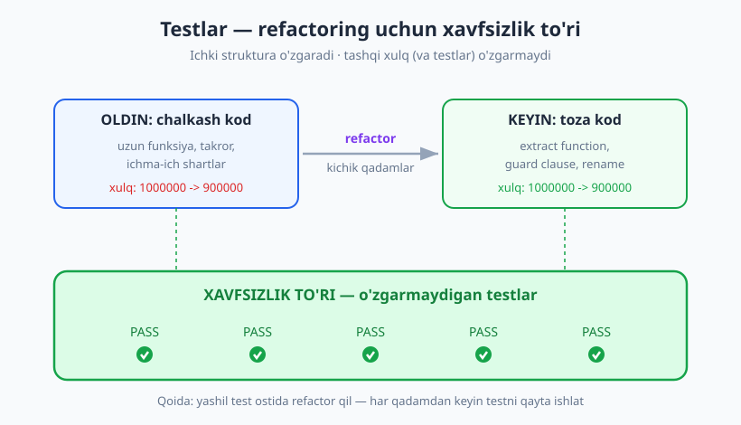
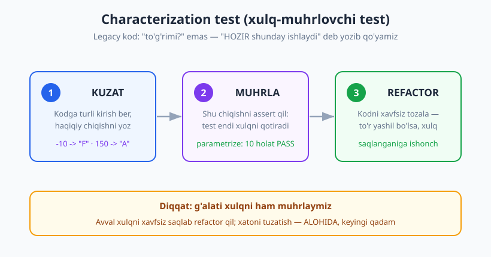
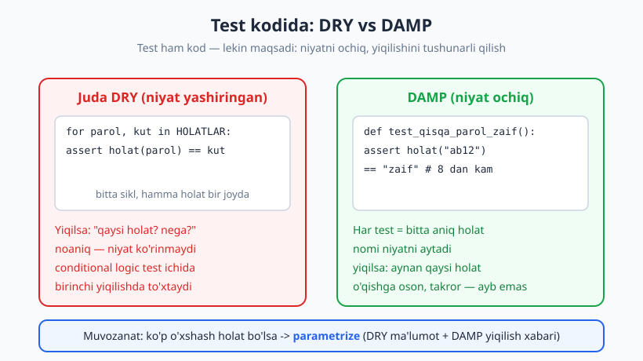

# 13 — Refactoring va testlar

[🏠 README](./README.md) · [⬅️ Oldingi: 12 — TDD amaliyotda (kata)](./12-tdd-amaliyot-kata.md) · [Keyingi: 14 — BDD va spetsifikatsiya ➡️](./14-bdd-spetsifikatsiya.md)

---

> **Bu bobda:** testlar refactoring uchun **xavfsizlik to'ri** ekanini ko'ramiz — kodni ichidan
> qayta qurganda, testlar buzilmasa, xulq saqlanganiga ishonamiz. Chalkash funksiyani kichik
> qadamlar bilan tozalaymiz; eski (legacy) kodning xulqini **characterization test** bilan
> muhrlaymiz; va eng muhimi — **test kodi ham koddir**: undagi smell'lar, DRY vs DAMP muvozanati va
> testlarni qanday refactor qilish.
>
> **Halollik / Eslatma:** "refactoring" so'zini ko'pchilik noto'g'ri ishlatadi ("kodni o'zgartirdim")
> — biz uni qat'iy ma'noda (xulq o'zgarmaydi) ishlatamiz va nega bu muhimligini ko'rsatamiz. Bu bob
> 11–12-bob (TDD) ustiga quriladi va 29-bob (legacy) ga ko'prik tashlaydi. Barcha Python namunalari
> `python -m pytest` (Python 3.14, pytest 9.0.3) bilan haqiqatan ishga tushirib tekshirilgan.

---

## Refactoring nima (va nima emas)

Tasavvur qiling, xonangizdagi kitoblarni qayta tartibladingiz: janr bo'yicha terib, chang artib,
javonni mustahkamladingiz. Kitoblar **o'sha-o'sha** — bironta yangi kitob qo'shmadingiz, bironta
sahifani yirtmadingiz. Faqat **topish va saqlash osonlashdi**. Bu — refactoring.

Martin Fowler ta'rifi: **refactoring** — dasturning **tashqi xulqini o'zgartirmasdan**, uning
**ichki strukturasini yaxshilash**. Ikki kalit so'z:

- **Tashqi xulq o'zgarmaydi.** Bir xil kirish → bir xil chiqish. Foydalanuvchi farqni sezmaydi.
- **Ichki struktura yaxshilanadi.** O'qish osonlashadi, takror kamayadi, mantiq ravshanlashadi.

> **Diqqat — keng tarqalgan adashish:** "Men kodni o'zgartirdim" ≠ "refactoring". Agar xulqni
> o'zgartirsangiz (yangi xususiyat, tuzatilgan xato, boshqa natija) — bu refactoring **emas**, bu
> **xulqni o'zgartirish**. Refactoring va xulqni o'zgartirishni **bir vaqtda** qilmang: bu eng
> xavfli odat (keyinroq ko'ramiz, nega).

Nega umuman refactor qilamiz? Kod vaqt o'tib **chiriydi**: shoshilinch qo'shilgan `if`, nusxa-ko'chirilgan
blok, tushunarsiz nom. Bu — **texnik qarz** (technical debt). Refactoring — bu qarzni to'lash:
hozir biroz vaqt sarflab, kelajakdagi o'zgarishlarni arzonlashtirasiz (chuqurroq:
[arxitektura kitobi](../arxitektura/README.md)).

---

## Testlar — xavfsizlik to'ri

Akrobat baland arqonda yuradi. U xato qilsa — pastdagi **to'r** uni tutadi. To'r bo'lmasa, akrobat
har qadamni qo'rqa-pisa qo'yadi va hech qachon murakkab harakatga jur'at qilmaydi.

Refactoring ham xuddi shunday qo'rqinchli: "agar buzib qo'ysamchi?" To'r — bu **testlar**. Ishonchli
test to'plamingiz bo'lsa, kodni dadil qayta qurasiz: biror narsani buzsangiz, test **darhol qizil**
bo'ladi va sizni ogohlantiradi. Test yashil tursa — xulq saqlangan.



> **Markaziy qoida — "yashil test ostida refactor".** Refactoringni faqat **testlar yashil
> bo'lganda** boshlang. Har kichik qadamdan keyin testlarni **qayta ishga tushiring**. Qizil
> bo'lsa — oxirgi qadamni orqaga qaytaring (kichik qadam = arzon orqaga qaytish). Bu TDD siklidagi
> uchinchi bosqich ("Refactor", 11-bob) — endi uni alohida san'at sifatida o'rganamiz.

E'tibor bering: **testlarning o'zi o'zgarmaydi**. Agar refactor paytida testni ham o'zgartirayotgan
bo'lsangiz, to'r teshilgan — endi nima xulq saqlandi, nima yo'q, bilmaysiz.

---

## Jonli demo: chalkash funksiyani tozalash

Mana real "chirigan" funksiya — savat narxini hisoblaydi, lekin uzun, tushunarsiz nomli o'zgaruvchi
(`j`), takror mantiq va ichma-ich shartlardan iborat:

```python
# narx_oldin.py  (❌ chalkash, lekin ISHLAYDI)
def hisobla(savat, daraja, kupon):
    j = 0
    for i in savat:
        j = j + i["narx"] * i["soni"]
    if daraja == "vip":
        if j > 1000000:
            j = j - j * 0.2
        else:
            j = j - j * 0.1
    else:
        if j > 1000000:
            j = j - j * 0.05
    if kupon == "YANGI" and j > 0:
        j = j - 50000
    if j < 0:
        j = 0
    return round(j, 2)
```

**Birinchi qadam — refactor EMAS, to'r tashlash.** Bu funksiyani qayta yozishdan oldin, uning
hozirgi xulqini qoplaydigan testlar yozamiz:

```python
# test_narx.py  (xavfsizlik to'ri — refactordan OLDIN yashil)
from narx import hisobla

SAVAT = [{"narx": 300000, "soni": 2}, {"narx": 100000, "soni": 4}]  # jami = 1000000

def test_oddiy_kichik():
    assert hisobla([{"narx": 50000, "soni": 1}], "oddiy", None) == 50000

def test_vip_chegirma_10():
    assert hisobla(SAVAT, "vip", None) == 900000.0          # 1000000 -> -10%

def test_vip_chegirma_20():
    assert hisobla([{"narx": 600000, "soni": 2}], "vip", None) == 960000.0   # 1200000 -> -20%

def test_oddiy_katta_chegirma_5():
    assert hisobla([{"narx": 600000, "soni": 2}], "oddiy", None) == 1140000.0  # -5%

def test_kupon_qoshiladi():
    assert hisobla([{"narx": 200000, "soni": 1}], "oddiy", "YANGI") == 150000

def test_manfiy_nolga_tushadi():
    assert hisobla([{"narx": 10000, "soni": 1}], "oddiy", "YANGI") == 0
```

```text
$ python -m pytest test_narx.py -q
......                                                       [100%]
6 passed in 0.57s
```

Endi to'r tayyor (6 ta yashil test). **Refactorni kichik qadamlarga ajratamiz** va har qadamdan
keyin testni qayta ishlatamiz:

1. **Extract function** — oraliq summani alohida funksiyaga ajratamiz va tushunarli nom beramiz.
2. **Extract function + rename** — daraja chegirmasini alohida sof funksiyaga ajratamiz.
3. **Guard clause / soddalashtirish** — `if j < 0: j = 0` ni `max(...)` bilan almashtiramiz, `i`/`j`
   o'rniga mazmunli nom.

Natija:

```python
# narx.py  (✅ toza — xulq AYNAN o'sha)
def oraliq_summa(savat):
    return sum(mahsulot["narx"] * mahsulot["soni"] for mahsulot in savat)


def daraja_chegirmasi(summa, daraja):
    katta_xarid = summa > 1000000
    if daraja == "vip":
        return 0.2 if katta_xarid else 0.1
    return 0.05 if katta_xarid else 0.0


def hisobla(savat, daraja, kupon):
    summa = oraliq_summa(savat)
    summa -= summa * daraja_chegirmasi(summa, daraja)
    if kupon == "YANGI" and summa > 0:
        summa -= 50000
    return round(max(summa, 0), 2)
```

`test_narx.py` ni **bitta harf ham o'zgartirmadan** qayta ishlatamiz:

```text
$ python -m pytest test_narx.py -q
......                                                       [100%]
6 passed in 0.56s
```

Xuddi shu 6 ta test, xuddi shu yashil. Bu — to'liq ishonch: funksiya endi qisqa, o'qiladigan,
sof yordamchilarga ajralgan — lekin **xulq o'zgarmadi**. Agar bironta qadamda test qizarsa, biz
darhol bilamiz va o'sha qadamni qaytaramiz.

> **Trade-off:** "extract function" har doim ham yaxshi emas. Bir martagina ishlatiladigan, 2 qatorli
> mantiqni alohida funksiyaga chiqarish ba'zan ortiqcha sakrash yaratadi (o'qiyotgan odam yana bir
> joyga qarashi kerak). Refactor — muvozanat: takror yo'qolsa, niyat ravshanlashsa — ajrat; aks holda
> o'rnida qoldir.

---

## Characterization test — eski xulqni "muhrlash"

Yuqorida bizda hozirgi xulqni qoplaydigan testlar bor edi. Lekin ko'pincha eski (legacy) kod
**testsiz** keladi va siz uning **to'g'ri ishlashiga** ham ishonchingiz komil emas. Uni o'zgartirishdan
oldin nima qilasiz?

Michael Feathers javobi: **characterization test** (xulq-muhrlovchi test). Bu — kodning
**to'g'ri yoki noto'g'ri** ekanini emas, balki **HOZIR aynan qanday ishlayotganini** yozib qo'yadigan
test. Maqsad — "shu xulqni saqlab qol" deb muhrlash, keyin xavfsiz refactor qilish.



Mana legacy funksiya — talaba ballidan harf-baho chiqaradi:

```python
# legacy.py
def daraja_belgila(ball):
    if ball >= 90:
        return "A"
    elif ball >= 80:
        return "B"
    elif ball >= 70:
        return "C"
    elif ball >= 60:
        return "D"
    else:
        return "F"
```

**1. Kuzat.** Avval kodga turli kirish berib, **haqiqiy chiqishni** ko'ramiz (bu yerda
to'g'ri-noto'g'rini muhokama qilmaymiz — faqat yozib olamiz):

```python
from legacy import daraja_belgila
for b in [100, 90, 89, 80, 70, 60, 59, 0, -10, 150]:
    print(b, daraja_belgila(b))
# -> 100 A   90 A   89 B   80 B   70 C   60 D   59 F   0 F   -10 F   150 A
```

Diqqat: `-10` (manfiy ball) → `"F"`, `150` (100 dan katta) → `"A"`. Bu **g'alati** — ehtimol xato.
Lekin characterization test "to'g'rimi" demaydi; u **shunday ishlaydi** deb muhrlaydi.

**2. Muhrla.** Kuzatilgan xulqni `parametrize` (06-bob) bilan testga yozamiz:

```python
# test_legacy_char.py
import pytest
from legacy import daraja_belgila

@pytest.mark.parametrize("ball, kutilgan", [
    (100, "A"), (90, "A"), (89, "B"), (80, "B"),
    (70, "C"), (60, "D"), (59, "F"), (0, "F"),
    (-10, "F"),   # manfiy ham F (g'alati, lekin HOZIR shunday)
    (150, "A"),   # 100 dan katta ham A
])
def test_xozirgi_xulq(ball, kutilgan):
    assert daraja_belgila(ball) == kutilgan
```

```text
$ python -m pytest test_legacy_char.py -q
..........                                                   [100%]
10 passed in 0.56s
```

**3. Refactor.** Endi to'r bor — kodni xavfsiz tozalaymiz (takror `elif` larni jadval + sikl bilan):

```python
# legacy.py  (refactor — xulq AYNAN saqlanadi)
def daraja_belgila(ball):
    chegaralar = [(90, "A"), (80, "B"), (70, "C"), (60, "D")]
    for chegara, harf in chegaralar:
        if ball >= chegara:
            return harf
    return "F"
```

`test_legacy_char.py` qayta ishlaganda — yana **10 passed**. `-10 -> F` va `150 -> A` ham saqlanadi.

> **Diqqat:** `-10 -> F` xatosini **shu refactor paytida tuzatmang**. Avval xulqni o'zgartirmasdan
> strukturani toza qiling. Xatoni tuzatish — **alohida, keyingi qadam** (oldin uni hujjatlovchi yangi
> test yozasiz, keyin kodni o'zgartirasiz). Bu bobning oltin qoidasi: **refactoring va xulq
> o'zgarishini aralashtirmang.** Characterization test 23-bob (approval) va 29-bob (legacy) da yana
> markaziy bo'ladi.

---

## Test kodi ham koddir — test smell'lar

04-bobda biz "yaxshi test xossalari" (FIRST) ni ko'rdik. Endi teskari tomon: testlar ham xuddi
ishlab chiqarish kodi kabi **chiriydi**. Yomon test — yozilganda oson, lekin keyin **og'riq
manbai**: sekin, mo'rt, tushunarsiz. Bularni **test smell** (test hidi) deyiladi. Eng tez-tez
uchraydiganlari:

| Smell | Nima | Davosi |
|---|---|---|
| **Takror (DRY buzilishi)** | Bir xil setup har testda nusxa-ko'chirilgan | Fixture/helper ajratish (06-bob) |
| **Mystery guest** | Test tashqi, ko'rinmas resursga tayanadi (fayl, real DB, tarmoq) | Ma'lumotni testning o'zida ko'rsat |
| **Eager test** | Bitta test funksiyasi 10 xil narsani tekshiradi | Bitta test = bitta xulq (04-bob) |
| **Assertion roulette** | Ko'p assert, izohsiz — yiqilsa qaysi biri noaniq | Bittaga bo'l yoki xabar/parametrize qo'sh |
| **Fragile (mo'rt) test** | Implementatsiya o'zgarsa darhol yiqiladi | Xulqni test qil, ichki tuzilishni emas (08-bob) |
| **Slow test** | Real I/O, `sleep`, og'ir setup | Izolyatsiya, in-memory (09-bob) |
| **Conditional logic** | Test ichida `if`/`for`/`try` mantiqi | Tekislab parametrize'ga o'tkaz |

Ikkinchi va oxirgi ikkisini misol bilan ko'rsataylik. **Mystery guest** — test "qayerdandir" kelgan
faylga tayanadi:

```python
# ❌ Mystery guest: bu fayl qayerdan keladi? Mavjudmi? Nima ichida?
def test_yomon():
    data = open("/tmp/test_users.csv").read()  # ko'rinmas mehmon
    assert "ali" in data

# ✅ Ma'lumot testning o'zida — hech qanday sir yo'q
def test_yaxshi():
    data = "ali,30\nvali,25"   # nima borligini ko'rib turibsiz
    assert "ali" in data
```

**Conditional logic** — testda `if` bor; bu test mantiqida xato bo'lishi mumkinligini bildiradi
(testning testini kim yozadi?):

```python
# ❌ Test ichida shart — qaysi tarmoq ishladi, bilmaysiz; "ok=True" bo'lsa hech narsa tekshirilmaydi
def test_yomon_shart(turi, qiymat):
    if turi == "vip":
        assert qiymat >= 100
    else:
        ok = True   # jim "o'tdi" — yashirin teshik

# ✅ Har holatni alohida, tekis (parametrize) test qil
import pytest
@pytest.mark.parametrize("turi, qiymat", [("vip", 100), ("oddiy", 50)])
def test_yaxshi_param(turi, qiymat):
    assert qiymat >= 50
```

---

## DRY vs DAMP — test kodida boshqa muvozanat

Ishlab chiqarish kodida **DRY** (Don't Repeat Yourself — takrorlama) deyarli har doim yaxshi.
Lekin **test kodida** boshqa kuch ham bor: test **o'qilishi va niyatini ochiq aytishi** kerak.
Bu yerda **DAMP** (Descriptive And Meaningful Phrases — tavsifiy va mazmunli iboralar) tamoyili
kuchga kiradi: ba'zan **ozgina takror** — testni tushunarliroq qiladi.



Mana parol kuchini baholaydigan funksiya va uni testlashning **ikki uslubi**:

```python
# parol.py
def parol_holati(parol):
    if len(parol) < 8:
        return "zaif"
    if parol.isalpha() or parol.isdigit():
        return "ortacha"
    return "kuchli"
```

**❌ Juda DRY** — ma'lumotlar jadvali + sikl. Qisqa, lekin niyat yashiringan va yiqilganda
nima/nega noaniq:

```python
_HOLATLAR = [("ab12", "zaif"), ("parolxat", "ortacha"),
             ("12345678", "ortacha"), ("Parol123", "kuchli")]

def test_hamma_holatlar_dry():
    for parol, kutilgan in _HOLATLAR:        # conditional/loop logic test ichida
        assert parol_holati(parol) == kutilgan
```

Bu yiqilsa, pytest faqat siklning **birinchi** yiqilgan qatorini ko'rsatadi va "nega `parolxat`
`ortacha` bo'lishi kerak?" degan **niyat** matnda yo'q. Endi **✅ DAMP** — har holat alohida,
nomi va izohi niyatni aytadi:

```python
def test_qisqa_parol_zaif():
    assert parol_holati("ab12") == "zaif"          # 8 belgidan kam

def test_faqat_harf_ortacha():
    assert parol_holati("parolxat") == "ortacha"   # raqam yo'q

def test_faqat_raqam_ortacha():
    assert parol_holati("12345678") == "ortacha"   # harf yo'q

def test_aralash_kuchli():
    assert parol_holati("Parol123") == "kuchli"    # harf + raqam
```

Takror bor (har qatorda `parol_holati(...)`), lekin har test **o'zini o'zi tushuntiradi** va
yiqilsa **aynan qaysi holat** ekani nomidan ko'rinadi.

**Eng yaxshi muvozanat — `parametrize`** (06-bob): ma'lumot DRY (bir joyda), lekin pytest har
holatni **alohida** ishlatadi va yiqilsa **qaysi** holat ekanini ko'rsatadi:

```python
import pytest
@pytest.mark.parametrize("parol, kutilgan", [
    ("ab12", "zaif"),
    ("parolxat", "ortacha"),
    ("12345678", "ortacha"),
    ("Parol123", "kuchli"),
])
def test_parol_holati(parol, kutilgan):
    assert parol_holati(parol) == kutilgan
```

Agar bitta holat noto'g'ri bo'lsa, pytest aynan uni ko'rsatadi:

```text
FAILED test_parol.py::test_parol_holati[parolxat-kuchli] - AssertionError
1 failed, 1 passed
```

`[parolxat-kuchli]` — qaysi holat yiqilganini darhol bildiradi (sikldagi anonim "birinchi yiqilish"
emas). Bu — DRY va DAMP o'rtasidagi to'g'ri o'rta nuqta.

> **Trade-off:** Haddan tashqari DRY test = niyatni yashiruvchi test. Lekin teskarisi ham bor:
> har testda 20 qator nusxa-ko'chirilgan murakkab setup ham yomon (o'zgartirsangiz 50 joyni
> tahrirlaysiz). Qoida: **assert va kirish ma'lumotini ochiq qoldiring** (DAMP), takroriy
> **infratuzilma setup**ini esa fixture/helper'ga oling (DRY). O'qiluvchanlik — testda eng qadrli.

---

## Testlarni refactoring qilish (ehtiyot bilan)

Testlar ham refactor talab qiladi: fixture/helper ajratish (06-bob), nomlarni yaxshilash, takror
holatlarni `parametrize`'ga o'tkazish. Lekin bu yerda **eng muhim qoida** bor:

> **Bir vaqtda faqat bitta narsani o'zgartiring.** Ishlab chiqarish kodini refactor qilayotganda —
> **testlarga tegmang** (ular o'zgarmas to'r). Testlarni refactor qilayotganda — **ishlab chiqarish
> kodiga tegmang** (kod yashil "etalon"). Agar ikkalasini birga o'zgartirsangiz va test qizarsa,
> ayb qaysida ekanini hech qachon bilmaysiz.

Testni refactor qilganda ham to'r kerak: o'zgartirgan testingiz hali **haqiqatan yiqila oladimi**?
Tekshirish — ishlab chiqarish kodiga vaqtincha xato kiritib, test qizarishiga ishonch hosil qiling
(keyin xatoni qaytaring). Aks holda "doim yashil, lekin hech nimani tekshirmaydigan" test yozib
qo'yishingiz mumkin (bu — eng yashirin test smell).

---

## Testlar qachon o'zgaradi (va qachon o'zgarmasligi kerak)

Bu — bobning amaliy xulosasi:

| Vaziyat | Test o'zgarishi kerakmi? |
|---|---|
| **Xulq o'zgardi** (yangi talab, tuzatilgan xato, boshqa natija) | **Ha** — bu refactoring emas; testni yangi xulqqa moslaysiz |
| **Implementatsiya o'zgardi** (xulq o'sha, faqat ichi boshqa) | **Yo'q** — test o'zgarmasligi kerak; o'zgarsa, demak test mo'rt edi |

Agar har refactorda bir tonna testni ham tahrir qilishga majbur bo'lsangiz — bu **mo'rt test**
belgisi (08-bob): testlaringiz ichki tuzilishga (xususiy metod, mock chaqiruvlar ketma-ketligi)
yopishib qolgan. Yaxshi test — **tashqi xulqni** tekshiradi, shuning uchun ichni qayta qurganda
jim yashil turadi. Aynan shu xususiyat refactoringni xavfsiz qiladi.

---

## Asosiy g'oyalar (bobni qisqacha)

- **Refactoring** (Fowler) — tashqi xulqni o'zgartirmasdan ichki strukturani yaxshilash. "Kodni
  o'zgartirdim" ≠ refactoring.
- **Testlar — xavfsizlik to'ri.** "Yashil test ostida refactor": har kichik qadamdan keyin testlarni
  qayta ishga tushir; qizarsa — qadamni qaytar.
- **Refactor paytida testlar o'zgarmaydi.** Test ham o'zgarsa, to'r teshilgan — xulq saqlanganini
  bilmaysiz.
- **Characterization test** (Feathers) — legacy kodning HOZIRGI xulqini muhrlaydi ("to'g'rimi" emas,
  "shunday ishlaydi"); keyin xavfsiz refactor. G'alati xulqni avval saqla, tuzatishni keyingi qadamga qoldir.
- **Test kodi ham koddir.** Smell'lar: takror, mystery guest, eager test, assertion roulette, mo'rt
  test, slow test, conditional logic — har birining davosi bor.
- **DRY vs DAMP:** test kodida o'qiluvchanlik ustun — ozgina takror (DAMP) niyatni ochsa, afzal.
  Eng yaxshi o'rta — `parametrize` (DRY ma'lumot + DAMP yiqilish xabari).
- **Bir vaqtda bitta narsa:** kodni refactor qilganda testga tegma; testni refactor qilganda kodga tegma.
- **Test qachon o'zgaradi:** xulq o'zgarsa — ha (refactoring emas); implementatsiya o'zgarsa — yo'q
  (o'zgarsa, test mo'rt edi).

---

## Mashqlar

### Oson

**1-mashq.** O'z so'zingiz bilan ayting: refactoring va "xulqni o'zgartirish" o'rtasidagi farq nima?
Quyidagilardan qaysi biri refactoring, qaysi biri yo'q? (a) o'zgaruvchi nomini `j` dan `jami` ga
o'zgartirish; (b) chegirma foizini 10% dan 15% ga oshirish; (c) ichma-ich `if` ni guard clause bilan
tekislash.

**2-mashq.** "Yashil test ostida refactor" qoidasini tushuntiring. Nima uchun refactorni testlar
**qizil** bo'lganda boshlamaslik kerak?

**3-mashq.** Quyidagi testda qaysi **smell** bor va uni qanday tuzatasiz?

```python
def test_hammasi():
    u = create_user("ali")
    assert u.name == "ali"
    assert u.age == 0
    delete_user(u)
    assert get_user("ali") is None
    log = open("/var/log/app.log").read()
    assert "ali" in log
```

### O'rta

**4-mashq.** Quyidagi chalkash funksiya uchun avval uning hozirgi xulqini qoplaydigan
characterization test yozing (kamida 4 holat, jumladan g'alati `soni=0` holati), keyin uni
xavfsiz refactor qiling. Test o'zgarmasin.

```python
def chegirma(narx, soni):
    t = narx * soni
    if soni > 10:
        t = t - t * 0.1
    if soni > 50:
        t = t - t * 0.1
    return t
```

**5-mashq.** Quyidagi "juda DRY" testni DAMP (yoki parametrize) ko'rinishiga o'tkazing, shunda
yiqilganda qaysi holat ekani aniq ko'rinsin:

```python
def test_yosh_toifa():
    for yosh, kut in [(5, "bola"), (17, "osmir"), (30, "katta"), (70, "keksa")]:
        assert toifa(yosh) == kut
```

(Yo'naltiruvchi: `toifa` — `<13 bola`, `<18 osmir`, `<65 katta`, aks holda `keksa`.)

**6-mashq.** "Implementatsiya o'zgarsa test o'zgarmasligi kerak" tamoyilini misol bilan ko'rsating:
bir funksiyaning ikki xil **implementatsiyasini** yozing (xulqi bir xil), va **bitta** test
to'plami ikkalasini ham yashil tutsin.

### Qiyin

**7-mashq.** Quyidagi funksiyada kamida **uchta** test smell yashiringan bir test bor. Smell'larni
toping, har birini nomlang va testni qayta yozing (toza, DAMP, smell'siz):

```python
import datetime
def test_buyurtma():
    o = Order()
    o.add("kitob", 50000)
    o.add("ruchka", 5000)
    if o.total() > 10000:
        assert o.is_premium == True
    else:
        assert o.is_premium == False
    assert o.created_at.date() == datetime.date.today()
    assert len(o.items) == 2
```

**8-mashq.** "Refactoring va xulq o'zgarishini aralashtirmang" qoidasini buzish nega xavfli ekanini
ssenariy bilan tushuntiring. So'ng to'g'ri ketma-ketlikni yozing: sizda `daraja_belgila(ball)`
funksiyasi bor (matndagi misol), `-10 -> "F"` xatosini tuzatib, manfiy ballda `ValueError` chiqarish
kerak. Qadamlarni (test yozish, refactor, xulq o'zgartirish) **to'g'ri tartibda** sanab bering.

<details markdown="1">
<summary>Yechimlar</summary>

### 1-mashq yechimi

**Refactoring** — tashqi xulqni o'zgartirmaydi (bir xil kirish → bir xil chiqish), faqat ichki
strukturani yaxshilaydi. **Xulqni o'zgartirish** — natija boshqacha bo'ladi.

- (a) o'zgaruvchi nomini o'zgartirish → **refactoring** (xulq o'sha).
- (b) chegirma 10% → 15% → **xulqni o'zgartirish** (natija boshqa; refactoring EMAS).
- (c) ichma-ich `if` → guard clause → **refactoring** (xulq o'sha, struktura yaxshi).

### 2-mashq yechimi

"Yashil test ostida refactor" — refactorni faqat barcha testlar **o'tayotgan** holatda boshlash va
har kichik qadamdan keyin qayta ishga tushirish demak. Sabab: agar qadamda test qizarsa, demak shu
qadam xulqni buzdi — darhol bilasiz va arzon orqaga qaytarasiz. Agar testlar **boshidan qizil**
bo'lsa, to'r ishlamaydi: refactor xulqni buzganmi yoki test allaqachon yiqilganmi — ajratib
bo'lmaydi. To'r faqat "boshda yashil edi → endi qizil" o'zgarishini ushlay oladi.

### 3-mashq yechimi

Bu **eager test** (bitta test juda ko'p narsani tekshiradi: yaratish, atribut, o'chirish, log) va
**mystery guest** (`/var/log/app.log` — tashqi, ko'rinmas, muhitga bog'liq resurs) smell'lari bor.
Tuzatish: bittaga emas, mazmunli **bir nechta** testga bo'lish va log faylga tayanmaslik:

```python
def test_yaratilgan_user_atributi():
    u = create_user("ali")
    assert u.name == "ali"
    assert u.age == 0

def test_ochirilgan_user_yoqoladi():
    u = create_user("ali")
    delete_user(u)
    assert get_user("ali") is None
```

Log tekshiruvi kerak bo'lsa, log'ni real faylga emas, inject qilingan yozuvchiga (09/10-bob) yo'naltirib,
uni testda tekshiring.

### 4-mashq yechimi

Avval hozirgi xulqni kuzatamiz (`narx=1000`):
`soni=5 -> 5000`; `soni=11 -> 9900` (-10%); `soni=51 -> 41310` (-10% va yana -10%); `soni=0 -> 0`.

```python
import pytest
from chegirma import chegirma

@pytest.mark.parametrize("soni, kutilgan", [
    (5, 5000.0),     # chegirmasiz
    (11, 9900.0),    # >10 -> -10%
    (51, 41310.0),   # >50 -> ikki marta -10%
    (0, 0.0),        # g'alati: soni=0 -> 0 (HOZIR shunday)
])
def test_chegirma_xozirgi(soni, kutilgan):
    assert chegirma(1000, soni) == kutilgan
```

Refactor (xulq saqlanadi):

```python
def chegirma(narx, soni):
    jami = narx * soni
    if soni > 10:
        jami *= 0.9
    if soni > 50:
        jami *= 0.9
    return jami
```

Test o'zgarmaydi — yana 4 passed. (`soni=0 -> 0` g'alatiligini bu yerda tuzatmadik; u alohida xulq
o'zgarishi.)

### 5-mashq yechimi

```python
import pytest

@pytest.mark.parametrize("yosh, kutilgan", [
    (5, "bola"),
    (17, "osmir"),
    (30, "katta"),
    (70, "keksa"),
])
def test_yosh_toifa(yosh, kutilgan):
    assert toifa(yosh) == kutilgan
```

Endi `toifa(17)` yiqilsa, pytest `test_yosh_toifa[17-osmir]` deb aniq ko'rsatadi — sikldagi anonim
"birinchi yiqilish" emas. Ma'lumot bir joyda (DRY), lekin har holat alohida ishlaydi (DAMP foydasi).

### 6-mashq yechimi

```python
# implementatsiya A: sikl bilan
def yigindi_a(sonlar):
    s = 0
    for x in sonlar:
        s += x
    return s

# implementatsiya B: built-in bilan (xulq AYNAN o'sha)
def yigindi_b(sonlar):
    return sum(sonlar)

# bitta test to'plami — ikkalasini ham yashil tutadi
import pytest

@pytest.mark.parametrize("fn", [yigindi_a, yigindi_b])
def test_yigindi(fn):
    assert fn([]) == 0
    assert fn([5]) == 5
    assert fn([1, 2, 3]) == 6
# -> 2 passed (har implementatsiya uchun bitta)
```

Test faqat **xulqni** (kirish → chiqish) tekshiradi, ichki tuzilishni emas. Shuning uchun
implementatsiyani A dan B ga o'zgartirsangiz — test jim yashil qoladi. Aynan shu xususiyat
refactoringni xavfsiz qiladi.

### 7-mashq yechimi

Smell'lar: (1) **conditional logic** — testda `if/else` bor (qaysi tarmoq ishladi noaniq, va shart
mantiqida xato bo'lishi mumkin); (2) **eager test** — bitta test premium mantiqi, sana va elementlar
sonini birato'la tekshiradi; (3) **fragile/non-determinism** — `created_at.date() == today()` vaqtga
bog'liq (yarim tunda yiqilishi mumkin; 09-bob). Toza, DAMP qayta yozish:

```python
def test_jami_summa():
    o = Order()
    o.add("kitob", 50000)
    o.add("ruchka", 5000)
    assert o.total() == 55000

def test_premium_chegaradan_yuqorida():
    o = Order()
    o.add("kitob", 50000)       # > 10000
    assert o.is_premium is True

def test_oddiy_chegaradan_pastda():
    o = Order()
    o.add("ruchka", 5000)       # <= 10000
    assert o.is_premium is False

def test_elementlar_soni():
    o = Order()
    o.add("kitob", 50000)
    o.add("ruchka", 5000)
    assert len(o.items) == 2
```

`created_at` ni tekshirish kerak bo'lsa, vaqtni inject qiling (09-bob) — real `today()`'ga
tayanmang.

### 8-mashq yechimi

**Nega xavfli:** agar refactoring (struktura) va xulq o'zgarishini bitta qadamda qilsangiz va test
qizarsa, ayb qaysida ekanini bilmaysiz — refactor xulqni tasodifan buzdimi yoki yangi xulq
testni to'g'ri ravishda qizartirdimi? To'r o'z ma'nosini yo'qotadi. Misol: chegirma mantiqini
soddalashtirayotib, ayni paytda foizni ham o'zgartirsangiz, qizargan test — qaysi sababdan?

**To'g'ri tartib** (`-10 -> ValueError` xulqini kiritish):

1. **Refactor (agar kerak bo'lsa) — yashil ostida.** Avval mavjud characterization testlar bilan
   strukturani toza qiling (yana yashil bo'lsin).
2. **Yangi xulqni hujjatlovchi test yoz (Red).** `daraja_belgila(-10)` endi `ValueError` chiqarishi
   kerakligini tekshiruvchi yangi test yozing — u **qizil** bo'ladi (kod hali eski xulqda):

   ```python
   import pytest
   def test_manfiy_xato():
       with pytest.raises(ValueError):
           daraja_belgila(-10)
   ```

3. **Eski characterization holatni yangila.** `(-10, "F")` muhrini olib tashlang (chunki xulq
   ataylab o'zgaradi) — bu refactoring emas, xulq o'zgarishi, shuning uchun test o'zgarishi **to'g'ri**.
4. **Kodni o'zgartir (Green).** `if ball < 0: raise ValueError(...)` qo'shing; yangi test yashil,
   qolganlari ham yashil.

Diqqat: 1-qadam (refactor) va 4-qadam (xulq o'zgarishi) **alohida** — hech qachon bitta commit/qadamda
aralashmaydi.

</details>

---

[🏠 README](./README.md) · [⬅️ Oldingi: 12 — TDD amaliyotda (kata)](./12-tdd-amaliyot-kata.md) · [Keyingi: 14 — BDD va spetsifikatsiya ➡️](./14-bdd-spetsifikatsiya.md)
