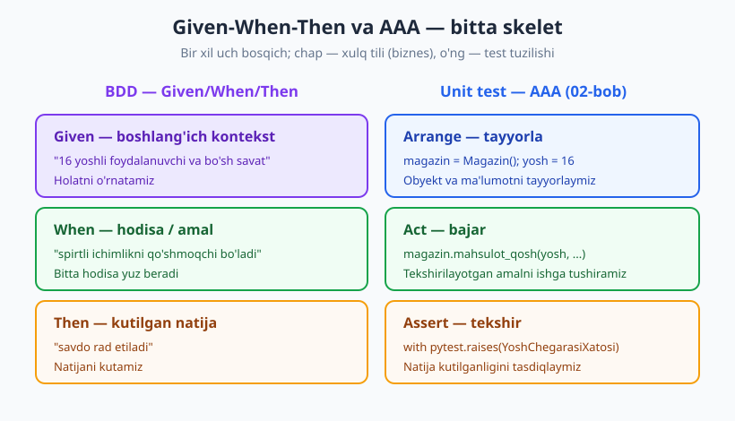
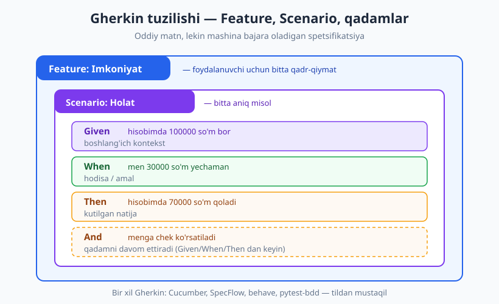
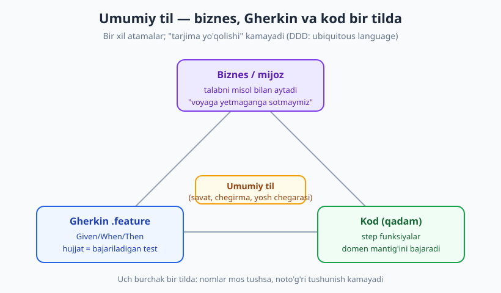

# 14 — BDD va spetsifikatsiya

[🏠 README](./README.md) · [⬅️ Oldingi: 13 — Refactoring va testlar](./13-refactoring-va-testlar.md) · [Keyingi: 15 — Integratsiya testlari ➡️](./15-integratsiya-testlari.md)

---

> **Bu bobda:** BDD (Behavior-Driven Development) — TDD'ning "test" so'zidan "xulq va spetsifikatsiya"
> so'ziga o'tgan evolyutsiyasi. Given-When-Then strukturasini (AAA bilan taqqoslab), Gherkin tilini,
> "specification by example" va "jonli hujjat" g'oyalarini, hamda umumiy til (ubiquitous language)
> orqali biznes-dasturchi-tester ko'prigini ko'ramiz. Amaliyotda — Given/When/Then'ni oddiy `pytest`
> bilan ifodalaymiz.
>
> **Halollik / Eslatma:** Gherkin namunalari **konseptual** (ularni ishlatish shart emas — `.feature`
> matni *qanday ko'rinishini* ko'rsatamiz). Python qadam-funksiyalari esa **haqiqatan** `python -m pytest`
> (Python 3.14, pytest 9.0.3) bilan ishga tushirib tekshirilgan. `pytest-bdd`/`behave` ekotizimini
> faqat **tanishtiramiz** (sintaksis ko'rsatib, kodsiz). Oxirida halol aytamiz: BDD yomon qilinganda
> ortiqcha "tarjima qatlami"ga aylanadi.

---

## "Test" so'zidan "xulq" so'ziga

Tasavvur qiling, oshpazga buyurtma berasiz. Ikki xil aytishingiz mumkin:

- ❌ **Texnik:** "150 °C pechda 22 daqiqa, ichki harorat 74 °C ga yetsin."
- ✅ **Xulq:** "Tovuq tashqaridan tilla rang, ichidan suvsiz, yumshoq bo'lsin."

Ikkinchisini **mijoz ham, oshpaz ham** tushunadi. Birinchisi — faqat oshpaz tili. Dasturda ham
shunday: "`calculate_discount()` 20 qaytarsin" — dasturchi tili. "VIP mijozga 20% chegirma berilsin" —
**hamma** tushunadigan til.

**BDD (Behavior-Driven Development — "xulq orqali boshqariladigan ishlab chiqish")** aynan shu
o'tish haqida. Uni 2006-yil atrofida **Dan North** kiritgan. Uning kuzatuvi sodda edi: yangi
dasturchilarga TDD'ni o'rgatganda, ular doim bir savolga qoqilardi — **"qaysi testni birinchi
yozay? Testni nima deb nomlay?"**. North payqadiki, agar "test" so'zini **"should"** ("...bo'lishi
kerak", ya'ni xulq) bilan almashtirsang, savol o'z-o'zidan yo'qoladi: test nomi tizim **nima qilishi
kerakligini** tasvirlaydi.

> **Markaziy g'oya:** BDD — yangi texnologiya emas, **TDD'ning evolyutsiyasi** (11-bob). Bir xil
> "avval kutilgan natijani, keyin kodni" sikli — lekin diqqat **texnik "test"dan biznes "xulqqa"**
> ko'chadi. Maqsad: kod nima qilishini **mijoz ham o'qiy oladigan** tilda yozish, shunda spetsifikatsiya,
> test va hujjat **bitta narsa**ga aylanadi.

Nega bu muhim? Chunki dasturdagi eng qimmat xato — **noto'g'ri narsani to'g'ri qurish**. Dasturchi
talabni noto'g'ri tushunsa, eng chiroyli kod ham befoyda. BDD bu bo'shliqni **til birligi** bilan
yopadi: biznes, dasturchi va tester bir tilda gaplashadi.

---

## Given-When-Then — xulqning uch bo'lagi

BDD xulqni doim uch qismga ajratadi:

- **Given** (berilgan) — boshlang'ich kontekst, "dunyo qanday holatda".
- **When** (qachon) — bitta hodisa yoki amal yuz beradi.
- **Then** (u holda) — kutilgan natija.

Misol uchun, "voyaga yetmagan spirtli ichimlik sotib ololmaydi" xulqi:

```text
Given 16 yoshli foydalanuvchi va bo'sh savat
When  u spirtli ichimlikni savatga qo'shmoqchi bo'ladi
Then  savdo rad etiladi
```

Tanish ko'rinmayaptimi? Bu — **02-bobdagi AAA** (Arrange-Act-Assert)ning aynan o'zi, faqat boshqa
nuqtai nazardan:

| AAA (02-bob) | Given-When-Then (BDD) | Mohiyati |
|---|---|---|
| **Arrange** — tayyorla | **Given** — boshlang'ich kontekst | Holatni o'rnatamiz |
| **Act** — bajar | **When** — hodisa / amal | Bitta narsa yuz beradi |
| **Assert** — tekshir | **Then** — kutilgan natija | Natijani tasdiqlaymiz |



Skelet **bir xil**, farq — **kim uchun yozilgani**. AAA dasturchi tilida ("`Savat` obyektini
yarat"); Given-When-Then biznes tilida ("foydalanuvchining bo'sh savati bor"). Shuning uchun BDD'ni
o'rgansangiz, yangi narsa emas, balki **bilganingizga yangi nom va yangi auditoriya** olasiz.

> **Eslatma:** "When" bitta hodisa bo'lishi kerak (AAA'dagi "bitta Act" qoidasi). Agar bir senariyda
> ikkita "When" yozsangiz — bu odatda ikkita alohida senariy bo'lishi kerakligining belgisi
> (04-bobdagi "bitta yiqilish sababi" tamoyili bilan bir xil ruh).

---

## Gherkin tili — xulqni oddiy matnda yozish

BDD g'oyasini *yozma formatga* aylantirish uchun **Gherkin** degan til ishlatiladi (Cucumber
asbobidan kelib chiqqan). Gherkin — bu deyarli oddiy ingliz (yoki o'zbek) tili, lekin bir nechta
**kalit so'z** bilan tuzilgan, shuning uchun uni mashina ham o'qiy oladi.

Asosiy kalit so'zlar:

- `Feature` — imkoniyat (bir foydalanuvchi qadr-qiymati, masalan "Pul yechish").
- `Scenario` — bitta aniq holat (bitta misol).
- `Given` / `When` / `Then` — yuqoridagi uch bosqich.
- `And` / `But` — oldingi qadamni davom ettiradi (takrorlamaslik uchun).

Mana bankomatdan pul yechish uchun **to'liq `.feature` matni** (bu — konseptual namuna, uni biz
ishlatmaymiz, faqat *qanday ko'rinishini* ko'rsatamiz):

```gherkin
# bankomat.feature
Feature: Bankomatdan pul yechish
  Mijoz sifatida men hisobimdan naqd pul yechmoqchiman,
  shunda kassa navbatida turishim shart bo'lmaydi.

  Scenario: Mablag' yetarli bo'lganda yechish
    Given hisobimda 100000 so'm bor
    When men 30000 so'm yechaman
    Then bankomat 30000 so'm beradi
    And hisobimda 70000 so'm qoladi

  Scenario: Mablag' yetmaganda rad etish
    Given hisobimda 20000 so'm bor
    When men 50000 so'm yechmoqchi bo'laman
    Then bankomat "Mablag' yetarli emas" deb xabar beradi
    And hisobimda 20000 so'm qoladi
```



E'tibor bering: bu matnda **bironta dasturlash atamasi yo'q** — funksiya nomi, klass, status kod
hech narsa. Buni mahsulot egasi (product owner) ham o'qiy va to'g'rilay oladi. Ayni vaqtda, har bir
`Given/When/Then` qatori ortiga (keyinroq ko'ramiz) bir bo'lak kod ulanadi, shuning uchun bu matn
**bajariladigan test**ga aylanadi.

### Bitta xulq, ko'p misol: Scenario Outline

Ko'pincha bitta xulqni bir nechta misol bilan tekshirish kerak. Gherkin buni `Scenario Outline` +
`Examples` jadvali bilan beradi:

```gherkin
  Scenario Outline: Turli summalarda yechish
    Given hisobimda <balans> so'm bor
    When men <yechiladigan> so'm yechaman
    Then hisobimda <qolgan> so'm qoladi

    Examples:
      | balans | yechiladigan | qolgan |
      | 100000 |        30000 |  70000 |
      |  50000 |        50000 |      0 |
      | 100000 |            1 |  99999 |
```

Bu jadvalning har qatori — bitta misol. Pythonda bu **`@pytest.mark.parametrize`**ning aynan
ekvivalenti (06-bob) — quyida ko'ramiz.

---

## Specification by example — misol = spetsifikatsiya = test

Klassik talabnoma (requirements document) shunday yoziladi: "Tizim mablag' yetarli bo'lganda pul
berishi kerak." Ammo "yetarli" nima? Aniq emas. **Specification by example** ("misol orqali
spetsifikatsiya") boshqacha yo'l tutadi: mavhum qoida o'rniga **aniq misollar** beradi.

> **Markaziy g'oya:** Yaxshi tanlangan misollar — eng aniq spetsifikatsiya. "100000 dan 30000 yechsa,
> 70000 qoladi" — buni hech kim noto'g'ri tushunmaydi. BDD'da bu misollar **ayni vaqtning o'zida**
> uch narsa bo'ladi: (1) talab (spetsifikatsiya), (2) test (avtomat tekshiriladi), (3) hujjat.

Bu uchlikning ulanishi — **jonli hujjat (living documentation)** deb ataladi. Oddiy hujjat eskiradi:
kod o'zgaradi, hujjat eski qoladi. Gherkin senariysi esa **bajariladigan test** bo'lgani uchun, agar
kod xulqni buzsa, **test yiqiladi** — demak hujjat hech qachon "jimgina noto'g'ri" bo'lib qolmaydi.
Yiqilgan test — eskirgan hujjatning ovozli signali.

> **Trade-off:** jonli hujjat tirik bo'lib qolishi uchun **doim ishga tushirilishi** kerak (CI'da —
> 27-bob). Agar `.feature` fayllar yozilib, lekin pipeline'da bajarilmasa, ular oddiy (eskiradigan)
> hujjatdan farq qilmaydi. "Jonli"lik — bepul emas, intizom talab qiladi.

---

## Umumiy til (ubiquitous language) — DDD bilan ko'prik

BDD'ning eng katta foydasi kod emas — **so'zlar**. Senariyni biznes bilan birga yozsangiz, hammangiz
bir xil atamalardan foydalanasiz: mijoz "savat" desa, kodda ham `savat`, testda ham "savat". Bu
g'oyaning nomi bor — **ubiquitous language** ("hamma joyda bir xil til"), uni Eric Evans
**Domain-Driven Design (DDD)**da ommalashtirgan.



Tasavvur qiling, biznes "buyurtmani bekor qilish", dasturchi "order'ni soft-delete qilish", tester
"o'chirib tashlash" deb atasa — uchovi har xil narsani tushunadi, mayda farqlar yo'qoladi va xatolar
tug'iladi. Umumiy til bu "tarjima yo'qolishini" kamaytiradi. Gherkin senariysi — shu umumiy tilning
**yozma kelishuvi**: barchasi bir matnga qaraydi va bir tilda gaplashadi.

> **Eslatma:** Bu yerda DDD bilan to'g'ridan-to'g'ri ko'prik bor — chuqurroq:
> [arxitektura kitobi, DDD asoslari](../arxitektura/14-ddd-asoslari.md). BDD'ni "DDD'ning testdagi
> aks-sadosi" deb o'ylash mumkin: ikkalasi ham domen tilini kodga olib kirishni xohlaydi.

---

## Amaliy Python: Given-When-Then'ni oddiy pytest bilan

Endi eng muhim qism: **`pytest-bdd` yoki Gherkin'siz ham** BDD ruhida test yozish mumkin. Buning
uchun ikki narsa kifoya: (1) test nomi **xulqni** tasvirlasin, (2) tana **Given/When/Then izohlari**
bilan ajratilsin.

Avval sinaladigan domen kodi:

```python
# magazin.py — sinaladigan kod (domen mantig'i)
class YoshChegarasiXatosi(Exception):
    pass

class Magazin:
    def __init__(self):
        self.savat = []

    def mahsulot_qosh(self, foydalanuvchi_yoshi, mahsulot, spirtli):
        if spirtli and foydalanuvchi_yoshi < 18:
            raise YoshChegarasiXatosi("18 yoshdan kichik spirtli ichimlik sotib ololmaydi")
        self.savat.append(mahsulot)
        return self.savat
```

Endi xulqni tasvirlaydigan testlar. Nomga e'tibor bering — u **jumla**: kodni o'qimasdan ham nima
tekshirilayotgani tushunarli.

```python
# test_magazin.py
import pytest
from magazin import Magazin, YoshChegarasiXatosi

def test_18_dan_kichik_foydalanuvchi_ichkilik_sotib_ololmaydi():
    # Given: 16 yoshli foydalanuvchi va bo'sh savat
    magazin = Magazin()
    yosh = 16

    # When: spirtli ichimlikni savatga qo'shmoqchi bo'ladi
    # Then: yosh chegarasi xatosi ko'tariladi
    with pytest.raises(YoshChegarasiXatosi):
        magazin.mahsulot_qosh(yosh, "pivo", spirtli=True)

def test_kattalar_ichkilik_sotib_olishi_mumkin():
    # Given: 25 yoshli foydalanuvchi
    magazin = Magazin()
    yosh = 25

    # When: spirtli ichimlikni savatga qo'shadi
    savat = magazin.mahsulot_qosh(yosh, "pivo", spirtli=True)

    # Then: mahsulot savatga tushadi
    assert savat == ["pivo"]
# -> 2 passed
```

`Given/When/Then` izohlari **AAA bloklarining biznes-tilidagi nomi**, xolos. Bu — eng yengil, eng
amaliy "BDD" — hech qanday yangi kutubxonasiz, faqat **fikrlash tarzi va nom berish intizomi**.

### Specification by example — parametrize bilan

Yuqoridagi Gherkin `Scenario Outline`/`Examples` jadvali Pythonda to'g'ridan-to'g'ri
`@pytest.mark.parametrize`ga aylanadi — har qator bitta misol-spetsifikatsiya:

```python
# test_spek.py
import pytest
from magazin import bankomatdan_yech

# Har qator = bitta misol = bitta xulq spetsifikatsiyasi (Examples jadvalining ekvivalenti)
@pytest.mark.parametrize("balans, yechiladigan, kutilgan_qolgan", [
    (100000, 30000, 70000),   # oddiy yechish
    (50000, 50000, 0),        # hammasini yechish
    (100000, 1, 99999),       # eng kichik summa
])
def test_pul_yechish_misollari(balans, yechiladigan, kutilgan_qolgan):
    # Given balans, When summa yechiladi, Then qolgan kutilganday
    assert bankomatdan_yech(balans, yechiladigan) == kutilgan_qolgan
# -> 3 passed
```

Haqiqiy pytest chiqishi har misolni alohida sanaydi:

```text
test_spek.py::test_pul_yechish_misollari[100000-30000-70000] PASSED
test_spek.py::test_pul_yechish_misollari[50000-50000-0] PASSED
test_spek.py::test_pul_yechish_misollari[100000-1-99999] PASSED
======================== 3 passed in 0.53s ========================
```

### Qadamlarni qayta ishlatish — pytest-bdd ruhi, kutubxonasiz

`pytest-bdd`/`behave`ning asosiy g'oyasi — `Given/When/Then` qadamlari **qayta ishlatiladigan
funksiyalar** bo'lishi. Buni oddiy funksiyalar bilan ham taqlid qilish mumkin:

```python
# test_qadamlar.py
from magazin import Magazin, YoshChegarasiXatosi

def given_yoshli_foydalanuvchi(yosh):
    return {"magazin": Magazin(), "yosh": yosh, "xato": None}

def when_spirtli_qoshadi(kontekst, mahsulot):
    try:
        kontekst["magazin"].mahsulot_qosh(kontekst["yosh"], mahsulot, spirtli=True)
    except YoshChegarasiXatosi as e:
        kontekst["xato"] = e
    return kontekst

def then_rad_etiladi(kontekst):
    assert isinstance(kontekst["xato"], YoshChegarasiXatosi)
    assert kontekst["magazin"].savat == []

def test_voyaga_yetmagan_rad_etiladi():
    kontekst = given_yoshli_foydalanuvchi(15)     # Given
    kontekst = when_spirtli_qoshadi(kontekst, "vino")  # When
    then_rad_etiladi(kontekst)                    # Then
# -> 1 passed
```

Bu yondashuv qadamlarni ko'p senariyda qayta ishlatish imkonini beradi — aynan `pytest-bdd` `.feature`
faylga ulaydigan narsa, faqat bizda Gherkin matni o'rniga to'g'ridan-to'g'ri Python.

---

## pytest-bdd va behave ekotizimi (qisqacha tanishuv)

Agar `.feature` fayllarni **haqiqatan** bajarmoqchi bo'lsangiz, Pythonda ikki mashhur asbob bor
(bizda o'rnatilmagan, shuning uchun faqat sintaksisni ko'rsatamiz):

**`pytest-bdd`** (`pip install pytest-bdd`) — `.feature` faylni o'qiydi va har `Given/When/Then`ni
dekorator orqali Python funksiyasiga bog'laydi:

```python
# (konseptual — ishlatish uchun pytest-bdd kerak)
from pytest_bdd import scenario, given, when, then

@scenario("bankomat.feature", "Mablag' yetarli bo'lganda yechish")
def test_yechish():
    pass

@given("hisobimda 100000 so'm bor", target_fixture="hisob")
def _():
    return {"balans": 100000}

@when("men 30000 so'm yechaman")
def _(hisob):
    hisob["balans"] -= 30000

@then("hisobimda 70000 so'm qoladi")
def _(hisob):
    assert hisob["balans"] == 70000
```

**`behave`** (`pip install behave`) — alohida asbob (pytest'siz), `.feature` fayllar va `steps/`
papkasidagi qadam-funksiyalar bilan ishlaydi. G'oya bir xil.

Ikkalasida ham siz **Gherkin matni** (biznes uchun) va **qadam kodi** (dasturchi uchun) o'rtasida
ko'prik qurasiz.

---

## BDD foydasi va xavfi — halol gap

BDD — kumush o'q emas. U **qachon arziydi, qachon yo'q** — buni ochiq aytish kerak.

✅ **Yaxshi qilinganda:**

- Biznes-texnik ko'prik: mijoz/PO senariyni o'qiy va to'g'rilay oladi.
- Murakkab biznes qoidalari (ko'p shart, ko'p misol) — Gherkin jadvali ularni aniq ushlaydi.
- Jonli hujjat: spetsifikatsiya hech qachon "jimgina eskirmaydi".

❌ **Yomon qilinganda (eng tez-tez uchraydigan tuzoq):**

- **Faqat dasturchilar yozsa, mijoz o'qimasa** — Gherkin shunchaki ortiqcha "tarjima qatlami"ga
  aylanadi: bir xil mantiqni ikki marta (`.feature` + qadam kodi) yozasiz, foyda esa nol.
- Texnik senariy: "Given `users` jadvalida 1 qator bor, When `GET /api/u/1`..." — bu Gherkin emas,
  oddiy testning niqobli ko'rinishi. Biznes buni o'qiy olmaydi.
- Har bir unit testni Gherkinga o'rash — ortiqcha boilerplate (oddiy AAA test 3 qator, Gherkin
  ekvivalenti 15 qator).

> **Trade-off / Diqqat:** BDD'ning qiymati **hamkorlikda** (biznes + dasturchi + tester birga
> senariy yozadi). Agar bu hamkorlik yo'q bo'lsa — Gherkin sof yo'qotishdir. Qoida: **agar mijoz
> senariyni o'qimaydigan bo'lsa, oddiy `pytest` AAA testi yozing**, Gherkin'ni majburlamang. Eng
> ko'p foyda — yuqori darajadagi, biznes-muhim xulqlarda; mayda texnik birliklarda — kamdan-kam.

---

## Til-mustaqillik

Gherkin — **tildan mustaqil standart**. Bir xil `Feature/Scenario/Given/When/Then` sintaksisi har
yerda ishlaydi, faqat ortidagi "qadam" kodi tilga qarab o'zgaradi:

| Til / ekotizim | BDD asbobi |
|---|---|
| Java, Ruby, JavaScript | **Cucumber** |
| .NET (C#) | **SpecFlow** / Reqnroll |
| Python | **behave**, **pytest-bdd** |
| PHP | **Behat** |

Demak BDD'ni o'rgansangiz — `.feature` fayllaringiz va fikrlash tarzingiz **ko'chma** bo'ladi;
faqat qadam-implementatsiya tilga moslanadi. G'oya — Given-When-Then, specification by example va
umumiy til — hamma joyda bir xil.

---

## Asosiy g'oyalar (bobni qisqacha)

- **BDD — TDD evolyutsiyasi** (Dan North): diqqat "test"dan "xulq/spetsifikatsiya"ga ko'chadi. Maqsad — biznes ham tushunadigan til.
- **Given-When-Then = AAA**ning biznes-tilidagi ko'rinishi: bir xil uch bosqichli skelet, boshqa auditoriya.
- **Gherkin** — `Feature/Scenario/Given/When/Then/And` kalit so'zlari bilan tuzilgan, mashina o'qiy oladigan oddiy matn.
- **Specification by example:** aniq misollar mavhum qoidadan tiniqroq spetsifikatsiya; misol = test = hujjat.
- **Jonli hujjat:** bajariladigan senariy eskirmaydi — kod xulqni buzsa, test yiqiladi (lekin CI'da doim ishga tushirilishi shart).
- **Umumiy til (ubiquitous language)** biznes-dasturchi-tester orasidagi "tarjima yo'qolishini" kamaytiradi; DDD bilan ko'prik.
- **Amaliyot:** BDD'ni Gherkin'siz ham qilish mumkin — xulqni tasvirlovchi test nomi + `Given/When/Then` izohlari + `parametrize`.
- **Xavf:** mijoz o'qimasa, Gherkin ortiqcha tarjima qatlami; mayda unit testni Gherkinga o'rash — boilerplate. Hamkorlik bo'lganda arziydi.

---

## Mashqlar

### Oson

**1-mashq.** Given-When-Then'ning uch qismini AAA'ning qaysi qismiga mos kelishini ayting va
har biriga bir og'iz tushuntiring.

**2-mashq.** "Foydalanuvchi noto'g'ri parol kiritsa, tizimga kira olmaydi" xulqini Given-When-Then
formatida (oddiy matn, kod emas) yozing.

**3-mashq.** BDD'da "test" so'zi o'rniga qaysi so'zga urg'u beriladi va nega bu yangi dasturchilarga
"qaysi testni yozay?" savolini yengillashtiradi — o'z so'zingiz bilan tushuntiring.

### O'rta

**4-mashq.** Quyidagi `Magazin.mahsulot_qosh` uchun "voyaga yetmagan oddiy (spirtsiz) mahsulot
sotib olishi mumkin" xulqini Given/When/Then izohli `pytest` testi sifatida yozing va nomini
xulqni tasvirlaydigan jumla qiling.

**5-mashq.** Quyidagi Gherkin `Scenario Outline`ni Pythondagi `@pytest.mark.parametrize` testiga
aylantiring (sinaladigan funksiya: `narx_chegirma(narx, foiz)` natijani qaytaradi):

```gherkin
  Scenario Outline: Chegirma hisoblash
    Given narxi <narx> bo'lgan mahsulot
    When <foiz>% chegirma qo'llaniladi
    Then yakuniy narx <yakuniy> bo'ladi

    Examples:
      | narx  | foiz | yakuniy |
      | 10000 |   10 |    9000 |
      | 20000 |   50 |   10000 |
```

**6-mashq.** Bitta jamoa har bir unit testini (3 qatorli AAA testlarini ham) majburan Gherkinga
o'rab yozadi. Bu yerda qaysi tuzoqqa tushishgan? Qachon Gherkin arzimaydi — ikki sabab keltiring.

### Qiyin

**7-mashq.** 5-mashqdagi `narx_chegirma` uchun "qadamlarni qayta ishlatish" uslubida
(`given_/when_/then_` funksiyalar + kontekst lug'ati) test yozing. Keyin **ikkinchi** senariy
qo'shing (boshqa narx/foiz) va `when_`/`then_` qadamlarini qayta ishlatganingizni ko'rsating.

**8-mashq.** "Jonli hujjat" g'oyasini tushuntiring: oddiy (matnli) hujjat va Gherkin senariysi
o'rtasidagi farqni ayting. Keyin halol savol: jonli hujjat *qachon* oddiy hujjatdan farq qilmay
qoladi (ya'ni "jonli"ligini yo'qotadi)?

<details markdown="1">
<summary>Yechimlar</summary>

### 1-mashq yechimi

- **Given = Arrange** — boshlang'ich holatni/kontekstni tayyorlaymiz.
- **When = Act** — bitta hodisa yoki amalni ishga tushiramiz.
- **Then = Assert** — kutilgan natijani tasdiqlaymiz.

Skelet bir xil; farq — Given-When-Then biznes tilida, AAA dasturchi tilida yoziladi.

### 2-mashq yechimi

```text
Given ro'yxatdan o'tgan foydalanuvchi va to'g'ri login
When  u noto'g'ri parol bilan kirishga urinadi
Then  tizim uni kiritmaydi (kirish rad etiladi)
```

(Ixtiyoriy `And menga "Parol noto'g'ri" xabari ko'rsatiladi`.)

### 3-mashq yechimi

BDD'da "test" o'rniga **"xulq" / "...bo'lishi kerak" (should)** ga urg'u beriladi. Yangi dasturchiga
"qaysi testni yoz?" qiyin, chunki "test" mavhum. Lekin "tizim nima qilishi kerak?" deb so'rasangiz,
javob tabiiy keladi: "VIP mijozga chegirma berishi kerak". Shu jumla to'g'ridan-to'g'ri test nomiga
aylanadi (`test_vip_mijozga_chegirma_beriladi`). Demak xulqqa urg'u — testni **nomlash va tanlash**
muammosini yo'qotadi.

### 4-mashq yechimi

```python
from magazin import Magazin

def test_voyaga_yetmagan_oddiy_mahsulot_sotib_olishi_mumkin():
    # Given: 15 yoshli foydalanuvchi
    magazin = Magazin()
    yosh = 15

    # When: spirtsiz mahsulotni savatga qo'shadi
    savat = magazin.mahsulot_qosh(yosh, "non", spirtli=False)

    # Then: mahsulot savatga tushadi (yosh chegarasi yo'q)
    assert savat == ["non"]
# -> 1 passed
```

### 5-mashq yechimi

```python
import pytest

def narx_chegirma(narx, foiz):
    return narx - narx * foiz // 100

@pytest.mark.parametrize("narx, foiz, yakuniy", [
    (10000, 10, 9000),
    (20000, 50, 10000),
])
def test_chegirma_misollari(narx, foiz, yakuniy):
    # Given narx, When foiz qo'llaniladi, Then yakuniy narx kutilganday
    assert narx_chegirma(narx, foiz) == yakuniy
# -> 2 passed
```

Gherkin `Examples` jadvalining har qatori — `parametrize` ro'yxatining bitta korteji.

### 6-mashq yechimi

Tuzoq: ular **Gherkin'ni majburlab**, har bir mayda texnik testni ham (oddiy 3 qatorli AAA test)
15 qatorli `.feature` + qadam kodiga o'rashgan — bu **boilerplate** va ikki marta yozish (mantiq
`.feature`da ham, qadamda ham). Gherkin arzimaydigan ikki holat:

1. **Mijoz/PO senariyni o'qimasa** — biznes-texnik ko'prik yo'q, faqat dasturchilar yozadi va o'qiydi;
   demak qo'shimcha qatlamning foydasi nol.
2. **Mayda, sof texnik birlikni testlashda** (masalan, bir funksiyaning chegara qiymati) — oddiy
   `pytest` AAA testi qisqaroq, tezroq va aniqroq.

### 7-mashq yechimi

```python
def narx_chegirma(narx, foiz):
    return narx - narx * foiz // 100

def given_mahsulot(narx):
    return {"narx": narx, "yakuniy": None}

def when_chegirma_qollaniladi(kontekst, foiz):
    kontekst["yakuniy"] = narx_chegirma(kontekst["narx"], foiz)
    return kontekst

def then_yakuniy_narx(kontekst, kutilgan):
    assert kontekst["yakuniy"] == kutilgan

def test_10foiz_chegirma():
    k = given_mahsulot(10000)
    when_chegirma_qollaniladi(k, 10)
    then_yakuniy_narx(k, 9000)

def test_50foiz_chegirma():           # bir xil when_/then_ qadamlari qayta ishlatildi
    k = given_mahsulot(20000)
    when_chegirma_qollaniladi(k, 50)
    then_yakuniy_narx(k, 10000)
# -> 2 passed
```

`when_chegirma_qollaniladi` va `then_yakuniy_narx` ikkala senariyda ham o'zgartirilmasdan ishlatildi —
bu aynan `pytest-bdd`/`behave` qadamlarni qayta ishlatishining oddiy ko'rinishi.

### 8-mashq yechimi

**Oddiy (matnli) hujjat** — alohida yashaydi: kod o'zgaradi, hujjat yangilanmaydi va asta-sekin
"jimgina noto'g'ri" bo'lib qoladi (hech kim sezmaydi). **Gherkin senariysi** esa qadam kodiga ulangan
**bajariladigan test**: agar kod xulqni buzsa, test **yiqiladi** — yiqilish ovozli signaldir, demak
hujjat noto'g'ri ekanini darhol bilamiz.

Halol savol — jonli hujjat "jonli"ligini **yo'qotadi**, agar u **muntazam ishga tushirilmasa**.
Agar `.feature` fayllar yozilib, lekin CI'da (yoki umuman) bajarilmasa, ular ham xuddi oddiy hujjat
kabi jimgina eskiradi. "Jonli"lik kelib chiqishi — *doimiy bajarilish*dan; bajarilmagan senariy —
shunchaki chiroyli, eskiradigan matn.

</details>

---

[🏠 README](./README.md) · [⬅️ Oldingi: 13 — Refactoring va testlar](./13-refactoring-va-testlar.md) · [Keyingi: 15 — Integratsiya testlari ➡️](./15-integratsiya-testlari.md)
