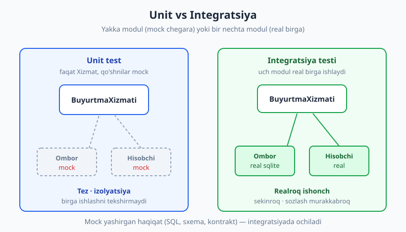
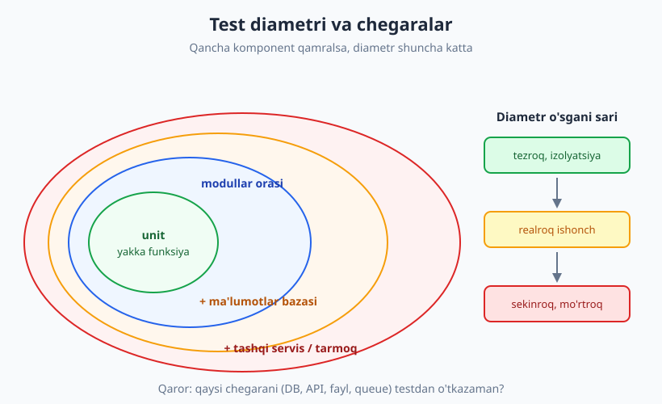
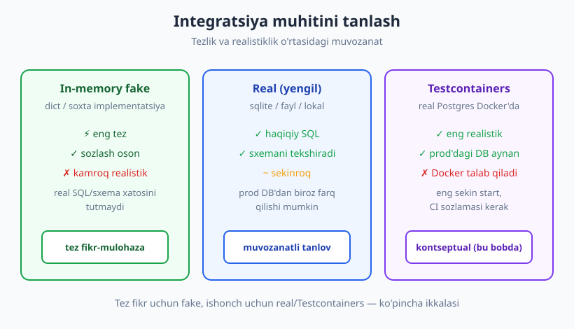

# 15 — Integratsiya testlari

[🏠 README](./README.md) · [⬅️ Oldingi: 14 — BDD va spetsifikatsiya](./14-bdd-spetsifikatsiya.md) · [Keyingi: 16 — Ma'lumotlar bazasi va tashqi servislarni testlash ➡️](./16-malumotlar-bazasi-testlash.md)

---

> **Bu bobda:** ikki yoki undan ko'p komponent **birga to'g'ri ishlashini** tekshiradigan integratsiya testlarini o'rganamiz. Unit testda har modul yakka, qo'shnilari mock edi; bu yerda modullarni **real birlashtiramiz** va "alohida ishlaydi, birga ishlamaydi" muammosini ochamiz. Integratsiya chegaralarini (qayerda unit tugaydi), test diametri tushunchasini, muhitni tayyorlash variantlarini (real / in-memory fake / Testcontainers) va izolyatsiya qoidasini ko'ramiz. Jonli misol — `Ombor` (sqlite) + `BuyurtmaXizmati` + `Hisobchi` modullarini real `sqlite3` bilan birga sinash.
>
> **Halollik / Eslatma:** bu bob — IV qism ("integratsiya va yuqori darajadagi testlar") ochilishi va [03-bobdagi](./03-test-turlari-piramida.md) piramidaning ikkinchi qatlamini chuqurlashtiradi. Bu yerda **umumiy integratsiya** g'oyasini beramiz; ma'lumotlar bazasini chuqur ([16-bob](./16-malumotlar-bazasi-testlash.md)), HTTP/API'ni ([17-bob](./17-api-http-testlash.md)), mikroservis kontraktlarini ([18-bob](./18-kontrakt-testlar.md)) keyingi boblarga qoldiramiz. **Docker va Testcontainers** bu muhitda yo'q — uni **kontseptual** tushuntiramiz, amaliyotni esa standart kutubxonadagi `sqlite3` va in-memory fake bilan jonli ko'rsatamiz. Hamma Python namunalari haqiqatan ishga tushirib, chiqishi tekshirilgan (Python 3.14, `pytest` 9.0.3).

---

## "Alohida ishlaydi, birga ishlamaydi"

Tasavvur qiling: mashina ustaxonasi dvigatelni alohida stendda sinab ko'rdi — zo'r ishlayapti. G'ildiraklarni alohida sinadi — mukammal. Vites qutisini alohida — ideal. Keyin hammasini yig'ib, mashinani yo'lga chiqarsa — vites dvigatelga ulanmaydi, chunki ikkalasining biriktirgichi (kontrakt) mos kelmaydi. Har **detal** to'g'ri edi, lekin **birikma** noto'g'ri.

Dasturda ham aynan shunday bo'ladi. Siz `BuyurtmaXizmati`ni unit testda sinaysiz — `Ombor`ni mock qilib. Test yashil. `Ombor`ni alohida sinaysiz — u ham yashil. Lekin ishlab chiqarishda xizmat omborga `topish("A1")` deb murojaat qiladi-yu, ombor `dict` o'rniga `tuple` qaytaradi yoki SQL ustun nomi noto'g'ri yozilgan. Ikki modul **alohida** to'g'ri, lekin **birga** ishlamaydi.

**Integratsiya testi** — aynan shu bo'shliqni yopadi: ikki yoki undan ko'p komponent (modul, klass, qatlam, tizim) **birga, real holatda** to'g'ri ishlashini tekshiradi. Unit test "g'isht" ni, integratsiya testi "g'ishtlar orasidagi suvoq"ni sinaydi.



> **Asosiy g'oya:** unit test komponentni **izolyatsiyada** (qo'shnilar soxta) tekshiradi; integratsiya testi komponentlarni **birga** (qo'shnilar real) tekshiradi. Mock unit testda tezlik beradi, lekin **u yashirgan haqiqat** — ikki modul orasidagi kontrakt — faqat integratsiyada ochiladi.

### Mock nimani yashiradi

[07](./07-test-dublyorlari-nazariya.md)–[08-boblarda](./08-test-dublyorlari-amaliyot.md) ko'rdik: mock qo'shnining xulqini **siz aytgancha** soxtalashtiradi. Bu kuch ham, zaif joy ham. Quyidagi unit test mock'langan omborga ishonadi:

```python
from unittest.mock import MagicMock

def test_unit_mock_ombor():
    soxta_ombor = MagicMock()
    soxta_ombor.topish.return_value = {"kod": "A1", "narx": 100, "zaxira": 5}
    xizmat = BuyurtmaXizmati(soxta_ombor, Hisobchi(soliq_foiz=12))
    natija = xizmat.buyurtma_ber("A1", 2)
    assert natija["summa"] == 224          # 200 + 12%
    soxta_ombor.zaxira_kamaytir.assert_called_once_with("A1", 2)
    # -> PASS
```

Bu test **doim** o'tadi — chunki `soxta_ombor.topish` siz aytgan `dict`ni qaytaradi. Lekin **haqiqiy** `Ombor` sqlite'dan `tuple` qaytarsa-chi? Yoki `topish` umuman bunaqa metodga ega bo'lmasa? Mock buni bilmaydi va aytmaydi. Test yashil, kod buzuq. Integratsiya testi esa real omborni ulab, bu yolg'onni fosh qiladi.

---

## Integratsiya chegaralari: qayerda unit tugaydi

"Integratsiya" — keng so'z. Ikki sof funksiyani birga chaqirish ham texnik jihatdan "integratsiya", lekin biz buni unit deymiz. Demak chegara qayerda? Foydali mezon — **jarayon va tashqi dunyo chegarasi**. Test quyidagilardan birortasini **real** kesib o'tsa, u integratsiya testidir:

| Chegara | Misol | Nega integratsiya |
|---|---|---|
| **Ma'lumotlar bazasi** | SQL, ORM, sqlite/Postgres | Sxema, so'rov, tranzaksiya real ishlashi kerak ([16-bob](./16-malumotlar-bazasi-testlash.md)) |
| **Tashqi API / tarmoq** | HTTP, gRPC | Serializatsiya, status kod, kontrakt ([17](./17-api-http-testlash.md), [18-bob](./18-kontrakt-testlar.md)) |
| **Fayl tizimi** | fayl o'qish/yozish, format | Real disk, kodlash, yo'l |
| **Message queue** | Kafka, RabbitMQ, SQS | Xabar formati va yetkazib berish |
| **Modullar orasi** | xizmat ↔ repozitoriy | Ikki o'z koddagi modulning kontrakti |

### Narrow va broad integratsiya test

Integratsiya testlar diametri bo'yicha ikki turga bo'linadi (Martin Fowler atamasi):

- **Narrow (tor) integratsiya test** — sizning kodingiz va **bitta** tashqi bog'liqlik (masalan, faqat `Ombor` ↔ real sqlite). Tashqi servisning o'zi yengil yoki soxta. Tez, barqaror, fokuslangan.
- **Broad (keng) integratsiya test** — bir nechta real komponent va, ehtimol, tashqi tizimlar **bir yo'lda** birga ishlaydi (xizmat → DB → keshlar). Realroq, lekin sekinroq, mo'rtroq va sozlash murakkab — bu E2E'ga ([19-bob](./19-e2e-ui-testlar.md)) yaqinlashadi.

> **Maslahat:** ko'p **narrow** integratsiya test + oz **broad** test yozing. Tor test buzilganini aniqlash oson (qaysi chegara buzilgani ravshan); keng test yiqilsa, sababni topish uchun ko'p joyni tekshirishingizga to'g'ri keladi.

---

## Test diametri: qancha komponent?

"Test diametri" — testda **qancha** komponent birga ishlatilishining o'lchovi. Yakka funksiyadan (eng kichik) butun tizimgacha (eng katta) cho'ziladi. Diametr o'sgani sari ishonch ortadi, lekin tezlik tushadi va mo'rtlik oshadi.



> **Trade-off (03-bobni rivojlantirib):** integratsiya test = **realroq ishonch**, chunki mock yashirgan birikma xatolarini tutadi. Ammo narxi bor:
> - **Sekinroq** — real DB/IO unit testdan o'nlab marta sekin.
> - **Mo'rtroq (flaky)** — tashqi holat, tartib, vaqt bog'liqligi flaky'likka olib keladi ([24-bob](./24-flaky-testlar.md)).
> - **Sozlash murakkab** — DB ko'tarish, sxema yaratish, tozalash kerak.
>
> Shu sababli piramida ([03-bob](./03-test-turlari-piramida.md)): integratsiya testlar **kam, lekin muhim** — unit qatlamidan oz, E2E'dan ko'p. Eng tor diametrni tanlang, qaysi biri xatoni tutsa.

---

## Jonli misol: uch modulni birlashtiramiz

Uchta modul bilan ishlaymiz. Ular birga **buyurtma berish** oqimini tashkil qiladi:

- **`Ombor`** — mahsulot zaxirasini `sqlite3` bazasida saqlaydi (DB chegarasi).
- **`Hisobchi`** — sof mantiq: narx va miqdordan yakuniy summani (soliq bilan) hisoblaydi. DB'ni bilmaydi.
- **`BuyurtmaXizmati`** — ikkovini **birlashtiradi**: omborni tekshiradi, hisobchidan summani oladi, zaxirani kamaytiradi.

```python
import sqlite3

class Ombor:
    def __init__(self, ulanish):
        self.db = ulanish

    def yarat_sxema(self):
        self.db.execute(
            "CREATE TABLE mahsulot ("
            " kod TEXT PRIMARY KEY, nom TEXT NOT NULL,"
            " narx INTEGER NOT NULL, zaxira INTEGER NOT NULL)"
        )
        self.db.commit()

    def qoshish(self, kod, nom, narx, zaxira):
        self.db.execute(
            "INSERT INTO mahsulot (kod, nom, narx, zaxira) VALUES (?, ?, ?, ?)",
            (kod, nom, narx, zaxira),
        )
        self.db.commit()

    def topish(self, kod):
        qator = self.db.execute(
            "SELECT kod, nom, narx, zaxira FROM mahsulot WHERE kod = ?", (kod,)
        ).fetchone()
        if qator is None:
            return None
        return {"kod": qator[0], "nom": qator[1], "narx": qator[2], "zaxira": qator[3]}

    def zaxira_kamaytir(self, kod, miqdor):
        self.db.execute(
            "UPDATE mahsulot SET zaxira = zaxira - ? WHERE kod = ?", (miqdor, kod)
        )
        self.db.commit()
```

```python
class Hisobchi:                          # sof mantiq, DB bilmaydi
    def __init__(self, soliq_foiz=12):
        self.soliq_foiz = soliq_foiz
    def yakuniy_summa(self, narx, miqdor):
        oraliq = narx * miqdor
        return oraliq + oraliq * self.soliq_foiz // 100

class ZaxiraYetarliEmas(Exception):
    pass

class BuyurtmaXizmati:                    # ikkovini BIRLASHTIRADI
    def __init__(self, ombor, hisobchi):
        self.ombor = ombor
        self.hisobchi = hisobchi
    def buyurtma_ber(self, kod, miqdor):
        mahsulot = self.ombor.topish(kod)
        if mahsulot is None:
            raise KeyError(f"mahsulot topilmadi: {kod}")
        if mahsulot["zaxira"] < miqdor:
            raise ZaxiraYetarliEmas(f"{kod}: {miqdor} so'raldi, {mahsulot['zaxira']} bor")
        summa = self.hisobchi.yakuniy_summa(mahsulot["narx"], miqdor)
        self.ombor.zaxira_kamaytir(kod, miqdor)
        return {"kod": kod, "miqdor": miqdor, "summa": summa}
```

### Integratsiya testi: real sqlite bilan

Endi mock yo'q. `Ombor` **haqiqiy** `sqlite3` bazasiga ulanadi, `Hisobchi` real, va `BuyurtmaXizmati` ularni real birlashtiradi. `pytest` fixture'i har test uchun toza in-memory baza beradi:

```python
import sqlite3, pytest

def yangi_ombor(yol=":memory:"):
    ombor = Ombor(sqlite3.connect(yol))
    ombor.yarat_sxema()
    return ombor

@pytest.fixture
def xizmat():
    ombor = yangi_ombor()                 # haqiqiy in-memory sqlite
    ombor.qoshish("A1", "Daftar", 100, 5)
    return BuyurtmaXizmati(ombor, Hisobchi(soliq_foiz=12))

def test_integ_buyurtma_zaxirani_kamaytiradi(xizmat):
    natija = xizmat.buyurtma_ber("A1", 2)              # Act
    assert natija["summa"] == 224                       # 200 + 12%
    # Endi DB'dan O'QIB tasdiqlaymiz — mock yolg'on gapira olmaydi:
    assert xizmat.ombor.topish("A1")["zaxira"] == 3
    # -> PASS
```

Diqqat qiling: oxirgi `assert` **omborga qaytib o'qiydi**. Unit testda mock shunchaki "men chaqirildim" deb javob berardi (`assert_called_once_with`); bu yerda biz haqiqiy yozuvni — `INSERT` keyin `UPDATE` keyin `SELECT` zanjiri to'g'ri ishlaganini — real DB'dan tasdiqlaymiz. Bu integratsiyaning butun mohiyati.

Istisno yo'li ham real ishlashi kerak — zaxira yetmasa, DB **o'zgarmasligi** lozim:

```python
def test_integ_zaxira_yetarli_emas(xizmat):
    with pytest.raises(ZaxiraYetarliEmas):
        xizmat.buyurtma_ber("A1", 99)
    assert xizmat.ombor.topish("A1")["zaxira"] == 5    # o'zgarmadi
    # -> PASS
```

Fayl-asosli (in-memory emas) real sqlite bilan ham — bir ulanishda yozib, **boshqa** ulanishda o'qib, ma'lumot haqiqatan diskka yozilganini tasdiqlash mumkin:

```python
def test_integ_fayl_sqlite(tmp_path):
    yol = tmp_path / "savdo.db"
    ombor = yangi_ombor(str(yol))
    ombor.qoshish("B2", "Ruchka", 50, 10)
    xizmat = BuyurtmaXizmati(ombor, Hisobchi(soliq_foiz=12))
    xizmat.buyurtma_ber("B2", 4)
    # YANGI ulanish bilan o'sha faylni qayta ochib, yozilganini tasdiqlaymiz:
    boshqa = Ombor(sqlite3.connect(str(yol)))
    assert boshqa.topish("B2")["zaxira"] == 6
    # -> PASS
```

Butun paket haqiqiy `pytest` chiqishi:

```text
test_fake.py .                                                  [ 12%]
test_integ.py .....                                             [ 75%]
test_kontrakt_buzilishi.py ..                                   [100%]
============================== 8 passed in 0.60s ==============================
```

---

## Integratsiya tutadi, unit tutmaydi: kontrakt buzilishi

Endi eng muhim qismi — **mock yashirgan, integratsiya ochgan** xatoni jonli ko'ramiz. Faraz qiling, dasturchi `zaxira_kamaytir`da SQL ustun nomini xato yozdi: jadvalda ustun `zaxira`, lekin so'rovda `qoldiq` deb yozilgan:

```python
class XatoOmbor:
    def __init__(self, ulanish):
        self.db = ulanish
    def yarat_sxema(self):
        self.db.execute("CREATE TABLE mahsulot (kod TEXT PRIMARY KEY, zaxira INTEGER)")
        self.db.commit()
    def qoshish(self, kod, zaxira):
        self.db.execute("INSERT INTO mahsulot (kod, zaxira) VALUES (?, ?)", (kod, zaxira))
        self.db.commit()
    def zaxira_kamaytir(self, kod, miqdor):
        # XATO: 'qoldiq' degan ustun sxemada YO'Q (to'g'risi 'zaxira').
        self.db.execute("UPDATE mahsulot SET qoldiq = qoldiq - ? WHERE kod = ?",
                        (miqdor, kod))
        self.db.commit()
```

**Unit test** (mock bilan) bu xatoni **ko'rmaydi** — chunki mock haqiqiy SQL ishlatmaydi:

```python
def test_unit_mock_xatoni_yashiradi():
    soxta = MagicMock()                  # haqiqiy SQL umuman ishlamaydi
    soxta.zaxira_kamaytir("A1", 1)
    soxta.zaxira_kamaytir.assert_called_once_with("A1", 1)
    # -> PASS (lekin xato hali kodda turibdi!)
```

**Integratsiya test** (real sqlite) esa xatoni **darhol** ochadi:

```python
def test_integ_xatoni_ochadi():
    ombor = XatoOmbor(sqlite3.connect(":memory:"))
    ombor.yarat_sxema()
    ombor.qoshish("A1", 5)
    with pytest.raises(sqlite3.OperationalError):   # "no such column: qoldiq"
        ombor.zaxira_kamaytir("A1", 1)
    # -> PASS (integratsiya kontrakt buzilishini TUTDI)
```

Real DB'da chaqirilganda aniq xato: `sqlite3.OperationalError: no such column: qoldiq`. Mana shu — **integratsiya testi tutadigan, unit testi printsipial tuta olmaydigan** xato sinfi: kod va tashqi tizim (DB sxemasi) orasidagi **kontrakt buzilishi**. Bunday moslikni mikroservislararo formal tekshirish [18-bob: Kontrakt testlar](./18-kontrakt-testlar.md)da chuqurlashtiriladi.

> **Eslatma:** bu mock'ning yomonligini bildirmaydi. Mock unit testni tez va fokuslangan qiladi (xizmatning **mantiqini** sinaydi). Muammo — **faqat** mock'larga tayanish: u holda hech bir test real birikmani tekshirmaydi. To'g'ri yondashuv — ikkalasi: unit (mantiq, tez) + integratsiya (birikma, realroq).

---

## Test muhitini tayyorlash: real vs fake vs Testcontainers

Integratsiya testida tashqi bog'liqlikni qanday ta'minlaysiz? Uchta asosiy yo'l bor, har birining o'rni boshqa.



### In-memory fake (tez, kamroq realistik)

**Fake** — bog'liqlikning ishlaydigan, lekin soddalashtirilgan implementatsiyasi ([07-bobdagi](./07-test-dublyorlari-nazariya.md) taksonomiyada "fake"). Mock'dan farqi: fake **haqiqatan ishlaydi** (real holatni saqlaydi), faqat soddaroq (xotirada, diskka tegmasdan). Bizning `Ombor`ning `dict`-asosli faki:

```python
class FakeOmbor:
    def __init__(self):
        self._mahsulotlar = {}
    def qoshish(self, kod, nom, narx, zaxira):
        self._mahsulotlar[kod] = {"kod": kod, "nom": nom, "narx": narx, "zaxira": zaxira}
    def topish(self, kod):
        return self._mahsulotlar.get(kod)
    def zaxira_kamaytir(self, kod, miqdor):
        self._mahsulotlar[kod]["zaxira"] -= miqdor

def test_fake_ombor_bilan_xizmat():
    ombor = FakeOmbor()
    ombor.qoshish("A1", "Daftar", 100, 5)
    xizmat = BuyurtmaXizmati(ombor, Hisobchi(soliq_foiz=12))
    natija = xizmat.buyurtma_ber("A1", 2)
    assert natija["summa"] == 224
    assert ombor.topish("A1")["zaxira"] == 3      # fake real holatni saqlaydi
    # -> PASS
```

`BuyurtmaXizmati` kodi **umuman o'zgarmaydi** — u faqat `topish`/`zaxira_kamaytir` **kontraktiga** tayanadi, kim bajarishidan qat'i nazar. Bu — fake'ning kuchi: tez (DB yo'q), lekin real xulq (holat saqlanadi). Zaifligi: u real SQL/sxemani sinamaydi — yuqoridagi `qoldiq` xatosini fake **ham** tutmaydi.

### Real bog'liqlik (realistik, sekinroq)

Yuqorida ko'rganimiz — real `sqlite3`. SQL haqiqatan bajariladi, sxema tekshiriladi, kontrakt buzilishi ushlanadi. `sqlite3` Python standart kutubxonasida, hech narsa o'rnatmaysiz va in-memory rejimida (`:memory:`) deyarli fake'dek tez. Kamchiligi: prod'da Postgres/MySQL ishlatsangiz, sqlite ulardan ozgina farq qiladi (tip tizimi, SQL dialekti) — shuning uchun u prod DB'ning **to'liq** o'rnini bosmaydi.

### Testcontainers (eng realistik, Docker kerak) — kontseptual

Eng yuqori ishonch uchun **aynan prod'dagi** DB'ni (real Postgres) test paytida ko'tarish kerak. **Testcontainers** kutubxonasi shuni qiladi: test boshlanganda Docker konteynerda real Postgres ko'taradi, test tugaganda o'chiradi. Shunday ko'rinadi (eskiz — **bu muhitda Docker yo'q, ishga tushirmaymiz**):

```python
# KONSEPTUAL eskiz — Docker talab qiladi, bu yerda ishlatilmaydi.
# pip install testcontainers[postgres]
from testcontainers.postgres import PostgresContainer
import psycopg

def test_real_postgres():
    with PostgresContainer("postgres:18") as pg:     # konteyner ko'tariladi
        ulanish = psycopg.connect(pg.get_connection_url())
        ombor = Ombor(ulanish)
        ombor.yarat_sxema()
        # ... aynan prod'dagi Postgres'da integratsiya testi ...
    # blok tugagach konteyner avtomatik o'chadi
```

> **Trade-off jadvali — qaysi muhitni tanlash:**
>
> | Variant | Tezlik | Realistiklik | Sozlash | Qachon |
> |---|---|---|---|---|
> | **In-memory fake** | ⚡ eng tez | past (SQL/sxema yo'q) | oson | Xizmat mantiqini tez sinash; minglab test |
> | **Real (sqlite)** | tez | o'rta–yuqori (real SQL) | oson | Repozitoriy/so'rovlarni sinash; standart tanlov |
> | **Testcontainers** | sekin (Docker start) | eng yuqori (prod DB) | murakkab (Docker, CI) | DB'ga xos xulq (tranzaksiya, tip, indeks) muhim bo'lganda |
>
> Amalda ko'pincha **ikkalasi**: lokal/tez fikr uchun fake yoki sqlite, CI'da ([27-bob](./27-ci-cd-avtomatlashtirish.md)) Testcontainers bilan prod DB'da. Til-mustaqil: Testcontainers JS, PHP, Java, Go'da ham mavjud — g'oya bir xil.

---

## Test izolyatsiyasi: har test toza holatdan

Integratsiyada eng katta tuzoq — **umumiy holat** (shared state). Real DB testdan testga ma'lumotni **saqlaydi**. Agar 1-test mahsulot qo'shsa va 2-test uni kutmasa, 2-test **boshqa testning iflosligidan** yiqiladi (yoki yolg'ondan o'tadi). Bu [04-bobdagi](./04-yaxshi-test-xossalari.md) "Independent" (mustaqillik) tamoyilining buzilishi va flaky'likning ([24-bob](./24-flaky-testlar.md)) keng tarqalgan sababi.

Yechim: **har integratsiya testi toza holatdan boshlasin.** Bizning fixture'imiz buni avtomatik beradi — har test uchun **yangi** in-memory baza yaratiladi:

```python
def test_integ_har_test_toza_holatdan(xizmat):
    # Oldingi test 2 dona sotgan bo'lsa ham, bu test toza zaxira (5) ko'radi:
    assert xizmat.ombor.topish("A1")["zaxira"] == 5
    # -> PASS
```

`@pytest.fixture` har testga qaytadan chaqiriladi, demak har test **yangi** `:memory:` baza, **yangi** seed bilan boshlanadi — testlar bir-biriga sizib o'tmaydi.

Toza holatni ta'minlashning umumiy strategiyalari:

| Strategiya | Qanday | Tezlik |
|---|---|---|
| **Yangi baza har testga** | Bizdagidek `:memory:` qayta yaratish | Tez (sqlite) |
| **Tranzaksiya + rollback** | Test boshida tranzaksiya, oxirida bekor | Eng tez (real DB) |
| **Jadvallarni tozalash** | Har testdan oldin `DELETE`/`TRUNCATE` | O'rta |

> **Diqqat:** real (fayl/server) DB bilan **bitta** umumiy bazani ko'p testga ulashish — eng tez ko'rinadi, lekin eng xavfli. Test tartibi o'zgarsa (`pytest` random tartibda yoki parallel ishlatsa), testlar bir-biriga aralashadi. Tranzaksiya-rollback yondashuvi — chuqur [16-bob](./16-malumotlar-bazasi-testlash.md)da; hozircha qoidani eslang: **har test o'z toza holatini o'zi yaratsin.**

---

## Piramidadagi o'rni: kam, lekin muhim

[03-bobdagi](./03-test-turlari-piramida.md) piramidada integratsiya — **o'rta qatlam**: unit'dan kam, E2E'dan ko'p. Nega kam? Chunki har integratsiya test sekinroq va mo'rtroq. Nega muhim? Chunki ular unit tutmaydigan xato sinfini — birikma/kontrakt xatolarini — tutadi.

**Qachon ko'proq integratsiya kerak:**

- **Mikroservis arxitektura** — tizim ko'p mustaqil xizmatdan iborat; ko'pchilik xato xizmatlar **orasida**, ichida emas. (Arxitektura: [../arxitektura/README.md](../arxitektura/README.md).)
- **Ko'p IO** — DB, fayl, tashqi API ko'p bo'lgan tizim (masalan ma'lumot quvuri). Mantiq oddiy, lekin integratsiya nozik.
- **Yupqa mantiq qatlami** — agar koddagi mantiq oz, asosiy ish DB/tashqi servisda bo'lsa, ko'p unit test ozgina foyda beradi; integratsiya ishonchni ko'taradi.

**Qachon kamroq:** murakkab biznes mantiqli, lekin oz IO'li tizim (masalan hisob-kitob, qoidalar dvigateli). Bu yerda mantiqning ko'p qismi sof funksiya — unit test arzon va kuchli.

---

## Asosiy g'oyalar (bobni qisqacha)

- **Integratsiya testi** ikki yoki undan ko'p komponent **birga to'g'ri ishlashini** tekshiradi; unit yakka modulni (qo'shnilar mock), integratsiya esa modullarni **real birga** sinaydi.
- **"Alohida ishlaydi, birga ishlamaydi"** — har modul to'g'ri, lekin birikma (kontrakt) noto'g'ri. Mock buni yashiradi, integratsiya ochadi.
- **Integratsiya chegarasi** — test real kesib o'tadigan tashqi nuqta: DB, tashqi API, fayl, message queue, modullar orasi.
- **Narrow vs broad:** ko'p **tor** test (kod + bitta bog'liqlik, fokuslangan) + oz **keng** test (ko'p komponent, E2E'ga yaqin) yozing.
- **Test diametri** — qancha komponent qamralgani. Katta diametr = realroq ishonch, lekin sekinroq, mo'rtroq, murakkabroq sozlash (trade-off).
- **Muhit tanlovi:** in-memory **fake** (tez, kamroq realistik) · real **sqlite** (tez, real SQL, standart tanlov) · **Testcontainers** (prod DB, eng realistik, Docker kerak — kontseptual).
- **Izolyatsiya shart:** har integratsiya test **toza holatdan** boshlasin (yangi baza / tranzaksiya-rollback / tozalash) — umumiy holat flaky'likka olib keladi.
- **Piramidada kam, lekin muhim;** mikroservis va ko'p-IO tizimlarda ko'proq integratsiya kerak.

---

## Mashqlar

### Oson

**1-mashq.** Quyidagi to'rt testdan qaysilari unit, qaysilari integratsiya ekanini ayting va sababini yozing: (a) sof `yakuniy_summa(100, 2)` funksiyasini tekshiradi; (b) real sqlite omborga yozib, qayta o'qiydi; (c) `MagicMock` ombor bilan xizmatni sinaydi; (d) xizmat → real DB → o'qib tasdiqlaydi.

**2-mashq.** `Hisobchi` va `BuyurtmaXizmati`ni real `FakeOmbor` bilan birlashtirib, "zaxira aniq yetarli" (zaxira = so'ralgan miqdor) holatini sinaydigan integratsiya testi yozing. Test buyurtmadan keyin zaxira `0` ekanini tasdiqlasin.

**3-mashq.** Nima uchun `test_unit_mock_ombor` testi `Ombor`dagi SQL ustun nomi xatosini (`qoldiq`) tuta olmaydi? Bir jumlada tushuntiring.

### O'rta

**4-mashq.** `pytest` fixture yozing: har test uchun yangi in-memory sqlite `Ombor` yaratib, ikkita mahsulot (`"A1"` zaxira 5, `"B2"` zaxira 0) bilan seed qilsin. Shu fixture bilan ikki test yozing: `"A1"` buyurtmasi muvaffaqiyatli, `"B2"` buyurtmasi `ZaxiraYetarliEmas` chiqaradi.

**5-mashq.** Test izolyatsiyasi buzilgan stsenariy: ikki integratsiya test **bitta** umumiy `Ombor` obyektidan foydalansa (fixture'siz, modul darajasida yaratilsa) qanday muammo yuzaga keladi? Tartib o'zgarganda nima bo'ladi? Yechimini ayting.

**6-mashq.** `BuyurtmaXizmati`ga shunday integratsiya testi yozingki, u **ikki ketma-ket buyurtma**ni tekshirsin (`"A1"` zaxira 5: avval 2 dona, keyin 2 dona) va oxirida real DB'dan zaxira `1` ekanini tasdiqlasin. Bu test nimani isbotlaydi (unit test isbotlay olmaydigan)?

### Qiyin

**7-mashq.** Jamoadosh: "Hamma integratsiya testni Testcontainers bilan real Postgres'da yozaylik — eng realistik-ku." Bu fikrning **trade-off**larini yozing: qachon to'g'ri, qachon ortiqcha? Qaysi holatda in-memory fake yoki sqlite afzal? Tezlik, CI murakkabligi va piramida nuqtai nazaridan baholang.

**8-mashq.** `FakeOmbor` (in-memory) va real `sqlite3` `Ombor` ikkalasi ham `topish`/`zaxira_kamaytir` kontraktini bajaradi. Bitta **parametrlangan** test yozingki ([06-bobdagi](./06-fixture-parametrize.md) `parametrize` bilan), u **ikkala** implementatsiyada ham bir xil integratsiya stsenariysini sinasin. Bu nima foyda beradi va qaysi xato sinfini fake versiya **baribir** tutmaydi?

<details markdown="1">
<summary>Yechimlar</summary>

### 1-mashq yechimi

- **(a) Unit.** Yakka sof funksiya, hech qanday tashqi chegara kesilmaydi.
- **(b) Integratsiya.** Real DB chegarasi kesiladi (sqlite'ga yozish/o'qish).
- **(c) Unit.** Ombor mock — real bog'liqlik yo'q, faqat xizmat mantig'i izolyatsiyada sinaladi.
- **(d) Integratsiya.** Xizmat + real DB birga ishlaydi va natija DB'dan tasdiqlanadi.

### 2-mashq yechimi

```python
def test_integ_zaxira_aniq_yetarli():
    ombor = FakeOmbor()
    ombor.qoshish("A1", "Daftar", 100, 3)
    xizmat = BuyurtmaXizmati(ombor, Hisobchi(soliq_foiz=12))
    xizmat.buyurtma_ber("A1", 3)                    # zaxira = so'ralgan miqdor
    assert ombor.topish("A1")["zaxira"] == 0
    # -> PASS
```

### 3-mashq yechimi

Mock haqiqiy SQL'ni umuman bajarmaydi — `zaxira_kamaytir` siz aytgancha (hech narsa) "ishlaydi", shuning uchun noto'g'ri ustun nomi (`qoldiq`) hech qachon real bazaga urilmaydi va xato yuzaga kelmaydi.

### 4-mashq yechimi

```python
import pytest

@pytest.fixture
def xizmat2():
    ombor = yangi_ombor()
    ombor.qoshish("A1", "Daftar", 100, 5)
    ombor.qoshish("B2", "Ruchka", 50, 0)
    return BuyurtmaXizmati(ombor, Hisobchi(soliq_foiz=12))

def test_integ_a1_muvaffaqiyatli(xizmat2):
    natija = xizmat2.buyurtma_ber("A1", 2)
    assert natija["summa"] == 224
    assert xizmat2.ombor.topish("A1")["zaxira"] == 3
    # -> PASS

def test_integ_b2_zaxira_yoq(xizmat2):
    with pytest.raises(ZaxiraYetarliEmas):
        xizmat2.buyurtma_ber("B2", 1)
    # -> PASS
```

### 5-mashq yechimi

Agar ikki test bitta umumiy `Ombor`ni baham ko'rsa, **umumiy holat** muammosi yuzaga keladi: 1-test zaxirani kamaytirsa, 2-test endi toza emas, "iflos" holatni ko'radi. `pytest` testlarni odatda fayl tartibida, lekin parallel/random tartibda ham ishlatishi mumkin — tartib o'zgarsa, natija o'zgaradi va test **flaky** bo'ladi (goh o'tadi, goh yiqiladi). Yechim: fixture orqali har testga **yangi** baza berish (yoki tranzaksiya-rollback), shunda testlar mustaqil bo'ladi ([04-bob](./04-yaxshi-test-xossalari.md) "Independent").

### 6-mashq yechimi

```python
def test_integ_ikki_ketma_ket_buyurtma(xizmat):
    xizmat.buyurtma_ber("A1", 2)                    # 5 -> 3
    xizmat.buyurtma_ber("A1", 2)                    # 3 -> 1
    assert xizmat.ombor.topish("A1")["zaxira"] == 1
    # -> PASS
```

Bu test **holatning to'planishini** isbotlaydi: birinchi `UPDATE` natijasi DB'da saqlanib, ikkinchi buyurtma uni hisobga oladi. Mock'li unit test buni isbotlay olmaydi — chunki mock haqiqiy holatni saqlamaydi (har chaqiruvda siz bergan qiymatni qaytaradi, oldingi `UPDATE`ni "eslamaydi").

### 7-mashq yechimi

**Qachon to'g'ri:** prod'da Postgres ishlatilsa va testda DB'ga xos xulq muhim bo'lsa — masalan tranzaksiya izolyatsiya darajalari, aniq tip tizimi, indeks/cheklov xulqi, dialektga xos SQL. Bunda sqlite yetarli emas, Testcontainers prod'dagi DB'ni aynan beradi.

**Qachon ortiqcha:**
- **Tezlik:** Testcontainers har test sessiyasida Docker konteyner ko'taradi — sekin start. Minglab test uchun bu fikr-mulohaza halqasini ([27-bob](./27-ci-cd-avtomatlashtirish.md)) sekinlashtiradi.
- **CI murakkabligi:** Docker mavjudligini talab qiladi; ba'zi CI muhitida sozlash murakkab.
- **Piramida:** integratsiya testlar **kam** bo'lishi kerak. Xizmat **mantiqini** sinash uchun fake/sqlite yetarli va tez; faqat DB-ga xos xulqni sinaydigan **oz** testda Testcontainers ishlating.

**Afzal qachon fake/sqlite:** mantiq-og'ir, DB-ga xos xulq muhim bo'lmagan testlar uchun in-memory fake (eng tez) yoki sqlite (real SQL, tez). Amalda: ko'p fake/sqlite + oz Testcontainers.

### 8-mashq yechimi

```python
import sqlite3, pytest

def make_fake():
    o = FakeOmbor(); o.qoshish("A1", "Daftar", 100, 5); return o

def make_sqlite():
    o = yangi_ombor(); o.qoshish("A1", "Daftar", 100, 5); return o

@pytest.mark.parametrize("ombor_yarat", [make_fake, make_sqlite],
                         ids=["fake", "sqlite"])
def test_integ_ikkala_implementatsiya(ombor_yarat):
    ombor = ombor_yarat()
    xizmat = BuyurtmaXizmati(ombor, Hisobchi(soliq_foiz=12))
    natija = xizmat.buyurtma_ber("A1", 2)
    assert natija["summa"] == 224
    assert ombor.topish("A1")["zaxira"] == 3
    # -> PASS (2 ta: fake va sqlite)
```

**Foydasi:** bir xil **kontrakt testi** ikki implementatsiyaga ham qo'llanadi — fake'ning real sqlite bilan **bir xil xulqda** ekanini tasdiqlaydi (fake "ishonchli o'rinbosar"ligini sinaydi). Bu — kontrakt testlarining ([18-bob](./18-kontrakt-testlar.md)) sodda ko'rinishi.

**Fake baribir tutmaydigan xato sinfi:** real SQL/sxema xatolari — noto'g'ri ustun nomi (`qoldiq`), tip mosligi, cheklov buzilishi. Fake Python `dict` ustida ishlaydi, SQL bajarmaydi; shuning uchun bunday xatolarni faqat real sqlite (yoki Testcontainers) versiyasi tutadi. Aynan shu sabab — fake yagona muhit bo'la olmaydi.

</details>

---

[🏠 README](./README.md) · [⬅️ Oldingi: 14 — BDD va spetsifikatsiya](./14-bdd-spetsifikatsiya.md) · [Keyingi: 16 — Ma'lumotlar bazasi va tashqi servislarni testlash ➡️](./16-malumotlar-bazasi-testlash.md)
