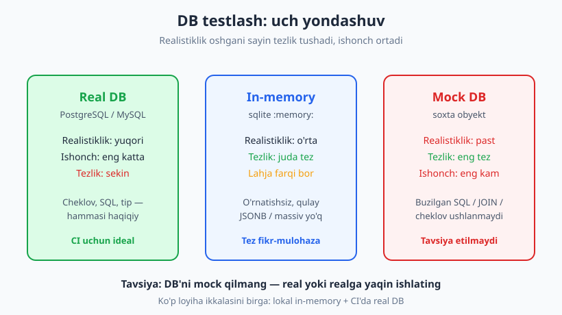
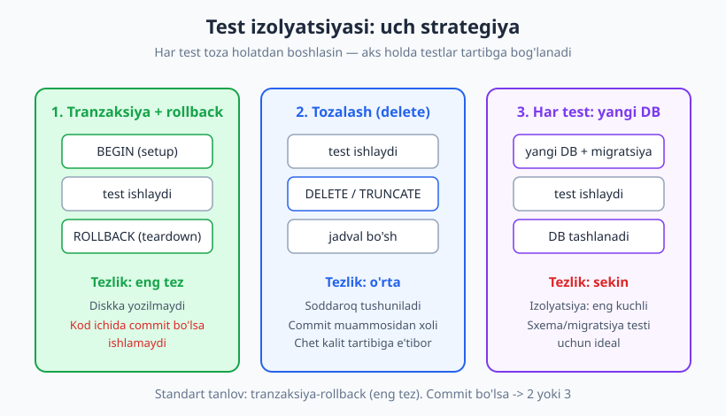
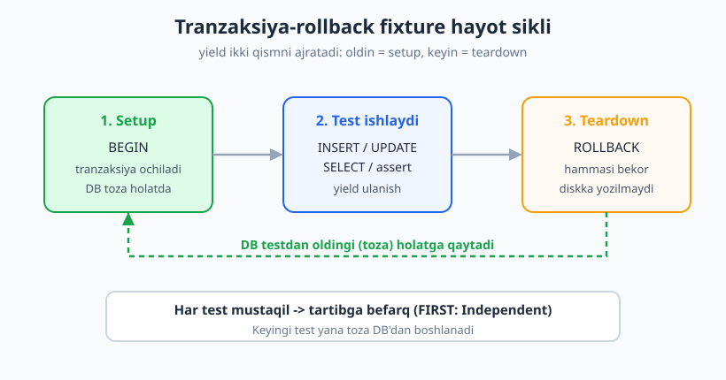

# 16 — Ma'lumotlar bazasi va tashqi servislarni testlash

[🏠 README](./README.md) · [⬅️ Oldingi: 15 — Integratsiya testlari](./15-integratsiya-testlari.md) · [Keyingi: 17 — API va HTTP testlash ➡️](./17-api-http-testlash.md)

---

> **Bu bobda:** integratsiya testlarining eng tez-tez uchraydigan ikki "chegarasi" —
> **ma'lumotlar bazasi** (DB) va **tashqi servislar** (to'lov, email, SMS, uchinchi-tomon API).
> DB'ni real ishlatish va shu bilan birga testlarni **toza, mustaqil va tez** saqlash — bu bobning
> markaziy mahorati. Tranzaksiya/rollback izolyatsiyasi, migratsiya, seed (ma'lumot ekish),
> fixture vs factory va tashqi servislarni izolyatsiya qilishni jonli `sqlite3` misollarida ko'ramiz.
>
> **Halollik / Eslatma:** bu testlar **integratsiya darajasida** — unit testdan sekinroq, shuning
> uchun ko'p emas, **asosiy yo'llar** uchun yoziladi. SVG va misollarda `sqlite` ishlatamiz (Python
> standart kutubxonasida bor), lekin lahjasi PostgreSQL/MySQL'dan farq qiladi — buni ochiq aytamiz.
> HTTP'ni soxtalashtirish (17-bob) va servislararo kontrakt (18-bob) — keyingi boblar. Barcha Python
> namunalari `python -m pytest` (Python 3.14, pytest 9.0.3) bilan haqiqatan ishga tushirib tekshirilgan.

---

## DB testlash dilemmasi: real, in-memory yoki mock?

Tasavvur qiling, restoranda yangi taom retseptini sinaysiz. Uch yo'l bor: (1) **haqiqiy oshxonada,
haqiqiy mahsulot bilan** pishirib ko'rasiz — eng ishonchli, lekin sekin va idishlar kir bo'ladi;
(2) **kichik test-oshxonada** tez sinaysiz — qulay, lekin pechka boshqacha; (3) **faqat qog'ozda**
ingredientlarni "tasavvur qilasiz" — eng tez, lekin haqiqatda ishlashini bilmaysiz.

DB testlash xuddi shu uch yo'l:

| Yondashuv | Realistiklik | Tezlik | Tuzoq |
|---|---|---|---|
| **Real DB** (production bilan bir xil: PostgreSQL/MySQL) | Eng yuqori | Sekin | Holat oqib ketadi; o'rnatish murakkab |
| **In-memory** (`sqlite :memory:`) | O'rta | Juda tez | **Lahja farqi** (SQL, tip, funksiya) |
| **Mock** (DB'ni soxta obyekt bilan) | Eng past | Eng tez | Hech narsani isbotlamaydi |



> **Markaziy tavsiya: DB'ni mock qilmang.** SQL so'rovini mock qilsangiz, siz faqat *o'zingiz yozgan
> taxminni* tekshirasiz — so'rov haqiqatan to'g'ri ishlashini emas. Real (yoki realga yaqin) DB
> ishlating. Tashqi servisni mock qilish (to'lov, email) — boshqa masala (pastda ko'ramiz); DB esa
> sizning **o'z mas'uliyatingiz**, uni real sinash kerak.

Bu nega muhim? Mock qilingan DB quyidagi haqiqiy xatolarni **hech qachon ushlamaydi**: noto'g'ri
yozilgan SQL, buzilgan `JOIN`, yetishmagan indeks/cheklov (`UNIQUE`, `NOT NULL`), tranzaksiya
muammosi, tip mosligi. Bularning hammasi faqat haqiqiy DB bilan ko'rinadi.

> **Trade-off — in-memory lahja:** `sqlite :memory:` juda tez va o'rnatishsiz, shuning uchun
> o'rganish va ko'p loyihalar uchun ajoyib. Lekin u production DB **emas**: PostgreSQL'ning
> `JSONB`, massiv, oyna funksiyalari, qat'iy tip tekshiruvi sqlite'da boshqacha ishlaydi yoki
> yo'q. Eng ishonchli yo'l — testda **production bilan bir xil DB** ishlatish (15-bobdagi
> Testcontainers g'oyasi). Bu bobda misol uchun sqlite olamiz, lekin tamoyillar har ikkalasiga bir xil.

---

## Test izolyatsiyasi DB'da — eng muhim mahorat

04-bobdan eslang: yaxshi test **mustaqil** (FIRST'dagi "I" — Isolated/Independent). Har test
**toza holatdan** boshlanishi kerak. DB'da bu eng qiyin, chunki DB — bitta umumiy o'zgaruvchan
holat: bir test yaratgan qator keyingi testga "oqib" o'tadi. Test A "Ali"ni qo'shsa, test B uni
ko'rib qoladi — natija **test tartibiga bog'liq** bo'ladi (flaky, 24-bob).

Bunga uchta asosiy strategiya bor:



### Strategiya 1: tranzaksiya + rollback (eng tez, tavsiya etiladi)

G'oya oddiy va nafis: har testdan **oldin** tranzaksiya ochasiz (`BEGIN`), test ishlaydi,
keyin tranzaksiyani **bekor qilasiz** (`ROLLBACK`). Hech narsa diskka yozilmaydi — DB testdan
oldingi holatiga qaytadi. Bu eng tez, chunki diskka commit qilinmaydi.

`conftest.py`da (06-bob — `conftest.py` fixture'larni avtomatik ulashadi) fixture yozamiz:

```python
# conftest.py
import sqlite3
import pytest
from ombor import migratsiya

@pytest.fixture(scope="session")
def ulanish_session():
    # Butun sessiya uchun bitta ulanish + sxema (migratsiya bir marta).
    ulanish = sqlite3.connect(":memory:")
    ulanish.row_factory = sqlite3.Row
    migratsiya(ulanish)
    yield ulanish
    ulanish.close()

@pytest.fixture
def ulanish(ulanish_session):
    ulanish_session.execute("BEGIN")     # setup: tranzaksiya och
    yield ulanish_session                # test ishlaydi
    ulanish_session.rollback()           # teardown: hammani bekor qil
```

`yield`dan **oldingi** kod — tayyorlash (setup, `BEGIN`); `yield`dan **keyingi** kod — tozalash
(teardown, `ROLLBACK`). Har test o'z tranzaksiyasi ichida ishlaydi va tugaganda hammasi bekor
bo'ladi. Sxema (`migratsiya`) faqat **bir marta** (`scope="session"`) quriladi — tez.

> **Trade-off:** rollback strategiyasi tezligi uchun mukammal, lekin kodingiz **o'z ichida
> commit/tranzaksiyani boshqarsa**, u test tranzaksiyasini buzishi mumkin (ichki commit tashqi
> rollback'ni "yo'qotadi"). Bunday holatda 2- yoki 3-strategiyaga o'ting. Shuningdek, kod
> bir nechta ulanish ochsa, ular bir tranzaksiyani ko'rmaydi.

### Strategiya 2: tozalash (truncate/delete)

Har testdan keyin jadvallarni bo'shatasiz. Soddaroq tushuniladi, rollback muammolaridan xoli,
lekin sekinroq (haqiqiy o'chirish bo'ladi).

```python
@pytest.fixture
def db_tozalash():
    ulanish = sqlite3.connect(":memory:")
    ulanish.row_factory = sqlite3.Row
    migratsiya(ulanish)
    yield ulanish
    ulanish.execute("DELETE FROM foydalanuvchilar")   # teardown: tozalash
    ulanish.close()
```

> **Eslatma:** `sqlite`da `TRUNCATE` yo'q — `DELETE FROM jadval` ishlatamiz. PostgreSQL/MySQL'da
> `TRUNCATE TABLE` ko'pincha tezroq, lekin chet kalit (foreign key) tartibiga e'tibor bering
> (`TRUNCATE ... CASCADE` yoki to'g'ri tartibda o'chirish).

### Strategiya 3: har test uchun yangi DB / sxema

Eng kuchli izolyatsiya: har test **mutlaqo toza** DB yoki sxemadan boshlanadi. Eng ishonchli,
lekin eng sekin (har safar sxema quriladi).

```python
@pytest.fixture
def yangi_db():
    ulanish = sqlite3.connect(":memory:")   # har chaqiruvda yangi xotira DB
    ulanish.row_factory = sqlite3.Row
    migratsiya(ulanish)
    yield ulanish
    ulanish.close()
```

| Strategiya | Tezlik | Izolyatsiya kuchi | Qachon |
|---|---|---|---|
| Tranzaksiya + rollback | Eng tez | Yuqori | Standart tanlov; kod ichida commit yo'q bo'lsa |
| Tozalash (delete/truncate) | O'rta | Yuqori | Kod ichida commit bo'lsa; soddalik kerak bo'lsa |
| Har test uchun yangi DB | Sekin | Eng yuqori | To'liq izolyatsiya shart bo'lsa (migratsiya, sxema testi) |

---

## Migratsiya va sxemani testda qo'llash

Eng katta xato — testda jadvallarni **qo'lda** yaratish, production'da esa **migratsiya** bilan.
Bunda test sxemasi production'dan asta-sekin **chetlab ketadi**: testlar yashil, lekin production
buziladi. Oltin qoida: **test DB sxemasi production bilan bir xil yo'l bilan qurilsin** — ya'ni
production migratsiyalarini ishlatib.

Bizning loyihamizda sxema bitta `migratsiya` funksiyasida (real loyihada bu Alembic, Django
migrations, Flyway kabi vositalar bo'ladi):

```python
# ombor.py
import sqlite3

SXEMA = """
CREATE TABLE IF NOT EXISTS foydalanuvchilar (
    id    INTEGER PRIMARY KEY AUTOINCREMENT,
    ism   TEXT NOT NULL,
    email TEXT NOT NULL UNIQUE
);
"""

def migratsiya(ulanish):
    ulanish.executescript(SXEMA)
```

Migratsiyani jonli sinab ko'ramiz — jadval haqiqatan yaratiladimi:

```python
import sqlite3
ulanish = sqlite3.connect(":memory:")
ulanish.executescript("""
CREATE TABLE mahsulotlar (id INTEGER PRIMARY KEY, nom TEXT NOT NULL, narx INTEGER NOT NULL);
""")
jadvallar = ulanish.execute(
    "SELECT name FROM sqlite_master WHERE type='table'").fetchall()
print([j[0] for j in jadvallar])
# -> ['mahsulotlar']
```

> **Eslatma:** `UNIQUE` cheklovi (email ustida) — aynan shu narsani mock qilingan DB **hech qachon**
> ushlamaydi. Real DB esa takror email kiritishga urinilganda xato beradi — buni pastdagi to'liq
> misolda testlaymiz.

---

## Test ma'lumotini ekish (seeding): fixture vs factory

Test ishlashidan oldin DB'ga kerakli ma'lumot solish — **seeding** (ma'lumot ekish). 06-bobda
fixture va factory'ni ko'rgandik; bu yerda ularni DB kontekstida qo'llaymiz.

**Fixture (statik seed):** oldindan tayyor, o'zgarmas ma'lumot. Tushunarli, lekin har test bir
xil ma'lumotni baham ko'radi.

**Factory (funksiya):** har test o'ziga kerakli ma'lumotni, kerakli farq bilan yaratadi —
moslashuvchanroq:

```python
import uuid

def foydalanuvchi_yasa(ombor, **uzgartirish):
    asos = {"ism": "Test", "email": f"u-{uuid.uuid4().hex[:8]}@m.uz"}  # takrorlanmas
    asos.update(uzgartirish)              # faqat kerakli maydonni o'zgartir
    return ombor.yarat(asos["ism"], asos["email"])

# test ichida:
fid = foydalanuvchi_yasa(ombor, ism="Aziz")   # email avtomatik, ism aniq
# -> ombor.topish(fid)["ism"] == "Aziz"
```

> **Diqqat — "Mystery Guest" tuzog'i.** Bu — testning *tashqarida*, ko'rinmaydigan joyda
> tayyorlangan ma'lumotga tayanishi (masalan, umumiy katta seed faylida "id=42 foydalanuvchi"
> borligiga ishonish). Test o'qiganda nima uchun o'tishi noaniq bo'ladi. Davosi: **har test
> o'ziga kerakli ma'lumotni o'zi, ko'rinadigan tarzda yaratsin** — factory aynan shuning uchun.

> **Trade-off — minimallik:** faqat **shu test uchun kerakli** ma'lumotni eking. "Har ehtimolga
> qarshi" 50 qator solsangiz, test sekinlashadi, o'qish qiyinlashadi va boshqa testga ta'sir
> qilishi mumkin. Kam — yaxshi.

---

## Tashqi servislarni testlash: real chaqirib bo'lmaydi

To'lov tizimi, email, SMS, uchinchi-tomon API — bularni testda **haqiqatan chaqirib bo'lmaydi**:
real pul yechiladi, mijozga email ketadi, API limiti tugaydi, internet kerak bo'ladi, sekin va
nodeterministik. DB'dan farqi shu: DB **sizniki**, uni real sinaysiz; tashqi servis **sizniki emas**,
uni **izolyatsiya** qilasiz.

Eng yaxshi yechim — 10-bobdagi **adapter/port** naqshi: kodingiz tashqi servis bilan to'g'ridan-to'g'ri
emas, o'zingiz aniqlagan **port** orqali gaplashadi. Testda shu portga **fake** (10-bob) yoki
**mock** (08-bob) qo'yasiz.

```python
# Fake to'lov adapteri — real pul yechilmaydi, faqat qayd etiladi
class FakeTolov:
    def __init__(self):
        self.yuborilgan = []
    def tola(self, summa):
        self.yuborilgan.append(summa)
        return {"holat": "ok", "summa": summa}

class Buyurtma:
    def __init__(self, tolov):       # to'lov porti inject qilinadi (DI, 10-bob)
        self.tolov = tolov
    def rasmiylashtir(self, summa):
        natija = self.tolov.tola(summa)
        return natija["holat"] == "ok"

fake = FakeTolov()
ok = Buyurtma(fake).rasmiylashtir(50000)
print(ok, fake.yuborilgan)
# -> True [50000]
```

Real pul yechilmadi, lekin biz "to'lov chaqirildimi va to'g'ri summa bilanmi" deganni tasdiqladik.

| Yechim | Qachon | Misol |
|---|---|---|
| **Fake adapter** | Holatni saqlash kerak; ko'p test | `FakeTolov`, in-memory email "qutisi" |
| **Mock/stub** (08-bob) | "Chaqirildimi?" yoki tayyor javob kerak | `Mock()`, `patch` |
| **Sandbox muhit** | Servis rasmiy test rejimi bersa | Stripe test rejimi, Telegram test serveri |

> **Eslatma — keyingi boblar.** Bu yerda servisni *fake* bilan almashtirdik. Agar servis **HTTP**
> orqali bo'lsa va haqiqiy so'rov/javobni sinamoqchi bo'lsangiz — bu 17-bob (mock HTTP server).
> Ikki servis bir-biriga "shartnoma" bo'yicha mos kelishini tekshirish esa — 18-bob (kontrakt test).

---

## Jonli to'liq misol: `FoydalanuvchiOmbori`

Endi hammasini birlashtiramiz. **Repozitoriy** (repository) naqshi — DB bilan ishlashni bitta
klassga to'plash — testlashni sezilarli osonlashtiradi: butun DB mantiqi bir joyda, qolgan kod uni
oddiy metod sifatida ishlatadi.

```python
# ombor.py (yuqoridagi SXEMA va migratsiya bilan birga)
class FoydalanuvchiOmbori:
    def __init__(self, ulanish):
        self.ulanish = ulanish

    def yarat(self, ism, email):
        kursor = self.ulanish.execute(
            "INSERT INTO foydalanuvchilar (ism, email) VALUES (?, ?)", (ism, email))
        return kursor.lastrowid

    def topish(self, foydalanuvchi_id):
        q = self.ulanish.execute(
            "SELECT id, ism, email FROM foydalanuvchilar WHERE id = ?",
            (foydalanuvchi_id,)).fetchone()
        return dict(q) if q else None

    def email_boyicha(self, email):
        q = self.ulanish.execute(
            "SELECT id, ism, email FROM foydalanuvchilar WHERE email = ?",
            (email,)).fetchone()
        return dict(q) if q else None

    def hammasi(self):
        qatorlar = self.ulanish.execute(
            "SELECT id, ism, email FROM foydalanuvchilar ORDER BY id").fetchall()
        return [dict(q) for q in qatorlar]

    def ochir(self, foydalanuvchi_id):
        self.ulanish.execute(
            "DELETE FROM foydalanuvchilar WHERE id = ?", (foydalanuvchi_id,))
```

Testlar — yuqoridagi `conftest.py`dagi tranzaksiya-rollback `ulanish` fixture'iga tayanadi. AAA
tuzilishiga e'tibor bering (Arrange–Act–Assert, 02-bob):

```python
# test_ombor.py
import sqlite3
import pytest
from ombor import FoydalanuvchiOmbori

def test_yarat_va_topish(ulanish):
    ombor = FoydalanuvchiOmbori(ulanish)            # Arrange
    yangi_id = ombor.yarat("Ali", "ali@misol.uz")   # Act
    topilgan = ombor.topish(yangi_id)               # Assert
    assert topilgan == {"id": yangi_id, "ism": "Ali", "email": "ali@misol.uz"}

def test_email_boyicha_qidirish(ulanish):
    ombor = FoydalanuvchiOmbori(ulanish)
    ombor.yarat("Vali", "vali@misol.uz")
    assert ombor.email_boyicha("vali@misol.uz")["ism"] == "Vali"
    assert ombor.email_boyicha("yoq@misol.uz") is None

def test_ochirish(ulanish):
    ombor = FoydalanuvchiOmbori(ulanish)
    fid = ombor.yarat("Guli", "guli@misol.uz")
    ombor.ochir(fid)
    assert ombor.topish(fid) is None
```

Eng muhim ikki test — **izolyatsiyani isbotlaydi**. Birinchisi bir foydalanuvchi yaratadi;
ikkinchisi — agar rollback ishlasa — **bo'sh jadvaldan** boshlanishi shart:

```python
def test_izolyatsiya_birinchi(ulanish):
    ombor = FoydalanuvchiOmbori(ulanish)
    ombor.yarat("Bobur", "bobur@misol.uz")
    assert len(ombor.hammasi()) == 1

def test_izolyatsiya_ikkinchi(ulanish):
    ombor = FoydalanuvchiOmbori(ulanish)
    assert ombor.hammasi() == []          # rollback ishladi: oldingi test "oqmadi"
    ombor.yarat("Doniyor", "doniyor@misol.uz")
    assert len(ombor.hammasi()) == 1
```

Va `UNIQUE` cheklovi — real DB bo'lmasa ushlanmaydigan xato:

```python
def test_unique_email_buziladi(ulanish):
    ombor = FoydalanuvchiOmbori(ulanish)
    ombor.yarat("A", "bir@misol.uz")
    with pytest.raises(sqlite3.IntegrityError):
        ombor.yarat("B", "bir@misol.uz")   # email takror -> UNIQUE buziladi
```



Ishga tushiramiz (haqiqiy pytest chiqishi):

```text
$ python -m pytest test_ombor.py -q
......                                                                   [100%]
6 passed in 1.14s
```

Olti test ham o'tdi. `test_izolyatsiya_ikkinchi` bo'sh jadvaldan boshlandi — demak rollback
izolyatsiyasi ishlamoqda. Testlarni **istalgan tartibda** ishga tushiring — natija o'zgarmaydi,
chunki har biri mustaqil.

---

## Halol gap: DB testlari — integratsiya darajasida

DB testlari haqiqiy DB'ga tegadi (xotirada bo'lsa ham) — ular **integratsiya testlari**, unit
testdan **sekinroq**. Demak:

- **Hammasini DB testi qilmang.** Biznes mantiqni (narx hisoblash, validatsiya) sof funksiyalarda
  unit test bilan qoplang (10-bob). DB testlarini **asosiy yo'llar** uchun saqlang: yaratish-o'qish,
  muhim so'rovlar, cheklovlar, tranzaksiyalar.
- **Test piramidasini eslang** (03-bob): pastda ko'p unit, o'rtada bir nechta integratsiya (DB),
  tepada juda kam E2E.
- **Repozitoriy naqshi yordam beradi:** DB mantiqi bir joyda bo'lgani uchun, qolgan kodni
  repozitoriyni **fake qilib** unit darajasida tez testlaysiz (real DB testi esa faqat
  repozitoriyning o'ziga).

> **Trade-off — realistiklik vs tezlik.** Bu butun bobning yuragi. In-memory sqlite tez, lekin
> lahjasi farq qiladi. Production-bilan-bir-xil DB realistik, lekin sekin va o'rnatishi murakkab.
> Yagona to'g'ri javob yo'q: ko'p loyiha **ikkalasini** ishlatadi — tez fikr-mulohaza uchun
> in-memory, ishonch uchun esa CI'da real DB (15-bob, Testcontainers).

---

## Asosiy g'oyalar (bobni qisqacha)

- **DB'ni mock qilmang** — real yoki realga yaqin ishlating. Mock qilingan DB noto'g'ri SQL, buzilgan `JOIN`, yetishmagan cheklovni hech qachon ushlamaydi.
- **Uch yondashuv:** real DB (realistik, sekin), in-memory sqlite (tez, lahja farqi), mock (eng tez, eng kam ishonch). Ko'pincha ikkalasini birga ishlatish kerak.
- **Izolyatsiya — eng muhim mahorat.** Har test toza holatdan boshlasin. Aks holda testlar tartibga bog'lanadi (flaky, 24-bob).
- **Tranzaksiya + rollback** — eng tez izolyatsiya: `BEGIN` setup'da, `ROLLBACK` teardown'da. Kod ichida commit bo'lsa — tozalash yoki yangi-DB strategiyasiga o'ting.
- **Migratsiya = production bilan bir xil.** Test sxemasini qo'lda emas, production migratsiyalari bilan quring — chetlanish bo'lmasin.
- **Seeding: fixture vs factory.** Faqat kerakli minimal ma'lumot eking. "Mystery guest" — ko'rinmaydigan tashqi seed'ga tayanish, undan qoching.
- **Tashqi servis (to'lov/email/SMS)** real chaqirilmaydi: adapter/port + fake (10-bob) yoki mock (08-bob), yoki rasmiy sandbox.
- **DB testlari = integratsiya darajasi** (sekinroq) — ko'p emas, asosiy yo'llar uchun. Repozitoriy naqshi testlashni osonlashtiradi.

---

## Mashqlar

### Oson

**1-mashq.** "DB'ni mock qilmang" tavsiyasini o'z so'zingiz bilan tushuntiring. Mock qilingan DB
qaysi turdagi xatolarni **hech qachon** ushlay olmaydi? Kamida 3 ta misol keltiring.

**2-mashq.** Tranzaksiya-rollback fixture'da `BEGIN` qaysi bosqichda (setup/teardown), `ROLLBACK`
qaysi bosqichda chaqiriladi? `yield` so'zi pytest fixture'da nimani bildiradi?

**3-mashq.** In-memory `sqlite` va production PostgreSQL o'rtasidagi "lahja farqi"ga ikkita aniq
misol keltiring (qaysi narsa sqlite'da yo'q yoki boshqacha).

### O'rta

**4-mashq.** `FoydalanuvchiOmbori`ga `ismni_yangila(self, foydalanuvchi_id, yangi_ism)` metodini
qo'shing va uni tranzaksiya-rollback fixture bilan testlang (yangilangach `topish` to'g'ri ismni
qaytarsin). AAA tuzilishiga amal qiling.

**5-mashq.** Kod ichida `commit` bo'lsa, tranzaksiya-rollback strategiyasi buziladi. `SAVEPOINT`
(ichki tranzaksiya nuqtasi) bilan **qisman** rollback qiling: bir qator saqlangach savepoint
qo'ying, ikkinchisini qo'shing, keyin savepoint'ga rollback qiling — faqat ikkinchisi bekor bo'lsin.

**6-mashq.** Izolyatsiyaning ishlashini **ikki test bilan** isbotlang: birinchisi DB'ga bir qator
qo'shadi, ikkinchisi DB **bo'sh** ekanini tekshiradi. Nega bu testlarning ishga tushish tartibi
natijani o'zgartirmaydi?

### Qiyin

**7-mashq.** Foydalanuvchini ro'yxatdan o'tkazadigan `RoyxatdanOtkazish` xizmatini yozing: u
(a) `FoydalanuvchiOmbori`ga **real** qator qo'shsin, (b) tashqi email servisiga "xush kelibsiz"
xati **yuborsin**. Testda DB'ni real, email servisini **fake** bilan ishlatib, ikkalasini ham
tasdiqlang (qator yaratildimi va email "yuborildimi").

**8-mashq.** "Mystery guest" anti-naqshining konkret misolini yozing (test tashqaridagi seed'ga
tayanadigan) va uni factory'ga aylantirib **tuzating**. Nega ikkinchi versiya o'qishga osonroq va
mustaqilroq ekanini ayting.

<details markdown="1">
<summary>Yechimlar</summary>

### 1-mashq yechimi

Mock qilingan DB — bu DB emas, sizning **taxminingiz**: u "shu so'rovga shu javob qaytaradi" deb
o'rgatilgan soxta obyekt. Demak u faqat siz aytgan narsani qaytaradi, haqiqiy DB xulqini emas.
Hech qachon ushlamaydigan xatolar: (1) noto'g'ri/buzilgan SQL sintaksisi; (2) buzilgan yoki yetishmagan
`JOIN`/`WHERE` sharti; (3) DB cheklovi (`UNIQUE`, `NOT NULL`, chet kalit) buzilishi; (4) tip mosligi
(matn vs son); (5) tranzaksiya/commit muammosi. Bularning hammasi faqat real DB'da yuzaga chiqadi.

### 2-mashq yechimi

`BEGIN` — **setup** (tayyorlash) bosqichida, `yield`dan **oldin**. `ROLLBACK` — **teardown**
(tozalash) bosqichida, `yield`dan **keyin**. pytest fixture'da `yield` ikki qismni ajratadi:
`yield`gacha bo'lgan kod test boshlanishidan oldin ishlaydi, fixture qiymati (`yield X`) testga
beriladi; test tugagach `yield`dan keyingi kod (tozalash) ishlaydi.

### 3-mashq yechimi

Misollar: (1) sqlite'da to'liq qat'iy tip yo'q — `INTEGER` ustunga matn ham yozish mumkin (type
affinity), PostgreSQL esa qat'iy rad etadi. (2) PostgreSQL'ning `JSONB`, massiv tiplari, oyna
funksiyalarining bir qismi, `RETURNING`, ketma-ket (sequence) xulqi sqlite'da yo'q yoki boshqacha.
(Yana: `TRUNCATE` yo'q, `ILIKE` yo'q, bir vaqtdagi yozish (concurrency) modeli butunlay boshqa.)

### 4-mashq yechimi

```python
# ombor.py ga qo'shimcha metod:
def ismni_yangila(self, foydalanuvchi_id, yangi_ism):
    self.ulanish.execute(
        "UPDATE foydalanuvchilar SET ism = ? WHERE id = ?",
        (yangi_ism, foydalanuvchi_id))

# test:
def test_ismni_yangila(ulanish):
    ombor = FoydalanuvchiOmbori(ulanish)            # Arrange
    fid = ombor.yarat("Eski", "e@m.uz")
    ombor.ismni_yangila(fid, "Yangi")               # Act
    assert ombor.topish(fid)["ism"] == "Yangi"      # Assert
# -> 1 passed
```

### 5-mashq yechimi

```python
def test_savepoint(ulanish):
    ombor = FoydalanuvchiOmbori(ulanish)
    ombor.yarat("Saqlanadi", "saq@m.uz")
    ulanish.execute("SAVEPOINT sp1")
    ombor.yarat("Bekor", "bek@m.uz")
    ulanish.execute("ROLLBACK TO sp1")              # faqat ikkinchisi bekor
    emaillar = [f["email"] for f in ombor.hammasi()]
    assert emaillar == ["saq@m.uz"]
# -> 1 passed
```

`SAVEPOINT` — tranzaksiya ichidagi "belgi". `ROLLBACK TO sp1` belgidan keyingi hamma narsani bekor
qiladi, lekin belgidan oldingisini saqlaydi. Bu — ichki/qisman rollback uchun foydali.

### 6-mashq yechimi

```python
def test_count_birinchi(ulanish):
    FoydalanuvchiOmbori(ulanish).yarat("A", "a@m.uz")
    assert len(FoydalanuvchiOmbori(ulanish).hammasi()) == 1

def test_count_ikkinchi(ulanish):
    assert FoydalanuvchiOmbori(ulanish).hammasi() == []   # bo'sh!
# -> 2 passed
```

Tartib natijani o'zgartirmaydi, chunki har test **o'z tranzaksiyasi** ichida ishlaydi va teardown
har testdan keyin `ROLLBACK` qiladi. Birinchi test qo'shgan qator commit qilinmaydi va bekor bo'ladi,
shuning uchun ikkinchi test (qaysi tartibda ishga tushsa ham) doim bo'sh DB ko'radi. Bu — FIRST'dagi
"Independent" (mustaqil) tamoyili (04-bob).

### 7-mashq yechimi

```python
class FakeEmail:
    def __init__(self):
        self.xatlar = []
    def yubor(self, kimga, mavzu):
        self.xatlar.append((kimga, mavzu))

class RoyxatdanOtkazish:
    def __init__(self, ombor, email):
        self.ombor = ombor      # DB porti (real)
        self.email = email      # email porti (fake)
    def bajar(self, ism, manzil):
        fid = self.ombor.yarat(ism, manzil)           # REAL DB
        self.email.yubor(manzil, "Xush kelibsiz!")    # FAKE servis
        return fid

def test_royxatdan_otkazish(ulanish):
    ombor = FoydalanuvchiOmbori(ulanish)
    fake = FakeEmail()
    fid = RoyxatdanOtkazish(ombor, fake).bajar("Nodira", "nodira@m.uz")
    assert ombor.topish(fid)["ism"] == "Nodira"           # DB real ishladi
    assert fake.xatlar == [("nodira@m.uz", "Xush kelibsiz!")]   # email "yuborildi"
# -> 1 passed
```

DB — sizniki, real sinaymiz; email — tashqi servis, fake bilan izolyatsiya qilamiz. Real email
yuborilmadi, lekin "to'g'ri manzilga to'g'ri xat yuborildimi" deganni tasdiqladik.

### 8-mashq yechimi

❌ **Mystery guest** (testdan tashqarida tayyorlangan ma'lumotga tayanish):

```python
# allaqachon "id=1 = Ali" deb umumiy seed faylida bor deb FARAZ qiladi
def test_yomon(ulanish):
    ombor = FoydalanuvchiOmbori(ulanish)
    assert ombor.topish(1)["ism"] == "Ali"   # 1 kim? Ali qayerdan keldi? Noaniq!
```

✅ **Factory bilan tuzatilgan** (test o'ziga kerakli ma'lumotni o'zi yaratadi):

```python
def foydalanuvchi_yasa(ombor, **u):
    asos = {"ism": "Test", "email": f"x-{uuid.uuid4().hex[:8]}@m.uz"}  # takrorlanmas
    asos.update(u)
    return ombor.yarat(asos["ism"], asos["email"])

def test_yaxshi(ulanish):
    ombor = FoydalanuvchiOmbori(ulanish)
    fid = foydalanuvchi_yasa(ombor, ism="Ali")   # ma'lumot KO'RINADI
    assert ombor.topish(fid)["ism"] == "Ali"
# -> 1 passed
```

Ikkinchi versiya osonroq: test o'qiganda "Ali qayerdan keldi" aniq (shu yerda yaratildi),
boshqa testlarning seed'iga bog'liq emas (mustaqil), va umumiy seed o'zgarsa buzilmaydi.

</details>

---

[🏠 README](./README.md) · [⬅️ Oldingi: 15 — Integratsiya testlari](./15-integratsiya-testlari.md) · [Keyingi: 17 — API va HTTP testlash ➡️](./17-api-http-testlash.md)
