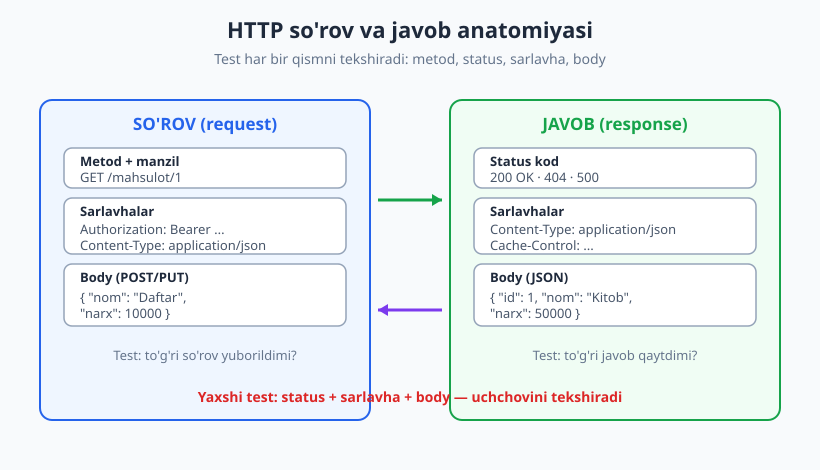
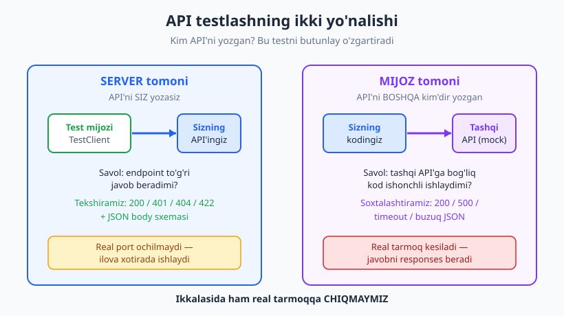
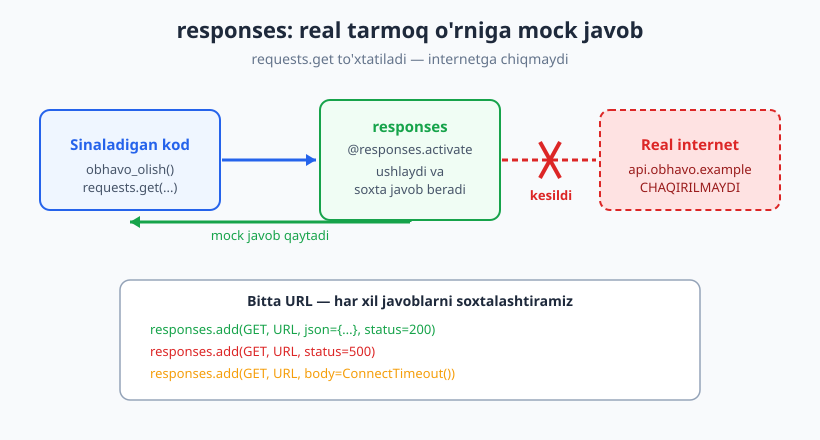

# 17 — API va HTTP testlash

[🏠 README](./README.md) · [⬅️ Oldingi: 16 — Ma'lumotlar bazasini testlash](./16-malumotlar-bazasi-testlash.md) · [Keyingi: 18 — Kontrakt testlar ➡️](./18-kontrakt-testlar.md)

---

> **Bu bobda:** zamonaviy dasturlar bir-biri bilan **HTTP API** orqali gaplashadi. Bu bobda ikki tomondan testlaymiz: (a) **server tomoni** — o'z API'ingiz to'g'ri status, body va sarlavha qaytaradimi (test mijozi orqali); (b) **mijoz tomoni** — tashqi API'ga bog'liq kod xato, timeout va buzuq javobni qanday yengadi (tarmoqni **soxtalashtirib**). HTTP asoslarini (status kod, metod, sarlavha, JSON body), JSON sxema validatsiyasini, autentifikatsiya holatlarini (401/403) va qayta urinishni (retry) ko'ramiz.
>
> **Halollik / Eslatma:** API integratsiya testi sekin va mo'rt bo'lishi mumkin — shuning uchun real tarmoqni testda **chaqirmaymiz**, javobni `responses` bilan soxtalashtiramiz. Bu yondashuvning kuchli va zaif tomonlarini ([18-bobdagi](./18-kontrakt-testlar.md) kontrakt testlar ko'pincha yaxshiroq) ochiq aytamiz. Server misoli FastAPI'da jonli ishlatildi; agar sizda framework boshqacha bo'lsa, g'oya bir xil. Barcha Python namunalari haqiqatan ishga tushirib tekshirilgan (Python 3.14, `pytest` 9.0.3, `requests` 2.34, `responses` 0.26, `fastapi` 0.136).

---

## API testlash nima va u nima emas

Restoranni tasavvur qiling. Oshxona (server) taom tayyorlaydi; ofitsiant (API) buyurtmani qabul qiladi va taomni keltiradi; mijoz (sizning kodingiz yoki boshqa servis) ofitsiantga buyurtma beradi. **API testlash** — bu ofitsiantni tekshirish: "to'g'ri buyurtmaga to'g'ri taom keladimi? Noto'g'ri buyurtmaga aniq xato javobi beriladimi?" Siz oshxonaning ichiga kirmaysiz (bu — unit test); ovqatni yeb ko'rmaysiz (bu — E2E). Siz **shartnoma** (interfeys) bo'yicha so'rov yuborib, javobni tekshirasiz.

HTTP API'da har bir o'zaro aloqa — bu **so'rov** (request) va **javob** (response) juftligi. Testda biz ana shu juftlikning ikkala tomonini tekshiramiz:



| Element | Misol | Testda nimani tekshiramiz |
|---|---|---|
| **Metod** | `GET`, `POST`, `PUT`, `DELETE` | To'g'ri metodga to'g'ri amal bajariladimi |
| **Status kod** | `200`, `201`, `400`, `401`, `404`, `500` | Muvaffaqiyat (2xx), mijoz xatosi (4xx), server xatosi (5xx) |
| **Sarlavhalar** | `Content-Type: application/json` | Javob turi, autentifikatsiya, kesh sarlavhalari |
| **Body** | `{"id": 1, "nom": "Kitob"}` | JSON strukturasi, kalitlar, qiymatlar, turlar |

> **Asosiy g'oya:** API testi — bu **status + sarlavha + body** uchligini tekshirish. Faqat "200 keldimi?" emas, balki "to'g'ri body keldimi?" va "xato holatda to'g'ri xato keldimi?" — uchchovini ham.

---

## Ikki nuqtai nazar: server tomoni va mijoz tomoni

API bilan ishlaganda siz har doim **ikki rol**dan birida bo'lasiz. Qaysi rolda ekaningiz testni butunlay o'zgartiradi.



| | **Server tomoni** | **Mijoz tomoni** |
|---|---|---|
| **Kim** | API'ni siz yozasiz | API'ni boshqa kim'dir yozgan |
| **Savol** | Endpoint'im to'g'ri javob beradimi? | Tashqi API'ga bog'liq kodim ishonchli ishlaydimi? |
| **Texnika** | **Test mijozi** (test client) orqali so'rov yuborish | Tashqi javobni **soxtalashtirish** (`responses`) |
| **Real tarmoq** | Yo'q — ilova xotirada ishlaydi | Yo'q — javob mock qilinadi |

Ikkalasida ham **real tarmoqqa chiqmaymiz**. Server tomonida ilova jarayon ichida, port ochmasdan ishlaydi; mijoz tomonida esa tashqi serverning javobini biz to'qib beramiz. Avval server tomonini ko'ramiz.

---

## Server tomoni: o'z API'ingni test mijozi bilan testlash

Web framework'lar (FastAPI, Flask, Django, Express, Laravel...) **test mijozi** beradi: bu — haqiqiy HTTP server ishga tushirmasdan, ilovaga to'g'ridan-to'g'ri so'rov yuboradigan obyekt. Tezligi unit testga yaqin, lekin butun so'rov-javob yo'lini (routing, validatsiya, serializatsiya) tekshiradi.

Mana kichik FastAPI ilovasi — sinaladigan kod:

```python
from fastapi import FastAPI, HTTPException, Header
from pydantic import BaseModel

ilova = FastAPI()
_BAZA = {1: {"id": 1, "nom": "Kitob", "narx": 50000}}
TOKEN = "maxfiy-token"

class MahsulotKirish(BaseModel):
    nom: str
    narx: int

@ilova.get("/mahsulot/{id}")
def mahsulot_olish(id: int):
    if id not in _BAZA:
        raise HTTPException(status_code=404, detail="topilmadi")
    return _BAZA[id]

@ilova.post("/mahsulot", status_code=201)
def mahsulot_yarat(m: MahsulotKirish, authorization: str = Header(default="")):
    if authorization != f"Bearer {TOKEN}":
        raise HTTPException(status_code=401, detail="ruxsat yo'q")
    if m.narx <= 0:
        raise HTTPException(status_code=422, detail="narx musbat bo'lsin")
    return {"id": 2, "nom": m.nom, "narx": m.narx}
```

Endi `TestClient` bilan testlaymiz. `TestClient(ilova)` — bu mana shu "test mijozi": `mijoz.get(...)` chaqiruvi tarmoqqa chiqmaydi, to'g'ridan-to'g'ri `ilova`ga boradi.

```python
from fastapi.testclient import TestClient
mijoz = TestClient(ilova)

def test_get_200_va_body():
    # Arrange + Act
    javob = mijoz.get("/mahsulot/1")
    # Assert: status, body va sarlavhani BIRGA tekshiramiz
    assert javob.status_code == 200
    assert javob.json() == {"id": 1, "nom": "Kitob", "narx": 50000}
    assert javob.headers["content-type"] == "application/json"
    # -> PASS

def test_get_404():
    javob = mijoz.get("/mahsulot/999")
    assert javob.status_code == 404
    assert javob.json()["detail"] == "topilmadi"
    # -> PASS
```

Diqqat qiling: yaxshi API testi **faqat status kodni emas**, balki body'ni ham tekshiradi. `200` keldi-yu, lekin body bo'sh yoki noto'g'ri bo'lsa, API hali ham buzuq.

### Autentifikatsiya va validatsiya holatlari

API testining eng qimmatli qismi — **xato yo'llari**. "Baxtli yo'l" (200) ko'pincha o'zi ishlaydi; haqiqiy xatolar 401, 403, 422 da yashiringan. Har bir holatni alohida test qiling:

```python
def test_post_401_tokensiz():
    # Tokensiz so'rov -> ruxsat yo'q
    javob = mijoz.post("/mahsulot", json={"nom": "Daftar", "narx": 10000})
    assert javob.status_code == 401
    # -> PASS

def test_post_201_token_bilan():
    javob = mijoz.post(
        "/mahsulot",
        json={"nom": "Daftar", "narx": 10000},
        headers={"Authorization": f"Bearer {TOKEN}"},
    )
    assert javob.status_code == 201
    assert javob.json()["nom"] == "Daftar"
    # -> PASS

def test_post_422_validatsiya():
    # Manfiy narx -> validatsiya xatosi
    javob = mijoz.post(
        "/mahsulot", json={"nom": "Yomon", "narx": -5},
        headers={"Authorization": f"Bearer {TOKEN}"},
    )
    assert javob.status_code == 422
    # -> PASS
```

> **Eslatma — status kodlar ma'nosi.** `401 Unauthorized` = "kim ekaningni bilmayman" (login yo'q yoki noto'g'ri). `403 Forbidden` = "kim ekaningni bilaman, lekin bunga ruxsating yo'q". `400`/`422` = "so'roving noto'g'ri shaklda". Bu farqlarni testda aniq tekshiring — ular API kontraktining bir qismi.

> **Til-mustaqil:** bu g'oya har framework'da bir xil. Flask'da `app.test_client()`, Django'da `Client()` yoki DRF `APIClient()`, Express+Node'da `supertest`, Laravel'da `$this->getJson(...)`, Spring'da `MockMvc`. Hammasi bitta ishni qiladi: **real port ochmasdan ilovaga so'rov yuborish**.

> **Eslatma — framework bo'lmasa ham g'oya bir xil.** Har qanday web framework ostida oddiy mantiq yotadi: "so'rov kirdi → (status, body) chiqdi". Buni sof funksiya sifatida ham testlash mumkin (`handle(method, path, body, headers) -> (status, body)`). Framework — faqat HTTP'ni shu funksiyaga ulaydigan qatlam. Shuning uchun `TestClient` bo'lmasa ham, **server mantig'ini funksiya darajasida** testlay olasiz.

---

## Mijoz tomoni: tashqi API'ga bog'liq kodni testlash

Endi rolni almashtiramiz. Kodimiz **boshqa kimningdir** API'siga bog'liq — masalan ob-havo servisi. [09-bobda](./09-bogliqliklarni-izolyatsiya.md) aytganimizdek, tarmoq — eng katta yashirin kirish: sekin, ishonchsiz, sizning nazoratingizdan tashqarida. Uni testda **chaqirmaslik** kerak.

Sinaladigan kod tashqi API'dan harorat oladi:

```python
import requests

def obhavo_olish(shahar, base_url="https://api.obhavo.example"):
    javob = requests.get(f"{base_url}/v1/hozir", params={"shahar": shahar}, timeout=5)
    javob.raise_for_status()          # 4xx/5xx -> HTTPError
    data = javob.json()
    return {"shahar": data["shahar"], "harorat": data["harorat_c"]}
```

Bu kodni testlashda muammo aniq: `requests.get` haqiqiy serverga so'rov yuboradi. Server o'chgan bo'lsa, internet yo'q bo'lsa, yoki javob har kuni o'zgarsa — testimiz **flaky** bo'ladi. Yechim: `responses` kutubxonasi `requests`ning tarmoq qatlamini ushlaydi va biz aytgan javobni qaytaradi.

```text
pip install responses
```



### Muvaffaqiyatli javob (200)

```python
import responses
from app_kod import obhavo_olish

URL = "https://api.obhavo.example/v1/hozir"

@responses.activate                       # bu test davomida tarmoqni ushla
def test_muvaffaqiyat_200():
    # Arrange: qanday javob qaytishini BIZ aytamiz
    responses.add(responses.GET, URL,
                  json={"shahar": "Toshkent", "harorat_c": 21}, status=200)
    # Act
    natija = obhavo_olish("Toshkent")
    # Assert: kod javobni to'g'ri o'qidimi?
    assert natija == {"shahar": "Toshkent", "harorat": 21}
    # Real tarmoq CHAQIRILMADI — responses ushlab oldi:
    assert len(responses.calls) == 1
    assert responses.calls[0].request.params["shahar"] == "Toshkent"
    # -> PASS
```

`@responses.activate` dekoratori — sehrning kaliti: u faqat shu test davomida amal qiladi va `requests`ning haqiqiy tarmoqqa chiqishini **bloklaydi**. Agar siz ro'yxatga olmagan URL'ga so'rov ketsa, `responses` testni darrov yiqitadi ("Connection refused" o'rniga aniq xato) — bu yaxshi, chunki "test tasodifan internetga chiqib ketgan" holatini darrov tutadi.

Yana bir nozik nuqta: biz nafaqat **javob**ni, balki kod **qanday so'rov yuborganini** ham tekshira olamiz (`responses.calls[0].request.params`). Bu — "kod to'g'ri shaharni so'radimi?" degan savol.

### Xato javoblar: 500, timeout, buzuq JSON

Endi eng muhim qism — **xato holatlari**. Real tarmoqda kod 500 xatosiga, timeout'ga va buzuq JSON'ga duch keladi. Buni jonli serverda yuzaga keltirish qiyin (qanday qilib serverni "ataylab" o'chirasiz?), lekin `responses` bilan bir qatorda yasaladi:

```python
import pytest, requests

@responses.activate
def test_server_xatosi_500():
    responses.add(responses.GET, URL, status=500)   # server "qulagan"
    with pytest.raises(requests.HTTPError):
        obhavo_olish("Toshkent")
    # -> PASS

@responses.activate
def test_timeout():
    # body sifatida exception berilsa, responses uni "otadi"
    responses.add(responses.GET, URL, body=requests.exceptions.ConnectTimeout())
    with pytest.raises(requests.exceptions.ConnectTimeout):
        obhavo_olish("Toshkent")
    # -> PASS
```

Buzuq JSON — alohida e'tibor talab qiladi. Server `200` qaytarishi mumkin, lekin body JSON emas (masalan HTML xato sahifasi). Ko'p kod buni unutadi va `.json()` kutilmaganda yiqiladi. Mana "xavfsiz" versiya va uning testi:

```python
def obhavo_xavfsiz(shahar, base_url="https://api.obhavo.example"):
    try:
        return obhavo_olish(shahar, base_url=base_url)
    except (requests.RequestException, KeyError, ValueError):
        return None

@responses.activate
def test_notogri_json():
    responses.add(responses.GET, URL, body="<html>xato sahifa</html>",
                  status=200, content_type="text/html")
    # .json() ValueError beradi -> xavfsiz versiya None qaytaradi
    assert obhavo_xavfsiz("Toshkent") is None
    # -> PASS
```

> **Asosiy g'oya:** mijoz tomoni testining qiymati — **xato yo'llarini** tekshirishda. Baxtli yo'l (200) bir test; lekin 500, timeout va buzuq body — har biri alohida test. Aynan bular ishlab chiqarishda "tushib qoladi", chunki ularni qo'lda sinash deyarli imkonsiz.

---

## Retry (qayta urinish): side_effect bilan ko'prik

Vaqtinchalik 5xx xatosida kod ko'pincha **qayta urinadi** (retry). Buni testlash uchun kerak: birinchi urinish yiqilsin, ikkinchisi muvaffaqiyatli bo'lsin. `responses` shu uchun navbat (queue) tutadi — bir xil URL'ga bir nechta javob qo'shsangiz, ular **navbat bilan** beriladi. Bu — [08-bobdagi](./08-test-dublyorlari-amaliyot.md) `side_effect` g'oyasining HTTP varianti.

```python
def obhavo_retry(shahar, base_url="https://api.obhavo.example", urinishlar=3):
    oxirgi_xato = None
    for _ in range(urinishlar):
        try:
            return obhavo_olish(shahar, base_url=base_url)
        except requests.HTTPError as e:
            oxirgi_xato = e
            if e.response is not None and e.response.status_code < 500:
                raise          # 4xx -> mijoz xatosi, qayta urinmaymiz
    raise oxirgi_xato

@responses.activate
def test_retry_500_keyin_200():
    responses.add(responses.GET, URL, status=500)                         # 1-urinish: yiqildi
    responses.add(responses.GET, URL,
                  json={"shahar": "Buxoro", "harorat_c": 30}, status=200) # 2-urinish: muvaffaqiyat
    natija = obhavo_retry("Buxoro", urinishlar=3)
    assert natija == {"shahar": "Buxoro", "harorat": 30}
    assert len(responses.calls) == 2            # 1 yiqildi, 1 muvaffaqiyat
    # -> PASS

@responses.activate
def test_retry_404_da_darrov_yiqiladi():
    responses.add(responses.GET, URL, status=404)
    with pytest.raises(requests.HTTPError):
        obhavo_retry("Yoq", urinishlar=3)
    assert len(responses.calls) == 1            # 4xx -> qayta urinmadi
    # -> PASS
```

Ikkinchi test nozik, lekin muhim: retry **hamma narsada emas, faqat vaqtinchalik xatoda** (5xx) bo'lishi kerak. 404'da qayta urinish — befoyda va serverni bezovta qiladi. Test buni qotirib qo'yadi: 404 da `responses.calls` faqat **1** marta.

> **Diqqat — sekin retry'ni testda muzlating.** Real retry kodi urinishlar orasida `time.sleep(...)` qiladi (exponential backoff). Testda bu sekinlikka olib keladi. Yechim — [09-bobdagi](./09-bogliqliklarni-izolyatsiya.md) usul: `sleep`ni inject qiling yoki `monkeypatch.setattr("time.sleep", lambda s: None)` bilan "bo'sh" qiling. Test mantiqni tekshirsin, soatni emas.

---

## JSON sxema validatsiyasi: javob shakli to'g'rimi?

API javobi — kontrakt. "Harorat keldi" yetarli emas; **kalitlar bormi, turlari to'g'rimi?** Buni tekshirish — sxema validatsiyasi. Sodda holatda kutubxonasiz qila olasiz:

```python
def sxemani_tekshir(data):
    kutilgan = {"shahar": str, "harorat_c": (int, float)}
    for kalit, tur in kutilgan.items():
        if kalit not in data:
            raise AssertionError(f"'{kalit}' kaliti yo'q")
        if not isinstance(data[kalit], tur):
            raise AssertionError(f"'{kalit}' turi noto'g'ri: {type(data[kalit]).__name__}")
    return True

@responses.activate
def test_javob_sxemaga_mos():
    responses.add(responses.GET, URL,
                  json={"shahar": "Toshkent", "harorat_c": 21}, status=200)
    data = requests.get(URL).json()
    assert sxemani_tekshir(data) is True
    # -> PASS

@responses.activate
def test_javob_sxemaga_mos_emas_kalit_yoq():
    responses.add(responses.GET, URL, json={"shahar": "Toshkent"}, status=200)
    data = requests.get(URL).json()
    with pytest.raises(AssertionError, match="harorat_c"):
        sxemani_tekshir(data)
    # -> PASS
```

Jiddiy loyihada qo'lda emas, tayyor vositadan foydalaning: Python'da `jsonschema` (JSON Schema standartiga ko'ra) yoki `pydantic` modeli (`Mahsulot(**data)` chaqiruvi mos kelmasa `ValidationError` beradi). G'oya bir xil: **javobning shaklini** ham, qiymatini ham tekshiring.

> **Trade-off:** qattiq sxema (har kalitni aniq tekshirish) — API biroz o'zgarganda testni darrov yiqitadi. Bu goh foydali (regressiyani tutadi), goh mo'rt (qo'shimcha kalit qo'shilsa ham yiqiladi). Muvozanat: **siz ishlatadigan** kalitlarni qattiq tekshiring, qolganini e'tiborsiz qoldiring. Kontrakt o'zgarishini kuzatishning yaxshiroq yo'li — [18-bobdagi](./18-kontrakt-testlar.md) kontrakt testlar.

---

## Halol gap: bu testlar nimani **kafolatlamaydi**

Mock'langan mijoz testi tez va barqaror — lekin bitta jiddiy kamchiligi bor: u siz **taxmin qilgan** javobni tekshiradi, real serverning **haqiqiy** javobini emas. Agar tashqi API o'z formatini o'zgartirsa (`harorat_c` → `temp`), sizning mock'ingiz hali ham eski formatni qaytaradi, test yashil bo'ladi — lekin ishlab chiqarishda kod yiqiladi. Bu — "mock haqiqatdan ajralib qoldi" muammosi.

| Yondashuv | Tez? | Barqaror? | Real kontraktni tekshiradi? |
|---|---|---|---|
| Mock (`responses`) | ✅ Juda | ✅ Ha | ❌ Yo'q |
| Real API integratsiya testi | ❌ Sekin | ❌ Mo'rt (tarmoq) | ✅ Ha |
| **Kontrakt test** ([18-bob](./18-kontrakt-testlar.md)) | ✅ Tez | ✅ Ha | ✅ Ha (kelishilgan kontrakt) |

Shu sababli ko'p jamoa **kontrakt testlar**ga o'tadi: ikki tomon (consumer va provider) umumiy kontraktga rozi bo'ladi, har biri shu kontraktga qarshi mustaqil testlanadi. Mock haqiqatdan ajralib qolmaydi, chunki kontrakt — yagona manba. Buni keyingi bobda chuqur ko'ramiz.

> **Ekotizimga qisqa ishora.** API testlash uchun ko'p vosita bor: **Postman**/**Newman** (qo'lda va avtomat so'rovlar), **REST Assured** (Java), **Schemathesis** (OpenAPI/Swagger sxemasidan avtomat test generatsiyasi — [21-bobdagi](./21-property-based-testing.md) property-based g'oyasiga yaqin), **Pact** (kontrakt). Python'da `requests`+`responses` yoki `httpx`+`respx` eng keng tarqalgan. Asosiy g'oya hammasida bir xil — bu bobda o'rgangan narsa har qaysisiga ko'chadi.

---

## Asosiy g'oyalar (bobni qisqacha)

- **API testi = status + sarlavha + body** uchligini tekshirish. Faqat "200 keldimi?" emas — body to'g'rimi va xato holatda to'g'ri xato keladimi?
- **Ikki nuqtai nazar.** Server tomoni: o'z API'ingizni **test mijozi** bilan tekshirasiz. Mijoz tomoni: tashqi API'ga bog'liq kodni javobni **soxtalashtirib** tekshirasiz.
- **Test mijozi (TestClient)** real port ochmasdan ilovaga so'rov yuboradi — unit tezligida, butun so'rov-javob yo'lini qamrab. Har framework'da bor (Flask, Django, Express, Laravel...).
- **Xato yo'llari — eng qimmatli testlar.** 401/403/422 (server), 500/timeout/buzuq-JSON (mijoz) — bularni qo'lda sinash deyarli imkonsiz, mock bilan bir qator.
- **Real tarmoqni testda chaqirmang.** `responses` (yoki `respx`) `requests`ni ushlaydi, ro'yxatdan tashqari URL'ni bloklaydi — "test internetga chiqib ketdi" holatini darrov tutadi.
- **Retry** — bir URL'ga bir nechta javob navbat bilan (`side_effect` HTTP varianti); faqat 5xx'da urinsin, 4xx'da darrov to'xtasin. Testda `sleep`ni muzlating.
- **JSON sxema** — javobning shaklini (kalitlar + turlar) tekshiring, faqat qiymatni emas. Siz ishlatadigan kalitlarni qattiq, qolganini yumshoq.
- **Mockning chegarasi:** u siz taxmin qilgan javobni tekshiradi, real kontraktni emas. API formati o'zgarsa, mock yashil qoladi-yu, ishlab chiqarish yiqiladi. Yechim — [kontrakt testlar](./18-kontrakt-testlar.md).

---

## Mashqlar

### Oson

**1-mashq.** `obhavo_olish` uchun test yozing: server `200` va `{"shahar": "Samarqand", "harorat_c": 28}` qaytarsin. Natija `{"shahar": "Samarqand", "harorat": 28}` ekanini tekshiring.

**2-mashq.** Server tomoni: `mahsulot_olish` endpoint'i mavjud bo'lmagan `id` uchun `404` va `{"detail": "topilmadi"}` qaytarishini tekshiruvchi test yozing.

**3-mashq.** `obhavo_olish` server `503` qaytarganda `requests.HTTPError` ko'tarishini `pytest.raises` bilan tekshiring (`responses` ishlatib).

### O'rta

**4-mashq.** `responses.calls` orqali kod **qanday so'rov** yuborganini tekshiring: `obhavo_olish("Xiva")` chaqirilganda yuborilgan so'rovning `params["shahar"]` qiymati `"Xiva"` ekanini tasdiqlang.

**5-mashq.** `sxemani_tekshir` funksiyasiga `harorat_c` o'rniga `"issiq"` (string) qaytaruvchi javob bering. Test `AssertionError`ni `match="turi noto'g'ri"` bilan kutsin.

**6-mashq.** Server tomoni: `mahsulot_yarat` endpoint'iga **noto'g'ri token** (`Bearer xato`) bilan so'rov yuboring va `401` kelishini tekshiring. Keyin to'g'ri token bilan `201` kelishini ham tekshiring (ikki test).

### Qiyin

**7-mashq.** `obhavo_retry` uchun test yozing: server **ikki marta** `500`, keyin `200` qaytarsin (`urinishlar=3`). Natija to'g'ri kelishini va `responses.calls` aynan **3** ekanini tasdiqlang. So'ng `urinishlar=2` bilan (ikkala urinish ham 500) `HTTPError` kelishini tekshiring.

**8-mashq.** Yangi `foydalanuvchi_olish(id)` funksiyasi yozing: u `GET /users/{id}` so'raydi va `{"id": ..., "ism": ...}` qaytaradi. Uch holatni testlang: (a) `200` muvaffaqiyat; (b) `404` da `LookupError` ko'tarsin; (c) body JSON emas (`"buzuq"`) bo'lganda `ValueError` ko'tarsin. Sxema tekshiruvini ham qo'shing.

<details markdown="1">
<summary>Yechimlar</summary>

### 1-mashq yechimi

```python
import responses
from app_kod import obhavo_olish
URL = "https://api.obhavo.example/v1/hozir"

@responses.activate
def test_samarqand():
    responses.add(responses.GET, URL,
                  json={"shahar": "Samarqand", "harorat_c": 28}, status=200)
    assert obhavo_olish("Samarqand") == {"shahar": "Samarqand", "harorat": 28}
    # -> PASS
```

### 2-mashq yechimi

```python
from fastapi.testclient import TestClient
mijoz = TestClient(ilova)

def test_404_detail():
    javob = mijoz.get("/mahsulot/12345")
    assert javob.status_code == 404
    assert javob.json() == {"detail": "topilmadi"}
    # -> PASS
```

### 3-mashq yechimi

```python
import pytest, requests, responses

@responses.activate
def test_503_xato():
    responses.add(responses.GET, URL, status=503)
    with pytest.raises(requests.HTTPError):
        obhavo_olish("Toshkent")
    # -> PASS
```
`503` ham 5xx, shuning uchun `raise_for_status()` `HTTPError` beradi.

### 4-mashq yechimi

```python
@responses.activate
def test_sorov_parametri():
    responses.add(responses.GET, URL,
                  json={"shahar": "Xiva", "harorat_c": 35}, status=200)
    obhavo_olish("Xiva")
    assert responses.calls[0].request.params["shahar"] == "Xiva"
    # -> PASS
```
Bu — "kod to'g'ri narsa **so'radimi**" testi (javobni emas, so'rovni tekshiramiz).

### 5-mashq yechimi

```python
import pytest
def test_tur_xato():
    data = {"shahar": "Toshkent", "harorat_c": "issiq"}
    with pytest.raises(AssertionError, match="turi noto'g'ri"):
        sxemani_tekshir(data)
    # -> PASS
```

### 6-mashq yechimi

```python
def test_noto_gri_token_401():
    javob = mijoz.post("/mahsulot", json={"nom": "X", "narx": 100},
                       headers={"Authorization": "Bearer xato"})
    assert javob.status_code == 401
    # -> PASS

def test_to_gri_token_201():
    javob = mijoz.post("/mahsulot", json={"nom": "X", "narx": 100},
                       headers={"Authorization": f"Bearer {TOKEN}"})
    assert javob.status_code == 201
    # -> PASS
```

### 7-mashq yechimi

```python
@responses.activate
def test_ikki_500_keyin_200():
    responses.add(responses.GET, URL, status=500)
    responses.add(responses.GET, URL, status=500)
    responses.add(responses.GET, URL,
                  json={"shahar": "Nukus", "harorat_c": 33}, status=200)
    natija = obhavo_retry("Nukus", urinishlar=3)
    assert natija["harorat"] == 33
    assert len(responses.calls) == 3
    # -> PASS

@responses.activate
def test_urinishlar_tugadi():
    responses.add(responses.GET, URL, status=500)
    responses.add(responses.GET, URL, status=500)
    with pytest.raises(requests.HTTPError):
        obhavo_retry("Nukus", urinishlar=2)
    assert len(responses.calls) == 2
    # -> PASS
```

### 8-mashq yechimi

```python
import requests, responses, pytest
BASE = "https://api.example/users"

def foydalanuvchi_olish(id, base=BASE):
    javob = requests.get(f"{base}/{id}", timeout=5)
    if javob.status_code == 404:
        raise LookupError(f"foydalanuvchi {id} topilmadi")
    javob.raise_for_status()
    data = javob.json()                       # JSON emas -> ValueError
    assert "id" in data and "ism" in data     # sodda sxema
    return {"id": data["id"], "ism": data["ism"]}

@responses.activate
def test_200():
    responses.add(responses.GET, f"{BASE}/7",
                  json={"id": 7, "ism": "Ali"}, status=200)
    assert foydalanuvchi_olish(7) == {"id": 7, "ism": "Ali"}
    # -> PASS

@responses.activate
def test_404_lookup():
    responses.add(responses.GET, f"{BASE}/99", status=404)
    with pytest.raises(LookupError):
        foydalanuvchi_olish(99)
    # -> PASS

@responses.activate
def test_buzuq_json():
    responses.add(responses.GET, f"{BASE}/3", body="buzuq",
                  status=200, content_type="text/plain")
    with pytest.raises(ValueError):
        foydalanuvchi_olish(3)
    # -> PASS
```

</details>

---

[🏠 README](./README.md) · [⬅️ Oldingi: 16 — Ma'lumotlar bazasini testlash](./16-malumotlar-bazasi-testlash.md) · [Keyingi: 18 — Kontrakt testlar ➡️](./18-kontrakt-testlar.md)
