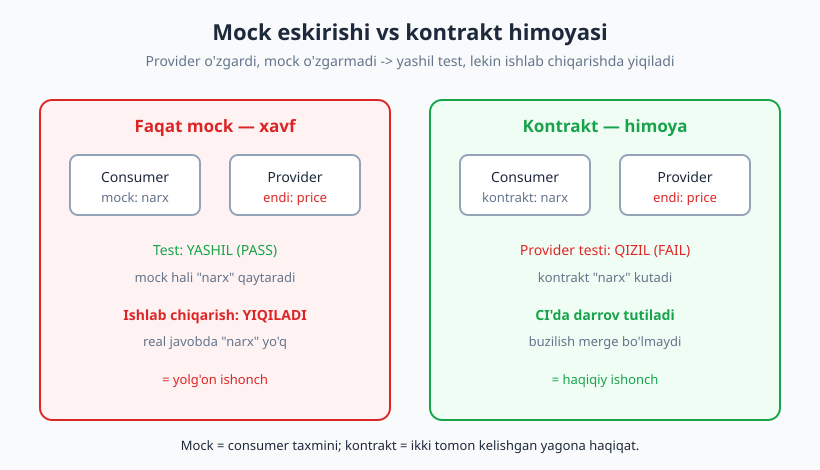
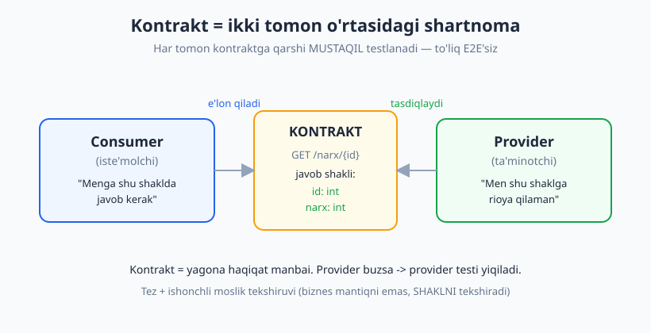
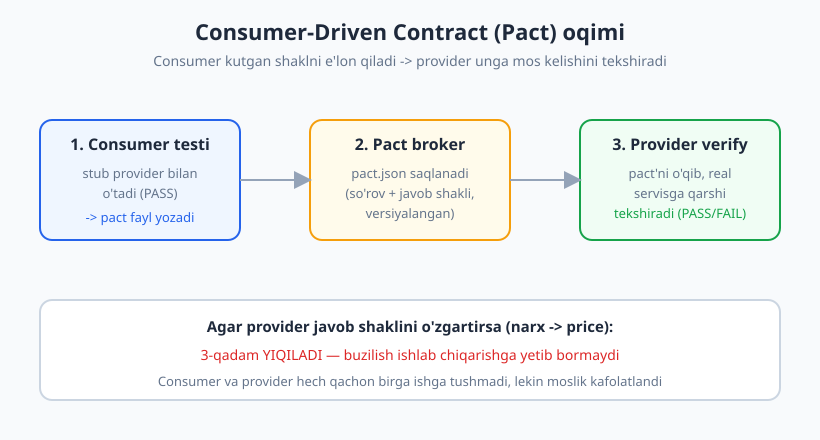

# 18 — Kontrakt testlar

[🏠 README](./README.md) · [⬅️ Oldingi: 17 — API va HTTP testlash](./17-api-http-testlash.md) · [Keyingi: 19 — End-to-end va UI testlar ➡️](./19-e2e-ui-testlar.md)

---

> **Bu bobda:** ikki servis (yoki mijoz va API) bir-biriga bog'liq bo'lganda, ularning **mosligini** qanday tekshiramiz? To'liq E2E integratsiya sekin va mo'rt; mock'lar esa haqiqatdan **ajralib qoladi** ([17-bobning](./17-api-http-testlash.md) oxirgi muammosi). Yechim — **kontrakt testlar**: ikki tomon umumiy "shartnoma"ga (so'rov + javob shakli) rozi bo'ladi, har biri shu kontraktga qarshi **mustaqil** testlanadi. Consumer-Driven Contract (CDC), Pact ish oqimi, sxema-asosli kontrakt va qachon kontrakt testlar arziydi — hammasini ko'ramiz.
>
> **Halollik / Eslatma:** **Pact** — eng mashhur kontrakt vositasi, lekin uning Python kutubxonasi bu yerda **ishlatilmaydi**. Buning o'rniga g'oyani **sof Python** bilan jonli modellashtiramiz: kontraktni `dict`/JSON sifatida ifodalab, consumer va provider tomonlarini alohida tekshiramiz va kontrakt buzilganda test **haqiqatan yiqilishini** ko'rsatamiz. Bu real Pact'dan soddaroq, lekin **aynan o'sha tushuncha**. Kontrakt testlar infratuzilma (broker, versiyalash) talab qiladi — kichik monolit uchun ortiqcha, mikroservislar uchun qimmatli; buni ochiq aytamiz. Barcha Python namunalari haqiqatan ishga tushirib tekshirilgan (Python 3.14, `pytest` 9.0.3).

---

## Integratsiya nuqtasi muammosi

Tasavvur qiling: ikki jamoa ikki servis yozadi. **Savat servisi** (consumer) mahsulot narxini olish uchun **narx servisi**ga (provider) so'rov yuboradi. Bu — **integratsiya nuqtasi**: ikki kod bir-biriga shu yerda "ulanadi".

[17-bobda](./17-api-http-testlash.md) ko'rgan ikki yo'lning ikkalasi ham bu yerda kamchilikka uchraydi:

- **To'liq E2E integratsiya testi** (ikkala servisni birga ishga tushirib tekshirish): real moslikni ko'rsatadi, lekin **sekin** (ikki servis, baza, tarmoq), **mo'rt** (biri ishlamasa hammasi yiqiladi) va sozlash qiyin.
- **Mock** (consumer narx servisini soxtalashtiradi): tez va barqaror, lekin **haqiqatdan ajralib qoladi**. Provider o'z javobini o'zgartirsa (`narx` → `price`), consumer'ning mock'i hali ham eski formatni qaytaradi. Test yashil, lekin ishlab chiqarishda kod yiqiladi — bu **yolg'on ishonch**.



> **Asosiy muammo:** mock — bu consumer'ning **taxmini**, provider bilan **kelishuv emas**. Hech kim provider haqiqatan shu shaklda javob berishini tekshirmaydi. Ikki tomon bir-biridan "uzilib" o'zgaradi.

Kontrakt testi shu uzilishni yopadi: mock o'rniga **ikki tomon ham rozi bo'lgan kontrakt** turadi, va provider haqiqatan unga rioya qilishini **alohida** test tekshiradi.

---

## Kontrakt testi nima

**Kontrakt** (contract) — bu consumer va provider o'rtasidagi rasmiy shartnoma: "so'rov **shu** shaklda kelsa, javob **shu** shaklda qaytadi". U konkret qiymatlarni emas, balki **shaklni** belgilaydi (qaysi kalitlar, qaysi turlar, qaysi status).

**Kontrakt testi** — bu shartnomaning ikki tomonini **alohida-alohida** tekshirish, ikkalasini birga ishga tushirmasdan:

| Tomon | Savol | Test nimani qiladi |
|---|---|---|
| **Consumer** | Men kontraktga ko'ra to'g'ri ishlayapmanmi? | Kontraktga mos **stub** bilan consumer kodi to'g'ri ishlashini tekshiradi |
| **Provider** | Men kontraktga rioya qilyapmanmi? | Real provider javobi kontrakt **shakliga** mos kelishini tekshiradi |



Sehr shunda: **ikki servis hech qachon birga ishga tushmaydi**, lekin moslik kafolatlanadi — chunki ikkala test ham **bir xil kontraktga** tayanadi. Kontrakt — **yagona haqiqat manbai**.

> **Eslatma:** kontrakt testi **moslikni** tekshiradi, **biznes mantiqni emas**. "Narx to'g'ri hisoblandimi?" — bu unit test. "Javobda `narx` kaliti `int` turida bormi?" — bu kontrakt testi. Ular bir-birini to'ldiradi.

---

## Consumer-Driven Contract (CDC)

Kontraktni kim yozadi? Eng kuchli yondashuv — **Consumer-Driven Contract** (iste'molchi yetaklagan kontrakt): **consumer** o'zi kutgan shaklni e'lon qiladi, provider esa shunga mos kelishini tasdiqlaydi.

Nega aynan consumer yetaklaydi? Chunki muhim narsa — provider **nima qaytara oladi** emas, balki consumer **nimadan foydalanadi**. Agar provider 20 ta maydon qaytarsa-yu, consumer faqat 2 tasini ishlatsa, kontrakt o'sha 2 tani himoya qilishi kerak. Bu provider'ga erkinlik beradi: u ishlatilmaydigan maydonni bemalol o'zgartiradi, **consumer ishlatadiganini** esa buzolmaydi (test darrov tutadi).

> **Trade-off:** CDC consumer'larni provider'ga "bog'laydi" — har consumer o'z kontraktini qo'shadi, provider hammasiga rioya qilishi kerak. Ko'p consumer bo'lsa, bu yuk. Lekin ayni shu — qiymat: provider endi "qaysi consumer nimani ishlatadi"ni **biladi** va hech kimni bilmagan holda buzmaydi.

---

## Jonli model: kontraktni Python bilan ifodalash

Endi g'oyani sof Python bilan **ishlab** ko'ramiz. Pact kutubxonasiz, lekin aynan o'sha tushuncha. Boshlaymiz — kontraktni `dict` sifatida e'lon qilamiz (real Pact'da bu JSON fayl). Bu **umumiy** fayl: ikki tomon ham shunga tayanadi.

```python
# kontrakt.py  —  yagona haqiqat manbai (ikki tomon ham import qiladi)
# GET /narx/{id}  ->  {"id": int, "narx": int}
NARX_KONTRAKTI = {
    "sorov": {"metod": "GET", "yol": "/narx/{id}"},
    "javob": {
        "status": 200,
        "shakl": {"id": int, "narx": int},   # kalit -> kutilgan tur
    },
}

def javob_kontraktga_mos(javob, kontrakt=NARX_KONTRAKTI):
    """Javob (status, body) kontraktning javob shakliga mosmi? (provider tomoni ishlatadi)"""
    kut = kontrakt["javob"]
    if javob["status"] != kut["status"]:
        raise AssertionError(f"status: kutilgan {kut['status']}, keldi {javob['status']}")
    body = javob["body"]
    for kalit, tur in kut["shakl"].items():
        if kalit not in body:
            raise AssertionError(f"'{kalit}' kaliti javobda yo'q")
        if not isinstance(body[kalit], tur):
            raise AssertionError(
                f"'{kalit}' turi noto'g'ri: kutilgan {tur.__name__}, "
                f"keldi {type(body[kalit]).__name__}"
            )
    return True
```

E'tibor bering: `javob_kontraktga_mos` **qiymatni emas, shaklni** tekshiradi — `id` `int` bo'lsin, `narx` `int` bo'lsin. Narx 50000 yoki 12000 ekani muhim emas; **kalit bor va turi to'g'ri** ekani muhim.

### Consumer tomoni

Consumer — narx servisidan narx olib, QQS hisoblaydigan kod. U faqat **kontrakt shakliga** tayanadi (`narx` kaliti). Tarmoq qatlami `transport` orqali injeksiya qilingan ([09-bobdagi](./09-bogliqliklarni-izolyatsiya.md) usul) — testda uni stub bilan almashtiramiz.

```python
# consumer.py
class NarxMijozi:
    def __init__(self, transport):
        self._transport = transport          # transport(id) -> {"status":.., "body":..}

    def narx_qqs_bilan(self, mahsulot_id, qqs=0.12):
        javob = self._transport(mahsulot_id)
        if javob["status"] != 200:
            raise LookupError(f"mahsulot {mahsulot_id} topilmadi")
        narx = javob["body"]["narx"]         # consumer "narx" kalitini kutadi
        return round(narx * (1 + qqs))
```

**Consumer kontrakt testi:** stub provider kontraktga ko'ra javob beradi, consumer kodi to'g'ri ishlashini tekshiramiz.

```python
def stub_transport(mahsulot_id):
    # Stub KONTRAKTga ko'ra javob qaytaradi (real provider emas)
    return {"status": 200, "body": {"id": mahsulot_id, "narx": 50000}}

def test_consumer_kontraktga_tayanib_ishlaydi():
    mijoz = NarxMijozi(stub_transport)
    assert mijoz.narx_qqs_bilan(1, qqs=0.12) == 56000   # 50000 * 1.12
    # -> PASS
```

### Provider tomoni

Provider — real narx servisi. `v1` kontraktga mos javob beradi. Keyin ishlab chiquvchi maydon nomini o'zgartirib `v2` yasaydi (`narx` → `price`) — bu kontraktni **buzadi**.

```python
# provider.py
_BAZA = {1: 50000, 2: 12000}

def narx_servisi_v1(mahsulot_id):
    """v1: kontraktga MOS -> {"id": int, "narx": int}"""
    if mahsulot_id not in _BAZA:
        return {"status": 404, "body": {"xato": "topilmadi"}}
    return {"status": 200, "body": {"id": mahsulot_id, "narx": _BAZA[mahsulot_id]}}

def narx_servisi_v2(mahsulot_id):
    """v2: 'narx' -> 'price' o'zgartirildi. KONTRAKT BUZILDI."""
    if mahsulot_id not in _BAZA:
        return {"status": 404, "body": {"xato": "topilmadi"}}
    return {"status": 200, "body": {"id": mahsulot_id, "price": _BAZA[mahsulot_id]}}
```

**Provider kontrakt testi:** real javob kontrakt shakliga mosmi? `v1` o'tadi, `v2` **yiqiladi** — aynan biz xohlagan narsa.

```python
import pytest
from kontrakt import javob_kontraktga_mos
from provider import narx_servisi_v1, narx_servisi_v2

def test_provider_v1_kontraktga_mos():
    assert javob_kontraktga_mos(narx_servisi_v1(1)) is True
    # -> PASS

def test_provider_v2_kontraktni_buzadi():
    # v2 'narx' o'rniga 'price' qaytaradi -> kontrakt testi JONLI yiqiladi
    with pytest.raises(AssertionError, match="narx"):
        javob_kontraktga_mos(narx_servisi_v2(1))
    # -> PASS  (AssertionError kutilgani uchun test o'zi o'tadi)
```

Bu yerda nozik nuqta bor: `test_provider_v2_kontraktni_buzadi` **o'zi o'tadi** (PASS), chunki u kontrakt buzilishini **kutadi** (`pytest.raises`). Lekin real loyihada kontrakt testi shunchaki `assert javob_kontraktga_mos(...)` bo'ladi — va `v2` joriy etilganda u **qizil** bo'lib, buzilishni CI'da darrov ko'rsatadi. Mana shu — to'g'ridan-to'g'ri ishlatilganda:

```python
def test_provider_real_kontrakt():
    assert javob_kontraktga_mos(narx_servisi_v2(1))   # v2 bilan -> FAIL
```

Buni haqiqatan ishga tushirganda pytest chiqishi:

```text
>       raise AssertionError(f"'{kalit}' kaliti javobda yo'q")
E       AssertionError: 'narx' kaliti javobda yo'q
======================== 1 failed in 0.01s ========================
```

Provider testi buzilishni **provider tomonida**, ishlab chiqarishga yetib bormasdan ushlaydi. Aynan shu — kontrakt testning qiymati.

### Mock eskirishi — jonli isbot

Endi [17-bobning](./17-api-http-testlash.md) muammosini **isbotlaymiz**: consumer'ning stub'i v2 bilan ham yashil qoladi (chunki o'z stub'iga tayanadi), lekin **real** v2 bilan ulansa, consumer yiqilardi.

```python
def test_consumer_stub_eskirsa_ham_yashil():
    # Consumer testi v1/v2 farqini SEZMAYDI — o'z stub'iga tayanadi
    mijoz = NarxMijozi(stub_transport)
    assert mijoz.narx_qqs_bilan(1) == 56000
    # Lekin REAL v2 bilan ulansa, consumer 'narx' kalitini topolmay yiqilardi:
    with pytest.raises(KeyError):
        NarxMijozi(narx_servisi_v2).narx_qqs_bilan(1)
    # -> PASS
```

Mana xulosa: **faqat consumer mock testi** v2 buzilishini **sezmaydi** (yashil qoladi = yolg'on ishonch). Faqat **provider kontrakt testi** uni tutadi. Shuning uchun kontrakt — ikki tomonda ham bir manbaga bog'langan bo'lishi shart.

To'liq to'plamni ishga tushirganda:

```text
....                                                                     [100%]
4 passed in 1.12s
```

---

## Pact ish oqimi (konseptual)

Yuqorida kontraktni `dict` qildik. Real **Pact** vositasida oqim biroz boshqacha, lekin g'oya bir xil — uch qadam:



1. **Consumer testi pact fayl generatsiya qiladi.** Consumer testi stub provider bilan o'tadi va o'tar-o'tmas **pact fayl** (JSON) yozadi — unda har "interaksiya" (so'rov + kutilgan javob shakli) qayd etiladi.
2. **Pact broker pact'ni saqlaydi.** Pact fayl markaziy serverga (**broker**) yuklanadi, versiyalanadi. Broker — ikki jamoa o'rtasidagi "almashinuv punkti".
3. **Provider verifikatsiya qiladi.** Provider o'z CI'sida broker'dan pact'ni oladi, har interaksiyani **real servisga** qarshi qayta o'ynatadi va javob pact'ga mos kelishini tekshiradi. Mos kelmasa — provider CI yiqiladi.

Buni ham sof Python bilan modellashtirish mumkin: consumer pact'ni JSON faylga yozadi, provider o'qib tekshiradi.

```python
import json

# 1) Consumer testi pact yozadi (so'rov + kutilgan javob)
pact = {
    "consumer": "savat-servisi",
    "provider": "narx-servisi",
    "interaksiyalar": [{
        "tavsif": "mavjud mahsulot narxi",
        "sorov": {"metod": "GET", "yol": "/narx/1"},
        "javob": {"status": 200, "body": {"id": 1, "narx": 50000}},
    }],
}
with open("savat-narx.pact.json", "w", encoding="utf-8") as f:
    json.dump(pact, f, ensure_ascii=False, indent=2)

# 3) Provider verifikatsiyasi: pact'ni o'qib, real servisga qarshi tekshiradi
def narx_servisi(mahsulot_id):
    return {"status": 200, "body": {"id": mahsulot_id, "narx": 50000}}

with open("savat-narx.pact.json", encoding="utf-8") as f:
    yuklangan = json.load(f)
for ix in yuklangan["interaksiyalar"]:
    real = narx_servisi(1)
    kut = ix["javob"]
    assert real["status"] == kut["status"]
    for k, v in kut["body"].items():
        assert real["body"].get(k) == v, f"{k} mos emas"
# -> PROVIDER VERIFY: PASS — pact fayl tekshirildi
```

> **Eslatma:** real Pact bundan murakkabroq — **matcher**'lar (qiymat emas, "har qanday `int`" kabi tur-mos), provider holatini sozlash (`given "mahsulot 1 mavjud"`), broker'da "can-i-deploy" tekshiruvi. Lekin yuragi shu: **consumer kutganini yozadi → provider rioya qilishini tasdiqlaydi**.

> **Til-mustaqil:** Pact ko'p tilda bor — `pact-js` (JavaScript), `pact-jvm` (Java/Kotlin), `pact-php`, `pact-python`, `pact-go`. Hammasi bir xil pact-fayl formatiga va broker'ga ishlaydi, shuning uchun **JS consumer** va **Java provider** bir-biri bilan kontrakt orqali gaplasha oladi. Boshqa vositalar: **Spring Cloud Contract** (Java).

---

## Sxema-asosli kontrakt

CDC dan boshqa, soddaroq yondashuv — **sxema-asosli kontrakt**. Bu yerda yagona manba — **sxema**: provider o'z API'sini **OpenAPI** (Swagger) yoki javoblarini **JSON Schema** bilan tavsiflaydi, consumer esa shu sxemaga tayanadi.

```python
# JSON Schema'ga o'xshash sodda tavsif (real loyihada `jsonschema` kutubxonasi)
NARX_SXEMASI = {
    "type": "object",
    "required": ["id", "narx"],
    "properties": {
        "id": {"type": "integer"},
        "narx": {"type": "integer"},
    },
}
# Real: from jsonschema import validate;  validate(javob_body, NARX_SXEMASI)
```

| Yondashuv | Yagona manba | Kim yetaklaydi | Kuchli tomoni |
|---|---|---|---|
| **CDC (Pact)** | Consumer kutgan pact | Consumer | Faqat **ishlatilgan** qismni himoya qiladi |
| **Sxema (OpenAPI)** | Provider sxemasi | Provider | Hujjat + validatsiya bitta manbada |

> **Trade-off:** sxema-asosli kontrakt sozlash osonroq (bitta sxema fayli, broker shart emas), lekin u provider yetaklaydi — provider "kim qaysi maydonni ishlatadi"ni bilmaydi, shuning uchun ishlatilmayotgan maydonni o'zgartirib consumer'ni **bilmasdan** buzishi mumkin. CDC bu xavfni yo'qotadi, lekin infratuzilma (broker) talab qiladi.

---

## Kontrakt vs integratsiya vs E2E: qachon qaysi

Kontrakt testi sehrli tayoqcha emas. U **moslikni** tez tekshiradi, lekin **biznes mantiqni** va **real uchidan-uchiga oqimni** tekshirmaydi. To'g'ri rasm — har birini o'z o'rnida ishlatish:

| | **Kontrakt test** | **Integratsiya test** | **E2E test** |
|---|---|---|---|
| **Nimani tekshiradi** | Ikki tomon shakl moslıgi | Bir necha komponent birga ishlashi | Butun tizim foydalanuvchi nuqtai nazaridan |
| **Servislar birga ishlaydimi?** | Yo'q (alohida) | Qisman (masalan kod + baza) | Ha (hammasi) |
| **Tezlik** | ✅ Juda tez | 🟡 O'rta | ❌ Sekin |
| **Barqarorlik** | ✅ Yuqori | 🟡 O'rta | ❌ Past (flaky) |
| **Biznes mantiqni tekshiradimi?** | ❌ Yo'q | 🟡 Qisman | ✅ Ha |
| **Qachon** | Servislararo moslik | Kod + tashqi resurs | Kritik foydalanuvchi yo'llari (kam) |

> **Asosiy g'oya:** kontrakt testlar E2E'ni **almashtirmaydi**, balki **kamaytiradi**. "Servislar bir-biriga mos keladimi?"ni tez, ishonchli kontrakt testlar javob beradi; E2E faqat eng kritik bir-ikki to'liq oqim uchun qoladi. Bu — [03-bobdagi](./03-test-turlari-piramida.md) piramidaning yuqori qismini yengillashtiradi.

---

## Halol gap: kontrakt testlar qachon ortiqcha

Kontrakt testlar bepul emas. Ularning **narxi** bor:

- **Infratuzilma.** Pact broker (yoki sxema reestri), versiyalash, "can-i-deploy" tekshiruvlari — bularni o'rnatish va saqlash kerak.
- **O'rganish egri chizig'i.** Provider holati, matcher'lar, pact lifecycle — jamoa o'rganishi kerak.
- **Koordinatsiya.** Kontrakt o'zgarsa, ikki jamoa muvofiqlashtirishi kerak.

> **Diqqat — kichik tizimda kontrakt testlar ortiqcha.** Agar sizda **bitta monolit** bo'lsa (servislararo chegara yo'q), yoki provider va consumer **bir jamoa**, **bir repo**da bo'lsa — kontrakt testlar deyarli foyda bermaydi. Bunday holda oddiy integratsiya testi yetarli: ikkala tomon birga o'zgaradi, "ajralib qolish" muammosi yo'q. Kontrakt testlar **mustaqil deploy qilinadigan**, **alohida jamoalar** boshqaradigan **mikroservislar** uchun qimmatli — aynan o'sha yerda "biri o'zgarib, ikkinchisi bilmay qoladi" muammosi haqiqiy.

> **Eslatma:** kontrakt testi **provider haqiqatan ishlashini** kafolatlamaydi — faqat **shakl moslıgini**. Provider `narx`ni to'g'ri shaklda, lekin **noto'g'ri qiymat** (manfiy son) qaytarsa, kontrakt testi buni tutmaydi. Biznes to'g'rilik uchun — provider'ning o'z unit testlari. Kontrakt — bu yelim, mantiq emas.

---

## Asosiy g'oyalar (bobni qisqacha)

- **Integratsiya nuqtasi muammosi:** ikki servis bog'liq bo'lsa, E2E sekin/mo'rt, mock esa **haqiqatdan ajralib qoladi** (provider o'zgaradi, mock o'zgarmaydi → yolg'on ishonch).
- **Kontrakt testi** — ikki tomon rozi bo'lgan **shartnoma**ni (so'rov + javob shakli) ikki tomonda **alohida** tekshirish, ularni birga ishga tushirmasdan.
- **Kontrakt = yagona haqiqat manbai.** Consumer va provider testlari **bir manbaga** tayanadi, shuning uchun mock ajralib qolmaydi.
- **Consumer-Driven Contract (CDC):** consumer kutgan shaklni e'lon qiladi, provider rioya qilishini tasdiqlaydi. Faqat **ishlatilgan** qismni himoya qiladi.
- **Pact oqimi:** consumer testi pact fayl yozadi → broker saqlaydi → provider real servisga qarshi verifikatsiya qiladi. Buzilsa, provider CI yiqiladi.
- **Sxema-asosli kontrakt** (OpenAPI/JSON Schema): soddaroq, broker'siz, lekin provider yetaklaydi (ishlatilmagan maydonni bilmay buzishi mumkin).
- **Kontrakt ≠ E2E.** Kontrakt **moslikni** tez tekshiradi, **biznes mantiqni emas**. E2E'ni almashtirmaydi, kamaytiradi.
- **Halol chegara:** kontrakt testlar infratuzilma talab qiladi — kichik monolit/bir jamoa uchun **ortiqcha**; mustaqil deploy qilinadigan **mikroservislar** uchun **qimmatli**.

---

## Mashqlar

### Oson

**1-mashq.** `javob_kontraktga_mos` funksiyasini ishlating: `{"status": 200, "body": {"id": 5, "narx": 9000}}` javobi kontraktga mos ekanini (`True` qaytarishini) tasdiqlovchi test yozing.

**2-mashq.** Consumer testi yozing: stub provider `{"status": 200, "body": {"id": 2, "narx": 12000}}` qaytarsin. `NarxMijozi.narx_qqs_bilan(2, qqs=0.12)` natijasi `13440` ekanini tekshiring.

**3-mashq.** Provider testi: `narx_servisi_v1(2)` javobi kontraktga mos (`javob_kontraktga_mos` `True` qaytaradi) ekanini tasdiqlang.

### O'rta

**4-mashq.** Kontrakt buzilishi (tur xato): `{"status": 200, "body": {"id": 1, "narx": "9000"}}` javobini bering (`narx` — string). `javob_kontraktga_mos` `AssertionError` ko'tarishini `pytest.raises(AssertionError, match="turi noto'g'ri")` bilan tekshiring.

**5-mashq.** Status buzilishi: `{"status": 500, "body": {"id": 1, "narx": 9000}}` javobi uchun `javob_kontraktga_mos` `AssertionError` (`match="status"`) berishini tekshiring.

**6-mashq.** Mock eskirishini ko'rsating: yangi provider `narx_servisi_v3` yozing — u `narx` kalitini saqlaydi, lekin qo'shimcha `valyuta: "UZS"` maydon qo'shadi. Bu kontraktni **buzadimi**? Test bilan tasdiqlang (`javob_kontraktga_mos(narx_servisi_v3(1))` `True` bo'lishi kerak — qo'shimcha maydon zarar bermaydi).

### Qiyin

**7-mashq.** Yangi kontrakt va uning ikki tomonini yozing. Kontrakt: `GET /foydalanuvchi/{id}` → `{"id": int, "ism": str, "faol": bool}`. (a) Mos provider funksiyasi yozing; (b) provider kontrakt testi yozing (mos = `True`); (c) `faol`ni `bool` o'rniga `str` ("ha") qaytaradigan buzuq provider yozing va kontrakt testi yiqilishini `pytest.raises` bilan ko'rsating.

**8-mashq.** Pact-fayl oqimini yozing: (a) consumer "interaksiya"sini `dict` sifatida yozing (`GET /foydalanuvchi/1` → `{"id": 1, "ism": "Ali", "faol": True}`); (b) uni JSON faylga yozing (`json.dump`); (c) provider verifikatsiyasini yozing — faylni o'qib, real provider javobi har kutilgan kalitga mos kelishini tekshiring. Faylni oxirida o'chiring (`os.remove`).

<details markdown="1">
<summary>Yechimlar</summary>

### 1-mashq yechimi

```python
from kontrakt import javob_kontraktga_mos

def test_mos_javob():
    javob = {"status": 200, "body": {"id": 5, "narx": 9000}}
    assert javob_kontraktga_mos(javob) is True
    # -> PASS
```

### 2-mashq yechimi

```python
from consumer import NarxMijozi

def test_consumer_12000():
    stub = lambda _id: {"status": 200, "body": {"id": 2, "narx": 12000}}
    assert NarxMijozi(stub).narx_qqs_bilan(2, qqs=0.12) == 13440   # 12000 * 1.12
    # -> PASS
```

### 3-mashq yechimi

```python
from kontrakt import javob_kontraktga_mos
from provider import narx_servisi_v1

def test_provider_v1_id2():
    assert javob_kontraktga_mos(narx_servisi_v1(2)) is True
    # -> PASS
```

### 4-mashq yechimi

```python
import pytest
from kontrakt import javob_kontraktga_mos

def test_tur_buzildi():
    javob = {"status": 200, "body": {"id": 1, "narx": "9000"}}   # narx — string
    with pytest.raises(AssertionError, match="turi noto'g'ri"):
        javob_kontraktga_mos(javob)
    # -> PASS
```

### 5-mashq yechimi

```python
import pytest
from kontrakt import javob_kontraktga_mos

def test_status_buzildi():
    javob = {"status": 500, "body": {"id": 1, "narx": 9000}}
    with pytest.raises(AssertionError, match="status"):
        javob_kontraktga_mos(javob)
    # -> PASS
```

### 6-mashq yechimi

```python
from kontrakt import javob_kontraktga_mos

def narx_servisi_v3(mahsulot_id):
    # narx saqlanadi + qo'shimcha maydon (valyuta)
    return {"status": 200, "body": {"id": mahsulot_id, "narx": 50000, "valyuta": "UZS"}}

def test_qoshimcha_maydon_zarar_bermaydi():
    # Kontrakt FAQAT 'id' va 'narx'ni tekshiradi; qo'shimcha kalit muammo emas
    assert javob_kontraktga_mos(narx_servisi_v3(1)) is True
    # -> PASS
```

Bu — kontrakt testning muhim xossasi: kontrakt **kutilgan** kalitlarni talab qiladi, lekin **qo'shimcha** kalitlarni taqiqlamaydi. Provider yangi maydon qo'shsa, eski consumer'lar buzilmaydi (orqaga moslik). CDC aynan shuni ta'minlaydi.

### 7-mashq yechimi

```python
import pytest

FOYD_KONTRAKTI = {
    "javob": {"status": 200, "shakl": {"id": int, "ism": str, "faol": bool}},
}

def tekshir(javob, kontrakt=FOYD_KONTRAKTI):
    kut = kontrakt["javob"]
    assert javob["status"] == kut["status"], "status mos emas"
    body = javob["body"]
    for kalit, tur in kut["shakl"].items():
        assert kalit in body, f"'{kalit}' yo'q"
        assert isinstance(body[kalit], tur), f"'{kalit}' turi noto'g'ri"
    return True

# (a) mos provider
def foyd_servisi(_id):
    return {"status": 200, "body": {"id": _id, "ism": "Ali", "faol": True}}

# (b) mos provider testi
def test_foyd_mos():
    assert tekshir(foyd_servisi(1)) is True
    # -> PASS

# (c) buzuq provider: faol -> str
def foyd_servisi_buzuq(_id):
    return {"status": 200, "body": {"id": _id, "ism": "Ali", "faol": "ha"}}

def test_foyd_buzildi():
    with pytest.raises(AssertionError, match="faol"):
        tekshir(foyd_servisi_buzuq(1))
    # -> PASS
```

### 8-mashq yechimi

```python
import json, os, tempfile

def test_pact_oqimi():
    # (a) consumer interaksiyasi
    interaksiya = {
        "sorov": {"metod": "GET", "yol": "/foydalanuvchi/1"},
        "javob": {"status": 200, "body": {"id": 1, "ism": "Ali", "faol": True}},
    }
    # (b) JSON faylga yozish
    yol = os.path.join(tempfile.gettempdir(), "foyd.pact.json")
    with open(yol, "w", encoding="utf-8") as f:
        json.dump({"interaksiyalar": [interaksiya]}, f, ensure_ascii=False)

    # provider (real)
    def foyd_servisi(_id):
        return {"status": 200, "body": {"id": _id, "ism": "Ali", "faol": True}}

    # (c) provider verifikatsiyasi: pact'ni o'qib tekshirish
    with open(yol, encoding="utf-8") as f:
        yuklangan = json.load(f)
    for ix in yuklangan["interaksiyalar"]:
        real = foyd_servisi(1)
        kut = ix["javob"]
        assert real["status"] == kut["status"]
        for k, v in kut["body"].items():
            assert real["body"].get(k) == v, f"{k} mos emas"

    os.remove(yol)        # temp faylni tozalash
    # -> PASS
```

Bu — Pact oqimining miniatyurasi: consumer kutganini **fayl**ga yozadi, provider o'sha faylni o'qib **real javobiga** qarshi tekshiradi. Real Pact'da fayl o'rtada **broker** orqali almashtiriladi.

</details>

---

[🏠 README](./README.md) · [⬅️ Oldingi: 17 — API va HTTP testlash](./17-api-http-testlash.md) · [Keyingi: 19 — End-to-end va UI testlar ➡️](./19-e2e-ui-testlar.md)
