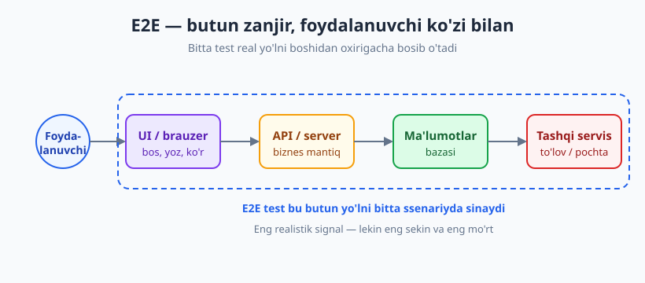
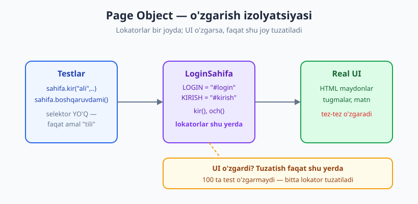
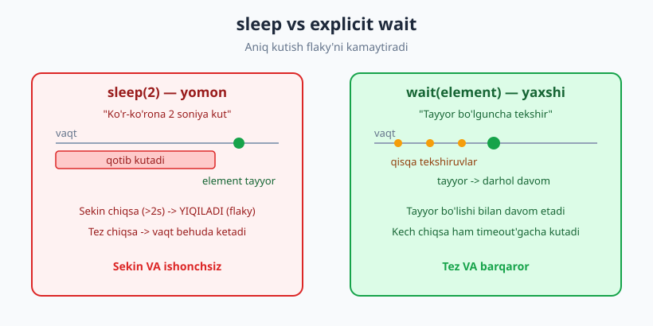

# 19 — End-to-end va UI testlar

[🏠 README](./README.md) · [⬅️ Oldingi: 18 — Kontrakt testlar](./18-kontrakt-testlar.md) · [Keyingi: 20 — Code coverage ➡️](./20-code-coverage.md)

---

> **Bu bobda:** tizimni *foydalanuvchi ko'zi bilan* — boshidan oxirigacha sinaydigan **E2E**
> (end-to-end) va **UI** testlarni o'rganamiz. E2E nima, nega u eng realistik, lekin eng sekin va
> mo'rt; qachon arziydi (kritik biznes yo'llari, smoke test); brauzer avtomatizatsiyasi (Playwright /
> Selenium g'oyasi); barqaror **selektor**lar; **Page Object Model** (POM); va flaky E2E bilan
> dastlabki kurash (explicit wait vs `sleep`). Bu — test piramidasining **tepasi** (03-bob).
>
> **Halollik / Eslatma:** real brauzer, Playwright yoki Selenium bu yerda **ishga tushirilmaydi** —
> ularni faqat **konseptual** (sintaksis eskizi) ko'rsatamiz, chunki ular tashqi muhit talab qiladi.
> Buning o'rniga Page Object naqshini **sof Python** klasslari va **soxta drayver** bilan jonli
> modellashtiramiz: g'oya bir xil, lekin determinstik va tez. Barcha Python namunalari
> `python -m pytest` (Python 3.14, pytest 9.0.3) bilan haqiqatan ishga tushirib tekshirilgan.

---

## E2E nima — "haqiqatan ishlayaptimi?"

Tasavvur qiling, restoran ochdingiz. Oshpaz har taomni alohida tekshirdi (unit test), oshxona
jihozlari birga ishlashini sinab ko'rdik (integratsiya test). Lekin **bitta haqiqiy mehmon**
kelib, eshikdan kirib, stol band qilib, ovqat buyurtma qilib, yeb, hisob to'lab, mamnun chiqib
ketmaguncha — restoran "ishlayapti" deb ayta olmaysiz. Mana shu **to'liq mehmon yo'li** — bu E2E test.

**End-to-end (E2E) test** — tizimni **butun zanjir bo'ylab**, real foydalanuvchi yo'li bilan
sinaydi: foydalanuvchi UI (yoki brauzer) orqali amal qiladi → so'rov API/serverga boradi → server
ma'lumotlar bazasiga yozadi → kerak bo'lsa tashqi servisga (to'lov, pochta) murojaat qiladi → va
natija yana foydalanuvchiga qaytadi. Hech bir bo'g'in soxtalashtirilmaydi (yoki minimal).



Shuning uchun E2E — **eng realistik signal**: agar smoke test "ro'yxatdan o'tish → login → sotib
olish" yo'li o'tsa, demak tizimning eng muhim qismi haqiqatan ishlayapti. Hech qaysi unit test bu
darajada ishonch bermaydi, chunki unit test har bir bo'lakni *alohida* sinaydi — bo'laklar
**birga** ishlashini emas.

> **Markaziy g'oya:** E2E "qism ishlaydimi?" emas, **"butun tizim foydalanuvchi uchun ishlaydimi?"**
> degan savolga javob beradi. Bu eng yuqori ishonch — lekin eng yuqori narxda keladi.

---

## E2E narxi — nega tepada oz bo'lishi kerak

03-bobdagi test piramidasini eslang: pastda ko'p unit, o'rtada bir oz integratsiya, **tepada juda
oz E2E**. Nega tepada oz? Chunki E2E **qimmat** — to'rt jihatdan:

| Narx o'lchovi | E2E nega yomon | Taqqoslash (unit) |
|---|---|---|
| **Tezlik** | Brauzer ko'tariladi, sahifa yuklanadi, tarmoq kutiladi — soniyalar/test | millisekundlar |
| **Mo'rtlik (flaky)** | Async, tarmoq, animatsiya — goh o'tadi, goh yiqiladi (24-bob) | determinstik |
| **Saqlash narxi** | UI ozgina o'zgarsa, ko'p test buziladi; doim tuzatish kerak | barqaror |
| **Xato lokalizatsiyasi** | "Yiqildi" — lekin qayerda? UI? API? DB? Topish qiyin | aniq bir funksiya |

Oxirgi nuqta ayniqsa og'riqli. Unit test yiqilsa, **aynan qaysi funksiya** singanini darhol
bilasiz. E2E yiqilsa — butun zanjirning istalgan bo'g'ini aybdor bo'lishi mumkin. Diagnostika
soatlar oladi.

Agar piramidani teskari ag'darib, ko'p E2E va kam unit yozsangiz — bu **"muzqaymoq konusi"**
(ice-cream cone) anti-naqshi (03-bob): sekin, ishonchsiz CI, har ertalab "yana qaysi test yiqildi?"
degan savol. Jamoa testlarga ishonmay qo'yadi.

> **Trade-off:** E2E ishonch bilan narxni almashtiradi. Ko'proq E2E = ko'proq realistik ishonch,
> **lekin** sekinroq fikr-mulohaza va ko'proq flaky. To'g'ri muvozanat: **oz, lekin eng muhim**
> yo'llar uchun E2E; qolgan barcha qamrovni pastroq, arzonroq darajada (unit/integratsiya) ber.

---

## Qachon E2E ARZIYDI

Har bir xususiyatga E2E yozish — isrof. E2E faqat **eng muhim yo'llar** uchun:

- **Kritik biznes yo'llari (smoke test).** Pul keltiradigan yoki tizim "tirik"ligini bildiradigan
  oqim: `ro'yxatdan o'tish → login → mahsulot tanlash → to'lov → buyurtma`. Agar shu yo'l sinsa,
  biznes to'xtaydi — bu eng yuqori ustuvorlik.
- **Eng muhim oqimlar uchun regressiya himoyasi.** Kelajakdagi o'zgarish bu yo'lni buzmasligiga
  kafolat.
- **Integratsiya nuqtalari ko'p bo'lgan, faqat birga sinaganda ko'rinadigan oqim** (masalan,
  uchta servis + DB + to'lov shlyuzi birga).

Aksincha, E2E **arzimaydigan** joylar: chegara qiymatlari, har bir validatsiya xabari, har bir
xato holati, formulalar — bularning hammasi unit testda **arzonroq va tezroq** qoplanadi.

> **Tamoyil:** *Test faqat eng muhim yo'llarni* E2E darajasida. Qolganini pastga tushir. Yaxshi
> qoida: agar muammoni unit yoki integratsiya testi tutib qola olsa — E2E yozmang.

Misol: to'lov summasini hisoblash mantig'ini E2E'da emas, **unit**'da o'nlab holat bilan sinang
(tez, aniq). E2E esa faqat *"foydalanuvchi haqiqatan to'lov tugmasini bosib, buyurtma yaratila
oldimi"* degan bitta to'liq yo'lni tekshirsin.

---

## Brauzer avtomatizatsiyasi (konseptual)

UI/E2E testlar ko'pincha **brauzerni avtomatlashtiradi**: kod brauzerni ochadi, tugma bosadi,
maydon to'ldiradi, matnni tekshiradi — xuddi odam qilganidek. Asosiy vositalar:

| Vosita | Xususiyat |
|---|---|
| **Selenium** | Eng eski, eng keng tarqalgan, ko'p til/brauzer. Sozlash murakkabroq, sekinroq, flaky'ga moyil. |
| **Playwright** | Zamonaviy (Microsoft), tezroq, auto-wait o'rnatilgan, ishonchliroq. Python/JS/.NET. |
| **Cypress** | Zamonaviy (JS/TS), qulay developer tajriba, asosan brauzer ichida ishlaydi. |

> **Eslatma:** quyidagi kod **konseptual eskiz** — uni ishga tushirish uchun brauzer va kutubxona
> o'rnatish kerak (`pip install playwright`, keyin `playwright install`). Biz bu yerda uni
> **ishlatmaymiz** — faqat sintaksis tanishligini berish uchun ko'rsatamiz.

Playwright (Python) uslubidagi tipik E2E test **shunday ko'rinadi**:

```python
# KONSEPTUAL ESKIZ — ishga tushirilmagan (real brauzer talab qiladi)
from playwright.sync_api import sync_playwright, expect

def test_login_e2e():
    with sync_playwright() as p:
        brauzer = p.chromium.launch(headless=True)   # headless: oynasiz, CI uchun
        page = brauzer.new_page()
        page.goto("https://misol.uz/login")          # sahifaga o'tish
        page.fill("[data-testid=login]", "ali")       # maydonni to'ldirish
        page.fill("[data-testid=parol]", "1234")
        page.click("[data-testid=kirish]")            # tugma bosish
        expect(page.get_by_text("Xush kelibsiz")).to_be_visible()  # natijani tekshirish
        brauzer.close()
```

Asosiy amallar deyarli har vositada bir xil ataladi: `goto`/`visit` (sahifaga o'tish), `click`
(bosish), `fill`/`type` (yozish), `get_by_text`/`expect` (matnni tekshirish). **Headless rejim**
— brauzerni ko'rinadigan oyna ochmasdan ishlatish; CI serverda (27-bob) ekran yo'q, shuning uchun
E2E doim headless ishlaydi.

> **Til-mustaqil:** JavaScript'da bu aynan Playwright/Cypress; selektorlar va `expect` shakli
> deyarli bir xil. G'oya — *brauzerni dasturiy boshqarish* — har tilda bir.

---

## Selektor — barqaror vs mo'rt

Brauzer testi elementni topish uchun **selektor** ishlatadi. Selektor tanlovi — E2E barqarorligining
eng katta omillaridan biri. Yaxshi selektor UI ko'rinishi o'zgarsa ham ishlaydi; yomon selektor
arzimas o'zgarishdan ham sinadi.

| ✅ Barqaror selektor | ❌ Mo'rt selektor |
|---|---|
| `[data-testid="kirish"]` — maxsus test atributi | `div > div:nth-child(3) > button` — chuqur CSS yo'l |
| Rol bo'yicha: "button", nomi "Kirish" | Joylashuv indeksi bo'yicha (3-tugma) |
| Ko'rinadigan matn bo'yicha: "Xush kelibsiz" | Avtomatik generatsiya qilingan CSS klass (`css-1a2b3c`) |

Quyida bu g'oyani sof Python bilan **jonli modellashtiramiz** — soddalashtirilgan baholovchi
selektorni "barqaror" yoki "mo'rt" deb belgilaydi:

```python
# selektor_baho.py
def selektor_bahosi(sel):
    if sel.startswith("[data-testid"):
        return "barqaror"          # maxsus test atributi — UI dizayni o'zgarsa ham qoladi
    if ">" in sel or ":nth-child" in sel:
        return "mo'rt"             # joylashuv/strukturaga bog'liq — oson sinadi
    return "o'rtacha"
```

```python
# test_selektor_baho.py
from selektor_baho import selektor_bahosi

def test_test_id_barqaror():
    assert selektor_bahosi('[data-testid="kirish"]') == "barqaror"

def test_nth_child_mort():
    assert selektor_bahosi("div > div:nth-child(3) > button") == "mo'rt"
# -> 2 passed in 0.01s
```

Tavsiya: ishlab chiqaruvchidan UI elementlariga **`data-testid`** (yoki `data-test`) atributi
qo'shishni so'rang. Bu test va UI o'rtasida barqaror "shartnoma" yaratadi: dizayner ranglar,
klasslar, joylashuvni o'zgartirsa ham, `data-testid` o'zgarmaydi.

---

## Page Object Model (POM) — UI ni klassga inkapsulyatsiya qil

Eng katta E2E muammosi — **saqlash narxi**. Agar 50 ta test to'g'ridan-to'g'ri `page.click("#kirish")`
deb yozsa, login tugmasi selektori o'zgarsa — **50 joyni** tuzatish kerak. Yechim: **Page Object
Model** — har UI sahifani **alohida klassga** o'rab, lokatorlar va amallarni **bir joyga** to'plash.



POM g'oyasini brauzersiz, **sof Python** bilan jonli ko'rsatamiz. Avval real brauzer `page`
obyektining o'rnini bosadigan **soxta drayver** yozamiz (bu — 07/10-boblardagi *fake* dublyor: real
emas, lekin haqiqiy ishlaydigan, sodda):

```python
# soxta_brauzer.py  -- real brauzer "page" obyektining sof-Python modeli (fake)
class SoxtaElement:
    def __init__(self, drayver, selektor):
        self.drayver = drayver
        self.selektor = selektor

    def yoz(self, matn):
        self.drayver.holat["maydonlar"][self.selektor] = matn

    def bos(self):
        self.drayver.bosilgan.append(self.selektor)
        if self.selektor == "#kirish":               # "server" mantiqini soxtalashtiramiz
            m = self.drayver.holat["maydonlar"]
            if m.get("#login") == "ali" and m.get("#parol") == "1234":
                self.drayver.holat["url"] = "/boshqaruv"
                self.drayver.holat["matn"]["#salom"] = "Xush kelibsiz, ali"
            else:
                self.drayver.holat["matn"]["#xato"] = "Login yoki parol noto'g'ri"


class SoxtaDrayver:
    def __init__(self):
        self.holat = {"url": "/login", "maydonlar": {}, "matn": {}}
        self.bosilgan = []

    def och(self, url):
        self.holat["url"] = url

    def topish(self, selektor):
        return SoxtaElement(self, selektor)

    def joriy_url(self):
        return self.holat["url"]

    def matn(self, selektor):
        return self.holat["matn"].get(selektor, "")
```

Endi **Page Object**'ning o'zi — `LoginSahifa`. E'tibor bering: barcha **lokatorlar** (selektorlar)
klass tepasida **bir joyda**, va testlar faqat **amal**larni ("kir", "och") ko'radi, selektorlarni
emas:

```python
# login_sahifa.py  -- Page Object: lokator + amal bir joyda
class LoginSahifa:
    URL = "/login"
    # --- Lokatorlar BIR JOYDA: UI o'zgarsa, faqat shu yer tuzatiladi ---
    LOGIN_MAYDON = "#login"
    PAROL_MAYDON = "#parol"
    KIRISH_TUGMA = "#kirish"
    SALOM_MATN = "#salom"
    XATO_MATN = "#xato"

    def __init__(self, drayver):
        self.drayver = drayver

    # --- Amallar foydalanuvchi "tilida"; selektorlar yashiringan ---
    def och(self):
        self.drayver.och(self.URL)
        return self

    def kir(self, login, parol):
        self.drayver.topish(self.LOGIN_MAYDON).yoz(login)
        self.drayver.topish(self.PAROL_MAYDON).yoz(parol)
        self.drayver.topish(self.KIRISH_TUGMA).bos()
        return self

    def salom_matni(self):
        return self.drayver.matn(self.SALOM_MATN)

    def xato_matni(self):
        return self.drayver.matn(self.XATO_MATN)

    def boshqaruvdami(self):
        return self.drayver.joriy_url() == "/boshqaruv"
```

Va nihoyat testlar — **o'qilishi oson**, "foydalanuvchi yo'li"dek o'qiladi (AAA tuzilishi):

```python
# test_login_sahifa.py
from soxta_brauzer import SoxtaDrayver
from login_sahifa import LoginSahifa

def test_muvaffaqiyatli_login():
    sahifa = LoginSahifa(SoxtaDrayver()).och()    # Arrange
    sahifa.kir("ali", "1234")                      # Act (foydalanuvchi yo'li)
    assert sahifa.boshqaruvdami()                  # Assert
    assert sahifa.salom_matni() == "Xush kelibsiz, ali"

def test_notogri_parol():
    sahifa = LoginSahifa(SoxtaDrayver()).och()
    sahifa.kir("ali", "yomon")
    assert not sahifa.boshqaruvdami()
    assert sahifa.xato_matni() == "Login yoki parol noto'g'ri"
# -> 2 passed in 0.54s
```

Bu kod **haqiqatan ishga tushirildi** va `2 passed` berdi. Endi POM'ning kuchini ko'ring: agar UI
o'zgarib, login maydoni selektori `#login`dan `[data-testid=login]`ga aylansa — siz **faqat
`LOGIN_MAYDON` qatorini** tuzatasiz. Yuzlab test o'zgarmaydi. Bu — **o'zgarish izolyatsiyasi**, va
aynan POM uni katta E2E to'plamida hayotiy qiladi.

> **Til-mustaqil:** POM — sof naqsh, til/vositaga bog'liq emas. JavaScript Playwright'da bu
> `class LoginPage { ... }`, Java Selenium'da `LoginPage` klass, real `page`/`driver`ni qabul
> qiladi. Bizning `SoxtaDrayver` o'rnida real `page` turadi — qolgan struktura aynan.

---

## Flaky E2E bilan kurash — explicit wait vs sleep

E2E'ning eng katta dushmani — **flaky** (goh o'tadi, goh yiqiladi) testlar (to'liq 24-bobda).
Eng tez-tez uchraydigan sabab — **vaqtlash (timing)**: sahifa hali yuklanmasdan test elementni
qidiradi. Eng yomon "yechim" — `sleep` bilan **ko'r-ko'rona kutish**:



```python
# ❌ YOMON: ko'r-ko'rona kutish
import time
time.sleep(2)            # "umid qilamanki, 2 soniya yetadi"
# Sekin chiqsa (>2s) -> YIQILADI (flaky). Tez chiqsa -> vaqt behuda ketadi.
```

To'g'ri yondashuv — **explicit wait** ("aniq kutish"): element **tayyor bo'lguncha** qisqa
oraliqlarda qayta-qayta tekshirish (polling), tayyor bo'lishi bilan **darhol** davom etish. Buni
sof Python bilan jonli modellashtiramiz:

```python
# kutish.py
import time

def kut_paydo_bolguncha(tekshir, urinish=10, oraliq=0.001):
    """Explicit wait: 'tayyor' bo'lguncha tekshiramiz; qotib turmaymiz."""
    for _ in range(urinish):
        if tekshir():
            return True
        time.sleep(oraliq)        # kichik oraliq, sleep(2) emas
    return False                  # timeout: hech tayyor bo'lmadi

class SekinUI:
    """Element bir necha 'tick'dan keyin paydo bo'ladi (asinxron yuklanish)."""
    def __init__(self, tayyor_qadamda):
        self.qadam = 0
        self.tayyor_qadamda = tayyor_qadamda
    def koz_tashla(self):
        self.qadam += 1
        return self.qadam >= self.tayyor_qadamda
```

```python
# test_kutish.py
from kutish import kut_paydo_bolguncha, SekinUI

def test_explicit_wait_tayyor_bolguncha_kutadi():
    ui = SekinUI(tayyor_qadamda=3)
    assert kut_paydo_bolguncha(ui.koz_tashla) is True
    assert ui.qadam == 3          # aynan 3-tekshiruvda tayyor; ortiqcha kutmadi

def test_timeout_yetmasa_false():
    ui = SekinUI(tayyor_qadamda=100)         # hech tayyor bo'lmaydi
    assert kut_paydo_bolguncha(ui.koz_tashla, urinish=5) is False
# -> 2 passed in 0.02s
```

Bu **haqiqatan ishga tushirildi** va o'tdi. Farq tub: `sleep(2)` *har doim* 2 soniya yo'qotadi va
sekinroq chiqsa yiqiladi; explicit wait esa tayyor bo'lishi bilan davom etadi va kech chiqsa
ham timeout'gacha sabr qiladi — **tez VA barqaror**.

> **Eslatma:** zamonaviy vositalar (Playwright) ko'p hollarda **auto-wait** beradi — `click`/`expect`
> o'zi element tayyor bo'lguncha kutadi, shuning uchun qo'lda wait kamroq kerak. Lekin tamoyil bir:
> *vaqtga emas, holatga* kut.

Flaky'ga qarshi qolgan vositalar (24-bobda chuqurroq):

- **Retry** — yiqilgan E2E'ni bir-ikki marta qayta ishga tushirish (ehtiyot bo'ling: bu *real*
  xatoni ham yashirishi mumkin — faqat tasdiqlangan flaky uchun).
- **Test izolyatsiyasi** — har test o'z holatini yaratsin, oldingisidan qolgan ma'lumotga
  tayanmasin (04-bob, FIRST).
- **Barqaror ma'lumot** — har testga toza, oldindan ma'lum boshlang'ich holat (16-bob: seed/rollback).

---

## Visual va accessibility testlar — qisqacha

E2E doirasida ikkita maxsus tur tez-tez tilga olinadi:

- **Visual / UI regression** — sahifaning rasmini (screenshot) oldingi "tasdiqlangan" rasm bilan
  taqqoslab, **ko'rinishdagi kutilmagan o'zgarish**ni topish. Bu — aslida **snapshot/approval
  testing**ning UI varianti (to'liq 23-bob): "golden master" — tasdiqlangan rasm, har run uni
  bilan farqni tekshiradi. Foydali, lekin mo'rt (bitta piksel farqi ham "yiqilish" bo'lishi mumkin).
- **Accessibility (a11y) testlar** — UI ekran o'qish dasturlari va klaviatura bilan ishlatsa
  bo'ladimi tekshiradi: rasmlarda `alt` matn, yetarli rang kontrasti, to'g'ri ARIA roli. `axe`
  kabi vositalar buni avtomatlashtiradi. Bu — **funksiya emas, sifat** o'lchovi, lekin real
  foydalanuvchilar uchun muhim.

> **Diqqat:** visual va a11y testlar E2E'ga "qo'shimcha" — ularni ham minimal va maqsadli ushlang.
> Snapshot mexanikasi 23-bobda, snapshot xavfi ("ko'r-ko'rona tasdiqlash") ham o'sha yerda.

---

## Halol xulosa: E2E'ni minimal ushlang

Takror, chunki muhim: **E2E — eng kuchli, lekin eng qimmat test.** Vasvasaga tushib, hamma narsani
"ishonchli bo'lsin" deb E2E'ga to'plash — to'g'ridan-to'g'ri **muzqaymoq konusi** anti-naqshiga
olib boradi: CI sekin, testlar ishonchsiz, jamoa "yana flaky" deb testlarga ishonmay qo'yadi.

Sog'lom yondashuv:

- Aksariyat qamrov **pastroq darajada** — unit (tez, aniq, ko'p) va integratsiya (o'rtacha).
- E2E faqat **eng muhim foydalanuvchi yo'llari** uchun (smoke + bir nechta kritik regressiya).
- E2E barqaror bo'lsin: **POM** bilan saqlanadigan, **explicit wait** bilan flaky'siz, **barqaror
  selektor** bilan mustahkam.
- Bir muammoni pastroq daraja tutib qola olsa — E2E yozmang.

> **Markaziy xulosa:** E2E sonini emas, **ishonchini** maksimallashtiring. O'nta mo'rt E2E'dan —
> bitta barqaror smoke test va kuchli unit/integratsiya bazasi yaxshiroq.

---

## Asosiy g'oyalar (bobni qisqacha)

- **E2E = tizimni foydalanuvchi ko'zi bilan, boshidan oxirigacha sinash** (UI → API → DB → tashqi). Eng realistik "ishlayapti" signali.
- **E2E qimmat:** sekin, mo'rt (flaky), saqlash qiyin, xato lokalizatsiyasi murakkab — shuning uchun piramida **tepasida oz**.
- **Qachon arziydi:** kritik biznes yo'llari (smoke test: ro'yxat→login→sotib olish) va eng muhim oqimlarga regressiya himoyasi. Qolganini pastga tushir.
- **Brauzer avtomatizatsiyasi (konseptual):** Selenium (eski, keng), Playwright/Cypress (zamonaviy, ishonchliroq). Headless rejim CI uchun.
- **Selektor:** barqaror (`data-testid`, rol, matn) vs mo'rt (chuqur CSS, indeks, generatsiya qilingan klass). Barqaror selektor — flaky'ning oldini oladi.
- **Page Object Model:** UI sahifasini klassga inkapsulyatsiya — lokator + amal bir joyda. UI o'zgarsa, bitta joy tuzatiladi; testlar o'qiladi va o'zgarmaydi.
- **Flaky'ga qarshi:** `sleep` (ko'r-ko'rona, yomon) o'rniga **explicit wait** (holatga kut, yaxshi); retry (ehtiyotkor); test izolyatsiyasi; barqaror ma'lumot.
- **Visual + a11y testlar** — E2E'ning maxsus turlari (snapshot 23-bob bilan ko'prik); minimal ushlang.
- **Halol:** E2E sonini emas, ishonchini maksimallashtir; muzqaymoq konusidan qoch.

---

## Mashqlar

### Oson

**1-mashq.** O'z so'zingiz bilan tushuntiring: nega bitta E2E test o'nta unit testdan ko'ra ko'proq
ishonch beradi-yu, lekin nega baribir E2E'ni oz yozamiz?

**2-mashq.** Quyidagi selektorlarning qaysi biri barqaror, qaysi biri mo'rt? Har biriga sabab ayting:
(a) `[data-testid="savatga-qosh"]`, (b) `body > main > div:nth-child(2) > button`,
(c) "Savatga qo'shish" matnli tugma, (d) `.css-1x2y3z`.

**3-mashq.** Nega `time.sleep(2)` E2E testda yomon g'oya? Ikkita alohida muammosini ayting (biri
ishonch, biri tezlik bilan bog'liq).

### O'rta

**4-mashq.** Page Object Model nima muammoni hal qiladi? "Agar POM bo'lmasa, login selektori
o'zgarganda nima bo'ladi?" degan savol orqali tushuntiring.

**5-mashq.** Matndagi `SoxtaDrayver`dan foydalanib, `SavatSahifa` Page Object yozing: u
`#qoshish` tugmasini bossa savatdagi mahsulot sonini oshiradi. `mahsulot_qosh(marta)` amali va
`savatdagi_soni()` so'rovi bo'lsin. Uni test bilan tasdiqlang (3 marta qo'shsa, son = 3).

**6-mashq.** Quyidagi flaky testni **explicit wait** bilan barqaror qiling. `sleep`ni olib tashlang,
"natija tayyor bo'lguncha" kutadigan funksiya yozing:

```python
import time
def test_flaky():
    yuklovchi = sekin_yukla()      # bir necha tick'dan keyin tayyor bo'ladi
    time.sleep(2)                   # ko'r-ko'rona kutish — yomon
    assert yuklovchi.tayyormi()
```

### Qiyin

**7-mashq.** Smoke test g'oyasini sof Python bilan modellashtiring: `LoginSahifa` (matndagi) +
yangi `BoshqaruvSahifa` (foydalanuvchi `/boshqaruv`da ekanini va salomni ko'rsata oladigan) ni
**ketma-ket** ishlatib, `ro'yxat → login → boshqaruvga kirish` to'liq yo'lini bitta test sifatida
yozing. Soxta drayverdan foydalaning.

**8-mashq.** Bir jamoa "E2E qamrovni 90% ga ko'taramiz" deb qaror qildi va har xususiyat uchun E2E
yoza boshladi. Olti oydan keyin CI 40 daqiqa ishlaydi va har run'da 3-5 test "tasodifan" yiqiladi.
Nima yuz berdi (qaysi anti-naqsh)? Piramida tamoyili asosida ularga qanday qayta tuzilish
tavsiya qilasiz?

<details markdown="1">
<summary>Yechimlar</summary>

### 1-mashq yechimi

E2E ko'proq ishonch beradi, chunki u **butun zanjirni birga** sinaydi (UI + API + DB + tashqi) —
real foydalanuvchi yo'li bilan, hech narsa soxtalashtirilmagan. Unit test esa har bo'lakni
*alohida* sinaydi, bo'laklar birga ishlashini kafolatlamaydi. Lekin E2E **qimmat**: sekin (brauzer,
tarmoq), mo'rt (flaky), saqlash qiyin, xato joyini topish murakkab. Shuning uchun uni faqat eng
muhim yo'llar uchun oz yozamiz — qolganini arzonroq unit/integratsiya darajasida qoplaymiz.

### 2-mashq yechimi

- (a) `[data-testid="savatga-qosh"]` — **barqaror**: maxsus test atributi, UI dizayni (rang, klass,
  joylashuv) o'zgarsa ham qoladi.
- (b) `body > main > div:nth-child(2) > button` — **mo'rt**: chuqur strukturaga va joylashuv
  indeksiga bog'liq; sahifaga bitta `div` qo'shilsa sinadi.
- (c) "Savatga qo'shish" matnli tugma — **o'rtacha/barqaror**: foydalanuvchi ko'radigan matnga
  tayanadi (yaxshi), lekin matn (yoki til) o'zgarsa sinadi.
- (d) `.css-1x2y3z` — **mo'rt**: avtomatik generatsiya qilingan klass nomi, har build'da o'zgarishi
  mumkin.

### 3-mashq yechimi

`time.sleep(2)` ikki yomon:
1. **Ishonch (flaky):** agar sahifa 2 soniyada yuklanmasa (sekin tarmoq, og'ir CI), test
   **noto'g'ri yiqiladi** — kod to'g'ri bo'lsa ham. Bu flaky.
2. **Tezlik:** agar sahifa 0.1 soniyada tayyor bo'lsa ham, test baribir to'liq 2 soniya kutadi —
   **vaqt behuda**. Yuzlab test bo'lsa, bu daqiqalarga aylanadi.

To'g'ri yo'l — explicit wait: tayyor bo'lguncha qisqa oraliqda tekshir, tayyor bo'lishi bilan davom et.

### 4-mashq yechimi

POM **saqlash narxi** muammosini hal qiladi. POM bo'lmasa, har test to'g'ridan-to'g'ri
`page.click("#login")` deb yozadi. Login selektori o'zgarsa (`#login` → `[data-testid=login]`),
shu selektorni ishlatadigan **har bir testni** (ehtimol o'nlab/yuzlab) qo'lda tuzatish kerak —
xatoga moyil va zerikarli. POM bilan selektor **bitta joyda** (`LoginSahifa.LOGIN_MAYDON`) —
o'zgarsa, faqat **bitta qatorni** tuzatasiz, testlarga tegmaysiz. Qo'shimcha: testlar
selektorlarsiz, amal "tili"da o'qiladi.

### 5-mashq yechimi

```python
class SoxtaElement:
    def __init__(self, drayver, sel):
        self.drayver, self.sel = drayver, sel
    def bos(self):
        self.drayver.bosilgan.append(self.sel)
        if self.sel == "#qoshish":
            self.drayver.holat["savat"] += 1

class SoxtaDrayver:
    def __init__(self):
        self.holat = {"savat": 0}
        self.bosilgan = []
    def topish(self, sel):
        return SoxtaElement(self, sel)
    def savat_soni(self):
        return self.holat["savat"]

class SavatSahifa:
    QOSHISH = "#qoshish"
    def __init__(self, drayver):
        self.drayver = drayver
    def mahsulot_qosh(self, marta=1):
        for _ in range(marta):
            self.drayver.topish(self.QOSHISH).bos()
        return self
    def savatdagi_soni(self):
        return self.drayver.savat_soni()

def test_savatga_qoshish():
    s = SavatSahifa(SoxtaDrayver()).mahsulot_qosh(3)
    assert s.savatdagi_soni() == 3
# -> 1 passed
```

Lokator (`QOSHISH`) bir joyda, amal foydalanuvchi tilida — POM tamoyili.

### 6-mashq yechimi

```python
import time

def kut(shart, urinish=20, oraliq=0.001):
    for _ in range(urinish):
        if shart():
            return True
        time.sleep(oraliq)
    return False

def test_barqaror():
    yuklovchi = sekin_yukla()
    assert kut(yuklovchi.tayyormi) is True   # tayyor bo'lguncha kutadi, sleep(2) emas
```

`kut` natija tayyor bo'lguncha qisqa oraliqlarda tekshiradi va tayyor bo'lishi bilan darhol davom
etadi. Sahifa tez chiqsa — tez davom etadi; sekin chiqsa — timeout'gacha sabr qiladi (noto'g'ri
yiqilmaydi). Sof-Python tasdiq (matndagi `SekinUI` bilan):

```python
class SekinUI:
    def __init__(self, n):
        self.qoldi = n
    def tayyormi(self):
        if self.qoldi > 0:
            self.qoldi -= 1
        return self.qoldi == 0

assert kut(SekinUI(4).tayyormi) is True
# -> True
```

### 7-mashq yechimi

```python
from soxta_brauzer import SoxtaDrayver
from login_sahifa import LoginSahifa

class BoshqaruvSahifa:
    SALOM_MATN = "#salom"
    def __init__(self, drayver):
        self.drayver = drayver
    def ochiqmi(self):
        return self.drayver.joriy_url() == "/boshqaruv"
    def salom(self):
        return self.drayver.matn(self.SALOM_MATN)

def test_smoke_login_to_boshqaruv():
    drayver = SoxtaDrayver()
    # 1) login sahifasi -> kirish (foydalanuvchi yo'li)
    LoginSahifa(drayver).och().kir("ali", "1234")
    # 2) boshqaruv sahifasiga o'tdik -> tasdiqlaymiz
    boshqaruv = BoshqaruvSahifa(drayver)
    assert boshqaruv.ochiqmi()
    assert boshqaruv.salom() == "Xush kelibsiz, ali"
# -> 1 passed
```

Bitta test ikki Page Object'ni ketma-ket ishlatib, to'liq smoke yo'lini (login → boshqaruv)
qoplaydi — bir nechta sahifa bo'ylab o'tadigan real E2E shu shaklda yoziladi.

### 8-mashq yechimi

Bu — **muzqaymoq konusi** (ice-cream cone) anti-naqshi (03-bob): piramida teskari ag'darilgan —
ko'p E2E, kam unit. Natija aynan kutilgani: E2E qimmat (sekin → 40 daqiqa CI) va mo'rt (flaky →
har run 3-5 "tasodifiy" yiqilish). Jamoa testlarga ishonmay qo'yadi.

Tavsiya:
1. **Piramidani to'g'rila:** aksariyat mantiqni (validatsiya, hisob, chegara holatlari) **unit**
   testga ko'chir — tez, aniq, ko'p.
2. **E2E'ni qisqart:** faqat **eng muhim 3-5 yo'l** (smoke + kritik regressiya) qolsin.
3. **Qolgan E2E'ni pastga tushir:** integratsiya yoki API testiga (17-bob) aylantir — arzonroq.
4. **Qolgan E2E'ni barqarorlashtir:** POM, explicit wait, barqaror selektor, test izolyatsiyasi.

Maqsad — qamrov foizi emas, **tez va ishonchli fikr-mulohaza**. Kichik, barqaror E2E to'plami +
kuchli unit baza > katta flaky E2E to'plami.

</details>

---

[🏠 README](./README.md) · [⬅️ Oldingi: 18 — Kontrakt testlar](./18-kontrakt-testlar.md) · [Keyingi: 20 — Code coverage ➡️](./20-code-coverage.md)
