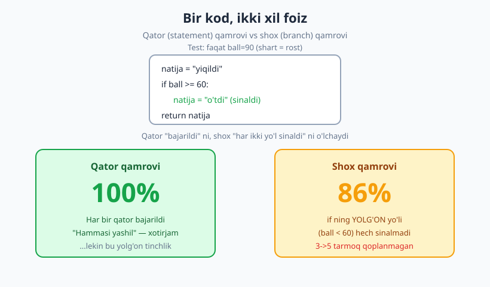
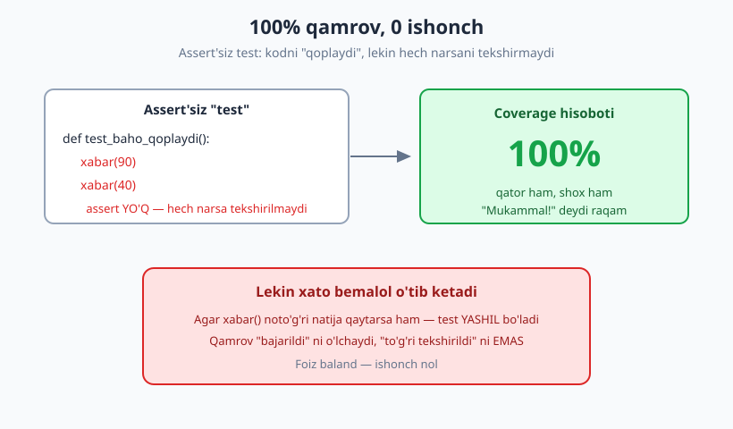
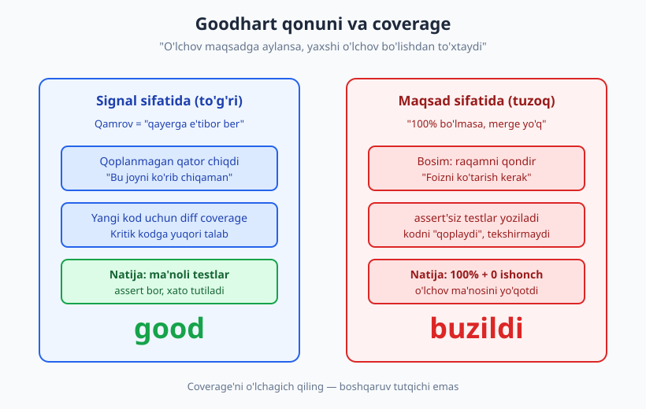

# 20 — Code coverage: foyda va xavf

[🏠 README](./README.md) · [⬅️ Oldingi: 19 — End-to-end va UI testlar](./19-e2e-ui-testlar.md) · [Keyingi: 21 — Property-based testing ➡️](./21-property-based-testing.md)

---

> **Bu bobda:** code coverage (qamrov) — testlaringiz kodning qancha qismini ishga tushirganini
> o'lchaydigan foiz. Uni qanday o'lchashni, qamrov turlarini (qator, shox, shart, yo'l, funksiya)
> aniq farqlashni va `pytest --cov` / `coverage run` bilan **haqiqiy hisobot** olishni o'rganamiz.
> Eng muhimi — coverage NIMANI ko'rsatadi va NIMANI ko'rsatmaydi: 100% qamrov xatosizlikni
> kafolatlamaydi. Goodhart qonuni va qamrovni KPI qilish tuzog'ini ham ochiq ko'ramiz.
>
> **Halollik / Eslatma:** bu bob coverage'ni "yomon" deb e'lon qilmaydi va "100% target qiling"
> ham demaydi — uni **to'g'ri ishlatishni** o'rgatadi: signal sifatida, maqsad sifatida emas.
> Coverage'ning ko'r nuqtasini (assert'siz test, yetishmagan kombinatsiyalar) keyingi boblar
> to'ldiradi: [22-bob (mutation testing)](./22-mutation-testing.md) bevosita shu bo'shliqqa
> qaratilgan. Barcha Python namunalari `python -m pytest` / `coverage` (Python 3.14, pytest 9.0.3,
> coverage.py 7.14.1) bilan **haqiqatan ishga tushirib tekshirilgan** — hisobotlar to'qib chiqarilmagan.

---

## Coverage nima — va qanday o'lchanadi

Tasavvur qiling, yangi uyga ko'chdingiz va har bir xonadagi chiroqni tekshirib chiqyapsiz.
Bir xonaga umuman kirmagan bo'lsangiz — u yerdagi chiroq buzuqmi yoki butunmi, **bilmaysiz**.
Code coverage aynan shuni o'lchaydi: testlaringiz kodning qaysi "xonalariga" kirib, qaysilariga
umuman qadam bosmaganini.

**Code coverage** (kod qamrovi) — testlar to'plami ishga tushganda, ishlab chiqarish kodining
qancha qismi (foizda) **bajarilgani**. Agar kodingizda 100 qator bo'lsa va testlar shulardan
80 tasini bajargan bo'lsa — qator qamrovi 80%.

Bu qanday o'lchanadi? **Instrumentatsiya** orqali. Coverage asbobi (Python'da `coverage.py`)
kodingizni ishga tushirishdan oldin har bir qator/tarmoqqa "kuzatuvchi" qo'yadi. Testlar ishlaganda
qaysi qator bajarildi — belgilab boradi. Oxirida: bajarilganlar / jami = foiz. Hech qanday sehr yo'q,
shunchaki "kim bu yerga kelib ketdi" jurnali.

> **Eslatma:** Coverage **dinamik** o'lchov — kodni *ishga tushirib* o'lchaydi (statik tahlil emas).
> Demak u faqat testlaringiz haqiqatan chaqirgan narsani ko'radi. Hech qachon chaqirilmagan funksiya
> qamrovda "qoplanmagan" bo'lib qoladi.

---

## Qamrov turlari — bir kod, har xil qat'iylik

"Coverage 80%" deyilganda **qaysi turdagi** qamrov ekani muhim. Bir xil kod va bir xil test turli
o'lchov bo'yicha turli foiz beradi. Eng muhim turlar:

| Tur | Nimani o'lchaydi | Qat'iylik |
|---|---|---|
| **Funksiya (function)** | Funksiya chaqirilganmi | Eng yumshoq |
| **Qator / operator (statement / line)** | Har bir qator bajarilganmi | Yumshoq |
| **Shox (branch)** | Har `if` ning rost VA yolg'on yo'li sinaldimi | O'rtacha-qat'iy |
| **Shart (condition)** | Murakkab shartdagi har bir bo'lak (a, b) alohida rost/yolg'on bo'ldimi | Qat'iy |
| **Yo'l (path)** | Tarmoqlarning barcha kombinatsiyalari bosib o'tildimi | Eng qat'iy (ko'pincha imkonsiz) |

Eng ko'p ishlatiladigani — **qator** va **shox** qamrovi. Path coverage nazariy jihatdan ideal,
lekin tarmoqlar soni ortishi bilan yo'llar soni **portlab ketadi** (10 ta ketma-ket `if` =
1024 yo'l), shuning uchun amalda kamdan-kam o'lchanadi.

> **Asosiy farq:** Qator qamrovi "bu qator bajarildimi?" deb so'raydi. Shox qamrovi "shartning
> **har ikki** natijasi sinaldimi?" deb so'raydi. Mana shu yerda 100% qator lekin 50% shox bo'lishi
> mumkin — quyida jonli ko'ramiz.

### Bir kod, 100% qator lekin 86% shox

Eng yorqin misol — `if` da `else` bo'lmagan holat:

```python
# baho.py  (sinaladigan kod)
def xabar(ball):
    natija = "yiqildi"
    if ball >= 60:
        natija = "o'tdi"
    return natija
```

Endi faqat **bitta** holatni sinaydigan test:

```python
# test_baho.py
from baho import xabar

def test_otdi():
    assert xabar(90) == "o'tdi"
```

Bu test `ball >= 60` shartining faqat **rost** yo'lini bosadi. `ball < 60` (yolg'on) yo'li hech
qachon sinalmaydi. Endi ikkala o'lchov bo'yicha hisobot oladigan bo'lsak:

```text
=== FAQAT QATOR (line) ===
Name      Stmts   Miss  Cover   Missing
---------------------------------------
baho.py       5      0   100%
---------------------------------------
TOTAL         5      0   100%

=== SHOX (branch) ===
Name      Stmts   Miss Branch BrPart  Cover   Missing
-----------------------------------------------------
baho.py       5      0      2      1    86%   3->5
-----------------------------------------------------
TOTAL         5      0      2      1    86%
```

Bir xil kod, bir xil test — lekin **qator bo'yicha 100%, shox bo'yicha 86%**. `Missing` ustunidagi
`3->5` shuni anglatadi: "3-qatordan to'g'ridan-to'g'ri 5-qatorga o'tish (ya'ni `if` yolg'on bo'lib,
`natija = "o'tdi"` ni o'tkazib yuborish) hech sinalmadi". Qator qamrovi bu bo'shliqni **ko'rmaydi**,
shox qamrovi esa ko'rsatadi.



> **Trade-off:** Shunchaki qator qamrovi yetarli emas — shox qamrovini har doim yoqing
> (`--cov-branch`). U deyarli bepul keladi va `if/else` ning yashirin yarmini ochib beradi.

---

## JONLI demo: qamrovni o'lchash va oshirish

Endi to'liqroq misolda real ish jarayonini ko'ramiz. Mana chegirma hisoblaydigan modul —
ikkita `if` bilan, demak bir nechta tarmoq bor:

```python
# chegirma.py  (sinaladigan kod)
def chegirma_foizi(daraja, summa):
    foiz = 0
    if daraja == "vip":
        foiz = 20
    else:
        foiz = 5
    if summa > 1000:
        foiz = foiz + 10
    return foiz

def yakuniy_narx(daraja, summa):
    foiz = chegirma_foizi(daraja, summa)
    return summa - summa * foiz / 100
```

Avval faqat **qisman** test yozamiz — bilib turib, hamma holatni qoplamaymiz:

```python
# test_chegirma_qisman.py
from chegirma import chegirma_foizi, yakuniy_narx

def test_vip_kichik_summa():
    assert chegirma_foizi("vip", 500) == 20

def test_yakuniy_narx_vip():
    assert yakuniy_narx("vip", 500) == 400
```

`vip` + kichik summa holatini sinadik. Lekin `oddiy` daraja (`else`) va `summa > 1000`
(ikkinchi `if` ning rosti) sinalmagan. Endi `--cov-report=term-missing` bilan ishga tushiramiz —
bu bayroq **qaysi qatorlar qoplanmaganini** ham ko'rsatadi:

```bash
python -m pytest --cov=chegirma --cov-report=term-missing -q
```

Haqiqiy chiqish (qator qamrovi):

```text
..                                                                       [100%]
=============================== tests coverage ================================
Name          Stmts   Miss  Cover   Missing
-------------------------------------------
chegirma.py      11      2    82%   6, 8
-------------------------------------------
TOTAL            11      2    82%
2 passed in 0.60s
```

Testlar **o'tdi** (`2 passed`), lekin qamrov 82% — `Missing` ustuni 6 va 8-qatorlar (ya'ni
`else: foiz = 5` va ikkinchi `if` ning ichki qatori) qoplanmaganini aytadi.

Endi **shox** qamrovini yoqamiz (`--cov-branch`). Tarmoqlar hisobga olingani uchun foiz yanada pasayadi:

```bash
python -m pytest --cov=chegirma --cov-branch --cov-report=term-missing -q
```

```text
Name          Stmts   Miss Branch BrPart  Cover   Missing
---------------------------------------------------------
chegirma.py      11      2      4      2    73%   6, 8
---------------------------------------------------------
TOTAL            11      2      4      2    73%
2 passed in 0.57s
```

82% (qator) → **73% (shox)**. Shox o'lchovi qattiqroq, chunki u to'rt tarmoqdan (`Branch 4`)
ikkitasi sinalmaganini hisobga oladi.

### Coverage'ni oshirish

`Missing` bizga aniq nimani yo'qotganimizni aytdi. Endi qolgan holatlarni qoplaydigan testlar
qo'shamiz:

```python
# test_chegirma_toliq.py
from chegirma import chegirma_foizi, yakuniy_narx

def test_vip_kichik_summa():
    assert chegirma_foizi("vip", 500) == 20

def test_oddiy_kichik_summa():
    assert chegirma_foizi("oddiy", 500) == 5       # else yo'li

def test_vip_katta_summa():
    assert chegirma_foizi("vip", 2000) == 30       # ikkinchi if rost

def test_oddiy_katta_summa():
    assert chegirma_foizi("oddiy", 2000) == 15

def test_yakuniy_narx_vip():
    assert yakuniy_narx("vip", 500) == 400
```

```bash
python -m pytest test_chegirma_toliq.py --cov=chegirma --cov-branch --cov-report=term-missing -q
```

```text
.....                                                                    [100%]
=============================== tests coverage ================================
Name          Stmts   Miss Branch BrPart  Cover   Missing
---------------------------------------------------------
chegirma.py      11      0      4      0   100%
---------------------------------------------------------
TOTAL            11      0      4      0   100%
5 passed in 0.69s
```

100% — qator ham, shox ham. `Missing` bo'sh, `BrPart` (qisman qoplangan tarmoq) 0. `Missing`
ustuni — coverage'ning eng foydali qismi: u sizga "keyingi testni qayerga yoz" deb aniq aytadi.

### `coverage run` + `coverage report` — pytest'siz ham ishlaydi

`pytest-cov` plagin — u ostida `coverage.py` ishlaydi. Uni to'g'ridan-to'g'ri ham chaqirish mumkin
(har qanday Python skript uchun, faqat pytest emas):

```bash
python -m coverage run --branch --source=chegirma -m pytest test_chegirma_qisman.py -q
python -m coverage report -m
```

```text
Name          Stmts   Miss Branch BrPart  Cover   Missing
---------------------------------------------------------
chegirma.py      11      2      4      2    73%   6, 8
---------------------------------------------------------
TOTAL            11      2      4      2    73%
```

Bu yondashuvning afzalligi — `coverage html` bilan **interaktiv HTML hisobot** ham olasiz: har bir
faylni ochib, qaysi qatorlar yashil (qoplangan) va qizil (qoplanmagan) ekanini ko'rasiz. Kundalik
ishda eng qulay ko'rinish shu.

> **Til-mustaqillik:** g'oya hamma joyda bir xil. Java'da **JaCoCo**, JavaScript/TypeScript'da
> **Istanbul** (`nyc` / Vitest/Jest ichida), PHP'da **Xdebug + PHPUnit `--coverage`**, Go'da
> `go test -cover`, .NET'da **Coverlet**. Hammasi instrumentatsiya qiladi, qator/shox foizini
> beradi va "qoplanmagan qatorlar" ro'yxatini ko'rsatadi. Atama va asbob o'zgaradi — tushuncha o'sha.

---

## Coverage NIMANI ko'rsatadi va NIMANI ko'rsatmaydi

Bu — bobning yuragi. Coverage foydali signal, lekin u haqida eng keng tarqalgan **afsona** shu:
*"100% coverage = xatosiz kod"*. Bu **noto'g'ri**, va buni jonli ko'rsatamiz.

### Afsona 1: 100% coverage = xatosiz

Coverage faqat kod **bajarilganini** o'lchaydi — uning natijasi **to'g'ri tekshirilganini** emas.
`assert` siz test kodni to'liq "qoplaydi", lekin hech narsani tasdiqlamaydi. Mana isboti:

```python
# test_baho_assertsiz.py
from baho import xabar

def test_baho_qoplaydi():
    xabar(90)
    xabar(40)   # natijani umuman tekshirmaymiz — assert YO'Q
```

Bu "test" `xabar()` ni ikki marta chaqiradi (rost va yolg'on yo'l), lekin **hech qanday assert
yo'q**. Coverage'ga qaraylik:

```bash
python -m pytest test_baho_assertsiz.py --cov=baho --cov-branch --cov-report=term-missing -q
```

```text
.                                                                        [100%]
=============================== tests coverage ================================
Name      Stmts   Miss Branch BrPart  Cover   Missing
-----------------------------------------------------
baho.py       5      0      2      0   100%
-----------------------------------------------------
TOTAL         5      0      2      0   100%
1 passed in 0.56s
```

**100% qator, 100% shox** — va test "o'tdi". Lekin bu test `xabar()` noto'g'ri natija qaytarsa ham
**baribir yashil** bo'ladi, chunki u hech narsani tekshirmaydi. Agar kimdir `xabar` ni buzib,
har doim `"yiqildi"` qaytaradigan qilib qo'ysa — bu test sezmaydi. Qamrov 100%, ishonch esa **nol**.



> **Diqqat:** Coverage "bu qatorga test *yetib bordi*" deydi, "bu qatorni test *tasdiqladi*"
> demaydi. Yuqori coverage — testlar yaxshi degani EMAS; u faqat testlar kodning ko'p qismini
> ishga tushiradi degani. assert'larning sifati — alohida masala.

### Afsona 2: yetishmagan holatlar coverage'da ko'rinmaydi

100% coverage'ga yetganingizda ham, **siz yozmagan holat** ko'rinmaydi. Misol: butun sonni
bo'lish funksiyasi.

```python
def bol(a, b):
    return a / b
```

Bitta test `bol(10, 2) == 5` — bu **100% coverage** beradi (funksiyada bitta qator bor). Lekin
`b == 0` holati? Coverage hech narsa demaydi, chunki funksiyada `if b == 0` tarmog'i **yo'q** —
demak qoplanmagan tarmoq ham yo'q. Coverage faqat **mavjud** kodni o'lchaydi; yozilmagan chegara
holati, kombinatsiya, yoki ishlov berilmagan istisno — uning radariga **tushmaydi**.

Bu — coverage'ning tubdan cheklovi: u sizga "kodning qaysi qismini sinamadingiz" deydi, lekin
"qanday kirishlarni sinamadingiz" demaydi. Chegara qiymatlari va ekvivalentlik sinflari uchun
[05-bobga](./05-assertionlar-test-holatlari.md) qarang.

> **Eslatma:** [22-bob — mutation testing](./22-mutation-testing.md) aynan birinchi afsonani
> qalqon qiladi. U kodingizga ataylab kichik "mutatsiyalar" kiritadi (`>=` ni `>` ga o'zgartirish
> kabi) va testlaringiz buni **tutadimi** deb tekshiradi. assert'siz test mutatsiyani tuta olmaydi —
> shunday qilib mutation testing coverage ko'rmaydigan "bo'sh testlar" muammosini fosh qiladi.

---

## Goodhart qonuni: coverage'ni KPI qilish tuzog'i

> **Goodhart qonuni:** "O'lchov maqsadga aylansa, u yaxshi o'lchov bo'lishdan to'xtaydi."

Coverage — ajoyib **signal**, lekin uni majburiy **maqsad** (KPI) qilib qo'yganingizda buziladi.
Sabab inson tabiatida: jamoa "100% coverage bo'lmasa, kod merge bo'lmaydi" qoidasiga duch kelsa,
ular eng oson yo'lni tanlaydi — **assert'siz testlar** yozib, raqamni qondirib qo'yadi. Natija:
hisobotda 100%, lekin testlar hech narsani himoya qilmaydi. O'lchov "buzildi".



### Maqsadli foiz: 80%? 100%?

Eng ko'p beriladigan savol: "qancha coverage kerak?". Halol javob — **bitta sehrli raqam yo'q**.

| Yondashuv | Baho |
|---|---|
| **100% har doim** | Ko'pincha kontrproduktiv: oxirgi 5–10% (getter, `__repr__`, mudofaa kodi) yozish vaqti yuqori, foydasi past. assert'siz testlarga bosim tug'diradi. |
| **80% "sanoat standarti"** | Ommabop, lekin ixtiyoriy raqam. ✅ boshlang'ich orientir sifatida yomon emas, ❌ qonun sifatida xavfli. |
| **Maqsadli foiz umuman yo'q** | Coverage'ni faqat ko'rinish (signal) sifatida ishlatish. Yetuk jamoalarda ko'p uchraydi. |
| **Diff / yangi kod uchun yuqori** | Eng amaliy: butun loyihaga emas, **yangi qo'shilgan kodga** yuqori talab. Pastda batafsil. |

> **Trade-off:** Yuqori coverage maqsadi sifatni *kafolatlamaydi*, lekin past coverage (masalan 20%)
> deyarli har doim **yomon belgi** — katta qism umuman sinalmagan. Demak coverage'ning *pasti*
> ishonchli ogohlantirish, *yuqorisi* esa ishonchsiz tasdiq. Buni esda tuting: past = aniq muammo,
> yuqori = ehtimoliy farovonlik.

---

## Amaliy maslahat: coverage'ni to'g'ri ishlatish

1. **Signal sifatida ishlat, maqsad sifatida emas.** Qoplanmagan qator = "bu yerga e'tibor ber",
   ya'ni u yerda test kerakmi yoki kod o'lik (dead code) mi deb o'yla. Foizni ko'tarish — o'z-o'zidan
   maqsad emas.
2. **Diff coverage** (yangi kod qamrovi). Butun legacy kodni 100% qilishni talab qilish noreal.
   O'rniga: "yangi yoki o'zgartirilgan qatorlar yuqori qoplangan bo'lsin". Bu loyihani asta-sekin
   yaxshilaydi va eskini test bilan to'ldirishga majburlamaydi ([29-bob — legacy kod](./29-legacy-kodni-testlash.md)).
3. **Kritik kodga yuqori, hammasiga 100% emas.** To'lov, autentifikatsiya, narx hisoblash — bu
   yerda yuqori (hatto shart/path) qamrov arziydi. UI yelimi yoki `__repr__` uchun esa shart emas.
4. **Shox qamrovini yoq** (`--cov-branch`). Qator qamrovining yashirin yarmini ochadi.
5. **HTML hisobotga qara, raqamga emas.** `coverage html` qaysi aniq qatorlar qoplanmaganini
   ko'rsatadi — bu raqamning o'zidan ancha foydaliroq.
6. **Coverage'ni mutation testing bilan to'ldir.** Coverage "qayerga test yetib bordi" ni,
   mutation "testlar haqiqatan ish qiladimi" ni aytadi ([22-bob](./22-mutation-testing.md)).

> **Diqqat:** Agar jamoangizda coverage CI'da majburiy chegara (`--cov-fail-under=80`) bo'lsa —
> bu o'zicha yomon emas, lekin uni **assert sifati** bilan birga ko'ring. Code review'da
> "yangi testlarda haqiqiy assert bormi?" degan savol coverage foizidan muhimroq.

---

## Asosiy g'oyalar (bobni qisqacha)

- **Coverage = bajarilgan kod foizi** — instrumentatsiya orqali, kodni ishga tushirib o'lchanadi
  (dinamik, statik emas).
- **Qamrov turlarini farqla:** funksiya < qator < shox < shart < yo'l (qat'iylik ortib boradi).
  Qator har doim eng yumshoq; shox `if` ning yashirin yarmini ochadi.
- **100% qator ≠ 100% shox** — `if` da `else` bo'lmasa, qator 100% lekin shox kam bo'ladi
  (jonli: 100% → 86%).
- **`--cov-report=term-missing` + `Missing` ustuni** — coverage'ning eng foydali qismi: keyingi
  testni qayerga yozishni aniq aytadi.
- **100% coverage xatosizlikni kafolatlamaydi.** assert'siz test 100% beradi-yu, hech narsani
  tekshirmaydi (jonli isbotladik). Coverage "bajarildi" ni o'lchaydi, "to'g'ri tekshirildi" ni emas.
- **Coverage yozilmagan holatlarni ko'rmaydi** — chegara, kombinatsiya, mavjud bo'lmagan tarmoq
  uning radariga tushmaydi.
- **Goodhart qonuni:** coverage'ni majburiy KPI qilsangiz, dasturchilar assert'siz test yozib
  raqamni qondiradi — o'lchov ma'nosini yo'qotadi.
- **Past coverage = aniq muammo, yuqori coverage = ehtimoliy farovonlik.** Coverage'ni signal
  sifatida ishlat; diff coverage va kritik kodga yuqori talab — amaliy yondashuv.

---

## Mashqlar

### Oson

**1-mashq.** Qator qamrovi va shox qamrovi o'rtasidagi farqni bir jumlada tushuntiring. `if` da
`else` bo'lmagan funksiya nima uchun 100% qator lekin 100% dan past shox bera oladi?

**2-mashq.** Quyidagi buyruqdagi har bir qismni izohlang:
`python -m pytest --cov=mymod --cov-branch --cov-report=term-missing`. `--cov-branch` va
`term-missing` aniq nima qiladi?

**3-mashq.** "100% coverage = mening kodimda xato yo'q" degan hamkasbingizga qisqa (2–3 jumla)
javob yozing — nima uchun bu noto'g'ri?

### O'rta

**4-mashq.** Quyidagi funksiya uchun **qator qamrovini 100%** qiladigan, lekin **shox qamrovini
100% qilMAYdigan** bitta test yozing (mantiqan tushuntiring, kodni ishlatish shart emas):

```python
def holat(yosh):
    natija = "voyaga yetmagan"
    if yosh >= 18:
        natija = "kattalar"
    return natija
```

**5-mashq.** Quyidagi test 100% coverage beradi. Nima uchun u baribir **yomon test**? Uni
yaxshilang.

```python
def test_jami():
    jami([1, 2, 3])   # natija tekshirilmaydi
```

**6-mashq.** Jamoangiz CI'ga `--cov-fail-under=100` qo'ydi. Keyingi haftada coverage 100% qoldi,
lekin produktsiyada bug'lar ko'paydi. Goodhart qonuni nuqtai nazaridan nima sodir bo'lgan bo'lishi
mumkin? Ikkita aniq sabab keltiring.

### Qiyin

**7-mashq.** "Diff coverage" (yangi kod qamrovi) nima uchun butun loyiha uchun bitta umumiy foizdan
ko'ra ko'pincha amaliyroq? Legacy loyihada (masalan, mavjud coverage 30%) qaysi yondashuv jamoani
to'g'ri yo'naltiradi — buni asoslang.

**8-mashq.** Coverage va mutation testing'ni taqqoslang: qaysi savolga har biri javob beradi?
assert'siz test misolida (yuqoridagi `test_baho_qoplaydi`) coverage 100% berdi — mutation testing
bu testni qanday "yiqitadi"? (22-bobga ishora qilmasdan, o'z so'zlaringiz bilan.)

<details markdown="1">
<summary>Yechimlar</summary>

### 1-mashq yechimi

Qator qamrovi "har bir kod qatori bajarildimi?" deb so'raydi; shox qamrovi "har bir `if` ning rost
VA yolg'on natijasi sinaldimi?" deb so'raydi. `else` bo'lmagan `if` da: shart rost bo'lganda ichki
qator bajariladi — barcha qatorlar "qoplangan" bo'lishi mumkin (100% qator), lekin shartning
**yolg'on** yo'li (ya'ni `if` ni o'tkazib yuborish) hech sinalmasligi mumkin — shu sababli shox
100% dan past chiqadi. Bobdagi `baho.py`: 100% qator, 86% shox.

### 2-mashq yechimi

- `python -m pytest` — pytest'ni Python moduli sifatida ishga tushiradi.
- `--cov=mymod` — `mymod` paketi/moduli uchun coverage o'lchaydi.
- `--cov-branch` — qator qamroviga qo'shimcha **shox** qamrovini ham hisoblaydi (har `if` ning
  ikkala yo'lini kuzatadi).
- `--cov-report=term-missing` — hisobotni terminalga chiqaradi va `Missing` ustunida **qoplanmagan
  aniq qatorlarni** (va `a->b` shaklida qoplanmagan tarmoqlarni) ko'rsatadi.

### 3-mashq yechimi

100% coverage faqat har bir kod qatori test paytida **bajarilganini** bildiradi — uning natijasi
**to'g'ri tekshirilganini** emas. assert'siz (yoki kuchsiz assert'li) test ham 100% beradi, lekin
hech qanday xatoni tutmaydi. Bundan tashqari coverage siz **yozmagan** holatlarni (chegara,
`b == 0` kabi) umuman ko'rmaydi. Demak 100% coverage — "kod ko'p sinaldi" degani, "xatosiz" degani
emas.

### 4-mashq yechimi

```python
def test_kattalar():
    assert holat(25) == "kattalar"
```

Bu test `yosh >= 18` shartining **rost** yo'lini bosadi. Funksiyaning barcha 3 qatori bajariladi →
**qator qamrovi 100%**. Lekin shartning **yolg'on** yo'li (`yosh < 18`, ya'ni `if` ni o'tkazib
yuborib to'g'ri `return` ga borish) hech sinalmaydi → **shox qamrovi 100% dan past** (50%).
To'liq shox uchun `holat(10) == "voyaga yetmagan"` testi ham kerak.

### 5-mashq yechimi

Test **natijani tekshirmaydi** — `jami([1, 2, 3])` chaqiriladi, lekin uning qiymati hech qanday
`assert` bilan solishtirilmaydi. `jami` noto'g'ri ishlasa ham test yashil bo'ladi (coverage 100%
bo'lsa-da, ishonch nol). Yaxshilangan:

```python
def test_jami():
    assert jami([1, 2, 3]) == 6
```

Endi test haqiqiy kutilgan natijani tasdiqlaydi va `jami` buzilsa yiqiladi.

### 6-mashq yechimi

`--cov-fail-under=100` coverage'ni majburiy **maqsadga** aylantirdi — bu Goodhart qonuni tuzog'i.
Ikkita ehtimoliy sabab:
1. **assert'siz / kuchsiz testlar.** Dasturchilar 100% ga yetish uchun kodni shunchaki "qoplaydigan"
   (chaqiradigan, lekin natijani tekshirmaydigan) testlar yozdi. Coverage 100%, ammo bu testlar
   bug'larni tutmaydi.
2. **Yozilmagan holatlar.** 100% coverage faqat mavjud kod yo'llarini qoplaydi; chegara qiymatlari,
   kombinatsiyalar va ishlov berilmagan kirishlar baribir sinalmagan — produktsiyada aynan shular
   xatoga aylangan. Coverage bu bo'shliqni ko'rsatmaydi.

### 7-mashq yechimi

Diff coverage **yangi yoki o'zgartirilgan qatorlar** qamrovini o'lchaydi, butun loyiha o'rtacha
foizini emas. Afzalliklari:
- Legacy loyihada mavjud 30% ni bir kunda 80% qilish noreal va demoralizatsiyalovchi. Butun loyiha
  foizini majburlash jamoani eski, kam o'zgaradigan kodga test yozishga majbur qiladi — ROI past.
- Diff coverage o'rniga "har yangi PR'da o'zgargan qatorlar yuqori qoplansin" deydi. Shunday qilib
  loyiha **asta-sekin** va eng faol o'zgaradigan (demak xato ehtimoli yuqori) joylardan boshlab
  yaxshilanadi.
- Bu legacy strategiyasiga ham mos: yangi kodni toza saqlab, eski kodni faqat o'zgartirgandagina
  test bilan o'ra (boy scout qoidasi). Demak legacy loyiha uchun **diff coverage** to'g'ri
  yo'naltiradi.

### 8-mashq yechimi

- **Coverage** "testlarim kodning qaysi qismiga *yetib bordi*?" degan savolga javob beradi.
- **Mutation testing** "testlarim kod *buzilganda buni sezadimi*?" degan savolga javob beradi.

assert'siz `test_baho_qoplaydi` coverage 100% beradi, chunki `xabar(90)` va `xabar(40)` ikkala
yo'lni ham bajaradi. Mutation testing esa kodga ataylab kichik o'zgarish kiritadi — masalan
`if ball >= 60` ni `if ball >= 0` (yoki `natija = "o'tdi"` ni `natija = "yiqildi"`) ga aylantiradi.
Endi kod **noto'g'ri** ishlaydi. To'g'ri test buni sezib **yiqilishi** kerak edi — lekin assert'siz
test hech narsani tekshirmagani uchun baribir **o'tadi**. Demak mutatsiya "tirik qoldi" (survived),
bu esa testning aslida hech narsani himoya qilmasligini fosh qiladi. Coverage ko'rmagan bo'shliqni
mutation testing aynan shunday ochib beradi.

</details>

---

[🏠 README](./README.md) · [⬅️ Oldingi: 19 — End-to-end va UI testlar](./19-e2e-ui-testlar.md) · [Keyingi: 21 — Property-based testing ➡️](./21-property-based-testing.md)
