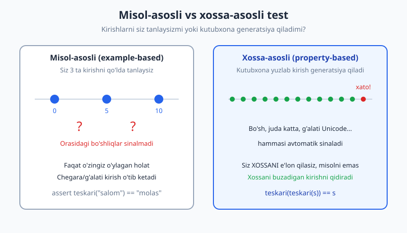
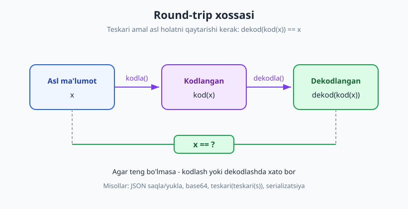
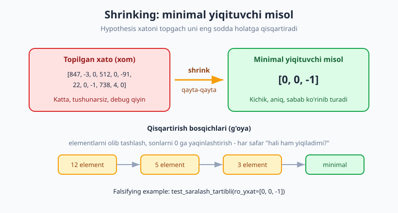

# 21 — Property-based testing

[🏠 README](./README.md) · [⬅️ Oldingi: 20 — Code coverage: foyda va xavf](./20-code-coverage.md) · [Keyingi: 22 — Mutation testing ➡️](./22-mutation-testing.md)

---

> **Bu bobda:** misol-asosli (example-based) testdan **xossa-asosli** (property-based) testga
> o'tamiz. Misol-asosli testda kirishlarni *siz* tanlaysiz — faqat o'zingiz o'ylagan holatlar
> sinaladi. Property-based testing (PBT) esa boshqacha: siz kutilgan natijani emas, kodning
> **xossasini** (invariant) e'lon qilasiz, kutubxona esa yuzlab tasodifiy kirish generatsiya qilib,
> shu xossani **buzadigan** kirishni qidiradi. Python'da buni `Hypothesis` qiladi. Xossa turlarini
> (round-trip, test oracle, invariant, idempotentlik, metamorfik), **shrinking**ni (xatoni eng
> kichik misolga qisqartirish), `assume`/`@example`/strategiyalarni va stateful testingni ko'ramiz.
>
> **Halollik / Eslatma:** PBT misol-asosli testning **o'rnini bosmaydi** — uni **to'ldiradi**. Yaxshi
> xossani topish o'ylash talab qiladi va har masala ham xossa-asosliga oson tushmaydi (yon-effektli,
> murakkab biznes qoidalari). PBT sekinroq ham (har test yuzlab marta ishlaydi). Barcha Python
> namunalari `python -m pytest` (Python 3.14, pytest 9.0.3, Hypothesis 6.155.3) bilan **haqiqatan
> ishga tushirib tekshirilgan** — chiqishlar, falsifying example'lar va shrinking natijalari to'qib
> chiqarilmagan.

---

## Muammo: siz tanlagan misollar — yetarli emas

[02-bobdan](./02-birinchi-test-aaa.md) beri biz **misol-asosli** test yozib keldik: aniq kirish
beramiz, aniq natijani `assert` qilamiz.

```python
def test_teskari_oddiy():
    assert teskari("salom") == "molas"
```

Bu test bitta misolni tekshiradi. Ko'p qo'shsangiz — bo'sh satr, bitta belgi, uzun satr — bir nechta
misol. Lekin bari bir **siz o'ylagan** misollar. Mana muammoning yuragi: kod xatosi ko'pincha siz
o'ylamagan kirishda yashiringan — bo'sh ro'yxat, juda katta son, takrorlangan elementlar, g'alati
Unicode belgi, `0`, manfiy son. Misol-asosli test bu "bo'shliqlarni" **ko'rmaydi**.



Tasavvur qiling, talaba imtihonga tayyorlanib, o'qituvchidan namuna savollarni so'rab oladi va faqat
**shularni** yodlaydi. Imtihonda biroz boshqacha savol tushsa — yiqiladi, chunki u savolni emas,
**mavzuni** o'rganishi kerak edi. Misol-asosli test ham aynan shunday: alohida holatlarni emas,
kodning **umumiy qonuniyatini** tekshirsangiz, kuchliroq bo'lasiz.

> **Diqqat:** Bu PBT misol-asosli test yomon degani EMAS. Aniq, o'qiladigan misollar — dokumentatsiya
> sifatida bebaho. Gap shundaki, siz tanlagan misollar **to'liq** emas. PBT shu bo'shliqni to'ldiradi.

---

## Property-based testing g'oyasi: natija emas, XOSSA

Property-based testingda fikrlash to'ntariladi. Siz "bu kirishga shu natija" demaysiz. Siz kodning
**har qanday** kirishda saqlanishi kerak bo'lgan **xossasini** (property / invariant) e'lon qilasiz.
Keyin kutubxona o'zi yuzlab kirish generatsiya qilib, shu xossani buzadigan birortasini topishga
harakat qiladi.

Tarix: g'oya **QuickCheck** (Haskell, 2000) dan boshlangan. Python'dagi eng mashhur vorisi —
**Hypothesis**. (`pip install hypothesis`.)

Mana eng sodda misol — `teskari` funksiyasi (satrni teskari qiladi):

```python
# teskari.py  (sinaladigan kod)
def teskari(matn):
    return matn[::-1]
```

Misol-asosli o'rniga **xossa** yozamiz: "matnni ikki marta teskari qilsam, asl matnni olaman".

```python
# test_teskari_xossa.py
from hypothesis import given, strategies as st
from teskari import teskari

@given(st.text())                       # st.text() = tasodifiy satrlar generatori
def test_teskari_round_trip(s):
    assert teskari(teskari(s)) == s     # XOSSA: har qanday s uchun rost
```

E'tibor bering: `s` ni biz bermayapmiz — `@given(st.text())` Hypothesis'ga "har xil satr generatsiya
qil va har biriga test funksiyani ishlat" deydi. Standart holatda Hypothesis ~100+ misol sinaydi.

```bash
python -m pytest test_teskari_xossa.py -q
```

```text
..                                                                       [100%]
2 passed in 5.29s
```

Bitta `@given` ortida yuzlab kirish sinaldi: bo'sh satr, bitta belgi, uzun satr, emoji, bo'shliq,
maxsus belgilar — siz hech birini qo'lda yozmadingiz.

> **Asosiy farq:** Misol-asosli test — "shu kirish → shu natija". Xossa-asosli test — "har qanday
> kirish → shu **qonuniyat** saqlanadi". Birinchisi nuqtalarni, ikkinchisi qonunni tekshiradi.

---

## Xossani qanday topish kerak — eng muhim ko'nikma

PBT'da eng qiyini sintaksis emas, balki **xossani o'ylab topish**. Boshlovchi ko'pincha "kodimda
qanaqa xossa bor?" deb dovdiraydi. Yaxshi xabar: bir nechta **takrorlanuvchi naqsh** bor. Ularni
bilsangiz, xossa topish osonlashadi.

### 1. Round-trip (teskari amal aslni qaytaradi)

Agar kodda **bir-birini bekor qiladigan** ikki amal bo'lsa: `dekod(kod(x)) == x`. Bu eng kuchli va
eng oson topiladigan xossa.



Misollar: JSON `dumps`/`loads`, base64 `encode`/`decode`, serializatsiya/deserializatsiya,
`teskari(teskari(s))`, siqish/yoyish.

```python
# kodlash.py  (sinaladigan kod)
import json

def saqla(obyekt):
    return json.dumps(obyekt)

def yukla(matn):
    return json.loads(matn)
```

```python
# test_kodlash.py
from hypothesis import given, strategies as st
from kodlash import saqla, yukla

@given(st.dictionaries(st.text(), st.integers()))
def test_json_round_trip(d):
    assert yukla(saqla(d)) == d        # XOSSA: saqlab-yuklasa, asl lug'at qaytadi
```

```text
.                                                                        [100%]
1 passed in 3.52s
```

### 2. Test oracle (sodda implementatsiya bilan solishtirish)

Agar tez/murakkab funksiyangiz bo'lsa, uni **sodda lekin ishonchli** implementatsiya bilan
solishtiring. Sodda versiya "oracle" (haqiqat manbai) bo'lib xizmat qiladi.

```python
# mening_sort.py  (sinaladigan kod: optimallashtirilgan saralash)
def mening_sort(ro_yxat):
    natija = list(ro_yxat)
    for i in range(1, len(natija)):
        kalit = natija[i]
        j = i - 1
        while j >= 0 and natija[j] > kalit:
            natija[j + 1] = natija[j]
            j -= 1
        natija[j + 1] = kalit
    return natija
```

```python
# test_mening_sort.py
from hypothesis import given, strategies as st
from mening_sort import mening_sort

@given(st.lists(st.integers()))
def test_oracle_sorted_bilan(ro_yxat):
    assert mening_sort(ro_yxat) == sorted(ro_yxat)   # oracle = ishonchli sorted()
```

### 3. Invariantlar (har doim rost bo'lgan haqiqatlar)

Aniq natijani bilmasangiz ham, har doim rost bo'ladigan **xususiyatni** bilasiz. Saralash uchun:

- Natija o'sish tartibida (har element keyingisidan katta emas).
- Natija uzunligi kirish uzunligiga teng.
- Natija — kirishning permutatsiyasi (o'sha elementlar, faqat tartib boshqa).

```python
from collections import Counter

@given(st.lists(st.integers()))
def test_tartibli(ro_yxat):
    natija = mening_sort(ro_yxat)
    assert all(natija[i] <= natija[i + 1] for i in range(len(natija) - 1))

@given(st.lists(st.integers()))
def test_xuddi_oshalar(ro_yxat):
    natija = mening_sort(ro_yxat)
    assert len(natija) == len(ro_yxat)
    assert Counter(natija) == Counter(ro_yxat)     # o'sha elementlar
```

### 4. Idempotentlik (ikki marta qo'llasa, o'zgarmaydi)

`f(f(x)) == f(x)`. Saralangan ro'yxatni qayta saralasangiz — o'zgarmaydi. Normalizatsiya,
`abs`, `sorted`, `set` — barchasi idempotent.

```python
@given(st.lists(st.integers()))
def test_idempotent(ro_yxat):
    bir_marta = mening_sort(ro_yxat)
    assert mening_sort(bir_marta) == bir_marta
```

### 5. Metamorfik (kirishni o'zgartirsa, natija bashoratli o'zgaradi)

Aniq natijani bilmasangiz ham, kirishni o'zgartirganda natija **qanday** o'zgarishini bilasiz.
Masalan: `sorted(ro_yxat)` va `sorted(ro_yxat + [x])` — ikkinchisi birinchisidan faqat `x` bilan
farq qiladi; yoki ro'yxat tartibini aralashtirsangiz, `sorted` natijasi o'zgarmaydi.

Yuqoridagi 5 ta xossani birga ishga tushiramiz:

```bash
python -m pytest test_mening_sort.py -q
```

```text
.....                                                                    [100%]
5 passed in 1.79s
```

> **Eslatma:** Bitta funksiya uchun bir necha xossa yozish odatiy hol. Round-trip + invariant +
> idempotentlik birga olganda kodning xulq-atvorini misol-asosli testdan ancha to'liq qamrab oladi.

---

## JONLI: Hypothesis buggi kodda xatoni topadi

Endi eng qiziq qismi: PBT haqiqatan ish qiladimi? **Ataylab buggi** saralash yozamiz — to'liq
saralash emas, faqat **bitta o'tish** qiladigan noto'g'ri versiya:

```python
# saralash.py  (ATAYLAB BUGGI kod)
def buggy_saralash(ro_yxat):
    natija = list(ro_yxat)
    for i in range(len(natija) - 1):
        if natija[i] > natija[i + 1]:
            natija[i], natija[i + 1] = natija[i + 1], natija[i]
    return natija
```

Bu faqat qo'shni juftlarni **bir marta** almashtiradi — to'liq saralash uchun bu yetmaydi. Endi
"natija tartibli" invariantini tekshiramiz:

```python
# test_saralash.py
from hypothesis import given, strategies as st
from saralash import buggy_saralash

@given(st.lists(st.integers()))
def test_saralash_tartibli(ro_yxat):
    natija = buggy_saralash(ro_yxat)
    for i in range(len(natija) - 1):
        assert natija[i] <= natija[i + 1]
```

```bash
python -m pytest test_saralash.py -q
```

```text
F                                                                        [100%]
================================== FAILURES ===================================
___________________________ test_saralash_tartibli ____________________________

ro_yxat = [0, 0, -1]

    @given(st.lists(st.integers()))
    def test_saralash_tartibli(ro_yxat):
        natija = buggy_saralash(ro_yxat)
        for i in range(len(natija) - 1):
>           assert natija[i] <= natija[i + 1]
E           assert 0 <= -1
E           Falsifying example: test_saralash_tartibli(
E               ro_yxat=[0, 0, -1],
E           )
=========================== short test summary info ===========================
FAILED test_saralash.py::test_saralash_tartibli - assert 0 <= -1
1 failed in 2.71s
```

Hypothesis xatoni **topdi** va eng muhimi — `Falsifying example`ni ko'rsatdi: `[0, 0, -1]`. Siz bu
holatni qo'lda yozmagan bo'lardingiz: `[0, 0, -1]` da `-1` oxirda turgani uchun bitta o'tish uni
boshiga olib kela olmaydi, demak natija `[0, -1, 0]` — tartibsiz. Bu PBT misol-asosli test
o'tkazib yuboradigan aynan o'sha "burchak holat".

> **Diqqat:** Hypothesis xatoni topadi, lekin **nima uchun** kod noto'g'ri ekanini sizga o'zi
> aytmaydi — u faqat yiqituvchi kirishni beradi. Sababni hali siz tahlil qilasiz. Lekin "qaysi
> kirish?" degan eng qiyin savolga u javob berdi.

---

## Shrinking — PBT'ning sehrli xususiyati

Hypothesis xatoni topganda, u topgan **birinchi** yiqituvchi kirish odatda katta va tushunarsiz
bo'ladi (masalan `[847, -3, 0, 512, 0, -91, 22, 0, -1, 738, 4, 0]`). Bunday misol bilan xatoni
debug qilish qiyin. Shu yerda **shrinking** (qisqartirish) ish boshlaydi: Hypothesis yiqituvchi
misolni **eng kichik, eng sodda** holatga avtomatik qisqartiradi — har safar "hali ham yiqiladimi?"
deb tekshirib.



Yuqoridagi natijada Hypothesis aynan shu sababli `[0, 0, -1]` ni berdi — bu xatoni keltirib
chiqaradigan **minimal** ro'yxat (sonlarni `0` ga yaqinlashtirib, elementlarni olib tashlab).
Shrinking ishlaganini Hypothesis statistikasi bilan ko'rsataylik:

```bash
python -m pytest test_saralash.py --hypothesis-show-statistics -q
```

```text
============================ Hypothesis Statistics ============================
test_saralash.py::test_saralash_tartibli:

  - during generate phase (0.21 seconds):
    - 4 passing examples, 6 failing examples, 0 invalid examples
    - Found 1 distinct error in this phase

  - during shrink phase (0.14 seconds):
    - 27 passing examples, 9 failing examples, 0 invalid examples
    - Tried 36 shrinks of which 9 were successful

  - Stopped because nothing left to do
```

Ikki bosqich ko'rinadi: **generate** (yiqituvchi misol topish — 6 ta yiqildi) va **shrink** (uni
qisqartirish — 36 marta urinib, 9 marta muvaffaqiyatli kichraytirdi). Natija — debug qilish oson
bo'lgan minimal misol.

> **Asosiy g'oya:** Shrinking — PBT'ni amaliy qiladigan narsa. Tasodifiy testlash yangi emas, lekin
> avvalgi vositalar sizga **xom**, ulkan yiqituvchi misol berardi. Hypothesis avtomatik
> qisqartirgani uchun siz darrov "ahmoq, `[0, 0, -1]` da yiqilarkanman" deb sababni ko'rasiz.

Yana bir jonli misol — round-trip xatosi. Quyidagi RLE (run-length encoding) dekoderida **bitta
raqamli** sonni o'qiydigan bug bor (`a10` ni noto'g'ri o'qiydi):

```python
# test_kodlash.py (davomi)
@given(st.text(alphabet="a", min_size=0, max_size=50))
def test_rle_round_trip(matn):
    assert rle_dekodla(rle_kodla(matn)) == matn
```

```text
E           IndexError: string index out of range
E           Falsifying example: test_rle_round_trip(
E               matn='aaaaaaaaaa',
E           )
```

Hypothesis aynan **10 ta** `a` ga qisqartirdi — bu eng kichik kirish bo'lib, kodlanganda ikki
raqamli son (`a10`) hosil qiladi va dekoderni buzadi. Minimaldan kichikroq (9 ta `a`) xatoni
keltirmaydi, shuning uchun u to'xtadi. Aniq, aytib turadigan misol.

---

## Foydali asboblar: assume, @example, strategiyalar

### `@example` — aniq misol qo'shish

PBT misol-asoslining o'rnini bosmaydi — ba'zan **siz biladigan** muhim holatni har safar tekshirishni
xohlaysiz. `@example` shuni qiladi: tasodifiy generatsiyaga qo'shimcha sifatida shu aniq misol
**doim** sinaydi (regressiya uchun ajoyib).

```python
from hypothesis import given, example, strategies as st

@given(st.lists(st.integers()))
@example([])              # bo'sh ro'yxat HAR DOIM sinalsin
@example([3, 1, 2])       # avval xato bergan misol - regressiya sifatida
def test_oracle_sorted_bilan(ro_yxat):
    assert mening_sort(ro_yxat) == sorted(ro_yxat)
```

### `assume` — yaroqsiz kirishlarni chetlab o'tish

Ba'zi generatsiya qilingan kirishlar xossangizga **mos kelmaydi** (masalan, bo'sh ro'yxat uchun
`min()` ma'nosiz). `assume(shart)` — "agar shart bajarilmasa, bu misolni tashlab ket, yiqitma" deydi.

```python
from hypothesis import given, assume, strategies as st

@given(st.lists(st.integers()))
def test_birinchi_eng_kichik(ro_yxat):
    assume(len(ro_yxat) > 0)            # bo'sh ro'yxatni o'tkazib yubor
    natija = mening_sort(ro_yxat)
    assert natija[0] == min(ro_yxat)
```

```text
.....                                                                    [100%]
5 passed in 1.79s
```

> **Trade-off:** `assume` bilan ehtiyot bo'ling — agar u kirishlarning ko'p qismini rad qilsa,
> Hypothesis yaxshi misol topa olmay qoladi (va ogohlantirish beradi). Ko'p rad qilinsa, o'rniga
> kerakli kirishni **to'g'ridan-to'g'ri generatsiya qilish** afzal — masalan `assume(len > 0)`
> o'rniga `st.lists(st.integers(), min_size=1)`.

### Strategiyalar (`st.`) — kirishlarni generatsiya qiluvchilar

Hypothesis kirishlarni **strategiya** orqali yaratadi. Eng ko'p ishlatiladiganlari:

| Strategiya | Nimani generatsiya qiladi |
|---|---|
| `st.integers()` | Butun sonlar (`min_value=`, `max_value=` bilan cheklash mumkin) |
| `st.text()` | Unicode satrlar (`alphabet=`, `min_size=`, `max_size=`) |
| `st.floats()` | Kasr sonlar (`allow_nan=False` bilan NaN ni o'chirish) |
| `st.lists(st.integers())` | Sonlar ro'yxati (`min_size=`, `max_size=`) |
| `st.dictionaries(kalit, qiymat)` | Lug'atlar |
| `st.booleans()` | `True` / `False` |
| `st.one_of(a, b)` / `st.sampled_from([...])` | Bir nechtadan biri / ro'yxatdan tanlash |

Strategiyalarni **birlashtirib** murakkab obyektlar ham qurish mumkin (`st.builds(...)` bilan klass
namunalari, `@composite` bilan maxsus generatorlar) — bu ilg'or mavzu, lekin g'oya o'sha:
"shakl"ini aytasiz, Hypothesis namunalarini chiqaradi.

---

## Stateful testing — amallar ketma-ketligini sinash

Hozirgacha **sof funksiyalarni** sinadik. Lekin ba'zan obyektning **holati** vaqt o'tib o'zgaradi
(stek, navbat, ombor). Stateful testing tasodifiy **amallar ketma-ketligini** generatsiya qiladi va
har qadamda invariantni tekshiradi. G'oya: haqiqiy obyektni sodda **model** bilan yonma-yon yuriting
va doim mos kelishini tekshiring.

```python
from hypothesis.stateful import RuleBasedStateMachine, rule, invariant
from hypothesis import strategies as st

class StekMashina(RuleBasedStateMachine):
    def __init__(self):
        super().__init__()
        self.stek = Stek()      # sinaladigan haqiqiy obyekt
        self.model = []         # sodda model (oracle)

    @rule(x=st.integers())
    def push(self, x):
        self.stek.push(x)
        self.model.append(x)

    @rule()
    def pop(self):
        if self.model:
            assert self.stek.pop() == self.model.pop()

    @invariant()
    def uzunlik_mos(self):
        assert len(self.stek) == len(self.model)

TestStek = StekMashina.TestCase
```

```text
.                                                                        [100%]
1 passed in 2.92s
```

Hypothesis `push`/`pop` larni tasodifiy tartibda chaqiradi va har doim haqiqiy stek modelga mos
kelishini tekshiradi. Bu bob doirasida — faqat **g'oya** sifatida; chuqurroq foydalanish ilg'or
mavzu.

---

## Qachon PBT mos, qachon qiyin

PBT kuchli, lekin **universal yechim emas**. Halol baho:

| Mos keladi (oson xossa) | Qiyin / kam foydali |
|---|---|
| Sof funksiyalar (kirish → natija, yon-effektsiz) | Murakkab biznes qoidalari (xossa = kodning nusxasi bo'lib qoladi) |
| Parser / serializer (round-trip) | Og'ir yon-effekt (tashqi tizim, UI) |
| Matematik / algoritmik kod | Sekin funksiya (yuzlab marta ishlash qimmat) |
| Ma'lumot strukturalari (stek, daraxt) | Xossani umuman topib bo'lmaydigan holat |
| Kodlash/siqish, normalizatsiya | "Aniq qiymat" muhim bo'lgan joy (misol-asosli aniqroq) |

> **Diqqat — eng keng tarqalgan tuzoq:** Xossani kodning **o'zini takrorlab** yozish.
> Agar `xossa(x) == funksiya(x)` da "xossa" funksiyaning aynan nusxasi bo'lsa — siz hech narsani
> testlamayapsiz, ikkala tomon birga buziladi. Yaxshi xossa koddan **mustaqil** bo'lishi kerak
> (round-trip, invariant, sodda oracle).

PBT misol-asosli testning **o'rnini bosmaydi**. Eng yaxshi yondashuv — **ikkalasini birga**:
o'qiladigan misol-asosli testlar (dokumentatsiya + aniq holatlar) **plyus** bir nechta xossa-asosli
test (siz o'ylamagan burchak holatlarini ovlash). PBT shuningdek [05-bobdagi](./05-assertionlar-test-holatlari.md)
chegara qiymatlari va ekvivalentlik sinflari tahlilini avtomatlashtirishga yordam beradi, va
[22-bob — mutation testing](./22-mutation-testing.md) bilan birga testlaringizning kuchini sezilarli
oshiradi.

> **Til-mustaqillik:** g'oya hamma joyda bir xil. JavaScript/TypeScript'da **fast-check**, Java'da
> **jqwik**, Erlang/Elixir'da **PropEr** / **StreamData**, Scala'da **ScalaCheck**, Rust'da
> **proptest** / **quickcheck**. Hammasi: xossa e'lon qilasiz → kutubxona kirish generatsiya qiladi →
> xato topilsa shrink qiladi. Atama va sintaksis o'zgaradi — tushuncha o'sha.

---

## Asosiy g'oyalar (bobni qisqacha)

- **Misol-asosli test cheklangan** — kirishlarni siz tanlaysiz, faqat o'zingiz o'ylagan holatlar
  sinaladi; burchak holatlar (bo'sh, `0`, manfiy, g'alati Unicode) o'tib ketadi.
- **Property-based testing fikrlashni to'ntaradi:** natijani emas, kodning **xossasini** (invariant)
  e'lon qilasiz; kutubxona yuzlab tasodifiy kirish generatsiya qilib, xossani buzganini qidiradi.
- **Xossa naqshlarini bil:** round-trip (`dekod(kod(x)) == x`), test oracle (sodda implementatsiya
  bilan solishtirish), invariant (tartibli, uzunlik o'zgarmas), idempotentlik (`f(f(x)) == f(x)`),
  metamorfik (kirish o'zgarsa natija bashoratli o'zgaradi).
- **Hypothesis xatoni jonli topadi** — buggi saralashda `Falsifying example: [0, 0, -1]` ni o'zi
  ko'rsatdi (qo'lda yozmagan burchak holat).
- **Shrinking — PBT'ning sehri:** topilgan ulkan yiqituvchi misolni avtomatik eng kichik, sodda
  holatga qisqartiradi (jonli: 36 shrink urinishi → minimal misol; RLE bug → aynan 10 ta `a`).
- **`@example`** aniq/regressiya misolini doim sinaydi; **`assume`** yaroqsiz kirishni chetlab o'tadi;
  **strategiyalar** (`st.`) kirish "shaklini" belgilaydi.
- **Stateful testing** amallar ketma-ketligini sinab, haqiqiy obyektni sodda model bilan solishtiradi.
- **PBT to'ldiradi, o'rnini bosmaydi.** Sof funksiya/parser/algoritmga ajoyib; yon-effekt va
  murakkab biznes qoidasiga qiyin. Xossani kodning nusxasi qilib yozmang — mustaqil bo'lsin.

---

## Mashqlar

### Oson

**1-mashq.** Misol-asosli va xossa-asosli testning asosiy farqini bir-ikki jumlada tushuntiring.
Nima uchun xossa-asosli test siz o'ylamagan burchak holatlarni topa oladi?

**2-mashq.** Quyidagi test funksiyasida `@given(st.integers())` aniq nima qiladi? `n` qiymatini kim
beradi?

```python
@given(st.integers())
def test_juft(n):
    assert (n * 2) % 2 == 0
```

**3-mashq.** "Round-trip xossa" nima? `json.dumps` / `json.loads` uchun round-trip xossasini bir qator
`assert` shaklida yozing.

### O'rta

**4-mashq.** `abs(x)` (modul) funksiyasi uchun **ikkita** xil xossa o'ylab toping va Hypothesis bilan
yozing (`@given(st.integers())`). Maslahat: natija belgisi va idempotentlik haqida o'ylang.

**5-mashq.** Quyidagi xossa-asosli test ba'zan yiqiladi, chunki bo'sh ro'yxatda `max()` xato beradi.
`assume` yoki strategiya parametri bilan ikki xil yo'l bilan tuzating:

```python
@given(st.lists(st.integers()))
def test_max_royxatda(xs):
    assert max(xs) in xs
```

**6-mashq.** Hypothesis `Falsifying example: [0, 0, -1]` deb chiqardi. "Shrinking" bu yerda nima
qildi va nima uchun u `[847, -3, 0, 512, ...]` o'rniga `[0, 0, -1]` ni ko'rsatishni afzal ko'radi?

### Qiyin

**7-mashq.** Sizga `kodla(matn)` (matnni qandaydir formatga o'tkazadi) va `dekodla(kod)` berilgan.
Siz **ikkalasining ham** ichki ishlashini bilmaysiz. Faqat shu ikki funksiyani ishlatib, ularni
sinaydigan **xossa-asosli** test yozing. Qaysi xossa(lar) eng kuchli signal beradi?

**8-mashq.** Bir hamkasbingiz `narx_hisobla(savat)` funksiyasi uchun shunday "xossa" yozdi:

```python
@given(...)
def test_narx(savat):
    assert narx_hisobla(savat) == sum(m.narx * m.soni for m in savat)
```

Bu PBT'ning qaysi tuzog'iga tushgan? Nima uchun bu test deyarli foydasiz? Qanday qilib uni **haqiqiy**
xossaga aylantirish mumkin (kamida ikkita g'oya bering)?

<details markdown="1">
<summary>Yechimlar</summary>

### 1-mashq yechimi

Misol-asosli testda kirishlarni **siz** tanlaysiz va aniq natijani tekshirasiz — faqat o'zingiz
o'ylagan bir nechta holat sinaladi. Xossa-asosli testda esa kutilgan natijani emas, kodning **har
qanday kirishda saqlanishi kerak bo'lgan xossasini** e'lon qilasiz, kutubxona esa yuzlab tasodifiy
kirish generatsiya qiladi. U siz o'ylamagan holatlarni (bo'sh, `0`, manfiy, juda katta, g'alati
Unicode) avtomatik sinagani uchun siz qo'lda yozmagan burchak holatlardagi xatolarni topadi.

### 2-mashq yechimi

`@given(st.integers())` Hypothesis'ga "ko'p xil butun son generatsiya qil va har biri uchun
`test_juft` ni ishlat" deydi. `n` qiymatini **Hypothesis o'zi** beradi (siz emas) — bir testda
o'nlab/yuzlab turli `n` sinaladi: `0`, `1`, `-1`, juda katta, juda kichik va h.k. Test funksiya har
bir generatsiya qilingan `n` uchun bir marta chaqiriladi.

### 3-mashq yechimi

Round-trip xossa — bir-birini bekor qiladigan ikki amal: birini qilib, keyin teskarisini qilsangiz,
asl qiymat qaytadi.

```python
from hypothesis import given, strategies as st
import json

@given(st.dictionaries(st.text(), st.integers()))
def test_json_round_trip(d):
    assert json.loads(json.dumps(d)) == d
```

### 4-mashq yechimi

```python
from hypothesis import given, strategies as st

@given(st.integers())
def test_abs_manfiy_emas(n):
    assert abs(n) >= 0                  # 1-xossa: natija doim manfiy emas

@given(st.integers())
def test_abs_idempotent(n):
    assert abs(abs(n)) == abs(n)        # 2-xossa: idempotentlik
```

Yana mumkin: `abs(n) == abs(-n)` (simmetriya) yoki `abs(n) == n yoki abs(n) == -n` (kattaligini
saqlaydi).

### 5-mashq yechimi

**Yo'l 1 — `assume`:** bo'sh ro'yxatni o'tkazib yuborish.

```python
from hypothesis import given, assume, strategies as st

@given(st.lists(st.integers()))
def test_max_royxatda(xs):
    assume(len(xs) > 0)
    assert max(xs) in xs
```

**Yo'l 2 — strategiya parametri (afzalroq):** bo'sh bo'lmagan ro'yxatni to'g'ridan-to'g'ri
generatsiya qilish — hech narsa rad qilinmaydi, samaraliroq.

```python
@given(st.lists(st.integers(), min_size=1))
def test_max_royxatda(xs):
    assert max(xs) in xs
```

### 6-mashq yechimi

Hypothesis topgan **birinchi** yiqituvchi misol odatda katta va tasodifiy bo'ladi (masalan
`[847, -3, 0, 512, ...]`). Shrinking shu misolni **eng kichik, eng sodda** holatga qisqartiradi:
elementlarni olib tashlaydi va sonlarni `0` ga yaqinlashtiradi — har qadamda "hali ham yiqiladimi?"
deb tekshirib. Natijada `[0, 0, -1]` qoladi: bundan kichigi (masalan `[0, -1]` yoki `[-1]`) endi
xatoni keltirmaydi. Minimal misol debug qilishni osonlashtiradi — sabab darrov ko'rinadi, katta
tasodifiy ro'yxatdagi shovqin chalg'itmaydi.

### 7-mashq yechimi

Ichki ishlashni bilmaganimiz uchun eng kuchli — **round-trip** xossasi: kodlab keyin dekodlasak, asl
qaytishi kerak.

```python
from hypothesis import given, strategies as st

@given(st.text())
def test_kod_dekod_round_trip(matn):
    assert dekodla(kodla(matn)) == matn
```

Bu eng kuchli, chunki u ikkala funksiyani birga sinaydi va ularning ichki tafsilotidan **mustaqil**.
Qo'shimcha (kuchsizroq) xossalar: `kodla(matn)` har doim satr/baytlar qaytaradi (tur invarianti);
bir xil kirish doim bir xil chiqish beradi (determinizm). Lekin asosiy signal — round-trip.

### 8-mashq yechimi

Bu **"xossani kodning nusxasi qilib yozish"** tuzog'i: test ifodasi
(`sum(m.narx * m.soni ...)`) `narx_hisobla` funksiyasining **aynan implementatsiyasini takrorlaydi**.
Agar funksiyada xato bo'lsa (masalan, soliq yoki chegirma noto'g'ri), test ham **xuddi shu xato**
bilan yozilgan bo'lib, ikkalasi birga buziladi — test hech narsani tutmaydi.

Uni haqiqiy xossaga aylantirish g'oyalari (kodni takrorlamasdan):
- **Invariant:** narx hech qachon manfiy emas (`assert narx_hisobla(savat) >= 0`).
- **Monotonlik (metamorfik):** savatga yana bir mahsulot qo'shsa, narx kamaymaydi
  (`narx_hisobla(savat + [yangi]) >= narx_hisobla(savat)`).
- **Chegara:** bo'sh savat narxi `0`.
- **Mustaqil oracle:** agar sodda, ishonchli alohida hisoblash mavjud bo'lsa (masalan, soliqsiz
  versiya), uni mustaqil yozib solishtirish — lekin u funksiyaning nusxasi bo'lmasligi shart.

</details>

---

[🏠 README](./README.md) · [⬅️ Oldingi: 20 — Code coverage: foyda va xavf](./20-code-coverage.md) · [Keyingi: 22 — Mutation testing ➡️](./22-mutation-testing.md)
