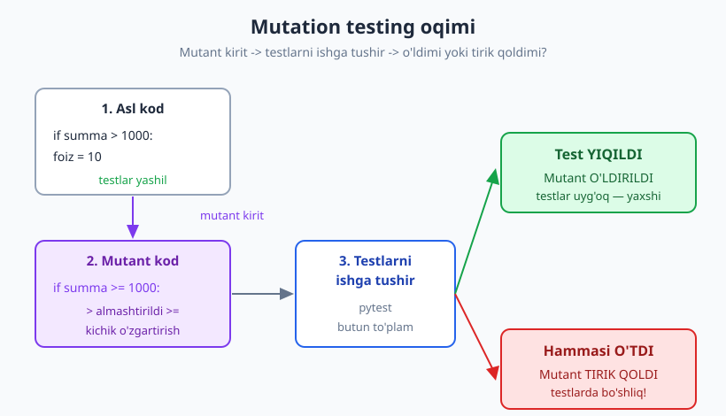
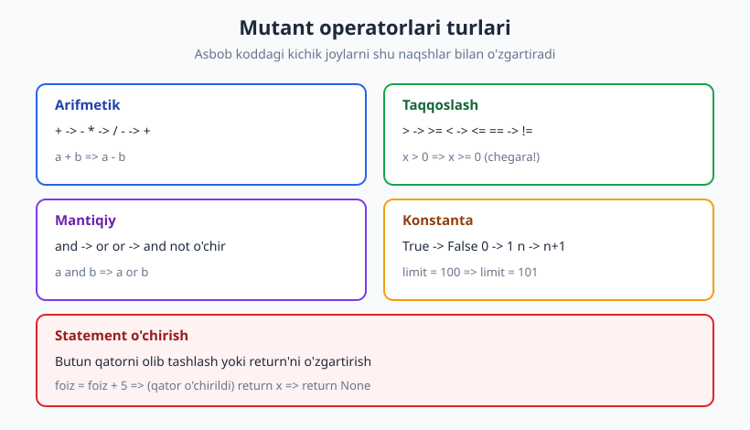
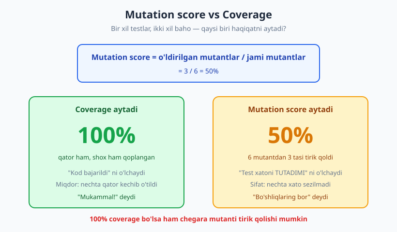

# 22 — Mutation testing

[🏠 README](./README.md) · [⬅️ Oldingi: 21 — Property-based testing](./21-property-based-testing.md) · [Keyingi: 23 — Snapshot va approval testing ➡️](./23-snapshot-approval-testing.md)

---

> **Bu bobda:** mutation testing (mutatsion testlash) — bu **testlaringizning sifatini testlash**
> usuli. Koddagi kichik xatolarni (MUTANT) ataylab kiritamiz va testlar ularni sezadimi, deb tekshiramiz.
> Mutant g'oyasini, **mutation score**ni, mutant operatorlari turlarini va `mutmut` kabi asboblar
> oqimini o'rganamiz. Eng muhimi — bu [20-bobdagi (coverage)](./20-code-coverage.md) "kod bajarildi,
> lekin test xatoni tutadimi?" degan ko'r nuqtani bevosita to'ldiradi.
>
> **Halollik / Eslatma:** mutation testing kuchli, lekin **sehrli emas** — sekin (har mutant uchun
> butun test to'plami qayta ishlaydi) va **ekvivalent mutant** muammosi tufayli 100% score har doim
> imkonsiz/arzimaydi. Buni ochiq ko'ramiz. `mutmut` lokal muhitda o'rnatilmagan bo'lishi mumkin,
> shuning uchun uning g'oyasini **jonli "qo'lda mutatsiya"** bilan ko'rsatamiz: kodga o'z qo'limiz
> bilan mutant kiritamiz, testlarni ishga tushiramiz, natijani ko'ramiz. `mutmut` CLI'ni esa
> KONSEPTUAL tushuntiramiz. Barcha pytest chiqishlari `python -m pytest` (Python 3.14, pytest 9.0.3,
> coverage.py 7.14.1) bilan **haqiqatan ishga tushirib olingan** — failed/passed natijalar to'qib chiqarilmagan.

---

## Muammo: coverage "bajarildi"ni o'lchaydi, "tutildi"ni emas

Bir mexanik ustaxonaga ish so'rab keldi. "Tormozlarni tekshira olasizmi?" deb so'radingiz.
U mashinangizga o'tirdi, har bir pedalga bir marta bosib chiqdi va "bo'ldi, hammasini tekshirdim"
dedi. U **har bir pedalga tegdi** (bu coverage), lekin **tormoz haqiqatan ushlaydimi-yo'qmi**
hech tekshirmadi (bu — yo'qolgan assertion).

[20-bobda](./20-code-coverage.md) ko'rdik: coverage testlaringiz kodning qancha qismini *bajarganini*
o'lchaydi. Lekin u **kodni bajarish** bilan **kodni tekshirish** ni farqlamaydi. Mana o'sha bobdan
eslatma:

```python
# Bu "test" coverage'ni 100% qiladi, lekin HECH NARSANI tekshirmaydi
def test_chegirma_qoplaydi():
    chegirma(2000, 1)   # chaqirildi — qator bajarildi
    # assert YO'Q
```

Coverage uchun bu "ajoyib": kod bajarildi. Lekin agar `chegirma` butunlay noto'g'ri ishlasa ham,
bu test **yashil** bo'ladi. Demak savol tug'iladi:

> **Asosiy savol:** Coverage 80%, 90%, hatto 100% bo'lsa ham — testlarimiz haqiqatan **kuchlimi**?
> Agar kodga xato kirib qolsa, biror test buni **tutarmidi**? Buni qanday bilamiz?

Aynan shu savolga mutation testing javob beradi.

---

## Mutation testing g'oyasi

G'oya hayratlanarli darajada sodda va dadil:

1. Kodga **kichik xato** kiritamiz — buni **mutant** (mutatsiya) deymiz. Masalan `>` ni `>=` ga,
   `+` ni `-` ga, `True` ni `False` ga o'zgartiramiz.
2. **Butun test to'plamini** ishga tushiramiz.
3. Natijani o'qiymiz:
   - Agar biror test **YIQILSA** -> mutant **O'LDIRILDI**. Bu **yaxshi**: testlaringiz uyg'oq,
     ular xatoni sezdi.
   - Agar **barcha test O'TSA** -> mutant **TIRIK QOLDI**. Bu **yomon**: testlaringiz bu xatoni
     sezmadi. Demak shu yerda **bo'shliq** bor.



Mantiq teskari ko'rinadi, lekin chuqur: **agar men kodni buzsam-u, hech bir test buni sezmasa —
demak o'sha testlar boshidan ham hech narsani himoya qilmayotgan edi.** Tirik mutant — bu sizning
test to'plamingizdagi **teshik**ning aniq manzili.

> **Diqqat:** Bu yondashuv testdan emas, **mahsulot kodidan** mutant yasaydi. Mutant — vaqtinchalik:
> tekshirgandan keyin kod asl holiga qaytariladi. Hech qachon mutant kodni commit qilib qo'ymang.

---

## Jonli demo: birinchi mutantni topamiz

Kichik, real funksiyani olamiz — chegirma hisoblovchi. (Bu kod va undan keyingi barcha pytest
chiqishlari haqiqatan ishga tushirib olingan.)

```python
# chegirma.py  (sinaladigan kod)
def chegirma(summa, yil):
    # 1000 dan KATTA xaridlarga 10% chegirma (1000 ning o'zi YO'Q)
    if summa > 1000:
        foiz = 10
    else:
        foiz = 0
    # 3 yildan ko'p mijozga qo'shimcha 5%
    if yil > 3:
        foiz = foiz + 5
    return summa - summa * foiz / 100
```

Boshlang'ich test to'plamimiz — ikkita test:

```python
# test_chegirma.py
from chegirma import chegirma

def test_arzon_xaridda_chegirma_yoq():
    assert chegirma(500, 1) == 500

def test_qimmat_xaridda_10_foiz():
    assert chegirma(2000, 1) == 1800
```

Ishga tushiramiz — yashil:

```text
$ python -m pytest -q
..                                                                       [100%]
2 passed in 0.54s
```

Endi **qo'lda bitta mutant kiritamiz**: `summa > 1000` ni `summa >= 1000` ga o'zgartiramiz.

```python
    if summa >= 1000:   # MUTANT:  >  ->  >=
        foiz = 10
```

Va testlarni qayta ishga tushiramiz:

```text
$ python -m pytest -q
..                                                                       [100%]
2 passed in 0.52s
```

Hammasi **o'tdi**. Demak mutant **TIRIK QOLDI**. Testlarimiz `>` va `>=` o'rtasidagi farqni
**sezmadi**. Bu — real bo'shliq: hech bir testimiz `summa` aynan **1000** bo'lgan holatni
tekshirmaydi. Aslida `summa == 1000` da asl kod chegirma bermasligi kerak (`>`), lekin mutant
beradi (`>=`). Bizning testlar bu xatoni o'tkazib yuboradi.

> **Bu eslatma tanish, to'g'rimi?** Tirik mutantlar ko'pincha **chegara qiymatlari** (boundary)
> bo'yicha topiladi — aynan [05-bobda](./05-assertionlar-test-holatlari.md) gaplashgan chegara
> tahlili. Mutation testing zaif testlarni topishning avtomatik usuli.

---

## Tirik mutantni o'ldiramiz

Tirik mutant — bizga **aniq vazifa** beradi: shu xatoni tutadigan test yozish. Chegara qiymatini
(`summa == 1000`) tekshiruvchi test qo'shamiz:

```python
def test_aynan_1000_chegirma_yoq():
    # chegara: 1000 ning OZI chegirma OLMAYDI (summa > 1000)
    assert chegirma(1000, 1) == 1000
```

Endi **mutant kod** (`>=`) bo'yicha ishga tushiramiz — mutant tutiladimi?

```text
$ python -m pytest -q
>       assert chegirma(1000, 1) == 1000
E       assert 900.0 == 1000
E        +  where 900.0 = chegirma(1000, 1)
...
FAILED test_chegirma.py::test_aynan_1000_chegirma_yoq - assert 900.0 == 1000
1 failed, 2 passed in 0.66s
```

Test **YIQILDI** — mutant **O'LDIRILDI**! Endi muhim qadam: kodni **asl holiga** qaytaramiz (`>`)
va yangi test to'plami asl kodda ham yashil ekanini tasdiqlaymiz (test xato bo'lmasligi shart):

```text
$ python -m pytest -q
...                                                                      [100%]
3 passed in 0.51s
```

Mana shu — mutation testing tsikli: **tirik mutant -> yo'qolgan test holatini topdik -> test
qo'shdik -> mutantni o'ldirdik -> testlarimiz endi kuchliroq.** Coverage hech narsa demadi; mutant
gapirdi.

> **Eslatma:** Yangi test asl kodda **o'tishi**, mutant kodda **yiqilishi** kerak. Agar test asl
> kodda ham yiqilsa — bu test noto'g'ri (xato kutilma yozilgan), mutantni o'ldirgani hisoblanmaydi.

---

## Mutant operatorlari turlari

Asboblar (va biz qo'lda) kodni naqshlar bo'yicha o'zgartiradi. Bu naqshlar **mutant operatorlari**
deyiladi. Asosiy turlari:



| Tur | O'zgartirish | Misol |
|---|---|---|
| **Arifmetik** | `+` -> `-`, `*` -> `/`, `-` -> `+` | `a + b` -> `a - b` |
| **Taqqoslash (relational)** | `>` -> `>=`, `<` -> `<=`, `==` -> `!=` | `x > 0` -> `x >= 0` |
| **Mantiqiy (logical)** | `and` -> `or`, `or` -> `and`, `not` o'chirish | `a and b` -> `a or b` |
| **Konstanta** | `True` -> `False`, `0` -> `1`, son'ni o'zgartirish | `limit = 100` -> `limit = 101` |
| **Statement o'chirish** | butun qatorni olib tashlash, `return`'ni o'zgartirish | `foiz = foiz + 5` -> (o'chirildi) |

Mana bir nechta mutantni bizning `chegirma` kodida sinab ko'raylik (uchta testli to'plam bilan):

```text
Taqqoslash > -> >=               -> O'LDI (failed)
Taqqoslash (yil) > -> >=         -> TIRIK (passed)
Arifmetik return - -> +          -> O'LDI (failed)
Arifmetik + -> -                 -> TIRIK (passed)
Konstanta 1000 -> 1001           -> TIRIK (passed)
Konstanta 10 -> 0                -> O'LDI (failed)
```

Bu — haqiqiy natija (har bir mutant alohida kiritilib, `python -m pytest` ishlatildi). Olti
mutantdan **3 tasi o'ldi, 3 tasi tirik qoldi**. Tirik qolganlar bizga to'g'ridan-to'g'ri aytadi:

- `yil > 3` chegarasi (sodiq mijoz) hech tekshirilmagan — `yil >= 3` mutant tirik.
- `1000 -> 1001` mutant tirik — `summa` 1001 atrofidagi qiymat sinalmagan.
- `foiz = foiz + 5` -> `foiz = foiz - 5` mutant tirik — chunki hech bir test `yil > 3` holatini
  umuman tekshirmaydi, shuning uchun bu qator **bajarilmaydi ham**.

Har bir tirik mutant — yangi test uchun **aniq retsept**.

---

## Mutation score

Sonni rasmiylashtiramiz. **Mutation score** — o'ldirilgan mutantlarning ulushi:

```text
mutation score = o'ldirilgan mutantlar / jami mutantlar
```

Yuqoridagi misolda: `3 / 6 = 50%`. Bu — coverage'dan butunlay boshqa va **kuchliroq** signal.



Endi eng muhim ko'rsatish. Test to'plamimizni **100% coverage** (qator + shox) beradigan qilib
kengaytiramiz — sodiq mijoz holatini ham qo'shamiz:

```python
# test_cov100.py
from chegirma import chegirma
def test_arzon():       assert chegirma(500, 1) == 500
def test_qimmat():      assert chegirma(2000, 1) == 1800
def test_sodiq_mijoz(): assert chegirma(2000, 5) == 1700
```

Coverage o'lchaymiz:

```text
$ python -m pytest test_cov100.py --cov=chegirma --cov-branch --cov-report=term-missing -q
Name          Stmts   Miss Branch BrPart  Cover   Missing
---------------------------------------------------------
chegirma.py       7      0      4      0   100%
---------------------------------------------------------
TOTAL             7      0      4      0   100%
3 passed in 0.61s
```

**100% qator, 100% shox.** Coverage "mukammal" deydi. Endi shu to'plam bilan chegara mutantini
(`>` -> `>=`) sinaymiz:

```text
$ python -m pytest test_cov100.py -q
...                                                                      [100%]
3 passed in 0.54s
```

Mutant **TIRIK QOLDI**. Mana butun bobning yuragi:

> **100% coverage bo'lsa ham mutant tirik qolishi mumkin.** Coverage "har qator/shox bajarildi"ni
> kafolatlaydi, lekin "har qiymat **to'g'ri tekshirildi**"ni emas. Hech bir test `summa == 1000`
> chegarasiga tegmaydi, shuning uchun `>` va `>=` farqi sezilmay qoladi. Mutation score — bu
> bo'shliqni **raqam bilan** ko'rsatadi.

| O'lchov | Nimani aytadi | Kuchi |
|---|---|---|
| **Coverage** | Kod qancha qismi *bajarildi* (miqdor) | Yumshoq signal |
| **Mutation score** | Testlar xatoni qancha qismini *tutadi* (sifat) | Kuchli signal |

---

## Ekvivalent mutant — halol cheklov

Mutation testing'ning eng katta og'rig'i — **ekvivalent mutant**. Bu shunday mutantki, u kodni
o'zgartiradi, lekin **xulqni umuman o'zgartirmaydi**. Demak **hech qanday test uni o'ldira olmaydi**
— chunki o'ldiradigan farq mavjud emas.

Misol ko'raylik:

```python
# absolyut.py
def absolyut(x):
    if x < 0:
        x = -x
    # bu nuqtada x har doim >= 0 (yuqorida manfiyligi to'g'rilandi)
    if x >= 0:
        return x
    return 0
```

`if x >= 0:` ni mutant qilamiz: `if x > 0:`. Testlar bilan ishlatamiz:

```text
$ python -m pytest test_absolyut.py -q
...                                                                      [100%]
3 passed in 0.52s
```

Tirik qoldi. Lekin bu yerda **test qo'shib o'ldirib bo'lmaydi** — chunki mutant asl kod bilan
**aynan bir xil** ishlaydi. `x == 0` bo'lganda: asl kodda `x >= 0` rost -> `return x` (ya'ni 0);
mutantda `x > 0` yolg'on -> `return 0`. Ikkalasi ham **0** qaytaradi. Buni isbotlash uchun barcha
kirishlarni tekshirib chiqdik:

```python
diff = [v for v in range(-1000, 1001) if orig(v) != mut(v)]
print(len(diff))
# -> 0     (farqli kirish YO'Q -> ekvivalent)
```

> **Halol xulosa:** Ekvivalent mutantlar tufayli **100% mutation score deyarli har doim imkonsiz
> yoki arzimaydi**. Ularni qo'lda "tirik, lekin ekvivalent" deb belgilashga to'g'ri keladi — bu
> qo'l mehnati. Shuning uchun maqsad "100% score" emas, balki **score'ni signal sifatida ishlatish**:
> tirik mutantlarni ko'rib chiqish, real bo'shliqlarni topib o'ldirish, ekvivalentlarni e'tiborsiz
> qoldirish. (Bu xuddi [20-bobdagi](./20-code-coverage.md) Goodhart qonuni: o'lchov maqsadga
> aylansa, buziladi.)

---

## Amaliy asboblar va `mutmut` oqimi (konseptual)

Qo'lda mutatsiya — g'oyani tushunish uchun ajoyib, lekin real loyihada yuzlab mutantni qo'lda
kiritib bo'lmaydi. Buni **asboblar** avtomatlashtiradi:

| Til | Asbob |
|---|---|
| **Python** | `mutmut`, `cosmic-ray` |
| **JavaScript / TypeScript** | Stryker |
| **Java** | PIT (Pitest) |
| **PHP** | Infection |

Python'da eng mashhuri — `mutmut`. Uning oqimi (KONSEPTUAL — bu kitob muhitida `mutmut`
o'rnatilmagan, shuning uchun jonli ishlatmadik, faqat tipik buyruq oqimini ko'rsatamiz):

```text
$ pip install mutmut

# kodingiz ustida barcha mutantlarni yaratib, testlarni har biriga ishga tushiradi
$ mutmut run

# tipik xulosa:
# - 6 killed       (o'ldirilgan)
# - 3 survived     (tirik qolgan -> ko'rib chiqish kerak)
# - 1 timeout / suspicious

# tirik qolgan mutantlarni birma-bir ko'rib chiqish:
$ mutmut results
$ mutmut show 3      # 3-mutant qaysi qatorda, qanday o'zgartirilgani (diff)
```

Asbob aynan biz qo'lda qilgan ishni qiladi: mutant kiritadi -> testlarni ishga tushiradi ->
o'ldi/tirik deb belgilaydi. Faqat buni minglab marta avtomatik bajaradi.

> **Trade-off:** Mutation testing **sekin**. Har bir mutant uchun **butun test to'plami** qaytadan
> ishlaydi. Agar kodda 500 mutant va testlar 10 soniya ishlasa — taxminan 500 x 10s = ~80 daqiqa.
> Shuning uchun amaliy qoidalar:
> - Faqat **kritik modullarga** qo'llang (to'lov, hisoblash, biznes mantiqi), butun loyihaga emas.
> - CI'da **tunda** (nightly) yoki haftada bir marta ishga tushiring, har commit'da emas.
> - Asboblar tezlashtirish hiylalarini ishlatadi: faqat o'zgargan kodni mutatsiya qilish, mutantga
>   tegishli testlarni tanlash (coverage ma'lumotidan), parallel ishlatish.

> **Eslatma:** Mutation testing — coverage'ning **o'rnini bosmaydi**, uni **to'ldiradi**. Avval
> coverage bilan "qaysi kod umuman testdan tashqarida" ni topasiz; keyin mutation bilan "qaysi
> qoplangan kod yaxshi tekshirilmagan" ni topasiz. Ikkalasi birga — miqdor + sifat.

---

## Asosiy g'oyalar (bobni qisqacha)

- **Mutation testing testlaringizni testlaydi.** Kodga kichik xato (mutant) kiritib, biror test
  uni tutadimi, deb tekshiradi. Bu [coverage'ning](./20-code-coverage.md) ko'r nuqtasini to'ldiradi.
- **O'ldirilgan mutant — yaxshi, tirik mutant — yomon.** Test yiqilsa mutant o'ldi (testlar uyg'oq);
  hammasi o'tsa mutant tirik (testlarda bo'shliq).
- **Tirik mutant — yo'qolgan test holatining aniq manzili**, ko'pincha [chegara qiymati](./05-assertionlar-test-holatlari.md).
  Uni yangi test bilan o'ldirib, test to'plamini kuchaytirasiz.
- **Mutation score = o'ldirilgan / jami.** Coverage'dan kuchliroq signal: miqdorni emas, **sifatni**
  o'lchaydi.
- **100% coverage bo'lsa ham mutant tirik qolishi mumkin** — buni jonli ko'rdik. Coverage "bajarildi"ni,
  mutation "to'g'ri tekshirildi"ni o'lchaydi.
- **Mutant operatorlari:** arifmetik, taqqoslash, mantiqiy, konstanta, statement o'chirish.
- **Ekvivalent mutant** — xulqni o'zgartirmaydigan mutant; uni o'ldirib bo'lmaydi. Shuning uchun
  100% score odatda imkonsiz/arzimaydi; score'ni maqsad emas, signal sifatida ishlating.
- **Sekin** -> kritik modullarga, CI'da tunda qo'llang. Asboblar: `mutmut`/`cosmic-ray` (Python),
  Stryker (JS), PIT (Java), Infection (PHP).

---

## Mashqlar

### Oson

**1-mashq.** O'z so'zlaringiz bilan ayting: mutant "o'ldirildi" va "tirik qoldi" nimani anglatadi?
Qaysi biri yaxshi va nega?

**2-mashq.** Quyidagi mutant operatorlaridan qaysi tur ekanini ayting: (a) `a * b` -> `a + b`,
(b) `x == 5` -> `x != 5`, (c) `flag = True` -> `flag = False`, (d) `p and q` -> `p or q`.

**3-mashq.** Coverage 100% bo'lsa, mutation score ham avtomat 100% bo'ladimi? Bir jumlada javob
bering va nega ekanini tushuntiring.

### O'rta

**4-mashq.** `kattasi(a, b)` funksiyasi quyidagicha:
```python
def kattasi(a, b):
    if a > b:
        return a
    return b
```
Faqat `assert kattasi(5, 3) == 5` testi bor. `a > b` ni `a >= b` ga mutant qilsak — tirik qoladimi
yoki o'ladimi? Nega? Mutantni o'ldiradigan test qo'shing.

**5-mashq.** `mutmut run` ishlatgandan keyin "10 killed, 4 survived" chiqdi. Mutation score qancha?
Endi navbatdagi qadamingiz nima — to'rtta tirik mutant bilan nima qilasiz?

**6-mashq.** Quyidagi kodda `if soni > 0:` ni `if soni >= 0:` ga mutant qildik:
```python
def ortacha(yigindi, soni):
    if soni > 0:
        return yigindi / soni
    return 0
```
Bu mutant **xavfli** (real xato) bo'lishi mumkinmi? Qaysi test holati uni o'ldiradi?

### Qiyin

**7-mashq.** Ekvivalent mutant nima ekanini tushuntiring va o'zingiz bitta misol o'ylab toping
(kichik funksiya + uni o'zgartirmaydigan mutant). Nega bunday mutantni hech bir test o'ldira olmaydi?

**8-mashq.** Sizning jamoangizda kimdir "biz mutation score 100% ga yetkazamiz" deb maqsad qo'ydi.
Bu maqsadning ikkita jiddiy muammosini ayting (biri ekvivalent mutant, ikkinchisi — [20-bobdagi](./20-code-coverage.md)
Goodhart qonuni bilan bog'liq). Qanday yaxshiroq maqsad taklif qilasiz?

<details markdown="1">
<summary>Yechimlar</summary>

### 1-mashq yechimi
Kodga mutant (kichik xato) kiritamiz va testlarni ishga tushiramiz. **O'ldirildi** — biror test
yiqildi, ya'ni testlar mutantni (xatoni) sezdi. **Tirik qoldi** — barcha test o'tdi, ya'ni testlar
xatoni sezmadi. **O'ldirilgan yaxshi**, chunki u testlaringiz haqiqatan himoya qilayotganini
isbotlaydi; tirik mutant esa test to'plamidagi bo'shliqni ko'rsatadi.

### 2-mashq yechimi
(a) **arifmetik** (`*` -> `+`); (b) **taqqoslash / relational** (`==` -> `!=`); (c) **konstanta**
(`True` -> `False`); (d) **mantiqiy / logical** (`and` -> `or`).

### 3-mashq yechimi
**Yo'q.** Coverage faqat kod *bajarilganini* o'lchaydi, *to'g'ri tekshirilganini* emas. Bobda
jonli ko'rdik: 100% qator + shox coverage bo'lsa ham, chegara mutanti (`>` -> `>=`) tirik qoladi,
chunki hech bir test aynan chegara qiymatiga tegmaydi.

### 4-mashq yechimi
`a > b` -> `a >= b` mutanti **tirik qoladi**. Sababi: yagona test `kattasi(5, 3)` — bu yerda `a != b`,
shuning uchun `>` va `>=` bir xil natija (5) beradi. Farq faqat `a == b` da chiqadi. O'ldiradigan
test:
```python
def test_teng_bolganda():
    assert kattasi(4, 4) == 4   # bu yerda > va >= farq qilmaydi, lekin...
```
Aslida `kattasi(4,4)` da asl `a > b` yolg'on -> `return b` = 4; mutant `a >= b` rost -> `return a` = 4.
Ikkalasi 4 -> bu **ekvivalent** holat! To'g'ri o'ldiruvchi test: agar funksiya qaysi argumentni
qaytarishini farqlay olsak. Bu funksiyada teng qiymatda natija bir xil, demak bu aniq mutant
ekvivalent. Yaxshiroq misol: agar `kattasi` qaysi obyektni qaytarishi muhim bo'lsa (masalan
identifikatori bilan), `a is b` farqi sezilardi. Bu mashq aynan ekvivalent mutant tuzog'ini ko'rsatadi:
ba'zi taqqoslash mutantlari sof qiymat funksiyalarida o'ldirib bo'lmaydi.

### 5-mashq yechimi
Mutation score = `10 / (10 + 4) = 10/14 ≈ 71%`. Keyingi qadam: **to'rtta tirik mutantni birma-bir
ko'rib chiqish** (`mutmut show <id>`). Har biri uchun: (a) bu real bo'shliqmi -> mutantni o'ldiradigan
yangi test yozing; yoki (b) bu **ekvivalent mutant**mi -> "ekvivalent" deb belgilab, e'tiborsiz
qoldiring. Maqsad — raqamni 100% qilish emas, real bo'shliqlarni yopish.

### 6-mashq yechimi
**Ha, juda xavfli.** `soni >= 0` bo'lsa, `soni == 0` da `yigindi / 0` -> `ZeroDivisionError`
(nolga bo'lish xatosi). Asl kod buni `> 0` bilan oldini oladi. O'ldiradigan test:
```python
def test_nol_soni():
    assert ortacha(100, 0) == 0   # mutantda bu ZeroDivisionError beradi -> test yiqiladi -> mutant o'ladi
```
Bu mutation testing'ning kuchi: u nolga bo'lish kabi real, jiddiy xatoni ochib beradigan yo'qolgan
testni topadi.

### 7-mashq yechimi
**Ekvivalent mutant** — kodni o'zgartiradi, lekin xulqni (har qanday kirishda natijani)
o'zgartirmaydi. Shuning uchun mutant va asl kod bir xil ishlaydi -> hech qanday test ular orasidagi
farqni ko'ra olmaydi -> uni o'ldirib bo'lmaydi. Misol:
```python
def x_son(x):
    y = x
    return x * 2      # MUTANT: return y * 2  (y == x bo'lgani uchun aynan bir xil)
```
`y` har doim `x` ga teng, shuning uchun `x * 2` va `y * 2` har qanday kirishda bir xil. Mutant
ekvivalent. (Bobdagi `absolyut` misoli ham xuddi shunday: `x >= 0` -> `x > 0`, chunki bu nuqtada
`x == 0` da ikkala yo'l ham 0 qaytaradi.)

### 8-mashq yechimi
Ikki muammo:
1. **Ekvivalent mutantlar** tufayli 100% odatda **imkonsiz**: ba'zi mutantlar xulqni o'zgartirmaydi,
   ularni o'ldirib bo'lmaydi (faqat qo'lda "ekvivalent" deb belgilash mumkin — bu cheksiz qo'l mehnati).
2. **Goodhart qonuni** ([20-bob](./20-code-coverage.md)): "o'lchov maqsadga aylansa, yaxshi o'lchov
   bo'lishdan to'xtaydi". Odamlar score'ni 100% qilish uchun **mazmunsiz testlar** (har bir mutantni
   formal o'ldiradigan, lekin haqiqiy xatti-harakatni tekshirmaydigan) yozishni boshlaydi — bu xuddi
   coverage'ni quvgandagi assert'siz testlar muammosi.

**Yaxshiroq maqsad:** raqamni emas, **jarayonni** maqsad qiling — "kritik modullarda har bir tirik
mutantni ko'rib chiqamiz: real bo'shliq bo'lsa test qo'shamiz, ekvivalent bo'lsa belgilaymiz".
Score — yo'l-yo'riq, nishon emas.

</details>

---

[🏠 README](./README.md) · [⬅️ Oldingi: 21 — Property-based testing](./21-property-based-testing.md) · [Keyingi: 23 — Snapshot va approval testing ➡️](./23-snapshot-approval-testing.md)
