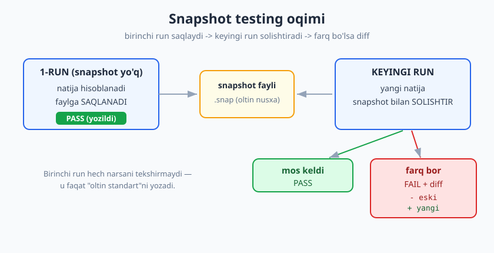
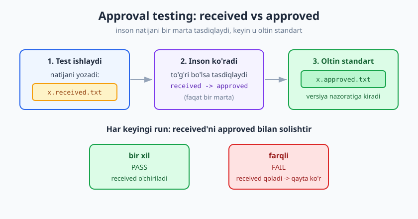
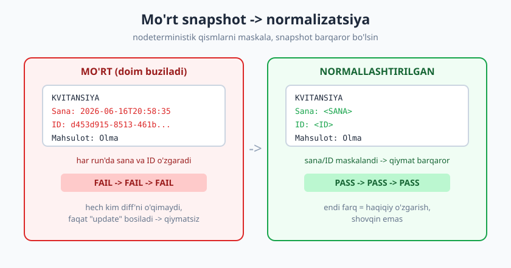

# 23 — Snapshot va approval testing

[🏠 README](./README.md) · [⬅️ Oldingi: 22 — Mutation testing](./22-mutation-testing.md) · [Keyingi: 24 — Flaky testlar va barqarorlik ➡️](./24-flaky-testlar.md)

---

> **Bu bobda:** ba'zi natijalar shu qadar katta yoki murakkab bo'ladiki (HTML sahifa, JSON javob,
> uzun hisobot matni, render qilingan UI, butun ma'lumot strukturasi), har bir maydonni qo'lda
> `assert` qilish charchatadi va mo'rt bo'ladi. **Snapshot testing** va **approval testing** boshqa
> yo'l taklif qiladi: natijani bir marta "tasdiqlab", uni *oltin standart* qilib saqlash va keyin
> har o'zgarishni ko'rish. G'oyani sof Python bilan jonli quramiz: birinchi run snapshot'ni yozadi,
> keyingi run solishtiradi, kod o'zgarsa farq (diff) bilan yiqiladi.
>
> **Halollik / Eslatma:** snapshot testing — kuchli, lekin **eng oson noto'g'ri ishlatiladigan**
> texnika. Mo'rt snapshot, hech kim o'qimaydigan ulkan snapshot va "ko'r-ko'rona update bosish"
> tuzoqlarini ataylab ochib ko'rsatamiz — bu bobning yarmi shu ogohlantirishlar haqida. Bu yerda
> alohida snapshot plagin (`syrupy` kabi) ishlatilmaydi: mexanizmni **sof Python**da modellashtirmiz,
> shunda ichida nima sodir bo'layotgani to'liq ko'rinadi. Barcha namunalar `python -m pytest`
> (Python 3.14, pytest 9.0.3) bilan **haqiqatan ishga tushirib tekshirilgan** — chiqishlar va
> PASS/FAIL holatlari to'qib chiqarilmagan.

---

## Muammo: katta natijani qo'lda tekshirish charchatadi

Tasavvur qiling, funksiyangiz mijozga ketadigan butun savdo hisobotini matn sifatida qaytaradi:
o'nlab qatorlar, ustunlar, jami summa, formatlash. Buni "klassik" usulda testlasangiz:

```python
def test_hisobot_qolda():
    natija = hisobot_yasa(BUYURTMALAR)
    assert "=== SAVDO HISOBOTI ===" in natija
    assert "Olma" in natija
    assert "3600" in natija
    assert "20000" in natija
    assert "JAMI" in natija
    # ... yana 20 ta assert ...
```

Bu yondashuv ikki tomondan og'riydi. Birinchidan, **charchatadi** — har bir maydon uchun alohida
`assert` yozish zerikarli va to'liq emas (oraliqdagi bo'shliqlar, tartib, formatni o'tkazib
yuborasiz). Ikkinchidan, **mo'rt** — hisobot formatiga bitta ustun qo'shsangiz, o'nlab `assert`ni
qayta yozasiz. Va eng yomoni: bu assertlar natijaning *ko'rinishini* emas, faqat ba'zi bo'laklari
*mavjudligini* tekshiradi.

Mana shunday holatlar uchun — **katta, murakkab, "bir butun sifatida to'g'ri ko'rinishi kerak"**
natijalar uchun — snapshot testing tug'ilgan.

---

## Snapshot testing g'oyasi

**Snapshot** (suratga olish, nusxa) testing g'oyasi juda sodda:

1. **Birinchi run:** natijani hisoblang va uni faylga — "snapshot"ga — **saqlang**. Bu run hech
   narsani tekshirmaydi; u shunchaki "oltin standart"ni yozadi.
2. **Keyingi har run:** yangi natijani hisoblang va uni saqlangan snapshot bilan **solishtiring**.
   - Bir xil bo'lsa → **PASS**.
   - Farq bo'lsa → **FAIL**, va aniq farqni (**diff**) ko'rsating.



Bu g'oyani **Jest** (JavaScript test runner) ommalashtirdi: `expect(x).toMatchSnapshot()`. Lekin
g'oya tilga bog'liq emas — uni o'zimiz Python'da yozsak, "sehr" yo'qolib, mexanizm ochiladi.

### Sinaladigan kod: hisobot generatori

```python
# hisobot.py  (sinaladigan kod) -- buyurtmalar bo'yicha matnli hisobot
def hisobot_yasa(buyurtmalar):
    qatorlar = ["=== SAVDO HISOBOTI ==="]
    jami = 0
    for b in buyurtmalar:
        summa = b["narx"] * b["soni"]
        jami += summa
        qatorlar.append(f"{b['mahsulot']:<12} {b['soni']:>3} x {b['narx']:>6} = {summa:>8}")
    qatorlar.append("-" * 33)
    qatorlar.append(f"{'JAMI':<24}{jami:>9}")
    return "\n".join(qatorlar)
```

### Snapshot yordamchisi (sof Python, plaginsiz)

```python
# snapshot.py  -- sof Python snapshot yordamchisi
import os

SNAP_DIR = "__snapshots__"

def tasdiqla(nom, hozirgi, yangilash=False):
    os.makedirs(SNAP_DIR, exist_ok=True)
    yol = os.path.join(SNAP_DIR, nom + ".snap")

    if yangilash or not os.path.exists(yol):
        with open(yol, "w", encoding="utf-8", newline="\n") as f:
            f.write(hozirgi)
        return  # birinchi marta yozildi -> test o'tadi

    with open(yol, encoding="utf-8") as f:
        saqlangan = f.read()

    if hozirgi != saqlangan:
        raise AssertionError(f"Snapshot mos kelmadi: {nom}\n" + farq(saqlangan, hozirgi))

def farq(eski, yangi):
    import difflib
    qatorlar = difflib.unified_diff(
        eski.splitlines(), yangi.splitlines(),
        fromfile="approved", tofile="received", lineterm=""
    )
    return "\n".join(qatorlar)
```

### Test — bitta qator

```python
# test_hisobot.py
import os
from hisobot import hisobot_yasa
from snapshot import tasdiqla

YANGILA = os.environ.get("UPDATE_SNAPSHOTS") == "1"
BUYURTMALAR = [
    {"mahsulot": "Olma", "soni": 3, "narx": 1200},
    {"mahsulot": "Non",  "soni": 5, "narx": 4000},
    {"mahsulot": "Sut",  "soni": 2, "narx": 9500},
]

def test_hisobot_snapshot():
    natija = hisobot_yasa(BUYURTMALAR)
    tasdiqla("savdo_hisoboti", natija, yangilash=YANGILA)
```

E'tibor bering: test tanasida **bitta** assertion bor — `tasdiqla(...)`. 20 ta `assert` o'rniga
bitta qator butun natijani qoplaydi. Mana foydasi.

---

## JONLI demo: saqlash → solishtirish → diff

### 1-run: snapshot yaratiladi

Snapshot fayli hali yo'q, shuning uchun birinchi run uni **yozadi** va o'tadi:

```bash
python -m pytest test_hisobot.py -q
```

```text
.                                                                        [100%]
1 passed in 0.53s
```

Yaratilgan `__snapshots__/savdo_hisoboti.snap` mazmuni:

```text
=== SAVDO HISOBOTI ===
Olma           3 x   1200 =     3600
Non            5 x   4000 =    20000
Sut            2 x   9500 =    19000
---------------------------------
JAMI                        42600
```

> **Diqqat:** Birinchi run **hech narsani tasdiqlamaydi** — u faqat "oltin standart"ni yozadi.
> Demak yangi snapshot yaratilganda, uni inson **o'qib ko'rishi** shart: natija haqiqatan
> to'g'rimi? Aks holda siz noto'g'ri natijani "etalon" deb muhrlab qo'yasiz.

### 2-run: saqlangan snapshot bilan solishtiriladi

Endi snapshot mavjud. Kod o'zgarmagani uchun natija bir xil → PASS:

```text
.                                                                        [100%]
1 passed in 0.54s
```

### Kodni o'zgartiramiz → FAIL + diff

Endi hisobotda `JAMI` ni `JAMI (soum)` ga o'zgartiramiz (formatlash o'zgarishi). Yangi natija
saqlangan snapshot'ga mos kelmaydi:

```text
================================== FAILURES ===================================
____________________________ test_hisobot_snapshot ____________________________
E   AssertionError: Snapshot mos kelmadi: savdo_hisoboti
E   --- approved
E   +++ received
E   @@ -3,4 +3,4 @@
E    Non            5 x   4000 =    20000
E    Sut            2 x   9500 =    19000
E    ---------------------------------
E   -JAMI                        42600
E   +JAMI (soum)                 42600
=========================== short test summary info ===========================
FAILED test_hisobot.py::test_hisobot_snapshot - AssertionError: Snapshot mos ...
1 failed in 0.74s
```

Mana snapshot testing'ning kuchi: bitta assertion butun natijadagi **har qanday** o'zgarishni
tutdi va aynan qaysi qator o'zgarganini (`-JAMI` → `+JAMI (soum)`) diff bilan ko'rsatdi. Biz buni
oldindan "JAMI qatori o'zgarishi mumkin" deb bashorat qilib `assert` yozmagandik.

---

## Snapshot YANGILASH oqimi va uning xavfi

Yuqoridagi FAIL ikki narsadan biri bo'lishi mumkin:

- **Regressiya** (kutilmagan buzilish) — diff sizga xatoni ko'rsatdi, koddagi xatoni tuzating.
- **Ataylab o'zgarish** — siz formatni *bila turib* o'zgartirdingiz; endi snapshot eskirdi va uni
  **yangilash** kerak.

Ataylab o'zgarish bo'lsa, snapshot'ni yangilaymiz. Bizning yordamchimizda buni `UPDATE_SNAPSHOTS`
muhit o'zgaruvchisi boshqaradi (Jest'da bu `--ci`/`-u`, `syrupy`'da `--snapshot-update`):

```bash
# faqat ataylab o'zgarishdan keyin:
UPDATE_SNAPSHOTS=1 python -m pytest test_hisobot.py -q
```

```text
.                                                                        [100%]
1 passed in 0.54s
```

Endi snapshot `JAMI (soum)` ni o'z ichiga oladi va keyingi oddiy run yana PASS bo'ladi:

```text
.                                                                        [100%]
1 passed in 0.54s
```

> **Diqqat — eng katta tuzoq:** Snapshot yangilash juda oson — bitta bayroq. Aynan shuning uchun u
> xavfli. **Ko'r-ko'rona yangilash** (diff'ni o'qimasdan `-u` bosish) snapshot testing'ning eng
> keng tarqalgan o'limi: test FAIL bo'ladi → dasturchi diff'ni o'qimay update bosadi → endi snapshot
> *buzilgan* natijani "etalon" qilib oladi → test yana yashil, lekin xato kodga muhrlanib qoldi.
> Snapshot test faqat **har FAIL'da diff'ni odam o'qisa** qiymatga ega.

---

## Approval testing: received vs approved

**Approval testing** (tasdiqlash testi; Llewellyn Falco, **ApprovalTests** kutubxonalari) —
snapshot bilan deyarli bir xil g'oya, lekin "inson tasdiqlaydi" qadamiga ochiq urg'u beradi.
**Golden Master** (oltin nusxa) deb ham ataladi. Ikki fayl ishlatiladi:

- **received** (`x.received.txt`) — testning hozirgi chiqishi (har run'da qayta yoziladi).
- **approved** (`x.approved.txt`) — inson bir marta ko'rib **tasdiqlagan** etalon (versiya
  nazoratiga kiritiladi).

Test received'ni approved bilan solishtiradi. Mos kelsa — o'tadi (va received o'chiriladi). Farq
bo'lsa — yiqiladi va ikkala fayl qoladi, shunda inson farqni ko'rib, to'g'ri bo'lsa received'ni
yangi approved qilib "tasdiqlaydi".



```python
# approval.py  -- received vs approved
import os

def tekshir(nom, hozirgi):
    received = nom + ".received.txt"
    approved = nom + ".approved.txt"

    with open(received, "w", encoding="utf-8", newline="\n") as f:
        f.write(hozirgi)

    if not os.path.exists(approved):
        raise AssertionError(
            f"'{approved}' yo'q. Natijani ko'rib chiqing va tasdiqlang:\n"
            f"  ren {received} {approved}"
        )

    with open(approved, encoding="utf-8") as f:
        kutilgan = f.read()

    if hozirgi != kutilgan:
        raise AssertionError(f"received != approved ({nom}). Farqni ko'rib tasdiqlang.")

    os.remove(received)  # mos keldi -> received kerak emas
```

### JONLI demo: tasdiqlash qadami

Birinchi run: `approved` hali yo'q, shuning uchun test **yiqiladi** va `received` faylni qoldiradi —
chunki "hech kim hali tasdiqlamagan":

```text
E   AssertionError: 'hisobot_approval.approved.txt' yo'q. Natijani ko'rib chiqing va tasdiqlang:
E     ren hisobot_approval.received.txt hisobot_approval.approved.txt
1 failed in 0.75s
```

Endi inson `received` faylni **ko'zdan kechiradi** va to'g'ri bo'lsa uni `approved` qiladi (oddiy
fayl nomini o'zgartirish). Shundan keyin test o'tadi va `received` o'chiriladi:

```text
.                                                                        [100%]
1 passed in 0.60s
```

> **Eslatma:** Snapshot vs approval — bu ikki *nom*dan ko'ra ko'proq bir *spektr*. Jest snapshot
> "tasdiqlash"ni `-u` bayrog'iga bog'laydi (yashirin); approval testing "received → approved"ni
> ataylab **ko'rinadigan, qo'lda** qadam qiladi. Maqsad bitta: natijani inson bir marta tasdiqlaydi,
> keyin har og'ish ko'rinadi.

---

## TUZOQLAR (halol bo'laylik)

Snapshot testing yengil ko'rinadi, shuning uchun ko'p ishlatiladi va ko'p **noto'g'ri** ishlatiladi.
Mana eng muhim uch tuzoq.

### Tuzoq 1: Mo'rt snapshot (nodeterministik element)

Agar natijada **har run'da o'zgaradigan** qism bo'lsa — sana, vaqt, tasodifiy ID, lug'at tartibi
([09-bob](./09-bogliqliklarni-izolyatsiya.md)) — snapshot **doim** buziladi, hatto kod o'zgarmagan
bo'lsa ham. Mana kvitansiya, har safar yangi sana va UUID hosil qiladi:

```python
# kvitansiya.py
import datetime, uuid

def kvitansiya(mahsulot, narx):
    sana = datetime.datetime.now().isoformat()
    tranzaksiya_id = str(uuid.uuid4())
    return f"KVITANSIYA\nSana: {sana}\nID: {tranzaksiya_id}\nMahsulot: {mahsulot}\nNarx: {narx}\n"
```

Birinchi run snapshot yaratadi va o'tadi. Lekin **xuddi shu testni** ikkinchi marta ishlatsangiz —
kod o'zgarmagani holda — yiqiladi:

```text
E   AssertionError: Snapshot mos kelmadi: kvitansiya_mort
E   --- approved
E   +++ received
E   @@ -1,5 +1,5 @@
E    KVITANSIYA
E   -Sana: 2026-06-16T20:58:35.023350
E   -ID: d453d915-8513-461b-b789-38350cb8a08b
E   +Sana: 2026-06-16T20:58:37.406212
E   +ID: 96ce264d-5132-49b7-8327-fd57d346644c
E    Mahsulot: Olma
E    Narx: 1200
1 failed in 0.72s
```

Bu — eng badbo'y holat: test goh o'tadi, goh yiqiladi, hech qanday haqiqiy sabab yo'q. Bu aslida
**flaky test** ([24-bob](./24-flaky-testlar.md)), va u snapshot'larga ishonchni o'ldiradi —
dasturchilar "yana o'sha sana" deb diff'ni o'qimay update bosa boshlaydi.

#### Yechim: normalizatsiya (maskalash)

Snapshotdan oldin nodeterministik qismlarni **barqaror joy egasi** bilan almashtiramiz:

```python
# test_kvitansiya_normal.py
import os, re
from kvitansiya import kvitansiya
from snapshot import tasdiqla

YANGILA = os.environ.get("UPDATE_SNAPSHOTS") == "1"

def normalizatsiya(matn):
    matn = re.sub(r"Sana: .*", "Sana: <SANA>", matn)
    matn = re.sub(r"ID: [0-9a-f-]+", "ID: <ID>", matn)
    return matn

def test_kvitansiya_normal():
    natija = normalizatsiya(kvitansiya("Olma", 1200))
    tasdiqla("kvitansiya_normal", natija, yangilash=YANGILA)
```

Endi saqlangan snapshot barqaror:

```text
KVITANSIYA
Sana: <SANA>
ID: <ID>
Mahsulot: Olma
Narx: 1200
```

Va testni necha marta ishlatsangiz ham — **doim PASS**:

```text
1 passed in 0.63s   (A-run, snapshot yaratildi)
1 passed in 0.55s   (B-run)
1 passed in 0.55s   (C-run)
```



> **Trade-off:** Normalizatsiya snapshot'ni barqaror qiladi, lekin maskalangan qismni endi test
> **tekshirmaydi**. Sana formatining o'zi to'g'rimi yoki ID haqiqatan UUIDmi — buni alohida,
> niyatli `assert` bilan tekshiring. Eng yaxshisi esa — nodeterministik manbani test paytida
> *boshqarish* (vaqtni `freezegun` bilan muzlatish, ID generatorini inject qilish — [09-bob](./09-bogliqliklarni-izolyatsiya.md)), shunda maskalash umuman kerak bo'lmaydi.

### Tuzoq 2: Hech kim o'qimaydigan ulkan snapshot

500 qatorli HTML yoki katta JSON snapshot'ini hech kim diff'da diqqat bilan o'qimaydi. FAIL
bo'lganda dasturchi shunchaki update bosadi. Bunday snapshot **qiymatsiz** — u xatoni tutadi
deb o'ylaysiz, aslida hech kim diff'ga qaramaydi. Yechim: snapshot'ni **kichik va fokuslangan**
qiling — butun sahifa o'rniga faqat ahamiyatli bo'lakni snapshot qiling, qolganini oddiy
assert qiling.

### Tuzoq 3: Snapshot niyatni ko'rsatmaydi

Oddiy `assert yakuniy_narx == 400` o'qiganga **niyatni** aytadi: "VIP mijoz 500 lik buyurtmaga
400 to'laydi". Snapshot esa faqat "natija o'zgarmasin" deydi — *nima uchun* shunday bo'lishi
kerakligini hujjatlamaydi. Demak snapshot — yaxshi **regressiya** to'ri, lekin yomon
**spetsifikatsiya**.

| Holat | Snapshot/approval | Oddiy `assert` |
|---|---|---|
| Katta/murakkab natija (HTML, JSON, hisobot) | ✅ ideal | ❌ charchatadi |
| Kichik, aniq mantiq (`narx == 400`) | ❌ niyatni yashiradi | ✅ aniq |
| Nodeterministik chiqish | ⚠️ normalizatsiya shart | bog'liqlikni izolyatsiya qil |
| Niyatni hujjatlash | ❌ "o'zgarmasin" dan boshqa hech narsa | ✅ kutilgan qiymatni aytadi |

---

## Qachon foydali — va qachon yomon

**Foydali:**

- **Characterization (tavsiflovchi) test** — eski (legacy) kodning *hozirgi xatti-harakatini*
  muzlatib, refactoring xavfsizligini ta'minlash ([13-bob](./13-refactoring-va-testlar.md),
  [29-bob](./29-legacy-kodni-testlash.md)). Kodni tushunmasangiz ham, "chiqishi shu" deb snapshot
  olib, keyin xavfsiz qayta yozasiz.
- **Regressiya** — UI render, hisobot matni, API javob **shakli**, serializatsiya formati. "Hech
  narsa kutilmaganda o'zgarmasin" uchun.
- **Refactoring xavfsizligi** — ichki tuzilishni o'zgartirayotganda tashqi natija o'zgarmasligini
  arzon nazorat qilish.

**Yomon:**

- **Kichik, aniq mantiq** — `assert chegirma(100) == 80` snapshot'dan har doim yaxshiroq: niyatni
  ko'rsatadi, mo'rt emas, diff o'qishga muhtoj emas.
- **Hech kim ko'rmaydigan ulkan natija** — qiymatsiz "update tugmasi" testiga aylanadi.
- **Nodeterministik chiqish normalizatsiyasiz** — flaky test fabrikasi.

> **Til-mustaqillik:** g'oya hamma joyda bir xil. JavaScript'da **Jest**/**Vitest**
> (`toMatchSnapshot`, inline snapshot), Python'da **`syrupy`** plagini (`pip install syrupy`,
> `assert ... == snapshot`), ko'p tilda (Java, C#, PHP, JS, ...) **ApprovalTests**
> (`Approvals.verify(...)`). Atama va asbob o'zgaradi — birinchi-run-saqla, keyingi-run-solishtir,
> inson-tasdiqlaydi mexanizmi o'sha.

---

## Asosiy g'oyalar (bobni qisqacha)

- **Snapshot testing** = katta/murakkab natijani bir butun sifatida testlash: birinchi run faylga
  saqlaydi, keyingi run solishtiradi, farq bo'lsa diff bilan yiqiladi. Bitta assertion butun
  natijani qoplaydi.
- **Birinchi run hech narsani tekshirmaydi** — u faqat "oltin standart"ni yozadi; yangi snapshot'ni
  inson o'qib ko'rishi shart.
- **Approval testing / golden master** — bir xil g'oya, "inson tasdiqlaydi" qadamini ochiq qiladi:
  `received` (hozirgi chiqish) vs `approved` (tasdiqlangan etalon).
- **Snapshot yangilash (`-u` / `--snapshot-update`) — eng katta tuzoq.** "Ko'r-ko'rona update":
  diff'ni o'qimay tasdiqlash xato natijani etalon qilib muhrlaydi. Snapshot faqat har FAIL'da odam
  diff'ni o'qisa qiymatga ega.
- **Mo'rt snapshot** — sana/ID/tartib kabi nodeterministik element snapshot'ni doim buzadi
  (flaky). Yechim: **normalizatsiya/maskalash** yoki manbani izolyatsiya (09-bob).
- **Ulkan snapshot** — hech kim o'qimaydi, faqat update bosiladi → qiymatsiz. Kichik va fokuslangan
  saqlang.
- **Snapshot niyatni ko'rsatmaydi** — "o'zgarmasin" deydi, "nima uchun shunday" demaydi. Yaxshi
  regressiya to'ri, yomon spetsifikatsiya.
- **Qachon:** characterization/regressiya/refactoring uchun a'lo; kichik aniq mantiq uchun oddiy
  `assert` har doim afzal.

---

## Mashqlar

### Oson

**1-mashq.** Snapshot testing'ning ikki bosqichini (birinchi run va keyingi run) o'z so'zlaringiz
bilan tushuntiring. Birinchi run nima uchun "hech narsani tekshirmaydi"?

**2-mashq.** Approval testing'da `received` va `approved` fayllar nima vazifa bajaradi? Inson
"tasdiqlash" qachon va qanday sodir bo'ladi?

**3-mashq.** "Ko'r-ko'rona snapshot yangilash" (blind update) nima va u nima uchun xavfli? Bir
jumlada ayting.

### O'rta

**4-mashq.** Quyidagi funksiya snapshot test uchun **mo'rt** bo'ladi. Nima uchun? Uni snapshot'ga
yaroqli qilish uchun ikki yo'lni ayting.

```python
import time
def loglar():
    return f"[{time.time()}] tizim ishga tushdi"
```

**5-mashq.** Qachon snapshot testing oddiy `assert` dan **yomonroq**? Kamida ikkita holat keltiring
va har biri uchun sabab ayting.

**6-mashq.** Sizga 800 qatorli HTML sahifa qaytaradigan funksiya berildi va undagi *narx* va *jami*
to'g'ri ko'rsatilishini testlash kerak. To'g'ridan-to'g'ri butun HTML'ni snapshot qilish nima uchun
yomon g'oya? Yaxshiroq yondashuvni taklif qiling.

### Qiyin

**7-mashq.** Snapshot testing va mutation testing ([22-bob](./22-mutation-testing.md)) bir-birini
qanday to'ldiradi yoki ziddiyatga keladi? Xususan: `assert`siz oddiy testdan farqli o'laroq,
snapshot test mutatsiyani tutadimi? Mulohaza yuriting.

**8-mashq.** Bizning `snapshot.py` yordamchimizda birinchi run **avtomatik** snapshot yaratadi va
o'tadi (`not os.path.exists(yol)` → yoz, PASS). Approval'dagi `approval.py` esa `approved` yo'q
bo'lsa **yiqiladi**. Qaysi xatti-harakat xavfsizroq va nima uchun? CI (continuous integration)
muhitida qaysi biri afzal — asoslang.

<details markdown="1">
<summary>Yechimlar</summary>

### 1-mashq yechimi

**Birinchi run:** snapshot fayli hali yo'q, shuning uchun yordamchi natijani hisoblab faylga
**saqlaydi** va testni o'tkazadi. Bu run hech narsani solishtirmaydi — solishtiradigan etalon
yo'q. **Keyingi run:** etalon endi bor, shuning uchun yangi natija saqlangani bilan
**solishtiriladi**; bir xil bo'lsa PASS, farq bo'lsa diff bilan FAIL. Birinchi run "tekshirmaydi"
deyiladi, chunki u faqat oltin standartni o'rnatadi — natija to'g'rimi yo'qmi, buni inson o'zi
o'qib aniqlashi kerak.

### 2-mashq yechimi

- **`received`** — testning *hozirgi* chiqishi, har run'da qayta yoziladi.
- **`approved`** — inson bir marta ko'rib **tasdiqlagan** etalon; versiya nazoratiga kiritiladi.

Test received'ni approved bilan solishtiradi. Inson "tasdiqlash" — `approved` fayl yo'q bo'lganda
yoki diff to'g'ri bo'lganda sodir bo'ladi: inson received'ni ko'zdan kechiradi va to'g'ri bo'lsa
uni `approved` qilib (fayl nomini o'zgartirib) muhrlaydi. Shundan keyin testning o'zi solishtirishni
avtomat bajaradi.

### 3-mashq yechimi

Ko'r-ko'rona yangilash — test FAIL bo'lganda diff'ni **o'qimasdan** snapshot'ni yangilash
(`-u` bosish). Bu xavfli, chunki agar FAIL haqiqiy xato (regressiya) tufayli bo'lsa, siz xato
natijani yangi "etalon" qilib muhrlaysiz — test yana yashil bo'ladi-yu, bug snapshot ichida abadiy
yashirinib qoladi.

### 4-mashq yechimi

U mo'rt, chunki `time.time()` **har chaqirilganda boshqa qiymat** qaytaradi — natija
nodeterministik, shuning uchun snapshot har run'da buziladi (kod o'zgarmasa ham). Ikki yo'l:

1. **Normalizatsiya/maskalash:** snapshotdan oldin vaqt tamg'asini barqaror joy egasi bilan
   almashtirish, masalan `re.sub(r"\[[\d.]+\]", "[<VAQT>]", natija)`.
2. **Manbani izolyatsiya:** vaqtni test paytida boshqarish — `freezegun` bilan muzlatish yoki
   vaqt funksiyasini parametr/bog'liqlik sifatida inject qilish ([09-bob](./09-bogliqliklarni-izolyatsiya.md)). Bu afzalroq, chunki keyin maskalash kerak bo'lmaydi va vaqt formatining o'zi ham tekshiriladi.

### 5-mashq yechimi

1. **Kichik, aniq mantiq.** `assert chegirma(100) == 80` — niyatni ochiq ko'rsatadi, mo'rt emas,
   diff o'qishga muhtoj emas. Snapshot bu yerda faqat "o'zgarmasin" deydi va niyatni yashiradi.
2. **Nodeterministik chiqish (normalizatsiyasiz).** Snapshot doim buziladi → flaky test → ishonch
   yo'qoladi. Bunday holatda manbani izolyatsiya qilib oddiy assert yozish toza.
3. (qo'shimcha) **Hech kim o'qimaydigan ulkan natija** — snapshot qiymatsiz "update tugmasi"
   testiga aylanadi.

### 6-mashq yechimi

800 qatorli HTML'ni to'liq snapshot qilish yomon, chunki: (a) FAIL bo'lganda hech kim 800 qatorli
diff'ni diqqat bilan o'qimaydi — shunchaki update bosiladi, demak test qiymatsiz; (b) HTML'dagi
har qanday begona o'zgarish (bo'shliq, atribut tartibi, sana) testni buzadi — mo'rt. Yaxshiroq:
HTML'dan faqat **ahamiyatli bo'laklarni ajratib oling** (masalan narx va jami elementlarini
selektor bilan) va ularni **oddiy `assert`** bilan tekshiring:
`assert parse(html).select_one("#jami").text == "42600"`. Yoki kichik, normalizatsiyalangan
qism-snapshot oling. Niyat (narx va jami to'g'ri) aniq, test barqaror bo'ladi.

### 7-mashq yechimi

Ular bir-birini to'ldiradi. `assert`siz oddiy test mutatsiyani **tuta olmaydi** (kodni chaqiradi,
lekin natijani tekshirmaydi — coverage 100% bo'lsa ham mutant tirik qoladi). Snapshot test esa
**butun natijani** saqlangan etalon bilan solishtiradi, shuning uchun u kodga kiritilgan mutatsiya
chiqishni o'zgartirsa, snapshot mos kelmaydi va test **yiqiladi** — ya'ni mutantni o'ldiradi.
Demak snapshot test (assertsiz testdan farqli) haqiqiy assertion'ga ega va mutatsiyalarni tutadi.
Ziddiyat: agar snapshot **mo'rt** bo'lsa yoki odam diff'ni o'qimay doim update bossa, u amalda
"assertsiz"ga aylanadi — mutatsiya chiqishni o'zgartiradi, lekin keyingi update uni qabul qiladi,
mutant tirik qoladi. Demak snapshot test mutatsiyani faqat **intizomli ishlatilganda** (mo'rt
emas + diff o'qiladi) tutadi.

### 8-mashq yechimi

**Approval'ning xatti-harakati (etalon yo'q → FAIL) xavfsizroq.** Sabab: u inson tasdiqlash qadamini
**majburiy** qiladi — etalon bo'lmaguncha test o'tmaydi, demak hech qachon "ko'rilmagan" natija
sukut bo'yicha qonuniylashmaydi. Bizning snapshot yordamchimiz esa birinchi run'da jimgina yozib,
o'tib ketadi — agar dasturchi yangi snapshot'ni o'qib ko'rmasa, **noto'g'ri natija avtomatik
etalon bo'lib qoladi**.

CI muhitida bu farq juda muhim. CI'da snapshot/approval testlar hech qachon **avtomatik
yaratilmasligi** kerak: yangi etalon faqat dasturchi lokal mashinasida ataylab yaratib, ko'rib,
commit qilishi shart. Shuning uchun CI'da approval'cha "etalon yo'q → FAIL" to'g'ri xulq — u
"birovning ko'rib commit qilmagan snapshot'i" yashirincha qonuniylashishining oldini oladi.
(`syrupy` ham `--snapshot-update`siz CI'da yangi snapshot yaratmaydi, balki yiqiladi — xuddi
shu sabab.)

</details>

---

[🏠 README](./README.md) · [⬅️ Oldingi: 22 — Mutation testing](./22-mutation-testing.md) · [Keyingi: 24 — Flaky testlar va barqarorlik ➡️](./24-flaky-testlar.md)
