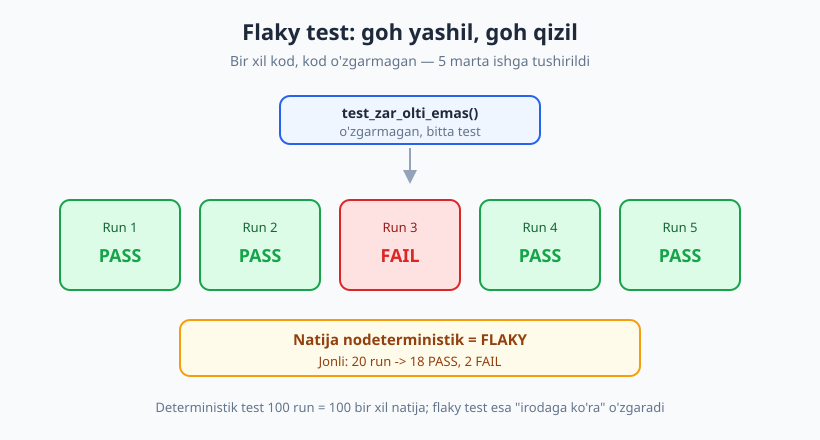
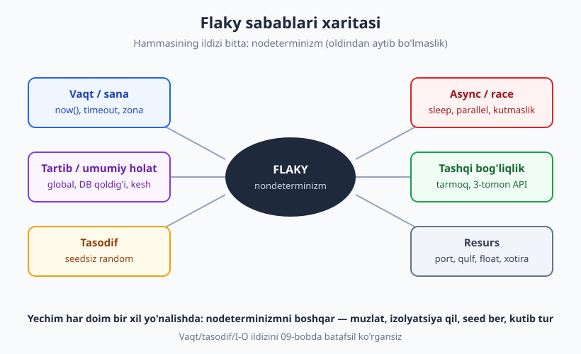
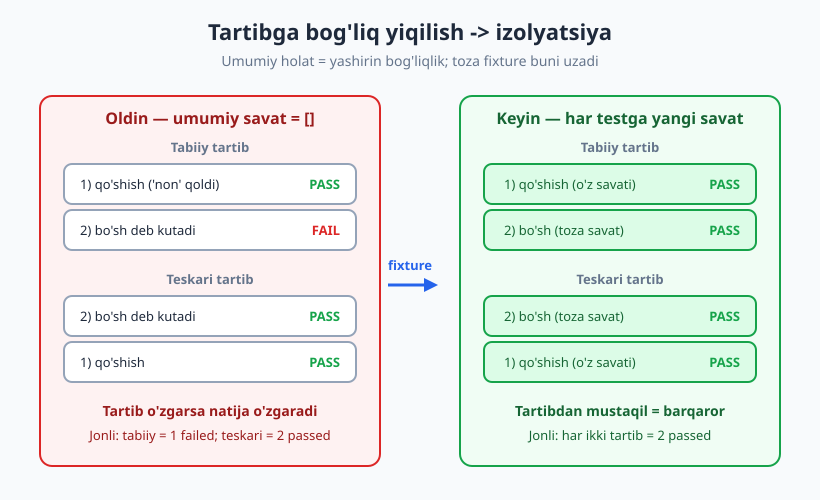

# 24 — Flaky testlar va barqarorlik

[🏠 README](./README.md) · [⬅️ Oldingi: 23 — Snapshot va approval testing](./23-snapshot-approval-testing.md) · [Keyingi: 25 — Performance, yuk va stress testlar ➡️](./25-performance-yuk-testlari.md)

---

> **Bu bobda:** "goh o'tadigan, goh yiqiladigan" — **flaky** testlarni o'rganamiz. Bu testlash amaliyotidagi eng katta kundalik dard: kod o'zgarmagan bo'lsa ham test goh yashil, goh qizil bo'ladi. Nega bu xavfli ("yana flaky-da" deb haqiqiy xatolarni ham e'tiborsiz qoldirish), uning olti asosiy sababi, flaky'ni qanday **topish** (ko'p marta va turli tartibda ishga tushirish) va har bir sabab uchun qanday **tuzatish**ni ko'ramiz. Oxirida — halol boshqaruv strategiyasi: karantin, retry va "flaky budjeti".
>
> **Halollik / Eslatma:** vaqt, tasodif va lokal I/O izolyatsiyasini [09-bob](./09-bogliqliklarni-izolyatsiya.md)da batafsil ko'rgansiz; bu bob ularni flaky nuqtai nazaridan jamlaydi va **tartib/umumiy holat**, **async/race** hamda **resurs** kabi qolgan sabablarga chuqurroq kiradi. Retry'ni (`pytest-rerunfailures`) konseptual ko'ramiz — u sababni **yashiradi**, davo emas. Hamma Python namunalari haqiqatan ishga tushirib tekshirilgan (Python 3.14, `pytest` 9.0.3); flaky misollar **bir necha marta** ishga tushirilib, aralash natija jonli ko'rsatilgan.

---

## Flaky test nima va nega u shunchalik xavfli

Tasavvur qiling: mashinangizning ogohlantirish chirog'i tasodifan yonadi — goh dvigatel sog'lom bo'lsa ham yonadi, goh haqiqiy nosozlikda yonmaydi. Bir-ikki hafta o'tib, siz bu chiroqqa **umuman ishonmay** qo'yasiz: "yana o'zicha yonibdi-da" deb e'tiborsiz qoldirasiz. Va aynan o'sha kuni dvigatel haqiqatan buziladi — chunki siz ogohlantirishni "shovqin" deb hisoblab qo'ygansiz.

**Flaky test** — aynan o'sha ishonchsiz chiroq. Ta'rifi sodda: **bir xil kodda, kod o'zgarmagan bo'lsa ham, goh PASS, goh FAIL beradigan test.** Uning natijasi **nodeterministik** — ya'ni faqat kodga emas, balki vaqt, tartib, tasodif yoki tashqi muhit kabi nazoratdan tashqaridagi narsalarga bog'liq.



Deterministik (sog'lom) test 1000 marta ishga tushirilsa, 1000 ta **bir xil** natija beradi. Flaky test esa "irodaga ko'ra" o'zgaradi.

### Nega flaky test oddiy yiqilgan testdan ham yomonroq

Yiqilgan test — yomon xabar, lekin **halol** xabar: nimadir buzilgan, tuzating. Flaky test esa **ishonchni o'ldiradi**, va bu ancha jiddiy zarar:

- **"Cry wolf" effekti.** Jamoa flaky testga ko'nikadi: qizil bo'lsa, "qayta ishga tushir, o'tib ketadi" deyiladi. Natijada bir kuni **haqiqiy** regressiya ham qizil bo'lganda, hech kim e'tibor bermaydi — uni ham "yana flaky" deb o'tkazib yuboradi. Test to'plamining butun maqsadi — ishonchli signal berish — yo'qoladi.
- **CI'ni bloklaydi va sekinlashtiradi.** Flaky test tufayli yashil bo'lishi kerak bo'lgan pull request qizil bo'ladi; dasturchi "qayta ishga tushir" tugmasini bosadi, kutadi, vaqt yo'qoladi. Katta jamoalarda bu kuniga soatlab samarasiz vaqt.
- **Yashirin xato bo'lishi mumkin.** Ba'zan flaky test aslida **haqiqiy nuqsonni** ko'rsatadi (masalan race condition mahsulot kodida ham bor). Uni "shunchaki flaky" deb e'tiborsiz qoldirish — real bug'ni ko'mish.

> **Diqqat:** flaky testga eng yomon javob — uni shunchaki **o'chirib qo'yish**. O'chirilgan test 0% qamrov, lekin yashil ko'rinadi — ya'ni siz xato signalni "muammo yo'q" signaliga aylantirasiz. Buni hech qachon qilmang. To'g'ri yo'l — sababni topib tuzatish yoki vaqtincha **karantin**ga olish (pastda).

> **Til-mustaqil:** "flaky" atamasi va muammosi hamma ekotizimda bir xil. JS/Jest, Java/JUnit, Go, C# — barchasida flaky testlar bor va sabablari deyarli aynan: vaqt, tartib, tasodif, async, tashqi servis, resurs. Yechim falsafasi ham bir xil: **nodeterminizmni boshqarish**.

---

## Flaky'ning olti asosiy sababi

Flaky'ning yuzta turli ko'rinishi bor, lekin ildizi har doim bitta: **nodeterminizm** — testning natijasi siz to'liq nazorat qilmaydigan narsaga bog'liq. Bu nodeterminizm oltita asosiy eshikdan kiradi.



| # | Sabab | Tipik belgi | Tuzatish yo'nalishi | Batafsil bob |
|---|---|---|---|---|
| 1 | **Vaqt / sana** | yarim tunda yoki boshqa zonada yiqiladi | vaqtni muzlat/inject | [09-bob](./09-bogliqliklarni-izolyatsiya.md) |
| 2 | **Tartib / umumiy holat** | yolg'iz o'tadi, to'plamda yiqiladi (yoki aksincha) | holatni izolyatsiya qil (fixture) | [04-bob](./04-yaxshi-test-xossalari.md) |
| 3 | **Tasodif** | "ba'zan" yiqiladi, sababsiz | seed ber | [09-bob](./09-bogliqliklarni-izolyatsiya.md) |
| 4 | **Async / race** | tez mashinada o'tadi, sekin/CI'da yiqiladi | explicit wait (sleep emas) | [19-bob](./19-e2e-ui-testlar.md) |
| 5 | **Tashqi bog'liqlik** | internetsiz yoki API tushganda yiqiladi | dublyor qil (mock) | [07-bob](./07-test-dublyorlari-nazariya.md) |
| 6 | **Resurs** | parallel ishlaganda yiqiladi | izolyatsiya, tolerantlik | [05-bob](./05-assertionlar-test-holatlari.md) |

Endi har birini ko'ramiz — jonli misol bilan.

### 1. Vaqt va sana

Vaqt — eng keng tarqalgan sabab. `datetime.now()`, `time.time()`, timeout, vaqt zonasi, "ertaga hisoboti" kabi mantiq testni ishga tushgan **soatga** bog'lab qo'yadi. Klassik misol: faqat yarim tunga yaqin yiqiladigan test (kunlar farqi sakraydi), yoki boshqa vaqt zonasidagi CI serverida yiqiladigan test.

Bu mavzuni [09-bob](./09-bogliqliklarni-izolyatsiya.md)da to'liq ko'rgansiz. Qisqa eslatma — yechim: vaqtni argument sifatida uzating, Clock obyektini inject qiling yoki `freezegun` bilan muzlating. Misol:

```python
# ❌ FLAKY: ish vaqtiga bog'liq.
def test_salom_flaky():
    assert salomlashish() == "Xayrli tong"   # tushdan keyin ishga tushsa FAIL

# ✅ BARQAROR: vaqtni muzlatamiz (09-bob).
@freeze_time("2026-01-01 08:30:00")
def test_salom_tong():
    assert salomlashish() == "Xayrli tong"
```

### 2. Test tartibi va umumiy (global) holat

Bu eng makkor sabab, shuning uchun jonli ko'rsatamiz. Ikki test bir-biriga **umumiy holat** (global o'zgaruvchi, baza qoldig'i, fayl, kesh) orqali ta'sir qiladi. Quyidagi to'plamga qarang — `savat` ikkala test uchun **umumiy**:

```python
# test_tartib_flaky.py
savat = []   # umumiy holat — testlar orasida saqlanib qoladi

def test_savatga_qoshish():
    savat.append("non")
    assert "non" in savat

def test_savat_bosh_deb_oylaydi():
    # "savat bo'sh" deb taxmin qiladi — lekin oldingi test qoldiq qoldirdi.
    assert savat == []
```

Har bir test **alohida** to'g'ri, ikkisi ham "o'zicha" mantiqan to'g'ri. Lekin birga ishlaganda natija **tartibga** bog'liq. Tabiiy tartibda (yuqoridan pastga) ishga tushiramiz:

```text
$ pytest test_tartib_flaky.py
FAILED test_tartib_flaky.py::test_savat_bosh_deb_oylaydi - AssertionError: assert ['non'] == []
1 failed, 1 passed in 0.69s
```

Endi **aynan o'sha** ikki testni teskari tartibda (bo'sh-test avval) ishga tushiramiz:

```text
$ pytest test_tartib_flaky.py::test_savat_bosh_deb_oylaydi test_tartib_flaky.py::test_savatga_qoshish
2 passed in 0.58s
```

Bir xil kod, bir xil ikki test — faqat tartib o'zgardi, natija o'zgardi (1 failed → 2 passed). **Bu tartibga bog'liq flaky** — to'plamda testlar tasodifan boshqa tartibda yugursa (parallel CI, plagin), goh o'tadi goh yiqiladi.



Sababi — **04-bobdagi "Independent" tamoyilining buzilishi**: test boshqa testning yon ta'siriga tayanmasligi kerak. Yechim — umumiy holatni yo'q qilib, har testga **toza** obyekt berish (fixture, [06-bob](./06-fixture-parametrize.md)):

```python
# test_tartib_tuzatildi.py
import pytest

class Savat:
    def __init__(self):
        self.narsalar = []
    def qosh(self, x):
        self.narsalar.append(x)

@pytest.fixture
def savat():                 # ✅ har test uchun YANGI, toza savat
    return Savat()

def test_savatga_qoshish(savat):
    savat.qosh("non")
    assert savat.narsalar == ["non"]

def test_savat_bosh(savat):
    assert savat.narsalar == []     # endi har doim toza, qoldiq yo'q
```

Endi tartib umuman ahamiyatsiz — ikki tartibda ham barqaror:

```text
$ pytest test_tartib_tuzatildi.py                 # tabiiy
2 passed in 0.58s
$ pytest ...::test_savat_bosh ...::test_savatga_qoshish   # teskari
2 passed in 0.52s
```

> **Asosiy g'oya:** umumiy mutatsiyalanadigan holat (global ro'yxat, modul-darajadagi `dict`, tozalanmagan DB jadvali, qoldiq fayl) — tartibga bog'liq flaky'ning bir raqamli sababi. **Har test o'z holatini o'zi qursin va o'zidan keyin tozalasin** (fixture setup/teardown). Boshqa testning qoldig'iga hech qachon tayanmang.

### 3. Tasodif (seedsiz random)

Agar test natijasi `random` ga bog'liq bo'lsa va seed berilmagan bo'lsa, u "ba'zan" yiqiladi. Mana eng sof flaky — biz uni **bir necha marta** ishga tushirib, aralash natijani jonli ko'rsatamiz:

```python
# test_random_flaky.py
import random

# ❌ FLAKY: seedsiz tasodif. 1/6 ehtimol bilan yiqiladi.
def test_zar_olti_emas():
    zar = random.randint(1, 6)
    assert zar != 6      # goh PASS, goh FAIL
```

Bitta o'zgarmagan testni **20 marta** ishga tushirgandagi haqiqiy natija (qo'lda tsikl):

```text
PASS PASS PASS PASS PASS PASS PASS FAIL PASS PASS FAIL PASS PASS PASS PASS PASS PASS PASS PASS PASS
Natija: 18 PASS, 2 FAIL (20 run)
```

Mana — ta'rifning o'zi: kod o'zgarmagan, lekin 20 run'da 18 PASS, 2 FAIL. Yechim (09-bob): tasodif manbasini deterministik qiling — seedli RNG inject qiling:

```python
# test_random_tuzatildi.py
import random

def zar_tashla(rng):
    return rng.randint(1, 6)

# ✅ Seed inject qilingan -> har doim bir xil -> barqaror.
def test_zar_deterministik():
    assert zar_tashla(random.Random(7)) == 3      # seed=7 -> har doim 3
```

Bu testni 10 marta ishga tushirsangiz — `10 PASS, 0 FAIL`. Determinizm tiklandi.

### 4. Asinxronlik va race condition

Bu E2E va integratsiya testlaridagi eng katta flaky manbai ([19-bob](./19-e2e-ui-testlar.md)). Kod biror ishni **fonda** (boshqa oqim/jarayon, tarmoq, animatsiya) bajaradi; test natija tayyor bo'lguncha **kutmasdan** tekshiradi yoki qat'iy `sleep`ga tayanadi. Tez mashinada ish ulgurib, test o'tadi; sekin mashinada yoki band CI'da ulgurmay, yiqiladi.

Quyida fonda biror vaqtdan keyin "tayyor" bo'ladigan ish bor. Birinchi test `sleep(0.02)` ga tayanadi, ish esa ~0.02s davom etadi — bu **poyga (race)**:

```python
# test_async_race.py
import threading, time

class Ish:
    def __init__(self):
        self.tayyor = False
    def boshla(self, kechikish):
        def yugur():
            time.sleep(kechikish)
            self.tayyor = True
        threading.Thread(target=yugur, daemon=True).start()

# ❌ FLAKY: qat'iy sleep ga tayanadi -> poyga.
def test_sleep_ga_tayanadi():
    ish = Ish()
    ish.boshla(kechikish=0.02)
    time.sleep(0.02)          # ishga TENG kutamiz -> goh ulguradi, goh yo'q
    assert ish.tayyor is True
```

Shu bitta testni **16 marta** ishga tushirgandagi haqiqiy natija:

```text
FAIL FAIL FAIL FAIL FAIL FAIL FAIL PASS PASS FAIL PASS FAIL PASS PASS FAIL FAIL
sleep-test: 5 PASS, 11 FAIL
```

`sleep` poygada goh yutadi, goh yutqazadi — klassik race-flaky. Yechim — **explicit wait** (aniq kutish / polling): "uxlash" emas, balki **shart bajarilguncha** kutish, qisqa oraliqlarda tekshirib turish, timeout bilan:

```python
def kutib_tur(shart, timeout=2.0, oraliq=0.01):
    chegara = time.monotonic() + timeout
    while time.monotonic() < chegara:
        if shart():
            return True
        time.sleep(oraliq)
    return False

# ✅ BARQAROR: natija paydo bo'lguncha kutamiz.
def test_explicit_wait():
    ish = Ish()
    ish.boshla(kechikish=0.02)
    assert kutib_tur(lambda: ish.tayyor) is True
```

Bu testni 12 marta ishga tushiring — `12 PASS, 0 FAIL`. Farqi muhim: `sleep` **qat'iy** vaqt kutadi (taxmin), `kutib_tur` esa **shart**ni kutadi (haqiqat). Birinchisi sekin va flaky, ikkinchisi tez (ish tugashi bilan davom etadi) va barqaror.

> **Trade-off:** explicit wait `sleep`dan ko'ra ko'proq kod, lekin u ham **tezroq**, ham **ishonchliroq**. `sleep(5)` testni har doim 5 soniya kutadi (ish 0.1s da tugasa ham) va baribir sekin mashinada flaky bo'lishi mumkin. Explicit wait ish bilan birga tugaydi va timeout faqat haqiqiy muammoda urinadi. Qoida: **E2E/async testda hech qachon yalang'och `sleep`ga tayanmang** — `wait_until`/`expect(...).to_be_visible()` kabi shart-asosli kutishni ishlating ([19-bob](./19-e2e-ui-testlar.md)).

### 5. Tashqi bog'liqlik

Test haqiqiy tarmoqqa, uchinchi-tomon API'ga, to'lov shlyuziga yoki vaqt-sezgir tashqi resursga chiqsa — u o'sha tashqi narsaning holatiga **garov** bo'ladi. Internet sekin bo'lsa timeout; API tushsa 503; rate-limit'ga urilsangiz 429; sinov serveridagi ma'lumot o'zgarsa — assertion yiqiladi. Bularning hech biri sizning kodingiz bilan bog'liq emas, lekin testingiz qizil.

Yechim — testni tashqi dunyodan **uzish**: tashqi bog'liqlikni test dublyori bilan almashtirish ([07](./07-test-dublyorlari-nazariya.md)/[08-bob](./08-test-dublyorlari-amaliyot.md)). HTTP uchun mock server / `responses` / `respx` ([17-bob](./17-api-http-testlash.md)):

```python
# Tashqaridagi narx servisi o'rniga -> oldindan belgilangan javob (barqaror).
def test_narx_mock(monkeypatch):
    def soxta_narx(mahsulot):
        return 100        # tarmoqqa chiqmaydi, har doim bir xil
    monkeypatch.setattr("dukon.tashqi_narx", soxta_narx)
    assert dukon.yakuniy_narx("non") == 110     # 100 + 10% soliq
    # -> PASS (har doim, internetsiz ham)
```

> **Eslatma:** tashqi servis bilan **haqiqiy** integratsiyani ham testlash kerak — lekin uni alohida, kamroq tez-tez ishlaydigan integratsiya/kontrakt to'plamiga ajrating ([15](./15-integratsiya-testlari.md)/[18-bob](./18-kontrakt-testlar.md)), asosiy unit to'plamini esa har doim tashqi dunyodan toza saqlang. Unit testlar internetga chiqmasin.

### 6. Resurs to'qnashuvi va suzuvchi nuqta

Oxirgi guruh — kompyuter resurslariga bog'liq flaky: band **port**, **fayl qulfi**, **xotira** chegarasi, parallel testlar bir xil vaqtinchalik faylga yozishi. Ko'pincha bular ham (2)-sabab — izolyatsiya yo'qligi — ko'rinishlari: ikki test bir xil resursni baham ko'radi.

Alohida e'tibor — **suzuvchi nuqta (float)**. Float arifmetikasi aniq emas, shuning uchun aniq tenglik bilan tekshirish noto'g'ri (va ba'zan platformaga qarab flaky):

```python
# test_float_flaky.py
def test_float_aniq_tenglik():
    assert 0.1 + 0.2 == 0.3        # ❌ noto'g'ri

import math
def test_float_tolerantlik():
    assert math.isclose(0.1 + 0.2, 0.3)   # ✅ tolerantlik bilan
```

Haqiqiy chiqish va sababi:

```text
$ pytest test_float_flaky.py
FAILED test_float_flaky.py::test_float_aniq_tenglik - assert (0.1 + 0.2) == 0.3
1 failed, 1 passed in 0.77s

$ python -c "print(0.1+0.2)"
0.30000000000000004
```

`0.1 + 0.2` aslida `0.30000000000000004` — float yaxlitlash xatosi ([05-bob](./05-assertionlar-test-holatlari.md)). Yechim: hech qachon float'ni `==` bilan solishtirmang; `math.isclose()` yoki `pytest.approx()` ishlating. Portlar uchun — qat'iy raqam emas, bo'sh portni dinamik so'rang; fayllar uchun — `tmp_path` (har testga alohida, 09-bob).

---

## Flaky'ni topish: ko'p marta va turli tartibda ishga tushiring

Flaky testning ayyorligi — u **bir marta** ishga tushganda yashil bo'lib ko'rinishi mumkin. Demak uni topish uchun bitta run yetmaydi. Uchta asosiy quroldan foydalaning.

**1) Ko'p marta ishga tushirish.** Test goh yiqilsa, uni o'nlab/yuzlab marta yugurtirib, "yiqilish darajasini" o'lchang. Maxsus plagin `pytest-repeat` shu uchun (`pip install pytest-repeat`):

```text
$ pytest test_random_flaky.py --count=20      # pytest-repeat g'oyasi
```

Plaginsiz ham buni qo'lda tsikl bilan qildik (yuqoridagi 20-run va 16-run misollari aynan shu — har birida aralash natija chiqdi). Maqsad — "bir marta o'tdi, demak sog'lom" degan yolg'on xulosani buzish.

**2) Tartibni tasodifiylashtirish.** Tartibga bog'liq flaky'ni topishning eng yaxshi yo'li — testlarni har safar **boshqa tartibda** ishga tushirish. `pytest-randomly` plagini buni avtomatik qiladi (`pip install pytest-randomly`): u har run'da tartibni aralashtiradi va seedni chop etadi, shunda yiqilgan tartibni **takrorlash** mumkin:

```text
$ pytest -p randomly                          # pytest-randomly g'oyasi
Using --randomly-seed=1234                     # bu seed bilan aynan shu tartib qaytadi
```

Biz buni qo'lda ham ko'rsatdik: bir to'plamni tabiiy va teskari tartibda ishga tushirib, `1 failed` ↔ `2 passed` farqini oldik.

**3) Izolyatsiyada ishga tushirish.** Aksincha holat: test to'plamda yiqilsa, uni **yolg'iz** ishga tushiring (`pytest test_x.py::test_y`). Agar yolg'iz o'tib, to'plamda yiqilsa — bu aniq (2)-sabab (boshqa testning qoldig'i). Agar yolg'iz ham yiqilsa — sabab test ichida (vaqt/tasodif/async).

> **Asosiy g'oya:** flaky'ni topish = uni **takror keltirib chiqarish**. "Goh yiqiladi" deganni "ushbu shartda yiqiladi"ga aylantiring: necha marta, qaysi tartibda, yolg'izmi yoki to'plamda. Sababni topmaguningizcha tuzata olmaysiz; topish uchun esa kuzatuvni **majburlash** kerak.

---

## Flaky'ni boshqarish strategiyasi (halol, mukammal dunyo emas)

Ideal holda har flaky'ni topib, sababini tuzatasiz. Lekin real loyihada vaqt cheklangan va flaky'lar to'satdan paydo bo'ladi. Quyida — **halol** boshqaruv vositalari, ularning narxi bilan.

### Karantin (quarantine) — to'g'ri vaqtinchalik chora

Flaky test topildi, lekin hozir tuzatishga vaqt yo'q? Uni **o'chirmang** — **karantin**ga oling: alohida belgilab, uni asosiy CI'dan ajrating, shunda u butun pipeline'ni bloklamaydi, lekin **yo'qolmaydi** (kuzatuvda qoladi, tuzatish navbatida turadi).

```python
import pytest

@pytest.mark.flaky_quarantine     # maxsus marker (conftest.py da ro'yxatdan o'tkaziladi)
def test_hozircha_beqaror():
    ...
```

CI'da karantin testlarni alohida ishlatasiz (`pytest -m "not flaky_quarantine"` asosiy gate uchun; `-m flaky_quarantine` esa "ogohlantirish, lekin bloklamasin" rejimida). Farqi muhim: **o'chirilgan test = unutiladi va yashil ko'rinadi (yolg'on)**; **karantin test = ko'rinib turadi, jamoa uni tuzatishi shart bo'lgan qarz sifatida**.

### Retry (qayta urinish) — eng xavfli "yechim"

`pytest-rerunfailures` kabi vositalar yiqilgan testni avtomatik **qayta ishga tushiradi**; agar ikkinchi/uchinchi urinishda o'tsa — "passed" deb hisoblaydi (`pip install pytest-rerunfailures`, konseptual):

```text
$ pytest --reruns 2          # yiqilsa, 2 marta qayta urin (pytest-rerunfailures g'oyasi)
```

> **Diqqat — bu davo emas, og'riq qoldiruvchi.** Retry sababni **yashiradi**, hal qilmaydi. U faqat vaqtinchalik chora bo'lishi mumkin (masalan, sizdan tashqaridagi beqaror infratuzilma uchun, karantin bilan birga). Retry'ga tayanishning ikki katta xavfi bor: (1) u **haqiqiy**, faqat ba'zan yuzaga keladigan bug'ni ham yashiradi — agar mahsulot kodi 1% holatda race condition'ga uchrasa, retry buni "passed" qilib ko'mib qo'yadi; (2) u jamoaga "flaky bilan yashash normal" degan madaniyatni o'rgatadi. Retry'ni **standart strategiya** qilmang — uni faqat tor, hujjatlashtirilgan, kuzatiladigan holatda ishlating.

### Flaky budjeti va kuzatuv

Yetuk jamoalar flaky'ni **o'lchaydi**: har testning "yiqilish darajasini" (flake rate) CI'da kuzatib boradi, eng beqarorlarini avtomatik karantinga oladi va tuzatish uchun navbat qiladi. "Flaky budjeti" — ruxsat etilgan beqarorlik chegarasi (masalan "to'plamning flake darajasi 0.5% dan oshmasin"); undan oshsa, yangi feature emas, flaky tuzatish ustuvor bo'ladi. Bu — flaky'ni "tasodifiy bezovta" emas, **boshqariladigan texnik qarz** sifatida ko'rish.

| Strategiya | Nima qiladi | Qachon to'g'ri | Xavfi |
|---|---|---|---|
| **Tuzatish** | sababni yo'q qiladi | har doim — asosiy maqsad | vaqt talab qiladi |
| **Karantin** | asosiy gate'dan ajratadi, kuzatuvda saqlaydi | tuzatishga vaqt yo'q, lekin unutmaslik kerak | qarz to'planib qolishi mumkin |
| **Retry** | yiqilsa qayta urinadi | tor, hujjatli, vaqtinchalik | sababni va real bug'ni yashiradi |
| **O'chirish** | testni butunlay olib tashlaydi | deyarli hech qachon | yolg'on yashil, qamrov yo'qoladi |

---

## Determinizm madaniyati: 04-bobni yakunlash

Flaky bilan kurashning eng yaxshi yo'li — uni **oldindan** oldini olish. Bu [04-bobdagi](./04-yaxshi-test-xossalari.md) **determinizm** tamoyilini har yangi testga odat qilishdan iborat. Yangi test yozayotganda o'zingizga uchta savol bering:

1. **Bu testning natijasi men bermagan biror narsaga bog'liqmi?** (vaqt, tasodif, tashqi muhit, boshqa testning holati) — agar ha, uni inject qiling/muzlating/izolyatsiya qiling.
2. **Bu test boshqa testdan oldin yoki keyin ishlasa, natija o'zgaradimi?** — agar ha, umumiy holatni yo'q qiling.
3. **Bu test sekin mashinada yoki band CI'da ham xuddi shunday natija beradimi?** — agar ishonchingiz komil emas, `sleep`ni explicit wait'ga almashtiring.

Agar har test ushbu uch testdan o'tsa — u **deterministik**, demak flaky bo'lmaydi. Determinizm tasodifan kelmaydi; u har bir testda ongli tanlov natijasidir.

> **Asosiy g'oya:** flaky test — bu xato emas, balki **dizayn signali**: testingiz (yoki kodingiz) nazoratdan tashqaridagi narsaga bog'lanib qolgan. Eng yaxshi javob — o'sha bog'liqlikni **oshkor** qilib, nazoratga olish (09/10-bob). Retry va karantin — vaqtinchalik tikuv; haqiqiy davo — determinizm.

---

## Asosiy g'oyalar (bobni qisqacha)

- **Flaky test** — bir xil o'zgarmagan kodda goh PASS, goh FAIL beradigan nodeterministik test.
- **Yiqilgan testdan ham yomonroq:** u ishonchni o'ldiradi — "cry wolf" effekti tufayli jamoa haqiqiy regressiyani ham e'tiborsiz qoldiradi.
- **Olti sabab:** vaqt/sana, tartib/umumiy holat, seedsiz tasodif, async/race, tashqi bog'liqlik, resurs (float). Ildizi har doim bitta — nodeterminizm.
- **Tartibga bog'liq flaky** — eng makkor: umumiy holatdan kelib chiqadi; jonli isbot — bir xil to'plam tabiiy tartibda `1 failed`, teskari tartibda `2 passed`.
- **Async'da `sleep`ga tayanmang** — bu race; explicit wait (shart-asosli kutish) ham tezroq, ham barqaror.
- **Topish = takror keltirib chiqarish:** ko'p marta ishga tushiring (`pytest-repeat`), tartibni aralashtiring (`pytest-randomly`), izolyatsiyada sinang.
- **Tuzatish:** vaqtni muzlat/inject, holatni izolyatsiya qil (fixture), seed ber, explicit wait, tashqini dublyor qil — har sabab uchun aniq davo bor.
- **Boshqaruv (halol):** karantin = to'g'ri vaqtinchalik chora; retry = sababni yashiradi, faqat tor holat; **o'chirish hech qachon**. Flaky'ni boshqariladigan texnik qarz sifatida o'lchang.

---

## Mashqlar

### Oson

**1-mashq.** Quyidagi testni o'qing va u qaysi flaky sababiga tegishli ekanini ayting, hamda nega ba'zan yiqilishini tushuntiring:
```python
import datetime as dt
def test_yil():
    assert dt.date.today().year == 2026
```

**2-mashq.** `random.choice(["A", "B", "C"])` natijasini tekshiradigan flaky test bor. Uni **deterministik** qiling (seedli RNG inject qiling) va `random.Random(0)` bilan natijani aniq tekshiradigan test yozing. (Maslahat: aniq qiymatni bir marta jonli ishlatib aniqlang.)

**3-mashq.** `assert 0.1 + 0.2 == 0.3` nega flaky/noto'g'ri? Uni `pytest.approx` yoki `math.isclose` bilan to'g'ri yozing.

### O'rta

**4-mashq.** Quyidagi ikki test bir modulda. Ular qaysi sababga ko'ra flaky? Tartibga bog'liq yiqilishni **ikkala tartibda** ham ishga tushirib isbotlang (matnda qaysi tartib o'tib, qaysi biri yiqilishini ko'rsating), keyin fixture bilan tuzating.
```python
hisob = {"balans": 0}
def test_pul_qoshish():
    hisob["balans"] += 100
    assert hisob["balans"] == 100
def test_balans_nol():
    assert hisob["balans"] == 0
```

**5-mashq.** Sizga `kutib_tur(shart, timeout, oraliq)` (explicit wait) funksiyasi berilgan. Bir jamoadosh "buni `time.sleep(1)` bilan almashtiraylik, soddaroq" deydi. Uning fikrining ikki kamchiligini yozing (bittasi tezlik, bittasi ishonchlilik haqida) va qaysi holatda `sleep(1)` baribir yiqilishi mumkinligini tushuntiring.

**6-mashq.** Jamoa "barcha flaky testlarga `--reruns 3` qo'shaylik, muammo hal bo'ladi" deb qaror qildi. Bu yondashuvning **trade-off**larini yozing: u qaysi haqiqiy xavfni yashiradi? Qachon retry maqbul, qachon zararli? Karantindan farqi nimada?

### Qiyin

**7-mashq.** Quyidagi test ikki sababdan flaky (ulardan biri vaqt, biri tartib/holat). Ikkalasini ham aniqlang va ikkalasini ham tuzatib, deterministik versiyasini yozing.
```python
import datetime as dt
keshlangan = []
def hisobot(elementlar):
    keshlangan.extend(elementlar)
    return {"sana": dt.date.today().isoformat(), "soni": len(keshlangan)}

def test_hisobot():
    natija = hisobot(["a", "b"])
    assert natija == {"sana": "2026-06-16", "soni": 2}
```

**8-mashq.** Siz integratsiya testlari to'plamining flake darajasi 4% ekanini aniqladingiz (har 25 run'dan 1 tasi tasodifan yiqiladi). Menejeringiz "shunchaki `--reruns 5` qo'shing va keting" deydi. Bunga **halol** muhandislik javobini yozing: nega bu uzoq muddatda xavfli, qanday **strategiya** (topish → tuzatish → karantin → budjet) ni tavsiya qilasiz, va flaky'ni "texnik qarz" sifatida boshqarish nimani anglatadi?

<details markdown="1">
<summary>Yechimlar</summary>

### 1-mashq yechimi

Sabab — **vaqt/sana** (1-sabab). Test ishga tushgan kalendar yiliga bog'langan: 2026-yilda har doim o'tadi, lekin 2027-yil 1-yanvarda — kod o'zgarmagan bo'lsa ham — yiqiladi. Bu "vaqt bombasi" flaky'ning bir turi. Tuzatish: yilni testdan tashqarida belgilang yoki vaqtni muzlating:
```python
from freezegun import freeze_time
@freeze_time("2026-06-16")
def test_yil():
    assert dt.date.today().year == 2026   # -> har doim PASS
```

### 2-mashq yechimi

```python
import random

def tasodifiy_harf(rng):
    return rng.choice(["A", "B", "C"])

def test_harf_deterministik():
    # seed=0 da choice(["A","B","C"]) -> "B" (bir marta jonli aniqlangan)
    assert tasodifiy_harf(random.Random(0)) == "B"
    # -> PASS (har doim, takrorlanadigan)
```
(Aniq qiymatni `python -c "import random; print(random.Random(0).choice(['A','B','C']))"` bilan bir marta tekshirib, testga yozasiz. Muhimi — seed berilgani uchun natija deterministik.)

### 3-mashq yechimi

`0.1 + 0.2` aslida `0.30000000000000004` (float yaxlitlash xatosi), shuning uchun `== 0.3` False. Float'ni hech qachon aniq `==` bilan solishtirmang:
```python
import math, pytest
def test_float_isclose():
    assert math.isclose(0.1 + 0.2, 0.3)        # -> PASS
def test_float_approx():
    assert 0.1 + 0.2 == pytest.approx(0.3)     # -> PASS
```

### 4-mashq yechimi

Sabab — **tartib / umumiy holat** (2-sabab): `hisob` global, ikki test uni baham ko'radi.

Tabiiy tartibda: `test_pul_qoshish` balansni 100 qiladi → o'tadi; keyin `test_balans_nol` 100 ni ko'radi → **yiqiladi** (`1 failed, 1 passed`). Teskari tartibda (`test_balans_nol` avval): balans hali 0 → o'tadi; keyin qo'shish → o'tadi (`2 passed`). Demak natija tartibga bog'liq = flaky.

Tuzatish — global holatni yo'q qilib, fixture bilan har testga toza hisob:
```python
import pytest

@pytest.fixture
def hisob():
    return {"balans": 0}        # har test uchun yangi

def test_pul_qoshish(hisob):
    hisob["balans"] += 100
    assert hisob["balans"] == 100      # -> PASS

def test_balans_nol(hisob):
    assert hisob["balans"] == 0        # -> PASS (qoldiq yo'q)
```
Endi ikki tartibda ham `2 passed`.

### 5-mashq yechimi

`sleep(1)` ning ikki kamchiligi:
- **Tezlik:** u **har doim** to'liq 1 soniya kutadi, ish 0.01s da tugasa ham. `kutib_tur` esa shart bajarilishi bilan **darhol** davom etadi — ko'p testda bu sekundlarni tejaydi.
- **Ishonchlilik:** 1 soniya — **taxmin**. Band CI'da yoki sekin mashinada ish 1.2s davom etsa, `sleep(1)` baribir **yiqiladi** — ya'ni flaky'ni yo'q qilmaydi, faqat ehtimolini kamaytiradi. `kutib_tur` esa shartni timeout'gacha kutadi, shuning uchun kechikish o'zgarsa ham barqaror.

`sleep(1)` yiqiladigan holat: kutilgan ish belgilangan vaqtdan uzoqroq davom etganda (yuk ostidagi server, sekin disk, garbage collection pauzasi). Qoida: vaqtni emas, **shartni** kuting.

### 6-mashq yechimi

**Yashiradigan xavf:** `--reruns 3` yiqilgan testni 3 marta qayta urinadi va bittasi o'tsa "passed" deb hisoblaydi. Agar yiqilish **haqiqiy, faqat ba'zan yuzaga keladigan bug** (masalan mahsulot kodidagi race condition) sababli bo'lsa — retry uni "passed" qilib **ko'mib qo'yadi**. Ya'ni siz real nuqsonni yashil rang bilan yashirasiz.

**Qachon maqbul:** sizdan tashqaridagi beqaror infratuzilma (masalan vaqtincha tarmoq uzilishi) uchun, **karantin va kuzatuv bilan birga**, hujjatlashtirilgan tarzda.

**Qachon zararli:** standart strategiya sifatida — u jamoaga "flaky normal" madaniyatini o'rgatadi va real bug'larni yashiradi.

**Karantindan farqi:** retry flaky'ni **yashiradi** (yashil ko'rsatadi), karantin esa uni **ko'rinib turadigan qarz** sifatida ajratadi (asosiy gate'ni bloklamaydi, lekin kuzatuvda — tuzatish navbatida). Karantin halolroq: muammo bor ekani inkor etilmaydi.

### 7-mashq yechimi

Ikki sabab: (1) **vaqt** — `dt.date.today()` ishga tushgan kunga bog'liq; (2) **umumiy holat** — `keshlangan` global, har chaqiruvda to'planadi, shuning uchun test ikkinchi marta yoki boshqa testdan keyin ishlasa `soni` 2 emas bo'ladi.

Tuzatish: sanani inject qiling (yoki muzlating) va global holatni yo'q qiling:
```python
import datetime as dt

def hisobot(elementlar, sana):           # sana inject qilindi, global kesh yo'q
    return {"sana": sana.isoformat(), "soni": len(elementlar)}

def test_hisobot():
    natija = hisobot(["a", "b"], dt.date(2026, 6, 16))
    assert natija == {"sana": "2026-06-16", "soni": 2}
    # -> PASS (har doim, har qanday tartibda)
```
Endi ikkala nodeterminizm manbai ham yo'qoldi: sana argument, kesh esa funksiya ichida yo'q.

### 8-mashq yechimi

**Nega `--reruns 5` uzoq muddatda xavfli:** 4% flake darajasi "shovqin" emas — u **signal**. U yoki testlarning beqarorligini, yoki (yomonroq) mahsulot kodidagi haqiqiy nuqsonni (race condition, resurs to'qnashuvi) ko'rsatishi mumkin. `--reruns 5` bu signalni o'chiradi: muammo "yo'qoladi"dek ko'rinadi, lekin aslida ko'milib, to'planib boradi. Bir kuni u retry ham qutqara olmaydigan darajaga yetadi yoki ishlab chiqarishda haqiqiy nosozlik bo'lib chiqadi.

**Tavsiya etiladigan strategiya:**
1. **Topish:** flake darajasi yuqori testlarni aniqlang (ko'p marta + tartib aralashtirib ishga tushiring, CI'da flake rate kuzating).
2. **Tuzatish:** har birining sababini toping (vaqt/tartib/async/tashqi/resurs) va ildizdan davolang — bu asosiy maqsad.
3. **Karantin:** darhol tuzatib bo'lmaydiganlarini karantinga oling (asosiy gate'ni bloklamasin, lekin ko'rinib tursin va navbatda bo'lsin) — **o'chirib emas**.
4. **Budjet:** "flake darajasi 0.5% dan oshmasin" kabi chegara qo'ying; oshsa, yangi feature emas, flaky tuzatish ustuvor bo'lsin.

**Flaky'ni "texnik qarz" sifatida boshqarish:** har flaky — kelajakda foiz to'laydigan qarz (yo'qotilgan ishonch, behuda CI vaqti, yashiringan bug). Uni inkor etmaslik (retry bilan ko'mish) yoki bankrot bo'lish (hammasini o'chirish) emas, balki **o'lchash, ko'rsatish va rejali to'lash** kerak. Halol javob menejerga: "`--reruns` ni faqat karantin va kuzatuv bilan vaqtinchalik ishlatamiz, lekin asosiy reja — sababni topib tuzatish, chunki 4% flake biror joyda haqiqiy muammoni yashirayotgan bo'lishi mumkin."

</details>

---

[🏠 README](./README.md) · [⬅️ Oldingi: 23 — Snapshot va approval testing](./23-snapshot-approval-testing.md) · [Keyingi: 25 — Performance, yuk va stress testlar ➡️](./25-performance-yuk-testlari.md)
