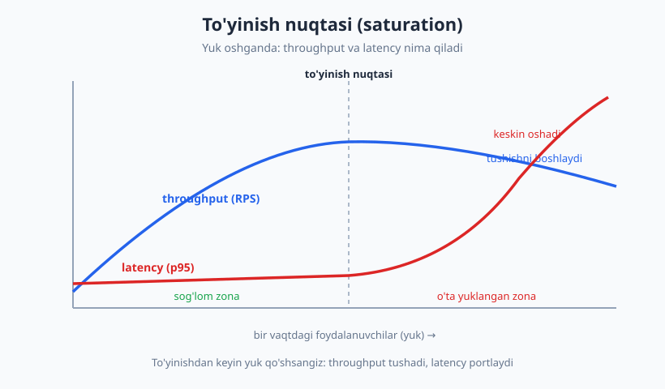
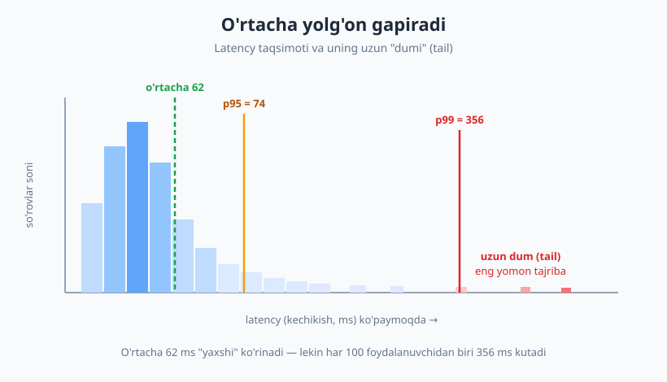
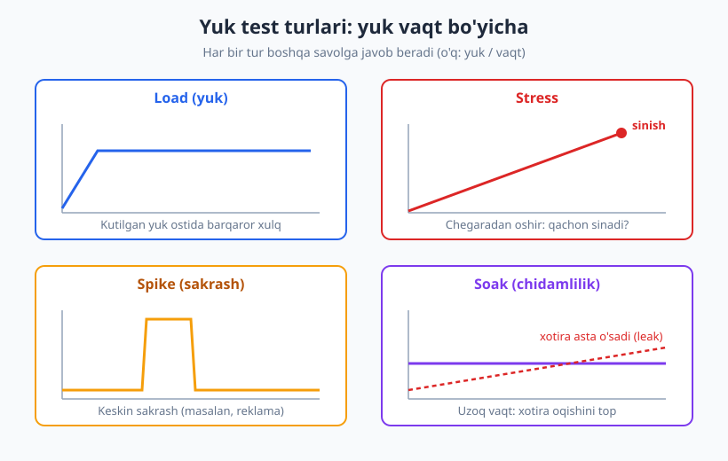

# 25 — Performance, yuk va stress testlar

[🏠 README](./README.md) · [⬅️ Oldingi: 24 — Flaky testlar va barqarorlik](./24-flaky-testlar.md) · [Keyingi: 26 — Xavfsizlik testlash asoslari ➡️](./26-xavfsizlik-testlash.md)

---

> **Bu bobda:** funksional testlar "to'g'ri ishlaydimi?" deb so'raydi. Performance testlar boshqa
> savol beradi — "**qanchalik tez** va **qancha yukni** ko'tara oladi?". Latency va throughput
> nima ekanini, nega **o'rtacha qiymat yolg'on gapirishini** va persentillar (p95, p99) eng yomon
> tajribani qanday ochib berishini ko'ramiz. Load, stress, spike, soak va benchmark turlarini
> farqlaymiz, sof Python bilan vaqt o'lchaymiz va **"performance budget"** assert yozamiz.
>
> **Halollik / Eslatma:** bu bob k6, Locust, JMeter kabi yuk-test vositalarini **konseptual**
> ko'rsatadi (ularni o'rnatib ishlatmaymiz) — asosiy g'oya har qanday vositada bir xil. Persentil
> hisoblash, `time.perf_counter` o'lchov va budget assert esa **sof Python** bilan, haqiqatan ishga
> tushirilgan (Python 3.14, pytest 9.0.3, `statistics` standart). Mikrobenchmark **mo'rt** (flaky,
> [24-bob](./24-flaky-testlar.md)): ms-larda ko'rsatilgan aniq raqamlar mashinaga bog'liq —
> matnda nisbat va tartibga (10x, 100x) e'tibor bering, aniq songa emas.

---

## Funksional emas — sifat

Mashinani sotib olishdan oldin ikki xil savol berasiz. Birinchisi: "Yuradimi? Tormozi ishlaydimi?"
Bu — **funksional** savol: mashina to'g'ri ishlaydimi. Ikkinchisi: "100 km/soatga necha
soniyada chiqadi? 200 ming km yursa bardosh beradimi?" Bu — **nofunksional** (sifat) savol:
qanchalik yaxshi ishlaydi.

Shu paytgacha ([03-bob](./03-test-turlari-piramida.md)) ko'rgan testlarimiz asosan **funksional**
edi: kirish X bo'lsa, chiqish Y bo'ladimi? Bu bob esa **nofunksional** sifatlardan eng muhimini —
**performance** (samaradorlik) ni o'rganadi.

| Savol | Test turi | Misol |
|---|---|---|
| To'g'ri ishlaydimi? | **Funksional** | `narx_hisobla(2, 50) == 100` |
| Qanchalik tez? | **Performance** | so'rov 200 ms ichida javob beradimi? |
| Qancha yukni ko'taradi? | **Yuk (load)** | 1000 bir vaqtli foydalanuvchi? |
| Chegarasi qayerda? | **Stress** | qaysi yukda sinadi? |

> **Eslatma:** Performance — bu shunchaki "tezlik" emas. U uch tushunchani o'z ichiga oladi:
> **tezlik** (latency), **ko'tarimlilik** (throughput/scalability) va **barqarorlik** (uzoq
> ishlaganda buzilmaslik). Quyida har birini aniqlaymiz.

---

## Ikki asosiy metrika: latency va throughput

Bu ikki so'zni chalkashtirish — eng keng tarqalgan xato. Restoran analogiyasi yordam beradi:

- **Latency** (kechikish) — **bitta** buyurtma berilgandan tortib taom kelguncha o'tgan vaqt.
  Bitta so'rovning boshidan oxirigacha bo'lgan davomiyligi. Birlik: millisekund (ms).
- **Throughput** (o'tkazuvchanlik) — oshxona **bir soatda** nechta taom chiqara oladi.
  Tizim birlik vaqtda nechta so'rovni qayta ishlaydi. Birlik: **RPS** (requests per second —
  sekundiga so'rov).

Ular bir narsa **emas**. Oshxonada bitta taom 30 daqiqada pishishi mumkin (yuqori latency),
lekin 10 oshpaz parallel ishlasa, soatiga 20 taom chiqadi (yaxshi throughput). Aksincha — tez
pishadigan taom (past latency), lekin bitta oshpaz bo'lsa, throughput past.

> **Munosabat:** Past yukda latency va throughput bir-biriga teskari (Little qonuni). Lekin tizim
> **to'yinganda** (saturation) ikkalasi ham buziladi: throughput tekislanadi yoki tushadi, latency
> esa keskin ko'tariladi. Bu nuqtani quyidagi diagrammada ko'rasiz.



Performance testning maqsadi ko'pincha aynan shu **to'yinish nuqtasini** topish: tizim qaysi
yukgacha "sog'lom zonada" (past latency, ortib boruvchi throughput) ishlaydi va qayerdan keyin
"o'ta yuklangan zonaga" o'tadi.

---

## Nega o'rtacha (mean) yolg'on gapiradi

Bu — bobning eng muhim g'oyasi. "So'rovlarimizning **o'rtacha** javob vaqti 62 ms" degan jumla
chiroyli eshitiladi — lekin u **xavfli yolg'on** bo'lishi mumkin.

Sabab: latency taqsimoti **simmetrik emas**. Ko'pchilik so'rov tez (50 ms atrofida), lekin oz
sonli so'rov juda sekin (GC pauzasi, kesh promahi, tarmoq, navbat) — bu **uzun dum** (tail
latency) deyiladi. O'rtacha bu dumni "yuvib yuboradi", chunki u barcha qiymatni bitta songa
qisadi.



Yechim — **persentillar**. p95 = "so'rovlarning 95% shu vaqtdan tez bo'ldi". p99 = "99% shundan
tez". Persentil eng yomon tajribani ko'rsatadi: **p99 — har 100 foydalanuvchidan biri kutadigan
vaqt**. Katta saytlarda kuniga millionlab so'rov bo'lsa, "1%" — bu o'n minglab norozi
foydalanuvchi.

### JONLI: o'rtacha 62 ms, lekin p99 = 356 ms

`statistics` standart kutubxonasi bilan realistik taqsimot yaratamiz (95% tez, 5% sekin dum) va
o'rtachani persentillar bilan solishtiramiz:

```python
# persentil.py
import random
import statistics

random.seed(42)
olchovlar = []
for _ in range(1000):
    if random.random() < 0.95:
        olchovlar.append(random.gauss(50, 8))    # tez 95%
    else:
        olchovlar.append(random.gauss(300, 60))  # sekin 5% (dum)

ortacha = statistics.mean(olchovlar)
mediana = statistics.median(olchovlar)
# n=100 -> persentillar; q[94]=p95, q[98]=p99
q = statistics.quantiles(olchovlar, n=100, method="inclusive")

print(f"o'rtacha (mean): {ortacha:.0f} ms")
print(f"mediana (p50):   {mediana:.0f} ms")
print(f"p95:             {q[94]:.0f} ms")
print(f"p99:             {q[98]:.0f} ms")
print(f"eng yomon (max): {max(olchovlar):.0f} ms")
# -> o'rtacha (mean): 62 ms
# -> mediana (p50):   50 ms
# -> p95:             74 ms
# -> p99:             356 ms
# -> eng yomon (max): 407 ms
```

Mana fojia: **o'rtacha 62 ms** "ajoyib" ko'rinadi, lekin **p99 = 356 ms** — deyarli olti baravar
sekin. Agar siz faqat o'rtachaga qarab "tizim tez" desangiz, har 100 foydalanuvchidan birining
356 ms kutayotganini **mutlaqo ko'rmaysiz**. Median (p50) ham 50 ms — chunki median ham dumga
befarq. Faqat p95/p99 dumni fosh qiladi.

> **Diqqat:** "O'rtacha latency" deganni eshitsangiz, doim "**qaysi persentil?**" deb so'rang.
> Yaxshi SLO (service level objective) o'rtacha emas, persentil bilan yoziladi: masalan
> "p99 < 300 ms". Amazon, Google kabi kompaniyalar p99, hatto p99.9 bilan ishlaydi.

### Persentilni qo'lda ham hisoblash mumkin

`statistics.quantiles` sehr emas — g'oyasi oddiy: **saralab, kerakli o'rindagi qiymatni ol**.
Mana eng sodda ("nearest-rank") usul, va u nega median/p95/p99 ham ba'zan dumni yashirishini
ko'rsatadi:

```python
# persentil_qolda.py
def persentil(qiymatlar, p):
    s = sorted(qiymatlar)
    orin = max(1, round(p / 100 * len(s)))  # 1..n o'rin (rank)
    return s[orin - 1]

# 99 ta tez (50 ms), bitta sekin (500 ms) = nodir dum
olchovlar = [50] * 99 + [500]
print(f"o'rtacha:  {sum(olchovlar) / len(olchovlar):.0f} ms")  # -> o'rtacha:  54 ms
print(f"p50:       {persentil(olchovlar, 50)} ms")             # -> p50:       50 ms
print(f"p95:       {persentil(olchovlar, 95)} ms")             # -> p95:       50 ms
print(f"p99:       {persentil(olchovlar, 99)} ms")             # -> p99:       50 ms
print(f"p100(max): {persentil(olchovlar, 100)} ms")            # -> p100(max): 500 ms
```

Bu yana bir saboq: **bitta** nodir sekin so'rov (1%) p99'da ham ko'rinmasligi mumkin — uni faqat
**max** yoki **p99.9** tutadi. Shuning uchun katta tizimlar p99.9 ni ham kuzatadi. Persentil
qancha balandroq bo'lsa, dumni shuncha yaxshi ko'radi — lekin baribir cheksiz emas.

---

## Test turlari: load, stress, spike, soak, benchmark

"Performance test" — umumiy nom. Ostida har biri **boshqa savolga** javob beradigan turlar bor:

| Tur | Savol | Yuk profili |
|---|---|---|
| **Load (yuk)** | Kutilgan yuk ostida xulq qanaqa? | Barqaror, real yukka teng |
| **Stress** | Qaysi nuqtada sinadi? | Chegaradan oshib, asta ortadi |
| **Spike** | Keskin sakrash ko'tariladimi? | To'satdan baland, keyin pasayadi |
| **Soak / endurance** | Uzoq ishlaganda buziladimi? | O'rtacha yuk, lekin uzoq (soatlar) |
| **Benchmark** | Bitta funksiya qancha tez? | Yuk yo'q — bir bo'lakni o'lchash |



- **Load test** — eng asosiy. "Black Friday'da 5000 foydalanuvchi bo'ladi deb kutyapmiz; tizim
  shu yukda p99 < 500 ms saqlaydimi?" Real, kutilgan yukni simulyatsiya qiladi.
- **Stress test** — yukni **ataylab oshirib** boradi, toki tizim sinmaguncha. Maqsad — "qancha"
  emas, "**qachon va qanday** sinadi" (xushmuomala degradatsiyami yoki to'satdan qulashmi).
- **Spike test** — yuk **bir zumda** sakraydi (reklama, virusli post). Tizim sakrashga
  moslashadimi yoki yiqiladimi?
- **Soak (endurance) test** — o'rtacha yukni **uzoq vaqt** (soatlab) ushlab turadi. Bu —
  **xotira oqishini (memory leak)** topishning yagona yo'li: leak qisqa testda ko'rinmaydi, lekin
  6 soatdan keyin xotira to'lib server qulaydi.
- **Benchmark / mikrobenchmark** — yuk yo'q; bitta funksiya yoki algoritmning **sof tezligini**
  o'lchaydi. Quyida aynan shuni Python bilan qilamiz.

> **Trade-off:** Bu turlar bir-birini almashtirmaydi — to'ldiradi. Faqat load test qilsangiz,
> chegarani (stress) va leakni (soak) o'tkazib yuborasiz. Lekin hammasini har deploy'da ishlatish
> qimmat va sekin — odatda load test CI'da tez-tez, stress/soak esa relizdan oldin yoki tunda
> ishlatiladi.

---

## JONLI benchmark: ikki implementatsiyani solishtirish

Eng amaliy performance test — **regressiyani** sezish: "kecha tez edi, bugun nega sekin?".
Buning uchun avval funksiya vaqtini o'lchashni o'rganamiz. `time.perf_counter()` — Python'ning
eng aniq sekundomeri (monotonik, yuqori aniqlik).

Mana bir masalaning ikki yechimi — sekin O(n²) va tez O(n) ([algoritmlar
kitobi](../algoritmlar/README.md) bu farqni chuqur ochadi):

```python
# qidiruv.py  (sinaladigan kod)
def juft_bor_sekin(royxat, nishon):
    # O(n^2): har element uchun butun ro'yxatni qayta qidiradi
    for a in royxat:
        for b in royxat:
            if a + b == nishon:
                return True
    return False

def juft_bor_tez(royxat, nishon):
    # O(n): bir marta o'tib, ko'rilganlarni to'plamga solamiz
    korilgan = set()
    for a in royxat:
        if (nishon - a) in korilgan:
            return True
        korilgan.add(a)
    return False
```

O'lchov funksiyasi — bu yerda **mikrobenchmark tuzoqlariga** e'tibor bering (izohlarda):

```python
# benchmark.py
import time
import statistics
from qidiruv import juft_bor_sekin, juft_bor_tez

def olchov(funksiya, royxat, nishon, takror=5):
    funksiya(royxat, nishon)                 # WARMUP: birinchi chaqiruvni hisobga olmaymiz
    vaqtlar = []
    for _ in range(takror):
        boshi = time.perf_counter()
        funksiya(royxat, nishon)
        vaqtlar.append(time.perf_counter() - boshi)
    return statistics.median(vaqtlar)        # MEDIANA: bitta shovqinli o'lchovga chidamli

royxat = list(range(2000))
nishon = -1                                   # ataylab topilmaydi -> eng yomon holat (to'liq skan)

sekin = olchov(juft_bor_sekin, royxat, nishon)
tez = olchov(juft_bor_tez, royxat, nishon)
print(f"sekin (O(n^2)): {sekin * 1000:.1f} ms")
print(f"tez   (O(n)):   {tez * 1000:.3f} ms")
print(f"tezlik farqi:   ~{sekin / tez:.0f}x")
# -> sekin (O(n^2)): 111.8 ms
# -> tez   (O(n)):   0.136 ms
# -> tezlik farqi:   ~819x
```

O(n²) versiya ~110 ms, O(n) versiya ~0.14 ms — taxminan **800 baravar** tez. (Aniq son
mashinangizga bog'liq; **tartib** muhim, aniq raqam emas.)

> **Diqqat — mikrobenchmark tuzoqlari (halol bo'laylik):**
> - **Warmup:** birinchi chaqiruv import, kesh isitish, branch-bashorat sabab sekin bo'ladi —
>   uni o'lchamga qo'shmang.
> - **Kesh va GC:** operatsion tizim keshi va Python axlat yig'uvchisi (GC) o'lchovni
>   "sakratadi". Shuning uchun **mediana** olamiz (o'rtacha emas — bitta sakrash uni buzadi).
> - **O'lchov shovqini:** bir xil kodni ikki marta o'lchasangiz, har xil son chiqadi. Bu
>   normal — shuning uchun **bir necha takror** + mediana.
> - **Optimizator:** ba'zi tillarda kompilyator "natijasi ishlatilmagan" kodni o'chiradi va
>   benchmark 0 ms ko'rsatadi. Natijani ishlating (Python'da bu kam muammo).

---

## Performance budget: regressiyadan himoya

Endi benchmarkni **avtomatik testga** aylantiramiz. G'oya oddiy: **"performance budget"** —
ruxsat etilgan maksimal vaqt. Test shu chegaradan oshsa **yiqiladi**. Bu funksional test emas
("to'g'ri natijami?"), balki **tezlik regressiyasini** ushlaydigan qalqon ("hali ham yetarli
tezmi?").

```python
# test_byudjet.py
import time
import statistics
from qidiruv import juft_bor_tez

BYUDJET_MS = 5.0  # performance budget: tez versiya 5 ms dan oshmasin

def olcha_mediana(funksiya, royxat, nishon, takror=7):
    funksiya(royxat, nishon)  # warmup
    vaqtlar = []
    for _ in range(takror):
        boshi = time.perf_counter()
        funksiya(royxat, nishon)
        vaqtlar.append((time.perf_counter() - boshi) * 1000)
    return statistics.median(vaqtlar)

def test_tez_versiya_byudjetga_sigadi():
    o_vaqt = olcha_mediana(juft_bor_tez, list(range(2000)), -1)
    assert o_vaqt < BYUDJET_MS, f"juft_bor_tez {o_vaqt:.2f} ms > byudjet {BYUDJET_MS} ms"
```

Ishga tushiramiz:

```text
$ python -m pytest test_byudjet.py -q
.                                                                        [100%]
1 passed in 0.59s
```

Endi tasavvur qiling, kimdir tezlik regressiyasi kiritdi — tez kodni sekin O(n²) bilan
almashtirdi. O'sha budget testi endi **yiqiladi** va aniq sababni ko'rsatadi:

```text
$ python -m pytest test_byudjet_fail.py -q
>       assert o_vaqt < BYUDJET_MS, f"juft_bor_sekin {o_vaqt:.2f} ms > byudjet {BYUDJET_MS} ms"
E       AssertionError: juft_bor_sekin 114.41 ms > byudjet 5.0 ms
E       assert 114.40540000012334 < 5.0
=========================== short test summary info ===========================
FAILED test_byudjet_fail.py::test_sekin_versiya_byudjetga_sigadi
1 failed in 1.61s
```

Mana shu — performance regressiyani CI'da avtomatik tutadigan oddiy, lekin kuchli usul.

### Budget'ni p95'ga bog'lash (shovqinga chidamli)

Bitta o'lchov "sakrashi" testni bekorga yiqitishi mumkin — bu performance testlarni **flaky**
([24-bob](./24-flaky-testlar.md)) qiladigan asosiy sabab. Yechim: bir o'lchovga emas, **p95'ga**
assert qiling. Bir nechta namuna yig'ib, 95-persentilni tekshirsangiz, yagona shovqinli sakrash
testni yiqitmaydi:

```python
# test_p95.py
import time, statistics
from qidiruv import juft_bor_tez

def test_p95_byudjet():
    namunalar = []
    juft_bor_tez(list(range(2000)), -1)  # warmup
    for _ in range(50):
        b = time.perf_counter()
        juft_bor_tez(list(range(2000)), -1)
        namunalar.append((time.perf_counter() - b) * 1000)
    p95 = statistics.quantiles(namunalar, n=100, method="inclusive")[94]
    assert p95 < 5.0, f"p95 = {p95:.2f} ms (byudjet 5 ms)"
```

```text
$ python -m pytest test_p95.py test_byudjet.py -q
..                                                                       [100%]
2 passed in 0.59s
```

> **Trade-off:** Aniq budget chegarasini tanlash san'at. Juda tor (`< 5 ms`, mashina sekin
> bo'lsa) → flaky yiqilish. Juda keng (`< 5000 ms`) → real regressiyani o'tkazib yuborasiz.
> Amaliy maslahat: budgetni o'lchangan p95'dan biroz (masalan 2-3 baravar) yuqori qo'ying —
> shovqinga joy qoldiring, lekin katta sekinlashishni baribir tuting.

---

## Yuk testi vositalari (konseptual)

Bitta funksiyani Python bilan o'lchadik — lekin **butun tizimni** (HTTP server, ma'lumotlar
bazasi) yuklash uchun maxsus vositalar kerak. Ular **virtual foydalanuvchilarni** (VU) yaratadi,
ularni **ramp-up** (asta-sekin oshirish) qiladi va persentillarni hisoblaydi. Eng mashhurlari:

| Vosita | Skript tili | Kuchli tomoni |
|---|---|---|
| **k6** | JavaScript | Zamonaviy, CI-do'st, kod-asosli |
| **Locust** | Python | Python'da ssenariy yozasiz, oson |
| **JMeter** | XML / GUI | Eski, kuchli, korxona standarti |
| **wrk** | Lua / CLI | Juda yengil, tez HTTP yuk |

Konseptual k6 skripti shunday ko'rinadi (faqat g'oyani ko'rsatish uchun — biz ishlatmaymiz):

```javascript
// yuk.js (k6 — KONSEPTUAL, ishga tushirmaymiz)
import http from 'k6/http';
export const options = {
  stages: [
    { duration: '30s', target: 100 },  // ramp-up: 0 -> 100 VU
    { duration: '1m',  target: 100 },  // 100 VU ushlab turish
    { duration: '20s', target: 0 },    // ramp-down
  ],
  thresholds: { http_req_duration: ['p(95)<300'] },  // budget: p95 < 300 ms
};
export default function () { http.get('https://example.test/api/mahsulotlar'); }
```

Locust'da xuddi shu g'oya Python sintaksisida:

```python
# locustfile.py (Locust — KONSEPTUAL eskiz)
from locust import HttpUser, task, between

class Foydalanuvchi(HttpUser):
    wait_time = between(1, 3)  # foydalanuvchilar orasidagi "o'ylash" pauzasi

    @task
    def mahsulotlar(self):
        self.client.get("/api/mahsulotlar")
```

E'tibor bering: ikkalasida ham bir xil tushunchalar — **virtual foydalanuvchilar**, **ramp-up
bosqichlari**, **persentil chegarasi (threshold)**. Vosita o'zgaradi, g'oya o'sha. CI'da bu skript
nightly (tunda) yoki relizdan oldin ishlaydi va p95/p99 budgetdan oshsa pipeline'ni yiqitadi
([27-bob — CI/CD](./27-ci-cd-avtomatlashtirish.md)).

> **Eslatma:** Yuk testi vositasi tizimni **alohida, production'ga o'xshash** muhitda yuklashi
> kerak — hech qachon o'z laptopingizdan jonli production'ga yuk bermang (real foydalanuvchilarga
> ta'sir qiladi va noto'g'ri raqam beradi).

---

## Performance testlash tamoyillari

1. **O'lchamasdan optimallashtirma.** "Premature optimization" — eng keng tarqalgan xato. Avval
   o'lchang (profile), **eng sekin joyni** (bottleneck) toping, keyin faqat o'shanga e'tibor
   bering. Tez ko'rinadigan funksiyani 1000x tezlashtirsangiz ham, agar u jami vaqtning 1% ini
   egallasa — foyda deyarli nol. Algoritm tanlovi ko'pincha mikro-optimizatsiyadan muhimroq
   ([algoritmlar kitobi](../algoritmlar/README.md)).
2. **Bazaviy chiziq (baseline) va regressiya kuzatuvi.** Bugungi raqamni saqlang. Keyingi
   o'lchovni unga solishtiring. Performance testning asosiy qiymati — **regressiyani sezish**
   ("nega 50 ms dan 200 ms ga sakradi?"), mutlaq raqam emas.
3. **Realistik ma'lumot va yuk.** 10 qatorli jadvalda tez ishlagan so'rov 10 million qatorda
   o'lik bo'lishi mumkin. Production hajmiga yaqin ma'lumot va real foydalanuvchi naqshini
   ishlating.
4. **Production'ga o'xshash muhit.** Sekin laptopda yoki kuchli serverda o'lchangan raqam
   production'ni aks ettirmaydi. Iloji boricha o'xshash muhit.
5. **O'rtacha emas, persentil bilan o'ylang.** SLO'ni p95/p99 bilan yozing. O'rtacha — chalg'ituvchi.

> **Halol e'tirof:** Performance testlar **mo'rt**. Muhit shovqini, boshqa jarayonlar, CI server
> yuki — hammasi raqamni o'zgartiradi. Shuning uchun: nisbiy (regressiya) o'lchovga tayaning,
> persentil ishlating, budgetni shovqinga joy qoldirib qo'ying, va ms-larda aniq tenglikni
> ([24-bob](./24-flaky-testlar.md)) hech qachon assert qilmang.

---

## Asosiy g'oyalar (bobni qisqacha)

- **Funksional vs nofunksional:** funksional = "to'g'ri ishlaydimi", performance = "qanchalik tez
  va qancha yukni ko'taradi". Bu — sifat o'lchovi, to'g'rilik emas.
- **Latency ≠ throughput.** Latency = bitta so'rov vaqti (ms); throughput = sekundiga so'rov (RPS).
  Past yukda teskari bog'liq; to'yinishda ikkalasi ham buziladi.
- **O'rtacha yolg'on gapiradi.** Uzun dum (tail) tufayli mean dumni yashiradi. JONLI: o'rtacha
  62 ms, lekin p99 = 356 ms.
- **Persentil bilan o'ylang.** p95/p99 eng yomon tajribani ko'rsatadi. SLO'ni persentil bilan
  yozing; nodir dum uchun p99.9/max ham kuzating.
- **Test turlarini farqla:** load (kutilgan yuk), stress (sinish nuqtasi), spike (sakrash),
  soak (uzoq — memory leak), benchmark (bitta funksiya).
- **Performance budget = regressiya qalqoni.** `assert davomiylik < chegara`. JONLI'da budgetni
  oshgan kod testni yiqitdi (~114 ms > 5 ms).
- **Mikrobenchmark tuzoqlari:** warmup, kesh, GC, o'lchov shovqini. Yechim: bir necha takror +
  **mediana/p95** (o'rtacha emas).
- **O'lchamasdan optimallashtirma; baseline saqla.** Avval bottleneck'ni top; performance
  testning asosiy qiymati — regressiyani sezish.

---

## Mashqlar

### Oson

**1-mashq.** Latency va throughput'ni bittadan jumlada ta'riflang va ularning birligini ayting.
Restoran analogiyasida har biri nimaga to'g'ri keladi?

**2-mashq.** "Bizning API'ning o'rtacha javob vaqti 80 ms" degan hamkasbingizga qaysi bitta
savolni berishingiz kerak va nima uchun? Qisqa (2-3 jumla) javob yozing.

**3-mashq.** Quyidagi to'rt holatni mos test turi bilan tenglashtiring (load / stress / spike /
soak):
(a) "Yangi yil kechasi 10x yuk keladi, tizim ko'taradimi?"
(b) "Server 8 soat ishlagandan keyin nega xotira to'lib qulaydi?"
(c) "Odatdagi kunlik 500 foydalanuvchi yukida p95 < 300 ms qoladimi?"
(d) "Tizim aniq qaysi yukda sinadi?"

### O'rta

**4-mashq.** Quyidagi 10 ta latency o'lchovi berilgan (ms):
`[40, 42, 45, 43, 41, 44, 40, 46, 42, 800]`. O'rtacha (mean) va median (p50) ni qo'lda hisoblang.
Nega ular bir-biridan farq qiladi va qaysi biri foydalanuvchi tajribasini to'g'riroq aks ettiradi?

**5-mashq.** Bobdagi `olchov` funksiyasi nega **mediana** qaytaradi, **o'rtacha** emas? Mikrobenchmark
kontekstida buni asoslang. Va nega birinchi chaqiruv (warmup) o'lchamga qo'shilmaydi?

**6-mashq.** Performance budget testi yozing: `statistics.quantiles` yordamida 30 ta o'lchovning
**p95'i** 10 ms dan kichik ekanini tekshiradigan test (psevdokod yoki Python). Nega bitta o'lchovga
emas, p95'ga assert qilish testni kamroq flaky qiladi?

### Qiyin

**7-mashq.** Saytingizda kuniga 5 million so'rov bor va p99 = 400 ms. "99% so'rov 400 ms dan tez,
demak hammasi yaxshi" degan xulosa nega xavfli? Aniq son bilan tushuntiring: p99'dan sekin
nechta so'rov bor va bu nimani anglatadi?

**8-mashq.** Bir jamoa har deploy'da CI'da `assert javob_vaqti < 100` (ms, bitta o'lchov) testini
ishlatadi. Test goh o'tadi, goh yiqiladi, sababsiz. (a) Bu nega sodir bo'lyapti? (b) Testni
ishonchli qiladigan kamida uchta o'zgarishni taklif qiling. ([24-bob](./24-flaky-testlar.md) bilan
bog'lang.)

<details markdown="1">
<summary>Yechimlar</summary>

### 1-mashq yechimi

**Latency** — bitta so'rovning boshidan oxirigacha o'tgan vaqt (birlik: millisekund, ms).
**Throughput** — tizim birlik vaqtda qayta ishlaydigan so'rovlar soni (birlik: RPS, sekundiga
so'rov). Restoranda: latency = bitta buyurtma berilgandan taom kelguncha vaqt; throughput =
oshxona bir soatda nechta taom chiqaradi.

### 2-mashq yechimi

"**Qaysi persentil?**" yoki "p95/p99 nechchi?" deb so'rash kerak. O'rtacha (mean) latency
chalg'ituvchi, chunki u uzun dumni (tail) yashiradi — ko'pchilik so'rov tez bo'lsa-yu, oz sonli
so'rov juda sekin bo'lsa, o'rtacha "yaxshi" chiqadi, lekin foydalanuvchilarning bir qismi yomon
tajribaga ega. p95/p99 eng yomon tajribani ochib beradi.

### 3-mashq yechimi

(a) → **spike** (keskin yuk sakrashi). (b) → **soak/endurance** (uzoq vaqt — memory leak).
(c) → **load** (kutilgan, real yuk ostida xulq). (d) → **stress** (chegaradan oshirib, sinish
nuqtasini topish).

### 4-mashq yechimi

Yig'indi = 40+42+45+43+41+44+40+46+42+800 = 1183. **O'rtacha** = 1183 / 10 = **118.3 ms**.
Saralangan: `[40, 40, 41, 42, 42, 43, 44, 45, 46, 800]`; o'rtadagi ikki qiymat 42 va 43,
**median** = (42+43)/2 = **42.5 ms**. Ular keskin farq qiladi, chunki bitta katta qiymat (800)
o'rtachani yuqoriga tortadi, lekin medianaga deyarli ta'sir qilmaydi. **Median** (42.5 ms)
foydalanuvchining odatiy tajribasini ancha to'g'riroq aks ettiradi — 10 ta foydalanuvchidan 9 tasi
~40 ms ko'rdi, o'rtacha 118 ms esa hech kim ko'rmagan "soxta" qiymat.

### 5-mashq yechimi

**Mediana** chunki mikrobenchmarkda o'lchovlar ba'zan to'satdan "sakraydi" (GC pauzasi, OS
keshini almashtirish, boshqa jarayon CPU oldi). O'rtacha bitta katta sakrashdan keyin buziladi
(4-mashqdagidek 800), median esa unga chidamli — u taqsimotning "markazini" beradi. **Warmup**
o'lchamga qo'shilmaydi, chunki birinchi chaqiruv odatda sekinroq: import yuklanishi, kod va
ma'lumot keshga kirishi, branch-bashorat isishi sodir bo'ladi. Bu "isish" narxini o'lchovga
qo'shsak, funksiyaning haqiqiy barqaror tezligi noto'g'ri (sekinroq) ko'rinadi.

### 6-mashq yechimi

```python
import time, statistics

def test_p95_byudjet():
    namunalar = []
    funksiya(kirish)  # warmup
    for _ in range(30):
        b = time.perf_counter()
        funksiya(kirish)
        namunalar.append((time.perf_counter() - b) * 1000)
    p95 = statistics.quantiles(namunalar, n=100, method="inclusive")[94]
    assert p95 < 10.0, f"p95 = {p95:.2f} ms"
```

p95'ga assert qilish kamroq flaky, chunki yagona shovqinli o'lchov (masalan, GC pauzasi tushgan
bitta takror) butun testni yiqitmaydi — u faqat eng yuqori 5% ichida qoladi va p95'ga ta'sir
qilmaydi. Bitta o'lchovga assert qilsangiz esa, o'sha bitta baxtsiz sakrash testni yiqitadi.

### 7-mashq yechimi

p99 = 400 ms degani — so'rovlarning **1% i** 400 ms dan **sekin**. 5 million so'rovning 1% i =
**50 000 so'rov** har kuni 400 ms dan sekin javob oldi. Bu — kuniga 50 ming yomon tajriba (ba'zilari
ehtimol bir necha soniya). "99% yaxshi" degan jumla bu 50 mingni ko'rinmas qiladi. Shu sababli
katta tizimlar p99 bilan kifoyalanmay, **p99.9** (har 1000 dan biri) va **max** ni ham kuzatadi —
chunki "kichik foiz" katta hajmda katta mutlaq raqamga aylanadi.

### 8-mashq yechimi

**(a) Nega flaky:** test bitta o'lchovga (`javob_vaqti`) va qattiq chegaraga (`< 100 ms`) tayanadi.
CI serverida boshqa jarayonlar, GC pauzasi, tarmoq shovqini yoki warmup'siz birinchi chaqiruv
o'lchovni vaqti-vaqti bilan 100 ms dan oshiradi — natijada test sababsiz yiqiladi. Bu performance
testlarni mo'rt qiladigan klassik holat ([24-bob](./24-flaky-testlar.md)).

**(b) Uchta tuzatish:**
1. **Bir nechta o'lchov + persentil/mediana.** Bitta o'lchov o'rniga 30-50 ta yig'ib, p95 yoki
   medianaga assert qiling — yagona sakrash testni yiqitmaydi.
2. **Warmup qo'shing.** Birinchi (isish) chaqiruvini o'lchamga qo'shmang.
3. **Budgetni shovqinga joy qoldirib belgilang.** Chegarani o'lchangan p95'dan biroz yuqori
   (masalan 2-3x) qo'ying — real regressiyani tutadi, lekin oddiy shovqinga toqat qiladi.
   (Qo'shimcha: stabil, ajratilgan muhitda ishlating va mutlaq emas, baseline'ga nisbatan
   regressiyani tekshiring.)

</details>

---

[🏠 README](./README.md) · [⬅️ Oldingi: 24 — Flaky testlar va barqarorlik](./24-flaky-testlar.md) · [Keyingi: 26 — Xavfsizlik testlash asoslari ➡️](./26-xavfsizlik-testlash.md)
