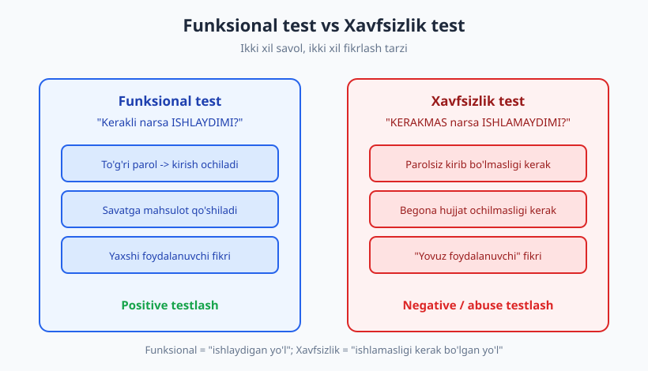
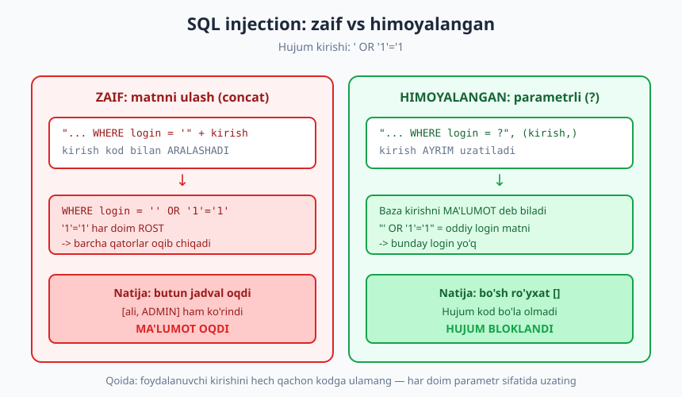
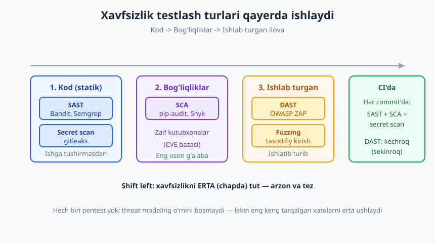

# 26 — Xavfsizlik testlash asoslari

[🏠 README](./README.md) · [⬅️ Oldingi: 25 — Performance, yuk va stress testlar](./25-performance-yuk-testlari.md) · [Keyingi: 27 — Test avtomatlashtirish va CI/CD ➡️](./27-ci-cd-avtomatlashtirish.md)

---

> **Bu bobda:** xavfsizlik testlash nima va u funksional testdan nimasi bilan farq qiladi —
> funksional test "kerakli narsa ishlaydimi?" deb so'raydi, xavfsizlik testi esa "KERAKMAS narsa
> ishlamaydimi?" deb so'raydi. "Yovuz foydalanuvchi" kabi fikrlashni, eng keng tarqalgan
> zaifliklarni (SQL injection, buzilgan avtorizatsiya/IDOR, input validatsiya, sezgir ma'lumot) va
> ularni qanday TEST qilishni o'rganamiz. Avtomatlashtirilgan xavfsizlik turlarini (SAST, DAST, SCA,
> secret scan, fuzzing) ham ko'rib chiqamiz.
>
> **Halollik / Eslatma:** bu — **kirish** daraja, dasturchi nuqtai nazaridan. Chuqur xavfsizlik
> (pentest, threat modeling, qizil jamoa) — alohida kasb. Dasturchi testlari ularning **o'rnini
> bosmaydi**, lekin eng keng tarqalgan xatolarni **erta** tutadi va shu bilan ulkan foyda beradi.
> Quyidagi barcha hujum namunalari **faqat o'z temp kodimizda, izolyatsiyada** ishlatilgan — hech
> qanday real tizimga, tashqi serverga tegmaymiz. Barcha Python namunalari `python` / `python -m
> pytest` (Python 3.14, pytest 9.0.3, sqlite3 standart, hypothesis 6.155) bilan **haqiqatan ishga
> tushirib tekshirilgan** — chiqishlar to'qib chiqarilmagan.

---

## Nega xavfsizlik testlash boshqacha

Tasavvur qiling, yangi uy quryapsiz. **Funksional sinov** — eshik ochiladimi, chiroq yonadimi,
suv oqadimi: *kerakli narsalar ishlaydimi*. **Xavfsizlik sinovi** esa boshqa savol: deraza
qulflanganmi, begona odam orqa eshikdan kira oladimi, kalitni gilam ostiga qo'ymadingizmi —
ya'ni *kerakmas narsa ishlamasligi kerakmi*. Ikkalasi ham zarur, lekin **fikrlash tarzi** butunlay
qarama-qarshi.

Funksional testda siz **yaxshi foydalanuvchi** kabi o'ylaysiz: u to'g'ri parol kiritadi, savatga
mahsulot qo'shadi, hammasi rejadagidek. Xavfsizlik testida esa siz **yovuz foydalanuvchi** (yoki
"hujumchi") kabi o'ylashingiz kerak: "Bu maydonga SQL kod yozsam-chi? Boshqa odamning hujjat
raqamini URL'ga qo'ysam-chi? Parolsiz to'g'ri ichki sahifaga o'tsam-chi?". Bu — **negative
testing** (salbiy testlash) va **abuse testing** (suiiste'mol testlash).



> **Asosiy farq:** Funksional test **mavjud yo'l**larni sinaydi ("login ishlaydi"). Xavfsizlik
> test **ishlamasligi kerak bo'lgan yo'l**larni sinaydi ("login'ni chetlab o'tib bo'lmaydi"). Bitta
> kod funksional jihatdan mukammal bo'lib, ayni paytda xavfsizlik jihatdan teshik bo'lishi mumkin.

### "Shift left security"

Klassik (eski) yondashuvda xavfsizlik **oxirida** tekshirilardi: ilova tayyor bo'lgach, alohida
jamoa pentest qilardi. Muammo — bu bosqichda topilgan xato eng **qimmat** (1-bobdagi "xato narxi"
egri chizig'ini eslang). **Shift left security** — xavfsizlikni *chapga*, ya'ni jarayonning
**boshiga**, dasturlash paytiga surish. Dasturchi o'zi yozgan testda zaiflikni tutsa — u arzon,
tez va kontekst yangi turibdi.

> **Eslatma:** "Shift left" "pentest kerak emas" degani EMAS. U "pentestga kelguncha oson teshiklar
> qolmasin" degani. Pentest qimmat va kam uchraydi; uni faqat haqiqiy murakkab narsalarga sarflang.

---

## SQL injection: zaiflikni jonli ko'rish va testlash

Eng mashhur (va hamon eng keng tarqalgan) zaiflik — **injection**, ayniqsa **SQL injection**. U
shunda yuzaga keladi: dastur foydalanuvchi kiritgan matnni SQL so'roviga **to'g'ridan-to'g'ri
ulasa**. Shunda kirish *ma'lumot* emas, *kod* bo'lib qoladi.

Mana zaif kod va himoyalangan kod yonma-yon. Bizning temp `login.py` modulimiz:

```python
# login.py  (sinaladigan kod)
import sqlite3

def baza_tayyorla():
    conn = sqlite3.connect(":memory:")
    conn.execute("CREATE TABLE foydalanuvchilar (id INTEGER, login TEXT, rol TEXT)")
    conn.execute("INSERT INTO foydalanuvchilar VALUES (1, 'ali', 'oddiy')")
    conn.execute("INSERT INTO foydalanuvchilar VALUES (2, 'admin', 'admin')")
    conn.commit()
    return conn

def topish_zaif(conn, login):
    # XAVFLI: kirish so'rovga to'g'ridan-to'g'ri ulanadi
    soyrov = "SELECT id, login, rol FROM foydalanuvchilar WHERE login = '" + login + "'"
    return conn.execute(soyrov).fetchall()

def topish_himoyalangan(conn, login):
    # XAVFSIZ: kirish MA'LUMOT sifatida uzatiladi (?), kod sifatida emas
    soyrov = "SELECT id, login, rol FROM foydalanuvchilar WHERE login = ?"
    return conn.execute(soyrov, (login,)).fetchall()
```

Endi **hujum** kiritamiz: `' OR '1'='1`. Zaif funksiyada bu matn so'rovga ulanadi va so'rov shunday
bo'lib qoladi: `... WHERE login = '' OR '1'='1'`. `'1'='1'` **har doim rost**, demak shart butun
jadvalga mos keladi — barcha qatorlar oqib chiqadi, jumladan **admin** ham. Haqiqiy chiqish:

```text
ZAIF natija: [(1, 'ali', 'oddiy'), (2, 'admin', 'admin')]
HIMOYALANGAN natija: []
HIMOYALANGAN (haqiqiy login): [(1, 'ali', 'oddiy')]
```

Zaif funksiya **ikkala** qatorni qaytardi (ma'lumot oqdi!). Himoyalangan funksiya esa `' OR '1'='1`
ni shunchaki "bunaqa nomli login" deb qabul qildi — bunday login yo'q, demak **bo'sh ro'yxat**.
Parametrli so'rovda baza kirishni hech qachon kod sifatida talqin qilmaydi.



### Buni qanday TEST qilamiz

Endi bu xavfsizlik xossasini **avtomat test** bilan mustahkamlaymiz. Asosiy g'oya: hujum kirishini
beramiz va **hech narsa oqmasligini** (bo'sh natija) tasdiqlaymiz.

```python
# test_injection.py
import pytest
from login import baza_tayyorla, topish_zaif, topish_himoyalangan

@pytest.fixture
def conn():
    c = baza_tayyorla()
    yield c
    c.close()

def test_himoyalangan_injectionni_bloklaydi(conn):
    hujum = "' OR '1'='1"
    natija = topish_himoyalangan(conn, hujum)
    assert natija == []          # bironta qator ham qaytmaydi -> hujum ishlamadi

def test_himoyalangan_haqiqiy_login_ishlaydi(conn):
    natija = topish_himoyalangan(conn, "ali")
    assert len(natija) == 1 and natija[0][1] == "ali"

def test_zaif_kod_injectionga_beriladi(conn):
    # Bu test ZAIFLIKNI isbotlaydi: hujum hamma qatorni oqizadi
    natija = topish_zaif(conn, "' OR '1'='1")
    assert len(natija) == 2      # admin ham oqib chiqdi -> zaiflik bor
```

Haqiqiy chiqish:

```text
...                                                                      [100%]
3 passed in 0.63s
```

Birinchi ikki test — **xavfsizlik regressiya himoyasi**: agar kimdir kelajakda kodni zaif
varianti­ga qaytarsa, `test_himoyalangan_injectionni_bloklaydi` darhol yiqiladi. Uchinchi test —
**zaiflikni hujjatlash**: u zaif kod haqiqatan teshik ekanini ko'rsatadi (real loyihada bunday
test zaif funksiyani o'chirgandan keyin yo'qoladi).

> **Trade-off:** Xavfsizlik testi ko'pincha **bo'sh natija** yoki **rad etishni** (istisno/403)
> tasdiqlaydi — ya'ni "hech narsa sodir bo'lmadi". Funksional testdan farqli, bu yerda "ish
> bermaslik" — bu **muvaffaqiyat**.

---

## Buzilgan avtorizatsiya va IDOR

Ikkinchi eng keng tarqalgan tur — **buzilgan kirish nazorati** (broken access control). Klassik
ko'rinishi — **IDOR** (Insecure Direct Object Reference): dastur foydalanuvchidan ID oladi-yu,
shu ID egasini **tekshirmaydi**. Natijada Ali `?hujjat=2` deb yozib, Valining hujjatini o'qiydi.

```python
# idor.py  (sinaladigan kod)
HUJJATLAR = {
    1: {"egasi": "ali", "matn": "Ali shartnomasi"},
    2: {"egasi": "vali", "matn": "Vali shartnomasi"},
}

def hujjat_ol_zaif(foydalanuvchi, hujjat_id):
    # ZAIF (IDOR): egasini tekshirmaydi -> har kim har qanday hujjatni ko'radi
    return HUJJATLAR[hujjat_id]["matn"]

def hujjat_ol_himoyalangan(foydalanuvchi, hujjat_id):
    hujjat = HUJJATLAR.get(hujjat_id)
    if hujjat is None:
        raise KeyError("topilmadi")
    if hujjat["egasi"] != foydalanuvchi:
        raise PermissionError("ruxsat yo'q")   # 403 ekvivalenti
    return hujjat["matn"]
```

Xavfsizlik testi: Ali **begona** hujjatga (id=2) kirsa, rad etilishini (`PermissionError`, ya'ni
HTTP'da **403**) tasdiqlaymiz.

```python
# test_idor.py
import pytest
from idor import hujjat_ol_himoyalangan, hujjat_ol_zaif

def test_egasi_oz_hujjatini_oladi():
    assert hujjat_ol_himoyalangan("ali", 1) == "Ali shartnomasi"

def test_begona_hujjatga_kirish_rad_etiladi():
    with pytest.raises(PermissionError):       # 403 kutamiz
        hujjat_ol_himoyalangan("ali", 2)

def test_zaif_kod_idorga_beriladi():
    # Zaiflik isboti: Ali begona hujjatni bemalol o'qiydi
    assert hujjat_ol_zaif("ali", 2) == "Vali shartnomasi"
```

```text
...                                                                      [100%]
3 passed in 0.52s
```

Bu to'g'ridan-to'g'ri [17-bobdagi](./17-api-http-testlash.md) status kod testlariga (401 vs 403)
bog'lanadi. **401** — "kim ekaningni bilmayman" (autentifikatsiya yo'q), **403** — "kimligingni
bilaman, lekin **bu narsaga** ruxsating yo'q" (avtorizatsiya yetmadi). IDOR — har doim **403**
holati.

> **Diqqat:** Avtorizatsiya testlari uchun **rollar matritsasi** tuzing: har bir rol (mehmon,
> oddiy, admin) va har bir muhim amal (ko'rish, tahrirlash, o'chirish) kesishmasini test qiling.
> Ko'p teshik aynan "oddiy foydalanuvchi admin amaliga yetdi" turidagi yetishmagan katakdan
> chiqadi.

---

## Input validatsiya: path traversal va tozalash

Foydalanuvchi kirishi har doim **ishonchsiz** ("never trust user input"). Ikki tipik xavf:

- **XSS** (Cross-Site Scripting) g'oyasi: kiruvchi matnga `<script>...</script>` qo'shilsa va u
  brauzerda **kod sifatida** bajarilsa. Himoya — chiqishda HTML'ni *escape* qilish. (To'liq XSS
  brauzer kontekstini talab qiladi — bu yerda faqat g'oyasini eslatamiz.)
- **Path traversal**: fayl nomiga `../` qo'shib, ruxsat etilgan papkadan **tashqariga** chiqish
  (`../../etc/passwd`). Himoya — `..` va absolyut yo'llarni rad etish.

Path traversal himoyasini test qilamiz:

```python
# parser.py  (qism)
def fayl_yoli_xavfsizmi(nom):
    if ".." in nom or nom.startswith("/") or nom.startswith("\\"):
        return False
    return True
```

```python
# test_fuzzing.py  (qism)
import pytest
from parser import fayl_yoli_xavfsizmi

@pytest.mark.parametrize("nom", ["../../etc/passwd", "../sir.txt", "/etc/shadow"])
def test_path_traversal_bloklanadi(nom):
    assert fayl_yoli_xavfsizmi(nom) is False

@pytest.mark.parametrize("nom", ["rasm.png", "hujjat.pdf", "papka/fayl.txt"])
def test_oddiy_nom_ruxsat(nom):
    assert fayl_yoli_xavfsizmi(nom) is True
```

Bu yerda [06-bobdagi](./06-fixture-parametrize.md) `parametrize` ajoyib mos keladi: har bir hujum
varianti — alohida holat, har biri alohida yiqiladi/o'tadi.

---

## Sezgir ma'lumot: parol hash'langanmi

Eng oddiy, ammo eng dahshatli xato — **parolni ochiq matnda** (plaintext) saqlash. Bazaga kirgan
hujumchi (yoki sizib chiqqan dump) barcha parollarni o'qiydi. To'g'ri yo'l — parolni **hash** qilish
(maxsus, sekin algoritm: scrypt, bcrypt, argon2) va har biriga tasodifiy **tuz** (salt) qo'shish.

```python
# parol.py  (sinaladigan kod)
import hashlib, os

def royxatdan_otish_yomon(saqlash, login, parol):
    saqlash[login] = parol                       # XATO: ochiq matn

def royxatdan_otish_yaxshi(saqlash, login, parol):
    tuz = os.urandom(16)
    hash_ = hashlib.scrypt(parol.encode(), salt=tuz, n=16384, r=8, p=1)
    saqlash[login] = {"tuz": tuz, "hash": hash_}

def parol_togrimi(yozuv, kiritilgan):
    hash_ = hashlib.scrypt(kiritilgan.encode(), salt=yozuv["tuz"], n=16384, r=8, p=1)
    return hash_ == yozuv["hash"]
```

Xavfsizlik testi: saqlangan yozuvda **ochiq parol ko'rinmasligi** kerak, lekin to'g'ri parol baribir
ishlashi kerak.

```python
# test_parol.py
from parol import royxatdan_otish_yaxshi, royxatdan_otish_yomon, parol_togrimi

def test_parol_ochiq_matnda_saqlanmaydi():
    saqlash = {}
    royxatdan_otish_yaxshi(saqlash, "ali", "Parol123!")
    assert "Parol123!" not in str(saqlash["ali"])   # ochiq parol hech qayerda yo'q

def test_togri_parol_qabul_qilinadi():
    saqlash = {}
    royxatdan_otish_yaxshi(saqlash, "ali", "Parol123!")
    assert parol_togrimi(saqlash["ali"], "Parol123!") is True

def test_notogri_parol_rad_etiladi():
    saqlash = {}
    royxatdan_otish_yaxshi(saqlash, "ali", "Parol123!")
    assert parol_togrimi(saqlash["ali"], "boshqa-parol") is False

def test_yomon_kod_parolni_ochiq_saqlaydi():
    saqlash = {}
    royxatdan_otish_yomon(saqlash, "ali", "Parol123!")
    assert saqlash["ali"] == "Parol123!"            # ochiq matn -> XATO
```

```text
....                                                                     [100%]
4 passed in 0.93s
```

Shu turdagi tekshiruvlar yana: **log'da maxfiy ma'lumot yo'qmi** (parol, token, karta raqami
log'ga yozilmasin), **sirlar kodda yo'qmi** (API kalit, parol hard-code qilinmasin — buni `secret
scanning` topadi, pastda).

> **Eslatma:** Hech qachon o'z kriptografiyangizni yozmang ("don't roll your own crypto"). Parol
> uchun tayyor, sinovdan o'tgan kutubxonalardan foydalaning: Python'da `bcrypt`/`argon2-cffi`,
> boshqa tillarda ham shunga o'xshash standartlar bor. `scrypt` ni biz faqat namuna uchun standart
> `hashlib` dan oldik.

---

## Fuzzing: tasodifiy kirish bilan crash'ni topish

**Fuzzing** — dasturga **tasodifiy, buzuq, kutilmagan** kirishlar berib, uni **qulatishga** (crash)
urinish. G'oya: yaxshi kod har qanday axlat kirishga ham nazokat bilan javob berishi kerak — istisno
bilan tarqab ketmasligi. Bu to'g'ridan-to'g'ri [21-bobdagi property-based testing
(`Hypothesis`)](./21-property-based-testing.md) bilan bog'lanadi: invariant — "hech qachon
qulamaydi".

Mana yosh tekshiruvchi. Zaif versiya har qanday kirish int bo'ladi deb ishonadi:

```python
# parser.py  (qism)
def yosh_oqi_zaif(matn):
    return int(matn) >= 18           # ZAIF: "salom" -> ValueError (crash)

def yosh_oqi_mustahkam(matn):
    try:
        son = int(matn.strip())
    except (ValueError, TypeError):
        return False                 # MUSTAHKAM: hech qachon qulamaydi
    return son >= 18
```

Fuzzing testi `Hypothesis` bilan — **minglab** tasodifiy matn generatsiya qiladi va invariant
("har doim bool, hech qachon istisno") buzilmasligini tekshiradi:

```python
# test_fuzzing.py  (qism)
import pytest
from hypothesis import given, strategies as st
from parser import yosh_oqi_mustahkam, yosh_oqi_zaif

@given(st.text())                                  # tasodifiy matnlar bilan fuzzing
def test_mustahkam_parser_qulamaydi(matn):
    natija = yosh_oqi_mustahkam(matn)
    assert natija in (True, False)                 # crash YO'Q, har doim bool

def test_zaif_parser_qulaydi():
    with pytest.raises(ValueError):
        yosh_oqi_zaif("salom")                     # int("salom") -> ValueError
```

### Fuzzing haqiqatan xato topdi

Bu — bobning eng qiziq qismi. Avval `mustahkam` versiyani "aqlli" qilib yozgandik:
`if not matn.lstrip("-").isdigit(): return False`. Mantiqan to'g'ri ko'rinadi. Lekin `Hypothesis`
uni **fuzzing** qilganda **haqiqiy xato** topdi:

```text
E   ValueError: invalid literal for int() with base 10: '\xb2'
E   Falsifying example: test_mustahkam_parser_qulamaydi(
E       matn='\xb2',
E   )
1 failed, 7 passed in 3.63s
```

`'\xb2'` — bu yuqori indeks "ikki" belgisi (²). Python'da uning `.isdigit()` qiymati **`True`**
(u Unicode raqam!), lekin `int('\xb2')` **`ValueError`** beradi. Ya'ni `.isdigit()` tekshiruvi
o'tdi-yu, `int()` baribir qulab tushdi. Hech bir inson bu holatni qo'lda o'ylab topmas edi —
fuzzing topdi. To'g'ri yechim — umuman `try/except int(...)` ishlatish (yuqoridagi `mustahkam`
versiya). Tuzatishdan keyin:

```text
........                                                                 [100%]
8 passed in 1.70s
```

> **Trade-off:** Fuzzing **noma'lum** holatlarni topishda kuchli (siz o'ylamagan kirish), lekin u
> "qulashni" topadi, "noto'g'ri natijani" emas — chunki tasodifiy kirishning to'g'ri javobini
> oldindan bilmaysiz. Shu sababli odatdagi misol-asosli testlar bilan **birga** ishlatiladi, o'rniga
> emas.

---

## Avtomatlashtirilgan xavfsizlik testlash turlari

Yuqoridagilar — siz qo'lda yozadigan testlar. Ularning yonida **avtomatik asboblar** bor, har biri
kod hayotining boshqa nuqtasiga qaraydi. Bularni bilish kerak (konseptual):

| Tur | Nima qiladi | Misol asboblar | Qachon |
|---|---|---|---|
| **SAST** (static) | Kodni **ishga tushirmasdan** skanerlaydi (manba kodda naqsh qidiradi) | Bandit (Python), Semgrep, CodeQL | Har commit'da |
| **DAST** (dynamic) | **Ishlab turgan** ilovani tashqaridan skanerlaydi (haqiqiy so'rovlar yuboradi) | OWASP ZAP, Burp | Kechroq (sekin) |
| **SCA** / dependency | **Bog'liqliklar**dagi ma'lum zaif kutubxonalarni topadi (CVE bazasi) | pip-audit, Dependabot, Snyk | Har commit'da |
| **Secret scanning** | Kodga tasodifan tushib qolgan **sir**larni (API kalit, parol) topadi | gitleaks, truffleHog | Har commit'da (+ tarix) |
| **Fuzzing** | Tasodifiy/buzuq kirish bilan **crash** topadi | Hypothesis, Atheris, AFL | Joriy yoki davriy |



**SCA — eng oson g'alaba.** Zaifliklarning katta qismi sizning kodingizda emas, ishlatadigan
**eski kutubxonalar**da. `pip-audit` (yoki npm uchun `npm audit`, PHP uchun `composer audit`)
bir buyruq bilan ma'lum zaif paketlarni ro'yxatlaydi va yangilash kerakligini aytadi. Bu —
eng kam mehnat, eng ko'p foyda. CI'ga qo'ying va unuting.

> **Til-mustaqillik:** SAST — JS'da ESLint xavfsizlik plaginlari / Semgrep, Java'da SpotBugs +
> Find-Sec-Bugs, Go'da `gosec`. SCA — har til menejerida bor (`npm audit`, `composer audit`,
> `cargo audit`, `bundler-audit`). Asbob o'zgaradi, g'oya bir xil: kod, bog'liqlik va ishlab turgan
> ilovani avtomat tekshir.

### CI'da xavfsizlik

Eng amaliy yondashuv — **har commit'da** tez asboblarni ishga tushirish: **SAST + SCA + secret
scan**. Ular sekundlar ichida ishlaydi va eng oson teshiklarni darhol tutadi. **DAST** sekinroq
(ishlab turgan ilova kerak), shuning uchun u kechroq bosqichda yoki tunda ishlaydi. To'liq pipeline
[27-bobda](./27-ci-cd-avtomatlashtirish.md).

> **Diqqat:** Avtomat asboblar **yolg'on signal** (false positive) beradi — har topilma haqiqiy
> zaiflik emas. Ularni "ko'r-ko'rona ishon" emas, "boshlang'ich ro'yxat" deb qarang. Lekin secret
> scanning topilmasini deyarli **har doim** jiddiy qabul qiling: kodga tushgan sir = darhol almashtir.

---

## Halol chegara: bu nimani BERMAYDI

Bu bobdagi testlar — kuchli **birinchi qadam**, lekin to'liq xavfsizlik EMAS:

- Ular faqat **siz o'ylagan** hujum turlarini tutadi. Yangi, ijodiy hujumlarni — yo'q.
- **Threat modeling** (tizimni butun ko'rib, "qayerdan hujum bo'lishi mumkin?" deb tahlil qilish)
  va **pentest** (mutaxassis qo'lda buzishga urinishi) — alohida, chuqurroq qatlam.
- Biznes mantig'idagi nozik teshiklar (masalan, chegirmani ikki marta qo'llash) avtomat asbobga
  ko'rinmaydi — ularni faqat insoniy tahlil topadi.

Lekin haqiqat shuki: real loyihalarning aksariyatida teshik aynan **eng oddiy** narsalardan chiqadi
— ulanma so'rov, tekshirilmagan avtorizatsiya, ochiq parol, eski kutubxona. Aynan shularni bu bobdagi
testlar va asboblar **arzon va erta** tutadi. Mukammallik emas, lekin ulkan farq.

---

## Asosiy g'oyalar (bobni qisqacha)

- **Xavfsizlik test ≠ funksional test.** Funksional: "kerakli ishlaydimi?". Xavfsizlik: "KERAKMAS
  ishlamaydimi?" — negative/abuse testlash, "yovuz foydalanuvchi" fikrlash.
- **Shift left:** xavfsizlikni erta (dasturlashda) tut — arzon va tez; oxirida topilgan xato qimmat.
- **SQL injection** kirishni kodga ulashdan kelib chiqadi. Yechim — **parametrli so'rov** (`?`).
  Jonli ko'rsatdik: zaif kod butun jadvalni oqizdi, parametrli kod hujumni bo'sh natijaga aylantirdi.
- **IDOR / buzilgan avtorizatsiya:** ID egasini tekshirmaslik. Test: begona resursga kirish **403**
  (`PermissionError`) qaytarsin ([17-bob](./17-api-http-testlash.md) bilan ko'prik).
- **Input validatsiya:** path traversal (`../`) va XSS g'oyasi — kirishni hech qachon ishonma,
  tozala/rad et; `parametrize` har hujum variantini alohida sinaydi.
- **Sezgir ma'lumot:** parol **hash + salt** bilan saqlansin (ochiq matn emas); log va kodda sir
  yo'q. Jonli test: saqlangan yozuvda ochiq parol ko'rinmaydi.
- **Fuzzing** tasodifiy kirish bilan crash topadi (`Hypothesis`). Bizda u haqiqiy xatoni topdi:
  `'\xb2'.isdigit()` rost, lekin `int('\xb2')` qulaydi — inson o'ylamaydigan holat.
- **Avtomat turlar:** SAST (kod), DAST (ishlab turgan ilova), SCA (bog'liqliklar — eng oson g'alaba),
  secret scan (sirlar), fuzzing. CI'da har commit'da SAST+SCA+secret scan.
- **Halol chegara:** dasturchi testlari pentest/threat modeling **o'rnini bosmaydi**, lekin eng keng
  tarqalgan teshiklarni erta tutadi.

---

## Mashqlar

### Oson

**1-mashq.** O'z so'zlaringiz bilan tushuntiring: funksional test va xavfsizlik test bir xil kodga
qaraganda **qaysi savol**ni so'raydi? Har biriga login formasidan bittadan misol keltiring.

**2-mashq.** SQL injection nima uchun yuzaga keladi va parametrli so'rov (`?`) uni qanday to'xtatadi?
`' OR '1'='1` hujumi zaif kodda nega "butun jadvalni" qaytaradi?

**3-mashq.** Quyidagi asboblarni to'g'ri turga ulang: `pip-audit`, OWASP ZAP, Bandit, gitleaks.
Turlari: SAST, DAST, SCA, secret scanning.

### O'rta

**4-mashq.** IDOR uchun xavfsizlik testi yozing. `hujjat_ol_himoyalangan(foydalanuvchi, hujjat_id)`
funksiyasi bor (begona hujjatga `PermissionError` qaytaradi). "Ali Valining hujjatiga (id=2) kira
olmasligi" ni tasdiqlaydigan `pytest` testini yozing va nega bu **403** (401 emas) ekanini
tushuntiring.

**5-mashq.** Quyidagi funksiya zaif. Zaiflikni ayting va `parametrize` bilan uni tutadigan test
yozing (test hozir yiqilishi kerak):

```python
def fayl_oqi(nom):
    with open("/yuklamalar/" + nom) as f:   # path traversal himoyasi YO'Q
        return f.read()
```

**6-mashq.** Parol saqlash funksiyangiz bor. Quyidagilardan qaysi biri **xavfsizlik testi**, qaysi
biri **funksional test**? (a) "to'g'ri parol kirishga ruxsat beradi", (b) "saqlangan yozuvda ochiq
parol yo'q", (c) "noto'g'ri parol rad etiladi", (d) "bir xil parol ikki marta saqlanganda turli
hash chiqadi (salt tufayli)".

### Qiyin

**7-mashq.** Fuzzing va misol-asosli (example-based) testlash bir-birini qanday **to'ldiradi**?
Fuzzing nega "noto'g'ri natijani" emas, asosan "crash"ni topadi? Bobdagi `'\xb2'` misolini ishlatib
tushuntiring: nega bu xatoni qo'lda yozilgan testlar o'tkazib yuborgan bo'lardi?

**8-mashq.** Jamoangiz "xavfsizlikni release'dan oldin pentester tekshiradi" deydi va CI'da hech
qanday avtomat xavfsizlik tekshiruvi yo'q. "Shift left" nuqtai nazaridan bu yondashuvning ikki
muammosini ayting va CI'ga **birinchi** qaysi uchta tekshiruvni qo'shishni tavsiya qilasiz (va nega
aynan shular eng yuqori ROI beradi)?

<details markdown="1">
<summary>Yechimlar</summary>

### 1-mashq yechimi

Funksional test "**kerakli narsa ishlaydimi?**" deb so'raydi, xavfsizlik test "**kerakmas narsa
ishlamaydimi?**" deb so'raydi. Login formasida:
- Funksional: "to'g'ri login va parol kiritilsa, foydalanuvchi tizimga kiradi".
- Xavfsizlik: "parol maydoniga `' OR '1'='1` yozilsa, hech kim kirmaydi" yoki "noto'g'ri parol bilan
  hech qachon kirib bo'lmaydi". Funksional — mavjud yo'lni tasdiqlaydi; xavfsizlik — ishlamasligi
  kerak bo'lgan yo'lni bloklashni tasdiqlaydi.

### 2-mashq yechimi

SQL injection yuzaga keladi, chunki dastur foydalanuvchi kiritgan matnni SQL so'roviga
**to'g'ridan-to'g'ri ulaydi** (string concatenation) — shunda kirish *ma'lumot* emas, *kod* bo'lib
qoladi. `' OR '1'='1` ulangach, so'rov `... WHERE login = '' OR '1'='1'` ga aylanadi; `'1'='1'`
har doim rost, shuning uchun `WHERE` shart har bir qatorga mos keladi — butun jadval qaytadi.
Parametrli so'rov (`WHERE login = ?`, `(kirish,)`) bu zanjirni uzadi: baza kirishni **faqat ma'lumot**
deb biladi va hech qachon kod sifatida talqin qilmaydi — shuning uchun `' OR '1'='1` shunchaki
"mavjud bo'lmagan login" bo'lib qoladi.

### 3-mashq yechimi

- `pip-audit` -> **SCA** (bog'liqliklardagi zaif kutubxonalar).
- OWASP ZAP -> **DAST** (ishlab turgan ilovani tashqaridan skanerlash).
- Bandit -> **SAST** (Python kodini ishga tushirmasdan skanerlash).
- gitleaks -> **secret scanning** (kodga tushgan sir/kalitlarni topish).

### 4-mashq yechimi

```python
import pytest
from idor import hujjat_ol_himoyalangan

def test_begona_hujjatga_kirish_rad_etiladi():
    with pytest.raises(PermissionError):
        hujjat_ol_himoyalangan("ali", 2)   # 2 — Valining hujjati
```

Bu **403** (Forbidden), **401** (Unauthorized) emas, chunki Ali tizimga muvaffaqiyatli kirgan —
biz uning kimligini **bilamiz** (autentifikatsiya bor). Muammo — uning bu **aniq resursga ruxsati
yo'q** (avtorizatsiya yetmaydi). 401 — "umuman kim ekaningni bilmayman"; 403 — "kimligingni bilaman,
lekin bunga ruxsating yo'q". IDOR har doim avtorizatsiya muammosi, demak 403.

### 5-mashq yechimi

Zaiflik — **path traversal**: `nom` ga `../` qo'shib, `/yuklamalar/` papkasidan tashqariga chiqish
mumkin (`fayl_oqi("../../etc/passwd")`). Funksiya nomni umuman tekshirmaydi. Tutadigan test:

```python
import pytest

@pytest.mark.parametrize("nom", ["../../etc/passwd", "../sir.txt", "/etc/shadow"])
def test_path_traversal_rad_etiladi(nom):
    with pytest.raises((ValueError, PermissionError)):
        fayl_oqi(nom)
```

Hozir bu test yiqiladi (yoki noto'g'ri faylni o'qiydi), chunki himoya yo'q. Tuzatish — o'qishdan
oldin `if ".." in nom or nom.startswith(("/", "\\")): raise ValueError(...)` qo'yish.

### 6-mashq yechimi

- (a) "to'g'ri parol kirishga ruxsat beradi" — **funksional** (kerakli narsa ishlaydi).
- (b) "saqlangan yozuvda ochiq parol yo'q" — **xavfsizlik** (sezgir ma'lumot oshkor bo'lmaydi).
- (c) "noto'g'ri parol rad etiladi" — chegara holatida ikkalasi ham, lekin asosan **funksional**
  (to'g'ri ishlash mantig'i); ruxsatsizni bloklash jihatidan xavfsizlikka ham tegadi.
- (d) "bir xil parol turli hash beradi (salt)" — **xavfsizlik** (salt rainbow-table hujumiga
  qarshi himoya). (b) va (d) aniq xavfsizlik testlari, (a) funksional, (c) chegarada.

### 7-mashq yechimi

Ular bir-birini to'ldiradi: **misol-asosli** test siz **bilgan** muhim holatlarni aniq tekshiradi
(to'g'ri natija bilan: `yosh_oqi("20") is True`), **fuzzing** esa siz **o'ylamagan** holatlarni
qidiradi. Fuzzing asosan **crash**ni topadi, "noto'g'ri natijani" emas, chunki tasodifiy kirish
uchun **to'g'ri javobni oldindan bilmaysiz** — faqat invariant ("hech qachon qulamasin", "har doim
bool qaytsin") ni tekshira olasiz.

`'\xb2'` misoli: qo'lda test yozganda hech kim "yuqori indeks ikki belgisini berib ko'ray" deb
o'ylamaydi — bu butunlay g'ayrioddiy kirish. Lekin `Hypothesis` minglab tasodifiy matn generatsiya
qilib, aynan shu chetki holatni topdi: `'\xb2'.isdigit()` rost (Unicode raqam), ammo `int('\xb2')`
`ValueError` beradi. Misol-asosli testlar bu bo'shliqni ko'rmas edi, chunki ular faqat dasturchi
yozgan kirishlarni sinaydi.

### 8-mashq yechimi

Ikki muammo:
1. **Kech va qimmat.** Pentest release oldida bo'lsa, topilgan teshik allaqachon kodga chuqur
   o'rnashgan — tuzatish qimmat va release'ni kechiktiradi (1-bobdagi "xato narxi" egri chizig'i:
   kech = qimmat). Shift left aynan buni oldini oladi.
2. **Kam va siyrak.** Pentest qimmat bo'lgani uchun kam o'tkaziladi (yiliga bir-ikki marta); orada
   yozilgan har bir yangi kod tekshiruvsiz produktsiyaga chiqadi. Avtomat tekshiruv har commit'da
   ishlaydi — uzluksiz himoya.

Birinchi uchta tekshiruv: **SCA** (`pip-audit` — eng oson g'alaba, zaif kutubxonalarni darhol
topadi), **secret scanning** (gitleaks — kodga tushgan sir falokat, deyarli har doim haqiqiy
muammo) va **SAST** (Bandit/Semgrep — keng tarqalgan kod naqshlarini, masalan ulanma so'rovni
tutadi). Bu uchtasi eng yuqori ROI beradi: sekundlar ichida ishlaydi, sozlash oson, va eng keng
tarqalgan, eng arzon-tuzatiladigan teshiklarni erta ushlaydi. DAST keyinroq (sekin, ishlab turgan
ilova kerak), pentest esa eng oxirgi, chuqur qatlam sifatida qoladi.

</details>

---

[🏠 README](./README.md) · [⬅️ Oldingi: 25 — Performance, yuk va stress testlar](./25-performance-yuk-testlari.md) · [Keyingi: 27 — Test avtomatlashtirish va CI/CD ➡️](./27-ci-cd-avtomatlashtirish.md)
