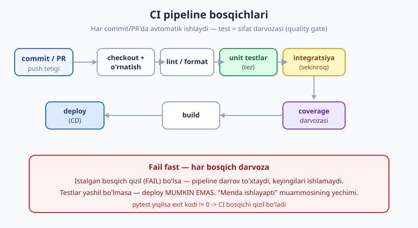
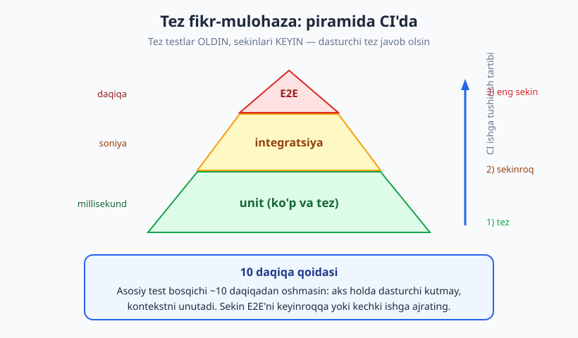
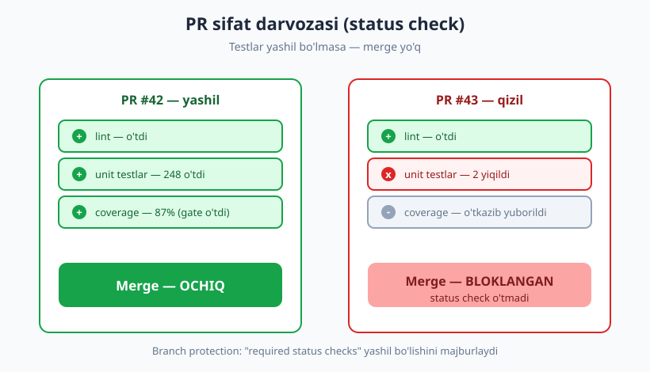

# 27 — Test avtomatlashtirish va CI/CD

[🏠 README](./README.md) · [⬅️ Oldingi: 26 — Xavfsizlik testlash asoslari](./26-xavfsizlik-testlash.md) · [Keyingi: 28 — Test strategiyasi va testing quadrants ➡️](./28-test-strategiyasi-quadrants.md)

---

> **Bu bobda:** testlarni qanday qilib **har bir o'zgarishda avtomatik** ishga tushirishni
> o'rganamiz. Continuous Integration (CI) — bu "Menda ishlayapti" muammosining yechimi: har commit/PR'da
> testlar serverda mustaqil ishlaydi. CI pipeline bosqichlarini, "tez fikr-mulohaza" tamoyilini,
> test tanlash va parallellashtirish g'oyalarini, hamda CI uchun muhim pytest bayroqlarini
> (`-x`, `--maxfail`, `--lf`, marker bilan tanlash, `--junitxml`) ko'ramiz. Test bu yerda
> **sifat darvozasi** (quality gate): yiqilsa, kod birlashmaydi va deploy bo'lmaydi.
>
> **Halollik / Eslatma:** CI sozlash — bir martalik investitsiya, lekin uzoq muddatda majburiy.
> Bu bob CI bayroqlari va tanlash texnikasini **haqiqatan ishlatib** ko'rsatadi (Python 3.14,
> pytest 9.0.3); GitHub Actions YAML esa **konseptual** keltiriladi — uni serverda ishga
> tushirmaymiz, faqat o'qiymiz. Parallellashtirish (`pytest-xdist -n`) ham g'oya darajasida
> ko'rsatiladi (uni o'rnatish va ishga tushirish CI mashinasida bo'ladi). CI/CD ning to'liq
> tomoni — deploy, muhitlar, sirlar — alohida [DevOps kitobi](../devops/README.md)da.
> Barcha pytest chiqishlari **haqiqiy run'dan olingan**, to'qib chiqarilmagan.

---

## Muammo: "lekin menda ishlayapti-ku"

Tasavvur qiling, oshxonada ajoyib taom pishirdingiz va u **faqat sizning oshxonangizda** mazali
chiqadi — boshqa hech kim takrorlay olmaydi, chunki retsept boshingizda. Bunday taom restoranga
yaramaydi. Test ham xuddi shunday: agar u faqat "lokal mashinada, men ishlatganimda" o'tsa —
befoyda. Hamkasbingiz kodni yuklab oladi, testni ishga tushiradi va u yiqiladi: chunki sizda
o'rnatilgan bir paket unda yo'q, yoki siz unutib qoldirgan bir fayl bor.

Bu klassik **"menda ishlayapti"** (works on my machine) muammosi. Yechim — testlarni **sizning
mashinangizdan tashqarida**, toza, takrorlanadigan muhitda ishga tushirish. Aynan shu —
**Continuous Integration** (CI, uzluksiz integratsiya): har safar kod o'zgarganda (commit yoki
pull request) maxsus server kodni noldan oladi, bog'liqliklarni o'rnatadi va **barcha testlarni
avtomatik ishga tushiradi**. Natija hammaga ko'rinadi: yashil (o'tdi) yoki qizil (yiqildi).

> **Eslatma:** CI bu sizning lokal testlaringizni almashtirmaydi — to'ldiradi. Siz baribir kommitdan
> oldin lokal test ishlatasiz (tez fikr olish uchun). CI esa **xolis hakam**: "men nima
> o'rnatganimdan" qat'i nazar, kod toza muhitda haqiqatan ishlaydimi — shuni aytadi.

---

## CI/CD nima — qisqacha

Ikki atamani aniq farqlaymiz:

- **CI (Continuous Integration / uzluksiz integratsiya):** dasturchilar o'zgarishlarni tez-tez
  (kuniga bir necha bor) umumiy shoxga qo'shadi; har qo'shilishda **build + testlar avtomatik**
  ishlaydi. Maqsad — integratsiya muammosini erta topish.
- **CD (Continuous Delivery / Deployment, uzluksiz yetkazib berish / joylashtirish):** testlardan
  o'tgan kod avtomatik tarzda (yoki bir tugma bilan) muhitga **deploy** qilinadi.

Bu kitob — testlash haqida, shuning uchun biz **CI'ning test qismiga** e'tibor beramiz. To'liq
deploy, muhitlar va infratuzilma — [DevOps kitobida](../devops/README.md). Bizning bog'lanish
nuqtamiz bitta va kuchli:

> **Test = sifat darvozasi (quality gate).** Pipeline'da testlar yiqilsa — keyingi bosqichlar
> (build, deploy) **ishlamaydi**. Sifatsiz kod produktsiyaga o'tib ketolmaydi. Test bu darvozaning
> qulfi.

---

## CI pipeline bosqichlari

CI server kodni bir necha **bosqich** (stage) orqali o'tkazadi. Test nuqtai nazaridan tipik tartib:



1. **Checkout** — kodni repozitoriydan oladi (toza nusxa).
2. **O'rnatish** — bog'liqliklarni o'rnatadi (`pip install -r requirements.txt`).
3. **Lint / format** — kod uslubini tekshiradi (masalan `ruff`, `flake8`). Tez, arzon.
4. **Unit testlar** — eng tez testlar. Sekundlarda javob.
5. **Integratsiya testlar** — sekinroq (DB, tarmoq). [15-bob](./15-integratsiya-testlari.md).
6. **Coverage darvozasi** — qamrov belgilangan foizdan past bo'lsa, yiqitadi
   ([20-bob](./20-code-coverage.md)).
7. **Build** — artefakt (paket, Docker image) yig'adi.
8. **(E2E)** — eng sekin uchidan-uchiga testlar ([19-bob](./19-e2e-ui-testlar.md)) — ko'pincha
   keyinroq yoki alohida.
9. **Deploy** — bu CD qismi.

### Fail fast — tez yiqil

Eng muhim tamoyil: **fail fast** (tez yiqil). Har bosqich — darvoza. Lint yiqilsa, testlargacha
borishning hojati yo'q — pipeline darrov to'xtaydi. Bu vaqt va resursni tejaydi: dasturchi
"248 ta integratsiya testi 8 daqiqa ishlab, oxirida lint xatosi" deb kutib o'tirmaydi.

Texnik asos oddiy: **pytest yiqilsa, jarayonning exit kodi 0 dan farqli bo'ladi**, va CI har
buyruqning exit kodini tekshiradi — 0 bo'lmasa, bosqich qizil.

```text
# Hammasi o'tdi:
3 passed   -> exit kodi: 0   (CI bosqichi yashil)
# Yiqilish bor:
2 failed, 2 passed -> exit kodi: 1   (CI bosqichi qizil, pipeline to'xtaydi)
```

> **Eslatma:** Bu raqamlar bobning [test_failfast.py] misolidan haqiqatan olingan. Aynan shu
> exit-kod mexanizmi tufayli CI hech qanday maxsus "pytest tushunadigan" plagin'siz ham testlarni
> darvoza qila oladi: u shunchaki "buyruq 0 qaytardimi?" deb so'raydi.

---

## Tez fikr-mulohaza: piramida CI'da

CI'ning asosiy qiymati — **tez fikr-mulohaza** (fast feedback). Dasturchi kod yozib, commit
qilgach, **iloji boricha tez** "yashil yoki qizil" javobini olishi kerak. Agar javob 40 daqiqada
kelsa — dasturchi allaqachon boshqa ishga o'tib, kontekstni unutgan bo'ladi. Sekin CI dasturchilarni
"testni o'tkazib yuborish"ga undaydi — eng yomon natija.

Bu yerda [03-bobdagi test piramidasi](./03-test-turlari-piramida.md) bevosita ishlaydi:



- **Tez testlar oldin.** Ko'p sonli **unit** testlar (millisekundlar) birinchi ishlaydi. Agar
  ular yiqilsa — dasturchi sekundlar ichida xabar oladi.
- **Sekinlari keyin.** Integratsiya (soniyalar) keyin, **E2E** (daqiqalar) eng oxirida.
- **10 daqiqa qoidasi.** Asosiy test bosqichi taxminan 10 daqiqadan oshmasligi maqsad qilinadi.
  Sekin E2E to'plamini alohida bosqichga yoki kechki (tunda ishlaydigan) build'ga ajratish odatiy.

> **Trade-off:** tezlik vs to'liqlik. Har commit'da hamma narsani (E2E ham) ishga tushirsangiz —
> eng to'liq ishonch, lekin sekin (dasturchini bloklaydi). Faqat unit ishlatib qolsangiz — tez,
> lekin integratsiya xatolari kechroq topiladi. Amaliy yechim: **bosqichlash** — tez darvoza har
> commit'da, to'liq to'plam kamroq (merge'dan oldin yoki kechasi).

---

## Test tanlash va parallellashtirish

Loyiha o'sgani sayin testlar minglab bo'ladi va to'liq run sekinlashadi. Ikki asosiy quroldan
foydalanamiz: **kerakli testlarnigina tanlash** va **parallel ishga tushirish**.

Quyidagi misol bilan ishlaymiz. Sinaladigan kod `narx.py`:

```python
# narx.py — sinaladigan kod
def chegirma(narx, foiz):
    if not 0 <= foiz <= 100:
        raise ValueError("foiz 0..100 oraligida bolishi kerak")
    return round(narx * (100 - foiz) / 100, 2)
```

Testlar `test_narx.py` — uchta **tez** unit test va bitta **sekin** test (`slow` marker bilan):

```python
# test_narx.py
import time
import pytest
from narx import chegirma

def test_oddiy_chegirma():
    assert chegirma(100, 20) == 80.0

def test_nol_chegirma():
    assert chegirma(50, 0) == 50.0

def test_notogri_foiz_xato_beradi():
    with pytest.raises(ValueError):
        chegirma(100, 150)

@pytest.mark.slow                 # sekin / integratsiya testini belgilaymiz
def test_sekin_integratsiya():
    time.sleep(0.3)               # sekin amalni taqlid qiladi
    assert chegirma(200, 50) == 100.0
```

Markerni `pytest.ini` da ro'yxatdan o'tkazamiz (aks holda pytast ogohlantirish beradi):

```ini
# pytest.ini
[pytest]
markers =
    slow: sekin testlar (CI'da alohida bosqichda)
```

### 1) Marker bilan tanlash — `-m`

CI'ning "tez darvoza" bosqichida sekin testlarni **o'tkazib yuboramiz**:

```text
$ python -m pytest -q -m "not slow"
...                                                                      [100%]
3 passed, 1 deselected in 0.55s
```

3 ta tez test ishladi, sekin test **deselected** (tanlanmadi). Faqat sekinlarini ishga tushirish —
alohida (sekin) bosqich uchun:

```text
$ python -m pytest -q -m slow
.                                                                        [100%]
1 passed, 3 deselected in 0.83s
```

Bu — CI'da bosqichlashning bevosita quroli: tez bosqich `-m "not slow"`, sekin bosqich `-m slow`.

### 2) Nom bo'yicha tanlash — `-k`

`-k` ifoda bilan nomi mos testlarni tanlaydi (PR faqat bitta funksiyaga tekkanda foydali):

```text
$ python -m pytest -q -k "chegirma and not nol"
.                                                                        [100%]
1 passed, 3 deselected in 0.54s
```

### 3) Faqat oxirgi yiqilganlarni qayta ishlatish — `--lf`

`--lf` (last-failed) — pytest oxirgi run'da **yiqilgan** testlarni eslab qoladi va keyingi safar
faqat o'shalarni ishlatadi. Tuzatishda fikr-mulohazani keskin tezlashtiradi. Avval to'liq run
(ikki test ataylab yiqiladi):

```text
$ python -m pytest -q test_failfast.py
=========================== short test summary info ===========================
FAILED test_failfast.py::test_b_yiqiladi - assert (2 + 2) == 5
FAILED test_failfast.py::test_c_yiqiladi - assert 'ha' == "yo'q"
2 failed, 2 passed in 0.78s
```

Endi `--lf` — faqat o'sha 2 ta yiqilgan testni qayta ishlatadi:

```text
$ python -m pytest -q test_failfast.py --lf
=========================== short test summary info ===========================
FAILED test_failfast.py::test_b_yiqiladi - assert (2 + 2) == 5
FAILED test_failfast.py::test_c_yiqiladi - assert 'ha' == "yo'q"
2 failed, 2 deselected in 0.74s
```

2 ta yiqilgan ishladi, qolgan 2 tasi **deselected**. Yaqin qarindoshi `--ff` (failed-first):
yiqilganlarni **birinchi** ishlatadi, lekin qolganini ham ishlatadi.

### 4) Parallellashtirish — `-n` (g'oya)

Testlar bir-biridan mustaqil bo'lsa ([04-bob: izolyatsiya](./04-yaxshi-test-xossalari.md)), ularni
bir necha CPU yadrosida **parallel** ishlatish mumkin. Bu `pytest-xdist` plagini bilan qilinadi:

```bash
pip install pytest-xdist
python -m pytest -n auto      # mavjud yadrolarga bo'lib taqsimlaydi
```

`-n auto` testlarni yadrolar bo'yicha bo'ladi — to'plam katta bo'lsa, vaqtni sezilarli qisqartiradi.

> **Diqqat:** parallellashtirish **faqat testlar haqiqatan mustaqil bo'lsa** ishlaydi. Umumiy
> holatga (global o'zgaruvchi, bir DB yozuvi, bir fayl) tayangan testlar parallelda **flaky**
> bo'ladi ([24-bob](./24-flaky-testlar.md)) — tartibga bog'liqlik yuzaga chiqadi. Parallel CI —
> izolyatsiyaning halol imtihoni.

---

## Fail-fast bayroqlari: `-x` va `--maxfail`

CI bosqichini tezroq qizil qilish uchun **birinchi(lar) yiqilganda to'xtatish** mumkin.
`-x` — birinchi yiqilishda darrov to'xtaydi:

```text
$ python -m pytest -q test_failfast.py -x
=========================== short test summary info ===========================
FAILED test_failfast.py::test_b_yiqiladi - assert (2 + 2) == 5
!!!!!!!!!!!!!!!!!!!!!!!!!! stopping after 1 failures !!!!!!!!!!!!!!!!!!!!!!!!!!
1 failed, 1 passed in 0.74s
```

`--maxfail=N` — N ta yiqilishdan keyin to'xtaydi (`-x` = `--maxfail=1`):

```text
$ python -m pytest -q test_failfast.py --maxfail=1
1 failed, 1 passed in 0.68s
```

> **Trade-off:** `-x` CI'ni tez qizil qiladi (resurs tejaydi), lekin **bitta** yiqilishni
> ko'rsatadi — qolgan muammolar yashirin qoladi. Ba'zi jamoalar to'liq run'ni afzal ko'radi:
> "hamma yiqilishlarni bir martada ko'ramiz". Tanlov jamoaga bog'liq; tipik amaliyot — lokalda
> `-x` (tez tuzatish uchun), CI'da to'liq (umumiy manzara uchun).

---

## CI konfiguratsiya (konseptual)

Endi bu bayroqlarni **CI faylida** qanday yozishini ko'ramiz. Eng keng tarqalgani — **GitHub
Actions**: repozitoriyda `.github/workflows/test.yml` fayli. Quyidagi YAML'ni biz **ishga
tushirmaymiz** — u GitHub serverida ishlaydi. Faqat o'qib, tuzilishini tushunamiz:

```yaml
# .github/workflows/test.yml  (konseptual — GitHub serverida ishlaydi)
name: testlar
on: [push, pull_request]        # har push va PR'da tetiklanadi

jobs:
  test:
    runs-on: ubuntu-latest
    strategy:
      matrix:
        python-version: ["3.12", "3.13", "3.14"]   # bir necha versiyada sinash
    steps:
      - uses: actions/checkout@v4                   # 1) kodni ol
      - uses: actions/setup-python@v5               # 2) Python o'rnat
        with:
          python-version: ${{ matrix.python-version }}
      - run: pip install -r requirements.txt        # 3) bog'liqliklar
      - run: python -m pytest -q -m "not slow"      #    tez darvoza
        # ^ qaytgan exit kodi 0 bo'lmasa, bu qadam (va job) QIZIL bo'ladi
      - run: python -m pytest -q -m slow            #    sekin bosqich
      - run: python -m pytest --cov=narx --cov-fail-under=80   # coverage darvozasi
```

E'tibor bering — **matrix** bir nechta Python versiyasida (3.12, 3.13, 3.14) parallel job yaratadi:
"mening 3.14'imda ishlaydi, lekin foydalanuvchining 3.12'sida-chi?" savoliga javob. Bu — CI'ning
yana bir kuchi: bir vaqtning o'zida ko'p muhitda sinash.

> **Eslatma (boshqa tizimlar):** g'oya hamma yerda bir xil. **GitLab CI** — `.gitlab-ci.yml`,
> bosqichlar `stages:` ostida; **Jenkins** — `Jenkinsfile` (Groovy), `stage('Test') { ... }`;
> **CircleCI** — `.circleci/config.yml`. Sintaksis farq qiladi, mantiq bir xil: tetik -> bosqichlar
> -> har bosqich exit kodi -> darvoza. Til-mustaqil: JS'da `npm test`, PHP'da `vendor/bin/phpunit`,
> Go'da `go test ./...` — CI ularning exit kodini xuddi shunday tekshiradi.

---

## Test natijalari va hisobot

CI faqat "o'tdi/yiqildi" emas — **strukturalangan hisobot** ham beradi. Ikki asosiy format:

### JUnit XML — `--junitxml`

Ko'pchilik CI tizimlari **JUnit XML** formatini tushunadi va uni chiroyli jadval/grafikga
aylantiradi (qaysi test qancha ishladi, qaysi biri yiqildi). pytast uni `--junitxml` bilan
chiqaradi:

```text
$ python -m pytest -q test_narx.py -m "not slow" --junitxml=natija.xml
3 passed, 1 deselected in 0.57s
```

Hosil bo'lgan `natija.xml` ning xulosa qatori (haqiqiy run'dan):

```xml
<testsuite name="pytest" errors="0" failures="0" skipped="0" tests="3" time="0.290" ...>
```

CI bu faylni o'qib, PR sahifasida "3 test, 0 yiqildi" deb ko'rsatadi.

### Coverage darvozasi — `--cov-fail-under`

[20-bobdagi](./20-code-coverage.md) coverage'ni CI'da **darvoza** qilamiz: qamrov belgilangan
foizdan past bo'lsa, bosqich yiqiladi:

```text
$ python -m pytest -q test_narx.py -m "not slow" --cov=narx --cov-report=term-missing --cov-fail-under=80
Name      Stmts   Miss  Cover   Missing
---------------------------------------
narx.py       4      0   100%
---------------------------------------
TOTAL         4      0   100%
Required test coverage of 80% reached. Total coverage: 100.00%
3 passed, 1 deselected in 0.60s
```

Coverage 80% talabidan yuqori — darvoza ochiq (exit 0). Agar 80% dan past bo'lganda, pytast
qizil exit kodi qaytarib, CI bosqichini yiqitardi.

> **Diqqat:** coverage darvozasini ehtiyotkorlik bilan ishlating. `--cov-fail-under=100` —
> Goodhart qonuni tuzog'i ([20-bob](./20-code-coverage.md)): odamlar raqamni qondirish uchun
> assert'siz test yozadi. Amaliy yondashuv — **diff coverage** (yangi kod uchun yuqori talab),
> umumiy raqam uchun esa yumshoqroq darvoza.

### PR'da ko'rinish va status check

Bularning hammasi PR sahifasida **status check** sifatida ko'rinadi: har bosqich yonida yashil
belgi yoki qizil belgi. **Branch protection** sozlamasi bilan "required status checks"
o'tmaguncha **merge tugmasi bloklanadi**:



Bu — testning eng kuchli ijtimoiy ta'siri: sifatsiz kod **texnik jihatdan** birlasha olmaydi,
"keyin tuzataman" degan va'da yo'q.

---

## Flaky testlar CI'ni bloklaydi

[24-bobdagi](./24-flaky-testlar.md) **flaky** test (goh o'tadi, goh yiqiladi) CI'da alohida
zararli: u butun jamoani bloklaydi. Dasturchi PR'i yashil bo'lishi kerak, lekin begona,
o'zining o'zgarishiga aloqasiz test tasodifan qizil bo'ladi. Natija — eng xavfli odat:
dasturchilar **"shunchaki qayta ishga tushir"** (re-run) tugmasini bosishni o'rganadi va asta-sekin
qizil natijaga umuman ishonmay qo'yadi.

Amaliy choralar:

- **Karantin (quarantine):** flaky deb tasdiqlangan testni alohida (deselected/marker bilan) ajratib,
  uni darvozadan **vaqtincha** chiqarib qo'yiladi — lekin "tuzatish kerak" ro'yxatiga yoziladi.
- **Cheklangan retry:** ba'zi jamoalar flaky testga avtomatik 1-2 marta qayta urinish beradi
  (masalan `pytest-rerunfailures`). Bu — **pansuvlash**, ildizni davolamaydi; halol yechim emas.

> **Halol gap:** retry — flaky muammosini **yashiradi**, hal qilmaydi. To'g'ri yo'l — flaky'ni
> [24-bobdagi](./24-flaky-testlar.md) usullar bilan **topib tuzatish**. Retry'ni faqat tuzatishgacha
> vaqtinchalik "qon to'xtatuvchi" sifatida ishlating.

---

## Pre-commit hook — mahalliy tez darvoza (konseptual)

CI — oxirgi darvoza, lekin u serverda ishlaydi va javobi sekinroq keladi. **Pre-commit hook** —
commit qilingunizdan **oldin** lokal mashinada tez tekshiruv (lint, format, eng tez testlar)
ishlatadigan mexanizm. Bu — eng arzon, eng tez fikr-mulohaza: xato CI'gacha bormay, sizning
mashinangizda ushlanadi.

```yaml
# .pre-commit-config.yaml  (konseptual — git commit paytida ishlaydi)
repos:
  - repo: local
    hooks:
      - id: tez-testlar
        name: tez unit testlar
        entry: python -m pytest -q -m "not slow" -x
        language: system
        pass_filenames: false
```

> **Trade-off:** pre-commit hook'ni **og'ir** qilib yubormang. Agar har commit 2 daqiqa kutdirsa,
> dasturchilar uni `git commit --no-verify` bilan o'tkazib yuboradi. Faqat eng tez, eng arzon
> tekshiruvlar (lint + tez unit) hook'da; to'liq to'plam — CI'da.

---

## Halol xulosa: CI investitsiyasi

CI sozlash — bir martalik **investitsiya** (YAML yozish, sirlarni sozlash, sekin testlarni
ajratish). Birinchi kunlarda og'ir tuyuladi. Lekin uzoq muddatda u **majburiy**: u "menda
ishlayapti" muammosini yo'q qiladi, regressiyalarni avtomatik tutadi va sifatni ijtimoiy emas,
texnik darvozaga aylantiradi.

Bitta shart bilan: **CI tez va ishonchli bo'lishi kerak**. Sekin CI (yarim soat) yoki flaky CI
(tez-tez yolg'on qizil) — teskari natija beradi: dasturchilar testni o'tkazib yuborishni, qayta
ishga tushirishni va oxir-oqibat natijaga ishonmaslikni o'rganadi. Tez, barqaror, bosqichlangan
CI — sifat madaniyatining poydevori.

---

## Asosiy g'oyalar (bobni qisqacha)

- **CI = "menda ishlayapti" muammosining yechimi.** Testlar sizning mashinangizdan tashqarida,
  toza muhitda, har commit/PR'da avtomatik ishlaydi.
- **Test = sifat darvozasi.** pytast yiqilsa exit kodi 0 dan farqli -> CI bosqichi qizil ->
  build/deploy **bo'lmaydi**.
- **Fail fast.** Har bosqich darvoza; biri yiqilsa pipeline darrov to'xtaydi (`-x`, `--maxfail`).
- **Tez fikr-mulohaza.** Tez testlar (unit) oldin, sekinlari (integratsiya, E2E) keyin; ~10 daqiqa
  qoidasi. Piramida CI'da ham ishlaydi.
- **Test tanlash.** `-m "not slow"` / `-m slow` bilan bosqichlash, `-k` bilan nom bo'yicha,
  `--lf` bilan faqat oxirgi yiqilganlar — fikr-mulohazani tezlashtiradi.
- **Parallellashtirish (`-n`)** faqat testlar mustaqil bo'lsa ishlaydi — izolyatsiyaning halol imtihoni.
- **Hisobot:** `--junitxml` (CI jadvali), `--cov-fail-under` (coverage darvozasi), PR status check
  + branch protection (merge bloki).
- **Flaky CI — xavf:** "qayta ishga tushir" odatini tug'diradi; karantin/retry — vaqtincha,
  tuzatish — asosiy.
- **CI — investitsiya, lekin majburiy;** sekin/flaky CI teskari natija beradi.

---

## Mashqlar

### Oson

**1-mashq.** "Menda ishlayapti" muammosi nima va CI uni qanday hal qiladi? Bir-ikki jumlada
tushuntiring.

**2-mashq.** Quyidagi pytast buyruqlarining har biri nima qiladi:
`-m "not slow"`, `-x`, `--lf`, `--junitxml=natija.xml`?

**3-mashq.** "Fail fast" tamoyilini o'z so'zlaringiz bilan tushuntiring. CI texnik jihatdan
qanday qilib biladi — bosqich o'tdimi yoki yiqildimi?

### O'rta

**4-mashq.** CI'da nima uchun unit testlarni integratsiya/E2E testlardan **oldin** ishga tushirish
maqsadga muvofiq? "Tez fikr-mulohaza" va "10 daqiqa qoidasi" bilan bog'lang.

**5-mashq.** Quyidagi test fayllarini ikki CI bosqichiga bo'lmoqchisiz: "tez darvoza" (har
commit'da) va "to'liq" (kechasi). `@pytest.mark.slow` markeridan foydalanib, ikkala bosqich uchun
pytast buyrug'ini yozing.

**6-mashq.** Hamkasbingiz "CI sekin, har safar 30 daqiqa kutaman, shuning uchun testlarni o'tkazib
yuboraman" deydi. Muammoning ildizi nimada va siz uni qanday hal qilgan bo'lardingiz? Kamida ikkita
aniq taklif bering (bu bobdagi tushunchalardan).

### Qiyin

**7-mashq.** Jamoangizda bitta test CI'da goh o'tadi, goh yiqiladi (flaky). Ba'zi dasturchilar
"shunchaki avtomatik 3 marta qayta urinaylik" deydi. Bu yondashuvning xavfi nimada? Qisqa muddatli
va uzoq muddatli to'g'ri reaksiyani taklif qiling (24-bobga ishora qiling).

**8-mashq.** GitHub Actions matrix'i kodni 3 ta Python versiyasida (3.12, 3.13, 3.14) sinaydi.
(a) Bu qanday muammoni oldini oladi? (b) Bir versiyada test yiqilsa, lekin qolganlarida o'tsa —
butun PR yashil bo'lishi kerakmi? Nega? (c) Matrix nimasi bilan parallellashtirishning bir turi?

<details markdown="1">
<summary>Yechimlar</summary>

### 1-mashq yechimi

"Menda ishlayapti" — kod faqat muallifning lokal mashinasida (uning maxsus sozlamasi, o'rnatilgan
paketlari, unutilgan fayllari bilan) ishlaydi, lekin boshqalarda yiqiladi. CI buni hal qiladi:
har commit/PR'da kodni **toza, mustaqil serverda** noldan oladi, bog'liqliklarni o'rnatadi va
barcha testlarni ishga tushiradi. Shunday qilib "men nima o'rnatganim"ga bog'liqlik yo'qoladi —
kod haqiqatan **takrorlanadigan** muhitda ishlaydimi, shu sinaladi.

### 2-mashq yechimi

- `-m "not slow"` — `slow` markeri **bo'lmagan** testlarni tanlaydi (qolganini deselect qiladi).
- `-x` — birinchi yiqilishda darrov to'xtaydi (= `--maxfail=1`).
- `--lf` — oxirgi run'da **yiqilgan** testlarnigina qayta ishga tushiradi.
- `--junitxml=natija.xml` — natijalarni JUnit XML formatida `natija.xml` ga yozadi (CI o'qiydi).

### 3-mashq yechimi

Fail fast — pipeline'da istalgan bosqich yiqilsa, **darrov to'xtash** (keyingilarini ishlatmaslik).
Bu vaqt va resursni tejaydi: lint yiqilsa, 10 daqiqalik testlarni kutishning hojati yo'q. CI buni
**exit kodi** orqali biladi: har buyruq tugagach exit kodi qaytaradi — `0` = muvaffaqiyat (yashil),
`0` dan farqli = xato (qizil). pytast yiqilgan testda 1 qaytaradi, shuning uchun CI bosqichi qizil
bo'ladi va pipeline to'xtaydi.

### 4-mashq yechimi

Unit testlar **eng tez** (millisekundlar) va eng ko'p. Ularni oldin ishlatib, kodning aksariyat
xatolari sekundlar ichida topiladi — dasturchi tez javob oladi (tez fikr-mulohaza). Agar sekin
E2E'ni oldin qo'ysangiz, dasturchi 8 daqiqa kutib, oxirida oddiy unit xatosini ko'radi — vaqt
isrofi. "10 daqiqa qoidasi": asosiy test bosqichi ~10 daqiqada tugashi kerak, aks holda dasturchi
kontekstni unutadi va CI'ni "o'tkazib yuborish"ga moyil bo'ladi. Shuning uchun: tez oldin, sekin
keyin (yoki alohida bosqichda).

### 5-mashq yechimi

```bash
# Tez darvoza (har commit'da): sekinlardan tashqari hammasi
python -m pytest -q -m "not slow"

# To'liq (kechasi): faqat sekin testlar (yoki butun to'plam)
python -m pytest -q -m slow
# yoki butun to'plam: python -m pytest -q
```

Testlarni `@pytest.mark.slow` bilan belgilab, `pytest.ini` da markerni ro'yxatdan o'tkazasiz.
Shunday qilib bitta to'plamni ikki bosqichga bo'lasiz — kod takrorlanmasdan.

### 6-mashq yechimi

Ildiz: **sekin CI** dasturchini bloklaydi, u esa testni o'tkazib yuborishni o'rganadi — bu eng
xavfli natija (sifat darvozasi yo'qoladi). Yechimlar (bobdan):
1. **Bosqichlash + tez fikr-mulohaza:** tez unit testlarni alohida, oldin ishlatib, javobni
   sekundlarga keltirish (`-m "not slow"`); sekin E2E'ni alohida/kechki bosqichga ko'chirish.
2. **Parallellashtirish:** `pytest-xdist -n auto` bilan testlarni yadrolar bo'yicha taqsimlash
   (testlar mustaqil bo'lsa).
3. **Test tanlash:** PR'da o'zgargan qismga tegishli testlarni tanlash (`-k`, marker), `--lf`/`--ff`
   bilan yiqilganlarga ustuvorlik. "10 daqiqa qoidasi"ga intilish — maqsad shu.

### 7-mashq yechimi

Xavf: avtomatik retry flaky testni **yashiradi**, ildizini davolamaydi. Asta-sekin jamoa qizil
natijaga ishonmay qo'yadi ("baribir 3 marta urinadi-ku"), va flaky test ortida yashiringan
**haqiqiy** xato ham e'tibordan chetda qoladi. To'g'ri reaksiya:
- **Qisqa muddat:** flaky testni **karantinga** olish (darvozadan vaqtincha chiqarish, lekin
  "tuzatish kerak" ro'yxatiga yozish) — bu butun jamoani bloklamaslik uchun; retry'ni faqat
  vaqtinchalik "qon to'xtatuvchi" sifatida.
- **Uzoq muddat:** [24-bobdagi](./24-flaky-testlar.md) usullar bilan sababini topib (async/vaqt/
  tartib/umumiy holat) **tuzatish** va testni karantindan qaytarish.

### 8-mashq yechimi

(a) Matrix "mening 3.14 muhitimda ishlaydi, lekin foydalanuvchining 3.12'sida-chi?" muammosini
oldini oladi — kod **bir necha muhitda** mosligi avtomatik tekshiriladi (versiyaga bog'liq xatolar
erta topiladi).
(b) Yo'q — agar **biror** versiyada yiqilsa, butun PR **qizil** bo'lishi kerak. Sababi: siz o'sha
versiyani qo'llab-quvvatlashga va'da bergansiz, demak kod unda ishlamasligi haqiqiy xato. (Agar
versiyani qo'llab-quvvatlamasangiz — uni matrix'dan olib tashlang.)
(c) Matrix har versiya uchun **alohida, bir vaqtda ishlaydigan job** yaratadi — ya'ni bu ham bir
turdagi parallellashtirish (testlarni bir mashinada yadrolarga bo'lish emas, balki butun to'plamni
bir necha mashinada/muhitda bir vaqtda ishlatish).

</details>

---

[🏠 README](./README.md) · [⬅️ Oldingi: 26 — Xavfsizlik testlash asoslari](./26-xavfsizlik-testlash.md) · [Keyingi: 28 — Test strategiyasi va testing quadrants ➡️](./28-test-strategiyasi-quadrants.md)
