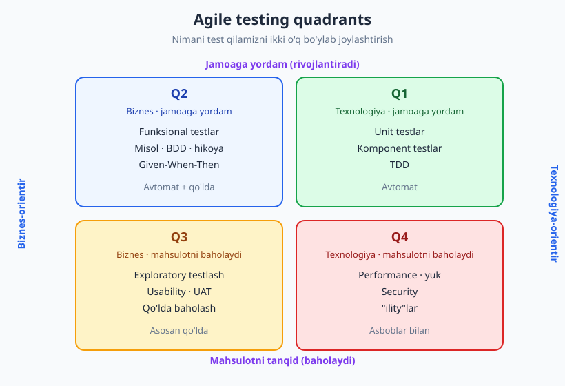
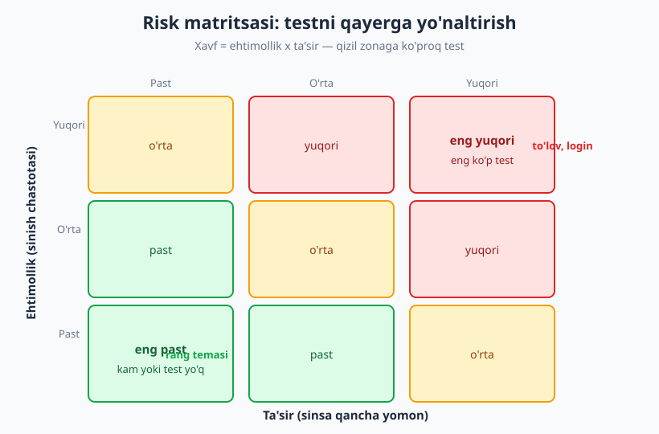
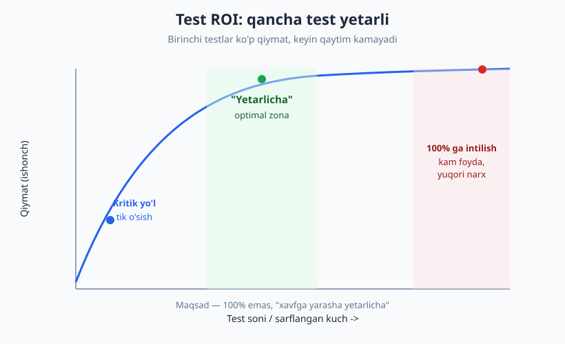

# 28 — Test strategiyasi va testing quadrants

[🏠 README](./README.md) · [⬅️ Oldingi: 27 — Test avtomatlashtirish va CI/CD](./27-ci-cd-avtomatlashtirish.md) · [Keyingi: 29 — Eski (legacy) kodni testlash ➡️](./29-legacy-kodni-testlash.md)

---

> **Bu bobda:** kitobning eng yuqori darajadagi savoliga javob beramiz — **nimani, qancha va qanday**
> test qilishni qanday HAL QILISH kerak. Hamma narsani test qilib bo'lmaydi (kirish cheksiz, vaqt
> cheklangan), shuning uchun strategiya = cheklangan resursni eng katta xavfni qamrash uchun
> yo'naltirish. **Agile testing quadrants** (qaysi turdagi testlar bor), **risk-asosli testlash**
> (qayerga ko'proq test), **ROI** ("qancha yetarli") va yengil **test strategiyasi hujjati** — bu
> bob butun kitobni bog'laydi.
>
> **Halollik / Eslatma:** bu bob ko'proq STRATEGIK — ko'p qarorlar, kam kod. Lekin "test qarori"
> ham haqiqiy bo'lishi uchun ikkita **jonli pytest** namunasi bor: funksiyalarni xavf bo'yicha
> tabaqalashtirish va `marker` bilan ajratish. Quadrants modeli (Brian Marick, keyin Lisa Crispin &
> Janet Gregory) — *aqliy xarita*, qonun emas: sizning kontekstingizda kvadrantlar og'irligi
> farq qiladi. Barcha Python namunalari `python -m pytest` (Python 3.14, pytest 9.0.3) bilan
> **haqiqatan ishga tushirib tekshirilgan** — chiqishlar to'qib chiqarilmagan.

---

## Muammo: hamma narsani test qilib bo'lmaydi

Tasavvur qiling, siz uy-joy sug'urta kompaniyasida ishlaysiz. Mijoz uyini sug'urta qilishdan oldin
tekshiruvchi keladi — lekin u **har bir g'isht**ni emas, **har bir simni** emas tekshiradi. U
cheklangan vaqtda eng katta xavf qayerda ekanini topadi: elektr, gaz, tom. Past xavfli narsalarga
(eshik tutqichi rangi) vaqt sarflamaydi.

Testlash ham aynan shunday. Eng oddiy funksiyaning ham kirishlar to'plami **cheksiz**: `summa(a, b)`
ni butun sonlar, kasrlar, manfiylar, nol, juda katta sonlar, `None`, satr... bilan sinash mumkin.
Hammasini sinab bo'lmaydi. Vaqtingiz va e'tiboringiz cheklangan. Demak savol "**hamma narsani
testlaymizmi?**" emas — bunga javob har doim "yo'q". Asl savol:

> **Cheklangan test resursini eng katta xavfni qamrash uchun qayerga yo'naltiraman?**

Strategiya — aynan shu yo'naltirishning rejasi. Bu bob uchta vositani beradi: **xarita** (qanday
test turlari bor — quadrants), **kompas** (qayerga ko'proq — risk), va **to'xtash chizig'i**
(qancha yetarli — ROI).

---

## Agile testing quadrants — testlarning xaritasi

Test turlari haqida o'ylashda eng foydali model — **Agile Testing Quadrants**. Uni Brian Marick
taklif qilgan, keyin Lisa Crispin va Janet Gregory ("Agile Testing" kitobi) ommalashtirgan. Bu
model testlarni **ikki o'q** bo'yicha to'rt kvadrantga ajratadi:

- **Gorizontal o'q — biznes-orientir vs texnologiya-orientir.** Test biznes tilida gapiradimi
  ("mijoz chegirma olishi kerak") yoki texnik tilda ("bu funksiya `None` qaytarmasligi kerak")?
- **Vertikal o'q — jamoaga yordam (supporting) vs mahsulotni tanqid (critique).** Test
  rivojlanishni **yo'naltiradimi** (oldindan yoziladi, "nimani qurish kerak" deydi) yoki tayyor
  mahsulotni **baholaydimi** (keyin, "qanchalik yaxshi qildik" deydi)?



| Kvadrant | O'qlar | Test turlari | Bu kitobda |
|---|---|---|---|
| **Q1** | Texnologiya · jamoaga yordam | Unit, komponent testlar, TDD | [02](./02-birinchi-test-aaa.md), [11](./11-tdd-red-green-refactor.md) |
| **Q2** | Biznes · jamoaga yordam | Funksional, misol-asosli, BDD, hikoya testlari | [14-bob (BDD)](./14-bdd-spetsifikatsiya.md), [15](./15-integratsiya-testlari.md) |
| **Q3** | Biznes · mahsulotni baholaydi | Exploratory, usability, UAT, qo'lda baholash | (asosan qo'lda — avtomatlashmaydi) |
| **Q4** | Texnologiya · mahsulotni baholaydi | Performance, security, yuk, "ility"lar | [25](./25-performance-yuk-testlari.md), [26](./26-xavfsizlik-testlash.md) |

### Har kvadrantni ochib ko'raylik

**Q1 — texnologiya, jamoaga yordam.** Eng kichik, eng tez testlar: unit va komponent testlar. Ular
dasturchiga *darhol* fikr-mulohaza beradi va dizaynni yo'naltiradi (TDD). Bu kvadrant deyarli
**to'liq avtomatlashtirilgan** va eng ko'p sonli testlar shu yerda (test piramidasining keng tubi,
[03-bob](./03-test-turlari-piramida.md)).

**Q2 — biznes, jamoaga yordam.** "Funksiya nima qilishi kerak"ni biznes tilida tasvirlaydigan
testlar: funksional, misol-asosli, BDD (Given-When-Then). Ular ham *oldindan* yoziladi va "to'g'ri
narsani quryapmizmi?" degan savolga javob beradi. Asosan avtomat, ba'zan qo'lda.

**Q3 — biznes, mahsulotni baholaydi.** Bu yerda **inson** kerak: exploratory testing (tajribali
sinovchi mahsulotni "kashfiyot" qilib sinaydi), usability (qulaymi?), UAT (foydalanuvchi qabul
testi). Bularni **avtomatlashtirib bo'lmaydi** — ular insoniy mulohaza, his va ijodni talab qiladi.

**Q4 — texnologiya, mahsulotni baholaydi.** Funksional bo'lmagan ("ility") sifatlar: performance
([25-bob](./25-performance-yuk-testlari.md)), security ([26-bob](./26-xavfsizlik-testlash.md)), yuk,
ishonchlilik, masshtablashuv. Maxsus **asboblar** bilan o'lchanadi.

> **Diqqat:** Quadrants — *prioritet tartibi emas* ("Q1 dan boshlab Q4 gacha qil" degani EMAS).
> U **eslatma ro'yxati**: "biz to'rt xil turdagi testni ham o'yladikmi?". Ko'p jamoa Q1-Q2 ni yaxshi
> qiladi-yu, Q3 (exploratory) va Q4 (performance/security) ni butunlay unutadi — quadrants aynan shu
> ko'r nuqtalarni ochadi.

> **Til-mustaqillik:** quadrants modeli til va texnologiyadan **mustlaqo**. JavaScript, Java, Go,
> PHP — har qanday stack'da bir xil to'rt kvadrant bor. O'zgaradigani — har kvadrantdagi *asbob*
> (unit uchun pytest/Jest/JUnit, E2E uchun Playwright/Selenium), tushuncha esa o'sha.

---

## Risk-asosli testlash — kompas

Quadrants "qanday turdagi test bor" deydi. Endi **"qayerga ko'proq test"** degan savolga kompas
kerak. Javob — **risk-asosli testlash**:

> **Xavf (risk) = ehtimollik × ta'sir.**

- **Ehtimollik** — bu kod buzilishi qanchalik ehtimol? (Murakkab? Tez-tez o'zgaradi? Ko'p tarmoq?)
- **Ta'sir** — buzilsa qanchalik yomon? (Pul yo'qoladimi? Ma'lumot ketadimi? Yoki shunchaki
  rang noto'g'ri ko'rinadimi?)

Eng kuchli savol: **"Nima sinsa eng yomon bo'ladi?"**. To'lov hisoblash sinsa — pul yo'qoladi
(ta'sir yuqori). Tugma rangi noto'g'ri bo'lsa — hech kim o'lmaydi (ta'sir past). Demak to'lovga
ko'p, rangga oz (yoki umuman emas) test.



### JONLI: funksiyalarni xavf bo'yicha tabaqalashtirish

Risk g'oyasini kod bilan aniqlashtiraylik. Mana kichik **xavf bali** moduli — ehtimollik va
ta'sirni 1..5 oralig'ida olib, darajani qaytaradi:

```python
# xavf.py  (sinaladigan kod)
def xavf_bali(ehtimollik, tasir):
    # ehtimollik va tasir: 1 (past) ... 5 (yuqori)
    return ehtimollik * tasir

def daraja(ehtimollik, tasir):
    ball = xavf_bali(ehtimollik, tasir)
    if ball >= 15:
        return "yuqori"
    if ball >= 6:
        return "orta"
    return "past"
```

Endi har bir komponentni xavf bo'yicha tabaqalashtiramiz va parametrlangan test bilan tekshiramiz
([06-bob — parametrize](./06-fixture-parametrize.md)):

```python
# test_xavf.py
import pytest
from xavf import xavf_bali, daraja

@pytest.mark.parametrize("ehtimollik,tasir,kutilgan", [
    (4, 5, "yuqori"),   # tolov mantiqi   -> eng ko'p test arziydi
    (3, 5, "yuqori"),   # login           -> ko'p test
    (3, 2, "orta"),     # qidiruv         -> o'rtacha
    (1, 1, "past"),     # rang temasi     -> kam/test yo'q
])
def test_daraja(ehtimollik, tasir, kutilgan):
    assert daraja(ehtimollik, tasir) == kutilgan

def test_ball():
    assert xavf_bali(4, 5) == 20
```

Ishga tushiramiz:

```bash
python -m pytest test_xavf.py -v
```

Haqiqiy chiqish:

```text
test_xavf.py::test_daraja[4-5-yuqori] PASSED                             [ 20%]
test_xavf.py::test_daraja[3-5-yuqori] PASSED                             [ 40%]
test_xavf.py::test_daraja[3-2-orta] PASSED                               [ 60%]
test_xavf.py::test_daraja[1-1-past] PASSED                               [ 80%]
test_xavf.py::test_ball PASSED                                           [100%]

============================== 5 passed in 0.68s ==============================
```

Bu jadval — strategiyaning yuragi. `tolov` (4×5=20) "yuqori" zonada, `rang_temasi` (1×1=1) "past"da.
Bu degani: test kuchingizning katta qismini to'lov va login mantiqiga, ozini qidiruvga, deyarli
hech qancha rang temasiga sarflang. **Test soni** ham, **test darajasi** ham (unit + integratsiya +
hatto E2E) xavfga yarasha o'sadi.

> **Trade-off:** Risk-asosli yondashuv "past xavfli kod umuman testlanmaydi" degani emas — u
> "cheklangan vaqtni avval yuqori xavfga ber" deydi. Vaqt qolsa, pastga ham tushasiz. Lekin to'lov
> mantiqi test'siz qolib, tugma rangi 100% qoplangan bo'lsa — bu strategiya **teskari** ishlagan.

---

## Marker bilan tabaqalashtirish — jonli ajratish

Risk darajasini *test kodida* ham belgilab qo'yish mumkin — pytest **marker**lari bilan. Bu
CI'da ([27-bob](./27-ci-cd-avtomatlashtirish.md)) tez fikr-mulohaza uchun juda foydali: har commit'da
faqat `kritik` testlar, kechasi esa hammasi ishlaydi.

```python
# tolov.py  (sinaladigan kod)
def tolov_yigindisi(narx, soni, chegirma_foizi=0):
    if narx < 0 or soni < 0:
        raise ValueError("manfiy qiymat")
    oraliq = narx * soni
    return oraliq - oraliq * chegirma_foizi / 100

def tugma_rangi(holat):
    return "yashil" if holat == "faol" else "kulrang"
```

Test fayli — har testga **xavf darajasi markeri**:

```python
# test_tolov.py
import pytest
from tolov import tolov_yigindisi, tugma_rangi

@pytest.mark.kritik
def test_yigindi_oddiy():
    assert tolov_yigindisi(100, 3) == 300

@pytest.mark.kritik
def test_yigindi_chegirma():
    assert tolov_yigindisi(100, 2, 10) == 180

@pytest.mark.kritik
def test_manfiy_xato():
    with pytest.raises(ValueError):
        tolov_yigindisi(-1, 2)

@pytest.mark.kosmetik
def test_tugma_rangi():
    assert tugma_rangi("faol") == "yashil"
```

Marker'larni **ro'yxatdan o'tkazish** kerak (aks holda pytest ogohlantiradi — pastda ko'ramiz).
`pytest.ini` ga yozamiz:

```ini
# pytest.ini
[pytest]
markers =
    kritik: yuqori xavfli, pul/biznes mantiqi (har doim ishga tushadi)
    kosmetik: past xavfli, korinish/yelim kod (kamroq, kechroq)
```

Endi `-m` bayrog'i bilan **kerakli zonani tanlab** ishga tushiramiz:

```bash
python -m pytest -m kritik -q
```

```text
...                                                                      [100%]
3 passed, 1 deselected in 0.55s
```

Faqat 3 ta `kritik` test ishladi, `kosmetik` esa **deselected** (chetga surildi). Teskarisi:

```bash
python -m pytest -m kosmetik -q
```

```text
.                                                                        [100%]
1 passed, 3 deselected in 0.55s
```

Bu real ish jarayoni: PR har ochilganda CI `-m kritik` ishlatadi (tez, pul mantiqini qo'riqlaydi),
to'liq to'plam (`kosmetik` ham) esa kechalik (nightly) yoki merge'dan oldin ishlaydi. Strategiya
shunchaki hujjatda emas — **bajariladigan filtrga** aylandi.

> **Diqqat:** Agar marker'ni `pytest.ini` da ro'yxatdan o'tkazmasangiz, pytest
> `PytestUnknownMarkWarning: Unknown pytest.mark.kritik - is this a typo?` ogohlantirishini beradi.
> Bu juda foydali — `@pytest.mark.kirtik` (xato yozilgan) degan tipni darhol tutadi. Strict rejimda
> (`--strict-markers`) bu ogohlantirish to'g'ridan-to'g'ri **xatoga** aylanadi.

> **Til-mustaqillik:** JS'da bu Jest/Vitest `test.skip`/`describe` teglari yoki fayl naqshlari;
> JUnit'da `@Tag("kritik")` + Maven/Gradle filtr; PHP PHPUnit'da `@group kritik`. G'oya bir xil:
> testlarni **toifalab**, kerakli to'plamni tanlab ishga tushirish.

---

## "Qancha test yetarli" — ROI egri chizig'i

Endi eng noqulay savol: **"qancha test yetarli?"**. Yangi boshlovchi ko'pincha "100%!" deydi.
Tajribali muhandis "yetarlicha" deydi — va buni *xavfga yarasha* aniqlaydi.

Sabab — **kamayuvchi qaytim qonuni** (diminishing returns). Birinchi testlar (kritik yo'l, asosiy
oqim) juda ko'p qiymat keltiradi: ular eng ko'p ishlatiladigan va eng xavfli kodni qoplaydi. Keyin
har qo'shimcha test kamroq yangi xavfni qamraydi. 95% dan 100% gacha bo'lgan oxirgi 5% — odatda
getter, `__repr__`, "bu hech qachon sodir bo'lmaydi" mudofaa shoxlari — yozish qimmat, foydasi past.



| Bosqich | Qiymat | Qaror |
|---|---|---|
| Kritik yo'l (asosiy oqim, to'lov, login) | Juda yuqori | **Albatta test** |
| Muhim chekka holatlar (chegara, xato yo'llari) | Yuqori | Test |
| Nodir kombinatsiyalar | O'rta | Vaqt bo'lsa |
| Trivial getter/setter, `__repr__` | Juda past | Odatda **yo'q** |
| "Hech qachon sodir bo'lmaydi" mudofaa shoxi | Past | Ko'pincha yo'q |

**Signal sifatida ikkita o'lchov yordam beradi** (lekin maqsad emas — [20-bob, Goodhart](./20-code-coverage.md)):

- **Coverage** ([20-bob](./20-code-coverage.md)) — "qayerga test *yetib bordi*". Past coverage =
  aniq ogohlik; yuqori coverage = faqat *ehtimoliy* farovonlik.
- **Mutation score** ([22-bob](./22-mutation-testing.md)) — "testlarim *haqiqatan ish qiladimi*".
  Coverage'dan kuchliroq signal: assert'siz test mutatsiyani tuta olmaydi.

> **Eslatma:** "Yetarlicha" — kontekstga bog'liq. Kardiostimulyator yoki avionika dasturida
> "yetarlicha" coverage 90% emas, balki sertifikatlangan, deyarli to'liq qamrov bo'lishi mumkin.
> Marketing landing sahifasida esa kritik yo'lni qoplash kifoya. Strategiya — *o'z* mahsulotingiz
> uchun "yetarlicha"ni aniqlash, kitobdan ko'chirilgan sehrli raqamni emas.

---

## Nimani test QILMASLIK kerak (halol ro'yxat)

Strategiyaning eng kam aytiladigan, lekin eng yetuk qismi — **nimani testlamaslik**ni bilish.
"Test qilish narxi > foydasi" bo'lgan holatlar:

- **Uchinchi-tomon kutubxona ichini.** `requests`, ORM, yoki standart kutubxonani siz emas, ularning
  muallifi testlaydi. Siz faqat *o'z kodingiz* ularni to'g'ri ishlatishini test qiling (odatda
  integratsiya darajasida).
- **Trivial getter/setter.** `def ism(self): return self._ism` ni testlash — mohiyatan tilning
  o'zini testlash. Foydasi nol.
- **Til/freymvork xususiyatini.** "List `append` ishlaydimi?" — bu Python jamoasining ishi.
- **Tez o'zgaradigan prototip/spike.** Hali shaklga kirmagan, ertaga o'chiriladigan eksperimental
  kodga test yozish — ko'pincha isrof. (Lekin u *qoladigan* bo'lsa — test qarzga aylanadi.)
- **Sof konfiguratsiya/deklaratsiya.** `URL = "..."` kabi konstantani testlash.

> **Trade-off:** "Testlamaslik" — dangasalik bahonasi EMAS. Farq nozik: trivial getter'ni
> testlamaslik to'g'ri, lekin **mantiq bor** getter (masalan, hisoblab qaytaradigan property) —
> bu allaqachon test arziydigan kod. "Bu yerda mantiq bormi?" deb so'rang: yo'q bo'lsa —
> testlamang; bor bo'lsa — xavfiga yarasha testlang.

---

## Test strategiyasi hujjati — yengil, suvsiz

Strategiyani bosh ichida saqlamang — **yozing**, lekin *yengil*. Maqsad — 50 betlik IEEE hujjati
emas, balki bir betlik, jamoa o'qiydigan kelishuv. Yaxshi strategiya hujjati shularga javob beradi:

| Savol | Misol javob |
|---|---|
| **Nimani** test qilamiz? | Kritik: to'lov, auth, narx. Past: UI yelimi, statik matn. |
| **Qaysi darajada?** | Piramida ([03](./03-test-turlari-piramida.md)): ko'p unit, o'rtacha integratsiya, oz E2E. |
| **Qaysi vositalar?** | pytest, coverage, Playwright (E2E), k6 (yuk). |
| **Qaysi muhit?** | Lokal + CI ([27](./27-ci-cd-avtomatlashtirish.md)); integratsiya uchun Testcontainers. |
| **Kim mas'ul?** | Har dasturchi o'z kodiga test yozadi (faqat QA emas). |
| **"Tayyor" ta'rifi (DoD)?** | Kritik yo'l testlangan, CI yashil, review o'tgan, flaky yo'q. |

**Definition of Done (DoD) ga testni kiriting.** "Tayyor" so'zi "men kodni yozdim" emas, balki
"kod yozildi + kritik yo'l testlandi + CI yashil + review o'tdi" degani bo'lsin. Bu test yozishni
ixtiyoriy emas, **jarayonning bir qismi** qiladi.

> **Diqqat:** Strategiya hujjati — *tirik*. Loyiha o'sgani sayin (yangi xavflar, yangi muhitlar)
> uni yangilang. Eskirgan, hech kim o'qimaydigan 40-betlik strategiya — strategiyaning yo'qligidan
> ham yomon, chunki u "bizda strategiya bor" degan soxta xotirjamlik beradi.

---

## Test sifatini boshqarish va jamoaviy madaniyat

Strategiya faqat "yangi test yozish" emas — mavjud test to'plamining **sog'lig'ini** ham boshqaradi:

- **Flaky budjeti** ([24-bob](./24-flaky-testlar.md)). Flaky testlar ishonchni yemiradi. Strategiya
  ularni karantinga oladi, kuzatadi va belgilangan muddatda tuzatadi — "keyinroq" deb qoldirmaydi.
- **Test ishlash vaqti.** Sekin to'plam = kam ishlatiladigan to'plam. Vaqtni o'lchang, sekin
  testlarni ajrating ([27-bob](./27-ci-cd-avtomatlashtirish.md) — parallellashtirish, tanlab ishga tushirish).
- **Qoplanmagan kritik joylar.** Eng xavfli kod test'siz qoldimi? Bu coverage foizidan muhimroq.
- **Metrikalar — ehtiyotkorlik bilan.** Coverage %, test soni, o'tish foizi — chalg'itishi mumkin.
  **Goodhart qonuni** ([20-bob](./20-code-coverage.md)): metrika maqsadga aylansa, buziladi.
  "100% coverage majburiy" — assert'siz testlarga olib keladi.

**Jamoaviy tomon:**

- **Hamma test yozadi**, faqat QA emas. Test — kodning bir qismi, alohida bosqich emas.
- **Test review.** Testlar ham code review'dan o'tsin: "bu testda haqiqiy assert bormi?", "bu test
  nimani himoya qiladi?".
- **Testlar ham texnik qarz bo'lishi mumkin.** Mo'rt, sekin, takrorlangan yoki noto'g'ri darajadagi
  testlar — qarz. Ularni ham boshqarish kerak (dasturiy arxitektura kitobiga ishora:
  [../arxitektura/README.md](../arxitektura/README.md)).

> **Eslatma:** Eng yaxshi strategiya — *jonli* strategiya. U bir marta yozilib unutilmaydi, balki
> retrospektivalarda muhokama qilinadi: "qaysi bug produktsiyaga chiqdi? qaysi test uni tutishi
> kerak edi? strategiyamizda nima yetishmadi?". Strategiya — qaror qabul qilish odatining nomi,
> qog'ozning nomi emas.

---

## Asosiy g'oyalar (bobni qisqacha)

- **Hamma narsani test qilib bo'lmaydi** (cheksiz kirish, cheklangan vaqt). Strategiya = cheklangan
  resursni eng katta xavfni qamrash uchun yo'naltirish.
- **Agile testing quadrants** — testlarning xaritasi: Q1 (unit/TDD), Q2 (funksional/BDD),
  Q3 (exploratory/UAT — qo'lda), Q4 (performance/security). Ikki o'q: biznes vs texnologiya,
  jamoaga yordam vs mahsulotni tanqid. Bu prioritet emas, **eslatma ro'yxati**.
- **Risk-asosli testlash:** xavf = ehtimollik × ta'sir. "Nima sinsa eng yomon?" — to'lov/login'ga
  ko'p, rang temasiga oz. Test soni ham, darajasi ham xavfga yarasha o'sadi.
- **Marker** bilan testlarni toifalab, CI'da kerakli zonani (`-m kritik`) tanlab ishga tushiring.
  Marker'larni `pytest.ini` da ro'yxatdan o'tkazing (`--strict-markers`).
- **"Qancha yetarli" — 100% emas, "yetarlicha".** ROI egri chizig'i: birinchi testlar ko'p qiymat,
  keyin qaytim kamayadi. Coverage va mutation — signal, maqsad emas (Goodhart).
- **Nimani testlamaslik:** uchinchi-tomon ichi, trivial getter, til xususiyati, tez o'zgaradigan
  prototip. "Bu yerda mantiq bormi?" — yo'q bo'lsa, testlamang.
- **Yengil strategiya hujjati:** nimani/qaysi darajada/qaysi vosita/qaysi muhit/kim/DoD. Testni
  Definition of Done'ga kiriting.
- **Hamma test yozadi**, test review bo'ladi, testlar ham texnik qarz bo'lishi mumkin. Strategiya —
  tirik qaror odati, eskirgan qog'oz emas.

---

## Mashqlar

### Oson

**1-mashq.** Agile testing quadrants ikki o'qini va to'rt kvadrantni ayting. Quyidagi testlar qaysi
kvadrantga tushadi: (a) bitta funksiyaning unit testi, (b) yuk testi 1000 foydalanuvchi bilan,
(c) Given-When-Then BDD ssenariy, (d) sinovchining qo'lda exploratory sessiyasi?

**2-mashq.** Risk formulasini yozing va izohlang. Nima uchun "tugma rangi" funksiyasi to'lov
hisoblash funksiyasidan kamroq test talab qiladi — ehtimollik va ta'sir orqali tushuntiring.

**3-mashq.** "Biz 100% coverage'ga erishishimiz kerak, shunda kod xatosiz bo'ladi" degan
hamkasbingizga ROI va "qancha yetarli" nuqtai nazaridan 2–3 jumlali javob yozing.

### O'rta

**4-mashq.** Quyidagi to'rt funksiyani **risk bo'yicha tartiblang** (eng yuqori → eng past) va har
biriga ehtimollik (1–5) va ta'sir (1–5) bahosini bering, asoslang: (a) bank o'tkazmasi, (b) profil
rasm yuklash, (c) sahifa pastki qism (footer) matni, (d) parolni tiklash.

**5-mashq.** `@pytest.mark.kritik` marker'ini `pytest.ini` da ro'yxatdan o'tkazmasangiz nima bo'ladi?
`--strict-markers` bayrog'i bu xatti-harakatni qanday o'zgartiradi va nima uchun bu foydali?

**6-mashq.** Jamoangizga yengil test strategiyasi hujjati yozing (5–7 qator). Quyidagi loyihaga:
foydalanuvchilar mahsulot sotib oladigan onlayn do'kon. "Nimani / qaysi darajada / kim mas'ul / DoD"
bo'limlarini to'ldiring.

### Qiyin

**7-mashq.** Loyihangizda Q1 (unit) va Q2 (funksional) testlar yaxshi, lekin Q3 (exploratory) va
Q4 (performance/security) umuman yo'q. Produktsiyada ikki marta hodisa bo'ldi: bir marta tizim yuk
ostida sekinlashdi, bir marta foydalanuvchi kutilmagan oqimda dasturni "buzdi". Quadrants modeli bu
ko'r nuqtalarni qanday oldindan ko'rsatishi mumkin edi? Strategiyangizni qanday tuzatasiz?

**8-mashq.** "Metrikalar chalg'itishi mumkin" tezisini Goodhart qonuni bilan bog'lab tushuntiring.
Coverage % ni KPI qilish, "test soni" ni KPI qilish va "o'tish foizi" ni KPI qilish — har birida
qanday teskari xatti-harakat (gaming) paydo bo'lishi mumkin? Har biriga bittadan misol keltiring.

<details markdown="1">
<summary>Yechimlar</summary>

### 1-mashq yechimi

Ikki o'q: (1) gorizontal — **biznes-orientir vs texnologiya-orientir**, (2) vertikal — **jamoaga
yordam (supporting, oldindan) vs mahsulotni tanqid (critique, keyin)**. To'rt kvadrant: Q1
texnologiya/yordam (unit), Q2 biznes/yordam (funksional/BDD), Q3 biznes/tanqid (exploratory/UAT),
Q4 texnologiya/tanqid (performance/security). Joylashuv: (a) unit → **Q1**, (b) yuk testi → **Q4**,
(c) BDD ssenariy → **Q2**, (d) qo'lda exploratory → **Q3**.

### 2-mashq yechimi

**Xavf = ehtimollik × ta'sir.** Ehtimollik — kod buzilish ehtimoli (murakkablik, o'zgarish
chastotasi, tarmoqlar soni); ta'sir — buzilsa qancha zarar. To'lov hisoblash: murakkab mantiq
(ehtimollik o'rta-yuqori) va sinsa pul yo'qoladi (ta'sir 5) → xavf yuqori → ko'p test. Tugma rangi:
oddiy mantiq (ehtimollik past) va sinsa faqat ko'rinish biroz noto'g'ri (ta'sir 1) → xavf juda past
→ kam yoki umuman test yo'q. Cheklangan vaqtni yuqori xavfga yo'naltirish — risk-asosli testlashning
mohiyati.

### 3-mashq yechimi

100% coverage faqat har bir qator *bajarilganini* bildiradi, *to'g'ri tekshirilganini* emas
(assert'siz test ham 100% beradi), va u yozilmagan holatlarni umuman ko'rmaydi — demak "xatosiz"
degani emas. ROI nuqtai nazaridan: birinchi testlar (kritik yo'l) ko'p qiymat keltiradi, oxirgi 5%
(getter, mudofaa shoxlari) esa qimmat va kam foydali. To'g'ri maqsad — 100% emas, **xavfga yarasha
"yetarlicha"**: kritik kodga yuqori, trivialga past.

### 4-mashq yechimi

Tartib (eng yuqori → eng past):
1. **(a) Bank o'tkazmasi** — ehtimollik 3 (murakkab), ta'sir 5 (pul yo'qoladi) → 15 (yuqori).
   Eng ko'p test: unit + integratsiya + chegara + xato yo'llari.
2. **(d) Parolni tiklash** — ehtimollik 3, ta'sir 4 (xavfsizlik/akkaunt egallash) → 12 (yuqori).
   Ko'p test, ayniqsa xavfsizlik holatlari ([26-bob](./26-xavfsizlik-testlash.md)).
3. **(b) Profil rasm yuklash** — ehtimollik 3 (fayl turlari, hajm), ta'sir 2 (kosmetik, lekin
   noto'g'ri fayl xavfsizlik xavfi ham bo'lishi mumkin) → ~6 (o'rta). O'rtacha test.
4. **(c) Footer matni** — ehtimollik 1, ta'sir 1 → 1 (eng past). Deyarli test yo'q.

(Aniq raqamlar muhokamaga ochiq — muhimi *asoslash* mantiqi: pul va xavfsizlik yuqoriga, kosmetik
matn pastga.)

### 5-mashq yechimi

Ro'yxatdan o'tkazmasangiz, pytest har `@pytest.mark.kritik` da
`PytestUnknownMarkWarning: Unknown pytest.mark.kritik - is this a typo?` ogohlantirishini beradi.
Bu foydali, chunki u **xato yozilgan marker**ni tutadi: `@pytest.mark.kirtik` (typo) jimgina ishlamay
qolardi — ogohlantirish buni ko'rsatadi. `--strict-markers` bayrog'i (yoki `pytest.ini` da
`addopts = --strict-markers`) bu ogohlantirishni to'g'ridan-to'g'ri **xatoga** (collection error)
aylantiradi — ya'ni ro'yxatdan o'tmagan marker bilan test umuman ishga tushmaydi. Bu marker tiplaridan
himoya qiladi va barcha marker'lar hujjatlashtirilganini majburlaydi.

### 6-mashq yechimi

Misol (onlayn do'kon):

```text
Test strategiyasi — OnlineShop
- Nimani: KRITIK — to'lov, savat, buyurtma, auth/parol. PAST — footer, statik sahifalar, rang temasi.
- Qaysi darajada: ko'p unit (savat/narx mantiqi), o'rtacha integratsiya (DB, to'lov shlyuzi mock),
  oz E2E (sotib olish oqimi: savat -> to'lov -> tasdiq).
- Vositalar: pytest + coverage, Playwright (E2E), k6 (Black Friday yuk testi).
- Kim mas'ul: har dasturchi o'z kodiga test yozadi; QA exploratory va UAT qiladi.
- DoD: kritik yo'l testlangan + CI yashil + review o'tgan + yangi flaky yo'q.
```

(Kalit — qisqa, o'qiladigan, kritik yo'lga urg'u. 40-betlik hujjat emas.)

### 7-mashq yechimi

Quadrants modeli to'rt kvadrantni ham **ataylab so'roq qiladi**: "Q4 (performance) ni o'ylaganmizmi?
Q3 (exploratory) ni?". Bu hodisalar aynan e'tibordan chetda qolgan kvadrantlardan keldi:
- **Yuk ostida sekinlashish** — Q4 (performance/yuk testi, [25-bob](./25-performance-yuk-testlari.md))
  yo'qligining natijasi. Yuk testi bo'lganda p95/p99 latency degradatsiyasini relizgacha ko'rardik.
- **Kutilmagan oqimda buzilish** — Q3 (exploratory testing) yo'qligining natijasi. Tajribali sinovchi
  "g'ayrioddiy" yo'llarni avtomat testlar o'ylamagan tarzda sinab, buni topardi.

Tuzatish: strategiyaga Q3 va Q4 ni **rasman kiritish** — har reliz oldidan exploratory sessiya
(vaqt ajratilgan) va kritik oqimlarga yuk testi qo'shish. Quadrants — ko'r nuqtani ko'rsatadigan
nazorat ro'yxati; uni reja qilib ishlatish kerak, shunchaki bilish emas.

### 8-mashq yechimi

**Goodhart qonuni:** "O'lchov maqsadga aylansa, u yaxshi o'lchov bo'lishdan to'xtaydi." Metrika KPI
bo'lganda, odamlar *metrikani* optimallashtiradi, *asl maqsadni* emas — gaming paydo bo'ladi:
- **Coverage % KPI** → dasturchilar **assert'siz testlar** yozadi (kodni "qoplaydi" lekin tekshirmaydi).
  Foiz 100%, ishonch nol ([20-bob](./20-code-coverage.md)).
- **Test soni KPI** → ko'p **mayda, ahamiyatsiz testlar** yoziladi (har getter uchun alohida test),
  raqam o'sadi, lekin haqiqiy xavf qoplanmaydi. To'plam sekinlashadi.
- **O'tish foizi (pass rate) KPI** → real lekin "noqulay" testlar **o'chiriladi yoki skip qilinadi**,
  yoki assert'lar bo'shashtiriladi — hammasi yashil ko'rinadi, lekin bug'lar o'tib ketadi.

Xulosa: metrikalarni **signal** sifatida ishlating (qarorga yordam), **maqsad** sifatida emas
(boshqaruv tutqichi). Har metrika yonida sifat savolini saqlang: "bu test haqiqatan biror narsani
himoya qiladimi?".

</details>

---

[🏠 README](./README.md) · [⬅️ Oldingi: 27 — Test avtomatlashtirish va CI/CD](./27-ci-cd-avtomatlashtirish.md) · [Keyingi: 29 — Eski (legacy) kodni testlash ➡️](./29-legacy-kodni-testlash.md)
